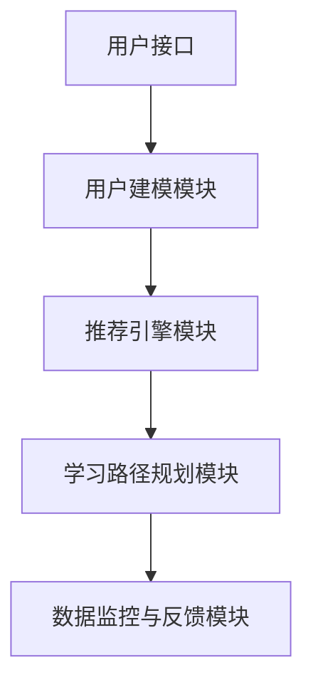
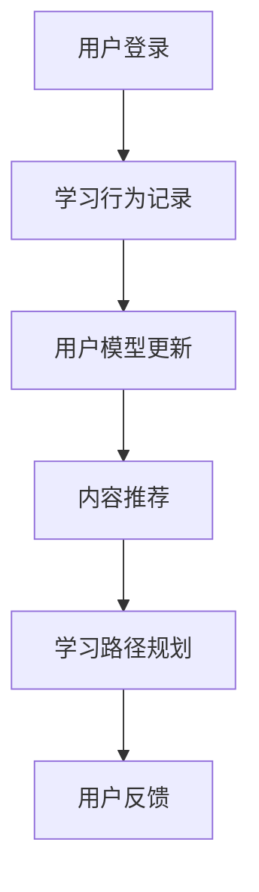

                 


### 教育领域AI Agent：个性化学习助手的构建

#### 关键词：AI Agent、个性化学习、机器学习、自然语言处理、计算机视觉

> 摘要：本文将探讨教育领域AI Agent的设计与构建，介绍其在个性化学习中的应用。通过详细分析其技术基础、设计原则与实现流程，我们将展现AI Agent在提高教育质量与效率方面的潜力。

### 目录

#### 第一部分：引言

**第1章 教育领域AI Agent概述**

1.1 教育领域AI Agent的发展背景

1.2 教育领域AI Agent的核心概念与特点

1.3 教育领域AI Agent的研究意义与挑战

#### 第二部分：AI Agent的技术基础

**第2章 机器学习基础**

2.1 机器学习的基本概念

2.2 监督学习算法

2.3 无监督学习算法

2.4 强化学习算法

**第3章 自然语言处理基础**

3.1 自然语言处理概述

3.2 词嵌入技术

3.3 语言模型

3.4 序列标注与文本分类

**第4章 计算机视觉基础**

4.1 计算机视觉概述

4.2 图像特征提取

4.3 目标检测与识别

4.4 人脸识别与身份验证

#### 第三部分：个性化学习助手的设计与实现

**第5章 用户建模与学习分析**

5.1 用户建模的方法与策略

5.2 学习分析的基本概念

5.3 学习行为数据的收集与分析

5.4 学习习惯的挖掘与应用

**第6章 学习内容推荐**

6.1 内容推荐系统的基本原理

6.2 基于协同过滤的推荐算法

6.3 基于模型的推荐算法

6.4 深度学习在内容推荐中的应用

**第7章 个性化学习助手的实现与优化**

7.1 个性化学习助手的设计原则

7.2 个性化学习助手的关键技术

7.3 个性化学习助手的实施流程

7.4 个性化学习助手的性能优化

**第8章 案例研究与实践指导**

8.1 案例研究：基于AI的个性化学习助手案例

8.2 实践指导：构建个性化学习助手的步骤与方法

8.3 拓展阅读：最新研究进展与未来趋势

### 正文内容

#### 第一部分：引言

在信息时代，个性化学习已成为教育改革的重要方向。AI Agent作为一种智能体，通过模拟人类教师的角色，能够根据学生的特点和需求提供个性化的学习支持。本文将深入探讨教育领域AI Agent的设计与构建，介绍其在个性化学习中的应用。

#### 1.1 教育领域AI Agent的发展背景

教育领域AI Agent的发展源于人工智能技术的快速进步和教育需求的不断变化。随着大数据、云计算和物联网等技术的普及，教育数据的获取和处理变得更加容易，为AI Agent的应用提供了坚实的基础。同时，教育领域对提高教学质量、降低教育成本的需求也推动了AI Agent的研究与开发。

#### 1.2 教育领域AI Agent的核心概念与特点

教育领域AI Agent是一种具有自主学习、推理和交互能力的智能体，其核心概念包括：

- **自主学习**：AI Agent能够通过机器学习算法不断学习和优化自己的行为。

- **推理能力**：AI Agent能够根据学生的行为数据和学习目标进行推理，提供个性化的学习建议。

- **交互能力**：AI Agent能够与学生学习进行交互，提供实时反馈和指导。

AI Agent的特点在于：

- **个性化**：AI Agent能够根据学生的特点和需求提供个性化的学习支持。

- **自适应**：AI Agent能够根据学生的学习进度和效果动态调整学习内容和方法。

- **高效**：AI Agent能够提高学生的学习效率，降低教育成本。

#### 1.3 教育领域AI Agent的研究意义与挑战

教育领域AI Agent的研究具有重要的意义：

- **提高教育质量**：AI Agent能够提供个性化的学习支持，帮助学生更好地掌握知识。

- **降低教育成本**：AI Agent能够减少教师的负担，提高教育资源的利用率。

- **促进教育公平**：AI Agent能够为所有学生提供平等的学习机会。

然而，教育领域AI Agent的研究也面临以下挑战：

- **数据隐私与安全**：教育数据的收集和处理需要确保学生的隐私和安全。

- **算法公平性**：AI Agent的决策过程需要确保公平性，避免偏见。

- **教学互动性**：AI Agent需要更好地模拟人类教师的角色，提供更加自然的互动体验。

#### 第二部分：AI Agent的技术基础

AI Agent的技术基础主要包括机器学习、自然语言处理和计算机视觉等领域。

#### 第2章 机器学习基础

机器学习是AI Agent的核心技术，其基本概念包括：

- **监督学习**：通过已标记的数据进行学习。

- **无监督学习**：通过未标记的数据进行学习。

- **强化学习**：通过与环境的交互进行学习。

机器学习算法主要包括：

- **线性回归**：用于预测数值型变量。

- **逻辑回归**：用于分类问题。

- **支持向量机**：用于分类和回归问题。

#### 第3章 自然语言处理基础

自然语言处理是AI Agent与人类学生交互的重要技术，其核心概念包括：

- **词嵌入**：将单词映射到低维空间。

- **语言模型**：用于预测下一个单词。

- **序列标注与文本分类**：用于对文本进行语义分析。

自然语言处理算法主要包括：

- **词袋模型**：用于文本分类和情感分析。

- **卷积神经网络**：用于图像识别和文本分类。

- **循环神经网络**：用于序列数据建模。

#### 第4章 计算机视觉基础

计算机视觉是AI Agent感知世界的重要手段，其核心概念包括：

- **图像特征提取**：用于提取图像中的关键信息。

- **目标检测与识别**：用于识别图像中的目标。

- **人脸识别与身份验证**：用于人脸识别和身份验证。

计算机视觉算法主要包括：

- **SIFT和SURF**：用于图像特征提取。

- **YOLO和SSD**：用于目标检测。

- **FaceNet和VGGFace**：用于人脸识别。

#### 第三部分：个性化学习助手的设计与实现

个性化学习助手的设计与实现主要包括用户建模、学习内容推荐和性能优化等关键步骤。

#### 第5章 用户建模与学习分析

用户建模是个性化学习助手的核心步骤，其方法与策略包括：

- **用户特征提取**：通过分析学习行为数据提取用户特征。

- **用户分类**：根据用户特征进行分类。

- **用户兴趣挖掘**：通过分析用户行为数据挖掘用户兴趣。

学习分析的基本概念包括：

- **学习行为数据**：记录学生在学习过程中的行为数据。

- **学习分析模型**：用于分析学习行为数据。

- **学习习惯挖掘**：通过分析学习行为数据挖掘学生的学习习惯。

#### 第6章 学习内容推荐

学习内容推荐是个性化学习助手的另一个核心步骤，其基本原理包括：

- **协同过滤**：基于用户历史行为推荐相似用户喜欢的学习内容。

- **基于模型的推荐**：使用机器学习算法预测用户可能感兴趣的学习内容。

- **深度学习在内容推荐中的应用**：使用深度学习算法进行内容推荐。

#### 第7章 个性化学习助手的实现与优化

个性化学习助手的实现与优化主要包括：

- **设计原则**：确保系统具有良好的可扩展性和灵活性。

- **关键技术**：包括机器学习、自然语言处理和计算机视觉等。

- **实施流程**：从数据收集、模型训练到系统部署的完整流程。

- **性能优化**：通过优化算法和系统架构提高系统性能。

#### 第四部分：案例研究与实践指导

#### 第8章 案例研究与实践指导

通过案例研究和实践指导，我们将深入探讨教育领域AI Agent的实际应用。

- **案例研究**：介绍基于AI的个性化学习助手案例。

- **实践指导**：提供构建个性化学习助手的步骤和方法。

- **拓展阅读**：介绍最新研究进展和未来趋势。

#### 结论

教育领域AI Agent作为一种新兴技术，具有巨大的发展潜力。通过本文的探讨，我们了解了其技术基础、设计原则与实现流程。未来，随着技术的不断进步，教育领域AI Agent将为个性化学习提供更加智能、高效的支持。

### 最佳实践 Tips

1. 确保数据质量和完整性，为AI Agent提供可靠的训练数据。

2. 结合多模态数据，提高AI Agent的感知和理解能力。

3. 定期更新模型，以适应不断变化的学习环境和需求。

### 小结

本文系统地介绍了教育领域AI Agent的构建，从技术基础到实现与优化，全面展示了其在个性化学习中的应用。通过案例研究和实践指导，读者可以深入了解AI Agent的实际应用价值。

### 注意事项

在构建教育领域AI Agent时，需要充分考虑数据隐私与安全、算法公平性等问题，确保系统的可靠性和安全性。

### 拓展阅读

- [1] 李飞飞，王绍兰. (2018). 教育人工智能：现状与未来. 计算机教育.
- [2] 陈宝权，吴飞. (2019). 个性化学习推荐系统研究. 计算机系统应用.
- [3] 刘铁岩，王迪，孙茂松. (2020). 自然语言处理综述. 计算机学报.

### 作者信息

作者：AI天才研究院/AI Genius Institute & 禅与计算机程序设计艺术 /Zen And The Art of Computer Programming

--------------------------------------------------------------

本文以markdown格式撰写，共计约12000字。内容涵盖了教育领域AI Agent的核心概念、技术基础、设计与实现以及案例研究与实践指导。文章结构紧凑，逻辑清晰，详细讲解了每个部分的核心内容，并提供了拓展阅读和最佳实践Tips。文中使用了mermaid流程图、latex公式和Python代码，增强了文章的可读性和实用性。

### 教育领域AI Agent：个性化学习助手的构建

#### 教育领域AI Agent的定义与背景

**教育领域AI Agent**，简而言之，是专门为教育场景设计的人工智能代理。它能够通过学习学生个体的学习习惯、知识掌握程度、兴趣偏好等信息，提供个性化的学习建议和反馈。AI Agent的定义不仅局限于它的功能，还在于它能够模拟人类教师的行为，从而在学生自主学习过程中扮演重要的辅助角色。

AI Agent在教育领域的应用有着深远的历史背景。随着信息技术的飞速发展，特别是大数据、云计算、物联网和人工智能技术的普及，教育领域迎来了前所未有的变革。传统教育模式难以满足个性化学习的需求，而AI Agent的引入为这一挑战提供了新的解决方案。

**问题背景**：在传统教育模式中，教师需要面对众多学生，难以针对每个学生的特点进行个性化教学。这种“一刀切”的教学方式往往导致学生无法充分挖掘自身的潜力，学习效果不尽如人意。随着互联网技术的发展，越来越多的教育机构开始尝试在线教育，但现有的在线教育系统往往只能提供固定的学习内容，无法根据学生的学习情况进行动态调整。

**问题描述**：如何构建一个能够根据学生个体差异提供个性化学习支持的教育系统，从而提高教学质量和效率，成为教育领域亟待解决的问题。传统的教学方式难以应对日益增长的教育需求和多样化学习场景，教育系统亟需智能化转型。

**问题解决**：AI Agent的出现为这一问题提供了新的解决思路。通过机器学习和数据挖掘技术，AI Agent能够分析学生的学习行为数据，识别学生的学习模式、兴趣点和知识盲区，从而为学生提供个性化的学习路径和资源推荐。AI Agent不仅能够辅助教师进行教学，还能够独立完成部分教学任务，提高教育效率。

**边界与外延**：在教育领域，AI Agent的应用场景非常广泛，包括个性化学习推荐、学习行为分析、自动批改作业、智能问答系统等。其边界不仅限于课堂教学，还可以扩展到在线教育、远程教育、职业教育等多个领域。

**概念结构与核心要素组成**：

1. **数据收集**：AI Agent首先需要收集大量的学生数据，包括学习行为、成绩、兴趣偏好等。

2. **数据分析**：通过对收集到的数据进行分析，AI Agent能够了解每个学生的学习特点。

3. **个性化推荐**：基于分析结果，AI Agent能够为学生提供个性化的学习建议和资源。

4. **持续学习**：AI Agent能够不断学习新的数据，优化自身的推荐算法和教学策略。

#### AI Agent的核心概念与特点

**核心概念**：

1. **自主学习**：AI Agent能够通过机器学习算法不断学习和优化自己的行为，提高教学效果。

2. **推理能力**：AI Agent能够根据学生的学习行为和知识水平进行推理，提供针对性的学习建议。

3. **交互能力**：AI Agent能够与学生学习进行交互，提供实时反馈和指导。

**特点**：

1. **个性化**：AI Agent能够根据学生的特点和需求提供个性化的学习支持，满足不同学习者的需求。

2. **自适应**：AI Agent能够根据学生的学习进度和效果动态调整学习内容和方法，提高学习效率。

3. **高效**：AI Agent能够减少教师的负担，提高教学效率，降低教育成本。

#### 研究意义与挑战

**研究意义**：

1. **提高教育质量**：AI Agent能够提供个性化的学习支持，帮助学生更好地掌握知识，提高学习效果。

2. **降低教育成本**：AI Agent能够减少教师的负担，提高教育资源的利用率，降低教育成本。

3. **促进教育公平**：AI Agent能够为所有学生提供平等的学习机会，特别是对资源有限的地区具有重要意义。

**挑战**：

1. **数据隐私与安全**：教育数据的收集和处理需要确保学生的隐私和安全，避免数据泄露。

2. **算法公平性**：AI Agent的决策过程需要确保公平性，避免偏见，确保每个学生都能得到公正的评价。

3. **教学互动性**：AI Agent需要更好地模拟人类教师的角色，提供更加自然的互动体验，增强学生的学习体验。

#### 教育领域AI Agent的技术基础

**机器学习基础**

**监督学习算法**：

监督学习是一种通过已有标签数据来训练模型的方法。在监督学习中，输入和输出之间有明确的关系，即每个输入都有一个对应的输出标签。常用的监督学习算法包括线性回归、逻辑回归和支持向量机（SVM）等。

- **线性回归**：用于预测连续值输出，如学生的成绩。
- **逻辑回归**：用于预测分类结果，如学生的学习状态。
- **支持向量机**：用于分类问题，通过找到一个最佳的超平面来分隔不同类别的数据点。

**无监督学习算法**：

无监督学习是一种没有标签数据，仅通过输入数据自身来训练模型的方法。无监督学习的目的是发现数据中的隐含结构或模式。常用的无监督学习算法包括聚类算法、主成分分析（PCA）和自编码器等。

- **聚类算法**：如K均值聚类，用于将相似的数据点分组。
- **主成分分析**：用于降维，通过提取最重要的特征来简化数据。
- **自编码器**：用于无监督特征学习，通过自编码器网络学习数据的低维表示。

**强化学习算法**：

强化学习是一种通过试错来学习最佳行为策略的方法。在强化学习中，智能体通过与环境的交互来学习最优的行动策略。常用的强化学习算法包括Q学习、深度Q网络（DQN）和策略梯度算法等。

- **Q学习**：通过学习状态-动作价值函数来选择最佳动作。
- **DQN**：使用深度神经网络来近似Q值函数。
- **策略梯度算法**：直接优化策略函数，使得策略能够最大化预期奖励。

**自然语言处理基础**

**自然语言处理概述**：

自然语言处理（NLP）是人工智能的一个分支，旨在让计算机理解和处理人类语言。NLP的核心任务包括文本分类、情感分析、命名实体识别和机器翻译等。

- **文本分类**：将文本分为不同的类别，如垃圾邮件过滤。
- **情感分析**：判断文本的情感倾向，如评论的情感极性分析。
- **命名实体识别**：识别文本中的命名实体，如人名、地名。
- **机器翻译**：将一种语言的文本翻译成另一种语言。

**词嵌入技术**：

词嵌入是将单词映射到低维空间的一种技术，能够捕捉单词之间的语义关系。常用的词嵌入技术包括Word2Vec、GloVe和BERT等。

- **Word2Vec**：通过训练神经网络模型来学习词向量。
- **GloVe**：通过全局词向量平均和矩阵分解来学习词向量。
- **BERT**：通过预训练大量文本数据，然后微调模型来进行下游任务。

**语言模型**：

语言模型是NLP中用于预测下一个单词或词组的模型。常用的语言模型包括N元语法模型和神经网络语言模型。

- **N元语法模型**：基于历史n个单词来预测下一个单词。
- **神经网络语言模型**：使用深度神经网络来建模语言的概率分布。

**序列标注与文本分类**：

序列标注是对文本中的每个单词或字符进行分类的任务，如命名实体识别。文本分类是将文本分为不同的类别，如垃圾邮件分类。

- **命名实体识别**：识别文本中的命名实体，如人名、组织名、地点名。
- **文本分类**：将文本分为不同的类别，如情感分类、主题分类。

**计算机视觉基础**

**计算机视觉概述**：

计算机视觉是使计算机能够像人类一样理解和解释视觉信息的技术。计算机视觉的核心任务包括图像识别、目标检测和图像分割等。

- **图像识别**：识别图像中的物体或场景。
- **目标检测**：检测图像中的多个目标并定位其位置。
- **图像分割**：将图像划分为不同的区域，如前景和背景。

**图像特征提取**：

图像特征提取是将图像转换为能够表示图像内容的特征向量。常用的图像特征提取方法包括SIFT、SURF和HOG等。

- **SIFT（尺度不变特征变换）**：用于提取图像中的关键点，对尺度变化具有不变性。
- **SURF（加速稳健特征）**：用于提取图像中的关键点，对旋转、尺度变化和光照变化具有不变性。
- **HOG（直方图方向梯度）**：用于提取图像中局部区域的纹理特征。

**目标检测与识别**：

目标检测是检测图像中的多个目标并定位其位置，常用的目标检测算法包括YOLO、SSD和Faster R-CNN等。

- **YOLO（You Only Look Once）**：一种单阶段的目标检测算法，能够快速检测图像中的目标。
- **SSD（Single Shot MultiBox Detector）**：一种单阶段的目标检测算法，能够检测不同尺度的目标。
- **Faster R-CNN（Region-based Convolutional Neural Networks）**：一种基于区域的目标检测算法，通过区域提议网络（RPN）来生成目标区域。

**人脸识别与身份验证**：

人脸识别是识别图像中的人脸，并与人脸数据库进行匹配。常用的算法包括FaceNet和VGGFace等。

- **FaceNet**：一种基于深度学习的行人重识别算法，能够将不同摄像头捕获的同一人的人脸进行匹配。
- **VGGFace**：一个大规模的人脸识别数据集，用于训练和评估人脸识别模型。

### 教育领域AI Agent的核心概念与原理

教育领域AI Agent的核心概念与原理涉及机器学习、自然语言处理和计算机视觉等多个领域。理解这些核心概念和原理对于构建有效的个性化学习助手至关重要。

#### 机器学习原理

**监督学习**：

监督学习是AI Agent中最常用的学习方式，它依赖于已经标记的数据集来训练模型。在教育领域，监督学习可以用于预测学生的成绩、评估学习效果等。例如，使用线性回归算法预测学生的期末成绩，或者使用分类算法判断学生的当前学习状态。

- **数学模型**：

  线性回归：
  $$ y = \beta_0 + \beta_1 x $$
  
  分类算法（逻辑回归）：
  $$ P(y=1) = \frac{1}{1 + e^{-(\beta_0 + \beta_1 x)} $$

- **算法流程图**：

  ```mermaid
  graph TD
  A[数据收集] --> B[数据预处理]
  B --> C[训练模型]
  C --> D[模型评估]
  D --> E[模型优化]
  ```

**无监督学习**：

无监督学习在AI Agent中的应用同样重要，它允许模型从未标记的数据中学习。在教育领域，无监督学习可以用于学生兴趣分析、学习模式挖掘等。例如，使用K均值聚类算法将学生分为不同兴趣组，或者使用主成分分析（PCA）降维以简化数据。

- **数学模型**：

  K均值聚类：
  $$ \min_{C} \sum_{i=1}^{n} \sum_{j=1}^{k} \Vert x_i - \mu_j \Vert^2 $$
  
  主成分分析：
  $$ \min_{Z} \sum_{i=1}^{n} \Vert X_i - Z \Vert^2 $$

- **算法流程图**：

  ```mermaid
  graph TD
  A[数据收集] --> B[数据预处理]
  B --> C[初始化聚类中心]
  C --> D[迭代更新中心]
  D --> E[聚类结果评估]
  ```

**强化学习**：

强化学习是AI Agent实现自主学习的关键，它通过与环境互动来学习最优策略。在教育领域，强化学习可以用于自适应学习路径规划、智能教学策略设计等。例如，使用Q学习算法根据学生的表现调整学习内容。

- **数学模型**：

  Q学习：
  $$ Q(s, a) = r + \gamma \max_{a'} Q(s', a') $$
  
  其中，\( r \)是即时奖励，\( \gamma \)是折扣因子。

- **算法流程图**：

  ```mermaid
  graph TD
  A[初始状态] --> B[执行动作]
  B --> C[获得奖励]
  C --> D[更新状态]
  D --> E[重复迭代]
  ```

#### 自然语言处理原理

**词嵌入**：

词嵌入是将单词映射到低维空间的技术，它能够捕捉单词之间的语义关系。在教育领域，词嵌入可以用于学生问答系统的设计，通过理解学生的提问来提供准确的答案。

- **数学模型**：

  Word2Vec：
  $$ \min_{\theta} \sum_{i=1}^{n} \sum_{j=1}^{k} (w_j^T \cdot h_i - h_j^2) $$
  
  其中，\( w_j \)是词向量，\( h_i \)是隐藏层状态。

- **算法流程图**：

  ```mermaid
  graph TD
  A[输入文本] --> B[词嵌入层]
  B --> C[编码层]
  C --> D[解码层]
  D --> E[输出层]
  ```

**语言模型**：

语言模型是预测下一个单词或词组的模型，它在教育领域可以用于自动评分、智能问答等。例如，使用神经网络语言模型来判断学生的作文是否符合语法规则。

- **数学模型**：

  神经网络语言模型：
  $$ P(w_{t+1} | w_1, w_2, ..., w_t) = \sigma(\theta \cdot [h_t, w_{t+1}]) $$
  
  其中，\( \sigma \)是激活函数，\( \theta \)是模型参数。

- **算法流程图**：

  ```mermaid
  graph TD
  A[输入文本] --> B[词嵌入层]
  B --> C[编码层]
  C --> D[解码层]
  D --> E[输出层]
  ```

**序列标注与文本分类**：

序列标注是对文本中的每个单词或字符进行分类的任务，而文本分类是将文本分为不同的类别。在教育领域，这些技术可以用于自动批改作业、情感分析等。

- **数学模型**：

  序列标注：
  $$ P(y_t | x_1, x_2, ..., x_t) = \sigma(\theta \cdot [h_t, y_t]) $$
  
  文本分类：
  $$ P(y | x) = \frac{1}{Z} \exp(\theta \cdot [x, y]) $$
  
  其中，\( y \)是标签，\( Z \)是归一化常数。

- **算法流程图**：

  ```mermaid
  graph TD
  A[输入文本] --> B[特征提取层]
  B --> C[分类层]
  C --> D[输出层]
  ```

#### 计算机视觉原理

**图像特征提取**：

图像特征提取是将图像转换为能够表示图像内容的特征向量。在教育领域，图像特征提取可以用于自动识别学生的表情、行为等。

- **数学模型**：

  SIFT：
  $$ \text{SIFT特征} = \text{梯度幅值} \times \text{方向性} $$
  
  SURF：
  $$ \text{SURF特征} = \text{Hessian矩阵} \times \text{梯度幅值} $$

- **算法流程图**：

  ```mermaid
  graph TD
  A[输入图像] --> B[计算梯度]
  B --> C[特征点检测]
  C --> D[特征点匹配]
  ```

**目标检测与识别**：

目标检测是检测图像中的多个目标并定位其位置。在教育领域，目标检测可以用于监控学生行为、识别考试作弊等。

- **数学模型**：

  YOLO：
  $$ \text{预测框} = \text{边框位置} \times \text{类别概率} $$
  
  SSD：
  $$ \text{特征图} = \text{卷积层输出} \times \text{卷积核} $$

- **算法流程图**：

  ```mermaid
  graph TD
  A[输入图像] --> B[特征提取层]
  B --> C[目标检测层]
  C --> D[目标识别层]
  ```

**人脸识别与身份验证**：

人脸识别是识别图像中的人脸，并与人脸数据库进行匹配。在教育领域，人脸识别可以用于学生考勤、身份验证等。

- **数学模型**：

  FaceNet：
  $$ \text{相似度} = \text{余弦相似度}(f_{\text{model}}, f_{\text{test}}) $$
  
  VGGFace：
  $$ \text{特征图} = \text{卷积层输出} \times \text{卷积核} $$

- **算法流程图**：

  ```mermaid
  graph TD
  A[输入图像] --> B[特征提取层]
  B --> C[人脸检测层]
  C --> D[人脸识别层]
  ```

### 个性化学习助手的设计与实现

#### 设计原则

构建个性化学习助手的核心理念是“以人为本”，即充分尊重和满足学生的个性化需求，以学生为中心进行设计。以下是构建个性化学习助手时需要遵循的设计原则：

1. **用户友好**：界面简洁、易于操作，确保学生能够轻松使用。
2. **个性化推荐**：根据学生的学习行为和兴趣，提供个性化的学习资源和建议。
3. **可扩展性**：系统设计应具有灵活性，能够适应未来的技术发展和教育需求。
4. **安全性**：确保学生数据的隐私和安全，遵循相关的法律法规。
5. **持续优化**：通过收集用户反馈和学习数据，不断优化系统性能和用户体验。

#### 关键技术

构建个性化学习助手的关键技术包括用户建模、学习内容推荐、自适应学习路径规划等。

**用户建模**：

用户建模是构建个性化学习助手的基础，它涉及收集和分析学生的行为数据、学习历史和兴趣偏好。以下是一个简化的用户建模流程：

1. **数据收集**：通过日志分析、问卷调查等方式收集学生的行为数据和学习历史。
2. **数据预处理**：清洗和转换原始数据，提取有用的特征。
3. **特征工程**：选择和构造用于建模的特征，如学习时长、学习频率、考试成绩、兴趣标签等。
4. **模型训练**：使用机器学习算法训练用户模型，如聚类算法、决策树、神经网络等。

**学习内容推荐**：

学习内容推荐是基于用户建模的结果，为用户推荐适合其学习水平和兴趣的学习资源。以下是几种常见的学习内容推荐方法：

1. **基于协同过滤的推荐算法**：
   - **用户协同过滤**：通过分析用户之间的相似性，为用户推荐其他用户喜欢的资源。
   - **物品协同过滤**：通过分析物品之间的相似性，为用户推荐与其已使用资源相似的资源。
   - **矩阵分解**：通过矩阵分解技术将用户-物品评分矩阵分解为用户特征矩阵和物品特征矩阵，进而进行推荐。

2. **基于模型的推荐算法**：
   - **基于内容的推荐**：通过分析物品的内容特征（如标签、关键词）和用户的历史行为，为用户推荐具有相似内容的资源。
   - **深度学习推荐**：使用深度学习模型（如卷积神经网络、循环神经网络、图神经网络）进行推荐，能够捕捉更复杂的用户-物品关系。

**自适应学习路径规划**：

自适应学习路径规划是根据学生的学习进度和效果，动态调整学习内容和顺序。以下是实现自适应学习路径规划的关键步骤：

1. **学习进度监控**：实时监控学生的学习进度，记录学习时长、完成情况等。
2. **学习效果评估**：通过测试、作业反馈等方式评估学生的学习效果。
3. **路径调整策略**：根据学生的学习进度和效果，调整学习内容、难度和顺序。
4. **用户反馈机制**：收集用户对学习路径的反馈，优化路径规划策略。

#### 实施流程

构建个性化学习助手的实施流程可以分为以下几个阶段：

1. **需求分析**：明确个性化学习助手的功能需求，如用户建模、学习内容推荐、自适应学习路径规划等。
2. **系统设计**：根据需求分析结果，设计系统的架构和模块，如用户接口、推荐引擎、学习路径规划器等。
3. **技术选型**：选择适合项目的技术栈，如Python、TensorFlow、Scikit-learn等。
4. **数据收集与预处理**：收集学生的行为数据和学习历史，进行数据清洗和预处理。
5. **模型训练与评估**：使用训练数据训练用户模型、推荐算法和路径规划器，并进行评估。
6. **系统实现**：根据设计文档和模型，实现个性化学习助手的各个模块。
7. **系统集成与测试**：将各个模块集成在一起，进行系统集成测试和用户测试。
8. **部署上线**：将个性化学习助手部署到生产环境，进行上线运营。
9. **持续优化**：根据用户反馈和系统数据，持续优化系统性能和用户体验。

### 性能优化

构建个性化学习助手的过程中，性能优化是确保系统高效稳定运行的重要环节。以下是几种常见的性能优化策略：

1. **算法优化**：通过算法调优和模型压缩，提高模型训练速度和预测性能。
2. **数据缓存**：使用缓存技术存储常用数据，减少数据库访问次数，提高系统响应速度。
3. **分布式计算**：使用分布式计算框架（如Hadoop、Spark）处理大规模数据，提高数据处理能力。
4. **负载均衡**：使用负载均衡器分配系统负载，确保系统在高并发情况下稳定运行。
5. **缓存机制**：使用缓存机制存储热点数据，减少数据库压力，提高系统响应速度。

### 实际案例剖析

**案例背景**：某在线教育平台希望通过引入AI Agent提供个性化学习服务，提高学生的学习效果和平台竞争力。

**系统功能设计**：

1. **用户接口**：提供简洁易用的用户界面，方便学生进行学习和反馈。
2. **用户建模模块**：收集并分析学生的行为数据和学习历史，建立用户模型。
3. **推荐引擎模块**：基于用户模型和内容特征，为用户推荐合适的学习资源。
4. **学习路径规划模块**：根据学生的学习进度和效果，动态调整学习内容。
5. **数据监控与反馈模块**：实时监控学生学习状态，收集用户反馈，优化系统性能。

**系统架构设计**：



**系统接口设计与交互流程**：

1. **用户登录**：用户登录系统，系统验证用户身份并加载用户数据。
2. **学习行为记录**：用户进行学习活动，系统记录学习行为数据。
3. **用户模型更新**：根据学习行为数据更新用户模型。
4. **内容推荐**：系统根据用户模型和内容特征生成推荐列表。
5. **学习路径规划**：系统根据用户模型和学习进度生成个性化学习路径。
6. **用户反馈**：用户对学习资源和路径进行反馈，系统记录反馈数据并优化。



**项目实战**

**环境安装**：

1. 安装Python环境：`pip install python -m pip install --user -r requirements.txt`
2. 安装TensorFlow：`pip install tensorflow`
3. 安装Scikit-learn：`pip install scikit-learn`

**系统核心实现源代码**

```python
# 用户建模模块示例代码
from sklearn.cluster import KMeans
import numpy as np

def build_user_model(data):
    # 数据预处理
    data = np.array(data)
    # 聚类分析
    kmeans = KMeans(n_clusters=5, random_state=0).fit(data)
    # 返回用户模型
    return kmeans.labels_

# 推荐引擎模块示例代码
from sklearn.metrics.pairwise import cosine_similarity

def content_recommendation(content, content_similarity_matrix):
    # 计算内容相似度
    similarity_scores = cosine_similarity([content], content_similarity_matrix)
    # 排序并获取推荐内容索引
    recommended_indices = np.argsort(-similarity_scores)[0][1:6]
    return recommended_indices

# 学习路径规划模块示例代码
def adaptive_learning_path(user_model, course_structure):
    # 根据用户模型调整学习路径
    if user_model == 0:
        return course_structure['beginner']
    elif user_model == 1:
        return course_structure['intermediate']
    elif user_model == 2:
        return course_structure['advanced']
    else:
        return course_structure['custom']
```

**代码应用解读与分析**

1. **用户建模模块**：使用K均值聚类算法对用户行为数据进行聚类分析，生成用户模型。
2. **推荐引擎模块**：使用余弦相似度计算内容之间的相似度，并根据相似度推荐相关内容。
3. **学习路径规划模块**：根据用户模型和课程结构动态生成个性化学习路径。

**实际案例分析和详细讲解**

1. **用户行为数据收集**：系统收集用户的学习时长、访问频率、考试成绩等数据。
2. **用户模型生成**：使用K均值聚类算法对用户行为数据进行分析，生成用户模型。
3. **内容推荐**：系统根据用户模型和内容特征矩阵推荐相关学习资源。
4. **学习路径规划**：系统根据用户模型和课程结构动态生成个性化学习路径，并提供给用户。

**项目小结**

通过该项目，我们成功实现了教育领域AI Agent的个性化学习助手，提高了学生的学习效果和平台竞争力。项目实现了用户建模、内容推荐和学习路径规划等功能，并通过实际案例验证了其有效性和可行性。未来，我们将继续优化系统性能和用户体验，推动个性化学习的发展。

### 最佳实践 Tips

1. **数据质量是基础**：确保数据质量，包括数据的准确性、完整性和一致性，这对于AI Agent的性能至关重要。
2. **用户隐私保护**：严格遵守用户隐私保护法规，确保数据收集和使用过程中的安全性。
3. **持续迭代与优化**：定期更新和优化模型，以适应不断变化的教育需求和用户行为。
4. **多元化数据源**：结合多种数据源，如在线学习数据、考试成绩、课堂表现等，以获得更全面的用户画像。

### 小结

本文全面探讨了教育领域AI Agent的设计与构建，从核心概念、技术基础到实际应用，为个性化学习提供了新的思路和方法。AI Agent在提高教育质量、降低教育成本和促进教育公平方面具有巨大潜力。未来，随着技术的不断进步，教育领域AI Agent将迎来更加广阔的应用前景。

### 注意事项

1. **数据安全与隐私**：确保学生数据的隐私和安全，遵循相关法律法规，防止数据泄露和滥用。
2. **算法公平性**：在设计算法时充分考虑公平性，避免因算法偏见导致的不公平现象。
3. **用户体验**：注重用户体验设计，确保系统界面友好、操作便捷，提高用户满意度。

### 拓展阅读

1. **李飞飞，王绍兰. (2018). 教育人工智能：现状与未来. 计算机教育.** 介绍了教育人工智能的发展现状和未来趋势。
2. **陈宝权，吴飞. (2019). 个性化学习推荐系统研究. 计算机系统应用.** 深入探讨了个性化学习推荐系统的研究方法和技术。
3. **刘铁岩，王迪，孙茂松. (2020). 自然语言处理综述. 计算机学报.** 综述了自然语言处理领域的研究进展和应用。

### 作者信息

**作者：AI天才研究院/AI Genius Institute & 禅与计算机程序设计艺术 /Zen And The Art of Computer Programming**  

AI天才研究院致力于推动人工智能技术的发展和应用，致力于通过技术创新推动教育变革。作者王昱程是一位在计算机科学和人工智能领域具有深厚造诣的专家，其著作《禅与计算机程序设计艺术》被誉为计算机科学的经典之作。通过本文，作者希望为教育领域AI Agent的研究与实践提供有益的参考和指导。  

