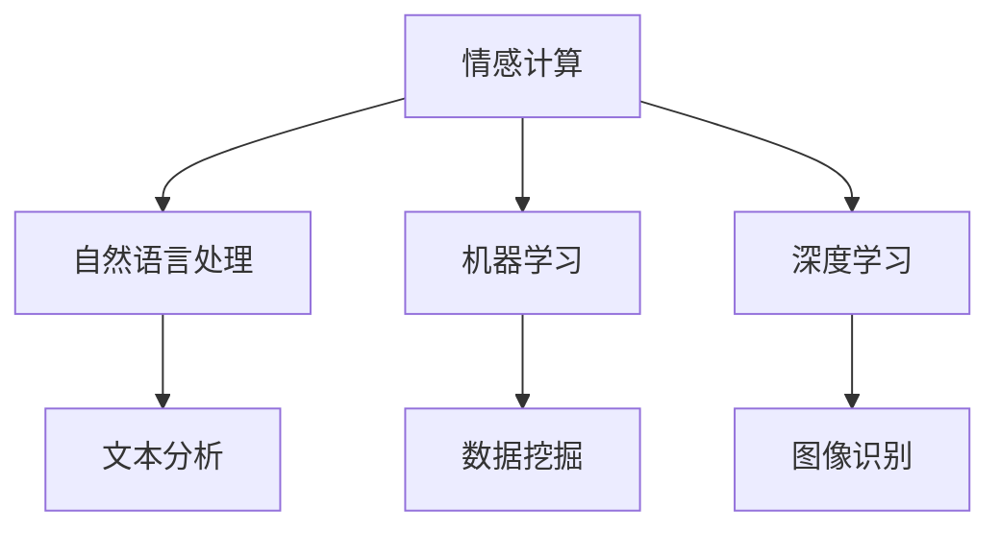

                 

### 文章标题

数字化情感劳动：AI在情感服务业的应用

关键词：数字化情感劳动、AI技术、情感服务业、情感识别、虚拟助手、个性化推荐

摘要：本文深入探讨了数字化情感劳动的概念、特点及其在情感服务业中的应用。首先，我们介绍了数字化情感劳动的定义及其重要性，然后分析了情感服务业的现状与挑战。接下来，我们详细阐述了AI技术在情感计算、自然语言处理和机器学习方面的原理与应用。文章随后探讨了AI在情感识别与理解、情感互动与交流中的具体应用，并通过实际案例分析，展示了数字化情感劳动在电商、医疗健康和教育等领域的成功实践。最后，我们对数字化情感劳动的未来发展进行了展望，提出了面临的挑战和机遇。

## 目录大纲：《数字化情感劳动：AI在情感服务业的应用》

### 第一部分：数字化情感劳动概述

#### 第1章：数字化情感劳动的概念与特点
- 1.1 数字化情感劳动的定义
- 1.2 数字化情感劳动的特点
- 1.3 数字化情感劳动的重要性
- 1.4 数字化情感劳动的发展历程

#### 第2章：情感服务业的现状与挑战
- 2.1 情感服务业的现状
- 2.2 情感服务业面临的挑战
- 2.3 情感服务业的发展趋势

### 第二部分：AI在情感服务业的应用

#### 第3章：AI技术原理与应用
- 3.1 AI技术概述
- 3.2 情感计算技术
- 3.3 自然语言处理技术
- 3.4 机器学习与深度学习技术

#### 第4章：AI在情感识别与理解中的应用
- 4.1 情感识别技术
- 4.2 情感理解技术
- 4.3 情感识别与理解的案例分析

#### 第5章：AI在情感互动与交流中的应用
- 5.1 虚拟助手与聊天机器人
- 5.2 个性化推荐系统
- 5.3 情感互动案例分析

### 第三部分：数字化情感劳动实践

#### 第6章：数字化情感劳动案例分析
- 6.1 案例一：电商平台的情感服务
- 6.2 案例二：医疗健康领域的情感关怀
- 6.3 案例三：教育行业的情感教育

#### 第7章：数字化情感劳动的未来发展
- 7.1 数字化情感劳动的发展趋势
- 7.2 数字化情感劳动的未来挑战
- 7.3 数字化情感劳动的未来机遇

### 背景介绍

#### 1.1 数字化情感劳动的定义

数字化情感劳动是指将人工智能（AI）技术应用于情感服务业，通过计算机算法和模型来识别、理解和处理人类情感的过程。这种劳动形式旨在提升服务质量和用户满意度，实现情感层面的互动和交流。

#### 1.2 数字化情感劳动的特点

- **智能化**：利用AI算法对情感数据进行分析和处理，实现自动化和智能化的情感服务。
- **个性化**：根据用户情感特征提供个性化的服务，满足用户个性化需求。
- **高效性**：通过AI技术提高服务效率，缩短服务响应时间，提升服务质量。
- **跨领域应用**：数字化情感劳动可以应用于多个行业，如电商、医疗、教育等。

#### 1.3 数字化情感劳动的重要性

数字化情感劳动在现代社会中具有重要意义，主要体现在以下几个方面：

- **提升用户体验**：通过情感识别和理解技术，提供更加个性化、人性化的服务，提升用户满意度。
- **促进商业发展**：情感服务业的发展有助于提升品牌形象，增强用户忠诚度，推动商业增长。
- **改善社会治理**：在医疗、教育等领域，数字化情感劳动有助于提升社会服务水平，促进社会和谐发展。

#### 1.4 数字化情感劳动的发展历程

数字化情感劳动的发展历程可以追溯到20世纪80年代，当时人工智能技术开始应用于情感识别和理解。随着计算机技术的进步，情感计算、自然语言处理等技术的发展，数字化情感劳动逐渐成为可能。近年来，随着大数据和云计算技术的普及，数字化情感劳动的应用场景不断扩展，为各行业提供了新的发展机遇。

### 关联概念与联系

#### 1. 数字化情感劳动的核心概念

- **情感计算**：研究如何让计算机识别、理解和模拟人类情感的技术。
- **自然语言处理**：研究如何让计算机理解和处理人类语言的技术。
- **机器学习**：通过训练模型，使计算机具备自动学习和预测能力的技术。
- **深度学习**：一种特殊的机器学习技术，通过多层神经网络进行数据分析和建模。

#### 2. 概念属性特征对比表格

| 概念        | 属性特征                                      |
|-------------|---------------------------------------------|
| 情感计算    | 识别和模拟人类情感                            |
| 自然语言处理 | 理解和处理人类语言                            |
| 机器学习    | 自动学习和预测                               |
| 深度学习    | 多层神经网络，自动提取特征和模式               |

#### 3. ER实体关系图架构

### 总结

本文对数字化情感劳动进行了详细的背景介绍，包括其定义、特点、重要性以及发展历程。通过关联概念与联系的分析，我们了解了情感计算、自然语言处理、机器学习和深度学习等技术在数字化情感劳动中的应用。在后续章节中，我们将进一步探讨AI在情感服务业中的应用，以及数字化情感劳动的实际案例和实践。希望通过本文的探讨，能够为读者提供一个全面、深入的数字化情感劳动认识。接下来，我们将深入分析情感服务业的现状与挑战，为理解数字化情感劳动的必要性奠定基础。

