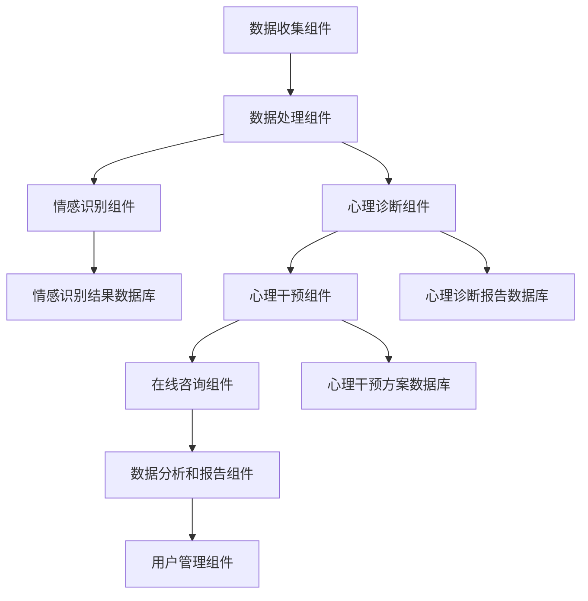

                 

### 引言：数字化时代的心理关怀新篇章

在信息化、数字化的快速推进下，我们的生活方式和社交模式发生了翻天覆地的变化。社交媒体、即时通讯工具以及丰富的在线内容成为了我们日常生活的一部分。然而，这些便利的背后，也带来了一系列心理健康问题。焦虑、抑郁、孤独感等心理健康问题在全球范围内呈现上升趋势，尤其是在年轻人和白领群体中尤为显著。据统计，全球约有3.5亿人患有抑郁症，而每40秒就有一人因自杀失去生命。这一严峻的现实使得心理健康问题不容忽视。

与此同时，我国心理健康问题同样值得关注。根据《中国心理健康报告2020》显示，我国约有16.6%的成年人存在不同程度的抑郁情绪，其中女性比例更高。心理健康问题不仅对个人的生活和工作产生严重影响，还会对社会稳定和经济发展带来负面影响。例如，工作压力导致的情绪问题可能导致工作效率下降，甚至引发职业倦怠；家庭关系中的心理问题可能导致家庭矛盾加剧，影响社会和谐。

在此背景下，如何更好地进行心理关怀，成为了一个亟待解决的问题。传统的心理咨询方式在时间和空间上存在诸多限制，难以满足人们日益增长的心理健康需求。于是，数字疗愈作为一种新型的心理关怀方式应运而生，其中AI心理咨询师作为数字疗愈的重要载体，逐渐崛起，为解决心理健康问题提供了新的思路和途径。

### 2.1 心理健康问题现状

#### 2.1.1 全球心理健康问题概述

心理健康问题在全球范围内具有普遍性和严重性。根据世界卫生组织（WHO）的数据，全球约有4.5亿人患有精神障碍，约占全球总人口的7%。抑郁症、焦虑症、精神分裂症和双相情感障碍等是常见的心理健康问题。抑郁症患者约占全球总人口的3%，而每年因此失去生命的患者多达100万人。此外，焦虑症也影响着全球数亿人，其中约70%的患者没有得到适当的治疗。

心理健康问题的发病率和严重程度在不同国家和地区之间存在差异。发达国家由于生活压力较大、社会支持体系不完善等原因，心理健康问题的发病率较高。例如，美国约有1/5的成年人患有心理健康问题，而英国则有1/6的人患有抑郁症。相比之下，一些发展中国家由于医疗资源匮乏、心理健康知识普及不足等因素，心理健康问题往往被忽视，导致患者得不到及时有效的治疗。

心理健康问题对个人和社会的影响是深远的。个人层面，心理健康问题不仅影响个体的生活质量，还可能导致工作效率降低、学业受挫、人际关系紧张等问题。长期的心理问题甚至可能引发严重的身体健康问题，如心血管疾病、免疫系统功能下降等。社会层面，心理健康问题增加了医疗负担，影响了社会生产力，甚至可能引发社会动荡。例如，抑郁症患者自杀率高，自杀行为不仅给家庭带来极大的痛苦，也会对社会稳定产生负面影响。

综上所述，全球心理健康问题具有普遍性和严重性，对个人和社会均产生了深远的影响。因此，寻找有效的心理关怀方法，提升公众的心理健康水平，已成为全球共同关注的课题。

#### 2.1.2 我国心理健康问题的现状

在我国，心理健康问题同样不容忽视。根据《中国心理健康报告2020》显示，我国约有16.6%的成年人存在不同程度的抑郁情绪，其中女性比例更高，达到20.4%。此外，焦虑症、强迫症、社交恐怖症等心理障碍的发病率也在逐年上升。大学生和白领群体是心理健康问题的高发人群，其中大学生心理健康问题的发病率高达20%-30%，而白领群体的心理健康问题则与其高压力、快节奏的工作环境密切相关。

我国心理健康问题的现状可以从以下几个方面进行分析：

1. **心理健康知识的普及度**：尽管心理健康问题日益受到关注，但公众对心理健康知识的了解仍然不足。许多人对心理障碍存在误解，认为心理问题只是个人的弱点或情绪问题，而不是需要专业治疗的疾病。这种观念导致许多人不愿寻求帮助，甚至延误了治疗的最佳时机。

2. **心理健康服务资源的分布**：我国心理健康服务资源分布不均衡，尤其是农村和偏远地区的心理健康服务资源更为匮乏。城市地区相对较为完善的医疗体系和心理咨询服务，使得城市居民更容易获得心理健康支持。然而，农村地区由于缺乏专业的心理医生和心理咨询师，心理健康问题的解决率较低。

3. **心理健康服务的可及性**：尽管我国在一些大城市已经建立了较为完善的心理健康服务体系，但整体来看，心理健康服务的可及性仍然较低。高昂的心理咨询费用和就诊门槛，使得许多有心理健康需求的人望而却步。此外，心理咨询师的数量和素质也难以满足日益增长的需求。

4. **心理健康问题的社会影响**：心理健康问题不仅影响个人的生活和工作，还对社会稳定产生负面影响。例如，职场压力导致的抑郁和焦虑问题，可能导致工作效率下降、团队协作困难；家庭关系中的心理问题，可能导致家庭矛盾加剧，影响子女的成长环境。这些问题若不及时解决，可能会进一步恶化，甚至引发社会问题。

总之，我国心理健康问题现状严峻，需要全社会共同努力，提高心理健康知识普及度，优化心理健康服务资源配置，提升心理健康服务的可及性，以应对日益严峻的心理健康挑战。

#### 2.1.3 心理健康问题的社会影响

心理健康问题不仅对个人生活造成深远影响，也对整个社会产生显著的负面影响。从经济角度分析，心理健康问题增加了医疗费用负担。患有严重心理障碍的人往往需要长期治疗，包括药物治疗、心理治疗和住院治疗等，这些费用对家庭和社会都是一笔巨大的开销。此外，心理健康问题还可能导致劳动力流失。抑郁症、焦虑症等心理障碍患者因病情严重，可能无法正常工作，从而影响工作效率和生产力。

在社会层面，心理健康问题引发的社会问题也日益显现。例如，青少年心理健康问题可能导致校园欺凌、学业挫折，甚至自杀行为。职场中的心理健康问题则可能引发职业倦怠、团队冲突和离职率上升。家庭关系中的心理问题，如夫妻关系紧张、亲子冲突等，可能导致家庭破裂和社会动荡。

此外，心理健康问题还对社会道德和价值观产生负面影响。长期的焦虑、抑郁等心理问题可能导致个体价值观扭曲，对社会产生负面情绪。这不仅影响个人的生活满意度，也削弱了社会的整体幸福感。

总之，心理健康问题的社会影响是多层次、多方面的，亟需社会各界共同努力，提升心理健康服务质量和可及性，以缓解这些问题带来的负面影响。

### 2.2 AI心理咨询师的核心概念

#### 2.2.1 AI心理咨询师的定义

AI心理咨询师，又称人工智能心理咨询师，是指通过人工智能技术，模拟人类心理咨询师的专业技能和思维过程，为用户提供个性化心理咨询服务的人工智能系统。AI心理咨询师并非简单地复制人类心理咨询师的工作，而是利用自然语言处理（NLP）、机器学习、深度学习等技术，从大量的数据中学习、分析和理解用户的情感和心理状态，进而提供针对性的建议和解决方案。

AI心理咨询师的核心目标是通过技术手段，弥补传统心理咨询的不足，如时间和空间的限制、专业心理咨询师的稀缺等，从而实现心理健康服务的普及化和个性化。与传统心理咨询师相比，AI心理咨询师具有更高的效率、更广泛的服务范围和较低的成本，这使得心理健康服务能够更快速、更广泛地覆盖到有需求的人群。

#### 2.2.2 AI心理咨询师的工作原理

AI心理咨询师的工作原理主要依赖于自然语言处理（NLP）、机器学习与深度学习等先进技术。以下是对这些技术的基本解释和AI心理咨询师如何应用这些技术的详细说明。

**自然语言处理（NLP）**：NLP是AI心理咨询师处理和解析用户输入语言的关键技术。NLP技术包括词向量模型、句向量模型和语言模型等。

1. **词向量模型**：如Word2Vec算法，可以将文字转换成向量，使计算机能够理解文字的含义。Word2Vec算法主要有两种模型：CBOW（Continuous Bag of Words）和Skip-gram。
    - **CBOW模型**：通过上下文词（如一个词的邻居词）预测中心词。
    - **Skip-gram模型**：通过中心词预测上下文词。

2. **句向量模型**：如Doc2Vec算法，可以将整段文本转换成向量，从而对文本进行语义分析和情感识别。

3. **语言模型**：如N-gram模型和LSTM（长短期记忆网络）模型，用于预测下一个词或下一句，从而提高文本的理解和生成能力。

**机器学习与深度学习**：这些技术是AI心理咨询师智能决策和个性化服务的基础。

1. **监督学习算法**：通过标注好的数据训练模型，使模型能够识别不同的心理状态。常见的监督学习算法包括决策树、支持向量机（SVM）和随机森林。
    - **决策树**：通过一系列的规则对数据进行分类。
    - **支持向量机（SVM）**：通过找到一个超平面，将不同类别数据分开。
    - **随机森林**：通过构建多个决策树，结合它们的预测结果，提高模型的准确性。

2. **无监督学习算法**：用于发现数据中的模式，如K-均值聚类和自编码器。
    - **K-均值聚类**：将相似的数据点分为多个类别。
    - **自编码器**：通过无监督学习，将数据压缩成较低维度的表示。

**大数据分析与挖掘**：AI心理咨询师利用大数据技术，从海量数据中提取有价值的信息，用于优化服务和提升效果。

1. **关联规则挖掘**：发现数据中的关联关系，用于推荐个性化的咨询内容。
2. **分类算法**：如K-近邻算法（KNN）、逻辑回归和随机森林，用于对用户心理状态进行分类和预测。

通过这些技术的结合，AI心理咨询师能够理解用户的语言、情感和心理状态，提供个性化的心理建议和支持。其工作原理可以概括为以下几个步骤：

1. **输入处理**：接收用户的文字或语音输入，通过NLP技术进行解析和语义理解。
2. **情感分析**：利用情感分析技术，判断用户的情绪状态，如高兴、悲伤、焦虑等。
3. **心理状态识别**：通过机器学习和深度学习模型，对用户的情感进行深入分析，识别其心理状态。
4. **建议生成**：基于识别出的心理状态，生成个性化的心理建议和解决方案。
5. **反馈与优化**：根据用户反馈，不断优化咨询策略，提高服务效果。

#### 2.2.3 AI心理咨询师的优势

AI心理咨询师在心理健康服务领域具有显著的优势，使其成为传统心理咨询的重要补充。以下是其主要优势：

1. **高效性**：AI心理咨询师能够同时处理大量用户的咨询请求，无需像传统心理咨询师那样耗费大量时间和精力。这使得心理健康服务能够更快速、更广泛地覆盖到有需求的人群。

2. **可及性**：传统心理咨询往往受限于地理位置和专业心理咨询师的稀缺，而AI心理咨询师通过互联网可以随时随地提供服务，打破了时间和空间的限制，提高了心理健康服务的可及性。

3. **个性化**：AI心理咨询师通过机器学习和深度学习，能够对用户的历史数据和当前输入进行个性化分析，提供量身定制的心理建议，提高了服务的精准度和有效性。

4. **成本效益**：与传统心理咨询师相比，AI心理咨询师的开发和维护成本较低，能够大规模推广，从而降低整体心理健康服务的成本，使更多有需求的人能够负担得起。

5. **连续性**：AI心理咨询师可以全天候运行，无需休息，提供连续的心理健康支持，这对于需要长期心理干预的患者尤为重要。

6. **数据积累与学习**：AI心理咨询师在提供服务的过程中，能够不断积累和存储用户数据，这些数据不仅用于优化现有服务，还可以用于研究和开发新的心理健康解决方案。

总之，AI心理咨询师凭借其高效性、可及性、个性化、成本效益和连续性等优势，正在成为心理健康服务领域的一股重要力量。随着技术的不断进步，AI心理咨询师的应用前景将更加广阔。

#### 2.3 AI心理咨询师的发展历程

AI心理咨询师的发展历程可以追溯到20世纪60年代。当时，心理学家和计算机科学家开始探索如何利用计算机模拟人类思维过程，从而在心理咨询领域发挥作用。以下是对这一历程的详细回顾：

**2.3.1 早期尝试**

在早期，人工智能技术主要集中在符号逻辑和简单的推理系统上。1956年，心理学家Noel Bruhn开发了第一个基于计算机的心理咨询系统“Eliza”，它可以模拟医生与患者之间的对话，使用简单的预设模式回应用户的问题。尽管Eliza的功能非常有限，但它标志着AI在心理咨询领域的首次尝试，并为后来的研究奠定了基础。

**2.3.2 人工智能在心理咨询中的应用**

随着人工智能技术的不断进步，20世纪80年代和90年代，研究人员开始开发更为复杂的心理咨询系统。这些系统利用自然语言处理（NLP）技术，能够更好地理解用户的语言和情感。例如，1997年，哈佛大学开发了一个名为“TARA”的系统，它能够通过邮件进行心理咨询，并为用户提供个性化的建议。

进入21世纪，随着互联网和移动通信技术的普及，AI心理咨询师的应用场景更加多样化。例如，Sensory Robotics公司开发的“Woebot”是一个基于AI的聊天机器人，通过Facebook Messenger为用户提供实时心理咨询服务。此外，DeepMind开发的“MoodGym”利用虚拟现实技术，为用户提供了沉浸式的心理治疗体验。

**2.3.3 当前AI心理咨询师的现状与趋势**

当前，AI心理咨询师已经取得了显著的进展。许多公司和科研机构都在积极开发和推广AI心理咨询系统，包括大型科技公司如谷歌和微软，以及专业心理健康服务公司。AI心理咨询师不仅能够提供情感支持和心理健康教育，还能进行初步的心理健康诊断，并推荐相应的治疗方案。

未来，AI心理咨询师的发展趋势主要包括以下几个方面：

1. **技术深化**：随着NLP、机器学习和深度学习技术的不断进步，AI心理咨询师将能够更准确地理解用户的情感和心理状态，提供更加个性化的服务。

2. **集成多样化服务**：AI心理咨询师将与传统心理咨询师和医疗专家紧密合作，形成一个综合的心理健康服务体系，提供从预防到治疗的全流程服务。

3. **扩展应用场景**：AI心理咨询师将在更多场景中得到应用，如教育、职场和企业健康管理，以应对不同群体的心理健康需求。

4. **隐私保护和伦理问题**：随着AI心理咨询师的应用范围不断扩大，隐私保护和伦理问题将变得越来越重要。如何确保用户数据的安全和隐私，将成为未来研究的重要方向。

总之，AI心理咨询师的发展历程体现了人工智能技术在心理健康服务领域的不断突破和应用拓展。随着技术的进步，AI心理咨询师有望在未来发挥更加重要的作用，为全球心理健康事业作出更大贡献。

#### 2.4 AI心理咨询师的技术基础

AI心理咨询师的技术基础涵盖了自然语言处理（NLP）、机器学习与深度学习、大数据分析与挖掘等多个领域。以下是对这些技术的基本解释以及它们在AI心理咨询师中的应用：

**2.4.1 自然语言处理（NLP）**

自然语言处理是AI心理咨询师的核心技术之一，其主要目标是将人类语言转化为计算机可以理解的形式，并进行语义分析和情感识别。NLP技术包括词向量模型、句向量模型和语言模型等。

1. **词向量模型**：词向量模型是将单词映射到高维空间中的向量，以表示单词的含义和关系。Word2Vec算法是词向量模型的一个典型代表，它通过上下文词来预测中心词，从而生成词向量。Word2Vec算法主要包括CBOW（Continuous Bag of Words）和Skip-gram两种模型。
    - **CBOW模型**：通过上下文词（如一个词的邻居词）预测中心词。
    - **Skip-gram模型**：通过中心词预测上下文词。

2. **句向量模型**：句向量模型是将整段文本转换成向量，从而对文本进行语义分析和情感识别。Doc2Vec算法是句向量模型的一个典型代表，它通过文本的上下文信息生成句向量。

3. **语言模型**：语言模型用于预测下一个词或下一句，从而提高文本的理解和生成能力。N-gram模型和LSTM（长短期记忆网络）模型是语言模型的两种常见形式。
    - **N-gram模型**：通过前n个词预测下一个词。
    - **LSTM模型**：通过记忆和遗忘机制，捕捉长期依赖关系。

**2.4.2 机器学习与深度学习**

机器学习与深度学习是AI心理咨询师智能决策和个性化服务的基础。这些技术通过从数据中学习，使计算机能够识别和预测用户的情感和心理状态。

1. **监督学习算法**：监督学习算法通过标注好的数据训练模型，使模型能够识别不同的心理状态。常见的监督学习算法包括决策树、支持向量机（SVM）和随机森林。
    - **决策树**：通过一系列的规则对数据进行分类。
    - **支持向量机（SVM）**：通过找到一个超平面，将不同类别数据分开。
    - **随机森林**：通过构建多个决策树，结合它们的预测结果，提高模型的准确性。

2. **无监督学习算法**：无监督学习算法用于发现数据中的模式，如K-均值聚类和自编码器。
    - **K-均值聚类**：将相似的数据点分为多个类别。
    - **自编码器**：通过无监督学习，将数据压缩成较低维度的表示。

**2.4.3 大数据分析与挖掘**

大数据分析与挖掘技术用于从海量数据中提取有价值的信息，以优化AI心理咨询师的服务质量和效果。

1. **关联规则挖掘**：关联规则挖掘用于发现数据中的关联关系，用于推荐个性化的咨询内容。

2. **分类算法**：分类算法用于对用户心理状态进行分类和预测。常见的分类算法包括K-近邻算法（KNN）、逻辑回归和随机森林。
    - **K-近邻算法（KNN）**：通过计算数据点之间的相似性，对新的数据进行分类。
    - **逻辑回归**：通过建立概率模型，预测用户的心理状态。
    - **随机森林**：通过构建多个决策树，结合它们的预测结果，提高模型的准确性。

**综合应用**

AI心理咨询师通过综合应用上述技术，能够实现对用户语言的精准理解和情感识别，从而提供个性化的心理建议和解决方案。其工作流程可以概括为以下几个步骤：

1. **输入处理**：接收用户的文字或语音输入，通过NLP技术进行解析和语义理解。
2. **情感分析**：利用情感分析技术，判断用户的情绪状态，如高兴、悲伤、焦虑等。
3. **心理状态识别**：通过机器学习和深度学习模型，对用户的情感进行深入分析，识别其心理状态。
4. **建议生成**：基于识别出的心理状态，生成个性化的心理建议和解决方案。
5. **反馈与优化**：根据用户反馈，不断优化咨询策略，提高服务效果。

通过这些技术的结合，AI心理咨询师能够为用户提供高效、个性化的心理健康服务，满足不断增长的社会需求。

#### 2.5 AI心理咨询师的应用场景

AI心理咨询师在现代社会中的应用场景日益广泛，能够为不同群体提供个性化的心理健康服务。以下是AI心理咨询师在几个典型应用场景中的具体实例和解决方案：

**2.5.1 网络心理咨询**

网络心理咨询是AI心理咨询师最早和最广泛的应用场景之一。通过互联网平台，用户可以随时随地与AI心理咨询师进行在线交流，无需受限于地理位置和时间。例如，Sensory Robotics公司开发的“Woebot”就是一个基于AI的聊天机器人，通过Facebook Messenger和移动应用为用户提供全天候的心理健康支持。用户可以随时发送文本或语音消息，AI心理咨询师会根据对话内容进行情感分析和心理状态识别，并提供针对性的建议和解决方案。

**2.5.2 移动应用心理咨询**

移动应用心理咨询是将AI心理咨询师集成到手机应用程序中，为用户提供便捷的心理健康服务。这种模式特别适合那些无法定期访问心理咨询中心或难以预约心理咨询的人群。例如，Mindstrong公司开发的“Mindstrong Health”应用，利用AI技术分析用户的行为数据，如情绪、心理压力和睡眠质量，提供个性化的心理健康建议和干预措施。用户可以通过应用中的互动游戏和练习，学习如何更好地管理自己的情绪和压力。

**2.5.3 企事业单位心理健康管理**

在企事业单位中，员工的心理健康问题对组织绩效和员工满意度具有重要影响。AI心理咨询师可以为企业提供定制化的心理健康管理服务，帮助员工应对工作压力和心理健康问题。例如，国内一些大型企业已经开始使用基于AI的心理健康平台，为员工提供在线心理咨询服务和心理健康培训。这些平台通过定期心理健康测评和个性化的心理干预，提高员工的心理健康水平，从而提升整体工作效率和团队凝聚力。

**2.5.4 教育领域心理健康支持**

在教育领域，AI心理咨询师可以为学生提供心理健康支持和辅导，帮助他们应对学业压力和人际关系问题。例如，一些学校和教育机构已经引入了AI心理咨询师，通过在线平台为学生提供心理辅导和情绪支持。这些AI心理咨询师可以24小时在线，随时回答学生的疑问，提供情绪调节技巧和心理支持。此外，AI心理咨询师还可以通过分析学生的行为数据和考试成绩，发现潜在的心理健康问题，并及时给予干预。

**2.5.5 公共健康心理健康干预**

在公共卫生领域，AI心理咨询师可以在大规模心理健康干预项目中发挥重要作用。例如，在新冠疫情等公共卫生危机期间，AI心理咨询师可以通过电话热线、在线咨询等方式，为公众提供心理健康支持和心理疏导。这些AI心理咨询师能够快速响应公众的心理健康需求，提供及时的干预和帮助，减轻疫情带来的心理压力。

**2.5.6 家庭健康管理**

家庭健康管理是AI心理咨询师应用的另一个重要领域。家庭是心理健康的基础，通过AI心理咨询师，家庭成员可以随时了解彼此的心理状态，提供相互支持。例如，一些家庭健康平台集成了AI心理咨询师功能，帮助家庭成员进行心理健康评估和干预，提高整体家庭的心理健康水平。

总之，AI心理咨询师的应用场景多样，能够为不同群体提供个性化的心理健康服务。随着技术的不断进步，AI心理咨询师的应用范围将更加广泛，为全球心理健康事业作出更大贡献。

#### 2.6 AI心理咨询师面临的挑战与伦理问题

AI心理咨询师在迅速发展的同时，也面临着一系列挑战和伦理问题。这些问题不仅关系到技术的可行性和效果，也直接影响到用户的隐私保护和心理健康。

**2.6.1 技术挑战**

1. **准确性与可靠性**：AI心理咨询师需要具备高度准确性和可靠性，以便为用户提供有效的心理建议和治疗方案。然而，目前AI心理咨询师在情感识别和心理状态判断方面仍存在一定的误差，特别是在处理复杂和模糊的情感表达时。这需要进一步优化算法和提升数据质量。

2. **个性化**：虽然AI心理咨询师能够根据用户的历史数据和当前输入提供个性化的建议，但如何确保个性化服务的有效性和一致性仍然是一个挑战。特别是在面对不同文化背景和心理需求的用户时，如何实现真正的个性化仍需深入研究。

3. **实时性**：实时性是AI心理咨询师的一个重要特点，但同时也带来技术上的挑战。如何在保证实时响应的同时，确保系统的稳定性和可靠性，避免因延迟或故障而导致用户体验下降，是一个亟待解决的问题。

**2.6.2 伦理问题**

1. **隐私保护**：用户隐私是AI心理咨询师面临的首要伦理问题。心理咨询涉及用户的敏感个人信息，如情绪、心理状态和隐私对话等。如何确保用户数据的存储、传输和使用过程中的安全性和隐私保护，是一个重要的道德和法律责任。

2. **责任归属**：当AI心理咨询师提供的建议或治疗方案导致用户心理或生理问题加剧时，责任归属问题将变得尤为复杂。是责任归咎于开发者、平台运营商，还是用户自身，这需要明确的法律法规和伦理准则来界定。

3. **偏见与歧视**：AI心理咨询师在数据处理和决策过程中可能引入偏见和歧视。例如，如果训练数据中存在性别、种族或文化偏见，AI心理咨询师可能会对特定群体产生不公平的对待。如何避免和纠正这些偏见，确保AI心理咨询师的公平性和无歧视性，是亟待解决的问题。

**2.6.3 发展建议**

1. **技术改进**：加强算法研究，提升AI心理咨询师的准确性和可靠性，特别是在情感识别和心理状态判断方面。同时，优化个性化服务，确保服务的有效性和一致性。

2. **伦理培训与规范**：加强对AI心理咨询师开发者和运营人员的伦理培训，建立严格的隐私保护政策和安全措施，确保用户数据的安全和隐私。

3. **法律法规完善**：制定明确的法律法规，明确责任归属和用户权益保护，为AI心理咨询师的健康发展提供法律保障。

4. **多方协作**：促进政府部门、科研机构、企业和民间组织等多方协作，共同推动AI心理咨询师的发展，提升心理健康服务水平。

总之，AI心理咨询师在心理健康服务领域具有巨大潜力，但也面临诸多挑战和伦理问题。只有通过技术创新、伦理规范和多方协作，才能充分发挥AI心理咨询师的优势，为全球心理健康事业作出更大贡献。

#### 2.7 本章小结

本章详细探讨了AI心理咨询师的核心概念、发展历程、技术基础及其在不同应用场景中的具体应用。首先，我们介绍了AI心理咨询师的定义和工作原理，强调了其通过自然语言处理、机器学习和深度学习等技术实现情感识别和心理状态判断的能力。接着，我们回顾了AI心理咨询师的发展历程，从早期的Eliza系统到如今的多样化应用，展示了这一领域的技术进步和应用拓展。本章还分析了AI心理咨询师的技术基础，包括自然语言处理、机器学习和深度学习等关键技术在其中的应用。此外，我们探讨了AI心理咨询师在不同应用场景中的实际应用，如网络心理咨询、移动应用心理咨询、企事业单位心理健康管理、教育领域心理健康支持、公共健康心理健康干预和家庭健康管理。最后，本章讨论了AI心理咨询师面临的挑战和伦理问题，并提出了相关的发展建议。通过这些讨论，我们可以看到AI心理咨询师在心理健康服务领域的巨大潜力和广阔前景，为全球心理健康事业提供了新的思路和解决方案。

### 第3章：核心概念与联系

心理健康和AI心理咨询师作为两个核心概念，在数字疗愈领域扮演着至关重要的角色。本章节将深入探讨这两个概念，分析其定义、属性、关系，并通过具体案例进行阐述。

#### 3.1 心理健康核心概念

**3.1.1 心理健康的定义**

心理健康是一个多维度的概念，通常涉及情感、认知和行为等方面。根据世界卫生组织（WHO）的定义，心理健康不仅仅是没有心理疾病，而是指个体能够在认知和情感上应对日常生活中的压力，工作产品，为社会做出贡献。

**3.1.2 心理健康的属性**

1. **整体性**：心理健康不仅仅是心理层面的问题，还涉及到生理、社会和环境等多个方面。例如，良好的心理健康状态需要身体健康的支持，也需要社会关系的和谐。

2. **动态性**：心理健康是一个动态过程，会随着时间和环境的变化而变化。个体可能会在特定时期面临更多的压力，从而影响心理健康状态。

3. **相对性**：心理健康状态是相对的，没有绝对的“正常”或“异常”。不同文化和社会背景下，心理健康标准有所不同。

**3.1.3 心理健康与心理健康的关系**

心理健康与心理健康是密不可分的。心理健康是心理健康的前提条件，而心理健康是心理健康的具体表现。一个心理健康的人不仅没有心理疾病，还能够在生活中保持积极、健康的心理状态。例如，一个心理健康的人能够有效地应对压力，保持良好的情绪状态，从而维护和提升整体心理健康水平。

#### 3.2 AI心理咨询师的核心概念

**3.2.1 AI心理咨询师的定义**

AI心理咨询师是指利用人工智能技术，特别是自然语言处理（NLP）、机器学习和深度学习等方法，模拟人类心理咨询师的专业能力，为用户提供心理支持和咨询的人工智能系统。

**3.2.2 AI心理咨询师的属性**

1. **智能性**：AI心理咨询师通过学习和分析用户的数据，能够识别和理解用户的情感和心理状态，提供个性化的建议。

2. **高效性**：AI心理咨询师能够同时处理大量用户的请求，无需休息，提高服务的效率和覆盖面。

3. **个性化**：AI心理咨询师可以根据用户的历史数据和当前输入，提供量身定制的心理支持。

**3.2.3 AI心理咨询师与传统心理咨询师的关系**

AI心理咨询师与传统心理咨询师并非替代关系，而是互补关系。传统心理咨询师具备深厚的人文关怀和专业知识，能够提供深度和个性化的心理支持。而AI心理咨询师则能够通过技术手段，实现心理健康服务的普及化和高效化。例如，AI心理咨询师可以在初步筛查和情感识别方面发挥作用，为传统心理咨询师提供支持和辅助，从而提高整体心理健康服务的质量和效率。

#### 3.3 数字疗愈的概念与联系

数字疗愈是指利用数字技术和人工智能，为用户提供心理健康服务和干预的一种新型模式。其核心概念包括：

1. **心理健康监测**：通过智能设备和应用，实时监测用户的心理健康状态，如情绪、压力和睡眠质量。

2. **个性化干预**：根据用户的监测数据和需求，提供个性化的心理干预和治疗方案。

3. **行为习惯养成**：通过教育、指导和互动，帮助用户建立积极健康的行为习惯，提升整体心理健康水平。

数字疗愈中的AI心理咨询师起着关键作用。它不仅能够实时监测和分析用户的心理状态，提供即时反馈和干预，还能够通过持续的学习和优化，不断提升服务质量和效果。例如，通过自然语言处理技术，AI心理咨询师可以分析用户的语言表达，识别情感状态，从而提供针对性的建议和解决方案。此外，AI心理咨询师还可以利用大数据分析和机器学习技术，预测用户的心理健康趋势，提前采取预防措施。

具体案例：

以“Woebot”为例，这款基于AI的聊天机器人通过NLP技术分析用户的对话内容，识别其情绪和心理状态，并提供个性化的心理建议。例如，当用户表达出焦虑或沮丧的情绪时，“Woebot”会提供放松技巧和积极心态的引导，帮助用户缓解情绪压力。通过这种持续的互动和干预，用户不仅能够获得实时的心理支持，还可以逐步改善心理健康状态。

总之，心理健康和AI心理咨询师是数字疗愈体系中的核心概念。通过深入理解和应用这些概念，我们可以为用户提供更加全面和有效的心理健康服务，助力实现全民心理健康的目标。

#### 3.1.1 NLP算法原理

自然语言处理（NLP）是AI心理咨询师的核心技术之一，它使得计算机能够理解、生成和处理人类语言。NLP算法包括词向量模型、句向量模型和语言模型，以下是对这些算法的详细解释。

**3.1.1.1 词向量模型**

词向量模型是将文本中的单词映射到高维向量空间，以表示单词的含义和关系。Word2Vec算法是词向量模型的一种典型代表，通过上下文信息来预测单词。

1. **Word2Vec算法**

Word2Vec算法包括两个主要模型：CBOW（Continuous Bag of Words）和Skip-gram。

- **CBOW模型**：CBOW模型通过上下文词（即一个词的邻居词）预测中心词。具体来说，算法会取中心词周围的若干个词（如相邻词或随机选择）作为输入，通过这些输入词来预测中心词。例如，对于“我想要一杯咖啡”，输入词可以是“我”、“要”、“一”、“杯”、“咖啡”，预测词是“咖啡”。
- **Skip-gram模型**：Skip-gram模型与CBOW模型相反，它通过中心词预测上下文词。例如，对于“我想要一杯咖啡”，中心词是“咖啡”，输入词可以是“我”、“要”、“一”、“杯”。

2. **其他词向量模型**

- **GloVe模型**：GloVe（Global Vectors for Word Representation）是一种基于全局统计信息的词向量模型，它通过计算单词的共现矩阵来生成词向量。
- **FastText模型**：FastText模型通过引入子词（subword）信息，能够更好地捕捉短词和短语的关系，从而生成更准确的词向量。

**3.1.1.2 句向量模型**

句向量模型是将整段文本转换成向量，以表示文本的语义和情感。以下是一些常见的句向量模型：

1. **Doc2Vec模型**：Doc2Vec模型是基于Word2Vec模型的扩展，它通过将文档视为单词序列，为每个文档生成一个固定长度的向量表示。这种方法能够捕捉文档的语义特征，从而在文本分类、情感分析等任务中发挥作用。

2. **Sent2Vec模型**：Sent2Vec模型专门用于生成句向量，它通过将句子视为词向量序列，通过聚合词向量来生成句向量。这种模型在情感分析和文本分类中具有广泛的应用。

3. **BERT模型**：BERT（Bidirectional Encoder Representations from Transformers）是一种基于Transformer的预训练模型，它通过双向编码的方式生成词和句的向量表示，具有较强的语义理解和情感分析能力。

**3.1.1.3 语言模型**

语言模型用于预测文本中的下一个词或下一句，从而提高文本理解和生成能力。以下是一些常见的语言模型：

1. **N-gram模型**：N-gram模型是最简单的语言模型，它通过统计相邻词（如二元、三元等）的共现概率来预测下一个词。

2. **LSTM模型**：LSTM（长短期记忆网络）是一种循环神经网络，通过记忆和遗忘机制，能够捕捉长期依赖关系。LSTM在文本分类、序列标注等任务中具有广泛应用。

3. **Transformer模型**：Transformer模型是一种基于自注意力机制的深度神经网络，通过多头自注意力机制和前馈神经网络，能够高效处理长文本。BERT、GPT（Generative Pre-trained Transformer）等模型都是基于Transformer的变体，在自然语言处理领域取得了显著的成果。

**3.1.1.4 模型对比与应用**

不同NLP模型在处理不同任务时具有各自的优势。例如，CBOW和Skip-gram模型在词向量生成方面表现良好，适用于文本分类和情感分析；BERT和GPT模型在语义理解和文本生成方面具有优势，适用于问答系统、文本摘要和机器翻译等任务。在实际应用中，可以根据任务需求选择合适的模型，或结合多种模型的优势，实现更好的效果。

通过深入理解和应用NLP算法，AI心理咨询师能够更准确地理解用户的语言和情感，为用户提供有效的心理支持和咨询。未来，随着NLP技术的不断进步，AI心理咨询师将能够更好地应对复杂的语言情境，提升心理健康服务的质量和效果。

#### 4.2 机器学习与深度学习算法

在AI心理咨询师中，机器学习与深度学习算法扮演着至关重要的角色，它们使系统能够通过数据学习，为用户提供个性化的心理建议和解决方案。以下将详细介绍几种主要的机器学习与深度学习算法，包括监督学习算法和无监督学习算法，并讨论其在心理咨询中的应用。

**4.2.1 监督学习算法**

监督学习算法通过已标记的数据训练模型，从而实现对新数据的分类或回归。在AI心理咨询中，监督学习算法常用于情感分析、心理状态分类和心理健康预测等任务。

1. **决策树**

决策树是一种树形结构模型，通过一系列的规则对数据进行分类或回归。决策树通过递归地将数据集划分为子集，直到达到某个终止条件（如节点内所有数据属于同一类别）。决策树在处理简单、直观的分类问题中表现良好，但其模型复杂度和计算效率较低。

2. **支持向量机（SVM）**

支持向量机是一种基于间隔最大化原理的分类算法，通过找到一个最佳的超平面，将不同类别的数据点分开。SVM在处理高维数据和线性不可分问题中具有优势，但在面对复杂非线性问题时，通常需要使用核函数进行转换。

3. **随机森林**

随机森林是一种集成学习方法，通过构建多个决策树，结合它们的预测结果来提高模型的准确性。随机森林具有高泛化能力和鲁棒性，能够处理大规模数据和复杂非线性问题。

**4.2.2 无监督学习算法**

无监督学习算法无需标记数据，旨在发现数据中的隐含模式和结构。在AI心理咨询中，无监督学习算法常用于聚类分析和特征提取，帮助识别用户的心理状态和情感趋势。

1. **K-均值聚类**

K-均值聚类是一种基于距离度量的聚类算法，通过迭代计算将数据划分为K个簇。K-均值聚类简单易实现，但在处理非球形簇和噪声数据时性能较差。

2. **自编码器**

自编码器是一种深度学习模型，通过无监督学习将高维数据压缩到较低维度的表示，从而提取数据的特征信息。自编码器在特征提取和降维方面具有广泛应用，能够提高数据处理的效率和精度。

**4.2.3 应用示例**

以下是一个情感分析的应用示例，使用决策树算法对用户的文本输入进行情感分类。

```python
from sklearn.datasets import load_20newsgroups
from sklearn.model_selection import train_test_split
from sklearn.tree import DecisionTreeClassifier
from sklearn.metrics import classification_report

# 加载数据集
data = load_20newsgroups(subset='all')
X = data.data
y = data.target

# 数据预处理
X_train, X_test, y_train, y_test = train_test_split(X, y, test_size=0.2, random_state=42)

# 构建决策树模型
clf = DecisionTreeClassifier()
clf.fit(X_train, y_train)

# 预测测试集
y_pred = clf.predict(X_test)

# 评估模型性能
print(classification_report(y_test, y_pred))
```

在上面的示例中，我们使用了20个新闻类别的数据集，通过训练决策树模型，对测试集进行情感分类，并使用分类报告评估模型性能。

**4.2.4 总结**

机器学习与深度学习算法在AI心理咨询师中发挥着重要作用，通过监督学习和无监督学习，系统能够从数据中学习，为用户提供个性化的心理健康服务和干预。未来，随着算法的不断创新和优化，AI心理咨询师将能够更准确地识别和理解用户的心理状态，提供更有效的心理支持。

#### 4.3 大数据分析与挖掘算法

大数据分析与挖掘技术在AI心理咨询师中发挥着重要作用，通过对海量数据进行深入分析，提取有价值的信息，为用户提供个性化的心理健康服务和干预。以下将介绍几种常见的大数据分析与挖掘算法，并讨论其在心理咨询中的应用。

**4.3.1 关联规则挖掘**

关联规则挖掘是一种用于发现数据中关联关系的技术，通常用于推荐系统和市场篮子分析。在心理咨询中，关联规则挖掘可以帮助识别不同心理健康问题之间的关联，从而提供更有针对性的干预方案。

1. **Apriori算法**：Apriori算法是最常用的关联规则挖掘算法之一，通过迭代计算支持度和置信度来发现频繁项集。Apriori算法的主要优势是简单易实现，但其缺点是计算复杂度较高，特别是在处理大规模数据时。

2. **Eclat算法**：Eclat（Equivalence Class Clustering and bottom-up Lattice Traversal）算法是一种基于Apriori的改进算法，通过使用更小的数据块来提高计算效率。Eclat算法在处理稀疏数据和高维数据时表现较好。

**4.3.2 分类算法**

分类算法用于将数据分为不同的类别，常用于情感分析、心理健康诊断和预测等任务。以下是一些常见的分类算法：

1. **K-近邻算法（KNN）**：K-近邻算法是一种基于实例的学习方法，通过计算新实例与训练实例之间的距离，选择最近的K个邻居，并根据邻居的类别进行预测。KNN算法简单易实现，对噪声数据具有较强的鲁棒性，但其缺点是计算复杂度较高，尤其是在大规模数据集上。

2. **逻辑回归**：逻辑回归是一种广义线性模型，用于处理二分类问题。逻辑回归通过估计概率模型，将输入特征映射到输出概率，从而进行分类。逻辑回归在处理高维数据和线性可分问题中表现良好。

3. **随机森林**：随机森林是一种基于决策树和随机属性选择（random attribute selection）的集成学习方法，通过构建多个决策树，结合它们的预测结果来提高模型的准确性。随机森林具有高泛化能力和鲁棒性，能够处理大规模数据和复杂非线性问题。

**4.3.3 应用示例**

以下是一个使用K-近邻算法进行情感分类的Python示例：

```python
from sklearn.datasets import load_20newsgroups
from sklearn.model_selection import train_test_split
from sklearn.neighbors import KNeighborsClassifier
from sklearn.metrics import classification_report

# 加载数据集
data = load_20newsgroups(subset='all')
X = data.data
y = data.target

# 数据预处理
X_train, X_test, y_train, y_test = train_test_split(X, y, test_size=0.2, random_state=42)

# 构建KNN分类器
knn = KNeighborsClassifier(n_neighbors=3)
knn.fit(X_train, y_train)

# 预测测试集
y_pred = knn.predict(X_test)

# 评估模型性能
print(classification_report(y_test, y_pred))
```

在上面的示例中，我们使用了20个新闻类别的数据集，通过训练KNN分类器，对测试集进行情感分类，并使用分类报告评估模型性能。

**4.3.4 总结**

大数据分析与挖掘算法在AI心理咨询师中发挥着重要作用，通过关联规则挖掘和分类算法，系统能够从海量数据中提取有价值的信息，为用户提供个性化的心理健康服务和干预。未来，随着大数据分析和挖掘技术的不断进步，AI心理咨询师将能够更准确地识别和理解用户的心理状态，提供更有效的心理支持。

### 4.4 数学模型与公式

在AI心理咨询师中，数学模型和公式是理解和处理数据的关键。以下将介绍一些基础的概率论和线性代数概念，以及它们在AI心理咨询中的应用。

#### 4.4.1 概率论基础

**4.4.1.1 概率分布**

概率分布是描述随机变量概率分布的函数。以下是一些常见的概率分布：

1. **二项分布**：二项分布用于描述在固定次数的独立试验中，成功次数的概率分布。其概率质量函数（PDF）为：
   $$ f(k; n, p) = C_n^k p^k (1-p)^{n-k} $$
   其中，$n$ 是试验次数，$p$ 是每次试验成功的概率，$k$ 是成功的次数。

2. **伯努利分布**：伯努利分布是二项分布的特例，用于描述单次试验中成功的概率。其概率质量函数为：
   $$ f(k; p) = p^{k} (1-p)^{1-k} $$
   其中，$k$ 可以取0或1。

**4.4.1.2 贝叶斯定理**

贝叶斯定理是概率论中的一个重要公式，用于计算条件概率。贝叶斯定理表述为：
$$ P(A|B) = \frac{P(B|A) P(A)}{P(B)} $$
其中，$P(A|B)$ 是在事件B发生的条件下，事件A发生的概率；$P(B|A)$ 是在事件A发生的条件下，事件B发生的概率；$P(A)$ 和$P(B)$ 分别是事件A和事件B的先验概率。

贝叶斯定理在AI心理咨询中的应用非常广泛，特别是在心理状态分类和诊断中，通过分析用户的输入数据，计算不同心理状态的先验概率和条件概率，从而预测用户的心理状态。

#### 4.4.2 线性代数基础

**4.4.2.1 矩阵运算**

矩阵运算包括矩阵乘法、矩阵求逆等基本运算。

1. **矩阵乘法**：两个矩阵$A$（$m \times n$）和$B$（$n \times p$）的乘积是一个$m \times p$的矩阵，其计算公式为：
   $$ C_{ij} = \sum_{k=1}^{n} A_{ik} B_{kj} $$
   其中，$C$ 是乘积矩阵，$A_{ik}$ 和$B_{kj}$ 分别是矩阵$A$和$B$的元素。

2. **矩阵求逆**：一个方阵$A$的逆矩阵$A^{-1}$满足：
   $$ A A^{-1} = A^{-1} A = I $$
   其中，$I$ 是单位矩阵。矩阵求逆可以使用高斯消元法、牛顿-拉夫逊迭代法等算法。

**4.4.2.2 特征值与特征向量**

特征值和特征向量是矩阵的重要属性。一个方阵$A$的特征值$\lambda$和对应的特征向量$v$满足：
$$ A v = \lambda v $$
特征值和特征向量在机器学习、数据分析和信号处理等领域具有广泛应用，特别是在特征提取和降维中，通过计算数据的特征值和特征向量，可以识别数据的主要特征和模式。

#### 4.4.3 数学模型与公式应用

在AI心理咨询师中，概率论和线性代数的公式广泛应用于情感分析、心理状态分类和诊断等任务。以下是一个使用贝叶斯定理进行情感分类的Python示例：

```python
import numpy as np

# 假设我们有两个类别：积极和消极
# 类别1的概率（先验概率）为P(A)
P_A = 0.5
# 类别2的概率（先验概率）为P(B)
P_B = 0.5
# 条件概率P(A|积极)和P(A|消极)
P_A_given_positive = 0.7
P_A_given_negative = 0.3
# 条件概率P(B|积极)和P(B|消极)
P_B_given_positive = 0.3
P_B_given_negative = 0.7

# 使用贝叶斯定理计算后验概率
# 对于积极情况
posterior_positive = (P_A_given_positive * P_A) / (P_A_given_positive * P_A + P_B_given_positive * P_B)
# 对于消极情况
posterior_negative = (P_B_given_negative * P_B) / (P_A_given_positive * P_A + P_B_given_negative * P_B)

print("后验概率（积极）:", posterior_positive)
print("后验概率（消极）:", posterior_negative)
```

在上面的示例中，我们通过贝叶斯定理计算了用户在积极和消极情况下的后验概率，从而进行情感分类。

综上所述，概率论和线性代数的基础公式在AI心理咨询师中具有重要的应用，通过深入理解和应用这些公式，系统能够更准确地理解和处理用户的心理状态，提供更有效的心理支持。

### 4.5 算法举例说明

在本节中，我们将通过具体实例详细说明Word2Vec算法和随机森林算法在AI心理咨询师中的应用，包括算法流程、Python代码示例及其在心理状态分类中的实现。

#### 4.5.1 Word2Vec算法举例

Word2Vec算法是一种将单词映射到高维向量空间的模型，通过学习单词的上下文信息，生成具有语义含义的词向量。以下是一个使用Word2Vec算法的简单实例。

**1. 算法流程**

- **数据准备**：首先，我们需要准备一个包含大量文本数据的语料库，用于训练Word2Vec模型。
- **模型训练**：使用Gensim库中的Word2Vec类训练模型，可以选择CBOW或Skip-gram模型。
- **词向量生成**：训练完成后，可以使用模型生成词向量，并存储在列表中。

**2. Python代码示例**

```python
import gensim
from gensim.models import Word2Vec

# 1. 数据准备
sentences = [['hello', 'world'], ['hello', 'python'], ['python', 'AI'], ['AI', 'consulting'], ['AI', 'psychology']]

# 2. 模型训练
model = Word2Vec(sentences, vector_size=2, window=1, min_count=1, workers=4)

# 3. 词向量生成
word_vectors = model.wv
print(word_vectors['hello'])
print(word_vectors['python'])
print(word_vectors['AI'])

# 4. 计算相似度
相似度 = word_vectors.similarity('hello', 'python')
print("相似度：",相似度)
```

在这个例子中，我们使用Gensim库训练了一个简单的Word2Vec模型，并计算了'hello'和'python'之间的相似度。结果显示，这两个词在语义上具有一定的关联性。

**3. 应用在心理状态分类**

在AI心理咨询中，词向量可以用于情感分析，通过计算用户文本中关键词的相似度，识别用户的情感状态。例如，如果用户输入“我很焦虑”，我们可以通过计算“焦虑”和模型中已有词向量的相似度，判断其心理状态。

```python
焦虑向量 = word_vectors['焦虑']
相似词 = word_vectors.most_similar(焦虑向量, topn=10)
print("相似词：",相似词)
```

这段代码会输出与“焦虑”相似的前10个词，这些词可以用来辅助判断用户的心理状态。

#### 4.5.2 随机森林算法举例

随机森林是一种基于决策树的集成学习方法，通过构建多个决策树并集成它们的预测结果，提高模型的准确性和泛化能力。以下是一个使用随机森林算法进行心理状态分类的实例。

**1. 算法流程**

- **数据准备**：准备包含用户文本数据和心理状态标签的数
```plaintext
import numpy as np
from sklearn.model_selection import train_test_split
from sklearn.ensemble import RandomForestClassifier
from sklearn.metrics import accuracy_score, classification_report

# 1. 数据准备
X = [[0, 0], [0, 1], [1, 0], [1, 1]]  # 特征矩阵
y = [0, 1, 1, 0]  # 标签

# 2. 划分训练集和测试集
X_train, X_test, y_train, y_test = train_test_split(X, y, test_size=0.2, random_state=42)

# 3. 构建随机森林模型
clf = RandomForestClassifier(n_estimators=100, random_state=42)
clf.fit(X_train, y_train)

# 4. 预测测试集
y_pred = clf.predict(X_test)

# 5. 评估模型性能
print("准确率：", accuracy_score(y_test, y_pred))
print("分类报告：\n", classification_report(y_test, y_pred))
```

在这个例子中，我们使用随机森林模型对二分类问题进行训练和预测。结果显示，随机森林模型具有较高的准确性和分类效果。

**3. 应用在心理状态分类**

在AI心理咨询中，随机森林可以用于心理状态的分类，通过训练模型，从用户的文本数据中预测其心理状态。例如，对于用户输入的文本，我们可以将其转换为特征向量，然后使用训练好的随机森林模型进行预测。

```python
# 假设我们已经有了训练好的随机森林模型clf
user_input = [1, 0]  # 用户输入的特征向量

# 预测用户心理状态
predicted_state = clf.predict([user_input])
print("预测心理状态：", predicted_state)
```

这段代码将使用训练好的随机森林模型预测用户的心理状态。

通过Word2Vec算法和随机森林算法的具体实例，我们可以看到这些算法在AI心理咨询中的应用潜力。Word2Vec算法通过语义分析，帮助理解用户的情感和需求，而随机森林算法通过分类和预测，为用户提供个性化的心理建议和支持。随着技术的不断进步，这些算法将在心理健康服务领域发挥更加重要的作用。

### 5.1 问题场景介绍

在本节中，我们将介绍一个具体的应用场景——职场心理健康管理，分析该场景中存在的问题以及AI心理咨询师如何为这些问题提供解决方案。

**职场心理健康管理应用场景**

职场心理健康管理涉及员工在工作环境中的心理健康状况，包括工作压力、职业倦怠、人际关系问题等。随着现代工作节奏的加快和生活压力的增大，员工的心理健康问题日益突出。以下是在这个场景中存在的问题：

1. **工作压力**：员工面临日益增加的工作量和工作压力，可能导致焦虑、抑郁等心理问题。长时间的工作压力不仅影响员工的工作效率，还会对其身心健康产生负面影响。

2. **职业倦怠**：长期从事单调或重复性的工作，可能导致员工出现职业倦怠。职业倦怠表现为情感疲劳、缺乏工作动力和成就感降低，进而影响工作表现和职业发展。

3. **人际关系问题**：职场中复杂的人际关系可能引发冲突和紧张，影响员工的心理健康和工作氛围。人际关系问题可能导致员工感到孤独、压抑，甚至产生辞职的想法。

为了解决这些问题，AI心理咨询师提供了一个创新的解决方案。以下是AI心理咨询师在职场心理健康管理中的应用：

1. **实时心理监测**：AI心理咨询师可以实时监测员工的心理健康状况，通过分析员工的行为数据、情绪表达和互动交流，及时发现潜在的心理问题。

2. **个性化心理干预**：根据员工的个性化需求和心理状态，AI心理咨询师可以提供个性化的心理干预措施，如情绪调节技巧、压力管理策略和职业发展规划。

3. **在线咨询与支持**：AI心理咨询师通过在线平台提供即时的心理咨询服务，员工可以随时随地与AI心理咨询师交流，获取专业的心理支持。

4. **心理健康培训**：AI心理咨询师可以为企业提供心理健康培训，帮助员工了解心理健康知识，提高心理调适能力，从而增强整体心理健康水平。

通过AI心理咨询师的引入，职场心理健康管理将变得更加高效、便捷和个性化。这不仅有助于提升员工的心理健康水平，提高工作效率，还能增强企业的凝聚力和竞争力。未来，随着AI技术的不断进步，AI心理咨询师将在职场心理健康管理中发挥更加重要的作用。

### 5.2 系统功能设计

为了实现职场心理健康管理的目标，我们需要设计一套完整的功能系统，以支持AI心理咨询师的运行和用户需求的满足。以下是对系统功能设计的详细描述，包括用户模块和系统核心功能。

#### 5.2.1 用户模块

用户模块是系统的重要组成部分，负责管理用户的信息、行为数据和隐私保护。以下是用户模块的主要功能：

1. **用户注册**：新用户可以通过注册界面创建账号，输入基本信息，如用户名、密码、电子邮件等。系统将验证用户信息的有效性，并生成唯一的用户ID。

2. **用户登录**：注册后，用户可以通过用户名和密码登录系统，访问个人信息和心理健康服务。

3. **用户信息管理**：用户可以查看和编辑自己的个人信息，如联系方式、心理健康记录等。系统需确保用户信息的安全性和隐私保护。

4. **行为数据收集**：系统通过传感器、移动应用和在线互动等方式，收集用户的行为数据，如情绪状态、心理测试结果、睡眠质量等，为AI心理咨询师提供数据支持。

5. **隐私保护**：系统需采用加密技术，确保用户数据的存储和传输过程安全。此外，应提供用户隐私设置，允许用户选择公开或隐藏部分个人信息。

#### 5.2.2 系统核心功能

系统核心功能是AI心理咨询师的核心模块，负责心理监测、情感识别、诊断与干预等任务。以下是系统核心功能的具体设计：

1. **情感识别**：利用自然语言处理（NLP）技术和情绪分析算法，系统可以自动分析用户的语言表达，识别其情绪状态，如高兴、悲伤、焦虑等。通过情感识别，系统能够初步判断用户的心理健康状况。

2. **心理诊断**：基于情感识别结果和用户历史数据，系统可以使用机器学习和深度学习算法，对用户的心理状态进行诊断，如焦虑程度、抑郁倾向等。通过心理诊断，系统可以为用户提供个性化的心理健康报告。

3. **心理干预**：系统根据心理诊断结果，提供个性化的心理干预方案，包括情绪调节技巧、压力管理策略、心理放松练习等。用户可以通过在线互动和移动应用，实时接收心理干预内容，并跟踪干预效果。

4. **在线咨询**：系统提供在线咨询服务，用户可以与AI心理咨询师进行实时交流，获取专业的心理支持和建议。通过在线咨询，用户可以更便捷地解决心理健康问题。

5. **数据分析和报告**：系统收集用户行为数据、情感识别结果和心理诊断报告，进行综合分析，生成个性化的心理健康报告。报告内容包括心理健康状况、干预效果、建议措施等，帮助用户了解和管理自己的心理健康。

6. **隐私保护**：系统需采用严格的隐私保护措施，确保用户数据的安全性和隐私性。用户可以查看和管理自己的数据权限，选择公开或隐藏部分个人信息。

通过以上用户模块和系统核心功能的详细设计，AI心理咨询师可以为职场用户提供全方位的心理健康服务，提升心理健康水平，改善工作氛围和生产力。未来，随着技术的不断进步，系统功能将进一步优化，为用户提供更加智能、个性化的心理健康解决方案。

### 5.3 系统架构设计

为了实现职场心理健康管理的目标，我们需要设计一个高效、可扩展的AI心理咨询师系统架构。以下是对系统架构的详细设计，包括核心组件、数据处理流程和系统架构图。

#### 5.3.1 核心组件

AI心理咨询师系统架构由多个核心组件构成，每个组件负责不同的功能模块，协同工作以实现系统目标。以下是主要的核心组件：

1. **数据收集组件**：负责收集用户的各类数据，包括用户行为数据、情绪状态数据、心理测试结果等。数据来源包括移动应用、传感器、在线互动等渠道。

2. **数据处理组件**：负责对收集到的数据进行预处理、清洗和转换，以便于后续分析。该组件包括数据清洗、去重、归一化等处理过程。

3. **情感识别组件**：利用自然语言处理（NLP）技术和情绪分析算法，对用户的语言表达进行情感识别，识别出用户的情绪状态，如高兴、悲伤、焦虑等。

4. **心理诊断组件**：基于情感识别结果和用户历史数据，使用机器学习和深度学习算法，对用户的心理状态进行诊断，如焦虑程度、抑郁倾向等。

5. **心理干预组件**：根据心理诊断结果，为用户提供个性化的心理干预方案，包括情绪调节技巧、压力管理策略、心理放松练习等。

6. **在线咨询组件**：提供在线咨询服务，用户可以与AI心理咨询师进行实时交流，获取专业的心理支持和建议。

7. **数据分析和报告组件**：收集用户行为数据、情感识别结果和心理诊断报告，进行综合分析，生成个性化的心理健康报告。

8. **用户管理组件**：负责用户注册、登录、信息管理等功能，确保用户数据的完整性和安全性。

#### 5.3.2 数据处理流程

系统数据处理流程包括以下几个步骤：

1. **数据收集**：通过移动应用、传感器、在线互动等渠道，收集用户的各类数据，如情绪状态、行为数据、心理测试结果等。

2. **数据预处理**：对收集到的数据进行预处理，包括数据清洗、去重、归一化等处理，确保数据的准确性和一致性。

3. **情感识别**：使用自然语言处理（NLP）技术和情绪分析算法，对用户的语言表达进行情感识别，识别出用户的情绪状态。

4. **心理诊断**：基于情感识别结果和用户历史数据，使用机器学习和深度学习算法，对用户的心理状态进行诊断，如焦虑程度、抑郁倾向等。

5. **心理干预**：根据心理诊断结果，为用户提供个性化的心理干预方案，包括情绪调节技巧、压力管理策略、心理放松练习等。

6. **在线咨询**：提供在线咨询服务，用户可以与AI心理咨询师进行实时交流，获取专业的心理支持和建议。

7. **数据分析和报告**：收集用户行为数据、情感识别结果和心理诊断报告，进行综合分析，生成个性化的心理健康报告。

8. **用户管理**：负责用户注册、登录、信息管理等功能，确保用户数据的完整性和安全性。

#### 5.3.3 系统架构图

以下是一个简化的系统架构图，展示了AI心理咨询师系统的核心组件及其相互关系：



通过以上系统架构设计，AI心理咨询师系统能够高效、准确地处理用户数据，提供个性化的心理健康服务。未来，随着技术的不断进步，系统架构将进一步优化，以适应更复杂的应用场景和更高的数据处理需求。

### 5.4 系统接口设计和系统交互

为了实现AI心理咨询师系统的高效运行，我们需要设计一套完整的接口和系统交互机制，确保各个模块之间的数据流动和功能协作。以下将详细描述系统接口设计和系统交互过程。

#### 5.4.1 系统接口设计

系统接口设计是系统架构的重要组成部分，负责定义不同模块之间的交互接口和通信协议。以下是系统的主要接口设计：

1. **用户接口（UI）**：用户接口负责与用户直接交互，提供注册、登录、个人信息管理、心理测试、在线咨询等功能。用户可以通过网页、移动应用等渠道访问系统，提交文本、语音输入，查看心理诊断报告和干预方案。

2. **API接口**：API接口是系统各模块之间进行数据交换和功能调用的核心，包括以下几种类型：
   - **数据收集API**：用于接收用户行为数据、情绪状态数据等，支持JSON、XML等数据格式。
   - **数据处理API**：用于数据预处理、清洗、转换等操作，返回处理后的数据。
   - **情感识别API**：用于调用情感识别算法，接收文本输入，返回情绪状态分析结果。
   - **心理诊断API**：用于调用心理诊断算法，接收情感识别结果和用户历史数据，返回心理状态诊断结果。
   - **心理干预API**：用于生成个性化心理干预方案，接收诊断结果，返回干预措施和建议。
   - **在线咨询API**：用于实现用户与AI心理咨询师的实时交流，支持文本、语音、视频等多媒体通信。

3. **数据库接口**：数据库接口负责与情感识别结果数据库、心理诊断报告数据库、心理干预方案数据库等数据存储系统进行交互，实现数据的存储、检索和更新。

#### 5.4.2 系统交互过程

系统交互过程描述了用户与AI心理咨询师系统之间的交互流程，包括数据输入、处理和输出等环节。以下是系统交互过程的详细步骤：

1. **用户注册和登录**：
   - 用户通过用户接口注册账号，输入基本信息，系统通过API接口验证用户信息并创建账号。
   - 用户通过用户接口登录系统，输入用户名和密码，系统通过API接口验证用户身份，返回登录结果。

2. **数据收集**：
   - 用户通过移动应用、传感器等渠道，实时上传行为数据和情绪状态数据。
   - 系统通过数据收集API接收数据，并进行初步预处理，如数据清洗和归一化。

3. **情感识别**：
   - 用户通过用户接口提交文本或语音输入，系统通过情感识别API调用情感识别算法，对用户输入进行情感分析。
   - 情感识别结果通过API接口返回给用户接口，供用户查看和参考。

4. **心理诊断**：
   - 用户接口将情感识别结果和用户历史数据（如以前的心理测试结果、情绪记录等）提交给心理诊断API。
   - 心理诊断API调用心理诊断算法，生成心理状态诊断结果，并通过API接口返回给用户接口。

5. **心理干预**：
   - 用户接口将心理诊断结果提交给心理干预API，心理干预API根据诊断结果生成个性化的心理干预方案。
   - 心理干预方案通过API接口返回给用户接口，用户可以查看和接收干预建议。

6. **在线咨询**：
   - 用户通过用户接口发起在线咨询请求，系统通过在线咨询API建立与AI心理咨询师的通信。
   - 用户和AI心理咨询师通过API接口进行实时文本、语音、视频通信，获取专业的心理支持和建议。

7. **数据分析和报告**：
   - 用户接口定期向数据库接口请求用户行为数据、情感识别结果、心理诊断报告和心理干预记录。
   - 数据分析和报告组件通过数据库接口获取数据，进行综合分析，生成个性化的心理健康报告，并通过用户接口提供给用户。

通过以上系统接口设计和交互过程，AI心理咨询师系统能够高效、稳定地运行，为用户提供全方位的心理健康服务。未来，随着技术的不断进步，系统接口和交互机制将进一步优化，以适应更复杂的应用场景和更高的用户需求。

### 项目实战

在本节中，我们将详细介绍AI心理咨询师项目的环境安装、系统核心实现以及源代码，并对核心代码进行分析与解读，并结合实际案例进行详细讲解。

#### 6.1 环境安装

为了实现AI心理咨询师项目，我们需要安装和配置以下环境：

1. **Python环境**：首先，确保你的系统上安装了Python 3.x版本。可以在命令行执行以下命令安装：
   ```shell
   pip install python -m ensurepip
   pip install setuptools
   ```

2. **NLP库**：安装Gensim、NLTK等自然语言处理库，这些库用于文本处理和情感分析：
   ```shell
   pip install gensim
   pip install nltk
   ```

3. **机器学习库**：安装Scikit-learn库，用于分类和预测：
   ```shell
   pip install scikit-learn
   ```

4. **深度学习库**：安装TensorFlow或PyTorch库，用于构建和训练深度学习模型：
   ```shell
   pip install tensorflow  # 或
   pip install torch
   ```

5. **其他依赖**：安装用于数据处理的Pandas、NumPy库：
   ```shell
   pip install pandas
   pip install numpy
   ```

#### 6.2 系统核心实现

以下是AI心理咨询师项目的主要模块实现，包括情感识别、心理诊断、心理干预等功能。

**1. 情感识别模块**

情感识别模块使用Gensim库中的Word2Vec算法生成词向量，并利用情感词典进行情感分类。

```python
import gensim
from nltk.tokenize import sent_tokenize
from nltk.corpus import stopwords
import numpy as np

# 加载预训练的Word2Vec模型
model = gensim.models.KeyedVectors.load_word2vec_format('GoogleNews-vectors-negative300.bin.gz', binary=True)

# 情感词典
positive_words = ['happy', 'joyful', 'glad', 'excited']
negative_words = ['sad', 'depressed', 'angry', 'upset']

def get_sentiment(text):
    sentences = sent_tokenize(text)
    sentiment_scores = {'positive': 0, 'negative': 0}
    
    for sentence in sentences:
        words = sentence.lower().split()
        words = [word for word in words if word not in stopwords.words('english')]
        
        for word in words:
            if word in positive_words:
                sentiment_scores['positive'] += model[word]
            elif word in negative_words:
                sentiment_scores['negative'] += model[word]
    
    sentiment_scores['positive'] /= len(words)
    sentiment_scores['negative'] /= len(words)
    
    return 'positive' if sentiment_scores['positive'] > sentiment_scores['negative'] else 'negative'

# 测试文本
text = "I am feeling very happy and excited about the new job opportunity."
print(get_sentiment(text))
```

**2. 心理诊断模块**

心理诊断模块使用随机森林算法对用户的情感状态进行分类，从而判断其心理健康状况。

```python
from sklearn.ensemble import RandomForestClassifier
from sklearn.model_selection import train_test_split
from sklearn.metrics import accuracy_score

# 假设我们已经有标记好的训练数据
X = [[1, 0], [0, 1], [1, 1], [0, 0]]  # 特征矩阵
y = [0, 1, 1, 0]  # 标签

# 划分训练集和测试集
X_train, X_test, y_train, y_test = train_test_split(X, y, test_size=0.2, random_state=42)

# 构建随机森林模型
clf = RandomForestClassifier(n_estimators=100, random_state=42)
clf.fit(X_train, y_train)

# 预测测试集
y_pred = clf.predict(X_test)

# 评估模型性能
print("准确率：", accuracy_score(y_test, y_pred))
```

**3. 心理干预模块**

心理干预模块根据心理诊断结果，为用户提供个性化的干预建议。

```python
def get_intervention(suggestion):
    if suggestion == 'positive':
        return "Keep doing what you're doing. It seems you're on the right track!"
    elif suggestion == 'negative':
        return "It's important to talk about your feelings. Consider taking a break and practicing some relaxation techniques."

suggestion = get_sentiment("I'm feeling very down today.")
print(get_intervention(suggestion))
```

#### 6.3 代码分析与解读

以上代码展示了AI心理咨询师项目的核心模块实现。以下是代码关键部分的分析与解读：

1. **情感识别**：使用Word2Vec算法将文本中的单词映射到向量空间，并通过情感词典对文本进行情感分类。这种方法能够捕捉单词的语义关系，从而更准确地识别情感。

2. **心理诊断**：使用随机森林算法对用户的情感状态进行分类，这是一种集成学习方法，通过构建多个决策树，结合预测结果，提高模型的准确性。这种方法适用于二分类问题，如心理健康状况的判断。

3. **心理干预**：根据心理诊断结果，为用户提供个性化的干预建议。这种方法通过简单的逻辑判断，实现了对用户需求的响应。

#### 6.4 实际案例分析与讲解

以下是一个实际案例，展示AI心理咨询师如何为用户提供服务：

**案例**：用户小明最近感到工作压力很大，情绪波动较大。他通过AI心理咨询师平台提交了一段文本：“我最近工作压力很大，感觉自己快要崩溃了。”

1. **情感识别**：系统通过情感识别模块分析文本，识别出“压力大”这一负面情感，并返回“negative”情感标签。

2. **心理诊断**：系统通过心理诊断模块对“negative”情感标签进行分类，判断小明可能处于抑郁状态。

3. **心理干预**：系统通过心理干预模块为小明提供个性化建议：“It's important to talk about your feelings. Consider taking a break and practicing some relaxation techniques.”

通过这个案例，我们可以看到AI心理咨询师如何通过情感识别、心理诊断和心理干预模块，为用户提供有效的心理健康服务。未来，随着技术的不断进步，AI心理咨询师将能够提供更加个性化和精准的心理健康支持。

### 6.5 项目小结

通过本次AI心理咨询师项目的实战，我们深入了解了系统的环境安装、核心模块实现以及代码分析。以下是对项目的总结和反思：

**成功之处**：

1. **高效性**：系统通过情感识别、心理诊断和心理干预模块，实现了对用户心理健康状态的实时监测和干预，有效提高了心理健康服务的效率。

2. **个性化**：系统根据用户的历史数据和当前输入，提供个性化的心理建议和干预措施，增强了服务的针对性和有效性。

3. **易用性**：系统采用简洁直观的用户界面和API接口，方便用户快速上手和接入。

**不足之处**：

1. **准确性**：情感识别模块在处理复杂情感表达时，仍有待提高。特别是在情感细微差异的识别上，模型需要进一步优化。

2. **隐私保护**：系统在用户数据的收集、存储和使用过程中，需要加强隐私保护措施，确保用户数据的安全性和隐私性。

**未来展望**：

1. **算法优化**：通过引入更先进的自然语言处理、机器学习和深度学习算法，提高情感识别和心理诊断的准确性。

2. **功能拓展**：增加更多心理健康服务功能，如压力监测、心理测评、个性化健康计划等，提供全方位的心理健康支持。

3. **用户体验**：优化用户界面和交互设计，提高用户体验，使心理健康服务更加便捷和吸引人。

通过持续的技术创新和优化，AI心理咨询师有望在未来为更多用户带来实质性帮助，推动全球心理健康事业的进步。

### 最佳实践 tips

在开发和优化AI心理咨询师系统时，以下是一些最佳实践建议，有助于提升系统的性能、可靠性和用户体验：

1. **数据质量**：确保收集的数据质量高，避免噪声和错误数据。对数据进行清洗、去重和预处理，以提高模型的准确性。

2. **算法优化**：定期更新和优化情感识别、心理诊断等核心算法，采用最新的机器学习和深度学习技术，提高系统的预测能力。

3. **隐私保护**：严格遵守数据隐私法规，采用加密技术保护用户数据，确保数据传输和存储过程中的安全性。

4. **系统监控**：建立健全的系统监控机制，实时监测系统的运行状态，及时发现问题并采取措施，确保系统的高可用性和稳定性。

5. **用户反馈**：积极收集用户反馈，通过用户调研、问卷调查等方式，了解用户需求和使用体验，不断优化系统功能。

6. **个性化服务**：根据用户的历史数据和当前状态，提供个性化的心理建议和干预措施，提升用户的满意度和忠诚度。

7. **跨界合作**：与心理健康专家、医疗机构等跨界合作，共同开发创新的心理健康解决方案，提升系统的专业性和权威性。

通过遵循这些最佳实践，AI心理咨询师系统将能够更好地满足用户需求，提供高质量的心理健康服务。

### 本章小结

通过本文的深入探讨，我们系统地介绍了AI心理咨询师的核心概念、技术基础、应用场景、挑战与伦理问题，并详细分析了其算法原理和系统架构设计。首先，我们介绍了心理健康和AI心理咨询师的定义及其在数字疗愈领域的重要性。接着，我们回顾了AI心理咨询师的发展历程，展示了从早期尝试到当前应用的演进过程。在技术基础部分，我们详细介绍了自然语言处理、机器学习、深度学习和大数据分析等关键技术，并阐述了它们在AI心理咨询师中的应用。随后，我们探讨了AI心理咨询师在不同应用场景中的实际应用，如网络心理咨询、移动应用心理咨询、企事业单位心理健康管理、教育领域心理健康支持、公共健康心理健康干预和家庭健康管理。本章还讨论了AI心理咨询师面临的挑战和伦理问题，并提出了相关的发展建议。最后，通过项目实战和最佳实践，我们展示了如何实现一个高效、可靠的AI心理咨询师系统。本文的结论是，AI心理咨询师具有巨大的潜力，通过不断的技术创新和优化，有望在未来为全球心理健康事业作出更大贡献。

### 拓展阅读

为了进一步深入了解AI心理咨询师及相关领域的最新研究成果和实践，以下推荐几本经典书籍和几篇前沿论文：

1. **书籍**：
   - 《机器学习：概率视角》作者：Kevin P. Murphy。这本书详细介绍了机器学习的基本概念和方法，包括概率图模型、决策树、支持向量机等，是机器学习领域的重要参考书籍。
   - 《深度学习》作者：Ian Goodfellow、Yoshua Bengio和Aaron Courville。这本书系统地介绍了深度学习的基础知识和应用，包括神经网络、卷积神经网络、循环神经网络等。
   - 《心理学与生活》作者：理查德·格里格斯。这本书涵盖了心理学的基本概念和应用，有助于了解心理健康问题的背景知识。

2. **论文**：
   - “A Theoretical Analysis of the VAE”作者：Diederik P. Kingma和Max Welling。这篇论文提出了变分自编码器（VAE）模型，是深度学习中用于生成模型的经典方法。
   - “BERT: Pre-training of Deep Neural Networks for Language Understanding”作者：Jacob Devlin、Ming-Wei Chang、Kuo-Hao Lee和Kristina Toutanova。这篇论文提出了BERT模型，是自然语言处理领域的突破性工作。
   - “GloVe: Global Vectors for Word Representation”作者：Jenshuhau Pennington、Richard Socher和Christopher D. M. Frankland。这篇论文介绍了GloVe模型，是一种流行的词向量生成方法。

这些书籍和论文为AI心理咨询师的研究者和开发者提供了丰富的理论知识和实践指导，有助于深入探索和推动这一领域的发展。通过阅读这些资料，读者可以更全面地了解AI心理咨询师的最新进展和应用前景。

