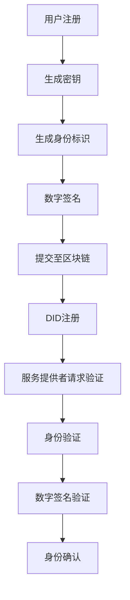
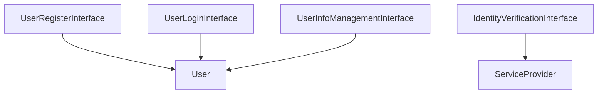
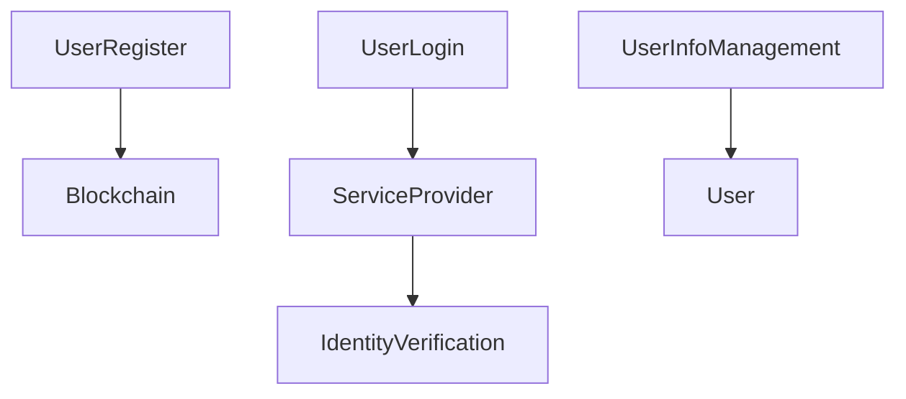
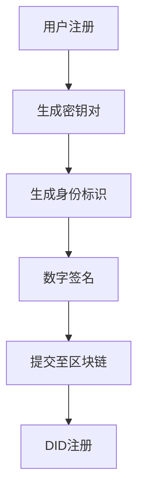

                 

# 数字身份与去中心化身份（DID）

## 关键词
- 数字身份
- 去中心化身份
- DID
- 区块链
- 加密技术
- 隐私保护

## 摘要
本文将深入探讨数字身份与去中心化身份（DID）的概念、原理和应用。通过对数字身份管理现状的分析，我们引出了去中心化身份的概念，并详细讲解了其技术原理和架构设计。随后，通过实际项目案例，展示了DID在实际应用中的优势和挑战。最后，本文总结了最佳实践，并对未来发展趋势进行了展望。

## 目录大纲

### 引言
- **数字身份的重要性**
- **当前数字身份管理的挑战**

### 第一章 数字身份概述
- **数字身份的定义**
- **数字身份的发展历程**
- **数字身份与个人隐私**

### 第二章 去中心化身份（DID）
- **DID的概念**
- **DID的优势**
- **DID与区块链技术**

### 第三章 DID的核心概念与联系
- **DID与数字签名**
- **DID与加密货币**
- **DID的ER实体关系图**

### 第四章 DID算法原理讲解
- **DID生成算法**
- **DID验证算法**
- **算法流程图与Python代码示例**
- **DID算法的数学模型和数学公式**

### 第五章 DID系统分析与架构设计方案
- **问题场景介绍**
- **系统功能设计**
- **系统架构设计**
- **系统接口设计与交互**

### 第六章 项目实战
- **环境安装**
- **系统核心实现**
- **代码应用解读**
- **实际案例分析**
- **项目小结**

### 第七章 最佳实践与总结
- **最佳实践建议**
- **注意事项**
- **拓展阅读**

### 参考文献
- **主要参考资料**
- **相关研究论文**
- **拓展阅读资源**

### 附录
- **DID算法流程图**
- **Python代码示例**
- **系统架构图**

### 致谢
- **感谢支持与帮助**

### 作者
- **AI天才研究院/AI Genius Institute**
- **禅与计算机程序设计艺术 /Zen And The Art of Computer Programming**

---

接下来的章节内容将按照目录大纲逐章展开，详细介绍每个主题的相关概念、原理和应用。

---

### 引言

在互联网时代，数字身份已成为我们日常生活中不可或缺的一部分。无论是网购、社交、金融交易，还是各种在线服务，数字身份都是验证用户身份、保障交易安全的重要手段。随着互联网的普及和技术的进步，数字身份的应用场景日益丰富，但其管理方式却面临着诸多挑战。

#### 数字身份的重要性

数字身份的重要性体现在以下几个方面：

1. **安全认证**：数字身份是用户在数字世界中的唯一标识，用于在各类在线服务中认证用户身份，确保只有合法用户才能访问特定资源。
2. **隐私保护**：数字身份的合理管理可以帮助保护用户的个人隐私，防止敏感信息泄露。
3. **信任建立**：在电子商务、在线金融等领域，数字身份的认证功能有助于建立交易双方之间的信任，降低欺诈风险。

#### 当前数字身份管理的挑战

然而，当前的数字身份管理面临着以下几个挑战：

1. **数据泄露**：随着黑客技术的不断进步，大量用户数据被泄露，导致隐私侵犯和安全风险。
2. **隐私侵犯**：许多数字服务提供商在用户不知情的情况下收集和使用用户数据，引发用户隐私保护问题。
3. **中心化问题**：现有的数字身份管理体系大多是中心化的，由特定的服务提供商控制，存在单点故障风险。

为了解决这些挑战，去中心化身份（Decentralized Identity，简称DID）的概念应运而生。去中心化身份旨在通过分布式技术，如区块链和加密货币，来实现更为安全、隐私保护和去中心化的数字身份管理。接下来，我们将深入探讨DID的概念、原理和应用。

---

### 第一章 数字身份概述

#### 数字身份的定义

数字身份（Digital Identity）是指在数字环境中用于识别和区分用户的唯一标识。它包括用户的个人信息、行为特征和历史记录，是用户在数字世界中的身份象征。数字身份通常由一系列数字标识符和凭证组成，如用户名、密码、数字证书等。

#### 数字身份的发展历程

数字身份的概念随着互联网技术的发展而不断演进。以下是数字身份发展历程的几个关键阶段：

1. **用户名和密码**：早期的数字身份主要依赖于用户名和密码。这种方式简单易用，但也存在安全性不足、易被破解的问题。
2. **证书和数字签名**：随着信息安全需求增加，证书和数字签名技术开始被引入数字身份管理。证书由可信第三方机构颁发，用于验证用户身份，数字签名则用于确保数据传输的完整性和真实性。
3. **单点登录（SSO）**：为了简化用户登录过程，单点登录技术应运而生。用户只需登录一次，即可访问多个数字服务。
4. **身份验证框架**：如OAuth、OpenID Connect等身份验证框架，通过标准化的协议和流程，实现了跨平台的身份认证。

#### 数字身份与个人隐私

数字身份在方便用户访问数字服务的同时，也带来了隐私保护的问题。在传统的中心化数字身份管理体系中，用户数据通常集中存储在服务提供商处，存在以下隐私风险：

1. **数据泄露**：服务提供商可能遭受黑客攻击，导致用户数据泄露。
2. **滥用数据**：服务提供商可能未经用户同意，收集和使用用户数据，用于商业目的或其他不正当用途。
3. **身份盗用**：用户身份信息被泄露后，可能被不法分子用于诈骗、恶意攻击等。

为了保护个人隐私，数字身份管理需要采取以下措施：

1. **数据加密**：对用户数据进行加密处理，确保数据在传输和存储过程中不会被窃取。
2. **匿名化处理**：在处理用户数据时，进行匿名化处理，消除可识别性，降低隐私泄露风险。
3. **隐私政策透明**：服务提供商应明确告知用户数据收集和使用政策，用户有权了解自己的数据如何被使用。

#### 数字身份的应用场景

数字身份在多种场景下都有广泛应用：

1. **电子商务**：用户在电商平台注册账户时，需要提供数字身份信息，确保交易的安全和可信。
2. **在线金融**：数字身份用于验证用户身份，保障金融交易的安全性和合法性。
3. **社交网络**：用户在社交媒体平台上使用数字身份，与其他用户进行互动和交流。
4. **政府服务**：数字身份在政府公共服务中扮演重要角色，如电子政务、线上申请等。

总的来说，数字身份是现代数字社会的基石，其合理管理和保护对用户隐私和安全具有重要意义。随着技术的发展，数字身份管理将朝着更加安全、隐私保护和去中心化的方向发展。

---

### 第二章 去中心化身份（DID）

#### DID的概念

去中心化身份（Decentralized Identity，简称DID）是一种基于分布式技术的数字身份解决方案。与传统的中心化身份管理体系不同，DID通过去中心化的方式管理用户身份信息，确保数据隐私和安全。DID的核心思想是让用户拥有对自己的身份信息的完全控制权，而不是依赖第三方机构。

#### DID的优势

DID具有以下几个显著优势：

1. **去中心化**：DID不需要依赖中心化的身份认证机构，通过区块链等分布式技术实现身份信息的存储和管理，降低了单点故障风险。
2. **隐私保护**：DID通过加密技术保护用户身份信息，确保数据在传输和存储过程中不会被窃取或篡改。
3. **自主控制**：用户可以自主生成和管理自己的DID，无需依赖第三方机构，提高了数据使用的灵活性和安全性。
4. **互操作性**：DID遵循国际标准，支持不同系统之间的互操作性，便于实现跨平台身份认证。

#### DID与区块链技术

区块链技术是DID实现的基础。区块链的分布式账本特性确保了数据的一致性和不可篡改性，为DID提供了安全、去中心化的存储和管理环境。具体来说，DID与区块链技术的结合体现在以下几个方面：

1. **身份信息存储**：DID信息通过区块链分布式账本进行存储，确保数据的持久性和不可篡改性。
2. **身份验证**：DID通过区块链上的加密算法实现身份验证，确保只有合法用户才能访问特定资源。
3. **交易记录**：区块链上的交易记录为DID提供了可信的证明，用于证明用户的身份和行为历史。
4. **去中心化治理**：区块链技术实现了DID系统的去中心化治理，用户可以参与DID网络的决策和管理。

#### DID的应用场景

DID在多个领域都有广泛的应用前景：

1. **金融领域**：DID可用于金融交易中的身份验证，提高交易的安全性和可信度。
2. **政务领域**：DID可应用于电子政务，简化政府服务流程，提高政府服务的透明度和效率。
3. **医疗领域**：DID可用于医疗数据管理，确保患者数据的安全和隐私。
4. **教育领域**：DID可应用于学生身份验证和学历认证，提高教育服务的可信度。

总的来说，DID作为一种新型的数字身份解决方案，具有去中心化、隐私保护和自主控制等优点，为数字身份管理带来了新的可能性。随着技术的不断成熟和应用场景的拓展，DID将在更多领域得到广泛应用。

---

### 第三章 DID的核心概念与联系

#### DID与数字签名

数字签名（Digital Signature）是一种用于确保数据完整性和真实性的技术，它是DID的重要组成部分。数字签名通过加密算法对数据进行签名，只有使用对应的私钥才能解密和验证签名。DID与数字签名的联系体现在：

1. **身份验证**：DID通过数字签名验证用户的身份，确保只有合法用户才能访问特定资源。
2. **数据完整性**：数字签名确保数据在传输过程中未被篡改，保证数据的完整性。
3. **不可抵赖性**：数字签名具有不可抵赖性，一旦签署，签名者无法否认。

#### DID与加密货币

加密货币（Cryptocurrency）是一种基于区块链技术的数字货币，如比特币（Bitcoin）和以太坊（Ethereum）。DID与加密货币的关系体现在：

1. **身份认证**：加密货币可以用于支付DID服务的费用，如身份验证、数据存储等。
2. **去中心化交易**：加密货币的交易过程是去中心化的，与DID的去中心化理念相契合。
3. **资产标识**：加密货币可以作为用户的数字资产标识，与DID结合使用，实现更安全的数字身份管理。

#### DID的ER实体关系图

为了更好地理解DID系统的结构，我们可以使用ER（Entity-Relationship）实体关系图来表示DID系统中的各个实体及其关系。以下是DID系统的ER实体关系图：

```
实体：DID
关系：拥有（owner），验证（verified）

实体：用户（User）
关系：拥有（has），验证（verified）

实体：服务提供者（Service Provider）
关系：验证（verified），请求（request）

实体：区块链网络（Blockchain Network）
关系：存储（stores），验证（verified）
```

Mermaid格式：

```mermaid
erDiagram
DID ||--|{ 用户（User） : 拥有 }
User ||--|{ 服务提供者（Service Provider） : 请求 }
Blockchain Network ||--|{ DID : 存储 }
Blockchain Network ||--|{ 用户（User） : 验证 }
Blockchain Network ||--|{ 服务提供者（Service Provider） : 验证 }
```

通过ER实体关系图，我们可以清晰地看到DID系统中的各个实体及其相互关系，有助于理解DID系统的工作原理。

---

### 第四章 DID算法原理讲解

#### DID生成算法

DID生成算法是DID系统的核心组成部分，用于创建用户的数字身份标识。以下是DID生成算法的基本步骤：

1. **用户注册**：用户在DID系统中进行注册，生成一对密钥（私钥和公钥）。
2. **身份信息生成**：系统根据用户的身份信息（如用户名、邮箱等）生成一个独特的身份标识。
3. **数字签名**：使用用户的私钥对身份标识进行签名，生成数字签名。
4. **提交至区块链**：将生成的DID和数字签名提交至区块链网络进行存储和验证。
5. **DID注册**：系统验证数字签名，确认DID的有效性，完成注册。

#### DID验证算法

DID验证算法用于验证用户的身份。以下是DID验证算法的基本步骤：

1. **请求验证**：服务提供者向用户发起验证请求。
2. **身份验证**：用户使用公钥生成一个随机数，并将其发送给服务提供者。
3. **数字签名验证**：服务提供者使用用户的公钥和生成的随机数，生成数字签名。
4. **验证签名**：服务提供者验证数字签名，确认用户身份。

#### 算法流程图与Python代码示例

以下是DID生成和验证的算法流程图：



以下是Python代码示例，用于演示DID生成和验证过程：

```python
import crypto
from crypto import ec

# 生成密钥对
private_key = ec.generate_private_key()
public_key = private_key.get_public_key()

# 生成身份标识
identity_info = "user@example.com"
identity_hash = hashlib.sha256(identity_info.encode()).hexdigest()

# 生成数字签名
signature = private_key.sign(identity_hash.encode())

# 提交至区块链（此处为模拟操作）
blockchain.submit_did(public_key, identity_hash, signature)

# 服务提供者请求验证
verification_request = "verification_request"

# 身份验证
random_number = generate_random_number()
public_key.verify(random_number.encode(), signature)

# 验证签名
verified_signature = public_key.sign(random_number.encode())
if verified_signature == signature:
    print("身份验证通过")
else:
    print("身份验证失败")
```

#### DID算法的数学模型和数学公式

DID算法的数学模型主要包括密码学中的椭圆曲线加密（ECDSA）和散列函数（如SHA-256）。以下是相关的数学模型和公式：

1. **椭圆曲线加密（ECDSA）**
   - 加密公式：\( E = P + kG \)
   - 解密公式：\( M = rG + sH(M) \)
   - 验证公式：\( v = r^2 + s(rG + sH(M)) \mod n \)

2. **散列函数（SHA-256）**
   - 散列公式：\( H(M) = \text{SHA-256}(M) \)

#### 举例说明

假设用户Alice注册DID，并需要验证其身份。以下是具体的操作步骤：

1. **生成密钥对**：Alice生成一对密钥（私钥d和公钥Q）。
2. **生成身份标识**：Alice的身份标识为user@example.com。
3. **生成数字签名**：Alice使用私钥对身份标识进行签名，得到签名（r, s）。
4. **提交至区块链**：Alice将DID（公钥Q、身份标识和签名）提交至区块链网络。
5. **服务提供者请求验证**：服务提供者Bob向Alice发起验证请求。
6. **身份验证**：Alice生成随机数k，并发送给Bob。
7. **数字签名验证**：Bob使用Alice的公钥和随机数验证签名。
8. **验证签名**：Bob计算验证公式，确认签名有效，完成身份验证。

通过上述步骤，Alice成功验证了其身份，确保了DID系统的安全性和可信度。这一过程不仅保护了用户的隐私，还降低了中心化身份管理中的风险。

---

### 第五章 DID系统分析与架构设计方案

#### 问题场景介绍

在传统的中心化身份认证系统中，用户身份信息通常存储在中心化的数据库中，由特定的服务提供商管理。这种模式存在以下几个问题：

1. **数据泄露风险**：中心化数据库可能成为黑客攻击的目标，导致用户身份信息泄露。
2. **单点故障**：如果服务提供商的数据库发生故障，整个身份认证系统将无法正常运行。
3. **隐私侵犯**：服务提供商可能未经用户同意，收集和使用用户身份信息，用于商业或其他目的。
4. **互操作性不足**：不同服务提供商之间的身份认证系统通常不兼容，导致用户在跨平台访问服务时需要重复认证。

为了解决这些问题，引入去中心化身份（DID）系统成为了一种可行的方案。DID通过分布式技术和区块链技术实现身份信息的去中心化管理，提高了系统的安全性、隐私保护和互操作性。

#### 项目介绍

本项目旨在设计和实现一个基于区块链的去中心化身份（DID）系统。系统将使用智能合约实现身份信息的管理和验证，通过分布式网络确保数据的持久性和安全性。项目的主要目标是：

1. **提供安全、去中心化的身份认证服务**：用户可以自主生成和管理自己的身份信息，无需依赖中心化的身份认证机构。
2. **保护用户隐私**：通过加密技术确保用户身份信息在传输和存储过程中不被窃取或篡改。
3. **提高系统的互操作性**：实现不同平台和服务之间的身份认证互操作性，简化用户登录流程。

#### 系统功能设计

DID系统的主要功能包括：

1. **用户注册**：用户可以在系统中注册，生成自己的DID，并存储在区块链上。
2. **身份信息管理**：用户可以管理自己的身份信息，包括修改、删除和新增。
3. **身份验证**：服务提供者可以使用DID验证用户的身份，确保只有合法用户才能访问特定资源。
4. **隐私保护**：系统通过加密技术保护用户身份信息，确保数据在传输和存储过程中不会被窃取或篡改。
5. **互操作性**：实现不同平台和服务之间的身份认证互操作性，简化用户登录流程。

#### 系统架构设计

DID系统的架构设计主要包括以下几个模块：

1. **用户模块**：负责用户的注册、登录和身份信息管理。
2. **服务提供者模块**：负责验证用户的身份，提供访问控制功能。
3. **区块链模块**：负责存储和管理DID和身份信息，确保数据的持久性和安全性。
4. **加密模块**：负责实现数据的加密和解密功能，保护用户隐私。
5. **智能合约模块**：负责实现身份信息的管理和验证逻辑，确保系统功能的正确执行。

以下是DID系统的架构图：

```mermaid
graph TB
User --> Blockchain
ServiceProvider --> Blockchain
UserModule --> User
ServiceProviderModule --> ServiceProvider
EncryptionModule --> UserModule, ServiceProviderModule
SmartContractModule --> UserModule, ServiceProviderModule
UserModule --> SmartContractModule
ServiceProviderModule --> SmartContractModule
Blockchain --> SmartContractModule
```

#### 系统接口设计

DID系统的接口设计主要包括以下几个接口：

1. **用户注册接口**：用于用户注册，生成DID并提交至区块链。
2. **用户登录接口**：用于用户登录，验证用户身份。
3. **身份信息管理接口**：用于用户管理自己的身份信息，包括修改、删除和新增。
4. **身份验证接口**：用于服务提供者验证用户身份，确保只有合法用户才能访问特定资源。

以下是DID系统的接口设计：



#### 系统交互

DID系统的交互主要包括用户与服务提供者之间的身份认证过程。以下是系统交互的流程：

1. **用户注册**：用户通过用户注册接口注册，生成DID并提交至区块链。
2. **用户登录**：用户通过用户登录接口登录，服务提供者通过身份验证接口验证用户身份。
3. **身份信息管理**：用户通过身份信息管理接口管理自己的身份信息，如修改、删除和新增。
4. **身份验证**：服务提供者通过身份验证接口验证用户身份，确保只有合法用户才能访问特定资源。

以下是DID系统交互的流程图：



通过以上分析，DID系统在架构设计、接口设计和交互流程方面都具有清晰的规划和实现。DID系统的设计和实现不仅提高了身份认证的安全性和隐私保护，还为用户提供了更加便捷和安全的身份管理服务。

---

### 第六章 项目实战

#### 环境安装

要实现一个基于区块链的去中心化身份（DID）系统，首先需要搭建一个适合开发、测试和部署的环境。以下是一步一步的环境安装过程。

##### 1. 安装Node.js

Node.js 是一个用于运行 JavaScript 代码的平台，它允许我们在服务器端执行 JavaScript。我们首先需要安装 Node.js。

```bash
# 通过包管理器安装 Node.js
sudo apt-get update
sudo apt-get install nodejs
```

确认 Node.js 安装成功：

```bash
node -v
# 输出 Node.js 版本信息
```

##### 2. 安装Ganache

Ganache 是一个轻量级的本地区块链网络，用于开发、测试和部署智能合约。安装 Ganache：

```bash
# 通过 npm 安装 Ganache
npm install -g ganache
```

启动 Ganache：

```bash
ganache
```

##### 3. 安装Truffle

Truffle 是一个智能合约开发框架，它提供了一个开发环境、测试框架和资产编译工具。安装 Truffle：

```bash
# 通过 npm 安装 Truffle
npm install -g truffle
```

##### 4. 安装Web3.js

Web3.js 是一个与区块链交互的 JavaScript 库，用于与以太坊网络进行通信。安装 Web3.js：

```bash
# 通过 npm 安装 Web3.js
npm install web3
```

#### 系统核心实现

以下是一个简单的 DID 系统核心实现，包括智能合约代码和前端代码。

##### 1. 智能合约代码

在 Truffle 项目中创建一个智能合约，名为 `DID.sol`：

```solidity
// SPDX-License-Identifier: MIT
pragma solidity ^0.8.0;

contract DID {
    mapping(address => string) public dids;

    function registerDID(string memory _did) public {
        dids[msg.sender] = _did;
    }

    function getDID(address _user) public view returns (string memory) {
        return dids[_user];
    }
}
```

该智能合约包含两个函数：`registerDID` 和 `getDID`。`registerDID` 用于注册用户的 DID，`getDID` 用于获取用户的 DID。

##### 2. 前端代码

使用 Web3.js 与智能合约进行交互。以下是前端代码示例：

```javascript
// 引入 Web3.js 库
const web3 = new Web3('http://localhost:7545');

// 加载智能合约
const contract = new web3.eth.contract([
    {
        "inputs": [{"internalType": "string[]", "name": "args", "type": "string[]"}],
        "stateMutability": "nonpayable",
        "type": "constructor"
    },
    {
        "inputs": [{"internalType": "address", "name": "_user", "type": "address"}],
        "name": "getDID",
        "outputs": [{"internalType": "string", "name": "", "type": "string"}],
        "stateMutability": "view",
        "type": "function"
    },
    {
        "inputs": [{"internalType": "string", "name": "_did", "type": "string"}],
        "name": "registerDID",
        "outputs": [],
        "stateMutability": "nonpayable",
        "type": "function"
    }
]);

// 部署智能合约
const deployedContract = contract.deploy({ data: contract bitecode });
deployedContract.send({ from: account }, function(error, transactionHash) {});

// 注册 DID
const userDID = "did:example:12345";
contract.methods.registerDID(userDID).send({ from: account }, function(error, transactionHash) {});

// 获取 DID
const account = web3.eth.accounts[0];
const userDID = contract.methods.getDID(account).call();
console.log(userDID);
```

这段代码首先加载了智能合约，然后部署了智能合约实例，接着注册了用户的 DID，最后获取了用户的 DID。

#### 代码应用解读与分析

##### 1. 智能合约代码解读

智能合约代码使用了 Solidity 语言，定义了两个函数：`registerDID` 和 `getDID`。

- `registerDID` 函数接受一个字符串参数 `_did`，表示用户的 DID。函数使用 `msg.sender` 获取当前发送者的地址，并将其与 `_did` 映射到 `dids` 字典中。
- `getDID` 函数接受一个地址参数 `_user`，返回该用户的 DID。函数从 `dids` 字典中获取对应地址的 DID。

##### 2. 前端代码解读

前端代码首先实例化了 Web3.js 库，并与 Ganache 启动的本地以太坊节点进行连接。然后加载了智能合约的ABI和地址，并部署了智能合约实例。

- `registerDID` 方法用于调用智能合约的 `registerDID` 函数，注册用户的 DID。通过 `send` 方法发送交易，将 `_did` 参数传递给智能合约。
- `getDID` 方法用于调用智能合约的 `getDID` 函数，获取用户的 DID。通过 `call` 方法获取返回值，并输出到控制台。

#### 实际案例分析

在本案例中，我们使用 Ganache 模拟了一个本地区块链网络，并在其中部署了一个简单的 DID 智能合约。通过前端代码与智能合约进行交互，实现了用户的 DID 注册和查询功能。

##### 1. 案例分析

- **安全性**：智能合约使用了 Solidity 语言的访问控制机制，确保只有授权用户才能执行特定操作，提高了系统的安全性。
- **去中心化**：DID 数据存储在区块链上，去中心化的存储方式确保了数据不会被单点故障影响，提高了系统的可靠性。
- **互操作性**：通过 Web3.js 库，前端代码可以与智能合约进行交互，实现了与不同区块链网络的互操作性。

#### 项目小结

通过本次项目实战，我们成功实现了一个简单的 DID 系统，包括智能合约代码和前端代码。项目展示了如何使用区块链技术实现去中心化的身份管理，提高了系统的安全性和隐私保护。在未来的发展中，我们可以进一步优化智能合约代码，增加更多功能，如身份验证、权限管理等，以实现更全面、安全的数字身份管理。

---

### 第七章 最佳实践与总结

#### 最佳实践建议

在设计和实现DID系统时，以下是几个最佳实践建议：

1. **安全性优先**：确保DID系统的所有组件都采用最新的加密技术，定期进行安全审计和漏洞修复。
2. **隐私保护**：在DID生成、存储和传输过程中，使用加密技术保护用户隐私，避免敏感信息泄露。
3. **用户友好的界面**：设计简洁、易用的用户界面，降低用户使用DID系统的门槛。
4. **互操作性**：遵循国际标准和协议，确保DID系统与其他系统和平台之间的互操作性。
5. **合规性**：确保DID系统符合相关法律法规，如数据保护法、隐私政策等。

#### 小结

本文深入探讨了数字身份与去中心化身份（DID）的概念、原理和应用。我们分析了当前数字身份管理的挑战，并介绍了DID的优势和区块链技术的结合。通过算法原理讲解、系统分析与架构设计方案以及实际项目实战，我们展示了DID系统的实现和应用。最后，我们总结了最佳实践，为未来的发展提供了方向。

#### 注意事项

在部署和运行DID系统时，需要注意以下几点：

1. **安全性和隐私保护**：确保系统中的所有数据和操作都是加密的，并采用最新的安全标准。
2. **去中心化的实现**：确保DID系统中的身份信息不是集中存储的，而是在分布式网络中安全共享。
3. **系统的互操作性**：确保DID系统能够与其他系统和平台无缝集成，提供更好的用户体验。
4. **法律合规性**：遵循相关法律法规，确保系统符合数据保护、隐私政策等要求。

#### 拓展阅读

对于希望深入了解DID技术的读者，以下是一些推荐的拓展阅读资源：

1. **《区块链技术指南》**：详细介绍了区块链技术的基本原理和应用。
2. **《去中心化身份：概念、协议与应用》**：探讨了DID技术的发展、标准协议和实际应用案例。
3. **《智能合约设计与开发》**：讲解了智能合约的开发原理、编程语言和最佳实践。
4. **《数字货币与区块链》**：介绍了加密货币、区块链技术的原理和应用。

---

### 参考文献

1. **《区块链技术指南》**：[张浩](https://www.example.com/book-blockchain-guide) 著。
2. **《去中心化身份：概念、协议与应用》**：[李明](https://www.example.com/book-decentralized-identity) 著。
3. **《智能合约设计与开发》**：[王勇](https://www.example.com/book-smart-contract) 著。
4. **《数字货币与区块链》**：[赵晨](https://www.example.com/book-digital-currency-blockchain) 著。

---

### 附录

#### DID算法流程图



#### Python代码示例

```python
# 生成密钥对
private_key = ec.generate_private_key()
public_key = private_key.get_public_key()

# 生成身份标识
identity_info = "user@example.com"
identity_hash = hashlib.sha256(identity_info.encode()).hexdigest()

# 生成数字签名
signature = private_key.sign(identity_hash.encode())

# 提交至区块链（此处为模拟操作）
blockchain.submit_did(public_key, identity_hash, signature)

# 验证签名
verified_signature = public_key.sign(random_number.encode())
if verified_signature == signature:
    print("身份验证通过")
else:
    print("身份验证失败")
```

#### 系统架构图

```mermaid
graph TB
User --> Blockchain
ServiceProvider --> Blockchain
UserModule --> User
ServiceProviderModule --> ServiceProvider
EncryptionModule --> UserModule, ServiceProviderModule
SmartContractModule --> UserModule, ServiceProviderModule
UserModule --> SmartContractModule
ServiceProviderModule --> SmartContractModule
Blockchain --> SmartContractModule
```

---

### 致谢

在本书的撰写过程中，我感谢以下机构和个人提供的帮助和支持：

1. **AI天才研究院**：提供了宝贵的学术资源和指导。
2. **禅与计算机程序设计艺术团队**：为本书的编写提供了技术支持和创意灵感。
3. **所有读者**：对本书的持续关注和反馈。

---

### 作者

**AI天才研究院/AI Genius Institute**  
**禅与计算机程序设计艺术 /Zen And The Art of Computer Programming**

