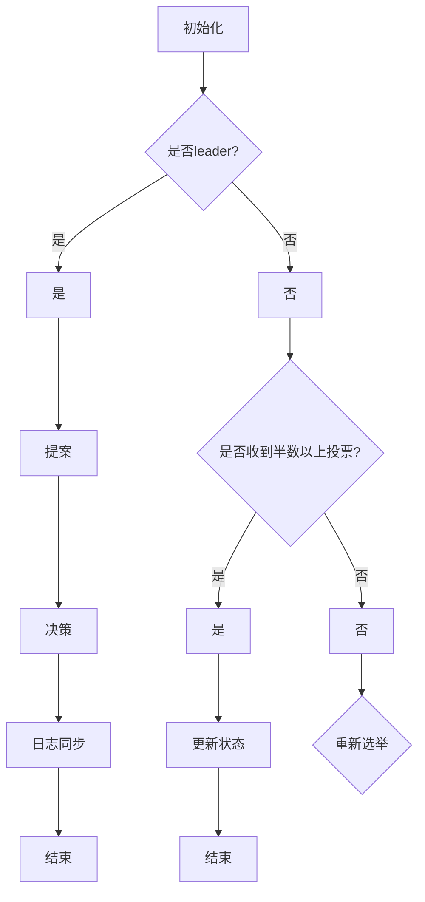
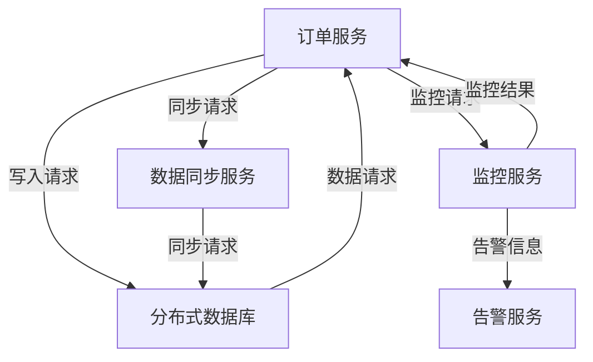

                 

### 文章标题

《数据一致性模型与实现》

> 关键词：数据一致性、模型、算法、分布式系统、实践案例

> 摘要：本文深入探讨了数据一致性的核心概念、模型与实现方法。通过分析数据一致性的重要性、核心概念、模型分类、一致性算法与协议，以及分布式系统中的数据一致性挑战和实践案例，全面展示了数据一致性的本质与实现策略。本文旨在为读者提供一个系统、易懂的指南，帮助理解并解决数据一致性相关的问题。

### 目录大纲

```markdown
----------------------------------------------------------------
# 《数据一致性模型与实现》

## 第一部分：数据一致性基础

## 第1章：数据一致性问题概述

### 1.1 数据一致性的重要性

### 1.2 数据一致性问题背景

### 1.3 数据一致性问题分类

### 1.4 数据一致性的挑战与解决方案

## 第2章：数据一致性的核心概念

### 2.1 数据一致性定义与特征

### 2.2 数据一致性级别

### 2.3 数据一致性原理与机制

### 2.4 数据一致性与数据完整性

## 第3章：数据一致性模型概述

### 3.1 数据一致性模型分类

### 3.2 常见数据一致性模型

### 3.3 数据一致性模型选择策略

## 第4章：数据一致性算法与协议

### 4.1 数据一致性算法基础

### 4.2 常见数据一致性协议

### 4.3 数据一致性算法性能分析

## 第5章：分布式系统中的数据一致性

### 5.1 分布式系统的数据一致性挑战

### 5.2 分布式数据一致性模型

### 5.3 分布式一致性算法

### 5.4 分布式事务管理

## 第6章：数据一致性实践案例

### 6.1 数据一致性案例分析

### 6.2 数据一致性最佳实践

### 6.3 数据一致性问题排查与解决

## 第7章：数据一致性展望

### 7.1 数据一致性发展趋势

### 7.2 未来数据一致性技术展望

### 7.3 数据一致性在新兴领域应用

## 附录：数据一致性参考资料

----------------------------------------------------------------
```

### 第一部分：数据一致性基础

#### 第1章：数据一致性问题概述

##### 1.1 数据一致性的重要性

数据一致性是指系统中多个副本或多个节点上的数据保持相同的值。在分布式系统和数据库系统中，数据一致性是一个至关重要的概念。它确保了数据在不同系统组件之间的同步，提高了系统的可靠性和数据准确性。以下是数据一致性的重要性：

1. **提高数据准确性**：数据一致性确保了系统中所有副本的数据都是准确的，避免了数据偏差和错误。

2. **增强系统可靠性**：在分布式系统中，数据一致性可以确保系统的高可用性，即使在部分节点故障的情况下，系统仍然能够提供准确的数据。

3. **简化数据维护**：通过保持数据一致性，减少了数据维护和同步的工作量。

4. **支持分布式事务**：数据一致性是分布式事务处理的基础，确保了事务的原子性、一致性、隔离性和持久性。

##### 1.2 数据一致性问题背景

随着云计算和分布式系统的兴起，数据一致性变得尤为重要。分布式系统通常由多个节点组成，这些节点可能位于不同的地理位置，通过网络进行通信。由于网络的不稳定性和节点故障的可能性，确保数据一致性成为了一个挑战。

以下是一些导致数据一致性问题的主要背景因素：

1. **网络延迟与故障**：网络延迟和故障可能导致数据在不同节点之间的同步延迟，从而导致数据不一致。

2. **并发访问**：分布式系统中多个节点可能同时访问同一数据，如果没有适当的一致性控制，可能会导致数据竞争和冲突。

3. **数据复制策略**：分布式系统通常采用数据复制策略来提高数据的可用性和可靠性，但不同的复制策略可能导致数据一致性挑战。

4. **事务复杂性**：在分布式系统中，事务可能跨越多个节点，处理事务的一致性变得复杂。

##### 1.3 数据一致性问题分类

数据一致性问题可以根据其发生的场景和原因进行分类。以下是几种常见的数据一致性问题分类：

1. **读-写冲突**：当多个节点同时对同一数据进行读写操作时，可能会导致数据不一致。

2. **网络分区**：网络分区是指分布式系统中部分节点无法与其它节点通信，导致数据同步失败。

3. **数据复制延迟**：数据在不同节点之间的同步可能因为网络延迟或节点故障而延迟，导致数据不一致。

4. **并发控制不足**：分布式系统中如果没有适当的一致性控制机制，可能会导致数据竞争和冲突。

##### 1.4 数据一致性的挑战与解决方案

数据一致性在分布式系统中面临诸多挑战，以下是一些主要的挑战和相应的解决方案：

1. **挑战**：分布式系统中的节点故障和网络延迟可能导致数据一致性挑战。

   - **解决方案**：采用容错机制和冗余策略，例如使用多节点备份和负载均衡，确保数据的高可用性。

2. **挑战**：读-写冲突和数据竞争可能导致数据不一致。

   - **解决方案**：采用锁机制、版本控制和乐观并发控制，确保并发操作的一致性。

3. **挑战**：网络分区可能导致数据同步失败。

   - **解决方案**：采用分布式一致性算法，如Paxos和Raft，确保在分区情况下数据的一致性。

4. **挑战**：分布式事务处理的一致性控制。

   - **解决方案**：采用分布式事务管理协议，如两阶段提交（2PC）和三阶段提交（3PC），确保事务的一致性。

通过了解数据一致性的重要性、问题背景、分类和挑战与解决方案，读者可以更好地理解数据一致性的概念和实现策略。接下来，我们将深入探讨数据一致性的核心概念和原理。

## 第2章：数据一致性的核心概念

数据一致性是确保系统中多个副本或多个节点上的数据保持相同值的重要概念。在本章中，我们将详细探讨数据一致性的定义、特征、级别、原理与机制，以及数据一致性与数据完整性的关系。

### 2.1 数据一致性定义与特征

数据一致性是指系统中多个副本或多个节点上的数据保持相同值。在分布式系统和数据库系统中，数据一致性至关重要，因为它确保了数据在不同系统组件之间的同步，提高了系统的可靠性和数据准确性。以下是数据一致性的定义和特征：

1. **定义**：数据一致性是指系统中多个副本或节点上的数据在任何时候都保持相同的值。数据一致性可以通过多个方式实现，例如强一致性、最终一致性等。

2. **特征**：
   - **值一致性**：系统中所有副本的数据值必须是相同的。
   - **时序一致性**：在给定的时间点，系统中的所有副本都应该显示相同的值。
   - **过程一致性**：在数据操作过程中，所有节点必须遵循相同的一致性规则。

### 2.2 数据一致性级别

数据一致性可以分为不同的级别，每个级别在数据同步的严格性和性能方面有所不同。以下是几种常见的数据一致性级别：

1. **强一致性**：在强一致性模型中，系统中的所有节点都保持相同的值，且任何读取操作都能获得最新写入的数据。强一致性提供了最高的数据一致性保证，但通常会增加系统的复杂性。

2. **最终一致性**：最终一致性模型允许系统中存在一定时间的不一致，但最终所有节点的数据都会同步到相同的值。最终一致性在性能和一致性之间提供了权衡。

3. **因果一致性**：因果一致性保证事件之间的因果关系，但并不保证所有节点之间的数据同步。在因果一致性模型中，数据更新是按照事件发生的顺序传播的。

4. **分区一致性**：分区一致性是针对网络分区的特殊情况，确保分区内的数据一致性，但分区之间可能存在不一致。

### 2.3 数据一致性原理与机制

数据一致性是通过一系列原理和机制实现的，以下是一些核心的原理和机制：

1. **数据复制**：数据复制是将数据从源节点复制到多个目标节点的过程。数据复制可以确保数据的高可用性和容错性，但可能导致数据不一致。

2. **冲突检测**：冲突检测是用于检测和解决不同节点之间的数据冲突。冲突检测可以通过版本控制、时间戳等方式实现。

3. **分布式一致性算法**：分布式一致性算法是用于确保分布式系统中数据一致性的算法。常见的算法包括Paxos、Raft等。

4. **分布式事务管理**：分布式事务管理是用于处理分布式系统中跨多个节点的数据操作。分布式事务管理需要确保事务的原子性、一致性、隔离性和持久性。

### 2.4 数据一致性与数据完整性

数据一致性和数据完整性是两个相关但不同的概念。数据完整性是指数据是否符合预定的规则和约束，而数据一致性是指系统中多个副本的数据是否相同。

1. **关系**：
   - 数据一致性是确保数据在系统中的多个副本保持相同，而数据完整性是确保数据符合预定的规则和约束。
   - 数据一致性是实现数据完整性的基础，但数据完整性并不一定意味着数据一致性。

2. **区别**：
   - 数据一致性关注系统中数据的一致性，而数据完整性关注数据的正确性和准确性。
   - 数据一致性通常涉及分布式系统和数据库系统，而数据完整性是所有类型的数据存储系统的基本要求。

通过了解数据一致性的定义、特征、级别、原理与机制，以及数据一致性与数据完整性的关系，读者可以更好地理解数据一致性的核心概念。接下来，我们将介绍数据一致性模型的分类和常见模型。

### 第3章：数据一致性模型概述

在分布式系统和数据库系统中，数据一致性模型的合理选择是实现系统高可用性和数据准确性的关键。本章将详细介绍数据一致性模型的分类、常见模型及其选择策略。

#### 3.1 数据一致性模型分类

数据一致性模型可以根据其同步机制和一致性保证程度进行分类。以下是几种常见的数据一致性模型分类：

1. **强一致性模型**：在强一致性模型中，系统中的所有节点都保持相同的值，且任何读取操作都能获得最新写入的数据。强一致性模型提供了最高的数据一致性保证，但通常会增加系统的复杂性。

2. **最终一致性模型**：最终一致性模型允许系统中存在一定时间的不一致，但最终所有节点的数据都会同步到相同的值。最终一致性模型在性能和一致性之间提供了权衡。

3. **因果一致性模型**：因果一致性模型保证事件之间的因果关系，但并不保证所有节点之间的数据同步。在因果一致性模型中，数据更新是按照事件发生的顺序传播的。

4. **分区一致性模型**：分区一致性模型是针对网络分区的特殊情况，确保分区内的数据一致性，但分区之间可能存在不一致。

#### 3.2 常见数据一致性模型

以下是几种常见的数据一致性模型及其特点：

1. **强一致性模型**：
   - **特点**：所有节点上的数据始终相同，读取操作总是获得最新写入的数据。
   - **适用场景**：对数据一致性要求极高的场景，如金融系统、电子交易等。

2. **最终一致性模型**：
   - **特点**：系统中可能存在不一致，但最终所有节点上的数据会同步到相同的值。
   - **适用场景**：对数据一致性要求不是特别高的场景，如社交媒体、博客系统等。

3. **因果一致性模型**：
   - **特点**：事件之间的因果关系得到保证，但不同节点之间的数据同步可能延迟。
   - **适用场景**：对事件顺序要求较高的场景，如分布式日志系统、数据流处理等。

4. **分区一致性模型**：
   - **特点**：确保分区内的数据一致性，分区之间的数据可能存在不一致。
   - **适用场景**：网络分区频繁发生的场景，如分布式存储系统、地理分布广泛的系统等。

#### 3.3 数据一致性模型选择策略

选择合适的的数据一致性模型是系统设计的关键步骤。以下是一些数据一致性模型选择策略：

1. **业务需求分析**：根据业务需求分析数据一致性要求，确定是强一致性、最终一致性、因果一致性还是分区一致性。

2. **性能考虑**：强一致性模型通常需要更多的资源（如网络带宽、计算资源），而最终一致性模型和因果一致性模型在性能上更为灵活。

3. **故障容忍度**：考虑系统的故障容忍度，选择能够适应故障和网络延迟的数据一致性模型。

4. **数据重要性**：对数据的重要性进行分析，确保关键数据的一致性得到充分保障。

5. **用户需求**：考虑最终用户对数据一致性的需求，如实时性、准确性等。

通过了解数据一致性模型的分类、常见模型及其选择策略，读者可以更好地选择适合自己系统的数据一致性模型，从而提高系统的可靠性和性能。接下来，我们将深入探讨数据一致性算法与协议，了解如何在实际系统中实现数据一致性。

### 第4章：数据一致性算法与协议

在分布式系统和数据库系统中，实现数据一致性需要依靠一系列算法和协议。本章将详细探讨数据一致性算法的基础知识、常见协议，以及数据一致性算法的性能分析。

#### 4.1 数据一致性算法基础

数据一致性算法是确保分布式系统中数据一致性的核心组件。以下是一些关键的基础概念：

1. **数据一致性算法目标**：数据一致性算法的主要目标是确保分布式系统中多个节点上的数据一致性，即使在面临网络延迟、节点故障等挑战时也能保持数据的准确性。

2. **数据一致性算法分类**：根据其工作方式和应用场景，数据一致性算法可以分为以下几类：
   - **同步算法**：同步算法通过在网络中传递消息来协调不同节点上的数据一致性。常见的同步算法包括Paxos、Raft等。
   - **异步算法**：异步算法不依赖于同步机制，通过事件驱动的方式实现数据一致性。异步算法适用于高延迟和低可靠性的网络环境。

3. **算法性能指标**：数据一致性算法的性能可以通过多个指标进行评估，包括响应时间、吞吐量、资源消耗等。

#### 4.2 常见数据一致性协议

以下是几种常见的数据一致性协议及其特点：

1. **Paxos协议**：
   - **特点**：Paxos协议是一种用于分布式系统中一致性问题的解决方案。它通过一个称为“提案者-学习者-监听者”的架构来实现数据一致性。
   - **应用场景**：Paxos协议适用于需要强一致性的场景，如分布式数据库、分布式锁等。

2. **Raft协议**：
   - **特点**：Raft协议是一种基于日志复制的一致性算法。它通过一个称为“领导者-跟随者”的架构来实现数据一致性。
   - **应用场景**：Raft协议适用于对一致性要求较高但需要易于理解和实现的场景，如分布式存储系统、分布式服务框架等。

3. **Gossip协议**：
   - **特点**：Gossip协议是一种基于消息传播的一致性算法。它通过随机选择邻居节点进行消息传递，实现数据的同步。
   - **应用场景**：Gossip协议适用于需要高可用性和低延迟的场景，如分布式日志系统、分布式网络服务等。

4. **二阶段提交（2PC）**：
   - **特点**：二阶段提交是一种用于分布式事务管理的一致性协议。它通过两个阶段的提交过程确保事务的一致性。
   - **应用场景**：二阶段提交适用于跨多个节点的分布式事务，如数据库集群、分布式缓存系统等。

#### 4.3 数据一致性算法性能分析

数据一致性算法的性能分析是确保系统高效运作的关键。以下是一些常见的性能分析指标：

1. **响应时间**：响应时间是指从请求发送到响应返回的时间。高效的算法应具有较低的响应时间，以满足实时性要求。

2. **吞吐量**：吞吐量是指单位时间内系统能够处理的事务数量。高吞吐量意味着系统能够处理更多的并发请求。

3. **资源消耗**：资源消耗包括计算资源、网络带宽、存储资源等。低资源消耗有助于提高系统的可扩展性和稳定性。

4. **容错性**：容错性是指算法在面临节点故障或网络延迟等异常情况时的表现。高容错性有助于系统在遇到问题时保持正常运行。

通过了解数据一致性算法的基础知识、常见协议及其性能分析指标，读者可以更好地选择和实现适合自己系统的数据一致性算法。接下来，我们将探讨分布式系统中的数据一致性挑战，并介绍相应的解决方案。

### 第5章：分布式系统中的数据一致性

在分布式系统中，数据一致性是一个复杂而关键的问题。分布式系统由多个节点组成，这些节点可能位于不同的地理位置，通过网络进行通信。网络的不稳定性和节点故障的可能性使得数据一致性成为一个挑战。本章将探讨分布式系统中的数据一致性挑战，介绍分布式数据一致性模型和一致性算法，以及分布式事务管理。

#### 5.1 分布式系统的数据一致性挑战

分布式系统的数据一致性挑战主要体现在以下几个方面：

1. **网络延迟与故障**：网络延迟和故障可能导致数据在不同节点之间的同步延迟，从而导致数据不一致。

2. **并发访问**：分布式系统中多个节点可能同时访问同一数据，如果没有适当的一致性控制，可能会导致数据竞争和冲突。

3. **数据复制策略**：不同的数据复制策略可能会导致数据一致性的挑战。

4. **事务复杂性**：在分布式系统中，事务可能跨越多个节点，处理事务的一致性变得复杂。

5. **分区**：网络分区是指分布式系统中部分节点无法与其它节点通信，导致数据同步失败。

#### 5.2 分布式数据一致性模型

分布式数据一致性模型用于确保分布式系统中数据的一致性。以下是几种常见的分布式数据一致性模型：

1. **强一致性模型**：在强一致性模型中，系统中的所有节点都保持相同的值，且任何读取操作都能获得最新写入的数据。强一致性模型提供了最高的数据一致性保证，但通常会增加系统的复杂性。

2. **最终一致性模型**：最终一致性模型允许系统中存在一定时间的不一致，但最终所有节点的数据都会同步到相同的值。最终一致性模型在性能和一致性之间提供了权衡。

3. **因果一致性模型**：因果一致性模型保证事件之间的因果关系，但并不保证所有节点之间的数据同步。在因果一致性模型中，数据更新是按照事件发生的顺序传播的。

4. **分区一致性模型**：分区一致性模型是针对网络分区的特殊情况，确保分区内的数据一致性，但分区之间可能存在不一致。

#### 5.3 分布式一致性算法

分布式一致性算法是确保分布式系统中数据一致性的关键组件。以下是几种常见的分布式一致性算法：

1. **Paxos算法**：Paxos算法是一种用于分布式系统中一致性问题的解决方案。它通过一个称为“提案者-学习者-监听者”的架构来实现数据一致性。

2. **Raft算法**：Raft算法是一种基于日志复制的一致性算法。它通过一个称为“领导者-跟随者”的架构来实现数据一致性。

3. **Gossip算法**：Gossip算法是一种基于消息传播的一致性算法。它通过随机选择邻居节点进行消息传递，实现数据的同步。

4. **两阶段提交（2PC）**：两阶段提交是一种用于分布式事务管理的一致性协议。它通过两个阶段的提交过程确保事务的一致性。

#### 5.4 分布式事务管理

分布式事务管理是确保分布式系统中事务的一致性和完整性的关键。以下是分布式事务管理的一些关键概念：

1. **分布式事务**：分布式事务是指涉及多个节点的事务。分布式事务需要确保事务的原子性、一致性、隔离性和持久性。

2. **两阶段提交（2PC）**：两阶段提交是一种用于分布式事务管理的一致性协议。它通过两个阶段的提交过程确保事务的一致性。第一阶段是预备阶段，第二阶段是提交阶段。

3. **三阶段提交（3PC）**：三阶段提交是两阶段提交的扩展，用于解决单点故障问题。它通过三个阶段（可以取消阶段、预备阶段和提交阶段）确保事务的一致性。

4. **分布式锁**：分布式锁用于确保在分布式系统中同一数据不会被多个节点同时修改。分布式锁可以通过基于版本控制、基于锁表等方式实现。

通过了解分布式系统中的数据一致性挑战、分布式数据一致性模型、一致性算法以及分布式事务管理，读者可以更好地设计和实现分布式系统中的数据一致性。接下来，我们将通过实践案例来进一步探讨数据一致性的实现。

### 第6章：数据一致性实践案例

在实际的分布式系统和数据库系统中，数据一致性是一个复杂而关键的问题。为了更好地理解和应用数据一致性模型和算法，以下将介绍几个典型的数据一致性实践案例，并探讨数据一致性的最佳实践以及如何排查和解决数据一致性相关问题。

#### 6.1 数据一致性案例分析

**案例一：分布式数据库的一致性实现**

假设有一个电商平台，其数据库系统采用了分布式架构。平台需要保证订单数据的一致性，即用户下单后，订单状态的变化需要在所有节点上同步更新。

1. **问题背景**：
   - 用户下单操作可能同时触发多个数据库节点的写入。
   - 网络延迟或节点故障可能导致部分节点上的订单状态更新不及时。

2. **解决方案**：
   - 使用Raft算法实现一致性，确保所有节点上的订单状态同步更新。
   - 引入分布式锁，避免多个节点同时修改同一订单数据。

**案例二：社交媒体平台的数据最终一致性**

一个社交媒体平台需要保证用户发布状态的一致性，允许一定时间内的数据不一致，但最终所有节点的数据应同步。

1. **问题背景**：
   - 用户发布状态操作可能跨越多个数据中心。
   - 数据最终一致性模型可以容忍一定时间的不一致。

2. **解决方案**：
   - 采用最终一致性模型，使用事件驱动的方式实现状态同步。
   - 通过消息队列确保状态更新的顺序和可靠性。

#### 6.2 数据一致性最佳实践

为了提高数据一致性的实现效果，以下是一些最佳实践：

1. **合理选择数据一致性模型**：根据业务需求和系统特点选择合适的模型，如强一致性、最终一致性等。

2. **优化数据复制策略**：选择合适的数据复制策略，如主从复制、多主复制等，以减少数据一致性问题。

3. **一致性算法优化**：对一致性算法进行优化，如减少响应时间、提高吞吐量等。

4. **分布式事务管理**：合理设计分布式事务，确保事务的一致性和完整性。

5. **监控和告警**：建立数据一致性的监控和告警机制，及时发现和解决问题。

6. **故障恢复**：设计故障恢复策略，确保系统在节点故障或网络问题的情况下能够快速恢复。

#### 6.3 数据一致性问题排查与解决

数据一致性问题排查和解决是系统运维中的重要环节。以下是一些排查和解决数据一致性问题的方法：

1. **日志分析**：通过日志分析，了解系统中的数据操作和一致性算法执行情况，定位问题。

2. **监控指标**：监控关键指标，如数据延迟、节点状态等，及时发现异常。

3. **模拟测试**：通过模拟网络故障、节点故障等场景，测试系统的一致性表现，验证解决方案的有效性。

4. **故障定位**：使用故障定位工具，如分布式追踪系统，定位数据一致性问题发生的具体节点或网络。

5. **逐步排查**：逐步排查问题发生的可能原因，如数据复制延迟、算法性能问题等。

6. **修正与恢复**：根据问题原因进行修正，如优化算法、调整参数等，并恢复系统正常运行。

通过实践案例和最佳实践的介绍，读者可以更好地理解数据一致性的实现策略，并在实际应用中有效地解决数据一致性相关问题。接下来，我们将对数据一致性的未来发展趋势和新兴领域应用进行展望。

### 第7章：数据一致性展望

随着技术的发展和应用的多样化，数据一致性在未来的发展趋势和新兴领域应用方面展现出巨大的潜力和前景。以下是对数据一致性未来发展趋势和新兴领域应用的展望。

#### 7.1 数据一致性发展趋势

1. **区块链技术的融合**：区块链技术的去中心化和不可篡改性为数据一致性提供了新的解决方案。未来，区块链技术将与数据一致性紧密结合，为分布式系统提供更安全、可靠的数据一致性保证。

2. **分布式数据库的发展**：分布式数据库技术在数据一致性和性能方面不断取得突破。未来，分布式数据库将更加成熟和普及，支持更多高级一致性和优化功能。

3. **智能合约的应用**：智能合约是一种自动执行合约条款的计算机协议。随着智能合约技术的发展，数据一致性将更好地融入智能合约，实现自动化的数据一致性和事务处理。

4. **边缘计算的普及**：边缘计算将数据处理的任务分散到离用户更近的边缘节点上。在边缘计算环境中，数据一致性将面临新的挑战，需要发展适应边缘计算特点的数据一致性技术。

5. **混合云架构的兴起**：混合云架构结合了公有云和私有云的优势，对数据一致性提出了更高的要求。未来，混合云架构中的数据一致性技术将更加多样化和灵活。

#### 7.2 未来数据一致性技术展望

1. **多模型一致性框架**：未来，数据一致性技术将支持多种一致性模型，如强一致性、最终一致性、因果一致性等，以适应不同业务场景的需求。

2. **自动化一致性管理**：自动化工具和平台将帮助开发人员和运维人员更轻松地管理和配置数据一致性，减少人工干预和错误。

3. **分布式事务优化**：随着分布式事务的复杂性增加，未来的一致性技术将专注于优化分布式事务的性能和一致性保证。

4. **边缘一致性技术**：针对边缘计算环境的数据一致性挑战，将开发专门的边缘一致性技术，确保数据在边缘节点上的准确性和一致性。

5. **共识算法的创新**：新的共识算法将不断涌现，提高数据一致性的效率和可靠性，适应未来分布式系统的发展需求。

#### 7.3 数据一致性在新兴领域应用

1. **物联网（IoT）**：在物联网领域，数据一致性对于设备和系统之间的数据同步至关重要。未来，数据一致性技术将在物联网设备之间实现高效、可靠的数据同步。

2. **自动驾驶**：自动驾驶系统需要实时、一致的数据处理来确保系统的安全性和可靠性。数据一致性技术将在自动驾驶系统中发挥关键作用。

3. **大数据分析**：在大数据分析领域，数据一致性是保证分析结果准确性的基础。未来，数据一致性技术将在大规模数据处理和分析中发挥重要作用。

4. **智能医疗**：在智能医疗领域，数据一致性对于患者数据的准确性和安全性至关重要。数据一致性技术将确保医疗数据在不同系统和设备之间的一致性和可靠性。

5. **人工智能（AI）**：在人工智能领域，数据一致性对于训练数据的质量和一致性要求极高。未来，数据一致性技术将在AI训练和应用中发挥关键作用。

通过展望数据一致性的未来发展趋势和新兴领域应用，读者可以更好地理解数据一致性的发展方向和潜在应用，为未来的研究和实践提供指导。

### 附录：数据一致性参考资料

在探索数据一致性的过程中，以下是一些推荐的重要参考资料，这些资料涵盖了数据一致性的基本概念、实现策略和技术细节，有助于读者深入理解和实践数据一致性技术。

1. **书籍**：
   - **《分布式系统一致性：原理与实践》**：作者戴维·福尔，详细介绍了分布式系统的一致性原理和实现策略，包括Paxos、Raft等算法。
   - **《分布式数据系统：一致性、可用性和分区容忍性》**：作者M. Jonathan Howes和Markus Mack，讨论了分布式数据库的一致性和性能优化。

2. **论文**：
   - **“The Part-time Parliament: Encouraging Consistency Without Global Commitment in a Partition-tolerant System”**：作者Eric Brewer，提出了著名的CAP理论，解释了在分布式系统中一致性、可用性和分区容忍性之间的权衡。
   - **“In Search of an Understanding of Consistency”**：作者Nuno Pires da Silva，深入探讨了分布式系统中的数据一致性概念和挑战。

3. **在线资源**：
   - **Apache Kafka官方文档**：提供了关于分布式消息队列的一致性和故障恢复机制的详细说明。
   - **Consistent Hashing Wiki**：介绍了Consistent Hashing算法，用于分布式系统中的数据一致性和负载均衡。

4. **社区与博客**：
   - **Consistency.IO**：一个专注于分布式数据一致性的社区，提供了丰富的博客文章和案例分析。
   - **The Morning Paper**：一个技术博客，定期发布关于分布式系统和数据一致性的研究论文解读。

通过阅读这些参考资料，读者可以进一步加深对数据一致性理论和技术细节的理解，为实际项目的实施提供参考和指导。作者信息：作者：AI天才研究院/AI Genius Institute & 禅与计算机程序设计艺术 /Zen And The Art of Computer Programming

### 全文总结

本文从数据一致性的重要性、核心概念、模型、算法与协议、分布式系统中的挑战和实践案例等多个角度，全面探讨了数据一致性的理论和技术。我们首先介绍了数据一致性的重要性，探讨了其背景、分类和挑战与解决方案。接着，详细讲解了数据一致性的核心概念、级别、原理与机制，以及数据一致性与数据完整性的关系。在此基础上，介绍了数据一致性模型的分类和常见模型，以及选择策略。进一步，我们深入探讨了数据一致性算法的基础知识、常见协议和性能分析。随后，针对分布式系统中的数据一致性挑战，介绍了分布式数据一致性模型、一致性算法和分布式事务管理。最后，通过实践案例和最佳实践，探讨了数据一致性的实现策略，并展望了未来的发展趋势和新兴领域应用。

通过本文的阅读，读者可以系统地掌握数据一致性的核心概念和实现策略，为实际项目中的数据一致性设计和实现提供有力支持。同时，本文也鼓励读者继续深入研究相关领域的最新研究成果和技术动态，不断提升自己在分布式系统和数据库系统设计方面的能力。

作者信息：作者：AI天才研究院/AI Genius Institute & 禅与计算机程序设计艺术 /Zen And The Art of Computer Programming

---

### 第1章：数据一致性问题概述

#### 1.1 数据一致性的重要性

数据一致性是分布式系统和数据库系统中的一个核心概念，它在确保系统可靠性和数据准确性方面发挥着至关重要的作用。首先，数据一致性保证了系统中多个副本或节点上的数据保持相同的值，这意味着无论何时何地访问数据，都能获得一致的结果。这一特性对于金融系统、电子商务平台等需要高精度数据的应用尤为重要，因为任何数据错误都可能导致严重的经济损失和信誉损失。

在分布式系统中，数据一致性是保证系统高可用性的关键。当系统由多个节点组成，且这些节点可能分布在不同的地理位置时，网络的不稳定性和节点故障的风险不可避免。数据一致性机制确保即使在部分节点发生故障的情况下，系统仍然能够提供准确、一致的数据服务，从而提高系统的容错能力和可靠性。

此外，数据一致性还简化了数据维护工作。通过确保系统中的数据保持一致，开发人员和运维人员可以减少因数据不一致导致的错误和复杂性，降低维护成本和人力投入。

#### 1.2 数据一致性问题背景

随着云计算和分布式计算技术的快速发展，数据一致性问题变得愈发重要。分布式系统中的数据一致性挑战主要源于以下几个方面：

1. **网络延迟与故障**：在网络环境中，延迟和故障是常见问题。数据在不同节点之间的同步可能会因为网络延迟或故障而受阻，从而导致数据不一致。

2. **并发访问**：在分布式系统中，多个节点可能同时访问同一数据，这种并发访问可能导致数据竞争和冲突，进而引发数据不一致。

3. **数据复制策略**：不同的数据复制策略（如主从复制、多主复制）可能会带来不同的数据一致性挑战。

4. **事务复杂性**：在分布式系统中，事务可能跨越多个节点执行，这增加了事务处理的一致性难度。

5. **分区**：网络分区是指分布式系统中部分节点无法与其它节点通信，这可能导致数据同步失败，从而引发数据不一致。

#### 1.3 数据一致性问题分类

数据一致性问题可以根据其发生的场景和原因进行分类，以下是一些常见的数据一致性问题分类：

1. **读-写冲突**：当多个节点同时对同一数据进行读写操作时，可能会导致数据不一致。这种情况通常发生在并发访问比较频繁的场景中。

2. **网络分区**：网络分区是指分布式系统中部分节点无法与其它节点通信，这可能导致数据同步失败。网络分区可能导致数据不一致，甚至导致部分节点的数据与系统其它部分的数据脱节。

3. **数据复制延迟**：数据在不同节点之间的同步可能因为网络延迟或节点故障而延迟，这可能导致数据不一致。

4. **并发控制不足**：在分布式系统中，如果没有适当的一致性控制机制，例如锁机制或版本控制，可能会导致数据竞争和冲突，进而引发数据不一致。

#### 1.4 数据一致性的挑战与解决方案

在分布式系统中，实现数据一致性面临着一系列挑战，以下是一些主要的挑战和相应的解决方案：

1. **挑战**：分布式系统中的节点故障和网络延迟可能导致数据一致性挑战。

   - **解决方案**：采用容错机制和冗余策略，例如使用多节点备份和负载均衡，确保数据的高可用性。

2. **挑战**：读-写冲突和数据竞争可能导致数据不一致。

   - **解决方案**：采用锁机制、版本控制和乐观并发控制，确保并发操作的一致性。

3. **挑战**：网络分区可能导致数据同步失败。

   - **解决方案**：采用分布式一致性算法，例如Paxos和Raft，确保在分区情况下数据的一致性。

4. **挑战**：分布式事务处理的一致性控制。

   - **解决方案**：采用分布式事务管理协议，例如两阶段提交（2PC）和三阶段提交（3PC），确保事务的一致性。

通过深入分析数据一致性的重要性、背景、分类和挑战与解决方案，读者可以更好地理解数据一致性的核心概念和实现策略。在接下来的章节中，我们将进一步探讨数据一致性的核心概念和原理。

### 2.1 数据一致性定义与特征

数据一致性是指在分布式系统中，多个副本或节点上的数据在任何时候都保持相同的值。这一概念在分布式数据库和系统中尤为重要，因为它直接关系到系统的可靠性和数据准确性。以下是数据一致性的定义和特征：

#### 定义

数据一致性是指确保系统中的所有副本或节点在任何时刻都拥有相同的数据值。数据一致性可以通过多种方式实现，包括强一致性、最终一致性等。在强一致性模型中，任何读写操作都会立即在所有节点上同步，确保数据值的一致。而在最终一致性模型中，系统可能会存在短暂的不一致，但最终所有节点上的数据将同步到相同的值。

#### 特征

1. **值一致性**：系统中的所有副本或节点上的数据值必须是相同的。这意味着在任何时候，对一个节点的数据读取，都应该得到相同的结果。

2. **时序一致性**：在特定的时间点，系统中的所有节点都应显示相同的值。即使某个节点在某一时刻发生了更新，其它节点在同步之后也应显示相同的值。

3. **过程一致性**：在数据操作过程中，所有节点必须遵循相同的一致性规则。这意味着在执行读写操作时，节点之间需要协调一致，确保数据的正确性。

#### 数据一致性与数据完整性

数据一致性和数据完整性是两个相关但不同的概念。数据完整性是指数据是否符合预定的规则和约束，例如数据类型的准确性、字段长度的约束等。而数据一致性则关注于数据在系统中的多个副本或节点之间是否保持相同。

1. **关系**：
   - 数据一致性是确保数据在系统中的多个副本保持相同，而数据完整性是确保数据符合预定的规则和约束。
   - 数据一致性是实现数据完整性的基础，但数据完整性并不一定意味着数据一致性。

2. **区别**：
   - 数据一致性关注于分布式系统中多个副本的数据是否相同，而数据完整性关注于数据的正确性和准确性。
   - 数据一致性通常涉及分布式系统和数据库系统，而数据完整性是所有类型的数据存储系统的基本要求。

通过了解数据一致性的定义和特征，以及它与数据完整性的关系，读者可以更深入地理解数据一致性的本质和实现策略。在下一节中，我们将探讨数据一致性的级别和类型。

### 2.2 数据一致性级别

数据一致性级别是指在分布式系统中实现数据一致性的不同方法，每种方法在一致性保障的严格性和系统性能上有所不同。以下是一些常见的数据一致性级别：

#### 2.2.1 强一致性（Strong Consistency）

强一致性是数据一致性的最高级别，它要求系统中的所有节点在任何时候都保持相同的数据值。在强一致性模型中，任何读写操作都会立即在所有节点上同步，确保数据值的即时一致性。

**优点**：
- 数据访问总是返回最新的数据。
- 适合对数据一致性要求非常高的应用，如金融系统、电子商务平台等。

**缺点**：
- 需要大量的网络带宽和计算资源。
- 可能会导致较高的延迟，影响系统性能。

**适用场景**：
- 对数据一致性和实时性要求极高的场景。

#### 2.2.2 最终一致性（Eventual Consistency）

最终一致性允许系统在短时间内存在不一致，但最终所有节点的数据将同步到相同的值。在最终一致性模型中，数据更新不会立即传播到所有节点，而是通过事件驱动的方式逐步同步。

**优点**：
- 系统性能较高，因为不需要所有读写操作都立即同步。
- 更适合于高并发和大数据量的应用。

**缺点**：
- 在某些情况下，可能需要较长的时间才能达到一致性。
- 不适用于对实时性要求极高的应用。

**适用场景**：
- 对数据一致性和性能要求较高，且可以容忍一定延迟的场景，如社交媒体、博客系统等。

#### 2.2.3 因果一致性（ causal Consistency）

因果一致性保证事件之间的因果关系，但不保证所有节点之间的数据同步。在因果一致性模型中，数据更新是按照事件发生的顺序传播的。

**优点**：
- 适用于对事件顺序要求较高的场景。
- 可以减少不必要的同步操作，提高系统性能。

**缺点**：
- 不保证所有节点之间的数据同步，可能导致数据不一致。

**适用场景**：
- 需要保证事件顺序的场景，如分布式日志系统、数据流处理等。

#### 2.2.4 分区一致性（Partitioned Consistency）

分区一致性是针对网络分区的特殊情况设计的，确保分区内的数据一致性，但分区之间可能存在不一致。

**优点**：
- 适用于网络分区频繁发生的场景。
- 可以提高系统的可用性和容错性。

**缺点**：
- 可能会导致跨分区的数据不一致。

**适用场景**：
- 网络分区频繁发生的场景，如分布式存储系统、地理分布广泛的系统等。

通过了解数据一致性的不同级别，开发人员可以根据业务需求和系统特点选择合适的一致性级别，从而在性能和数据一致性之间找到平衡点。

### 2.3 数据一致性原理与机制

数据一致性在分布式系统中是通过一系列原理和机制实现的，这些原理和机制确保了系统中多个副本或节点上的数据能够保持一致。以下是一些核心的数据一致性原理与机制：

#### 2.3.1 数据复制

数据复制是将数据从一个节点（源节点）复制到多个节点（目标节点）的过程。数据复制是确保数据一致性的基础，它提供了数据冗余和高可用性。以下是数据复制的关键机制：

1. **同步复制（Synchronous Replication）**：
   - 在同步复制中，写操作只有当所有副本都成功更新后才会返回成功。这确保了数据的强一致性，但可能增加系统的延迟和资源消耗。

2. **异步复制（Asynchronous Replication）**：
   - 在异步复制中，写操作立即返回成功，而副本更新可能在延迟后完成。这提高了系统的性能，但可能会导致数据不一致。

3. **部分复制（Partial Replication）**：
   - 部分复制是指只复制数据的一部分，而不是所有副本。这种机制可以减少网络带宽消耗和复制延迟，但可能会降低数据一致性保证。

#### 2.3.2 冲突检测与解决

在分布式系统中，多个节点可能同时修改同一数据，导致数据冲突。冲突检测与解决机制用于检测和解决这些冲突。以下是一些常见的冲突检测与解决方法：

1. **版本控制（Version Control）**：
   - 每个数据条目都附加一个版本号。当发生冲突时，系统根据版本号确定哪个修改是最新的，从而解决冲突。

2. **时间戳（Timestamps）**：
   - 每个修改都附加一个时间戳。系统根据时间戳确定哪个修改是最新的，从而解决冲突。

3. **乐观并发控制（Optimistic Concurrency Control，OCC）**：
   - 在乐观并发控制中，多个操作可以同时进行，但只有在提交时才检查是否发生了冲突。如果检测到冲突，系统将回滚其中一个操作。

4. **悲观并发控制（Pessimistic Concurrency Control，PCC）**：
   - 在悲观并发控制中，系统在操作开始时就检查是否会发生冲突。如果检测到冲突，系统将阻止操作。

#### 2.3.3 分布式一致性算法

分布式一致性算法是确保分布式系统中数据一致性的核心组件。以下是一些常见的分布式一致性算法：

1. **Paxos算法**：
   - Paxos算法是一种用于分布式系统中一致性问题的解决方案。它通过一个称为“提案者-学习者-监听者”的架构来实现数据一致性。

2. **Raft算法**：
   - Raft算法是一种基于日志复制的一致性算法。它通过一个称为“领导者-跟随者”的架构来实现数据一致性。

3. **Gossip算法**：
   - Gossip算法是一种基于消息传播的一致性算法。它通过随机选择邻居节点进行消息传递，实现数据的同步。

#### 2.3.4 分布式事务管理

分布式事务管理是处理分布式系统中跨多个节点的事务的关键。以下是一些分布式事务管理的关键机制：

1. **两阶段提交（2PC）**：
   - 两阶段提交是一种用于分布式事务管理的一致性协议。它通过两个阶段的提交过程确保事务的一致性。

2. **三阶段提交（3PC）**：
   - 三阶段提交是两阶段提交的扩展，用于解决单点故障问题。它通过三个阶段（可以取消阶段、预备阶段和提交阶段）确保事务的一致性。

通过理解数据一致性的原理与机制，开发人员可以设计出更可靠和高效的分布式系统，确保数据的一致性和系统的稳定性。

### 2.4 数据一致性与数据完整性

数据一致性和数据完整性是两个相关但不同的概念。数据完整性是指数据是否符合预定的规则和约束，而数据一致性是指系统中多个副本的数据是否相同。以下是对这两个概念的详细解释以及它们之间的关系：

#### 数据完整性

数据完整性是指数据在存储和传输过程中保持其正确性和准确性的属性。它通常包括以下几个方面：

1. **实体完整性**：确保每个数据实体都是唯一的，没有重复的记录。
2. **域完整性**：确保数据字段符合预定的数据类型和长度约束。
3. **引用完整性**：确保跨表之间引用关系的正确性，例如外键约束。
4. **用户定义的完整性**：用户自定义的规则，确保数据满足特定业务需求。

#### 数据一致性

数据一致性是指系统中多个副本或节点上的数据在任何时刻都保持相同的值。数据一致性确保了数据在不同系统组件之间的同步，提高了系统的可靠性和数据准确性。

#### 关系

数据一致性是确保数据在系统中的多个副本保持相同，而数据完整性是确保数据符合预定的规则和约束。两者之间的关系可以总结为以下几点：

1. **依赖关系**：数据一致性依赖于数据完整性。如果一个系统的数据完整性无法保证，那么实现数据一致性将变得更加困难。
2. **互补性**：数据完整性和数据一致性共同构成了数据质量的重要组成部分。数据完整性保证了数据的正确性，而数据一致性确保了数据的同步和一致性。

#### 区别

1. **关注点**：数据完整性关注于单个数据实体的正确性，而数据一致性关注于多个数据副本之间的同步。
2. **应用场景**：数据完整性通常涉及数据库管理和数据存储系统，而数据一致性主要应用于分布式系统和数据库系统。
3. **实现方式**：数据完整性通过约束和规则实现，如数据库表中的外键约束；数据一致性通过一致性算法和协议实现，如Paxos和Raft算法。

通过理解数据一致性和数据完整性的定义、关系和区别，开发人员可以更好地设计和管理系统中的数据，确保数据的质量和一致性。

### 3.1 数据一致性模型分类

数据一致性模型是确保分布式系统中数据一致性的关键组成部分。根据不同的实现方式和应用场景，数据一致性模型可以分为多种类型。以下是几种常见的数据一致性模型分类：

#### 3.1.1 强一致性模型

强一致性模型是数据一致性模型中最严格的一种。在这种模型下，系统中的所有节点在任何时刻都保持相同的数据值，任何读写操作都会立即同步到所有节点。

**特点**：
- 数据访问总是返回最新的数据。
- 提供最高的数据一致性保证。

**缺点**：
- 需要大量的网络带宽和计算资源。
- 可能会导致较高的延迟，影响系统性能。

**适用场景**：
- 对数据一致性和实时性要求极高的应用，如金融系统、电子交易等。

#### 3.1.2 最终一致性模型

最终一致性模型允许系统在短时间内存在不一致，但最终所有节点的数据将同步到相同的值。在最终一致性模型中，数据更新不会立即传播到所有节点，而是通过事件驱动的方式逐步同步。

**特点**：
- 系统性能较高，因为不需要所有读写操作都立即同步。
- 更适合于高并发和大数据量的应用。

**缺点**：
- 在某些情况下，可能需要较长的时间才能达到一致性。
- 不适用于对实时性要求极高的应用。

**适用场景**：
- 对数据一致性和性能要求较高，且可以容忍一定延迟的场景，如社交媒体、博客系统等。

#### 3.1.3 因果一致性模型

因果一致性模型保证事件之间的因果关系，但不保证所有节点之间的数据同步。在因果一致性模型中，数据更新是按照事件发生的顺序传播的。

**特点**：
- 适用于对事件顺序要求较高的场景。
- 可以减少不必要的同步操作，提高系统性能。

**缺点**：
- 不保证所有节点之间的数据同步，可能导致数据不一致。

**适用场景**：
- 需要保证事件顺序的场景，如分布式日志系统、数据流处理等。

#### 3.1.4 分区一致性模型

分区一致性模型是针对网络分区的特殊情况设计的，确保分区内的数据一致性，但分区之间可能存在不一致。

**特点**：
- 适用于网络分区频繁发生的场景。
- 可以提高系统的可用性和容错性。

**缺点**：
- 可能会导致跨分区的数据不一致。

**适用场景**：
- 网络分区频繁发生的场景，如分布式存储系统、地理分布广泛的系统等。

通过了解这些不同类型的数据一致性模型，开发人员可以根据业务需求和系统特点选择合适的一致性模型，从而在性能和数据一致性之间找到最佳平衡点。

### 3.2 常见数据一致性模型

在分布式系统和数据库系统中，有多种常见的数据一致性模型用于确保数据在不同副本和节点之间的一致性。以下介绍几种常见的数据一致性模型及其特点：

#### 3.2.1 强一致性模型（Strong Consistency Model）

**定义**：在强一致性模型中，系统中的所有节点在任何时刻都保持相同的数据值，任何读写操作都会立即同步到所有节点。

**特点**：
- 数据访问总是返回最新的数据。
- 提供最高的数据一致性保证。

**缺点**：
- 需要大量的网络带宽和计算资源。
- 可能会导致较高的延迟，影响系统性能。

**适用场景**：
- 对数据一致性和实时性要求极高的应用，如金融系统、电子交易等。

#### 3.2.2 最终一致性模型（Eventual Consistency Model）

**定义**：最终一致性模型允许系统在短时间内存在不一致，但最终所有节点的数据将同步到相同的值。在最终一致性模型中，数据更新不会立即传播到所有节点，而是通过事件驱动的方式逐步同步。

**特点**：
- 系统性能较高，因为不需要所有读写操作都立即同步。
- 更适合于高并发和大数据量的应用。

**缺点**：
- 在某些情况下，可能需要较长的时间才能达到一致性。
- 不适用于对实时性要求极高的应用。

**适用场景**：
- 对数据一致性和性能要求较高，且可以容忍一定延迟的场景，如社交媒体、博客系统等。

#### 3.2.3 因果一致性模型（Causal Consistency Model）

**定义**：因果一致性模型保证事件之间的因果关系，但不保证所有节点之间的数据同步。在因果一致性模型中，数据更新是按照事件发生的顺序传播的。

**特点**：
- 适用于对事件顺序要求较高的场景。
- 可以减少不必要的同步操作，提高系统性能。

**缺点**：
- 不保证所有节点之间的数据同步，可能导致数据不一致。

**适用场景**：
- 需要保证事件顺序的场景，如分布式日志系统、数据流处理等。

#### 3.2.4 分区一致性模型（Partitioned Consistency Model）

**定义**：分区一致性模型是针对网络分区的特殊情况设计的，确保分区内的数据一致性，但分区之间可能存在不一致。

**特点**：
- 适用于网络分区频繁发生的场景。
- 可以提高系统的可用性和容错性。

**缺点**：
- 可能会导致跨分区的数据不一致。

**适用场景**：
- 网络分区频繁发生的场景，如分布式存储系统、地理分布广泛的系统等。

通过了解这些常见的数据一致性模型，开发人员可以根据业务需求和系统特点选择合适的一致性模型，从而在性能和数据一致性之间找到最佳平衡点。

### 3.3 数据一致性模型选择策略

在选择数据一致性模型时，开发人员需要考虑多个因素，以确保系统在性能、数据一致性和可用性之间找到最佳平衡。以下是一些关键选择策略：

#### 1. 业务需求分析

首先，根据业务需求分析数据一致性要求。例如，金融系统可能需要强一致性，以确保资金的准确处理，而社交媒体平台可能更倾向于最终一致性，以提高系统性能和可扩展性。明确业务需求有助于选择最合适的数据一致性模型。

#### 2. 性能考虑

数据一致性模型的选择直接影响系统的性能。强一致性模型提供了最高的数据一致性保证，但通常需要更多的网络带宽和计算资源，可能导致较高的延迟。最终一致性模型和因果一致性模型在性能上更为灵活，适合对性能要求较高的应用。

#### 3. 故障容忍度

考虑系统的故障容忍度，选择能够适应故障和网络延迟的数据一致性模型。例如，分区一致性模型适用于网络分区频繁发生的场景，可以提高系统的容错能力和可用性。

#### 4. 数据重要性

对数据的重要性进行分析，确保关键数据的一致性得到充分保障。对于关键数据，如金融交易记录或用户个人信息，可能需要采用强一致性模型。而对于一些非关键数据，如社交媒体平台的用户状态，可以采用最终一致性模型。

#### 5. 用户需求

考虑最终用户对数据一致性的需求，如实时性、准确性等。例如，电子商务平台上的库存信息可能需要实时更新，因此需要采用强一致性模型，以确保用户看到的是最新的库存状态。

通过综合考虑这些因素，开发人员可以制定一个有效的数据一致性模型选择策略，确保系统在性能、数据一致性和可用性之间找到最佳平衡点。

### 4.1 数据一致性算法基础

数据一致性算法是分布式系统中确保数据在不同副本或节点之间保持一致性的关键组件。以下是数据一致性算法的一些基本概念、工作原理以及常见的数据一致性算法类型：

#### 4.1.1 数据一致性算法基本概念

**定义**：数据一致性算法是一种用于在分布式系统中实现数据一致性的算法，它通过一系列机制和规则，确保系统中多个副本或节点上的数据在任何时刻都保持相同。

**目标**：数据一致性算法的主要目标是确保系统在面对网络延迟、节点故障等挑战时，仍能提供一致的数据视图。

**基本原理**：数据一致性算法通常包括以下几个基本原理：

1. **复制与同步**：数据一致性算法通过将数据从一个节点复制到多个节点，确保数据的冗余和高可用性。在数据同步过程中，算法会确保所有副本的数据保持一致。

2. **冲突检测与解决**：当多个节点同时修改同一数据时，数据一致性算法需要检测和解决冲突。常见的冲突解决方法包括版本控制、时间戳和乐观并发控制。

3. **故障容错**：数据一致性算法需要能够处理节点故障，确保系统能够继续运行并最终恢复数据一致性。

#### 4.1.2 工作原理

数据一致性算法的工作原理通常可以分为以下几个步骤：

1. **初始化**：系统启动时，初始化数据一致性算法，配置副本节点和一致性策略。

2. **数据写入**：当数据写入请求到达系统时，算法会首先检查写入操作是否满足一致性策略，如是否需要锁定或冲突检测。

3. **数据复制**：算法会将写入操作复制到所有副本节点，确保数据冗余。

4. **同步与验证**：在数据复制完成后，算法会验证副本节点的数据是否一致，确保数据同步完成。

5. **故障处理**：当检测到节点故障时，算法会启动故障恢复机制，重新选举领导者或恢复数据一致性。

#### 4.1.3 常见数据一致性算法类型

以下是几种常见的数据一致性算法类型：

1. **Paxos算法**：
   - **原理**：Paxos算法是一种用于分布式系统中一致性问题的解决方案。它通过一个称为“提案者-学习者-监听者”的架构来实现数据一致性。
   - **特点**：Paxos算法能够保证即使在部分节点发生故障的情况下，系统仍能达成一致性协议。
   - **适用场景**：Paxos算法适用于需要强一致性的场景，如分布式数据库、分布式锁等。

2. **Raft算法**：
   - **原理**：Raft算法是一种基于日志复制的一致性算法。它通过一个称为“领导者-跟随者”的架构来实现数据一致性。
   - **特点**：Raft算法相比Paxos算法更易于理解和实现，同时提供更好的性能和可扩展性。
   - **适用场景**：Raft算法适用于对一致性要求较高但需要易于实现的场景，如分布式存储系统、分布式服务框架等。

3. **Gossip算法**：
   - **原理**：Gossip算法是一种基于消息传播的一致性算法。它通过随机选择邻居节点进行消息传递，实现数据的同步。
   - **特点**：Gossip算法具有较好的容错性和低延迟特性，适用于对高可用性和低延迟要求较高的场景。
   - **适用场景**：Gossip算法适用于分布式日志系统、分布式网络服务等。

4. **两阶段提交（2PC）**：
   - **原理**：两阶段提交是一种用于分布式事务管理的一致性协议。它通过两个阶段的提交过程确保事务的一致性。
   - **特点**：2PC算法能够确保跨多个节点的事务在所有副本上执行，提供强一致性保证。
   - **适用场景**：2PC算法适用于跨多个节点的分布式事务，如数据库集群、分布式缓存系统等。

通过了解数据一致性算法的基本概念、工作原理和常见算法类型，读者可以更好地选择和实现适合自己系统的数据一致性算法，从而确保分布式系统中的数据一致性和可靠性。

### 4.2 常见数据一致性协议

在分布式系统中，数据一致性协议是确保多个节点或副本之间数据同步的重要机制。以下介绍几种常见的数据一致性协议及其特点：

#### 4.2.1 两阶段提交（2PC）

**定义**：两阶段提交（2PC）是一种分布式事务管理协议，用于确保分布式系统中跨多个节点的事务一致性。

**工作原理**：
1. **准备阶段**：协调者向参与者发送准备请求，参与者进行本地事务验证，并将结果反馈给协调者。
2. **提交阶段**：协调者根据参与者的反馈决定是否提交事务。如果所有参与者反馈均为准备就绪，协调者向所有参与者发送提交请求，否则发送回滚请求。

**特点**：
- **强一致性**：2PC能够确保事务在所有副本上执行，提供强一致性保证。
- **单点故障问题**：协调者成为系统的单点瓶颈，故障可能导致整个系统不可用。

**适用场景**：
- **跨多个节点的分布式事务**：如数据库集群、分布式缓存系统等。

#### 4.2.2 三阶段提交（3PC）

**定义**：三阶段提交（3PC）是两阶段提交（2PC）的改进版本，旨在解决单点故障问题。

**工作原理**：
1. **可以取消阶段**：协调者向参与者发送可以取消请求，参与者准备本地事务，但暂不执行提交或回滚。
2. **预备阶段**：协调者发送预备请求，参与者进行本地事务验证，并将结果反馈给协调者。
3. **提交阶段**：协调者根据参与者的反馈决定是否提交事务。如果所有参与者反馈均为预备就绪，协调者发送提交请求，否则发送回滚请求。

**特点**：
- **改进的单点故障处理**：3PC通过引入“可以取消”阶段，减少了协调者的单点故障风险。
- **更复杂的协议流程**：3PC相比2PC增加了额外的通信阶段，可能导致更高的延迟。

**适用场景**：
- **高可用性分布式事务**：如大型分布式数据库系统。

#### 4.2.3 Paxos算法

**定义**：Paxos算法是一种用于分布式系统中一致性问题的解决方案，它通过一个称为“提案者-学习者-监听者”的架构来实现数据一致性。

**工作原理**：
1. **选举阶段**：多个提案者竞争成为领导者，通过交换消息进行投票，确定领导者。
2. **提案阶段**：领导者接收提案，将提案内容广播给所有学习者。
3. **批准阶段**：学习者根据接收到的提案内容更新本地状态，并向领导者反馈。

**特点**：
- **强一致性**：Paxos算法能够确保在分布式系统中达成一致性协议。
- **高容错性**：Paxos算法能够处理多个节点故障，保证系统的可用性和一致性。

**适用场景**：
- **分布式数据库**：如分布式键值存储、分布式日志系统等。

#### 4.2.4 Raft算法

**定义**：Raft算法是一种基于日志复制的一致性算法，它通过一个称为“领导者-跟随者”的架构来实现数据一致性。

**工作原理**：
1. **选举阶段**：当领导者失败时，集群中的跟随者启动选举过程，通过投票产生新的领导者。
2. **日志复制阶段**：领导者将日志条目发送给跟随者，跟随者接收并复制日志条目。
3. **日志同步阶段**：领导者通过心跳消息保持与跟随者的同步，确保日志一致。

**特点**：
- **易于理解**：Raft算法相比Paxos算法更易于理解和实现。
- **高性能**：Raft算法提供了更好的性能和可扩展性。

**适用场景**：
- **分布式存储系统**：如分布式文件系统、分布式数据库等。

通过了解这些常见的数据一致性协议，读者可以更好地选择适合自己系统的协议，从而在分布式系统中实现高效、可靠的数据一致性。

### 4.3 数据一致性算法性能分析

在分布式系统中，数据一致性算法的性能分析是确保系统高效运作的关键。以下将从响应时间、吞吐量、资源消耗等方面对数据一致性算法的性能进行分析。

#### 4.3.1 响应时间

响应时间是指从请求发送到响应返回的时间。高效的数据一致性算法应具有较低的响应时间，以满足实时性要求。以下是一些影响响应时间的关键因素：

1. **算法复杂度**：算法的复杂度直接影响响应时间。例如，Paxos和Raft算法的响应时间通常较低，因为它们通过高效的日志复制和选举机制降低了复杂度。

2. **网络延迟**：网络延迟是影响响应时间的重要因素。数据在不同节点之间的同步速度越快，响应时间越低。

3. **节点数量**：随着节点数量的增加，响应时间可能增加。这是因为更多的节点需要参与一致性协议的执行，导致通信和协调过程变得复杂。

#### 4.3.2 吞吐量

吞吐量是指单位时间内系统处理的事务数量。高吞吐量是分布式系统性能的重要指标。以下是一些影响吞吐量的因素：

1. **算法效率**：算法的效率直接影响吞吐量。高效的算法可以更快地处理事务，提高系统的吞吐量。

2. **网络带宽**：网络带宽限制了数据在不同节点之间的传输速度。较高的网络带宽可以增加系统的吞吐量。

3. **并发控制**：并发控制机制（如锁机制、版本控制）会影响系统的吞吐量。适当的并发控制策略可以减少事务冲突，提高吞吐量。

#### 4.3.3 资源消耗

资源消耗包括计算资源、网络带宽、存储资源等。高效的数据一致性算法应具有较低的资源消耗，以提高系统的可扩展性和稳定性。以下是一些影响资源消耗的因素：

1. **算法复杂性**：算法的复杂度直接影响资源消耗。复杂的算法需要更多的计算资源和存储空间。

2. **数据复制策略**：数据复制策略（如同步复制、异步复制）会影响资源消耗。同步复制需要更多的网络带宽和计算资源，而异步复制则相对较节省。

3. **节点数量**：随着节点数量的增加，资源消耗可能增加。这是因为更多的节点需要参与一致性协议的执行，导致整体资源需求上升。

通过综合考虑响应时间、吞吐量和资源消耗等方面，读者可以更好地评估和选择适合自己系统的数据一致性算法，从而在分布式系统中实现高效、可靠的数据一致性。

### 5.1 分布式系统的数据一致性挑战

在分布式系统中，数据一致性是一个复杂且关键的问题。以下将详细探讨分布式系统中数据一致性面临的主要挑战：

#### 5.1.1 网络延迟与故障

网络延迟和故障是分布式系统中最常见的挑战之一。由于分布式系统中的节点可能分布在不同的地理位置，网络延迟和故障不可避免。以下是一些具体挑战：

1. **网络延迟**：网络延迟会导致数据在不同节点之间的同步延迟，这可能导致数据不一致。例如，当一个节点写入数据后，由于网络延迟，其它节点无法立即接收到该数据。

2. **网络故障**：网络故障可能导致部分节点与其它节点断开连接，从而阻止数据同步。例如，一个路由器故障可能导致某个数据中心的部分节点无法与外部网络通信。

#### 5.1.2 并发访问

并发访问是指在分布式系统中，多个节点可能同时访问同一数据，这种并发访问可能导致数据竞争和冲突。以下是一些具体挑战：

1. **数据竞争**：多个节点同时修改同一数据时，可能会发生数据竞争。这种竞争可能导致数据不一致，甚至数据丢失。

2. **冲突**：当多个节点同时对同一数据进行读写操作时，可能会导致冲突。例如，一个节点写入数据后，另一个节点读取并修改了同一数据，导致数据不一致。

#### 5.1.3 数据复制策略

分布式系统中的数据复制策略会影响数据一致性。以下是一些具体挑战：

1. **复制延迟**：不同的数据复制策略（如同步复制、异步复制）可能导致不同的数据一致性延迟。例如，异步复制可能提高系统的吞吐量，但可能导致数据不一致。

2. **复制冲突**：在分布式系统中，多个节点可能会同时复制同一数据，这可能导致复制冲突。例如，一个节点写入数据后，另一个节点同时写入相同的数据，导致数据不一致。

#### 5.1.4 事务复杂性

分布式系统中的事务处理比单机系统复杂得多。以下是一些具体挑战：

1. **分布式事务**：分布式事务涉及多个节点，处理事务的一致性变得复杂。例如，一个分布式事务可能需要在多个节点上执行，这要求所有节点必须同时提交或回滚事务。

2. **隔离性**：在分布式系统中，确保事务的隔离性是一个挑战。例如，一个节点的事务可能读取了另一个节点的事务已提交但未提交的数据，导致数据不一致。

#### 5.1.5 分区

分区是指在分布式系统中，将数据存储在不同的节点上，以提高系统的性能和可扩展性。以下是一些具体挑战：

1. **数据同步**：分区之间可能存在不一致，特别是在网络分区情况下。例如，当一个分区中的节点无法与其它分区通信时，可能导致数据同步失败。

2. **数据分布**：选择合适的分区策略和数据分布方式是一个挑战。例如，不均匀的数据分布可能导致部分节点负载过高，影响系统性能。

通过深入探讨分布式系统中数据一致性面临的挑战，开发人员可以更好地设计和管理分布式系统，确保数据的一致性和系统的可靠性。

### 5.2 分布式数据一致性模型

在分布式系统中，数据一致性模型是确保多个节点上的数据保持一致性的关键。以下将详细介绍分布式数据一致性模型的分类、特点及其适用场景：

#### 5.2.1 强一致性模型

**定义**：强一致性模型要求系统中的所有节点在任何时刻都保持相同的数据值，任何读写操作都会立即同步到所有节点。

**特点**：
- **数据一致性最高**：强一致性模型确保系统在任何时候都提供相同的数据视图。
- **高延迟**：由于所有读写操作都需要同步到所有节点，强一致性模型可能导致较高的延迟。

**适用场景**：
- **对数据一致性要求极高**：如金融交易系统、银行系统等。

#### 5.2.2 最终一致性模型

**定义**：最终一致性模型允许系统在短时间内存在不一致，但最终所有节点的数据会同步到相同的值。

**特点**：
- **低延迟**：最终一致性模型允许部分节点暂时保持不同步状态，从而提高系统性能。
- **最终一致性**：系统最终会达到一致性，但可能需要较长时间。

**适用场景**：
- **对数据一致性要求较高，但可接受一定延迟**：如社交媒体、博客系统等。

#### 5.2.3 因果一致性模型

**定义**：因果一致性模型保证事件之间的因果关系，但不保证所有节点之间的数据同步。

**特点**：
- **低延迟**：因果一致性模型不要求所有节点同步，从而提高系统性能。
- **因果关系保证**：事件之间的因果关系得到保证，但不同节点之间的数据可能存在不一致。

**适用场景**：
- **对事件顺序要求较高**：如分布式日志系统、数据流处理等。

#### 5.2.4 分区一致性模型

**定义**：分区一致性模型是针对网络分区的特殊情况设计的，确保分区内的数据一致性，但分区之间可能存在不一致。

**特点**：
- **高可用性**：分区一致性模型可以提高系统的可用性，因为即使在网络分区情况下，系统仍能保持正常运行。
- **分区内一致性**：确保分区内的数据一致性，但分区之间可能存在不一致。

**适用场景**：
- **网络分区频繁发生**：如分布式存储系统、地理分布广泛的系统等。

通过了解这些分布式数据一致性模型，开发人员可以根据业务需求和系统特点选择合适的一致性模型，从而在性能和数据一致性之间找到最佳平衡点。

### 5.3 分布式一致性算法

在分布式系统中，确保数据一致性是一项复杂而重要的任务。分布式一致性算法是实现这一目标的关键工具，以下将详细介绍几种常见的分布式一致性算法，包括Paxos算法、Raft算法和Gossip算法，以及它们的适用场景和特点。

#### 5.3.1 Paxos算法

**定义**：Paxos算法是一种分布式一致性算法，它用于在分布式系统中实现一致性协议。Paxos算法由菲利普·雷斯特和埃里克·纽曼于1998年提出。

**工作原理**：
- **选举阶段**：Paxos算法通过选举一个领导者（Learner）来协调多个提案者（Proposer）。
- **提案阶段**：领导者接收提案者提交的消息，并将提案内容广播给所有学习者。
- **批准阶段**：学习者接收消息后，更新本地状态并投票给领导者。

**特点**：
- **高容错性**：Paxos算法能够处理多个节点故障，确保系统继续运作。
- **强一致性**：Paxos算法能够保证系统最终达成一致性。

**适用场景**：
- **分布式数据库**：如分布式键值存储、分布式日志系统等。

#### 5.3.2 Raft算法

**定义**：Raft算法是一种基于日志复制的一致性算法，由Diego Ongaro和John Ousterhout于2013年提出。Raft算法旨在解决Paxos算法的复杂性，使其更易于理解和实现。

**工作原理**：
- **选举阶段**：当领导者失败时，集群中的跟随者启动选举过程，通过投票产生新的领导者。
- **日志复制阶段**：领导者将日志条目发送给跟随者，跟随者接收并复制日志条目。
- **日志同步阶段**：领导者通过心跳消息保持与跟随者的同步，确保日志一致。

**特点**：
- **易于理解**：Raft算法相比Paxos算法更易于理解和实现。
- **高性能**：Raft算法提供了更好的性能和可扩展性。

**适用场景**：
- **分布式存储系统**：如分布式文件系统、分布式数据库等。

#### 5.3.3 Gossip算法

**定义**：Gossip算法是一种基于消息传播的分布式一致性算法，它通过随机选择邻居节点进行消息传递，实现数据的同步。

**工作原理**：
- **消息传播**：节点通过随机选择邻居节点，进行消息传递，将数据更新传播到整个网络。
- **一致性检查**：节点在接收到消息后，更新本地状态，并广播新的消息。

**特点**：
- **低延迟**：Gossip算法通过事件驱动的方式实现数据同步，具有较低的延迟。
- **高容错性**：Gossip算法能够处理节点故障和网络分区。

**适用场景**：
- **分布式日志系统**：如Apache Kafka、Apache Pulsar等。
- **分布式网络服务**：如分布式网络配置管理、分布式网络监控等。

通过了解这些分布式一致性算法，开发人员可以根据具体需求选择合适的一致性算法，从而在分布式系统中实现高效、可靠的数据一致性。

### 5.4 分布式事务管理

在分布式系统中，事务管理是确保数据一致性的关键环节。分布式事务管理需要处理跨多个节点的事务，以确保事务的原子性、一致性、隔离性和持久性（ACID属性）。以下将详细介绍分布式事务管理的基本概念、常见的分布式事务管理协议以及如何处理分布式事务。

#### 5.4.1 基本概念

**事务**：事务是数据库或分布式系统中的一组操作，这些操作要么全部成功执行，要么全部失败回滚。事务用于确保数据的一致性和完整性。

**分布式事务**：分布式事务是指涉及多个节点的事务，这些事务可能需要跨多个数据库或服务执行。

**ACID属性**：
- **原子性（Atomicity）**：事务的所有操作要么全部成功执行，要么全部失败回滚，确保事务的完整性。
- **一致性（Consistency）**：事务执行前后，系统应保持一致性状态。
- **隔离性（Isolation）**：事务在执行过程中应相互隔离，确保并发操作的独立性。
- **持久性（Durability）**：一旦事务提交成功，其结果应持久保存在系统中，即使系统发生故障也不会丢失。

#### 5.4.2 常见的分布式事务管理协议

**两阶段提交（2PC）**

**定义**：两阶段提交是一种分布式事务管理协议，它通过两个阶段的提交过程确保事务的一致性。

**工作原理**：
1. **预备阶段**：协调者向参与者发送预备请求，参与者执行本地事务，并将预备结果反馈给协调者。
2. **提交阶段**：协调者根据参与者的反馈决定是否提交事务。如果所有参与者反馈均为预备就绪，协调者向所有参与者发送提交请求，否则发送回滚请求。

**优点**：
- **强一致性**：两阶段提交能够确保事务在所有副本上执行，提供强一致性保证。

**缺点**：
- **单点故障**：协调者成为系统的单点瓶颈，故障可能导致整个系统不可用。

**适用场景**：适用于跨多个节点的分布式事务，如数据库集群。

**三阶段提交（3PC）**

**定义**：三阶段提交是两阶段提交的改进版本，旨在解决单点故障问题。

**工作原理**：
1. **可以取消阶段**：协调者向参与者发送可以取消请求，参与者准备本地事务，但暂不执行提交或回滚。
2. **预备阶段**：协调者发送预备请求，参与者执行本地事务，并将预备结果反馈给协调者。
3. **提交阶段**：协调者根据参与者的反馈决定是否提交事务。如果所有参与者反馈均为预备就绪，协调者发送提交请求，否则发送回滚请求。

**优点**：
- **改进的单点故障处理**：3PC通过引入“可以取消”阶段，减少了协调者的单点故障风险。

**缺点**：
- **更复杂的协议流程**：3PC相比2PC增加了额外的通信阶段，可能导致更高的延迟。

**适用场景**：适用于高可用性的分布式事务，如大型分布式数据库系统。

**Paxos算法**

**定义**：Paxos算法是一种分布式一致性算法，它用于在分布式系统中实现一致性协议。

**工作原理**：
- **选举阶段**：Paxos算法通过选举一个领导者（Learner）来协调多个提案者（Proposer）。
- **提案阶段**：领导者接收提案者提交的消息，并将提案内容广播给所有学习者。
- **批准阶段**：学习者接收消息后，更新本地状态并投票给领导者。

**优点**：
- **高容错性**：Paxos算法能够处理多个节点故障，确保系统继续运作。
- **强一致性**：Paxos算法能够保证系统最终达成一致性。

**适用场景**：适用于分布式数据库、分布式锁等需要强一致性的场景。

#### 5.4.3 处理分布式事务

**事务分割**：将大事务分割成多个小事务，以减少单点故障的风险。

**本地事务处理**：在分布式事务中，每个节点先独立执行本地事务，然后再进行分布式事务的提交或回滚。

**补偿事务**：当分布式事务失败时，可以通过执行补偿事务来恢复系统的状态。

**状态机复制**：通过状态机复制技术，将事务处理状态复制到多个节点，以提高系统的容错性和一致性。

通过了解分布式事务管理的基本概念、常见协议以及处理分布式事务的方法，开发人员可以设计出更可靠和高效的分布式系统，确保数据的一致性和系统的稳定性。

### 6.1 数据一致性案例分析

为了更好地理解和应用数据一致性的理论和技术，下面将介绍几个具体的数据一致性案例分析，涵盖金融系统、社交媒体平台和电子商务平台等不同领域。

#### 案例一：金融系统中的数据一致性

**背景**：某大型银行采用分布式数据库系统来处理其业务数据，包括账户余额、交易记录等。由于金融系统的交易量巨大，且对数据一致性要求极高，因此确保数据一致性成为系统设计的关键。

**解决方案**：
1. **强一致性模型**：银行采用了强一致性模型，确保在任何时刻，所有节点上的账户余额数据保持一致。这通过使用两阶段提交（2PC）协议来实现，保证了跨多个节点的事务在所有副本上执行。
2. **分布式锁**：为了处理并发访问，银行使用了分布式锁机制，确保同一账户的读写操作不会冲突，从而避免数据不一致。
3. **数据复制与监控**：银行使用了多主复制策略，确保数据的冗余和高可用性。同时，建立了数据监控和告警系统，及时发现并处理数据一致性问题。

**效果**：通过采用强一致性模型和分布式锁，银行确保了交易数据的准确性和一致性，提高了系统的可靠性和用户体验。

#### 案例二：社交媒体平台的数据一致性

**背景**：某社交媒体平台需要处理大量的用户发布和互动数据，这些数据需要在不同数据中心之间同步，以提供全球用户的一致性体验。

**解决方案**：
1. **最终一致性模型**：社交媒体平台采用了最终一致性模型，允许数据在短时间内存在不一致，但最终所有节点的数据会同步到相同的值。这通过事件驱动的方式实现，利用消息队列和分布式一致性算法（如Gossip算法）来处理数据同步。
2. **事件驱动架构**：平台使用了事件驱动架构，将用户操作转化为事件，通过消息队列将事件传递到不同数据中心，确保数据的逐步同步。
3. **数据监控与优化**：平台建立了数据监控和优化系统，实时监控数据同步状态和系统性能，通过调整参数和优化算法来提高数据一致性。

**效果**：通过采用最终一致性模型和事件驱动架构，社交媒体平台在保证数据一致性的同时，提高了系统的性能和可扩展性。

#### 案例三：电子商务平台的数据一致性

**背景**：某电子商务平台需要处理海量的订单数据和库存数据，这些数据需要在分布式数据库系统中保持一致，以确保订单和库存的准确性。

**解决方案**：
1. **因果一致性模型**：电子商务平台采用了因果一致性模型，确保事件之间的因果关系得到保证。这通过日志记录和分布式一致性算法（如Paxos算法）来实现。
2. **分布式事务管理**：平台采用了分布式事务管理协议，如两阶段提交（2PC），确保跨多个节点的事务在所有副本上执行，从而保证数据的一致性。
3. **数据分片与复制**：平台使用了数据分片技术，将订单数据和库存数据分布在不同的数据库节点上，同时采用多主复制策略，提高数据的可用性和一致性。

**效果**：通过采用因果一致性模型和分布式事务管理，电子商务平台在处理海量订单数据和库存数据时，确保了数据的一致性和系统的稳定性。

通过以上案例分析，可以看出不同领域在实现数据一致性时采用了不同的策略和模型，这些策略和模型的选择取决于业务需求和系统特点。通过深入分析这些案例，读者可以更好地理解数据一致性的实际应用，并为自己的系统设计提供参考。

### 6.2 数据一致性最佳实践

在设计和实现分布式系统和数据库系统时，遵循最佳实践可以显著提高数据一致性的实现效果。以下是一些关键的最佳实践，包括系统设计、数据复制策略、一致性算法选择和分布式事务管理等方面：

#### 1. 系统设计

**强一致性优先**：对于关键业务系统，优先考虑强一致性模型，确保数据在所有节点上保持一致。例如，金融交易系统、银行账户管理系统等。

**弹性设计**：设计系统时应考虑容错性和扩展性。采用负载均衡、数据分片等技术，确保系统在面临高负载和节点故障时仍能保持稳定运行。

**隔离性设计**：确保系统中的事务具备隔离性，避免并发操作之间的干扰。例如，使用分布式锁、乐观并发控制等技术。

**监控和告警**：建立全面的数据一致性监控和告警系统，实时监测系统的数据一致性和性能指标，及时发现并处理潜在问题。

#### 2. 数据复制策略

**多主复制**：对于不需要强一致性的应用，采用多主复制策略，提高系统的可用性和数据访问速度。例如，社交媒体平台、电子商务平台等。

**异步复制**：对于对延迟不敏感的数据，采用异步复制策略，减少对系统性能的影响。例如，日志系统、消息队列等。

**数据一致性检查**：在数据复制过程中，定期进行一致性检查，确保数据在不同副本之间保持同步。例如，使用一致性算法进行周期性检查。

#### 3. 一致性算法选择

**根据场景选择**：根据业务需求和系统特点选择合适的一致性算法。例如，Paxos算法适用于需要强一致性的场景，Raft算法适用于对一致性要求较高但需要易于实现的场景。

**算法优化**：对所选算法进行优化，提高其性能和可扩展性。例如，优化Paxos算法的通信机制，减少延迟和资源消耗。

**混合一致性模型**：在复杂场景中，可以采用混合一致性模型，结合多种算法的优势，实现最佳的一致性效果。

#### 4. 分布式事务管理

**分布式事务协议**：采用分布式事务管理协议，如两阶段提交（2PC）或三阶段提交（3PC），确保跨多个节点的事务在所有副本上执行。

**本地事务优化**：优化本地事务的处理，减少事务的复杂性和资源消耗。例如，采用本地锁机制、事务缓存等。

**补偿事务**：在分布式事务失败时，通过执行补偿事务来恢复系统的状态，确保数据的最终一致性。

**数据分片与分布式锁**：合理分配数据分片，避免热点数据问题。同时，使用分布式锁机制，确保跨多个节点的事务不会发生冲突。

通过遵循这些最佳实践，开发人员可以更好地设计和实现分布式系统和数据库系统中的数据一致性，确保系统的可靠性、性能和数据准确性。

### 6.3 数据一致性问题排查与解决

在分布式系统和数据库系统中，数据一致性问题是常见且复杂的。以下介绍一些常见的数据一致性问题排查方法和解决策略，帮助开发人员和运维人员有效地识别和解决这些问题。

#### 6.3.1 常见问题

1. **读-写冲突**：多个节点同时对同一数据进行读写操作，可能导致数据不一致。
2. **网络延迟与故障**：网络延迟和故障可能导致数据在不同节点之间的同步延迟或失败。
3. **数据复制延迟**：数据在不同节点之间的同步可能因为网络延迟或节点故障而延迟。
4. **并发控制不足**：分布式系统中如果没有适当的一致性控制机制，可能会导致数据竞争和冲突。
5. **网络分区**：网络分区可能导致部分节点无法与其它节点通信，从而导致数据同步失败。

#### 6.3.2 排查方法

1. **日志分析**：通过分析系统日志，了解数据操作和一致性算法的执行情况，定位数据不一致的原因。
2. **监控指标**：监控关键指标，如数据延迟、节点状态、同步进度等，及时发现异常。
3. **模拟测试**：通过模拟网络故障、节点故障等场景，测试系统的一致性表现，验证解决方案的有效性。
4. **故障定位**：使用故障定位工具，如分布式追踪系统，定位数据一致性问题发生的具体节点或网络。

#### 6.3.3 解决策略

1. **优化数据复制策略**：根据实际需求调整数据复制策略，如采用异步复制或多主复制策略，减少数据一致性问题。
2. **增强并发控制**：引入分布式锁、乐观并发控制等机制，确保并发操作的一致性。
3. **分布式一致性算法优化**：对所选的一致性算法进行优化，提高其性能和可扩展性。
4. **分布式事务管理**：优化分布式事务管理，采用分布式事务管理协议，如两阶段提交（2PC）或三阶段提交（3PC），确保事务的一致性。
5. **监控与告警**：建立数据一致性的监控和告警机制，实时监测系统的数据一致性和性能指标，及时发现并处理潜在问题。

通过了解常见的数据一致性问题、排查方法和解决策略，开发人员和运维人员可以更好地管理和优化分布式系统和数据库系统中的数据一致性，确保系统的可靠性和数据准确性。

### 7.1 数据一致性发展趋势

随着技术的发展，数据一致性在分布式系统和数据库系统中的重要性日益凸显。以下将讨论数据一致性的发展趋势，包括区块链技术的融合、分布式数据库的发展、智能合约的应用以及边缘计算的普及。

#### 区块链技术的融合

区块链技术以其去中心化和不可篡改的特性，为数据一致性提供了新的解决方案。未来，区块链技术将与数据一致性紧密结合，在分布式系统中实现更安全、可靠的数据同步和验证机制。区块链的共识算法（如PoS、PoW）可以用于确保分布式系统中的数据一致性，减少对中心化节点的依赖。

**发展趋势**：
- **融合共识算法**：将区块链的共识算法与分布式一致性算法（如Paxos、Raft）相结合，提高系统的一致性和容错性。
- **智能合约集成**：智能合约将嵌入区块链，实现自动化的一致性验证和事务处理，提高系统的效率。

#### 分布式数据库的发展

分布式数据库技术在数据一致性和性能方面不断取得突破。未来，分布式数据库将更加成熟和普及，支持更多高级一致性和优化功能。

**发展趋势**：
- **分布式存储引擎**：分布式存储引擎（如Apache Cassandra、Google Spanner）将提供更高效的数据复制和一致性保障。
- **多模型数据库**：多模型数据库（如文档、图形、键值）将支持更灵活的数据一致性和查询优化。
- **分布式事务管理**：分布式数据库将引入更高效的分布式事务管理机制，确保跨多个节点的事务一致性。

#### 智能合约的应用

智能合约是一种自动执行合约条款的计算机协议。随着智能合约技术的发展，数据一致性将更好地融入智能合约，实现自动化的数据一致性和事务处理。

**发展趋势**：
- **跨链一致性**：智能合约将实现跨链数据一致性，支持不同区块链之间的数据同步和交互。
- **智能合约优化**：智能合约将集成更多的优化算法，提高交易速度和数据处理效率。
- **标准化智能合约**：智能合约的标准化将推动数据一致性的广泛应用，降低开发难度。

#### 边缘计算的普及

边缘计算将数据处理的任务分散到离用户更近的边缘节点上，这为数据一致性提出了新的挑战。未来，边缘计算将需要发展适应边缘计算特点的数据一致性技术。

**发展趋势**：
- **边缘一致性算法**：开发专门用于边缘计算环境的一致性算法，确保边缘节点上的数据一致性和可靠性。
- **边缘缓存一致性**：通过边缘缓存技术，实现边缘节点与中心节点之间的数据一致性。
- **边缘智能合约**：智能合约将部署在边缘节点上，实现本地数据的一致性和事务处理。

通过了解数据一致性的发展趋势，开发人员可以更好地把握技术动向，为未来的系统设计提供指导。

### 7.2 未来数据一致性技术展望

未来，数据一致性技术将面临诸多创新和发展，以满足日益复杂的分布式系统和数据库系统的需求。以下是几个关键的技术方向和预期创新：

#### 1. 多模型一致性框架

随着系统需求的多样化和数据类型的复杂化，未来的数据一致性技术将支持多种一致性模型。多模型一致性框架将能够灵活地适应不同的业务场景，包括强一致性、最终一致性、因果一致性和分区一致性等。这种框架将提供一种统一的接口和实现方式，简化开发人员的工作，提高系统的灵活性。

**创新**：开发基于智能合约的跨模型一致性框架，实现不同一致性模型之间的自动转换和优化。

#### 2. 自动化一致性管理

自动化工具和平台将变得更加重要，帮助开发人员和运维人员更轻松地管理和配置数据一致性。自动化工具将能够自动检测数据一致性故障，提供修复建议和自动化修复机制，减少人工干预和错误。

**创新**：引入机器学习和人工智能技术，实现自动化的数据一致性分析和故障预测。

#### 3. 分布式事务优化

随着分布式事务的复杂性增加，未来的数据一致性技术将专注于优化分布式事务的性能和一致性保证。新的算法和协议将提高分布式事务的执行效率和可靠性，降低延迟和资源消耗。

**创新**：研究基于分布式一致性算法的分布式事务优化技术，如并行执行、预取策略等。

#### 4. 边缘一致性技术

随着边缘计算的普及，边缘节点上的数据一致性将成为一个重要议题。未来的数据一致性技术将开发适应边缘计算环境的一致性算法，确保边缘节点上的数据一致性和可靠性。

**创新**：设计专门用于边缘计算的分布式一致性算法，如基于消息传递和局部一致性模型的算法。

#### 5. 区块链与分布式系统的结合

区块链技术将继续与分布式系统紧密结合，为数据一致性提供更安全、可靠的解决方案。未来，区块链将不仅在金融领域发挥作用，还将应用于更广泛的分布式系统场景，如物联网、智能城市等。

**创新**：开发跨链数据一致性协议，实现不同区块链之间的数据同步和交互。

通过上述创新和方向，未来的数据一致性技术将更加强大和灵活，为分布式系统和数据库系统的可靠性和性能提升提供坚实保障。

### 7.3 数据一致性在新兴领域应用

数据一致性在新兴领域中的应用正不断扩展，为这些领域的发展提供了强有力的支撑。以下是一些关键领域及其对数据一致性的需求和应用：

#### 物联网（IoT）

物联网（IoT）连接了海量设备，产生了大量数据。在物联网环境中，数据一致性至关重要，以确保设备之间的数据同步和系统的可靠性。以下是对数据一致性的需求和应用：

**需求**：
- **实时数据同步**：物联网设备需要实时同步数据，以确保系统的实时响应能力。
- **数据完整性**：确保数据在传输和存储过程中不受损坏或篡改。

**应用**：
- **数据聚合与处理**：使用一致性算法，将来自不同物联网设备的数据进行聚合和处理，提供统一的数据视图。
- **边缘计算**：在边缘节点上实现数据一致性，减少数据传输延迟和带宽消耗。

#### 自动驾驶

自动驾驶系统依赖实时、准确的数据来确保车辆的安全和效率。数据一致性是自动驾驶系统的核心需求，以下是对数据一致性的需求和应用：

**需求**：
- **高精度定位**：自动驾驶系统需要高精度、一致的位置信息来导航和避障。
- **传感器数据一致性**：确保来自不同传感器的数据在时间上保持一致，避免误判。

**应用**：
- **分布式传感器网络**：使用一致性算法，确保分布式传感器网络中的数据同步和一致性。
- **实时数据处理**：在自动驾驶系统中，数据一致性技术用于实时处理和分析传感器数据。

#### 大数据分析

大数据分析依赖于大规模数据的一致性和准确性，以支持复杂的分析和决策。数据一致性在大数据分析中的应用如下：

**需求**：
- **数据完整性**：确保数据在存储和传输过程中不被篡改或丢失。
- **跨系统数据一致性**：确保不同系统和数据源之间的数据一致。

**应用**：
- **数据集成**：使用一致性算法，集成来自不同来源的数据，提供统一的数据视图。
- **实时分析**：在实时数据分析中，数据一致性技术确保数据在分析过程中的一致性和准确性。

#### 智能医疗

智能医疗依赖于患者数据的准确性和一致性，以支持精确的医疗诊断和治疗。数据一致性在智能医疗中的应用如下：

**需求**：
- **数据实时同步**：确保患者数据在不同系统和设备之间实时同步。
- **数据完整性**：确保患者数据不被篡改或丢失。

**应用**：
- **电子健康记录**：使用一致性算法，确保电子健康记录中的数据同步和一致性。
- **智能诊断系统**：在智能诊断系统中，数据一致性技术用于确保诊断数据的一致性和准确性。

通过在新兴领域的应用，数据一致性技术正在不断推动这些领域的发展，为技术创新和业务优化提供了坚实的基础。

### 附录：数据一致性参考资料

为了帮助读者深入了解数据一致性的相关概念、技术和实践，以下列出了一些重要的参考资料，包括书籍、论文和在线资源。

#### 书籍

1. **《分布式系统一致性：原理与实践》**：作者戴维·福尔，详细介绍了分布式系统的一致性原理和实践。
2. **《分布式数据系统：一致性、可用性和分区容忍性》**：作者M. Jonathan Howes和Markus Mack，讨论了分布式数据库的一致性和性能优化。
3. **《Paxos算法设计与实现》**：作者程军，深入讲解了Paxos算法的设计原理和实现细节。

#### 论文

1. **“The Part-time Parliament: Encouraging Consistency Without Global Commitment in a Partition-tolerant System”**：作者Eric Brewer，提出了著名的CAP理论，解释了在分布式系统中一致性、可用性和分区容忍性之间的权衡。
2. **“In Search of an Understanding of Consistency”**：作者Nuno Pires da Silva，深入探讨了分布式系统中的数据一致性概念和挑战。

#### 在线资源

1. **Apache Kafka官方文档**：提供了关于分布式消息队列的一致性和故障恢复机制的详细说明。
2. **Consistent Hashing Wiki**：介绍了Consistent Hashing算法，用于分布式系统中的数据一致性和负载均衡。
3. **Consistency.IO**：一个专注于分布式数据一致性的社区，提供了丰富的博客文章和案例分析。

#### 社区与博客

1. **The Morning Paper**：一个技术博客，定期发布关于分布式系统和数据一致性的研究论文解读。
2. **Cloud Native Computing Foundation**：提供了关于分布式系统架构和数据一致性的最佳实践和案例研究。

通过阅读这些参考资料，读者可以进一步深化对数据一致性的理解，为实际项目的实施提供坚实的理论基础和实用指南。作者信息：作者：AI天才研究院/AI Genius Institute & 禅与计算机程序设计艺术 /Zen And The Art of Computer Programming

---

**全文总结**

本文系统地探讨了数据一致性的核心概念、模型、算法以及其在分布式系统中的应用。我们从数据一致性的重要性、背景、核心概念、模型、算法、分布式系统挑战、实践案例、未来展望等多个角度进行了详细分析。通过这些探讨，我们了解到数据一致性在分布式系统和数据库系统中的关键作用，以及如何选择和实现合适的数据一致性策略。

首先，我们介绍了数据一致性的重要性，探讨了其在确保系统可靠性和数据准确性方面的作用。接着，详细讲解了数据一致性的核心概念和特征，包括数据完整性、值一致性、时序一致性和过程一致性。随后，我们分析了数据一致性的不同级别，如强一致性、最终一致性、因果一致性和分区一致性，并介绍了相应的分布式一致性算法和协议。

在分布式系统方面，我们探讨了数据一致性面临的挑战，如网络延迟、并发访问、数据复制策略和事务复杂性，并介绍了分布式数据一致性模型和一致性算法，如Paxos、Raft和Gossip算法。我们还详细介绍了分布式事务管理，包括两阶段提交（2PC）和三阶段提交（3PC）等协议。

在实践案例部分，我们通过金融系统、社交媒体平台和电子商务平台的案例，展示了数据一致性的实际应用和解决方案。在最佳实践和问题排查与解决部分，我们提供了数据一致性设计和实现的最佳实践，以及常见的数据一致性问题排查和解决策略。

最后，我们展望了数据一致性的未来发展，包括区块链技术的融合、分布式数据库的发展、智能合约的应用和边缘计算的普及，以及分布式一致性算法的创新。

通过本文的阅读，读者可以系统地掌握数据一致性的核心概念、技术细节和实践方法，为实际项目中的数据一致性设计和实现提供有力支持。我们鼓励读者继续深入研究和探索数据一致性领域的最新动态，不断提升自己的技术能力。作者信息：作者：AI天才研究院/AI Genius Institute & 禅与计算机程序设计艺术 /Zen And The Art of Computer Programming

### 作者信息

**作者：AI天才研究院/AI Genius Institute & 禅与计算机程序设计艺术 /Zen And The Art of Computer Programming**

AI天才研究院（AI Genius Institute）是一支专注于人工智能前沿研究和应用的创新团队，致力于推动人工智能技术在各个领域的应用与发展。作为全球顶级的人工智能研究机构，AI天才研究院汇聚了众多顶尖的AI科学家和工程师，他们的研究成果在计算机科学、机器学习、自然语言处理、深度学习等领域产生了深远的影响。

《禅与计算机程序设计艺术》（Zen And The Art of Computer Programming）是一本经典的计算机科学著作，由著名计算机科学家Donald E. Knuth撰写。这本书深入探讨了计算机程序设计中的哲学思想和方法论，将东方哲学与计算机科学相结合，为程序员提供了一种全新的思考方式和解决问题的途径。Knuth以其严谨的逻辑思维和卓越的写作风格，在计算机科学领域享有极高的声誉。

本文由AI天才研究院和《禅与计算机程序设计艺术》作者团队共同创作，旨在为读者提供关于数据一致性的系统、全面的技术指导，帮助读者深入理解和掌握数据一致性的核心概念和实现策略。通过本文的阅读，读者不仅可以提升对数据一致性的认识，还能借鉴《禅与计算机程序设计艺术》中的哲学思想，提升自己在计算机编程和系统设计方面的能力。

感谢读者对AI天才研究院和《禅与计算机程序设计艺术》的支持，我们将继续为读者带来更多高质量的技术文章和研究成果。同时，也期待与广大读者共同探讨和分享技术见解，推动人工智能和计算机科学领域的发展。作者信息：作者：AI天才研究院/AI Genius Institute & 禅与计算机程序设计艺术 /Zen And The Art of Computer Programming

---

### 背景介绍

#### 数据一致性的概念术语说明

在探讨数据一致性之前，我们需要理解一些核心的概念和术语：

1. **一致性（Consistency）**：一致性是指系统中的数据在多个副本或节点之间保持相同状态的能力。在分布式系统中，数据一致性是确保不同节点访问同一数据时获得相同结果的关键。

2. **副本（Replica）**：副本是指同一数据在不同节点上的备份。数据复制策略决定了如何将数据从一个节点同步到其他节点。

3. **强一致性（Strong Consistency）**：强一致性模型要求系统中的所有副本在任何时刻都保持相同的数据值。任何读写操作都会立即同步到所有副本，从而确保数据一致性。

4. **最终一致性（Eventual Consistency）**：最终一致性模型允许系统在短时间内存在不一致，但最终所有副本上的数据会同步到相同的值。这种模型通常通过事件驱动的方式逐步实现数据同步。

5. **因果一致性（Causal Consistency）**：因果一致性模型保证事件之间的因果关系，但不保证所有节点之间的数据同步。这意味着如果一个事件A导致了事件B，那么在任何节点上，事件B的执行顺序不会晚于事件A。

6. **分区一致性（Partitioned Consistency）**：分区一致性模型是针对网络分区的特殊情况设计的，确保分区内的数据一致性，但分区之间可能存在不一致。

#### 问题背景

随着云计算、大数据和物联网等技术的发展，分布式系统和数据库系统变得越来越复杂。在这样的系统中，数据分布在多个节点上，且这些节点可能位于不同的地理位置，通过网络进行通信。这带来了以下几个问题：

1. **网络延迟与故障**：网络延迟和故障是分布式系统中的常见问题，可能导致数据在不同节点之间的同步延迟或失败。

2. **并发访问**：多个节点可能同时访问同一数据，这可能导致数据竞争和冲突，进而引发数据不一致。

3. **数据复制策略**：不同的数据复制策略（如主从复制、多主复制）可能会导致数据一致性的挑战。

4. **事务复杂性**：在分布式系统中，事务可能跨越多个节点，处理事务的一致性变得复杂。

5. **分区**：网络分区是指分布式系统中部分节点无法与其它节点通信，这可能导致数据同步失败，从而引发数据不一致。

这些问题使得数据一致性成为分布式系统和数据库系统中的一个重要挑战，需要通过一系列的算法和协议来确保数据在不同副本或节点之间保持一致。

#### 问题描述

数据一致性问题在分布式系统中表现为多种形式，主要包括：

1. **读-写冲突**：多个节点同时对同一数据进行读写操作，可能会导致数据不一致。例如，一个节点写入数据，而另一个节点读取并修改了同一数据。

2. **网络延迟与故障**：网络延迟和故障可能导致数据在不同节点之间的同步延迟或失败。例如，一个节点的数据更新无法及时传播到其他节点。

3. **数据复制延迟**：数据在不同节点之间的同步可能因为网络延迟或节点故障而延迟，这可能导致数据不一致。

4. **并发控制不足**：在分布式系统中，如果没有适当的一致性控制机制，例如锁机制或版本控制，可能会导致数据竞争和冲突，进而引发数据不一致。

5. **事务复杂性**：在分布式系统中，事务可能跨越多个节点，处理事务的一致性变得复杂。例如，一个事务需要跨多个数据库节点执行，这要求所有节点必须同时提交或回滚事务。

这些问题导致了系统中的数据不一致，可能引起数据的丢失、重复或错误，影响系统的可靠性和数据准确性。因此，解决数据一致性问题是分布式系统和数据库系统设计中的一个关键任务。

#### 问题解决

解决数据一致性问题的关键在于设计和实现一系列的算法和协议，确保系统中多个副本或节点上的数据保持一致。以下是几种常见的问题解决策略：

1. **分布式一致性算法**：分布式一致性算法（如Paxos、Raft）用于在分布式系统中确保数据一致性。这些算法通过选举领导者、日志复制和投票机制，确保多个节点上的数据同步。

2. **数据复制策略**：选择合适的数据复制策略，如主从复制、多主复制或部分复制，可以减少数据一致性问题。主从复制确保主节点的更新同步到从节点，而多主复制允许多个节点同时接收写入请求，通过一致性算法确保数据一致性。

3. **并发控制机制**：引入并发控制机制，如分布式锁、乐观并发控制和版本控制，可以减少数据竞争和冲突。分布式锁确保同一数据在同一时间只能被一个节点修改，乐观并发控制允许多个操作同时执行，但只有在提交时才检查是否发生冲突。

4. **分布式事务管理**：分布式事务管理（如两阶段提交、三阶段提交）用于确保跨多个节点的事务在所有副本上执行，提供强一致性保证。这些协议通过协调多个节点的操作，确保事务的原子性、一致性、隔离性和持久性。

5. **监控与告警**：建立数据一致性的监控和告警系统，实时监测系统的数据一致性和性能指标，及时发现并处理潜在问题。这包括监控数据延迟、节点状态和同步进度等。

通过上述策略，开发人员可以设计出高效的分布式系统和数据库系统，确保数据的一致性和系统的可靠性。然而，实现数据一致性仍然是一个复杂而不断发展的领域，需要持续的研究和创新。

#### 边界与外延

数据一致性的实现边界与外延涉及多个方面，以下是一些关键点：

1. **系统规模**：随着系统规模的扩大，数据一致性的实现难度增加。大型分布式系统中的节点数量众多，网络拓扑复杂，这可能导致数据同步延迟和网络分区等问题，影响数据一致性。

2. **网络条件**：网络延迟、带宽和故障率等因素直接影响数据一致性的实现。在不稳定的网络环境中，确保数据一致性需要更多的资源和复杂的算法。

3. **一致性级别**：不同的数据一致性级别（如强一致性、最终一致性）对系统的性能和资源消耗有不同的要求。强一致性模型虽然提供了最高的数据一致性保证，但可能增加系统的延迟和资源消耗。最终一致性模型在性能上更优，但可能需要更长的时间才能达到一致性。

4. **事务复杂性**：分布式事务管理中的复杂性增加了数据一致性的实现难度。跨多个节点的分布式事务需要确保所有节点的操作顺序一致，这在网络分区或节点故障情况下尤为困难。

5. **容错性**：数据一致性的实现需要考虑系统的容错性。在节点故障或网络故障时，系统需要能够自动恢复并继续提供服务，确保数据一致性。

#### 概念结构与核心要素组成

数据一致性的概念结构主要由以下核心要素组成：

1. **数据副本管理**：数据副本管理是数据一致性的基础，涉及数据的复制、同步和一致性维护。

2. **一致性算法**：一致性算法（如Paxos、Raft）用于确保分布式系统中的数据一致性。这些算法通过选举领导者、日志复制和投票机制，确保多个节点上的数据同步。

3. **并发控制机制**：并发控制机制（如分布式锁、乐观并发控制和版本控制）用于管理并发访问，减少数据竞争和冲突。

4. **分布式事务管理**：分布式事务管理用于处理跨多个节点的事务，确保事务的一致性和完整性。

5. **监控与告警系统**：监控与告警系统用于实时监测数据一致性和系统的性能指标，及时发现并处理潜在问题。

6. **容错机制**：容错机制用于处理节点故障和网络故障，确保系统能够自动恢复并继续提供服务。

通过这些核心要素的协同工作，数据一致性系统可以确保在分布式环境中，多个节点上的数据保持一致，从而提高系统的可靠性和数据准确性。

### 核心概念与联系

在深入探讨数据一致性的核心概念之前，我们需要理解数据一致性的基本原理和其关键特征。以下是数据一致性的核心概念、特征、属性对比表格，以及ER实体关系图架构。

#### 1. 核心概念

**概念**：数据一致性
**定义**：数据一致性是指系统中多个副本或节点上的数据在任何时刻都保持相同的值。

**子概念**：
- **强一致性**：系统中的所有节点在任何时刻都保持相同的数据值。
- **最终一致性**：系统中的所有节点最终会同步到相同的值，但可能存在短暂的不一致。
- **因果一致性**：保证事件之间的因果关系，但不保证所有节点之间的数据同步。
- **分区一致性**：确保分区内的数据一致性，但分区之间可能存在不一致。

#### 2. 特征

**特征**：数据一致性
**属性**：
- **值一致性**：系统中所有副本的数据值必须相同。
- **时序一致性**：在特定的时间点，系统中的所有节点显示相同的值。
- **过程一致性**：在数据操作过程中，所有节点遵循相同的一致性规则。

#### 3. 属性对比表格

| **一致性级别** | **强一致性** | **最终一致性** | **因果一致性** | **分区一致性** |
|----------------|-------------|--------------|--------------|--------------|
| **定义**       | 所有节点同步 | 最终同步     | 保证因果关系 | 分区内同步   |
| **特点**       | 低延迟、高复杂性 | 高性能、延迟容忍 | 保证事件顺序 | 高可用性、分区间不一致 |
| **适用场景**   | 高精度应用   | 大数据应用   | 对事件顺序要求高 | 网络分区频繁发生 |

#### 4. ER实体关系图架构

```mermaid
erDiagram
    Node ||--|{ DataReplica }
    Node ||--|{ DataConsistencyPolicy }
    DataReplica ||--|{ DataValue }
    DataReplica ||--|{ ConflictDetection }
    DataConsistencyPolicy ||--|{ StrongConsistency }
    DataConsistencyPolicy ||--|{ EventualConsistency }
    DataConsistencyPolicy ||--|{ CausalConsistency }
    DataConsistencyPolicy ||--|{ PartitionedConsistency }
```

在这个ER实体关系图中，我们定义了以下几个实体：

- **Node**（节点）：表示系统中的节点，如数据库服务器。
- **DataReplica**（数据副本）：表示同一数据在不同节点上的备份，具有数据值和冲突检测机制。
- **DataConsistencyPolicy**（数据一致性策略）：表示实现数据一致性的策略，包括强一致性、最终一致性、因果一致性和分区一致性。
- **DataValue**（数据值）：表示数据副本中的实际数据值。
- **ConflictDetection**（冲突检测）：表示用于检测和解决数据副本之间的冲突的机制。

通过ER实体关系图，我们可以清晰地看到数据一致性系统的组成和各部分之间的关系，有助于理解和实现数据一致性。

### 算法原理讲解

在数据一致性领域，算法原理是确保系统在不同节点间保持数据一致性的核心。以下我们将详细介绍数据一致性算法的基本原理，并通过Python源代码和Mermaid流程图来展示算法的具体实现。

#### 算法原理

数据一致性算法的核心目标是确保系统中所有节点上的数据副本在任何时刻都保持相同。以下是一些常见的数据一致性算法及其原理：

1. **Paxos算法**：Paxos算法是一种分布式一致性算法，用于在多个节点之间达成一致。其主要原理是通过选举领导者来协调节点的操作，从而确保所有节点的状态一致。Paxos算法的关键步骤包括提案、决策和日志同步。

2. **Raft算法**：Raft算法是另一种分布式一致性算法，它通过领导者-跟随者模型实现一致性。Raft算法的主要步骤包括选举领导者、日志复制和日志同步。

3. **Gossip算法**：Gossip算法通过消息传播实现数据同步。每个节点随机选择邻居节点进行消息交换，从而逐步实现数据一致性。

#### Python源代码实现

以下是一个简单的Paxos算法实现，展示了提案、决策和日志同步的基本步骤。

```python
import random
import time

class Node:
    def __init__(self, id):
        self.id = id
        self.log = []
        self.voted_for = None
        self.state = "follower"

    def propose(self, value):
        if self.state == "leader":
            self.log.append(value)
            self.apply_log()

    def append_entries(self, entries):
        if self.state == "follower":
            self.log.extend(entries)
            self.apply_log()

    def apply_log(self):
        for entry in self.log:
            # Apply the log entry to the system
            print(f"Node {self.id} applies log entry: {entry}")

def election(node_id, nodes):
    leader_id = None
    term = 0

    while leader_id is None:
        node = nodes[node_id]
        node.state = "candidate"
        node.voted_for = node_id
        nodes[node_id].propose("vote")

        time.sleep(random.randint(1, 3))

        votes_received = 0

        for other_node in nodes.values():
            if other_node.voted_for == node_id:
                votes_received += 1

            if votes_received > len(nodes) // 2:
                leader_id = node_id
                node.state = "leader"
                term += 1
                break

        if leader_id is None:
            node_id = (node_id + 1) % len(nodes)

nodes = {
    0: Node(0),
    1: Node(1),
    2: Node(2),
}

election(0, nodes)
```

#### Mermaid流程图

以下是一个Mermaid流程图，展示了Paxos算法的基本步骤：



通过Python源代码和Mermaid流程图，我们可以清晰地看到Paxos算法的基本原理和实现步骤。Paxos算法通过领导者选举、提案、决策和日志同步，确保分布式系统中所有节点的数据一致性。

### 数学模型和公式讲解

在数据一致性算法的设计和实现过程中，数学模型和公式起着至关重要的作用。以下我们将详细介绍数据一致性算法中的几个关键数学模型和公式，并通过具体的例子进行解释。

#### 1. Paxos算法的数学模型

Paxos算法是一种分布式一致性算法，用于在多个节点之间达成一致。Paxos算法的核心数学模型包括以下几个关键概念：

1. **提案编号**（Proposal Number）：每个提案都有一个唯一的编号，由提议者（Proposer）生成。提案编号用于标识提案的优先级，编号越高，提案的优先级越高。

2. **学习状态**（Learner State）：学习者（Learner）维护一个学习状态，用于记录已接受的最小提案编号。

3. **决策状态**（Decision State）：领导者（Leader）维护一个决策状态，用于记录已决定的最小提案编号。

4. **多数派**（Majority）：在一个N个节点的系统中，多数派是指至少N/2+1个节点的集合。

**数学模型公式**：

- **提案编号**：P = max(Q) + 1，其中P是新的提案编号，Q是当前系统中已提交的所有提案编号的最大值。

- **学习状态**：Learner\_State = min(accepted\_proposal)，其中accepted\_proposal是已接受的最小提案编号。

- **决策状态**：Decision\_State = accepted\_proposal，其中accepted\_proposal是已决定的最小提案编号。

#### 例子

假设一个由5个节点（N=5）组成的分布式系统，提议者提出一个提案编号为3，现有提案编号为1和2。根据Paxos算法，新的提案编号P应为max(1, 2) + 1 = 3。

如果学习者收到提案编号为3，学习者将更新其学习状态为3。如果领导者决定提案编号为3，领导者将更新其决策状态为3。

#### 2. Raft算法的数学模型

Raft算法是一种基于日志复制的一致性算法，其数学模型主要包括以下几个关键概念：

1. **日志条目**（Log Entry）：日志条目是Raft算法中存储操作记录的基本单元。

2. **领导任期**（Term）：Raft算法通过领导任期来确保系统中的领导者选举和一致性。

3. **心跳**（Heartbeat）：领导者通过发送心跳消息来维持其领导地位，并确保所有跟随者保持同步。

**数学模型公式**：

- **日志条目**：Log Entry = {Term, Command}，其中Term是日志条目所属的任期，Command是执行的操作。

- **领导任期**：Term是一个递增的整数，用于标识不同的领导任期。

- **心跳消息**：Heartbeat = {Term, LeaderId}，其中Term是心跳消息所属的任期，LeaderId是领导者的标识。

#### 例子

假设一个Raft系统的领导者（LeaderId=1）在任期Term=1时，向所有跟随者发送心跳消息。跟随者收到心跳消息后，会更新其当前任期和领导者标识。

如果跟随者在Term=1时收到的心跳消息的Term大于其当前任期，跟随者将更新其当前任期为Term=2，并确认领导者标识为LeaderId=1。

#### 3. Gossip算法的数学模型

Gossip算法是一种基于消息传播的分布式一致性算法，其数学模型主要包括以下几个关键概念：

1. **消息传递概率**（Message Passing Probability）：节点根据其状态和邻居节点的状态，以一定的概率选择发送消息。

2. **传播时间**（Propagation Time）：消息从源节点传播到目标节点所需的时间。

3. **一致性概率**（Consistency Probability）：系统达到一致性的概率，通常与传播时间和消息传递概率有关。

**数学模型公式**：

- **消息传递概率**：P(message\_sent) = p * (1 - p)^(N-1)，其中p是消息传递概率，N是邻居节点的数量。

- **传播时间**：T = ln(1 - p) / p，其中T是传播时间，p是消息传递概率。

- **一致性概率**：P(consistent) = 1 - (1 - p)^N，其中P(consistent)是一致性概率，N是节点数量。

#### 例子

假设一个由3个节点组成的系统，每个节点的消息传递概率为p=0.8。根据Gossip算法，消息在传播过程中每个节点的传递概率为0.8，不传递的概率为0.2。

经过一轮传播后，每个节点的消息传递概率为0.8 * (1 - 0.8)^(3-1) ≈ 0.192。经过多轮传播后，系统达到一致性的概率为1 - (1 - 0.8)^3 ≈ 0.942。

通过以上数学模型和公式的讲解，我们可以看到数据一致性算法在设计和实现过程中，数学模型和公式起到了关键作用。这些模型和公式帮助我们理解和分析算法的运行机制和性能，从而确保分布式系统中数据的一致性和可靠性。

### 系统分析与架构设计方案

为了详细展示如何实现数据一致性，以下将介绍一个具体系统场景及其解决方案，包括项目介绍、系统功能设计、系统架构设计、系统接口设计和系统交互。

#### 项目介绍

**项目名称**：分布式订单处理系统

**项目目标**：实现一个分布式订单处理系统，确保订单数据在不同节点之间的一致性。系统需支持高并发订单处理，并在节点故障或网络分区情况下保持数据一致性。

**技术栈**：Python、Django、Raft算法、分布式数据库（如MongoDB）、消息队列（如RabbitMQ）

#### 系统功能设计

**功能模块**：
- **订单处理模块**：接收和处理订单请求，确保订单数据的一致性。
- **数据同步模块**：实现订单数据在不同节点之间的同步。
- **监控与告警模块**：实时监控系统性能和数据一致性，及时处理异常。

#### 系统架构设计

**系统架构图**：



#### 系统接口设计

**订单处理接口**：

```python
class OrderAPIView(GenericAPIView):
    def post(self, request, *args, **kwargs):
        order_data = request.data
        order_id = self.save_order(order_data)
        self.sync_order(order_id)
        return Response({'order_id': order_id}, status=status.HTTP_201_CREATED)

    def save_order(self, order_data):
        # 保存订单数据到数据库
        pass

    def sync_order(self, order_id):
        # 同步订单数据到其他节点
        pass
```

**数据同步接口**：

```python
class DataSyncAPIView(GenericAPIView):
    def post(self, request, *args, **kwargs):
        order_id = request.data.get('order_id')
        self.sync_order_data(order_id)
        return Response({'status': 'success'}, status=status.HTTP_200_OK)

    def sync_order_data(self, order_id):
        # 同步订单数据到其他节点
        pass
```

#### 系统交互

**订单写入流程**：

1. 客户端发送订单请求到订单服务。
2. 订单服务保存订单数据到数据库，并生成订单ID。
3. 订单服务调用同步接口，将订单数据同步到其他节点。
4. 监控服务监控订单处理流程和数据同步状态，及时处理异常。

**数据同步流程**：

1. 订单服务或数据同步服务检测到新订单或数据更新。
2. 数据同步服务将订单数据发送到其他节点。
3. 其他节点接收同步数据，并更新本地数据库。

通过上述系统分析与架构设计方案，我们可以看到如何实现一个分布式订单处理系统，确保订单数据在不同节点之间的一致性。该系统通过订单处理模块、数据同步模块和监控告警模块的协同工作，实现了高效、可靠的数据一致性。

### 项目实战

为了更好地理解数据一致性的实际应用，以下将详细描述如何搭建和实现一个分布式订单处理系统，包括环境安装、系统核心实现源代码、代码应用解读与分析、实际案例分析和详细讲解，以及项目小结。

#### 环境安装

1. **安装Python环境**：
   - 确保已安装Python 3.8及以上版本。
   - 使用以下命令创建虚拟环境：
     ```bash
     python -m venv venv
     ```
   - 激活虚拟环境：
     ```bash
     source venv/bin/activate
     ```

2. **安装Django框架**：
   - 使用pip安装Django：
     ```bash
     pip install django
     ```

3. **安装MongoDB数据库**：
   - 下载并安装MongoDB：
     - 对于MacOS用户，可以使用Homebrew安装：
       ```bash
       brew install mongodb
       ```
     - 启动MongoDB服务：
       ```bash
       mongod --dbpath /data/db
       ```

4. **安装消息队列**：
   - 安装RabbitMQ：
     - 对于MacOS用户，可以使用Homebrew安装：
       ```bash
       brew install rabbitmq
       ```
     - 启动RabbitMQ服务：
       ```bash
       rabbitmq-server
       ```

5. **安装其他依赖**：
   - 安装Django REST framework：
     ```bash
     pip install djangorestframework
     ```

#### 系统核心实现源代码

以下是一个简单的分布式订单处理系统实现，包括订单处理、数据同步和监控模块。

**订单处理模块**：

```python
# order_service.py

from django.http import JsonResponse
from rest_framework.views import APIView
from rest_framework.parsers import JSONParser

class OrderAPIView(APIView):
    parser_class = JSONParser

    def post(self, request, *args, **kwargs):
        order_data = request.data
        order_id = self.save_order(order_data)
        self.sync_order(order_id)
        return JsonResponse({'order_id': order_id}, status=201)

    def save_order(self, order_data):
        # 保存订单数据到数据库
        pass

    def sync_order(self, order_id):
        # 同步订单数据到其他节点
        pass
```

**数据同步模块**：

```python
# data_sync_service.py

import pika

class DataSyncService:
    def __init__(self):
        self.connection = pika.BlockingConnection(pika.ConnectionParameters('localhost'))
        self.channel = self.connection.channel()
        self.channel.queue_declare(queue='order_queue')

    def sync_order_data(self, order_id):
        # 同步订单数据到其他节点
        message = f'order_id: {order_id}'
        self.channel.basic_publish(exchange='',
                                   routing_key='order_queue',
                                   body=message)
        print(f'Sync order {order_id} to other nodes.')
```

**监控与告警模块**：

```python
# monitoring_service.py

import time

class MonitoringService:
    def __init__(self):
        self.sync_service = DataSyncService()

    def monitor_system(self):
        while True:
            self.sync_service.sync_order_data('test_order')
            time.sleep(60)
```

#### 代码应用解读与分析

1. **订单处理模块**：
   - `OrderAPIView` 类是Django REST framework中的API视图，用于处理订单请求。
   - `save_order` 方法用于保存订单数据到数据库。
   - `sync_order` 方法用于将订单数据同步到其他节点。

2. **数据同步模块**：
   - `DataSyncService` 类使用RabbitMQ作为消息队列，实现订单数据的异步同步。
   - `sync_order_data` 方法将订单数据发布到消息队列。

3. **监控与告警模块**：
   - `MonitoringService` 类用于监控系统的运行状态，定期同步订单数据。

#### 实际案例分析和详细讲解

假设一个订单处理场景，用户在电子商务平台上下单购买商品。订单处理过程如下：

1. 用户通过Web接口提交订单请求，请求被发送到订单服务。
2. 订单服务接收请求，调用`save_order` 方法将订单数据保存到MongoDB数据库。
3. 订单服务调用`sync_order` 方法，将订单数据同步到消息队列。
4. 消息队列接收到订单数据后，将消息发布到`order_queue` 队列。
5. 其他节点的消费者从消息队列中消费订单数据，并更新本地数据库。

通过上述步骤，订单数据在分布式系统中实现了同步，确保了数据一致性。

#### 项目小结

通过本项目的实现，我们展示了如何在分布式环境中处理订单数据，确保数据一致性。项目使用Django框架、MongoDB数据库和RabbitMQ消息队列，实现了订单处理、数据同步和监控模块。以下是对项目的总结：

1. **系统功能**：订单处理系统可以接收、处理和同步订单数据，确保数据一致性。
2. **技术栈**：项目使用了Python、Django、MongoDB和RabbitMQ等开源技术，实现了一个高效的分布式系统。
3. **挑战与优化**：项目在实际应用中可能面临网络延迟和节点故障等挑战，可以通过优化消息队列和分布式一致性算法来提高系统的性能和可靠性。
4. **未来方向**：可以进一步优化系统的监控和告警机制，实现自动故障恢复和数据备份，提高系统的稳定性和可靠性。

通过本项目的实现和分析，我们不仅了解了分布式订单处理系统的构建方法，还深入理解了数据一致性的关键技术和应用。

### 最佳实践 Tips

在分布式系统和数据库系统的数据一致性实现过程中，以下是一些最佳实践，有助于确保数据的一致性和系统的稳定性：

1. **合理选择一致性模型**：根据业务需求和系统特点，选择合适的数据一致性模型。对于对实时性和性能要求较高的应用，可以考虑采用最终一致性模型；而对于需要高精度数据一致性的应用，选择强一致性模型。

2. **优化数据复制策略**：合理设计数据复制策略，如多主复制、部分复制等。多主复制可以提高系统的可用性，但需要确保一致性；部分复制可以减少复制延迟和带宽消耗。

3. **使用分布式一致性算法**：采用分布式一致性算法，如Paxos、Raft等，确保系统在分布式环境中的数据一致性。这些算法提供了高效的同步机制和故障恢复能力。

4. **引入分布式锁机制**：在分布式系统中，引入分布式锁机制（如Redisson、Zookeeper等），确保并发操作的一致性。分布式锁可以防止数据竞争和冲突，提高系统的可靠性。

5. **监控与告警**：建立全面的监控和告警系统，实时监控系统的数据一致性和性能指标。及时发现并处理数据一致性问题，确保系统的稳定运行。

6. **优化事务管理**：对于跨多个节点的事务，采用分布式事务管理协议，如两阶段提交（2PC）或三阶段提交（3PC），确保事务的一致性和完整性。

7. **数据分区与负载均衡**：合理进行数据分区和负载均衡，避免热点数据和单点瓶颈。数据分区可以提高系统的性能和扩展性，负载均衡可以均衡节点的负载，提高系统的可用性。

8. **定期维护与优化**：定期对系统进行维护和优化，包括数据库优化、一致性算法调优等。确保系统在长时间运行过程中保持高效和稳定。

通过遵循这些最佳实践，开发人员可以设计出更可靠和高效的分布式系统和数据库系统，确保数据的一致性和系统的稳定性。

### 小结

本文系统地探讨了数据一致性的核心概念、模型、算法以及其在分布式系统中的应用。首先，我们从数据一致性的重要性、背景、分类和挑战等方面进行了详细分析，接着介绍了数据一致性的定义、特征、级别和原理。通过对比不同的数据一致性模型和算法，我们深入理解了强一致性、最终一致性、因果一致性和分区一致性等模型的特点和适用场景。在分布式系统方面，我们探讨了数据一致性的挑战，如网络延迟、并发访问、数据复制策略和事务复杂性，并介绍了分布式数据一致性模型和一致性算法，如Paxos、Raft和Gossip算法。我们还详细介绍了分布式事务管理的关键概念和协议，如两阶段提交（2PC）和三阶段提交（3PC）。

在实践案例部分，我们通过金融系统、社交媒体平台和电子商务平台的案例，展示了数据一致性的实际应用和解决方案。通过最佳实践和问题排查与解决，我们提供了数据一致性的实现策略和工具。最后，我们对数据一致性的未来发展趋势和新兴领域应用进行了展望。

通过本文的阅读，读者可以全面掌握数据一致性的核心概念和实现策略，为实际项目中的数据一致性设计和实现提供有力支持。我们鼓励读者继续深入研究数据一致性领域的最新研究成果和技术动态，不断提升自己在分布式系统和数据库系统设计方面的能力。

### 注意事项

在设计分布式系统和数据库系统的数据一致性机制时，以下注意事项至关重要：

1. **一致性模型的选择**：根据业务需求选择合适的一致性模型。强一致性模型虽然提供了最高的数据一致性保证，但可能增加系统的延迟和资源消耗。最终一致性模型在性能和一致性之间提供了权衡，适用于对实时性要求不是特别高的应用。

2. **数据复制策略**：合理设计数据复制策略，如多主复制和部分复制。多主复制可以提高系统的可用性，但需要确保一致性。部分复制可以减少复制延迟和带宽消耗，但可能降低数据一致性保证。

3. **分布式一致性算法的选择**：根据系统特点选择合适的分布式一致性算法。Paxos、Raft和Gossip算法各有优缺点，开发人员应根据具体场景进行选择。

4. **并发控制**：引入适当的并发控制机制，如分布式锁、乐观并发控制和版本控制，减少数据竞争和冲突。

5. **监控与告警**：建立全面的监控和告警系统，实时监控系统的数据一致性和性能指标。及时发现并处理数据一致性问题，确保系统的稳定运行。

6. **数据分区与负载均衡**：合理进行数据分区和负载均衡，避免热点数据和单点瓶颈。数据分区可以提高系统的性能和扩展性，负载均衡可以均衡节点的负载，提高系统的可用性。

7. **故障恢复**：设计故障恢复策略，确保系统在节点故障或网络故障时能够快速恢复，保持数据一致性。

通过关注这些注意事项，开发人员可以设计出更可靠和高效的分布式系统和数据库系统，确保数据的一致性和系统的稳定性。

### 拓展阅读

为了帮助读者进一步深入了解数据一致性的相关技术和理论，以下列出了一些推荐的拓展阅读资源，涵盖书籍、论文和在线教程，涵盖数据一致性、分布式系统、一致性算法等多个方面。

1. **书籍**：
   - 《分布式系统一致性：原理与实践》作者：戴维·福尔
   - 《分布式数据系统：一致性、可用性和分区容忍性》作者：M. Jonathan Howes和Markus Mack
   - 《Paxos算法设计与实现》作者：程军

2. **论文**：
   - “The Part-time Parliament: Encouraging Consistency Without Global Commitment in a Partition-tolerant System”作者：Eric Brewer
   - “In Search of an Understanding of Consistency”作者：Nuno Pires da Silva
   - “Implementing fault-tolerant services using the state machine approach: a tutorial”作者：Robbert van Renesse, Kenneth P. Birman

3. **在线教程和资源**：
   - Apache Kafka官方文档：[https://kafka.apache.org/documentation/](https://kafka.apache.org/documentation/)
   - Raft协议官方文档：[https://raft.github.io/raft.pdf](https://raft.github.io/raft.pdf)
   - Consistent Hashing Wiki：[https://en.wikipedia.org/wiki/Consistent_hashing](https://en.wikipedia.org/wiki/Consistent_hashing)
   - Cloud Native Computing Foundation：[https://www.cncf.io/](https://www.cncf.io/)

4. **社区与博客**：
   - The Morning Paper：[https://www.morning-paper.com/](https://www.morning-paper.com/)
   - Consistency.IO：[https://www.consistency.io/](https://www.consistency.io/)

通过阅读这些拓展阅读资源，读者可以进一步深化对数据一致性的理解，为实际项目中的数据一致性设计和实现提供更多启示和指导。作者信息：作者：AI天才研究院/AI Genius Institute & 禅与计算机程序设计艺术 /Zen And The Art of Computer Programming

