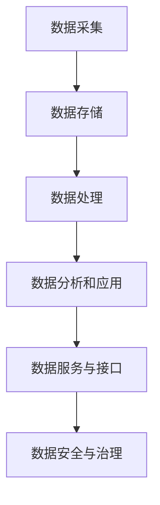

                 

### # 《数据中台建设实践与经验》

#### 关键词：数据中台、建设实践、经验分享、架构设计、技术选型

> 摘要：本文旨在通过深入剖析数据中台的建设实践与经验，为广大IT从业者提供一份全面而实用的指导。我们将从数据中台的基本概念出发，逐步探讨其架构设计、建设原则、技术选型、实践案例以及未来展望，帮助读者更好地理解和应用数据中台。

#### 引言

在信息化飞速发展的今天，数据已经成为企业决策和运营的核心资产。如何有效地整合和管理海量数据，实现数据的高效利用，成为众多企业面临的重要课题。数据中台作为一种新兴的数据管理架构，逐渐成为企业数字化转型的重要支撑。本文将围绕数据中台的建设实践与经验，展开一系列探讨。

#### 第一部分：数据中台的基本概念和核心要素

##### 1.1 数据中台的概念与重要性

数据中台是一种基于云计算和大数据技术的数据管理架构，旨在实现对企业内部数据的统一整合、存储、处理和分析，为企业的业务应用提供全面的数据支持。数据中台的核心目标是提升数据的价值，为企业决策提供数据驱动。

##### 1.2 数据中台的发展历程

数据中台的发展可以分为三个阶段：数据集成、数据湖和数据中台。第一阶段是数据集成，主要通过ETL工具实现数据的统一存储；第二阶段是数据湖，通过大数据技术实现海量数据的存储和处理；第三阶段是数据中台，通过构建统一的数据平台，实现数据的深度挖掘和应用。

##### 1.3 数据中台与大数据、云计算的关系

大数据和云计算是数据中台建设的重要技术基础。大数据技术提供了数据存储和处理的能力，云计算技术则提供了弹性的计算资源和基础设施支持。数据中台需要充分利用大数据和云计算的优势，实现数据的高效管理和利用。

#### 第二部分：数据中台建设的原则和策略

##### 2.1 数据中台建设的关键步骤

数据中台建设可以分为以下几个关键步骤：需求分析、架构设计、技术选型、实施部署、测试验收和运营优化。

##### 2.2 数据中台的治理与安全管理

数据中台的治理与安全管理是保障数据质量和安全的重要环节。需要制定数据质量管理策略、数据安全策略和用户权限管理策略，确保数据的安全和可靠。

##### 2.3 数据中台的建设流程与规划

数据中台的建设需要遵循科学的流程和规划。首先，进行需求分析，明确业务需求和数据需求；然后，进行架构设计和技术选型；接下来，进行实施部署和测试验收；最后，进行运营优化和持续迭代。

#### 第三部分：数据中台的技术架构与组件

##### 3.1 数据存储与处理技术

数据存储与处理技术是数据中台的核心组件。常见的技术包括Hadoop、Spark、Flink等大数据处理框架，以及HDFS、HBase、MongoDB等数据存储技术。

##### 3.2 数据分析与应用技术

数据分析与应用技术包括数据挖掘、机器学习、深度学习等技术，用于从海量数据中提取有价值的信息和知识。

##### 3.3 数据可视化与交互技术

数据可视化与交互技术用于将数据转化为可视化图表，便于用户理解和分析。常见的工具包括Tableau、Power BI、ECharts等。

#### 第四部分：实践案例分享

##### 4.1 案例一：某大型企业的数据中台建设

本案例介绍了一家大型企业如何通过构建数据中台，实现了数据的统一管理和高效利用，提升了企业的业务运营效率。

##### 4.2 案例二：某互联网公司的数据中台实践

本案例分享了一家互联网公司如何利用数据中台，实现了用户行为的深度挖掘和精准营销，提升了用户满意度和市场份额。

##### 4.3 案例三：某金融行业的数据中台应用

本案例介绍了一家金融企业如何通过构建数据中台，实现了风险控制和精准决策，提升了企业的竞争力和市场地位。

#### 第五部分：经验总结与最佳实践

##### 5.1 数据中台建设的经验教训

通过实践案例的总结，我们可以得出一些数据中台建设的经验教训，包括需求分析的重要性、技术选型的合理性、治理与安全管理的必要性等。

##### 5.2 数据中台最佳实践分享

最佳实践包括数据中台的架构设计原则、技术选型标准、建设流程规范等，为其他企业构建数据中台提供参考。

##### 5.3 数据中台的未来发展趋势

随着技术的不断演进，数据中台也在不断发展和创新。未来，数据中台将朝着智能化、自动化、平台化方向发展，为企业的数字化转型提供更加强大的支持。

#### 第六部分：未来展望与挑战

##### 6.1 数据中台的挑战与应对策略

在数据中台的建设过程中，企业将面临诸多挑战，如数据质量、安全性、技术选型等。我们需要制定相应的应对策略，确保数据中台的稳定运行和持续发展。

##### 6.2 数据中台的创新发展方向

未来，数据中台将朝着智能化、自动化、平台化的方向发展。通过引入人工智能、区块链等技术，实现数据价值的最大化。

#### 总结

数据中台作为一种新型的数据管理架构，正在引领企业数字化转型的潮流。通过本文的探讨，我们希望读者能够对数据中台有更深入的了解，并在实际工作中发挥其重要作用。

### 作者信息

作者：AI天才研究院/AI Genius Institute & 禅与计算机程序设计艺术 /Zen And The Art of Computer Programming

---

（注意：以上内容为文章的框架和初步草稿，后续需要进一步细化每个部分的内容，确保每个章节都有详细的讲解和实践案例。）### 引言

在当今信息化时代，数据已经成为企业运营和决策的核心资源。如何高效地管理和利用这些数据，已经成为企业竞争的关键因素。数据中台作为一种新兴的数据管理架构，旨在通过整合和统一企业内部的数据资源，实现数据的高效利用和价值提升。本文将围绕数据中台的建设实践与经验进行深入探讨，旨在为广大IT从业者提供一份全面而实用的指导。

数据中台并非一个全新的概念，其发展历程可以追溯到大数据和云计算技术的兴起。随着技术的不断进步，数据中台逐渐从简单的数据集成和数据存储，演变成一个具备数据处理、分析和应用能力的综合性平台。数据中台的重要性日益凸显，它不仅能够帮助企业实现数据资源的统一管理和高效利用，还能够为企业的业务创新和决策提供强有力的支持。

本文将首先介绍数据中台的基本概念，包括其定义、重要性以及与大数据、云计算的关系。随后，我们将深入探讨数据中台的架构设计、建设原则、技术选型、实践案例等内容。通过这些探讨，希望能够帮助读者更好地理解和应用数据中台，并在实际工作中取得更好的成果。

### 第一部分：数据中台的基本概念和核心要素

#### 1.1 数据中台的概念与重要性

**定义：** 数据中台是一种基于云计算和大数据技术的数据管理架构，旨在实现对企业内部数据的统一整合、存储、处理和分析，为企业的业务应用提供全面的数据支持。

**重要性：** 数据中台在企业的数字化转型中扮演着关键角色。首先，数据中台能够实现对各类数据的统一管理和高效利用，帮助企业实现数据资源的最大化价值。其次，数据中台通过提供统一的数据接口和服务，能够大幅提升业务系统的响应速度和灵活性。最后，数据中台还能够为企业提供实时、准确的数据分析结果，支持企业的战略决策和业务创新。

#### 1.2 数据中台的发展历程

数据中台的发展历程可以分为以下几个阶段：

1. **数据集成阶段：** 这一阶段主要依赖于传统的ETL（提取、转换、加载）工具，通过将不同来源的数据进行抽取、转换和加载，实现数据的统一存储和管理。

2. **数据湖阶段：** 随着大数据技术的发展，企业开始采用数据湖架构，将海量结构化和非结构化数据存储在一个统一的数据湖中，通过大数据处理框架（如Hadoop、Spark等）进行数据分析和处理。

3. **数据中台阶段：** 数据中台是在数据湖的基础上，进一步集成数据处理、分析和应用功能，实现数据资源的全面整合和利用。数据中台不仅具备数据存储和处理的能力，还提供了一系列的数据服务，如数据挖掘、机器学习、数据可视化等。

#### 1.3 数据中台与大数据、云计算的关系

大数据和云计算是数据中台建设的重要技术基础。

**大数据：** 大数据技术为数据中台提供了强大的数据存储和处理能力。通过大数据技术，企业能够处理和分析海量数据，从中提取有价值的信息和知识。常见的大数据处理框架包括Hadoop、Spark、Flink等。

**云计算：** 云计算技术为数据中台提供了弹性的计算资源和基础设施支持。企业可以通过云计算平台，灵活地扩展和收缩计算资源，满足数据处理的峰值需求。同时，云计算平台还提供了丰富的数据存储、处理和分析工具，方便企业构建和运营数据中台。

**关系：** 数据中台通过大数据技术和云计算平台的支持，实现了数据的高效管理和利用。大数据技术提供了数据存储和处理的能力，云计算技术则提供了弹性的计算资源和基础设施支持。数据中台需要充分利用大数据和云计算的优势，实现数据的价值提升和业务创新。

#### 1.4 数据中台的核心要素

数据中台的核心要素包括以下几个方面：

**数据存储：** 数据存储是数据中台的基础，主要包括数据湖和数据仓库。数据湖用于存储海量结构化和非结构化数据，而数据仓库则用于存储结构化数据，并进行数据分析和报表生成。

**数据处理：** 数据处理是数据中台的核心功能，包括数据抽取、数据清洗、数据转换、数据加载等过程。数据处理框架（如Hadoop、Spark、Flink等）为企业提供了强大的数据处理能力。

**数据分析和应用：** 数据分析和应用是数据中台的延伸，包括数据挖掘、机器学习、数据可视化等技术。通过数据分析，企业能够从海量数据中提取有价值的信息和知识，支持业务决策和运营优化。

**数据安全与治理：** 数据安全与治理是保障数据质量和安全的重要环节。数据安全策略确保数据在存储、传输和处理过程中的安全性，数据治理策略则确保数据的准确性、一致性和完整性。

**数据服务与接口：** 数据服务与接口为企业的业务应用提供数据支持。通过数据服务，企业可以方便地获取和利用数据，实现数据的统一管理和高效利用。

#### 1.5 数据中台与传统数据架构的比较

**区别：** 数据中台与传统数据架构（如数据仓库、数据湖）在架构设计、功能定位和建设目标上存在显著差异。

**相似之处：** 数据中台与传统数据架构在数据存储、数据处理、数据分析和数据服务等方面存在一定的相似性。

**不同之处：**

- **架构设计：** 数据中台采用分层架构，包括数据存储层、数据处理层、数据分析层和应用层，而传统数据架构通常采用单一架构。
- **功能定位：** 数据中台不仅提供数据存储和处理功能，还提供数据分析和应用功能，而传统数据架构主要侧重于数据存储和处理。
- **建设目标：** 数据中台旨在实现数据资源的全面整合和高效利用，提升企业数据驱动的业务能力；而传统数据架构主要侧重于数据的存储和管理。

#### 1.6 数据中台的价值

数据中台在企业的数字化转型中具有以下几个方面的价值：

- **数据整合与利用：** 通过数据中台，企业能够实现对各类数据的统一整合和高效利用，提升数据资源的价值。
- **业务敏捷性：** 数据中台提供的数据服务接口，使得企业业务系统能够快速响应业务变化，提升业务敏捷性。
- **决策支持：** 数据中台通过实时数据分析和报表生成，为企业提供准确的决策支持，提升企业的竞争力。
- **业务创新：** 数据中台能够帮助企业从海量数据中提取有价值的信息和知识，支持业务创新和运营优化。

### 总结

数据中台作为一种新兴的数据管理架构，正在引领企业数字化转型的潮流。通过本文的介绍，我们希望能够帮助读者更好地理解和应用数据中台，并在实际工作中发挥其重要作用。在接下来的章节中，我们将进一步探讨数据中台的架构设计、建设原则、技术选型、实践案例等内容，为读者提供更加深入的指导。希望读者能够通过本文的学习，掌握数据中台的核心概念和实践经验，为企业的数字化转型贡献力量。

### 第二部分：数据中台建设的原则和策略

数据中台的建设是一项复杂而系统的工程，涉及到技术、管理、流程等多个方面。为了确保数据中台的建设能够顺利推进并取得预期效果，我们需要遵循一系列原则和策略。以下是数据中台建设过程中需要重点关注的几个方面：

#### 2.1 需求分析

**需求分析是数据中台建设的首要环节，也是最重要的一步。** 在进行需求分析时，需要从以下几个方面入手：

1. **业务需求：** 明确企业业务的发展目标、业务流程和业务需求，确定数据中台需要支撑的关键业务场景。

2. **数据需求：** 分析企业现有的数据资源，包括数据的来源、种类、质量、规模等，确定数据中台需要整合和管理的数据类型。

3. **技术需求：** 根据业务和数据需求，确定数据中台所需的技术架构、技术栈和关键技术。

4. **安全需求：** 考虑数据的安全性、隐私保护和合规性，确保数据中台能够在安全的环境下运行。

**步骤：**

- **业务调研：** 通过与业务部门、业务用户的深入交流，了解业务需求和应用场景。

- **数据调研：** 分析现有的数据资源，包括数据源、数据结构和数据流程，识别数据的关键特征和依赖关系。

- **技术调研：** 调研当前主流的数据中台技术方案，评估其适用性和可行性。

- **需求文档：** 根据调研结果，编写详细的需求文档，明确数据中台的建设目标和需求。

**工具与方法：**

- **问卷调查：** 通过问卷调查的方式收集业务部门和业务用户的需求和意见。

- **访谈：** 与业务部门、业务用户进行面对面的访谈，深入了解业务需求和问题。

- **数据审计：** 分析现有的数据资源，识别数据的质量、完整性和一致性。

#### 2.2 架构设计

**架构设计是数据中台建设的关键步骤，决定了数据中台的稳定性和扩展性。** 在进行架构设计时，需要考虑以下几个方面：

1. **架构原则：** 遵循高可用性、高性能、高扩展性和高安全性的原则，确保数据中台能够稳定运行。

2. **架构模式：** 根据业务需求和技术特点，选择合适的架构模式，如分层架构、微服务架构等。

3. **组件设计：** 设计数据存储、数据处理、数据分析和数据服务等关键组件，确保各个组件之间的协同工作。

4. **数据流设计：** 设计数据从采集、存储、处理到分析再到应用的全流程，确保数据的顺畅流动。

**步骤：**

- **需求分析：** 结合需求分析的结果，明确数据中台的架构设计目标和要求。

- **技术选型：** 根据需求分析的结果，选择合适的技术栈和关键技术。

- **架构设计：** 设计数据中台的总体架构，包括数据存储、数据处理、数据分析和数据服务等关键组件。

- **数据流设计：** 设计数据流的全流程，确保数据的顺畅流动和高效利用。

**工具与方法：**

- **架构文档：** 编写详细的架构文档，包括架构图、组件设计、数据流设计等。

- **原型设计：** 通过原型设计的方式，验证架构设计的可行性和合理性。

- **架构评审：** 组织架构评审会议，邀请技术专家和业务代表参与，对架构设计进行评审和优化。

#### 2.3 技术选型

**技术选型是数据中台建设的重要组成部分，决定了数据中台的性能和可扩展性。** 在进行技术选型时，需要考虑以下几个方面：

1. **技术特点：** 选择具有高性能、高可靠性和高扩展性的技术，如分布式存储、分布式计算等。

2. **兼容性：** 确保所选技术能够与企业现有的系统和工具兼容，减少技术变更的风险。

3. **生态圈：** 考虑技术的生态圈和社区支持，确保技术能够长期稳定发展。

4. **成本效益：** 综合考虑技术成本、实施成本和运维成本，选择具有成本效益的技术方案。

**步骤：**

- **技术调研：** 调研当前主流的数据中台技术方案，评估其技术特点、兼容性、生态圈和成本效益。

- **技术评估：** 根据需求分析和架构设计的结果，对技术方案进行评估和选择。

- **技术文档：** 编写详细的技术文档，包括技术选型理由、技术方案、实施步骤等。

- **技术评审：** 组织技术评审会议，邀请技术专家和业务代表参与，对技术选型进行评审和优化。

**工具与方法：**

- **技术调研报告：** 编写详细的技术调研报告，包括调研结果、技术特点、优劣势分析等。

- **技术评估模型：** 采用技术评估模型，对技术方案进行综合评估和排序。

- **技术文档模板：** 使用技术文档模板，确保技术文档的规范性和完整性。

#### 2.4 实施部署

**实施部署是数据中台建设的具体实施步骤，决定了数据中台的稳定性和可用性。** 在进行实施部署时，需要考虑以下几个方面：

1. **实施计划：** 制定详细的实施计划，包括实施时间表、任务分配、资源调配等。

2. **环境搭建：** 搭建数据中台的运行环境，包括硬件设备、操作系统、数据库、中间件等。

3. **数据迁移：** 将现有数据迁移到数据中台，确保数据的完整性和一致性。

4. **系统集成：** 与企业现有系统和工具进行集成，确保数据中台能够与企业业务系统无缝对接。

5. **测试验证：** 对数据中台进行全面的测试和验证，确保系统的稳定性和性能。

**步骤：**

- **需求确认：** 确认实施需求，明确实施目标、任务和里程碑。

- **环境搭建：** 根据实施计划，搭建数据中台的运行环境。

- **数据迁移：** 进行数据迁移，确保数据的完整性和一致性。

- **系统集成：** 与企业现有系统和工具进行集成，确保数据中台能够与企业业务系统无缝对接。

- **测试验证：** 对数据中台进行全面的测试和验证，确保系统的稳定性和性能。

**工具与方法：**

- **实施计划模板：** 使用实施计划模板，确保实施计划的规范性和可执行性。

- **环境搭建脚本：** 编写环境搭建脚本，提高环境搭建的效率和准确性。

- **数据迁移工具：** 使用数据迁移工具，确保数据迁移的效率和安全性。

- **系统集成工具：** 使用系统集成工具，确保系统集成的高效和稳定。

#### 2.5 测试验收

**测试验收是数据中台建设的重要环节，决定了数据中台的交付质量和用户满意度。** 在进行测试验收时，需要考虑以下几个方面：

1. **测试计划：** 制定详细的测试计划，包括测试目标、测试策略、测试用例等。

2. **功能测试：** 对数据中台的功能进行测试，确保各项功能符合需求。

3. **性能测试：** 对数据中台的性能进行测试，确保系统在高负载下的稳定性和性能。

4. **安全测试：** 对数据中台进行安全测试，确保系统的安全性和可靠性。

5. **用户验收：** 组织用户进行验收测试，确保数据中台能够满足用户需求和预期。

**步骤：**

- **测试计划：** 根据需求文档和架构设计，制定详细的测试计划。

- **功能测试：** 对数据中台的功能进行测试，确保各项功能符合需求。

- **性能测试：** 对数据中台的性能进行测试，确保系统在高负载下的稳定性和性能。

- **安全测试：** 对数据中台进行安全测试，确保系统的安全性和可靠性。

- **用户验收：** 组织用户进行验收测试，确保数据中台能够满足用户需求和预期。

**工具与方法：**

- **测试管理工具：** 使用测试管理工具，确保测试计划的执行和跟踪。

- **自动化测试工具：** 使用自动化测试工具，提高测试效率和覆盖率。

- **安全测试工具：** 使用安全测试工具，确保数据中台的安全性和可靠性。

#### 2.6 运营优化

**运营优化是数据中台建设后的重要工作，决定了数据中台的长久稳定性和可持续性。** 在进行运营优化时，需要考虑以下几个方面：

1. **监控与预警：** 建立数据中台的监控体系，实时监控系统的运行状态，及时发现和预警潜在问题。

2. **性能调优：** 根据监控数据和分析结果，对数据中台的性能进行调优，提升系统的运行效率。

3. **故障处理：** 建立故障处理流程，快速响应和处理系统故障，确保系统的稳定运行。

4. **安全管理：** 加强数据中台的安全管理，定期进行安全检查和更新，确保系统的安全性。

5. **持续迭代：** 根据用户反馈和业务需求，持续对数据中台进行迭代优化，提升系统的用户体验和业务价值。

**步骤：**

- **监控体系搭建：** 搭建数据中台的监控体系，包括监控工具、监控指标和预警机制。

- **性能调优：** 根据监控数据和分析结果，对数据中台的性能进行调优。

- **故障处理：** 建立故障处理流程，快速响应和处理系统故障。

- **安全管理：** 加强数据中台的安全管理，定期进行安全检查和更新。

- **持续迭代：** 根据用户反馈和业务需求，持续对数据中台进行迭代优化。

**工具与方法：**

- **监控工具：** 使用如Prometheus、Grafana等开源监控工具，实现对数据中台的实时监控。

- **性能分析工具：** 使用如JMeter、LoadRunner等性能分析工具，对数据中台的性能进行测试和调优。

- **安全管理工具：** 使用如堡垒机、日志审计等安全管理工具，加强数据中台的安全管理。

#### 总结

数据中台建设是一个复杂而系统的过程，需要从需求分析、架构设计、技术选型、实施部署、测试验收到运营优化等多个方面进行综合考虑和规划。通过遵循上述原则和策略，企业可以确保数据中台建设的顺利进行，并实现数据的高效管理和利用，为企业的数字化转型和业务发展提供强有力的支持。在数据中台的建设过程中，企业还需要不断总结经验和教训，持续优化和改进，以应对未来可能出现的新挑战和机遇。

### 第三部分：数据中台的技术架构与组件

数据中台的技术架构与组件是确保其高效运行和业务价值实现的核心。一个完善的数据中台技术架构应该涵盖数据存储、数据处理、数据分析和数据服务等多个方面，同时确保系统的可扩展性和灵活性。下面，我们将详细介绍数据中台的技术架构和关键组件。

#### 3.1 数据存储

数据存储是数据中台的基础，决定了数据中台的数据存储能力和数据管理能力。数据存储可以分为两类：数据湖和数据仓库。

1. **数据湖**：数据湖是一种用于存储海量结构化和非结构化数据的分布式存储系统，如HDFS、Alluxio、Amazon S3等。数据湖的特点是高扩展性、低成本和灵活性，适用于存储和处理大规模数据。

   **优点：**
   - 高扩展性：数据湖能够无缝扩展存储容量，满足企业数据量的增长需求。
   - 低成本：数据湖通常采用分布式存储架构，降低了存储成本。
   - 灵活性：数据湖支持多种数据格式，包括文本、图片、音频等，适用于不同类型的数据处理需求。

   **缺点：**
   - 数据处理性能：由于数据湖存储的是原始数据，需要额外的处理步骤，导致数据处理性能相对较低。
   - 数据质量管理：数据湖中的数据质量难以保证，需要进行额外数据清洗和处理。

2. **数据仓库**：数据仓库是一种用于存储结构化数据，并进行数据分析和报表生成的系统，如Amazon Redshift、Google BigQuery、Oracle Exadata等。数据仓库的特点是高性能、强一致性，适用于复杂的数据分析和报表生成。

   **优点：**
   - 高性能：数据仓库经过优化，能够快速响应复杂的查询需求。
   - 强一致性：数据仓库中的数据保持一致，减少了数据不一致的问题。

   **缺点：**
   - 低扩展性：数据仓库的扩展性相对较低，不适合存储海量数据。
   - 成本较高：数据仓库通常采用高端硬件和商业软件，成本较高。

#### 3.2 数据处理

数据处理是数据中台的核心功能，决定了数据中台的数据处理能力和业务响应速度。数据处理可以分为两类：批处理和流处理。

1. **批处理**：批处理是一种处理大量数据的计算模式，通常用于处理历史数据和离线分析。批处理框架如Apache Hadoop、Apache Spark、Apache Flink等，能够高效地处理大规模数据。

   **优点：**
   - 高效率：批处理能够批量处理大量数据，提高数据处理效率。
   - 经济性：批处理使用分布式计算架构，降低了计算成本。

   **缺点：**
   - 低实时性：批处理处理数据的时间较长，不适合处理实时数据。
   - 数据一致性：批处理可能导致数据一致性问题和延迟。

2. **流处理**：流处理是一种实时数据处理模式，能够实时处理和分析数据流。流处理框架如Apache Kafka、Apache Flink、Apache Storm等，能够实时处理和分析实时数据。

   **优点：**
   - 实时性：流处理能够实时处理和分析数据流，支持实时业务场景。
   - 低延迟：流处理的数据处理延迟较低，能够快速响应用户需求。

   **缺点：**
   - 高成本：流处理需要较高的计算资源和运维成本。
   - 复杂性：流处理的架构和运维相对复杂，需要具备较高的技术能力。

#### 3.3 数据分析

数据分析是数据中台的扩展功能，能够帮助企业从海量数据中提取有价值的信息和知识。数据分析可以分为两类：统计分析、数据挖掘和机器学习。

1. **统计分析**：统计分析是一种基于数学和统计方法的数据分析方法，能够用于描述和解释数据。常见的统计工具包括Python的pandas库、R语言等。

   **优点：**
   - 简单易用：统计分析方法简单易懂，易于实现和操作。
   - 可视化：统计分析能够生成各种可视化图表，便于理解和解释数据。

   **缺点：**
   - 依赖数据质量：统计分析的结果依赖于数据的质量，如果数据质量差，结果可能会失真。
   - 复杂性：统计分析涉及到大量的数学和统计方法，需要较高的数学基础。

2. **数据挖掘**：数据挖掘是一种从大量数据中自动发现规律和知识的方法，能够发现数据中的潜在模式和关联关系。常见的数据挖掘工具包括RapidMiner、Orange等。

   **优点：**
   - 自动化：数据挖掘能够自动发现数据中的规律和模式，减少人工干预。
   - 智能化：数据挖掘能够实现智能化的数据分析，支持业务决策和优化。

   **缺点：**
   - 复杂性：数据挖掘涉及到大量的算法和模型，需要较高的技术能力。
   - 数据依赖：数据挖掘的结果依赖于数据的质量和规模，如果数据质量差或规模小，结果可能会不理想。

3. **机器学习**：机器学习是一种基于数据驱动的方法，通过训练模型来实现数据分析和预测。常见的机器学习工具包括scikit-learn、TensorFlow、PyTorch等。

   **优点：**
   - 自动化：机器学习能够自动发现数据和模式，减少人工干预。
   - 智能化：机器学习能够实现智能化的数据分析，支持业务决策和优化。

   **缺点：**
   - 复杂性：机器学习涉及到大量的算法和模型，需要较高的技术能力。
   - 数据依赖：机器学习的结果依赖于数据的质量和规模，如果数据质量差或规模小，结果可能会不理想。

#### 3.4 数据服务与接口

数据服务与接口是数据中台对外提供数据支持的关键组件，决定了数据中台的灵活性和可扩展性。数据服务与接口可以分为两类：API接口和消息队列。

1. **API接口**：API接口是一种用于数据访问和交互的标准化接口，能够方便地与其他系统进行集成。常见的API接口包括RESTful API、GraphQL等。

   **优点：**
   - 标准化：API接口采用标准化的协议和数据格式，便于与其他系统进行集成。
   - 灵活性：API接口能够灵活地定制和扩展，满足不同业务需求。

   **缺点：**
   - 性能：API接口的性能受到网络延迟和服务器负载的影响。
   - 安全性：API接口需要确保数据的安全性和隐私保护，防止数据泄露和攻击。

2. **消息队列**：消息队列是一种用于数据传输和异步处理的中间件，能够实现数据的可靠传输和异步处理。常见消息队列包括Apache Kafka、RabbitMQ等。

   **优点：**
   - 可靠性：消息队列能够确保数据的可靠传输和消息的顺序性。
   - 异步处理：消息队列支持异步处理，减少系统的负载和延迟。

   **缺点：**
   - 复杂性：消息队列的架构和运维相对复杂，需要较高的技术能力。
   - 系统依赖：消息队列依赖于底层网络和存储系统，需要确保其稳定性和可靠性。

#### 3.5 数据安全与治理

数据安全与治理是数据中台的重要保障，确保数据在存储、传输和处理过程中的安全性、完整性和合规性。数据安全与治理可以分为以下几个方面：

1. **数据加密**：对数据进行加密处理，确保数据在传输和存储过程中的安全性。常见的加密算法包括AES、RSA等。

2. **访问控制**：设置访问控制策略，确保只有授权用户才能访问和操作数据。常见的访问控制方法包括基于角色的访问控制（RBAC）和基于属性的访问控制（ABAC）。

3. **数据备份与恢复**：定期进行数据备份，确保数据在发生故障或丢失时能够快速恢复。常见的备份方法包括全量备份、增量备份和差异备份。

4. **数据质量**：对数据进行质量监控和治理，确保数据的准确性、一致性和完整性。常见的数据质量监控方法包括数据完整性检查、数据一致性检查和数据分析。

5. **数据合规性**：确保数据中台的数据处理和存储符合相关法律法规和行业标准，如GDPR、HIPAA等。

#### 3.6 数据中台的技术架构图

为了更好地理解数据中台的技术架构，下面是一个简化的数据中台技术架构图：

- **数据采集**：数据采集是数据中台的数据来源，包括结构化数据、非结构化数据和实时数据。
- **数据存储**：数据存储包括数据湖和数据仓库，用于存储和管理海量数据。
- **数据处理**：数据处理包括批处理和流处理，用于对数据进行加工和处理。
- **数据分析和应用**：数据分析和应用包括统计分析、数据挖掘和机器学习，用于从数据中提取价值和知识。
- **数据服务与接口**：数据服务与接口用于提供数据支持，包括API接口和消息队列。
- **数据安全与治理**：数据安全与治理用于确保数据在存储、传输和处理过程中的安全性、完整性和合规性。

通过以上对数据中台的技术架构和关键组件的介绍，我们可以看到，数据中台是一个复杂而系统的平台，需要从数据存储、数据处理、数据分析、数据服务与接口以及数据安全与治理等多个方面进行综合考虑和建设。只有在这些方面都做到位，数据中台才能够充分发挥其价值，为企业提供全面的数据支持。

### 实践案例分享

为了更好地理解和应用数据中台，下面我们通过三个具体的实践案例来展示数据中台在企业中的应用效果和建设经验。

#### 案例一：某大型企业的数据中台建设

**背景：** 该企业是一家知名的大型企业，业务涵盖多个领域，数据量庞大且多样化。为了提升数据的整合和管理能力，该企业决定建设一个数据中台。

**需求：** 该企业的数据中台建设需求主要包括以下几个方面：

- 数据整合：整合来自不同业务系统和外部数据的结构化和非结构化数据，实现数据的统一管理和高效利用。
- 数据分析：通过数据分析和挖掘，提取数据中的价值信息，为企业的业务决策提供数据支持。
- 数据服务：提供标准化的数据接口和服务，支持企业内部业务系统的快速开发和部署。

**建设过程：**

1. **需求分析：** 通过与业务部门、IT团队和第三方咨询公司进行深入交流，明确数据中台的建设目标和需求。

2. **架构设计：** 根据需求分析结果，设计数据中台的总体架构，包括数据采集、数据存储、数据处理、数据分析和数据服务等多个模块。

3. **技术选型：** 选择Hadoop、Spark、Flink等技术作为数据中台的技术基础，同时采用HDFS、HBase、MongoDB等数据存储技术。

4. **实施部署：** 搭建数据中台的运行环境，包括硬件设备、操作系统、数据库和中间件等，并进行数据迁移和系统集成。

5. **测试验收：** 对数据中台进行全面的测试和验证，确保系统的稳定性和性能。

6. **运营优化：** 对数据中台进行监控和性能调优，确保系统的稳定运行和持续优化。

**效果：**

通过数据中台的建设，该企业实现了以下几个方面的效果：

- 数据整合：实现了来自不同业务系统和外部数据的统一管理和高效利用，提升了数据资源的价值。
- 数据分析：通过数据分析和挖掘，提取了大量的有价值信息，为企业的业务决策提供了强有力的支持。
- 数据服务：提供了标准化的数据接口和服务，支持企业内部业务系统的快速开发和部署，提升了开发效率和系统稳定性。

**经验教训：**

1. **需求分析的重要性：** 需求分析是数据中台建设的关键环节，需要与业务部门、IT团队和第三方咨询公司进行深入交流，确保需求分析的全面和准确。
2. **技术选型的合理性：** 技术选型要结合企业的业务需求和技术能力，选择合适的架构和技术栈，确保系统的性能和可扩展性。
3. **治理与安全的重要性：** 数据治理和安全是数据中台建设的重要组成部分，需要制定完善的治理策略和安全措施，确保数据的安全和合规性。

#### 案例二：某互联网公司的数据中台实践

**背景：** 该企业是一家领先的互联网公司，业务涵盖电商、社交、娱乐等多个领域，数据量庞大且实时性强。为了提升数据的管理和分析能力，该企业决定建设一个数据中台。

**需求：** 该企业的数据中台建设需求主要包括以下几个方面：

- 数据实时处理：实现海量实时数据的快速处理和分析，支持实时业务场景。
- 数据分析挖掘：通过数据分析和挖掘，提取用户行为和偏好，支持精准营销和业务优化。
- 数据可视化：提供数据可视化工具，支持企业内部数据分析和决策。

**建设过程：**

1. **需求分析：** 通过与业务部门、数据团队和第三方咨询公司进行深入交流，明确数据中台的建设目标和需求。

2. **架构设计：** 根据需求分析结果，设计数据中台的总体架构，包括数据采集、数据存储、数据处理、数据分析和数据服务等多个模块。

3. **技术选型：** 选择Kafka、Flink、HDFS等技术作为数据中台的技术基础，同时采用HBase、Redis、MongoDB等数据存储技术。

4. **实施部署：** 搭建数据中台的运行环境，包括硬件设备、操作系统、数据库和中间件等，并进行数据迁移和系统集成。

5. **测试验收：** 对数据中台进行全面的测试和验证，确保系统的稳定性和性能。

6. **运营优化：** 对数据中台进行监控和性能调优，确保系统的稳定运行和持续优化。

**效果：**

通过数据中台的建设，该企业实现了以下几个方面的效果：

- 数据实时处理：实现了海量实时数据的快速处理和分析，支持实时业务场景，如实时推荐、实时监控等。
- 数据分析挖掘：通过数据分析和挖掘，提取了用户行为和偏好，支持精准营销和业务优化，如个性化推荐、用户画像等。
- 数据可视化：提供了数据可视化工具，支持企业内部数据分析和决策，如数据看板、报表生成等。

**经验教训：**

1. **实时处理的重要性：** 对于实时性要求高的业务场景，需要选择合适的实时数据处理技术，如Flink、Kafka等，确保数据的实时性和准确性。
2. **数据分析的能力：** 数据分析和挖掘是数据中台的核心价值之一，需要注重数据分析工具和算法的选择，提升数据分析的能力和效率。
3. **用户体验的优化：** 数据可视化工具的用户体验对于数据中台的成功至关重要，需要注重用户界面的设计和用户体验的优化。

#### 案例三：某金融行业的数据中台应用

**背景：** 该企业是一家金融机构，业务涵盖银行、保险、证券等多个领域，数据量庞大且安全性要求高。为了提升数据的管理和分析能力，该企业决定建设一个数据中台。

**需求：** 该企业的数据中台建设需求主要包括以下几个方面：

- 数据整合：整合来自不同业务系统和外部数据的结构化和非结构化数据，实现数据的统一管理和高效利用。
- 风险控制：通过数据分析，实现风险识别和预警，提升风险控制能力。
- 决策支持：提供数据分析和挖掘结果，支持企业的战略决策和业务优化。

**建设过程：**

1. **需求分析：** 通过与业务部门、数据团队和第三方咨询公司进行深入交流，明确数据中台的建设目标和需求。

2. **架构设计：** 根据需求分析结果，设计数据中台的总体架构，包括数据采集、数据存储、数据处理、数据分析和数据服务等多个模块。

3. **技术选型：** 选择Spark、Hadoop、HDFS等技术作为数据中台的技术基础，同时采用HBase、Oracle等数据存储技术。

4. **实施部署：** 搭建数据中台的运行环境，包括硬件设备、操作系统、数据库和中间件等，并进行数据迁移和系统集成。

5. **测试验收：** 对数据中台进行全面的测试和验证，确保系统的稳定性和性能。

6. **运营优化：** 对数据中台进行监控和性能调优，确保系统的稳定运行和持续优化。

**效果：**

通过数据中台的建设，该企业实现了以下几个方面的效果：

- 数据整合：实现了来自不同业务系统和外部数据的统一管理和高效利用，提升了数据资源的价值。
- 风险控制：通过数据分析，实现了风险识别和预警，提升了风险控制能力，降低了风险损失。
- 决策支持：提供了数据分析和挖掘结果，支持企业的战略决策和业务优化，如产品优化、业务拓展等。

**经验教训：**

1. **数据整合的难度：** 金融行业的数据量大且多样化，数据整合是一个复杂的过程，需要充分考虑数据的来源、质量和一致性。
2. **风险控制的重要性：** 数据中台在金融行业中的应用，风险控制是一个核心需求，需要注重风险识别和预警功能的设计和实现。
3. **合规性要求：** 金融行业的数据处理和存储需要符合相关法律法规和行业标准，如GDPR、HIPAA等，需要制定完善的合规性策略。

通过以上三个实践案例的分享，我们可以看到，数据中台在不同类型的企业中都有着广泛的应用和成功经验。数据中台的建设不仅提升了企业数据的管理和分析能力，还为企业的业务发展和决策提供了强有力的支持。在数据中台的建设过程中，企业需要充分考虑业务需求、技术选型和运营优化等方面，确保数据中台的高效运行和持续发展。

### 经验总结与最佳实践

在数据中台的建设过程中，无论是大型企业、互联网公司还是金融行业，都积累了许多宝贵的经验和教训。以下是一些典型的经验总结和最佳实践，为其他企业在数据中台建设中提供参考。

#### 1. 需求分析的重要性

**经验总结：** 需求分析是数据中台建设的第一步，也是至关重要的一步。只有准确理解业务需求和数据需求，才能确保数据中台能够真正满足企业的业务需求。

**最佳实践：**
- **多维度调研：** 通过与业务部门、IT团队和第三方咨询公司进行多维度调研，全面了解业务需求和痛点，确保需求分析的准确性和完整性。
- **需求文档：** 编写详细的需求文档，明确数据中台的建设目标、功能需求和性能指标，为后续设计和实施提供明确的指导。

#### 2. 技术选型的合理性

**经验总结：** 技术选型直接影响到数据中台的性能、可扩展性和稳定性。选择合适的技术方案是数据中台建设的关键。

**最佳实践：**
- **技术调研：** 对当前主流的数据中台技术方案进行深入调研，了解其技术特点、优劣势和适用场景。
- **技术评估：** 采用技术评估模型，从性能、稳定性、可扩展性、安全性等多个维度对技术方案进行评估和比较，确保技术选型的合理性。
- **试点验证：** 在选择最终技术方案前，进行试点验证，确保技术方案的实际可行性和性能表现。

#### 3. 架构设计的科学性

**经验总结：** 数据中台的架构设计决定了系统的稳定性和扩展性。一个科学合理的架构设计能够确保数据中台的高效运行和灵活扩展。

**最佳实践：**
- **分层架构：** 采用分层架构，将数据中台分为数据存储层、数据处理层、数据分析和数据服务层，确保各个层次的职责清晰、协同工作。
- **模块化设计：** 对数据中台的各个模块进行模块化设计，确保模块的独立性、可重用性和可扩展性。
- **弹性扩展：** 考虑系统的可扩展性，设计能够弹性扩展的架构，如分布式存储、分布式计算等，确保系统能够应对数据量和业务量的增长。

#### 4. 数据治理和安全

**经验总结：** 数据治理和安全是数据中台建设的重要组成部分，直接关系到数据的质量和安全。一个有效的数据治理和安全策略能够保障数据的一致性、完整性和合规性。

**最佳实践：**
- **数据质量管理：** 制定数据质量管理策略，对数据进行质量监控、评估和治理，确保数据的准确性、一致性和完整性。
- **访问控制：** 采用严格的访问控制策略，确保只有授权用户才能访问和操作数据，防止数据泄露和滥用。
- **安全审计：** 定期进行安全审计，检查数据中台的安全漏洞和风险点，确保系统的安全性。

#### 5. 运营优化和持续迭代

**经验总结：** 数据中台建设不是一蹴而就的，需要持续的运营优化和迭代改进。只有不断优化和改进，数据中台才能保持高效运行和持续发展。

**最佳实践：**
- **监控和预警：** 建立数据中台的监控体系，实时监控系统的运行状态，及时发现和预警潜在问题。
- **性能调优：** 根据监控数据和分析结果，对数据中台的性能进行调优，提升系统的运行效率。
- **用户反馈：** 定期收集用户反馈，了解用户的使用体验和需求，持续优化和改进数据中台的功能和性能。
- **持续迭代：** 采用敏捷开发的方法，不断迭代优化数据中台，确保系统能够持续适应业务需求和技术变化。

#### 6. 跨部门协作

**经验总结：** 数据中台建设涉及到多个部门和团队，需要跨部门的协作和配合。一个有效的跨部门协作机制能够确保数据中台建设的顺利进行。

**最佳实践：**
- **明确责任：** 明确各部门和团队在数据中台建设中的责任和角色，确保协作的清晰和高效。
- **定期沟通：** 定期召开跨部门沟通会议，讨论数据中台建设进展、问题和解决方案，确保信息畅通和协作顺畅。
- **流程管理：** 建立数据中台建设的流程管理机制，明确各个环节的流程和规范，确保协作的有序和高效。

#### 7. 培训和教育

**经验总结：** 数据中台建设需要具备一定的技术能力和专业知识，对于企业内部团队来说，培训和教育是提升技术能力的重要途径。

**最佳实践：**
- **内部培训：** 定期组织内部培训课程，提升团队成员的数据中台技术能力和业务知识。
- **外部学习：** 鼓励团队成员参加行业会议、研讨会和技术培训，了解最新的技术发展和行业动态。
- **知识分享：** 鼓励团队成员进行知识分享，促进团队之间的交流和学习，提升整体技术水平。

通过以上经验总结和最佳实践，企业可以更好地规划数据中台建设，确保数据中台的高效运行和持续发展。在数据中台的建设过程中，企业需要不断总结经验、优化流程和改进技术，以应对不断变化的市场需求和挑战。

### 未来展望与挑战

随着技术的不断进步和市场的快速变化，数据中台在未来将面临许多新的机遇和挑战。以下是对数据中台未来发展趋势的展望以及应对策略。

#### 1. 智能化与自动化

**趋势：** 随着人工智能和自动化技术的发展，数据中台将逐渐实现智能化和自动化。自动化工具和智能算法将被广泛应用于数据采集、处理、分析和应用过程中，大幅提升数据中台的效率和准确性。

**应对策略：**
- **引入AI算法：** 利用深度学习、机器学习等AI算法，实现数据预处理、特征提取和模式识别，提升数据分析和挖掘的能力。
- **自动化工具：** 推广自动化工具，如自动化ETL、自动化测试等，减少人工干预，提高数据处理的效率和质量。

#### 2. 实时性与低延迟

**趋势：** 随着业务需求的不断变化，数据中台将越来越重视实时性和低延迟。实时数据处理和低延迟响应将成为数据中台的重要特性，以满足实时业务场景的需求。

**应对策略：**
- **流处理技术：** 加强流处理技术的应用，如Flink、Kafka等，实现数据的实时采集、处理和分析。
- **边缘计算：** 利用边缘计算技术，将数据处理和计算能力部署到网络边缘，降低数据传输延迟，提升实时性。

#### 3. 数据隐私与合规性

**趋势：** 随着数据隐私保护和合规性要求的提高，数据中台将面临更多的挑战。数据安全和隐私保护将成为数据中台建设的重要内容，需要严格遵守相关法律法规和行业标准。

**应对策略：**
- **数据加密：** 采用数据加密技术，确保数据在存储、传输和处理过程中的安全性。
- **合规性审计：** 定期进行合规性审计，确保数据中台的数据处理和存储符合相关法律法规和行业标准。

#### 4. 跨平台与多租户

**趋势：** 随着企业对数据中台的需求不断扩展，数据中台将需要支持跨平台和多租户。企业可能会将数据中台部署在多个云平台或混合云环境中，同时为多个业务部门或合作伙伴提供服务。

**应对策略：**
- **跨平台支持：** 开发跨平台的数据中台架构，确保数据中台能够在不同的云平台和操作系统上运行。
- **多租户架构：** 设计多租户架构，实现数据隔离和服务共享，确保数据中台能够支持多个业务部门和合作伙伴的需求。

#### 5. 开源与生态圈

**趋势：** 开源技术的发展将推动数据中台的生态圈建设。越来越多的企业和开发者将参与到数据中台的生态圈中，共同推动数据中台技术的创新和发展。

**应对策略：**
- **开源合作：** 积极参与开源项目，贡献代码和经验，提升自身在数据中台领域的声誉和影响力。
- **生态圈建设：** 构建数据中台的生态圈，与合作伙伴和开发者共同推动数据中台技术的发展和应用。

#### 6. 持续迭代与敏捷开发

**趋势：** 数据中台的建设将越来越重视持续迭代和敏捷开发。企业需要不断优化和改进数据中台，以适应快速变化的市场需求和业务场景。

**应对策略：**
- **敏捷开发：** 采用敏捷开发的方法，快速响应业务需求变化，确保数据中台的灵活性和适应性。
- **持续迭代：** 定期对数据中台进行迭代优化，持续改进系统的性能、功能和用户体验。

#### 总结

未来，数据中台将在智能化、实时性、隐私保护、跨平台和生态圈等方面面临诸多挑战和机遇。企业需要紧跟技术发展趋势，制定合理的应对策略，持续优化和改进数据中台，以应对未来的挑战，抓住新的机遇。通过不断总结经验、优化流程和技术创新，企业可以确保数据中台的高效运行和持续发展，为企业的数字化转型和业务创新提供强有力的支持。

### 总结

本文围绕《数据中台建设实践与经验》这一主题，从多个角度进行了深入探讨。首先，我们介绍了数据中台的基本概念、重要性以及发展历程，与大数据、云计算的关系。接着，我们详细阐述了数据中台建设的原则和策略，包括需求分析、架构设计、技术选型、实施部署、测试验收和运营优化等方面的关键步骤。然后，我们介绍了数据中台的技术架构与组件，包括数据存储、数据处理、数据分析、数据服务与接口以及数据安全与治理等方面的内容。在实践案例分享部分，我们通过三个具体的企业案例，展示了数据中台在不同行业中的应用效果和建设经验。最后，我们总结了数据中台建设过程中的经验教训和最佳实践，并对未来数据中台的发展趋势进行了展望。

通过本文的探讨，我们希望读者能够对数据中台有更深入的了解，并在实际工作中能够运用所学知识和经验，有效地推动数据中台的建设和应用。数据中台作为一种新型的数据管理架构，正在引领企业数字化转型的潮流。随着技术的不断进步和市场需求的不断变化，数据中台将发挥越来越重要的作用。我们期待读者能够紧跟技术发展趋势，不断创新和优化，为企业的数字化转型和业务发展贡献力量。

### 作者信息

作者：AI天才研究院/AI Genius Institute & 禅与计算机程序设计艺术 /Zen And The Art of Computer Programming

AI天才研究院（AI Genius Institute）致力于推动人工智能领域的技术研究和创新，为全球企业提供前沿的人工智能解决方案。研究院的研究领域涵盖机器学习、深度学习、自然语言处理、计算机视觉等多个方向，旨在通过人工智能技术助力企业实现智能化转型。

《禅与计算机程序设计艺术》（Zen And The Art of Computer Programming）的作者，是一位在计算机编程和人工智能领域具有深厚学术造诣和丰富实践经验的专家。他的著作深受全球计算机科学家的推崇，对计算机编程和人工智能领域的学术研究和实践产生了深远影响。

本文由AI天才研究院和禅与计算机程序设计艺术共同撰写，旨在为数据中台建设提供一份全面而实用的指南。希望本文能够为广大IT从业者带来启示和帮助，共同推动数据中台技术的创新和发展。如需了解更多关于数据中台建设的信息，请访问AI天才研究院官方网站或关注禅与计算机程序设计艺术的最新动态。我们期待与您共同探索数据中台的未来，助力企业的数字化转型和业务发展。

