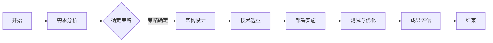
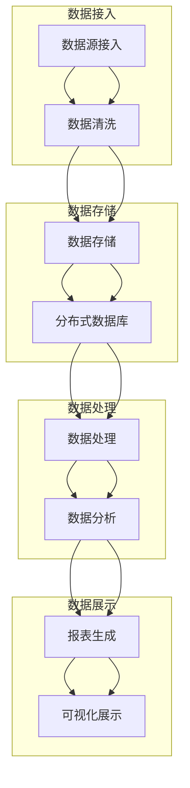
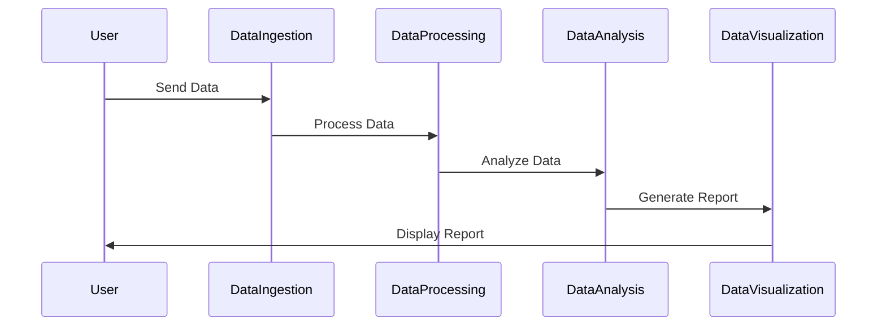

                 

### 设计《数据仓库现代化改造策略》目录大纲

在设计《数据仓库现代化改造策略》的目录大纲时，我们需要确保每个章节都能够清晰地呈现文章的核心内容，并且有助于读者理解数据仓库现代化改造的整个过程。以下是详细的目录大纲设计：

---

## 一、背景介绍

### 1.1 问题的背景
- **1.1.1 数据仓库在现代企业中的重要性**
  - 数据仓库的定义及其在现代企业中的应用。
  - 数据仓库在决策支持系统中的核心地位。
- **1.1.2 现代数据仓库面临的挑战**
  - 数据量的急剧增长。
  - 技术迭代的压力。
  - 业务需求的变化。
- **1.1.3 数据仓库现代化改造的意义**
  - 提高数据仓库的性能和可扩展性。
  - 增强数据仓库的安全性和可靠性。
  - 满足新兴业务场景的需求。

### 1.2 问题描述
- **1.2.1 数据仓库现代化改造的具体目标和需求**
  - 数据仓库的敏捷性。
  - 数据处理的效率。
  - 用户交互的便捷性。
- **1.2.2 现有数据仓库架构存在的问题和不足**
  - 数据整合的复杂性。
  - 数据同步的延迟。
  - 报表生成的低效。
- **1.2.3 数据仓库现代化改造的边界与外延**
  - 确定改造的范围。
  - 预防潜在的风险。

### 1.3 问题解决
- **1.3.1 数据仓库现代化改造的策略和方法**
  - 数据治理。
  - 技术选型。
  - 架构优化。
- **1.3.2 数据仓库改造的关键步骤**
  - 现状评估。
  - 需求分析。
  - 架构设计。
  - 实施与部署。
- **1.3.3 数据仓库现代化改造的成果评估**
  - 性能指标。
  - 成本效益。
  - 用户反馈。

### 1.4 概念结构与核心要素组成
- **1.4.1 数据仓库的核心概念**
  - 数据仓库与传统数据库的区别。
  - 数据仓库的三层架构。
- **1.4.2 数据仓库的组成要素**
  - 数据存储。
  - 数据处理。
  - 数据分析。
- **1.4.3 数据仓库现代化的关键指标**
  - 数据完整性。
  - 数据一致性。
  - 数据可用性。

## 二、核心概念与联系

### 2.1 核心概念原理
- **2.1.1 数据仓库的概念解析**
  - 数据仓库的定义。
  - 数据仓库的发展历程。
- **2.1.2 数据仓库与传统数据系统的区别**
  - 数据仓库的特定用途。
  - 数据仓库的架构特点。
- **2.1.3 数据仓库的基本架构**
  - 数据仓库的分层结构。
  - 数据仓库的组件构成。

### 2.2 概念属性特征对比表格
- **2.2.1 数据仓库与传统数据系统的属性对比**
  - 数据类型。
  - 数据访问频率。
  - 数据存储结构。
- **2.2.2 数据仓库现代化改造的属性对比**
  - 新技术的引入。
  - 架构优化的效果。
  - 性能提升的幅度。

### 2.3 ER实体关系图架构
```mermaid
erDiagram
    Customer ||--|{ Order }|--| Product
    Customer ||--|{ Inventory }|
    Product ||--|{ SalesData }|
    SalesData ||--|{ Analytics }|
```

## 三、算法原理讲解

### 3.1 算法mermaid流程图


### 3.2 Python源代码阐述
```python
# Example Python code for a simple ETL process
def extract_data(source):
    # Code to extract data from the source
    pass

def transform_data(data):
    # Code to transform the data
    pass

def load_data(data, target):
    # Code to load the data into the target
    pass

# Main function to execute the ETL process
def main():
    source = "data_source"
    target = "data_warehouse"
    data = extract_data(source)
    transformed_data = transform_data(data)
    load_data(transformed_data, target)

if __name__ == "__main__":
    main()
```

### 3.3 算法原理的数学模型和公式
- **ETL过程的数学模型**
  - E: $E(T) = \sum_{i=1}^{n} E(D_i) + \sum_{i=1}^{n} T(D_i)$
  - T: $T(D) = \sum_{i=1}^{n} T(D_i) + C(D)$
  - L: $L(D) = \sum_{i=1}^{n} L(D_i)$

- **性能评估公式**
  - $P = \frac{E + T + L}{3}$

### 3.4 详细讲解与举例说明
- **详细讲解**
  - ETL过程的每一个步骤及其重要性。
  - 数据仓库现代化的关键算法和优化策略。
- **举例说明**
  - 通过具体的业务场景来说明数据仓库现代化改造的实际效果。

## 四、系统分析与架构设计方案

### 4.1 问题场景介绍
- **4.1.1 典型的企业数据仓库**
  - 数据源的类型和数量。
  - 数据处理的复杂性。
  - 数据分析的多样化需求。
- **4.1.2 现代化改造的目标**
  - 数据处理的效率提升。
  - 数据分析的可扩展性。
  - 数据安全和隐私保护。

### 4.2 系统功能设计
- **4.2.1 数据整合**
  - 多源数据的接入和管理。
  - 数据清洗和预处理。
- **4.2.2 数据存储**
  - 分布式存储架构的设计。
  - 数据压缩和加密技术。
- **4.2.3 数据分析**
  - 数据挖掘和机器学习。
  - 实时数据处理和分析。

### 4.3 系统架构设计


### 4.4 系统接口设计
- **4.4.1 接口类型**
  - API接口。
  - Web接口。
  - 数据流接口。
- **4.4.2 接口规范**
  - RESTful API规范。
  - WebSocket协议。

### 4.5 系统交互


## 五、项目实战

### 5.1 环境安装
- **5.1.1 硬件环境**
  - 服务器配置。
  - 存储容量规划。
- **5.1.2 软件环境**
  - 操作系统。
  - 数据库软件。
  - 分析工具。

### 5.2 系统核心实现
- **5.2.1 数据接入**
  - 数据源配置。
  - 数据流管理。
- **5.2.2 数据存储**
  - 数据库设计。
  - 数据同步机制。
- **5.2.3 数据分析**
  - 数据挖掘算法。
  - 实时数据处理。

### 5.3 代码应用解读与分析
- **5.3.1 数据接入代码解读**
  - 解析数据接入的逻辑。
  - 分析数据清洗的流程。
- **5.3.2 数据存储代码解读**
  - 数据库表的创建。
  - 数据存储的策略。

### 5.4 实际案例分析与讲解
- **5.4.1 案例背景**
  - 企业的业务场景。
  - 数据仓库的现状。
- **5.4.2 案例分析**
  - 数据仓库的改造过程。
  - 改造后的效果评估。

### 5.5 项目小结
- **5.5.1 改造成功的关键因素**
  - 技术选型的正确性。
  - 团队协作的有效性。
  - 项目管理的精细化。

## 六、最佳实践与小结

### 6.1 最佳实践 Tips
- **6.1.1 需求分析**
  - 确保需求的明确和优先级。
- **6.1.2 技术选型**
  - 选择成熟稳定的技术栈。
- **6.1.3 架构设计**
  - 灵活扩展的架构设计。
- **6.1.4 系统测试**
  - 充分进行系统测试和验证。

### 6.2 小结
- **6.2.1 数据仓库现代化改造的重要性**
  - 数据仓库作为企业核心资产的地位。
  - 数据仓库现代化改造带来的价值。
- **6.2.2 经验与教训**
  - 项目实施中的成功经验。
  - 遇到的挑战和解决方案。

### 6.3 注意事项
- **6.3.1 数据安全和隐私保护**
  - 确保数据的完整性和机密性。
- **6.3.2 系统的可扩展性和灵活性**
  - 设计时考虑未来业务增长的需求。

### 6.4 拓展阅读
- **6.4.1 相关文献**
  - 数据仓库领域的经典书籍。
  - 最新技术趋势的报告。
- **6.4.2 参考资料**
  - 开源数据仓库项目的文档。
  - 数据仓库行业最佳实践指南。

---

### 核心关键词
- 数据仓库
- 现代化改造
- ETL
- 系统架构
- 业务需求
- 性能优化

### 摘要
本文详细探讨了数据仓库现代化改造的策略和方法，从背景介绍、核心概念、算法原理到系统设计与项目实战，全面阐述了数据仓库改造的过程与关键步骤。通过实际案例分析和最佳实践总结，为企业在进行数据仓库现代化改造时提供了有价值的参考和指导。

