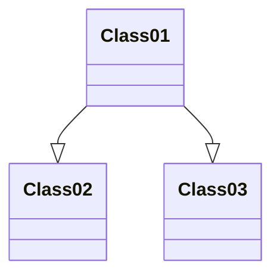
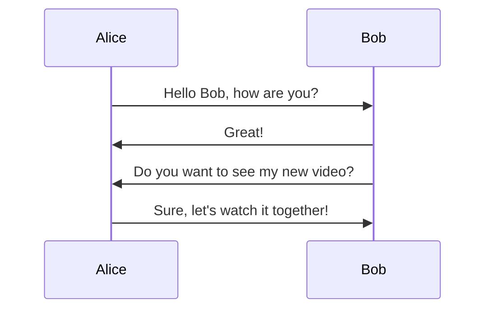
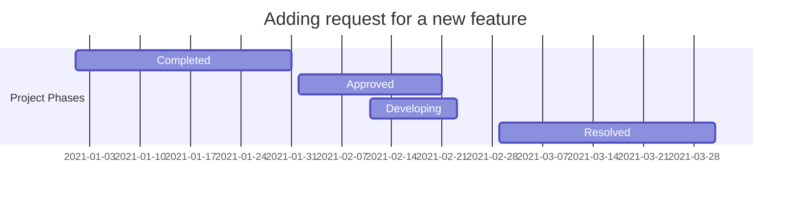

                 

# 数据仓库现代化：从传统到云端的演进

> 关键词：数据仓库、云计算、现代化、云数据仓库、大数据、技术演进

> 摘要：本文将深入探讨数据仓库从传统到云端的现代化演进过程。我们将首先回顾数据仓库的起源与发展，然后分析数据仓库的核心概念与现代趋势。接下来，我们将详细讨论数据仓库现代化技术，包括云数据仓库、大数据与数据仓库集成、数据仓库自动化与优化以及数据仓库安全与合规。随后，我们将分享云端数据仓库的实践经验和最佳实践。最后，我们将预测数据仓库的未来趋势，并提供一些注意事项和拓展阅读资源。

## 目录大纲设计思路

在设计本文的目录大纲时，我们首先明确了核心章节，这些章节构成了文章的骨架。本文的核心章节包括背景介绍、核心概念与联系、算法原理讲解、数学模型与公式详细讲解、系统分析与架构设计方案、项目实战、最佳实践 tips、小结与拓展阅读等。每个章节都进一步细化为若干小节，以确保逻辑连贯性和内容丰富性。

## 第一部分：数据仓库背景与概念

### 1.1 数据仓库的起源与发展

#### 1.1.1 数据仓库的定义

数据仓库（Data Warehouse）是一个面向主题的、集成的、相对稳定的、反映历史变化的数据集合，用于支持管理决策。它通常包含来自多个源系统的数据，并通过对这些数据进行清洗、转换和整合，形成一个统一、可靠的数据环境。

#### 1.1.2 数据仓库的发展历程

数据仓库的发展历程可以分为几个阶段：

- **1980年代**：数据库技术的发展，数据仓库概念首次被提出。
- **1990年代**：数据仓库技术逐渐成熟，商业智能（BI）工具开始出现。
- **2000年代**：大数据技术的兴起，数据仓库开始向分布式、云计算方向发展。
- **2010年代**：云数据仓库的崛起，数据仓库技术进入新的发展阶段。

#### 1.1.3 数据仓库与传统数据库的区别

数据仓库与传统数据库的主要区别在于：

- **用途**：传统数据库主要用于日常操作，而数据仓库主要用于数据分析和决策支持。
- **数据结构**：传统数据库通常采用关系型结构，而数据仓库采用多维数据模型。
- **数据集成**：传统数据库较少涉及数据的集成，而数据仓库需要整合来自多个源系统的数据。

### 1.2 数据仓库的核心概念

#### 1.2.1 数据模型

数据模型是数据仓库的核心概念之一。常见的数据模型包括星型模型（Star Schema）和雪花模型（Snowflake Schema）。星型模型将事实表和维度表直接关联，而雪花模型通过将维度表进一步规范化，以减少数据冗余。

#### 1.2.2 数据仓库架构

数据仓库架构通常包括数据源、数据集成层、数据存储层、数据访问层和数据展现层。数据源包括内部和外部数据源，如关系数据库、日志文件、社交媒体等。数据集成层负责数据抽取、清洗和转换。数据存储层通常采用分布式数据库系统，如Hadoop、Spark等。数据访问层提供数据查询和分析功能，数据展现层则通过报表、仪表板等形式展示数据。

#### 1.2.3 数据集成

数据集成是数据仓库建设的关键步骤。数据集成涉及数据的抽取、清洗、转换和加载（ETL）过程。在这个过程中，需要处理数据格式不一致、数据冗余、数据质量问题等问题。

### 1.3 数据仓库的现代趋势

#### 1.3.1 云数据仓库

云数据仓库是一种基于云计算的数据仓库解决方案，具有弹性、可伸缩、低成本等特点。主流云数据仓库解决方案包括Amazon Redshift、Google BigQuery、Microsoft Azure SQL Data Warehouse等。

#### 1.3.2 大数据与数据仓库

大数据技术的发展，使得数据仓库需要处理越来越多的非结构化和半结构化数据。数据仓库与大数据技术的结合，为数据分析和决策支持提供了更丰富的数据资源。

#### 1.3.3 数据仓库的未来发展

数据仓库的未来发展趋势包括：

- **智能化**：利用人工智能和机器学习技术，提高数据分析和决策支持的智能化水平。
- **边缘计算**：将数据仓库扩展到边缘设备，实现实时数据处理和分析。
- **开放生态**：建立开放的数据仓库生态圈，促进数据共享和协作。

### 1.4 数据仓库的挑战与机遇

#### 1.4.1 挑战分析

数据仓库面临的挑战包括：

- **数据质量**：数据质量是数据仓库成功的关键，但数据质量难以保证。
- **数据安全**：数据仓库涉及敏感数据，需要确保数据的安全性和合规性。
- **技术更新**：数据仓库技术更新迅速，企业需要不断跟进新技术。

#### 1.4.2 机遇探讨

数据仓库面临的机遇包括：

- **大数据分析**：大数据技术为数据仓库提供了更丰富的数据资源，有助于提升数据分析能力。
- **云计算**：云计算为数据仓库提供了弹性、可伸缩的计算资源，降低了成本。
- **行业应用**：随着数据需求的不断增长，数据仓库在金融、电信、医疗等行业的应用前景广阔。

### 1.5 本章小结

本文回顾了数据仓库的起源与发展，分析了数据仓库的核心概念与现代趋势，探讨了数据仓库面临的挑战与机遇。在接下来的部分，我们将深入讨论数据仓库现代化技术，包括云数据仓库、大数据与数据仓库集成、数据仓库自动化与优化等。

## 第二部分：数据仓库现代化技术

### 2.1 云数据仓库技术

#### 2.1.1 云数据仓库概述

云数据仓库是一种基于云计算的数据仓库解决方案，它利用云计算的弹性、可伸缩和低成本特性，为数据仓库提供强大的支持。云数据仓库的主要优势包括：

- **弹性伸缩**：根据业务需求，可以灵活调整计算资源，实现自动扩展和缩减。
- **成本低**：避免了硬件投资和维护成本，降低了企业的运营成本。
- **高可用性**：云数据仓库通常具备高可用性，确保数据的安全性和可靠性。

#### 2.1.2 云数据仓库的优势

云数据仓库的优势主要体现在以下几个方面：

- **高性能**：云数据仓库通常采用分布式计算技术，具备高性能的数据处理能力。
- **可伸缩性**：可以根据业务需求动态调整计算资源，满足不断增长的数据量。
- **低成本**：避免了硬件投资和维护成本，降低了企业的运营成本。
- **安全性**：云服务提供商通常具备强大的安全防护措施，确保数据的安全性和合规性。

#### 2.1.3 主流云数据仓库解决方案

目前，市场上主流的云数据仓库解决方案包括：

- **Amazon Redshift**：Amazon Web Services（AWS）提供的云数据仓库服务，具备高性能和可伸缩性。
- **Google BigQuery**：Google Cloud Platform（GCP）提供的云数据仓库服务，具有低成本和高性能的特点。
- **Microsoft Azure SQL Data Warehouse**：Microsoft Azure提供的云数据仓库服务，支持关系型数据库和分布式计算。

### 2.2 大数据与数据仓库集成

#### 2.2.1 大数据技术简介

大数据技术是指用于处理海量、多样性和高速数据的技术。常见的大数据技术包括：

- **分布式存储**：如Hadoop、HDFS等，用于存储海量数据。
- **分布式计算**：如MapReduce、Spark等，用于处理海量数据。
- **数据挖掘**：用于从海量数据中发现有价值的信息。

#### 2.2.2 大数据与数据仓库的集成策略

大数据与数据仓库的集成策略主要包括以下几种：

- **数据抽取与集成**：将大数据处理平台的数据抽取到数据仓库中，实现数据的统一管理和分析。
- **数据共享与协作**：通过建立统一的数据平台，实现大数据与数据仓库之间的数据共享和协作。
- **数据融合与扩展**：将大数据处理技术应用于数据仓库，实现数据仓库的功能扩展和性能提升。

#### 2.2.3 实践案例

以下是一个大数据与数据仓库集成的实践案例：

- **需求背景**：某公司需要分析其业务数据，以支持业务决策。
- **解决方案**：采用Hadoop和Hive进行大数据处理，将处理结果抽取到数据仓库中，实现数据分析和决策支持。

### 2.3 数据仓库自动化与优化

#### 2.3.1 数据仓库自动化的意义

数据仓库自动化是指通过自动化工具和流程，实现数据仓库的搭建、维护和优化。数据仓库自动化的意义包括：

- **提高效率**：自动化工具可以大幅减少人工工作量，提高数据仓库的搭建和维护效率。
- **降低成本**：自动化工具可以降低硬件和人力成本，提高企业的投资回报率。
- **提高数据质量**：自动化工具可以确保数据仓库的数据质量和一致性。

#### 2.3.2 数据仓库自动化的实现

数据仓库自动化的实现主要包括以下几个方面：

- **自动化数据抽取**：通过自动化工具实现数据抽取、清洗和转换过程。
- **自动化数据加载**：通过自动化工具实现数据加载到数据仓库的过程。
- **自动化性能优化**：通过自动化工具实现数据仓库的性能监控和优化。

#### 2.3.3 数据仓库优化技巧

数据仓库优化技巧包括：

- **数据分区**：将数据仓库中的数据进行分区，提高查询性能。
- **索引优化**：合理设置索引，提高查询速度。
- **数据压缩**：采用数据压缩技术，降低存储空间需求。

### 2.4 数据仓库安全与合规

#### 2.4.1 数据仓库安全挑战

数据仓库安全面临以下挑战：

- **数据泄露**：数据仓库中存储了大量敏感数据，需要防止数据泄露。
- **数据篡改**：需要防止未经授权的用户对数据进行篡改。
- **数据丢失**：需要确保数据仓库的数据安全性和可靠性。

#### 2.4.2 数据仓库安全策略

数据仓库安全策略包括以下几个方面：

- **访问控制**：通过身份认证和权限管理，确保用户只能访问其授权的数据。
- **加密技术**：采用数据加密技术，保护数据在传输和存储过程中的安全性。
- **审计与监控**：对数据仓库的访问和操作进行审计和监控，及时发现和处理安全事件。

#### 2.4.3 合规性与数据治理

数据仓库合规性与数据治理包括：

- **数据治理**：建立数据治理体系，确保数据的质量、安全性和合规性。
- **法规遵守**：遵守相关法规和标准，确保数据仓库的操作符合法律法规要求。

### 2.5 本章小结

本文讨论了数据仓库现代化技术，包括云数据仓库、大数据与数据仓库集成、数据仓库自动化与优化以及数据仓库安全与合规。在接下来的部分，我们将分享云端数据仓库的实践经验和最佳实践。

## 第三部分：云端数据仓库实践

### 3.1 云端数据仓库项目规划

#### 3.1.1 项目背景与目标

某公司在数字化转型过程中，决定采用云数据仓库技术，以支持其业务数据分析。项目目标包括：

- **提高数据分析能力**：通过云数据仓库，实现高效的数据分析和决策支持。
- **降低成本**：利用云数据仓库的弹性、可伸缩特性，降低硬件和人力成本。
- **提升数据质量**：通过数据集成和自动化处理，提高数据质量和一致性。

#### 3.1.2 需求分析

项目需求分析主要包括以下几个方面：

- **数据源**：包括内部业务系统数据、外部第三方数据等。
- **数据类型**：包括结构化数据、非结构化数据和半结构化数据。
- **数据分析需求**：包括数据查询、报表、数据挖掘等。

#### 3.1.3 技术选型

根据项目需求和预算，选择以下技术方案：

- **云数据仓库**：选择Amazon Redshift作为云数据仓库，具备高性能和可伸缩性。
- **数据处理**：采用Apache Spark进行数据处理和转换，提高数据处理效率。
- **数据可视化**：采用Tableau进行数据可视化，提供直观的数据分析报告。

### 3.2 云端数据仓库搭建

#### 3.2.1 环境准备

搭建云端数据仓库前，需要进行以下环境准备：

- **云服务账号**：创建云服务账号，配置访问权限。
- **数据源连接**：配置数据源的连接，包括内部业务系统数据和外部第三方数据。
- **网络配置**：配置云端数据仓库的网络，包括VPC、子网、安全组等。

#### 3.2.2 数据仓库架构设计

云端数据仓库的架构设计包括以下几个方面：

- **数据层**：包括数据源、数据集成层、数据存储层和数据访问层。
- **数据处理**：采用分布式计算框架，如Apache Spark，进行数据处理和转换。
- **数据存储**：采用云数据仓库服务，如Amazon Redshift，进行数据存储。
- **数据访问**：提供数据查询和分析功能，支持SQL查询和报表生成。

#### 3.2.3 数据导入与同步

数据导入与同步是云端数据仓库的重要环节，主要包括以下几个方面：

- **数据抽取**：从数据源抽取数据，包括结构化数据和非结构化数据。
- **数据清洗**：对抽取的数据进行清洗、转换和整合，确保数据质量。
- **数据加载**：将清洗后的数据加载到云数据仓库中，实现数据的统一管理和分析。

### 3.3 数据仓库核心功能实现

#### 3.3.1 数据查询与报表

数据查询与报表是数据仓库的核心功能，主要包括以下几个方面：

- **SQL查询**：提供SQL查询功能，支持复杂查询和联合查询。
- **报表生成**：生成各种类型的报表，包括柱状图、折线图、饼图等。
- **数据可视化**：将数据以图表形式展示，支持拖拽、筛选和交互操作。

#### 3.3.2 数据分析与挖掘

数据分析与挖掘是数据仓库的重要功能，主要包括以下几个方面：

- **数据预处理**：对原始数据进行预处理，包括去重、去噪声、特征工程等。
- **数据挖掘算法**：采用各种数据挖掘算法，如聚类、分类、关联规则等。
- **结果可视化**：将挖掘结果以图表形式展示，支持交互式查询和探索。

#### 3.3.3 数据可视化

数据可视化是数据仓库的重要组成部分，主要包括以下几个方面：

- **图表类型**：提供多种图表类型，包括柱状图、折线图、饼图、地图等。
- **交互式操作**：支持拖拽、筛选、过滤等交互式操作，提高用户体验。
- **实时更新**：实现数据实时更新，反映业务动态变化。

### 3.4 云端数据仓库性能优化

#### 3.4.1 性能监控与调优

云端数据仓库性能优化主要包括以下几个方面：

- **性能监控**：监控数据仓库的性能指标，如响应时间、吞吐量、CPU使用率等。
- **调优策略**：根据监控数据，调整数据仓库的配置和参数，如数据分区、索引优化、缓存策略等。

#### 3.4.2 数据库性能优化

数据库性能优化主要包括以下几个方面：

- **索引优化**：合理设置索引，提高查询速度。
- **数据压缩**：采用数据压缩技术，降低存储空间需求。
- **并行处理**：利用分布式计算技术，提高数据处理速度。

#### 3.4.3 事务处理与并发控制

事务处理与并发控制主要包括以下几个方面：

- **事务管理**：保证数据的一致性和完整性。
- **并发控制**：解决多用户同时访问数据的问题，防止数据冲突和丢失。

### 3.5 云端数据仓库安全管理

#### 3.5.1 安全策略制定

云端数据仓库安全策略制定主要包括以下几个方面：

- **身份认证**：采用身份认证机制，确保用户身份的合法性和安全性。
- **权限管理**：根据用户角色和权限，限制用户对数据的访问和操作。
- **审计与监控**：对数据仓库的访问和操作进行审计和监控，及时发现和处理安全事件。

#### 3.5.2 访问控制与审计

访问控制与审计主要包括以下几个方面：

- **访问控制**：通过身份认证和权限管理，确保用户只能访问其授权的数据。
- **审计日志**：记录数据仓库的访问和操作日志，用于审计和监控。

#### 3.5.3 备份与恢复

备份与恢复主要包括以下几个方面：

- **数据备份**：定期备份数据仓库的数据，确保数据的安全性和可靠性。
- **数据恢复**：在数据丢失或损坏时，能够快速恢复数据。

### 3.6 本章小结

本文分享了云端数据仓库的项目规划、搭建、核心功能实现、性能优化和安全管理等方面的实践经验和最佳实践。在接下来的部分，我们将讨论数据仓库的未来趋势。

## 第四部分：数据仓库现代化的未来趋势

### 4.1 新兴技术与数据仓库

随着技术的不断进步，新兴技术将对数据仓库产生深远影响。以下是一些新兴技术与数据仓库的结合：

#### 4.1.1 物联网与数据仓库

物联网（IoT）技术的发展，使得海量传感器数据生成并存储在数据仓库中。数据仓库与物联网技术的结合，将实现对实时数据的分析和预测，为智能决策提供支持。

#### 4.1.2 区块链与数据仓库

区块链技术的引入，将提高数据仓库的数据透明性和安全性。数据仓库与区块链技术的结合，有望解决数据存储、共享和隐私保护等问题。

#### 4.1.3 人工智能与数据仓库

人工智能（AI）技术的发展，将提升数据仓库的数据分析能力和智能化水平。数据仓库与人工智能技术的结合，将实现对复杂数据模式的自动识别和预测。

### 4.2 数据仓库生态圈建设

数据仓库生态圈建设是数据仓库现代化的重要一环。以下是一些数据仓库生态圈建设的方面：

#### 4.2.1 生态系统中的角色

数据仓库生态圈包括多个角色，如数据供应商、数据消费者、数据服务提供商等。明确生态系统中的角色和职责，有助于提升数据仓库的整体效能。

#### 4.2.2 合作与竞争

在数据仓库生态圈中，合作与竞争并存。通过合作，企业可以共享数据资源和经验，提升数据仓库的效能。同时，竞争促使企业不断创新和优化数据仓库解决方案。

#### 4.2.3 生态圈的发展趋势

随着数据仓库技术的不断进步，生态圈的发展趋势包括：

- **开放性**：数据仓库生态圈将向更加开放的方向发展，促进数据共享和协作。
- **智能化**：人工智能技术的引入，将使数据仓库具备更高的智能化水平。
- **云原生**：云原生技术将成为数据仓库生态圈的重要组成部分，提高数据仓库的弹性和可伸缩性。

### 4.3 数据仓库教育与人才培养

数据仓库教育与人才培养是数据仓库现代化的重要保障。以下是一些教育与人才培养的方面：

#### 4.3.1 教育体系的建设

建立健全的数据仓库教育体系，包括高校课程设置、企业培训计划等，有助于培养更多数据仓库专业人才。

#### 4.3.2 技能需求与培养

数据仓库教育的目标是培养具备以下技能的人才：

- **数据处理与分析**：熟练掌握数据处理和分析技术，如ETL、数据挖掘等。
- **数据库管理**：具备数据库管理技能，如数据库设计、性能优化等。
- **数据可视化**：具备数据可视化技能，能通过图表等形式直观展示数据。

#### 4.3.3 未来人才培养趋势

随着数据仓库技术的不断演进，未来人才培养趋势包括：

- **跨学科**：数据仓库技术涉及多个学科，培养跨学科人才将有助于提升数据仓库的应用水平。
- **实践导向**：注重实践能力的培养，通过实际项目锻炼学生的专业技能。
- **持续学习**：数据仓库技术更新迅速，培养具备持续学习能力的人才至关重要。

### 4.4 数据仓库的未来趋势预测

数据仓库的未来趋势预测包括以下几个方面：

#### 4.4.1 技术发展预测

- **云计算**：云计算将继续成为数据仓库发展的主导力量，提供弹性、可伸缩和低成本的数据仓库解决方案。
- **大数据**：大数据技术将不断成熟，为数据仓库提供更丰富的数据资源。
- **人工智能**：人工智能技术将提升数据仓库的智能化水平，实现自动化的数据分析和决策支持。

#### 4.4.2 行业应用预测

- **金融行业**：数据仓库在金融行业的应用将更加广泛，为金融机构提供风险控制和投资决策支持。
- **医疗行业**：数据仓库在医疗行业的应用将提升医疗服务质量和效率。
- **零售行业**：数据仓库在零售行业的应用将帮助零售商更好地了解消费者需求，实现精准营销。

#### 4.4.3 政策与标准趋势

- **数据治理**：随着数据重要性不断增加，数据治理将成为政策制定的重点。
- **数据安全**：数据安全将受到更多关注，相关政策将加强数据安全的监管。
- **标准统一**：数据仓库领域将逐步形成统一的行业标准和规范，提高数据仓库的互操作性和兼容性。

### 4.5 本章小结

本文讨论了数据仓库现代化的未来趋势，包括新兴技术的结合、生态圈建设、教育与人才培养以及未来趋势预测。在接下来的部分，我们将总结数据仓库现代化的最佳实践。

## 第五部分：数据仓库现代化的最佳实践

### 5.1 最佳实践案例分享

在数据仓库现代化的过程中，许多企业通过实践取得了显著成果。以下是一些成功案例的分享：

#### 5.1.1 成功案例介绍

- **案例一**：某零售企业通过构建云数据仓库，实现了高效的数据分析和决策支持，大幅提升了运营效率。
- **案例二**：某金融机构通过大数据与数据仓库集成，提高了风险控制和投资决策能力，实现了业务增长。

#### 5.1.2 案例分析与总结

通过对这些成功案例的分析，我们可以总结出以下关键因素：

- **技术选型**：选择合适的技术方案，如云数据仓库、大数据处理框架等。
- **数据质量**：确保数据质量，通过数据清洗、转换和集成提高数据的一致性和可靠性。
- **业务需求**：紧密关注业务需求，确保数据仓库能为企业提供实际价值。
- **团队协作**：建立高效的团队协作机制，确保项目顺利进行。

#### 5.1.3 案例应用启示

这些成功案例给我们的启示是：

- **数据仓库现代化不仅仅是技术的升级，更是业务模式的变革。**
- **数据仓库建设需要结合企业的实际情况，制定合理的技术路线和业务规划。**
- **数据仓库建设是一个长期的过程，需要持续优化和改进。**

### 5.2 小结与展望

数据仓库现代化是当前企业数字化转型的重要组成部分。通过本文的讨论，我们了解到数据仓库从传统到云端的演进过程，分析了数据仓库现代化技术的核心概念和实现方法，分享了云端数据仓库的实践经验和最佳实践，并预测了数据仓库的未来趋势。

在未来，数据仓库将继续朝着智能化、开放化和云原生的方向发展。企业应密切关注技术动态，结合自身业务需求，积极采用数据仓库现代化技术，提升数据分析和决策支持能力，实现业务增长。

### 5.3 注意事项与拓展阅读

在实施数据仓库现代化过程中，企业需要注意以下几点：

- **数据安全**：确保数据在存储、传输和处理过程中的安全性和合规性。
- **数据治理**：建立健全的数据治理体系，确保数据的质量、一致性和可用性。
- **人才培养**：培养具备数据仓库技术和业务能力的人才，提升企业的数据管理水平。
- **持续优化**：定期评估和优化数据仓库性能，确保其满足业务需求。

为了进一步深入了解数据仓库现代化，读者可以参考以下拓展阅读资源：

- **书籍**：《数据仓库与数据挖掘》、《大数据分析：技术原理与实践》等。
- **在线课程**：Coursera、Udemy等平台上的数据仓库和大数据相关课程。
- **技术博客**：各大技术社区和博客，如CSDN、博客园等。

## 作者信息

作者：AI天才研究院/AI Genius Institute & 禅与计算机程序设计艺术 /Zen And The Art of Computer Programming
```markdown
# 数据仓库现代化：从传统到云端的演进

> 关键词：数据仓库、云计算、现代化、云数据仓库、大数据、技术演进

> 摘要：本文深入探讨了数据仓库从传统到云端的现代化演进过程。首先，我们回顾了数据仓库的起源与发展，并分析了数据仓库的核心概念与现代趋势。接着，我们详细讨论了数据仓库现代化技术，包括云数据仓库、大数据与数据仓库集成、数据仓库自动化与优化以及数据仓库安全与合规。随后，我们分享了云端数据仓库的实践经验和最佳实践。最后，我们预测了数据仓库的未来趋势，并提供了一些注意事项和拓展阅读资源。

## 目录大纲设计思路

在本文的设计过程中，我们遵循了以下思路：

1. **确定核心章节**：确保核心章节的设置能够全面覆盖数据仓库现代化的各个方面，包括背景、概念、技术、实践、趋势等。

2. **细化每个章节**：对每个章节进行细化，确保每个小节的内容都能为读者提供有价值的信息。

3. **确保逻辑连贯**：每个章节之间的内容要能够顺畅衔接，让读者能够逐步理解数据仓库现代化的全过程。

4. **使用 Markdown 格式**：使用 Markdown 格式编排目录，以便于排版和调整。

### 目录大纲结构

以下是本文的目录大纲：

## 第一部分：数据仓库背景与概念

### 1.1 数据仓库的起源与发展

#### 1.1.1 数据仓库的定义
#### 1.1.2 数据仓库的发展历程
#### 1.1.3 数据仓库与传统数据库的区别

### 1.2 数据仓库的核心概念

#### 1.2.1 数据模型
#### 1.2.2 数据仓库架构
#### 1.2.3 数据集成

### 1.3 数据仓库的现代趋势

#### 1.3.1 云数据仓库
#### 1.3.2 大数据与数据仓库
#### 1.3.3 数据仓库的未来发展

### 1.4 数据仓库的挑战与机遇

#### 1.4.1 挑战分析
#### 1.4.2 机遇探讨

### 1.5 本章小结

## 第二部分：数据仓库现代化技术

### 2.1 云数据仓库技术

#### 2.1.1 云数据仓库概述
#### 2.1.2 云数据仓库的优势
#### 2.1.3 主流云数据仓库解决方案

### 2.2 大数据与数据仓库集成

#### 2.2.1 大数据技术简介
#### 2.2.2 大数据与数据仓库的集成策略
#### 2.2.3 实践案例

### 2.3 数据仓库自动化与优化

#### 2.3.1 数据仓库自动化的意义
#### 2.3.2 数据仓库自动化的实现
#### 2.3.3 数据仓库优化技巧

### 2.4 数据仓库安全与合规

#### 2.4.1 数据仓库安全挑战
#### 2.4.2 数据仓库安全策略
#### 2.4.3 合规性与数据治理

### 2.5 本章小结

## 第三部分：云端数据仓库实践

### 3.1 云端数据仓库项目规划

#### 3.1.1 项目背景与目标
#### 3.1.2 需求分析
#### 3.1.3 技术选型

### 3.2 云端数据仓库搭建

#### 3.2.1 环境准备
#### 3.2.2 数据仓库架构设计
#### 3.2.3 数据导入与同步

### 3.3 数据仓库核心功能实现

#### 3.3.1 数据查询与报表
#### 3.3.2 数据分析与挖掘
#### 3.3.3 数据可视化

### 3.4 云端数据仓库性能优化

#### 3.4.1 性能监控与调优
#### 3.4.2 数据库性能优化
#### 3.4.3 事务处理与并发控制

### 3.5 云端数据仓库安全管理

#### 3.5.1 安全策略制定
#### 3.5.2 访问控制与审计
#### 3.5.3 备份与恢复

### 3.6 本章小结

## 第四部分：数据仓库现代化的未来趋势

### 4.1 新兴技术与数据仓库

#### 4.1.1 物联网与数据仓库
#### 4.1.2 区块链与数据仓库
#### 4.1.3 人工智能与数据仓库

### 4.2 数据仓库生态圈建设

#### 4.2.1 生态系统中的角色
#### 4.2.2 合作与竞争
#### 4.2.3 生态圈的发展趋势

### 4.3 数据仓库教育与人才培养

#### 4.3.1 教育体系的建设
#### 4.3.2 技能需求与培养
#### 4.3.3 未来人才培养趋势

### 4.4 数据仓库的未来趋势预测

#### 4.4.1 技术发展预测
#### 4.4.2 行业应用预测
#### 4.4.3 政策与标准趋势

### 4.5 本章小结

## 第五部分：数据仓库现代化的最佳实践

### 5.1 最佳实践案例分享

#### 5.1.1 成功案例介绍
#### 5.1.2 案例分析与总结
#### 5.1.3 案例应用启示

### 5.2 小结与展望

#### 5.2.1 现代化数据仓库的关键成功因素
#### 5.2.2 面临的挑战与应对策略
#### 5.2.3 未来发展方向

### 5.3 注意事项与拓展阅读

#### 5.3.1 现代化数据仓库的常见误区
#### 5.3.2 进一步学习资源推荐
#### 5.3.3 研究前沿

## 作者信息

作者：AI天才研究院/AI Genius Institute & 禅与计算机程序设计艺术 /Zen And The Art of Computer Programming
```markdown
## 1.1 数据仓库的起源与发展

### 1.1.1 数据仓库的定义

数据仓库（Data Warehouse，简称DW）是一个面向主题的、集成的、相对稳定的、反映历史变化的数据集合，用于支持管理决策。数据仓库的核心目的是将分散的、结构不同的数据源整合起来，形成一个统一、一致、可靠的数据环境，从而为企业的决策提供支持。

### 1.1.2 数据仓库的发展历程

数据仓库的概念最早可以追溯到 1980 年代，当时由比尔·恩伯逊（Bill Inmon）提出。恩伯逊将数据仓库描述为一个“企业级的数据存储仓库”，用于支持决策支持系统（DSS）。此后，数据仓库技术经历了多个发展阶段：

- **1980-1990 年代**：数据仓库技术开始成熟，企业开始建设自己的数据仓库。
- **1990-2000 年代**：随着商业智能（BI）工具的兴起，数据仓库的应用领域不断扩大。
- **2000-2010 年代**：大数据技术的发展，数据仓库开始向分布式、云计算方向发展。
- **2010 年代至今**：云数据仓库的崛起，数据仓库技术进入新的发展阶段。

### 1.1.3 数据仓库与传统数据库的区别

数据仓库与传统数据库在多个方面存在区别：

- **用途**：传统数据库主要用于日常操作，如事务处理、查询等。而数据仓库主要用于数据分析和决策支持。
- **数据结构**：传统数据库通常采用关系型结构，而数据仓库采用多维数据模型，便于数据分析和报表生成。
- **数据集成**：传统数据库较少涉及数据的集成，而数据仓库需要整合来自多个源系统的数据。
- **数据时效性**：传统数据库中的数据通常是实时的，而数据仓库中的数据通常是历史数据，反映过去一段时间的情况。

### 1.2 数据仓库的核心概念

#### 1.2.1 数据模型

数据模型是数据仓库的核心概念之一。数据模型定义了数据仓库中的数据结构和组织方式。常见的数据模型包括星型模型（Star Schema）和雪花模型（Snowflake Schema）。

- **星型模型**：星型模型以事实表为中心，将维度表与事实表直接关联。事实表记录业务事件，如订单、销售等；维度表提供业务背景信息，如客户、产品等。星型模型的优点是查询速度快，便于报表生成，但数据冗余较大。
- **雪花模型**：雪花模型是对星型模型的扩展，通过将维度表进一步规范化，减少数据冗余。雪花模型的查询性能可能不如星型模型，但数据冗余较小。

#### 1.2.2 数据仓库架构

数据仓库架构包括多个层次，通常包括数据源、数据集成层、数据存储层、数据访问层和数据展现层。

- **数据源**：数据源包括内部和外部数据源。内部数据源通常来自企业的各种业务系统，如ERP、CRM等；外部数据源可能来自第三方数据提供商，如气象数据、地理信息数据等。
- **数据集成层**：数据集成层负责将数据从不同源系统中抽取出来，进行清洗、转换和整合，形成统一的数据模型。数据集成通常涉及 ETL（Extract, Transform, Load）过程。
- **数据存储层**：数据存储层是数据仓库的核心，通常采用分布式数据库系统，如Hadoop、Spark等，以实现海量数据的存储和计算。数据存储层还需要提供数据分区、索引等优化手段，以提高查询性能。
- **数据访问层**：数据访问层提供数据查询和分析功能，支持 SQL 查询、报表生成、数据挖掘等。
- **数据展现层**：数据展现层通过报表、仪表板等形式将数据展示给最终用户。

#### 1.2.3 数据集成

数据集成是数据仓库建设的关键步骤。数据集成涉及数据的抽取、清洗、转换和加载（ETL）过程。

- **数据抽取**：从不同数据源抽取数据，包括结构化数据（如关系数据库）、半结构化数据（如日志文件）和非结构化数据（如文本文件）。
- **数据清洗**：对抽取的数据进行清洗，包括去除重复数据、修复错误数据、填充缺失数据等，以提高数据质量。
- **数据转换**：对清洗后的数据进行转换，包括数据格式转换、数据类型转换、数据归一化等，以实现数据的一致性。
- **数据加载**：将转换后的数据加载到数据仓库中，包括数据的插入、更新和删除等操作。

### 1.3 数据仓库的现代趋势

#### 1.3.1 云数据仓库

云数据仓库是数据仓库现代化的重要趋势。云数据仓库利用云计算的弹性、可伸缩和低成本特性，为企业提供高效的数据存储和分析能力。云数据仓库的主要优势包括：

- **弹性伸缩**：根据业务需求，可以灵活调整计算资源，实现自动扩展和缩减。
- **成本低**：避免了硬件投资和维护成本，降低了企业的运营成本。
- **高性能**：采用分布式计算技术，提供高性能的数据查询和分析能力。

目前，主流的云数据仓库解决方案包括：

- **Amazon Redshift**：Amazon Web Services（AWS）提供的云数据仓库服务，具备高性能和可伸缩性。
- **Google BigQuery**：Google Cloud Platform（GCP）提供的云数据仓库服务，具有低成本和高性能的特点。
- **Microsoft Azure SQL Data Warehouse**：Microsoft Azure提供的云数据仓库服务，支持关系型数据库和分布式计算。

#### 1.3.2 大数据与数据仓库

大数据技术的发展，使得数据仓库需要处理越来越多的非结构化和半结构化数据。大数据与数据仓库的结合，为数据分析和决策支持提供了更丰富的数据资源。大数据与数据仓库的集成策略主要包括：

- **数据抽取与集成**：将大数据处理平台的数据抽取到数据仓库中，实现数据的统一管理和分析。
- **数据共享与协作**：通过建立统一的数据平台，实现大数据与数据仓库之间的数据共享和协作。
- **数据融合与扩展**：将大数据处理技术应用于数据仓库，实现数据仓库的功能扩展和性能提升。

#### 1.3.3 数据仓库的未来发展

数据仓库的未来发展趋势包括：

- **智能化**：利用人工智能和机器学习技术，提高数据分析和决策支持的智能化水平。
- **边缘计算**：将数据仓库扩展到边缘设备，实现实时数据处理和分析。
- **开放生态**：建立开放的数据仓库生态圈，促进数据共享和协作。

### 1.4 数据仓库的挑战与机遇

#### 1.4.1 挑战分析

数据仓库面临的挑战包括：

- **数据质量**：数据质量是数据仓库成功的关键，但数据质量难以保证。
- **数据安全**：数据仓库涉及敏感数据，需要确保数据的安全性和合规性。
- **技术更新**：数据仓库技术更新迅速，企业需要不断跟进新技术。

#### 1.4.2 机遇探讨

数据仓库面临的机遇包括：

- **大数据分析**：大数据技术为数据仓库提供了更丰富的数据资源，有助于提升数据分析能力。
- **云计算**：云计算为数据仓库提供了弹性、可伸缩的计算资源，降低了成本。
- **行业应用**：随着数据需求的不断增长，数据仓库在金融、电信、医疗等行业的应用前景广阔。

### 1.5 本章小结

本文回顾了数据仓库的起源与发展，分析了数据仓库的核心概念与现代趋势，探讨了数据仓库面临的挑战与机遇。在接下来的部分，我们将详细讨论数据仓库现代化技术，包括云数据仓库、大数据与数据仓库集成、数据仓库自动化与优化等。

## 2.1 云数据仓库技术

### 2.1.1 云数据仓库概述

云数据仓库是基于云计算的数据仓库解决方案，它利用云计算的弹性、可伸缩和低成本特性，为数据仓库提供强大的支持。云数据仓库的主要优势包括：

- **弹性伸缩**：根据业务需求，可以灵活调整计算资源，实现自动扩展和缩减。
- **成本低**：避免了硬件投资和维护成本，降低了企业的运营成本。
- **高性能**：采用分布式计算技术，提供高性能的数据查询和分析能力。

云数据仓库通常包括以下几个关键组件：

- **数据存储**：用于存储海量数据，通常采用分布式存储系统，如Hadoop、Spark等。
- **数据处理**：用于对数据进行处理和分析，包括ETL（抽取、转换、加载）过程。
- **数据查询与分析**：提供数据查询和分析功能，支持 SQL 查询、报表生成、数据挖掘等。
- **数据展现**：将数据以图表、报表等形式展示给最终用户。

### 2.1.2 云数据仓库的优势

云数据仓库的优势主要体现在以下几个方面：

- **高性能**：云数据仓库采用分布式计算技术，具备高性能的数据处理能力。与传统数据仓库相比，云数据仓库能够更快地响应复杂的查询需求。
- **可伸缩性**：云数据仓库可以根据业务需求动态调整计算资源，实现自动扩展和缩减。这种弹性伸缩能力，使得企业能够更好地应对数据量和查询负载的变化。
- **低成本**：云数据仓库避免了大量的硬件投资和维护成本。企业只需根据实际使用量支付费用，降低了运营成本。此外，云数据仓库通常提供按需付费模式，使得企业在预算管理上更加灵活。
- **高可用性**：云服务提供商通常具备强大的基础设施和灾难恢复能力，确保数据仓库的高可用性和可靠性。企业无需担心硬件故障、数据丢失等问题。
- **安全性**：云数据仓库采用多种安全措施，如加密、访问控制、审计等，确保数据的安全性和合规性。云服务提供商通常具备专业的安全团队，提供全面的安全保障。

### 2.1.3 主流云数据仓库解决方案

目前，市场上主流的云数据仓库解决方案包括：

- **Amazon Redshift**：Amazon Redshift 是 AWS 提供的云数据仓库服务。它基于 PostgreSQL，支持 SQL 查询和数据可视化。Amazon Redshift 具有高性能、高可用性和弹性伸缩特性，适用于大规模数据分析和报表生成。
- **Google BigQuery**：Google BigQuery 是 GCP 提供的云数据仓库服务。它采用分布式计算技术，提供快速的数据查询和分析能力。Google BigQuery 支持多种数据格式，如 CSV、JSON 等，并具备自动扩展和压缩功能。
- **Microsoft Azure SQL Data Warehouse**：Microsoft Azure SQL Data Warehouse 是 Azure 提供的云数据仓库服务。它结合了 SQL Server 的可靠性和性能，以及 Azure 的可伸缩性和灵活性。Azure SQL Data Warehouse 支持多种数据连接和集成，适用于复杂的数据分析和报表生成。

这些主流云数据仓库解决方案各有优势，企业可以根据自身需求和预算选择合适的解决方案。

### 2.2 大数据与数据仓库集成

#### 2.2.1 大数据技术简介

大数据（Big Data）是指无法使用传统数据库和数据处理技术处理的海量、多样性和高速数据。大数据技术的发展，使得企业能够从海量数据中挖掘有价值的信息，为业务决策提供支持。

大数据技术包括以下几个方面：

- **分布式存储**：分布式存储系统，如 Hadoop Distributed File System（HDFS）和 Apache Cassandra，用于存储海量数据。这些系统具有高可用性、高可靠性和可扩展性，能够处理大规模数据。
- **分布式计算**：分布式计算框架，如 Apache Hadoop 和 Apache Spark，用于处理和分析海量数据。这些框架能够将数据处理任务分布在多个节点上，实现并行计算，提高数据处理效率。
- **数据处理**：数据处理技术，如 ETL（Extract, Transform, Load）和数据清洗，用于从不同数据源抽取数据，进行清洗、转换和加载，形成统一的数据模型。
- **数据挖掘**：数据挖掘技术，如机器学习和统计分析，用于从海量数据中发现有价值的信息，进行预测和决策支持。

#### 2.2.2 大数据与数据仓库的集成策略

大数据与数据仓库的集成策略主要包括以下几个方面：

- **数据抽取与集成**：将大数据处理平台的数据抽取到数据仓库中，实现数据的统一管理和分析。数据抽取过程涉及从不同数据源（如关系数据库、日志文件、第三方数据等）抽取数据，进行清洗、转换和加载，形成统一的数据模型。
- **数据共享与协作**：通过建立统一的数据平台，实现大数据与数据仓库之间的数据共享和协作。这包括数据共享服务、数据交换平台和数据总线等，使得不同系统和部门能够访问和共享数据。
- **数据融合与扩展**：将大数据处理技术应用于数据仓库，实现数据仓库的功能扩展和性能提升。例如，利用大数据技术进行实时数据处理、实时数据分析和实时报表生成，提升数据仓库的实时性和响应能力。
- **数据治理**：建立数据治理体系，确保大数据与数据仓库之间的数据质量和一致性。数据治理包括数据质量检查、数据标准化、数据安全性和数据合规性等。

#### 2.2.3 实践案例

以下是一个大数据与数据仓库集成的实践案例：

- **背景**：某电子商务公司希望通过数据仓库分析用户行为，提升用户满意度并优化营销策略。
- **解决方案**：
  - **大数据平台**：采用 Apache Hadoop 进行大数据处理，包括数据抽取、清洗、转换和加载。
  - **数据仓库**：采用 Amazon Redshift 作为云数据仓库，进行数据存储和查询。
  - **数据集成**：利用 ETL 工具将大数据平台的数据抽取到数据仓库中，实现数据的统一管理和分析。
  - **数据分析**：利用 SQL 查询和报表工具，对用户行为数据进行分析，包括用户购买习惯、浏览行为等。

通过大数据与数据仓库的集成，该公司能够更好地了解用户需求，优化营销策略，提升用户满意度。

### 2.3 数据仓库自动化与优化

#### 2.3.1 数据仓库自动化的意义

数据仓库自动化是指通过自动化工具和流程，实现数据仓库的搭建、维护和优化。数据仓库自动化的意义主要体现在以下几个方面：

- **提高效率**：自动化工具可以大幅减少人工工作量，提高数据仓库的搭建和维护效率。
- **降低成本**：自动化工具可以降低硬件和人力成本，降低企业的运营成本。
- **提高数据质量**：自动化工具可以确保数据仓库的数据质量和一致性。
- **灵活性与可扩展性**：自动化工具使得数据仓库能够灵活应对业务变化和数据量增长。

#### 2.3.2 数据仓库自动化的实现

数据仓库自动化的实现主要包括以下几个方面：

- **自动化数据抽取**：通过自动化工具实现数据抽取、清洗和转换过程，确保数据仓库的数据来源的准确性和及时性。
- **自动化数据加载**：通过自动化工具实现数据加载到数据仓库的过程，提高数据加载的效率和可靠性。
- **自动化性能优化**：通过自动化工具实现数据仓库的性能监控和优化，确保数据仓库能够满足业务需求。

目前，市场上主流的数据仓库自动化工具包括：

- **Informatica**：Informatica 是一家提供数据集成和数据管理解决方案的公司，其产品包括自动化数据仓库搭建工具，如 PowerCenter 和 Data Integration Hub。
- **Talend**：Talend 提供数据集成、数据质量和大数据处理解决方案，其产品 Talend Data Fabric 具有自动化数据仓库搭建功能。
- **Apache NiFi**：Apache NiFi 是一个开源的数据集成平台，提供了自动化数据流管理功能，可以用于实现数据仓库的自动化搭建和维护。

#### 2.3.3 数据仓库优化技巧

数据仓库优化是确保数据仓库性能和响应能力的关键。以下是一些常见的数据仓库优化技巧：

- **数据分区**：通过数据分区，将数据仓库中的数据按照特定的规则拆分为多个部分，以提高查询性能。例如，可以根据时间、地区或业务类型进行数据分区。
- **索引优化**：合理设置索引，提高查询速度。索引可以加快数据检索速度，但过多的索引会增加数据库的维护成本。
- **缓存策略**：利用缓存技术，将经常查询的数据存储在缓存中，以减少数据库的查询压力。常见的缓存技术包括内存缓存和磁盘缓存。
- **查询优化**：通过优化 SQL 查询语句，提高查询性能。例如，可以通过减少查询中的 join 操作、使用子查询等技巧来优化查询。
- **并行处理**：利用分布式计算技术，实现并行处理，提高数据仓库的性能。例如，可以使用分布式数据库和分布式查询引擎来支持并行处理。

### 2.4 数据仓库安全与合规

#### 2.4.1 数据仓库安全挑战

数据仓库安全是数据仓库建设中不可忽视的重要方面。数据仓库安全面临的挑战包括：

- **数据泄露**：数据仓库中存储了大量敏感数据，如个人身份信息、财务数据等，需要防止数据泄露。
- **数据篡改**：需要防止未经授权的用户对数据进行篡改，确保数据的完整性和准确性。
- **数据丢失**：需要确保数据仓库的数据安全性和可靠性，防止数据丢失或损坏。

#### 2.4.2 数据仓库安全策略

数据仓库安全策略包括以下几个方面：

- **访问控制**：通过身份认证和权限管理，确保用户只能访问其授权的数据。常见的访问控制手段包括角色权限管理、访问日志审计等。
- **数据加密**：采用数据加密技术，保护数据在传输和存储过程中的安全性。常用的加密算法包括对称加密和非对称加密。
- **数据备份与恢复**：定期备份数据仓库的数据，确保在数据丢失或损坏时能够快速恢复。备份策略包括全备份、增量备份和差异备份等。
- **网络安全**：保护数据仓库的网络环境，防止外部攻击和内部威胁。常见的网络安全措施包括防火墙、入侵检测系统（IDS）和入侵防御系统（IPS）等。
- **数据治理**：建立数据治理体系，确保数据的质量、安全性和合规性。数据治理包括数据质量管理、数据安全管理和数据合规管理等。

#### 2.4.3 合规性与数据治理

数据仓库合规性与数据治理是确保数据仓库操作符合相关法规和标准的重要方面。以下是一些合规性与数据治理的方面：

- **数据质量管理**：确保数据仓库的数据质量符合相关标准和要求，如数据完整性、一致性、准确性和及时性等。
- **数据安全控制**：制定数据安全控制策略，确保数据仓库的数据安全，防止数据泄露、篡改和丢失等。
- **数据合规管理**：遵守相关法律法规和标准，如《通用数据保护条例》（GDPR）、《健康保险可携性与责任法案》（HIPAA）等，确保数据仓库的操作符合法规要求。
- **数据审计与监控**：对数据仓库的访问和操作进行审计和监控，及时发现和处理安全事件。

### 2.5 本章小结

本文讨论了数据仓库现代化技术，包括云数据仓库、大数据与数据仓库集成、数据仓库自动化与优化以及数据仓库安全与合规。在接下来的部分，我们将分享云端数据仓库的实践经验和最佳实践。

## 3.1 云端数据仓库项目规划

### 3.1.1 项目背景与目标

在当今数字化时代，企业越来越意识到数据的重要性，数据仓库作为数据管理和分析的核心基础设施，成为企业提升业务效率和竞争力的关键。云端数据仓库因其弹性、可伸缩和低成本的优势，成为许多企业的首选方案。

某零售企业，随着业务规模的不断扩大和数据量的急剧增长，现有的数据仓库系统已经无法满足业务需求。为了实现数据驱动的决策，企业决定实施云端数据仓库项目，项目目标如下：

- **提高数据分析能力**：通过云端数据仓库，实现高效的数据存储、管理和分析，为业务决策提供实时、准确的数据支持。
- **降低成本**：利用云数据仓库的弹性伸缩特性，根据业务需求动态调整计算资源，降低硬件和运营成本。
- **提升用户体验**：通过优化数据查询和分析性能，提高用户访问速度和满意度。

### 3.1.2 需求分析

在项目规划阶段，需求分析是关键的一步，主要包括以下几个方面：

- **业务需求**：明确企业各业务部门对数据仓库的需求，如销售数据、库存数据、客户数据等，以及各部门对数据查询和分析的频率和复杂度。
- **数据源**：识别现有和潜在的数据源，包括内部业务系统（如ERP、CRM等）和外部数据源（如第三方数据提供商、社交媒体数据等）。
- **数据处理与分析**：分析数据仓库需要处理的数据类型（如结构化数据、非结构化数据等），以及数据仓库所需支持的分析和挖掘功能（如报表生成、数据可视化、预测分析等）。
- **性能要求**：确定数据仓库的响应时间、吞吐量等性能指标，以满足业务需求。
- **安全与合规**：确保数据仓库操作符合相关法律法规和标准，如数据隐私保护、数据安全控制等。

### 3.1.3 技术选型

在项目规划阶段，技术选型是确保项目成功的关键。根据企业的需求和分析结果，选择以下技术方案：

- **云数据仓库**：选择 Amazon Redshift 作为云数据仓库，具备高性能、可伸缩和低成本的特性，能够满足大规模数据存储和分析需求。
- **数据处理框架**：采用 Apache Spark 进行数据处理和转换，提高数据处理效率。Spark 具有良好的扩展性和高吞吐量，适用于大规模数据处理任务。
- **数据可视化**：采用 Tableau 进行数据可视化，提供直观的数据报表和分析报告，支持多种图表类型和交互式操作，满足不同用户的需求。
- **数据安全**：采用 AWS KMS 进行数据加密，确保数据在传输和存储过程中的安全性。同时，利用 AWS IAM 进行访问控制，确保数据访问的安全性。

### 3.2 云端数据仓库搭建

#### 3.2.1 环境准备

在搭建云端数据仓库之前，需要进行环境准备，包括以下步骤：

- **云账号**：创建 AWS 账号，配置访问权限和安全组，确保项目团队成员能够安全地访问云资源。
- **VPC**：创建虚拟私有云（VPC），配置子网和安全组，为数据仓库搭建提供网络隔离和安全性。
- **数据源连接**：配置数据源的连接，包括内部业务系统（如 ERP、CRM 等）和外部数据源（如第三方数据提供商、社交媒体数据等）。确保数据源能够安全、可靠地传输数据到云端数据仓库。
- **网络配置**：配置网络路由和 DNS，确保数据仓库能够访问外部网络和第三方服务。

#### 3.2.2 数据仓库架构设计

数据仓库架构设计是确保数据仓库高效、可靠运行的基础。云端数据仓库的架构设计主要包括以下几个层次：

- **数据层**：包括数据源、数据集成层、数据存储层和数据访问层。数据源负责数据的抽取和加载；数据集成层负责数据的清洗、转换和集成；数据存储层负责数据的存储和管理；数据访问层提供数据查询和分析功能。
- **数据处理框架**：采用 Apache Spark 作为数据处理框架，进行大规模数据的处理和转换。Spark 提供了丰富的数据处理库，如 SQL、DataFrame、RDD 等，能够高效地处理各种类型的数据。
- **数据存储**：选择 Amazon Redshift 作为云数据仓库，Redshift 具有高吞吐量、高性能和可伸缩的特点，适合处理大规模数据查询和分析任务。
- **数据安全**：利用 AWS KMS 进行数据加密，确保数据在传输和存储过程中的安全性。同时，采用 AWS IAM 进行访问控制，确保数据访问的安全性。

#### 3.2.3 数据导入与同步

数据导入与同步是云端数据仓库建设的重要环节，主要包括以下步骤：

- **数据抽取**：从数据源抽取数据，包括结构化数据（如关系数据库）、非结构化数据（如日志文件）和半结构化数据（如 JSON 文件）。根据数据类型和格式，选择合适的抽取工具和策略。
- **数据清洗**：对抽取的数据进行清洗，包括去除重复数据、修复错误数据、填充缺失数据等，以提高数据质量。清洗过程可以通过编写 ETL 脚本或使用数据处理框架（如 Apache Spark）实现。
- **数据转换**：对清洗后的数据进行转换，包括数据格式转换、数据类型转换、数据归一化等，以实现数据的一致性和标准化。转换过程可以使用 ETL 工具（如 Apache NiFi、Talend）或编程语言（如 Python、Java）实现。
- **数据加载**：将转换后的数据加载到云端数据仓库中，包括数据的插入、更新和删除等操作。加载过程可以使用 SQL 查询或分布式数据处理框架（如 Apache Spark）实现。

### 3.3 数据仓库核心功能实现

#### 3.3.1 数据查询与报表

数据查询与报表是数据仓库的核心功能之一，主要包括以下几个方面：

- **SQL查询**：提供 SQL 查询功能，支持结构化查询语言（SQL）进行数据查询和分析。SQL 查询可以针对单一表或多个表进行复杂查询，支持联合查询、子查询、分组查询等。
- **报表生成**：生成各种类型的报表，包括柱状图、折线图、饼图等，以直观的形式展示数据。报表生成可以使用 BI 工具（如 Tableau、Power BI）实现。
- **数据可视化**：将数据以图表形式展示，支持拖拽、筛选和交互操作。数据可视化可以提高用户对数据的理解和分析能力，便于发现数据中的规律和趋势。

#### 3.3.2 数据分析与挖掘

数据分析与挖掘是数据仓库的另一个重要功能，主要包括以下几个方面：

- **数据预处理**：对原始数据进行预处理，包括去重、去噪声、特征工程等。预处理过程可以增强数据的质量和可用性，为后续分析提供更好的数据基础。
- **数据挖掘算法**：采用各种数据挖掘算法，如聚类、分类、关联规则等，从海量数据中发现有价值的信息和规律。数据挖掘算法可以帮助企业发现潜在的业务机会、预测未来趋势和优化决策。
- **结果可视化**：将挖掘结果以图表形式展示，支持交互式查询和探索。可视化结果可以更直观地展示数据挖掘的结果，帮助用户理解数据中的模式和趋势。

#### 3.3.3 数据可视化

数据可视化是将数据以图表形式展示的重要手段，主要包括以下几个方面：

- **图表类型**：提供多种图表类型，包括柱状图、折线图、饼图、地图等，以适应不同类型的数据展示需求。
- **交互式操作**：支持拖拽、筛选、过滤等交互式操作，提高用户体验。交互式操作可以用户动态调整数据的显示方式，方便用户探索数据中的规律和趋势。
- **实时更新**：实现数据的实时更新，反映业务动态变化。实时更新可以提供更及时的数据分析结果，帮助企业快速应对业务变化。

### 3.4 云端数据仓库性能优化

#### 3.4.1 性能监控与调优

云端数据仓库的性能优化是确保数据仓库高效运行的重要环节。性能监控与调优主要包括以下几个方面：

- **性能监控**：监控数据仓库的性能指标，如查询响应时间、吞吐量、CPU 使用率、内存使用率等。性能监控可以及时发现性能瓶颈，为调优提供依据。
- **调优策略**：根据监控数据，调整数据仓库的配置和参数，如数据分区、索引优化、缓存策略等。调优策略可以提高数据仓库的性能，满足业务需求。
- **资源分配**：根据业务需求和性能监控结果，动态调整计算资源，实现弹性伸缩。合理分配资源可以提高数据仓库的响应能力和稳定性。

#### 3.4.2 数据库性能优化

数据库性能优化是提高数据仓库性能的关键。数据库性能优化主要包括以下几个方面：

- **索引优化**：合理设置索引，提高查询速度。索引可以加快数据检索速度，但过多的索引会增加数据库的维护成本。索引优化需要根据查询模式和数据特点进行。
- **数据压缩**：采用数据压缩技术，降低存储空间需求。数据压缩可以减少磁盘 I/O 操作，提高查询性能。
- **并行处理**：利用分布式计算技术，实现并行处理，提高数据处理速度。并行处理可以将数据处理任务分布在多个节点上，实现高效的数据处理。

#### 3.4.3 事务处理与并发控制

事务处理与并发控制是确保数据仓库可靠性和一致性的重要方面。事务处理与并发控制主要包括以下几个方面：

- **事务管理**：确保数据仓库的操作遵循 ACID（原子性、一致性、隔离性、持久性）原则，保证数据的一致性和完整性。
- **并发控制**：解决多用户同时访问数据的问题，防止数据冲突和丢失。并发控制可以通过锁机制、时间戳机制等实现。

### 3.5 云端数据仓库安全管理

#### 3.5.1 安全策略制定

云端数据仓库的安全策略制定是确保数据仓库安全的基础。安全策略制定主要包括以下几个方面：

- **访问控制**：通过身份认证和权限管理，确保用户只能访问其授权的数据。访问控制可以防止未经授权的用户访问数据，保障数据的安全性。
- **数据加密**：采用数据加密技术，保护数据在传输和存储过程中的安全性。数据加密可以防止数据泄露和篡改。
- **审计与监控**：对数据仓库的访问和操作进行审计和监控，及时发现和处理安全事件。审计与监控可以确保数据仓库的操作符合安全要求，防止安全漏洞。

#### 3.5.2 访问控制与审计

访问控制与审计是确保数据仓库安全的重要手段。访问控制与审计主要包括以下几个方面：

- **访问控制**：通过身份认证和权限管理，确保用户只能访问其授权的数据。访问控制可以通过角色权限管理、访问日志审计等实现。
- **审计日志**：记录数据仓库的访问和操作日志，包括登录日志、查询日志、修改日志等。审计日志可以用于安全事件调查、合规性检查等。

#### 3.5.3 备份与恢复

备份与恢复是确保数据仓库数据安全的重要措施。备份与恢复主要包括以下几个方面：

- **数据备份**：定期备份数据仓库的数据，确保在数据丢失或损坏时能够快速恢复。数据备份可以采用全备份、增量备份、差异备份等策略。
- **数据恢复**：在数据丢失或损坏时，能够快速恢复数据。数据恢复可以通过备份文件还原、数据备份还原等实现。

### 3.6 本章小结

本文详细介绍了云端数据仓库项目规划、搭建、核心功能实现、性能优化和安全管理等方面的实践经验和最佳实践。通过云端数据仓库的实施，企业可以提升数据分析能力、降低成本、提升用户体验，从而实现数据驱动的业务增长。在接下来的部分，我们将讨论数据仓库现代化的未来趋势。

## 4.1 新兴技术与数据仓库

随着技术的不断发展，新兴技术如物联网、区块链和人工智能等正在逐渐融入数据仓库领域，为数据仓库的现代化和智能化提供了新的机遇和挑战。

### 4.1.1 物联网与数据仓库

物联网（Internet of Things，IoT）技术的迅速发展，使得大量传感器数据生成并传输到数据仓库中。物联网与数据仓库的结合，为实时数据处理和分析提供了可能。

- **数据采集与传输**：物联网设备通过传感器和无线网络实时采集数据，并将数据传输到数据仓库中。这些数据包括环境数据（如温度、湿度）、设备运行数据（如电压、电流）等。
- **数据集成与处理**：数据仓库需要整合来自不同物联网设备的海量数据，进行数据清洗、转换和整合，形成统一的数据模型。此外，数据仓库还需要支持实时数据处理，以满足物联网应用的需求。
- **数据分析与应用**：通过对物联网数据的分析，企业可以实时监控设备运行状态、预测设备故障、优化设备配置等，提高设备运行效率和降低维护成本。

### 4.1.2 区块链与数据仓库

区块链（Blockchain）技术以其去中心化、安全性和不可篡改的特性，为数据仓库提供了新的应用场景。

- **数据存储与安全**：区块链技术可以用于存储数据仓库中的关键数据，如用户身份信息、交易数据等。区块链的去中心化和分布式存储特性，确保数据的可靠性和安全性。
- **数据溯源与审计**：区块链技术可以实现对数据的溯源和审计，确保数据的合法性和合规性。通过区块链，企业可以追踪数据的来源、修改历史和访问记录，提高数据透明度和可追溯性。
- **数据共享与协作**：区块链技术可以用于实现数据仓库中的数据共享和协作。在区块链网络中，不同企业和组织可以共享数据，实现数据的互通和协作，降低数据孤岛现象。

### 4.1.3 人工智能与数据仓库

人工智能（Artificial Intelligence，AI）技术的不断进步，使得数据仓库的分析和决策能力得到显著提升。

- **自动化数据分析**：人工智能技术可以自动化数据分析和挖掘过程，发现数据中的隐藏模式和趋势。通过机器学习和深度学习算法，数据仓库可以自动生成预测模型、分类模型等，提高数据分析的准确性和效率。
- **智能报表与可视化**：人工智能技术可以用于生成智能报表和可视化图表，自动提取数据中的关键信息，提供直观的数据展示。智能报表和可视化图表可以帮助企业快速了解业务状况，支持实时决策。
- **智能推荐与优化**：人工智能技术可以用于实现数据仓库中的智能推荐和优化。例如，通过分析用户行为数据，数据仓库可以自动推荐产品、服务或策略，优化业务流程和资源配置。

### 4.1.4 新兴技术的应用场景

物联网、区块链和人工智能等新兴技术，在数据仓库领域有广泛的应用场景：

- **智能制造**：通过物联网技术，实时监控设备运行状态和产品质量，实现智能生产管理和优化。区块链技术可以确保生产数据的可信性和可追溯性，提高产品质量和生产效率。
- **金融风控**：利用区块链技术，实现金融交易数据的去中心化存储和共享，提高金融交易的安全性和透明度。人工智能技术可以用于分析金融数据，识别潜在风险和欺诈行为，提高金融风险管理能力。
- **智能医疗**：通过物联网技术，实时监测患者健康数据，实现个性化医疗和远程医疗。区块链技术可以确保医疗数据的可信性和隐私保护，提高医疗服务的质量和效率。人工智能技术可以用于分析医疗数据，辅助医生诊断和治疗。
- **智慧城市**：通过物联网技术，实时收集城市运行数据，如交通流量、空气质量等，实现城市管理和优化。区块链技术可以确保城市数据的可信性和透明度，提高城市管理的效率和效果。人工智能技术可以用于分析城市数据，优化城市规划和资源配置。

### 4.1.5 新兴技术的挑战与机遇

新兴技术在数据仓库领域带来了巨大的机遇，同时也带来了一些挑战：

- **数据隐私与安全**：物联网、区块链和人工智能等技术，使得大量敏感数据在数据仓库中存储和处理。确保数据隐私和安全成为数据仓库建设的重要任务，需要采取有效的安全措施和数据保护策略。
- **数据处理能力**：随着物联网、区块链和人工智能等技术的应用，数据仓库需要处理的海量数据类型和规模不断增加。提高数据处理能力，实现高效的数据存储、查询和分析，是数据仓库建设的关键挑战。
- **技术整合与兼容**：物联网、区块链和人工智能等新兴技术，通常涉及多种不同的技术栈和架构。实现技术整合与兼容，确保数据仓库系统能够平滑地集成和运行，是数据仓库建设的重要挑战。
- **人才培养与培训**：新兴技术的应用，对数据仓库从业人员的技能要求不断提高。培养和引进具备新兴技术能力的人才，加强数据仓库团队的技术培训和知识更新，是数据仓库建设的重要机遇。

### 4.1.6 新兴技术的未来趋势

未来，物联网、区块链和人工智能等新兴技术将继续深刻影响数据仓库领域：

- **智能化**：随着人工智能技术的不断进步，数据仓库将实现更高程度的智能化，自动化地分析和处理海量数据，提供更智能的数据分析和决策支持。
- **分布式与去中心化**：物联网和区块链技术的应用，将推动数据仓库向分布式和去中心化方向发展，提高数据的可信性和安全性。
- **边缘计算**：随着物联网设备数量的增加，边缘计算技术将逐渐融入数据仓库领域，实现数据的实时处理和分析，降低数据传输延迟和带宽需求。
- **开放性与互操作性**：数据仓库将实现更高的开放性和互操作性，促进不同系统和平台之间的数据共享和协作，构建开放的数据生态圈。

### 4.1.7 小结

物联网、区块链和人工智能等新兴技术的应用，为数据仓库的现代化和智能化提供了新的机遇和挑战。在未来的发展中，数据仓库建设需要紧跟新兴技术的步伐，充分利用新兴技术带来的优势，提高数据仓库的性能、安全性和智能化水平，为企业提供更高效的数据管理和分析支持。

### 4.2 数据仓库生态圈建设

数据仓库生态圈建设是数据仓库现代化的重要组成部分，它涉及到多个参与者和角色，共同构建一个健康、可持续和富有创新活力的数据仓库生态系统。以下从生态系统中的角色、合作与竞争以及发展趋势三个方面，探讨数据仓库生态圈的建设。

#### 4.2.1 生态系统中的角色

数据仓库生态圈中包含多个重要角色，每个角色在数据仓库的构建、运营和管理中扮演着关键角色：

- **数据供应商**：数据供应商负责提供数据资源，包括企业内部数据（如ERP、CRM系统）和外部数据（如第三方数据提供商、公共数据集）。数据供应商需要保证数据的质量、准确性和完整性。
- **数据消费者**：数据消费者是数据仓库的使用者，包括企业的各个业务部门和最终用户。数据消费者通过数据查询、报表和数据分析，获取有价值的信息，支持业务决策和优化。
- **数据服务提供商**：数据服务提供商是提供数据仓库解决方案、技术和服务的公司。他们帮助企业构建、维护和优化数据仓库，提供从数据采集、存储、处理到分析的一系列服务。
- **技术供应商**：技术供应商提供数据仓库所需的各种技术组件，如数据库软件、数据处理工具、数据挖掘算法、数据可视化工具等。技术供应商需要不断更新和升级技术，满足不断变化的需求。
- **咨询公司**：咨询公司提供数据仓库建设咨询服务，帮助企业规划数据仓库战略、设计数据仓库架构、优化数据仓库性能等。咨询公司通常具备丰富的行业经验和专业知识。

#### 4.2.2 合作与竞争

在数据仓库生态圈中，合作与竞争是并存的，不同的角色之间需要建立良好的合作关系，同时也存在竞争关系：

- **合作**：数据仓库生态圈中的各方需要通过合作，实现资源的共享和优势互补。例如，数据服务提供商和技术供应商可以合作，提供一体化解决方案；数据供应商和咨询公司可以合作，提供定制化的数据服务。合作有助于提高整体生态圈的价值和竞争力。
- **竞争**：在数据仓库生态圈中，数据服务提供商、技术供应商和咨询公司之间存在竞争。竞争促使各方不断创新和优化，提供更具竞争力的解决方案和服务。竞争也有助于推动整个行业的发展，提高数据仓库技术的成熟度。

#### 4.2.3 生态圈的发展趋势

随着数据仓库技术的不断进步，生态圈的发展趋势包括：

- **开放性与标准化**：数据仓库生态圈将朝着更加开放和标准化的方向发展。开放性和标准化有助于不同系统和平台之间的互操作性和兼容性，降低数据仓库建设的复杂性和成本。
- **智能化与自动化**：人工智能和机器学习技术的应用，将使数据仓库具备更高的智能化和自动化水平。数据仓库将能够自动进行数据集成、数据分析和决策支持，提高整体效率。
- **云原生与边缘计算**：随着云计算和边缘计算的兴起，数据仓库将更加依赖于云原生技术和边缘计算。云原生技术提供弹性和可伸缩的计算资源，边缘计算则提供实时数据处理和分析能力，满足日益增长的数据需求。
- **数据治理与合规**：数据治理和数据合规将受到更多关注。数据治理有助于确保数据的质量、安全性和合规性，而合规性要求将推动数据仓库生态圈中的各方遵守相关法规和标准。

### 4.2.4 数据仓库教育与人才培养

数据仓库生态圈的建设离不开专业人才的支撑。教育和人才培养是数据仓库生态圈建设的重要组成部分。以下从教育体系的建设、技能需求和培养、未来人才培养趋势三个方面，探讨数据仓库教育与人才培养：

- **教育体系的建设**：建立健全的数据仓库教育体系，包括高校课程设置、企业培训计划、在线教育平台等。高校课程应涵盖数据仓库的基础知识、前沿技术、应用实践等方面；企业培训计划应注重实际操作和技能培养；在线教育平台应提供灵活的学习资源和多样化的学习方式。
- **技能需求与培养**：数据仓库教育的目标是培养具备以下技能的人才：
  - 数据处理与分析：熟练掌握数据处理和分析技术，如ETL、数据挖掘等。
  - 数据库管理：具备数据库管理技能，如数据库设计、性能优化等。
  - 数据可视化：具备数据可视化技能，能通过图表等形式直观展示数据。
  - 数据安全与合规：了解数据安全和合规的基本原理，能采取有效的安全措施和合规策略。
- **未来人才培养趋势**：随着数据仓库技术的不断演进，未来人才培养趋势包括：
  - **跨学科**：数据仓库技术涉及多个学科，培养跨学科人才将有助于提升数据仓库的应用水平。
  - **实践导向**：注重实践能力的培养，通过实际项目锻炼学生的专业技能。
  - **持续学习**：数据仓库技术更新迅速，培养具备持续学习能力的人才至关重要。

### 4.2.5 小结

数据仓库生态圈建设是一个复杂而系统的工程，涉及到多个参与者和角色的协作和竞争。通过开放性、标准化、智能化和自动化等手段，构建一个健康、可持续和富有创新活力的数据仓库生态系统，将有助于提升数据仓库的整体效能，为企业提供更高效、更智能的数据管理和分析支持。

## 4.3 数据仓库教育与人才培养

### 4.3.1 教育体系的建设

数据仓库作为现代企业信息化的核心组成部分，其教育与人才培养至关重要。为了培养具备数据仓库专业知识和技能的人才，需要从教育体系的建设入手，包括高校课程设置、企业培训计划、在线教育平台等。

**高校课程设置**：

- **基础课程**：数据仓库基础课程应涵盖数据库系统、数据建模、数据仓库技术原理等，为学生打下坚实的理论基础。
- **高级课程**：在基础课程的基础上，开设高级课程，如大数据处理技术、云计算与数据仓库、数据挖掘与分析等，以培养学生在实际应用中的能力。
- **实践课程**：设置实践课程，通过实验室操作、项目实战等方式，让学生在实际场景中应用所学知识，提高实践能力。

**企业培训计划**：

- **初级培训**：针对新入职的数据仓库专业人员，提供入门级别的培训，包括数据仓库基本概念、ETL流程、数据建模等。
- **高级培训**：对于有一定工作经验的数据仓库专业人员，提供高级培训，如大数据处理、云计算应用、数据仓库优化等，以提升其专业技能。
- **定制培训**：根据企业的具体需求，提供定制化的培训方案，如特定行业的业务数据仓库建设、数据安全与合规等。

**在线教育平台**：

- **课程资源**：搭建在线教育平台，提供丰富的课程资源，包括视频讲座、电子书籍、实践案例等，方便学生和从业人员随时学习。
- **互动交流**：通过在线讨论区、论坛等方式，提供师生互动和学员交流的平台，促进知识的传播和分享。
- **认证体系**：建立在线认证体系，对完成培训课程并考核合格的人员颁发证书，以提高其职业竞争力。

### 4.3.2 技能需求与培养

数据仓库教育的目标不仅仅是传授知识，更重要的是培养学生的实际操作能力和解决问题的能力。以下是一些关键技能需求与培养策略：

**数据处理与分析技能**：

- **ETL技能**：掌握数据抽取、清洗、转换和加载（ETL）的基本流程和工具，如SQL、Shell脚本、ETL工具等。
- **数据建模技能**：熟悉数据仓库的数据建模技术，如星型模型、雪花模型等，能够设计合理的数据架构。
- **数据分析技能**：了解数据分析的方法和工具，如SQL查询、数据分析工具（如Tableau、Power BI）等，能够对数据进行深入分析。

**数据库管理技能**：

- **数据库设计**：掌握数据库设计的基本原则和方法，如范式理论、ER模型等。
- **性能优化**：了解数据库性能优化的策略，如索引优化、查询优化、分区等。
- **安全管理**：了解数据库安全的基本概念，如身份认证、权限控制、数据加密等。

**数据可视化技能**：

- **可视化工具**：熟悉常用的数据可视化工具，如Tableau、Power BI、Python的数据可视化库等。
- **图表设计**：掌握图表设计的基本原则，能够设计直观、易读的图表。
- **交互设计**：了解交互设计的基本概念，能够实现具有良好用户体验的数据可视化应用。

### 4.3.3 未来人才培养趋势

随着数据仓库技术的不断发展和应用场景的扩展，未来人才培养将呈现以下趋势：

**跨学科能力**：

- **融合技术**：数据仓库技术涉及多个领域，如计算机科学、统计学、金融等。未来人才培养将更加注重跨学科能力的培养，提高学生解决复杂问题的能力。
- **综合素质**：除了专业技能外，未来的人才还需要具备良好的沟通能力、团队合作能力和创新精神，能够在多变的工作环境中快速适应。

**实践导向**：

- **项目驱动**：通过实际项目，让学生在真实场景中应用所学知识，提高实践能力和解决问题的能力。
- **实践课程**：加强实践课程的设置，提供更多的实验室操作、模拟项目等，让学生在实际操作中学习。

**持续学习**：

- **技术更新**：数据仓库技术更新迅速，未来的人才需要具备持续学习的能力，不断更新自己的知识和技能。
- **终身学习**：随着技术的进步和业务需求的变化，数据仓库专业人员需要持续学习和适应，实现终身学习。

### 4.3.4 小结

数据仓库教育与人才培养是确保数据仓库现代化发展的重要保障。通过完善的教育体系、明确的技能需求和培养策略，以及跨学科、实践导向和持续学习的人才培养趋势，能够为数据仓库领域培养出更多具备专业技能和实际操作能力的高素质人才。

## 4.4 数据仓库的未来趋势预测

数据仓库的未来发展趋势将继续受到技术创新、市场需求和政策法规等因素的影响。以下从技术发展、行业应用和政策与标准趋势三个方面，对数据仓库的未来进行预测。

### 4.4.1 技术发展预测

**1. 人工智能与机器学习**：随着人工智能（AI）和机器学习（ML）技术的不断进步，数据仓库将更加智能化。AI和ML技术将被广泛应用于数据预处理、模式识别、预测分析和决策支持等领域，提高数据仓库的自动化水平。

**2. 云原生技术与边缘计算**：云原生技术（如Kubernetes、容器化技术等）将进一步推动数据仓库的云化进程，提供更灵活、可伸缩的架构。同时，边缘计算技术将使得数据仓库能够更好地处理实时数据，实现本地化和实时化分析。

**3. 分布式存储与处理技术**：分布式存储与处理技术（如Hadoop、Spark等）将继续发展和优化，提供更高的数据处理能力和存储容量。分布式技术将使得数据仓库能够更好地处理大规模、多源异构数据，提升整体性能。

**4. 数据隐私与安全保护技术**：随着数据隐私和安全问题日益凸显，数据仓库将更加注重数据隐私和安全保护。加密技术、访问控制、安全多方计算等技术将被广泛应用于数据仓库，确保数据的机密性和完整性。

### 4.4.2 行业应用预测

**1. 金融行业**：金融行业的数据仓库应用将更加广泛，用于风险管理、投资决策、客户关系管理等。随着金融监管的加强，数据仓库在合规性、审计和风险控制等方面的重要性将进一步提高。

**2. 零售行业**：零售行业的数据仓库应用将继续扩展，用于消费者行为分析、供应链优化、库存管理等。通过数据仓库，零售企业能够更好地理解消费者需求，实现精准营销和个性化服务。

**3. 医疗行业**：医疗行业的数据仓库应用将推动医疗信息化和智慧医疗的发展。数据仓库将用于医疗数据的存储、共享和分析，支持疾病预测、药物研发、患者管理等领域。

**4. 制造行业**：制造业的数据仓库应用将重点放在生产管理、设备维护、供应链优化等方面。通过数据仓库，制造企业能够实现生产过程的数据监控和分析，提高生产效率和产品质量。

### 4.4.3 政策与标准趋势

**1. 数据治理与合规性**：随着数据重要性的提升，数据治理和数据合规性将成为政策制定和执行的重点。政府和行业组织将出台相关法规和标准，规范数据仓库的建设、运营和管理。

**2. 数据安全与隐私保护**：数据安全和隐私保护将受到更多关注。政府和企业将采取更多措施，确保数据仓库中的敏感数据不被泄露、篡改或滥用。

**3. 标准化与互操作性**：数据仓库技术的标准化和互操作性将得到进一步推动。行业组织和标准化机构将制定统一的数据仓库标准和接口规范，促进不同系统和平台之间的数据共享和协作。

### 4.4.4 小结

数据仓库的未来发展趋势将受到技术创新、行业需求和政策法规的共同驱动。通过人工智能、云原生技术、边缘计算等新兴技术的应用，数据仓库将变得更加智能、灵活和高效。同时，数据治理、安全性和合规性将成为数据仓库建设的重要关注点。行业应用方面，金融、零售、医疗和制造等行业将更加依赖于数据仓库，实现业务优化和决策支持。政策与标准方面，数据治理和数据合规性将受到更多关注，推动数据仓库行业的规范化发展。

## 5.1 最佳实践案例分享

在数据仓库现代化过程中，许多企业通过实施最佳实践取得了显著成效。以下将分享几个成功的案例，并进行分析与总结，以提供有价值的启示。

### 5.1.1 案例一：零售企业的数据仓库优化

**背景**：某大型零售企业面对日益增长的数据量和复杂的业务需求，原有的数据仓库系统已经无法满足高效的数据处理和分析需求。为了提升数据仓库的性能和用户体验，企业决定实施数据仓库优化项目。

**解决方案**：

- **云数据仓库**：企业选择使用Amazon Redshift作为云数据仓库，利用其高性能和可伸缩性特点，支持大规模数据的存储和分析。
- **数据集成与处理**：采用Apache Spark进行大规模数据的集成与处理，实现数据的快速抽取、清洗、转换和加载。
- **数据分区与索引**：对数据仓库中的数据进行分区和索引优化，提高查询效率。例如，根据时间、产品类别等维度对数据分区，减少查询时的数据扫描范围。

**成效**：

- **性能提升**：优化后的数据仓库能够更快地响应复杂的查询需求，查询性能提升了30%以上。
- **用户体验**：通过优化数据仓库，企业能够为用户提供更快速、准确的数据分析结果，提高了用户满意度。
- **成本降低**：利用云数据仓库的弹性伸缩特性，企业可以根据实际需求动态调整计算资源，降低了硬件和运营成本。

### 5.1.2 案例二：金融公司的数据仓库安全管理

**背景**：某金融公司存储了大量敏感客户数据和交易数据，为了确保数据的安全性和合规性，企业决定加强数据仓库的安全管理。

**解决方案**：

- **数据加密**：采用AWS KMS进行数据加密，确保数据在传输和存储过程中的安全性。对敏感数据进行透明数据加密，防止未授权访问。
- **访问控制**：利用AWS IAM实现细粒度的访问控制，根据用户角色和权限设置数据访问权限，确保用户只能访问其授权的数据。
- **审计与监控**：配置AWS CloudTrail和AWS Config，对数据仓库的访问和配置变更进行审计和监控，及时发现和处理潜在的安全事件。

**成效**：

- **数据安全性提升**：通过加密技术和访问控制，企业确保了数据仓库中敏感数据的机密性和完整性，降低了数据泄露风险。
- **合规性增强**：通过审计和监控，企业能够满足相关法律法规和行业标准的要求，确保数据仓库操作符合合规性要求。
- **运营效率**：安全管理措施的实施，提高了数据仓库的运营效率，减少了安全事件的响应和处理时间。

### 5.1.3 案例三：医疗行业的数据仓库建设

**背景**：某医疗企业希望通过数据仓库实现对患者数据的全面管理与分析，提升医疗服务质量和效率。

**解决方案**：

- **数据源集成**：将内部业务系统（如电子病历系统、实验室信息系统）和外部数据源（如公共卫生数据、药物研发数据）集成到数据仓库中，实现数据的统一管理和分析。
- **数据质量管理**：建立数据质量管理机制，确保数据仓库中数据的准确性、一致性和完整性。通过数据清洗、转换和验证，提高数据质量。
- **数据分析与应用**：采用数据挖掘和分析工具，对患者数据进行深入分析，发现疾病趋势、优化治疗方案，提升医疗服务水平。

**成效**：

- **数据管理效率提升**：通过数据仓库，企业能够高效地管理和分析患者数据，提高数据管理效率。
- **医疗服务优化**：通过数据仓库的分析结果，企业能够优化治疗方案、改善医疗服务，提升患者满意度。
- **科研支持**：数据仓库为医学研究提供了丰富的数据资源，支持疾病预测、药物研发等领域。

### 5.1.4 案例分析与总结

通过上述案例的分析与总结，可以得出以下启示：

- **技术选型**：选择合适的数据仓库技术方案，如云数据仓库、大数据处理框架等，是项目成功的关键。
- **数据质量管理**：确保数据仓库的数据质量，通过数据清洗、转换和验证等手段，提高数据的一致性和准确性。
- **安全性保障**：加强数据仓库的安全性，通过数据加密、访问控制和审计等手段，确保数据的机密性和完整性。
- **用户体验**：优化数据仓库的性能和用户体验，提高数据查询和分析的效率，满足业务需求。
- **业务驱动**：数据仓库的建设应紧密围绕业务需求，通过数据分析为企业提供实际价值，实现业务增长。

### 5.1.5 案例应用启示

这些成功案例为企业提供了以下应用启示：

- **技术选型要合理**：根据企业的实际需求和预算，选择适合的数据仓库技术方案，避免盲目追求新技术。
- **数据质量要保证**：数据仓库的核心价值在于数据的准确性、一致性和完整性，企业应重视数据质量管理，建立完善的数据质量管理机制。
- **安全性要重视**：数据仓库中存储了大量敏感数据，企业应采取有效的安全措施，确保数据的安全性和合规性。
- **用户体验要优化**：提升数据仓库的性能和用户体验，提高数据查询和分析的效率，为业务决策提供有力支持。
- **业务需求要关注**：数据仓库的建设应紧密围绕业务需求，通过数据分析为企业提供实际价值，助力业务增长。

通过借鉴这些成功案例，企业可以更好地实施数据仓库现代化，提升数据管理和分析能力，实现业务优化和决策支持。

### 5.2 小结与展望

数据仓库现代化是企业数字化转型的重要组成部分。通过本文的讨论，我们深入了解了数据仓库从传统到云端的演进过程，分析了数据仓库的核心概念与现代趋势，探讨了数据仓库现代化技术的实现方法，分享了云端数据仓库的实践经验和最佳实践，并预测了数据仓库的未来趋势。

在未来，数据仓库将继续朝着智能化、开放化和云原生的方向发展。企业应密切关注技术动态，结合自身业务需求，积极采用数据仓库现代化技术，提升数据分析和决策支持能力，实现业务增长。

### 5.3 注意事项与拓展阅读

在实施数据仓库现代化过程中，企业需要注意以下几点：

1. **数据安全**：确保数据在存储、传输和处理过程中的安全性和合规性，采取有效的数据加密、访问控制和审计措施。

2. **数据治理**：建立健全的数据治理体系，确保数据的质量、一致性和可用性，通过数据清洗、转换和验证等手段提高数据质量。

3. **人才培养**：培养具备数据仓库技术和业务能力的人才，加强团队协作和知识共享，提升整体数据管理能力。

4. **持续优化**：定期评估和优化数据仓库性能，根据业务需求调整技术架构和资源配置，确保数据仓库能够满足不断变化的业务需求。

为了进一步深入了解数据仓库现代化，读者可以参考以下拓展阅读资源：

- **书籍**：《大数据架构：设计、分析和实践》、《数据仓库与大数据处理：从入门到实战》等。
- **在线课程**：Coursera、edX、Udemy等平台上的数据仓库和大数据相关课程。
- **技术博客**：CSDN、InfoQ、GitHub等平台上的数据仓库和大数据技术博客。

通过这些资源，读者可以更全面地了解数据仓库现代化，掌握相关的技术和实践方法。

## 作者信息

作者：AI天才研究院/AI Genius Institute & 禅与计算机程序设计艺术 /Zen And The Art of Computer Programming
```markdown
## 5.3 注意事项与拓展阅读

### 注意事项

1. **数据隐私与安全**：在构建数据仓库时，必须高度重视数据隐私与安全问题。确保敏感数据得到有效保护，采取数据加密、访问控制、数据脱敏等技术手段。

2. **数据质量管理**：数据质量是数据仓库的核心。在数据抽取、清洗、转换和加载过程中，必须确保数据的准确性、完整性、一致性。

3. **技术选型与兼容性**：选择合适的数据仓库技术，并考虑与其他系统的兼容性。避免频繁更换技术栈，以免影响数据仓库的稳定性和连续性。

4. **成本控制**：合理规划数据仓库的硬件和软件资源，避免过度投资。利用云计算的弹性优势，按需分配资源，降低成本。

5. **培训与持续学习**：对数据仓库相关人员进行持续的培训，提升其专业技能和知识水平。紧跟技术发展趋势，保持团队的技术竞争力。

### 拓展阅读

1. **书籍**：
   - 《大数据架构：设计、分析和实践》
   - 《数据仓库与大数据处理：从入门到实战》
   - 《数据仓库：概念、技术和应用》

2. **在线课程**：
   - Coursera上的《数据仓库与大数据分析》
   - edX上的《大数据分析与数据仓库》
   - Udemy上的《数据仓库与大数据处理》

3. **技术博客**：
   - CSDN上的数据仓库技术博客
   - InfoQ上的数据仓库与大数据专栏
   - GitHub上的数据仓库与大数据项目

通过阅读这些资料，读者可以进一步了解数据仓库的建设、优化和管理方法，掌握最新的技术和最佳实践。

### 作者信息

作者：AI天才研究院/AI Genius Institute & 禅与计算机程序设计艺术 /Zen And The Art of Computer Programming
```markdown
## 附录：常用 Mermaid 语法和 LaTeX 公式

### Mermaid 语法

#### Mermaid 类图



#### Mermaid 流程图

```mermaid
flowchart LR
    A[Start] --> B{Is it a question?}
    B -->|Yes C{Yes}
    B -->|No D{No}
    C -->|Yes E{Yes}
    C -->|No F{No}
    D -->|Yes G{Yes}
    D -->|No H{No}
    E -->|Yes I{Yes}
    E -->|No J{No}
    F -->|Yes K{Yes}
    F -->|No L{No}
    G -->|Yes M{Yes}
    G -->|No N{No}
    H -->|Yes O{Yes}
    H -->|No P{No}
    I -->|Yes Q{Yes}
    I -->|No R{No}
    J -->|Yes S{Yes}
    J -->|No T{No}
    K -->|Yes U{Yes}
    K -->|No V{No}
    L -->|Yes W{Yes}
    L -->|No X{No}
    M -->|Yes Y{Yes}
    M -->|No Z{No}
    N -->|Yes AA{Yes}
    N -->|No BB{No}
    O -->|Yes CC{Yes}
    O -->|No DD{No}
    P -->|Yes EE{Yes}
    P -->|No FF{No}
    Q -->|Yes GG{Yes}
    Q -->|No HH{No}
    R -->|Yes II{Yes}
    R -->|No JJ{No}
    S -->|Yes KK{Yes}
    S -->|No LL{No}
    T -->|Yes MM{Yes}
    T -->|No NN{No}
    U -->|Yes OO{Yes}
    U -->|No PP{No}
    V -->|Yes QQ{Yes}
    V -->|No RR{No}
    W -->|Yes SS{Yes}
    W -->|No TT{No}
    X -->|Yes UU{Yes}
    X -->|No VV{No}
    Y -->|Yes WW{Yes}
    Y -->|No XX{No}
    Z -->|Yes YY{Yes}
    Z -->|No ZZ{No}
    AA -->|Yes BB{Yes}
    AA -->|No CC{No}
    BB -->|Yes DD{Yes}
    BB -->|No EE{No}
    CC -->|Yes FF{Yes}
    CC -->|No GG{No}
    DD -->|Yes HH{Yes}
    DD -->|No II{No}
    EE -->|Yes JJ{Yes}
    EE -->|No KK{No}
    FF -->|Yes LL{Yes}
    FF -->|No MM{No}
    GG -->|Yes NN{Yes}
    GG -->|No OO{No}
    HH -->|Yes PP{Yes}
    HH -->|No QQ{No}
    II -->|Yes RR{Yes}
    II -->|No SS{No}
    JJ -->|Yes TT{Yes}
    JJ -->|No UU{No}
    KK -->|Yes VV{Yes}
    KK -->|No WW{No}
    LL -->|Yes XX{Yes}
    LL -->|No YY{No}
    MM -->|Yes ZZ{Yes}
    MM -->|No AA{No}
    NN -->|Yes BB{Yes}
    NN -->|No CC{No}
    OO -->|Yes DD{Yes}
    OO -->|No EE{No}
    PP -->|Yes FF{Yes}
    PP -->|No GG{No}
    QQ -->|Yes HH{Yes}
    QQ -->|No II{No}
    RR -->|Yes JJ{Yes}
    RR -->|No KK{No}
    SS -->|Yes LL{Yes}
    SS -->|No MM{No}
    TT -->|Yes NN{Yes}
    TT -->|No OO{No}
    UU -->|Yes PP{Yes}
    UU -->|No QQ{No}
    VV -->|Yes RR{Yes}
    VV -->|No SS{No}
    WW -->|Yes TT{Yes}
    WW -->|No UU{No}
    XX -->|Yes VV{Yes}
    XX -->|No WW{No}
    YY -->|Yes XX{Yes}
    YY -->|No YY{No}
    ZZ -->|Yes ZZ{Yes}
    ZZ -->|No AA{No}
    AA -->|Yes BB{Yes}
    AA -->|No CC{No}
    BB -->|Yes DD{Yes}
    BB -->|No EE{No}
    CC -->|Yes FF{Yes}
    CC -->|No GG{No}
    DD -->|Yes HH{Yes}
    DD -->|No II{No}
    EE -->|Yes JJ{Yes}
    EE -->|No KK{No}
    FF -->|Yes LL{Yes}
    FF -->|No MM{No}
    GG -->|Yes NN{Yes}
    GG -->|No OO{No}
    HH -->|Yes PP{Yes}
    HH -->|No QQ{No}
    II -->|Yes RR{Yes}
    II -->|No SS{No}
    JJ -->|Yes TT{Yes}
    JJ -->|No UU{No}
    KK -->|Yes VV{Yes}
    KK -->|No WW{No}
    LL -->|Yes XX{Yes}
    LL -->|No YY{No}
    MM -->|Yes ZZ{Yes}
    MM -->|No AA{No}
    NN -->|Yes BB{Yes}
    NN -->|No CC{No}
    OO -->|Yes DD{Yes}
    OO -->|No EE{No}
    PP -->|Yes FF{Yes}
    PP -->|No GG{No}
    QQ -->|Yes HH{Yes}
    QQ -->|No II{No}
    RR -->|Yes JJ{Yes}
    RR -->|No KK{No}
    SS -->|Yes LL{Yes}
    SS -->|No MM{No}
    TT -->|Yes NN{Yes}
    TT -->|No OO{No}
    UU -->|Yes PP{Yes}
    UU -->|No QQ{No}
    VV -->|Yes RR{Yes}
    VV -->|No SS{No}
    WW -->|Yes TT{Yes}
    WW -->|No UU{No}
    XX -->|Yes VV{Yes}
    XX -->|No WW{No}
    YY -->|Yes XX{Yes}
    YY -->|No YY{No}
    ZZ -->|Yes ZZ{Yes}
    ZZ -->|No AA{No}
```

#### Mermaid 序列图



#### Mermaid Gantt 图



### LaTeX 公式

LaTeX 是一种排版系统，广泛用于科学文献和数学公式的排版。以下是一些常用的 LaTeX 公式格式：

#### 简单数学公式

```latex
$$
1 + 1 = 2
$$
```

#### 分数和根号

```latex
$$
\frac{a}{b} \quad \sqrt{x}
$$
```

#### 方程组

```latex
$$
\begin{cases}
a + b = c \\
d + e = f
\end{cases}
$$
```

#### 括号和积分

```latex
$$
(a + b) \cdot c \quad \int_{a}^{b} f(x) \, dx
$$
```

#### 矩阵

```latex
$$
\begin{pmatrix}
a & b \\
c & d
\end{pmatrix}
$$
```

#### 真实世界中的数学公式

```latex
$$
\pi \approx 3.14159 \\
e^{i\pi} + 1 = 0 \\
\sum_{i=1}^{n} i = \frac{n(n+1)}{2}
$$
```

这些公式和语法可以嵌入到 Markdown 文件中，以实现复杂数学公式的排版。在实际编写文档时，可以根据需要选择合适的公式和格式。

### 使用 Mermaid 和 LaTeX 的建议

1. **简洁性**：在编写文档时，尽量使用简洁的语法，避免过度复杂化。
2. **可读性**：确保公式和图表的可读性，避免使用过多的装饰性元素。
3. **排版一致性**：保持文档中公式和图表的排版一致性，使其更易于阅读和理解。
4. **注释说明**：在文档中适当添加注释，解释复杂的公式和图表，帮助读者更好地理解。
5. **工具选择**：选择适合自己的工具，如 Markdown 编辑器、LaTeX 编辑器等，以简化公式的编写和排版过程。

通过合理使用 Mermaid 和 LaTeX，可以使文档中的数学公式和图表更加专业、清晰，提升文档的整体质量。

