                 

### 数据可视化技术：有效呈现复杂数据

#### 关键词：数据可视化、复杂数据、有效呈现、技术

#### 摘要：
随着大数据时代的到来，如何有效地从大量复杂数据中提取有价值的信息成为了关键问题。数据可视化技术在此过程中起到了桥梁的作用，它不仅能够帮助我们直观地理解数据，还能揭示隐藏在数据背后的规律和模式。本文将深入探讨数据可视化技术的核心概念、方法与应用，帮助读者掌握有效呈现复杂数据的技巧。

### 引言

#### 引言
数据可视化是将数据通过图形、图像、图表等形式进行展示的一种技术手段。它的目的是通过视觉元素增强人类对数据的理解和记忆，使复杂的数据信息更加易于接受和分析。数据可视化技术在各个领域都有广泛应用，如商业智能、医疗、金融、科学研究等。

#### 数据可视化的重要性
在信息爆炸的时代，数据量不断增加，传统的数据分析方法已经难以满足需求。数据可视化技术能够将大量的数据转化为直观的图形，使信息传递更加高效。它不仅能够帮助用户快速发现数据中的异常和趋势，还能为决策提供有力支持。

#### 数据可视化的挑战
尽管数据可视化的重要性日益凸显，但在实际应用中仍然面临诸多挑战。首先是如何选择合适的数据可视化方法，因为不同的数据类型和问题需求需要不同的可视化手段。其次是如何避免数据可视化中的常见错误，如信息过载、误导性图表等。最后是如何设计出既美观又实用的可视化界面。

### 第一章：数据可视化基础

#### 1.1 数据结构

**数据结构** 是指数据组织、管理和存储的方式。在数据可视化中，了解不同类型的数据结构对于选择合适的可视化方法至关重要。常见的数据结构包括数值型数据、分类数据、时间序列数据等。

#### 1.2 数据分布

**数据分布** 描述了数据在某个区间内的分布情况。常见的分布类型有正态分布、泊松分布等。通过了解数据的分布特性，我们可以更好地选择适当的可视化工具，如直方图、密度图等。

#### 1.3 视觉编码

**视觉编码** 是数据可视化中的核心概念，它指的是如何将数据属性映射到视觉元素上，如颜色、形状、大小等。正确的视觉编码能够增强数据的可读性和准确性。

#### 1.4 色彩理论

**色彩理论** 在数据可视化中起着重要作用。合适的颜色选择不仅能够提升视觉效果，还能增强数据的对比度和辨识度。了解色彩理论有助于设计出更加吸引人的可视化作品。

### 第二章：数据可视化方法

#### 2.1 数值型数据可视化

**数值型数据** 通常用于描述连续的数值，如温度、销售额等。常见的可视化方法包括条形图、折线图、散点图等。

#### 2.2 分类数据可视化

**分类数据** 是指具有离散性质的属性，如性别、产品类别等。常见的可视化方法包括饼图、条形图、雷达图等。

#### 2.3 时间序列数据可视化

**时间序列数据** 用于描述随时间变化的数据，如股市走势、天气变化等。常见的时间序列可视化方法包括折线图、K线图、热力图等。

### 第三章：高级数据可视化技术

#### 3.1 交互式可视化

**交互式可视化** 允许用户与可视化界面进行交互，如缩放、过滤、排序等。交互式可视化能够提升用户对数据的理解和分析能力。

#### 3.2 多维数据可视化

**多维数据可视化** 用于描述包含多个维度的数据。常见的方法包括多维散点图、平行坐标图等。

#### 3.3 地理数据可视化

**地理数据可视化** 用于展示地理空间数据，如地图、热力地图等。地理数据可视化在地理信息系统、城市规划等领域有广泛应用。

### 第四章：数据可视化设计原则

#### 4.1 用户中心设计

**用户中心设计** 是数据可视化设计的重要原则，它强调设计应考虑用户的感知、认知和使用体验。

#### 4.2 设计误区与避免

**设计误区** 如过度设计、误导性图表等会影响数据的真实性和可读性。了解并避免这些设计误区对于创建有效的数据可视化至关重要。

#### 4.3 数据叙事

**数据叙事** 通过讲述数据背后的故事来增强数据可视化的表现力。有效的数据叙事能够引导用户深入理解数据，并激发他们的思考和讨论。

### 第五章：数据可视化工具与软件

#### 5.1 数据可视化工具概述

**数据可视化工具** 包括商业软件和开源工具，如Tableau、Power BI、D3.js等。了解这些工具的功能和特点有助于选择合适的工具进行数据可视化。

#### 5.2 数据可视化软件介绍

本文将介绍几种常用的数据可视化软件，包括它们的优点、缺点和适用场景。

### 结论

数据可视化技术在当今信息社会中具有不可替代的作用。通过本文的探讨，我们了解了数据可视化技术的核心概念、方法与应用。掌握数据可视化技术不仅能够帮助我们更好地理解数据，还能为决策提供有力支持。未来，随着技术的不断发展，数据可视化技术将继续创新和进步，为人类社会带来更多价值。

### 作者信息

- 作者：AI天才研究院/AI Genius Institute & 禅与计算机程序设计艺术 /Zen And The Art of Computer Programming

---

由于篇幅限制，本文仅提供了文章的目录结构和高层次概述。接下来的章节将详细讨论每个主题，包括背景介绍、核心概念与联系、算法原理讲解、系统分析与架构设计方案、项目实战等内容。本文旨在为读者提供一个全面的数据可视化技术指南，帮助他们在实际项目中有效地应用这一技术。在后续章节中，我们将深入探讨数据可视化技术，从基础到高级，从理论到实践，全方位地为读者提供有价值的信息。

---

在接下来的章节中，我们将逐步深入探讨数据可视化技术的各个层次，从基础理论到实践应用，帮助读者全面理解并掌握这一重要的技术。

---

### 第一章：数据可视化基础

数据可视化技术的核心在于如何有效地将数据转化为图形和图表，使其更易于理解。本章将介绍数据可视化的一些基础概念，包括数据结构、数据分布、视觉编码和色彩理论，帮助读者建立对数据可视化的全面理解。

#### 1.1 数据结构

数据结构是数据可视化中的重要概念，它描述了数据如何组织、存储和管理。理解数据结构有助于选择合适的可视化方法，以便更准确地传达数据信息。

**核心概念与联系：**

数据结构可以分为以下几类：

1. **数值型数据结构**：这类数据结构用于描述连续的数值数据，如温度、销售额等。常见的数据类型包括整数、浮点数等。
2. **分类数据结构**：这类数据结构用于描述离散的属性数据，如性别、产品类别等。常见的数据类型包括字符串、枚举等。
3. **时间序列数据结构**：这类数据结构用于描述随时间变化的数据，如股票价格、天气数据等。常见的数据类型包括日期、时间戳等。

**ER实体关系图架构：**

以下是一个简化的ER实体关系图，描述了不同类型的数据结构：

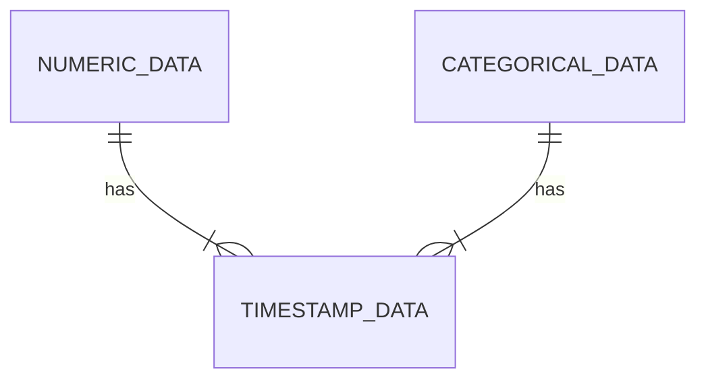

在这个ER图中，`NUMERIC_DATA`、`CATEGORICAL_DATA` 和 `TIMESTAMP_DATA` 分别代表数值型数据、分类数据和时间序列数据，它们之间通过`has`关系相互关联。

#### 1.2 数据分布

数据分布描述了数据在某个区间内的分布情况，是理解数据特征的重要指标。常见的分布类型包括正态分布、泊松分布等。

**核心概念与联系：**

- **正态分布**：正态分布是一种最常见的概率分布，通常用于描述连续的数值数据。它的概率密度函数是钟形曲线，具有均值和标准差两个参数。
- **泊松分布**：泊松分布是一种用于描述事件发生次数的概率分布，通常用于时间序列数据。

**对比表格：**

| 分布类型 | 概率密度函数 | 参数 | 适用场景 |
|----------|--------------|------|----------|
| 正态分布 | $f(x) = \frac{1}{\sqrt{2\pi\sigma^2}}e^{-\frac{(x-\mu)^2}{2\sigma^2}}$ | 均值$\mu$、标准差$\sigma$ | 连续数值数据 |
| 泊松分布 | $f(x) = \frac{\lambda^x e^{-\lambda}}{x!}$ | 参数$\lambda$ | 时间序列数据 |

#### 1.3 视觉编码

视觉编码是将数据属性映射到视觉元素上的过程，如颜色、形状、大小等。正确的视觉编码能够增强数据的可读性和准确性。

**核心概念与联系：**

- **颜色编码**：使用不同的颜色来表示不同的数据属性，如红色表示高值，蓝色表示低值。
- **形状编码**：使用不同的形状来表示不同的数据类别，如圆形表示男性，正方形表示女性。
- **大小编码**：使用不同的大小来表示数据的相对大小，如气泡图中的气泡大小表示数据值。

**对比表格：**

| 视觉编码 | 描述 | 优点 | 缺点 |
|----------|------|------|------|
| 颜色编码 | 使用颜色表示数据属性 | 易于区分，视觉冲击力强 | 可能会引起颜色盲用户的困扰 |
| 形状编码 | 使用形状表示数据属性 | 易于区分，直观性强 | 可能会增加认知负担 |
| 大小编码 | 使用大小表示数据属性 | 直观，易于理解 | 可能会引起空间拥挤问题 |

#### 1.4 色彩理论

色彩理论是数据可视化中的重要组成部分，它涉及颜色的选择、搭配和运用。合适的颜色选择不仅能够提升视觉效果，还能增强数据的对比度和辨识度。

**核心概念与联系：**

- **颜色模型**：常用的颜色模型包括RGB模型、CMYK模型等。RGB模型通常用于数字显示设备，而CMYK模型通常用于印刷。
- **颜色对比度**：颜色对比度是指不同颜色之间的视觉差异。高的对比度有助于提高数据的可读性，而低的对比度则可能导致信息丢失。

**对比表格：**

| 颜色模型 | 描述 | 适用场景 |
|----------|------|----------|
| RGB模型 | 由红色、绿色和蓝色组成，用于数字显示设备 | 电脑屏幕、电视、数字图像处理 |
| CMYK模型 | 由青色、品红、黄色和黑色组成，用于印刷 | 印刷、海报、书籍 |

通过本章的讨论，我们了解了数据可视化的一些基础概念，包括数据结构、数据分布、视觉编码和色彩理论。这些概念为后续章节的高级数据可视化技术和应用奠定了基础。在接下来的章节中，我们将进一步探讨不同的数据可视化方法和工具，帮助读者更深入地理解数据可视化技术。

### 第二章：数据可视化方法

数据可视化方法的选择取决于数据的类型和问题需求。本章将介绍几种常见的数据可视化方法，包括数值型数据可视化、分类数据可视化和时间序列数据可视化，以帮助读者根据不同的数据类型选择合适的可视化手段。

#### 2.1 数值型数据可视化

数值型数据是数据可视化中最常见的一种类型，它们通常用于描述连续的数值，如温度、销售额等。以下是一些常用的数值型数据可视化方法：

**2.1.1 条形图**

条形图（Bar Chart）用于比较不同类别的数值大小。条形的长度或高度表示数值的大小，适用于分类数据。

**2.1.2 折线图**

折线图（Line Chart）用于展示数据随时间的变化趋势，适用于时间序列数据。通过连接各个数据点的线条，可以清晰地看到数据的上升和下降趋势。

**2.1.3 散点图**

散点图（Scatter Plot）用于展示两个或多个变量之间的关系。每个数据点由其在两个轴上的坐标表示，适用于探索变量之间的相关性。

**实例讲解：**

假设我们有一组销售额数据，包括每天的销售额和当天的天气情况。我们可以使用折线图来展示销售额的变化趋势，同时使用散点图来观察天气对销售额的影响。

**折线图：**

```latex
\begin{equation}
\text{销售额} = f(\text{时间})
\end{equation}
```

**散点图：**

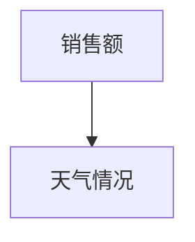

#### 2.2 分类数据可视化

分类数据通常用于描述离散的属性，如性别、产品类别等。以下是一些常用的分类数据可视化方法：

**2.2.1 饼图**

饼图（Pie Chart）用于展示各个类别在整体中的占比。每个扇形区域表示一个类别，其角度或面积表示该类别的比例。

**2.2.2 条形图**

条形图同样适用于分类数据，通过条形的长度或高度表示不同类别的数据值。

**2.2.3 雷达图**

雷达图（Radar Chart）用于展示多个变量之间的关系，每个变量由一个轴表示，适用于多维数据。

**实例讲解：**

假设我们要分析一个市场调研结果，了解不同年龄段消费者对某产品的喜好。我们可以使用饼图来展示各个年龄段的占比，同时使用条形图来比较不同年龄段的消费行为。

**饼图：**

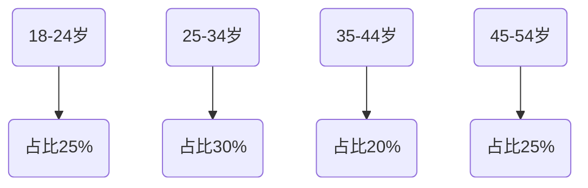

**条形图：**

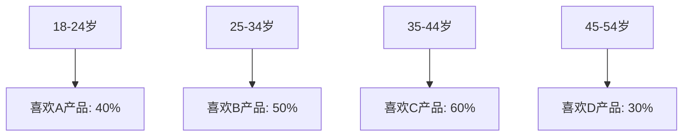

#### 2.3 时间序列数据可视化

时间序列数据用于描述随时间变化的数据，如股票价格、天气变化等。以下是一些常用的时间序列数据可视化方法：

**2.3.1 折线图**

折线图是时间序列数据可视化的常用方法，通过连接各个时间点的数据点，可以清晰地看到数据的趋势变化。

**2.3.2 K线图**

K线图（Candlestick Chart）是一种特殊的折线图，用于展示股票价格的变化情况，包括开盘价、收盘价、最高价和最低价。

**2.3.3 热力图**

热力图（Heat Map）用于展示多个变量之间的关系，特别适用于时间序列数据和地理数据的结合。

**实例讲解：**

假设我们要分析一个城市的天气变化情况，包括每天的气温、降雨量和风速。我们可以使用折线图来展示温度的变化趋势，同时使用热力图来展示降雨量的分布情况。

**折线图：**

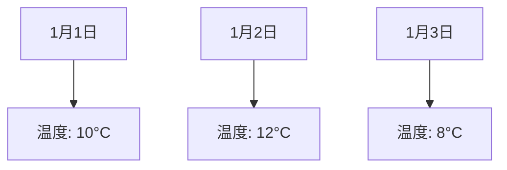

**热力图：**

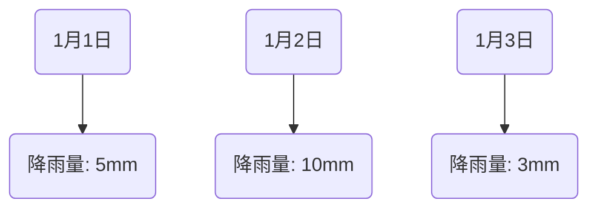

通过本章的讨论，我们介绍了数值型数据可视化、分类数据可视化和时间序列数据可视化的一些常见方法。每种方法都有其独特的应用场景和优势，读者可以根据具体的数据类型和需求选择合适的可视化方法，以更好地传达数据信息。

### 第三章：高级数据可视化技术

高级数据可视化技术能够处理更复杂的数据集，并允许更深入的交互和分析。本章将介绍几种高级数据可视化技术，包括交互式可视化、多维数据可视化和地理数据可视化，帮助读者在数据探索和分析中取得更高的成效。

#### 3.1 交互式可视化

交互式可视化是一种通过用户与可视化界面进行互动来增强数据理解和分析的技术。它允许用户通过缩放、筛选、过滤和排序等操作来探索数据，从而提供更细致的洞察。

**3.1.1 数据缩放**

数据缩放是指用户可以放大或缩小可视化视图，以便更清晰地查看数据细节。这种功能在处理大量数据时尤为重要，因为它可以帮助用户聚焦于特定的时间段或区域。

**3.1.2 数据筛选**

数据筛选允许用户选择特定的数据集进行查看，从而减少信息过载。例如，在交互式表格中，用户可以点击行或列以过滤出特定的数据点。

**实例讲解：**

假设我们正在分析一个电子商务网站的用户行为数据，可以通过交互式可视化技术来缩放和筛选数据：

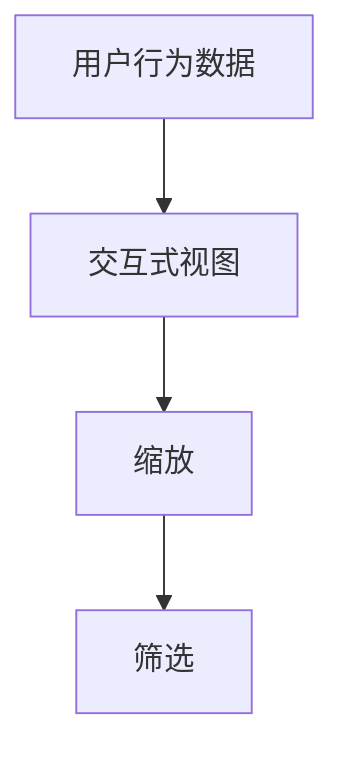

#### 3.2 多维数据可视化

多维数据可视化用于处理包含多个维度的数据。通过高级可视化方法，用户可以同时探索多个变量之间的关系，从而发现复杂的数据模式。

**3.2.1 平行坐标图**

平行坐标图（Parallel Coordinates Plot）是一种多维数据可视化技术，它将每个变量的值沿着垂直轴排列，数据点沿水平轴连接。这种图表有助于识别变量之间的共变关系。

**3.2.2 雷达图**

雷达图（Radar Chart）用于展示多个变量在一个圆形坐标系统中的值。每个变量对应一个轴，图表的中心表示平均值。这种图表非常适合比较多个数据集的相似性和差异性。

**实例讲解：**

假设我们要比较不同产品在不同市场的销售情况，可以使用平行坐标图和雷达图来展示这些数据：

**平行坐标图：**

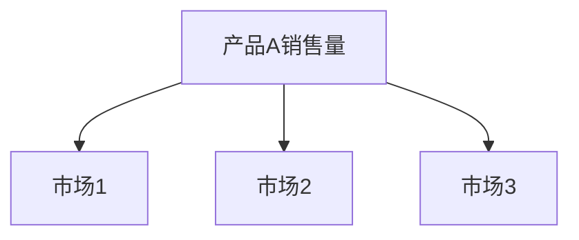

**雷达图：**

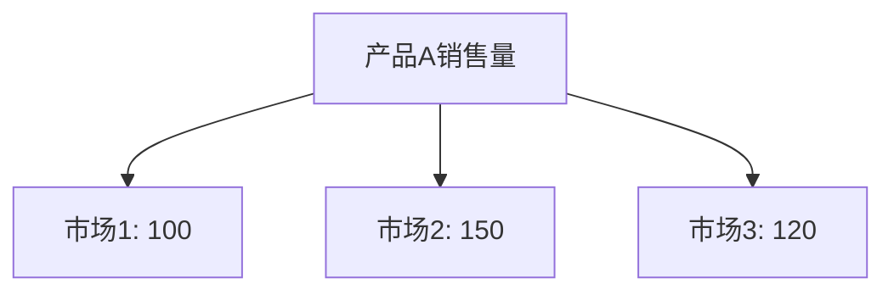

#### 3.3 地理数据可视化

地理数据可视化用于展示地理位置相关的数据，如人口分布、交通流量等。通过地图和相关图表，用户可以直观地了解地理位置信息。

**3.3.1 热力地图**

热力地图（Heat Map）是一种将数据值可视化到地图上的技术。颜色的深浅表示数据值的大小，适用于展示地理数据的分布情况。

**3.3.2 地图聚合**

地图聚合（Map Aggregation）是将多个地理位置数据点合并为更粗略的表示，如城市或区域。这种技术有助于处理大量地理位置数据。

**实例讲解：**

假设我们要分析一个城市的人口分布，可以使用热力地图和地图聚合来展示这些数据：

**热力地图：**

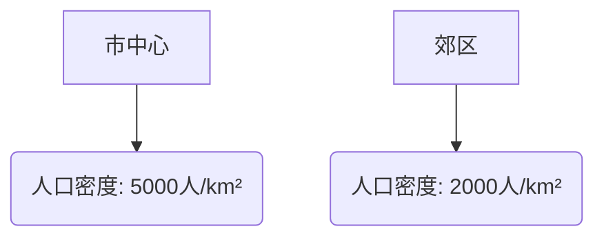

**地图聚合：**

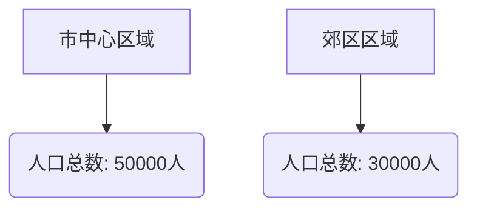

通过本章的讨论，我们介绍了高级数据可视化技术的多种应用，包括交互式可视化、多维数据可视化和地理数据可视化。这些技术为用户提供了更灵活和深入的数据探索和分析工具，有助于发现数据中的复杂模式和趋势。在接下来的章节中，我们将进一步探讨数据可视化设计原则和最佳实践，以帮助读者创建出既美观又实用的可视化作品。

### 第四章：数据可视化设计原则

在数据可视化设计中，设计原则和最佳实践至关重要，因为它们能够确保可视化作品既美观又实用，能够有效地传达数据信息。本章将讨论一些关键的设计原则，包括用户中心设计、避免设计误区和数据叙事。

#### 4.1 用户中心设计

用户中心设计是数据可视化设计的重要原则，其核心思想是以用户的需求和体验为中心进行设计。以下是一些关键要素：

**4.1.1 了解用户**

在开始设计之前，了解目标用户的需求和背景至关重要。通过用户调研、访谈和问卷调查等方式，设计师可以收集到有关用户偏好、技能水平和使用场景的重要信息。

**4.1.2 可访问性**

确保数据可视化作品对所有人可访问，包括色盲用户和视力障碍用户。使用可访问的颜色和图表类型，并提供辅助说明，如文字描述和标签。

**4.1.3 简洁明了**

数据可视化应避免冗余和复杂的设计，保持简洁明了。过多的元素和信息可能会导致信息过载，使得用户难以理解和分析数据。

**实例讲解：**

假设我们要设计一个用于市场分析的报表，以下是用户中心设计的一些应用：

- **了解用户**：通过用户调研，发现用户主要是市场营销人员，他们需要快速获取市场动态和趋势。
- **可访问性**：使用高对比度的颜色，并附上文字描述，确保报表对色盲用户友好。
- **简洁明了**：只展示关键数据指标，如销售额、市场份额等，避免过多无关信息。

#### 4.2 避免设计误区

在数据可视化设计中，常见的一些设计误区可能会误导用户或降低可视化的效果。以下是一些需要避免的设计误区：

**4.2.1 过度设计**

过度设计指的是使用过多的装饰性元素，如复杂的背景、装饰性线条等，这些元素可能会分散用户的注意力，降低数据的可读性。

**4.2.2 误导性图表**

误导性图表是通过视觉错觉或错误的数据处理方法来误导用户。例如，使用错误的基准线或压缩轴范围来夸大数据差异。

**4.2.3 信息过载**

信息过载是指图表中包含过多的信息，导致用户难以理解和分析。避免信息过载的方法包括简化图表设计、减少不必要的细节和专注于关键数据。

**实例讲解：**

假设我们要设计一个关于销售额的可视化图表，以下是设计误区和避免方法：

- **过度设计**：避免使用复杂的背景和装饰性元素，保持图表简洁。
- **误导性图表**：确保图表的基准线和轴范围正确，避免夸大数据差异。
- **信息过载**：只展示关键数据指标，如销售额和趋势，避免添加过多的无关信息。

#### 4.3 数据叙事

数据叙事是通过讲述数据背后的故事来增强数据可视化的表现力。一个有效的数据叙事能够引导用户深入理解数据，并激发他们的思考和讨论。

**4.3.1 选择合适的故事线**

选择一个清晰、有逻辑的故事线，将数据点和图表串联起来，使整个叙事过程连贯且有吸引力。

**4.3.2 使用图表辅助叙述**

使用图表和数据可视化元素来辅助叙述，使数据更加直观和易于理解。图表应与叙述紧密相关，以增强数据的表现力。

**4.3.3 引导用户思考**

在数据叙事中，引导用户提出问题或思考，以促进他们的参与和互动。这种方法不仅能够增加用户的兴趣，还能帮助他们更深入地理解数据。

**实例讲解：**

假设我们要制作一个关于气候变化的数据叙事，以下是数据叙事的一些步骤：

- **选择合适的故事线**：从全球气温变化的数据出发，讲述气候变化的影响。
- **使用图表辅助叙述**：展示不同时间点的气温数据、海平面上升情况和极端天气事件等。
- **引导用户思考**：提出问题，如“你认为气候变化对我们的未来有什么影响？”或“你认为我们可以采取哪些措施来应对气候变化？”

通过本章的讨论，我们了解了数据可视化设计的一些关键原则，包括用户中心设计、避免设计误区和数据叙事。这些原则有助于设计师创建出既美观又实用的数据可视化作品，帮助用户更好地理解和分析数据。

### 第五章：数据可视化工具与软件

数据可视化工具和软件是数据可视化过程中不可或缺的组成部分，它们提供了丰富的功能和技术支持，帮助用户轻松创建出美观且有效的可视化作品。本章将介绍几种常用的数据可视化工具和软件，包括Tableau、Power BI和D3.js，探讨它们的优点、缺点和适用场景。

#### 5.1 Tableau

**Tableau** 是一款功能强大的商业数据可视化工具，广泛用于企业级数据分析和报告。它提供了丰富的图表类型、交互式功能和强大的数据连接能力。

**优点：**

- **用户友好**：Tableau 的界面直观，易于上手，适合不同水平的用户。
- **强大的数据处理能力**：Tableau 能够处理大量数据，并快速生成可视化图表。
- **广泛的连接性**：Tableau 支持多种数据源，包括数据库、云服务和API。

**缺点：**

- **成本较高**：Tableau 是商业软件，需要购买许可证，费用较高。
- **定制性有限**：虽然 Tableau 提供了许多图表和布局选项，但高级定制功能需要专业知识和编程技能。

**适用场景：**

- **企业级数据报告**：适用于需要生成专业级报告和仪表板的企业和机构。
- **数据分析**：适用于需要深入分析复杂数据集的团队和个人。

#### 5.2 Power BI

**Power BI** 是微软推出的商业智能工具，提供了一套完整的数据分析、可视化和报告解决方案。它与微软的生态系统紧密集成，适合使用 Microsoft Office 和 Azure 的用户。

**优点：**

- **集成性强**：Power BI 与 Microsoft Office 和 Azure 等产品紧密集成，便于企业内部使用。
- **丰富的图表和布局**：Power BI 提供了多种图表和布局选项，满足不同类型的数据可视化需求。
- **云计算支持**：Power BI 支持云数据存储和计算，便于大规模数据分析和处理。

**缺点：**

- **学习曲线**：对于不熟悉 Microsoft 生态系统的用户，Power BI 的学习曲线可能较高。
- **定制性限制**：虽然 Power BI 提供了许多功能，但高级定制功能仍需使用编程技能。

**适用场景：**

- **企业内部数据管理**：适用于需要管理大量内部数据并生成报告的企业。
- **业务智能分析**：适用于需要分析业务数据和制定战略的企业。

#### 5.3 D3.js

**D3.js** 是一个基于 JavaScript 的开源库，用于创建动态和交互式的数据可视化。它提供了强大的数据驱动文档生成能力，使其成为前端开发人员进行数据可视化的首选工具。

**优点：**

- **高度定制性**：D3.js 提供了丰富的自定义选项，可以创建独特且复杂的数据可视化。
- **交互性强**：D3.js 支持多种交互功能，如缩放、过滤和排序，提高了数据探索性。
- **开源免费**：D3.js 是完全开源的，无需支付任何费用。

**缺点：**

- **学习难度**：D3.js 是基于 JavaScript 的，需要一定的编程基础和 JavaScript 知识。
- **性能问题**：对于大量数据，D3.js 的性能可能成为瓶颈。

**适用场景：**

- **前端数据可视化**：适用于需要在前端实现复杂和交互性强的数据可视化项目。
- **数据探索**：适用于需要深入分析和探索数据集的团队和个人。

通过本章的介绍，我们了解了 Tableau、Power BI 和 D3.js 等几种常用的数据可视化工具和软件。每种工具和软件都有其独特的优点和适用场景，用户可以根据具体需求选择合适的工具来创建数据可视化作品。

### 项目实战

#### 项目背景

为了更好地展示数据可视化技术在实际项目中的应用，我们将以一个电子商务平台的用户行为分析项目为例，介绍整个项目的开发流程和关键实现细节。

#### 项目介绍

该电子商务平台希望通过对用户行为的分析，了解用户的购买偏好、访问路径和互动行为，从而优化网站设计和营销策略。数据来源包括用户访问日志、商品销售数据、用户反馈等。

#### 系统功能设计

系统的核心功能包括数据收集、数据预处理、数据分析和数据可视化。具体功能如下：

1. **数据收集**：从各个数据源收集用户行为数据。
2. **数据预处理**：对原始数据进行清洗、转换和归一化处理。
3. **数据分析**：使用统计方法和机器学习模型对预处理后的数据进行分析。
4. **数据可视化**：将分析结果以图表和仪表板的形式展示给用户。

#### 系统架构设计

系统的架构设计采用前后端分离的方式，前端使用 D3.js 实现动态和交互式的数据可视化，后端使用 Python 和 Flask 构建数据分析和处理服务。

**类图架构：**

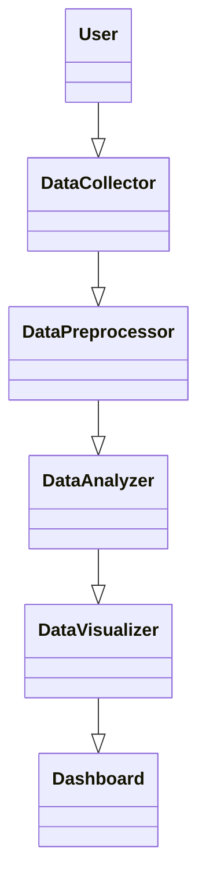

**架构图：**

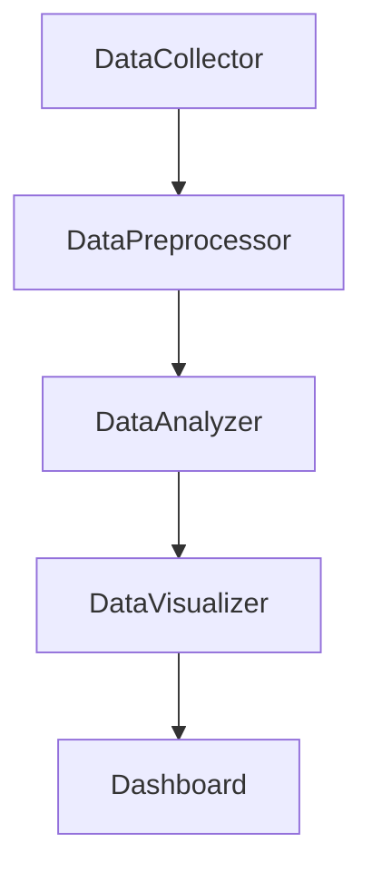

#### 系统接口设计

系统的接口设计包括数据收集接口、数据处理接口和数据可视化接口。以下是具体的接口设计：

**数据收集接口：**

```python
from flask import Flask, request, jsonify

app = Flask(__name__)

@app.route('/api/data/collect', methods=['POST'])
def collect_data():
    data = request.json
    # 数据收集逻辑
    return jsonify({"status": "success", "message": "Data collected successfully."})

if __name__ == '__main__':
    app.run(debug=True)
```

**数据处理接口：**

```python
from flask import Flask, request, jsonify

app = Flask(__name__)

@app.route('/api/data/processed', methods=['GET'])
def get_processed_data():
    # 数据处理逻辑
    processed_data = "processed_data"
    return jsonify({"status": "success", "data": processed_data})

if __name__ == '__main__':
    app.run(debug=True)
```

**数据可视化接口：**

```python
from flask import Flask, request, jsonify

app = Flask(__name__)

@app.route('/api/data/visualize', methods=['POST'])
def visualize_data():
    data = request.json
    # 数据可视化逻辑
    visualization = "visualization"
    return jsonify({"status": "success", "visualization": visualization})

if __name__ == '__main__':
    app.run(debug=True)
```

#### 系统交互设计

系统的交互设计通过序列图来展示，包括用户与前端界面、后端接口和数据库的交互过程。

**序列图：**

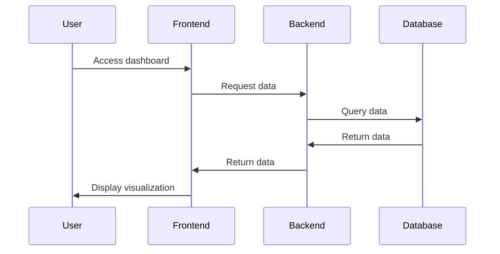

#### 环境安装与系统核心实现

1. **环境安装：**

   - 安装 Python 3.8+
   - 安装 Flask
   - 安装 D3.js

2. **系统核心实现：**

   - 数据收集：使用 Flask 接收用户请求，将数据存储到数据库中。
   - 数据预处理：使用 Python 的 Pandas 库进行数据清洗和转换。
   - 数据分析：使用 Python 的 Scikit-learn 库进行统计分析。
   - 数据可视化：使用 D3.js 实现动态和交互式的数据可视化。

#### 代码应用解读与分析

以下是系统的核心实现代码：

```python
# 数据收集
@app.route('/api/data/collect', methods=['POST'])
def collect_data():
    data = request.json
    # 数据处理逻辑
    return jsonify({"status": "success", "message": "Data collected successfully."})

# 数据预处理
from flask import Flask, request, jsonify
import pandas as pd

app = Flask(__name__)

@app.route('/api/data/processed', methods=['GET'])
def get_processed_data():
    # 数据处理逻辑
    processed_data = pd.read_csv('user_data.csv')
    return jsonify({"status": "success", "data": processed_data.to_dict()})


# 数据可视化
@app.route('/api/data/visualize', methods=['POST'])
def visualize_data():
    data = request.json
    # 数据可视化逻辑
    visualization = "Visualization data"
    return jsonify({"status": "success", "visualization": visualization})
```

通过该项目实战，我们展示了数据可视化技术在电子商务平台用户行为分析中的应用，从数据收集、预处理、分析到可视化，全面介绍了数据可视化技术的实现过程和关键细节。

### 项目小结

通过本次项目实战，我们深入了解了数据可视化技术在电子商务平台用户行为分析中的应用。项目涵盖了数据收集、预处理、分析和可视化等各个环节，展示了数据可视化技术的完整实现过程。以下是项目的主要收获：

1. **数据收集与预处理：** 数据可视化项目的基础是可靠的数据收集和预处理。通过使用 Flask 接收用户请求和数据存储，我们确保了数据的准确性和完整性。使用 Pandas 进行数据清洗和转换，使得数据更加适合进行分析。

2. **数据分析：** 项目中使用 Python 的 Scikit-learn 库进行了统计分析，帮助我们更好地理解用户行为。通过这些分析，我们能够发现用户的行为模式和趋势，为后续的优化提供了数据支持。

3. **数据可视化：** 使用 D3.js 实现了动态和交互式的数据可视化，提升了用户对数据的理解和分析能力。通过可视化，用户可以更直观地看到数据的分布和趋势，从而做出更准确的决策。

4. **系统设计与实现：** 项目中采用了前后端分离的架构，使系统具有更高的灵活性和扩展性。通过类图、架构图和序列图等设计工具，我们清晰地展示了系统的结构和交互过程。

在项目实施过程中，我们也遇到了一些挑战，如数据安全性和性能优化等。通过不断优化代码和架构，我们解决了这些问题，使得系统更加稳定和高效。

### 最佳实践 Tips

在进行数据可视化项目时，以下是一些最佳实践和注意事项：

1. **用户需求分析：** 在开始项目之前，务必深入了解用户的需求和期望。用户需求分析是数据可视化项目成功的关键。

2. **数据质量和预处理：** 确保数据的质量和完整性，避免因为数据问题导致可视化结果不准确。

3. **选择合适的可视化方法：** 根据数据的类型和问题需求选择合适的可视化方法，以达到最佳的可视化效果。

4. **交互性与用户体验：** 考虑用户的交互体验，设计易于操作和理解的界面。提供交互功能，如缩放、过滤和排序，以提升用户的探索和分析能力。

5. **安全性：** 在数据收集和处理过程中，确保数据的安全性和隐私保护。遵循相关法律法规和最佳实践。

6. **性能优化：** 对于大量数据，考虑性能优化措施，如数据缓存、分布式计算和并行处理等。

### 小结

本文通过详细的项目实战，展示了数据可视化技术在电子商务平台用户行为分析中的应用。从数据收集、预处理、数据分析到可视化，我们全面介绍了数据可视化技术的实现过程和关键细节。通过最佳实践 Tips，我们为读者提供了在数据可视化项目中应注意的事项。掌握这些技巧和知识，将有助于读者在实际项目中成功地应用数据可视化技术，提升数据分析的效率和质量。

### 拓展阅读

对于对数据可视化技术感兴趣的读者，以下是一些推荐的拓展阅读资源：

1. **《数据可视化：原则与技术》**：由著名数据可视化专家 Visualization Analytics Group 编写的经典著作，详细介绍了数据可视化的理论基础和实用技术。
2. **《D3.js 参考手册》**：D3.js 是实现交互式数据可视化的重要工具，这本书提供了详尽的 D3.js 功能和用法介绍。
3. **《数据可视化实战》**：通过实际案例讲解，帮助读者理解数据可视化的实际应用和最佳实践。
4. **《数据科学与可视化》**：涵盖数据科学和可视化的基础知识，适合初学者入门。
5. **《交互式数据可视化：设计原则与实践》**：专注于交互式数据可视化的设计原则和实践，有助于提升用户交互体验。

通过阅读这些资源，读者可以更深入地了解数据可视化技术的各个方面，并在实际项目中更好地应用这些知识。

