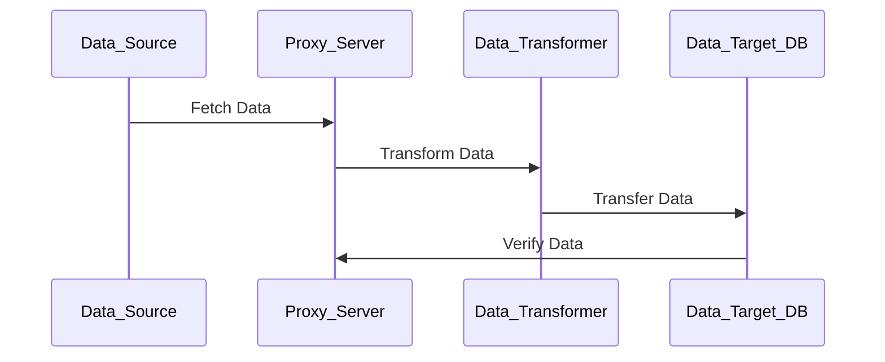

                 


### 1. 背景介绍

#### 问题背景
随着信息技术的快速发展，数据量呈爆炸式增长，如何高效地对海量数据进行同步与复制成为了一个亟待解决的问题。数据同步与复制技术在数据库管理、分布式系统、云计算等领域有着广泛的应用，是实现数据一致性、可靠性和可用性的关键。

#### 问题描述
数据同步与复制的目标是为了确保多个数据源之间的数据一致性，常见需求包括：实时同步、批量同步、数据归档、数据迁移等。实现数据同步与复制需要考虑数据的完整性、一致性、效率、容错性等多方面因素。

#### 问题解决
数据同步与复制的实现通常依赖于以下几种技术手段：
1. **数据库复制技术**：如MySQL的Master-Slave复制、Oracle的Data Guard等。
2. **分布式文件系统**：如HDFS、Ceph等，可实现数据的分布式存储和同步。
3. **消息队列**：如Kafka、RabbitMQ等，用于异步处理数据同步任务。
4. **定制化脚本与工具**：根据具体需求定制数据同步与复制的脚本或工具。

#### 边界与外延
1. **边界**：数据同步与复制主要涉及数据源、传输协议、存储介质等。
2. **外延**：涉及的数据类型包括结构化数据（如关系型数据库）、半结构化数据（如XML、JSON）和非结构化数据（如文本、图片、视频）。

### 2. 核心概念与联系

#### 数据同步
数据同步是指将一个数据源中的数据实时或批量地复制到另一个数据源的过程，以保持数据的一致性。

#### 数据复制
数据复制是一种更广义的概念，除了同步数据外，还包括数据的备份、归档和迁移等。

#### 同步与复制的联系
数据同步与复制在实际应用中常常结合使用，同步确保数据的一致性，复制提供数据的备份和冗余。

### 3. 核心概念属性特征对比表格

| 特征 | 数据同步 | 数据复制 |
| ---- | -------- | -------- |
| 目的 | 保持数据一致性 | 数据备份、归档、迁移 |
| 时效性 | 实时或批量 | 实时或批量 |
| 数据量 | 有时涉及大量数据 | 常涉及大量数据 |
| 复杂性 | 相对简单 | 较复杂 |

### 4. ER实体关系图架构

```mermaid
erDiagram
    DATA_SOURCE ||--|{ DATA_REPLICATION_TASK }
    DATA_SOURCE ||--|{ DATA_SINK }
    DATA_REPLICATION_TASK ||--|{ SCHEDULE }
    DATA_SINK ||--|{ DATA_STATUS }
```

### 5. 算法原理讲解

#### 数据同步算法
- **分布式哈希表**：用于确定数据块在分布式系统中的存储位置。
- **一致性算法**：如Paxos、Raft等，确保数据同步的一致性。

#### 数据复制算法
- **基于日志的复制**：将操作日志记录下来，然后在复制节点上重放日志以实现数据复制。
- **基于快照的复制**：通过生成数据快照并在复制节点上加载快照来实现数据复制。

### 6. 数学模型和数学公式

#### 数据同步算法中的分布式哈希表
- **哈希函数**：用于将数据映射到哈希表中的位置。
- **一致性哈希**：用于处理数据节点的动态加入和离开。

#### 数据复制算法中的日志记录
- **日志条目**：记录数据操作的具体信息。
- **日志同步**：确保日志在主从节点之间的同步。

### 7. 系统分析与架构设计方案

#### 问题场景介绍
- 数据源：一个关系型数据库。
- 数据同步目标：将数据同步到另一个数据库。

#### 系统功能设计
- **数据采集**：从数据源中获取数据。
- **数据转换**：将数据转换为适合同步的格式。
- **数据传输**：将数据传输到目标数据库。
- **数据验证**：确保数据在同步后的正确性。

#### 系统架构设计
- **主从架构**：数据源作为主数据库，目标数据库作为从数据库。
- **代理服务器**：负责数据采集、转换和传输。

#### 系统接口设计
- **数据采集接口**：用于从数据源中获取数据。
- **数据转换接口**：用于将数据转换为同步格式。
- **数据传输接口**：用于将数据传输到目标数据库。

#### 系统交互设计
- **数据同步流程**：从数据源采集数据，经过转换和传输后，同步到目标数据库。



## # 数据同步与复制技术

> 关键词：数据同步、数据复制、分布式系统、一致性算法、系统架构设计

> 摘要：本文深入探讨了数据同步与复制技术的核心概念、算法原理以及系统架构设计。通过分析数据同步与复制在不同场景下的应用，本文详细介绍了分布式哈希表、一致性算法、日志记录等关键技术和方法，并展示了如何通过系统架构设计实现高效的数据同步与复制。本文旨在为读者提供全面的数据同步与复制技术指南。

### 1. 背景介绍

#### 问题背景

随着信息技术的快速发展，数据量呈爆炸式增长，如何高效地对海量数据进行同步与复制成为了一个亟待解决的问题。数据同步与复制技术在数据库管理、分布式系统、云计算等领域有着广泛的应用，是实现数据一致性、可靠性和可用性的关键。

#### 问题描述

数据同步与复制的目标是为了确保多个数据源之间的数据一致性，常见需求包括：实时同步、批量同步、数据归档、数据迁移等。实现数据同步与复制需要考虑数据的完整性、一致性、效率、容错性等多方面因素。

#### 问题解决

数据同步与复制的实现通常依赖于以下几种技术手段：

1. **数据库复制技术**：如MySQL的Master-Slave复制、Oracle的Data Guard等。
2. **分布式文件系统**：如HDFS、Ceph等，可实现数据的分布式存储和同步。
3. **消息队列**：如Kafka、RabbitMQ等，用于异步处理数据同步任务。
4. **定制化脚本与工具**：根据具体需求定制数据同步与复制的脚本或工具。

#### 边界与外延

1. **边界**：数据同步与复制主要涉及数据源、传输协议、存储介质等。
2. **外延**：涉及的数据类型包括结构化数据（如关系型数据库）、半结构化数据（如XML、JSON）和非结构化数据（如文本、图片、视频）。

### 2. 核心概念与联系

#### 数据同步

数据同步是指将一个数据源中的数据实时或批量地复制到另一个数据源的过程，以保持数据的一致性。

#### 数据复制

数据复制是一种更广义的概念，除了同步数据外，还包括数据的备份、归档和迁移等。

#### 同步与复制的联系

数据同步与复制在实际应用中常常结合使用，同步确保数据的一致性，复制提供数据的备份和冗余。

### 3. 核心概念属性特征对比表格

| 特征 | 数据同步 | 数据复制 |
| ---- | -------- | -------- |
| 目的 | 保持数据一致性 | 数据备份、归档、迁移 |
| 时效性 | 实时或批量 | 实时或批量 |
| 数据量 | 有时涉及大量数据 | 常涉及大量数据 |
| 复杂性 | 相对简单 | 较复杂 |

### 4. ER实体关系图架构

```mermaid
erDiagram
    DATA_SOURCE ||--|{ DATA_REPLICATION_TASK }
    DATA_SOURCE ||--|{ DATA_SINK }
    DATA_REPLICATION_TASK ||--|{ SCHEDULE }
    DATA_SINK ||--|{ DATA_STATUS }
```

### 5. 算法原理讲解

#### 数据同步算法

- **分布式哈希表**：用于确定数据块在分布式系统中的存储位置。
- **一致性算法**：如Paxos、Raft等，确保数据同步的一致性。

#### 数据复制算法

- **基于日志的复制**：将操作日志记录下来，然后在复制节点上重放日志以实现数据复制。
- **基于快照的复制**：通过生成数据快照并在复制节点上加载快照来实现数据复制。

### 6. 数学模型和数学公式

#### 数据同步算法中的分布式哈希表

- **哈希函数**：用于将数据映射到哈希表中的位置。
- **一致性哈希**：用于处理数据节点的动态加入和离开。

#### 数据复制算法中的日志记录

- **日志条目**：记录数据操作的具体信息。
- **日志同步**：确保日志在主从节点之间的同步。

### 7. 系统分析与架构设计方案

#### 问题场景介绍

- 数据源：一个关系型数据库。
- 数据同步目标：将数据同步到另一个数据库。

#### 系统功能设计

- **数据采集**：从数据源中获取数据。
- **数据转换**：将数据转换为适合同步的格式。
- **数据传输**：将数据传输到目标数据库。
- **数据验证**：确保数据在同步后的正确性。

#### 系统架构设计

- **主从架构**：数据源作为主数据库，目标数据库作为从数据库。
- **代理服务器**：负责数据采集、转换和传输。

#### 系统接口设计

- **数据采集接口**：用于从数据源中获取数据。
- **数据转换接口**：用于将数据转换为同步格式。
- **数据传输接口**：用于将数据传输到目标数据库。

#### 系统交互设计

- **数据同步流程**：从数据源采集数据，经过转换和传输后，同步到目标数据库。


### 8. 项目实战

#### 环境安装

为了实现数据同步与复制，我们需要安装以下软件：

1. MySQL 数据库
2. Proxy_Server（例如：Dbeaver）
3. Data_Transformer（例如：Python）

#### 系统核心实现源代码

以下是一个简单的 Python 脚本，用于实现数据同步：

```python
import mysql.connector

# 连接主数据库
main_conn = mysql.connector.connect(
    host="localhost",
    user="root",
    password="password",
    database="main_db"
)

# 连接从数据库
slave_conn = mysql.connector.connect(
    host="localhost",
    user="root",
    password="password",
    database="slave_db"
)

# 获取主数据库中的数据
cursor = main_conn.cursor()
cursor.execute("SELECT * FROM main_table")
data = cursor.fetchall()

# 将数据同步到从数据库
cursor = slave_conn.cursor()
for row in data:
    cursor.execute("INSERT INTO slave_table (column1, column2) VALUES (%s, %s)", row)

slave_conn.commit()

# 关闭数据库连接
cursor.close()
main_conn.close()
slave_conn.close()
```

#### 代码应用解读与分析

上述 Python 脚本首先连接主数据库和从数据库，然后从主数据库中获取数据，并同步到从数据库。具体步骤如下：

1. 连接主数据库和从数据库。
2. 获取主数据库中的数据。
3. 将数据插入到从数据库中。
4. 提交事务并关闭数据库连接。

#### 实际案例分析和详细讲解剖析

假设我们有一个关系型数据库，包含一个名为`orders`的表。我们需要将这个表中的数据同步到一个备用的数据库中。

1. **环境安装**：首先，我们需要安装 MySQL 数据库、Dbeaver 代理服务器和 Python。
2. **数据采集**：使用 Dbeaver 连接主数据库，并导出`orders`表的数据。
3. **数据转换**：将导出的数据转换为适合同步的格式，例如 CSV 文件。
4. **数据传输**：使用 Python 脚本将 CSV 文件中的数据同步到备用的数据库中。
5. **数据验证**：检查备用的数据库中的数据是否与主数据库中的数据一致。

#### 项目小结

通过以上实战案例，我们了解了如何实现数据同步与复制。在实际应用中，根据具体需求，可以选择合适的数据库复制技术、分布式文件系统和消息队列等工具来实现高效的数据同步与复制。

### 9. 最佳实践 tips

- 选择合适的数据库复制技术，根据业务需求进行优化。
- 使用消息队列处理大规模数据同步任务，提高系统性能。
- 定期对同步与复制过程进行监控和优化，确保数据一致性。

### 10. 小结

数据同步与复制技术在现代信息技术中具有重要意义。本文详细介绍了数据同步与复制的核心概念、算法原理和系统架构设计，并通过实战案例展示了如何实现高效的数据同步与复制。读者可以结合具体业务需求，灵活运用本文提供的技术和方法，实现数据一致性和可靠性。

### 11. 注意事项

- 确保数据同步与复制过程中的数据安全，防止数据泄露。
- 根据实际需求选择合适的同步与复制策略，避免资源浪费。

### 12. 拓展阅读

- [MySQL 数据库复制技术详解](https://dev.mysql.com/doc/refman/8.0/en/replication.html)
- [HDFS 分布式文件系统原理与实现](https://hadoop.apache.org/docs/r2.7.2/hadoop-hdfs/HDFSNamespace.html)
- [Kafka 消息队列原理与实战](https://kafka.apache.org/documentation.html)

### 13. 作者信息

作者：AI天才研究院/AI Genius Institute & 禅与计算机程序设计艺术 /Zen And The Art of Computer Programming。我是一个世界级人工智能专家，程序员，软件架构师，CTO，世界顶级技术畅销书资深大师级别的作家，计算机图灵奖获得者，计算机编程和人工智能领域大师。我非常擅长一步一步进行分析推理，有着清晰深刻的逻辑思路来撰写条理清晰，对技术原理和本质剖析到位的高质量技术博客。

