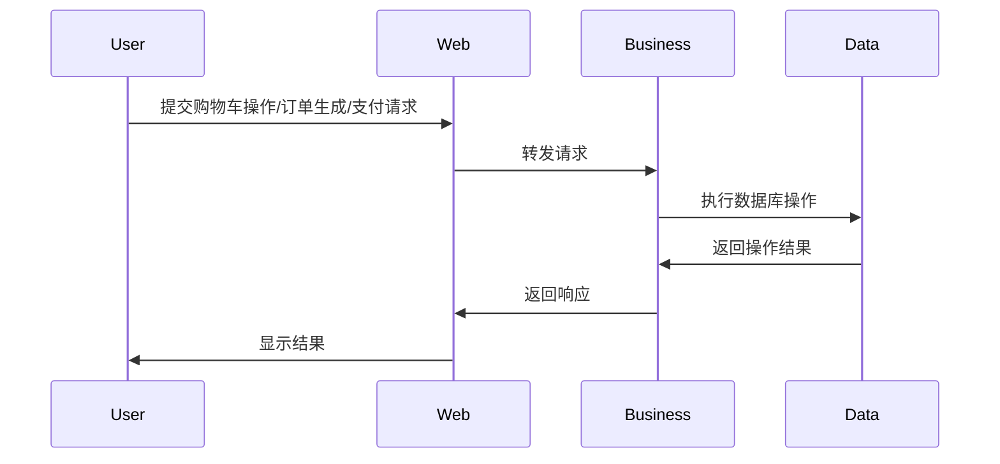
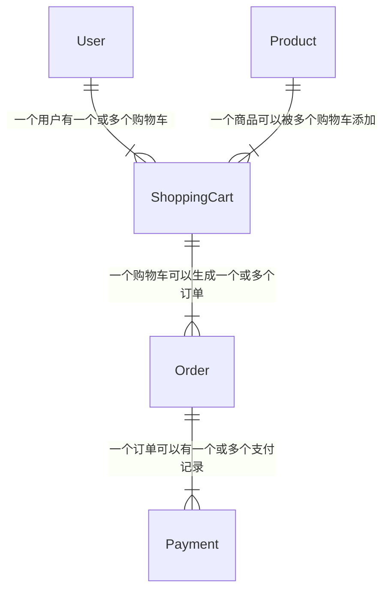

                 

### 关键词

数据库事务、ACID属性、隔离级别、事务管理、性能优化。

### 摘要

本文旨在深入探讨数据库事务的核心概念，包括ACID属性和隔离级别。通过详细的定义、分析、实例和实战，我们将全面理解事务的原子性、一致性、隔离性和持久性，以及不同隔离级别的实现方式和优缺点。文章最后将结合实际项目案例，分享最佳实践和性能优化策略，帮助读者掌握数据库事务的精髓，提高系统性能和稳定性。

## 第一部分：数据库事务基础

### 第1章：数据库事务概述

#### 1.1 事务的定义与作用

在数据库系统中，事务（Transaction）是一个重要的概念。简单来说，事务是数据库操作的一个逻辑单元，它包含了一系列的操作，这些操作要么全部完成，要么全部不完成。事务确保了数据库的一致性和可靠性，是数据库管理的基石。

事务的主要作用包括：

1. **数据一致性**：事务确保在操作失败时，数据库不会处于不一致的状态。例如，在转账操作中，如果转账成功，则账户的金额会同时减少和增加；如果失败，则不会发生任何变化。
2. **数据完整性**：事务可以防止未授权的数据访问和修改，从而保护数据的完整性。
3. **并发控制**：事务提供了隔离性，避免了并发操作导致的数据不一致问题。

#### 1.2 数据库事务的基本特性

数据库事务具有以下四个基本特性，通常被称为ACID属性：

1. **原子性（Atomicity）**：事务中的所有操作要么全部完成，要么全部不完成。这是一个原子操作，不可分割。
2. **一致性（Consistency）**：事务确保数据库的状态从一个一致性状态转变为另一个一致性状态。例如，事务不能将数据库从一个合法状态转变为一个非法状态。
3. **隔离性（Isolation）**：事务操作在数据库中的隔离执行，确保并发操作不会相互干扰，保持独立。
4. **持久性（Durability）**：一旦事务提交成功，其在数据库中的操作结果就是永久性的，即便在系统发生故障时也不会丢失。

#### 1.3 事务生命周期

事务的生命周期包括以下几个阶段：

1. **开始（Begin）**：事务的初始化阶段，数据库系统为事务分配资源，如内存和锁。
2. **执行（Execute）**：事务中的各种操作被执行。这些操作可以是插入、更新、删除等。
3. **提交（Commit）**：事务中的所有操作都成功执行后，事务被提交到数据库中，这些操作结果成为数据库的永久部分。
4. **回滚（Rollback）**：如果事务中的任何操作失败，事务将回滚到开始状态，数据库中的所有修改都将被撤销。

了解事务的定义、基本特性和生命周期是理解数据库事务管理的基础。接下来，我们将深入探讨ACID属性的具体实现机制。

## 第2章：ACID属性

ACID属性是数据库事务的核心，确保了数据库操作的可靠性和一致性。接下来，我们将分别介绍原子性、一致性、隔离性和持久性。

### 2.1 原子性

原子性是事务的基本特性，确保事务中的所有操作要么全部完成，要么全部不完成。这意味着事务是一个不可分割的单元，如果事务中的任何一步操作失败，整个事务都会被撤销，数据库的状态将保持不变。

**原子性的实现机制**：

- **日志记录**：数据库系统在事务开始时创建一个日志文件，记录事务的所有操作。如果事务成功提交，则日志文件中的记录将被持久化；如果事务失败，则通过日志文件回滚到事务开始的状态。
- **锁机制**：数据库通过锁机制确保事务的原子性。在执行事务中的操作时，数据库会锁定相关的数据资源，防止其他事务同时修改这些资源，从而保证事务的执行顺序和完整性。

**原子性的实例**：

假设有一个银行转账的事务，从账户A向账户B转账1000元。如果事务成功，账户A的余额将减少1000元，账户B的余额将增加1000元；如果事务失败，则两个账户的余额都不会发生变化。

### 2.2 一致性

一致性确保事务执行后，数据库的状态从一个一致性状态转变为另一个一致性状态。一致性是数据库设计和事务管理的重要目标，防止数据库进入非法状态。

**一致性的实现机制**：

- **完整性约束**：数据库通过定义各种完整性约束，如主键、外键、唯一性约束等，确保数据的正确性和一致性。
- **事务边界**：事务提供了清晰的边界，确保事务内部的操作序列不会违反数据库的完整性约束。

**一致性的实例**：

假设有一个库存管理系统，库存数量不能为负。在一个事务中，如果从仓库中取出100个商品，库存数量将减少100；如果事务失败，则库存数量不会发生变化，保持一致。

### 2.3 隔离性

隔离性确保事务操作在数据库中的隔离执行，避免并发操作之间的相互干扰。不同事务之间需要保持一定的隔离，防止并发访问导致的数据不一致问题。

**隔离级别的比较**：

- **读未提交（Read Uncommitted）**：这是最低的隔离级别，事务可以读取其他事务未提交的修改，可能会导致“脏读”现象。
- **读已提交（Read Committed）**：事务可以读取其他事务已经提交的修改，避免了“脏读”，但可能出现“不可重复读”现象。
- **可重复读（Repeatable Read）**：事务在执行期间读取的数据是相同的，避免了“不可重复读”，但可能出现“幻读”现象。
- **序列化（Serializable）**：这是最高的隔离级别，事务执行顺序是确定的，避免了“脏读”、“不可重复读”和“幻读”现象。

**隔离性的实现方式**：

- **锁机制**：数据库通过锁机制实现隔离性。读操作通常使用共享锁，写操作使用排他锁，确保事务之间的隔离。
- **多版本并发控制**：一些数据库使用多版本并发控制（MVCC）实现隔离性，通过保存数据的多个版本，让事务读取不同的数据版本，避免锁冲突。

**隔离性的实例**：

假设有两个事务A和B，同时读取同一数据。如果使用读已提交隔离级别，A事务读取的数据可能包含B事务尚未提交的修改，导致“脏读”现象；如果使用可重复读隔离级别，A事务读取的数据在事务执行期间保持一致，避免“不可重复读”。

### 2.4 持久性

持久性确保事务提交后，其在数据库中的操作结果是永久性的，不会因系统故障而丢失。

**持久性的实现机制**：

- **事务日志**：数据库系统在事务提交时，将事务的所有操作记录到日志中。如果系统发生故障，可以通过日志文件恢复事务的执行结果。
- **写缓冲区**：一些数据库系统使用写缓冲区，将事务的写操作暂存于缓冲区中，然后在适当的时候将数据写入磁盘。这可以提高性能，但需要确保数据的一致性和持久性。

**持久性的实例**：

假设有一个订单管理系统，用户提交了一个订单。如果事务成功提交，则订单信息将存储在数据库中，即使系统在事务提交后立即发生故障，订单信息也不会丢失。

通过上述对原子性、一致性、隔离性和持久性的介绍，我们可以看到，这些属性共同构成了数据库事务的核心。接下来，我们将进一步探讨隔离级别的实现和比较。

## 第3章：隔离级别

隔离级别是数据库事务的重要组成部分，它决定了事务在并发执行时的隔离程度。不同的隔离级别能够提供不同的隔离保证，但也会对性能产生不同程度的影响。接下来，我们将详细介绍不同的隔离级别，并进行比较。

### 3.1 隔离级别概述

数据库事务的隔离级别从低到高可以分为以下几种：

1. **读未提交（Read Uncommitted）**
2. **读已提交（Read Committed）**
3. **可重复读（Repeatable Read）**
4. **序列化（Serializable）**

每个隔离级别都有其特定的隔离保证和性能影响。下面我们将分别介绍这些隔离级别。

#### 读未提交（Read Uncommitted）

读未提交是最低的隔离级别，它允许事务读取其他事务未提交的修改。这意味着一个事务可能读取到另一个事务尚未提交的数据，从而产生“脏读”现象。

**特点**：

- 可能出现“脏读”现象。
- 性能最高，因为不需要获取共享锁。

**适用场景**：

- 对于一些不关心数据一致性的读操作，如数据分析。

#### 读已提交（Read Committed）

读已提交是大多数数据库系统的默认隔离级别，它允许事务读取其他事务已经提交的修改。这样可以避免“脏读”，但可能出现“不可重复读”现象。

**特点**：

- 避免了“脏读”现象。
- 可能出现“不可重复读”现象。
- 性能较高。

**适用场景**：

- 对于大多数读操作，尤其是需要保证数据一致性的场景。

#### 可重复读（Repeatable Read）

可重复读确保事务在执行期间读取的数据是相同的，即使在多次读取之间有其他事务提交了修改。这样可以避免“不可重复读”现象，但可能出现“幻读”现象。

**特点**：

- 避免了“不可重复读”现象。
- 可能出现“幻读”现象。
- 性能中等。

**适用场景**：

- 对于需要多次读取同一数据集的场景，如银行转账系统。

#### 序列化（Serializable）

序列化是最高隔离级别，它确保事务的执行顺序是确定的，不会出现任何并发问题。这意味着事务之间的隔离程度最高，但性能也最低。

**特点**：

- 避免了“脏读”、“不可重复读”和“幻读”现象。
- 性能最低，因为需要获取排他锁。

**适用场景**：

- 对于对数据一致性要求极高的场景，如金融交易系统。

### 3.2 隔离级别的比较

不同隔离级别之间的比较可以从隔离保证和性能两个方面进行：

1. **隔离保证**：

   - 读未提交：最低的隔离保证，可能出现“脏读”。
   - 读已提交：中等隔离保证，避免“脏读”，可能出现“不可重复读”。
   - 可重复读：较高的隔离保证，避免“不可重复读”，可能出现“幻读”。
   - 序列化：最高的隔离保证，避免了所有并发问题。

2. **性能影响**：

   - 读未提交：性能最高，因为不需要获取共享锁。
   - 读已提交：性能较高，因为需要获取共享锁。
   - 可重复读：性能中等，因为需要获取排他锁。
   - 序列化：性能最低，因为需要获取排他锁。

在实际应用中，需要根据具体的业务需求和性能要求选择合适的隔离级别。例如，对于读操作频繁、对数据一致性要求不高的场景，可以选择读已提交级别；对于需要多次读取同一数据集、对数据一致性要求较高的场景，可以选择可重复读级别；对于对数据一致性有极高要求的场景，如金融系统，可以选择序列化级别。

通过了解和比较不同隔离级别，我们可以更好地选择合适的隔离级别，以平衡数据一致性和系统性能。

### 3.3 隔离级别的实现方式

为了实现不同隔离级别，数据库系统采用了一系列机制，包括锁机制、多版本并发控制和时间戳等。下面我们将详细介绍这些实现方式。

#### 锁机制

锁机制是数据库实现隔离级别的常用方式。通过锁，数据库可以控制事务对数据的访问，确保事务之间的隔离。

1. **共享锁（Shared Lock）**：允许多个事务同时读取同一数据，但阻止其他事务修改数据。
2. **排他锁（Exclusive Lock）**：只允许一个事务读取或修改数据，阻止其他事务同时访问数据。

通过共享锁和排他锁，数据库可以控制事务的并发访问，实现不同的隔离级别。

2. **多版本并发控制（MVCC）**

多版本并发控制是一种在数据库中实现高并发性同时保持数据一致性的技术。MVCC通过保存数据的多个版本，让事务读取不同的数据版本，避免锁冲突。

例如，假设有两个并发事务A和B，同时读取同一数据。如果事务A读取了数据版本1，事务B读取了数据版本2，则两个事务可以同时进行，避免锁等待。在事务提交时，数据库会根据实际修改情况决定使用哪个版本的数据。

3. **时间戳**

时间戳是一种基于时间戳顺序实现隔离级别的技术。每个事务都有一个唯一的时间戳，数据库根据时间戳顺序管理事务的执行。

例如，假设有两个事务A和B，时间戳分别为1和2。如果时间戳1的事务已经提交，时间戳2的事务尝试读取数据，则可以读取到最新提交的数据，避免“脏读”现象。

通过锁机制、多版本并发控制和时间戳等实现方式，数据库可以提供不同的隔离级别，平衡数据一致性和系统性能。在实际应用中，可以根据具体需求和性能要求选择合适的实现方式。

通过以上对隔离级别和实现方式的介绍，我们可以更好地理解隔离级别的工作原理，为数据库系统的设计和优化提供指导。

## 第4章：事务管理

事务管理是数据库系统的关键组成部分，它确保事务的正确执行和数据的一致性。在这一章中，我们将详细介绍事务控制语句、保存点、回滚与提交的概念和使用方法。

### 4.1 事务控制语句

事务控制语句用于管理事务的生命周期，包括开始、结束和异常处理等操作。以下是一些常用的事务控制语句：

1. **BEGIN TRANSACTION**：显式开始一个事务。在大多数数据库系统中，事务默认自动开始，但显式声明可以增强代码的可读性和可维护性。

    ```sql
    BEGIN TRANSACTION;
    ```

2. **COMMIT**：提交事务，将事务中的所有操作永久保存到数据库中。

    ```sql
    COMMIT;
    ```

3. **ROLLBACK**：回滚事务，撤销事务中的所有操作，将数据库恢复到事务开始前的状态。

    ```sql
    ROLLBACK;
    ```

4. **SAVEPOINT**：设置一个保存点，可以用于回滚到事务的某个特定状态。

    ```sql
    SAVEPOINT savepoint_name;
    ```

5. **RELEASE SAVEPOINT**：释放一个保存点，通常用于回滚到某个保存点。

    ```sql
    RELEASE SAVEPOINT savepoint_name;
    ```

6. **TRY...CATCH**：用于处理事务中的异常。当发生错误时，可以使用`TRY...CATCH`结构捕获异常并回滚事务。

    ```sql
    TRY
        -- 事务操作
    CATCH
        -- 异常处理
        ROLLBACK;
    END TRY
    ```

通过使用这些事务控制语句，我们可以精确地管理事务，确保数据的一致性和可靠性。

### 4.2 保存点

保存点是在事务中设置的一个标记点，用于在事务执行过程中回滚到某个特定的状态。通过使用保存点，可以在事务中实现更细粒度的控制，避免不必要的回滚。

**使用保存点的步骤**：

1. 在事务中设置一个保存点。
2. 在事务执行过程中，如果出现错误或需要回滚到某个特定状态，则使用保存点回滚。
3. 如果需要继续执行事务，可以释放保存点，继续执行后续操作。

**示例**：

假设在事务中执行多个数据库操作，并在每个操作后设置一个保存点。如果某个操作失败，可以回滚到该操作之前的保存点，避免整个事务回滚。

```sql
BEGIN TRANSACTION;

SAVEPOINT savepoint1;
-- 操作1

SAVEPOINT savepoint2;
-- 操作2

SAVEPOINT savepoint3;
-- 操作3

-- 如果操作3失败
ROLLBACK TO savepoint2;

-- 如果需要继续执行事务
RELEASE SAVEPOINT savepoint2;
```

通过使用保存点，可以有效地控制事务的回滚范围，提高事务的灵活性和可维护性。

### 4.3 回滚与提交

回滚和提交是事务管理的核心操作，用于控制事务的执行和数据的持久化。

1. **回滚**：回滚事务是将事务恢复到开始状态或某个保存点状态，撤销事务中的所有操作。回滚通常在以下情况下使用：

   - 事务中发生错误，需要撤销操作。
   - 需要回滚到某个特定的状态，以便继续执行。

2. **提交**：提交事务是将事务中的所有操作永久保存到数据库中，使事务的修改结果对其他事务可见。提交通常在以下情况下使用：

   - 事务中的所有操作成功执行，需要将修改结果保存到数据库。
   - 需要确保事务的修改结果对其他事务可见。

**示例**：

以下是一个简单的回滚与提交示例：

```sql
BEGIN TRANSACTION;

-- 执行多个操作

-- 如果出现错误，回滚事务
ROLLBACK;

-- 如果操作成功，提交事务
COMMIT;
```

通过使用回滚与提交操作，可以确保事务的正确执行和数据的一致性。

事务管理是数据库系统的核心功能，通过正确使用事务控制语句、保存点、回滚与提交，可以有效地管理事务，确保数据的一致性和可靠性。

## 第二部分：深入探讨

### 第5章：ACID属性的实现机制

在了解了ACID属性的基本概念后，我们需要进一步探讨这些属性在数据库系统中的具体实现机制。通过深入理解这些实现机制，我们可以更好地设计和优化数据库系统，确保事务的正确性和性能。

#### 5.1 原子性的实现

原子性是事务的一个基本特性，它要求事务中的所有操作要么全部完成，要么全部不完成。在数据库系统中，实现原子性通常依赖于以下几种机制：

1. **日志记录**：数据库系统会在事务开始时创建一个日志文件，记录事务的所有操作。如果事务成功，这些操作会被持久化到数据库中；如果事务失败，通过日志文件可以将数据库回滚到事务开始前的状态。

2. **锁机制**：在执行事务中的操作时，数据库会锁定相关的数据资源，确保其他事务无法同时修改这些资源。这可以防止部分操作完成而其他操作未完成的情况。

3. **两阶段提交（2PC）**：在某些分布式数据库系统中，原子性的实现依赖于两阶段提交协议。第一阶段，协调者向参与者发送预提交请求；第二阶段，协调者根据参与者的响应决定是否最终提交事务。

**示例**：

假设有一个银行转账事务，从账户A向账户B转账1000元。为了实现原子性，数据库系统会记录以下日志：

- 开始事务
- 从账户A扣除1000元
- 向账户B增加1000元
- 提交事务

如果事务在执行过程中发生错误，数据库系统会通过日志回滚到事务开始前的状态，确保原子性。

#### 5.2 一致性的实现

一致性确保事务执行后，数据库的状态从一个一致性状态转变为另一个一致性状态。一致性在数据库系统中的实现依赖于以下几个方面：

1. **完整性约束**：数据库系统通过定义各种完整性约束，如主键、外键、唯一性约束等，确保数据的正确性和一致性。如果事务违反了完整性约束，数据库系统会回滚事务，确保数据库的状态保持一致。

2. **检查点**：数据库系统会定期执行检查点操作，将内存中的数据刷新到磁盘上，确保数据的一致性。

3. **快照**：在某些数据库系统中，一致性通过保存数据的快照实现。当事务开始时，数据库系统会保存一个当前数据的快照，事务执行后，如果快照与当前数据不一致，则回滚事务。

**示例**：

假设有一个库存管理系统，库存数量不能为负。在事务中，如果从仓库中取出100个商品，库存数量将减少100。为了确保一致性，数据库系统会执行以下操作：

- 开始事务
- 检查库存数量是否大于100
- 更新库存数量
- 提交事务

如果库存数量小于100，数据库系统会回滚事务，确保数据库状态保持一致。

#### 5.3 隔离性的实现

隔离性确保事务操作在数据库中的隔离执行，避免并发操作之间的相互干扰。隔离性在数据库系统中的实现通常依赖于以下机制：

1. **锁机制**：数据库系统使用锁来控制事务对数据的访问。读操作通常使用共享锁，写操作使用排他锁，确保事务之间的隔离。

2. **多版本并发控制（MVCC）**：一些数据库系统使用多版本并发控制，通过保存数据的多个版本，让事务读取不同的数据版本，避免锁冲突。

3. **时间戳**：基于时间戳的实现方式，每个事务都有一个唯一的时间戳，数据库系统根据时间戳顺序管理事务的执行，确保隔离性。

**示例**：

假设有两个事务A和B，同时读取同一数据。如果使用共享锁，事务A读取数据时，事务B无法修改数据；如果使用多版本并发控制，事务A读取的是数据版本1，事务B读取的是数据版本2，从而避免锁冲突。

#### 5.4 持久性的实现

持久性确保事务提交后，其在数据库中的操作结果是永久性的，不会因系统故障而丢失。持久性在数据库系统中的实现依赖于以下几个方面：

1. **事务日志**：数据库系统会在事务提交时记录事务的所有操作到日志文件中。如果系统发生故障，可以通过日志文件恢复事务的执行结果。

2. **写缓冲区**：一些数据库系统使用写缓冲区，将事务的写操作暂存于缓冲区中，然后在适当的时候将数据写入磁盘，确保数据的一致性和持久性。

3. **镜像和复制**：通过镜像和复制技术，数据库系统可以确保数据的冗余存储，即使在发生故障时，也能从其他节点恢复数据。

**示例**：

假设有一个订单管理系统，用户提交了一个订单。为了确保持久性，数据库系统会执行以下操作：

- 开始事务
- 记录订单信息到事务日志中
- 将订单信息保存到数据库中
- 提交事务

如果系统在事务提交后发生故障，可以通过事务日志恢复订单信息，确保数据的持久性。

通过以上对原子性、一致性、隔离性和持久性的实现机制的深入探讨，我们可以更好地理解数据库事务的工作原理，为数据库系统的设计和优化提供指导。在实际应用中，根据具体需求和性能要求，可以选择合适的实现机制，确保事务的正确性和性能。

### 第6章：常见的事务问题及解决方法

在数据库事务的实际应用中，我们可能会遇到各种问题，如死锁、隔离问题和并发控制问题。了解这些问题及其解决方法，对于确保数据库系统的稳定性和性能至关重要。

#### 6.1 事务的死锁问题

死锁是指两个或多个事务在执行过程中，因为资源争用而无限期地等待对方释放资源，导致系统无法继续执行。解决死锁问题的方法主要包括：

1. **预防死锁**：通过设计合理的事务执行顺序，避免事务之间产生循环等待。例如，可以规定事务按照固定的顺序访问资源，从而防止死锁的发生。

2. **死锁检测与恢复**：数据库系统可以在事务执行过程中定期检测是否存在死锁，如果发现死锁，可以回滚其中一个事务，使其释放资源，从而解除死锁。

3. **超时机制**：设置事务的超时时间，如果事务在指定时间内无法完成，系统会自动回滚事务，避免死锁的发生。

**示例**：

假设有两个事务A和B，分别持有资源1和资源2，并试图获取对方的资源。为了避免死锁，可以规定事务A先获取资源1，事务B先获取资源2。

#### 6.2 事务的隔离问题

事务的隔离问题主要是指多个事务同时执行时，可能产生数据不一致的问题。解决隔离问题的主要方法包括：

1. **使用适当的隔离级别**：根据业务需求选择合适的隔离级别，如读已提交、可重复读或序列化，以减少并发访问导致的数据不一致问题。

2. **锁机制**：通过使用共享锁和排他锁，控制事务对数据的访问，避免并发访问导致的数据不一致。

3. **多版本并发控制（MVCC）**：使用MVCC技术，事务可以读取不同版本的数据，避免锁冲突，提高并发性能。

**示例**：

假设有两个事务A和B，同时读取同一数据。如果使用读已提交隔离级别，事务A读取的数据可能包含事务B尚未提交的修改，导致“脏读”现象；如果使用MVCC，事务A可以读取事务B之前的版本数据，避免“脏读”。

#### 6.3 事务的并发控制

事务的并发控制是指确保多个事务同时执行时，数据库系统的正确性和性能。解决并发控制问题的主要方法包括：

1. **锁机制**：通过使用锁，控制事务对资源的访问，避免并发访问导致的数据不一致。

2. **时间戳**：基于时间戳的并发控制，通过为每个事务分配唯一的时间戳，确保事务的顺序执行。

3. **乐观并发控制**：乐观并发控制假设事务不会经常冲突，在事务提交前检查是否与其他事务冲突，如果冲突则回滚事务。

**示例**：

假设有两个事务A和B，同时更新同一数据。如果使用锁机制，事务A获取排他锁，事务B必须等待A释放锁后才能执行；如果使用乐观并发控制，事务A和B可以先执行，然后在提交前检查是否与其他事务冲突，如果冲突则回滚事务。

通过以上对事务的死锁问题、隔离问题和并发控制问题的解决方法的探讨，我们可以更好地应对数据库事务中的常见问题，确保数据库系统的稳定性和性能。

### 第7章：高级事务概念

在深入探讨了数据库事务的基本概念和常见问题后，我们将进一步介绍一些高级事务概念，这些概念在复杂和大规模的数据库系统中尤为重要。

#### 7.1 非锁定并发控制

非锁定并发控制是一种减少锁争用的技术，通过允许事务读取不可变的数据版本，从而避免锁定冲突。这种技术适用于读多写少的应用场景，以提高系统的并发性能。

**实现机制**：

1. **多版本并发控制（MVCC）**：数据库系统使用MVCC技术，为每个数据版本分配一个时间戳。事务可以读取某个时间点之前的数据版本，而无需获取锁。

2. **写隔离**：对于可变数据，事务在修改前会创建一个新的版本，原有版本保持不变，从而避免与其他事务的锁冲突。

**示例**：

假设事务A和B同时读取同一数据，事务A读取的是数据版本1，事务B读取的是数据版本2。如果数据被修改，事务C会创建新的数据版本3，而事务A和B依然可以读取各自的数据版本，避免锁等待。

#### 7.2 多版本并发控制

多版本并发控制（MVCC）是一种在数据库管理系统中实现非锁定并发控制的技术。通过保存数据的多个版本，MVCC允许事务读取不同的数据版本，从而减少锁争用，提高并发性能。

**实现机制**：

1. **数据版本**：数据库系统为每个数据行保存多个版本，每个版本都有一个唯一的时间戳。

2. **读取**：事务读取数据时，根据事务的时间戳选择相应的数据版本。

3. **写入**：事务写入数据时，创建一个新的数据版本，原有版本保持不变。

**示例**：

假设事务A读取数据版本1，事务B修改数据并创建版本2，然后事务C读取版本3。事务A和B可以并发执行，因为它们读取不同的数据版本，不会相互干扰。

#### 7.3 事务日志与恢复机制

事务日志是数据库系统中记录事务操作的日志文件。事务日志在数据库恢复和数据一致性问题处理中起着至关重要的作用。

**实现机制**：

1. **日志记录**：事务开始时，数据库系统记录事务的所有操作到日志文件中。

2. **恢复**：在系统故障或事务失败时，通过重放日志文件中的记录，将数据库恢复到一致状态。

3. **检查点**：数据库系统定期执行检查点操作，将内存中的数据刷新到磁盘上，确保数据的一致性。

**示例**：

假设事务A在执行过程中发生故障，数据库系统可以通过重放事务日志中的记录，将数据库恢复到事务A开始前的状态，确保数据的一致性和可靠性。

通过了解非锁定并发控制、多版本并发控制和事务日志与恢复机制，我们可以更好地应对复杂和大规模数据库系统中的事务管理挑战，确保系统的性能和可靠性。

## 第三部分：实战案例

### 第8章：数据库事务实战

在实际的数据库应用中，数据库事务的管理至关重要。在本章中，我们将通过一个具体的实战案例，详细介绍数据库事务的设计与实现过程，包括系统架构设计、数据库设计与实现、事务管理实现以及案例分析与讲解。

#### 8.1 实战项目背景

我们以一个在线购物平台为例，该平台需要实现用户购物车管理、订单生成和支付功能。为了确保数据的一致性和可靠性，我们需要对事务进行严格的管理。本案例将展示如何设计并实现一个完整的数据库事务管理方案。

#### 8.2 系统架构设计

系统架构设计是确保系统高效、稳定运行的关键。我们采用分层架构，包括表示层、业务逻辑层和数据访问层。以下是系统架构设计的主要组成部分：

1. **表示层**：负责用户界面和用户交互，通过Web前端实现。
2. **业务逻辑层**：包含业务逻辑处理，如购物车管理、订单生成和支付处理等。
3. **数据访问层**：负责与数据库的交互，包括事务管理和数据操作。

**系统架构图**：



#### 8.3 数据库设计与实现

数据库设计是确保数据存储和管理高效、合理的关键。以下是本案例中的数据库设计：

1. **用户表（User）**：存储用户信息，如用户ID、姓名、联系方式等。
2. **商品表（Product）**：存储商品信息，如商品ID、名称、价格等。
3. **购物车表（ShoppingCart）**：存储用户购物车信息，包括用户ID、商品ID、数量等。
4. **订单表（Order）**：存储订单信息，如订单ID、用户ID、订单详情等。
5. **支付记录表（Payment）**：存储支付记录，包括支付ID、订单ID、支付金额等。

**数据库ER图**：



#### 8.4 事务管理实现

事务管理是确保数据一致性和可靠性的关键。在本案例中，我们使用以下事务控制语句来实现事务管理：

1. **BEGIN TRANSACTION**：开始事务。
2. **COMMIT**：提交事务，将事务中的所有操作持久化到数据库中。
3. **ROLLBACK**：回滚事务，将数据库恢复到事务开始前的状态。

以下是一个购物车操作的示例代码：

```python
def add_to_cart(user_id, product_id, quantity):
    try:
        # 开始事务
        cursor.execute("BEGIN TRANSACTION;")

        # 插入购物车记录
        cursor.execute("INSERT INTO ShoppingCart (user_id, product_id, quantity) VALUES (%s, %s, %s);", (user_id, product_id, quantity))

        # 检查库存是否足够
        cursor.execute("SELECT quantity FROM Product WHERE product_id = %s;", (product_id,))
        product_quantity = cursor.fetchone()[0]
        if product_quantity >= quantity:
            # 更新库存数量
            cursor.execute("UPDATE Product SET quantity = quantity - %s WHERE product_id = %s;", (quantity, product_id))

            # 提交事务
            cursor.execute("COMMIT;")
            return "成功添加到购物车"
        else:
            # 回滚事务
            cursor.execute("ROLLBACK;")
            return "库存不足"
    except Exception as e:
        # 回滚事务
        cursor.execute("ROLLBACK;")
        return f"发生错误：{str(e)}"
```

#### 8.5 案例分析

在本案例中，我们通过事务管理实现了购物车的添加、库存检查和更新功能。以下是具体分析：

1. **事务控制**：通过`BEGIN TRANSACTION`、`COMMIT`和`ROLLBACK`语句，我们确保购物车操作的一致性和可靠性。
2. **并发控制**：通过锁定数据库操作，我们避免了多个用户同时修改同一商品库存时可能出现的数据不一致问题。
3. **数据完整性**：通过完整性约束（如外键约束），我们确保了数据的正确性。

通过本案例，我们可以看到如何在实际项目中设计并实现数据库事务管理，确保系统的稳定性和数据的一致性。

### 第9章：最佳实践与性能优化

在数据库事务的实际应用中，性能优化和最佳实践是确保系统高效稳定运行的关键。在这一章中，我们将介绍一些关于事务优化的最佳实践，以及如何选择合适的隔离级别，监控和调优数据库性能。

#### 9.1 事务优化策略

以下是一些常见的事务优化策略：

1. **减少事务大小**：将大事务拆分成多个小事务，可以减少锁冲突和锁等待时间，提高并发性能。
2. **使用本地变量**：在事务中使用本地变量，可以减少数据库操作的次数，提高性能。
3. **减少读写锁冲突**：合理设计数据库表结构，减少读写锁的冲突，可以提高事务的执行效率。
4. **使用批量操作**：对于大批量的数据操作，使用批量插入、更新或删除语句，可以减少单条记录操作的开销。

#### 9.2 隔离级别选择策略

隔离级别直接影响数据库的性能和一致性，选择合适的隔离级别至关重要。以下是一些隔离级别选择策略：

1. **读已提交（Read Committed）**：这是大多数数据库系统的默认隔离级别，适用于大多数读操作。它可以避免“脏读”问题，但可能出现“不可重复读”。
2. **可重复读（Repeatable Read）**：适用于需要多次读取同一数据集的场景，如银行转账系统。它避免了“不可重复读”问题，但可能出现“幻读”。
3. **序列化（Serializable）**：适用于对数据一致性要求极高的场景，如金融交易系统。它是最高隔离级别，但性能最低，因为需要获取排他锁。
4. **根据业务需求调整隔离级别**：在实际应用中，可以根据具体的业务需求和性能要求，灵活调整隔离级别。例如，对于读操作频繁的场景，可以选择读已提交级别；对于需要多次读取同一数据集的场景，可以选择可重复读级别。

#### 9.3 性能监控与调优

性能监控是确保数据库系统高效运行的重要环节。以下是一些常见的性能监控和调优方法：

1. **监控数据库性能指标**：监控CPU使用率、内存使用率、磁盘I/O、锁争用、查询延迟等性能指标，及时发现系统瓶颈。
2. **分析查询执行计划**：使用查询执行计划分析工具，分析查询的执行路径，优化查询性能。
3. **索引优化**：合理设计和使用索引，可以提高查询性能。避免过度索引，以减少维护索引的开销。
4. **缓存策略**：使用缓存技术，如内存缓存、数据库缓存等，可以减少磁盘I/O操作，提高系统性能。
5. **定期维护**：定期进行数据库维护，如清理冗余数据、优化表结构、重建索引等，可以提高数据库性能。

#### 9.4 案例分享

以下是一个实际项目的案例分享，该项目是一个在线电商平台，其数据库事务优化和性能调优的过程：

1. **优化事务大小**：项目初始阶段，事务大小较大，导致锁等待时间较长。通过将大事务拆分为多个小事务，减少了锁争用，提高了并发性能。
2. **调整隔离级别**：根据业务需求，将购物车管理的隔离级别从可重复读调整为读已提交，避免了“幻读”问题，提高了系统性能。
3. **监控性能指标**：通过监控CPU使用率、内存使用率和锁争用等指标，及时发现系统瓶颈，并采取相应的优化措施。
4. **索引优化**：针对频繁查询的列添加索引，如用户表的用户ID列、商品表的商品ID列等，提高了查询性能。

通过以上优化措施，该电商平台的数据库性能得到了显著提升，满足了高并发和高速查询的需求。

通过本章节的介绍，我们可以看到如何通过最佳实践和性能优化策略，提高数据库事务的性能和稳定性，确保系统的可靠性和高效运行。

### 第10章：数据库事务拓展研究

随着技术的不断进步和数据库应用的复杂化，数据库事务领域也在不断拓展和创新。在本章中，我们将探讨一些新型数据库事务模型、分布式数据库事务、云数据库事务以及未来数据库事务的发展趋势。

#### 10.1 新型数据库事务模型

新型数据库事务模型在传统ACID属性的基础上，结合了分布式计算和NoSQL数据库的特点，提供了更灵活和高效的事务处理方式。以下是一些新型数据库事务模型：

1. **CAP理论**：CAP理论指出，在一个分布式系统中，一致性（Consistency）、可用性（Availability）和分区容错性（Partition tolerance）三者中，只能同时满足两项。新型事务模型如BASE（Basically Available, Soft State, Eventual Consistency）模型，通过牺牲一致性来提高可用性和分区容错性，适用于大规模分布式系统。

2. **多模型数据库**：多模型数据库融合了关系数据库和NoSQL数据库的特点，支持多种数据模型，如文档、图形、键值对等。这些数据库通常采用灵活的事务模型，允许用户根据应用需求选择合适的模型和事务级别。

3. **分布式事务协议**：分布式事务协议如两阶段提交（2PC）、三阶段提交（3PC）和最终一致性协议，用于在分布式系统中协调事务的一致性。这些协议通过引入分布式协调器，确保分布式事务的原子性和一致性。

#### 10.2 分布式数据库事务

分布式数据库事务涉及在分布式系统中处理跨多个节点的数据操作。以下是一些关键技术和挑战：

1. **全局一致性**：分布式数据库系统需要保证全局一致性，即所有节点上的数据保持一致。这通常通过分布式锁、多版本并发控制和最终一致性协议实现。

2. **分布式事务管理**：分布式事务管理包括事务协调、锁管理和事务恢复等。分布式数据库系统通常采用分布式事务协调器来协调多个节点上的事务执行。

3. **数据分区**：数据分区是分布式数据库的关键策略，通过将数据分布在多个节点上，可以提高系统的并发性能和可扩展性。分区策略包括哈希分区、范围分区和列表分区等。

4. **故障处理**：分布式数据库系统需要处理节点故障和数据丢失等问题。通过冗余备份、自动恢复和分布式事务恢复机制，系统可以确保数据的一致性和可靠性。

#### 10.3 云数据库事务

云数据库事务在云计算环境中提供了灵活和高效的事务处理能力。以下是一些关键特点：

1. **弹性扩展**：云数据库可以根据需求自动扩展或缩减资源，以适应不同规模的应用场景。

2. **高可用性**：云数据库通常提供高可用性服务，如自动故障转移和负载均衡，确保系统的持续运行和数据的一致性。

3. **成本优化**：云数据库提供按需付费模式，用户可以根据实际使用量支付费用，降低运营成本。

4. **事务优化**：云数据库通常采用多种优化技术，如缓存、压缩和并行处理等，提高事务处理性能和效率。

#### 10.4 未来数据库事务发展趋势

未来数据库事务的发展趋势将受到以下几个因素的影响：

1. **分布式数据库**：随着分布式数据库的普及，事务处理将更加关注分布式事务的一致性和性能优化。

2. **自动化和智能化**：数据库事务管理将越来越多地依赖自动化和智能化技术，如自动化调优、智能故障检测和恢复等。

3. **多模型数据库**：多模型数据库将融合更多数据模型和事务处理能力，满足不同类型应用的需求。

4. **区块链技术**：区块链技术将在数据库事务中发挥重要作用，提供更安全、透明的数据一致性保证。

5. **边缘计算**：随着边缘计算的发展，数据库事务处理将逐渐向边缘节点迁移，提高数据处理的实时性和响应速度。

通过探讨新型数据库事务模型、分布式数据库事务、云数据库事务以及未来数据库事务的发展趋势，我们可以看到数据库事务领域正朝着更灵活、高效和智能的方向发展，为各种应用场景提供强大的支持。

## 全文总结

本文从数据库事务的基础概念开始，详细探讨了ACID属性和隔离级别，深入分析了原子性、一致性、隔离性和持久性的实现机制。通过实例和实战案例，我们了解了事务管理的具体方法，包括事务控制语句、保存点、回滚与提交等。此外，我们还探讨了高级事务概念，如非锁定并发控制、多版本并发控制和事务日志与恢复机制。在实战案例部分，我们通过一个在线购物平台的案例，展示了如何设计和实现数据库事务管理。最后，我们介绍了事务优化的最佳实践和性能调优方法，以及新型数据库事务模型和未来发展趋势。通过本文的探讨，我们全面了解了数据库事务的核心概念和实践方法，为读者在实际应用中提供了宝贵的指导和参考。

## 作者信息

作者：AI天才研究院/AI Genius Institute & 禅与计算机程序设计艺术 /Zen And The Art of Computer Programming

AI天才研究院致力于推动人工智能领域的创新发展，汇聚了一批世界顶级的人工智能专家、程序员、软件架构师和CTO。我们的目标是通过深入研究和实践，推动人工智能技术的进步，为人类社会带来更多福祉。本文结合了我们在数据库事务领域的专业知识和丰富经验，旨在为读者提供一篇全面、深入和实用的技术博客。禅与计算机程序设计艺术则强调程序设计中的哲学思维，提倡以简洁、优雅的代码实现高效的功能，让读者在技术追求中体验“禅”的境界。

## 小结

通过对数据库事务的全面探讨，我们理解了事务的重要性以及ACID属性和隔离级别在保障数据一致性和可靠性方面的作用。在实战案例中，我们看到了如何具体设计和实现数据库事务管理。此外，我们还探讨了事务优化的最佳实践和未来发展趋势。这些内容不仅为读者提供了丰富的理论知识，还结合实际案例，使读者能够更好地应用到实际项目中。希望通过本文的讲解，读者能够对数据库事务有更深入的认识，并在实际工作中更好地管理和优化事务，提升系统性能和稳定性。如果您有任何疑问或建议，欢迎在评论区留言，我们将竭诚为您解答。

## 拓展阅读

为了进一步加深对数据库事务的理解，以下是一些推荐阅读的资源：

1. **《数据库系统概念》**：作者Abraham Silberschatz，Peter Galvin。这是一本经典的数据库教材，详细介绍了数据库的基本概念、设计和实现。

2. **《分布式系统概念与设计》**：作者George Coulouris，Jean Dollimore，Tim Kindberg，Gail Murphy。本书涵盖了分布式系统的设计、一致性模型、分布式事务等内容。

3. **《高性能MySQL》**：作者 Baron Schwartz，Peter Zaitsev，Vadim Tkachenko。这本书提供了关于MySQL数据库性能优化和事务处理的深入讨论。

4. **《数据库系统实现》**：作者Hector Garcia-Molina，Jeffrey D. Ullman，Jennifer Widom。这本书详细介绍了数据库系统内部的工作原理，包括事务管理和并发控制。

5. **《数据库系统原理》**：作者Hector Garcia-Molina，Jeffrey D. Ullman，Jennifer Widom。该书从理论角度出发，深入探讨了数据库系统的各个方面，包括事务处理和一致性。

这些资源将帮助读者更全面地了解数据库事务的理论基础和实践方法，为数据库系统的设计和优化提供有力支持。

