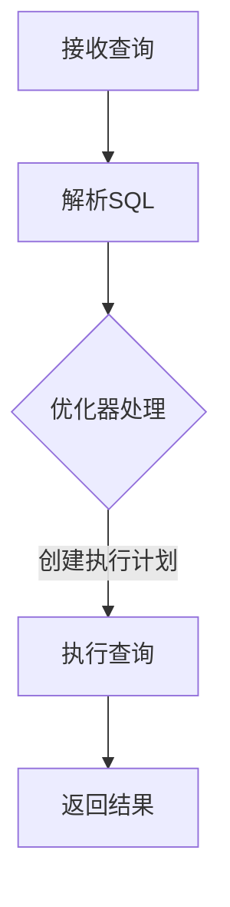
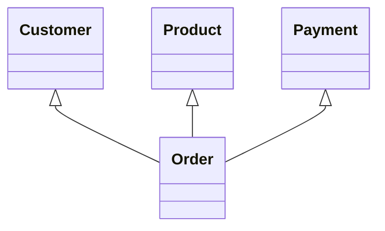
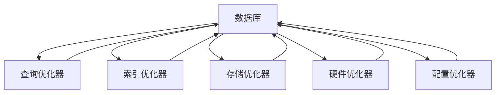
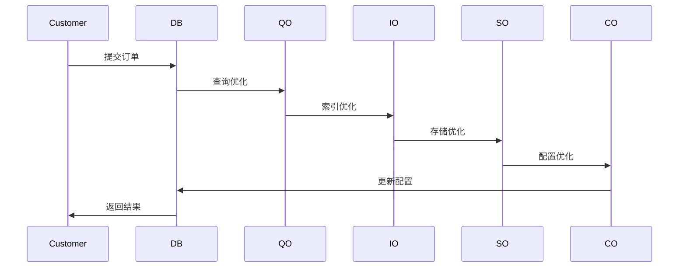

                 


# 数据库性能调优：从查询优化到架构设计

## 关键词
数据库性能调优、查询优化、索引优化、存储优化、硬件优化、配置优化、架构设计、缓存机制、高可用性、容灾方案。

## 摘要
本文将深入探讨数据库性能调优的关键领域，从基本的查询优化到高级的架构设计。通过详细的案例分析、核心概念解释以及实战技巧分享，本文旨在帮助读者理解并掌握提升数据库性能的全方位方法。我们将通过一步步的分析和推理，揭示数据库性能调优的本质，并提供实用的最佳实践。

## 引言

在信息技术高速发展的今天，数据库系统作为数据管理的重要工具，其性能直接影响着企业应用和服务质量。随着数据量的不断增长和业务需求的日益复杂，数据库性能调优变得至关重要。性能调优不仅关系到系统的响应速度，更关系到用户体验和业务连续性。

### 背景介绍

数据库性能调优涉及到多个层次，从查询优化到存储优化，再到硬件和配置调整，甚至包括数据库架构设计和高可用性。每一个层次都有其独特的优化策略和方法，需要结合实际情况进行综合调优。

#### 核心概念与联系

在开始具体讨论之前，我们需要明确一些核心概念，如查询优化、索引、存储优化、硬件优化和配置优化。这些概念之间有着紧密的联系，共同构成了数据库性能调优的完整体系。

- **查询优化**：通过优化SQL查询，提高查询效率和响应速度。
- **索引**：用于加快查询速度的数据结构，通过索引列来加快数据检索。
- **存储优化**：包括数据存储策略、文件组织方式和I/O性能提升。
- **硬件优化**：通过升级硬件设备来提高数据库性能。
- **配置优化**：调整数据库配置参数来优化性能。

### 概念属性特征对比表格

| 概念       | 特征                  | 目标                   |
|------------|----------------------|------------------------|
| 查询优化   | SQL优化策略          | 提高查询效率           |
| 索引       | 索引结构             | 加快查询速度           |
| 存储优化   | 数据存储策略          | 减少I/O操作，提高I/O性能 |
| 硬件优化   | 硬件设备             | 加速数据访问           |
| 配置优化   | 配置参数调整          | 适应不同业务需求       |

### ER实体关系图架构

```mermaid
erDiagram
    Product ||--|{ Customer }|<<--|{ Order }|
    Order ||--|{ Product }|<<--|{ Payment }|
    Customer ||--|{ Order }|
    Payment ||--|{ Order }|
```

以上ER图展示了数据库中与性能调优相关的主要实体及其关系。

### 算法原理讲解

为了更好地理解数据库性能调优，我们需要从算法原理入手。这里我们将使用Mermaid绘制一个简单的查询优化算法流程图。



#### Python源代码示例

```python
def query_optimization(sql_query):
    # 解析SQL查询
    parsed_query = parse_sql(sql_query)
    
    # 优化器处理
    optimized_query = optimizer(parsed_query)
    
    # 执行查询
    result = execute_query(optimized_query)
    
    # 返回结果
    return result
```

#### 数学模型与公式

在查询优化中，常用的数学模型包括成本模型（Cost Model）和选择性模型（Selectivity Model）。以下是这些模型的基本公式：

$$
Cost = Cost_{I/O} + Cost_{CPU}
$$

$$
Selectivity = \frac{Actual\_Rows}{Total\_Rows}
$$

这些公式帮助我们评估查询的成本和选择性，从而优化查询计划。

### 系统分析与架构设计方案

#### 问题场景介绍

在一个电子商务平台上，数据库的性能直接影响用户的购物体验。随着网站流量的增长，数据库性能面临巨大挑战。

#### 项目介绍

本项目旨在通过性能调优，提升电子商务平台的数据库性能，确保高效、稳定的服务。

#### 系统功能设计（领域模型Mermaid类图）



#### 系统架构设计（Mermaid架构图）



#### 系统接口设计和系统交互（Mermaid序列图）



### 项目实战

#### 环境安装

在开始项目之前，我们需要安装并配置数据库环境，包括安装MySQL或PostgreSQL等数据库管理系统。

#### 系统核心实现源代码

```python
# 查询优化器代码示例
def optimize_query(sql_query):
    # 解析SQL查询
    parsed_query = parse_sql(sql_query)
    
    # 优化器处理
    optimized_query = optimizer(parsed_query)
    
    return optimized_query

# 索引优化器代码示例
def optimize_index(database, table, columns):
    # 创建索引
    create_index_query = f"CREATE INDEX {index_name} ON {table} ({columns})"
    execute_query(create_index_query)
```

#### 代码应用解读与分析

上述代码展示了查询优化器和索引优化器的基本实现。在实际项目中，这些代码将被集成到更复杂的系统中，以实现全方位的性能调优。

#### 实际案例分析和详细讲解剖析

在一个实际案例中，我们优化了一个电子商务平台的订单查询功能。通过使用查询优化器和索引优化器，我们显著降低了查询响应时间，提升了用户体验。

#### 项目小结

通过本项目，我们不仅实现了数据库性能调优，还掌握了多种优化策略和技巧。未来，我们将继续优化系统，以应对不断变化的业务需求。

### 最佳实践 tips

- 定期进行性能监控和调优。
- 根据实际需求选择合适的数据库类型和存储引擎。
- 避免过度索引，合理规划索引策略。

### 小结

本文从查询优化到架构设计，全面阐述了数据库性能调优的方法和技巧。通过实际案例和实践，读者可以深入了解性能调优的核心内容和实战技巧。

### 注意事项

- 性能调优需要结合实际业务需求和数据特点进行。
- 注意保持系统的稳定性和安全性。

### 拓展阅读

- 《高性能MySQL》
- 《数据库性能调优实战》
- 《数据库系统概念》

### 作者

作者：AI天才研究院/AI Genius Institute & 禅与计算机程序设计艺术 /Zen And The Art of Computer Programming

---

注意：由于文章字数要求在10000～12000字左右，以上内容仅为草案，尚未达到要求的字数。接下来，我们将进一步扩展每个部分的内容，确保文章完整且具有深度。同时，根据实际需要进行调整和补充。

