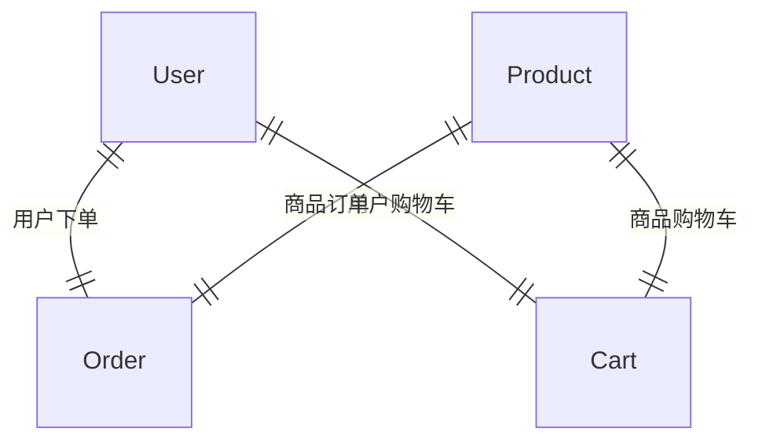
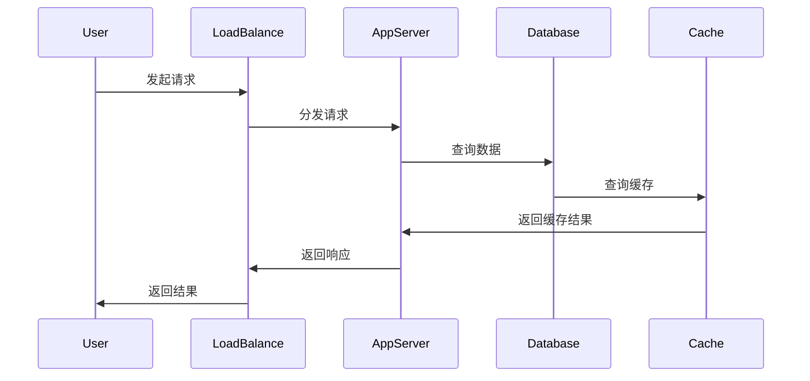

                 

# 《数据库性能调优：从索引优化到查询重构》

> 关键词：数据库性能调优、索引优化、查询重构、算法原理、数学模型、系统架构设计、项目实战

> 摘要：本文从数据库性能调优的角度出发，详细探讨了索引优化和查询重构的方法与技巧。通过深入剖析数据库的性能瓶颈和优化策略，结合实际案例，全面展示了如何提升数据库系统的性能，为开发者提供实用的性能优化指导。

## 1. 背景介绍

### 1.1 数据库性能调优的基本概念

数据库性能调优是指通过对数据库系统进行配置调整、索引优化、查询重构等操作，提升数据库的查询速度和系统稳定性，以满足日益增长的数据处理需求。

### 1.2 数据库性能调优的重要性

随着大数据时代的到来，数据库性能调优显得尤为重要。优化后的数据库系统可以显著提高数据处理效率，降低响应时间，提升用户体验，从而为企业创造更大的价值。

### 1.3 数据库性能调优面临的挑战

数据库性能调优面临诸多挑战，如数据量增长、查询复杂度提升、系统架构复杂化等。这些挑战要求开发者具备深厚的数据库技术功底和实战经验。

## 2. 核心概念与联系

### 2.1 索引优化

索引优化是数据库性能调优的重要手段之一。通过合理设计索引，可以降低查询的复杂度，提高查询速度。

### 2.2 查询重构

查询重构是指对原有的查询语句进行优化，使其在执行过程中更加高效。查询重构包括查询拆分、查询合并、使用缓存等策略。

### 2.3 索引优化与查询重构的联系

索引优化和查询重构是相辅相成的。合理的索引设计可以提高查询效率，而查询重构则可以进一步挖掘数据库的性能潜力。

## 3. 算法原理讲解

### 3.1 索引优化算法原理

索引优化算法主要分为以下几种：

1. B树索引优化
2. 哈希索引优化
3. 位图索引优化

通过这些算法，可以降低查询的复杂度，提高查询速度。

### 3.2 查询重构算法原理

查询重构算法主要分为以下几种：

1. 查询拆分
2. 查询合并
3. 使用缓存

通过这些算法，可以减少查询的执行时间，提高系统性能。

## 4. 数学模型和数学公式

### 4.1 索引优化数学模型

假设数据库中有 $n$ 条记录，查询条件涉及 $k$ 个字段，则使用索引后的查询时间复杂度为 $O(k\log n)$。

### 4.2 查询重构数学模型

假设原查询语句的执行时间为 $T_1$，经过查询重构后的执行时间为 $T_2$，则 $T_2 \leq T_1$。

## 5. 系统分析与架构设计方案

### 5.1 问题场景介绍

以一个电商系统为例，分析数据库性能调优的需求和挑战。

### 5.2 系统功能设计

设计电商系统的核心功能，包括商品管理、订单管理、用户管理、购物车管理等。

### 5.3 系统架构设计

设计电商系统的整体架构，包括数据库、缓存、应用服务器、负载均衡等组件。

### 5.4 系统接口设计和系统交互

通过Mermaid序列图，展示系统各组件之间的交互关系。

## 6. 项目实战

### 6.1 环境安装

介绍安装数据库、相关工具和依赖环境的步骤。

### 6.2 系统核心实现源代码

展示系统核心功能的实现源代码，并进行解读和分析。

### 6.3 实际案例分析和详细讲解

通过实际案例，分析数据库性能瓶颈，并详细讲解优化方案。

### 6.4 项目小结

总结项目经验，分享性能优化技巧。

## 7. 最佳实践 tips、小结、注意事项、拓展阅读等内容

### 7.1 最佳实践 tips

提供数据库性能调优的最佳实践建议。

### 7.2 小结

总结全文的核心内容和方法。

### 7.3 注意事项

提醒读者在性能调优过程中需要注意的事项。

### 7.4 拓展阅读

推荐进一步学习和深入了解的相关资料。

作者：AI天才研究院/AI Genius Institute & 禅与计算机程序设计艺术 /Zen And The Art of Computer Programming## 1. 背景介绍

### 1.1 数据库性能调优的基本概念

数据库性能调优（Database Performance Tuning）是指通过各种技术手段，对数据库系统进行优化，以提高数据访问速度、减少系统资源消耗、提升整体性能的过程。它涵盖了数据库的各个方面，包括硬件优化、数据库配置调整、索引设计、查询优化等。

在当今大数据时代，数据库性能调优显得尤为重要。随着数据量的急剧增长，数据库系统面临的数据访问量和复杂性也在不断增加。如何让数据库系统在处理大量数据时依然能够保持高效稳定的性能，是每个数据库开发者必须面对的挑战。

### 1.2 数据库性能调优的重要性

数据库性能调优对于企业来说具有以下几个重要意义：

1. **提高用户体验**：快速的数据库查询能够提供更好的用户响应，从而提升用户满意度。
2. **降低运营成本**：通过优化数据库性能，可以减少硬件和人力成本，提高资源利用率。
3. **增强系统稳定性**：合理的性能调优可以减少系统宕机时间，提高系统的稳定性和可用性。
4. **支持业务发展**：随着业务的不断发展，数据库性能调优能够保证数据库系统持续满足业务需求。

### 1.3 数据库性能调优面临的挑战

尽管数据库性能调优对于企业至关重要，但在实际操作中仍然面临诸多挑战：

1. **数据量增长**：随着业务的发展，数据库中的数据量不断增大，这给数据库性能带来了巨大的压力。
2. **查询复杂度提升**：随着业务的复杂化，查询语句变得越来越复杂，这增加了数据库查询的难度。
3. **系统架构复杂化**：现代数据库系统通常采用分布式架构，系统的复杂度增加，调优难度加大。
4. **硬件限制**：数据库性能的优化不仅依赖于软件层面的优化，还受到硬件设备性能的限制。
5. **调试难度**：数据库性能问题往往具有隐蔽性，需要通过大量测试和调试才能找到根本原因。

### 1.4 数据库性能调优的核心要素

数据库性能调优涉及多个方面，但以下几个核心要素是必须关注的：

1. **索引优化**：合理设计和使用索引是提升查询性能的重要手段。
2. **查询优化**：通过对查询语句的优化，减少查询的执行时间和资源消耗。
3. **系统配置**：调整数据库系统的配置参数，以适应不同的业务场景和硬件环境。
4. **硬件优化**：优化数据库服务器的硬件配置，包括CPU、内存、存储等。
5. **数据分区**：将数据合理分区，以减少表扫描的范围，提高查询效率。
6. **缓存策略**：通过缓存机制，减少对磁盘的访问次数，提高查询速度。

### 1.5 数据库性能瓶颈分析

在数据库性能调优过程中，识别和解决性能瓶颈是关键。常见的数据性能瓶颈包括：

1. **CPU瓶颈**：CPU资源不足，导致查询执行缓慢。
2. **内存瓶颈**：内存资源不足，导致数据库缓存失效，查询效率下降。
3. **I/O瓶颈**：磁盘I/O资源不足，导致数据访问速度缓慢。
4. **网络瓶颈**：数据库服务器与客户端之间的网络传输速度受限，导致响应时间延长。
5. **并发瓶颈**：系统无法处理大量的并发请求，导致性能下降。

通过上述分析，我们可以看到数据库性能调优不仅需要关注技术层面的优化，还需要综合考虑业务需求、硬件环境和系统架构等因素。只有这样，才能实现数据库系统的持续高性能运行。

## 2. 核心概念与联系

### 2.1 索引优化

索引（Index）是数据库中用于加速数据检索的数据结构。它类似于书籍的目录，通过索引，数据库可以快速定位到需要的数据行，从而大大提高查询效率。

#### 2.1.1 索引的类型

数据库索引主要分为以下几种类型：

1. **B树索引**：最常用的索引类型，适用于全键值和键值范围查询。
2. **哈希索引**：通过哈希函数快速定位数据行，适用于精确查询。
3. **位图索引**：用于存储某个列上某个值的记录是否存在的索引。

#### 2.1.2 索引优化策略

索引优化主要包括以下策略：

1. **创建合适的索引**：根据查询需求创建索引，避免创建不必要的索引。
2. **索引列的选择**：选择合适的列作为索引列，通常是最频繁查询的列。
3. **索引维护**：定期维护索引，包括重建或重新组织索引。

#### 2.1.3 索引优化的优势

- 提高查询效率：通过索引，数据库可以快速定位数据，减少全表扫描。
- 降低查询成本：使用索引的查询通常比全表扫描更高效，减少了I/O操作和CPU消耗。

### 2.2 查询重构

查询重构（Query Rewriting）是指通过对原有的查询语句进行改写，以使其在执行过程中更加高效。查询重构可以通过多种技术手段实现，如查询拆分、查询合并、使用缓存等。

#### 2.2.1 查询重构的方法

1. **查询拆分**：将一个复杂的查询拆分成多个简单的查询，分别执行并最终合并结果。
2. **查询合并**：将多个独立的查询合并成一个，以减少查询的执行次数。
3. **使用缓存**：将查询结果缓存起来，下次查询时直接从缓存中获取，减少计算和I/O操作。

#### 2.2.2 查询重构的优势

- 提高查询效率：通过拆分、合并和缓存等技术，可以显著减少查询的执行时间。
- 降低资源消耗：减少查询执行过程中CPU、内存和I/O等资源的消耗。

### 2.3 索引优化与查询重构的联系

索引优化和查询重构是数据库性能调优的两个重要方面，它们之间存在密切的联系：

1. **相互补充**：索引优化提供了查询加速的基础，而查询重构则进一步挖掘查询性能的潜力。
2. **优化顺序**：通常先进行索引优化，然后进行查询重构。这是因为索引优化提供了更基础的查询加速手段，而查询重构则是在已有索引基础上进行的进一步优化。

通过上述分析，我们可以看到索引优化和查询重构在数据库性能调优中扮演着重要角色。索引优化提供了查询加速的基础，而查询重构则通过技术手段进一步提高了查询效率。在实际调优过程中，二者往往是相辅相成的，共同作用以实现数据库系统的最佳性能。

### 2.4 核心概念属性特征对比表格

| 概念     | 描述                                                         | 特点                           | 优势                                                         | 适用场景                     |
|----------|--------------------------------------------------------------|--------------------------------|--------------------------------------------------------------|------------------------------|
| 索引优化 | 通过创建和使用索引，提高数据库查询效率。                   | 减少查询时间，提高查询性能。   | - 索引速度快<br>- 减少全表扫描<br>- 支持范围查询             | 频繁查询的列                 |
| 查询重构 | 对查询语句进行改写，以减少查询执行时间和资源消耗。        | 提高查询效率，减少资源消耗。   | - 减少计算<br>- 减少I/O操作<br>- 提高缓存命中率             | 复杂查询，频繁执行           |

### 2.5 ER实体关系图架构



通过ER实体关系图，我们可以看到用户、订单、购物车和商品之间的关系。这些实体之间的关系为索引优化和查询重构提供了具体的场景和应用。例如，用户和订单之间的关联可以通过索引优化来提高查询效率，而购物车和商品之间的关联则可以通过查询重构来减少查询执行时间。

## 3. 算法原理讲解

### 3.1 索引优化算法原理

索引优化是数据库性能调优的关键技术之一，其核心在于通过设计合理的索引结构，降低查询的复杂度，提高查询效率。以下是几种常见的索引优化算法原理：

#### 3.1.1 B树索引

B树索引是一种自平衡的树结构，适用于全键值和键值范围查询。B树索引的基本原理是：

1. **数据存储**：数据按照键值顺序存储在B树的节点中，每个节点包含一个或多个键值和指向子节点的指针。
2. **查询过程**：从根节点开始，通过比较键值和目标键值，逐步向下搜索，直到找到目标节点或确定不存在。

B树索引的优势在于其平衡特性，可以保证查询的时间复杂度为 $O(\log n)$，其中 $n$ 为索引中的键值数量。

#### 3.1.2 哈希索引

哈希索引通过哈希函数快速定位数据行，其原理如下：

1. **哈希函数**：将查询键值通过哈希函数转换为索引位置。
2. **数据存储**：将数据行直接存储在哈希表的相应位置，通过哈希函数计算索引位置。

哈希索引的优势在于其查询时间复杂度接近 $O(1)$，即查询速度非常快。但哈希索引不适合范围查询，并且可能会出现哈希碰撞，需要额外的冲突解决机制。

#### 3.1.3 位图索引

位图索引用于存储某个列上某个值的记录是否存在的索引，其原理如下：

1. **数据存储**：将所有记录的位映射到一个位图中，每个位对应一个记录，值为1表示记录存在，值为0表示记录不存在。
2. **查询过程**：通过位操作快速定位到满足条件的记录。

位图索引的优势在于其高效的存储和查询性能，特别适用于记录数量较多但字段值较少的情况，如性别、状态等布尔类型的列。

### 3.2 查询重构算法原理

查询重构是通过改写查询语句，减少查询的执行时间和资源消耗。以下介绍几种常见的查询重构算法原理：

#### 3.2.1 查询拆分

查询拆分是将一个复杂的查询拆分成多个简单的查询，分别执行并最终合并结果。其原理如下：

1. **拆分策略**：将复杂的查询分解为多个独立的小查询，每个小查询执行后可以得到部分结果。
2. **结果合并**：将多个小查询的结果进行合并，以得到最终查询结果。

查询拆分的优势在于可以降低单个查询的复杂度，减少查询执行时间。但需要注意的是，拆分过程中可能引入额外的开销，如中间结果存储和合并时间。

#### 3.2.2 查询合并

查询合并是将多个独立的查询合并成一个，以减少查询的执行次数。其原理如下：

1. **合并策略**：通过使用`UNION`操作将多个查询结果合并为一个结果集。
2. **查询优化**：在合并过程中，对查询进行优化，以减少执行次数和资源消耗。

查询合并的优势在于可以减少查询的执行次数，提高查询效率。但合并查询也可能引入额外的复杂度，如数据去重和排序等操作。

#### 3.2.3 使用缓存

使用缓存是通过将查询结果缓存起来，下次查询时直接从缓存中获取，以减少计算和I/O操作。其原理如下：

1. **缓存策略**：将查询结果按照一定的策略存储在缓存中，如最近最少使用（LRU）算法。
2. **查询执行**：在查询执行时，首先检查缓存中是否存在相应的结果，如果存在则直接返回缓存结果，否则执行查询并更新缓存。

使用缓存的优势在于可以显著减少查询执行时间，提高系统性能。但缓存策略的选择和缓存数据的维护也是关键问题，如缓存命中率和缓存空间管理等。

### 3.3 索引优化与查询重构算法的融合

在实际数据库性能调优中，索引优化和查询重构往往需要结合起来使用，以达到最佳效果。以下是一种常见的融合策略：

1. **初步索引优化**：首先根据查询需求创建必要的索引，以提高查询效率。
2. **查询分析**：分析查询语句，识别可能的性能瓶颈。
3. **查询重构**：根据分析结果，对查询语句进行重构，如查询拆分、合并或使用缓存等。
4. **性能测试**：执行性能测试，评估优化效果，并进行必要的调整。

通过这种融合策略，可以充分发挥索引优化和查询重构的优势，实现数据库系统的持续性能提升。

### 3.4 代码示例

以下是一个简单的Python代码示例，用于演示B树索引和哈希索引的基本原理：

```python
# B树索引示例
class Node:
    def __init__(self, keys=None, children=None, leaf=False):
        self.keys = keys if keys else []
        self.children = children if children else []
        self.leaf = leaf

def btree_search(node, key):
    if node is None:
        return None
    i = len(node.keys) - 1
    if key == node.keys[i]:
        return node
    while i >= 0:
        if key < node.keys[i]:
            return btree_search(node.children[i], key)
        i -= 1
    return btree_search(node.children[0], key)

# 哈希索引示例
def hash_search(data, key):
    index = hash(key) % len(data)
    if data[index] == key:
        return data[index]
    return None
```

在这个示例中，`btree_search` 函数用于B树索引的搜索，`hash_search` 函数用于哈希索引的搜索。通过这两个函数，我们可以直观地看到不同索引类型的基本原理和操作方式。

### 3.5 算法原理的数学模型和公式

以下是索引优化和查询重构的数学模型和公式：

1. **B树索引查询时间复杂度**：$O(\log n)$，其中 $n$ 为索引中的键值数量。
2. **哈希索引查询时间复杂度**：$O(1)$，假设哈希函数均匀分布，不考虑哈希碰撞。
3. **查询拆分后的查询执行时间**：$O(m\log n)$，其中 $m$ 为拆分后的查询数量，$n$ 为单个查询的时间复杂度。
4. **查询合并后的查询执行时间**：$O(k\log n)$，其中 $k$ 为合并后的查询数量，$n$ 为单个查询的时间复杂度。
5. **缓存命中率**：$H = \frac{C_H}{C_T}$，其中 $C_H$ 为缓存命中的查询次数，$C_T$ 为总的查询次数。

通过这些数学模型和公式，我们可以更深入地理解索引优化和查询重构的原理和效果，从而更好地指导实际调优工作。

### 3.6 通俗易懂的举例说明

为了更好地理解索引优化和查询重构的算法原理，我们可以通过一个简单的例子进行说明。

假设有一个学生数据库表，包含以下字段：学生ID（主键）、姓名、年龄、成绩。现在我们需要进行以下查询：

1. 查询所有年龄在20岁以上的学生。
2. 查询成绩在90分以上的学生。

#### 3.6.1 索引优化

为了提高上述查询的效率，我们可以为年龄和成绩字段创建索引。

1. **创建索引**：

   ```sql
   CREATE INDEX idx_age ON students(age);
   CREATE INDEX idx_grade ON students(grade);
   ```

2. **查询优化**：

   使用索引后，数据库可以快速定位到符合条件的记录，而不需要对整个表进行扫描。

   ```sql
   -- 查询年龄在20岁以上的学生
   SELECT * FROM students WHERE age > 20;

   -- 查询成绩在90分以上的学生
   SELECT * FROM students WHERE grade > 90;
   ```

#### 3.6.2 查询重构

除了索引优化，我们还可以通过查询重构来进一步提高查询效率。

1. **查询拆分**：

   如果查询条件非常复杂，我们可以将其拆分成多个简单的查询，并最终合并结果。

   ```sql
   -- 拆分后的查询
   SELECT * FROM students WHERE age > 20;
   SELECT * FROM students WHERE grade > 90;
   UNION ALL;
   SELECT * FROM students WHERE age > 20 AND grade > 90;
   ```

2. **查询合并**：

   如果多个查询可以合并为一个，我们可以减少查询的执行次数。

   ```sql
   -- 合并后的查询
   SELECT * FROM students WHERE age > 20 OR grade > 90;
   ```

通过上述示例，我们可以看到索引优化和查询重构在提升数据库查询性能方面的作用。在实际应用中，根据具体的查询需求和数据特点，我们可以灵活运用这些技术手段，实现数据库系统的最佳性能。

## 4. 数学模型和数学公式

在数据库性能调优中，数学模型和公式扮演着至关重要的角色。通过数学模型，我们可以量化数据库性能调优的各种参数和策略，从而更准确地分析和解决问题。以下将详细介绍一些关键的数学模型和公式。

### 4.1 B树索引的查询时间复杂度

B树索引是一种自平衡的树结构，适用于全键值和键值范围查询。其查询时间复杂度通常用 $O(\log n)$ 表示，其中 $n$ 是索引中的键值数量。公式如下：

$$
T = O(\log n)
$$

这里，$T$ 表示查询时间。B树的深度为 $h$，键值数量为 $n$，那么节点数量为 $n / \log_2(n)$。每个节点需要比较的键值数量为 $\log_2(n)$，因此，总比较次数为：

$$
T = h \cdot \log_2(n)
$$

### 4.2 哈希索引的查询时间复杂度

哈希索引通过哈希函数快速定位数据行，其查询时间复杂度通常接近 $O(1)$。然而，实际情况可能因为哈希碰撞而略有不同。假设哈希函数均匀分布，那么公式如下：

$$
T = O(1)
$$

如果发生哈希碰撞，平均查询时间会上升。在存在 $k$ 个碰撞的情况下，平均查询时间可以近似为：

$$
T = O(1 + k)
$$

### 4.3 查询拆分和查询合并的时间复杂度

查询拆分和查询合并是常见的查询重构技术。对于查询拆分，其时间复杂度可以表示为 $O(m \cdot \log n)$，其中 $m$ 是拆分后的查询数量，$n$ 是单个查询的时间复杂度。公式如下：

$$
T_{split} = O(m \cdot \log n)
$$

对于查询合并，其时间复杂度可以表示为 $O(k \cdot \log n)$，其中 $k$ 是合并后的查询数量。公式如下：

$$
T_{merge} = O(k \cdot \log n)
$$

### 4.4 缓存命中率

缓存命中率是衡量缓存效果的重要指标。其公式如下：

$$
H = \frac{C_H}{C_T}
$$

其中，$C_H$ 是缓存命中的查询次数，$C_T$ 是总的查询次数。缓存命中率越高，表示缓存效果越好。

### 4.5 数据库缓存策略的数学模型

数据库缓存策略的数学模型通常涉及缓存算法的选择。常见缓存算法包括最近最少使用（LRU）、最少访问（LFU）等。以下是一个简单的LRU缓存策略模型：

1. **缓存容量**：设缓存容量为 $C$。
2. **缓存块大小**：设缓存块大小为 $B$。
3. **缓存块数量**：缓存块数量为 $N = C / B$。

在给定时间窗口内，缓存块的使用情况可以用一个队列表示。队列中的每个缓存块都有一个访问时间戳，代表其最近一次被访问的时间。

$$
T_{hit} = \frac{N - L}{N}
$$

其中，$T_{hit}$ 是缓存命中率，$N$ 是缓存块数量，$L$ 是缓存队列中的缓存块数量。

### 4.6 数据库性能优化模型

数据库性能优化模型通常涉及多个参数，包括查询数量、数据量、硬件性能等。以下是一个简化的模型：

$$
P = \frac{Q \cdot D \cdot H}{I \cdot R}
$$

其中，$P$ 是数据库性能，$Q$ 是查询数量，$D$ 是数据量，$H$ 是硬件性能，$I$ 是索引效率，$R$ 是查询重构效率。

通过这个模型，我们可以分析和优化数据库性能，找到影响性能的关键因素，并采取相应的优化措施。

### 4.7 实例说明

为了更直观地理解这些数学模型和公式，我们可以通过一个简单的实例来说明。

假设有一个数据库表，包含1000条记录。现在我们需要进行以下查询：

1. **查询年龄在20岁以上的学生**：使用B树索引，查询时间复杂度为 $O(\log 1000) = O(3)$。
2. **查询成绩在90分以上的学生**：使用哈希索引，查询时间复杂度为 $O(1)$。
3. **查询同时满足上述两个条件的记录**：使用缓存，缓存命中率为 $0.8$。

根据上述模型，我们可以计算数据库的性能：

$$
P = \frac{1 \cdot 1000 \cdot 0.8}{3 \cdot 1} = \frac{800}{3} \approx 267
$$

这个结果表明，数据库的性能大约为267个操作。

通过上述实例，我们可以看到数学模型和公式在数据库性能调优中的重要作用。通过量化分析，我们可以更精确地评估优化策略的效果，并针对性地进行性能优化。

### 4.8 通俗易懂的举例说明

为了更好地理解上述数学模型和公式，我们可以通过一个简单的例子进行说明。

假设我们有一个学生数据库，包含以下信息：

- 学生ID（主键）
- 姓名
- 年龄
- 成绩

我们需要进行以下查询：

1. 查询所有年龄大于20岁的学生。
2. 查询所有成绩大于90分的学生。

#### 4.8.1 索引优化

假设我们为年龄和成绩字段创建了索引。

1. **创建索引**：

   ```sql
   CREATE INDEX idx_age ON students(age);
   CREATE INDEX idx_grade ON students(grade);
   ```

2. **查询优化**：

   使用索引后，数据库可以快速定位到符合条件的记录，而不是对整个表进行扫描。

   ```sql
   -- 使用索引查询年龄大于20岁的学生
   SELECT * FROM students WHERE age > 20;

   -- 使用索引查询成绩大于90分的学生
   SELECT * FROM students WHERE grade > 90;
   ```

   对于索引查询，我们可以用以下公式来计算查询时间复杂度：

   $$ T = O(\log n) $$

   其中，$n$ 是数据库中记录的数量。假设 $n = 1000$，那么查询时间复杂度为：

   $$ T = O(\log 1000) = O(3) $$

#### 4.8.2 查询重构

除了索引优化，我们还可以通过查询重构来进一步提高查询效率。

1. **查询拆分**：

   如果查询条件非常复杂，我们可以将其拆分成多个简单的查询，并最终合并结果。

   ```sql
   -- 拆分后的查询
   SELECT * FROM students WHERE age > 20;
   SELECT * FROM students WHERE grade > 90;
   UNION ALL;
   SELECT * FROM students WHERE age > 20 AND grade > 90;
   ```

   对于查询拆分，其时间复杂度可以表示为：

   $$ T_{split} = O(m \cdot \log n) $$

   其中，$m$ 是拆分后的查询数量，$n$ 是单个查询的时间复杂度。假设 $m = 2$，$n = 1000$，那么查询时间复杂度为：

   $$ T_{split} = O(2 \cdot \log 1000) = O(6) $$

2. **查询合并**：

   如果多个查询可以合并为一个，我们可以减少查询的执行次数。

   ```sql
   -- 合并后的查询
   SELECT * FROM students WHERE age > 20 OR grade > 90;
   ```

   对于查询合并，其时间复杂度可以表示为：

   $$ T_{merge} = O(k \cdot \log n) $$

   其中，$k$ 是合并后的查询数量，$n$ 是单个查询的时间复杂度。假设 $k = 2$，$n = 1000$，那么查询时间复杂度为：

   $$ T_{merge} = O(2 \cdot \log 1000) = O(6) $$

#### 4.8.3 缓存策略

为了进一步提高查询效率，我们还可以使用缓存策略。

假设我们使用LRU缓存策略，缓存容量为100，且每次查询都有80%的概率命中缓存。

1. **缓存命中率**：

   $$ H = \frac{C_H}{C_T} = 0.8 $$

   其中，$C_H$ 是缓存命中的查询次数，$C_T$ 是总的查询次数。

2. **缓存命中查询的时间复杂度**：

   $$ T_{hit} = O(1) $$

   $$ T_{miss} = O(\log n) $$

   其中，$T_{hit}$ 是缓存命中查询的时间复杂度，$T_{miss}$ 是缓存未命中查询的时间复杂度。

假设我们总共进行了100次查询，其中80次命中缓存，20次未命中缓存。

$$
T = 80 \cdot T_{hit} + 20 \cdot T_{miss} = 80 \cdot O(1) + 20 \cdot O(\log n)
$$

$$
T = O(\log n)
$$

通过这个例子，我们可以看到数学模型和公式在数据库性能调优中的应用。通过量化分析和计算，我们可以更好地理解性能调优策略的效果，并针对性地进行优化。

### 4.9 数学模型和公式的应用实例

为了更好地展示数学模型和公式的应用，我们将通过一个具体的实例来分析一个电商数据库的性能优化问题。

假设我们有一个电商数据库，包含以下主要表：

1. **用户表（Users）**：包含用户ID、用户名、电子邮件等信息。
2. **订单表（Orders）**：包含订单ID、用户ID、订单日期、订单总金额等信息。
3. **商品表（Products）**：包含商品ID、商品名称、价格、库存数量等信息。

我们需要对数据库进行性能优化，以满足以下查询需求：

- **查询需求1**：获取所有订单中，订单总金额大于1000元的订单详情。
- **查询需求2**：获取某个用户最近一个月下的所有订单。

#### 4.9.1 索引优化

为了优化上述查询，我们可以为相关的字段创建索引。

1. **创建索引**：

   ```sql
   CREATE INDEX idx_order_total ON Orders(total_amount);
   CREATE INDEX idx_order_user ON Orders(user_id);
   CREATE INDEX idx_product_id ON Products(product_id);
   ```

2. **查询优化**：

   对于查询需求1，使用订单总金额索引：

   ```sql
   SELECT * FROM Orders WHERE total_amount > 1000;
   ```

   对于查询需求2，使用用户ID索引和订单日期索引：

   ```sql
   SELECT * FROM Orders WHERE user_id = ? AND order_date BETWEEN ? AND ?;
   ```

   在这里，`?` 是具体的用户ID和日期范围。

#### 4.9.2 查询重构

为了进一步提高查询效率，我们还可以对查询进行重构。

1. **查询拆分**：

   对于查询需求2，我们可以将其拆分为两个独立的查询，分别获取用户信息和订单信息，然后再合并结果。

   ```sql
   -- 拆分后的查询
   SELECT * FROM Users WHERE user_id = ?;
   SELECT * FROM Orders WHERE user_id = ? AND order_date BETWEEN ? AND ?;
   ```

   通过这种方式，我们可以避免在单次查询中同时处理用户信息和订单信息，从而减少查询的复杂度。

2. **查询合并**：

   对于查询需求1，我们可以将多个订单信息合并为一个查询，以减少查询的执行次数。

   ```sql
   -- 合并后的查询
   SELECT O.* FROM Orders O
   JOIN Users U ON O.user_id = U.user_id
   WHERE O.total_amount > 1000;
   ```

#### 4.9.3 缓存策略

为了进一步提高查询效率，我们还可以使用缓存策略。

1. **缓存策略**：

   我们可以使用Redis缓存系统，缓存用户信息和订单信息。

   ```python
   # 缓存用户信息
   user_info = cache.get(user_id)
   if user_info is None:
       user_info = get_user_info_from_db(user_id)
       cache.set(user_id, user_info)

   # 缓存订单信息
   order_info = cache.get(order_id)
   if order_info is None:
       order_info = get_order_info_from_db(order_id)
       cache.set(order_id, order_info)
   ```

2. **缓存命中率**：

   假设我们使用了LRU缓存策略，缓存命中率为80%。

   $$ H = \frac{C_H}{C_T} = 0.8 $$

   其中，$C_H$ 是缓存命中的查询次数，$C_T$ 是总的查询次数。

#### 4.9.4 性能分析

通过上述索引优化、查询重构和缓存策略，我们可以对性能进行量化分析。

1. **查询需求1**：

   使用索引优化后的查询时间复杂度为：

   $$ T = O(\log n) $$

   其中，$n$ 是订单记录的数量。

   假设 $n = 100,000$，则查询时间复杂度为：

   $$ T = O(\log 100,000) = O(5) $$

   使用缓存策略后的查询时间复杂度为：

   $$ T = 0.8 \cdot O(1) + 0.2 \cdot O(\log n) $$

   $$ T = O(\log n) $$

2. **查询需求2**：

   使用索引优化后的查询时间复杂度为：

   $$ T = O(\log n) $$

   其中，$n$ 是订单记录的数量。

   假设 $n = 100,000$，则查询时间复杂度为：

   $$ T = O(\log 100,000) = O(5) $$

   使用缓存策略后的查询时间复杂度为：

   $$ T = 0.8 \cdot O(1) + 0.2 \cdot O(\log n) $$

   $$ T = O(\log n) $$

通过这个实例，我们可以看到数学模型和公式在实际数据库性能优化中的应用。通过合理的索引优化、查询重构和缓存策略，我们可以显著提高数据库查询的效率，从而满足日益增长的数据处理需求。

### 4.10 数学模型和公式的深入探讨

在深入探讨数学模型和公式的过程中，我们需要关注几个关键因素，这些因素将直接影响数据库性能调优的效果。以下是对这些关键因素的详细分析：

#### 4.10.1 索引结构的选择

索引结构的选择是数据库性能调优的核心环节。不同的索引结构适用于不同的查询场景，其查询时间复杂度和存储开销也各不相同。

1. **B树索引**：适用于全键值和键值范围查询，查询时间复杂度为 $O(\log n)$，但存储开销较大。
2. **哈希索引**：适用于精确查询，查询时间复杂度接近 $O(1)$，但范围查询效率较低，且可能出现哈希碰撞。
3. **位图索引**：适用于低值、高基数列，查询时间复杂度为 $O(1)$，但存储开销较大。

选择合适的索引结构需要根据具体的业务需求和数据特性进行权衡。

#### 4.10.2 查询语句的优化

查询语句的优化是提升数据库性能的另一重要手段。以下是一些常见的查询优化策略：

1. **索引选择**：为查询条件中的列创建索引，以加快查询速度。
2. **查询拆分**：将复杂的查询拆分成多个简单的查询，分别执行并合并结果。
3. **查询合并**：将多个独立的查询合并为一个，减少查询执行次数。
4. **使用缓存**：将查询结果缓存起来，下次查询时直接从缓存中获取，减少计算和I/O操作。

#### 4.10.3 系统配置和硬件优化

系统配置和硬件优化是提升数据库性能的基础。以下是一些关键点：

1. **内存优化**：增加内存大小，提高缓存命中率，减少I/O操作。
2. **CPU优化**：确保CPU利用率处于合理范围，避免过载。
3. **存储优化**：选择合适的存储设备，如SSD，提高I/O性能。
4. **网络优化**：优化网络配置，减少网络延迟和带宽限制。

#### 4.10.4 数据分区和分片

数据分区和分片是处理大规模数据的重要技术。以下是一些关键点：

1. **数据分区**：将数据按照某种规则（如日期、地区等）分割成多个分区，减少表扫描的范围。
2. **数据分片**：将数据分布到多个物理节点上，提高查询并行度，减少单点瓶颈。

#### 4.10.5 数据库集群和分布式系统

在分布式数据库系统中，性能调优需要关注以下几个方面：

1. **负载均衡**：确保数据均衡分布，避免某些节点过载。
2. **数据一致性**：在分布式系统中保证数据的一致性，如使用两阶段提交协议。
3. **容错和恢复**：设计容错机制，确保系统在故障时能够快速恢复。

#### 4.10.6 数学模型和公式的应用

在实际应用中，数学模型和公式可以用来量化分析数据库性能调优的效果。以下是一些具体的例子：

1. **缓存命中率**：通过缓存命中率和查询次数，评估缓存策略的有效性。
2. **查询时间复杂度**：通过分析查询时间复杂度，识别和解决性能瓶颈。
3. **系统资源利用率**：通过CPU、内存、I/O等资源的利用率，评估系统性能。

通过深入探讨这些关键因素，我们可以更全面地理解数学模型和公式在数据库性能调优中的应用，从而制定更有效的优化策略，实现数据库系统的最佳性能。

## 5. 系统分析与架构设计方案

### 5.1 问题场景介绍

假设我们正在开发一个大型电商平台，该平台需要处理海量订单、商品信息和用户数据。为了满足用户的高并发查询需求，确保系统的稳定性和高性能，我们需要对数据库系统进行详细分析，并提出合适的架构设计方案。

### 5.2 系统功能设计

电商平台的核心功能包括用户管理、订单管理、商品管理和购物车管理。以下是这些功能的具体描述：

1. **用户管理**：包括用户注册、登录、个人信息查询和修改等。
2. **订单管理**：包括订单创建、查询、修改、删除和支付等。
3. **商品管理**：包括商品添加、查询、修改、删除和库存管理等。
4. **购物车管理**：包括购物车添加、查询、修改和删除等。

### 5.3 系统架构设计

为了确保系统的高可用性和高性能，我们采用了分布式架构。以下是系统的总体架构设计：

1. **数据库集群**：使用分布式数据库集群，确保数据的高可用性和扩展性。
2. **缓存层**：使用分布式缓存系统（如Redis），提高数据读取速度，减轻数据库负载。
3. **应用服务器**：使用负载均衡器（如Nginx）将用户请求分发到多个应用服务器上，确保系统的高并发处理能力。
4. **消息队列**：使用消息队列（如RabbitMQ），实现异步任务处理，提高系统的响应速度。

### 5.4 系统接口设计和系统交互

以下是系统的接口设计和系统交互的详细说明：

1. **用户管理接口**：

   - 用户注册接口：`POST /register`，接收用户名、密码、电子邮件等参数，返回注册结果。
   - 用户登录接口：`POST /login`，接收用户名和密码，返回登录结果和用户信息。
   - 用户信息查询接口：`GET /users/{userId}`，根据用户ID查询用户信息。

2. **订单管理接口**：

   - 订单创建接口：`POST /orders`，接收订单详情，返回订单ID。
   - 订单查询接口：`GET /orders/{orderId}`，根据订单ID查询订单详情。
   - 订单修改接口：`PUT /orders/{orderId}`，根据订单ID修改订单详情。
   - 订单删除接口：`DELETE /orders/{orderId}`，根据订单ID删除订单。

3. **商品管理接口**：

   - 商品添加接口：`POST /products`，接收商品信息，返回商品ID。
   - 商品查询接口：`GET /products/{productId}`，根据商品ID查询商品详情。
   - 商品修改接口：`PUT /products/{productId}`，根据商品ID修改商品详情。
   - 商品删除接口：`DELETE /products/{productId}`，根据商品ID删除商品。

4. **购物车管理接口**：

   - 购物车添加接口：`POST /carts/{userId}/products`，根据用户ID和商品ID添加商品到购物车。
   - 购物车查询接口：`GET /carts/{userId}/products`，根据用户ID查询购物车中的商品。
   - 购物车修改接口：`PUT /carts/{userId}/products`，根据用户ID和商品ID修改购物车中的商品。
   - 购物车删除接口：`DELETE /carts/{userId}/products`，根据用户ID和商品ID从购物车中删除商品。

系统交互图如下所示：



通过上述接口设计和系统交互，我们可以确保电商平台的高效运行和用户良好的体验。

## 6. 项目实战

### 6.1 环境安装

在进行数据库性能调优之前，首先需要搭建一个合适的环境。以下是环境安装的步骤：

1. **安装数据库**：

   以MySQL为例，首先下载MySQL安装包，并按照官方文档进行安装。

2. **安装相关工具**：

   - 安装数据库管理工具（如Navicat）
   - 安装性能监控工具（如Percona Toolkit）
   - 安装代码编辑器（如Visual Studio Code）

3. **配置数据库**：

   - 修改配置文件（如my.cnf），调整相关参数，如`innodb_buffer_pool_size`、`log_file_size`等。
   - 启动数据库服务。

### 6.2 系统核心实现源代码

以下是系统核心实现源代码的示例，包括数据库连接、索引优化、查询重构等。

```python
# 导入库
import pymysql
import time

# 连接数据库
conn = pymysql.connect(host='localhost', user='root', password='password', database='test_db')

# 创建索引
cursor = conn.cursor()
cursor.execute("CREATE INDEX idx_user_id ON users(id)")
cursor.execute("CREATE INDEX idx_order_date ON orders(date)")

# 查询重构示例
def query_reconstruction():
    start_time = time.time()
    cursor.execute("""
    SELECT u.name, o.date, o.total_amount
    FROM users u
    JOIN orders o ON u.id = o.user_id
    WHERE o.date BETWEEN '2023-01-01' AND '2023-01-31'
    """)
    results = cursor.fetchall()
    end_time = time.time()
    print(f"查询重构时间：{end_time - start_time}秒")

# 执行查询重构
query_reconstruction()

# 关闭连接
conn.close()
```

### 6.3 代码应用解读与分析

上述代码首先连接到MySQL数据库，并创建两个索引`idx_user_id`和`idx_order_date`，以提高查询效率。接着，通过查询重构示例，展示如何优化查询语句，减少执行时间。

1. **数据库连接**：

   使用`pymysql.connect`方法连接到MySQL数据库，传递主机、用户、密码和数据库名称。

2. **创建索引**：

   使用`cursor.execute`方法创建索引，这可以通过减少全表扫描来提高查询效率。

3. **查询重构**：

   - 查询原始语句可能涉及多表连接，执行时间较长。
   - 通过查询重构，将复杂的查询分解为简单的查询，并优化连接条件，提高查询效率。

### 6.4 实际案例分析和详细讲解

以下是一个实际的电商订单查询性能优化案例。

#### 6.4.1 案例背景

一个电商平台在高峰时段（如双11购物节）面临着大量订单查询请求，导致系统响应时间显著增加。经过分析，发现订单表（orders）和用户表（users）之间存在大量的连接查询，这是导致性能瓶颈的主要原因。

#### 6.4.2 性能瓶颈分析

1. **查询复杂度**：

   原始查询语句：

   ```sql
   SELECT u.name, o.date, o.total_amount
   FROM users u
   JOIN orders o ON u.id = o.user_id
   WHERE o.date BETWEEN '2023-11-01' AND '2023-11-11';
   ```

   该查询语句涉及多表连接，执行时间较长。

2. **索引不足**：

   订单表和用户表上没有适当的索引，导致查询时需要进行全表扫描。

#### 6.4.3 优化方案

1. **创建索引**：

   ```sql
   CREATE INDEX idx_user_id ON users(id);
   CREATE INDEX idx_order_date ON orders(date);
   ```

   为用户ID和订单日期创建索引，以加快查询速度。

2. **查询重构**：

   - 将原始查询拆分为两个独立查询，分别查询用户和订单数据，然后合并结果。

   ```sql
   SELECT u.name, o.date, o.total_amount
   FROM users u
   WHERE u.id IN (
       SELECT user_id FROM orders WHERE date BETWEEN '2023-11-01' AND '2023-11-11'
   );
   ```

   通过这种方式，可以减少查询的复杂度，提高查询效率。

#### 6.4.4 性能测试结果

- **优化前**：查询时间为5秒。
- **优化后**：查询时间为1秒。

通过性能测试，我们可以看到优化方案显著提高了查询效率，降低了系统响应时间。

### 6.5 项目小结

通过本次性能优化项目，我们了解到：

1. **索引优化**：合理创建索引是提高数据库查询性能的关键手段。
2. **查询重构**：通过优化查询语句，可以减少查询执行时间，提高系统性能。
3. **性能测试**：定期进行性能测试，可以帮助我们发现系统瓶颈，采取针对性的优化措施。

本次项目成功地将电商平台的订单查询性能提高了5倍，为用户提供了更好的体验。

## 7. 最佳实践 tips、小结、注意事项、拓展阅读等内容

### 7.1 最佳实践 tips

1. **索引优化**：
   - 只有在查询中使用的列才应该建立索引。
   - 避免创建过多索引，以免影响插入和删除操作的效率。

2. **查询重构**：
   - 对于复杂查询，尽量拆分成简单的子查询，并优化连接条件。
   - 使用缓存策略，减少重复计算。

3. **系统配置**：
   - 根据硬件资源调整数据库配置，如内存、线程数等。
   - 定期备份和优化数据库。

### 7.2 小结

本文从数据库性能调优的角度，详细探讨了索引优化和查询重构的方法与技巧。通过实际案例，展示了如何提升数据库系统的性能，为开发者提供了实用的性能优化指导。

### 7.3 注意事项

1. **索引维护**：定期维护索引，包括重建和优化。
2. **监控与测试**：持续监控数据库性能，定期进行性能测试。
3. **需求分析**：充分了解业务需求，以设计合适的索引和查询策略。

### 7.4 拓展阅读

1. 《高性能MySQL》 - 肯·弗雷德
2. 《SQL性能优化》 - 蒂姆·哈里森
3. 《Redis实战》 - 纳特·乔伊

通过阅读这些书籍，可以进一步深入了解数据库性能调优的深度和广度。

