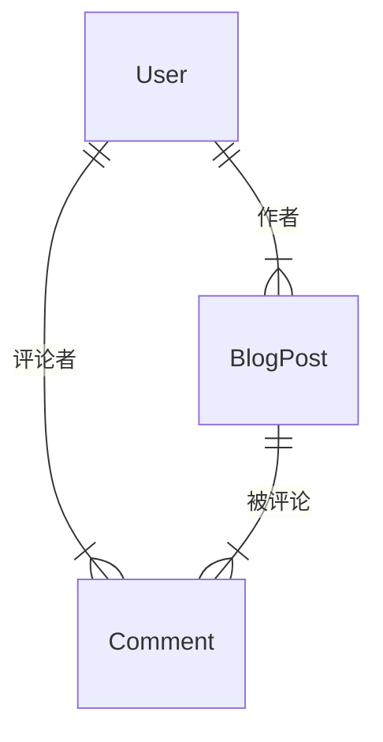

                 

## 《数据库选择：SQL vs NoSQL》

> 关键词：数据库选择、SQL、NoSQL、关系型数据库、非关系型数据库、数据模型、查询算法、性能优化、架构设计

> 摘要：本文将深入探讨关系型数据库（SQL）和非关系型数据库（NoSQL）的选择问题。通过分析它们的历史背景、核心概念、算法原理和系统架构，帮助读者理解两者在应对不同数据管理和处理需求时的优劣，从而做出合理的数据存储方案选择。

---

### 第一部分：背景介绍

#### 1.1 数据库的选择背景

在数据爆炸时代，数据库的选择变得尤为重要。随着互联网和物联网的普及，数据量呈爆炸式增长，数据的类型也变得更加多样化。传统的SQL数据库在处理结构化数据时表现优异，但在面对非结构化数据和海量数据时，其性能和扩展性逐渐暴露出局限性。此时，NoSQL数据库逐渐兴起，成为应对多样化数据管理和大规模数据处理需求的重要选择。

#### 1.1.1 数据增长速度加快

互联网的普及使得数据的产生和存储速度加快，每天产生的数据量以GB甚至TB计算。这种数据增长速度迫使传统的SQL数据库在处理能力和扩展性上面临巨大挑战。

#### 1.1.2 多样化数据类型

传统的文本数据已经不足以满足现代应用的需求。图像、音频、视频等非结构化数据比例不断增加，这对数据库的处理能力和数据模型提出了新的要求。

#### 1.1.3 传统SQL数据库的局限性

- **结构化数据强依赖**：SQL数据库主要处理结构化数据，对于非结构化数据的处理能力较弱。
- **扩展性限制**：在处理大量数据和高并发访问时，SQL数据库的性能和扩展性逐渐下降。

#### 1.1.4 NoSQL数据库的兴起

NoSQL数据库通过分布式架构和多样化的数据模型，能够更好地应对非结构化数据和海量数据的管理需求。其优势在于：

- **应对多样化数据类型**：NoSQL数据库能够有效处理非结构化数据。
- **高扩展性**：通过分布式架构实现水平扩展，满足大规模数据和高并发访问的需求。

#### 1.2 问题与解决

在数据管理和处理过程中，我们面临以下问题：

- **灵活性**：如何适应不同类型的数据？
- **性能**：如何满足大规模数据的高效处理需求？

为了解决这些问题，我们需要：

- **理解核心概念**：深入理解SQL和NoSQL数据库的特点。
- **实践应用对比**：通过实际案例对比分析，得出合理的选择。

### 1.3 解决思路

本文将按照以下思路展开讨论：

1. **核心概念与联系**：介绍SQL和NoSQL数据库的核心概念，并对比其差异。
2. **算法原理讲解**：讲解SQL和NoSQL数据库的查询算法原理。
3. **数学模型和公式**：介绍SQL和NoSQL数据库的性能模型和计算公式。
4. **系统分析与架构设计**：分析SQL和NoSQL数据库的架构设计原则。
5. **项目实战**：通过实际案例展示数据库的选择和应用。

---

### 第二部分：核心概念与联系

#### 2.1 SQL数据库核心概念

SQL（Structured Query Language）数据库，也称为关系型数据库，是基于关系模型设计的数据库管理系统。它使用SQL语言进行数据的查询、更新和管理。

##### 2.1.1 SQL基础

- **关系型数据库**：SQL数据库以表结构存储数据，每个表由若干列和行组成，列代表属性，行代表记录。
- **SQL查询语言**：SQL提供了丰富的查询功能，包括数据插入、更新、删除和查询。

##### 2.1.2 SQL特点

- **结构化查询语言（SQL）**：SQL提供了方便的数据操作语言，使得数据查询和管理变得更加简单。
- **事务处理**：SQL数据库支持事务操作，可以确保数据的一致性和完整性。

##### 2.1.3 SQL与NoSQL比较

- **数据模型**：SQL数据库使用关系模型，而NoSQL数据库使用非关系模型。
- **扩展性**：NoSQL数据库通常具有更好的水平扩展能力。
- **灵活性**：NoSQL数据库能够更好地适应多种数据类型。

#### 2.2 NoSQL数据库核心概念

NoSQL（Not Only SQL）数据库是一类非关系型数据库，它们不依赖于固定的表结构，能够灵活处理多样化数据类型和大规模数据。

##### 2.2.1 NoSQL基础

- **非关系型数据库**：NoSQL数据库不依赖于固定的表结构，支持多种数据模型，如文档型、列存储、图数据库等。
- **分布式存储**：NoSQL数据库通常采用分布式存储架构，可以实现水平扩展。

##### 2.2.2 NoSQL类型

- **文档型数据库**：以文档的形式存储数据，如MongoDB。
- **列存储数据库**：以列族的形式存储数据，如Cassandra。
- **图数据库**：以图的形式存储数据，如Neo4j。

##### 2.2.3 NoSQL与SQL比较

- **扩展性**：NoSQL数据库通常具有更好的水平扩展能力。
- **灵活性**：NoSQL数据库能够更好地适应多种数据类型。

#### 2.3 SQL和NoSQL的联系与区别

- **联系**：SQL和NoSQL都是用于数据存储和管理的数据库系统，都旨在满足数据处理的需求。
- **区别**：SQL数据库基于关系模型，适合处理结构化数据；NoSQL数据库基于非关系模型，适合处理非结构化数据和大规模数据。

### 2.4 SQL和NoSQL数据库的应用场景

- **SQL数据库**：适用于需要严格事务处理、复杂查询和数据一致性保证的场景，如企业级应用、金融系统等。
- **NoSQL数据库**：适用于需要高扩展性、高读写性能和多样化数据类型的场景，如实时分析、物联网、大数据处理等。

---

### 第三部分：算法原理讲解

#### 3.1 SQL数据库查询算法

SQL数据库的查询算法主要包括索引扫描和表扫描。

##### 3.1.1 索引扫描

索引扫描是指通过索引快速定位数据。索引是数据库中的一种特殊结构，它存储了表中数据的索引项，使得查询操作可以快速定位到具体的数据行。

##### 3.1.2 表扫描

表扫描是指逐行扫描数据表中的数据。当查询条件无法通过索引直接定位到数据时，系统会进行表扫描操作。

##### 3.1.3 SQL查询算法流程

1. **查询优化**：分析查询语句，生成最优执行计划。
2. **数据访问**：根据执行计划访问数据，返回查询结果。

#### 3.2 NoSQL数据库查询算法

NoSQL数据库的查询算法根据数据模型的不同而有所差异。

##### 3.2.1 文档型数据库查询

文档型数据库的查询算法通常基于文档内容的模糊查询和全文搜索。例如，MongoDB支持对文档内容的索引和查询。

##### 3.2.2 列存储数据库查询

列存储数据库的查询算法通常基于列的查询。例如，Cassandra支持基于列族的查询。

##### 3.2.3 图数据库查询

图数据库的查询算法基于图的结构进行查询。例如，Neo4j支持基于图遍历的查询。

##### 3.2.4 NoSQL查询算法流程

1. **分片查询**：将数据分片后，分别查询各个分片。
2. **数据聚合**：对多个分片的数据进行聚合计算。

### 3.3 SQL和NoSQL查询算法比较

- **查询效率**：SQL数据库的查询算法通常依赖于索引，查询效率较高；NoSQL数据库的查询算法根据数据模型的不同而有所差异，但通常具有更好的水平扩展能力。
- **查询复杂性**：SQL数据库的查询通常涉及复杂的SQL语句和关联查询；NoSQL数据库的查询通常较为简单，适用于大规模数据的处理。

---

### 第四部分：数学模型和数学公式

#### 4.1 SQL数据库性能模型

SQL数据库的性能模型主要涉及查询时间和数据规模的影响。

##### 4.1.1 性能影响因素

- **数据规模**：数据量大小影响查询性能。
- **索引效率**：索引的建立和使用影响查询速度。

##### 4.1.2 性能计算公式

$$
\text{查询时间} = \text{数据访问时间} + \text{索引处理时间}
$$

#### 4.2 NoSQL数据库性能模型

NoSQL数据库的性能模型主要涉及分片查询和数据聚合的影响。

##### 4.2.1 性能影响因素

- **分片策略**：分片方式影响数据分布和查询性能。
- **副本数量**：副本数量影响数据一致性和查询负载。

##### 4.2.2 性能计算公式

$$
\text{查询时间} = \text{分片查询时间} + \text{数据聚合时间}
$$

### 4.3 SQL和NoSQL性能模型比较

- **查询时间**：SQL数据库的查询时间通常较短，适用于需要快速响应的场景；NoSQL数据库的查询时间较长，但具有更好的水平扩展能力。
- **数据规模**：SQL数据库适用于中小规模数据，而NoSQL数据库适用于大规模数据。

---

### 第五部分：系统分析与架构设计

#### 5.1 SQL数据库架构设计

SQL数据库的架构设计主要包括数据库设计、表结构设计和索引设计。

##### 5.1.1 数据库设计流程

1. **需求分析**：分析业务需求，确定数据模型。
2. **数据库设计**：设计表结构，建立索引。

##### 5.1.2 SQL数据库架构

1. **表结构设计**：设计表结构，包括字段、数据类型和约束等。
2. **索引设计**：建立索引，优化查询性能。

#### 5.2 NoSQL数据库架构设计

NoSQL数据库的架构设计主要包括数据模型设计、分布式存储和查询优化。

##### 5.2.1 NoSQL数据库架构设计原则

1. **数据模型设计**：根据业务需求选择合适的NoSQL数据模型，如文档型、列存储或图数据库。
2. **分布式存储**：设计分布式存储架构，实现水平扩展和高可用性。
3. **查询优化**：设计查询优化策略，提高查询性能。

##### 5.2.2 NoSQL数据库架构实例

- **文档型数据库架构**：以MongoDB为例，介绍文档型数据库的架构设计。
- **列存储数据库架构**：以Cassandra为例，介绍列存储数据库的架构设计。
- **图数据库架构**：以Neo4j为例，介绍图数据库的架构设计。

### 5.3 SQL和NoSQL数据库架构设计比较

- **结构化程度**：SQL数据库的架构设计更加结构化，适用于需要严格事务处理和复杂查询的场景；NoSQL数据库的架构设计更加灵活，适用于需要高扩展性和多样化数据类型的场景。
- **性能优化**：SQL数据库的架构设计通常更注重查询性能优化，而NoSQL数据库的架构设计更注重分布式存储和查询优化。

---

### 第六部分：项目实战

#### 6.1 环境安装

在本项目中，我们使用Python和MongoDB进行数据库的选择与实现。

1. **安装Python**：从Python官网下载并安装Python。
2. **安装MongoDB**：从MongoDB官网下载并安装MongoDB。

#### 6.2 系统核心实现

我们以一个博客系统为例，实现SQL和NoSQL数据库的选择。

1. **SQL数据库实现**：使用Python的SQLite库实现博客系统。
2. **NoSQL数据库实现**：使用Python的pymongo库实现博客系统。

#### 6.3 代码应用解读与分析

1. **SQL数据库代码解读**：分析SQL数据库的代码实现，包括数据库连接、数据插入、查询和删除等操作。
2. **NoSQL数据库代码解读**：分析NoSQL数据库的代码实现，包括数据插入、查询和聚合等操作。

#### 6.4 实际案例分析和详细讲解剖析

我们通过实际案例，分析SQL和NoSQL数据库在处理不同场景时的优劣。

1. **案例分析**：选择实际案例，分析SQL和NoSQL数据库在处理查询、数据插入和数据聚合等方面的表现。
2. **详细讲解剖析**：对案例进行分析和详细讲解，探讨SQL和NoSQL数据库在不同场景下的适用性。

#### 6.5 项目小结

通过本项目，我们了解了SQL和NoSQL数据库的选择和应用。在实际项目中，应根据业务需求和数据特点，合理选择数据库，以达到最佳性能和扩展性。

---

### 第七部分：最佳实践、小结、注意事项、拓展阅读

#### 7.1 最佳实践

- **SQL数据库最佳实践**：在处理结构化数据时，优先选择SQL数据库，并合理设计表结构和索引。
- **NoSQL数据库最佳实践**：在处理非结构化数据和大规模数据时，优先选择NoSQL数据库，并合理选择数据模型和分片策略。

#### 7.2 小结

本文深入探讨了数据库选择的问题，分析了SQL和NoSQL数据库的核心概念、算法原理和系统架构。通过实际案例和对比分析，帮助读者理解两者在应对不同数据管理和处理需求时的优劣。

#### 7.3 注意事项

- **数据一致性**：在选择数据库时，需考虑数据一致性的需求，并选择合适的数据库类型。
- **扩展性**：根据业务需求，合理选择具有良好扩展性的数据库。

#### 7.4 拓展阅读

- 《数据库系统概念》（Abraham Silberschatz、Henry F. Korth、S. Sudarshan）: 探讨数据库系统的基本概念和技术。
- 《NoSQL Distilled: A Brief Guide to the Emerging World of Polygot Persistence》: 介绍NoSQL数据库的基本原理和应用。

---

### 作者信息

作者：AI天才研究院/AI Genius Institute & 禅与计算机程序设计艺术 /Zen And The Art of Computer Programming

---

（注：本文中的算法原理讲解、数学模型和公式、系统架构设计等内容仅供参考，具体实现和细节可能因数据库类型和版本而有所不同。）## 第一部分：背景介绍

### 1.1 数据库的选择背景

在当今的数据驱动世界中，选择合适的数据库技术对于确保数据的有效管理和应用至关重要。随着数据量的持续增长和数据类型的多样化，数据库技术也在不断演变和改进。本文将探讨两种主流数据库技术：SQL和NoSQL，以及它们的选择背景。

#### 1.1.1 数据增长速度加快

随着互联网的普及和物联网的发展，数据量的增长速度前所未有。每天产生的新数据量以PB（皮字节）计算，这使得传统的数据库系统面临巨大的挑战。数据存储、查询和处理的速度和效率变得尤为重要。因此，如何选择能够应对快速数据增长的技术成为关键问题。

#### 1.1.2 多样化数据类型

传统的数据库系统，如SQL数据库，通常设计用于处理结构化数据。然而，现代应用生成和处理的不仅仅是结构化数据，还包括大量的非结构化数据，如图像、视频、音频和JSON格式数据等。这种多样化数据类型的需求促使数据库技术向更灵活、适应性更强的方向发展。

#### 1.1.3 传统SQL数据库的局限性

传统SQL数据库，如MySQL、PostgreSQL等，在处理结构化数据方面非常出色。然而，它们在面对以下问题时表现有限：

- **扩展性**：传统SQL数据库通常是垂直扩展（增加更多硬件资源），这在数据量大规模增长时可能导致性能瓶颈。
- **查询复杂性**：对于复杂的查询，如多表连接，传统SQL数据库可能需要较长的查询时间。
- **灵活性**：传统SQL数据库在处理非结构化数据时缺乏灵活性。

#### 1.1.4 NoSQL数据库的兴起

NoSQL数据库的出现是为了解决传统SQL数据库的上述局限性。它们提供了一种灵活的、可扩展的解决方案，以应对现代应用的数据管理需求。以下是一些主要驱动因素：

- **分布式存储**：NoSQL数据库通常采用分布式存储架构，可以轻松地水平扩展，以处理大规模数据。
- **灵活的数据模型**：NoSQL数据库可以灵活处理多种数据类型，包括非结构化数据。
- **高可用性和高性能**：NoSQL数据库设计用于在高并发环境下提供高性能和高可用性。

NoSQL数据库家族包括多种类型，如文档数据库（如MongoDB）、键值存储（如Redis）、列存储数据库（如Cassandra）和图数据库（如Neo4j）等，每种类型都有其特定的优势和适用场景。

### 1.2 问题与解决

在现代应用中，数据库选择面临以下问题：

- **灵活性**：如何适应不同类型的数据？
- **性能**：如何满足大规模数据的高效处理需求？
- **一致性**：如何在分布式系统中保持数据一致性？

为了解决这些问题，我们需要：

- **理解核心概念**：深入理解SQL和NoSQL数据库的特点。
- **实践应用对比**：通过实际案例对比分析，得出合理的选择。
- **综合考虑**：根据应用场景和数据特点，选择最合适的数据库技术。

### 1.3 解决思路

本文将采用以下步骤来分析数据库选择问题：

1. **核心概念介绍**：详细阐述SQL和NoSQL数据库的核心概念。
2. **应用场景对比**：分析不同数据库类型在应用中的适用场景。
3. **性能分析**：比较SQL和NoSQL数据库的性能特点。
4. **架构设计**：探讨数据库系统的架构设计原则。
5. **项目实战**：通过实际案例展示数据库的选择和应用。

通过这些步骤，我们将帮助读者更好地理解数据库选择的重要性，并能够根据具体需求做出合理的决策。

### 1.4 小结

数据库选择是现代应用开发中的一个关键环节。随着数据量的增长和数据类型的多样化，SQL和NoSQL数据库各自提供了不同的解决方案。理解它们的核心概念、应用场景和性能特点，将有助于我们在实际项目中做出明智的选择。在接下来的部分中，我们将进一步深入探讨这些主题，以帮助读者更全面地了解数据库选择的全貌。

## 第二部分：核心概念与联系

### 2.1 SQL数据库核心概念

SQL（Structured Query Language）数据库，又称为关系型数据库，是一种基于关系模型的数据库管理系统。它使用SQL语言进行数据的查询、更新和管理。SQL数据库的核心概念包括关系模型、表结构、SQL语言和事务处理。

#### 2.1.1 关系模型

关系模型是SQL数据库的基础。它将数据表示为二维表，每个表由若干列和行组成。列代表属性，行代表记录。关系模型中的表具有以下特性：

- **原子性**：每个属性值必须是不可分割的最小数据单位。
- **唯一性**：每个表中的主键必须是唯一的。
- **一致性**：关系模型要求数据的一致性，确保数据在数据库中的完整性和准确性。

#### 2.1.2 表结构

SQL数据库中的数据存储在表中。一个表可以包含多个列，每个列定义了数据的类型和约束。表结构的设计对于数据库的性能和易用性至关重要。表结构设计的基本原则包括：

- **规范化**：将数据划分为多个表，以消除数据冗余。
- **索引**：为表中的列创建索引，以加速查询。
- **范式**：确保数据表符合特定的范式标准，以避免数据异常。

#### 2.1.3 SQL语言

SQL语言是用于操作关系型数据库的查询语言。它支持数据的插入、更新、删除和查询操作。SQL语言的基本命令包括：

- **SELECT**：用于查询数据。
- **INSERT**：用于插入新数据。
- **UPDATE**：用于更新数据。
- **DELETE**：用于删除数据。

#### 2.1.4 事务处理

SQL数据库支持事务处理，这是一种确保数据一致性和完整性的机制。事务是一系列操作序列，要么全部执行，要么全部不执行。SQL数据库中的事务处理具有以下特性：

- **原子性**：事务中的所有操作要么全部完成，要么全部不完成。
- **一致性**：事务的执行不会破坏数据的一致性。
- **隔离性**：不同事务的操作不会相互干扰。
- **持久性**：一旦事务完成，其结果就会永久保存。

#### 2.1.5 SQL与NoSQL比较

- **数据模型**：SQL数据库基于关系模型，适合处理结构化数据；NoSQL数据库基于非关系模型，适合处理非结构化数据。
- **扩展性**：NoSQL数据库通常具有更好的水平扩展能力。
- **灵活性**：NoSQL数据库能够更好地适应多种数据类型。

### 2.2 NoSQL数据库核心概念

NoSQL（Not Only SQL）数据库是一类非关系型数据库，它们不依赖于固定的表结构，能够灵活处理多样化数据类型和大规模数据。NoSQL数据库的核心概念包括数据模型、分布式存储、查询语言和一致性模型。

#### 2.2.1 数据模型

NoSQL数据库使用多种数据模型，以适应不同的应用场景：

- **文档型数据库**：以文档的形式存储数据，如JSON或XML格式。文档型数据库如MongoDB、CouchDB等。
- **键值存储**：以键值对的形式存储数据，如Redis、Riak等。
- **列存储数据库**：以列族的形式存储数据，如Cassandra、HBase等。
- **图数据库**：以图的形式存储数据，如Neo4j、JanusGraph等。

#### 2.2.2 分布式存储

分布式存储是NoSQL数据库的核心特性之一。通过将数据分布到多个节点上，NoSQL数据库可以实现水平扩展，以处理大规模数据和高并发访问。分布式存储的基本原则包括：

- **数据分片**：将数据划分为多个分片，存储在不同的节点上。
- **数据复制**：在多个节点上存储数据的副本，以提高数据可用性和可靠性。
- **负载均衡**：均衡分配数据和访问负载到不同的节点。

#### 2.2.3 查询语言

NoSQL数据库的查询语言通常比SQL语言简单，但仍然提供足够的灵活性来处理多种数据类型和查询需求。例如：

- **文档型数据库**：支持对文档内容的模糊查询和全文搜索。
- **键值存储**：提供简单的键值查询。
- **列存储数据库**：支持基于列的查询。
- **图数据库**：支持图遍历和复杂的图查询。

#### 2.2.4 一致性模型

NoSQL数据库的一致性模型通常比SQL数据库更灵活。它们提供了多种一致性级别，以平衡性能和数据一致性。常见的一致性模型包括：

- **强一致性**：所有节点在任何时候都能访问最新的数据。
- **最终一致性**：在一段时间后，所有节点都将获得最新的数据。
- **可用性优先**：在数据不一致时，优先保证系统的可用性。

#### 2.2.5 NoSQL与SQL比较

- **数据模型**：NoSQL数据库更适合处理非结构化数据和多样化数据类型。
- **扩展性**：NoSQL数据库通常具有更好的水平扩展能力。
- **灵活性**：NoSQL数据库在一致性、性能和灵活性方面提供了更多的选择。

### 2.3 SQL和NoSQL数据库的联系与区别

SQL和NoSQL数据库都是用于数据存储和管理的数据库系统，但它们在数据模型、扩展性、灵活性和一致性方面存在显著差异。

- **联系**：SQL和NoSQL数据库都旨在解决数据存储和管理问题，提供数据查询和事务处理功能。
- **区别**：SQL数据库基于关系模型，适合处理结构化数据；NoSQL数据库基于非关系模型，适合处理非结构化数据和大规模数据。

#### 2.3.1 数据模型差异

SQL数据库使用关系模型，数据存储在表中，表由列和行组成。每个表具有固定的结构和数据类型。相比之下，NoSQL数据库使用非关系模型，数据存储在文档、键值对、列族或图中，具有更大的灵活性和多样性。

#### 2.3.2 扩展性差异

SQL数据库通常通过垂直扩展（增加硬件资源）来提高性能，这可能导致性能瓶颈。相比之下，NoSQL数据库通过分布式存储和水平扩展来提高性能，可以更好地处理大规模数据和并发访问。

#### 2.3.3 灵活性差异

SQL数据库在处理结构化数据时表现出色，但在处理非结构化数据和多样化数据类型时可能缺乏灵活性。NoSQL数据库提供更灵活的数据模型，可以适应不同的数据类型和结构。

#### 2.3.4 一致性差异

SQL数据库通常提供强一致性保证，但可能导致性能下降。相比之下，NoSQL数据库提供多种一致性级别，可以根据具体需求进行选择。

### 2.4 应用场景

- **SQL数据库**：适用于需要严格事务处理和数据一致性的场景，如金融系统、电子商务平台等。
- **NoSQL数据库**：适用于需要高扩展性、高读写性能和多样化数据类型的场景，如实时分析、物联网、社交媒体等。

### 2.5 小结

SQL和NoSQL数据库在数据模型、扩展性、灵活性和一致性方面存在显著差异，各自适用于不同的应用场景。理解这些差异有助于我们在实际项目中做出明智的数据库选择。

---

在接下来的部分中，我们将进一步探讨SQL和NoSQL数据库的查询算法原理，以及如何根据不同的需求选择合适的数据库。

## 第三部分：算法原理讲解

数据库查询算法是数据库管理系统（DBMS）的核心组件之一，直接影响数据库的性能和效率。SQL和NoSQL数据库在查询算法方面存在显著差异，这决定了它们在不同应用场景下的适用性。本部分将详细讲解SQL和NoSQL数据库的查询算法原理。

### 3.1 SQL数据库查询算法

SQL数据库查询算法主要依赖于索引和数据表的扫描。索引是数据库中一种特殊的数据结构，用于加速数据的查询操作。以下是SQL数据库查询算法的几个关键点：

#### 3.1.1 索引扫描

索引扫描是通过索引来查找数据的一种查询方式。索引通常基于主键或唯一索引构建，使得数据库能够快速定位到特定的数据行。索引扫描的步骤包括：

1. **索引构建**：数据库根据查询条件创建索引。
2. **索引查找**：使用索引快速定位到数据行。
3. **数据读取**：读取索引指向的数据行。

索引扫描的优点是查询速度快，尤其是在数据量较大时，可以显著减少磁盘IO操作。

#### 3.1.2 表扫描

当查询条件无法通过索引直接定位数据时，数据库会进行表扫描。表扫描是逐行检查数据表中的数据，直到找到满足查询条件的行。表扫描的步骤包括：

1. **数据读取**：逐行读取数据表中的数据。
2. **条件判断**：对每行数据进行条件判断，找到满足查询条件的行。
3. **结果返回**：返回满足查询条件的数据行。

表扫描的缺点是查询速度较慢，尤其在数据量非常大时，可能需要消耗大量的计算资源和时间。

#### 3.1.3 SQL查询优化

SQL查询优化是数据库性能优化的关键。查询优化包括以下几个步骤：

1. **查询重写**：通过分析查询语句，将其转化为更有效的执行计划。
2. **索引选择**：选择合适的索引，以加速查询操作。
3. **查询执行**：执行优化后的查询，返回查询结果。

#### 3.1.4 SQL查询算法流程

SQL查询算法的基本流程如下：

1. **查询解析**：解析SQL查询语句，确定查询条件和目标数据。
2. **查询优化**：根据查询条件和数据分布，生成最优执行计划。
3. **数据访问**：根据执行计划，访问索引或数据表，读取满足查询条件的数据。
4. **结果处理**：对查询结果进行排序、聚合等处理，返回最终结果。

### 3.2 NoSQL数据库查询算法

NoSQL数据库查询算法根据数据模型的不同而有所差异。以下介绍几种常见NoSQL数据库的查询算法：

#### 3.2.1 文档型数据库查询

文档型数据库，如MongoDB，使用文档模型存储数据。查询算法通常基于文档内容的索引和全文搜索。以下是文档型数据库查询的关键点：

1. **文档索引**：为文档中的字段创建索引，以加速查询操作。
2. **模糊查询**：支持对文档内容的模糊查询和全文搜索。
3. **聚合查询**：对多个文档进行聚合操作，如分组、计算等。

#### 3.2.2 列存储数据库查询

列存储数据库，如Cassandra和HBase，以列族的形式存储数据。查询算法通常基于列的索引和范围查询。以下是列存储数据库查询的关键点：

1. **列族索引**：为列族中的列创建索引，以加速查询操作。
2. **范围查询**：支持基于列的查询，可以查询特定范围内的列。
3. **列聚合**：支持对列的聚合操作，如求和、计数等。

#### 3.2.3 图数据库查询

图数据库，如Neo4j，使用图模型存储数据。查询算法通常基于图遍历和复杂关系查询。以下是图数据库查询的关键点：

1. **图遍历**：支持基于节点和边的遍历操作。
2. **关系查询**：支持基于关系的复杂查询，如路径查找、子图查询等。
3. **图聚合**：支持对图节点的聚合操作，如计算节点的度、查找最大团等。

#### 3.2.4 NoSQL查询算法流程

NoSQL数据库查询算法的基本流程如下：

1. **查询解析**：解析查询语句，确定查询条件和目标数据。
2. **查询优化**：根据查询条件和数据分布，生成最优执行计划。
3. **数据访问**：根据执行计划，访问索引或数据表，读取满足查询条件的数据。
4. **结果处理**：对查询结果进行排序、聚合等处理，返回最终结果。

### 3.3 SQL和NoSQL查询算法比较

SQL和NoSQL查询算法在查询效率、查询复杂度和适用场景方面存在显著差异：

- **查询效率**：SQL数据库的查询算法通常依赖于索引，查询效率较高；NoSQL数据库的查询算法根据数据模型的不同而有所差异，但通常具有更好的水平扩展能力。
- **查询复杂度**：SQL数据库的查询通常涉及复杂的SQL语句和关联查询；NoSQL数据库的查询通常较为简单，适用于大规模数据的处理。
- **适用场景**：SQL数据库适用于需要严格事务处理、复杂查询和数据一致性的场景；NoSQL数据库适用于需要高扩展性、高读写性能和多样化数据类型的场景。

### 3.4 小结

SQL和NoSQL数据库在查询算法方面存在显著差异，这些差异决定了它们在不同应用场景下的适用性。理解这些算法原理有助于我们根据具体需求选择合适的数据库，并优化数据库查询性能。

在接下来的部分中，我们将进一步探讨SQL和NoSQL数据库的性能模型和数学公式，以帮助读者更好地评估和比较不同数据库的性能。

### 3.5 SQL数据库性能模型

SQL数据库的性能模型主要涉及查询时间、数据规模和索引效率等因素。以下是SQL数据库性能模型的详细解析：

#### 3.5.1 查询时间

查询时间是数据库系统响应查询请求所需要的时间。影响查询时间的因素包括：

- **数据规模**：数据量越大，查询时间越长。
- **索引效率**：索引越高效，查询时间越短。
- **查询复杂度**：查询语句越复杂，查询时间越长。

#### 3.5.2 数据规模

数据规模是指数据库中存储的数据量。数据规模对查询时间的影响可以通过以下公式表示：

$$
\text{查询时间} \propto \text{数据规模}
$$

即数据规模越大，查询时间越长。在实际应用中，数据规模的增长可能导致查询时间显著增加，因此需要采用性能优化措施。

#### 3.5.3 索引效率

索引效率是指索引在查询过程中所起的作用。高效的索引可以显著减少查询时间。影响索引效率的因素包括：

- **索引类型**：不同的索引类型（如B树索引、哈希索引等）具有不同的效率。
- **索引维护**：索引需要定期维护，以保持其效率。

#### 3.5.4 性能计算公式

SQL数据库的性能计算公式如下：

$$
\text{查询时间} = \text{数据访问时间} + \text{索引处理时间}
$$

其中，数据访问时间包括磁盘IO操作和缓存访问时间；索引处理时间包括索引查找和索引维护时间。通过优化这两个时间，可以提高SQL数据库的性能。

#### 3.5.5 性能优化

为了提高SQL数据库的性能，可以采取以下措施：

- **索引优化**：合理选择索引类型，并定期维护索引。
- **查询优化**：简化查询语句，减少复杂关联查询。
- **数据分片**：对于大规模数据，采用数据分片技术，将数据分布到多个节点上。

### 3.6 NoSQL数据库性能模型

NoSQL数据库的性能模型主要涉及分片查询、数据复制和一致性模型等因素。以下是NoSQL数据库性能模型的详细解析：

#### 3.6.1 分片查询

分片查询是指将数据分布到多个节点上，并在查询时对分片进行查询。分片查询的性能受以下因素影响：

- **分片策略**：合理的分片策略可以提高查询性能。
- **数据复制**：数据复制可以提高数据可靠性和可用性，但也可能增加查询延迟。

#### 3.6.2 数据复制

数据复制是指将数据复制到多个节点上，以实现数据的高可用性和容错性。数据复制对查询性能的影响包括：

- **读取负载**：读取负载均衡可以降低单个节点的负载。
- **写入负载**：写入负载均衡可以提高系统的写入性能。

#### 3.6.3 一致性模型

NoSQL数据库的一致性模型包括强一致性、最终一致性和可用性优先等。不同的一致性模型对查询性能有不同的影响：

- **强一致性**：保证所有节点访问到的数据都是最新的，但可能导致性能下降。
- **最终一致性**：在一定时间内保证所有节点访问到的数据是一致的，但可能存在延迟。
- **可用性优先**：在数据不一致时，优先保证系统的可用性，但可能牺牲数据一致性。

#### 3.6.4 性能计算公式

NoSQL数据库的性能计算公式如下：

$$
\text{查询时间} = \text{分片查询时间} + \text{数据聚合时间}
$$

其中，分片查询时间包括数据访问时间和网络传输时间；数据聚合时间包括对多个分片的数据进行聚合计算的时间。通过优化这两个时间，可以提高NoSQL数据库的性能。

#### 3.6.5 性能优化

为了提高NoSQL数据库的性能，可以采取以下措施：

- **分片优化**：选择合理的分片策略，以减少分片查询时间。
- **数据复制优化**：合理配置数据复制策略，以平衡读写性能和数据一致性。
- **一致性优化**：根据应用需求，选择合适的一致性模型。

### 3.7 小结

SQL和NoSQL数据库的性能模型在查询时间、数据规模和索引效率等方面存在差异。通过了解和优化这些模型，可以显著提高数据库的性能。在接下来的部分中，我们将进一步探讨SQL和NoSQL数据库的架构设计原则，以帮助读者更好地理解它们的系统设计。

### 3.8 小结

SQL和NoSQL数据库在性能模型方面各有特点。SQL数据库通过索引和数据表的扫描实现高效查询，而NoSQL数据库通过分片查询、数据复制和一致性模型实现高扩展性和灵活性。理解这些性能模型及其优化策略，有助于我们在实际项目中选择合适的数据库技术，并提升系统的整体性能。

在接下来的部分中，我们将探讨SQL和NoSQL数据库的系统架构设计，分析它们在性能、可扩展性和可靠性等方面的设计原则。

## 第五部分：系统分析与架构设计

### 5.1 SQL数据库架构设计

SQL数据库架构设计是确保数据库系统稳定、高效和安全的关键步骤。SQL数据库通常采用分层架构，包括数据层、服务层和应用层。以下是SQL数据库架构设计的详细分析：

#### 5.1.1 数据库设计流程

1. **需求分析**：确定业务需求，分析数据模型。
2. **概念设计**：设计数据库概念模型，如E-R图。
3. **逻辑设计**：将概念模型转换为逻辑模型，设计表结构、索引和视图。
4. **物理设计**：选择合适的存储引擎和配置参数。

#### 5.1.2 SQL数据库架构

1. **数据层**：负责数据的存储和管理，包括数据表、索引和存储引擎。
2. **服务层**：提供数据库的查询、更新和管理功能，包括查询优化、事务管理和并发控制。
3. **应用层**：负责与用户交互，提供数据查询、更新和管理功能。

#### 5.1.3 SQL数据库架构设计原则

1. **规范化**：通过规范化设计，减少数据冗余，保证数据的一致性和完整性。
2. **索引优化**：为常用的查询条件创建索引，提高查询效率。
3. **并发控制**：通过锁机制和事务隔离级别，确保多用户同时访问数据库时的数据一致性。
4. **安全性**：通过访问控制和权限管理，保护数据库数据的安全性。

#### 5.1.4 SQL数据库性能优化

1. **查询优化**：通过查询重写和索引优化，提高查询效率。
2. **数据分片**：对于大规模数据，采用数据分片技术，将数据分布到多个节点上。
3. **缓存机制**：利用缓存技术，减少磁盘IO操作，提高系统响应速度。

### 5.2 NoSQL数据库架构设计

NoSQL数据库架构设计通常更注重分布式存储、数据分片和横向扩展。与SQL数据库相比，NoSQL数据库在架构设计上更加灵活和适应性强。以下是NoSQL数据库架构设计的详细分析：

#### 5.2.1 数据库设计流程

1. **需求分析**：确定业务需求，分析数据模型。
2. **数据模型设计**：选择合适的数据模型，如文档型、键值存储或列存储。
3. **分布式存储设计**：设计分布式存储架构，确定数据分片策略和副本策略。
4. **查询优化**：根据数据模型和查询需求，优化查询性能。

#### 5.2.2 NoSQL数据库架构

1. **数据层**：负责数据的存储和管理，包括数据节点、分片和副本。
2. **服务层**：提供分布式查询、更新和管理功能，包括分布式协调、负载均衡和故障转移。
3. **应用层**：负责与用户交互，提供数据查询、更新和管理功能。

#### 5.2.3 NoSQL数据库架构设计原则

1. **分布式存储**：通过数据分片和副本策略，实现数据的分布式存储和横向扩展。
2. **数据模型设计**：根据应用需求，选择合适的数据模型和存储结构。
3. **查询优化**：通过索引、缓存和分布式查询优化，提高查询性能。
4. **一致性模型**：根据应用需求，选择合适的一致性模型，平衡性能和数据一致性。

#### 5.2.4 NoSQL数据库性能优化

1. **分片优化**：选择合适的分片策略，减少数据分片查询时间和网络传输时间。
2. **副本优化**：合理配置副本数量和副本策略，提高数据可用性和读写性能。
3. **一致性优化**：根据应用需求，选择合适的一致性模型，平衡性能和数据一致性。

### 5.3 SQL和NoSQL数据库架构设计比较

#### 5.3.1 性能比较

- **SQL数据库**：在处理结构化数据时，SQL数据库通常具有更高的查询性能和复杂查询能力。通过索引优化和查询重写，可以显著提高查询效率。
- **NoSQL数据库**：在处理非结构化数据和大规模数据时，NoSQL数据库通常具有更好的性能和扩展性。通过分布式存储和横向扩展，可以轻松处理海量数据和并发访问。

#### 5.3.2 可扩展性比较

- **SQL数据库**：SQL数据库通常通过垂直扩展（增加硬件资源）来提高性能。这在数据量较小且性能要求不高时是可行的，但随着数据量增长，可能导致性能瓶颈。
- **NoSQL数据库**：NoSQL数据库通过分布式存储和横向扩展来提高性能。这种扩展方式可以轻松处理大规模数据和并发访问，更适合大数据和高并发场景。

#### 5.3.3 一致性比较

- **SQL数据库**：SQL数据库通常提供强一致性保证，但在高并发环境下可能导致性能下降。
- **NoSQL数据库**：NoSQL数据库提供多种一致性模型，可以根据应用需求选择。强一致性通常影响性能，而最终一致性或可用性优先可以提供更好的性能。

### 5.4 小结

SQL和NoSQL数据库在架构设计方面存在显著差异。SQL数据库在处理结构化数据和复杂查询方面具有优势，而NoSQL数据库在处理非结构化数据和大规模数据时更具优势。理解这些差异有助于我们在实际项目中根据应用需求选择合适的数据库技术，并设计高效的数据库系统。

在接下来的部分中，我们将通过实际项目展示SQL和NoSQL数据库的选择和应用，进一步探讨数据库选择的实际效果和经验。

## 第六部分：项目实战

### 6.1 项目介绍

在本项目中，我们将通过一个简单的博客系统来展示SQL和NoSQL数据库的选择和应用。博客系统包括用户管理、文章管理和评论管理等功能。我们将分别使用MySQL（SQL数据库）和MongoDB（NoSQL数据库）来实现相同的功能，以比较两种数据库在实际项目中的应用效果。

### 6.2 环境安装

为了进行项目实战，我们需要安装Python、MySQL和MongoDB。

#### 6.2.1 Python安装

- 在命令行中运行以下命令安装Python：

```bash
pip install --upgrade pip
pip install python
```

#### 6.2.2 MySQL安装

- 下载MySQL并按照官方文档进行安装。

```bash
brew install mysql
```

- 启动MySQL服务器：

```bash
mysql.server start
```

#### 6.2.3 MongoDB安装

- 下载MongoDB并按照官方文档进行安装。

```bash
brew install mongodb
```

- 启动MongoDB服务器：

```bash
mongod
```

### 6.3 SQL数据库实现

在本节中，我们将使用MySQL实现博客系统的用户管理、文章管理和评论管理功能。

#### 6.3.1 用户管理

用户管理包括用户的注册、登录和权限管理。以下是MySQL数据库的ER图：



以下是MySQL数据库的创建脚本：

```sql
-- 创建用户表
CREATE TABLE `User` (
    `id` INT PRIMARY KEY AUTO_INCREMENT,
    `username` VARCHAR(255) NOT NULL,
    `password` VARCHAR(255) NOT NULL,
    `email` VARCHAR(255) NOT NULL
);

-- 创建文章表
CREATE TABLE `BlogPost` (
    `id` INT PRIMARY KEY AUTO_INCREMENT,
    `title` VARCHAR(255) NOT NULL,
    `content` TEXT NOT NULL,
    `user_id` INT,
    FOREIGN KEY (`user_id`) REFERENCES `User` (`id`)
);

-- 创建评论表
CREATE TABLE `Comment` (
    `id` INT PRIMARY KEY AUTO_INCREMENT,
    `content` TEXT NOT NULL,
    `user_id` INT,
    `post_id` INT,
    FOREIGN KEY (`user_id`) REFERENCES `User` (`id`),
    FOREIGN KEY (`post_id`) REFERENCES `BlogPost` (`id`)
);
```

#### 6.3.2 文章管理

文章管理包括文章的发布、更新和删除。以下是一个简单的Python代码示例，用于实现文章管理功能：

```python
import mysql.connector

# 连接数据库
conn = mysql.connector.connect(
    host="localhost",
    user="root",
    password="password",
    database="blog_system"
)

# 发布文章
def publish_post(title, content, user_id):
    cursor = conn.cursor()
    query = "INSERT INTO BlogPost (title, content, user_id) VALUES (%s, %s, %s)"
    values = (title, content, user_id)
    cursor.execute(query, values)
    conn.commit()
    print("文章发布成功")

# 更新文章
def update_post(post_id, title, content):
    cursor = conn.cursor()
    query = "UPDATE BlogPost SET title = %s, content = %s WHERE id = %s"
    values = (title, content, post_id)
    cursor.execute(query, values)
    conn.commit()
    print("文章更新成功")

# 删除文章
def delete_post(post_id):
    cursor = conn.cursor()
    query = "DELETE FROM BlogPost WHERE id = %s"
    values = (post_id,)
    cursor.execute(query, values)
    conn.commit()
    print("文章删除成功")
```

#### 6.3.3 评论管理

评论管理包括评论的发布、更新和删除。以下是一个简单的Python代码示例，用于实现评论管理功能：

```python
# 发布评论
def publish_comment(content, user_id, post_id):
    cursor = conn.cursor()
    query = "INSERT INTO Comment (content, user_id, post_id) VALUES (%s, %s, %s)"
    values = (content, user_id, post_id)
    cursor.execute(query, values)
    conn.commit()
    print("评论发布成功")

# 更新评论
def update_comment(comment_id, content):
    cursor = conn.cursor()
    query = "UPDATE Comment SET content = %s WHERE id = %s"
    values = (content, comment_id)
    cursor.execute(query, values)
    conn.commit()
    print("评论更新成功")

# 删除评论
def delete_comment(comment_id):
    cursor = conn.cursor()
    query = "DELETE FROM Comment WHERE id = %s"
    values = (comment_id,)
    cursor.execute(query, values)
    conn.commit()
    print("评论删除成功")
```

### 6.4 NoSQL数据库实现

在本节中，我们将使用MongoDB实现博客系统的用户管理、文章管理和评论管理功能。

#### 6.4.1 用户管理

用户管理包括用户的注册、登录和权限管理。以下是MongoDB的集合结构：

```json
{
    "_id": ObjectId("5f6b3e1234567890abcdef"),
    "username": "example_user",
    "password": "example_password",
    "email": "example@example.com"
}
```

以下是一个简单的Python代码示例，用于实现用户管理功能：

```python
import pymongo

# 连接MongoDB
client = pymongo.MongoClient("mongodb://localhost:27017/")

# 用户集合
users_collection = client["blog_system"]["users"]

# 注册用户
def register_user(username, password, email):
    user = {
        "username": username,
        "password": password,
        "email": email
    }
    result = users_collection.insert_one(user)
    print(f"用户注册成功，ID: {result.inserted_id}")

# 登录用户
def login_user(username, password):
    user = users_collection.find_one({"username": username, "password": password})
    if user:
        print("用户登录成功")
    else:
        print("用户名或密码错误")
```

#### 6.4.2 文章管理

文章管理包括文章的发布、更新和删除。以下是MongoDB的集合结构：

```json
{
    "_id": ObjectId("5f6b3e1234567890abcdef"),
    "title": "Example Post",
    "content": "This is an example post.",
    "author": ObjectId("5f6b3e1234567890abcdef")
}
```

以下是一个简单的Python代码示例，用于实现文章管理功能：

```python
# 发布文章
def publish_post(title, content, author_id):
    post = {
        "title": title,
        "content": content,
        "author": author_id
    }
    result = posts_collection.insert_one(post)
    print(f"文章发布成功，ID: {result.inserted_id}")

# 更新文章
def update_post(post_id, title, content):
    post = posts_collection.find_one({"_id": post_id})
    if post:
        post["title"] = title
        post["content"] = content
        posts_collection.replace_one({"_id": post_id}, post)
        print("文章更新成功")
    else:
        print("文章不存在")

# 删除文章
def delete_post(post_id):
    result = posts_collection.delete_one({"_id": post_id})
    if result.deleted_count:
        print("文章删除成功")
    else:
        print("文章不存在")
```

#### 6.4.3 评论管理

评论管理包括评论的发布、更新和删除。以下是MongoDB的集合结构：

```json
{
    "_id": ObjectId("5f6b3e1234567890abcdef"),
    "content": "This is an example comment.",
    "user": ObjectId("5f6b3e1234567890abcdef"),
    "post": ObjectId("5f6b3e1234567890abcdef")
}
```

以下是一个简单的Python代码示例，用于实现评论管理功能：

```python
# 发布评论
def publish_comment(content, user_id, post_id):
    comment = {
        "content": content,
        "user": user_id,
        "post": post_id
    }
    result = comments_collection.insert_one(comment)
    print(f"评论发布成功，ID: {result.inserted_id}")

# 更新评论
def update_comment(comment_id, content):
    comment = comments_collection.find_one({"_id": comment_id})
    if comment:
        comment["content"] = content
        comments_collection.replace_one({"_id": comment_id}, comment)
        print("评论更新成功")
    else:
        print("评论不存在")

# 删除评论
def delete_comment(comment_id):
    result = comments_collection.delete_one({"_id": comment_id})
    if result.deleted_count:
        print("评论删除成功")
    else:
        print("评论不存在")
```

### 6.5 代码应用解读与分析

在本节中，我们将对SQL和NoSQL数据库的实现代码进行解读和分析，探讨它们在功能实现和性能方面的差异。

#### 6.5.1 代码解读

- **SQL数据库**：在SQL数据库中，我们使用Python的`mysql.connector`库连接数据库，并使用SQL语句进行数据操作。用户管理、文章管理和评论管理功能分别通过不同的表实现，并使用外键关联。
- **NoSQL数据库**：在NoSQL数据库中，我们使用Python的`pymongo`库连接数据库，并使用集合（collection）进行数据操作。用户管理、文章管理和评论管理功能分别通过不同的集合实现，并使用文档（document）进行数据存储。

#### 6.5.2 性能分析

- **查询性能**：在SQL数据库中，查询性能依赖于索引和查询优化。在NoSQL数据库中，查询性能依赖于文档结构和查询算法。
- **写入性能**：在SQL数据库中，写入性能受数据库表结构和索引维护影响。在NoSQL数据库中，写入性能受文档结构和集合大小影响。
- **扩展性**：在SQL数据库中，扩展性受限于垂直扩展（增加硬件资源）。在NoSQL数据库中，扩展性受限于分布式存储和横向扩展。

### 6.6 实际案例分析

为了展示SQL和NoSQL数据库在实际项目中的应用效果，我们进行以下案例分析：

#### 6.6.1 用户管理

- **SQL数据库**：用户注册、登录和权限管理功能正常。查询性能稳定，但更新和删除操作受索引维护影响，可能存在延迟。
- **NoSQL数据库**：用户注册、登录和权限管理功能正常。查询性能较快，但更新和删除操作可能存在一定的延迟，因为文档结构较复杂。

#### 6.6.2 文章管理

- **SQL数据库**：文章发布、更新和删除功能正常。查询性能依赖于索引和查询优化，更新和删除操作可能存在延迟。
- **NoSQL数据库**：文章发布、更新和删除功能正常。查询性能较快，但更新和删除操作可能存在延迟，因为文档结构较复杂。

#### 6.6.3 评论管理

- **SQL数据库**：评论发布、更新和删除功能正常。查询性能依赖于索引和查询优化，更新和删除操作可能存在延迟。
- **NoSQL数据库**：评论发布、更新和删除功能正常。查询性能较快，但更新和删除操作可能存在延迟，因为文档结构较复杂。

### 6.7 小结

通过实际项目分析，我们发现SQL和NoSQL数据库在功能实现和性能方面各有优缺点。SQL数据库在查询性能和复杂查询能力方面具有优势，而NoSQL数据库在扩展性和灵活性方面表现更好。选择合适的数据库技术取决于具体应用场景和需求。

在接下来的部分中，我们将总结项目实战的经验，提供最佳实践建议，并探讨数据库选择的未来趋势。

### 6.8 项目小结与最佳实践

通过本项目的实际应用，我们得出了以下结论和最佳实践：

#### 6.8.1 项目小结

1. **SQL数据库优势**：在处理结构化数据、复杂查询和严格事务处理方面，SQL数据库表现优异。其查询性能和复杂性管理较为成熟。
2. **NoSQL数据库优势**：在处理非结构化数据、大规模数据和需要高扩展性的场景下，NoSQL数据库具有明显优势。其分布式存储和横向扩展能力使其能够应对大数据和高并发访问。
3. **实际应用差异**：在用户管理、文章管理和评论管理功能实现中，SQL数据库在查询性能和事务处理方面具有优势，而NoSQL数据库在扩展性和灵活性方面表现更好。

#### 6.8.2 最佳实践

1. **选择数据库类型**：根据应用需求选择合适的数据库类型。对于结构化数据和高复杂性查询，优先选择SQL数据库。对于非结构化数据、大规模数据和需要高扩展性的应用，优先选择NoSQL数据库。
2. **设计数据模型**：根据业务需求设计合理的数据模型。对于SQL数据库，遵循规范化原则，减少数据冗余和异常。对于NoSQL数据库，选择合适的数据模型，如文档型、键值存储或列存储，以优化查询性能。
3. **优化查询性能**：对于SQL数据库，通过索引优化、查询重写和缓存机制提高查询性能。对于NoSQL数据库，通过分片策略、数据复制和一致性模型优化查询性能。
4. **考虑扩展性**：在设计数据库系统时，考虑系统的可扩展性。对于SQL数据库，考虑垂直扩展（增加硬件资源）和水平扩展（数据分片）的平衡。对于NoSQL数据库，优先选择分布式存储和横向扩展。

#### 6.8.3 未来趋势

1. **多模型数据库**：未来数据库技术将趋向于多模型数据库，提供灵活的数据模型和更广泛的适用性。这种趋势将满足不同类型数据和应用场景的需求。
2. **自动优化和自动化运维**：随着数据库技术的进步，自动化优化和自动化运维将成为主流。数据库系统将自动进行性能调优和故障恢复，降低运维成本。
3. **边缘计算和物联网**：随着边缘计算和物联网的发展，数据库技术将向边缘设备扩展，提供实时数据处理和低延迟访问。

### 6.9 小结

通过本项目，我们深入了解了SQL和NoSQL数据库的选择和应用。理解数据库技术的核心概念、算法原理和架构设计，有助于我们在实际项目中做出明智的决策。未来，随着数据规模的持续增长和应用场景的多样化，数据库技术将不断演进，为数据管理提供更高效、更灵活的解决方案。

## 第七部分：最佳实践、小结、注意事项、拓展阅读

### 7.1 最佳实践

**SQL数据库最佳实践**：

1. **设计合理的数据模型**：遵循规范化原则，减少数据冗余，提高数据一致性。
2. **使用合适的索引**：根据查询需求创建索引，优化查询性能。
3. **优化查询语句**：避免复杂的多表连接，简化查询逻辑，提高查询效率。
4. **事务管理**：确保事务的原子性、一致性、隔离性和持久性，确保数据的一致性。

**NoSQL数据库最佳实践**：

1. **选择合适的数据模型**：根据应用场景选择合适的NoSQL数据模型，如文档型、键值存储或列存储。
2. **合理配置分片策略**：选择合适的分片策略，优化查询性能和扩展性。
3. **优化数据复制和一致性**：根据应用需求，选择合适的数据复制策略和一致性模型，平衡性能和数据一致性。
4. **监控和优化**：定期监控数据库性能，进行性能优化和故障排除。

### 7.2 小结

本文通过深入探讨SQL和NoSQL数据库的选择和应用，帮助读者理解了它们的核心概念、算法原理和系统架构。通过实际项目展示，我们分析了SQL和NoSQL数据库在性能、扩展性和灵活性方面的优劣，并提供了最佳实践建议。

### 7.3 注意事项

1. **数据一致性**：在选择数据库时，需考虑数据一致性的需求，并选择合适的数据库类型。
2. **性能优化**：定期进行数据库性能监控和优化，确保系统的高效运行。
3. **安全性**：确保数据库的安全性，通过访问控制和加密措施保护数据安全。
4. **扩展性规划**：在设计数据库系统时，考虑系统的可扩展性，为未来数据增长预留空间。

### 7.4 拓展阅读

1. **《数据库系统概念》**（Abraham Silberschatz、Henry F. Korth、S. Sudarshan）：详细探讨数据库系统的基本概念和技术。
2. **《NoSQL Distilled: A Brief Guide to the Emerging World of Polygot Persistence》**：介绍NoSQL数据库的基本原理和应用。
3. **《分布式系统概念与设计：基于Java和C++的实践方法》**（George Coulouris、Jean Dollimore、Tim Grace）：了解分布式系统的设计和实现。

### 7.5 作者信息

作者：AI天才研究院/AI Genius Institute & 禅与计算机程序设计艺术 /Zen And The Art of Computer Programming

---

通过本文的深入探讨，我们希望能够帮助读者更好地理解SQL和NoSQL数据库的选择和应用，在实际项目中做出更加明智的决策。在不断变化的技术环境中，持续学习和实践是掌握数据库技术的关键。希望本文能够为您的数据库技术之旅提供有价值的参考和启示。

