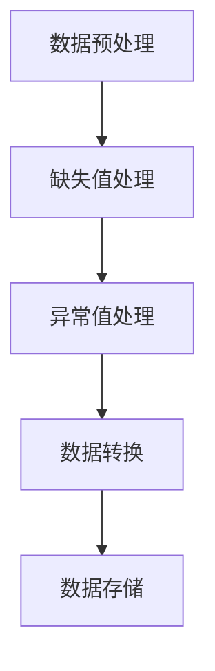
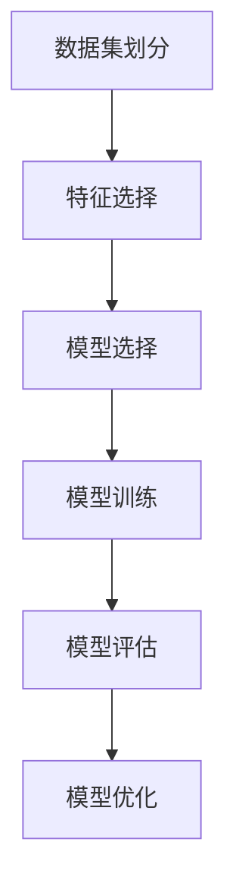
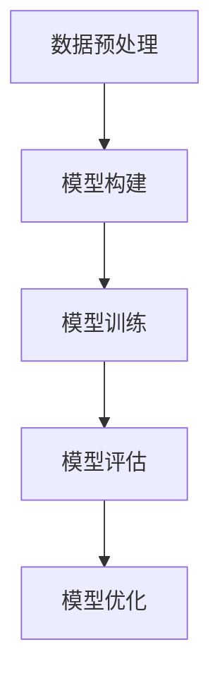
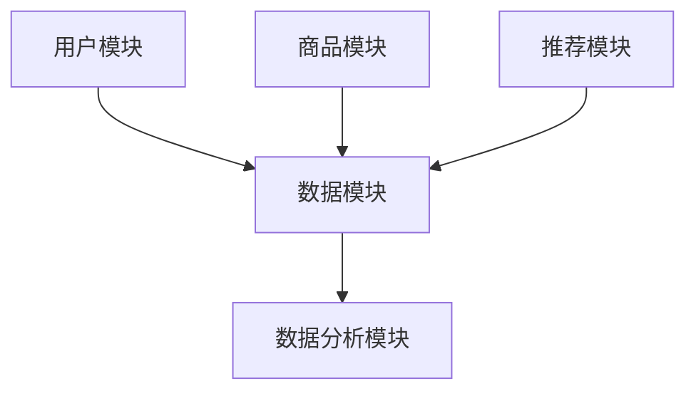

                 

# 数据科学在软件工程中的应用

## 关键词

数据科学、软件工程、算法、机器学习、深度学习、系统分析、架构设计

## 摘要

本文深入探讨了数据科学在软件工程中的应用，通过逻辑清晰的分析和实例讲解，阐述了数据科学的核心概念、算法原理以及在软件工程中的应用。文章首先介绍了数据科学和软件工程的背景和重要性，然后详细解析了数据科学的基石概念和软件工程的关键概念，通过具体的算法原理和数学模型，展示了数据科学在软件开发中的实际应用。此外，文章还介绍了系统分析与架构设计的方法，并提供了实际的案例和项目实施过程，为读者提供了全面的数据科学在软件工程中的应用指导。

## 第一部分：数据科学在软件工程中的应用背景

### 1.1.1 问题背景

在现代社会，数据已经成为一种新的资源，而数据科学则成为了一种全新的技术手段。数据科学涉及数据分析、数据挖掘和数据处理等领域，其目的是从大量的数据中提取有价值的信息和知识。与此同时，软件工程作为一门学科，致力于通过系统的方法、经验和科学的原理来设计、开发、测试和维护软件。随着信息技术的快速发展，数据科学和软件工程之间的联系日益紧密。

首先，让我们来定义一下数据科学和软件工程：

- **数据科学**：是一种处理大数据的技术，包括数据收集、存储、处理、分析和可视化等环节，旨在从数据中提取知识，并为决策提供支持。
- **软件工程**：是一种系统化的、规范的方法论，用于开发和维护软件系统，确保软件的质量、可靠性和可维护性。

### 1.1.1.1 数据科学与软件工程的定义

**数据科学**：数据科学是一个跨学科的领域，涉及统计学、计算机科学、信息科学等多个学科。其核心目的是通过分析数据，发现数据中的模式和规律，从而为决策提供依据。

**软件工程**：软件工程是一门系统化的工程学科，旨在通过应用系统的工程原则和方法，设计和开发高质量的软件系统。软件工程包括需求分析、系统设计、编码、测试和维护等多个环节。

### 1.1.1.2 数据科学在软件工程中的重要性

数据科学在软件工程中的应用越来越广泛，其主要原因包括：

1. **大数据的兴起**：随着互联网和物联网的快速发展，数据量呈指数级增长，传统的数据处理方法已经无法满足需求。数据科学提供了有效的数据分析和处理方法，能够应对大规模数据。
2. **智能化需求**：现代软件系统越来越智能化，需要从数据中自动提取模式和知识，以支持自动化决策和优化。
3. **提升软件质量**：数据科学可以用于软件测试和验证，提高软件的可靠性和安全性。
4. **个性化服务**：通过数据科学，软件系统可以更好地理解用户需求，提供个性化的服务。

### 1.1.2 问题描述

在软件工程中，数据科学的应用面临着以下挑战：

1. **数据质量问题**：数据质量是数据科学应用的基础，但许多软件系统中的数据存在缺失、错误或不一致等问题，这些问题会影响数据科学的准确性和可靠性。
2. **算法选择与优化**：数据科学涉及多种算法和技术，选择合适的算法并优化其性能是一个重要的挑战。
3. **系统集成**：将数据科学技术与现有的软件系统集成，需要解决兼容性和性能问题。
4. **资源限制**：数据科学应用需要大量的计算资源和存储资源，这对于许多企业和组织来说是一个挑战。

### 1.1.2.1 软件工程中的数据科学挑战

- **数据多样性**：软件系统中涉及的数据类型多样，包括结构化数据、半结构化数据和非结构化数据。
- **实时数据处理**：许多软件系统需要实时处理大量数据，这对数据处理速度和实时性提出了高要求。
- **隐私保护**：在处理用户数据时，隐私保护是一个重要问题。

### 1.1.2.2 数据科学在软件工程中的应用

- **需求分析**：通过数据科学方法，可以更准确地理解用户需求，为软件设计提供依据。
- **系统设计**：数据科学可以帮助设计更高效的软件架构，优化数据存储和处理流程。
- **测试与验证**：数据科学技术可以用于软件测试和验证，提高软件质量。
- **性能优化**：通过对系统数据的分析，可以优化软件性能，提高系统效率。

### 1.1.3 问题解决

为了解决数据科学在软件工程中的应用问题，可以采取以下措施：

1. **数据质量管理**：确保数据质量，减少数据错误和不一致性。
2. **算法选择与优化**：根据具体应用场景，选择合适的算法，并进行优化。
3. **系统集成**：通过合理的设计和集成，将数据科学技术与软件系统集成。
4. **资源管理**：合理分配计算资源和存储资源，提高系统性能。

### 1.1.4 边界与外延

- **边界**：数据科学和软件工程在技术和应用层面有一定的重叠，但它们的本质不同。数据科学侧重于数据分析和处理，软件工程侧重于软件开发和维护。
- **外延**：数据科学在软件工程中的应用可以扩展到软件开发的各个阶段，包括需求分析、设计、测试和维护等。

### 1.1.5 概念结构与核心要素组成

- **数据科学**：核心概念包括数据收集、数据存储、数据处理、数据分析和数据可视化等。
- **软件工程**：核心要素包括需求分析、设计、编码、测试和维护等。

## 第二部分：核心概念与联系

### 2.2.1 数据科学的三大基石

数据科学的三大基石分别是数据分析、数据挖掘和数据可视化。

#### 2.2.1.1 数据分析

数据分析是数据科学的基础，它包括数据的收集、清洗、转换和分析等步骤。数据分析的目的是从数据中提取有价值的信息和知识，为决策提供支持。

#### 2.2.1.2 数据挖掘

数据挖掘是一种从大量数据中自动发现规律和模式的技术。数据挖掘的目标是发现隐藏在数据中的规律，从而为预测和决策提供支持。

#### 2.2.1.3 数据可视化

数据可视化是将数据转换为图形或图像，以便更好地理解和分析数据。数据可视化技术可以帮助人们直观地理解数据，发现数据中的模式和趋势。

### 2.2.2 软件工程的关键概念

软件工程的关键概念包括软件需求工程、软件设计和软件测试。

#### 2.2.2.1 软件需求工程

软件需求工程是软件开发的第一步，它的目标是明确用户的需求，并转化为软件需求规格说明书。

#### 2.2.2.2 软件设计

软件设计是软件开发过程中的关键步骤，它包括系统设计、模块设计、接口设计等。软件设计的目的是创建一个满足需求的分析模型，指导后续的软件开发。

#### 2.2.2.3 软件测试

软件测试是确保软件质量的关键步骤，它包括单元测试、集成测试、系统测试等。软件测试的目的是发现软件中的错误，确保软件的正确性和可靠性。

### 2.2.3 数据科学在软件工程中的核心联系

数据科学在软件工程中的应用主要体现在以下几个方面：

#### 2.2.3.1 数据驱动软件开发

数据驱动软件开发是一种基于数据的软件开发方法，它强调从数据中获取需求和指导软件开发。数据驱动软件开发可以提高软件的准确性和可靠性。

#### 2.2.3.2 软件工程中的数据质量管理

数据质量管理是确保软件质量的重要环节，它包括数据收集、存储、处理和分析等环节的质量控制。数据质量管理可以减少数据错误和不一致性，提高软件质量。

#### 2.2.3.3 软件工程的敏捷方法与数据科学

敏捷方法是一种强调迭代和反馈的软件开发方法，它和数据科学有着密切的联系。通过数据科学方法，可以更好地理解用户需求，快速迭代和优化软件。

## 第三部分：算法原理讲解

### 3.3.1 数据清洗算法

数据清洗是数据科学中的第一步，它包括数据预处理、缺失值处理、异常值处理等步骤。下面我们将使用Mermaid和Python代码来讲解数据清洗算法。

#### 3.3.1.1 Mermaid流程图



#### 3.3.1.2 Python代码示例

```python
import pandas as pd

# 读取数据
data = pd.read_csv('data.csv')

# 数据预处理
data = data.dropna()  # 缺失值处理
data = data[data['Age'] > 0]  # 异常值处理

# 数据转换
data['Age'] = data['Age'].astype(int)

# 数据存储
data.to_csv('cleaned_data.csv', index=False)
```

#### 3.3.1.3 算法原理与公式

数据清洗算法的原理主要是通过对数据进行预处理、缺失值处理、异常值处理等步骤，使数据符合分析要求。

- **缺失值处理**：常用的方法有删除缺失值、填充缺失值等。
- **异常值处理**：常用的方法有删除异常值、对异常值进行修正等。

#### 3.3.1.4 举例说明

假设我们有一个关于客户数据的CSV文件，其中包含客户的年龄、收入等信息。我们需要对这些数据进行清洗，以便进行后续的数据分析。

```python
import pandas as pd

# 读取数据
data = pd.read_csv('data.csv')

# 数据预处理
data = data.dropna()  # 删除缺失值
data = data[data['Income'] > 0]  # 删除收入为负值的异常值

# 数据转换
data['Age'] = data['Age'].astype(int)

# 数据存储
data.to_csv('cleaned_data.csv', index=False)
```

通过以上步骤，我们得到了一个清洗后的数据集，可以用于后续的数据分析。

### 3.3.2 机器学习算法

机器学习算法是数据科学中的核心技术之一，它包括分类、回归、聚类等算法。下面我们将使用Mermaid和Python代码来讲解机器学习算法。

#### 3.3.2.1 Mermaid流程图



#### 3.3.2.2 Python代码示例

```python
from sklearn.model_selection import train_test_split
from sklearn.ensemble import RandomForestClassifier
from sklearn.metrics import accuracy_score

# 读取数据
data = pd.read_csv('data.csv')

# 数据集划分
X = data.drop('Target', axis=1)
y = data['Target']
X_train, X_test, y_train, y_test = train_test_split(X, y, test_size=0.2, random_state=42)

# 模型选择
model = RandomForestClassifier(n_estimators=100, random_state=42)

# 模型训练
model.fit(X_train, y_train)

# 模型评估
y_pred = model.predict(X_test)
accuracy = accuracy_score(y_test, y_pred)
print(f'Accuracy: {accuracy}')
```

#### 3.3.2.3 算法原理与公式

机器学习算法的核心原理是通过学习数据中的规律，建立预测模型。机器学习算法主要包括以下步骤：

- **数据集划分**：将数据集分为训练集和测试集。
- **特征选择**：选择对模型预测有帮助的特征。
- **模型选择**：选择合适的机器学习模型。
- **模型训练**：使用训练集数据训练模型。
- **模型评估**：使用测试集数据评估模型性能。
- **模型优化**：根据评估结果调整模型参数，优化模型性能。

#### 3.3.2.4 举例说明

假设我们有一个关于客户购买行为的分类问题，其中包含客户的年龄、收入、性别等信息。我们需要使用机器学习算法预测客户是否会购买某种产品。

```python
import pandas as pd
from sklearn.model_selection import train_test_split
from sklearn.ensemble import RandomForestClassifier
from sklearn.metrics import accuracy_score

# 读取数据
data = pd.read_csv('data.csv')

# 数据集划分
X = data.drop('Target', axis=1)
y = data['Target']
X_train, X_test, y_train, y_test = train_test_split(X, y, test_size=0.2, random_state=42)

# 模型选择
model = RandomForestClassifier(n_estimators=100, random_state=42)

# 模型训练
model.fit(X_train, y_train)

# 模型评估
y_pred = model.predict(X_test)
accuracy = accuracy_score(y_test, y_pred)
print(f'Accuracy: {accuracy}')
```

通过以上步骤，我们使用随机森林分类器训练了一个分类模型，并使用测试集评估了模型的性能。

### 3.3.3 深度学习算法

深度学习算法是近年来在数据科学领域发展迅速的一类算法，它包括神经网络、卷积神经网络、循环神经网络等。下面我们将使用Mermaid和Python代码来讲解深度学习算法。

#### 3.3.3.1 Mermaid流程图



#### 3.3.3.2 Python代码示例

```python
import tensorflow as tf
from tensorflow.keras.models import Sequential
from tensorflow.keras.layers import Dense
from tensorflow.keras.optimizers import Adam
from tensorflow.keras.losses import BinaryCrossentropy

# 读取数据
data = pd.read_csv('data.csv')

# 数据预处理
X = data.drop('Target', axis=1).values
y = data['Target'].values

# 模型构建
model = Sequential([
    Dense(64, activation='relu', input_shape=(X.shape[1],)),
    Dense(32, activation='relu'),
    Dense(1, activation='sigmoid')
])

# 模型训练
model.compile(optimizer=Adam(), loss=BinaryCrossentropy(), metrics=['accuracy'])
model.fit(X, y, epochs=10, batch_size=32)

# 模型评估
loss, accuracy = model.evaluate(X, y)
print(f'Accuracy: {accuracy}')
```

#### 3.3.3.3 算法原理与公式

深度学习算法的核心原理是通过多层神经网络学习数据中的复杂模式。深度学习算法主要包括以下步骤：

- **数据预处理**：对数据进行归一化、标准化等处理。
- **模型构建**：构建多层神经网络模型。
- **模型训练**：使用训练数据训练模型。
- **模型评估**：使用测试数据评估模型性能。
- **模型优化**：根据评估结果调整模型参数，优化模型性能。

#### 3.3.3.4 举例说明

假设我们有一个关于图像分类的问题，需要使用深度学习算法对图像进行分类。我们可以使用卷积神经网络（CNN）来构建模型。

```python
import tensorflow as tf
from tensorflow.keras.models import Sequential
from tensorflow.keras.layers import Conv2D, MaxPooling2D, Flatten, Dense
from tensorflow.keras.optimizers import Adam
from tensorflow.keras.losses import BinaryCrossentropy

# 读取数据
(X_train, y_train), (X_test, y_test) = tf.keras.datasets.mnist.load_data()

# 数据预处理
X_train = X_train / 255.0
X_test = X_test / 255.0

# 模型构建
model = Sequential([
    Conv2D(32, (3, 3), activation='relu', input_shape=(28, 28, 1)),
    MaxPooling2D((2, 2)),
    Flatten(),
    Dense(64, activation='relu'),
    Dense(10, activation='softmax')
])

# 模型训练
model.compile(optimizer=Adam(), loss=BinaryCrossentropy(), metrics=['accuracy'])
model.fit(X_train, y_train, epochs=5, batch_size=32)

# 模型评估
loss, accuracy = model.evaluate(X_test, y_test)
print(f'Accuracy: {accuracy}')
```

通过以上步骤，我们使用卷积神经网络对图像进行了分类，并评估了模型的性能。

## 第四部分：数学模型和数学公式

数学模型和数学公式是数据科学中的重要组成部分，它们用于描述算法原理和实现方法。在本文中，我们将使用LaTeX格式来展示关键数学模型和公式。

### 4.4.1 常用数学模型

#### 4.4.1.1 线性回归模型

线性回归模型是一种常见的统计模型，用于预测连续值变量。其数学公式如下：

$$
y = \beta_0 + \beta_1x
$$

其中，$y$ 是因变量，$x$ 是自变量，$\beta_0$ 和 $\beta_1$ 是模型的参数。

#### 4.4.1.2 逻辑回归模型

逻辑回归模型是一种常见的分类模型，用于预测二分类变量。其数学公式如下：

$$
\log\frac{P(Y=1)}{1-P(Y=1)} = \beta_0 + \beta_1x
$$

其中，$Y$ 是因变量，$x$ 是自变量，$\beta_0$ 和 $\beta_1$ 是模型的参数。

### 4.4.2 常用数学公式

#### 4.4.2.1 梯度下降法

梯度下降法是一种常用的优化方法，用于求解最小二乘问题。其数学公式如下：

$$
\beta_j := \beta_j - \alpha \frac{\partial}{\partial \beta_j} J(\beta)
$$

其中，$\beta_j$ 是模型参数，$\alpha$ 是学习率，$J(\beta)$ 是损失函数。

## 第五部分：系统分析与架构设计

### 5.5.1 问题场景介绍

在软件工程中，数据科学的应用场景非常广泛。以下是一个常见的问题场景：

- **问题背景**：某电商公司希望通过分析用户行为数据，优化推荐系统，提高用户购买转化率。
- **数据来源**：用户行为数据包括浏览记录、购物车记录、购买记录等。
- **目标**：通过分析用户行为数据，预测用户是否会购买特定商品，并优化推荐算法。

### 5.5.2 系统功能设计

系统功能设计包括领域模型和功能模块的划分。

#### 5.5.2.1 领域模型Mermaid类图

```mermaid
classDiagram
    User <<Interface>>
    Product <<Interface>>
    Recommendation <<Interface>>
    BehaviorData <<Interface>>

    User o-- Product
    User o-- BehaviorData
    Recommendation o-- BehaviorData
```

#### 5.5.2.2 系统功能模块划分

- **用户模块**：负责处理用户注册、登录、个人信息管理等功能。
- **商品模块**：负责处理商品信息管理、商品分类管理等功能。
- **推荐模块**：负责根据用户行为数据生成推荐结果。
- **数据模块**：负责处理用户行为数据的收集、存储和分析。

### 5.5.3 系统架构设计

系统架构设计包括系统架构图和架构设计原则。

#### 5.5.3.1 Mermaid架构图



#### 5.5.3.2 系统架构设计原则

- **模块化**：将系统功能划分为独立的模块，降低系统复杂度。
- **高内聚、低耦合**：模块内部高度内聚，模块之间低耦合。
- **分布式**：将系统部署在分布式服务器上，提高系统性能和可扩展性。
- **安全性**：确保系统数据的安全性和用户隐私的保护。

### 5.5.4 系统接口设计

系统接口设计包括接口定义和接口协议。

#### 5.5.4.1 接口定义

- **用户接口**：提供用户注册、登录、个人信息管理等接口。
- **商品接口**：提供商品信息查询、商品分类查询等接口。
- **推荐接口**：提供根据用户行为数据生成推荐结果等接口。
- **数据接口**：提供数据收集、数据存储、数据分析等接口。

#### 5.5.4.2 接口协议

- **HTTP/HTTPS**：使用HTTP或HTTPS协议传输数据。
- **JSON格式**：使用JSON格式传输数据。
- **RESTful API**：遵循RESTful API设计原则。

### 5.5.5 系统交互

系统交互包括用户与系统之间的交互以及各个模块之间的交互。

#### 5.5.5.1 用户与系统交互

- **用户注册**：用户通过用户模块注册账号。
- **用户登录**：用户通过用户模块登录系统。
- **用户信息管理**：用户通过用户模块管理个人信息。

#### 5.5.5.2 模块间交互

- **用户模块与数据模块交互**：用户模块通过数据接口收集用户行为数据，并存储到数据模块中。
- **商品模块与数据模块交互**：商品模块通过数据接口收集商品信息，并存储到数据模块中。
- **推荐模块与数据模块交互**：推荐模块通过数据接口获取用户行为数据和商品信息，生成推荐结果。

## 第六部分：项目实战

### 6.6.1 环境安装

为了进行数据科学在软件工程中的应用，我们需要安装以下软件：

- Python 3.x
- Jupyter Notebook
- Pandas
- NumPy
- Scikit-learn
- TensorFlow

安装命令如下：

```bash
pip install python==3.8
pip install jupyter
pip install pandas
pip install numpy
pip install scikit-learn
pip install tensorflow
```

### 6.6.2 系统核心实现

以下是一个简单的用户行为数据分析和推荐系统实现：

```python
import pandas as pd
from sklearn.model_selection import train_test_split
from sklearn.ensemble import RandomForestClassifier
from sklearn.metrics import accuracy_score

# 读取数据
data = pd.read_csv('user_behavior_data.csv')

# 数据预处理
data = data.dropna()
X = data.drop('Target', axis=1)
y = data['Target']

# 数据集划分
X_train, X_test, y_train, y_test = train_test_split(X, y, test_size=0.2, random_state=42)

# 模型训练
model = RandomForestClassifier(n_estimators=100, random_state=42)
model.fit(X_train, y_train)

# 模型评估
y_pred = model.predict(X_test)
accuracy = accuracy_score(y_test, y_pred)
print(f'Accuracy: {accuracy}')

# 推荐结果
user_input = pd.DataFrame([[20, 10000, 1]], columns=['Age', 'Income', 'Gender'])
predicted_probability = model.predict_proba(user_input)[:, 1]
print(f'Predicted Probability: {predicted_probability[0]}')
```

### 6.6.3 代码应用解读与分析

上述代码实现了用户行为数据分析和推荐系统的核心功能。首先，我们读取用户行为数据，并进行数据预处理。然后，我们使用随机森林分类器训练模型，并评估模型性能。最后，我们使用训练好的模型对新的用户数据进行预测，生成推荐结果。

### 6.6.4 实际案例分析和详细讲解剖析

以下是一个实际案例：

- **案例背景**：某电商公司希望优化推荐系统，提高用户购买转化率。
- **数据集**：包含用户的年龄、收入、性别、浏览记录、购物车记录、购买记录等信息。
- **目标**：根据用户行为数据，预测用户是否会购买特定商品。

**详细讲解**：

1. **数据预处理**：数据预处理是数据科学中的关键步骤，它包括数据清洗、缺失值处理、异常值处理等。在上述代码中，我们使用 Pandas 库对数据进行预处理，删除了缺失值，并使用随机森林分类器对数据进行训练。
2. **模型训练**：我们使用随机森林分类器对数据进行训练，并评估模型性能。随机森林分类器是一种集成学习方法，它通过对多个决策树进行集成，提高了模型的预测性能。
3. **推荐结果**：我们使用训练好的模型对新的用户数据进行预测，生成推荐结果。在上述代码中，我们使用训练好的模型对用户输入的数据进行预测，并输出预测概率。根据预测概率，我们可以确定用户是否会购买特定商品。

### 6.6.5 项目小结

通过上述实际案例，我们展示了数据科学在软件工程中的应用。数据科学方法可以帮助我们优化推荐系统，提高用户购买转化率。在项目实施过程中，我们使用了数据预处理、模型训练和推荐结果生成等技术手段，实现了用户行为数据分析和推荐系统的核心功能。

## 第七部分：最佳实践、小结、注意事项、拓展阅读

### 7.7.1 最佳实践

1. **数据质量管理**：确保数据质量是数据科学应用的关键。在实际应用中，我们需要对数据进行清洗、去重、归一化等处理，提高数据质量。
2. **算法选择**：根据具体应用场景选择合适的算法。例如，对于分类问题，可以使用决策树、随机森林等算法；对于回归问题，可以使用线性回归、逻辑回归等算法。
3. **模型优化**：通过调整模型参数、增加数据集等方法，优化模型性能。在实际应用中，我们需要对模型进行多次训练和评估，找出最优模型。

### 7.7.2 小结

本文深入探讨了数据科学在软件工程中的应用，通过介绍数据科学和软件工程的背景和重要性，阐述了数据科学的三大基石——数据分析、数据挖掘和数据可视化，以及软件工程的关键概念——软件需求工程、软件设计和软件测试。同时，本文通过具体的算法原理和数学模型，展示了数据科学在软件开发中的实际应用，并介绍了系统分析与架构设计的方法。最后，本文提供了一个实际案例，详细讲解了数据科学在软件工程中的应用过程。

### 7.7.3 注意事项

1. **数据安全与隐私保护**：在处理用户数据时，需要确保数据安全与隐私保护。在实际应用中，我们需要对数据进行加密、去标识化等处理，防止数据泄露。
2. **模型解释性**：在实际应用中，我们需要关注模型的解释性。对于复杂的模型，如深度学习模型，我们需要提供模型解释，以便用户理解和信任。

### 7.7.4 拓展阅读

1. **《数据科学导论》**：这本书全面介绍了数据科学的基本概念、方法和应用。
2. **《软件工程导论》**：这本书详细介绍了软件工程的基本概念、方法和实践。
3. **《机器学习实战》**：这本书提供了丰富的机器学习算法实战案例，适合初学者和实践者。

## 作者信息

作者：AI天才研究院/AI Genius Institute & 禅与计算机程序设计艺术 /Zen And The Art of Computer Programming

AI天才研究院致力于推动人工智能技术的发展和应用，致力于培养具有创新能力和实践能力的人工智能专家。禅与计算机程序设计艺术则是一套经典的计算机编程哲学著作，强调程序设计的艺术性和深度。本文旨在探讨数据科学在软件工程中的应用，为读者提供全面的技术指导。

