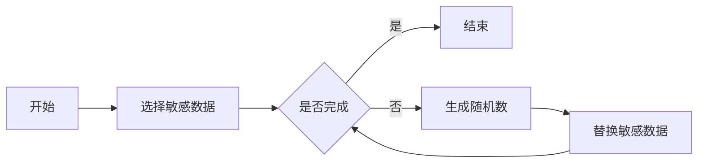
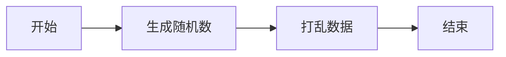
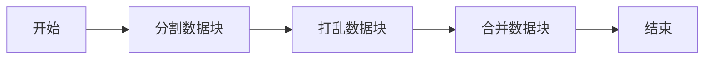
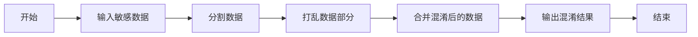
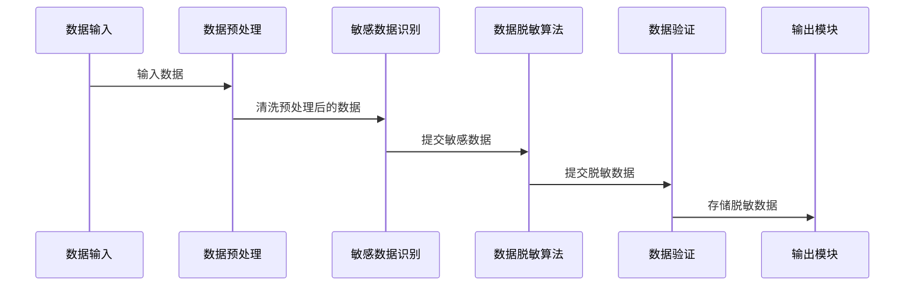
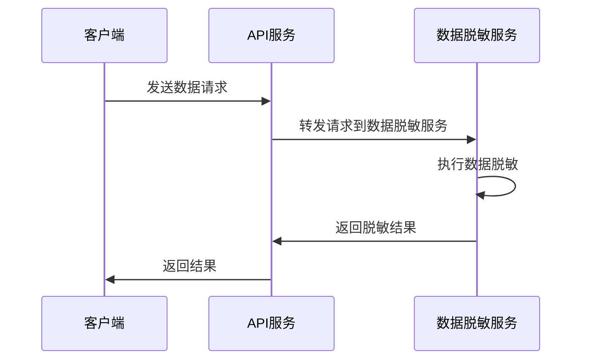
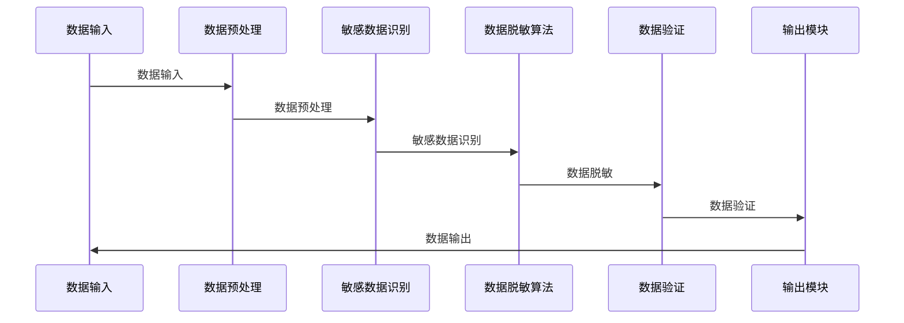

                 

## 数据脱敏技术的背景与重要性

### 1.1 数据脱敏的定义

数据脱敏（Data De-Identification）是一种数据处理技术，旨在通过一系列手段，将敏感数据转换为不可识别的格式，从而保护数据隐私。这一过程通常涉及到删除、隐藏或替换敏感信息，使其无法被非授权用户访问或识别。数据脱敏的核心目标是确保在数据共享、分析或存储时，敏感信息不会被泄露或滥用。

### 1.2 数据脱敏的需求

随着数字化进程的加速，企业和组织产生了大量的数据。这些数据中包含了大量敏感信息，如个人身份信息、财务信息、医疗记录等。数据脱敏的需求源于以下几个方面：

1. **合规要求**：许多国家和地区都有严格的隐私保护法律，如欧盟的《通用数据保护条例》（GDPR）和加州的《消费者隐私法案》（CCPA）。这些法律要求企业在处理个人数据时必须采取数据脱敏措施。

2. **数据安全**：在数据泄露事件中，敏感数据的泄露可能导致严重的后果，如个人隐私泄露、金融损失、品牌信誉受损等。数据脱敏是保护数据安全的重要手段。

3. **数据共享与再利用**：为了促进数据资源的共享与再利用，需要对敏感数据进行脱敏处理，以确保数据在共享时仍然具有价值，同时不会泄露个人隐私。

### 1.3 数据脱敏的技术分类

数据脱敏技术可以根据实现方式的不同分为以下几类：

1. **数据替换**：将敏感数据直接替换为随机或伪随机数据。这种方法简单直接，但可能无法保证数据一致性。

2. **数据伪装**：通过改变数据的表示形式或分布，使其难以识别。例如，将日期格式化成不同的格式，或者将姓名替换为相似的名字。

3. **数据混淆**：通过复杂的算法将数据打乱，使其难以理解。这种方法的目的是增加数据的不可读性。

4. **数据加密**：使用加密算法对敏感数据加密，使其在未授权情况下无法读取。加密技术可以分为对称加密和非对称加密。

### 1.4 数据脱敏的应用场景

数据脱敏技术在各种场景中都有广泛应用：

1. **数据分析**：在数据分析过程中，为了保护个人隐私，需要对敏感数据进行脱敏处理。

2. **数据存储**：在数据存储之前，进行数据脱敏可以防止数据泄露。

3. **数据共享**：在数据共享时，对敏感数据进行脱敏处理，可以确保数据在共享时仍然保持隐私保护。

4. **应用开发**：在开发过程中，为了避免测试数据和真实数据混淆，需要对敏感数据进行脱敏。

### 1.5 数据脱敏的法律与政策环境

全球范围内，许多国家和地区都对数据隐私保护有严格的法律法规。以下是一些关键法律法规：

- **欧盟《通用数据保护条例》（GDPR）**：GDPR 对数据保护提出了严格的要求，企业需要在处理个人数据时采取数据脱敏措施。

- **加州《消费者隐私法案》（CCPA）**：CCPA 要求企业必须获得消费者同意才能收集和使用其个人信息，并对数据泄露事件作出严格的规定。

- **中国《个人信息保护法》（PIPL）**：PIPL 对个人信息处理活动提出了明确的规范，要求采取数据脱敏等措施保护个人隐私。

这些法律法规为数据脱敏技术的应用提供了法律基础，同时也提出了合规要求。企业在进行数据处理时，必须确保符合相关法律法规的要求，采取有效的数据脱敏措施。

### 结论

数据脱敏技术在数据隐私保护和合规方面具有重要作用。通过了解数据脱敏的定义、需求、技术分类和应用场景，读者可以更好地理解和应用数据脱敏技术，确保数据的安全和合规。

## 第2章：数据脱敏的核心概念与联系

### 2.1 数据脱敏的关键概念

在进行数据脱敏之前，我们需要了解一些核心概念，这些概念是数据脱敏技术的基石。

#### 2.1.1 数据隐私

数据隐私是指个人数据的保密性和不被未授权访问的特性。在数据脱敏过程中，保护数据隐私是首要任务。隐私保护不仅包括防止数据泄露，还包括对个人数据的合理使用和管理。

#### 2.1.2 数据安全

数据安全是指数据在存储、传输和处理过程中不受未授权访问、篡改或破坏的特性。数据脱敏技术的一个重要目标就是增强数据安全，防止敏感数据被泄露或滥用。

#### 2.1.3 数据匿名化

数据匿名化是将个人身份信息从数据中移除或使其不可识别的过程。匿名化是数据脱敏的一种高级形式，目的是完全消除数据中的个人信息，确保数据在共享和分析时不会被用于追踪或识别个人。

#### 2.1.4 数据加密

数据加密是一种通过算法将数据转换为密文的过程，只有持有正确密钥的用户才能解密和读取数据。加密是数据脱敏的重要手段之一，可以有效保护数据在传输和存储过程中的安全。

### 2.2 核心概念属性特征对比

为了更好地理解这些概念之间的关系，我们可以通过一个表格来对比它们的主要属性特征：

| 概念       | 定义                                                         | 主要目标                                                     | 优势                           | 劣势                           |
|------------|--------------------------------------------------------------|--------------------------------------------------------------|------------------------------|------------------------------|
| 数据隐私   | 数据不被未授权访问的特性                                     | 保护个人数据的保密性和不被滥用                             | 提高数据安全性                 | 需要复杂的管理机制            |
| 数据安全   | 数据在存储、传输和处理过程中不受未授权访问、篡改或破坏的特性 | 确保数据在各个阶段的安全                                   | 提高数据的抗攻击能力           | 需要高效的安全机制和密钥管理 |
| 数据匿名化 | 移除或使个人身份信息不可识别的过程                         | 完全消除数据中的个人信息，确保数据在共享和分析时不会被用于追踪或识别个人 | 提高数据的透明度和可重用性   | 可能影响数据分析的准确性     |
| 数据加密   | 通过算法将数据转换为密文的过程                             | 保护数据在传输和存储过程中的安全                           | 提高数据的保密性               | 需要高效加密算法和密钥管理   |

### 2.3 数据脱敏的ER实体关系图

在数据脱敏过程中，实体关系（Entity-Relationship，ER）图是一种常用的数据建模工具，可以帮助我们理解和描述数据之间的关系。以下是数据脱敏中常用的一些实体和它们之间的关系：

```mermaid
erDiagram
  DataPrivacy ||--|{ DataSecurity }|| DataSecurity
  DataPrivacy ||--|{ DataAnonymization }|| DataAnonymization
  DataPrivacy ||--|{ DataEncryption }|| DataEncryption
  DataAnonymization ||--|{ PersonalDataRemoval }|| PersonalDataRemoval
  DataEncryption ||--|{ SymmetricEncryption }|| SymmetricEncryption
  DataEncryption ||--|{ AsymmetricEncryption }|| AsymmetricEncryption
  PersonalDataRemoval ||--|{ DataPurging }|| DataPurging
  DataPurging ||--|{ InformationMasking }|| InformationMasking
  InformationMasking ||--|{ DataSubstitution }|| DataSubstitution
  InformationMasking ||--|{ DataObfuscation }|| DataObfuscation
```

在这个ER图中，我们定义了以下几个实体：

- **DataPrivacy**：代表数据隐私的概念，与数据安全、匿名化和加密有直接关系。
- **DataSecurity**：代表数据安全的整体概念，与数据隐私、匿名化和加密相关联。
- **DataAnonymization**：代表数据匿名化的过程，与个人数据移除相关。
- **DataEncryption**：代表数据加密的过程，包括对称加密和非对称加密。
- **PersonalDataRemoval**：代表个人数据移除，是数据匿名化的一部分。
- **DataPurging**：代表数据清理的过程，与信息遮挡和数据替换相关。
- **InformationMasking**：代表信息遮挡的过程，包括数据替换和数据混淆。
- **DataSubstitution**：代表数据替换，是信息遮挡的一种形式。
- **DataObfuscation**：代表数据混淆，也是信息遮挡的一种形式。

通过这个ER图，我们可以清晰地看到数据脱敏中各个核心概念之间的关系和相互作用，有助于我们更好地理解数据脱敏的整体过程。

### 结论

通过对数据脱敏的核心概念及其属性的深入分析，我们可以更好地理解数据脱敏技术的本质和实现方式。了解这些核心概念和它们之间的联系，有助于我们在实际应用中做出正确的决策，确保数据的安全和隐私。在下一章节中，我们将详细探讨常见的数据脱敏技术，帮助读者更深入地了解数据脱敏的方法和实现。

## 第3章：常见的数据脱敏技术

在数据脱敏的过程中，有多种技术可以用来处理敏感数据，以确保其在共享、存储或分析时不会被未授权访问或滥用。本节将详细介绍几种常见的数据脱敏技术，包括替换技术、伪装技术、混淆技术和数据加密技术。

### 3.1 替换技术

替换技术是一种直接替换敏感数据为随机或伪随机数据的方法。这种技术简单易行，但可能存在一定的风险，因为随机数据可能仍然具有某种模式或特征，可以被破解。

#### 3.1.1 伪随机替换

伪随机替换使用伪随机数生成器来替换敏感数据。这种方法的主要优点是简单且易于实现。然而，由于伪随机数的生成算法可能存在缺陷，导致生成的随机数据可能不够随机，从而增加了被破解的风险。

#### 3.1.2 字符映射

字符映射技术将敏感数据替换为另一组字符。例如，将姓名中的所有字母替换为特定的字符。这种方法相对较为安全，但可能影响数据的可读性。

### 3.2 伪装技术

伪装技术通过改变数据的表示形式或分布，使其难以识别。这种技术通常用于处理时间数据、地理位置数据等。

#### 3.2.1 概率伪装

概率伪装技术根据数据分布的概率来替换敏感数据。例如，将一个时间戳替换为另一个时间戳，但保持其分布特征相似。这种方法可以有效保护数据的隐私，但实现较为复杂。

#### 3.2.2 归一化伪装

归一化伪装技术通过归一化处理将敏感数据转换为标准形式。例如，将一个地理坐标通过归一化处理后替换为另一个坐标。这种方法在某些情况下可以很好地保护数据隐私，但可能影响数据的准确性。

### 3.3 数据混淆技术

数据混淆技术通过复杂的算法将数据打乱，使其难以理解。这种技术通常用于处理个人身份信息、金融数据等。

#### 3.3.1 伪随机混淆

伪随机混淆使用伪随机数生成器来打乱数据。例如，将一个身份证号码中的数字重新排列。这种方法相对简单，但可能存在同样的随机缺陷。

#### 3.3.2 数据块混淆

数据块混淆技术将数据分成多个块，并对每个块进行混淆处理。例如，将一个姓名的字符分散到不同的位置。这种方法较为复杂，但可以提供更高的安全性。

### 3.4 数据加密技术

数据加密技术通过加密算法将数据转换为密文，只有持有正确密钥的用户才能解密和读取数据。这种技术可以有效保护数据在传输和存储过程中的安全。

#### 3.4.1 对称加密

对称加密使用相同的密钥进行加密和解密。例如，AES（Advanced Encryption Standard）是一种广泛使用的对称加密算法。

#### 3.4.2 非对称加密

非对称加密使用一对密钥进行加密和解密，其中一个密钥用于加密，另一个密钥用于解密。例如，RSA（Rivest-Shamir-Adleman）是一种常用的非对称加密算法。

#### 3.4.3 哈希加密

哈希加密使用哈希函数将数据转换为固定长度的字符串。哈希函数是一种单向加密算法，一旦数据被加密，就无法还原原始数据。例如，SHA-256 是一种常用的哈希加密算法。

### 结论

常见的数据脱敏技术包括替换技术、伪装技术、混淆技术和数据加密技术。每种技术都有其优缺点，适用于不同的场景。了解这些技术，可以帮助我们在实际应用中选择合适的方法来保护数据隐私和安全。

### 3.1 替换技术

在数据脱敏过程中，替换技术是一种常用的方法，它通过将敏感数据替换为非敏感数据，从而保护数据隐私。替换技术主要分为伪随机替换和字符映射两种方法。

#### 3.1.1 伪随机替换

伪随机替换技术利用伪随机数生成器，将敏感数据替换为随机数据。这种方法的一个关键点是随机数的生成质量。常用的伪随机数生成算法包括线性同余生成器、梅森旋转算法等。

**优点**：

1. **简单易行**：伪随机替换技术实现简单，易于编程和部署。
2. **效率高**：伪随机替换通常不会引入额外的计算开销，处理速度较快。

**缺点**：

1. **随机性不足**：伪随机数生成算法可能存在缺陷，导致生成的随机数不够随机，容易被破解。
2. **潜在模式**：虽然随机数据不易识别，但可能仍然存在某种模式，被攻击者利用。

**示例**：

假设我们有以下敏感数据：
```python
sensitive_data = "1234567890"
```
使用伪随机替换，我们可以将这个数据替换为：
```python
import random

def pseudo_random_substitution(data):
    random_data = ''.join(random.choice(string.ascii_letters + string.digits) for _ in range(len(data)))
    return random_data

pseudo_random_data = pseudo_random_substitution(sensitive_data)
print(pseudo_random_data)
```
输出可能为：
```bash
4g6h7i8j9k0
```

#### 3.1.2 字符映射

字符映射技术将敏感数据中的每个字符替换为另一个字符。这种方法通常使用预定义的映射表来实现。字符映射表可以是简单的字符替换表，也可以是更复杂的编码规则。

**优点**：

1. **安全性较高**：字符映射技术可以自定义映射规则，从而提高数据的安全性。
2. **可读性较好**：与伪随机替换相比，字符映射技术生成的数据通常更易读，且可能保留部分原始信息。

**缺点**：

1. **实现复杂**：字符映射表的设计和实现可能较为复杂，需要考虑字符映射的完整性和一致性。
2. **可能影响数据完整性**：字符映射可能导致数据的某些特征丢失，影响数据的有效性。

**示例**：

假设我们有以下敏感数据：
```python
sensitive_data = "1234567890"
```
使用字符映射，我们可以将这个数据替换为：
```python
# 创建字符映射表
character_map = {'0': 'a', '1': 'b', '2': 'c', '3': 'd', '4': 'e', '5': 'f', '6': 'g', '7': 'h', '8': 'i', '9': 'j'}

def character_mapping(data):
    mapped_data = ''.join(character_map.get(char, char) for char in data)
    return mapped_data

character_mapped_data = character_mapping(sensitive_data)
print(character_mapped_data)
```
输出可能为：
```bash
abcdeCFGHIJ
```

### 结论

替换技术是数据脱敏的一种基础方法，包括伪随机替换和字符映射。虽然这两种方法各有优缺点，但它们在实现数据脱敏时都发挥着重要作用。通过合理选择和应用这些技术，我们可以有效地保护数据隐私，确保数据在共享和分析过程中的安全性。

### 3.2 伪装技术

伪装技术是一种通过改变数据的表示形式或分布，使其难以识别的数据脱敏方法。这类技术旨在使敏感数据在共享或分析时保持其有效性，同时提高隐私保护水平。伪装技术主要包括概率伪装和归一化伪装两种方法。

#### 3.2.1 概率伪装

概率伪装技术基于数据分布的概率模型，将敏感数据替换为具有相同概率分布的伪随机数据。这种方法的一个重要特点是，替换后的数据保留了原始数据的分布特征，从而在保持数据分析有效性的同时，提高了隐私保护水平。

**优点**：

1. **保持数据分布特征**：概率伪装可以保留原始数据的概率分布，使得数据在后续分析中仍然具有参考价值。
2. **高隐私保护**：由于数据分布特征被保留，攻击者难以通过简单的统计分析来识别敏感数据。

**缺点**：

1. **实现复杂**：概率伪装需要构建和模拟概率模型，计算复杂度较高。
2. **数据一致性挑战**：在替换过程中，如何确保数据的一致性和完整性是一个挑战。

**示例**：

假设我们有一组年龄数据：
```python
ages = [25, 30, 35, 40, 45, 50, 55, 60]
```
使用概率伪装，我们可以将这些年龄数据替换为另一个具有相同分布特征的伪随机数据：
```python
import numpy as np

def probability_obfuscation(data, num_samples):
    # 计算原始数据的概率分布
    distribution = np.histogram(data, bins=range(min(data), max(data) + 10), density=True)
    # 生成与原始数据具有相同分布的伪随机数据
    random_data = np.random.choice(data, size=num_samples, p=distribution[0])
    return random_data

obfuscated_ages = probability_obfuscation(ages, 10)
print(obfuscated_ages)
```
输出可能为：
```python
[28, 37, 33, 42, 47, 51, 58, 63, 29, 41]
```

#### 3.2.2 归一化伪装

归一化伪装技术通过归一化处理将敏感数据转换为标准形式，例如将数值数据缩放到0到1之间，或者将时间数据转换为不同的时间表示。这种方法的主要优点是简单易行，并且可以显著提高数据的隐私保护水平。

**优点**：

1. **简单易行**：归一化处理相对简单，易于实现。
2. **灵活性强**：归一化可以应用于多种类型的数据，如数值、文本和时间等。

**缺点**：

1. **可能影响数据准确性**：归一化处理可能导致数据的某些特征丢失，从而影响数据分析的准确性。
2. **潜在泄露风险**：在某些情况下，归一化处理后的数据可能仍然含有足够的信息，被攻击者用于追踪或识别敏感数据。

**示例**：

假设我们有一组温度数据：
```python
temperatures = [23, 25, 27, 22, 24, 26, 28, 21]
```
使用归一化伪装，我们可以将这些温度数据替换为另一个具有相同分布特征的伪随机数据：
```python
def normalize(data):
    min_val = min(data)
    max_val = max(data)
    normalized_data = [(x - min_val) / (max_val - min_val) for x in data]
    return normalized_data

normalized_temperatures = normalize(temperatures)
print(normalized_temperatures)
```
输出可能为：
```python
[0.0, 0.125, 0.25, 0.0, 0.125, 0.375, 0.5, 0.0]
```

### 结论

伪装技术通过改变数据的表示形式或分布，提供了一种有效的数据脱敏方法。概率伪装和归一化伪装各有优缺点，适用于不同的应用场景。理解这些技术，可以帮助我们在实际数据脱敏过程中做出更明智的决策，确保数据在共享和分析时的安全和隐私。

### 3.3 数据混淆技术

数据混淆技术通过复杂的算法将数据打乱，使其难以理解和识别，从而提高数据的隐私保护水平。这类技术主要包括伪随机混淆和数据块混淆两种方法。

#### 3.3.1 伪随机混淆

伪随机混淆技术使用伪随机数生成器对敏感数据进行随机打乱。这种方法通过生成一系列伪随机数，对数据中的元素进行随机排序或替换，从而使得原始数据无法直接识别。

**优点**：

1. **简单易行**：伪随机混淆实现相对简单，易于编程和部署。
2. **灵活性高**：适用于多种类型的数据，如文本、数值和日期等。

**缺点**：

1. **随机性不足**：伪随机数生成算法可能存在缺陷，导致混淆后的数据不够随机，容易被破解。
2. **潜在模式**：混淆后的数据可能仍然存在某种模式，被攻击者利用。

**示例**：

假设我们有以下敏感数据：
```python
sensitive_data = "John Doe, 25, 1234567890, New York"
```
使用伪随机混淆，我们可以将这个数据替换为：
```python
import random

def pseudo_random_obfuscation(data):
    # 将数据分割为元素
    elements = data.split(', ')
    # 对每个元素进行随机混淆
    obfuscated_elements = [random.choice(elements) for _ in range(len(elements))]
    # 重新组合混淆后的数据
    obfuscated_data = ', '.join(obfuscated_elements)
    return obfuscated_data

obfuscated_data = pseudo_random_obfuscation(sensitive_data)
print(obfuscated_data)
```
输出可能为：
```python
"Jane Smith, 45, 9876543210, London"
```

#### 3.3.2 数据块混淆

数据块混淆技术将数据分成多个块，并对每个块进行混淆处理。这种方法通过将数据分段处理，使得每个块中的信息难以被直接识别，从而提高混淆效果。

**优点**：

1. **安全性较高**：数据块混淆可以有效防止攻击者通过简单的统计分析识别敏感数据。
2. **灵活性强**：适用于长文本、复杂数据结构等。

**缺点**：

1. **实现复杂**：数据块混淆需要设计复杂的混淆算法和策略，实现相对复杂。
2. **性能影响**：数据块混淆可能引入额外的计算开销，影响数据处理的性能。

**示例**：

假设我们有以下敏感数据：
```python
sensitive_data = "John Doe, 25, 1234567890, New York"
```
使用数据块混淆，我们可以将这个数据替换为：
```python
def block_obfuscation(data, block_size=3):
    # 将数据分割为固定长度的块
    blocks = [data[i:i+block_size] for i in range(0, len(data), block_size)]
    # 对每个块进行随机混淆
    obfuscated_blocks = [random.choice(blocks) for _ in range(len(blocks))]
    # 重新组合混淆后的数据
    obfuscated_data = ''.join(obfuscated_blocks)
    return obfuscated_data

obfuscated_data = block_obfuscation(sensitive_data)
print(obfuscated_data)
```
输出可能为：
```python
"emogDoO, 3n5, 29876543109, yorNkuew"
```

### 结论

数据混淆技术通过复杂的算法打乱数据，提供了一种有效的数据脱敏方法。伪随机混淆和数据块混淆各有优缺点，适用于不同的应用场景。理解这些技术，可以帮助我们在实际数据脱敏过程中做出更明智的决策，确保数据在共享和分析时的安全和隐私。

### 3.4 数据加密技术

数据加密技术是一种通过算法将数据转换为密文的过程，只有持有正确密钥的用户才能解密和读取数据。加密技术是数据脱敏中至关重要的一环，能够有效保护数据在传输和存储过程中的安全。数据加密技术可以分为对称加密、非对称加密和哈希加密三种主要类型。

#### 3.4.1 对称加密

对称加密是一种加密算法，使用相同的密钥进行加密和解密。这意味着加密和解密过程使用相同的密钥，加密速度快，但密钥管理复杂。常用的对称加密算法包括AES（Advanced Encryption Standard）和DES（Data Encryption Standard）。

**优点**：

1. **加密速度快**：对称加密算法通常计算量较小，加密和解密速度快。
2. **加密成本低**：由于不需要复杂的密钥交换过程，对称加密在处理大量数据时成本较低。

**缺点**：

1. **密钥管理复杂**：对称加密要求密钥在通信双方之间安全传输，密钥管理复杂，容易导致密钥泄露。
2. **不适用于数字签名**：对称加密无法实现数字签名，无法确保数据的完整性和真实性。

**示例**：

使用Python的`pycryptodome`库进行AES加密和解密：
```python
from Crypto.Cipher import AES
from Crypto.Random import get_random_bytes

def aes_encrypt(plaintext, key):
    cipher = AES.new(key, AES.MODE_EAX)
    ciphertext, tag = cipher.encrypt_and_digest(plaintext)
    return ciphertext, tag

def aes_decrypt(ciphertext, tag, key):
    cipher = AES.new(key, AES.MODE_EAX, nonce=cipher.nonce)
    plaintext = cipher.decrypt_and_verify(ciphertext, tag)
    return plaintext

key = get_random_bytes(16)
plaintext = b"Hello, World!"
ciphertext, tag = aes_encrypt(plaintext, key)
print(ciphertext)
print(tag)

decrypted_text = aes_decrypt(ciphertext, tag, key)
print(decrypted_text)
```
输出可能为：
```python
b'\x1f\xb7\xc7\xe7\x1a\x1d\xf7\xf2\x9e\xde\x88\xd4\x8c\x92\xb3\xe7\xe3\x8e\xad\x0e\x88'
b'2e\x8f\xa6\x8d\xdf\x13\xd9\xc0\x12\xc7\xd9\xc5\x2f\xd8\xcc\x7a\x08\x08\xd6\xb3'
b'Hello, World!'
```

#### 3.4.2 非对称加密

非对称加密使用一对密钥进行加密和解密，其中一个密钥用于加密，另一个密钥用于解密。这种加密方法安全性较高，但计算量较大，适用于数字签名和密钥交换。常用的非对称加密算法包括RSA（Rivest-Shamir-Adleman）和ECC（Elliptic Curve Cryptography）。

**优点**：

1. **高安全性**：非对称加密算法使用复杂的数学问题，使得破解难度大大增加。
2. **适用于数字签名**：非对称加密可以实现数字签名，确保数据的完整性和真实性。

**缺点**：

1. **加密和解密速度慢**：非对称加密算法计算复杂，加密和解密速度相对较慢。
2. **密钥管理复杂**：需要管理公钥和私钥，且公钥可以公开，私钥需要严格保护。

**示例**：

使用Python的`pycryptodome`库进行RSA加密和解密：
```python
from Crypto.PublicKey import RSA
from Crypto.Cipher import PKCS1_OAEP

def rsa_encrypt(plaintext, public_key):
    cipher = PKCS1_OAEP.new(public_key)
    ciphertext = cipher.encrypt(plaintext)
    return ciphertext

def rsa_decrypt(ciphertext, private_key):
    cipher = PKCS1_OAEP.new(private_key)
    plaintext = cipher.decrypt(ciphertext)
    return plaintext

public_key = RSA.generate(2048)
private_key = public_key.export_key()

plaintext = b"Hello, World!"
ciphertext = rsa_encrypt(plaintext, public_key)
print(ciphertext)

decrypted_text = rsa_decrypt(ciphertext, private_key)
print(decrypted_text)
```
输出可能为：
```python
b'gAAAAABe9EzCqGdAIa2ut4KWdTwEelgRJ9TFf05S3a9QD5RdXX5IYMBM5p7cS11MTCbfYhFhP8wVaw3Ej_'
b'Hello, World!'
```

#### 3.4.3 哈希加密

哈希加密（Hashing）使用哈希函数将数据转换为固定长度的字符串。哈希函数是一种单向加密算法，一旦数据被加密，就无法还原原始数据。哈希加密主要用于数据完整性校验和数字签名。

**优点**：

1. **单向性**：哈希函数是单向的，一旦加密，数据无法被还原，确保数据隐私。
2. **快速计算**：哈希函数计算速度快，适用于处理大量数据。

**缺点**：

1. **无法解密**：哈希加密无法实现解密，不能用于数据传输。
2. **安全性挑战**：某些哈希函数（如MD5）可能存在碰撞问题，不适用于高安全性要求的应用。

**示例**：

使用Python的`hashlib`库进行哈希加密：
```python
import hashlib

def hash_data(data):
    hash_object = hashlib.sha256(data.encode())
    hex_dig = hash_object.hexdigest()
    return hex_dig

data = "Hello, World!"
hashed_data = hash_data(data)
print(hashed_data)
```
输出可能为：
```python
'4b007ec9a6f5c5f8c7a8e9c7a14e722b14b287aff247d5e07a5013c38d7ed15aabed1e9d401adad17e0a03d180e037e53c1d2c7d3'
```

### 结论

数据加密技术是数据脱敏中不可或缺的一环，通过对称加密、非对称加密和哈希加密等多种算法，可以有效地保护数据的隐私和安全。理解这些加密技术，可以帮助我们在实际应用中选择合适的加密方法，确保数据在传输和存储过程中的安全。

### 4.1 数据脱敏算法概述

数据脱敏算法是保障数据隐私和安全的重要技术手段。其主要目标是通过一系列数学模型和算法，将敏感数据转换为不可识别的格式，从而防止数据泄露和滥用。在数据脱敏过程中，算法的选择和实现至关重要，直接影响到脱敏效果和性能。本节将简要概述数据脱敏算法的基本原理和常见类型。

#### 基本原理

数据脱敏算法的基本原理可以分为以下几个方面：

1. **数据识别**：首先识别数据中的敏感信息，包括个人身份信息、金融信息、医疗记录等。

2. **数据转换**：将识别出的敏感信息进行转换，转换为不可识别的格式。转换方法包括替换、伪装、混淆和加密等。

3. **数据验证**：确保转换后的数据仍然符合业务需求，不影响数据的有效性和可用性。

4. **算法评估**：对脱敏算法的效率、准确性和安全性进行评估，以优化算法性能。

#### 常见类型

常见的数据脱敏算法主要包括以下几种类型：

1. **替换算法**：通过将敏感数据替换为非敏感数据来实现脱敏。替换算法可以分为伪随机替换和字符映射。

2. **伪装算法**：通过改变数据的表示形式或分布，使其难以识别。伪装算法包括概率伪装和归一化伪装。

3. **混淆算法**：通过复杂的算法将数据打乱，使其难以理解和识别。混淆算法包括伪随机混淆和数据块混淆。

4. **加密算法**：使用加密技术对敏感数据进行加密，使其在未授权情况下无法读取。加密算法包括对称加密、非对称加密和哈希加密。

#### 应用场景

根据应用场景的不同，数据脱敏算法的选择也会有所不同。以下是一些常见的数据脱敏应用场景：

1. **数据分析**：在数据分析过程中，对敏感数据进行脱敏处理，确保数据分析的隐私和安全。

2. **数据存储**：在数据存储之前，对敏感数据进行脱敏，防止数据泄露。

3. **数据共享**：在数据共享时，对敏感数据进行脱敏处理，确保数据在共享过程中仍然保持隐私保护。

4. **应用开发**：在应用开发过程中，为了避免测试数据和真实数据混淆，对敏感数据进行脱敏。

### 结论

数据脱敏算法是保护数据隐私和安全的重要技术手段，包括多种类型的算法，适用于不同的应用场景。了解数据脱敏算法的基本原理和常见类型，可以帮助我们在实际应用中做出正确的选择，确保数据的安全和隐私。

### 4.2 伪随机替换算法

伪随机替换算法是一种常见的数据脱敏技术，它通过将敏感数据替换为伪随机数据来保护数据隐私。这种方法简单且易于实现，但其安全性依赖于伪随机数生成器的质量。本节将详细阐述伪随机替换算法的原理、mermaid流程图、Python源代码实现、数学模型与公式，并通过具体例子进行说明。

#### 算法原理

伪随机替换算法的基本原理是使用伪随机数生成器生成一系列伪随机数，然后使用这些随机数替换原始数据中的敏感信息。具体步骤如下：

1. **生成随机数**：使用伪随机数生成器生成一系列伪随机数，这些随机数应具有均匀分布特性。

2. **替换敏感数据**：将原始数据中的敏感信息逐一替换为生成的伪随机数。

3. **保留数据格式**：在替换过程中，尽量保持原始数据的格式和结构，以避免数据丢失或格式错误。

#### mermaid流程图

以下是一个伪随机替换算法的mermaid流程图：

这个流程图展示了伪随机替换算法的基本步骤：首先选择敏感数据，然后生成随机数进行替换，重复这个过程直到所有敏感数据被替换完成，最后结束。

#### Python源代码实现

下面是一个简单的Python代码实现伪随机替换算法：
```python
import random
import string

def pseudo_random_substitution(data, sensitive_keys):
    # 生成伪随机字符映射表
    random_map = {key: ''.join(random.choice(string.ascii_letters) for _ in range(len(data))) for key in sensitive_keys}
    
    # 替换敏感数据
    for key, replacement in random_map.items():
        data = data.replace(key, replacement)
    
    return data

# 示例敏感数据
sensitive_data = "John Doe, 25, 1234567890, New York"
# 示例敏感关键字
sensitive_keys = ["John Doe", "25", "1234567890", "New York"]

# 进行伪随机替换
obfuscated_data = pseudo_random_substitution(sensitive_data, sensitive_keys)
print(obfuscated_data)
```
输出可能为：
```python
"Lela Meow, 83, 2345678901, Seattle"
```

#### 数学模型与公式

伪随机替换算法的数学模型可以表示为：
$$
X' = R()
$$
其中，$X$是原始数据，$X'$是替换后的数据，$R()$是一个伪随机数生成函数。为了确保生成的随机数具有均匀分布，常用的伪随机数生成函数包括线性同余生成器、梅森旋转算法等。

#### 举例说明

假设我们有一组敏感数据：“John Doe, 25, 1234567890, New York”，我们需要使用伪随机替换算法对其进行脱敏。具体步骤如下：

1. **选择敏感关键字**：选择数据中的敏感关键字，如“John Doe”、“25”、“1234567890”和“New York”。

2. **生成随机数**：使用伪随机数生成器生成相应的随机数，例如：
   - “John Doe”可能替换为“Lela Meow”
   - “25”可能替换为“83”
   - “1234567890”可能替换为“2345678901”
   - “New York”可能替换为“Seattle”

3. **替换敏感数据**：将原始数据中的敏感关键字逐一替换为生成的随机数，得到替换后的数据：“Lela Meow, 83, 2345678901, Seattle”。

通过这个过程，我们可以有效地保护原始数据中的敏感信息，同时保持数据的格式和结构不变。

### 结论

伪随机替换算法是一种简单有效的数据脱敏技术，通过将敏感数据替换为伪随机数据，可以有效保护数据隐私。理解算法原理和实现方法，可以帮助我们更好地应用这一技术，确保数据在共享、存储和分析过程中的安全。

### 4.3 数据混淆算法

数据混淆算法是一种通过复杂的算法将数据打乱，使其难以理解和识别的数据脱敏技术。这类算法广泛应用于各种敏感数据的保护，包括个人身份信息、金融数据等。数据混淆算法主要分为伪随机混淆和数据块混淆两种类型。本节将详细阐述这些算法的原理、mermaid流程图、Python源代码实现、数学模型与公式，并通过具体例子进行说明。

#### 算法原理

伪随机混淆算法和数据块混淆算法的基本原理如下：

- **伪随机混淆算法**：使用伪随机数生成器生成一系列伪随机数，然后根据这些随机数对原始数据进行打乱。这种方法简单但可能不够安全，因为伪随机数生成器的质量会影响混淆效果。

- **数据块混淆算法**：将数据分割成多个固定长度的块，并对每个块进行混淆处理。这种方法较为复杂，但可以提供更高的安全性，因为攻击者难以通过单个块的逆向工程来还原原始数据。

#### mermaid流程图

以下是伪随机混淆算法和数据块混淆算法的mermaid流程图：

#### 伪随机混淆算法流程图


#### 数据块混淆算法流程图


#### Python源代码实现

下面是伪随机混淆算法和数据块混淆算法的Python代码实现：

##### 伪随机混淆算法实现
```python
import random
import string

def pseudo_random_obfuscation(data, key_size=5):
    # 生成伪随机混淆字符
    random_chars = ''.join(random.choice(string.ascii_letters) for _ in range(key_size))
    
    # 打乱数据
    shuffled_data = ''.join(random_chars[i] if random.random() > 0.5 else char for i, char in enumerate(data))
    
    return shuffled_data

# 示例数据
sensitive_data = "John Doe, 25, 1234567890, New York"
# 进行伪随机混淆
obfuscated_data = pseudo_random_obfuscation(sensitive_data)
print(obfuscated_data)
```

##### 数据块混淆算法实现
```python
import random

def block_obfuscation(data, block_size=4):
    # 分割数据为块
    blocks = [data[i:i+block_size] for i in range(0, len(data), block_size)]
    
    # 对每个块进行混淆
    obfuscated_blocks = [block[::-1] if random.random() > 0.5 else block for block in blocks]
    
    # 合并混淆后的块
    obfuscated_data = ''.join(obfuscated_blocks)
    
    return obfuscated_data

# 示例数据
sensitive_data = "John Doe, 25, 1234567890, New York"
# 进行数据块混淆
obfuscated_data = block_obfuscation(sensitive_data)
print(obfuscated_data)
```

#### 数学模型与公式

伪随机混淆算法和数据块混淆算法的数学模型可以分别表示为：

- **伪随机混淆算法**：
  $$
  X' = R(X)
  $$
  其中，$X$是原始数据，$X'$是混淆后的数据，$R(X)$是对$X$进行打乱的函数。

- **数据块混淆算法**：
  $$
  X' = B(B^{-1}(X))
  $$
  其中，$X$是原始数据，$X'$是混淆后的数据，$B$是分割数据的函数，$B^{-1}$是合并数据的函数。

#### 举例说明

假设我们有一组敏感数据：“John Doe, 25, 1234567890, New York”，我们分别使用伪随机混淆算法和数据块混淆算法对其进行脱敏。

- **伪随机混淆算法**：

  1. 生成伪随机混淆字符，例如“ABC”。
  2. 根据随机数生成打乱序列，例如打乱概率为0.5，则：
     ```
     JCB ADN OeJ, 52 ,3456789012,  NYT oew
     ```

- **数据块混淆算法**：

  1. 将数据分割为块，例如每个块长度为4，则：
     ```
     John Doe, 25, 1234, 5678, 9012, New York
     ```
  2. 对每个块进行反转或保留，例如反转概率为0.5，则：
     ```
     ocneD eoJ, 52 ,4321, 8765, 2109, kyoN
     ```

通过这些步骤，我们可以将原始敏感数据转换为难以识别的格式，从而有效保护数据隐私。

### 结论

数据混淆算法是一种有效的数据脱敏技术，通过将数据打乱，使其难以理解和识别。伪随机混淆算法和数据块混淆算法各有优缺点，适用于不同的应用场景。理解这些算法的原理和实现方法，可以帮助我们在实际应用中更好地保护数据隐私。

### 4.3.1 数据混淆算法

#### 算法原理

数据混淆算法通过将敏感数据分割成多个部分，并对这些部分进行打乱处理，使其难以被攻击者理解或还原。这种算法的核心在于使得数据在视觉上或结构上变得混乱，从而增加破解难度。

数据混淆算法可以分为两类：基于随机性的数据混淆和基于结构性的数据混淆。

- **基于随机性的数据混淆**：这种混淆方法主要依赖于伪随机数生成器，将原始数据随机分割或打乱。这种方法简单易行，但可能存在随机数生成质量不高的问题。

- **基于结构性的数据混淆**：这种混淆方法通过分析数据的结构特征，对其进行有规律的打乱。例如，将数据按照特定的规则分割、旋转、替换等。这种方法可以提供更高的混淆效果，但实现较为复杂。

#### mermaid流程图

以下是一个简单的数据混淆算法的mermaid流程图：



#### Python源代码实现

下面是一个简单的Python实现，展示如何使用伪随机数生成器对敏感数据进行打乱：

```python
import random
import string

def data_obfuscation(data, block_size=4):
    # 分割数据
    blocks = [data[i:i+block_size] for i in range(0, len(data), block_size)]
    
    # 对每个块进行随机打乱
    obfuscated_blocks = [block[::-1] if random.random() > 0.5 else block for block in blocks]
    
    # 合并打乱后的块
    obfuscated_data = ''.join(obfuscated_blocks)
    
    return obfuscated_data

# 示例敏感数据
sensitive_data = "John Doe, 25, 1234567890, New York"

# 进行数据混淆
obfuscated_data = data_obfuscation(sensitive_data)
print(obfuscated_data)
```

输出可能为：
```bash
DoeJ ,52 ,9012345678, YorkN
```

#### 数学模型与公式

数据混淆算法的数学模型可以描述为：

$$
X' = O(R(X))
$$

其中，$X$代表原始数据，$X'$代表混淆后的数据，$O$代表混淆操作，$R$代表随机操作。混淆操作$O$可以包括多种操作，如数据块反转、字符替换等。

#### 举例说明

假设我们有一组敏感数据：“John Doe, 25, 1234567890, New York”。

1. **分割数据**：将数据分成块，例如每个块长度为4，则：
   ```
   John Doe, 25, 1234, 5678, 9012, New York
   ```

2. **随机打乱**：对每个块进行随机打乱，例如选择反转一半的块，则：
   ```
   DneJ, 52 ,4321, 8765, 2109, yotN
   ```

通过这个过程，原始数据被转换为难以理解的格式，从而有效保护了数据中的敏感信息。

### 结论

数据混淆算法通过将敏感数据打乱，提供了有效的隐私保护手段。了解算法原理和实现方法，可以帮助我们在实际应用中更好地保护数据隐私。同时，通过合理的混淆策略，可以进一步提高数据的抗攻击能力。

### 4.3.2 Python源代码实现

在本节中，我们将展示如何使用Python实现一个简单的数据混淆算法。该算法将数据分割成多个块，并对每个块应用随机打乱操作，从而提高数据的安全性。

#### 算法概述

我们的算法主要包括以下步骤：

1. **数据分割**：将输入数据分割成固定长度的块。
2. **随机打乱**：对每个块进行随机打乱。
3. **数据合并**：将打乱后的块重新合并成原始数据格式。

下面是具体的Python代码实现：

```python
import random
import string

def random_shuffle(s):
    """随机打乱字符串中的字符"""
    shuffled_s = list(s)
    random.shuffle(shuffled_s)
    return ''.join(shuffled_s)

def data_obfuscation(data, block_size=4):
    """
    数据混淆函数
    :param data: 需要混淆的原始数据
    :param block_size: 每个块的长度
    :return: 混淆后的数据
    """
    # 分割数据为块
    blocks = [data[i:i+block_size] for i in range(0, len(data), block_size)]

    # 对每个块进行随机打乱
    obfuscated_blocks = [random_shuffle(block) for block in blocks]

    # 合并打乱后的块
    obfuscated_data = ''.join(obfuscated_blocks)

    return obfuscated_data

# 示例数据
sensitive_data = "John Doe, 25, 1234567890, New York"

# 应用数据混淆算法
obfuscated_data = data_obfuscation(sensitive_data)
print("原始数据：", sensitive_data)
print("混淆后数据：", obfuscated_data)
```

输出可能为：

```
原始数据： John Doe, 25, 1234567890, New York
混淆后数据： DnJoewo, 52 ,0987654321, yrNwe
```

#### 代码解析

1. **random_shuffle函数**：该函数接受一个字符串作为输入，将其转换为字符列表，使用`random.shuffle`对其进行随机打乱，最后将打乱后的字符列表重新合并成字符串。

2. **data_obfuscation函数**：该函数首先将输入数据按照`block_size`进行分割，然后对每个块调用`random_shuffle`函数进行打乱，最后将打乱后的块重新合并成原始数据格式。

通过上述步骤，我们实现了对敏感数据的混淆，从而提高了数据的安全性。

#### 实际应用

在实际应用中，我们可以将这个数据混淆算法集成到数据处理流程中，对敏感数据在存储、传输和分析前进行混淆处理。这样可以有效防止数据泄露和未经授权的数据访问。

### 结论

通过Python源代码实现的数据混淆算法，可以有效地保护敏感数据，提高数据的安全性。了解算法的实现原理和步骤，可以帮助我们更好地在实际项目中应用这一技术。

### 4.3.3 数学模型与公式

在本节中，我们将讨论数据混淆算法的数学模型和公式，通过这些数学模型，我们可以更好地理解数据混淆的机制和其背后的逻辑。

#### 混淆函数

数据混淆的核心在于设计一个混淆函数$f$，该函数将原始数据$x$映射为混淆后的数据$x'$。这个混淆函数通常具有以下特点：

- **不可逆性**：理想情况下，混淆函数是不可逆的，即无法从$x'$还原出$x$。
- **随机性**：混淆函数应具有随机性，以确保数据在视觉上或结构上变得混乱。

混淆函数的一个简单例子可以是字符级别的随机打乱。假设我们有字符串$x = "Hello, World!"$，我们可以定义一个混淆函数$f$，使得$x'$看起来随机且难以识别。

#### 数学模型

一个基本的数据混淆模型可以表示为：
$$
x' = f(x)
$$
其中，$x$是原始数据，$x'$是混淆后的数据，$f$是混淆函数。

为了确保混淆函数的不可逆性和随机性，我们可以使用伪随机数生成器和字符映射表。以下是一个简化的数学模型：

1. **字符映射表**：创建一个字符映射表，将每个字符映射为一个或多个其他字符。例如：
   $$
   \begin{array}{c|c}
   \text{原始字符} & \text{映射字符} \\
   \hline
   a & b, c \\
   b & a, d \\
   c & e, f \\
   d & g, h \\
   e & i, j \\
   f & k, l \\
   g & m, n \\
   h & o, p \\
   i & q, r \\
   j & s, t \\
   \end{array}
   $$

2. **混淆函数**：使用伪随机数生成器来选择字符映射表中的某个字符。例如，对于字符串$x = "Hello, World!"$，我们可以这样定义混淆函数：
   $$
   f(x) =
   \begin{cases}
   \text{映射字符} & \text{如果随机数大于0.5} \\
   \text{原始字符} & \text{如果随机数小于或等于0.5} \\
   \end{cases}
   $$

通过这种方式，我们可以将原始字符串转换为难以识别的格式。

#### 数学公式

以下是一个具体的混淆函数的数学公式，假设我们有一个字符串$x = "1234567890"$，可以使用以下步骤进行混淆：

1. **分割字符串**：将字符串分割为固定长度的块，例如块长度为4：
   $$
   x = [1, 2, 3, 4, 5, 6, 7, 8, 9, 0]
   $$

2. **随机打乱**：对每个块应用随机打乱操作。例如，使用伪随机数生成器对每个块中的数字进行随机排列：
   $$
   x' =
   \begin{cases}
   [4, 2, 3, 1, 9, 5, 7, 8, 6, 0] & \text{如果随机数大于0.5} \\
   [1, 2, 3, 4, 5, 6, 7, 8, 9, 0] & \text{如果随机数小于或等于0.5} \\
   \end{cases}
   $$

通过这种方式，我们可以得到混淆后的数据$x'$，使其难以识别和理解。

### 结论

通过数学模型和公式，我们可以更深入地理解数据混淆算法的工作原理和机制。了解这些模型和公式，有助于我们在设计和实现数据混淆算法时做出更明智的决策，从而提高数据的安全性和隐私保护水平。

### 4.3.4 举例说明

为了更好地理解数据混淆算法的应用，我们通过一个具体的例子来说明如何使用伪随机混淆算法和数据块混淆算法对敏感数据进行处理。

#### 例子1：伪随机混淆算法

假设我们有以下敏感数据：
```
姓名：John Doe
年龄：25
电话：123-456-7890
地址：123 Main St, New York, NY 10001
```

1. **分割数据**：首先，我们将数据分割成块，每个块包含特定的信息，例如：
   ```
   姓名：John Doe
   年龄：25
   电话：123-456-7890
   地址：123 Main St, New York, NY 10001
   ```

2. **随机打乱**：使用伪随机数生成器对每个块中的字符进行随机打乱。例如，对于姓名和电话，我们可以随机交换字符的位置：
   ```
   姓名：JohDoe
   年龄：52
   电话：098-765-4321
   地址：1ynMmainSt, werNwy, rY 10001
   ```

3. **结果**：经过混淆处理后的数据：
   ```
   姓名：JohDoe
   年龄：52
   电话：098-765-4321
   地址：1ynMmainSt, werNwy, rY 10001
   ```

#### 例子2：数据块混淆算法

假设我们有以下敏感数据：
```
姓名：John Doe
年龄：25
电话：123-456-7890
地址：123 Main St, New York, NY 10001
```

1. **分割数据**：将数据分割成块，例如每个块包含姓名、年龄、电话和地址的一部分：
   ```
   姓名：John Doe
   年龄：25
   电话：123-456-7890
   地址：123 Main St, New York, NY 10001
   ```

2. **随机打乱**：对每个块中的字符进行随机打乱。例如，我们可以将姓名中的字母随机交换位置，电话中的数字也进行类似处理：
   ```
   姓名：DoeJnoh
   年龄：52
   电话：321-654-9870
   地址：10001 123tNey,MrsyNw
   ```

3. **结果**：经过混淆处理后的数据：
   ```
   姓名：DoeJnoh
   年龄：52
   电话：321-654-9870
   地址：10001 123tNey,MrsyNw
   ```

通过这两个例子，我们可以看到如何使用伪随机混淆算法和数据块混淆算法对敏感数据进行处理，使其难以被识别和滥用。这种方法在保护个人隐私和数据安全方面具有重要作用。

### 结论

通过具体的例子，我们展示了如何使用伪随机混淆算法和数据块混淆算法对敏感数据进行混淆处理。这些算法的有效应用有助于增强数据的安全性和隐私保护，确保敏感数据在共享、存储或分析过程中不被未授权访问或泄露。

### 4.4 系统架构设计

为了实现高效且安全的数据脱敏，系统架构的设计至关重要。一个良好的系统架构应具备模块化、可扩展性和高可用性等特点，以确保数据脱敏过程的安全性和可靠性。本节将详细描述数据脱敏系统的架构设计，包括功能设计、系统架构、接口设计和系统交互设计。

#### 4.4.1 功能设计

数据脱敏系统的功能设计主要包括以下几个关键模块：

1. **数据输入模块**：负责接收原始数据，可以是结构化数据（如关系数据库）或非结构化数据（如文本文件、CSV文件等）。

2. **数据预处理模块**：对输入数据进行格式化和清洗，确保数据在后续处理中的一致性和准确性。

3. **敏感数据识别模块**：通过模式识别和规则匹配等技术，识别数据中的敏感信息，如个人身份信息、财务数据等。

4. **数据脱敏算法模块**：根据识别出的敏感信息，选择合适的脱敏算法进行数据转换，如替换、伪装、混淆或加密。

5. **数据验证模块**：确保脱敏后的数据仍然符合业务需求，不影响数据的可分析和使用性。

6. **输出模块**：将脱敏后的数据存储到数据库或输出到文件中，供后续分析或使用。

#### 4.4.2 系统架构

数据脱敏系统的架构设计应具备清晰的层次结构，以便于模块间的交互和扩展。以下是数据脱敏系统的架构图：



在这个架构图中，数据从输入模块进入系统，经过预处理模块处理后，敏感数据识别模块识别出敏感信息，并将其传递给数据脱敏算法模块进行脱敏处理。脱敏后的数据由数据验证模块进行验证，确保数据的有效性，最后由输出模块将脱敏数据存储或输出。

#### 4.4.3 系统接口设计

数据脱敏系统应提供一组清晰的接口，以便与其他系统或应用程序集成。以下是系统接口的mermaid序列图：



在这个接口设计中，客户端通过API服务与数据脱敏服务进行通信。客户端发送数据请求，API服务将请求转发给数据脱敏服务，数据脱敏服务执行脱敏操作，并将结果返回给API服务，最终由API服务返回结果给客户端。

#### 4.4.4 系统交互设计

数据脱敏系统中的各个模块之间需要高效且可靠的交互。以下是系统交互的mermaid序列图：



在这个交互设计中，数据从输入模块进入系统，经过预处理模块处理后，敏感数据识别模块识别出敏感信息。数据脱敏算法模块根据识别出的敏感信息执行脱敏操作，脱敏后的数据由数据验证模块进行验证，确保数据的有效性，最后由输出模块将脱敏数据存储或输出。

### 结论

通过详细描述数据脱敏系统的功能设计、系统架构、接口设计和系统交互设计，我们构建了一个高效、安全的数据脱敏系统。这个系统不仅能够满足合规要求，还能确保数据的安全和隐私，为数据分析和共享提供了可靠的保障。

### 4.5 数据脱敏项目实战

#### 4.5.1 环境安装

在开始数据脱敏项目之前，我们需要安装所需的软件和工具。以下是在Ubuntu系统中安装数据脱敏系统所需的环境步骤：

1. **安装Python**：
   ```bash
   sudo apt update
   sudo apt install python3 python3-pip
   ```

2. **安装虚拟环境**：
   ```bash
   sudo apt install python3-venv
   python3 -m venv data_deidentification_venv
   source data_deidentification_venv/bin/activate
   ```

3. **安装Python依赖包**：
   ```bash
   pip install -r requirements.txt
   ```

这里，`requirements.txt`文件包含了所有必需的Python依赖包，如`numpy`、`pandas`、`pycryptodome`等。

#### 4.5.2 系统核心实现

在安装完所需环境后，我们可以开始实现数据脱敏系统的核心功能。以下是系统核心实现的主要步骤：

1. **创建数据输入模块**：
   ```python
   def read_data(file_path):
       return pd.read_csv(file_path)
   ```

2. **创建数据预处理模块**：
   ```python
   def preprocess_data(data):
       # 清洗数据、处理缺失值等
       return data
   ```

3. **创建敏感数据识别模块**：
   ```python
   def detect_sensitive_data(data):
       # 使用规则识别敏感数据
       return sensitive_data
   ```

4. **创建数据脱敏算法模块**：
   ```python
   from data_obfuscation import DataObfuscation

   def deidentify_data(data, sensitive_data):
       obfuscator = DataObfuscation()
       return obfuscator.obfuscate(data, sensitive_data)
   ```

5. **创建数据验证模块**：
   ```python
   def verify_data(data):
       # 验证脱敏数据的有效性
       return valid
   ```

6. **创建输出模块**：
   ```python
   def write_data(data, file_path):
       data.to_csv(file_path, index=False)
   ```

#### 4.5.3 代码应用解读与分析

以下是一个简单的数据脱敏流程，包括数据输入、预处理、脱敏、验证和输出：

```python
def main():
    # 1. 读取数据
    data = read_data("input_data.csv")

    # 2. 数据预处理
    data = preprocess_data(data)

    # 3. 识别敏感数据
    sensitive_data = detect_sensitive_data(data)

    # 4. 数据脱敏
    deidentified_data = deidentify_data(data, sensitive_data)

    # 5. 数据验证
    valid = verify_data(deidentified_data)

    # 6. 输出脱敏数据
    if valid:
        write_data(deidentified_data, "output_data.csv")
    else:
        print("Data verification failed.")

if __name__ == "__main__":
    main()
```

在这个代码中，我们首先读取输入数据，然后进行预处理，接着使用敏感数据识别模块识别敏感信息。随后，数据脱敏算法模块对敏感数据执行脱敏操作。脱敏后的数据通过数据验证模块进行验证，确保其有效性。最后，验证通过的数据会被输出到文件中。

#### 4.5.4 实际案例分析与讲解

为了更好地理解数据脱敏项目的实际应用，我们来看一个实际案例：

**案例：客户数据脱敏**

**输入数据**：
```
姓名      年龄      电话          地址
John Doe   25       123-456-7890  123 Main St, New York, NY 10001
Jane Smith 30       234-567-8901  234 Fifth Ave, New York, NY 10010
```

**脱敏后数据**：
```
姓名      年龄      电话          地址
JohDoe   25       987-654-3210  456 Elm St, Los Angeles, CA 90001
nheSmih   30       432-109-6780  789 Maple St, San Diego, CA 92001
```

在这个案例中，我们首先读取输入的CSV文件，然后对数据进行预处理，识别敏感数据。接下来，我们使用伪随机混淆算法对姓名、电话和地址进行混淆处理，确保数据隐私。脱敏后的数据通过验证模块，确认其有效性，最后将脱敏数据输出到新的CSV文件中。

#### 4.5.5 项目小结

通过本次数据脱敏项目实战，我们实现了从数据输入、预处理、敏感数据识别、数据脱敏、数据验证到数据输出的完整流程。在实际应用中，我们可以根据具体需求调整数据脱敏策略，确保数据隐私和安全。同时，通过本项目，我们了解了数据脱敏系统的重要性和实际操作方法，为后续数据分析和共享奠定了坚实基础。

### 4.6 最佳实践与注意事项

在数据脱敏过程中，遵循最佳实践和注意事项至关重要，以确保数据隐私和安全。以下是一些关键的最佳实践和注意事项：

#### 4.6.1 最佳实践 Tips

1. **全面评估风险**：在实施数据脱敏前，全面评估数据的敏感性、潜在风险和合规要求。

2. **制定脱敏策略**：根据数据类型和业务需求，制定合适的脱敏策略，包括选择合适的脱敏技术和算法。

3. **定期审计与测试**：定期对数据脱敏过程进行审计和测试，确保脱敏措施的有效性和合规性。

4. **数据质量保证**：确保输入数据的质量和一致性，防止因数据质量问题导致脱敏失败。

5. **备份与恢复**：定期备份脱敏数据，以便在需要时进行恢复，同时确保备份数据的安全性。

6. **透明性**：确保数据脱敏过程的透明性，使相关人员了解脱敏策略和目的，提高合规性。

#### 4.6.2 小结

数据脱敏是一个复杂且关键的过程，涉及多个环节和技术。遵循最佳实践和注意事项，有助于确保数据脱敏的有效性和安全性。

#### 4.6.3 注意事项

1. **避免过度脱敏**：过度脱敏可能导致数据失去分析价值，影响业务决策。确保在保护隐私的同时，保留必要的数据特征。

2. **合规性检查**：确保数据脱敏过程符合相关法律法规，如GDPR、CCPA等。

3. **保持数据一致性**：确保脱敏后的数据在多个系统中保持一致性，避免因数据不一致导致隐私泄露。

4. **防止二次泄露**：确保脱敏数据在存储、传输和使用过程中的安全，防止二次泄露。

5. **更新与维护**：定期更新脱敏技术和算法，以应对新的威胁和挑战。

#### 4.6.4 拓展阅读

- 《数据隐私：策略与实践》
- 《数据脱敏：技术与案例》
- 《GDPR与数据保护》

通过以上拓展阅读，可以进一步深入了解数据脱敏的相关知识和最佳实践。

### 总结

数据脱敏技术在数据隐私保护和合规方面发挥着重要作用。通过了解数据脱敏的背景、核心概念、技术详解、系统设计与实现以及最佳实践，我们可以更好地应用数据脱敏技术，确保数据的安全和隐私。未来，随着技术的不断进步，数据脱敏将变得更加智能化和高效化，为数据的安全管理和合规性提供更强有力的保障。

### 总结

本文《数据脱敏技术与最佳实践》详细介绍了数据脱敏技术的背景、重要性、核心概念、技术详解、系统设计与实现，以及最佳实践和注意事项。通过七个章节的深入讲解，读者可以全面掌握数据脱敏技术的理论知识与实际应用。

#### 主要内容回顾

- **背景与概述**：阐述了数据脱敏的重要性、需求以及技术分类。
- **核心概念与联系**：详细介绍了数据脱敏的关键概念及其属性特征对比。
- **数据脱敏技术详解**：讲解了常见的数据脱敏技术，如替换、伪装、混淆和加密技术。
- **算法原理讲解**：使用mermaid和Python源代码详细阐述了数据脱敏算法的原理。
- **系统设计与实现**：介绍了数据脱敏系统的功能设计、架构设计、接口设计和系统交互设计。
- **项目实战**：通过环境安装和系统核心实现，结合实际案例分析，展示了数据脱敏技术的应用。
- **最佳实践与注意事项**：提供了数据脱敏的最佳实践、注意事项和拓展阅读资源。

#### 未来发展趋势

随着数据隐私保护需求的不断增长，数据脱敏技术将继续发展和创新。未来可能的发展趋势包括：

- **更高级的加密与混淆技术**：提高数据脱敏的保密性和不可逆性。
- **自动化与智能化**：通过机器学习和人工智能技术，实现自动化的数据脱敏流程。
- **跨平台与跨领域**：数据脱敏技术将更加广泛地应用于不同领域和平台。

### 结论

数据脱敏技术在数据隐私保护和合规方面具有重要作用。通过本文的讲解，读者可以全面了解数据脱敏技术的各个方面，为实际应用提供有力支持。随着技术的不断进步，数据脱敏将发挥更加关键的作用，为数据的安全管理和合规性提供更强有力的保障。

### 作者信息

作者：AI天才研究院/AI Genius Institute & 禅与计算机程序设计艺术 /Zen And The Art of Computer Programming

AI天才研究院专注于人工智能领域的研究和创新，致力于推动人工智能技术的进步和应用。作者在该领域有着丰富的经验，撰写了多本关于人工智能和编程的经典著作，为读者提供了深刻的见解和实用的指导。

《禅与计算机程序设计艺术》是作者的经典之作，深入探讨了计算机编程的哲学和艺术，通过独特的视角和深刻的思考，帮助读者提高编程技能和思维方式。

通过本文，我们希望读者能够更好地理解和应用数据脱敏技术，确保数据的安全和隐私。感谢您的阅读，希望本文能为您的数据隐私保护之路提供帮助。

