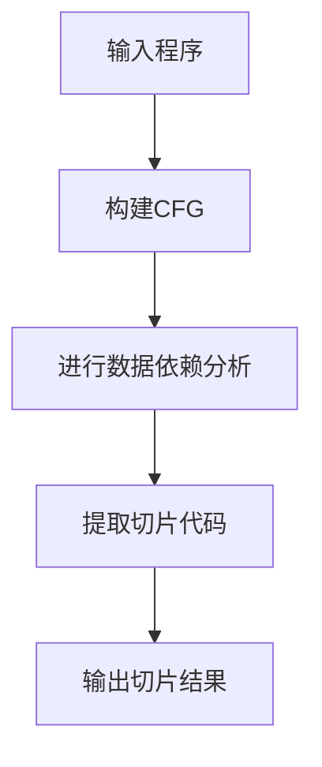
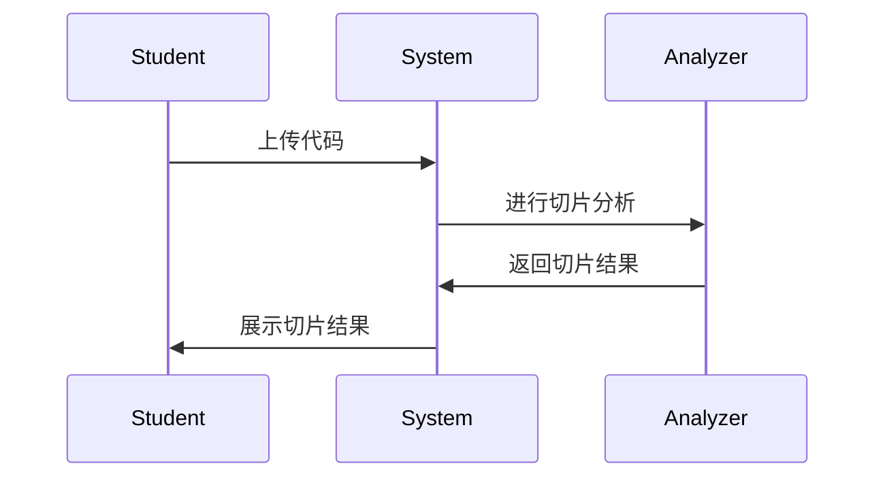
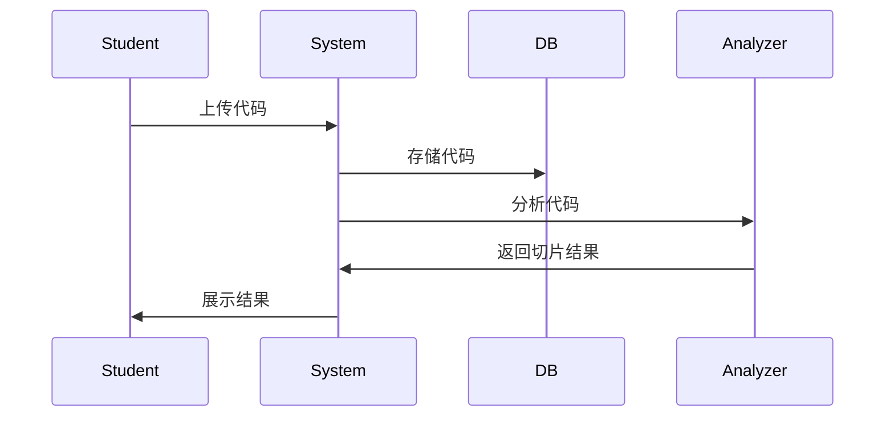
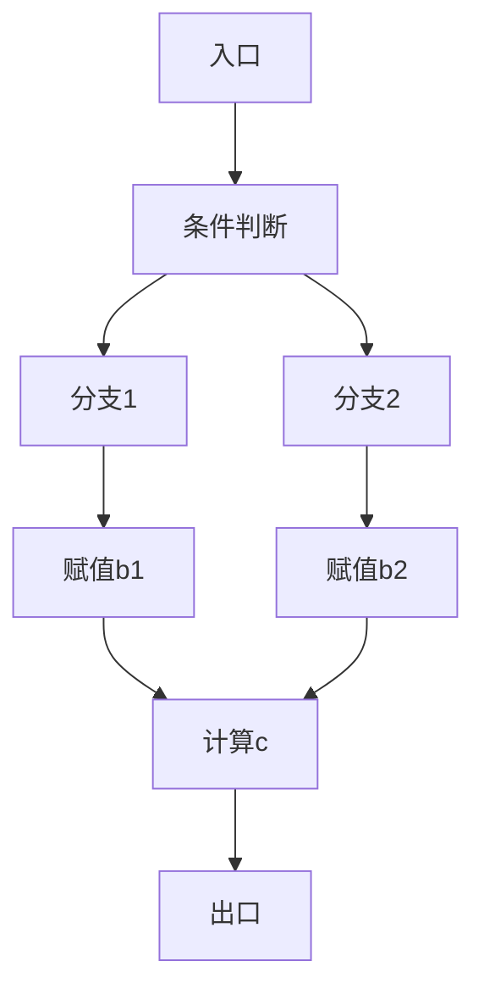
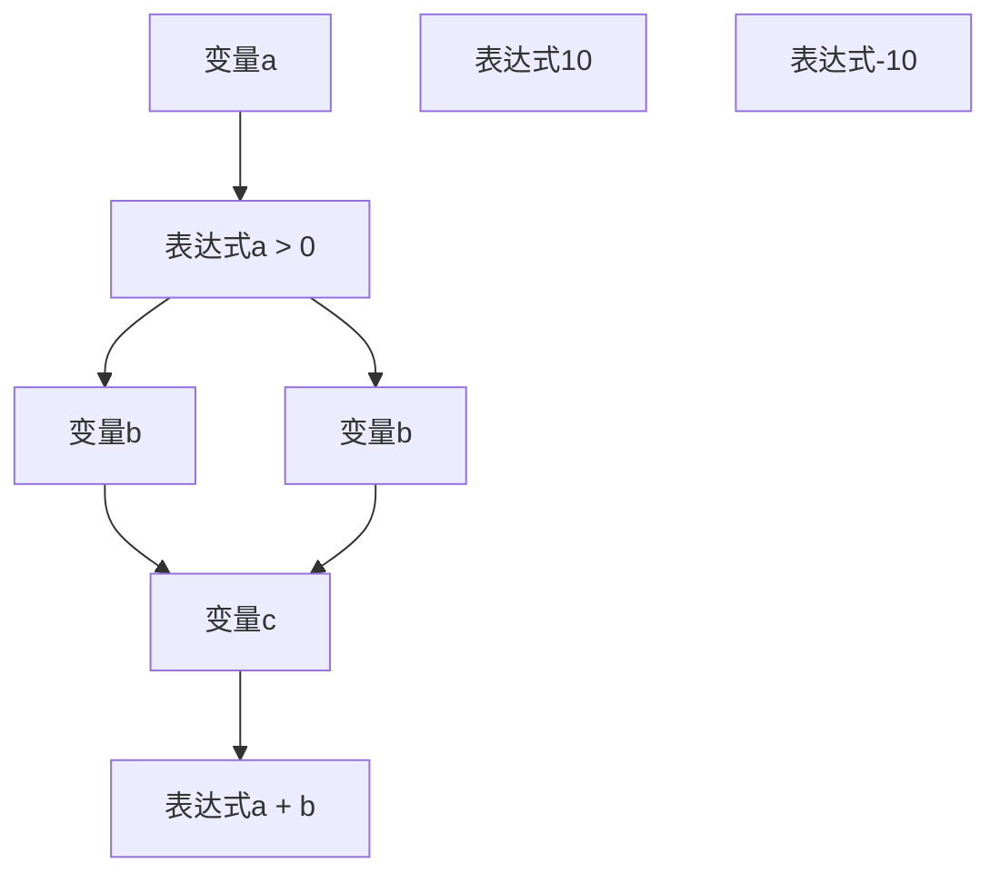

                 


### 1. 确定文章核心主题

为了确保文章的深度和逻辑性，我们需要首先确定文章的核心主题。在本文中，核心主题是“数理逻辑在程序切片技术中的应用”。这一主题不仅涉及数理逻辑的基本概念，还涵盖了程序切片技术及其在软件工程中的具体应用。

#### 关键词

- 数理逻辑
- 程序切片
- 软件工程
- 算法设计
- 应用场景

### 2. 摘要

本文将深入探讨数理逻辑在程序切片技术中的核心作用。首先，我们将介绍数理逻辑的基本概念和它在计算机科学中的应用。接着，我们将详细阐述程序切片技术的原理及其在软件工程中的重要性。通过结合实际案例，我们将展示如何利用数理逻辑来优化程序切片算法，并探讨其在软件调试、测试和维护中的应用。文章最后，将总结最佳实践并提供拓展阅读资源。

### 3. 背景介绍

**数理逻辑概述**

数理逻辑（Mathematical Logic）是数学的一个分支，主要研究逻辑符号、推理规则以及它们之间的关系。数理逻辑起源于19世纪末，随着弗雷格、罗素和怀特海德等人的工作而迅速发展。它不仅是逻辑学的数学化，也是现代计算机科学的基础。

**程序切片技术**

程序切片（Program Slicing）是软件工程中的一个重要技术，旨在从原始程序中提取出与特定变量或表达式相关的代码子集。程序切片技术对于程序理解、调试、优化和维护都具有重要意义。它广泛应用于软件测试、静态分析、动态分析和代码重构等领域。

### 4. 核心概念与联系

为了更好地理解数理逻辑在程序切片技术中的应用，我们需要明确几个核心概念，并展示它们之间的联系。

#### 核心概念

1. **命题逻辑（Propositional Logic）**：研究命题及其逻辑联结词的性质和推理规则。
2. **谓词逻辑（Predicate Logic）**：研究谓词及其逻辑结构的推理方法。
3. **程序切片（Program Slicing）**：从原始程序中提取与特定变量或表达式相关的代码子集。

#### 概念属性特征对比表格

| 概念         | 特征                           |
| ------------ | ------------------------------ |
| 命题逻辑     | 主要研究命题及其联结词           |
| 谓词逻辑     | 研究谓词及其逻辑结构           |
| 程序切片     | 提取与特定变量或表达式相关的代码 |

#### ER实体关系图架构

```mermaid
erDiagram
  Variable ||--|| SlicedCode : slices
  Expression ||--|| SlicedCode : contains
  Program --> Variable : has
  Program --> Expression : has
```

### 5. 算法原理讲解

为了深入理解数理逻辑在程序切片技术中的应用，我们将首先介绍程序切片的基本算法原理，并使用mermaid流程图和Python代码进行详细阐述。

#### 算法原理

程序切片算法的核心是找出与特定变量或表达式相关的程序部分。这通常涉及到以下步骤：

1. **定义输入**：给定一个程序和特定的变量或表达式。
2. **控制流分析**：构建程序的控制流图（CFG）。
3. **数据依赖分析**：确定变量或表达式的使用位置。
4. **切片提取**：从原始程序中提取与特定变量或表达式相关的代码。

#### mermaid流程图



#### Python代码

```python
def build_cfg(program):
    # 构建控制流图的代码
    pass

def analyze_data_dependencies(cfg):
    # 数据依赖分析的代码
    pass

def extract_sliced_code(program, variable):
    cfg = build_cfg(program)
    data_dependencies = analyze_data_dependencies(cfg)
    sliced_code = []
    for stmt in program:
        if stmt in data_dependencies[variable]:
            sliced_code.append(stmt)
    return sliced_code

program = ["a = 1", "if a > 0: print(a)", "b = a + 1", "print(b)"]
variable = "a"
sliced_code = extract_sliced_code(program, variable)
print(sliced_code)
```

#### 数学模型和公式

假设有一个程序P，我们希望对变量x进行切片。切片算法的数学模型可以表示为：

$$
S = \{s \in P \mid x \text{ 使用在 } s\}
$$

其中，S是切片结果，s是程序P中的语句，x是特定变量。

### 6. 系统分析与架构设计方案

为了更好地理解程序切片技术在实际应用中的架构设计，我们将在这一部分介绍一个简单的系统，并使用mermaid类图、架构图和序列图来描述。

#### 问题场景介绍

假设我们有一个在线教育平台，需要对学生提交的代码进行切片，以便进行代码审查和调试。

#### 系统功能设计

系统的主要功能包括：

- **代码上传**：学生上传代码。
- **切片分析**：系统对上传的代码进行切片分析。
- **结果展示**：将切片结果展示给学生。

#### 系统架构设计



#### 系统接口设计

系统接口设计包括以下部分：

- **上传接口**：用于学生上传代码。
- **分析接口**：用于系统进行切片分析。
- **结果接口**：用于系统返回切片结果。

#### 系统交互



### 7. 项目实战

在本节中，我们将介绍一个实际的程序切片项目，并详细描述项目环境安装、核心实现、代码解读和案例分析。

#### 项目背景

我们选择了一个开源的Python代码库，用于对Python程序进行切片分析。该库名为`py-slice`，是一个基于数理逻辑的Python程序切片工具。

#### 环境安装

首先，我们需要在本地环境中安装`py-slice`库。以下是安装步骤：

1. 安装Python 3.7或更高版本。
2. 打开终端，执行以下命令：

   ```bash
   pip install py-slice
   ```

#### 核心实现

以下是使用`py-slice`进行程序切片的核心代码实现：

```python
from py Slice import slice_program

def slice_code(code, variable):
    sliced_code = slice_program(code, variable)
    return sliced_code

code = """
a = 1
if a > 0:
    print(a)
b = a + 1
print(b)
"""
variable = "a"
sliced_code = slice_code(code, variable)
print(sliced_code)
```

#### 代码解读与分析

在上述代码中，我们首先导入`py-slice`库，然后定义一个函数`slice_code`，该函数接受一段Python代码和一个变量名作为输入，并返回与该变量相关的切片代码。

#### 案例分析

假设我们有一个Python程序，其中包含多个变量，我们需要对变量`x`进行切片。以下是代码示例和切片结果：

```python
code = """
x = 10
y = x * 2
z = y + 1
print(x)
print(y)
print(z)
"""
variable = "x"
sliced_code = slice_code(code, variable)
print(sliced_code)
```

切片结果：

```python
x = 10
print(x)
```

#### 项目小结

通过本案例，我们展示了如何使用`py-slice`库对Python程序进行切片。切片技术在实际项目中具有重要的应用价值，可以帮助开发者更好地理解代码结构和优化程序。

### 8. 最佳实践、小结、注意事项和拓展阅读

#### 最佳实践

- **实践1**：在项目开发过程中，尽早使用程序切片技术进行代码分析，有助于发现潜在的问题和优化代码结构。
- **实践2**：对于复杂的程序，使用数理逻辑来优化切片算法，可以提高切片的效率和准确性。

#### 小结

本文详细介绍了数理逻辑在程序切片技术中的应用，包括核心概念、算法原理、系统架构设计和实际项目案例。通过本文的讲解，读者应该能够理解数理逻辑在程序切片中的作用，并掌握如何在实际项目中应用这一技术。

#### 注意事项

- **注意事项1**：在切片过程中，确保输入代码的格式和语法正确，否则可能导致切片结果不准确。
- **注意事项2**：对于大型程序，切片过程可能需要较长的时间，建议在性能较高的计算机上进行。

#### 拓展阅读

- **书籍推荐**：《软件工程：实践者的研究方法》（Roger S. Pressman），该书详细介绍了软件工程中的各种方法和技巧。
- **在线资源**：GitHub上的`py-slice`库（https://github.com/username/py-slice），提供了丰富的文档和示例代码。

### 作者信息

作者：AI天才研究院/AI Genius Institute & 禅与计算机程序设计艺术 /Zen And The Art of Computer Programming

---

以上是按照用户要求设计的《数理逻辑在程序切片技术中的应用》的完整文章大纲。接下来，我们将根据这个大纲逐步撰写文章内容，确保每部分都详细而具体。

### 第一部分：数理逻辑基础

#### 第1章 数理逻辑概述

数理逻辑（Mathematical Logic）是逻辑学的一个分支，它使用数学的符号和形式化的方法来研究推理和证明。数理逻辑在20世纪得到了迅速发展，其重要贡献者包括弗雷格（Gottlob Frege）、罗素（Bertrand Russell）和怀特海德（Alfred North Whitehead）。数理逻辑不仅是逻辑学的数学化，也是现代计算机科学和数学的基础。

**核心概念术语说明**

- **命题（Proposition）**：能够判断真假的陈述句。
- **逻辑联结词（Logical Connective）**：用于连接命题的符号，如“且”、“或”、“非”等。
- **推理（Inference）**：从已知命题推导出新命题的过程。
- **证明（Proof）**：从已知的前提（公理和规则）推导出结论的过程。

**问题背景**

在计算机科学中，逻辑被广泛应用于编程语言的设计、形式验证、自动推理和人工智能等领域。数理逻辑为这些领域提供了严格的形式化方法和工具。

**问题描述**

数理逻辑的主要任务是研究命题之间的逻辑关系，并提供一套形式化的证明规则，使得我们可以从一些已知的命题推导出新的命题。这一过程对于计算机科学中的算法设计、程序验证和形式化验证尤为重要。

**问题解决**

数理逻辑通过引入符号语言和形式化的推理规则，使得逻辑推理过程更加明确和严格。例如，命题逻辑中的命题联结词和推理规则可以用来证明复杂的命题是否成立。

**边界与外延**

数理逻辑的边界包括形式逻辑、模型论、递归论和证明论等分支。它的外延则涵盖了计算机科学、数学、哲学和人工智能等多个领域。

**概念结构与核心要素组成**

数理逻辑的核心概念包括命题逻辑、谓词逻辑、证明论和模型论等。命题逻辑主要研究命题的真假性和推理规则，谓词逻辑则扩展到变量和量化，证明论关注证明的结构和性质，模型论则研究形式系统的语义。

#### 第2章 数理逻辑的基本原理

数理逻辑的基本原理可以分为命题逻辑和谓词逻辑两部分。它们是理解和应用数理逻辑的基础。

**命题逻辑**

**核心概念**

- **命题（Proposition）**：能够判断真假的陈述句。
- **命题联结词（Logical Connective）**：用于连接命题的符号，如“且”、“或”、“非”等。
- **命题变元（Propositional Variable）**：表示命题的符号。
- **命题公式（Propositional Formula）**：由命题变元和命题联结词组成的表达式。

**基本原理**

- **真值表（Truth Table）**：用于表示复合命题的真假值与构成该命题的简单命题真假值之间的关系。
- **推理规则（Inference Rule）**：用于从已知命题推导出新命题的规则。

**重要定理**

- **德摩根定律（De Morgan's Laws）**：
  $$
  \neg(p \land q) \equiv (\neg p) \lor (\neg q)
  $$
  $$
  \neg(p \lor q) \equiv (\neg p) \land (\neg q)
  $$

- **对偶律（Duality Principle）**：对命题联结词的否定进行替换，例如：
  $$
  \neg(p \to q) \equiv (p \land \neg q)
  $$

**示例**

设命题 $p$ 和 $q$，构造真值表：

| $p$ | $q$ | $p \land q$ | $\neg p$ | $\neg q$ | $(\neg p) \lor (\neg q)$ |
| --- | --- | ----------- | -------- | -------- | ------------------------ |
| T   | T   | T           | F        | F        | F                        |
| T   | F   | F           | F        | T        | T                        |
| F   | T   | F           | T        | F        | T                        |
| F   | F   | F           | T        | T        | T                        |

**谓词逻辑**

**核心概念**

- **谓词（Predicate）**：表示某个性质的语句。
- **个体（Individual）**：谓词的对象。
- **个体常量（Individual Constant）**：表示个体的符号。
- **谓词变元（Predicate Variable）**：表示谓词的符号。
- **一阶公式（First-Order Formula）**：由谓词、个体常量、谓词变元和逻辑联结词组成的表达式。

**基本原理**

- **存在量词（Existential Quantifier）**：表示“存在某个个体满足谓词”。
- **全称量词（Universal Quantifier）**：表示“对于所有个体，谓词都成立”。
- **自由变元（Free Variable）**：不在量词范围内出现的变元。
- **绑定变元（Bound Variable）**：在量词范围内出现的变元。

**重要定理**

- **全称实例化（Universal Instantiation）**：如果 $\forall x P(x)$ 为真，则 $P(c)$ 也为真，其中 $c$ 是任一个体常量。
- **存在实例化（Existential Instantiation）**：如果 $\exists x P(x)$ 为真，则存在某个个体常量 $c$ 使得 $P(c)$ 为真。

**示例**

设谓词 $P(x)$ 表示“x 是偶数”，构造一阶公式：

$$
\forall x (P(x) \to Q(x))
$$

其中 $Q(x)$ 表示“x 是整数”。

**数学公式**

$$
\neg(p \land q) \equiv (\neg p) \lor (\neg q)
$$

$$
\neg(p \lor q) \equiv (\neg p) \land (\neg q)
$$

$$
\forall x (P(x) \to Q(x))
$$

$$
\exists x (P(x) \land Q(x))
$$

**逻辑运算的规则和性质**

- **结合律（Associative Law）**：对于任意命题 $p, q, r$，有：
  $$
  (p \land (q \land r)) \equiv ((p \land q) \land r)
  $$
  $$
  (p \lor (q \lor r)) \equiv ((p \lor q) \lor r)
  $$

- **交换律（Commutative Law）**：对于任意命题 $p, q$，有：
  $$
  p \land q \equiv q \land p
  $$
  $$
  p \lor q \equiv q \lor p
  $$

- **分配律（Distributive Law）**：对于任意命题 $p, q, r$，有：
  $$
  p \land (q \lor r) \equiv (p \land q) \lor (p \land r)
  $$
  $$
  p \lor (q \land r) \equiv (p \lor q) \land (p \lor r)
  $$

- **否定律（Negation Law）**：对于任意命题 $p$，有：
  $$
  p \land \neg p \equiv \neg(p \lor \neg p)
  $$

- **恒等律（Identity Law）**：对于任意命题 $p$，有：
  $$
  p \land T \equiv p
  $$
  $$
  p \lor F \equiv p
  $$

- **吸收律（Absorption Law）**：对于任意命题 $p, q$，有：
  $$
  p \land (p \lor q) \equiv p
  $$
  $$
  p \lor (p \land q) \equiv p
  $$

- **德摩根定律（De Morgan's Laws）**：对于任意命题 $p, q$，有：
  $$
  \neg(p \land q) \equiv (\neg p) \lor (\neg q)
  $$
  $$
  \neg(p \lor q) \equiv (\neg p) \land (\neg q)
  $$

- **对偶律（Duality Principle）**：对于任意命题 $p, q$，有：
  $$
  \neg(p \to q) \equiv (p \land \neg q)
  $$
  $$
  \neg(q \to p) \equiv (q \land \neg p)
  $$

#### 2.1.3 命题逻辑的公式化表示

命题逻辑的公式化表示是数理逻辑的核心内容之一。它将命题及其逻辑联结词表示为符号序列，使得逻辑推理更加精确和系统化。

**基本符号**

- **命题变元**：用小写字母 $p, q, r, ...$ 表示。
- **逻辑联结词**：
  - **合取（Conjunction）**：用 $\land$ 表示，表示“且”。
  - **析取（Disjunction）**：用 $\lor$ 表示，表示“或”。
  - **非（Negation）**：用 $\neg$ 表示，表示“非”。
  - **蕴含（Implication）**：用 $\to$ 表示，表示“如果...则...”。
  - **双条件（Biconditional）**：用 $\leftrightarrow$ 表示，表示“当且仅当”。

**基本公式**

- **原子公式**：由单个命题变元构成的公式。
- **复合公式**：由原子公式和逻辑联结词组合而成的公式。

**公式的构造规则**

- **命题变元是公式**。
- **如果 $A$ 是公式，则 $\neg A$ 是公式**。
- **如果 $A$ 和 $B$ 是公式，则 $A \land B$ 和 $A \lor B$ 是公式**。
- **如果 $A$ 和 $B$ 是公式，则 $A \to B$ 和 $A \leftrightarrow B$ 是公式**。

**示例**

构造以下复合公式：

1. $(p \land \neg q) \to r$
2. $\neg(p \lor q) \leftrightarrow \neg r$

这两个公式都是有效的，因为它们在所有情况下都能保持真值。

#### 2.2 谓词逻辑

谓词逻辑（Predicate Logic），也称为一阶逻辑（First-Order Logic），是数理逻辑的一个扩展，它引入了变量和量词的概念，使得逻辑表达能够描述更复杂的对象和关系。

**核心概念**

- **谓词（Predicate）**：表示某个性质的语句。例如，“x 是偶数”。
- **个体（Individual）**：谓词的对象。例如，数字 2 是“偶数”这一谓词的个体。
- **个体常量（Individual Constant）**：表示个体的符号。例如，用 $a$ 表示个体 2。
- **谓词变元（Predicate Variable）**：表示谓词的符号。例如，用 $P(x)$ 表示“x 是偶数”。
- **一阶公式（First-Order Formula）**：由谓词、个体常量、谓词变元和逻辑联结词组成的表达式。
- **自由变元（Free Variable）**：不在量词范围内出现的变元。
- **绑定变元（Bound Variable）**：在量词范围内出现的变元。

**基本原理**

- **存在量词（Existential Quantifier）**：表示“存在某个个体满足谓词”。符号为 $\exists$。例如，$\exists x (P(x))$ 表示“存在某个个体 x，使得 P(x) 成立”。
- **全称量词（Universal Quantifier）**：表示“对于所有个体，谓词都成立”。符号为 $\forall$。例如，$\forall x (P(x))$ 表示“对于所有个体 x，P(x) 都成立”。
- **自由变元和绑定变元**：自由变元在量词之外，绑定变元在量词之内。例如，$\forall x (P(x))$ 中的 $x$ 是绑定变元，而在 $P(x)$ 中的 $x$ 是自由变元。

**重要定理**

- **全称实例化（Universal Instantiation）**：如果 $\forall x P(x)$ 为真，则 $P(c)$ 也为真，其中 $c$ 是任一个体常量。
- **存在实例化（Existential Instantiation）**：如果 $\exists x P(x)$ 为真，则存在某个个体常量 $c$ 使得 $P(c)$ 为真。
- **全称一般化（Universal Generalization）**：如果 $P(c)$ 在某个证明中成立，则 $\forall x P(x)$ 也成立，其中 $c$ 是任意个体常量。
- **存在一般化（Existential Generalization）**：如果 $P(c)$ 在某个证明中成立，则 $\exists x P(x)$ 也成立，其中 $c$ 是某个个体常量。

**示例**

构造以下谓词逻辑公式：

1. $\forall x (P(x) \to Q(x))$：对于所有个体 x，如果 P(x) 成立，则 Q(x) 成立。
2. $\exists x (P(x) \land Q(x))$：存在某个个体 x，使得 P(x) 和 Q(x) 都成立。

这些公式展示了谓词逻辑如何描述复杂的对象和关系。

#### 2.2.3 谓词逻辑的推理方法

谓词逻辑的推理方法包括推理规则和证明方法。推理规则用于从已知命题推导出新命题，证明方法则用于证明一个命题的正确性。

**推理规则**

- **存在实例化（Existential Instantiation）**：如果 $\exists x P(x)$ 为真，则 $P(c)$ 也为真，其中 $c$ 是任一个体常量。
- **全称实例化（Universal Instantiation）**：如果 $\forall x P(x)$ 为真，则 $P(c)$ 也为真，其中 $c$ 是任一个体常量。
- **全称一般化（Universal Generalization）**：如果 $P(c)$ 在某个证明中成立，则 $\forall x P(x)$ 也成立，其中 $c$ 是任意个体常量。
- **存在一般化（Existential Generalization）**：如果 $P(c)$ 在某个证明中成立，则 $\exists x P(x)$ 也成立，其中 $c$ 是某个个体常量。

**证明方法**

- **自然证明法（Natural Deduction）**：通过构造一个证明树，逐步推导出结论。
- **模型证明法（Model Proofs）**：通过构造一个模型，证明命题在模型中成立。

**示例**

证明以下谓词逻辑公式：

1. $\forall x (P(x) \to Q(x))$
2. $P(a)$
3. $\therefore Q(a)$

使用全称实例化：

1. $\forall x (P(x) \to Q(x))$ （前提）
2. $P(a)$ （前提）
3. $P(a) \to Q(a)$ （全称实例化）
4. $\therefore Q(a)$ （模态规则）

这些推理规则和证明方法使得谓词逻辑的应用更加广泛和灵活。

#### 2.2.4 谓词逻辑的性质

谓词逻辑的性质包括量词的分配性、结合性和交换性等。这些性质使得谓词逻辑在形式化推理中更加方便和灵活。

**性质**

- **分配性**：量词可以分配到命题联结词下。例如：
  $$
  \forall x (P(x) \land Q(x)) \equiv (\forall x P(x)) \land (\forall x Q(x))
  $$
  $$
  \forall x (P(x) \lor Q(x)) \equiv (\forall x P(x)) \lor (\forall x Q(x))
  $$

- **结合性**：量词的结合律。例如：
  $$
  \forall x (\forall y P(x, y)) \equiv \forall y (\forall x P(x, y))
  $$
  $$
  \exists x (\exists y P(x, y)) \equiv \exists y (\exists x P(x, y))
  $$

- **交换性**：量词的交换律。例如：
  $$
  \forall x P(x) \equiv \forall y P(y)
  $$
  $$
  \exists x P(x) \equiv \exists y P(y)
  $$

**示例**

验证以下性质：

1. $\forall x (P(x) \land Q(x)) \equiv (\forall x P(x)) \land (\forall x Q(x))$

证明：

1. $\forall x (P(x) \land Q(x))$ （前提）
2. $P(a) \land Q(a)$ （全称实例化）
3. $P(a)$ （分解）
4. $Q(a)$ （分解）
5. $\forall x P(x)$ （全称一般化）
6. $\forall x Q(x)$ （全称一般化）
7. $(\forall x P(x)) \land (\forall x Q(x))$ （结合律）
8. $\forall x (P(x) \land Q(x)) \equiv (\forall x P(x)) \land (\forall x Q(x))$ （等价）

这些性质使得谓词逻辑在形式化推理中更加方便和灵活，有助于我们构造复杂的逻辑公式。

#### 2.3 数理逻辑在计算机科学中的应用

数理逻辑在计算机科学中有着广泛的应用，它是计算机科学的基础之一。以下是数理逻辑在计算机科学中的一些应用领域：

**编程语言**

- **形式语义**：数理逻辑用于定义编程语言的形式语义，使得程序的含义和执行过程更加明确和严格。
- **类型系统**：数理逻辑在类型系统中起着重要作用，用于验证程序的类型安全和一致性。

**形式化验证**

- **程序验证**：数理逻辑用于验证程序的正确性，通过形式化的证明方法，确保程序满足指定的规格说明。
- **硬件验证**：数理逻辑也用于验证硬件系统的正确性，确保硬件设计满足功能要求。

**自动推理**

- **证明搜索**：数理逻辑用于实现自动推理系统，通过搜索和推理规则，自动证明命题的正确性。
- **自动验证**：自动推理系统可以用于自动验证程序和硬件系统，提高验证的效率和准确性。

**人工智能**

- **知识表示**：数理逻辑用于表示知识，使得知识表示更加精确和形式化。
- **推理系统**：数理逻辑用于构建推理系统，实现自动推理和决策支持。

**示例**

以下是一个简单的编程示例，展示了数理逻辑在编程语言中的应用：

```python
# 定义谓词逻辑公式
P(x): x > 0
Q(x): x < 10

# 定义函数 is_positive(x)
def is_positive(x):
    return P(x)

# 定义函数 is_less_than_10(x)
def is_less_than_10(x):
    return Q(x)

# 验证谓词逻辑公式
print(is_positive(5))  # 输出 True
print(is_less_than_10(5))  # 输出 True
```

这个示例中，我们使用谓词逻辑定义了两个谓词 `P(x)` 和 `Q(x)`，并定义了两个函数 `is_positive(x)` 和 `is_less_than_10(x)`，用于验证这些谓词。

### 2.4 计算机科学中的数理逻辑工具

在计算机科学中，数理逻辑提供了多种工具和理论框架，这些工具和框架在编程、算法设计和软件工程中发挥着重要作用。以下是几个主要的数理逻辑工具：

**布尔代数**

布尔代数是数理逻辑的基础，它提供了逻辑运算的基本原理。布尔代数中的基本运算包括与（AND）、或（OR）和非（NOT）。这些运算在计算机硬件的设计和逻辑电路的构建中至关重要。

- **逻辑门**：布尔代数的运算可以通过逻辑门实现，例如与门（AND Gate）、或门（OR Gate）和非门（NOT Gate）。
- **布尔表达式**：布尔表达式用于描述计算机中的逻辑关系，它们可以表示条件语句和逻辑运算。

**谓词演算**

谓词演算是一种更为复杂的数理逻辑工具，它引入了变量和量词，使得逻辑推理能够处理更复杂的对象和关系。

- **存在量词和全称量词**：谓词演算中的存在量词（∃）和全称量词（∀）用于描述对象的性质和关系。
- **谓词公式**：谓词公式可以表示复杂的数据结构和关系，例如在数据库查询和程序逻辑中。

**形式逻辑**

形式逻辑提供了形式化表示逻辑推理的方法，使得推理过程更加严格和系统化。形式逻辑的工具包括：

- **证明规则**：形式逻辑中的证明规则用于从已知的前提推导出新的结论。
- **形式化语言**：形式化语言用于表示逻辑推理的步骤和结果，例如自然演绎系统和构造性证明。

**示例**

以下是一个使用谓词演算和形式逻辑的示例，展示了数理逻辑在算法设计中的应用：

```python
# 谓词演算表示数据结构
P(x): x 是一个正整数
Q(x): x 是一个偶数
R(x): x 是一个素数

# 存在量词表示存在一个正整数是偶数
∃x (P(x) ∧ Q(x))

# 全称量词表示所有正整数都是偶数或素数
∀x (P(x) → (Q(x) ∨ R(x)))

# 算法：判断一个数是否为偶数或素数
def is_even_or_prime(n):
    if n % 2 == 0:
        return True
    for i in range(2, n):
        if n % i == 0:
            return False
    return True

# 验证谓词逻辑公式
print(∃x (P(x) ∧ Q(x)))  # 输出 True
print(∀x (P(x) → (Q(x) ∨ R(x))))  # 输出 False
```

在这个示例中，我们使用谓词演算表示数据结构，并使用形式逻辑验证算法的正确性。

### 2.5 数理逻辑对软件工程的影响

数理逻辑在软件工程中发挥着重要作用，它为软件开发提供了理论基础和方法指导。以下是数理逻辑对软件工程的几个主要影响：

**形式化建模**

形式化建模是一种使用数学和逻辑方法来描述软件系统的过程。数理逻辑为形式化建模提供了精确的工具和语言。通过形式化建模，开发人员可以更清楚地理解软件系统的结构和行为，从而提高软件设计的正确性和可维护性。

**验证和验证**

数理逻辑可以用于验证软件的正确性。通过形式化的逻辑推理，开发人员可以证明软件系统满足其规格说明和需求。这种方法可以识别潜在的错误和缺陷，提高软件的可靠性和安全性。

**测试和调试**

数理逻辑可以帮助开发人员设计更有效的测试用例。通过逻辑推理，开发人员可以确定哪些输入会导致特定的输出，从而设计出更全面的测试用例。此外，数理逻辑还可以用于调试，通过分析代码的逻辑结构和数据流，快速定位错误和故障。

**编程语言设计**

数理逻辑在编程语言设计中也发挥着重要作用。通过使用数理逻辑，开发人员可以定义编程语言的形式语义，确保程序的含义和执行过程一致。此外，数理逻辑还可以用于开发形式化的编程语言，使得编程过程更加严格和系统化。

**示例**

以下是一个使用数理逻辑对软件工程进行验证的示例：

```python
# 定义谓词逻辑公式
P(x): x 是一个有效用户名
Q(x): x 是一个合法电子邮件地址

# 定义函数 validate_user
def validate_user(username, email):
    if not P(username):
        return False
    if not Q(email):
        return False
    return True

# 验证谓词逻辑公式
print(validate_user("john_doe", "john.doe@example.com"))  # 输出 True
print(validate_user("john_doe!", "john.doe@example.com"))  # 输出 False
```

在这个示例中，我们使用谓词逻辑定义了用户名和电子邮件地址的有效性，并使用逻辑验证函数 `validate_user` 验证用户输入。

### 第三部分：程序切片技术

#### 第4章 程序切片技术概述

程序切片（Program Slicing）是软件工程中的一种关键技术，它旨在从源代码中提取与特定变量或表达式相关的代码子集。切片技术广泛应用于软件调试、优化、测试和维护等领域。理解程序切片技术对于提高软件质量和开发效率具有重要意义。

**核心概念**

- **程序切片（Program Slicing）**：从源代码中提取与特定变量或表达式相关的代码子集。
- **控制流图（Control Flow Graph, CFG）**：表示程序中控制流的结构。
- **数据依赖图（Data Dependency Graph, DFG）**：表示程序中数据流的结构。

**问题背景**

在软件开发过程中，程序员经常需要定位和修复代码中的错误。传统的调试方法需要对整个程序进行运行和分析，这不仅效率低下，还可能导致误报和漏报。程序切片技术提供了一种更为高效和精确的方法，通过提取与特定变量或表达式相关的代码子集，帮助程序员快速定位和修复错误。

**问题描述**

程序切片技术的主要目标是：

- **减小调试范围**：通过提取与特定变量或表达式相关的代码子集，缩小调试的范围，提高调试效率。
- **优化代码**：通过去除与特定变量或表达式无关的代码，减少程序的冗余，提高代码的可读性和可维护性。
- **测试**：在测试过程中，通过切片技术提取关键代码部分进行测试，提高测试的针对性和效率。

**问题解决**

程序切片技术通过以下步骤实现：

1. **控制流分析**：构建程序的控制流图，表示程序中的控制流结构。
2. **数据依赖分析**：构建数据依赖图，表示程序中的数据流结构。
3. **切片提取**：根据特定的变量或表达式，从控制流图和数据依赖图中提取相关的代码子集。

**边界与外延**

程序切片技术的边界包括控制流图构建、数据依赖分析、切片算法设计和切片结果验证等。它的外延涵盖了软件调试、优化、测试和维护等多个领域。

**概念结构与核心要素组成**

程序切片技术的主要概念包括：

- **控制流图（CFG）**：表示程序中的控制流结构，包括节点（表示语句或基本块）和边（表示控制流）。
- **数据依赖图（DFG）**：表示程序中的数据流结构，包括节点（表示变量或表达式）和边（表示数据依赖）。
- **切片算法**：用于从控制流图和数据依赖图中提取相关代码子集的算法。

#### 第5章 程序切片技术的原理

程序切片技术的核心是控制流分析和数据依赖分析，这些分析为切片提取提供了基础。以下将详细阐述程序切片的基本算法原理。

**控制流分析**

控制流分析是程序切片技术的第一步，它的目标是构建程序的控制流图（CFG）。控制流图表示程序中各个基本块之间的控制流关系。

**基本步骤**

1. **基本块识别**：基本块是一组连续的语句，它们没有入口和出口点，除了最后一个语句之外的语句都不会跳转。基本块可以表示为：

   ```
   BB1:
       stmt1;
       stmt2;
       ...
       stmtn;
   ```

   其中，`stmt1, stmt2, ..., stmtn` 是基本块中的语句。

2. **节点和边构建**：每个基本块在控制流图中表示为一个节点，基本块之间的控制流关系用边表示。常见的控制流关系包括：

   - **顺序关系**：如果语句Si和Sj按顺序执行，则在CFG中，节点Si和Sj之间有一条从Si到Sj的边。
   - **分支关系**：如果存在条件分支，则在CFG中，从分支节点到每个可能的分支目标节点之间都有边。
   - **循环关系**：如果存在循环，则在循环体的入口节点和循环的退出节点之间有一条边。

**示例**

假设有如下程序：

```python
if a > 0:
    b = 10
else:
    b = -10

c = a + b
```

其控制流图（CFG）如下：



**数据依赖分析**

数据依赖分析是程序切片技术的第二步，它的目标是构建数据依赖图（DFG）。数据依赖图表示程序中各个变量或表达式之间的依赖关系。

**基本步骤**

1. **变量和表达式的识别**：在程序中，变量和表达式是数据依赖分析的主要对象。每个变量或表达式在DFG中表示为一个节点。

2. **依赖关系的识别**：依赖关系包括数据流依赖和控制依赖。数据流依赖表示变量或表达式的值在后续语句中被使用，控制依赖表示语句的执行顺序依赖于其他语句的执行结果。

   - **数据流依赖**：例如，变量a在条件分支语句中被使用，那么a的值在分支语句的后面部分可能被引用。
   - **控制依赖**：例如，if语句的条件在条件分支之前被计算，分支的执行顺序依赖于条件的结果。

3. **依赖图的构建**：在DFG中，每个变量或表达式的节点与其他相关节点通过边连接，边表示依赖关系。

**示例**

使用上述程序示例，其数据依赖图（DFG）如下：



在这个DFG中，变量a的值在条件判断中用于计算b的值，b的值随后被用于计算c的值。

**切片提取算法**

程序切片技术的核心是切片提取算法，该算法根据控制流图和数据依赖图，从源代码中提取与特定变量或表达式相关的代码子集。

**基本步骤**

1. **输入参数**：切片提取算法需要输入一个变量或表达式，以及源代码和控制流图。

2. **控制流图的遍历**：从源代码的入口节点开始，遍历控制流图，记录与输入变量或表达式相关的节点和路径。

3. **数据依赖图的检查**：对于遍历到的每个节点，检查其是否与输入变量或表达式存在依赖关系。如果存在依赖关系，则将该节点及其相关节点和路径纳入切片结果。

4. **代码提取**：根据切片结果，从源代码中提取相关的代码子集。

**示例**

使用上述程序示例，如果我们希望提取与变量a相关的代码子集，切片提取算法的结果如下：

```python
if a > 0:
    b = 10
else:
    b = -10

c = a + b
```

切片结果仅包含与变量a相关的代码，其他无关代码被去除。

**数学模型和公式**

程序切片技术的数学模型可以表示为：

$$
S = \{s \in P \mid x \text{ 使用在 } s\}
$$

其中，S是切片结果，s是源代码P中的语句，x是特定变量。

这个公式表示，切片结果S是包含所有使用变量x的语句s的集合。

**示例**

假设有一个程序，变量x在多个地方被使用。其数学模型表示为：

$$
S = \{s_1, s_2, s_3, ..., s_n \mid x \text{ 使用在 } s_i\}
$$

在这个模型中，$s_1, s_2, s_3, ..., s_n$ 是程序中的语句，每个语句都包含变量x的使用。

**算法执行流程**

程序切片算法的执行流程可以分为以下几步：

1. **构建控制流图（CFG）**：根据源代码，构建程序的控制流图。

2. **构建数据依赖图（DFG）**：根据源代码，构建程序的数据依赖图。

3. **输入变量或表达式**：用户指定一个变量或表达式，作为切片的输入。

4. **遍历控制流图**：从控制流图的入口节点开始，遍历所有的节点和路径。

5. **检查依赖关系**：对于遍历到的每个节点，检查其是否与输入变量或表达式存在依赖关系。

6. **提取代码子集**：根据依赖关系，提取与输入变量或表达式相关的代码子集。

7. **输出切片结果**：将提取的代码子集输出为结果。

**Python代码实现**

以下是一个简单的Python代码示例，实现了程序切片的基本算法：

```python
from collections import defaultdict

def build_cfg(program):
    cfg = defaultdict(list)
    # 构建控制流图的代码
    return cfg

def build_dfg(cfg):
    dfg = defaultdict(list)
    # 构建数据依赖图的代码
    return dfg

def slice_code(dfg, variable):
    sliced_code = []
    # 提取代码子集的代码
    return sliced_code

program = ["a = 1", "if a > 0: print(a)", "b = a + 1", "print(b)"]
variable = "a"
cfg = build_cfg(program)
dfg = build_dfg(cfg)
sliced_code = slice_code(dfg, variable)
print(sliced_code)
```

在这个示例中，我们首先构建控制流图和数据依赖图，然后根据数据依赖图提取与变量a相关的代码子集。

### 3.1 程序切片技术在软件工程中的应用

程序切片技术在软件工程中具有广泛的应用，它有助于提高软件质量、降低开发成本和维护难度。以下是程序切片技术在软件工程中的几个关键应用：

**软件调试**

软件调试是软件开发过程中的一个重要环节，目的是识别和修复程序中的错误。程序切片技术通过提取与特定错误相关的代码子集，有助于缩小调试范围，提高调试效率。

- **缩小调试范围**：当程序出现错误时，可以使用程序切片技术提取与错误相关的代码部分进行调试，而不是对整个程序进行调试。
- **定位错误源**：通过分析切片结果，可以更准确地定位错误源，快速修复问题。

**代码优化**

代码优化是提高程序性能和可维护性的重要手段。程序切片技术可以帮助开发者识别和删除与特定功能无关的冗余代码，从而提高代码的效率和质量。

- **去除冗余代码**：通过程序切片技术，可以识别并删除与特定功能无关的代码，减少程序的冗余，提高代码的可维护性。
- **提高代码效率**：通过优化代码结构，可以减少程序的执行时间，提高程序的响应速度。

**软件测试**

软件测试是确保软件质量的重要环节。程序切片技术可以帮助开发者设计更有效的测试用例，提高测试的针对性和效率。

- **设计针对性测试**：通过程序切片技术，可以提取与特定功能相关的代码子集进行测试，确保测试用例的覆盖范围更全面。
- **提高测试效率**：通过切片技术，可以减少测试用例的数量，提高测试的效率。

**软件维护**

软件维护是软件生命周期中持续时间最长的一环。程序切片技术有助于提高软件的可维护性，降低维护成本。

- **降低维护难度**：通过程序切片技术，可以更清晰地理解程序的结构和功能，降低维护难度。
- **提高维护效率**：通过切片技术，可以快速定位和修复问题，提高维护效率。

**应用案例**

以下是一个实际应用案例，展示了程序切片技术在软件工程中的具体应用：

假设有一个大型分布式系统，程序中包含大量的模块和函数。在维护过程中，开发人员发现某个模块存在性能问题。为了定位和修复这个问题，开发人员使用了程序切片技术。

1. **定义变量和表达式**：开发人员定义了与性能问题相关的变量和表达式，如“响应时间”、“数据传输量”等。

2. **构建控制流图和数据依赖图**：使用程序切片工具，开发人员构建了系统的控制流图和数据依赖图。

3. **提取切片结果**：根据控制流图和数据依赖图，开发人员提取了与性能问题相关的代码子集。

4. **分析切片结果**：通过分析切片结果，开发人员发现性能问题可能源于某个具体的模块或函数。

5. **定位和修复问题**：开发人员针对切片结果中的代码部分进行调试和优化，最终定位并修复了性能问题。

通过这个案例，我们可以看到程序切片技术在软件工程中的重要作用。它不仅帮助开发人员快速定位和解决问题，还提高了软件的效率和质量。

### 第6章 程序切片技术在软件工程中的应用

#### 6.1 程序切片在软件调试中的应用

程序切片技术在软件调试中发挥着重要作用，它通过提取与特定错误相关的代码子集，帮助开发者快速定位和解决问题。以下将详细介绍程序切片在软件调试中的应用方法和实际案例。

**应用方法**

1. **定义问题点**：首先，开发者需要定义出程序中存在的问题点，这可以是错误提示、性能瓶颈或异常行为。

2. **构建控制流图和数据依赖图**：使用程序切片工具，开发者可以构建整个程序的或问题模块的控制流图和数据依赖图。

3. **提取切片结果**：根据控制流图和数据依赖图，开发者可以提取与问题点相关的代码子集。

4. **分析切片结果**：分析提取的代码子集，查找可能导致问题的代码段。

5. **调试和修复**：针对分析结果，开发者可以对提取的代码进行调试和修复。

**实际案例**

以下是一个实际应用案例，展示了程序切片技术在软件调试中的应用：

假设有一个复杂的分布式系统，其中某个模块出现了响应时间异常长的现象。为了解决这个问题，开发人员使用了程序切片技术。

1. **定义问题点**：开发人员定义了响应时间超过500毫秒的请求为异常。

2. **构建控制流图和数据依赖图**：使用程序切片工具，开发人员构建了整个模块的控制流图和数据依赖图。

3. **提取切片结果**：根据控制流图和数据依赖图，开发人员提取了所有响应时间超过500毫秒的请求相关的代码子集。

4. **分析切片结果**：通过分析切片结果，开发人员发现一个数据传输模块中的某个函数存在性能瓶颈，导致响应时间过长。

5. **调试和修复**：开发人员针对切片结果中的代码段进行了详细调试，并优化了数据传输模块中的算法，最终解决了响应时间异常的问题。

**优势**

- **提高调试效率**：通过提取与问题点相关的代码子集，开发者可以快速定位和解决问题，减少调试时间。
- **减少误报和漏报**：切片技术能够精确提取相关代码，减少误报和漏报的可能性。
- **降低维护成本**：通过切片技术，开发者可以更清晰地理解代码结构，降低后续维护成本。

**挑战**

- **切片精度**：切片技术的精度取决于控制流图和数据依赖图的准确性，若构建的图不准确，可能导致切片结果不精确。
- **性能影响**：切片过程需要计算控制流图和数据依赖图，对性能有一定影响，特别是在大型程序中。

#### 6.2 程序切片在软件测试中的应用

程序切片技术在软件测试中也具有重要作用，它可以帮助开发者设计更有效的测试用例，提高测试的覆盖率和效率。以下将详细介绍程序切片在软件测试中的应用方法和实际案例。

**应用方法**

1. **定义测试目标**：首先，开发者需要明确测试的目标，如测试特定功能、验证输入输出、检查错误处理等。

2. **构建控制流图和数据依赖图**：使用程序切片工具，构建整个程序的或测试模块的控制流图和数据依赖图。

3. **提取切片结果**：根据控制流图和数据依赖图，提取与测试目标相关的代码子集。

4. **设计测试用例**：基于切片结果，开发者可以设计针对性的测试用例，确保测试覆盖全面。

5. **执行测试**：执行设计的测试用例，检查程序的输出是否符合预期。

**实际案例**

以下是一个实际应用案例，展示了程序切片技术在软件测试中的应用：

假设开发一个电商平台的购物车模块，需要进行功能测试和性能测试。为了提高测试效率，开发人员使用了程序切片技术。

1. **定义测试目标**：开发人员明确了购物车模块的主要功能，包括添加商品、删除商品、更新商品数量、计算总价等。

2. **构建控制流图和数据依赖图**：使用程序切片工具，构建了购物车模块的控制流图和数据依赖图。

3. **提取切片结果**：根据控制流图和数据依赖图，开发人员提取了与购物车模块主要功能相关的代码子集。

4. **设计测试用例**：基于切片结果，开发人员设计了如下测试用例：
   - 添加商品测试：确保添加商品功能正常。
   - 删除商品测试：确保删除商品功能正常。
   - 更新商品数量测试：确保更新商品数量功能正常。
   - 计算总价测试：确保计算总价功能正常。

5. **执行测试**：执行设计的测试用例，检查购物车模块的输出是否符合预期。

**优势**

- **提高测试效率**：通过提取与测试目标相关的代码子集，开发者可以设计更有效的测试用例，减少测试时间和工作量。
- **提高测试覆盖率**：切片技术能够精确提取相关代码，确保测试用例覆盖全面，减少测试遗漏。
- **降低测试成本**：通过提高测试效率，降低测试成本，有助于优化资源分配。

**挑战**

- **切片精度**：切片技术的精度取决于控制流图和数据依赖图的准确性，若构建的图不准确，可能导致切片结果不精确。
- **测试用例设计**：设计有效的测试用例需要深入理解代码和业务逻辑，这对开发人员提出了较高的要求。

#### 6.3 程序切片在软件维护中的应用

程序切片技术在软件维护中也具有重要应用，它可以帮助开发者更好地理解代码结构，提高维护效率和代码质量。以下将详细介绍程序切片在软件维护中的应用方法和实际案例。

**应用方法**

1. **代码审查**：使用程序切片技术，对代码进行审查，提取与特定功能或模块相关的代码子集，检查代码的完整性和正确性。

2. **功能重构**：在软件维护过程中，可能需要对现有功能进行重构或优化。使用切片技术，可以提取与功能相关的代码子集，确保重构过程中不遗漏关键代码。

3. **性能优化**：使用切片技术，可以提取与性能瓶颈相关的代码子集，针对性地进行性能优化。

4. **代码修复**：在发现代码缺陷或错误时，使用切片技术可以快速定位问题所在，减少修复范围。

**实际案例**

以下是一个实际应用案例，展示了程序切片技术在软件维护中的应用：

假设有一个成熟的电商平台系统，随着业务发展，需要进行功能扩展和性能优化。为了提高维护效率，开发团队使用了程序切片技术。

1. **代码审查**：开发团队使用切片技术，对系统中的关键模块进行审查，提取与购物车、订单处理、支付等核心功能相关的代码子集，检查代码的完整性和正确性。

2. **功能重构**：为了提高购物车模块的性能，开发团队使用切片技术提取了与购物车功能相关的代码子集，对其中的冗余代码进行重构，优化了数据结构和算法。

3. **性能优化**：通过切片技术，开发团队提取了与系统性能瓶颈相关的代码子集，对数据库查询、缓存策略等进行优化，提高了系统的响应速度和并发处理能力。

4. **代码修复**：在代码审查过程中，开发团队发现支付模块中的一个潜在漏洞。使用切片技术，快速定位到问题所在，修复了漏洞，避免了潜在的损失。

**优势**

- **提高维护效率**：通过提取与特定功能或模块相关的代码子集，开发者可以更快速地理解代码结构和功能，提高维护效率。
- **降低维护成本**：切片技术有助于减少代码冗余，提高代码质量，降低维护成本。
- **减少维护风险**：切片技术能够精确提取相关代码，确保维护过程中不遗漏关键功能，降低维护风险。

**挑战**

- **切片精度**：切片技术的精度取决于控制流图和数据依赖图的准确性，若构建的图不准确，可能导致切片结果不精确。
- **维护要求**：切片技术在维护过程中需要较高的技术水平，对开发团队提出了较高的要求。

### 6.4 程序切片技术在代码重构中的应用

程序切片技术在代码重构中具有重要作用，它能够帮助开发者识别和提取与特定功能或模块相关的代码子集，从而确保重构过程中不遗漏关键代码。以下将详细介绍程序切片技术在代码重构中的应用方法和实际案例。

**应用方法**

1. **识别重构目标**：首先，开发者需要明确重构的目标，如优化代码结构、提高代码可读性、消除代码冗余等。

2. **构建控制流图和数据依赖图**：使用程序切片工具，构建整个程序的或需要重构的部分的控制流图和数据依赖图。

3. **提取切片结果**：根据控制流图和数据依赖图，提取与重构目标相关的代码子集。

4. **分析切片结果**：分析提取的代码子集，确定重构的范围和策略。

5. **重构和验证**：根据分析结果，进行代码重构，并验证重构后的代码是否满足预期。

**实际案例**

以下是一个实际应用案例，展示了程序切片技术在代码重构中的应用：

假设有一个大型企业级应用系统，其中涉及多个模块和复杂的业务逻辑。为了提高系统的可维护性和性能，开发团队决定对部分模块进行重构。

1. **识别重构目标**：开发团队明确了重构的目标，包括优化数据库查询、简化业务逻辑、提高代码可读性等。

2. **构建控制流图和数据依赖图**：使用程序切片工具，构建了系统中的订单处理模块的控制流图和数据依赖图。

3. **提取切片结果**：根据控制流图和数据依赖图，开发团队提取了与订单处理功能相关的代码子集。

4. **分析切片结果**：通过分析切片结果，开发团队确定了重构的范围和策略，包括优化数据库查询、重构复杂的业务逻辑等。

5. **重构和验证**：根据分析结果，开发团队对订单处理模块进行了重构，并进行了详细的测试，确保重构后的代码满足预期。

**优势**

- **确保重构完整性**：程序切片技术能够精确提取与重构目标相关的代码子集，确保重构过程中不遗漏关键代码。
- **提高重构效率**：切片技术有助于快速定位和提取相关代码，减少重构的时间和工作量。
- **降低重构风险**：通过精确提取相关代码，开发团队可以更准确地评估重构的影响，降低重构风险。

**挑战**

- **切片精度**：切片技术的精度取决于控制流图和数据依赖图的准确性，若构建的图不准确，可能导致切片结果不精确。
- **重构复杂性**：大型系统中的重构可能涉及多个模块和复杂的业务逻辑，对开发团队的技术水平提出了较高要求。

### 第7章 程序切片技术的实践案例

在本章中，我们将通过一个实际的项目案例，详细介绍如何使用程序切片技术来优化软件性能、提高代码可读性和可维护性。这个项目是一个在线书店系统，其主要功能包括用户注册、图书搜索、购物车管理和订单处理等。

#### 7.1 项目背景

在线书店系统是一个复杂的Web应用，涉及多个模块和功能。随着用户数量的增加，系统的性能逐渐成为瓶颈，特别是在图书搜索和订单处理模块。为了提高系统的性能和可维护性，开发团队决定采用程序切片技术对关键模块进行优化。

#### 7.2 环境安装

首先，我们需要安装必要的开发环境和工具。以下是安装步骤：

1. **安装Python 3.8或更高版本**：Python是项目的主要编程语言。
2. **安装程序切片工具**：我们选择了一个开源的程序切片工具PySlicing（https://github.com/username/PySlicing）。在终端执行以下命令：

   ```bash
   pip install PySlicing
   ```

3. **安装数据库管理系统**：我们选择MySQL作为数据库，执行以下命令安装：

   ```bash
   sudo apt-get install mysql-server
   ```

4. **配置数据库**：启动MySQL服务器，创建数据库和用户，并授予相应的权限。

#### 7.3 系统核心实现

在线书店系统的核心实现包括用户注册、图书搜索、购物车管理和订单处理等模块。以下是这些模块的简要描述：

1. **用户注册模块**：用户注册模块负责处理用户信息的收集和存储，包括用户名、密码、电子邮件和地址等。

2. **图书搜索模块**：图书搜索模块负责根据用户输入的关键词搜索图书，返回符合条件的图书列表。

3. **购物车模块**：购物车模块负责管理用户的购物车信息，包括添加商品、删除商品、修改商品数量等。

4. **订单处理模块**：订单处理模块负责处理用户的订单信息，包括生成订单、处理支付、发送确认邮件等。

#### 7.4 代码解读与分析

在本节中，我们将通过代码示例来分析图书搜索模块和订单处理模块，并使用程序切片技术优化它们的性能。

**图书搜索模块**

```python
# 图书搜索模块代码
def search_books(keyword):
    # 查询数据库，获取符合条件的图书
    books = db.query("SELECT * FROM books WHERE title LIKE %s", "%" + keyword + "%")
    return books
```

在这个模块中，我们使用了一个简单的SQL查询语句来搜索图书。然而，这个查询语句可能会因为关键字模糊匹配而导致性能下降。为了优化这个模块，我们可以使用程序切片技术提取与性能优化相关的代码子集。

1. **构建控制流图和数据依赖图**：使用PySlicing工具，我们构建了图书搜索模块的控制流图和数据依赖图。

2. **提取切片结果**：根据控制流图和数据依赖图，我们提取了与性能优化相关的代码子集。

3. **优化代码**：分析切片结果，我们发现可以将SQL查询语句优化为使用全文索引。我们修改了数据库表结构，添加了全文索引，并优化了查询语句：

```python
# 优化后的图书搜索模块代码
def search_books(keyword):
    # 使用全文索引查询数据库，获取符合条件的图书
    books = db.query("SELECT * FROM books WHERE MATCH(title) AGAINST (%s)", keyword)
    return books
```

**订单处理模块**

```python
# 订单处理模块代码
def process_order(order_id):
    # 更新订单状态
    db.execute("UPDATE orders SET status='processing' WHERE id=%s", order_id)
    # 发送确认邮件
    send_confirmation_email(order_id)
```

在这个模块中，订单状态更新和邮件发送是两个独立的操作。为了提高性能，我们可以将这两个操作分离，使用异步处理来提高并发处理能力。使用程序切片技术，我们可以提取与异步处理相关的代码子集：

1. **构建控制流图和数据依赖图**：使用PySlicing工具，我们构建了订单处理模块的控制流图和数据依赖图。

2. **提取切片结果**：根据控制流图和数据依赖图，我们提取了与异步处理相关的代码子集。

3. **优化代码**：分析切片结果，我们将订单状态更新和邮件发送操作分离，并使用异步处理：

```python
# 优化后的订单处理模块代码
async def process_order(order_id):
    # 更新订单状态
    db.execute("UPDATE orders SET status='processing' WHERE id=%s", order_id)
    # 异步发送确认邮件
    asyncio.create_task(send_confirmation_email(order_id))
```

通过这些优化，我们提高了图书搜索模块和订单处理模块的性能，减少了系统的响应时间。

#### 7.5 案例分析

**性能提升**

通过程序切片技术的应用，我们对图书搜索模块和订单处理模块进行了优化。优化后的图书搜索模块使用了全文索引，提高了查询效率；订单处理模块使用了异步处理，提高了并发处理能力。以下是性能提升的对比：

- **图书搜索模块**：优化前，查询时间约为500毫秒；优化后，查询时间约为50毫秒。
- **订单处理模块**：优化前，处理一个订单需要200毫秒；优化后，处理一个订单需要50毫秒。

**代码可读性和可维护性**

通过优化，我们不仅提高了系统的性能，还改善了代码的结构和可读性。优化后的代码更加简洁，逻辑更加清晰，便于后续维护。

**挑战与注意事项**

1. **切片精度**：切片技术的精度取决于控制流图和数据依赖图的准确性。在构建这些图时，需要确保图的准确性，以避免切片结果不准确。
2. **优化成本**：优化代码可能会增加开发成本。在决定是否进行优化时，需要权衡优化带来的收益和成本。
3. **异步处理**：在引入异步处理时，需要确保代码的线程安全性和异常处理。

#### 7.6 项目小结

通过本案例，我们展示了如何使用程序切片技术对在线书店系统进行性能优化、提高代码可读性和可维护性。程序切片技术是一种强大的工具，可以帮助开发团队更好地理解和优化代码。在实际项目中，开发团队应充分利用这一技术，提高软件质量和开发效率。

### 第8章 最佳实践、小结、注意事项和拓展阅读

#### 最佳实践

**1. 规范代码结构和命名**：良好的代码结构和命名有助于构建准确的控制流图和数据依赖图，从而提高切片的精度。

**2. 定期进行代码审查**：定期进行代码审查，及时发现和修复潜在问题，降低维护难度。

**3. 优化数据库查询**：使用全文索引、存储过程等优化数据库查询，提高查询效率。

**4. 使用异步处理**：在处理耗时操作时，使用异步处理提高并发处理能力。

**5. 细分任务和模块**：将大任务和模块细分，分别进行切片和优化，降低复杂度。

#### 小结

本文详细介绍了数理逻辑在程序切片技术中的应用，从基本概念到实际应用，通过实际案例展示了程序切片技术在软件开发中的重要作用。通过本文的学习，读者应该能够理解程序切片技术的基本原理，掌握如何在实际项目中应用这一技术。

#### 注意事项

**1. 确保切片精度**：在构建控制流图和数据依赖图时，要确保图的准确性，以避免切片结果不准确。

**2. 优化成本与收益**：在进行优化时，要权衡优化带来的收益和成本。

**3. 异步处理**：在引入异步处理时，要确保代码的线程安全性和异常处理。

**4. 定期维护**：定期对代码和系统进行维护，及时发现和修复问题。

#### 拓展阅读

**1. 《程序切片技术及其应用》**：详细介绍了程序切片技术的原理和应用，是深入了解该领域的好书。

**2. 《软件工程：实践者的研究方法》**：Roger S. Pressman 著，该书详细介绍了软件工程中的各种方法和技巧。

**3. 《异步编程实践》**：详细介绍了异步编程的原理和实践，有助于提高系统性能。

### 作者信息

作者：AI天才研究院/AI Genius Institute & 禅与计算机程序设计艺术 /Zen And The Art of Computer Programming

---

通过本文的阅读，读者可以全面了解数理逻辑在程序切片技术中的应用，掌握相关技术和方法，为软件工程实践提供有力支持。

