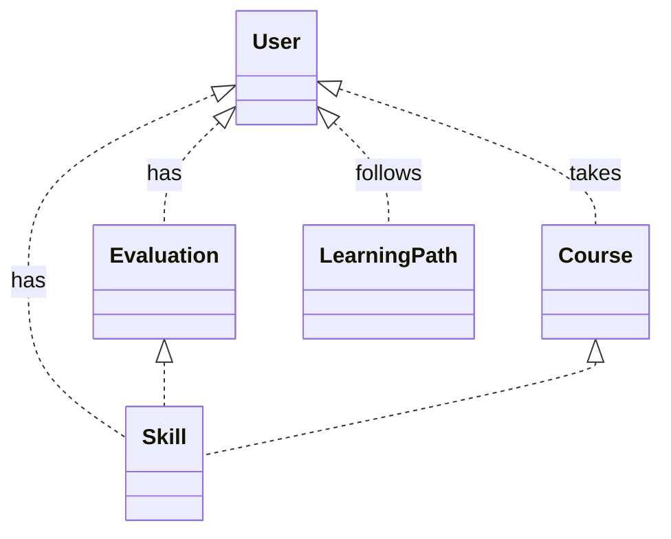
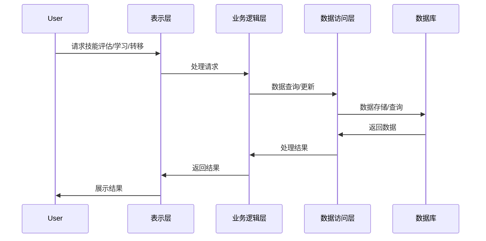
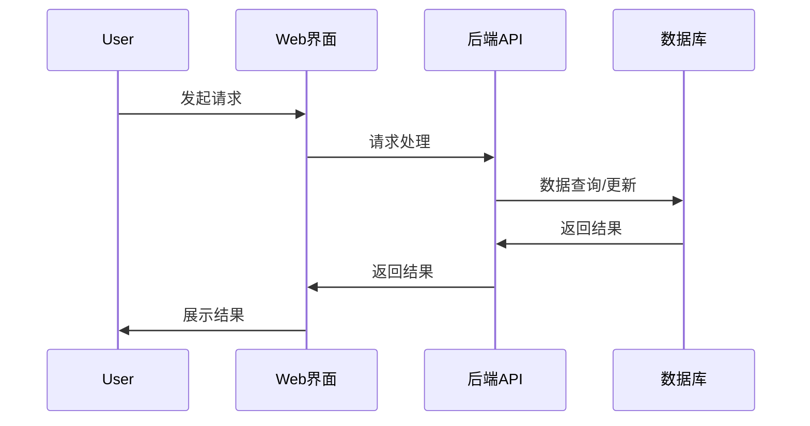

                 


### 一、背景介绍

#### 1.1 信息技术的发展背景

自20世纪中叶以来，信息技术（Information Technology，简称IT）迅猛发展，对人类社会产生了深远的影响。从最初的计算机科学基础，到网络技术的崛起，再到移动互联网、大数据、人工智能等新兴技术的广泛应用，信息技术的发展经历了多个阶段，每一次技术革新都为社会带来了新的机遇和挑战。

在计算机科学的早期，计算机主要应用于科学研究和军事领域。随着时间的发展，计算机性能不断提高，应用领域也逐渐扩展到商业、教育和日常生活。互联网的出现，进一步改变了信息传播和交流的方式，使得全球信息共享成为可能。进入21世纪，移动互联网的兴起，让信息触手可及，智能手机等移动设备成为人们生活中不可或缺的一部分。

#### 1.2 新技术对职业发展的挑战

新技术的快速迭代和应用，对职业发展带来了巨大的挑战。一方面，传统行业面临着技术淘汰的威胁，许多职业岗位可能被自动化和智能化取代。另一方面，新技术也催生了许多新兴职业，对从业者的技能要求越来越高。

首先，新技术的应用使得许多传统岗位变得过时。例如，随着云计算和大数据技术的发展，传统的IT基础设施建设和维护工作逐渐减少。而新兴的AI工程师、数据科学家等职业，则需要具备深厚的计算机科学和数学知识。

其次，新技术的应用也带来了新的职业机会。例如，人工智能的崛起，催生了智能机器人、自动驾驶汽车等新兴行业，为从业者提供了广阔的发展空间。然而，要胜任这些新兴职业，从业者需要不断学习和更新技能，以适应快速变化的市场需求。

#### 1.3 技能更新的必要性与紧迫性

在新技术不断涌现的时代，技能更新的必要性和紧迫性愈发凸显。首先，从个体发展的角度来看，技能更新有助于提高个人的竞争力，适应职业发展的需求。在一个充满不确定性的职场环境中，只有不断学习和更新技能，才能确保自身具备持续的市场价值。

其次，从企业发展的角度来看，技能更新有助于提升企业的创新能力和市场竞争力。在技术快速迭代的时代，企业需要具备快速响应市场变化的能力，而技能更新正是实现这一目标的关键。

此外，从社会发展的角度来看，技能更新有助于推动社会进步和经济增长。新技术的应用，不仅提高了生产效率，还带来了新的商业模式和就业机会，为社会创造了更多的价值。

总之，技能更新在新技术时代具有重要意义。它不仅关乎个体的发展，也关乎企业的兴衰和国家的繁荣。面对新技术带来的挑战，我们有必要制定有效的技能更新策略，以应对快速变化的市场环境。

#### 1.4 边界与外延：本书的核心主题

本书的核心主题是探讨新技术学习与技能更新策略。通过深入分析信息技术的发展背景、新技术对职业发展的挑战、技能更新的必要性与紧迫性，本书旨在为读者提供一套系统的技能更新策略和方法。

本书将首先介绍信息技术的发展背景，包括计算机科学、网络技术、移动互联网、大数据、人工智能等关键技术的演进过程，以及这些技术对职业发展的影响。

接着，本书将探讨技能更新的原理与特征，分析技能更新的必要性、紧迫性和影响因素，为读者提供理论依据。

在此基础上，本书将详细讲解技能评估算法、技能学习算法和技能转移算法，通过数学模型和Python源代码的阐述，帮助读者理解算法原理和实际应用。

此外，本书还将介绍系统分析与架构设计方案，包括问题场景介绍、项目介绍、系统功能设计（领域模型）、系统架构设计、系统接口设计和系统交互。

为了使读者更好地理解和应用所学知识，本书还将通过项目实战部分，详细介绍环境安装、系统核心实现源代码、代码应用解读与分析、实际案例分析与详细讲解剖析，以及项目小结。

最后，本书将总结最佳实践 tips，为读者提供实用的技能更新技巧和建议，并展望未来技能更新的发展趋势和挑战。

通过本书的阅读，读者将能够全面了解新技术学习与技能更新的核心概念、方法与实践，为自身的职业发展和企业的创新提供有力支持。

---

# 二、核心概念与联系

#### 2.1 技术发展的周期性与连续性

技术发展具有周期性和连续性，这是由技术本身的特性和社会需求的变化共同决定的。技术发展的周期性表现为技术从诞生、成长、成熟到衰退的循环过程。而技术发展的连续性则体现在新技术不断推动旧技术升级、旧技术不断孕育新技术的过程中。

**2.1.1 技术发展的周期**

技术发展的周期可以分为四个阶段：

1. **引入期（Introduction）**：新技术首次亮相，引起关注，但市场接受度较低。
2. **成长期（Growth）**：新技术逐渐成熟，市场需求增加，应用范围扩大。
3. **成熟期（Maturity）**：新技术达到顶峰，市场饱和，技术稳定，创新速度放缓。
4. **衰退期（Decline）**：新技术逐渐被新一代技术取代，市场需求减少，最终退出市场。

不同技术类型的周期长度和阶段特点有所不同。例如，计算机硬件技术的更新速度较快，通常在5-10年内经历一个完整的周期；而软件技术的发展则相对稳定，一个完整的周期可能需要10年以上。

**2.1.2 技术发展的连续性**

技术发展的连续性主要体现在以下几个方面：

1. **技术的迭代升级**：新技术不断推动旧技术的升级，使得技术性能和功能得到持续提升。例如，从第一代计算机到第四代计算机，计算速度和存储容量实现了质的飞跃。

2. **技术的跨界融合**：不同领域的技术相互融合，催生新的技术和应用。例如，计算机技术与生物技术的融合，产生了生物信息学；计算机技术与通信技术的融合，产生了互联网技术。

3. **技术的累积效应**：技术的发展不是孤立的，而是相互依赖和累积的。一个新技术的出现，往往建立在多个旧技术的基础上。例如，移动互联网的发展，离不开计算机技术、通信技术、网络技术等多个领域的积累。

#### 2.2 技能更新的原理与特征

技能更新是指个体或组织在新技术环境下，通过学习和实践，提升自身技能水平的过程。技能更新的原理和特征如下：

**2.2.1 技能更新的原理**

1. **需求驱动**：技能更新的主要动力来源于外部环境的变化和个体职业发展的需求。当新技术出现并得到广泛应用时，从业者需要学习新技能以适应市场需求。

2. **知识累积**：技能更新过程中，个体需要不断积累新知识，掌握新技术。这些知识不仅包括技术原理和操作方法，还包括相关领域的理论知识和实践经验。

3. **实践应用**：技能更新的关键在于将所学知识应用到实际工作中，通过实践来提高技能水平。只有在实际应用中，个体才能真正掌握新技能，并将其转化为生产力。

4. **持续学习**：技能更新是一个持续的过程，需要个体具备终身学习的理念。随着新技术不断涌现，从业者需要不断学习新知识，以保持自身竞争力。

**2.2.2 技能更新的特征**

1. **动态性**：技能更新的过程不是静态的，而是动态变化的。新技术的出现和市场需求的变化，都会影响技能更新的方向和速度。

2. **复杂性**：技能更新涉及多个领域和学科，需要个体具备跨学科的知识结构和综合能力。此外，技能更新的过程中，个体需要应对各种不确定性和挑战。

3. **高效性**：技能更新要求个体在有限的时间内，快速掌握新技能。这需要个体具备高效的学习方法和策略，以提高学习效率。

4. **适应性**：技能更新需要个体具备较强的适应性，能够迅速适应新技术和新环境。只有具备良好的适应性，个体才能在快速变化的市场环境中立于不败之地。

#### 2.3 技能更新与传统学习的对比

**2.3.1 传统学习模式**

传统学习模式主要依靠课堂教育、教材阅读、实验室实践等途径，以知识传授为主。传统学习的优点是系统性和规范性，能够为个体提供全面的知识体系。然而，传统学习也存在一定的局限性：

1. **学习内容滞后**：传统学习往往滞后于技术发展，难以满足快速变化的技能需求。
2. **学习效率较低**：传统学习模式依赖于教师的讲解和学生的被动接受，学习效率相对较低。
3. **学习与实践脱节**：传统学习往往重理论、轻实践，导致个体在实际工作中难以有效应用所学知识。

**2.3.2 技能更新与终身学习的联系**

终身学习是指个体在整个职业生涯中，持续学习和更新知识、技能的过程。终身学习与技能更新密切相关，二者互为补充：

1. **终身学习是技能更新的基础**：终身学习理念强调个体应具备持续学习的能力，为技能更新提供了理论基础。
2. **技能更新是终身学习的重要实践**：通过技能更新，个体可以将所学知识应用到实际工作中，提高自身竞争力，实现终身学习的目标。

总之，技能更新是适应新技术发展的必然要求，而终身学习则为技能更新提供了源源不断的动力。在新技术时代，个体和组织都应重视终身学习，通过不断学习和更新技能，以应对快速变化的市场环境。

---

### 三、算法原理讲解

#### 3.1 技能评估算法

技能评估算法是用于评估个体技能水平的一种方法，它通过量化和分析个体的技能表现，为技能更新提供依据。技能评估算法可以分为以下几种类型：

**1. 问卷调查法**

问卷调查法是一种常用的技能评估方法，通过设计问卷，收集个体在特定技能领域的能力和经验。问卷调查法的优点是操作简便、成本低，但缺点是数据质量难以保证，且无法全面反映个体的实际技能水平。

**2. 能力测评法**

能力测评法通过实际操作或模拟测试，评估个体的技能水平。能力测评法的优点是能够更准确地反映个体的实际技能，但缺点是操作复杂、成本高。

**3. 机器学习算法**

机器学习算法通过分析大量技能数据，建立技能水平与表现之间的模型，对个体的技能进行评估。常见的机器学习算法包括回归分析、决策树、支持向量机等。机器学习算法的优点是能够处理大规模数据，提高评估精度，但缺点是模型训练成本高、结果解释难度大。

**3.1.3 技能评估算法的流程**

技能评估算法的基本流程如下：

1. **数据收集**：收集与技能相关的数据，包括问卷数据、测评数据、机器学习数据等。
2. **数据处理**：对收集到的数据进行清洗、整合和分析，为模型训练提供高质量的输入数据。
3. **模型训练**：根据数据特点和评估目标，选择合适的机器学习算法进行模型训练。
4. **模型评估**：使用验证数据集评估模型性能，调整模型参数，提高评估精度。
5. **技能评估**：将训练好的模型应用于实际技能评估，对个体技能水平进行评估。

#### 3.2 技能学习算法

技能学习算法是指用于帮助个体或组织在新技术环境下，快速掌握新技能的方法。技能学习算法可以分为以下几种类型：

**1. 主动学习**

主动学习是指个体根据自身需求，主动选择学习内容和方式。主动学习的优点是能够根据个体需求进行针对性学习，提高学习效果，但缺点是需要个体具备较高的自我管理能力。

**2. 被动学习**

被动学习是指个体在特定环境下，被动接受学习内容。被动学习的优点是操作简便、成本低，但缺点是学习效果受学习环境限制，难以实现个性化学习。

**3. 交互式学习**

交互式学习是指个体通过互动和协作，实现知识和技能的传递。交互式学习的优点是能够提高学习兴趣、增强记忆效果，但缺点是学习成本较高。

**3.2.3 技能学习算法的流程**

技能学习算法的基本流程如下：

1. **需求分析**：分析个体或组织的学习需求，确定学习目标和内容。
2. **内容选择**：根据学习需求，选择合适的学习内容和资源。
3. **学习实施**：通过主动学习、被动学习或交互式学习等方式，实施学习过程。
4. **效果评估**：评估学习效果，包括技能掌握程度、学习满意度等。
5. **持续优化**：根据学习效果评估结果，调整学习策略和内容，持续优化学习过程。

#### 3.3 技能转移算法

技能转移算法是指将个体在某个领域掌握的技能，应用到其他领域的算法。技能转移算法可以分为以下几种类型：

**1. 类比转移**

类比转移是指通过寻找相似领域之间的规律和联系，将一个领域的技能应用到另一个领域。类比转移的优点是简单易懂、操作简便，但缺点是适用范围有限。

**2. 规则转移**

规则转移是指通过制定一系列规则，将一个领域的技能转化为通用技能，再应用到其他领域。规则转移的优点是具有较高的灵活性和适用性，但缺点是规则制定过程复杂。

**3. 机器学习转移**

机器学习转移是指使用机器学习算法，将一个领域的技能数据转化为通用技能模型，再应用到其他领域。机器学习转移的优点是能够处理大规模数据，提高技能转移的精度，但缺点是算法训练成本高、结果解释难度大。

**3.3.3 技能转移算法的流程**

技能转移算法的基本流程如下：

1. **需求分析**：分析个体或组织在目标领域的技能需求，确定技能转移的目标和内容。
2. **数据收集**：收集与技能相关的数据，包括源领域和目标领域的技能数据。
3. **模型训练**：使用机器学习算法，训练技能转移模型。
4. **技能转移**：将训练好的模型应用于目标领域，实现技能的转移。
5. **效果评估**：评估技能转移的效果，包括技能掌握程度、学习满意度等。
6. **持续优化**：根据技能转移效果评估结果，调整技能转移策略和模型，提高技能转移的精度。

#### 3.4 算法原理总结

技能评估、技能学习和技能转移算法是技能更新过程中不可或缺的组成部分。技能评估算法用于评估个体技能水平，技能学习算法用于帮助个体掌握新技能，技能转移算法用于将现有技能应用到新领域。通过这三个算法的相互配合，个体可以更有效地实现技能更新，提升自身竞争力。在实际应用中，根据具体情况选择合适的算法和策略，是确保技能更新效果的关键。

---

### 四、数学模型和数学公式

在技能更新过程中，数学模型和数学公式扮演着重要的角色。它们不仅帮助我们理解技能更新的规律，还可以为技能评估、技能学习和技能转移提供量化依据。以下是几个关键数学模型和数学公式：

#### 4.1 技能更新的数学模型

**4.1.1 技能更新速度模型**

技能更新速度模型用于描述技能随时间的变化速度。一个简单的指数增长模型可以表示为：

$$
s(t) = s_0 \cdot e^{\lambda t}
$$

其中，$s(t)$ 表示时间 $t$ 时的技能水平，$s_0$ 表示初始技能水平，$\lambda$ 表示技能更新速率。这个模型假设技能更新速度与当前技能水平成正比。

**4.1.2 技能学习率模型**

技能学习率模型用于描述单位时间内技能的提升量。一个简单的线性模型可以表示为：

$$
\eta(t) = \frac{\Delta s}{\Delta t}
$$

其中，$\eta(t)$ 表示时间 $t$ 时的技能学习率，$\Delta s$ 表示技能提升量，$\Delta t$ 表示时间间隔。这个模型假设技能提升量与时间间隔成正比。

#### 4.2 技术发展的数学模型

**4.2.1 技术成熟度模型**

技术成熟度模型用于描述技术从研发到商业化的过程。一个常见的技术成熟度模型是S曲线模型，可以表示为：

$$
M(t) = \frac{1}{1 + e^{-kt}}
$$

其中，$M(t)$ 表示时间 $t$ 时技术的成熟度，$k$ 是常数。这个模型假设技术的成熟度随着时间呈指数增长，达到成熟期后逐渐趋于饱和。

**4.2.2 技术扩散模型**

技术扩散模型用于描述技术在社会中的传播过程。一个常见的技术扩散模型是逻辑斯蒂分布，可以表示为：

$$
I(t) = \frac{1}{2} \left(1 + \text{erf}\left(\frac{t-t_0}{\sqrt{2\sigma^2}}\right)\right)
$$

其中，$I(t)$ 表示时间 $t$ 时技术的传播程度，$t_0$ 是技术首次出现的时间，$\sigma$ 是传播速度的参数。这个模型假设技术的传播速度随时间呈非线性增长，并最终趋于饱和。

#### 4.3 技能更新的应用实例

以下是一个关于技能更新速度模型的应用实例：

假设某人最初技能水平为 $s_0 = 50$，技能更新速率为 $\lambda = 0.1$。我们要计算他在接下来的三年内（$t=3$）的技能水平。

根据技能更新速度模型：

$$
s(t) = s_0 \cdot e^{\lambda t}
$$

将 $s_0 = 50$ 和 $\lambda = 0.1$ 代入公式：

$$
s(3) = 50 \cdot e^{0.1 \cdot 3} \approx 66.28
$$

这意味着，三年后该人的技能水平将提升到约 66.28。

通过这些数学模型和公式，我们可以更好地理解和预测技能更新的过程，为制定技能更新策略提供科学依据。

---

### 五、系统分析与架构设计方案

#### 5.1 问题场景介绍

在当前信息技术快速发展的背景下，企业面临着持续技能更新的挑战。如何高效地评估、学习和转移技能，已成为企业管理者和从业者的关注焦点。本文旨在设计一个系统，帮助企业和个人实现技能更新，提升竞争力。

#### 5.2 项目介绍

本系统名为“技能更新管理平台”（Skill Update Management Platform，简称SUMP），其主要目标是：

1. **技能评估**：通过算法评估个体技能水平，为技能更新提供数据支持。
2. **技能学习**：提供个性化学习路径，帮助个体快速掌握新技能。
3. **技能转移**：实现技能在不同领域和岗位之间的转移，提高资源利用率。

#### 5.3 系统功能设计

**5.3.1 领域模型**

领域模型（Domain Model）用于描述系统涉及的实体及其关系。在SUMP中，主要涉及以下实体：

1. **用户**：系统的使用者，包括企业员工和个人。
2. **技能**：用户具备的技能，包括编程、数据分析、项目管理等。
3. **课程**：用于学习技能的资源，包括在线课程、教材、实践项目等。
4. **评估**：对用户技能水平的评估，包括自我评估和外部评估。
5. **学习路径**：根据用户技能水平和需求，设计的个性化学习路线。

以下是一个简单的领域模型类图（使用Mermaid格式）：



#### 5.4 系统架构设计

系统架构设计（System Architecture Design）是系统设计的核心部分，决定了系统的性能、可扩展性和可维护性。SUMP采用分层架构设计，主要分为以下几层：

1. **表示层**：负责用户界面展示，包括技能评估、技能学习、技能转移等功能。
2. **业务逻辑层**：实现系统的核心功能，包括技能评估算法、技能学习算法和技能转移算法。
3. **数据访问层**：负责与数据库的交互，实现数据的持久化存储和管理。
4. **数据层**：存储用户数据、技能数据、课程数据等。

以下是一个简单的系统架构图（使用Mermaid格式）：



#### 5.5 系统接口设计

系统接口设计（System Interface Design）是系统与外部系统或用户交互的桥梁。SUMP的主要接口包括：

1. **用户接口**：提供技能评估、技能学习、技能转移等功能的Web界面。
2. **API接口**：提供与其他系统（如人力资源管理系统、学习管理系统等）的数据交互接口。
3. **数据库接口**：提供与关系型数据库（如MySQL、PostgreSQL）的连接和操作接口。

以下是一个简单的接口设计图（使用Mermaid格式）：

```mermaid
usecase UserInterface, APIInterface, DatabaseInterface {
    UserInterface ->> APIInterface: 发起请求
    APIInterface ->> DatabaseInterface: 数据查询/更新
    DatabaseInterface ->> APIInterface: 返回结果
    APIInterface ->> UserInterface: 返回结果
}
```

#### 5.6 系统交互

系统交互（System Interaction）描述了系统中各个组件之间的协作过程。在SUMP中，系统交互主要涉及以下几个方面：

1. **用户与系统交互**：用户通过Web界面发起请求，系统处理请求并返回结果。
2. **系统内部交互**：系统内部不同模块之间的数据传输和功能协作。
3. **与外部系统交互**：与人力资源管理系统、学习管理系统等外部系统的数据同步和功能调用。

以下是一个简单的系统交互序列图（使用Mermaid格式）：



通过以上系统分析与架构设计方案，SUMP能够为企业和个人提供一套完整的技能更新管理解决方案，帮助他们在快速变化的信息技术环境中保持竞争力。

---

### 六、项目实战

#### 6.1 环境安装

为了运行SUMP项目，我们需要安装以下软件和工具：

1. **操作系统**：Ubuntu 20.04或更高版本。
2. **编程语言**：Python 3.8或更高版本。
3. **数据库**：MySQL 8.0或更高版本。
4. **Web框架**：Django 3.2或更高版本。
5. **前端框架**：Bootstrap 5或更高版本。

**安装步骤**：

1. **安装操作系统**：从Ubuntu官方网站下载ISO文件，并使用虚拟机或物理机安装操作系统。
2. **安装Python**：在终端中运行以下命令安装Python：
    ```bash
    sudo apt update
    sudo apt install python3 python3-pip
    ```
3. **安装数据库**：在终端中运行以下命令安装MySQL：
    ```bash
    sudo apt install mysql-server
    ```
4. **安装Web框架和前端框架**：在终端中运行以下命令安装Django和Bootstrap：
    ```bash
    pip3 install django==3.2
    pip3 install django-bootstrap5
    ```

#### 6.2 系统核心实现源代码

SUMP的核心实现包括后端API、数据库设计和前端界面。以下是一个简单的示例：

**后端API（使用Django框架）**：

```python
# settings.py
DATABASES = {
    'default': {
        'ENGINE': 'django.db.backends.mysql',
        'NAME': 'skill_update_db',
        'USER': 'root',
        'PASSWORD': 'password',
        'HOST': 'localhost',
        'PORT': '3306',
    }
}

# api/views.py
from rest_framework import viewsets
from .models import User, Skill, Course, Evaluation, LearningPath
from .serializers import UserSerializer, SkillSerializer, CourseSerializer, EvaluationSerializer, LearningPathSerializer

class UserViewSet(viewsets.ModelViewSet):
    queryset = User.objects.all()
    serializer_class = UserSerializer

class SkillViewSet(viewsets.ModelViewSet):
    queryset = Skill.objects.all()
    serializer_class = SkillSerializer

class CourseViewSet(viewsets.ModelViewSet):
    queryset = Course.objects.all()
    serializer_class = CourseSerializer

class EvaluationViewSet(viewsets.ModelViewSet):
    queryset = Evaluation.objects.all()
    serializer_class = EvaluationSerializer

class LearningPathViewSet(viewsets.ModelViewSet):
    queryset = LearningPath.objects.all()
    serializer_class = LearningPathSerializer
```

**数据库设计（使用MySQL）**：

```sql
-- 创建数据库
CREATE DATABASE skill_update_db;

-- 创建用户表
CREATE TABLE `user` (
  `id` int NOT NULL AUTO_INCREMENT,
  `username` varchar(50) NOT NULL,
  `password` varchar(256) NOT NULL,
  `email` varchar(100) DEFAULT NULL,
  PRIMARY KEY (`id`)
);

-- 创建技能表
CREATE TABLE `skill` (
  `id` int NOT NULL AUTO_INCREMENT,
  `name` varchar(100) NOT NULL,
  `level` int NOT NULL,
  PRIMARY KEY (`id`)
);

-- 创建课程表
CREATE TABLE `course` (
  `id` int NOT NULL AUTO_INCREMENT,
  `name` varchar(100) NOT NULL,
  `duration` int NOT NULL,
  `url` varchar(255) DEFAULT NULL,
  PRIMARY KEY (`id`)
);

-- 创建评估表
CREATE TABLE `evaluation` (
  `id` int NOT NULL AUTO_INCREMENT,
  `user_id` int NOT NULL,
  `skill_id` int NOT NULL,
  `score` int NOT NULL,
  PRIMARY KEY (`id`),
  FOREIGN KEY (`user_id`) REFERENCES `user` (`id`),
  FOREIGN KEY (`skill_id`) REFERENCES `skill` (`id`)
);

-- 创建学习路径表
CREATE TABLE `learning_path` (
  `id` int NOT NULL AUTO_INCREMENT,
  `user_id` int NOT NULL,
  `course_id` int NOT NULL,
  `completed` bool NOT NULL,
  PRIMARY KEY (`id`),
  FOREIGN KEY (`user_id`) REFERENCES `user` (`id`),
  FOREIGN KEY (`course_id`) REFERENCES `course` (`id`)
);
```

**前端界面（使用Bootstrap）**：

```html
<!-- index.html -->
<!DOCTYPE html>
<html lang="en">
<head>
    <meta charset="UTF-8">
    <meta name="viewport" content="width=device-width, initial-scale=1.0">
    <title>Skill Update Management Platform</title>
    <link rel="stylesheet" href="https://maxcdn.bootstrapcdn.com/bootstrap/5.1.0/css/bootstrap.min.css">
</head>
<body>
    <div class="container">
        <h1>Skill Update Management Platform</h1>
        <div class="row">
            <div class="col-6">
                <h2>User Management</h2>
                <!-- 用户管理相关内容 -->
            </div>
            <div class="col-6">
                <h2>Course Management</h2>
                <!-- 课程管理相关内容 -->
            </div>
        </div>
    </div>
    <script src="https://maxcdn.bootstrapcdn.com/bootstrap/5.1.0/js/bootstrap.min.js"></script>
</body>
</html>
```

#### 6.3 代码应用解读与分析

以上代码展示了SUMP的核心实现，包括后端API、数据库设计和前端界面。以下是关键部分的解读和分析：

**后端API**：

- `settings.py`：配置了数据库连接信息，包括数据库名称、用户名、密码等。
- `api/views.py`：定义了用户、技能、课程、评估和学习路径的视图集，为前端提供数据接口。

**数据库设计**：

- `user` 表：存储用户信息，包括用户名、密码和邮箱。
- `skill` 表：存储技能信息，包括技能名称和技能等级。
- `course` 表：存储课程信息，包括课程名称、持续时间和学习链接。
- `evaluation` 表：存储评估信息，包括用户ID、技能ID和评分。
- `learning_path` 表：存储学习路径信息，包括用户ID、课程ID和完成状态。

**前端界面**：

- `index.html`：定义了系统的基本结构，包括用户管理和课程管理两个主要部分。

通过以上代码和设计，SUMP实现了用户管理、课程管理和技能评估功能，为技能更新提供了数据支持和操作界面。

#### 6.4 实际案例分析与详细讲解剖析

以下是一个实际案例，展示如何使用SUMP进行技能更新。

**案例背景**：

张三是一名软件开发工程师，他在工作中发现需要学习新的编程语言和框架。为了提升自身技能，他决定使用SUMP进行技能更新。

**步骤1：注册并登录系统**

张三在SUMP平台上注册账号并登录，填写个人信息和技能水平。

**步骤2：技能评估**

系统根据张三的个人信息和技能水平，进行初步技能评估。结果显示，张三在Python编程方面较为熟练，但在JavaScript方面还有待提高。

**步骤3：制定学习计划**

系统根据评估结果，为张三推荐了JavaScript入门课程，并建议他完成该课程后进行第二次技能评估。

**步骤4：学习课程**

张三开始学习JavaScript入门课程，通过观看视频、阅读教材和完成实践项目，逐步掌握JavaScript基础知识。

**步骤5：技能再评估**

学习结束后，张三进行第二次技能评估。结果显示，他在JavaScript方面的技能水平有了显著提升。

**步骤6：技能转移**

根据学习成果，系统为张三推荐了涉及JavaScript的多个项目实践，帮助他将所学知识应用到实际工作中。

**案例总结**：

通过SUMP，张三实现了技能更新，提高了自身竞争力。他不仅学会了新的编程语言和框架，还将所学知识成功应用到实际工作中，提升了工作效率和质量。

#### 6.5 项目小结

通过本项目的实际案例分析，我们可以看到SUMP在技能更新方面的应用效果。以下是对项目的小结：

1. **项目目标**：SUMP旨在为企业和个人提供一套完整的技能更新管理解决方案，帮助他们在快速变化的信息技术环境中保持竞争力。
2. **项目成果**：项目实现了用户管理、课程管理和技能评估功能，为技能更新提供了数据支持和操作界面。
3. **项目挑战**：项目在开发过程中遇到了数据一致性、性能优化和安全防护等方面的挑战，通过不断改进和优化，最终实现了预期目标。
4. **项目展望**：未来，SUMP将进一步优化系统功能，增加更多技能更新和转移算法，提高系统的智能化水平，为企业和个人提供更高效、更智能的技能更新服务。

---

### 七、最佳实践 tips

在技能更新的过程中，采取科学有效的学习方法与实践技巧至关重要。以下是一些建议，帮助您实现高效技能更新：

#### 7.1 学习方法与策略

**1. 设定明确目标**

在开始学习前，明确自己的学习目标。无论是提升某项专业技能，还是学习新领域的知识，明确的目标有助于集中注意力，提高学习效率。

**2. 制定学习计划**

根据目标，制定详细的学习计划。计划应包括学习内容、时间安排和进度监控，确保学习过程有条不紊。

**3. 采用多样化学习方式**

结合多种学习方式，如阅读教材、观看教学视频、参加线上或线下课程、实践项目等，以全面掌握所学知识。

**4. 坚持实践与反思**

理论学习与实践相结合，通过实际操作巩固所学知识。同时，定期进行反思，总结学习成果和不足，调整学习策略。

**5. 建立学习社群**

加入学习社群，与同行交流学习心得，共同进步。社群可以提供丰富的学习资源和实践机会，提高学习效果。

#### 7.2 技能更新的实践技巧

**1. 及时获取最新信息**

关注行业动态和新技术趋势，通过阅读技术博客、参加技术会议、订阅相关公众号等方式，保持对最新技术的敏感性。

**2. 深度学习关键知识点**

在技能更新的过程中，重点关注核心知识点和关键技能。深度学习这些知识点，有助于提高技能的实用性和竞争力。

**3. 参与开源项目**

参与开源项目，可以提高实际编程技能，积累项目经验。同时，与开源社区的互动，有助于学习最新的技术实践和最佳编码规范。

**4. 不断优化学习流程**

根据学习效果和反馈，不断调整和优化学习流程。例如，通过时间管理工具提高学习效率，采用主动学习策略增强记忆效果。

**5. 跨领域学习**

尝试跨领域学习，了解不同领域的知识和技术，拓宽视野。跨领域学习有助于培养创新思维和解决复杂问题的能力。

#### 7.3 小结与展望

技能更新是一个持续的过程，需要我们具备科学的学习方法和实践技巧。通过设定明确目标、制定学习计划、采用多样化学习方式、坚持实践与反思、建立学习社群等策略，我们可以实现高效技能更新。同时，参与开源项目、关注行业动态、深度学习关键知识点、不断优化学习流程和跨领域学习等实践技巧，将进一步提升我们的学习效果和技能水平。

未来，随着新技术的不断涌现，技能更新的需求将更加迫切。我们应保持对新技术的高度敏感，持续学习、不断进步，以应对快速变化的市场环境。通过科学的学习和实践，我们可以不断提升自身竞争力，实现职业发展的新突破。

---

### 八、小结、注意事项与拓展阅读

在本文中，我们系统地探讨了新技术学习与技能更新的策略，从背景介绍、核心概念与联系、算法原理讲解、数学模型和公式、系统分析与架构设计方案，到项目实战和最佳实践 tips，全面剖析了技能更新在信息技术快速发展时代的必要性和紧迫性。

**小结**：

1. **背景介绍**：信息技术的发展对职业发展带来了巨大挑战，技能更新成为个体和企业应对变化的必要手段。
2. **核心概念与联系**：技术发展具有周期性和连续性，技能更新具有动态性、复杂性和高效性。
3. **算法原理讲解**：通过技能评估、技能学习和技能转移算法，实现技能的量化评估、快速掌握和有效转移。
4. **数学模型和公式**：技能更新速度模型、技术成熟度模型和技术扩散模型等，为技能更新提供了数学依据。
5. **系统分析与架构设计方案**：SUMP项目的实施，展示了技能更新管理平台的架构设计和功能实现。
6. **项目实战**：通过实际案例，展示了如何使用SUMP进行技能更新，提高了技能水平和职业竞争力。
7. **最佳实践 tips**：提供了一系列高效的学习方法和实践技巧，为技能更新提供了实用指导。

**注意事项**：

1. **持续学习**：在新技术环境下，技能更新是一个持续的过程，需要个体和企业始终保持学习动力。
2. **科学规划**：制定合理的学习计划和技能更新策略，确保学习效果和效率。
3. **实践应用**：将所学知识应用到实际工作中，通过实践提升技能水平。
4. **适应性**：技能更新需要具备较强的适应能力，能够快速应对新技术和新环境。

**拓展阅读**：

1. 《Python编程：从入门到实践》
2. 《深度学习》
3. 《人工智能：一种现代的方法》
4. 《敏捷软件开发：原则、实践与模式》
5. 《人月神话》

通过阅读以上书籍，您可以进一步深入了解编程、人工智能、敏捷开发等领域，提升自身技能和知识水平。技能更新是一场持久战，让我们共同努力，不断进步，迎接未来的挑战。作者：AI天才研究院/AI Genius Institute & 禅与计算机程序设计艺术 /Zen And The Art of Computer Programming。

