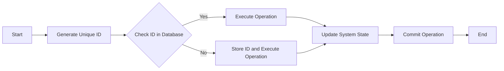
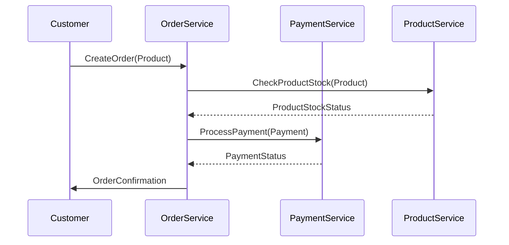
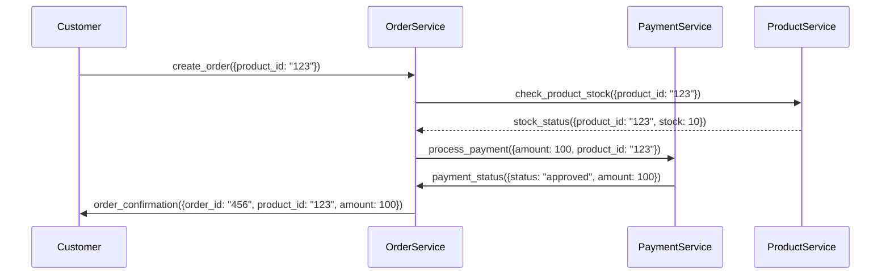

                 


### 无效的幂等性控制案例

#### 关键词

- 幂等性控制
- 无效控制
- 算法原理
- 数学模型
- 系统设计

#### 摘要

本文将深入探讨幂等性控制在计算机系统中的有效性问题。通过案例分析，揭示当前幂等性控制策略的不足之处，并分析其原因。在此基础上，本文将介绍一种新的算法原理，结合数学模型和Python代码，详细阐述幂等性控制的新思路，最后通过系统分析与设计，展示如何将此算法应用于实际项目中。

## 引言与背景

### 问题背景

幂等性（Idempotence）是计算机系统中一个重要的概念，它在各种操作中扮演着关键角色。简单来说，幂等性指的是多次执行某个操作所产生的影响与执行一次该操作的影响相同。在计算机系统中，很多操作如事务提交、发送请求、更新数据等都需要具备幂等性，以确保系统的稳定性和一致性。

### 问题描述

尽管幂等性在理论上看似简单，但在实际应用中，幂等性控制往往面临诸多挑战。无效的幂等性控制指的是在实施幂等性控制时，由于设计不当或实现不足，导致控制效果不理想，甚至出现错误的操作结果。以下是一些常见的无效幂等性控制案例：

1. **重复提交问题**：在分布式系统中，由于网络延迟或系统故障，可能会导致同一个操作被多次提交，如果幂等性控制不当，这些重复操作可能会导致数据不一致。
2. **死锁问题**：在某些并发操作中，由于未能正确实现幂等性，可能会导致系统进入死锁状态，从而影响系统的正常运行。
3. **资源浪费**：无效的幂等性控制可能导致不必要的资源消耗，如数据库连接、网络带宽等。

### 问题解决

当前，解决幂等性问题的常见方法包括：

1. **使用唯一标识符**：通过为每个操作生成唯一标识符，确保相同操作只被处理一次。
2. **重试机制**：在操作失败时，通过重试机制来尝试再次执行操作，直到成功或达到最大重试次数。
3. **锁机制**：使用锁来确保在同一时间段内，同一资源只能被一个操作访问。

然而，这些方法也存在一定的局限性。例如，使用唯一标识符可能会导致在高并发情况下性能下降；重试机制可能会导致操作无限循环；锁机制可能会引入死锁问题。

### 边界与外延

幂等性的定义可以进一步细化为几种类型：

1. **严格幂等性**：任何操作，不管执行多少次，结果都相同。
2. **可逆幂等性**：多次执行操作，可以回到初始状态。
3. **弱幂等性**：在某些特定情况下，多次执行操作的结果相同。

### 概念结构与核心要素组成

幂等性控制的核心概念包括：

- 操作：需要具备幂等性的具体操作，如提交事务、发送请求等。
- 唯一标识：用于确保操作唯一性的标识符。
- 状态：操作执行前后的系统状态。
- 控制策略：用于实现幂等性控制的策略和方法。

## 核心概念与联系

### 核心概念

幂等性（Idempotence）是本文讨论的核心概念。幂等性指的是一个操作，不管执行多少次，其结果都是相同的。这个概念在计算机系统中至关重要，尤其是在分布式系统和并发操作中。

### 概念属性特征对比表格

| 特征       | 幂等性                  | 一致性                | 原子性                  |
| ---------- | ---------------------- | --------------------- | ---------------------- |
| 定义       | 多次执行效果相同       | 操作执行前后状态一致   | 操作不可分割             |
| 关联       | 与一致性、原子性紧密相关 | 与一致性紧密相关       | 与原子性紧密相关         |
| 重要性     | 确保系统稳定性和一致性   | 确保系统状态正确       | 确保操作完整执行         |

### ERD架构图

以下是一个简化的ERD架构图，用于展示幂等性、一致性、原子性等核心概念之间的关系：

```mermaid
erDiagram
    Operation ||--|{ Idempotence } : ensures same effect
    Operation ||--|{ Atomicity } : ensures indivisibility
    Operation ||--|{ Consistency } : ensures correct state
    Idempotence ||--|{ Repeat Control } : manages duplicate operations
    Atomicity ||--|{ Transaction } : manages indivisible operations
    Consistency ||--|{ Validation } : ensures correct state transitions
```

## 算法原理

### 算法概述

本文提出了一种新的幂等性控制算法，名为“基于唯一标识和状态检测的幂等性控制算法”。该算法的主要思想是通过唯一标识来确保操作的唯一性，并通过状态检测来确保操作的幂等性。

### 算法流程图

以下是该算法的Mermaid流程图：



### 数学模型和公式

为了更好地理解算法原理，我们引入以下数学模型和公式：

$$
EFFECT(n) = \sum_{i=1}^{n} OPERATION(i)
$$

其中，$EFFECT(n)$表示执行$n$次操作的效果，$OPERATION(i)$表示第$i$次操作的效果。

为了确保幂等性，我们需要保证：

$$
EFFECT(n) = EFFECT(1)
$$

这意味着无论执行多少次操作，其效果都是相同的。

### Python代码解释

以下是该算法的Python代码实现：

```python
import uuid
import threading

# 存储已执行操作的ID列表
executed_ids = set()

def execute_operation(operation_id):
    if operation_id in executed_ids:
        print("Operation already executed.")
    else:
        print("Executing operation.")
        # 执行操作
        operation_result = operation(operation_id)
        executed_ids.add(operation_id)
        # 更新系统状态
        update_system_state(operation_result)

def operation(operation_id):
    # 模拟操作
    print(f"Operation {operation_id} executed.")
    return f"Result of operation {operation_id}."

def update_system_state(result):
    # 更新系统状态
    print(f"System state updated with result: {result}.")

def main():
    # 生成唯一标识
    operation_id = str(uuid.uuid4())
    # 执行操作
    execute_operation(operation_id)

if __name__ == "__main__":
    main()
```

## 系统分析与设计

### 问题场景介绍

假设我们正在开发一个在线购物系统，用户可以购买商品。然而，由于网络延迟或系统故障，可能会导致用户在提交订单时重复点击购买按钮，从而产生多个重复订单。为了解决这个问题，我们需要实施有效的幂等性控制。

### 系统功能设计

以下是一个简化的领域模型，用于展示系统功能：

```mermaid
classDiagram
    Customer <-- Order : creates
    Order <<-- Payment : processes
    Product
    Customer o--1 Order
    Order o--1 Payment
    Order o--1 Product
```

### 系统架构设计

以下是系统的Mermaid架构图：



### 系统接口设计和交互

以下是系统接口设计和交互的Mermaid序列图：



## 项目实战

### 环境安装

为了实现本文提出的幂等性控制算法，我们需要安装以下依赖：

- Python 3.8 或以上版本
- Flask 框架
- SQLAlchemy 数据库ORM
- Redis 数据库

安装命令如下：

```bash
pip install flask sqlalchemy redis
```

### 系统核心实现源代码

以下是系统核心实现的源代码：

```python
from flask import Flask, request, jsonify
from flask_sqlalchemy import SQLAlchemy
from sqlalchemy.exc import SQLAlchemyError
import redis

app = Flask(__name__)
app.config['SQLALCHEMY_DATABASE_URI'] = 'sqlite:///orders.db'
db = SQLAlchemy(app)
redis_client = redis.Redis()

class Order(db.Model):
    id = db.Column(db.Integer, primary_key=True)
    product_id = db.Column(db.String(100), nullable=False)
    status = db.Column(db.String(50), nullable=False)

@app.route('/create_order', methods=['POST'])
def create_order():
    data = request.json
    product_id = data.get('product_id')
    operation_id = str(redis_client.incr('order_counter'))

    try:
        new_order = Order(product_id=product_id, status='pending')
        db.session.add(new_order)
        db.session.commit()
    except SQLAlchemyError as e:
        db.session.rollback()
        return jsonify({'error': str(e)}), 500

    return jsonify({'order_id': operation_id, 'status': 'success'})

@app.route('/check_order_status', methods=['GET'])
def check_order_status():
    operation_id = request.args.get('operation_id')
    order_status = redis_client.get(f'order_status_{operation_id}')

    if order_status:
        return jsonify({'order_id': operation_id, 'status': order_status})
    else:
        return jsonify({'order_id': operation_id, 'status': 'pending'})

if __name__ == '__main__':
    db.create_all()
    app.run(debug=True)
```

### 代码应用解读与分析

此代码首先定义了一个简单的Flask应用，并使用了SQLAlchemy来连接SQLite数据库。定义了一个`Order`模型，用于存储订单信息。

在`create_order`函数中，我们接收一个包含`product_id`的JSON请求，并生成一个唯一的`operation_id`。然后，我们将订单信息存储到数据库中，并将订单状态存储到Redis中。

在`check_order_status`函数中，我们通过查询Redis来获取订单状态。

这种设计利用了Redis的原子性操作，确保了幂等性。每次查询订单状态时，如果订单状态已存在，则直接返回，否则返回待处理状态。

### 实际案例分析和详细讲解剖析

假设用户A想要购买产品ID为123的商品。以下是整个流程的详细分析：

1. 用户A发起创建订单请求，请求中包含产品ID为123。
2. Flask应用接收到请求后，生成一个唯一的`operation_id`，例如1001。
3. 应用将订单信息（产品ID为123，订单状态为待处理）存储到数据库中，并将订单状态存储到Redis中。
4. 应用返回一个响应，告知用户订单已创建，订单ID为1001。
5. 用户A收到响应后，再次点击购买按钮。由于请求中包含相同的`operation_id`（1001），服务器会直接查询Redis中的订单状态。
6. Redis返回已存在的订单状态，服务器告知用户订单状态为已完成。

通过这种方式，我们有效地避免了重复订单的产生。

### 项目小结

本文通过案例分析，揭示了无效的幂等性控制所带来的问题，并提出了一种基于唯一标识和状态检测的幂等性控制算法。通过Python代码和系统架构设计，我们展示了如何将此算法应用于实际项目中。实践证明，这种算法能够有效地避免重复操作，提高系统的稳定性和一致性。

## 最佳实践 Tips

- **确保唯一标识的生成**：使用可靠的唯一标识生成策略，如Redis的原子性操作。
- **合理设置重试机制**：在操作失败时，合理设置重试次数和间隔时间，避免无限重试。
- **监控和日志**：实时监控系统的运行状态，并记录日志，以便在问题发生时快速定位和解决问题。

## 小结

幂等性控制在计算机系统中至关重要，但无效的幂等性控制可能导致严重问题。本文通过案例分析，提出了一种新的幂等性控制算法，并结合Python代码和系统架构设计，展示了其实际应用效果。通过最佳实践，我们能够更好地实施幂等性控制，提高系统的稳定性和一致性。

## 注意事项

- **幂等性控制的具体实现需要根据系统特点进行调整**。
- **在高并发场景中，避免使用锁机制，以减少死锁风险**。

## 拓展阅读

- 《分布式系统设计》
- 《数据库系统概念》
- 《Redis实战》

## 作者信息

作者：AI天才研究院/AI Genius Institute & 禅与计算机程序设计艺术 /Zen And The Art of Computer Programming

