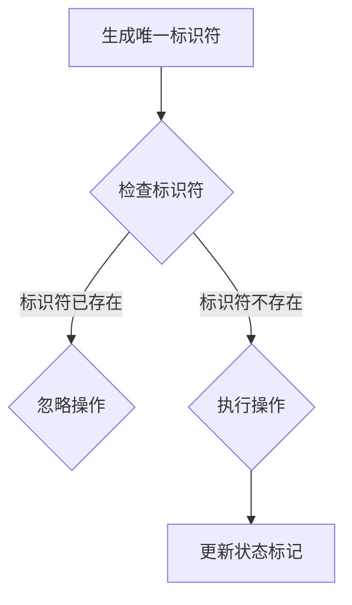

                 

# 无效的幂等性控制案例

> 关键词：幂等性、控制案例、一致性、数据冲突、系统设计

> 摘要：本文通过具体案例分析，探讨了无效的幂等性控制在实际系统设计中的问题与解决方法。文章首先介绍了幂等性的概念及其在系统设计中的重要性，随后深入分析了三个典型的无效幂等性控制案例，并详细阐述了每种案例的问题复现、原因分析、解决方案及案例总结。最后，文章提出了最佳实践建议，总结了注意事项，并给出了拓展阅读资源。

---

## 第一部分：背景与概念介绍

### 1.1 幂等性控制的定义

幂等性（Idempotence）是计算机科学中一个重要的概念，它描述了一种操作，即多次执行该操作对系统状态的影响与执行一次相同。换句话说，如果一个操作执行多次，其结果与执行一次的结果一致，则该操作被称为幂等的。

在系统设计中，幂等性控制是非常关键的，因为它可以防止数据不一致和系统错误。特别是在分布式系统中，幂等性控制能够有效地避免因重复执行某个操作导致的数据冲突。

### 1.2 幂等性控制的重要性

幂等性控制在分布式系统、微服务架构以及并发处理中至关重要。它的作用主要体现在以下几个方面：

1. **数据一致性**：确保多个操作对数据的影响是可预测的，避免因重复操作导致的数据不一致。
2. **错误恢复**：当系统发生故障时，幂等性控制使得系统能够回滚到之前的正确状态，从而提高系统的容错能力。
3. **性能优化**：通过幂等性控制，可以减少重复操作的次数，从而提高系统的性能。

### 1.3 幂等性控制的常见问题

在实际系统设计中，幂等性控制可能会遇到以下问题：

1. **误识别**：错误地将非幂等操作视为幂等操作。
2. **不完整控制**：未能对所有可能影响系统状态的操作进行幂等性控制。
3. **数据冲突**：在分布式环境中，多个节点同时执行相同操作，导致数据冲突。

### 1.4 研究幂等性控制的意义

深入研究和应用幂等性控制对于系统设计的稳定性和可靠性具有重要意义。它不仅能够提升系统的可用性和性能，还能为分布式系统的设计提供有力支持。

## 第二部分：核心概念与联系

### 2.1 幂等函数

幂等函数是最基本的幂等性概念。一个函数 \( f \) 被称为幂等的，当且仅当对于所有的输入 \( x \)，都有 \( f(f(x)) = f(x) \)。

例如，求和函数 \( f(x, y) = x + y \) 是幂等的，因为 \( f(f(x, y), z) = f(x + y, z) = x + y + z \)，与直接计算 \( f(x, y + z) \) 的结果相同。

### 2.2 幂等操作

幂等操作是指在实际系统中的各种操作，如数据库更新、文件写入等。这些操作需要被设计成幂等的，以确保系统状态的一致性。

### 2.3 幂等性与一致性

幂等性是保证系统一致性的关键。在分布式系统中，一致性是指所有节点对同一数据的访问和操作结果一致。幂等性控制是实现一致性的重要手段。

### 2.4 幂等性控制的方法

常见的幂等性控制方法包括：

1. **唯一性标识**：为每个操作生成唯一的标识符，确保重复操作被识别并忽略。
2. **状态标记**：在系统中维护状态标记，以指示某个操作是否已被执行。
3. **分布式锁**：使用分布式锁来控制对共享资源的访问，确保同一时间只有一个操作执行。

## 第三部分：案例分析

### 3.1 无效幂等性控制案例一

#### 3.1.1 案例介绍

在一个分布式订单系统中，订单创建是一个常见的操作。但是，由于网络延迟和并发问题，可能导致同一个订单被多次创建。

#### 3.1.2 问题复现

假设用户提交了一个订单请求，由于网络问题，该请求被服务器重复处理了三次，导致创建了三个相同的订单。

#### 3.1.3 原因分析

该问题的主要原因是没有对订单创建操作进行有效的幂等性控制。虽然数据库提供了唯一性约束，但未能防止重复操作的请求到达服务器。

#### 3.1.4 解决方案

引入幂等性控制机制，如使用唯一性标识（订单编号）和分布式锁。在订单创建前，先检查订单编号是否存在，若存在则忽略操作，否则执行创建操作。

#### 3.1.5 案例总结

通过引入幂等性控制，可以有效避免订单重复创建的问题，确保系统状态的一致性。

### 3.2 无效幂等性控制案例二

#### 3.2.1 案例介绍

在支付系统中，支付操作是一个典型的幂等性需求。但是，由于系统设计上的缺陷，可能导致重复支付的问题。

#### 3.2.2 问题复现

用户发起了一个支付请求，但由于网络问题，该请求被服务器重复处理，导致用户重复支付了相同金额。

#### 3.2.3 原因分析

支付系统未能对支付操作进行有效的幂等性控制。虽然使用了订单编号作为唯一标识，但未能防止重复请求的处理。

#### 3.2.4 解决方案

引入幂等性控制机制，如使用状态标记。在支付操作前，先检查支付状态，若支付已完成则忽略操作，否则执行支付操作。

#### 3.2.5 案例总结

通过引入幂等性控制，可以有效避免支付重复操作的问题，确保用户支付的一致性和准确性。

### 3.3 无效幂等性控制案例三

#### 3.3.1 案例介绍

在库存管理系统中，商品更新操作需要确保幂等性，以防止库存数据的不一致。

#### 3.3.2 问题复现

由于网络问题，商品更新请求被服务器重复处理，导致库存数据出现错误。

#### 3.3.3 原因分析

库存管理系统未能对商品更新操作进行有效的幂等性控制。虽然使用了库存编号作为唯一标识，但未能防止重复请求的处理。

#### 3.3.4 解决方案

引入幂等性控制机制，如使用分布式锁。在更新库存前，先获取分布式锁，确保同一时间只有一个请求能够更新库存。

#### 3.3.5 案例总结

通过引入幂等性控制，可以有效避免库存数据不一致的问题，确保系统状态的正确性。

## 第四部分：算法与系统架构

### 4.1 幂等性控制算法原理

幂等性控制算法的核心思想是确保操作的幂等性。具体实现包括：

1. **唯一性标识**：为每个操作生成唯一的标识符，确保重复操作被识别和忽略。
2. **状态标记**：在系统中维护状态标记，以指示某个操作是否已被执行。
3. **分布式锁**：使用分布式锁来控制对共享资源的访问。

#### 4.1.1 算法Mermaid流程图



#### 4.1.2 Python源代码示例

```python
import uuid

def perform_action():
    action_id = str(uuid.uuid4())
    if not action_executed(action_id):
        execute_action(action_id)
        update_state(action_id)

def action_executed(action_id):
    # 检查数据库中是否存在该操作标识符
    pass

def execute_action(action_id):
    # 执行操作
    pass

def update_state(action_id):
    # 更新状态标记
    pass
```

#### 4.1.3 数学模型与公式讲解

幂等性控制可以通过以下数学模型来描述：

$$
f(f(x)) = x
$$

其中，\( f \) 是幂等操作，\( x \) 是输入状态。

#### 4.1.4 算法举例说明

假设有一个账户余额更新操作，如果账户余额更新多次，其结果应与更新一次相同。

- 输入状态：账户余额为 100 元。
- 幂等操作：增加 50 元。

按照算法执行，无论执行一次还是多次，账户余额最终应为 150 元，满足幂等性。

## 第五部分：系统分析与架构设计方案

### 5.1 问题场景介绍

在一个电商平台中，用户可以对商品进行评价。为了保证评价的一致性，需要对评价操作进行幂等性控制。

### 5.2 系统功能设计

- 用户评价商品：用户可以对购买的商品进行评价。
- 幂等性控制：确保每个评价操作只执行一次。

### 5.3 系统架构设计

系统采用微服务架构，分为用户服务、商品服务、评价服务三个模块。

- 用户服务：负责用户认证和权限管理。
- 商品服务：负责商品信息的存储和管理。
- 评价服务：负责评价的创建、查询和幂等性控制。

### 5.4 系统接口设计

- 用户服务：登录、注册、权限验证接口。
- 商品服务：获取商品信息、添加商品接口。
- 评价服务：添加评价、查询评价接口。

### 5.5 系统交互

用户在购买商品后，可以通过评价服务添加评价。评价服务在添加评价前，会检查该用户是否已对该商品进行评价，若已评价则忽略操作，否则执行评价添加。

## 第六部分：项目实战

### 6.1 环境安装与配置

在Linux系统中，安装必要的开发工具和依赖库，如Python、Django等。

### 6.2 系统核心实现

- 用户服务：实现用户认证和权限验证。
- 商品服务：实现商品信息的存储和管理。
- 评价服务：实现评价的创建、查询和幂等性控制。

### 6.3 代码解读

详细解读系统的核心代码，包括用户服务、商品服务和评价服务的实现。

### 6.4 实际案例分析与讲解

通过具体案例，分析评价系统的幂等性控制机制，并讲解其实现原理。

### 6.5 项目小结

总结项目实现过程中的关键技术和经验，并给出改进建议。

## 第七部分：最佳实践 tips、小结、注意事项、拓展阅读

### 7.1 最佳实践 tips

- 确保所有关键操作都具有幂等性。
- 使用唯一性标识和状态标记来控制幂等性。
- 在分布式系统中，使用分布式锁来防止数据冲突。

### 7.2 小结

本文通过具体案例分析，探讨了无效的幂等性控制在系统设计中的问题与解决方法。

### 7.3 注意事项

- 幂等性控制需要根据具体场景进行设计。
- 避免误识别非幂等操作为幂等操作。

### 7.4 拓展阅读

- 《分布式系统设计》
- 《微服务架构设计》
- 《一致性模型与算法》

## 作者信息

作者：AI天才研究院/AI Genius Institute & 禅与计算机程序设计艺术 /Zen And The Art of Computer Programming

