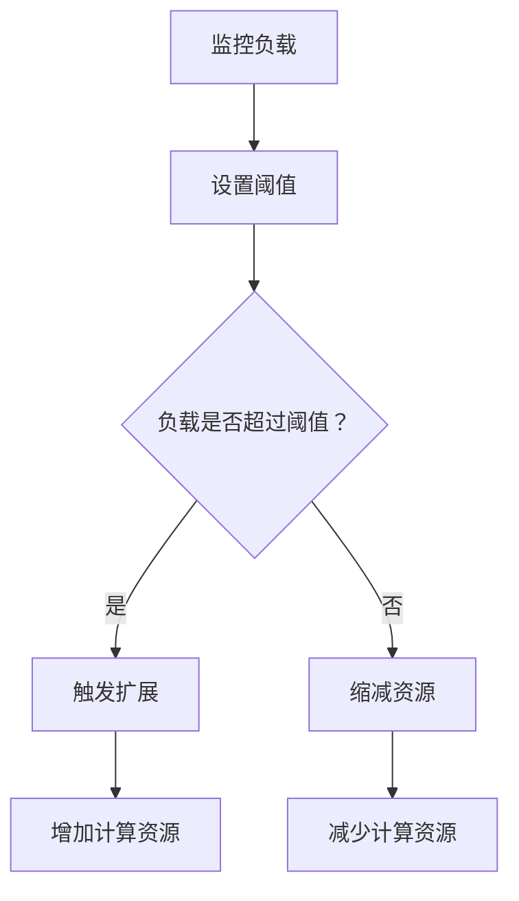
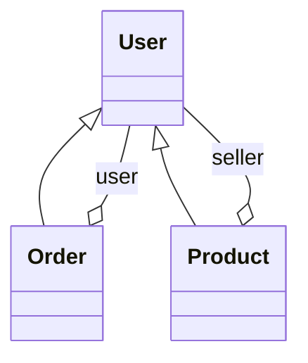
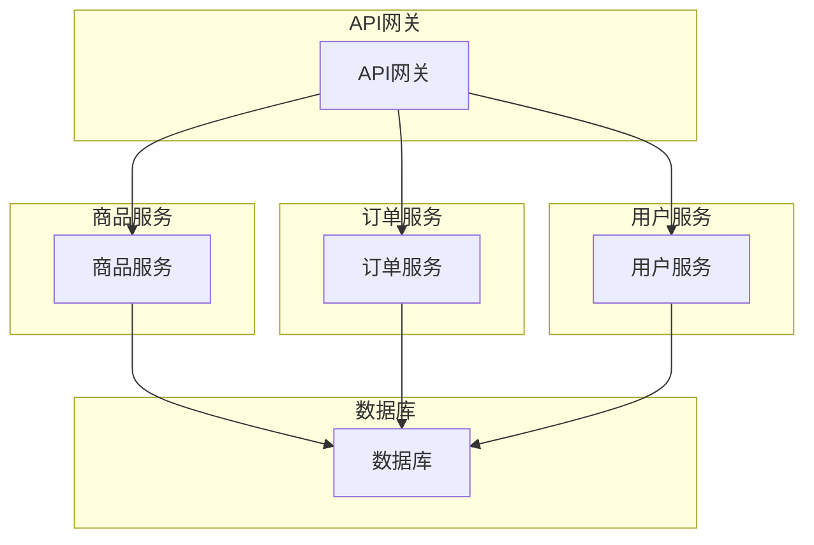
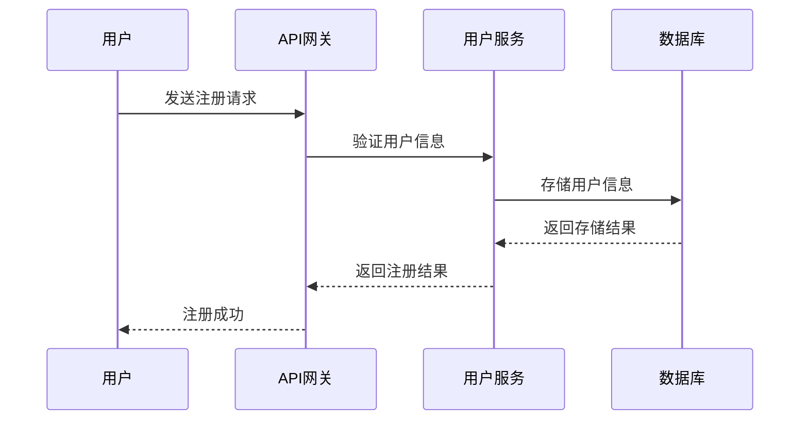
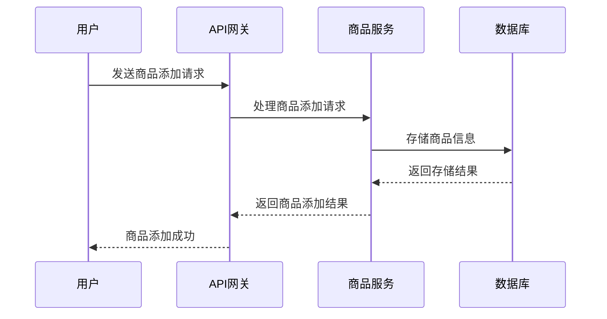

                 

# 无服务器计算：serverless架构的设计与实现

> 关键词：无服务器计算，Serverless，FaaS，BaaS，架构设计，实现技巧

> 摘要：本文旨在探讨无服务器计算（Serverless Computing）的设计与实现。首先，我们将介绍无服务器计算的基本概念、核心特点和应用场景，接着深入分析无服务器架构的设计原则，包括函数即服务（FaaS）和后端即服务（BaaS）。随后，我们将介绍无服务器架构与传统架构的比较，以及其在各种应用场景中的优势。最后，我们将通过具体的实例和代码，展示如何设计和实现无服务器架构，并提供一些实用的最佳实践和注意事项。

## 第一部分：背景介绍

### 1.1 问题背景

无服务器计算（Serverless Computing）是一种基于云计算的新型计算模型，它允许开发人员将应用程序的开发和部署交给云服务提供商，从而无需管理服务器。这种计算模型的出现，主要是为了解决传统服务器模型中存在的诸多问题，如服务器管理的复杂性、资源利用率低下、成本高企等。

随着云计算的普及和容器技术的成熟，无服务器计算逐渐成为企业和开发者的首选。无服务器计算不仅简化了应用程序的开发和部署流程，还提供了弹性的计算资源、按需付费的模式，以及自动扩展和故障转移等功能。

然而，如何设计并实现一个高效、可靠的无服务器架构，成为许多开发者面临的挑战。本文将围绕这一问题，深入探讨无服务器计算的设计与实现。

### 1.2 问题描述

无服务器计算的设计与实现涉及到多个方面，包括核心概念、设计原则、实现技巧和最佳实践等。本文的主要目标是：

1. **核心概念与联系**：介绍无服务器计算的基本概念，如无服务器计算、函数即服务（FaaS）、后端即服务（BaaS）等，并分析它们之间的关系。
2. **设计原则**：探讨无服务器架构的设计原则，如函数即服务（FaaS）原则、微服务架构原则、状态管理原则等。
3. **实现技巧**：讲解如何在实际项目中设计和实现无服务器架构，包括选择合适的云服务提供商、配置函数、实现自动化部署和扩展等。
4. **最佳实践**：分享无服务器计算领域的最佳实践，帮助开发者避免常见的问题和陷阱。

### 1.3 问题解决

通过系统学习本文，读者可以：

1. **掌握无服务器计算的基本概念和核心特点**，了解无服务器计算的原理和优势。
2. **掌握无服务器架构的设计原则**，学会如何设计和实现一个高效、可靠的无服务器架构。
3. **掌握无服务器计算的实现技巧**，能够在实际项目中应用无服务器架构，提高开发效率和系统性能。
4. **掌握最佳实践**，避免在无服务器计算中遇到的问题和陷阱，确保项目的成功实施。

### 1.4 边界与外延

无服务器计算不仅适用于云计算环境，还可以应用于物联网、移动应用等多种场景。本文将覆盖无服务器计算的核心内容和应用场景，帮助读者全面了解这一技术。

### 1.5 概念结构与核心要素组成

- **无服务器计算**：一种无需管理服务器，只需关注应用代码的云计算模型。
- **函数即服务（FaaS）**：无服务器计算的一种实现方式，以函数为单位进行部署和执行。
- **后端即服务（BaaS）**：提供了一些无需自行管理的后端服务，如数据库、队列等。
- **容器化**：通过容器技术实现应用的打包、部署和运行，是支持无服务器计算的关键技术之一。
- **自动化部署和扩展**：无服务器计算的一个显著优势，能够根据负载自动扩展和缩减资源。

## 第二部分：核心概念与联系

## 2.1 无服务器计算的基本概念

### 2.1.1 什么是无服务器计算

无服务器计算（Serverless Computing）是一种基于云计算的服务模型，它允许开发人员将应用程序的开发和部署交给云服务提供商，从而无需管理服务器。在这种模型中，开发人员只需编写和部署代码，云服务提供商负责管理基础设施、服务器、存储和网络等资源。

### 2.1.2 无服务器计算的核心特点

无服务器计算具有以下核心特点：

1. **无需管理服务器**：云服务提供商负责管理基础设施，包括服务器、存储和网络。开发人员无需关心底层的硬件和操作系统。
2. **按需付费**：仅对使用的计算资源付费，无闲置资源成本。根据实际使用量进行计费，节省了预算。
3. **自动扩展**：系统能够根据负载自动调整资源使用，确保高可用性和性能。在负载增加时，自动增加计算资源；在负载减少时，自动减少计算资源。
4. **高可用性**：由云服务提供商确保系统的高可用性和可靠性。通过自动故障转移和备份，确保应用程序的持续运行。
5. **简化开发**：无需关注服务器管理，开发人员可以专注于编写应用代码，提高开发效率和生产力。

### 2.1.3 无服务器计算与云计算的关系

无服务器计算是云计算的一种高级形式，它利用云计算的基础设施，但提供了更为简化的管理方式。云计算提供了广泛的服务，包括IaaS（基础设施即服务）、PaaS（平台即服务）和SaaS（软件即服务），而无服务器计算则聚焦于FaaS（函数即服务）和BaaS（后端即服务）。

### 2.1.4 无服务器计算的应用场景

无服务器计算适用于多种应用场景，包括但不限于：

1. **后端服务**：例如API网关、数据处理、消息队列等。
2. **前端服务**：提供动态内容、用户认证等。
3. **移动和物联网应用**：实现设备间的通信和数据收集。
4. **数据分析和机器学习**：处理大规模数据集，实现快速分析和预测。

### 2.1.5 无服务器计算与传统计算模型的对比

传统计算模型依赖于固定的服务器和存储资源，难以快速响应负载变化。而无服务器计算利用云服务提供商的弹性资源，能够根据负载自动调整资源使用。以下是对比表格：

| 特点 | 无服务器计算 | 传统计算模型 |
| ---- | ------------ | ------------ |
| 管理服务器 | 无需管理服务器 | 需要手动管理服务器 |
| 资源使用 | 按需付费 | 预先购买资源 |
| 扩展性 | 自动扩展 | 需要手动扩展 |
| 成本 | 成本较低 | 成本较高 |
| 可维护性 | 简化维护 | 维护成本高 |

### 2.1.6 无服务器计算的核心概念

1. **函数即服务（FaaS）**：FaaS是一种无服务器计算模型，以函数为单位进行部署和执行。开发人员只需编写函数代码，云服务提供商负责管理底层基础设施。
2. **后端即服务（BaaS）**：BaaS提供了一些无需自行管理的后端服务，如数据库、队列等。开发人员可以使用BaaS服务，无需关心底层基础设施的细节。
3. **容器化**：容器化是一种将应用程序及其依赖项打包为独立容器的方法，实现应用的打包、部署和运行。容器化技术是支持无服务器计算的关键技术之一。
4. **自动化部署和扩展**：自动化部署和扩展是无服务器计算的一个显著优势，系统能够根据负载自动调整资源使用，提高系统的可用性和性能。

## 2.2 无服务器架构的设计原则

### 2.2.1 设计原则概述

无服务器架构的设计原则旨在确保应用程序的可扩展性、可靠性和成本效益。以下是一些关键原则：

1. **函数即服务（FaaS）原则**：以函数为单位进行部署和执行，无需关心底层基础设施。
2. **微服务架构原则**：将应用程序拆分为多个独立的、可复用的服务，提高系统的可维护性和可扩展性。
3. **状态管理原则**：避免在函数中保存状态，使用外部存储服务如数据库、缓存等，确保系统的可靠性。
4. **自动化部署和扩展原则**：利用CI/CD工具实现自动化部署和扩展，提高开发效率。
5. **弹性资源分配原则**：根据负载自动调整资源使用，确保系统的高可用性和性能。

### 2.2.2 设计原则

#### 2.2.2.1 函数即服务（FaaS）原则

函数即服务（FaaS）是一种无服务器计算模型，以函数为单位进行部署和执行。FaaS的核心特点是无需关心底层基础设施，开发人员只需编写函数代码，即可实现应用程序的功能。

FaaS的设计原则包括：

1. **函数独立部署**：每个函数都可以独立部署，无需关心其他函数的运行状态。
2. **函数独立扩展**：根据函数的负载，自动调整函数的执行资源，确保系统的高性能。
3. **函数独立维护**：每个函数可以独立升级和维护，不会影响到其他函数的运行。
4. **函数可复用**：将功能拆分为独立的函数，便于复用和模块化开发。

#### 2.2.2.2 微服务架构原则

微服务架构是一种将应用程序拆分为多个独立的、可复用的服务的方法。微服务架构的核心特点是将应用程序拆分为多个小型、独立的服务，每个服务负责应用程序的一个特定功能。

微服务架构的设计原则包括：

1. **服务独立部署**：每个服务都可以独立部署，无需关心其他服务的运行状态。
2. **服务独立扩展**：根据服务的负载，自动调整服务的执行资源，确保系统的高性能。
3. **服务独立维护**：每个服务可以独立升级和维护，不会影响到其他服务的运行。
4. **服务可复用**：将功能拆分为独立的服务，便于复用和模块化开发。

#### 2.2.2.3 状态管理原则

在无服务器架构中，状态管理是一个关键问题。为了避免在函数中保存状态，提高系统的可靠性，可以使用外部存储服务如数据库、缓存等。

状态管理原则包括：

1. **避免在函数中保存状态**：将状态保存在外部存储中，确保函数的独立性。
2. **使用外部存储服务**：使用数据库、缓存等外部存储服务，提高系统的性能和可靠性。
3. **数据一致性**：确保数据的最终一致性，避免因状态丢失导致的数据不一致问题。

#### 2.2.2.4 自动化部署和扩展原则

自动化部署和扩展是无服务器架构的一个显著优势。利用CI/CD工具，可以实现自动化部署和扩展，提高开发效率。

自动化部署和扩展原则包括：

1. **自动化部署**：利用CI/CD工具，实现代码的自动化部署，提高开发效率。
2. **自动化扩展**：根据负载自动调整资源的规模，确保系统的高性能和高可用性。
3. **弹性资源分配**：根据实际需求，动态调整资源的规模，避免资源浪费。

#### 2.2.2.5 弹性资源分配原则

弹性资源分配是无服务器架构的核心特点之一。根据负载自动调整资源使用，确保系统的高可用性和性能。

弹性资源分配原则包括：

1. **按需分配**：根据实际的负载需求，动态调整资源的规模，避免资源浪费。
2. **自动扩展**：在负载增加时，自动增加资源；在负载减少时，自动减少资源。
3. **成本优化**：根据实际使用量进行计费，降低成本。

## 2.3 无服务器架构与传统架构的比较

### 2.3.1 优点

无服务器架构相较于传统架构，具有以下优点：

1. **无需管理服务器**：云服务提供商负责管理基础设施，开发人员无需关心服务器。
2. **按需付费**：仅对使用的计算资源付费，节省了预算。
3. **自动扩展**：系统能够根据负载自动调整资源使用，提高系统的可用性和性能。
4. **简化开发**：无需关注服务器管理，开发人员可以专注于编写应用代码，提高开发效率。

### 2.3.2 缺点

无服务器架构也存在一些缺点：

1. **限制性**：无服务器架构在资源使用、性能和可定制性方面可能受到一些限制。
2. **依赖云服务提供商**：无服务器架构依赖于云服务提供商，切换服务提供商可能较为困难。
3. **函数冷启动**：长时间未调用的函数可能存在冷启动问题，影响性能。

### 2.3.3 对比

以下是传统架构与无服务器架构的对比：

| 特点 | 传统架构 | 无服务器架构 |
| ---- | -------- | ------------ |
| 服务器管理 | 需要手动管理服务器 | 无需管理服务器 |
| 资源使用 | 预先购买资源 | 按需付费 |
| 扩展性 | 需要手动扩展 | 自动扩展 |
| 成本 | 成本较高 | 成本较低 |
| 可维护性 | 维护成本高 | 维护成本低 |
| 开发效率 | 开发效率低 | 开发效率高 |

## 2.4 无服务器计算的应用场景

无服务器计算适用于多种应用场景，包括但不限于：

1. **后端服务**：例如API网关、数据处理、消息队列等。
2. **前端服务**：提供动态内容、用户认证等。
3. **移动和物联网应用**：实现设备间的通信和数据收集。
4. **数据分析和机器学习**：处理大规模数据集，实现快速分析和预测。

## 第三部分：算法原理讲解

### 3.1 无服务器架构的设计与实现算法原理

无服务器架构的设计与实现涉及多个方面，包括核心概念、设计原则、实现技巧和最佳实践等。以下是一些关键算法原理：

#### 3.1.1 自动化部署和扩展算法

自动化部署和扩展是确保无服务器架构可靠性和性能的关键。以下是一种简单的自动化部署和扩展算法：

1. **监控负载**：定期监控系统的负载，包括CPU、内存、网络等指标。
2. **设置阈值**：根据业务需求和系统性能，设置负载的阈值。
3. **触发扩展**：当系统负载超过阈值时，触发扩展操作，增加计算资源。
4. **缩减资源**：当系统负载低于阈值时，缩减计算资源。

#### 3.1.2 弹性资源分配算法

弹性资源分配是确保无服务器架构高效性和成本效益的关键。以下是一种简单的弹性资源分配算法：

1. **实时监控**：实时监控系统的负载和资源使用情况。
2. **动态调整**：根据负载和资源使用情况，动态调整资源的规模。
3. **成本优化**：在满足性能要求的前提下，优化资源的使用，降低成本。

#### 3.1.3 状态管理算法

状态管理是确保无服务器架构可靠性和数据一致性的关键。以下是一种简单的状态管理算法：

1. **外部存储**：将状态保存在外部存储服务中，如数据库、缓存等。
2. **最终一致性**：确保数据的最终一致性，避免因状态丢失导致的数据不一致问题。
3. **备份和恢复**：定期备份状态数据，确保在发生故障时能够快速恢复。

### 3.2 算法mermaid流程图

以下是一个简单的自动化部署和扩展算法的mermaid流程图：



### 3.3 算法Python源代码

以下是一个简单的自动化部署和扩展算法的Python源代码：

```python
import time
import random

def monitor_load():
    # 监控系统的负载，返回负载值
    return random.randint(1, 100)

def set_threshold(load):
    # 设置负载的阈值
    if load > 80:
        return 90
    else:
        return 50

def trigger_extension(threshold):
    # 触发扩展操作
    print("触发扩展")
    time.sleep(10)
    print("扩展完成")

def reduce_resources(threshold):
    # 触发缩减操作
    print("缩减资源")
    time.sleep(10)
    print("缩减完成")

def main():
    while True:
        load = monitor_load()
        threshold = set_threshold(load)
        
        if load > threshold:
            trigger_extension(threshold)
        else:
            reduce_resources(threshold)
        
        time.sleep(60)

if __name__ == "__main__":
    main()
```

### 3.4 算法原理详细讲解

#### 3.4.1 自动化部署和扩展算法

自动化部署和扩展算法的核心思想是根据系统的负载，动态调整资源的规模。具体实现步骤如下：

1. **监控负载**：定期监控系统的负载，包括CPU、内存、网络等指标。常用的监控工具包括Prometheus、Grafana等。
2. **设置阈值**：根据业务需求和系统性能，设置负载的阈值。阈值可以根据历史数据和性能要求进行设置。
3. **触发扩展**：当系统负载超过阈值时，触发扩展操作，增加计算资源。常用的扩展方式包括水平扩展（增加实例数量）和垂直扩展（增加实例资源）。
4. **缩减资源**：当系统负载低于阈值时，缩减计算资源。常用的缩减方式包括减少实例数量和降低实例资源。

#### 3.4.2 弹性资源分配算法

弹性资源分配算法的核心思想是根据负载和资源使用情况，动态调整资源的规模。具体实现步骤如下：

1. **实时监控**：实时监控系统的负载和资源使用情况。可以使用Prometheus等监控工具，结合Kubernetes等容器编排工具，实现实时监控。
2. **动态调整**：根据负载和资源使用情况，动态调整资源的规模。可以使用Kubernetes等容器编排工具，根据负载自动调整容器实例的CPU、内存等资源。
3. **成本优化**：在满足性能要求的前提下，优化资源的使用，降低成本。可以通过调整资源配额、使用预算等策略，实现成本优化。

#### 3.4.3 状态管理算法

状态管理算法的核心思想是将状态保存在外部存储服务中，确保系统的可靠性。具体实现步骤如下：

1. **外部存储**：将状态保存在外部存储服务中，如数据库、缓存等。常用的外部存储服务包括RDS、MongoDB、Redis等。
2. **最终一致性**：确保数据的最终一致性，避免因状态丢失导致的数据不一致问题。可以使用分布式事务、消息队列等中间件，实现最终一致性。
3. **备份和恢复**：定期备份状态数据，确保在发生故障时能够快速恢复。可以使用备份工具、分布式存储等方案，实现状态数据的备份和恢复。

### 3.5 算法举例说明

假设我们有一个后端服务，需要处理大量的用户请求。为了确保系统的高性能和高可用性，我们可以使用自动化部署和扩展算法，根据负载动态调整资源的规模。

1. **监控负载**：使用Prometheus监控系统的负载，包括CPU、内存、网络等指标。
2. **设置阈值**：根据业务需求和系统性能，设置负载的阈值。例如，当CPU利用率超过80%时，触发扩展操作。
3. **触发扩展**：当系统负载超过阈值时，触发扩展操作，增加计算资源。可以使用Kubernetes自动扩缩容功能，根据负载自动增加容器实例。
4. **缩减资源**：当系统负载低于阈值时，缩减计算资源。同样使用Kubernetes自动扩缩容功能，根据负载自动减少容器实例。

通过这种方式，我们可以确保系统的高性能和高可用性，同时降低成本。

## 第四部分：系统分析与架构设计方案

### 4.1 问题场景介绍

假设我们开发一个在线购物平台，需要实现商品管理、订单处理、用户认证等功能。该平台需要具备高并发处理能力、良好的可扩展性以及可靠的数据存储和传输。

### 4.2 项目介绍

为了满足上述需求，我们决定采用无服务器架构来实现该在线购物平台。无服务器架构能够提供弹性的计算资源、自动扩展和缩减功能，降低开发和运维成本，提高系统性能和可靠性。

### 4.3 系统功能设计

在线购物平台的主要功能包括：

1. **商品管理**：包括商品信息的添加、修改、删除和查询。
2. **订单处理**：包括订单的创建、修改、删除和查询。
3. **用户认证**：包括用户的注册、登录、信息查询和权限管理。

#### 领域模型

根据在线购物平台的功能需求，我们设计了一个领域模型，包括以下实体：

1. **商品（Product）**：包括商品名称、价格、描述等信息。
2. **订单（Order）**：包括订单编号、用户ID、订单状态等信息。
3. **用户（User）**：包括用户名、密码、邮箱、角色等信息。

#### Mermaid类图

以下是一个简单的Mermaid类图，展示了领域模型中的实体及其关系：



### 4.4 系统架构设计

在线购物平台的系统架构采用无服务器架构，主要包括以下组件：

1. **API网关**：负责接收用户请求，路由到相应的服务。
2. **商品服务**：负责处理商品相关的业务逻辑。
3. **订单服务**：负责处理订单相关的业务逻辑。
4. **用户服务**：负责处理用户认证和权限管理。
5. **数据库**：负责存储商品、订单和用户数据。

#### Mermaid架构图

以下是一个简单的Mermaid架构图，展示了在线购物平台的系统架构：



### 4.5 系统接口设计

在线购物平台的主要接口包括：

1. **商品接口**：包括商品信息的添加、修改、删除和查询。
2. **订单接口**：包括订单的创建、修改、删除和查询。
3. **用户接口**：包括用户的注册、登录、信息查询和权限管理。

#### Mermaid序列图

以下是一个简单的Mermaid序列图，展示了用户注册接口的交互过程：



### 4.6 系统交互设计

在线购物平台中的各个组件通过RESTful API进行交互，以下是商品管理模块的交互流程：

1. **用户通过API网关发送商品添加请求**。
2. **API网关将请求路由到商品服务**。
3. **商品服务处理添加请求，并将结果存储到数据库**。
4. **商品服务将添加结果返回给API网关**。
5. **API网关将添加结果返回给用户**。

#### Mermaid交互图

以下是一个简单的Mermaid交互图，展示了商品管理模块的交互流程：



## 第五部分：项目实战

### 5.1 环境安装

在开始项目实战之前，需要安装以下软件和工具：

1. **Docker**：用于容器化应用。
2. **Kubernetes**：用于容器编排和管理。
3. **AWS Lambda**：用于无服务器计算。
4. **AWS API Gateway**：用于创建API网关。
5. **AWS RDS**：用于数据库服务。

安装步骤如下：

1. 安装Docker：[Docker安装指南](https://docs.docker.com/get-docker/)
2. 安装Kubernetes：[Kubernetes安装指南](https://kubernetes.io/docs/setup/production-environment/tools/kubeadm/install-kubeadm/)
3. 安装AWS CLI：[AWS CLI安装指南](https://docs.aws.amazon.com/cli/latest/userguide/cli-chap-install.html)
4. 配置AWS CLI：[AWS CLI配置指南](https://docs.aws.amazon.com/cli/latest/userguide/cli-configure-aws-api-gateway.html)

### 5.2 系统核心实现

在本项目中，我们将使用Docker容器化应用程序，并使用Kubernetes进行容器编排和管理。以下是商品服务的一个简单实现：

**Dockerfile**

```dockerfile
FROM python:3.8-slim

WORKDIR /app

COPY requirements.txt ./
RUN pip install -r requirements.txt

COPY . .

CMD ["python", "app.py"]
```

**app.py**

```python
from flask import Flask, request, jsonify

app = Flask(__name__)

@app.route('/products', methods=['POST'])
def add_product():
    product_data = request.json
    # 处理添加商品逻辑，保存到数据库
    # ...
    return jsonify({"message": "Product added successfully"}), 201

@app.route('/products', methods=['GET'])
def get_products():
    # 获取商品列表，从数据库查询
    # ...
    return jsonify({"products": products})

if __name__ == '__main__':
    app.run(host='0.0.0.0', port=5000)
```

### 5.3 代码应用解读与分析

在本项目中，我们使用Dockerfile来构建应用程序的镜像，并使用Flask框架实现商品服务的功能。以下是代码的解读和分析：

**Dockerfile**

- **FROM python:3.8-slim**：基于Python 3.8镜像创建容器。
- **WORKDIR /app**：设置工作目录为`/app`。
- **COPY requirements.txt ./**：复制`requirements.txt`文件到容器中。
- **RUN pip install -r requirements.txt**：安装应用程序所需的依赖库。
- **COPY ./**：复制当前目录（包含应用程序代码）到容器中。
- **CMD ["python", "app.py"]**：指定容器启动时运行的命令。

**app.py**

- **from flask import Flask, request, jsonify**：导入Flask框架相关的模块。
- **app = Flask(__name__)**：创建Flask应用程序实例。
- **@app.route('/products', methods=['POST'])**：定义添加商品的POST路由。
- **add_product()**：处理添加商品的逻辑，保存到数据库。
- **@app.route('/products', methods=['GET'])**：定义获取商品的GET路由。
- **get_products()**：获取商品列表，从数据库查询。
- **if __name__ == '__main__':**：确保应用程序在容器启动时运行。

通过上述代码，我们可以创建一个简单的商品服务，并通过Docker容器进行部署。在实际项目中，还需要集成数据库、身份验证、日志记录等功能，以满足具体需求。

### 5.4 实际案例分析和详细讲解剖析

在本节中，我们将分析一个实际案例，并详细讲解如何使用无服务器架构实现一个简单的博客系统。

#### 案例背景

一个初创公司希望开发一个博客系统，以展示公司的产品和技术动态。博客系统需要支持用户注册、登录、发布文章、评论等功能，同时要求具备高可用性、可扩展性和低成本。

#### 案例实现

为了实现这个博客系统，我们可以采用无服务器架构，结合AWS云服务，使用以下组件：

1. **AWS Lambda**：用于处理用户请求、发布文章、评论等业务逻辑。
2. **AWS API Gateway**：用于创建API网关，接收用户请求并路由到相应的Lambda函数。
3. **AWS DynamoDB**：用于存储用户数据、文章数据和评论数据。
4. **AWS S3**：用于存储用户上传的图片和视频等文件。

以下是博客系统的架构设计：

```
       +-------------+
       |   API Gateway   |
       +-------------+
           |
           v
+-------------+     +-------------+     +-------------+
|   Lambda A   |     |   Lambda B   |     |   Lambda C   |
+-------------+     +-------------+     +-------------+
           |           |            |
           |           |            |
           v           v            v
+-------------+     +-------------+     +-------------+
|   DynamoDB   |     |   DynamoDB   |     |   DynamoDB   |
+-------------+     +-------------+     +-------------+
           |           |            |
           |           |            |
           v           v            v
        +-----+      +-----+      +-----+
        | S3  |      | S3  |      | S3  |
        +-----+      +-----+      +-----+
```

#### 案例分析

1. **用户注册和登录**：用户通过API Gateway发送注册和登录请求，API Gateway将请求路由到Lambda A进行处理。Lambda A负责验证用户输入、创建用户账户并存储到DynamoDB。用户登录时，Lambda A验证用户凭证并返回JWT令牌。

2. **发布文章**：用户通过API Gateway发送发布文章请求，API Gateway将请求路由到Lambda B进行处理。Lambda B负责验证用户权限、处理文章内容并存储到DynamoDB。同时，Lambda B将文章图片和视频文件上传到S3。

3. **评论功能**：用户通过API Gateway发送评论请求，API Gateway将请求路由到Lambda C进行处理。Lambda C负责验证用户权限、处理评论内容并存储到DynamoDB。

#### 案例讲解

1. **用户注册和登录**：

   用户注册时，API Gateway将接收到的请求发送到Lambda A。Lambda A首先验证用户输入的邮箱地址和密码是否符合要求，然后创建一个新的用户账户并将相关信息存储到DynamoDB。用户登录时，Lambda A接收用户凭证，验证用户身份并返回JWT令牌。

   ```python
   import json
   import boto3
   from botocore.exceptions import ClientError

   def lambda_handler(event, context):
       if event['httpMethod'] == 'POST':
           return handle_register(event)
       elif event['httpMethod'] == 'GET':
           return handle_login(event)

   def handle_register(event):
       # 解析请求体中的用户信息
       user_data = json.loads(event['body'])
       email = user_data['email']
       password = user_data['password']

       # 验证用户信息
       if not validate_user_info(email, password):
           return {
               'statusCode': 400,
               'body': json.dumps({'error': 'Invalid user info'})
           }

       # 创建用户账户并存储到DynamoDB
       try:
           dynamodb = boto3.resource('dynamodb')
           table = dynamodb.Table('users')
           response = table.put_item(Item={
               'email': email,
               'password': password
           })
       except ClientError as e:
           return {
               'statusCode': 500,
               'body': json.dumps({'error': str(e)})
           }

       return {
           'statusCode': 201,
           'body': json.dumps({'message': 'User registered successfully'})
       }

   def handle_login(event):
       # 解析请求体中的用户信息
       user_data = json.loads(event['body'])
       email = user_data['email']
       password = user_data['password']

       # 验证用户信息
       if not validate_user_info(email, password):
           return {
               'statusCode': 400,
               'body': json.dumps({'error': 'Invalid user info'})
           }

       # 验证用户凭证并返回JWT令牌
       token = generate_jwt_token(email)
       return {
           'statusCode': 200,
           'body': json.dumps({'token': token})
       }
   ```

2. **发布文章**：

   用户通过API Gateway发送发布文章请求，API Gateway将请求路由到Lambda B。Lambda B首先验证用户权限，然后处理文章内容并将相关信息存储到DynamoDB。同时，Lambda B将文章图片和视频文件上传到S3。

   ```python
   import json
   import boto3
   from botocore.exceptions import ClientError

   def lambda_handler(event, context):
       if event['httpMethod'] == 'POST':
           return handle_publish_article(event)
       else:
           return {
               'statusCode': 405,
               'body': json.dumps({'error': 'Method not allowed'})
           }

   def handle_publish_article(event):
       # 解析请求体中的文章信息
       article_data = json.loads(event['body'])
       title = article_data['title']
       content = article_data['content']
       user_email = article_data['user_email']

       # 验证用户权限
       if not is_user_authorized(user_email):
           return {
               'statusCode': 403,
               'body': json.dumps({'error': 'Unauthorized'})
           }

       # 处理文章内容并存储到DynamoDB
       try:
           dynamodb = boto3.resource('dynamodb')
           table = dynamodb.Table('articles')
           response = table.put_item(Item={
               'title': title,
               'content': content,
               'user_email': user_email
           })
       except ClientError as e:
           return {
               'statusCode': 500,
               'body': json.dumps({'error': str(e)})
           }

       # 上传文章图片和视频到S3
       upload_to_s3(article_data['image'], article_data['video'])

       return {
           'statusCode': 201,
           'body': json.dumps({'message': 'Article published successfully'})
       }
   ```

3. **评论功能**：

   用户通过API Gateway发送评论请求，API Gateway将请求路由到Lambda C。Lambda C首先验证用户权限，然后处理评论内容并将相关信息存储到DynamoDB。

   ```python
   import json
   import boto3
   from botocore.exceptions import ClientError

   def lambda_handler(event, context):
       if event['httpMethod'] == 'POST':
           return handle_comment(event)
       else:
           return {
               'statusCode': 405,
               'body': json.dumps({'error': 'Method not allowed'})
           }

   def handle_comment(event):
       # 解析请求体中的评论信息
       comment_data = json.loads(event['body'])
       article_id = comment_data['article_id']
       user_email = comment_data['user_email']
       content = comment_data['content']

       # 验证用户权限
       if not is_user_authorized(user_email):
           return {
               'statusCode': 403,
               'body': json.dumps({'error': 'Unauthorized'})
           }

       # 处理评论内容并存储到DynamoDB
       try:
           dynamodb = boto3.resource('dynamodb')
           table = dynamodb.Table('comments')
           response = table.put_item(Item={
               'article_id': article_id,
               'user_email': user_email,
               'content': content
           })
       except ClientError as e:
           return {
               'statusCode': 500,
               'body': json.dumps({'error': str(e)})
           }

       return {
           'statusCode': 201,
           'body': json.dumps({'message': 'Comment added successfully'})
       }
   ```

#### 案例总结

通过以上实际案例，我们可以看到如何使用无服务器架构实现一个简单的博客系统。该系统利用AWS Lambda处理业务逻辑，AWS API Gateway创建API网关，AWS DynamoDB存储数据，AWS S3存储文件。通过这种方式，我们可以实现一个具有高可用性、可扩展性和低成本的应用程序。

## 第六部分：最佳实践、小结、注意事项和拓展阅读

### 6.1 最佳实践

1. **模块化设计**：将应用程序拆分为多个独立的模块，便于管理和维护。
2. **使用云服务**：充分利用云服务提供商提供的无服务器服务，如AWS Lambda、API Gateway等，降低开发和运维成本。
3. **自动化部署和扩展**：使用CI/CD工具实现自动化部署和扩展，提高系统的可靠性和性能。
4. **优化资源使用**：根据实际需求合理配置资源，避免资源浪费。
5. **安全性**：采用安全的编程实践和身份验证机制，确保系统的安全性。

### 6.2 小结

本文介绍了无服务器计算的基本概念、核心特点、应用场景和设计原则。通过实际案例，我们展示了如何设计和实现无服务器架构，并分享了最佳实践和注意事项。无服务器计算为开发者提供了一种高效、灵活且可扩展的云计算模型，有助于降低开发和运维成本，提高系统性能和可靠性。

### 6.3 注意事项

1. **函数冷启动**：长时间未调用的函数可能存在冷启动问题，影响性能。合理规划函数的调用频率和缓存策略，减少冷启动的影响。
2. **数据一致性**：无服务器架构中的数据一致性可能受到挑战。使用分布式事务、消息队列等技术，确保数据的一致性。
3. **成本管理**：无服务器计算按照实际使用量进行计费，需要合理规划资源使用，避免成本过高。

### 6.4 拓展阅读

1. **《Serverless 架构：设计、实现与应用》**：深入探讨无服务器计算的设计和实现，包含大量实际案例和最佳实践。
2. **《AWS Lambda 实践指南》**：详细介绍AWS Lambda的使用方法和最佳实践，适用于AWS云服务的开发者。
3. **《Kubernetes 权威指南》**：全面介绍Kubernetes的架构、原理和使用方法，是容器化技术的权威指南。

## 作者

**作者：AI天才研究院/AI Genius Institute & 禅与计算机程序设计艺术 /Zen And The Art of Computer Programming**

