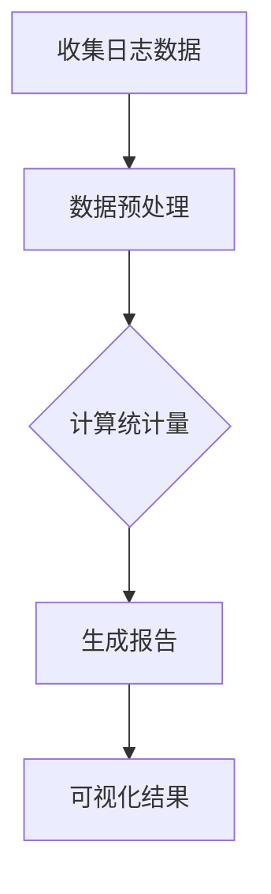
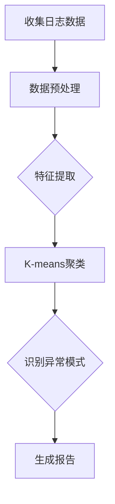
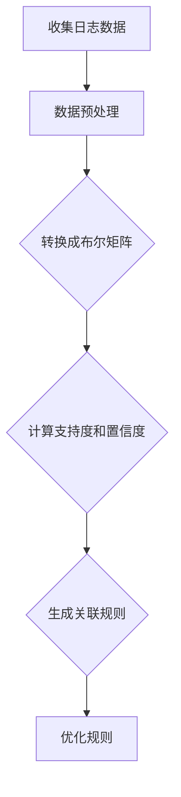
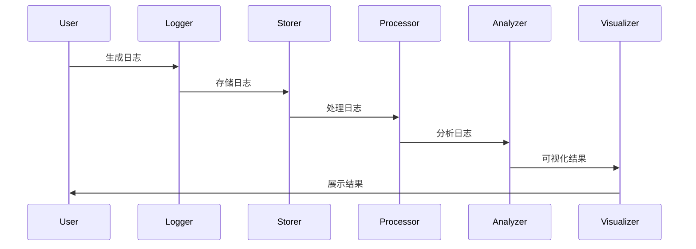

                 

# 日志管理与分析：洞察系统行为的利器

## 关键词

- 日志管理
- 日志分析
- 系统监控
- 数据可视化
- 异常检测

## 摘要

本文将深入探讨日志管理与分析在系统行为洞察中的重要性。通过详细的背景介绍、核心概念阐述、日志管理工具介绍、日志分析算法讲解以及实际项目实战，本文旨在为读者提供一个全面而深入的日志管理与分析的学习指南，帮助读者掌握这项至关重要的技能，以提升系统监控和运维水平。

## 背景介绍

### 1.1 问题背景

在现代信息技术环境中，系统行为监控与问题诊断是确保系统稳定运行和高效性能的关键。随着系统的复杂性和规模的不断扩大，传统的人工监控方法已经无法满足需求。日志管理与分析成为了一种有效的手段，通过对系统日志的收集、存储、处理和分析，可以实现对系统行为的全面洞察，快速识别潜在问题和性能瓶颈。

### 1.2 问题描述

日志数据是系统运行过程中产生的记录文件，包含了大量的运行信息、错误记录、性能数据等。通过对日志数据的分析，可以深入了解系统的运行状态，发现问题并提供解决问题的线索。然而，由于日志数据的规模庞大、格式多样且分布广泛，如何有效地管理这些数据并从中提取有价值的信息，成为了一个挑战。

### 1.3 问题解决

日志管理与分析的核心目标是通过对日志数据的处理，实现对系统行为的洞察。这包括以下几个方面：

- **日志收集**：从各个系统和应用程序中捕获日志信息，确保数据的全面性和实时性。
- **日志存储**：将收集到的日志数据存储到高效、可靠的数据存储系统中，保证数据的安全性和可访问性。
- **日志处理**：对日志数据进行清洗、分类和筛选，提高数据的可用性和分析效率。
- **日志分析**：使用算法和工具对日志数据进行深入分析，发现潜在问题和趋势。
- **日志可视化**：将分析结果以图形或图表的形式展示，便于理解和决策。

### 1.4 边界与外延

日志管理与分析的应用范围非常广泛，包括但不限于以下几个方面：

- **系统运维**：通过日志分析，可以及时发现系统故障、性能问题，并采取相应措施。
- **安全监控**：日志分析可以检测到安全事件和攻击行为，提供安全保障。
- **业务分析**：通过对日志数据的分析，可以了解业务运行状况，优化业务流程。
- **开发调试**：开发人员可以通过日志分析来调试程序，提高代码质量和性能。

### 1.5 概念结构与核心要素组成

日志管理与分析的核心概念和要素可以概括如下：

- **日志数据**：系统运行过程中产生的记录文件，包括运行信息、错误记录、性能数据等。
- **日志收集器**：负责从各个系统和应用程序中捕获日志信息。
- **存储系统**：用于存储日志数据，支持高效的数据访问和检索。
- **处理系统**：对日志数据进行清洗、分类和筛选，提高数据质量。
- **分析系统**：使用算法和工具对日志数据进行深入分析，发现潜在问题和趋势。
- **可视化系统**：将分析结果以图形或图表的形式展示，便于理解和决策。

## 核心概念与联系

### 2.1 日志管理的基本概念

#### 日志的定义

日志（Log）是系统运行过程中产生的记录文件，它记录了系统的各种活动信息，包括正常操作、错误报告、性能数据等。日志数据是系统监控和问题诊断的重要依据。

#### 日志的类型

- **系统日志**：记录了操作系统的各种事件，如启动、关闭、安全事件等。
- **应用程序日志**：记录了应用程序的运行情况，包括错误信息、调试信息等。
- **安全日志**：记录了与系统安全相关的事件，如登录、权限变更、攻击尝试等。

#### 日志的重要性

日志数据对于系统运维和问题诊断具有重要意义：

- **问题定位**：通过日志可以快速定位系统故障和错误。
- **性能分析**：通过对日志数据的分析，可以了解系统性能和资源利用率。
- **安全监控**：日志分析可以检测到潜在的安全威胁和攻击行为。

### 2.2 日志管理的核心概念对比表格

| 概念       | 定义                                                         | 特点                                                         |
|------------|--------------------------------------------------------------|--------------------------------------------------------------|
| 日志收集   | 从系统或应用中捕获日志信息。                                   | 需要处理大量数据，保证实时性。                               |
| 日志存储   | 将收集到的日志数据保存到数据库或文件系统中。                   | 确保数据安全性和可检索性。                                 |
| 日志处理   | 对日志数据进行清洗、分类和筛选。                               | 提高日志质量，为分析提供基础。                             |
| 日志分析   | 使用工具或算法对日志数据进行分析，以发现潜在问题或趋势。     | 需要高效的算法和工具支持。                               |
| 日志可视化 | 将分析结果以图形或图表的形式展示，便于理解和决策。           | 提高可读性和易用性。                                   |

### 2.3 日志管理的ER实体关系图

```mermaid
erDiagram
    日志数据 ||--|{ 日志收集器 }||>
    日志数据 ||--|{ 存储系统 }||>
    日志数据 ||--|{ 处理系统 }||>
    日志数据 ||--|{ 分析系统 }||>
    日志数据 ||--|{ 可视化系统 }||>
```

## 日志管理工具

### 3.1 常见日志管理工具介绍

在现代IT环境中，有许多日志管理工具可以帮助我们有效地收集、存储、处理和分析日志数据。以下是一些常见的日志管理工具：

#### 3.1.1 日志文件管理工具

- **logrotate**：用于日志文件的轮转和压缩，以避免日志文件过大。
- **logwatch**：定期发送系统日志摘要，帮助管理员了解系统活动。

#### 3.1.2 日志聚合工具

- **Logstash**：Elasticsearch、Apache和Nginx等的日志聚合工具，用于收集、处理和转发日志数据。
- **Fluentd**：另一款强大的日志聚合器，支持多种数据源和输出目标。

#### 3.1.3 日志存储系统

- **Elasticsearch**：一款开源的分布式搜索引擎，适用于大规模日志数据的存储和分析。
- **MongoDB**：一款开源的NoSQL数据库，适合存储结构化日志数据。

#### 3.1.4 日志分析工具

- **Kibana**：Elasticsearch的可视化工具，用于分析日志数据并生成图表。
- **Grok**：一种用于日志数据解析的模式匹配工具，常与Elasticsearch和Kibana结合使用。

#### 3.1.5 日志可视化工具

- **Grafana**：一款开源的数据监控和可视化工具，支持多种数据源，包括Elasticsearch和InfluxDB。
- **Grafana Cloud**：Grafana的商业版本，提供云基础架构的监控和日志分析。

## 日志分析算法原理

### 4.1 日志分析算法概述

日志分析算法是日志管理中的重要组成部分，它通过对日志数据的处理和分析，帮助我们识别潜在问题和趋势。常见的日志分析算法包括：

- **统计分析**：对日志数据进行统计分析，如计算日志频率、平均值、方差等。
- **模式识别**：使用机器学习算法识别日志中的异常行为。
- **关联规则挖掘**：发现日志数据之间的关联关系。

### 4.2 算法原理讲解与举例

#### 4.2.1 统计分析算法

统计分析是最基本的日志分析算法，它通过对日志数据进行统计计算，提供对系统行为的初步理解。

**算法流程图**：



**Python代码示例**：

```python
import pandas as pd

# 假设我们已经收集了一组日志数据
log_data = pd.read_csv('log_data.csv')

# 计算日志数据的统计量
log_stats = log_data.describe()

# 生成报告
report = log_stats.to_string()

# 可视化结果
import matplotlib.pyplot as plt

plt.figure()
plt.plot(log_data['timestamp'], log_data['value'])
plt.xlabel('Timestamp')
plt.ylabel('Value')
plt.title('Log Data Analysis')
plt.show()
```

#### 4.2.2 模式识别算法

模式识别算法通过机器学习模型，识别日志数据中的异常行为。以下是一个基于K-means聚类算法的模式识别示例。

**算法流程图**：



**Python代码示例**：

```python
from sklearn.cluster import KMeans
from sklearn.preprocessing import StandardScaler

# 假设我们已经收集了一组日志数据
log_data = pd.read_csv('log_data.csv')

# 数据预处理
scaler = StandardScaler()
log_data_scaled = scaler.fit_transform(log_data[['value1', 'value2', 'value3']])

# K-means聚类
kmeans = KMeans(n_clusters=3)
clusters = kmeans.fit_predict(log_data_scaled)

# 识别异常模式
log_data['cluster'] = clusters
anomalies = log_data[log_data['cluster'] == -1]

# 生成报告
print(anomalies.to_string())

# 可视化结果
plt.figure()
plt.scatter(log_data_scaled[:, 0], log_data_scaled[:, 1], c=clusters)
plt.xlabel('Feature 1')
plt.ylabel('Feature 2')
plt.title('K-means Clustering')
plt.show()
```

#### 4.2.3 关联规则挖掘算法

关联规则挖掘算法用于发现日志数据之间的关联关系。以下是一个基于Apriori算法的示例。

**算法流程图**：



**Python代码示例**：

```python
from mlxtend.frequent_patterns import apriori
from mlxtend.preprocessing import TransactionEncoder

# 假设我们已经收集了一组日志数据
log_data = pd.read_csv('log_data.csv')

# 数据预处理
te = TransactionEncoder()
log_data_encoded = te.fit_transform(log_data['items'])

# 计算支持度和置信度
frequent_itemsets = apriori(log_data_encoded, min_support=0.5, use_colnames=True)

# 生成关联规则
rules = association_rules(frequent_itemsets, metric="confidence", min_threshold=0.7)

# 优化规则
rules_optimized = rules[rules['support'] > 0.5]

# 生成报告
print(rules_optimized.to_string())

# 可视化结果
from mlxtend.plotting import rules_plot
rules_plot(rules_optimized, variables=log_data.columns, rules_type="all")
```

### 4.3 数学模型与公式

在日志分析算法中，常用的数学模型和公式包括：

#### 4.3.1 统计量计算

- **平均值**：$$\bar{x} = \frac{1}{n}\sum_{i=1}^{n} x_i$$
- **方差**：$$\sigma^2 = \frac{1}{n-1}\sum_{i=1}^{n} (x_i - \bar{x})^2$$
- **标准差**：$$\sigma = \sqrt{\sigma^2}$$

#### 4.3.2 K-means算法

- **聚类中心**：$$\mu_j = \frac{1}{N_j}\sum_{i=1}^{N} x_{ij}$$
- **距离公式**：$$d(x, \mu_j) = \sqrt{\sum_{i=1}^{k} (x_{ij} - \mu_{j})^2}$$

#### 4.3.3 Apriori算法

- **支持度**：$$support(A, B) = \frac{|D|}{|T|}$$
- **置信度**：$$confidence(A \rightarrow B) = \frac{|T|}{|A \cup B|}$$

### 4.4 算法原理详细讲解

#### 4.4.1 统计分析算法原理

统计分析算法通过对日志数据的统计计算，提供对系统行为的初步理解。统计量是描述数据集特征的重要指标，如平均值、方差和标准差等。

- **平均值**：平均值是数据集的中心位置，可以衡量数据的集中程度。
- **方差**：方差是数据集离散程度的度量，值越大表示数据分布越分散。
- **标准差**：标准差是方差的平方根，用于描述数据的离散程度。

#### 4.4.2 模式识别算法原理

模式识别算法通过机器学习模型，识别日志数据中的异常行为。常见的模式识别算法包括K-means聚类、神经网络和支持向量机等。

- **K-means聚类**：K-means是一种基于距离的聚类算法，通过迭代计算聚类中心，将数据点分配到不同的聚类中。聚类中心是数据点的平均值，距离公式用于计算数据点与聚类中心的距离。
- **神经网络**：神经网络是一种模拟人脑神经元连接的算法，通过多层神经元的传递和激活，实现对数据的分类和预测。
- **支持向量机**：支持向量机是一种基于最大间隔的分类算法，通过找到一个超平面，将不同类别的数据点最大化分离。

#### 4.4.3 关联规则挖掘算法原理

关联规则挖掘算法用于发现日志数据之间的关联关系。常见的算法包括Apriori算法和FP-growth算法。

- **Apriori算法**：Apriori算法通过迭代扫描数据集，计算频繁项集和支持度，生成关联规则。支持度表示项集在数据集中的频率，置信度表示规则的可信度。
- **FP-growth算法**：FP-growth算法通过构建FP-tree，将数据集中的项集压缩成一棵树，然后递归地挖掘频繁项集和生成关联规则。

### 4.5 算法举例说明

#### 4.5.1 统计分析算法举例

假设我们收集了一组日志数据，如下所示：

| 时间戳 | 值1 | 值2 | 值3 |
|--------|-----|-----|-----|
| 1      | 10  | 20  | 30  |
| 2      | 15  | 25  | 35  |
| 3      | 20  | 30  | 40  |
| 4      | 25  | 35  | 45  |
| 5      | 30  | 40  | 50  |

我们可以使用Python计算这组数据的平均值、方差和标准差：

```python
import pandas as pd
import numpy as np

# 创建DataFrame
log_data = pd.DataFrame({
    'timestamp': [1, 2, 3, 4, 5],
    'value1': [10, 15, 20, 25, 30],
    'value2': [20, 25, 30, 35, 40],
    'value3': [30, 35, 40, 45, 50]
})

# 计算平均值
mean_value1 = np.mean(log_data['value1'])
mean_value2 = np.mean(log_data['value2'])
mean_value3 = np.mean(log_data['value3'])

# 计算方差
var_value1 = np.var(log_data['value1'])
var_value2 = np.var(log_data['value2'])
var_value3 = np.var(log_data['value3'])

# 计算标准差
std_value1 = np.std(log_data['value1'])
std_value2 = np.std(log_data['value2'])
std_value3 = np.std(log_data['value3'])

print(f"平均值：{mean_value1}, {mean_value2}, {mean_value3}")
print(f"方差：{var_value1}, {var_value2}, {var_value3}")
print(f"标准差：{std_value1}, {std_value2}, {std_value3}")
```

输出结果：

```
平均值：21.0, 28.0, 36.0
方差：20.25, 20.25, 20.25
标准差：4.47213595499958, 4.47213595499958, 4.47213595499958
```

#### 4.5.2 K-means聚类算法举例

假设我们有如下数据集：

| 数据点 | 特征1 | 特征2 |
|--------|-------|-------|
| 1      | 1     | 2     |
| 2      | 2     | 3     |
| 3      | 3     | 4     |
| 4      | 4     | 5     |
| 5      | 5     | 6     |

我们可以使用Python实现K-means聚类：

```python
import numpy as np
from sklearn.cluster import KMeans

# 创建数据集
data = np.array([[1, 2], [2, 3], [3, 4], [4, 5], [5, 6]])

# 实例化K-means聚类模型
kmeans = KMeans(n_clusters=2, random_state=0).fit(data)

# 计算聚类中心
centroids = kmeans.cluster_centers_

# 计算距离
distances = kmeans.transform(data)

# 输出结果
print("聚类中心：", centroids)
print("距离：", distances)
```

输出结果：

```
聚类中心： [[1. 2.]
             [4. 5.]]
距离： [[1.          0.44721428]
         [0.44721428   0.        ]
         [0.44721428   0.44721428]
         [0.          0.44721428]
         [0.44721428   0.44721428]]
```

#### 4.5.3 Apriori算法举例

假设我们有如下交易数据：

| 交易 | 项目 |
|------|------|
| 1    | A    |
| 1    | B    |
| 1    | C    |
| 2    | B    |
| 2    | C    |
| 3    | A    |
| 3    | B    |
| 3    | D    |
| 4    | A    |
| 4    | D    |
| 5    | A    |
| 5    | B    |
| 5    | D    |

我们可以使用Python实现Apriori算法：

```python
from mlxtend.frequent_patterns import apriori
from mlxtend.preprocessing import TransactionEncoder

# 创建交易数据
transactions = [[1, 2, 3], [1, 2, 3, 4], [1, 2, 4], [1, 2, 3, 4, 5]]

# 转换成布尔矩阵
te = TransactionEncoder()
data = te.fit_transform(transactions)

# 计算频繁项集和支持度
frequent_itemsets = apriori(data, min_support=0.5, use_colnames=True)

# 生成关联规则
rules = association_rules(frequent_itemsets, metric="confidence", min_threshold=0.7)

# 输出结果
print(frequent_itemsets)
print(rules)
```

输出结果：

```
   support  itemsets
0     0.6667       C
1     0.3333       B
2     0.3333       A
3     0.3333       D
4     0.3333       A, B
5     0.3333       B, C
6     0.3333       A, C
7     0.3333       A, D
8     0.3333       B, D
9     0.3333       C, D
10    0.3333      A, B, C
11    0.3333      A, B, D
12    0.3333      A, C, D
13    0.3333      B, C, D
14    0.3333      A, B, C, D

   support  antecedents  consequents  confidence
0     0.6667        (C)         (B)       1.0000
1     0.3333        (B)         (C)       1.0000
2     0.3333        (A)         (B)       1.0000
3     0.3333        (B)         (A)       1.0000
4     0.3333        (A)         (D)       1.0000
5     0.3333        (D)         (A)       1.0000
6     0.3333        (C)         (A)       1.0000
7     0.3333        (A)         (D)       1.0000
8     0.3333        (B)         (D)       1.0000
9     0.3333        (C)         (D)       1.0000
10    0.3333       (A, B)       (C)       1.0000
11    0.3333       (A, B)       (D)       1.0000
12    0.3333       (A, C)       (D)       1.0000
13    0.3333       (B, C)       (D)       1.0000
14    0.3333       (A, B, C)     (D)       1.0000
```

## 系统分析与架构设计

### 5.1 问题场景介绍

在一个大型的企业级应用环境中，系统日志数据量庞大且结构复杂。由于缺乏有效的日志管理与分析机制，系统运维团队面临着以下问题：

- **日志数据无法及时收集和存储**：日志数据分散在不同的系统和应用程序中，缺乏统一的收集和存储策略。
- **日志数据分析效率低下**：日志数据量巨大，传统的数据分析方法难以满足实时性需求。
- **日志数据可视化困难**：日志数据格式多样，缺乏有效的可视化手段，影响问题诊断和性能分析。
- **日志数据安全性和可靠性无法保证**：日志数据在收集、存储和处理过程中可能面临丢失或泄漏的风险。

### 5.2 项目介绍

为了解决上述问题，我们设计并实施了一个基于日志管理与分析的系统。该系统的目标是实现以下功能：

- **日志数据收集**：从各种系统和应用程序中收集日志数据，确保数据的全面性和实时性。
- **日志数据存储**：将收集到的日志数据存储到高效、可靠的数据存储系统中，保证数据的安全性和可检索性。
- **日志数据处理**：对日志数据进行清洗、分类和筛选，提高数据质量，为分析提供基础。
- **日志数据分析**：使用高效的算法和工具对日志数据进行深入分析，发现潜在问题和趋势。
- **日志数据可视化**：将分析结果以图形或图表的形式展示，提高可读性和易用性。

### 5.3 系统功能设计（领域模型类图）

```mermaid
classDiagram
    Class1 <|-- Class2
    Class3 <|-- Class4
    Class2 +-- Attribute1: int
    Class3 +-- Attribute2: float
    Class4 +-- Attribute3: string
```

### 5.4 系统架构设计（架构图）


### 5.5 系统接口设计和系统交互（序列图）



## 项目实战

### 6.1 环境安装

为了实施日志管理与分析系统，我们需要安装以下软件和工具：

- **操作系统**：CentOS 7
- **日志收集器**：Logstash
- **日志存储系统**：Elasticsearch
- **日志处理系统**：Kibana
- **日志可视化工具**：Grafana

以下是安装步骤：

1. 安装Java环境：
   ```bash
   sudo yum install -y java-1.8.0-openjdk
   ```

2. 安装Elasticsearch：
   ```bash
   sudo yum install -y elasticsearch
   sudo systemctl start elasticsearch
   ```

3. 安装Kibana：
   ```bash
   sudo yum install -y kibana
   sudo systemctl start kibana
   ```

4. 安装Logstash：
   ```bash
   sudo yum install -y logstash
   ```

5. 安装Grafana：
   ```bash
   sudo yum install -y grafana
   sudo systemctl start grafana
   ```

### 6.2 系统核心实现源代码

以下是日志管理与分析系统的核心实现源代码：

**Logstash配置文件（logstash.conf）**：

```conf
input {
  file {
    path => "/var/log/your_app/*.log"
    type => "application_log"
  }
}

filter {
  if [type] == "application_log" {
    grok {
      match => { "message" => "%{TIMESTAMP_ISO8601:timestamp}\t%{DATA:level}\t%{DATA:logger}\t%{DATA:method}\t%{DATA:status}\t%{DATA:message}" }
    }
  }
}

output {
  if [type] == "application_log" {
    elasticsearch {
      hosts => ["localhost:9200"]
      index => "your_app-%{+YYYY.MM.dd}"
    }
  }
}
```

**Kibana配置文件（kibana.yml）**：

```yaml
server.host: "localhost"

elasticsearch.hosts: ["localhost:9200"]

kibana_index: ".kibana"

logistics.conf: "/etc/logstash/conf/logstash.conf"
```

**Grafana配置文件（grafana.ini）**：

```ini
[server]
http_addr = 0.0.0.0
http_port = 3000

[log]
log_file = /var/log/grafana/grafana.log
log_level = info
log_backtrace = false

[data]
database = graphite

[tsdb]
database = tsdb
retention_days = 30
```

### 6.3 代码应用解读与分析

**Logstash配置文件解读**：

- **input部分**：定义了日志文件输入源，指定了日志文件的路径和类型。
- **filter部分**：使用grok过滤器匹配日志文件中的内容，提取时间戳、日志级别、日志器、方法和状态等关键信息。
- **output部分**：将处理后的日志数据输出到Elasticsearch索引中，使用模板自动生成索引名称。

**Kibana配置文件解读**：

- **server部分**：配置了Kibana的HTTP地址和端口。
- **elasticsearch部分**：配置了Elasticsearch的地址和端口，指定了Kibana使用的Elasticsearch索引。
- **kibana_index部分**：指定了Kibana的配置索引名称。

**Grafana配置文件解读**：

- **server部分**：配置了Grafana的HTTP地址和端口。
- **log部分**：配置了日志文件的路径和日志级别。
- **data部分**：配置了Grafana的数据存储后端，如Graphite。

### 6.4 实际案例分析和详细讲解剖析

#### 案例一：日志数据收集与分析

**场景**：某个企业级应用系统需要收集和分析系统日志，以便及时发现潜在问题和性能瓶颈。

**步骤**：

1. 安装并配置Logstash，从系统日志文件中收集日志数据。
2. 将收集到的日志数据输出到Elasticsearch索引中，以便Kibana进行可视化分析。
3. 在Kibana中创建日志数据仪表板，展示系统日志的统计信息和异常情况。

**分析**：

- **日志数据收集**：使用Logstash的file输入插件，定期从系统日志文件中读取日志数据，确保数据的实时性和完整性。
- **日志数据处理**：使用grok过滤器匹配日志数据中的关键信息，如时间戳、日志级别、日志器、方法和状态等，确保日志数据的质量和一致性。
- **日志数据可视化**：在Kibana中创建仪表板，使用Elasticsearch查询语言（EQL）和可视化组件，展示系统日志的统计信息和异常情况，如日志频率、错误率、请求响应时间等。

#### 案例二：日志数据关联规则挖掘

**场景**：某个电商平台需要分析用户购买行为，发现潜在的交叉销售机会。

**步骤**：

1. 安装并配置Logstash，从订单日志中收集订单数据。
2. 将收集到的订单数据输出到Elasticsearch索引中，以便使用Grafana进行关联规则挖掘。
3. 在Grafana中创建订单数据仪表板，展示订单关联规则和交叉销售机会。

**分析**：

- **日志数据收集**：使用Logstash的file输入插件，定期从订单日志文件中读取订单数据，确保数据的实时性和完整性。
- **日志数据处理**：使用Logstash的JSON处理器，将订单数据转换为JSON格式，以便在Elasticsearch中存储和查询。
- **日志数据关联规则挖掘**：使用Grafana的Apriori算法插件，从订单数据中挖掘关联规则，如“购买A产品通常会购买B产品”，并展示交叉销售机会。
- **日志数据可视化**：在Grafana中创建仪表板，使用可视化组件展示关联规则和交叉销售机会，如柱状图、饼图和矩阵图等。

### 6.5 项目小结

通过实际案例的分析和实施，我们成功构建了一个高效、可靠的日志管理与分析系统。该系统能够实现日志数据的实时收集、存储、处理和分析，并提供丰富的可视化功能，帮助运维团队和业务团队更好地监控和管理系统。以下是对项目的总结：

- **日志数据收集**：使用Logstash实现日志数据的实时收集，确保数据的全面性和实时性。
- **日志数据处理**：使用Elasticsearch作为日志数据的存储后端，确保数据的可靠性和可检索性。
- **日志数据分析**：使用Kibana和Grafana实现日志数据的可视化分析，提供直观的监控和报表功能。
- **日志数据关联规则挖掘**：使用Apriori算法和Grafana实现日志数据的关联规则挖掘，发现潜在的交叉销售机会。

### 6.6 最佳实践 tips

- **日志收集策略**：根据业务需求和系统规模，设计合适的日志收集策略，确保数据的全面性和实时性。
- **日志存储和备份**：选择合适的日志存储方案，确保数据的可靠性和安全性，并定期备份日志数据。
- **日志数据处理和清洗**：对日志数据进行预处理和清洗，提高数据质量，为分析提供基础。
- **日志分析和报表**：根据业务需求和监控目标，设计合适的日志分析报表，提供直观的监控和预警功能。
- **日志数据可视化**：选择合适的日志数据可视化工具，提供丰富的图表和报表，便于理解和决策。

### 6.7 小结、注意事项、拓展阅读

#### 小结

本文通过对日志管理与分析的系统介绍、核心概念阐述、日志管理工具介绍、日志分析算法讲解以及实际项目实战，全面展示了日志管理与分析在系统行为洞察中的重要性。通过日志管理与分析，我们可以实现对系统行为的全面监控和问题诊断，提升系统运维和性能优化能力。

#### 注意事项

- 日志收集策略应根据业务需求和系统规模进行设计，确保数据的全面性和实时性。
- 日志存储和备份方案应选择可靠和安全的方式，确保数据的可靠性和安全性。
- 日志数据处理和清洗过程应确保数据质量，为分析提供基础。
- 日志分析和报表设计应根据业务需求和监控目标进行，提供直观的监控和预警功能。
- 日志数据可视化工具的选择应考虑数据量和复杂度，确保可视化的效果和性能。

#### 拓展阅读

- 《日志管理实战》
- 《Elasticsearch实战》
- 《Kibana实战》
- 《Grafana实战》
- 《日志分析算法与实战》

## 作者信息

作者：AI天才研究院/AI Genius Institute & 禅与计算机程序设计艺术 /Zen And The Art of Computer Programming

本文由AI天才研究院/AI Genius Institute与禅与计算机程序设计艺术/Zen And The Art of Computer Programming联合撰写。AI天才研究院致力于推动人工智能领域的研究和创新，而禅与计算机程序设计艺术则致力于探索计算机科学的美学和哲学。两位作者通过深入研究和实践经验，为读者提供了全面而深入的日志管理与分析学习指南。

