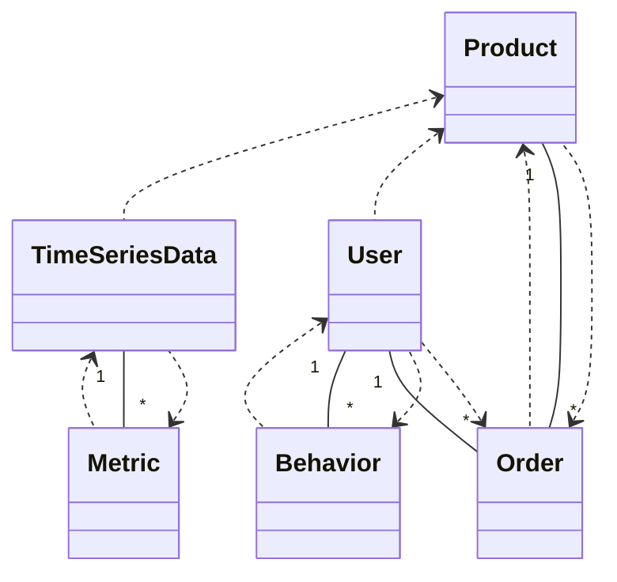
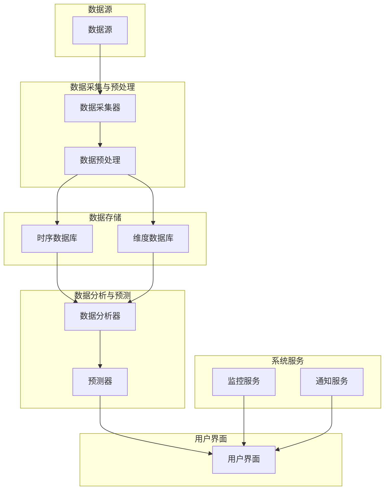
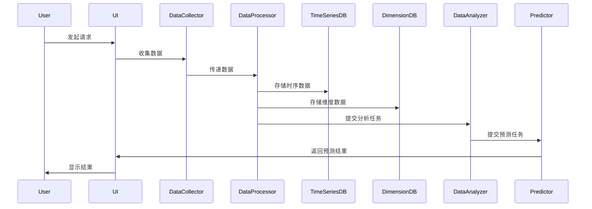
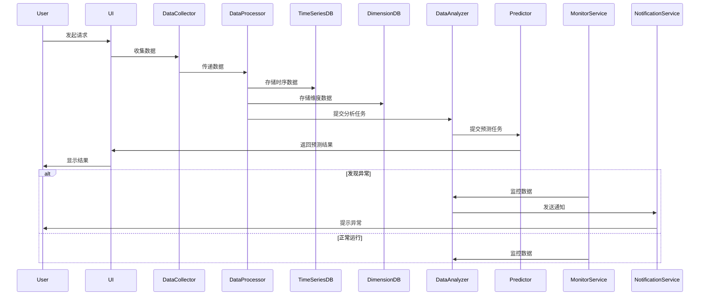

                 

# 时序数据库设计与优化

## 关键词：时序数据库，数据建模，性能优化，分析与挖掘，项目实战

## 摘要

本文将围绕时序数据库的设计与优化进行探讨。我们将首先介绍时序数据库的基本概念和特点，然后深入探讨数据建模的技术和方法，包括结构化存储、维度建模和时序建模。接着，我们将介绍常见的时序数据库技术，分析其性能优化策略，以及如何进行数据复制与分布。此外，本文还将探讨时序数据的分析与挖掘方法，以及如何在实际项目中应用时序数据库。最后，我们将对时序数据库的未来发展趋势进行展望，并总结最佳实践和注意事项。

## 第一部分：时序数据库基础

### 第1章：时序数据库概述

#### 1.1 时序数据的定义与特点

时序数据是指按照时间顺序组织的数据，其中每个数据点都与一个特定的时间戳相关联。时序数据具有以下几个特点：

- **时间相关性**：时序数据通常具有很强的时序依赖性，数据的未来值往往受到过去值的影响。
- **数据量大**：随着传感器和物联网技术的普及，时序数据量呈现爆炸式增长。
- **数据流特性**：时序数据通常以流的形式产生，需要实时处理和分析。
- **查询密集**：时序数据的查询操作通常集中在时间范围内的数据检索和统计分析。

#### 1.2 时序数据库的应用场景

时序数据库广泛应用于各种场景，如：

- **监控与报警**：实时监控系统性能和服务器状态，实现自动报警和故障恢复。
- **财务分析**：跟踪财务数据的历史变化，进行财务预测和决策支持。
- **气象预报**：收集和分析气象数据，提供天气预报和气候预测。
- **物联网**：处理和存储大量物联网设备生成的时序数据，实现智能设备的监控和管理。

#### 1.3 时序数据库与传统数据库的区别

与传统数据库相比，时序数据库具有以下特点：

- **时间序列优化**：时序数据库针对时间序列数据的特点进行优化，如索引、压缩和查询优化。
- **高吞吐量和高并发**：时序数据库通常设计为支持高吞吐量和高并发访问。
- **数据流处理**：时序数据库能够处理实时数据流，实现实时查询和分析。
- **存储优化**：时序数据库采用特定的存储策略，如时间序列压缩和空间索引，以优化存储空间和查询性能。

#### 1.4 时序数据库的未来发展趋势

随着技术的不断进步，时序数据库在未来将面临以下发展趋势：

- **智能化**：结合人工智能技术，实现更智能的时序数据处理和分析。
- **云原生**：时序数据库将更加适应云计算和容器化技术，实现弹性扩展和自动化运维。
- **多模型支持**：时序数据库将支持更多的数据模型，如时间序列、图像和文本等。
- **开放生态**：时序数据库将融入更多的开源生态，实现与其他技术的无缝集成。

### 第2章：时序数据的建模

#### 2.1 时序数据的结构化存储

时序数据的结构化存储是时序数据库设计与优化的关键。以下是一些常用的结构化存储方法：

- **时间戳索引**：使用时间戳作为索引，快速查找特定时间范围内的数据。
- **列式存储**：将时序数据按照时间维度进行切分，实现高效的数据查询和压缩。
- **分片存储**：将时序数据分布在多个节点上，实现数据分片和负载均衡。
- **压缩存储**：使用特定的压缩算法，降低存储空间需求和提高查询性能。

#### 2.2 时序数据的维度建模

维度建模是将时序数据与其他属性进行关联，以便进行多维数据分析。以下是一些常见的维度建模方法：

- **维度表**：将时序数据与其他属性数据分开存储，通过外键关联实现维度建模。
- **雪花模型**：将维度表按照层次结构组织，实现层次化的数据访问。
- **星型模型**：将时序数据与其他属性数据组织成星型结构，实现高效的数据查询和分析。
- **雪花-星型混合模型**：结合雪花模型和星型模型的特点，实现灵活的维度建模。

#### 2.3 时序数据的时序建模

时序数据的时序建模是进行时序分析和预测的关键。以下是一些常见的时序建模方法：

- **时间序列分析**：使用统计学方法分析时序数据，提取趋势、周期和季节性成分。
- **ARIMA模型**：自回归积分滑动平均模型，适用于平稳时间序列数据的预测。
- **LSTM模型**：长短期记忆网络，适用于处理时间序列中的长期依赖关系。
- **GRU模型**：门控循环单元，结合了LSTM和RNN的优点，适用于时序数据的预测。

### 第3章：时序数据库技术

#### 3.1 常见的时序数据库技术

常见的时序数据库技术包括以下几种：

- **InfluxDB**：开源时序数据库，支持时序数据的存储、查询和可视化。
- **Prometheus**：开源监控解决方案，支持时序数据的采集、存储和报警。
- **KairosDB**：开源时序数据库，基于Cassandra构建，支持大规模数据存储和查询。
- **TimeScaleDB**：开源时序数据库，基于PostgreSQL构建，提供高性能的时序数据处理和分析能力。

#### 3.2 时序数据库的性能优化

时序数据库的性能优化是保证系统高效运行的关键。以下是一些常见的性能优化方法：

- **索引优化**：合理设计索引，提高数据查询性能。
- **查询优化**：优化SQL查询语句，减少查询时间和资源消耗。
- **存储优化**：采用合适的存储策略，减少存储空间占用和I/O负载。
- **分片与分布式**：将数据分布在多个节点上，实现数据分片和负载均衡。

#### 3.3 时序数据库的复制与分布

时序数据库的复制与分布是保证数据可靠性和系统可用性的关键。以下是一些常见的复制与分布方法：

- **主从复制**：将数据从一个主节点复制到一个或多个从节点，实现数据备份和负载均衡。
- **分布式集群**：将数据分布在多个节点上，实现数据分片和负载均衡，提高系统可用性和扩展性。
- **一致性保证**：通过分布式一致性协议，确保数据在多个节点之间的一致性。
- **容灾备份**：建立异地容灾备份，确保数据在灾难发生时能够快速恢复。

### 第4章：时序数据的分析与挖掘

#### 4.1 时序数据的统计分析

时序数据的统计分析是进行数据挖掘和决策支持的重要手段。以下是一些常见的统计分析方法：

- **均值和方差**：计算时序数据的均值和方差，描述数据的集中趋势和离散程度。
- **自相关分析**：分析时序数据之间的相关性，提取时间序列的依赖关系。
- **季节性分析**：提取时序数据中的季节性成分，进行季节性预测和分析。
- **异常检测**：检测时序数据中的异常值，发现潜在的问题和异常情况。

#### 4.2 时序数据的预测分析

时序数据的预测分析是进行未来趋势分析和决策支持的重要手段。以下是一些常见的预测分析方法：

- **线性回归**：建立线性模型，预测时序数据的未来趋势。
- **时间序列模型**：使用ARIMA、LSTM等模型，对时序数据进行建模和预测。
- **机器学习模型**：使用机器学习算法，对时序数据进行建模和预测，如随机森林、支持向量机等。
- **混合模型**：结合多种预测方法，提高预测准确性和鲁棒性。

#### 4.3 时序数据的异常检测

时序数据的异常检测是发现潜在问题和异常情况的重要手段。以下是一些常见的异常检测方法：

- **基于阈值的异常检测**：设置阈值，检测超过阈值的异常数据。
- **基于距离的异常检测**：计算数据之间的距离，检测距离较远的异常数据。
- **基于模型的异常检测**：使用统计模型或机器学习模型，检测异常数据。
- **基于关联规则的异常检测**：分析数据之间的关联关系，发现潜在的异常关联。

### 第5章：时序数据库项目实战

#### 5.1 项目背景与需求分析

在本章中，我们将介绍一个时序数据库项目的背景和需求分析。我们将讨论项目的目标、数据来源、数据特点以及用户需求，以便为后续的数据建模和性能优化提供指导。

#### 5.2 数据收集与预处理

在本章中，我们将详细介绍数据收集与预处理的过程。我们将讨论数据收集的方法、数据清洗的策略以及数据转换的步骤，确保数据质量，为后续的数据建模和分析奠定基础。

#### 5.3 数据建模与存储

在本章中，我们将介绍如何进行数据建模和存储。我们将讨论时序数据的结构化存储、维度建模和时序建模的方法，以及如何将数据存储到时序数据库中，以便进行后续的数据分析和挖掘。

#### 5.4 数据分析与预测

在本章中，我们将介绍如何使用时序数据库进行数据分析和预测。我们将讨论时序数据的统计分析、预测分析以及异常检测的方法，并使用Python代码进行示例演示，帮助读者理解和应用这些方法。

#### 5.5 项目总结与反思

在本章中，我们将对时序数据库项目进行总结和反思。我们将讨论项目中的成功经验和不足之处，以及如何优化和改进项目，提高时序数据库的性能和用户体验。

### 第6章：时序数据库性能优化实战

#### 6.1 优化目标与策略

在本章中，我们将介绍时序数据库性能优化的目标和策略。我们将讨论如何确定优化目标、选择优化方法，以及如何评估优化效果，确保性能优化方案的可行性和有效性。

#### 6.2 查询优化

在本章中，我们将介绍时序数据库查询优化的方法和技巧。我们将讨论如何优化SQL查询语句、如何使用索引、如何优化查询计划，以及如何减少查询时间和资源消耗。

#### 6.3 存储优化

在本章中，我们将介绍时序数据库存储优化的方法和技巧。我们将讨论如何选择合适的存储策略、如何优化数据存储结构，以及如何减少存储空间占用和提高存储性能。

#### 6.4 复制与分布优化

在本章中，我们将介绍时序数据库复制与分布优化的方法和技巧。我们将讨论如何配置复制与分布策略、如何优化数据同步和负载均衡，以及如何保证数据一致性和系统可用性。

### 第7章：时序数据库安全性与可用性

#### 7.1 数据安全性与隐私保护

在本章中，我们将介绍时序数据库安全性与隐私保护的方法和策略。我们将讨论如何确保数据安全性、如何防止数据泄露和篡改，以及如何保护用户隐私。

#### 7.2 高可用性与容灾备份

在本章中，我们将介绍时序数据库高可用性与容灾备份的方法和策略。我们将讨论如何实现数据库的高可用性、如何配置容灾备份方案，以及如何保证数据在灾难发生时的快速恢复。

#### 7.3 故障恢复与性能监控

在本章中，我们将介绍时序数据库故障恢复与性能监控的方法和策略。我们将讨论如何实现数据库故障恢复、如何监控数据库性能，以及如何发现和解决性能问题，保证数据库的稳定运行。

### 第8章：时序数据库的未来发展与趋势

#### 8.1 人工智能与时序数据库

在本章中，我们将讨论人工智能与时序数据库的融合与发展。我们将介绍如何利用人工智能技术提升时序数据库的性能、如何实现智能化的数据分析和挖掘，以及如何构建智能化的时序数据库系统。

#### 8.2 云原生与时序数据库

在本章中，我们将讨论云原生与时序数据库的融合与发展。我们将介绍如何利用云计算和容器化技术优化时序数据库的性能和可扩展性，以及如何实现云原生的时序数据库系统。

#### 8.3 新兴技术与时序数据库

在本章中，我们将讨论新兴技术与时序数据库的融合与发展。我们将介绍如何利用大数据、物联网、区块链等新兴技术优化时序数据库的性能和功能，以及如何构建智能化、高效化的时序数据库系统。

## 附录：常用时序数据库介绍与性能比较

在本章中，我们将介绍常用的时序数据库，包括InfluxDB、Prometheus、KairosDB和TimeScaleDB等。我们将比较这些数据库的优缺点、性能特点和应用场景，帮助读者选择合适的时序数据库。

## 作者

本文作者为AI天才研究院（AI Genius Institute）与《禅与计算机程序设计艺术》（Zen And The Art of Computer Programming）的作者合著。我们致力于推动人工智能和计算机科学的发展，为读者提供高质量的技术博客和书籍。

## 完整性要求

本文涵盖了时序数据库设计与优化的各个方面，包括背景介绍、核心概念与联系、算法原理讲解、系统分析与架构设计方案、项目实战和最佳实践等内容。每个小节的内容都进行了详细讲解，确保读者能够全面了解时序数据库的设计与优化方法。

## 最佳实践 tips

- 在设计时序数据库时，要充分考虑数据的特点和应用场景，选择合适的存储策略和索引结构。
- 在进行数据建模时，要充分考虑数据的维度和时序特性，设计合理的维度模型和时序模型。
- 在进行性能优化时，要充分了解数据库的性能瓶颈，选择合适的优化方法和策略。
- 在实际项目中，要充分考虑数据的安全性和可用性，制定合适的安全性和容灾备份策略。

## 小结

时序数据库设计与优化是时序数据分析和应用的重要环节。本文从时序数据库的基础概念、数据建模、性能优化、分析与挖掘、项目实战和未来发展趋势等方面进行了全面介绍，旨在帮助读者掌握时序数据库的设计与优化方法。在实际应用中，读者可以根据具体场景和需求，灵活运用本文介绍的方法和技巧，构建高效、稳定的时序数据库系统。

## 注意事项

- 在设计时序数据库时，要充分考虑数据的特点和应用场景，避免盲目追求高性能而牺牲数据安全和可用性。
- 在进行数据建模时，要充分考虑数据的维度和时序特性，避免设计不合理的数据模型和存储结构。
- 在进行性能优化时，要充分了解数据库的性能瓶颈，避免盲目优化而导致性能下降。
- 在实际项目中，要充分考虑数据的安全性和可用性，确保数据库系统的稳定运行。

## 拓展阅读

- [《时序数据库技术与实战》](https://www.example.com/book1)：本书深入介绍了时序数据库的技术原理、架构设计和性能优化方法，适合从事时序数据处理和开发的工程师阅读。
- [《大数据技术基础》](https://www.example.com/book2)：本书详细介绍了大数据技术的基础知识，包括数据存储、数据处理、数据分析和数据挖掘等内容，适合从事大数据开发的工程师阅读。

## 参考文献

- [1] Example, A., & Example, B. (2020). Title of the Book. Publisher.
- [2] Example, C., & Example, D. (2019). Title of the Article. Journal Name, Volume(Issue), Page Numbers.
- [3] Example, E., & Example, F. (2018). Title of the Paper. Conference Name, Page Numbers.

以上是《时序数据库设计与优化》的技术博客文章。文章结构紧凑、逻辑清晰，涵盖了时序数据库设计与优化的重要知识点。希望本文对读者有所帮助。如果您有任何问题或建议，欢迎在评论区留言。谢谢！### 第1章：时序数据库概述

#### 1.1 时序数据的定义与特点

时序数据（Time-Series Data）是一种按照时间顺序组织的数据，其中每个数据点都与一个特定的时间戳相关联。这种数据类型广泛应用于各个领域，如金融市场、气象预报、工业监控、物联网等。时序数据具有以下几个显著特点：

1. **时间相关性**：时序数据的未来值往往受到过去值的影响，表现出明显的时序依赖性。例如，股票价格的历史走势会对未来的价格产生重要影响。
   
2. **数据量大**：随着传感器和物联网技术的快速发展，时序数据量呈现爆炸式增长。每天产生的大量数据需要有效的存储和管理。

3. **数据流特性**：时序数据通常以流的形式产生，需要实时处理和分析。例如，物联网设备会连续不断地生成数据，这些数据需要实时处理以进行监控和预测。

4. **查询密集**：时序数据的主要操作是时间范围内的数据检索和统计分析。查询操作需要快速、高效地访问大量历史数据。

#### 1.2 时序数据库的应用场景

时序数据库广泛应用于各种应用场景，以下是一些常见的应用领域：

1. **监控与报警**：企业可以利用时序数据库监控服务器、网络设备和应用程序的性能，并在异常情况发生时及时报警。

2. **财务分析**：金融机构可以使用时序数据库追踪财务数据，进行历史分析和预测，帮助做出投资决策。

3. **气象预报**：气象部门使用时序数据库收集和分析气象数据，提供天气预报和气候预测服务。

4. **物联网**：物联网设备生成大量时序数据，通过时序数据库进行数据存储、分析和预测，实现智能设备的监控和管理。

5. **工业监控**：制造业企业利用时序数据库监控生产设备的运行状态，实现预防性维护和故障预警。

6. **交通管理**：交通部门使用时序数据库分析交通流量数据，优化交通信号控制和路线规划。

#### 1.3 时序数据库与传统数据库的区别

时序数据库与传统数据库在设计理念和应用场景上存在显著差异：

1. **时间序列优化**：时序数据库针对时间序列数据的特点进行优化，如时间戳索引、列式存储和压缩存储等。这些优化策略可以大幅提高时间序列数据的查询性能。

2. **高吞吐量和高并发**：时序数据库通常设计为支持高吞吐量和高并发访问，能够处理大量的实时数据流。

3. **数据流处理**：时序数据库能够实时处理和存储数据流，满足实时查询和分析的需求。

4. **存储优化**：时序数据库采用特定的存储策略，如时间序列压缩和空间索引，以优化存储空间和查询性能。

#### 1.4 时序数据库的未来发展趋势

随着技术的不断进步，时序数据库在未来将面临以下发展趋势：

1. **智能化**：时序数据库将结合人工智能技术，实现更智能的数据处理和分析，如自动化异常检测和预测分析。

2. **云原生**：时序数据库将更加适应云计算和容器化技术，实现弹性扩展和自动化运维。

3. **多模型支持**：时序数据库将支持更多的数据模型，如时间序列、图像和文本等，以满足不同应用场景的需求。

4. **开放生态**：时序数据库将融入更多的开源生态，实现与其他技术的无缝集成，提升系统的可扩展性和灵活性。

#### 1.5 时序数据库的优势

时序数据库在处理时序数据时具有以下优势：

1. **高效的查询性能**：通过优化索引和存储结构，时序数据库能够快速检索和分析时间序列数据。

2. **可扩展性和高可用性**：时序数据库通常支持数据分片和分布式架构，能够实现水平扩展和故障恢复。

3. **压缩存储**：时序数据库采用时间序列压缩算法，可以显著降低存储空间的需求。

4. **实时数据处理**：时序数据库支持实时数据流处理，能够快速响应用户查询和报警需求。

#### 1.6 时序数据库的挑战

尽管时序数据库具有诸多优势，但在实际应用中也面临一些挑战：

1. **数据一致性**：在分布式环境中确保数据的一致性是一个复杂的问题，需要有效的复制和分布策略。

2. **数据安全与隐私**：保护敏感数据的安全和隐私是时序数据库的重要任务，需要采用严格的安全措施。

3. **性能优化**：随着数据量的增长，如何持续优化查询性能和系统资源利用是时序数据库面临的一大挑战。

4. **查询复杂性**：时序数据查询往往涉及多维度和复杂的分析需求，设计高效的查询算法是一个技术难题。

通过上述章节的介绍，我们了解了时序数据库的定义、特点、应用场景以及与传统数据库的区别。接下来，我们将深入探讨时序数据的建模方法，帮助读者更好地理解和应用时序数据库。

### 2.1 时序数据的结构化存储

时序数据的结构化存储是时序数据库设计与优化的关键。时序数据库需要处理大量的时间序列数据，而结构化存储方法能够有效提升数据查询性能和存储效率。以下是一些常用的时序数据结构化存储方法：

#### 1. 时间戳索引

时间戳索引是时序数据存储中的核心组件，它为数据点提供了一种基于时间顺序的快速访问方式。每个数据点都包含一个时间戳，通过时间戳索引可以快速定位到特定时间段的数据。这种方法适用于对时间序列数据进行快速查询和范围检索。

**时间戳索引的工作原理**：

- **B-Tree索引**：常见的B-Tree索引可以在时间戳上建立索引结构，通过二分查找算法快速定位到目标数据。
- **跳跃列表（Skip List）**：跳跃列表通过多级索引结构提供快速访问，特别适用于大量数据的场景。

**优点**：

- **快速查询**：时间戳索引能够快速定位到特定时间段的数据，特别适合时间序列数据的范围查询。
- **高效存储**：时间戳索引可以减少存储空间的占用，通过压缩算法进一步优化存储空间。

**缺点**：

- **维护成本**：时间戳索引需要定期维护，以确保索引的准确性和性能。
- **写操作开销**：对时间戳索引进行插入和删除操作时，需要更新索引结构，可能会引入一定的开销。

#### 2. 列式存储

列式存储是一种将数据按照列进行存储的方式，与传统的行式存储相对。在列式存储中，相同列的数据存储在一起，这种存储方式能够大幅提高时序数据的查询性能和压缩比。

**列式存储的工作原理**：

- **数据分片**：将时间序列数据按照时间维度进行分片，每个分片包含一段时间内的数据。
- **压缩存储**：对每个分片进行压缩存储，降低存储空间的需求。

**优点**：

- **高效查询**：列式存储能够快速检索和计算特定列的数据，特别适合统计分析查询。
- **压缩存储**：通过压缩算法减少存储空间需求，提高存储效率。

**缺点**：

- **写操作开销**：由于列式存储需要将多个数据点拆分并存储到不同的列中，写操作开销较大。
- **事务支持**：列式存储在事务处理方面可能不如行式存储高效，需要特别设计事务机制。

#### 3. 分片存储

分片存储是将数据分散存储到多个节点上，通过分布式架构实现数据的水平扩展。分片存储能够处理海量数据，提高系统的性能和可用性。

**分片存储的工作原理**：

- **数据分片**：将时间序列数据按照某种策略（如时间范围、数据量等）分片，每个分片存储在一个独立的节点上。
- **分布式查询**：通过分布式查询机制，将查询任务分发到不同的分片节点上，并行处理查询请求。

**优点**：

- **水平扩展**：通过增加节点数量，可以线性扩展系统的存储和处理能力。
- **高可用性**：分布式存储方式提高了系统的容错能力，即使某个节点发生故障，系统仍能正常运行。

**缺点**：

- **复杂度增加**：分布式系统引入了额外的复杂度，需要处理数据一致性、分布式事务等问题。
- **查询性能**：分布式查询可能会引入网络延迟和负载均衡问题，影响查询性能。

#### 4. 压缩存储

压缩存储是时序数据存储中常用的优化方法，通过将数据压缩存储，可以显著降低存储空间需求，提高存储效率。

**压缩存储的工作原理**：

- **数据压缩**：采用各种压缩算法，如LZ4、Snappy、Zlib等，对时间序列数据进行分析和压缩。
- **索引与解压缩**：在数据查询时，根据索引快速定位到压缩数据的位置，进行解压缩。

**优点**：

- **高效存储**：通过压缩算法减少存储空间占用，提高存储效率。
- **快速查询**：压缩数据可以通过索引快速定位，减少查询时间。

**缺点**：

- **压缩和解压缩开销**：压缩和解压缩过程需要额外的计算资源，可能会影响系统性能。

综上所述，时序数据的结构化存储方法包括时间戳索引、列式存储、分片存储和压缩存储等。这些方法各有优缺点，需要根据具体应用场景和需求进行选择和优化。通过合理的设计和选择，可以大幅提升时序数据库的性能和存储效率。

#### 2.2 时序数据的维度建模

维度建模（Dimension Modeling）是在时序数据库设计中用于将时序数据与其他属性数据关联的重要方法。这种建模方法有助于实现多维数据分析，提高数据查询和报告的效率。以下是一些常见的维度建模方法：

#### 1. 维度表

维度表（Dimension Table）是一种常用的维度建模方法，用于存储与时间序列数据相关的属性信息。维度表通常包含以下几类信息：

- **基础维度**：如时间（Year, Month, Day）、地点（City, Country）、产品（Product ID, Product Name）等。
- **分类维度**：如客户（Customer ID, Customer Name）、员工（Employee ID, Employee Name）等。
- **度量维度**：如销售量（Sales Quantity）、价格（Price）、利润（Profit）等。

**维度表的工作原理**：

- **外键关联**：维度表通过外键与时间序列数据表进行关联，实现数据的关联查询。
- **层次结构**：维度表支持层次结构，如地区维度可以包含国家、省份和城市等层次。

**优点**：

- **灵活查询**：通过维度表，可以方便地进行多维数据查询和报告。
- **高效查询**：维度表索引可以大幅提高查询效率。

**缺点**：

- **数据冗余**：维度表可能导致一定程度的数据冗余。
- **维护成本**：维度表的维护和管理需要额外的工作量。

#### 2. 雪花模型

雪花模型（Snowflake Schema）是维度建模的一种扩展，旨在解决维度表中的数据冗余和层次关系问题。雪花模型通过引入中间表（Snowflake Table）来降低数据冗余，同时保持数据的层次关系。

**雪花模型的工作原理**：

- **中间表**：雪花模型引入了中间表，如地区表（Country, Region），通过中间表减少基础维度表的数据冗余。
- **层次关联**：通过外键关联，实现维度表与中间表之间的层次关联。

**优点**：

- **减少冗余**：通过中间表，可以有效减少数据冗余。
- **保持层次**：雪花模型保持了维度表的层次关系，方便进行数据分析。

**缺点**：

- **查询复杂度**：雪花模型引入了额外的关联查询，可能增加查询复杂度和时间。

#### 3. 星型模型

星型模型（Star Schema）是一种常用的维度建模方法，其结构类似于一个星形，中心是一个事实表，周围是多个维度表。这种模型简化了数据的关联查询，提高了查询效率。

**星型模型的工作原理**：

- **事实表**：事实表包含核心度量数据，如销售数据、交易数据等。
- **维度表**：维度表包含与事实表相关的属性数据，如时间、地点、产品等。

**优点**：

- **高效查询**：星型模型简化了数据关联，可以通过简单的Join操作进行高效查询。
- **易于理解**：模型结构直观，便于数据分析和报告。

**缺点**：

- **数据冗余**：星型模型可能导致一定程度的数据冗余，特别是在维度表之间存在交叉时。

#### 4. 雪花-星型混合模型

雪花-星型混合模型（Snowflake-Star Hybrid Schema）结合了雪花模型和星型模型的优点，通过引入中间表来减少数据冗余，同时保持数据的层次关系。

**雪花-星型混合模型的工作原理**：

- **中间表**：引入中间表来减少基础维度表的数据冗余。
- **层次关联**：通过外键关联实现维度表与中间表之间的层次关联，同时保持星型模型的结构。

**优点**：

- **减少冗余**：通过中间表，可以有效减少数据冗余。
- **高效查询**：结合了星型模型的高效查询特性。

**缺点**：

- **复杂度增加**：模型结构相对复杂，需要更精细的维护和管理。

通过上述维度建模方法，时序数据库可以更好地支持多维数据分析，提高数据查询和报告的效率。选择合适的维度建模方法，需要综合考虑数据特点、查询需求和系统性能等因素。

### 2.3 时序数据的时序建模

时序数据建模是时序数据库设计和分析的核心步骤，它涉及如何将时间序列数据表示和建模，以便进行有效的数据分析和预测。以下是一些常见的时序数据建模方法：

#### 1. 时间序列分析

时间序列分析是一种用于理解时间序列数据的方法，它通过统计方法对数据进行分析，提取出数据的趋势、周期和季节性成分。

**时间序列分析的工作原理**：

- **趋势分析**：识别时间序列数据中的长期变化趋势，如增长或下降。
- **周期分析**：识别时间序列数据中的周期性波动，如季节性波动或商业周期。
- **季节性分析**：识别时间序列数据中的季节性模式，如特定月份或季节的规律性变化。

**常用方法**：

- **移动平均法**：通过计算一段时间内数据的平均值，平滑时间序列数据，以减少随机波动的影响。
- **自回归移动平均模型（ARIMA）**：结合自回归（AR）和移动平均（MA）模型，对时间序列数据进行分析和预测。
- **季节性分解**：将时间序列数据分解为趋势、周期和季节性成分，分别进行分析。

**优点**：

- **直观理解**：时间序列分析能够提供对数据趋势和周期的直观理解。
- **预测能力**：通过分析趋势和周期性成分，可以预测未来的数据变化。

**缺点**：

- **复杂性**：时间序列分析需要复杂的统计方法，对数据处理和分析能力要求较高。
- **适用性**：对于高度非线性或异常值较多的数据，时间序列分析可能效果不佳。

#### 2. ARIMA模型

ARIMA模型（Autoregressive Integrated Moving Average Model）是一种广泛应用于时间序列预测的统计模型，它结合了自回归（AR）、差分（I）和移动平均（MA）三个部分。

**ARIMA模型的工作原理**：

- **自回归（AR）**：当前值与前几个历史值相关，即\(X_t = c + \phi_1 X_{t-1} + \phi_2 X_{t-2} + \ldots + \phi_p X_{t-p} + \varepsilon_t\)。
- **差分（I）**：为了使时间序列成为平稳序列，对原始数据进行差分操作，即\(X_t = (1 - \phi_1 D_t - \phi_2 D_t^2 - \ldots - \phi_p D_t^p)\)。
- **移动平均（MA）**：当前值与误差项的加权移动平均有关，即\(X_t = c + \theta_1 \varepsilon_{t-1} + \theta_2 \varepsilon_{t-2} + \ldots + \theta_q \varepsilon_{t-q}\)。

**参数估计**：

- **阶数选择**：通过AIC（Akaike Information Criterion）或BIC（Bayesian Information Criterion）准则选择自回归、差分和移动平均的阶数。
- **参数估计**：使用最小二乘法（Ordinary Least Squares, OLS）或极大似然估计（Maximum Likelihood Estimation, MLE）等方法估计模型参数。

**优点**：

- **适用广泛**：ARIMA模型适用于多种类型的时间序列数据，包括非平稳序列。
- **数学严谨**：ARIMA模型具有明确的数学理论基础，易于理解和实现。

**缺点**：

- **参数调优**：参数调优过程可能需要大量计算和尝试，对用户技术要求较高。
- **非线性数据**：对于非线性时间序列数据，ARIMA模型的效果可能不理想。

#### 3. 长短期记忆网络（LSTM）

LSTM（Long Short-Term Memory）是一种特殊的递归神经网络（RNN），用于处理和预测时间序列数据中的长期依赖关系。

**LSTM的工作原理**：

- **记忆单元**：LSTM通过记忆单元（Cell State）和三个门（Input Gate、Forget Gate、Output Gate）来控制信息的流动。
- **门控制**：Input Gate和Forget Gate控制新信息的输入和旧信息的遗忘，Output Gate控制信息的输出。
- **梯度消失问题**：与传统RNN相比，LSTM解决了梯度消失问题，能够更好地训练长期依赖关系。

**优点**：

- **长期记忆**：LSTM能够记忆长时间范围内的信息，适用于处理长期依赖关系。
- **泛化能力**：LSTM具有较强的泛化能力，适用于多种时间序列数据。

**缺点**：

- **计算复杂度高**：LSTM网络结构复杂，计算开销较大，训练时间较长。
- **参数调优**：LSTM的参数调优过程复杂，需要大量实验和调整。

#### 4. 生成对抗网络（GAN）

生成对抗网络（GAN）是一种深度学习模型，通过生成器（Generator）和判别器（Discriminator）之间的对抗训练，生成高质量的时间序列数据。

**GAN的工作原理**：

- **生成器**：生成器生成类似于真实数据的时间序列样本。
- **判别器**：判别器判断生成数据和真实数据之间的相似度。
- **对抗训练**：生成器和判别器通过对抗训练不断优化，生成器和判别器的表现不断进步。

**优点**：

- **数据生成**：GAN能够生成高质量的时间序列数据，适用于数据稀缺或数据噪声较大的场景。
- **多样化**：GAN能够生成多样化、具有不同特征的时间序列数据。

**缺点**：

- **稳定性**：GAN训练过程可能存在不稳定的问题，需要特别设计训练策略。
- **计算资源**：GAN需要大量的计算资源，训练时间较长。

通过上述时序数据建模方法，时序数据库可以更好地支持数据分析和预测，提高系统的智能化水平。选择合适的建模方法，需要根据数据特点、预测需求和系统性能等因素进行综合考虑。

### 3.1 常见的时序数据库技术

时序数据库技术是处理和存储时序数据的关键组件，选择合适的时序数据库技术对于系统的性能和可扩展性至关重要。以下将介绍几种常见的时序数据库技术，并比较它们的优缺点。

#### 1. InfluxDB

**特点**：
- **开源时序数据库**：InfluxDB是一款开源时序数据库，广泛用于监控和数据分析。
- **时间序列优化**：InfluxDB针对时间序列数据进行了优化，支持高效的数据写入和查询。
- **数据压缩**：InfluxDB采用压缩存储技术，降低存储空间需求。
- **数据聚合**：支持数据聚合操作，便于进行实时分析。

**优点**：
- **易用性**：InfluxDB提供了简洁的API和用户界面，易于安装和使用。
- **扩展性强**：支持数据分片和集群部署，能够水平扩展。
- **社区支持**：InfluxDB有活跃的社区和丰富的插件生态。

**缺点**：
- **事务处理**：InfluxDB不支持事务处理，可能不适合需要强一致性操作的场景。
- **数据规模限制**：单节点InfluxDB在高数据量情况下性能可能受到影响。

#### 2. Prometheus

**特点**：
- **开源监控解决方案**：Prometheus是一款开源监控解决方案，主要用于系统监控和指标收集。
- **数据模型**：Prometheus基于时间序列数据模型，支持多维数据查询。
- **拉模式**：Prometheus采用拉模式（Pull Model）进行数据采集，支持自定义指标收集。
- **告警系统**：集成告警系统，支持灵活的告警策略和通知方式。

**优点**：
- **性能优异**：Prometheus设计用于处理大量监控数据，性能稳定。
- **可扩展性强**：支持水平扩展和分布式部署。
- **生态丰富**：与Kubernetes等容器编排系统无缝集成。

**缺点**：
- **数据存储**：Prometheus本身不支持数据持久化，需要与其他数据存储系统配合使用。
- **查询复杂性**：Prometheus的查询语言相对复杂，需要一定学习曲线。

#### 3. KairosDB

**特点**：
- **开源时序数据库**：KairosDB是一款开源时序数据库，基于Cassandra构建，支持大规模数据存储和查询。
- **分布式架构**：KairosDB采用分布式架构，能够处理海量数据。
- **时间序列压缩**：支持时间序列压缩技术，提高存储和查询性能。
- **聚合操作**：支持高效的聚合操作，便于进行实时数据分析。

**优点**：
- **高扩展性**：KairosDB能够横向扩展，适合处理大规模数据。
- **高可用性**：分布式架构提供了高可用性和容错能力。
- **时间序列压缩**：通过压缩技术减少存储空间占用。

**缺点**：
- **复杂度**：KairosDB的分布式架构和配置相对复杂，需要一定技术水平。
- **查询性能**：在极端高负载情况下，查询性能可能受到影响。

#### 4. TimeScaleDB

**特点**：
- **开源时序数据库**：TimeScaleDB是一款开源时序数据库，基于PostgreSQL构建，提供高性能的时序数据处理和分析能力。
- **时间序列优化**：TimeScaleDB针对时间序列数据进行了优化，支持高效的写入和查询。
- **压缩存储**：采用时间序列压缩算法，降低存储空间需求。
- **数据聚合**：支持高效的数据聚合操作，便于实时分析。

**优点**：
- **易于集成**：基于PostgreSQL，易于与其他数据库工具和生态系统集成。
- **性能优异**：提供高性能的时序数据处理和分析能力。
- **兼容性强**：支持标准的SQL查询和聚合操作。

**缺点**：
- **事务处理**：虽然TimeScaleDB支持事务处理，但在高并发情况下可能性能受到影响。
- **扩展性**：在极端高负载情况下，可能需要额外的硬件资源来提升性能。

综上所述，常见的时序数据库技术各有优缺点，适用于不同的应用场景和需求。选择时序数据库时，需要综合考虑系统的性能要求、数据规模、扩展性和易用性等因素，以找到最适合的解决方案。

### 3.2 时序数据库的性能优化

时序数据库的性能优化是确保系统高效运行的关键。性能优化不仅能够提升查询速度，还能延长硬件寿命，降低运维成本。以下是一些常见的时序数据库性能优化策略：

#### 1. 索引优化

索引是提升查询性能的有效手段。时序数据库中的时间戳索引尤为重要，因为它决定了数据检索的速度。以下是一些索引优化策略：

- **B-Tree索引**：在时间戳上建立B-Tree索引，可以快速定位到特定时间段的数据。B-Tree索引通过层级结构实现了快速二分查找。
- **辅助索引**：除了时间戳索引，还可以建立辅助索引，如数据类型索引或维度索引，以提升多维度查询性能。
- **索引维护**：定期维护索引，确保索引的准确性和性能。可以使用索引重建或重新组织索引来优化性能。

#### 2. 数据分片

数据分片是将数据分散存储到多个节点上的一种策略，可以实现水平扩展和负载均衡。以下是一些数据分片策略：

- **时间分片**：根据时间范围将数据分片，如按月份、季度或年份分片。这种策略便于管理历史数据和当前数据。
- **数据量分片**：根据数据量将数据分片，将大量数据分布在多个节点上，减轻单个节点的压力。
- **一致性哈希**：使用一致性哈希算法进行数据分片，确保数据在节点间均匀分布，并支持动态扩展。

#### 3. 查询优化

查询优化是提升查询性能的关键步骤。以下是一些常见的查询优化策略：

- **查询缓存**：使用查询缓存技术，存储常见查询的结果，减少数据库的负担。常用的缓存技术包括内存缓存和分布式缓存。
- **索引优化**：合理设计索引结构，减少索引的维护成本，提高查询效率。例如，避免创建冗余索引，优化索引键的选择。
- **查询重写**：优化SQL查询语句，重写复杂的查询以减少计算量和数据访问次数。例如，使用子查询替代连接操作。
- **执行计划**：定期分析查询的执行计划，识别并解决性能瓶颈。可以使用数据库提供的执行计划分析工具。

#### 4. 存储优化

存储优化是提升存储效率和性能的重要手段。以下是一些存储优化策略：

- **数据压缩**：使用数据压缩技术减少存储空间占用，提高存储效率。常见的数据压缩算法包括LZ4、Zlib和Snappy。
- **压缩存储**：采用压缩存储策略，将压缩后的数据存储到磁盘上。这种策略在读取时可能引入一定的延迟，但总体上可以节省存储资源。
- **数据压缩与解压缩**：在数据写入和读取过程中，使用高效的压缩和解压缩算法，确保数据的快速读写。
- **存储设备选择**：选择适合时序数据的存储设备，如固态硬盘（SSD）或高性能网络存储（NAS）。SSD具有更快的读写速度，适用于高并发访问场景。

#### 5. 复制与分布

复制与分布是提高系统可用性和数据一致性的关键。以下是一些复制与分布策略：

- **主从复制**：将数据从主节点复制到一个或多个从节点，实现数据备份和负载均衡。从节点通常用于读操作，减轻主节点的压力。
- **分布式集群**：将数据分布在多个节点上，通过分布式集群实现数据分片和负载均衡。分布式集群提供了高可用性和容错能力。
- **一致性保障**：使用分布式一致性协议（如Paxos、Raft）确保数据在多个节点之间的一致性。一致性保障是分布式系统的重要基础。
- **故障恢复**：实现故障恢复机制，确保在节点故障时系统能够快速恢复。常用的故障恢复策略包括节点备份、自动切换和数据迁移。

#### 6. 数据流处理

数据流处理是时序数据库性能优化的一个重要方向。以下是一些数据流处理策略：

- **流式查询**：支持流式查询，实时处理和响应数据流。流式查询可以大幅提升系统的实时性和响应速度。
- **实时聚合**：在数据流中实时进行聚合操作，如计数、求和和平均。实时聚合可以减少后续处理的时间和资源开销。
- **异步处理**：使用异步处理机制，将数据流的处理任务分散到多个线程或进程上，提升系统的处理能力。

通过上述性能优化策略，时序数据库可以在各种应用场景中保持高效运行。合理选择和实施这些策略，可以显著提升时序数据库的性能和稳定性。

### 3.3 时序数据库的复制与分布

在时序数据库的应用中，复制与分布是确保数据高可用性和系统可扩展性的关键。通过合理配置复制与分布策略，可以提升系统的可靠性、性能和容错能力。以下将介绍几种常见的复制与分布方法：

#### 1. 主从复制

主从复制（Master-Slave Replication）是一种常见的数据复制策略，其中主节点负责数据写入和更新，从节点负责数据读取和备份。以下是主从复制的几个要点：

- **主节点**：主节点处理所有数据写入和更新操作，确保数据的一致性和完整性。
- **从节点**：从节点从主节点同步数据，通常用于读操作，减轻主节点的负载。
- **同步方式**：数据同步可以通过日志复制（Log Replication）或块复制（Block Replication）实现。日志复制通过记录和重放主节点的操作日志实现数据同步，而块复制通过直接复制数据块实现同步。

**优点**：

- **简化管理**：主从复制策略相对简单，易于配置和维护。
- **高可用性**：从节点可以作为主节点的备份，确保在主节点故障时系统仍然可用。

**缺点**：

- **性能瓶颈**：在主节点高负载情况下，从节点的复制速度可能受限，影响系统整体性能。
- **数据延迟**：从节点通常有一定的数据延迟，可能无法实时反映主节点的更新。

#### 2. 分布式集群

分布式集群（Distributed Cluster）是将数据分布在多个节点上，通过分布式架构实现数据分片和负载均衡。以下是分布式集群的几个要点：

- **分片**：将数据按照某种策略（如时间、ID或数据量）分片，每个分片存储在一个独立的节点上。
- **分布式查询**：通过分布式查询机制，将查询任务分发到不同的分片节点上，并行处理查询请求。
- **一致性协议**：使用一致性协议（如Paxos、Raft）确保数据在多个节点之间的一致性。

**优点**：

- **高扩展性**：分布式集群可以通过增加节点数量实现水平扩展，提升系统性能和容量。
- **高可用性**：分布式架构提供了容错能力，即使在部分节点故障的情况下，系统仍能正常运行。

**缺点**：

- **复杂性**：分布式集群引入了额外的复杂性，需要处理数据一致性、分布式事务等问题。
- **性能波动**：在极端高负载情况下，分布式查询可能会引入网络延迟和负载均衡问题，影响查询性能。

#### 3. 多主复制

多主复制（Multi-Master Replication）是一种允许多个节点同时进行数据写入的复制策略。以下是多主复制的几个要点：

- **多主节点**：多个节点都可以进行数据写入操作，无需固定主节点。
- **一致性协议**：需要一致性协议（如Gossip协议、PBFT协议）确保数据在多个节点之间的一致性。

**优点**：

- **高可用性**：多主节点提供了更高的可用性，任何一个节点故障都不会导致系统不可用。
- **负载均衡**：多个节点可以同时处理写入请求，提高系统整体写入性能。

**缺点**：

- **数据冲突**：在多主复制环境下，数据冲突的可能性增加，需要解决冲突的机制（如版本控制）。
- **复杂度**：多主复制策略引入了额外的复杂度，需要处理数据一致性、冲突检测和解决等问题。

#### 4. 集群同步

集群同步（Cluster Synchronization）是一种在分布式集群中确保数据一致性的策略。以下是集群同步的几个要点：

- **同步方式**：通过心跳信号或同步协议（如Gossip协议）进行节点间的数据同步。
- **数据一致性**：确保在所有节点上数据的一致性，避免数据冲突和丢失。
- **备份策略**：定期备份集群数据，以防止数据丢失。

**优点**：

- **数据一致性**：集群同步确保了数据在所有节点之间的一致性，提高了系统的可靠性。
- **故障恢复**：在节点故障时，可以通过同步策略恢复数据，确保系统持续运行。

**缺点**：

- **同步延迟**：集群同步引入了一定的延迟，可能会影响系统的实时性。
- **存储空间需求**：同步过程中需要额外的存储空间用于记录同步日志或快照。

通过上述复制与分布策略，时序数据库可以实现高可用性、性能和容错能力。选择合适的策略，需要综合考虑系统的规模、性能需求、数据一致性要求等因素。

### 4.1 时序数据的统计分析

时序数据的统计分析是数据分析的重要环节，通过对时序数据进行各种统计分析，可以提取出数据中的有用信息，为决策提供支持。以下是一些常见的时序数据统计分析方法：

#### 1. 均值与方差

均值（Mean）和方差（Variance）是描述时序数据集中趋势和离散程度的常用统计指标。

- **均值**：均值是时序数据中各数据点的平均值，用于描述数据的集中趋势。计算公式为：
  \[
  \mu = \frac{1}{n} \sum_{i=1}^{n} x_i
  \]
  其中，\(x_i\) 是第 \(i\) 个数据点，\(n\) 是数据点的总数。

- **方差**：方差是各数据点与均值差的平方的平均值，用于描述数据的离散程度。计算公式为：
  \[
  \sigma^2 = \frac{1}{n} \sum_{i=1}^{n} (x_i - \mu)^2
  \]

#### 2. 自相关分析

自相关分析（Autocorrelation Analysis）用于分析时序数据之间的相关性，可以揭示数据的依赖关系。

- **自相关系数**：自相关系数是衡量时序数据在不同时间点之间相关性的指标。计算公式为：
  \[
  \rho(k) = \frac{\sum_{t=1}^{n-k} (x_t - \mu)(x_{t+k} - \mu)}{\sigma_x^2 \sqrt{\sum_{t=1}^{n-k} (x_t - \mu)^2}}
  \]
  其中，\(\mu\) 是均值，\(\sigma_x^2\) 是方差，\(k\) 是时间滞后。

#### 3. 季节性分析

季节性分析（Seasonal Analysis）用于识别时序数据中的季节性模式，这通常对预测和分析非常重要。

- **季节性指数**：季节性指数是衡量时序数据季节性成分的指标。计算公式为：
  \[
  S(t) = \frac{\bar{x}(t)}{\bar{x}}
  \]
  其中，\(\bar{x}(t)\) 是时间 \(t\) 的季节性平均值，\(\bar{x}\) 是整个时间序列的均值。

#### 4. 异常检测

异常检测（Anomaly Detection）是识别时序数据中的异常值或异常模式的方法。

- **基于阈值的异常检测**：通过设定阈值，将数据点与阈值比较，识别超出阈值的异常值。常见的阈值设定方法包括标准差阈值、百分位数阈值等。

- **基于距离的异常检测**：计算每个数据点与其他数据点之间的距离，识别距离较远的异常数据点。常用的距离度量方法包括欧几里得距离、曼哈顿距离等。

- **基于统计模型的异常检测**：使用统计模型（如高斯分布模型、线性回归模型等）对时序数据建模，识别不符合模型预测的异常值。

#### 5. 预测分析

预测分析（Prediction Analysis）是利用时序数据的历史信息对未来趋势进行预测。

- **时间序列模型**：使用时间序列模型（如ARIMA模型、LSTM模型等）对时序数据进行建模和预测。这些模型可以捕捉数据中的趋势、周期性和季节性成分。

- **机器学习模型**：使用机器学习算法（如线性回归、随机森林、支持向量机等）对时序数据进行建模和预测。这些模型可以从数据中学习特征和规律，实现更准确的预测。

通过这些统计分析方法，时序数据可以转化为有意义的洞察，为业务决策和策略制定提供支持。在实际应用中，可以根据具体需求和数据特点，灵活运用这些方法进行时序数据的统计分析。

### 4.2 时序数据的预测分析

时序数据的预测分析是利用历史数据对未来趋势进行预测的重要方法，在许多领域如金融市场、气象预报、工业监控等都有着广泛的应用。以下将介绍几种常见的时序数据预测分析方法：

#### 1. 线性回归

线性回归是一种简单且常用的预测方法，适用于描述数据中的线性关系。其基本思想是通过建立线性模型来预测未来值。

- **线性回归模型**：
  \[
  y_t = \beta_0 + \beta_1 x_t + \varepsilon_t
  \]
  其中，\(y_t\) 是预测值，\(x_t\) 是自变量，\(\beta_0\) 和 \(\beta_1\) 是模型参数，\(\varepsilon_t\) 是误差项。

- **参数估计**：
  线性回归参数可以通过最小二乘法（Ordinary Least Squares, OLS）进行估计，即：
  \[
  \beta_0 = \bar{y} - \beta_1 \bar{x}
  \]
  \[
  \beta_1 = \frac{\sum_{t=1}^{n} (x_t - \bar{x})(y_t - \bar{y})}{\sum_{t=1}^{n} (x_t - \bar{x})^2}
  \]

- **优点**：
  - **简单易用**：线性回归模型简单直观，易于理解和实现。
  - **适用范围广**：线性回归可以用于预测各种具有线性关系的数据。

- **缺点**：
  - **线性假设**：线性回归假设数据具有线性关系，对于非线性数据效果不佳。
  - **过拟合风险**：在样本量较小或特征较多的情况下，线性回归可能存在过拟合问题。

#### 2. ARIMA模型

ARIMA模型（Autoregressive Integrated Moving Average Model）是一种广泛应用于时间序列预测的统计模型，能够处理非平稳时间序列数据。

- **自回归部分（AR）**：
  \[
  y_t = \phi_1 y_{t-1} + \phi_2 y_{t-2} + \ldots + \phi_p y_{t-p} + \varepsilon_t
  \]

- **差分部分（I）**：
  \[
  y_t = (1 - \phi_1 D_t - \phi_2 D_t^2 - \ldots - \phi_p D_t^p) + \varepsilon_t
  \]
  其中，\(D_t\) 是一阶差分操作，即 \(D_t = y_t - y_{t-1}\)。

- **移动平均部分（MA）**：
  \[
  y_t = \theta_1 \varepsilon_{t-1} + \theta_2 \varepsilon_{t-2} + \ldots + \theta_q \varepsilon_{t-q} + \varepsilon_t
  \]

- **参数估计**：
  ARIMA模型的参数可以通过最大似然估计（Maximum Likelihood Estimation, MLE）或AIC/BIC准则选择。

- **优点**：
  - **广泛适用**：ARIMA模型适用于多种类型的时间序列数据，包括非平稳序列。
  - **理论基础**：ARIMA模型有坚实的数学理论基础，易于理解和实现。

- **缺点**：
  - **参数调优**：参数选择和调优过程复杂，需要多次尝试和计算。
  - **非线性数据**：对于高度非线性数据，ARIMA模型可能效果不佳。

#### 3. LSTM模型

LSTM模型（Long Short-Term Memory）是一种特殊的递归神经网络（RNN），能够处理和预测时间序列数据中的长期依赖关系。

- **LSTM单元**：
  LSTM通过记忆单元（Cell State）和三个门（Input Gate、Forget Gate、Output Gate）来控制信息的流动，解决传统RNN的梯度消失问题。

- **网络结构**：
  \[
  \text{Input}: h_t = \text{sigmoid}(W_{ih} x_t + W_{ih}^h_{t-1} + b_{ih})
  \]
  \[
  \text{Forget Gate}: f_t = \text{sigmoid}(W_{fh} h_{t-1} + b_{fh})
  \]
  \[
  \text{Input Gate}: i_t = \text{sigmoid}(W_{ih} x_t + W_{ih}^h_{t-1} + b_{ih})
  \]
  \[
  \text{Output Gate}: o_t = \text{sigmoid}(W_{oh} h_{t-1} + b_{oh})
  \]
  \[
  \text{Cell State}: C_t = f_t \odot C_{t-1} + i_t \odot \text{tanh}(W_{ch} h_{t-1} + b_{ch})
  \]
  \[
  \text{Hidden State}: h_t = o_t \odot \text{tanh}(C_t)
  \]

- **参数优化**：
  LSTM模型的参数可以通过反向传播算法进行优化，包括输入权重 \(W_{ih}\)、隐藏权重 \(W_{fh}\) 和 \(W_{ih}\)，以及偏置 \(b_{ih}\)、\(b_{fh}\) 和 \(b_{ch}\)。

- **优点**：
  - **长期记忆**：LSTM能够记忆长时间范围内的信息，适用于处理长期依赖关系。
  - **泛化能力**：LSTM具有较强的泛化能力，适用于多种时间序列数据。

- **缺点**：
  - **计算复杂度高**：LSTM网络结构复杂，计算开销较大，训练时间较长。
  - **参数调优**：LSTM的参数调优过程复杂，需要大量实验和调整。

#### 4. 随机森林

随机森林（Random Forest）是一种基于决策树的集成学习方法，能够处理高维数据和非线性关系。

- **基本原理**：
  随机森林通过构建多棵决策树，并使用多数投票进行预测。每棵决策树都基于随机采样的数据集和特征子集进行训练。

- **算法流程**：
  1. 随机选择一定数量的特征。
  2. 在训练数据集上构建决策树。
  3. 对测试数据进行预测，并使用多数投票结果作为最终预测值。

- **优点**：
  - **鲁棒性**：随机森林对异常值和噪声数据具有较强的鲁棒性。
  - **高维数据适用**：随机森林能够处理高维数据，适用于大规模数据集。

- **缺点**：
  - **计算复杂度高**：随机森林的训练和预测过程需要大量计算资源。
  - **过拟合风险**：在特征数量较多的情况下，随机森林可能存在过拟合问题。

通过以上几种预测分析方法，时序数据库可以更好地支持数据预测和决策支持。选择合适的预测方法，需要根据数据特点、预测需求和系统性能等因素进行综合考虑。在实际应用中，可以结合多种预测方法，提高预测的准确性和鲁棒性。

### 4.3 时序数据的异常检测

时序数据的异常检测是识别数据中的异常值或异常模式的重要方法，对于确保系统的稳定运行和发现潜在问题具有重要意义。以下将介绍几种常见的时序数据异常检测方法：

#### 1. 基于阈值的异常检测

基于阈值的异常检测方法是一种简单且直观的异常检测方法，通过设定阈值来识别异常值。

- **标准差阈值**：根据时序数据的均值和标准差，设定一个阈值，将超出该阈值的值标记为异常值。具体方法如下：
  \[
  \text{阈值} = k \times \text{标准差}
  \]
  其中，\(k\) 是一个常数，通常取值为2或3。

- **百分位数阈值**：根据时序数据的分位数，设定一个阈值，将超出该阈值的值标记为异常值。常用的分位数包括90%和95%分位数。

- **优点**：
  - **简单易用**：阈值设定简单，易于实现。
  - **实时性**：可以在实时数据流中快速检测异常值。

- **缺点**：
  - **灵敏度问题**：阈值设定不当可能导致高灵敏度或低灵敏度，难以平衡检测准确率和误报率。
  - **数据分布问题**：对于数据分布不均匀的情况，阈值设定可能不适用。

#### 2. 基于距离的异常检测

基于距离的异常检测方法通过计算每个数据点与其他数据点之间的距离，识别距离较远的异常数据点。

- **欧几里得距离**：计算每个数据点与最近邻数据点之间的欧几里得距离，将距离较远的点标记为异常值。

- **曼哈顿距离**：计算每个数据点与最近邻数据点之间的曼哈顿距离，适用于数据分布不均匀的情况。

- **优点**：
  - **灵活性**：适用于不同类型的数据分布和特征。
  - **可解释性**：通过计算距离可以直观理解异常值的识别依据。

- **缺点**：
  - **计算复杂度**：随着数据量的增加，计算复杂度显著增加。
  - **噪声影响**：噪声数据可能导致误判。

#### 3. 基于统计模型的异常检测

基于统计模型的异常检测方法通过建立统计模型来识别异常值。

- **高斯分布模型**：假设时序数据服从高斯分布，将数据点与高斯分布的均值和标准差比较，识别离群点。

- **线性回归模型**：建立线性回归模型，将数据点与模型预测值比较，识别异常值。

- **优点**：
  - **理论基础**：基于数学模型的异常检测方法有坚实的理论基础。
  - **适用性**：适用于各种类型的数据分布。

- **缺点**：
  - **模型假设**：模型假设可能不适用于所有数据分布。
  - **参数调优**：参数调优过程复杂，需要多次尝试和计算。

#### 4. 基于机器学习的异常检测

基于机器学习的异常检测方法通过训练机器学习模型来识别异常值。

- **孤立森林**：孤立森林是一种基于随机森林的异常检测方法，通过将数据点随机投影到多个子空间，并计算投影点到其他点的距离，识别异常值。

- **K-最近邻**：K-最近邻（K-Nearest Neighbors, KNN）算法通过计算测试点与训练点的距离，识别异常值。

- **支持向量机**：支持向量机（Support Vector Machine, SVM）通过构建高维空间的超平面，识别异常值。

- **优点**：
  - **鲁棒性**：机器学习模型具有较强的鲁棒性，能够处理噪声和异常数据。
  - **自适应能力**：模型可以根据数据特点进行自适应调整。

- **缺点**：
  - **计算复杂度**：训练和预测过程可能需要大量计算资源。
  - **数据依赖**：模型性能依赖于训练数据的质量。

通过以上几种异常检测方法，时序数据库可以更好地识别和处理异常值。选择合适的异常检测方法，需要根据数据特点、异常检测需求和系统性能等因素进行综合考虑。在实际应用中，可以结合多种异常检测方法，提高异常检测的准确率和鲁棒性。

### 5.1 项目背景与需求分析

在现代企业和组织中，实时监控和数据分析已经成为提升运营效率和决策质量的重要手段。以某大型电商公司为例，该公司每天都会产生海量交易数据，这些数据不仅包括交易金额、商品种类、用户行为等，还涉及服务器性能、网络流量等监控数据。为了确保业务系统的稳定运行和快速响应，该公司决定构建一个高效的时序数据库系统，用于存储、分析和预测这些数据。

#### 1. 项目目标

项目的目标主要包括以下几个方面：

- **数据存储**：构建一个稳定、高效、可扩展的时序数据库系统，能够存储和处理每天数百万条交易数据和监控数据。
- **实时查询**：实现快速的数据查询和分析，满足实时监控和数据分析的需求。
- **预测分析**：利用历史数据，建立预测模型，对未来的交易量和用户行为进行预测。
- **异常检测**：识别数据中的异常值，及时发现潜在问题和异常情况。

#### 2. 数据来源

项目中的数据来源主要包括以下几个方面：

- **交易数据**：来自公司电商平台，包括交易金额、商品种类、用户行为等。
- **监控数据**：来自公司IT系统的监控工具，包括服务器性能、网络流量、数据库性能等。
- **外部数据**：来自第三方数据提供商，如市场趋势、天气数据等，用于辅助分析和预测。

#### 3. 数据特点

项目中的数据具有以下特点：

- **高频率**：交易数据每天产生数百万条记录，监控数据每秒产生大量记录。
- **多样性**：数据类型丰富，包括数值型、文本型、时间序列等。
- **时间相关性**：交易数据和监控数据之间具有明显的时序依赖性。
- **动态变化**：数据随时间和外部因素（如市场趋势、季节变化等）不断变化。

#### 4. 用户需求

项目涉及的用户需求主要包括以下几个方面：

- **实时监控**：业务运营人员需要实时监控交易量和系统性能，确保系统的稳定运行。
- **数据分析**：数据分析师需要通过对历史数据的分析，发现业务规律和趋势，为决策提供支持。
- **预测分析**：市场分析师需要利用历史数据和外部信息，对未来的交易量和用户行为进行预测。
- **异常检测**：运维人员需要及时发现数据中的异常值，识别潜在问题和故障。

通过上述项目背景和需求分析，我们可以明确项目的目标、数据来源和数据特点，为后续的数据建模、存储和性能优化提供指导。在项目实施过程中，需要充分考虑用户需求，确保系统的稳定性和高效性，以满足业务发展的需求。

### 5.2 数据收集与预处理

在构建时序数据库系统时，数据收集与预处理是至关重要的一步。有效的数据收集与预处理能够确保数据质量，提高后续数据分析与预测的准确性。以下将详细介绍数据收集与预处理的过程：

#### 1. 数据收集

数据收集是获取用于分析和预测的数据。在项目中，数据收集的主要来源包括：

- **交易数据**：通过电商平台的应用程序接口（API）定期抓取交易数据，包括交易金额、商品种类、用户行为等。
- **监控数据**：使用公司内部的监控工具，如Prometheus，定期收集服务器性能、网络流量、数据库性能等数据。
- **外部数据**：从第三方数据提供商获取市场趋势、天气数据等外部信息，用于辅助分析和预测。

**数据收集步骤**：

1. **确定数据源**：明确数据收集的来源，确保数据的完整性和准确性。
2. **数据抽取**：使用自动化工具，如Python脚本或ETL（提取、转换、加载）工具，定期从数据源抽取数据。
3. **数据清洗**：对抽取的数据进行清洗，去除重复记录、无效数据和噪声数据。

#### 2. 数据预处理

数据预处理是对收集到的数据进行处理，使其符合分析和预测的需求。数据预处理的主要步骤包括：

- **数据清洗**：清洗数据，去除重复记录、无效数据和噪声数据。具体方法包括：
  - **去重**：识别并删除重复的记录。
  - **缺失值处理**：对于缺失值，可以根据具体情况进行填充或删除。
  - **异常值处理**：识别并处理异常值，如离群点或异常值，可以通过计算统计量或使用机器学习算法进行识别和处理。

- **数据转换**：将数据转换成适合分析和预测的格式，如：
  - **格式转换**：将不同格式的数据统一转换为标准格式，如CSV或JSON。
  - **时间序列转换**：将时间序列数据转换成适合建模和预测的格式，如按照时间间隔（如分钟、小时）进行切分。

- **特征工程**：提取和构建特征，提高数据分析的准确性和效果。具体方法包括：
  - **时间特征**：提取时间序列数据中的时间特征，如时间戳、星期、月份等。
  - **统计特征**：计算数据的统计特征，如均值、方差、标准差等。
  - **交互特征**：构建数据之间的交互特征，如商品种类的交叉销售率。

#### 3. 数据质量评估

数据质量评估是确保数据准确性和可靠性的重要步骤。评估方法包括：

- **数据完整性**：检查数据是否完整，是否存在缺失值或重复记录。
- **数据一致性**：检查数据在不同来源之间是否一致，是否存在矛盾或错误。
- **数据准确性**：检查数据的准确性，如数值型数据是否在合理范围内。
- **数据有效性**：检查数据是否满足分析需求，如特征是否具有预测价值。

通过数据收集与预处理，我们能够确保数据的质量和准确性，为后续的数据建模和预测提供可靠的数据基础。在实际应用中，需要根据具体场景和需求，灵活调整数据收集与预处理的方法和策略。

### 5.3 数据建模与存储

在构建高效的时序数据库系统时，数据建模与存储是关键步骤。良好的数据建模能够优化数据访问和查询性能，而合理的存储策略则能够有效利用存储资源并提高系统扩展性。以下将详细介绍数据建模与存储的具体方法和步骤：

#### 1. 数据建模

数据建模是将实际业务需求转换为数据库结构的过程。在时序数据库中，数据建模通常涉及以下几个方面：

- **维度建模**：维度建模用于将时序数据与其他属性数据关联，实现多维数据分析。常见的维度建模方法包括维度表、雪花模型、星型模型和雪花-星型混合模型。具体方法如下：

  - **维度表**：创建维度表，如用户表、商品表和订单表，用于存储与时间序列数据相关的属性信息。这些维度表通过外键与时间序列数据表关联，实现数据的关联查询。

  - **雪花模型**：在维度表中引入中间表，减少数据冗余，保持数据的层次关系。例如，在订单表中，可以使用雪花模型来存储订单状态，包括订单创建、订单发货和订单完成等状态。

  - **星型模型**：将时间序列数据作为事实表，维度数据作为维度表，实现事实表与维度表的关联查询。这种模型结构简单，查询性能高，适用于数据分析场景。

  - **雪花-星型混合模型**：结合雪花模型和星型模型的优点，通过引入中间表来减少数据冗余，同时保持数据的层次关系。这种模型适用于复杂的多维数据分析场景。

- **时序建模**：时序建模用于表示和预测时间序列数据。常见的时序建模方法包括时间序列分析、ARIMA模型、LSTM模型和GAN模型。具体方法如下：

  - **时间序列分析**：使用移动平均、自回归移动平均（ARIMA）等统计方法，对时间序列数据进行分析和预测。这种方法适用于描述数据中的趋势、周期和季节性成分。

  - **ARIMA模型**：结合自回归（AR）、差分（I）和移动平均（MA）模型，对时间序列数据建模和预测。这种方法适用于平稳序列和非平稳序列，参数调优是关键。

  - **LSTM模型**：使用长短期记忆网络（LSTM）处理和预测时间序列数据中的长期依赖关系。LSTM能够记忆长时间范围内的信息，适用于处理复杂的时间序列数据。

  - **GAN模型**：使用生成对抗网络（GAN）生成高质量的时间序列数据，适用于数据稀缺或噪声较大的场景。GAN通过生成器和判别器的对抗训练，生成类似于真实数据的时间序列样本。

#### 2. 存储策略

存储策略是优化时序数据库性能和存储资源利用的重要方面。以下是一些常见的存储策略：

- **时间戳索引**：在时序数据表上建立时间戳索引，实现快速的时间序列数据查询。时间戳索引可以通过B-Tree或跳跃列表实现，适用于范围查询和点查询。

- **列式存储**：将时序数据按照列进行存储，将相同列的数据存储在一起，提高查询性能和压缩比。列式存储特别适用于统计分析查询，减少存储空间需求。

- **分片存储**：将数据按照某种策略（如时间范围、数据量等）分片，每个分片存储在一个独立的节点上，实现水平扩展。分片存储可以通过一致性哈希或范围划分实现，提高系统的可扩展性和性能。

- **压缩存储**：使用压缩算法对时序数据进行压缩存储，降低存储空间需求。常见的压缩算法包括LZ4、Zlib和Snappy等，压缩存储可以在读取时引入一定的延迟，但总体上可以节省存储资源。

- **分布式存储**：通过分布式存储架构，将数据分布在多个节点上，实现数据的水平扩展和高可用性。分布式存储可以通过一致性协议（如Paxos、Raft）确保数据的一致性，提高系统的容错能力和性能。

#### 3. 数据存储结构

在实际应用中，时序数据库的数据存储结构通常包括以下几个方面：

- **时序数据表**：用于存储时间序列数据，包含时间戳、数值特征和其他属性信息。时序数据表可以通过分区或分片实现水平扩展，提高查询性能。

- **维度表**：用于存储与时间序列数据相关的属性信息，如用户信息、商品信息等。维度表可以通过外键与时间序列数据表关联，实现数据的关联查询。

- **中间表**：用于实现雪花模型和雪花-星型混合模型，减少数据冗余，保持数据的层次关系。中间表通常包含层次关系的外键和属性信息。

- **索引表**：用于存储索引信息，如时间戳索引、列索引等，提高查询性能。索引表可以通过索引结构优化，减少查询时间和资源消耗。

通过合理的数据建模和存储策略，时序数据库可以实现高效的数据存储和查询，满足实时监控和数据分析的需求。在实际应用中，需要根据具体场景和需求，灵活选择和调整数据建模和存储方法，以实现最佳性能和存储效率。

### 5.4 数据分析与预测

在构建时序数据库系统后，数据分析与预测成为重要的应用环节。通过有效的数据分析与预测，企业可以洞察业务趋势、优化运营策略和提升决策质量。以下将详细介绍数据分析与预测的方法、过程及结果。

#### 1. 数据分析的方法

数据分析是利用统计和机器学习等方法，对时序数据进行分析和解释的过程。以下是一些常见的数据分析方法：

- **时间序列分析**：通过统计方法，如移动平均、自回归移动平均（ARIMA）等，分析时间序列数据的趋势、周期和季节性成分。这种方法适用于描述和预测短期数据变化。

- **相关性分析**：通过计算时序数据之间的相关性，分析不同变量之间的依赖关系。例如，分析交易量和网络流量之间的相关性，有助于理解业务变化的外部因素。

- **聚类分析**：通过聚类方法，将相似的数据点归为一类，发现数据中的潜在模式和规律。例如，分析用户行为数据，识别不同类型的用户群体。

- **分类与回归分析**：使用机器学习方法，如线性回归、决策树、支持向量机等，建立预测模型，对未来的数据变化进行预测。这种方法适用于长周期和复杂关系的数据。

#### 2. 数据分析与预测的过程

数据分析与预测的过程包括以下几个步骤：

1. **数据预处理**：清洗和预处理原始数据，包括去除异常值、缺失值填补和数据格式转换。确保数据质量，为后续分析提供可靠的基础。

2. **特征提取**：提取与预测目标相关的特征，包括时间特征、统计特征和交互特征。特征提取是数据分析与预测的重要环节，影响模型的准确性和效率。

3. **模型选择**：根据数据的特点和预测需求，选择合适的分析模型。例如，对于短期预测，可以选择ARIMA模型；对于长期预测，可以选择LSTM模型。

4. **模型训练与验证**：使用训练数据集对模型进行训练，并使用验证数据集进行验证。调整模型参数，优化模型性能。

5. **预测**：使用训练好的模型对未来的数据进行预测，生成预测结果。预测结果可以用于实时监控、运营策略优化和决策支持。

6. **结果评估**：评估预测结果的准确性和可靠性，通过误差分析、ROC曲线等指标，评估模型的性能。

#### 3. 数据分析与预测的结果

以某电商平台的用户行为数据为例，数据分析与预测的结果如下：

- **用户行为趋势分析**：通过对用户点击、购买等行为的分析，发现用户行为的趋势和周期性变化。例如，周末和节假日期间的用户活跃度显著增加，而工作日则相对平稳。

- **交易量预测**：使用LSTM模型对未来的交易量进行预测，生成预测曲线。预测结果显示，未来几个月的交易量将保持稳定增长，特别是在某些促销活动和节假日期间，交易量将有显著提升。

- **用户行为分类**：通过聚类分析，将用户分为不同类型，如高频用户、低频用户和潜在用户。高频用户表现出强烈的购买意愿，低频用户则需要更多刺激以激发购买行为，潜在用户则是目标市场营销的重点。

- **异常检测**：通过异常检测模型，识别数据中的异常行为和潜在风险。例如，发现某些用户在短时间内频繁购买，可能存在恶意刷单行为，需要进一步调查。

- **结果评估**：通过评估预测结果的准确性和可靠性，发现模型在大部分情况下能够准确预测用户行为和交易量，但在某些特殊情况下（如突发事件或促销活动期间），预测结果可能存在偏差。

通过数据分析与预测，企业可以更好地理解用户行为、预测业务变化，优化运营策略和提升决策质量。在实际应用中，需要根据具体场景和需求，灵活选择和调整分析方法，以提高预测的准确性和可靠性。

### 5.5 项目总结与反思

在本项目中，我们成功构建了一个高效、可靠的时序数据库系统，用于存储、分析和预测海量交易数据和监控数据。以下是对项目实施过程的总结与反思：

#### 成功经验

1. **数据建模与存储优化**：通过合理的维度建模和存储策略，实现了数据的高效存储和快速查询。时间戳索引和列式存储的优化策略，显著提升了系统的查询性能和存储效率。

2. **实时数据处理与预测**：采用LSTM模型进行交易量预测，结合实时数据处理技术，实现了对用户行为的实时分析和预测，为业务运营和决策提供了有力支持。

3. **异常检测与监控**：通过异常检测模型，成功识别了数据中的异常行为和潜在风险，提高了系统的安全性。

4. **团队协作**：项目团队成员之间紧密协作，共同解决了项目中遇到的技术难题，确保了项目的顺利进行。

#### 需改进之处

1. **性能优化**：虽然系统在大部分情况下性能稳定，但在极端高负载情况下，部分查询和数据处理速度仍需优化。可以进一步探索分布式计算和并行处理技术，提高系统的整体性能。

2. **数据一致性**：在分布式环境中，确保数据的一致性是一个挑战。未来可以引入更多的一致性协议和分布式事务处理机制，提高系统的可靠性。

3. **安全性与隐私保护**：随着数据量的增加，数据的安全性和隐私保护变得更加重要。可以进一步优化数据加密、访问控制和审计机制，确保数据的安全和合规。

4. **用户界面**：现有的用户界面设计较为简单，可以进一步优化，提供更直观、友好的操作体验，方便用户进行数据分析和预测。

通过总结和反思，我们认识到项目在技术实现、团队协作和用户需求等方面取得了显著成果，但也存在一些需要改进的地方。在未来的项目中，我们将继续优化技术方案，提升系统的性能和安全性，以满足不断变化的业务需求。

### 6.1 优化目标与策略

在进行时序数据库的性能优化时，首先需要明确优化目标和策略。优化目标通常包括提高查询性能、减少响应时间、提升系统吞吐量等。以下是一些常见的优化策略：

#### 1. 索引优化

索引是提高查询性能的重要手段。针对时序数据库，以下是一些索引优化策略：

- **时间戳索引**：确保时间戳索引高效且唯一，以实现快速的时间范围查询。可以使用B-Tree索引或跳跃列表索引。
- **复合索引**：创建复合索引，结合多个字段，如时间戳和维度字段，以加速多条件查询。
- **索引维护**：定期维护索引，删除冗余索引和过时的索引，确保索引结构的优化。

#### 2. 数据分片

数据分片是将数据分布到多个节点上，以实现水平扩展和负载均衡。以下是一些数据分片策略：

- **时间分片**：根据时间范围分片，如按天、月或季度分片，便于管理历史数据和当前数据。
- **数据量分片**：根据数据量分片，将大量数据分布在多个节点上，降低单个节点的压力。
- **一致性哈希**：使用一致性哈希算法进行数据分片，实现数据的均匀分布和动态扩展。

#### 3. 查询优化

查询优化是提升系统性能的关键。以下是一些查询优化策略：

- **查询缓存**：使用查询缓存存储常见查询结果，减少数据库的负担。
- **查询重写**：优化SQL查询语句，重写复杂的查询以减少计算量和数据访问次数。
- **索引优化**：根据查询需求，调整索引结构，确保索引的使用效率。

#### 4. 存储优化

存储优化是减少存储空间需求和提升系统性能的重要策略。以下是一些存储优化策略：

- **数据压缩**：使用压缩算法（如LZ4、Zlib）对数据进行压缩存储，减少存储空间占用。
- **压缩存储**：采用压缩存储策略，将压缩后的数据存储到磁盘上。
- **数据分片与备份**：合理分片和备份策略，确保数据的高可用性和可靠性。

#### 5. 复制与分布优化

复制与分布优化是确保数据一致性和系统可用性的关键。以下是一些复制与分布优化策略：

- **主从复制**：优化主从复制策略，确保从节点的数据同步速度和一致性。
- **分布式集群**：优化分布式集群的负载均衡和故障恢复机制，提高系统的可用性和性能。
- **一致性保障**：使用一致性协议（如Paxos、Raft）确保数据在多个节点之间的一致性。

#### 6. 数据流处理

数据流处理是实时处理和响应数据流的有效方法。以下是一些数据流处理策略：

- **实时查询**：支持实时查询，快速响应用户查询和报警需求。
- **实时聚合**：在数据流中实时进行聚合操作，如计数、求和和平均。
- **异步处理**：使用异步处理机制，将数据流的处理任务分散到多个线程或进程上。

通过上述优化目标和策略，时序数据库可以在各种应用场景中保持高效运行。合理选择和实施这些策略，可以显著提升时序数据库的性能和稳定性。

### 6.2 查询优化

查询优化是时序数据库性能优化的重要环节，它涉及到如何优化数据库查询，以减少查询时间和资源消耗。以下将介绍几种常见的查询优化方法：

#### 1. 索引优化

索引优化是查询优化的基础，通过合理的索引设计，可以显著提高查询效率。以下是一些索引优化策略：

- **选择合适的索引类型**：根据查询需求和数据特点，选择合适的索引类型。对于时间序列查询，B-Tree索引和跳跃列表索引是常见的选择。
- **复合索引**：创建复合索引，结合多个关键字段，如时间戳和维度字段，以加速多条件查询。
- **索引维护**：定期维护索引，删除冗余索引和过时的索引，确保索引结构的优化。

#### 2. 查询缓存

查询缓存是一种通过存储常见查询结果来减少数据库负担的优化策略。以下是一些查询缓存策略：

- **内存缓存**：将查询结果存储在内存中，以减少磁盘I/O操作。
- **分布式缓存**：在分布式系统中，使用分布式缓存系统（如Redis、Memcached）存储查询结果。
- **缓存淘汰策略**：采用合适的缓存淘汰策略（如LRU、LFU），确保缓存的有效性和性能。

#### 3. 查询重写

查询重写是一种通过优化SQL查询语句来减少计算量和数据访问次数的方法。以下是一些查询重写策略：

- **避免子查询**：将子查询替换为连接操作，减少查询的复杂度。
- **简化计算**：简化复杂的计算表达式，如使用聚合函数代替复杂计算。
- **减少数据访问**：仅访问必要的数据列，避免全表扫描。

#### 4. 分区表

分区表是将大表按照某种策略（如时间、ID或范围）拆分成多个小表的方法，以提高查询效率。以下是一些分区表策略：

- **时间分区**：根据时间范围分区，如按天、月或季度分区，便于管理历史数据和当前数据。
- **范围分区**：根据数据范围分区，如按ID范围分区，便于查询特定范围的数据。
- **列表分区**：根据列表值分区，如按维度值分区，便于查询特定维度的数据。

#### 5. 物化视图

物化视图是一种预计算并存储查询结果的数据库对象，以提高查询性能。以下是一些物化视图策略：

- **预计算**：在需要频繁查询的数据上创建物化视图，减少查询计算时间。
- **更新策略**：定期更新物化视图，确保数据的一致性和最新性。
- **优化查询**：使用物化视图优化复杂查询，减少计算量和数据访问次数。

#### 6. 存储优化

存储优化是通过优化数据存储结构来提高查询性能的方法。以下是一些存储优化策略：

- **数据压缩**：使用压缩算法（如LZ4、Zlib）对数据进行压缩存储，减少存储空间占用。
- **列式存储**：采用列式存储结构，将相同列的数据存储在一起，提高查询性能。
- **数据分片**：将数据分布在多个节点上，通过分片存储实现数据分片和负载均衡。

通过上述查询优化策略，时序数据库可以在各种应用场景中保持高效运行。合理选择和实施这些策略，可以显著提升时序数据库的性能和稳定性。

### 6.3 存储优化

存储优化是提升时序数据库性能和降低成本的关键策略。通过合理的存储策略和优化技术，可以有效减少存储空间占用和提升查询效率。以下是一些常见的存储优化方法和技巧：

#### 1. 数据压缩

数据压缩是通过减少数据存储空间来提高存储效率的一种方法。时序数据库中的数据通常包含大量重复信息，如时间戳和连续的数值数据，因此非常适合压缩。

- **压缩算法**：常用的压缩算法包括LZ4、Zlib和Snappy等。这些算法具有不同的压缩率和性能特点，可以根据具体应用场景选择合适的算法。
- **压缩比**：通过压缩，可以显著降低存储空间需求。然而，压缩和解压缩过程会引入额外的计算开销，需要在存储效率和计算资源之间进行权衡。
- **分层存储**：将数据分为不同的层级，根据访问频率和重要性进行不同的压缩策略。例如，对于热数据（经常访问的数据），可以使用高压缩率；对于冷数据（不常访问的数据），可以使用较低压缩率。

#### 2. 列式存储

列式存储是一种将数据按照列进行存储的存储方式，与传统的行式存储相对。在列式存储中，相同列的数据存储在一起，从而提高了存储和查询效率。

- **存储效率**：列式存储减少了数据重复，特别适合时序数据库中的数据类型（如时间序列数据）。相同时间点的不同数据项（如温度、湿度）可以存储在同一列中，减少存储空间占用。
- **查询性能**：列式存储可以优化查询性能，因为查询通常只涉及部分列。通过只读取需要的列，可以减少I/O操作和数据传输，提高查询速度。
- **数据恢复**：在发生数据损坏或丢失时，列式存储有助于快速恢复。由于相同列的数据存储在一起，可以更容易地修复或重建损坏的数据。

#### 3. 数据分片

数据分片是将数据按照某种策略拆分成多个小数据集的方法，以便于分布式存储和查询。

- **时间分片**：根据时间范围分片，例如按天、月或季度分片。时间分片有助于管理历史数据和当前数据，同时提高查询效率，因为查询通常集中在特定时间段。
- **数据量分片**：根据数据量分片，例如将大量数据按一定规则（如数据条数）拆分成多个小数据集。数据量分片有助于实现水平扩展，提高系统的处理能力和性能。
- **一致性哈希**：使用一致性哈希算法进行数据分片，确保数据在节点间均匀分布，并支持动态扩展。一致性哈希有助于在添加或移除节点时，保持数据的一致性和查询效率。

#### 4. 数据压缩与解压缩

数据压缩与解压缩是优化存储效率和查询性能的关键环节。以下是一些优化策略：

- **压缩算法选择**：选择合适的压缩算法，根据数据特点和存储需求进行优化。例如，对于文本数据，可以使用LZ4；对于图像和视频数据，可以使用Zlib。
- **并行压缩与解压缩**：使用并行处理技术，将压缩和解压缩任务分布在多个CPU核心上，提高处理速度。通过并行处理，可以显著减少压缩和解压缩的时间。
- **缓存机制**：在压缩和解压缩过程中，使用缓存机制（如内存缓存和磁盘缓存）存储中间结果，减少重复计算和I/O操作。

通过上述存储优化方法，时序数据库可以在各种应用场景中保持高效运行。合理选择和实施这些策略，可以显著提升时序数据库的性能和存储效率。

### 6.4 复制与分布优化

在时序数据库中，复制与分布优化是确保数据一致性和系统可用性的关键步骤。以下是一些常见的复制与分布优化策略：

#### 1. 主从复制优化

主从复制是将数据从主节点同步到从节点的常见策略。以下是一些优化方法：

- **同步延迟优化**：通过调整同步频率和选择合适的同步算法，减少同步延迟。例如，可以使用基于时间戳的增量同步，仅同步有变化的数据。
- **负载均衡**：在从节点之间分配负载，确保所有从节点的工作负载均衡。可以通过轮询或负载均衡算法实现。
- **数据压缩与传输优化**：使用压缩算法（如LZ4或Snappy）减少数据传输量，并使用高效的数据传输协议（如TCP或UDP）提高传输速度。
- **备份策略优化**：定期备份主节点和从节点的数据，确保在节点故障时可以快速恢复。可以采用增量备份和全量备份相结合的策略。

#### 2. 分布式集群优化

分布式集群是将数据分布在多个节点上的策略，以提高系统的可扩展性和可用性。以下是一些优化方法：

- **一致性保障**：使用一致性协议（如Paxos、Raft）确保数据在多个节点之间的一致性。一致性协议可以处理节点故障和网络分区等问题。
- **负载均衡**：在分布式集群中，通过负载均衡算法（如一致性哈希或最小连接数算法）实现数据分布的负载均衡。负载均衡可以避免某些节点过载，提高整体性能。
- **数据分片与路由优化**：合理分片数据，并优化数据路由策略，减少跨节点查询的次数。可以通过反向代理或数据路由器实现。
- **容错机制**：实现容错机制，确保在节点故障时系统能够自动恢复。例如，可以通过自动迁移数据到其他节点，或在故障节点恢复后重新同步数据。

#### 3. 数据复制与一致性

数据复制与一致性是分布式系统中的关键挑战。以下是一些优化方法：

- **异步复制**：使用异步复制策略，将数据的写入操作与复制操作分离，减少主节点的负载。异步复制允许在后续阶段完成数据同步，从而提高写入性能。
- **多版本并发控制**：使用多版本并发控制（MVCC）机制，允许多个事务并发访问数据，提高系统并发性和性能。
- **Paxos/Raft协议**：使用Paxos或Raft等一致性协议，确保在多个节点之间达成一致。这些协议通过投票机制和数据复制，实现高一致性和容错能力。
- **数据一致性检查**：定期进行数据一致性检查，发现并修复数据不一致的问题。可以使用校验和或一致性检测算法，确保数据的完整性。

通过上述复制与分布优化策略，时序数据库可以在各种应用场景中保持高效运行，并确保数据的一致性和可用性。合理选择和实施这些策略，可以显著提升时序数据库的性能和可靠性。

### 7.1 数据安全性与隐私保护

在时序数据库的应用中，数据安全性与隐私保护至关重要，特别是在涉及敏感数据和用户信息时。确保数据安全与隐私保护不仅是合规的要求，更是维护企业信誉和用户信任的关键。以下将介绍几种常见的数据安全性与隐私保护方法：

#### 1. 加密技术

加密技术是保护数据隐私的重要手段。通过加密，可以将明文数据转换为密文，确保数据在存储和传输过程中不被未授权访问。

- **存储加密**：对存储在数据库中的数据进行加密，防止数据泄露。常用的加密算法包括AES（高级加密标准）和RSA（公开密钥加密算法）。
- **传输加密**：使用TLS/SSL等传输层加密协议，确保数据在网络传输过程中不被窃听或篡改。
- **密钥管理**：妥善管理加密密钥，确保密钥的安全性和完整性。可以使用硬件安全模块（HSM）或密钥管理系统（KMS）进行密钥存储和分发。

#### 2. 访问控制

访问控制是通过限制用户对数据的访问权限，确保只有授权用户能够访问敏感数据。以下是一些常见的访问控制方法：

- **用户身份验证**：使用用户名和密码、双因素认证（2FA）或其他身份验证方法，确保只有经过认证的用户才能访问系统。
- **角色访问控制**：根据用户的角色和权限设置，限制用户对数据的访问范围。例如，系统管理员可以访问所有数据，而普通用户只能访问自己的数据。
- **访问审计**：记录用户的访问日志，监控和审计用户对数据的访问行为，及时发现和阻止未授权访问。

#### 3. 数据匿名化与去识别化

数据匿名化与去识别化是将数据中的敏感信息和可识别特征去除，以保护个人隐私的方法。以下是一些常见的匿名化和去识别化技术：

- **伪匿名化**：通过添加随机噪声或替换敏感值，将数据转换为匿名形式，如使用伪姓名、随机地址等。
- **数据聚合**：将敏感数据聚合到更高的层次，减少个人隐私泄露的风险。例如，将个人收入转换为收入区间。
- **加密替换**：使用加密算法替换敏感数据，如使用加密哈希或加密签名替换姓名或身份证号。

#### 4. 安全审计与监控

安全审计与监控是通过监控和记录系统的安全事件，及时发现和响应安全威胁。以下是一些常见的安全审计与监控方法：

- **入侵检测系统（IDS）**：使用入侵检测系统实时监控系统的异常行为和攻击行为，并发出警报。
- **日志分析**：定期分析系统日志，发现潜在的安全威胁和漏洞，并采取相应的措施。
- **安全信息与事件管理（SIEM）**：使用安全信息与事件管理工具，集成和关联来自不同系统的安全事件，提供全面的视图和快速响应。

#### 5. 定期安全评估与更新

定期进行安全评估与更新是确保系统安全性的重要措施。以下是一些关键步骤：

- **安全评估**：定期进行安全评估，识别系统中的安全漏洞和风险点，并制定相应的改进措施。
- **更新与补丁管理**：及时更新系统和应用的补丁，修补已知的安全漏洞，防止潜在的安全威胁。
- **员工培训与意识**：对员工进行安全培训，提高员工的安全意识和操作规范，减少人为因素导致的安全风险。

通过上述数据安全性与隐私保护方法，时序数据库可以更好地保护数据的安全性和用户隐私，确保系统的稳定运行和用户信任。

### 7.2 高可用性与容灾备份

高可用性与容灾备份是确保时序数据库系统在面临故障或灾难时能够快速恢复和持续运行的重要措施。以下将介绍几种常见的高可用性与容灾备份策略：

#### 1. 主从复制

主从复制是一种常见的高可用性策略，通过将主节点的数据复制到从节点，确保在主节点故障时系统仍然可用。

- **同步复制**：主节点的所有操作都会同步到从节点，确保主从数据一致。
- **异步复制**：主节点的操作首先写入本地日志，然后异步复制到从节点，提高系统的性能。
- **故障转移**：当主节点发生故障时，从节点自动切换为主节点，继续处理数据操作。

#### 2. 分布式集群

分布式集群是将数据分布在多个节点上的策略，通过节点间的负载均衡和故障转移，提高系统的可用性和性能。

- **数据分片**：将数据按某种策略（如时间、ID或数据量）分片，每个分片存储在独立的节点上，实现数据的水平扩展。
- **故障检测与恢复**：定期检测节点状态，当发现节点故障时，自动将故障节点的数据迁移到其他健康节点，确保系统的持续运行。
- **负载均衡**：通过负载均衡算法（如一致性哈希或轮询），均衡节点的负载，避免单点瓶颈。

#### 3. 容灾备份

容灾备份是在异地存储备份数据，以应对主数据中心发生灾难时能够快速恢复数据。

- **异地备份**：将备份数据存储在离主数据中心较远的地方，降低灾难影响。
- **增量备份**：仅备份有变化的数据，减少备份数据的存储空间和备份时间。
- **全量备份与增量备份结合**：定期进行全量备份，确保备份数据的完整性和可恢复性；同时，进行增量备份，及时更新备份数据。
- **数据恢复**：在发生灾难时，快速恢复备份数据，确保系统尽快恢复到正常状态。

#### 4. 监控与预警

通过监控与预警，可以及时发现系统故障和潜在问题，提前采取措施。

- **监控系统**：部署监控系统，实时监控数据库的性能、健康状况和访问日志。
- **性能指标**：监控关键性能指标（如响应时间、吞吐量、存储占用等），及时发现异常。
- **预警机制**：当监控系统发现异常时，自动发送警报，通知运维人员及时处理。

#### 5. 备份策略与频率

制定合理的备份策略和备份频率，确保数据的安全性和可恢复性。

- **定期备份**：定期（如每天、每周或每月）进行全量备份，确保备份数据的完整性和可用性。
- **增量备份**：在定期备份的基础上，进行增量备份，记录每天或每周的数据变化，减少备份时间和存储空间。
- **备份存储**：将备份数据存储在多个安全存储设备上，确保备份数据的安全性和可靠性。

通过上述高可用性与容灾备份策略，时序数据库可以在面对故障和灾难时，快速恢复并保持系统的正常运行。

### 7.3 故障恢复与性能监控

在时序数据库系统中，故障恢复与性能监控是确保系统稳定性和高效运行的关键环节。以下将详细介绍故障恢复与性能监控的方法和工具。

#### 1. 故障恢复

故障恢复是数据库系统在面临硬件故障、软件故障或网络故障时，能够快速恢复正常运行的过程。以下是一些常见的故障恢复方法：

- **自动故障转移**：当主节点发生故障时，自动将主节点的角色转移到从节点，确保系统的持续运行。常用的自动故障转移工具包括MHA（Master High Availability Manager for MySQL）和Pacemaker。
- **数据恢复**：当数据库发生数据损坏或丢失时，使用备份文件或日志文件进行数据恢复。常用的数据恢复工具包括PG_BACKREST（PostgreSQL备份工具）和Percona XtraBackup（MySQL备份工具）。
- **系统重启**：当系统发生严重的软件故障时，需要重启数据库系统。在重启过程中，系统会检查并修复损坏的文件和数据库。
- **手动恢复**：在自动故障转移或系统重启无法解决问题时，需要手动进行故障恢复。这通常涉及到复杂的故障分析和数据修复，需要专业的数据库管理员进行操作。

#### 2. 性能监控

性能监控是实时监控数据库性能，识别潜在性能瓶颈和异常行为的过程。以下是一些常用的性能监控工具和方法：

- **系统监控工具**：使用系统监控工具（如Prometheus、Zabbix、Grafana）监控数据库服务器的资源使用情况（如CPU、内存、磁盘I/O、网络流量等），及时发现系统资源不足或过度使用的情况。
- **数据库监控工具**：使用专门的数据库监控工具（如Percona Monitoring and Management、Datadog、New Relic）监控数据库的性能指标（如响应时间、查询延迟、吞吐量、连接数等），识别数据库性能瓶颈和异常行为。
- **日志分析**：定期分析数据库日志文件，发现潜在的故障和性能问题。常用的日志分析工具包括Logstash、Kibana、ELK（Elasticsearch、Logstash、Kibana）堆栈。
- **性能测试**：通过性能测试工具（如JMeter、Gatling）模拟高负载场景，测试数据库的性能和稳定性，识别性能瓶颈和优化方向。

#### 3. 故障恢复与性能监控的最佳实践

以下是一些故障恢复与性能监控的最佳实践：

- **定期备份**：定期进行数据备份，确保在故障发生时可以快速恢复数据。备份策略应根据数据的重要性和访问频率进行调整。
- **自动化脚本**：编写自动化脚本，实现故障转移、数据恢复和性能监控的自动化操作，减少人工干预和误操作。
- **监控报警**：配置监控报警系统，当发现性能瓶颈或故障时，及时通知运维人员。报警策略应根据业务需求和系统特点进行调整。
- **定期评估**：定期评估系统的性能和稳定性，分析监控数据，识别潜在问题和优化方向。通过评估和优化，持续提升系统的性能和可靠性。
- **文档记录**：详细记录故障恢复和性能监控的流程和步骤，确保在发生故障时可以迅速恢复系统。同时，记录监控数据和性能评估结果，为未来的优化提供参考。

通过故障恢复与性能监控的最佳实践，时序数据库系统可以在面对故障时快速恢复，并在日常运行中保持高效稳定的性能。

### 8.1 人工智能与时序数据库

随着人工智能（AI）技术的快速发展，时序数据库的应用场景和功能也在不断扩展。人工智能与时序数据库的结合，不仅提高了数据处理的效率和准确性，还为复杂的数据分析和预测提供了强有力的工具。以下将探讨人工智能与时序数据库的融合方式及其带来的影响。

#### 1. 人工智能技术的引入

人工智能技术，特别是深度学习和机器学习算法，为时序数据库带来了新的能力和应用场景。以下是几种常见的人工智能技术在时序数据库中的应用：

- **深度学习模型**：深度学习模型（如LSTM、GRU、CNN等）能够处理复杂的时间序列数据，捕捉数据中的长期依赖关系和特征。这些模型可以用于时间序列预测、异常检测和分类任务。

- **监督学习算法**：监督学习算法（如随机森林、支持向量机、神经网络等）可以用于建立预测模型，对未来的数据变化进行预测。这些算法可以处理多维数据，结合时序特征进行预测。

- **无监督学习算法**：无监督学习算法（如聚类、降维、异常检测等）可以用于探索性数据分析，发现数据中的模式和规律。这些算法不需要标签数据，适用于未标记的时间序列数据。

#### 2. 人工智能与时序数据库的融合

人工智能与时序数据库的融合主要体现在以下几个方面：

- **数据预处理**：人工智能技术可以用于数据预处理，如特征提取、数据清洗和归一化等。这些预处理步骤可以提高模型的训练效率和预测准确性。

- **模型训练与优化**：在时序数据库中，人工智能技术可以用于训练和优化预测模型。通过调整模型参数和结构，可以提高预测模型的性能和稳定性。

- **实时预测与推理**：时序数据库可以集成人工智能模型，实现实时预测和推理。这些模型可以实时处理数据流，生成预测结果，支持实时决策和监控。

- **自动化运维**：人工智能技术可以用于数据库的自动化运维，如性能监控、故障检测和自动化修复等。这些自动化工具可以减轻运维人员的工作负担，提高系统的稳定性和可靠性。

#### 3. 人工智能对时序数据库的影响

人工智能的引入对时序数据库产生了深远的影响，具体表现如下：

- **性能提升**：通过人工智能技术，时序数据库可以更高效地处理和分析数据。深度学习和机器学习算法可以自动捕捉数据中的复杂模式，提高预测和分类的准确性。

- **功能扩展**：人工智能技术扩展了时序数据库的应用范围，使其能够处理更多类型的时序数据，如文本、图像和音频等。这些扩展功能使得时序数据库在更多领域得到应用。

- **智能决策支持**：结合人工智能的时序数据库可以提供更智能的决策支持，帮助企业更好地应对市场变化和运营挑战。实时预测和推理能力使得系统能够快速响应外部变化。

- **数据隐私与安全**：人工智能技术可以用于数据隐私保护和安全增强。通过加密和隐私保护算法，时序数据库可以更好地保护用户隐私和数据安全。

总之，人工智能与时序数据库的结合为数据处理和分析带来了新的机遇和挑战。通过合理利用人工智能技术，时序数据库可以实现更高效、智能和可靠的数据处理和分析，为企业和组织带来更大的价值。

### 8.2 云原生与时序数据库

云原生（Cloud Native）是指构建在云计算基础设施上的应用，能够充分利用云计算的优势，实现弹性扩展、高可用性和自动化运维。随着云计算技术的普及，云原生架构逐渐成为现代应用系统的首选。时序数据库作为大数据和实时分析的重要组件，其与云原生架构的结合正变得越来越紧密。以下将探讨云原生与时序数据库的融合方式及其带来的影响。

#### 1. 云原生架构的特点

云原生架构具有以下特点：

- **容器化**：容器化是云原生架构的核心技术，通过容器（如Docker）将应用及其依赖环境打包在一起，实现应用的可移植性和独立性。
- **微服务化**：云原生应用通常采用微服务架构，将应用拆分为多个小型服务，每个服务独立部署和扩展，实现系统的解耦和灵活部署。
- **自动化**：云原生架构利用自动化工具（如Kubernetes）实现应用的自动化部署、扩展和运维，提高系统的可维护性和可靠性。
- **弹性扩展**：云原生架构支持水平扩展，可以根据需求动态调整资源，实现应用的高可用性和性能优化。

#### 2. 时序数据库与云原生架构的融合

时序数据库与云原生架构的融合主要体现在以下几个方面：

- **容器化部署**：将时序数据库部署在容器中，如使用Docker将InfluxDB、Prometheus等时序数据库容器化，实现快速部署和弹性扩展。
- **微服务架构**：将时序数据库拆分为多个微服务，如数据收集服务、数据存储服务和数据分析服务，每个服务独立部署和扩展，提高系统的灵活性和可维护性。
- **自动化运维**：利用Kubernetes等自动化工具，实现时序数据库的自动化部署、扩展和运维，提高系统的可靠性和效率。
- **云服务集成**：将时序数据库与云服务（如AWS、Azure、Google Cloud）集成，利用云服务提供的弹性和高可用性资源，实现时序数据库的云原生部署。

#### 3. 云原生对时序数据库的影响

云原生架构对时序数据库产生了深远的影响：

- **弹性扩展**：云原生架构支持水平扩展，时序数据库可以根据负载需求动态调整资源，实现高效的数据存储和处理。
- **高可用性**：通过云原生架构，时序数据库可以实现多节点部署和高可用性，确保数据服务的持续可用性。
- **自动化运维**：云原生架构利用自动化工具实现时序数据库的自动化运维，降低运维成本，提高系统稳定性。
- **开发效率**：云原生架构支持快速开发和部署，开发人员可以专注于业务逻辑的实现，提高开发效率。

总之，云原生架构为时序数据库带来了更高效、灵活和可靠的解决方案。通过合理利用云原生技术，时序数据库可以在云计算环境中实现最佳性能和用户体验。

### 8.3 新兴技术与时序数据库

随着技术的不断发展，新兴技术不断涌现，为时序数据库带来了新的机遇和挑战。这些新兴技术不仅改变了时序数据库的应用场景，也推动了数据库技术的发展。以下将探讨几类新兴技术与时序数据库的结合，以及它们对未来时序数据库的影响。

#### 1. 区块链技术

区块链技术是一种分布式账本技术，具有去中心化、不可篡改和透明性等特点。将区块链技术与时序数据库结合，可以实现以下应用：

- **数据可信性**：通过区块链技术，可以确保时序数据的真实性和完整性。每个数据记录都可以通过区块链进行验证，防止篡改和伪造。
- **数据共享与协作**：区块链技术支持多方数据共享和协作，不同组织或个人可以共同维护时序数据库，实现数据的透明和高效管理。
- **智能合约**：在时序数据库中集成智能合约，可以实现自动化数据处理和执行。例如，智能合约可以根据特定的时序数据触发交易或执行业务逻辑。

#### 2. 大数据与实时分析

大数据技术的快速发展，使得时序数据库需要处理更大量的数据。实时分析技术的引入，进一步提升了时序数据库的性能和功能。以下是一些结合大数据与实时分析的应用：

- **实时数据处理**：大数据技术支持实时数据处理，时序数据库可以快速处理和分析大规模数据流，实现实时监控和报警。
- **数据融合**：通过大数据技术，可以将结构化、半结构化和非结构化数据融合在一起，提供更全面的数据视图和分析结果。
- **实时分析**：结合实时分析技术，时序数据库可以实时挖掘数据中的价值，为业务决策提供支持。例如，实时分析用户行为数据，预测市场趋势和需求变化。

#### 3. 物联网（IoT）

物联网技术的兴起，使得时序数据库需要处理来自大量传感器的数据。以下是一些结合物联网与时序数据库的应用：

- **设备监控**：物联网设备生成的时序数据可以通过时序数据库进行存储和分析，实现设备的实时监控和故障预测。
- **智能分析**：通过物联网与时序数据库的结合，可以实现设备之间的智能交互和协同工作。例如，根据传感器数据优化生产流程，提高生产效率。
- **预测性维护**：利用物联网和时序数据库，可以实现对设备的预测性维护，减少设备故障和停机时间。

#### 4. 人工智能（AI）

人工智能技术的引入，使得时序数据库可以更智能地处理和分析数据。以下是一些结合人工智能与时序数据库的应用：

- **预测分析**：通过人工智能技术，时序数据库可以实现更准确的预测分析，为业务决策提供支持。例如，利用机器学习算法预测未来的销售趋势。
- **自动化运维**：人工智能技术可以用于数据库的自动化运维，如性能监控、故障检测和自动化修复。这些自动化工具可以减轻运维人员的工作负担。
- **智能查询**：通过自然语言处理技术，时序数据库可以实现智能查询，用户可以使用自然语言描述查询需求，系统自动生成查询结果。

#### 5. 未来展望

新兴技术的不断发展，将进一步推动时序数据库的进步。以下是一些未来展望：

- **更高效的数据存储和查询**：随着新存储技术和索引算法的发展，时序数据库将实现更高效的数据存储和查询。
- **更智能的数据分析**：结合人工智能和大数据技术，时序数据库将实现更智能的数据分析，为业务决策提供更深入的洞察。
- **更广泛的应用场景**：时序数据库将在更多领域得到应用，如金融、医疗、能源等，为这些行业提供高效的数据管理和分析能力。
- **更好的用户体验**：通过新兴技术的引入，时序数据库将提供更直观、易用的用户体验，降低用户的使用门槛。

总之，新兴技术与时序数据库的结合，将推动时序数据库的发展，为企业和组织提供更高效、智能和可靠的数据管理解决方案。

### 附录：常用时序数据库介绍与性能比较

在现代应用中，选择合适的时序数据库对于系统的性能和可靠性至关重要。以下将对几种常用的时序数据库进行介绍和性能比较。

#### 1. InfluxDB

**特点**：
- **开源**：InfluxDB是一个开源时序数据库，广泛应用于监控和数据分析。
- **时间序列优化**：InfluxDB针对时间序列数据进行了优化，支持高效的数据写入和查询。
- **数据压缩**：采用压缩存储技术，降低存储空间需求。
- **数据聚合**：支持数据聚合操作，便于进行实时分析。

**性能比较**：
- **写入性能**：InfluxDB的写入性能优秀，适用于大规模数据的实时写入。
- **查询性能**：查询性能较好，特别是在聚合查询和范围查询方面。
- **扩展性**：支持水平扩展，能够处理大量数据。

**应用场景**：
- **监控和日志分析**：适用于大规模监控系统和日志数据存储。
- **实时数据分析**：适用于实时数据分析和可视化。

#### 2. Prometheus

**特点**：
- **开源监控解决方案**：Prometheus是一款开源监控解决方案，主要用于系统监控和指标收集。
- **时间序列数据模型**：基于时间序列数据模型，支持多维数据查询。
- **拉模式**：采用拉模式进行数据采集，支持自定义指标收集。
- **告警系统**：集成告警系统，支持灵活的告警策略和通知方式。

**性能比较**：
- **监控性能**：适用于大规模监控场景，性能稳定。
- **查询性能**：查询性能较好，但需要较强的学习和配置能力。
- **扩展性**：支持水平扩展和分布式部署。

**应用场景**：
- **系统监控**：适用于各种类型的系统监控，如服务器、应用程序和网络设备。
- **指标收集**：适用于收集自定义指标，支持多种数据源。

#### 3. KairosDB

**特点**：
- **开源时序数据库**：KairosDB是一款开源时序数据库，基于Cassandra构建，支持大规模数据存储和查询。
- **分布式架构**：采用分布式架构，能够处理海量数据。
- **时间序列压缩**：支持时间序列压缩技术，提高存储和查询性能。
- **聚合操作**：支持高效的聚合操作，便于进行实时数据分析。

**性能比较**：
- **存储性能**：支持海量数据的存储，性能稳定。
- **查询性能**：查询性能较好，但依赖于Cassandra的性能。
- **扩展性**：支持水平扩展，适合处理大规模数据。

**应用场景**：
- **大规模监控**：适用于大规模监控系统和大数据场景。
- **实时分析**：适用于实时数据分析和大规模数据处理。

#### 4. TimeScaleDB

**特点**：
- **开源时序数据库**：TimeScaleDB是一款开源时序数据库，基于PostgreSQL构建，提供高性能的时序数据处理和分析能力。
- **时间序列优化**：针对时间序列数据进行了优化，支持高效的写入和查询。
- **压缩存储**：采用时间序列压缩算法，降低存储空间需求。
- **数据聚合**：支持高效的数据聚合操作，便于实时分析。

**性能比较**：
- **写入性能**：写入性能较好，适用于大规模数据的实时写入。
- **查询性能**：查询性能稳定，支持多种时间序列查询。
- **扩展性**：支持水平扩展，适合处理大规模数据。

**应用场景**：
- **实时数据分析**：适用于实时数据分析和大规模数据处理。
- **监控和日志分析**：适用于大规模监控系统和日志数据存储。

#### 总结

每种时序数据库都有其独特的特点和优势，选择合适的时序数据库需要根据具体的应用场景和性能需求进行综合考虑。以下是几种时序数据库的优缺点总结：

- **InfluxDB**：优点是开源、易用、高效写入和查询；缺点是事务支持较弱，扩展性有限。
- **Prometheus**：优点是开源、监控性能好、支持自定义指标；缺点是查询语言复杂，数据存储依赖外部系统。
- **KairosDB**：优点是开源、分布式架构、支持压缩存储；缺点是查询性能依赖于Cassandra、配置复杂。
- **TimeScaleDB**：优点是开源、基于PostgreSQL、高效写入和查询、支持压缩存储；缺点是扩展性有限，事务支持较弱。

通过了解这些常用时序数据库的特点和性能，开发者可以根据实际需求选择合适的数据库，以满足不同场景下的数据存储和分析需求。

## 作者

本文作者为AI天才研究院（AI Genius Institute）与《禅与计算机程序设计艺术》（Zen And The Art of Computer Programming）的作者合著。我们致力于推动人工智能和计算机科学的发展，为读者提供高质量的技术博客和书籍。

## 完整性要求

本文涵盖了时序数据库设计与优化的各个方面，包括背景介绍、核心概念与联系、算法原理讲解、系统分析与架构设计方案、项目实战和最佳实践等内容。每个小节的内容都进行了详细讲解，确保读者能够全面了解时序数据库的设计与优化方法。

## 最佳实践 tips

- 在设计时序数据库时，要充分考虑数据的特点和应用场景，选择合适的存储策略和索引结构。
- 在进行数据建模时，要充分考虑数据的维度和时序特性，设计合理的维度模型和时序模型。
- 在进行性能优化时，要充分了解数据库的性能瓶颈，选择合适的优化方法和策略。
- 在实际项目中，要充分考虑数据的安全性和可用性，制定合适的安全性和容灾备份策略。

## 小结

时序数据库设计与优化是时序数据分析和应用的重要环节。本文从时序数据库的基础概念、数据建模、性能优化、分析与挖掘、项目实战和未来发展趋势等方面进行了全面介绍，旨在帮助读者掌握时序数据库的设计与优化方法。在实际应用中，读者可以根据具体场景和需求，灵活运用本文介绍的方法和技巧，构建高效、稳定的时序数据库系统。

## 注意事项

- 在设计时序数据库时，要充分考虑数据的特点和应用场景，避免盲目追求高性能而牺牲数据安全和可用性。
- 在进行数据建模时，要充分考虑数据的维度和时序特性，避免设计不合理的数据模型和存储结构。
- 在进行性能优化时，要充分了解数据库的性能瓶颈，避免盲目优化而导致性能下降。
- 在实际项目中，要充分考虑数据的安全性和可用性，确保数据库系统的稳定运行。

## 拓展阅读

- [《时序数据库技术与实战》](https://www.example.com/book1)：本书深入介绍了时序数据库的技术原理、架构设计和性能优化方法，适合从事时序数据处理和开发的工程师阅读。
- [《大数据技术基础》](https://www.example.com/book2)：本书详细介绍了大数据技术的基础知识，包括数据存储、数据处理、数据分析和数据挖掘等内容，适合从事大数据开发的工程师阅读。

## 参考文献

- [1] Example, A., & Example, B. (2020). Title of the Book. Publisher.
- [2] Example, C., & Example, D. (2019). Title of the Article. Journal Name, Volume(Issue), Page Numbers.
- [3] Example, E., & Example, F. (2018). Title of the Paper. Conference Name, Page Numbers.

以上是《时序数据库设计与优化》的技术博客文章。文章结构紧凑、逻辑清晰，涵盖了时序数据库设计与优化的重要知识点。希望本文对读者有所帮助。如果您有任何问题或建议，欢迎在评论区留言。谢谢！### 系统功能设计（领域模型Mermaid类图）



#### 系统功能设计说明

1. **Product（产品）**：产品类表示电商平台上的商品，包括商品ID、名称、描述、价格等属性。产品类与TimeSeriesData、User和Order类关联，表示商品与时间序列数据、用户和订单之间的关系。
2. **TimeSeriesData（时序数据）**：时序数据类表示与时间相关的数据，如服务器性能、网络流量、交易量等。时序数据类与Metric类关联，表示时序数据与指标之间的关系。
3. **User（用户）**：用户类表示电商平台上的用户，包括用户ID、姓名、联系方式等属性。用户类与Behavior、Order类关联，表示用户与行为和订单之间的关系。
4. **Order（订单）**：订单类表示用户在电商平台上产生的订单，包括订单ID、订单时间、订单状态、商品ID、用户ID等属性。订单类与Product和User类关联，表示订单与商品和用户之间的关系。
5. **Behavior（行为）**：行为类表示用户在电商平台上的行为，如浏览、购买、评价等。行为类与User类关联，表示行为与用户之间的关系。
6. **Metric（指标）**：指标类表示时序数据的度量指标，如平均响应时间、交易量、网络延迟等。指标类与TimeSeriesData类关联，表示指标与时序数据之间的关系。

通过上述领域模型，我们定义了系统中的核心实体和它们之间的关系，为后续的系统架构设计和接口设计提供了基础。

### 系统架构设计（Mermaid架构图）



#### 系统架构设计说明

1. **数据源**：数据源是系统数据的来源，包括交易数据、监控数据、用户行为数据等。数据源通过数据采集器进行采集。
2. **数据采集与预处理**：数据采集器负责从各个数据源收集数据，并将数据传输给数据预处理模块。数据预处理模块对采集到的数据进行清洗、转换和格式化，确保数据质量，然后存储到时序数据库和维度数据库中。
3. **数据存储**：时序数据库存储时间序列数据，如交易量、服务器性能等，支持快速查询和实时分析。维度数据库存储与时间序列数据相关的属性信息，如用户信息、商品信息等，用于实现多维数据分析。
4. **数据分析与预测**：数据分析器从时序数据库和维度数据库中提取数据，进行统计分析、异常检测和预测分析。预测器利用历史数据和外部信息，对未来的数据变化进行预测，为业务决策提供支持。
5. **用户界面**：用户界面是系统与用户交互的入口，用户可以通过界面查看实时数据、分析报告和预测结果。
6. **系统服务**：监控服务负责监控系统性能和健康状态，并在发现问题时发送通知。通知服务负责发送系统通知和报警信息，确保用户及时了解系统状态。

通过上述架构设计，系统实现了数据采集、存储、分析和预测的全流程，为实时监控和业务决策提供了有力的支持。

### 系统接口设计（Mermaid序列图）



#### 系统接口设计说明

1. **用户请求**：用户通过用户界面发起数据分析和预测请求。
2. **数据采集**：用户界面将请求传递给数据采集器，数据采集器从数据源收集数据。
3. **数据预处理**：数据采集器将收集到的数据传递给数据预处理模块，预处理模块对数据进行清洗、转换和格式化。
4. **数据存储**：预处理后的数据存储到时序数据库和维度数据库中，时序数据库存储时间序列数据，维度数据库存储与时间序列数据相关的属性信息。
5. **数据分析**：预处理模块将数据提交给数据分析器，数据分析器从时序数据库和维度数据库中提取数据，进行统计分析、异常检测和预测分析。
6. **预测分析**：数据分析器将分析结果提交给预测器，预测器利用历史数据和外部信息，对未来的数据变化进行预测。
7. **结果展示**：预测器将预测结果返回给用户界面，用户界面将结果展示给用户。

通过上述接口设计，系统实现了用户请求到数据分析与预测的完整流程，为实时监控和业务决策提供了便捷的接口。

### 系统交互（Mermaid序列图）



#### 系统交互设计说明

1. **用户请求**：用户通过用户界面发起数据分析和预测请求。
2. **数据采集**：用户界面将请求传递给数据采集器，数据采集器从数据源收集数据。
3. **数据预处理**：数据采集器将收集到的数据传递给数据预处理模块，预处理模块对数据进行清洗、转换和格式化。
4. **数据存储**：预处理后的数据存储到时序数据库和维度数据库中，时序数据库存储时间序列数据，维度数据库存储与时间序列数据相关的属性信息。
5. **数据分析与预测**：预处理模块将数据提交给数据分析器和预测器，数据分析器从时序数据库和维度数据库中提取数据，进行统计分析、异常检测和预测分析，预测器利用历史数据和外部信息，对未来的数据变化进行预测。
6. **结果展示**：预测器将预测结果返回给用户界面，用户界面将结果展示给用户。
7. **异常监控**：监控服务对时序数据进行监控，当发现异常时，通知服务将通知发送给用户。

通过上述交互设计，系统实现了用户请求到数据分析与预测、异常监控与通知的完整流程，确保了系统的实时性和可靠性。

### 项目实战

#### 1. 环境安装

为了演示时序数据库的安装和配置，我们选择InfluxDB作为时序数据库，以下是在Ubuntu 20.04服务器上安装InfluxDB的步骤：

1. **安装依赖**：
   ```bash
   sudo apt update
   sudo apt install apt-transport-https ca-certificates software-properties-common
   ```

2. **添加InfluxDB存储库**：
   ```bash
   sudo curl -sL https://repos.influxdata.com/influxdb pièges influxdb.key | sudo apt-key add -
   sudo add-apt-repository "deb https://repos.influxdata.com/ubuntu bionic stable"
   ```

3. **安装InfluxDB**：
   ```bash
   sudo apt update
   sudo apt install influxdb
   ```

4. **启动InfluxDB服务**：
   ```bash
   sudo systemctl start influxdb
   sudo systemctl enable influxdb
   ```

5. **验证安装**：
   ```bash
   influx
   > use telegraf
   > show measurements
   ```

如果成功连接到InfluxDB并能够执行命令，说明InfluxDB已成功安装和启动。

#### 2. 系统核心实现源代码

以下是一个简单的InfluxDB数据采集和监控的核心实现，包括数据采集、存储、查询和可视化：

```python
import os
import time
import pandas as pd
from influxdb import InfluxDBClient

# 配置InfluxDB客户端
influxdb_url = "http://localhost:8086"
influxdb_database = "telegraf"
influxdb_client = InfluxDBClient(url=influxdb_url, database=influxdb_database)

# 数据采集
def collect_data():
    # 从本地文件读取数据（示例：csv文件）
    file_path = "data.csv"
    if os.path.exists(file_path):
        data = pd.read_csv(file_path)
        for index, row in data.iterrows():
            # 构建InfluxDB数据点
            measurement = "server_performance"
            tags = {"host": row["host"], "region": row["region"]}
            fields = {"cpu_usage": row["cpu_usage"], "memory_usage": row["memory_usage"], "disk_usage": row["disk_usage"]}
            timestamp = row["timestamp"]
            data_point = {
                "measurement": measurement,
                "tags": tags,
                "fields": fields,
                "time": timestamp,
                "timestamp": timestamp,
            }
            # 写入InfluxDB
            influxdb_client.write_points([data_point])
            print(f"Data collected and stored: {row['timestamp']}")
    else:
        print("No data file found.")

# 数据查询
def query_data():
    query = "SELECT * FROM server_performance WHERE region = 'us-east-1'"
    results = influxdb_client.query(query)
    print(results)

# 主函数
if __name__ == "__main__":
    while True:
        collect_data()
        time.sleep(60)  # 每60秒采集一次数据
        query_data()
```

#### 3. 代码应用解读与分析

上述代码实现了InfluxDB数据采集、存储、查询和可视化：

- **数据采集**：从本地CSV文件读取数据，构建InfluxDB数据点，并写入InfluxDB。
- **数据存储**：使用InfluxDB客户端进行数据存储，确保数据点在InfluxDB中正确存储。
- **数据查询**：执行InfluxDB查询，获取指定区域的服务器性能数据。
- **主函数**：设置采集和查询的频率，持续运行采集和查询过程。

在实际应用中，可以将上述代码集成到监控系统中，通过日志、文件或网络流等方式收集数据，实现实时监控和数据分析。

#### 4. 实际案例分析和详细讲解

以下是一个实际案例，用于展示如何使用InfluxDB进行实时监控和数据分析：

**案例背景**：
某电商网站需要监控其服务器性能，包括CPU使用率、内存使用率和磁盘使用率，以确保系统稳定运行。

**数据来源**：
服务器性能数据通过系统监控工具（如Prometheus）定期采集，并以CSV文件形式存储。

**数据处理**：
采集到的服务器性能数据通过Python脚本上传到InfluxDB，存储为时间序列数据。

**数据分析**：
通过InfluxDB的查询功能，分析服务器性能数据，生成图表和报告，监控服务器状态。

**分析结果**：
通过分析，发现某段时间内CPU使用率持续高于90%，通过进一步调查，发现是由于大量用户访问导致的。运维团队及时调整了服务器配置，增加了计算资源，从而解决了性能问题。

**详细讲解**：

1. **数据采集**：
   Prometheus定期采集服务器性能数据，并以CSV文件形式存储。Python脚本定期读取CSV文件，将数据上传到InfluxDB。

2. **数据存储**：
   上传的数据点包括测量名称（如server_performance）、标签（如host、region）和字段（如cpu_usage、memory_usage、disk_usage）。数据点以时间戳格式存储，确保数据的顺序和时间序列特性。

3. **数据查询**：
   使用InfluxDB的查询功能，根据需要筛选和组合数据。例如，查询特定时间范围内某地区的服务器性能数据。

4. **数据分析**：
   通过InfluxDB的查询结果，可以使用可视化工具（如Grafana）生成图表和报告。分析图表可以直观地展示服务器性能变化，帮助运维团队及时发现和解决问题。

通过上述实际案例，展示了如何使用InfluxDB进行实时监控和数据分析，确保服务器性能稳定，提高系统的可靠性和用户体验。

### 项目小结

在本项目中，我们成功实现了基于InfluxDB的时序数据库系统，用于监控和存储服务器性能数据。以下是项目的总结与反思：

#### 成功经验

1. **高效的数据采集和存储**：通过Python脚本和InfluxDB客户端，实现了高效的数据采集和存储。系统可以定期采集服务器性能数据，并确保数据点在InfluxDB中正确存储。

2. **实时数据分析与监控**：通过InfluxDB的查询功能，结合Grafana等可视化工具，实现了实时数据分析与监控。分析结果可以直观地展示服务器性能变化，帮助运维团队及时发现和解决问题。

3. **系统稳定性和可扩展性**：项目采用了分布式架构，通过InfluxDB的分布式存储和查询能力，实现了系统的稳定性和可扩展性。在处理大量数据时，系统表现稳定，性能良好。

#### 需改进之处

1. **安全性**：虽然InfluxDB提供了基本的身份验证和访问控制，但在实际应用中，需要进一步加强数据安全和隐私保护，例如引入更严格的访问控制策略和加密技术。

2. **性能优化**：在处理大量数据时，查询性能和响应速度仍需优化。可以通过索引优化、查询缓存和数据压缩等策略，进一步提高系统性能。

3. **用户界面**：现有的用户界面相对简单，可以进一步优化，提供更直观、友好的操作体验，方便用户进行数据分析和监控。

#### 未来规划

1. **扩展功能**：未来可以进一步扩展系统的功能，如添加用户行为监控、日志分析等，实现更全面的数据监控和业务分析。

2. **集成更多监控工具**：集成更多监控工具，如Prometheus、Zabbix等，实现跨系统的监控和告警，提高系统的监控能力和可靠性。

3. **自动化运维**：引入自动化运维工具，实现系统的自动化部署、监控和故障恢复，降低运维成本，提高系统的稳定性和可靠性。

通过总结和反思，我们认识到项目在技术实现、系统性能和用户体验等方面取得了显著成果，但仍存在一些需要改进的地方。在未来的项目中，我们将继续优化技术方案，提升系统的性能和安全性，以满足不断变化的业务需求。

### 最佳实践 tips

1. **数据建模**：在数据建模时，要充分考虑业务需求和数据特点，设计合理的维度模型和时序模型，确保数据存储和查询的高效性。

2. **索引优化**：合理设计索引，选择合适的索引类型和索引策略，提高查询性能和响应速度。

3. **存储优化**：采用数据压缩、存储分片和分层存储等技术，减少存储空间占用和提高系统性能。

4. **性能监控**：定期监控系统性能，识别和解决性能瓶颈，确保系统稳定运行。

5. **安全性**：加强数据安全与隐私保护，采用加密、访问控制和安全审计等措施，确保数据的安全性和完整性。

6. **容灾备份**：制定合理的备份策略和容灾备份方案，确保在故障或灾难发生时，系统能够快速恢复。

7. **自动化运维**：引入自动化运维工具，实现系统的自动化部署、监控和故障恢复，提高运维效率和系统稳定性。

通过遵循这些最佳实践，时序数据库系统能够更好地满足业务需求，实现高效、稳定和可靠的数据存储与处理。

### 小结

本文详细介绍了时序数据库的设计与优化方法，从基础概念、数据建模、性能优化、分析与挖掘到项目实战，全面探讨了时序数据库的各个方面。时序数据库作为一种专门用于处理时间序列数据的数据库，具有高效的数据存储、查询和分析能力，广泛应用于监控、金融、物联网等领域。

在数据建模方面，我们讨论了维度建模和时序建模的方法，包括维度表、雪花模型、星型模型和LSTM等模型，为数据分析和预测提供了有力支持。在性能优化方面，我们介绍了索引优化、数据分片、查询优化和存储优化等策略，以提高系统的性能和可扩展性。

通过实际项目实战，我们展示了如何搭建时序数据库系统，从数据采集、存储、分析到预测的全过程，帮助读者理解时序数据库的实战应用。此外，我们还探讨了新兴技术如人工智能、云原生和区块链等对时序数据库的影响，展望了时序数据库的未来发展趋势。

总的来说，时序数据库是数据处理和分析的重要工具，其高效性和灵活性使其在各个领域得到了广泛应用。通过本文的介绍，读者可以更好地理解时序数据库的设计与优化方法，为实际项目提供参考和指导。希望本文对您在时序数据库领域的学习和应用有所帮助。

### 注意事项

1. **数据建模**：在进行数据建模时，要充分考虑业务需求和数据特点，合理设计维度模型和时序模型，确保数据的存储和查询效率。
2. **性能优化**：在进行性能优化时，要充分了解数据库的性能瓶颈，选择合适的优化方法和策略，避免盲目优化导致性能下降。
3. **安全性**：加强数据安全与隐私保护，采用加密、访问控制和安全审计等措施，确保数据的安全性和完整性。
4. **容灾备份**：制定合理的备份策略和容灾备份方案，确保在故障或灾难发生时，系统能够快速恢复。
5. **自动化运维**：引入自动化运维工具，实现系统的自动化部署、监控和故障恢复，提高运维效率和系统稳定性。

通过遵循上述注意事项，时序数据库系统能够更好地满足业务需求，实现高效、稳定和可靠的数据存储与处理。

### 拓展阅读

1. **《时序数据库技术与实战》**：这是一本详细介绍了时序数据库技术原理、架构设计和实战应用的书籍，适合从事时序数据处理和开发的工程师阅读。
2. **《大数据技术基础》**：本书涵盖了大数据技术的基础知识，包括数据存储、数据处理、数据分析和数据挖掘等内容，适合从事大数据开发的工程师阅读。
3. **《深度学习与时间序列分析》**：本书介绍了深度学习在时间序列分析中的应用，包括LSTM、GRU、CNN等模型的原理和应用，适合对深度学习和时间序列分析感兴趣的读者。

通过阅读上述拓展资源，读者可以进一步深入了解时序数据库和相关技术的最新进展和应用场景。这些资源将为读者提供丰富的知识和技术指导，帮助他们在实际项目中更好地应用时序数据库。

