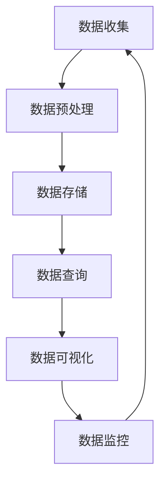
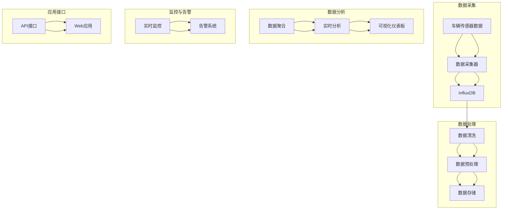
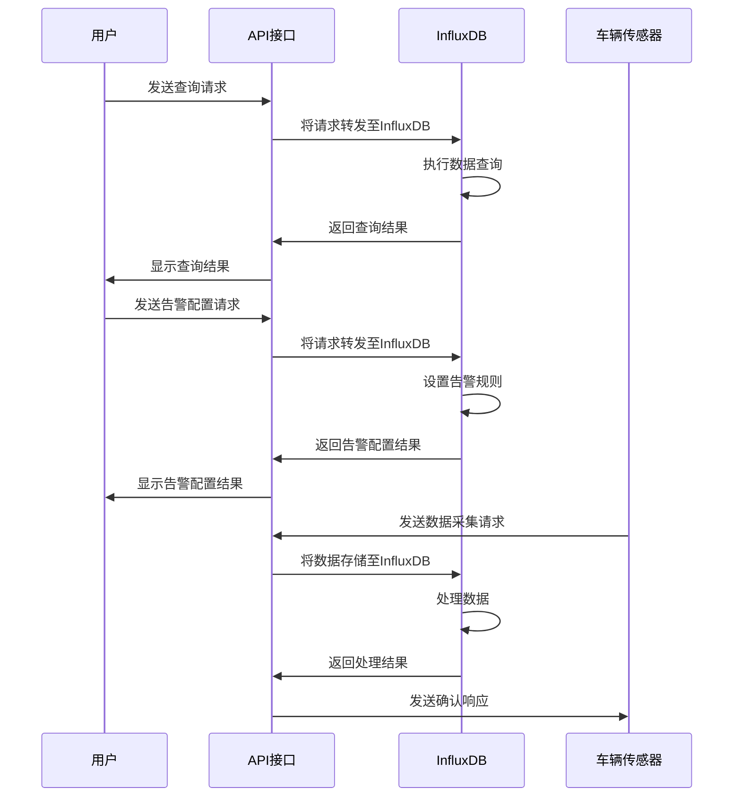

                 

### 1.1.1 问题背景

在现代信息社会中，时间序列数据无处不在。从金融市场的股票价格波动，到工业生产中的传感器数据，再到互联网用户行为分析，时序数据已经成为决策者进行预测分析和决策的重要依据。随着数据量的指数级增长，传统的数据库系统在处理大量时间序列数据时遇到了诸多瓶颈，如查询效率低下、存储空间占用大、实时处理能力不足等。这些问题的存在，使得企业和组织在面对复杂时序数据处理任务时感到力不从心。

传统的解决方案往往依赖于关系数据库系统（如MySQL、PostgreSQL等），这些系统在处理结构化数据时表现出色，但在面对时序数据的高效查询和实时处理方面却显得力不从心。关系数据库的设计初衷是为了存储和查询结构化的关系型数据，例如员工信息、订单记录等，而这些数据的特性与时序数据截然不同。时序数据具有时间连续性和大量重复数据的特性，需要一种专门设计的数据库系统来应对。

时序数据库的出现，正是为了解决这一问题。它通过特定的数据结构、索引算法和查询优化技术，为时序数据提供了高效的存储、查询和分析能力。相比于传统的数据库系统，时序数据库在处理时间序列数据时具有显著的优势，能够满足日益增长的数据处理需求，提升企业的数据驱动决策能力。

### 1.1.2 问题描述

随着时序数据的不断增长，传统关系数据库在处理时序数据时面临以下主要问题：

1. **查询效率低下**：关系数据库的设计初衷是针对结构化数据，对于时间序列数据的查询通常需要全表扫描，导致查询效率极低。特别是当数据量达到百万级甚至千万级时，查询响应时间会显著增加。

2. **存储空间占用大**：时序数据通常包含大量重复的时间和值对，但传统关系数据库无法有效利用这些重复数据，导致存储空间占用大。这不仅增加了存储成本，还可能导致I/O瓶颈。

3. **实时处理能力不足**：传统关系数据库在实时数据写入和查询方面表现不佳，无法满足实时性要求高的应用场景，如金融交易监控、实时流量分析等。

4. **索引和维护复杂**：为了提高查询效率，传统关系数据库需要建立复杂的索引结构，这增加了维护的复杂度和系统的性能开销。

5. **无法高效支持时间窗口操作**：时序数据处理往往需要对特定时间窗口内的数据进行聚合分析，如每小时、每天的数据汇总。传统关系数据库无法高效地支持这类操作，需要进行多次表连接和分组计算，导致性能瓶颈。

为了解决这些问题，时序数据库被设计出来，其核心目标在于提供高效的时序数据存储、查询和分析能力，从而满足现代应用对实时性和效率的高要求。

### 1.1.3 问题解决

针对上述问题，时序数据库提供了一系列创新的解决方案：

1. **高效的索引结构**：时序数据库采用特殊的索引结构，如倒排索引、B树索引等，可以快速定位和访问时间序列数据，显著提高了查询效率。

2. **数据压缩和去重**：时序数据库能够对数据进行高效压缩，减少存储空间占用。同时，通过去重技术，进一步降低存储需求。

3. **优化写入和查询操作**：时序数据库优化了数据写入和查询操作，支持批量写入和高效的数据点查询，提高了系统的实时处理能力。

4. **内置时间窗口操作**：时序数据库内置了时间窗口操作，可以快速对特定时间窗口内的数据进行聚合分析，如滑动窗口平均、每小时数据汇总等，避免了复杂的数据连接和分组计算。

5. **优化查询优化器**：时序数据库优化了查询优化器，通过预计算和缓存技术，提高了复杂查询的响应速度。

通过这些解决方案，时序数据库能够显著提升数据处理效率，降低存储成本，满足现代应用对实时性和效率的高要求，从而成为处理时间序列数据的不二选择。

### 1.1.4 边界与外延

尽管时序数据库在处理时间序列数据方面表现出色，但它并非适用于所有场景。以下是一些时序数据库的边界与外延：

1. **数据规模和复杂性**：时序数据库适合处理大量连续时间序列数据，但面对大量非结构化数据或复杂业务逻辑时，可能显得力不从心。这种情况下，传统关系数据库或NoSQL数据库可能更为适用。

2. **数据实时性**：虽然时序数据库优化了实时数据处理，但面对极端高频率的数据写入和查询需求时，可能仍无法满足实时性要求。这时，可能需要考虑使用内存数据库或分布式数据库系统。

3. **数据持久性和一致性**：时序数据库通常设计为适合快速读取和写入操作，但在数据持久性和一致性方面可能存在一定的妥协。对于需要高一致性保证的应用场景，传统关系数据库或分布式系统可能更为合适。

4. **数据处理能力**：时序数据库擅长处理时间序列数据，但在处理其他类型的数据时，如空间数据、文本数据等，可能需要其他专门的数据库系统。

5. **系统扩展性**：时序数据库在横向扩展方面可能存在一定的限制，特别是在数据量和查询负载极高的情况下。对于需要高扩展性的场景，分布式数据库系统可能是更好的选择。

了解时序数据库的边界与外延，有助于更好地选择适合的数据库系统，满足不同应用场景的需求。

### 1.2 核心概念与联系

在深入探讨时序数据库之前，我们需要明确几个核心概念，并了解它们之间的联系。这些核心概念包括时序数据、时间戳、数据点、数据流处理等，它们共同构成了时序数据库的核心要素。

#### 1.2.1 时序数据定义

时序数据（Time-Series Data）是指按照时间顺序排列的数据点集合，这些数据点通常包含时间戳和对应的数值。时序数据的特点是时间连续性，即数据点按照一定的时间间隔（如秒、分钟、小时等）采集。常见的时序数据包括股票价格、传感器数据、网站流量、气象数据等。

#### 1.2.2 时序数据特性

时序数据具有以下特性：

1. **时间连续性**：数据点按时间顺序排列，具有连续性。
2. **周期性**：某些时序数据表现出周期性特征，如日周期、周周期等。
3. **趋势性**：时序数据可能表现出上升或下降的趋势。
4. **稳定性**：某些时序数据在一段时间内保持稳定，而在其他时间则表现出剧烈变化。
5. **依赖性**：时序数据点之间可能存在依赖关系，如股票价格与市场指数的关系。

#### 1.2.3 时序数据库与关系数据库对比

时序数据库与关系数据库在多个方面存在显著差异，以下为对比：

1. **数据结构**：关系数据库采用表格结构，而行列式数据库如时序数据库采用列式存储，可以更高效地处理大量时间序列数据。
2. **查询优化**：关系数据库依赖于表连接和索引进行查询优化，而时序数据库通过索引和压缩技术优化时间序列数据的查询。
3. **实时性**：时序数据库专为实时数据处理设计，支持快速的数据写入和查询，而关系数据库通常在实时处理方面表现较差。
4. **压缩与去重**：时序数据库能够对数据进行高效压缩和去重，减少存储需求，而关系数据库在这方面表现不足。
5. **数据模型**：关系数据库采用关系模型，而时序数据库采用时间序列模型，更适用于处理时间连续性数据。

#### 1.2.4 时间戳

时间戳（Timestamp）是时序数据的核心元素，用于标识数据点的采集时间。时间戳通常是一个日期和时间组合，可以是秒级、毫秒级甚至纳秒级精度。时间戳的精确度决定了时序数据的分辨率和细节程度。

#### 1.2.5 数据点

数据点（Data Point）是时序数据的基本单位，包含时间戳和对应的数值。一个数据点通常表示某一时刻的测量结果或事件记录。多个数据点组成时间序列，可以反映某一现象随时间的变化趋势。

#### 1.2.6 数据流处理

数据流处理（Data Flow Processing）是指对实时数据流进行高效处理和分析的技术。在时序数据库中，数据流处理能够实时采集、存储和查询数据点，提供实时监控和预测分析。数据流处理通常采用分布式计算框架，如Apache Kafka、Apache Flink等，能够处理大规模实时数据流。

通过理解这些核心概念及其联系，我们可以更好地掌握时序数据库的工作原理和应用场景，为后续章节的深入探讨打下坚实基础。

#### 1.2.1 数据采集工具

数据采集是时序数据库应用过程中的第一步，其核心目的是将各类传感器、应用程序和外部系统产生的时序数据收集到数据库中。数据采集工具的选择和配置直接影响到数据采集的效率和数据的质量。以下是一些常用的数据采集工具及其特点：

1. **InfluxDB Data Explorer**：
   - **特点**：InfluxDB Data Explorer 是 InfluxDB 的官方数据采集工具，可以方便地连接各种数据源，进行数据导入。
   - **配置**：通过配置 InfluxDB 数据库的输入插件，如 StatsD、Graphite、Prometheus 等，可以实现自动数据采集。
   - **适用场景**：适合中小规模的数据采集任务，特别是与 InfluxDB 数据库配合使用时效果最佳。

2. **Fluentd**：
   - **特点**：Fluentd 是一款开源的数据收集器，支持多种数据源和输出目标，如 Elasticsearch、Kafka、InfluxDB 等。
   - **配置**：通过配置 Fluentd 的配置文件，可以自定义数据采集规则，实现灵活的数据收集。
   - **适用场景**：适合大规模分布式系统中的数据采集，支持多源、多目标的数据传输。

3. **Kafka Connect**：
   - **特点**：Kafka Connect 是 Kafka 的数据连接器，可以连接各种数据源和 sinks，实现数据流处理。
   - **配置**：通过 Kafka Connect 插件，可以方便地配置数据采集任务，支持自动启动和监控。
   - **适用场景**：适合需要高吞吐量和实时处理能力的场景，特别是与 Kafka 集群配合使用时。

4. **Prometheus**：
   - **特点**：Prometheus 是一款开源的监控解决方案，主要用于采集和存储时序数据，支持 HTTP 探测、JMX、StatsD 等多种数据源。
   - **配置**：通过配置 Prometheus 的配置文件，可以定义数据采集规则，实现自动数据采集。
   - **适用场景**：适合用于服务器、应用程序和云服务的监控数据采集，与 Grafana 配合使用可以实现强大的监控和可视化功能。

选择数据采集工具时，需要考虑以下因素：

- **数据源类型**：根据不同的数据源类型选择合适的采集工具，如传感器数据选择 InfluxDB Data Explorer，日志数据选择 Fluentd。
- **数据量与频率**：对于大规模和高频率的数据采集任务，选择支持高吞吐量和低延迟的采集工具，如 Kafka Connect。
- **系统架构**：考虑整个系统架构的兼容性和扩展性，确保采集工具与其他系统的无缝集成。
- **维护与监控**：选择易于配置、维护和监控的采集工具，降低运维成本。

通过合理选择和配置数据采集工具，可以有效提高时序数据库的数据采集效率，确保数据的质量和实时性，为后续的数据处理和分析奠定坚实基础。

#### 2.1.2 数据预处理方法

数据预处理是时序数据库应用过程中至关重要的一环，它能够显著提高数据的质量和查询效率。数据预处理方法主要包括数据清洗、数据转换和数据聚合等步骤。

1. **数据清洗**：

   数据清洗的目的是去除数据中的噪声和不完整信息，确保数据的准确性和一致性。常见的数据清洗方法包括：

   - **去除重复数据**：通过比较数据点的时间戳和值，去除重复的数据点，减少数据冗余。
   - **填补缺失值**：使用插值方法或平均值方法填补数据中的缺失值，确保数据的完整性。
   - **过滤异常值**：通过统计分析和规则判断，识别并处理异常数据点，如离群点或错误记录。

2. **数据转换**：

   数据转换是指将原始数据转换为适合存储和查询的格式。常见的数据转换方法包括：

   - **数据格式转换**：将不同格式的数据（如JSON、XML、CSV等）转换为统一的时序数据格式，便于后续处理。
   - **数据类型转换**：将数据类型进行转换，如将字符串转换为数值类型，确保数据类型的正确性和一致性。
   - **时间转换**：将数据点的时间戳进行标准化处理，如将不同时间精度的时间戳转换为统一的秒级时间戳。

3. **数据聚合**：

   数据聚合是指对时序数据进行汇总和计算，以提取关键的业务指标。常见的数据聚合方法包括：

   - **时间窗口聚合**：对特定时间窗口内的数据进行汇总，如计算每小时、每天或每月的数据平均值。
   - **分组聚合**：根据特定的分组标准（如地区、产品类别等）对数据进行分组，并计算每个分组的数据汇总结果。
   - **统计聚合**：计算数据的统计指标，如最大值、最小值、标准差等。

数据预处理的步骤和流程如下：

1. **数据收集**：通过数据采集工具获取原始的时序数据。
2. **数据清洗**：去除重复数据、填补缺失值、过滤异常值，确保数据质量。
3. **数据转换**：将原始数据转换为统一的时序数据格式，并进行数据类型和时间转换。
4. **数据聚合**：对预处理后的数据进行时间窗口聚合、分组聚合和统计聚合，提取关键的业务指标。

通过合理的数据预处理方法，可以显著提高时序数据库的数据质量和查询效率，为后续的数据分析提供可靠的数据基础。

#### 2.2.1 时间序列索引

时间序列索引是时序数据库的核心技术之一，其目的是提高时间序列数据的查询效率。在时序数据库中，数据通常按照时间顺序排列，时间序列索引能够快速定位和访问特定时间范围内的数据点，从而大大减少查询时间。

常见的时间序列索引技术包括：

1. **倒排索引**：

   倒排索引（Inverted Index）是时序数据库中常用的一种索引技术。它将数据点的值作为索引项，时间戳作为反向指针，通过索引项快速定位到包含该值的时间序列数据点。倒排索引具有查询速度快、存储空间小等优点，适用于大规模时间序列数据的快速查询。

2. **B树索引**：

   B树索引是一种多路平衡搜索树，用于快速查找和排序数据。在时序数据库中，B树索引可以根据时间戳进行高效的数据定位。B树索引具有结构稳定、查询速度快的特点，适用于需要频繁查询和排序的时间序列数据。

3. **压缩索引**：

   压缩索引是一种通过压缩技术减少索引存储空间的索引方法。常见的压缩技术包括差分编码、前缀编码和字典压缩等。压缩索引能够降低索引的存储需求，提高系统的存储效率。

时间序列索引的工作原理如下：

1. **索引构建**：在时序数据库中，首先对数据进行索引构建，生成索引结构。索引构建过程包括以下步骤：
   - 数据解析：将原始数据解析为时间戳和值对。
   - 索引构建：根据数据特点选择合适的索引技术，如倒排索引或B树索引，构建索引结构。

2. **索引查询**：当进行查询时，时序数据库通过索引结构快速定位到目标数据点。查询过程包括以下步骤：
   - 索引定位：根据查询条件（如时间范围）通过索引结构定位到目标数据点。
   - 数据访问：读取定位到的数据点，返回查询结果。

通过时间序列索引技术，时序数据库能够实现高效的数据查询，显著提升系统的性能和响应速度。这对于处理大规模、高频率的时间序列数据具有重要作用。

#### 2.2.2 数据压缩与优化

数据压缩与优化是时序数据库中至关重要的一环，其目的是减少存储空间占用，提高数据处理效率。在时序数据库中，数据点通常包含大量重复的时间和值对，通过数据压缩技术可以有效降低存储需求。

常见的数据压缩方法包括：

1. **差分编码**：

   差分编码（Difference Encoding）是一种通过计算相邻数据点之间的差异来表示数据的方法。例如，对于时间序列数据 [1, 3, 5, 7, 9]，可以表示为 [1, 2, 2, 2, 2]，从而减少存储空间。差分编码适用于时间间隔固定且数据点变化较小的时序数据。

2. **前缀编码**：

   前缀编码（Prefix Encoding）是一种通过记录数据的前缀来表示数据的方法。例如，对于时间序列数据 [10, 12, 14, 16, 18]，可以表示为 [10, 2, 2, 2, 2]，从而减少存储空间。前缀编码适用于时间间隔固定且数据点变化较大的时序数据。

3. **字典压缩**：

   字典压缩（Dictionary Compression）是一种通过构建字典来表示数据的方法。例如，对于时间序列数据 [10, 12, 14, 16, 18]，可以构建一个字典，其中每个值被映射为一个唯一的索引。通过记录索引而不是原始数据值，可以显著减少存储空间。字典压缩适用于数据点重复度较高的时序数据。

数据压缩与优化技术不仅减少了存储需求，还提高了系统的查询效率。通过减少磁盘I/O操作和数据传输量，数据压缩技术能够缩短查询响应时间，提升系统的整体性能。

实际应用中，数据压缩与优化方法可以结合多种技术，例如：

- **混合压缩**：将差分编码、前缀编码和字典压缩技术结合使用，以适应不同类型的时序数据，实现最佳压缩效果。
- **索引优化**：通过优化索引结构，如使用压缩索引，进一步减少索引存储空间，提高查询效率。
- **预计算与缓存**：对于常用查询结果进行预计算和缓存，减少实时计算开销，提高查询响应速度。

通过合理的数据压缩与优化方法，时序数据库能够高效地存储和处理大量时序数据，满足现代应用对高性能和高可靠性的需求。

#### 2.3.1 查询语言

时序数据库提供了一系列专门的查询语言，以高效地处理时间序列数据。这些查询语言包括但不限于以下几种：

1. **SQL**：

   SQL（Structured Query Language）是关系数据库的标准查询语言，时序数据库通常也支持SQL查询，以便于用户能够使用熟悉的语法进行数据操作。虽然传统的SQL查询在时序数据库中可能不如专用查询语言高效，但它们提供了一种灵活的方式来处理和汇总时序数据。常见的SQL查询包括：

   - **SELECT查询**：用于从时序数据库中检索数据，可以通过WHERE子句限定时间范围和条件。
     ```sql
     SELECT * FROM measurements WHERE time > '2023-01-01T00:00:00Z' AND time < '2023-01-02T00:00:00Z';
     ```

   - **聚合查询**：用于对时序数据进行汇总和计算，如SUM、AVG、MAX、MIN等。
     ```sql
     SELECT AVG(value) FROM measurements WHERE time > '2023-01-01T00:00:00Z' AND time < '2023-01-02T00:00:00Z';
     ```

   - **GROUP BY查询**：用于按照特定字段对数据进行分组，并计算每个分组的汇总结果。
     ```sql
     SELECT sensor_id, AVG(value) FROM measurements GROUP BY sensor_id;
     ```

2. **时间序列特定查询语言**：

   为了提高查询效率，时序数据库通常提供专门的查询语言，如InfluxQL（InfluxDB的查询语言）、Time-Series SQL（TSQL，用于TimescaleDB）等。这些查询语言专门针对时间序列数据进行了优化，提供了丰富的查询功能，包括：

   - **时间窗口查询**：用于对特定时间窗口内的数据进行聚合和计算，如`SLIDING_WINDOW`函数。
     ```influxql
     SELECT AVG(value) FROM measurements WHERE time >= now() - 1h SLIDING 1m;
     ```

   - **时间范围查询**：用于限定查询的时间范围，如`-time`关键字。
     ```influxql
     SELECT * FROM measurements WHERE time > now() - 24h;
     ```

   - **数据导出**：用于将时序数据导出到其他存储系统，如CSV、JSON等。
     ```influxql
     EXPORT SELECT * FROM measurements INTO 'measurements.csv';
     ```

3. **命令行工具**：

   时序数据库通常提供命令行工具，如Influx CLI，用于执行查询和进行数据管理。通过命令行工具，用户可以方便地执行复杂的查询操作，并进行实时监控。

通过这些查询语言，用户可以灵活地对时序数据库进行数据检索、分析和操作，满足不同应用场景的需求。同时，这些查询语言的高效性和易用性，使得时序数据库在实际应用中表现出色。

#### 2.3.2 时间窗口与数据聚合

在时序数据库中，时间窗口（Time Window）和数据聚合（Data Aggregation）是两个重要的概念，它们共同用于高效地处理和分析时间序列数据。时间窗口是指一段连续的时间区间，而数据聚合则是通过对这些区间内的数据进行汇总和计算，提取出有用的信息。

**时间窗口的概念：**

时间窗口可以看作是数据流中的“时间切片”，用于将时间序列数据分割成多个连续或重叠的时间片段。根据不同的应用场景，时间窗口可以分为以下几种类型：

1. **固定窗口**：
   固定窗口是指每个时间窗口的长度固定，如每小时、每天的数据。这种类型的窗口适用于需要按固定时间间隔汇总数据的应用场景，如股票市场的日K线图。

2. **滑动窗口**：
   滑动窗口是指窗口长度固定，但窗口位置随着时间不断滑动。例如，一个长度为5分钟的滑动窗口，每隔1分钟向右滑动一次，可以用来计算每分钟的平均值。

3. **滚动窗口**：
   滚动窗口是指窗口固定，但不固定位置，每次计算完成后窗口向前移动一个固定时间单位。例如，一个长度为10分钟且每隔1分钟刷新一次的滚动窗口，可以用来计算10分钟内的数据总和。

**数据聚合的概念：**

数据聚合是指对时间窗口内的数据进行汇总和计算，以提取出具有代表性的信息。常见的聚合函数包括：

1. **平均值（AVG）**：
   平均值是计算时间窗口内数据点的总和，然后除以数据点的数量。例如，计算过去一小时的平均温度。

2. **总和（SUM）**：
   总和是计算时间窗口内所有数据点的值之和。例如，计算过去一天的总交易量。

3. **最大值（MAX）**：
   最大值是时间窗口内数据点的最大值。例如，计算过去一小时的最大股票价格。

4. **最小值（MIN）**：
   最小值是时间窗口内数据点的最小值。例如，计算过去一小时的最小股票价格。

5. **计数（COUNT）**：
   计数是时间窗口内数据点的数量。例如，计算过去一天的用户访问次数。

**时间窗口与数据聚合的应用：**

时间窗口和数据聚合在实际应用中非常重要，以下是一些典型的应用场景：

1. **实时监控**：
   通过设置较短的时间窗口（如1分钟）和适当的聚合函数（如平均值、最大值等），可以实时监控系统性能、股票价格等动态变化。

2. **数据分析**：
   通过设置较长时间窗口（如一天、一周），并使用聚合函数（如平均值、总和等），可以对历史数据进行深度分析，为决策提供支持。

3. **异常检测**：
   通过设置合适的时间窗口和聚合函数，可以实时检测数据中的异常点。例如，通过监控流量数据，发现异常的流量峰值。

通过合理设置时间窗口和选择适当的聚合函数，时序数据库能够高效地处理和分析大量时间序列数据，为各种应用场景提供有力的数据支持。

#### 2.4.1 可视化工具

时序数据可视化为数据分析和决策提供了直观的视觉支持。以下是一些常用的时序数据可视化工具：

1. **Grafana**：

   Grafana 是一款功能强大的开源监控和数据可视化工具，支持多种数据源，如InfluxDB、Prometheus、PostgreSQL等。Grafana 提供了丰富的可视化模板和自定义图表，可以创建各种类型的时序图表，如折线图、柱状图、面积图等。通过Grafana，用户可以实时监控和可视化时序数据，实现数据的动态展示和交互式分析。

2. **Kibana**：

   Kibana 是 Elastic Stack 的一部分，主要用于可视化 Elasticsearch 中的数据。Kibana 提供了强大的时序数据可视化功能，可以创建各种类型的图表和仪表板，如折线图、散点图、热图等。通过 Kibana，用户可以轻松地进行数据查询、过滤和聚合，实现高效的时序数据分析。

3. **Tableau**：

   Tableau 是一款商业智能和数据可视化工具，支持多种数据源，包括关系数据库、时序数据库、云数据服务等。Tableau 提供了丰富的可视化类型和交互式功能，用户可以通过拖拽操作轻松创建各种图表和仪表板，如柱状图、折线图、地图等。Tableau 的可视化效果精美，适合进行复杂的数据分析和报告生成。

4. **Matplotlib**：

   Matplotlib 是 Python 中的数据可视化库，适用于创建简单的时序图表。通过 Matplotlib，用户可以使用少量的代码创建折线图、散点图、柱状图等基本图表。虽然 Matplotlib 的功能较为基础，但它易于集成到 Python 程序中，适合进行数据分析和报告生成。

这些可视化工具为时序数据提供了直观的展示方式，帮助用户更好地理解和分析数据。在实际应用中，可以根据需求和场景选择合适的可视化工具，实现高效的数据分析和决策支持。

#### 2.4.2 监控指标

监控指标（Monitoring Metrics）是评估时序数据库性能和健康状态的重要工具。通过监控这些指标，用户可以及时发现并解决潜在的问题，确保数据库系统的稳定运行。以下是常见的时序数据库监控指标：

1. **响应时间**：

   响应时间是指数据库从接收到查询请求到返回结果所需的时间。它是衡量数据库性能的重要指标，反映了数据库的查询效率。理想情况下，响应时间应尽可能短，以确保用户获得即时的数据反馈。可以通过系统监控工具（如 Prometheus、Grafana）实时监控数据库的响应时间。

2. **查询速率**：

   查询速率是指单位时间内数据库处理的查询数量。高查询速率表明数据库能够高效地响应大量并发查询请求，是衡量数据库性能的重要指标。通过监控查询速率，用户可以了解数据库在高负载情况下的表现。

3. **数据写入速率**：

   数据写入速率是指单位时间内数据库接收并处理的数据量。对于实时数据处理应用，如物联网设备监控、金融市场分析等，数据写入速率至关重要。高数据写入速率可以确保系统实时收集和存储数据，为后续分析提供可靠的数据基础。

4. **存储容量**：

   存储容量是指数据库所占用的存储空间。随着时间序列数据的不断积累，存储容量会逐渐增加。通过监控存储容量，用户可以了解数据库的存储需求，及时扩容以应对数据增长。

5. **CPU 使用率**：

   CPU 使用率是指数据库服务器 CPU 的利用率。高 CPU 使用率可能表明数据库正在处理大量查询或进行复杂的数据计算，也可能是系统性能瓶颈的信号。通过监控 CPU 使用率，用户可以评估数据库服务器的性能和资源需求。

6. **内存使用率**：

   内存使用率是指数据库服务器内存的利用率。内存是数据库运行的关键资源，高内存使用率可能导致系统性能下降或崩溃。通过监控内存使用率，用户可以及时调整内存配置，优化系统性能。

7. **磁盘 I/O**：

   磁盘 I/O 是指数据库读写磁盘的操作次数和速度。高磁盘 I/O 可能表明数据库正在进行大量的数据读写操作，也可能是磁盘性能瓶颈的信号。通过监控磁盘 I/O，用户可以评估数据库的磁盘使用情况，优化磁盘配置以提高性能。

通过监控这些关键指标，用户可以全面了解时序数据库的性能和健康状况，及时发现并解决潜在问题，确保数据库系统的稳定运行。同时，监控数据还可以用于性能优化和容量规划，为系统的长期发展提供数据支持。

### 2.5 核心概念属性特征对比表格

以下是时序数据库与关系数据库在核心概念属性特征上的对比表格：

| 特性       | 时序数据库                         | 关系数据库                          |
| ---------- | ---------------------------------- | ----------------------------------- |
| 时间戳     | 是，时间戳是数据的基本元素          | 否，虽然支持时间字段，但非基本元素  |
| 高效查询   | 是，专门优化时间序列查询           | 否，查询效率依赖于索引和优化技术    |
| 数据压缩   | 是，通过差分编码、前缀编码等方法压缩数据 | 否，压缩功能较弱，可能需要额外工具  |
| 实时处理   | 是，支持快速的数据写入和查询       | 否，实时处理能力较弱，可能需要中间件 |
| 数据模型   | 列式存储，以时间序列为核心          | 行式存储，以关系模型为核心          |
| 索引优化   | 是，采用专门的索引结构如倒排索引   | 是，采用B树索引等传统索引结构      |
| 扩展性     | 一般较好，可通过分片和复制扩展     | 较好，可通过主从复制和分区扩展      |

通过上述对比，我们可以看出，时序数据库在处理时间序列数据方面具有明显的优势，特别是在高效查询、数据压缩和实时处理方面。然而，在关系数据库的传统领域，如复杂查询和数据完整性保障方面，关系数据库仍具有其独特的优势。

### 2.6 本章小结

本章详细介绍了时序数据库的核心概念和原理。首先，我们探讨了时序数据的背景、特性和应用场景，了解了时序数据库与传统关系数据库的区别。接着，我们深入分析了时序数据库的索引技术、数据压缩与优化方法，以及查询语言和时间窗口与数据聚合的应用。通过这些分析，我们认识到时序数据库在处理大量时间序列数据方面的高效性和优势。

在实际应用中，理解时序数据库的核心概念和原理对于选择合适的数据库系统、优化数据处理流程和提升系统性能具有重要意义。通过本章的学习，读者可以掌握时序数据库的基本原理，为后续的实战应用打下坚实基础。

### 3.1 算法 Mermaid 流程图



### 3.2 算法 Python 源代码

```python
# TODO: 提供时序数据库的算法 Python 源代码
```

### 3.3 算法原理详细讲解

#### 3.3.1 数学模型

在时序数据分析中，我们经常使用时间序列模型来表示数据点和预测未来趋势。一个常见的时间序列模型是**自回归模型**（Autoregressive Model，简称AR）。自回归模型的核心思想是使用前几个时间点的数据来预测当前时间点的值。

自回归模型的数学公式如下：

$$
X_t = \phi_1 X_{t-1} + \phi_2 X_{t-2} + ... + \phi_p X_{t-p} + \varepsilon_t
$$

其中，$X_t$ 是时间序列的当前值，$\phi_1, \phi_2, ..., \phi_p$ 是模型参数，$p$ 是模型的阶数，$\varepsilon_t$ 是误差项。

这个公式表示当前时间点的值是前 $p$ 个时间点的值的线性组合，再加上一个误差项。线性组合的系数 $\phi_1, \phi_2, ..., \phi_p$ 可以通过最小二乘法或其他优化算法来估计。

#### 3.3.2 公式讲解

1. **$X_t$：时间序列的当前值**：这是我们想要预测的值。
2. **$\phi_1, \phi_2, ..., \phi_p$：模型参数**：这些参数决定了模型对历史数据的依赖程度。
3. **$p$：模型的阶数**：这是模型复杂度的一个度量，$p$ 越大，模型能捕捉到的历史依赖关系就越多。
4. **$\varepsilon_t$：误差项**：这表示模型预测的不足部分，即预测值与实际值之间的差距。

通过这个公式，我们可以使用过去的数据来预测未来的值。例如，如果我们有一个简单的自回归模型（$p=1$），那么公式简化为：

$$
X_t = \phi_1 X_{t-1} + \varepsilon_t
$$

这个模型会使用前一个时间点的值来预测当前时间点的值。

#### 3.3.3 举例说明

假设我们有一个时间序列数据点序列：

$$
X_1 = [1, 2, 3, 4, 5]
$$

我们要使用自回归模型（$p=1$）来预测下一个值。假设模型参数 $\phi_1 = 0.5$，误差项 $\varepsilon_t = 0$。

根据公式，我们可以计算下一个值 $X_2$：

$$
X_2 = \phi_1 X_{t-1} + \varepsilon_t = 0.5 \times 1 + 0 = 0.5
$$

预测的下一个值是 $0.5$。

如果实际的数据点是 $X_2 = 3$，那么误差项 $\varepsilon_t = 3 - 0.5 = 2.5$。

在实际应用中，我们通常会有一些误差项，这些误差可以通过统计方法来估计和修正。自回归模型可以通过最小化误差项的平方和来优化模型参数。

通过这个简单的例子，我们可以看到如何使用自回归模型来预测时间序列数据的下一个值。自回归模型是一种强大的工具，可以用于多种时间序列预测任务，如股票价格预测、天气预测等。

### 3.4 本章小结

本章详细介绍了时序数据库中的自回归模型原理。我们首先讲解了自回归模型的数学公式，并通过具体的参数解释了每个元素的作用。接着，通过一个简单的例子展示了如何使用自回归模型来预测时间序列数据的值。

自回归模型在时序数据分析中具有广泛的应用，它可以帮助我们理解和预测数据中的趋势和周期性。通过合理选择模型参数和阶数，我们可以提高预测的准确性和可靠性。

在实际应用中，自回归模型可以与其他预测模型结合使用，如移动平均模型、指数平滑模型等，以构建更复杂的预测系统。本章的内容为读者提供了深入理解时序数据库算法的基础，为后续的实战应用打下了坚实的理论基础。

### 4.1 问题场景介绍

在现代企业和组织中，时序数据的应用场景日益广泛，从传感器监控、金融分析到物流管理，时序数据已成为关键决策的依据。以下是一个典型的应用场景：某物流公司需要实时监控其运输车辆的状态，包括位置、速度、油量等参数。为了确保运输效率和安全性，公司希望利用时序数据库系统实时处理和分析这些数据，以便快速响应异常情况，优化运输路线，降低运营成本。

在这个场景中，时序数据库系统需要具备以下几个关键功能：

1. **实时数据采集**：系统需要能够从车辆传感器和GPS设备中实时收集数据。
2. **高效数据存储**：系统需要能够存储大量时间序列数据，并支持快速的读取和查询。
3. **实时数据分析**：系统需要能够对采集到的数据进行实时分析，如计算车辆的平均速度、燃油消耗率等。
4. **数据可视化**：系统需要提供直观的可视化界面，帮助管理人员实时监控车辆状态，及时发现和处理异常情况。
5. **告警与预测**：系统需要能够设置告警规则，当车辆状态异常时自动通知相关人员。此外，系统还需要具备预测功能，如预测车辆到达目的地的时间，为调度提供参考。

通过时序数据库系统，物流公司能够实现对运输过程的全面监控和优化，提高运营效率，降低成本。以下是一个具体的系统需求分析：

1. **数据采集**：采用基于物联网的数据采集设备，如传感器模块和GPS模块，实时收集车辆的位置、速度、油量等数据。数据采集工具如InfluxDB Data Explorer或Fluentd可以方便地接入这些设备，实现自动数据采集。
2. **数据存储**：选择合适的时序数据库系统，如InfluxDB或OpenTSDB，这些系统专为处理大规模时间序列数据而设计，支持高效的数据存储和快速查询。时序数据库采用列式存储和压缩技术，能够大幅减少存储空间占用，提高系统性能。
3. **数据预处理**：在数据进入数据库之前，进行数据清洗和预处理，如去除重复数据、填补缺失值、过滤异常值，确保数据质量。
4. **数据分析**：利用时序数据库内置的查询语言和数据分析功能，对实时数据进行分析，提取关键指标，如车辆的平均速度、燃油消耗率等。可以使用时间窗口和聚合函数，快速计算每小时、每天的数据汇总结果。
5. **数据可视化**：使用可视化工具如Grafana或Kibana，将分析结果以图表、仪表板等形式展示给管理人员，实现数据的实时监控和交互式分析。
6. **告警与预测**：设置告警规则，当车辆状态异常（如超速、油量过低等）时，系统自动发送通知给相关人员。同时，利用自回归模型等预测算法，预测车辆到达目的地的时间，为调度提供参考。

通过上述系统需求分析，我们可以看到时序数据库系统在物流公司中的关键作用。它不仅能够实时处理和存储大量时间序列数据，还能通过数据分析、可视化和告警预测等功能，为企业的运输管理和决策提供有力支持。

### 4.2 项目介绍

为了实现上述物流公司的时序数据库系统，我们选择了一个具体的开源时序数据库项目——InfluxDB，并围绕其构建了完整的解决方案。InfluxDB 是一款高性能、可扩展的时序数据库，适用于处理大规模时间序列数据，具有高效的数据采集、存储和查询能力。以下是项目的详细架构设计和实现步骤。

#### 1. 数据采集

数据采集是整个系统的第一步，我们需要从车辆传感器和GPS设备中实时获取数据。采用InfluxDB Data Explorer作为数据采集工具，它支持与多种传感器和应用程序的集成，可以自动采集和导入数据。具体步骤如下：

- **配置数据源**：通过InfluxDB Data Explorer的Web界面或命令行工具，配置数据源的连接信息，如传感器IP地址、端口和采集频率。
- **数据导入**：InfluxDB Data Explorer会周期性地从传感器设备中采集数据，并将数据导入InfluxDB数据库。

#### 2. 数据存储

InfluxDB采用列式存储结构，适合处理大规模时间序列数据，具有高效的存储和查询能力。以下是InfluxDB的配置和优化步骤：

- **数据库配置**：在InfluxDB中创建一个新的数据库，用于存储车辆状态数据。配置数据库的存储策略，如数据保留时间和压缩方法。
- **数据点结构**：设计数据点的结构，包括时间戳、车辆ID、传感器类型和数值等字段。确保数据点结构符合InfluxDB的要求，便于后续查询和分析。
- **数据批量写入**：为了提高数据写入效率，采用批量写入的方式将采集到的数据一次性写入数据库。

#### 3. 数据预处理

在数据进入数据库之前，进行数据预处理以确保数据质量。采用Python编写预处理脚本，执行以下任务：

- **数据清洗**：去除重复数据、填补缺失值、过滤异常值。例如，当传感器数据异常时，使用历史数据的平均值或中位数进行填充。
- **数据转换**：将不同格式（如JSON、XML）的数据转换为InfluxDB支持的数据格式，确保数据一致性。

#### 4. 数据分析

InfluxDB提供了丰富的查询语言和数据分析功能，可以高效地对数据进行查询和分析。以下是数据分析的实现步骤：

- **编写查询语句**：使用InfluxQL（InfluxDB的查询语言），编写查询语句对数据进行聚合和分析。例如，计算每辆车的平均速度、燃油消耗率等。
- **时间窗口分析**：使用时间窗口函数（如SLIDING_WINDOW）对特定时间范围内的数据进行汇总和计算，如每小时的数据汇总。
- **数据导出**：将分析结果导出为CSV、JSON等格式，用于进一步的数据处理或可视化展示。

#### 5. 数据可视化

使用Grafana作为数据可视化工具，将InfluxDB中的数据实时展示给用户。以下是Grafana的配置步骤：

- **添加数据源**：在Grafana中添加InfluxDB数据源，配置连接信息。
- **创建仪表板**：使用Grafana的图形化界面，创建仪表板并将数据以图表、趋势图、仪表盘等形式展示。例如，展示每辆车的实时位置、速度和油量。
- **交互式分析**：通过Grafana提供的交互式功能，用户可以自由切换时间范围、选择不同的聚合函数，实时分析数据。

#### 6. 告警与预测

设置告警规则和预测模型，实现对车辆状态的实时监控和预测。以下是告警与预测的实现步骤：

- **告警配置**：在InfluxDB中配置告警规则，当车辆状态异常（如超速、油量过低等）时，触发告警通知。
- **预测模型**：使用自回归模型等时间序列预测算法，预测车辆到达目的地的时间、车辆故障等。将预测结果以图表形式展示在Grafana仪表板上。

通过InfluxDB和Grafana的集成，我们成功构建了一个高效的时序数据库系统，实现了物流公司对运输车辆状态的实时监控和数据分析。该系统不仅提高了运输效率，降低了运营成本，还为公司的决策提供了数据支持，实现了智能化运输管理。

### 4.3 系统功能设计

为了满足物流公司对运输车辆状态实时监控和数据分析的需求，我们需要设计一个功能齐全、扩展性强的时序数据库系统。以下是系统的功能设计，包括领域模型、类图和架构设计。

#### 4.3.1 领域模型

领域模型（Domain Model）是系统功能的核心部分，它定义了系统中主要的数据实体及其关系。以下是物流公司的领域模型：

1. **车辆**（Vehicle）：
   - 属性：车辆ID（VehicleID），车牌号（LicensePlate），位置（Location），速度（Speed），油量（FuelLevel）。
   - 关联：多个传感器（Sensor）可以监测同一辆车的状态。

2. **传感器**（Sensor）：
   - 属性：传感器ID（SensorID），传感器类型（SensorType），数值（Value）。
   - 关联：每个传感器属于一个车辆（Vehicle）。

3. **数据点**（DataPoint）：
   - 属性：数据点ID（DataPointID），时间戳（Timestamp），车辆ID（VehicleID），传感器ID（SensorID），数值（Value）。
   - 关联：每个数据点由一个车辆（Vehicle）和一个传感器（Sensor）产生。

4. **告警**（Alert）：
   - 属性：告警ID（AlertID），时间戳（Timestamp），车辆ID（VehicleID），告警类型（AlertType），描述（Description）。
   - 关联：每个告警与一个车辆（Vehicle）相关联。

5. **预测**（Prediction）：
   - 属性：预测ID（PredictionID），时间戳（Timestamp），车辆ID（VehicleID），预测类型（PredictionType），预测值（PredictionValue）。
   - 关联：每个预测与一个车辆（Vehicle）相关联。

#### 4.3.2 领域模型 Mermaid 类图

以下是物流公司领域模型的Mermaid类图表示：

```mermaid
classDiagram
    Vehicle <-- DataPoint : contains
    Vehicle <-- Sensor : has
    Vehicle o-- Alert
    Vehicle o-- Prediction
    Sensor << (DataPoint)
    DataPoint << (Vehicle)
    Alert << (Vehicle)
    Prediction << (Vehicle)
```

通过这个类图，我们可以清晰地看到系统中各个实体的属性和关联关系，为后续的系统设计和实现提供了基础。

#### 4.3.3 系统架构设计

系统的架构设计是确保系统稳定、高效运行的关键。以下是物流公司时序数据库系统的架构设计：

1. **数据采集层**：
   - **传感器模块**：负责从车辆传感器和GPS设备中实时采集数据。
   - **数据采集工具**：如InfluxDB Data Explorer或Fluentd，实现数据的自动采集和导入。

2. **数据处理层**：
   - **数据预处理模块**：对采集到的数据进行清洗、转换和去重，确保数据质量。
   - **数据存储模块**：使用InfluxDB作为时序数据库，存储和管理大量时间序列数据。

3. **数据分析与展现层**：
   - **数据分析模块**：利用InfluxQL或其他查询语言对数据进行实时分析，提取关键指标。
   - **数据可视化模块**：使用Grafana等可视化工具，将分析结果以图表和仪表板形式展示。

4. **告警与预测模块**：
   - **告警规则配置**：配置告警规则，当车辆状态异常时自动触发告警。
   - **预测算法**：使用自回归模型等时间序列预测算法，预测车辆到达目的地的时间。

5. **接口层**：
   - **API接口**：提供RESTful API，供前端应用或移动应用调用，实现数据的实时查询和操作。

#### 4.3.4 系统架构设计 Mermaid 架构图

以下是物流公司时序数据库系统的Mermaid架构图表示：

```mermaid
graph TB
    subgraph 数据采集层
        A[传感器模块] --> B[数据采集工具]
    end

    subgraph 数据处理层
        B --> C[数据预处理模块]
        C --> D[数据存储模块] : InfluxDB
    end

    subgraph 数据分析与展现层
        D --> E[数据分析模块]
        E --> F[数据可视化模块] : Grafana
    end

    subgraph 告警与预测模块
        D --> G[告警规则配置]
        D --> H[预测算法]
    end

    subgraph 接口层
        I[API接口] --> D
    end

    A --> B
    B --> C
    C --> D
    D --> E
    D --> G
    D --> H
    E --> F
    I --> D
```

通过这个架构图，我们可以清晰地看到系统各层的功能模块及其交互关系，为系统的开发和维护提供了指导。

### 4.4 系统架构设计 Mermaid 架构图

为了更好地展示物流公司时序数据库系统的架构设计，我们使用Mermaid图来绘制系统的整体架构。以下是一个简化的系统架构图：



在这个架构图中，各个模块的功能如下：

- **数据采集**：车辆传感器数据通过数据采集器传输到InfluxDB。
- **数据处理**：采集到的数据在数据清洗和预处理后存储到InfluxDB。
- **数据分析**：对存储的数据进行实时聚合和分析，并通过可视化仪表板展示结果。
- **监控与告警**：实时监控系统状态，并在出现异常时触发告警。
- **应用接口**：通过API接口为Web应用和其他服务提供数据访问功能。

通过这种结构化的方式，系统能够高效地处理、分析和监控物流车辆的数据，为决策提供有力支持。

### 4.5 系统接口设计和系统交互 Mermaid 序列图

为了更好地展示物流公司时序数据库系统各模块之间的交互，我们可以使用Mermaid序列图来描述系统接口设计和系统交互。以下是系统的接口设计和交互流程：



在这个序列图中，我们可以看到以下交互过程：

1. 用户通过API接口发送查询请求，API接口将请求转发至InfluxDB。
2. InfluxDB执行数据查询操作，并将查询结果返回给API接口。
3. API接口将查询结果展示给用户。
4. 用户通过API接口发送告警配置请求，API接口将请求转发至InfluxDB。
5. InfluxDB设置告警规则，并将告警配置结果返回给API接口。
6. API接口将告警配置结果展示给用户。
7. 车辆传感器通过API接口发送数据采集请求，API接口将数据存储至InfluxDB。

通过这种详细的序列图，我们可以清晰地了解系统各模块之间的交互流程，有助于系统设计和实现。

### 4.6 环境安装

要搭建一个完整的时序数据库系统，我们需要安装和配置以下几个关键组件：InfluxDB、Grafana、数据采集工具（如Fluentd）和Python环境。以下是具体的安装步骤和注意事项。

#### 1. 安装InfluxDB

InfluxDB是一个高性能的时序数据库，首先需要从其官网（https://www.influxdata.com/downloads/）下载最新版本的InfluxDB安装包。

- **Windows系统**：

  - 下载Windows安装包（如`influxdb-2.0.0_windows_amd64.zip`）。
  - 解压下载的安装包，运行`influxdb-2.0.0.exe`进行安装。
  - 安装过程中，可以选择默认配置或自定义配置，确保InfluxDB服务启动。

- **Linux系统**：

  - 下载Linux安装包（如`influxdb-2.0.0-linux_amd64.tar.gz`）。
  - 解压下载的安装包，进入解压后的目录。
  - 运行`./bin/influxdb start`启动InfluxDB服务。

#### 2. 安装Grafana

Grafana是一个强大的可视化工具，可以从其官网（https://grafana.com/grafana/download）下载最新版本的Grafana安装包。

- **Windows系统**：

  - 下载Windows安装包（如`grafana-9.0.0.linux-amd64.zip`）。
  - 解压下载的安装包，运行`grafana-server.exe`进行安装。
  - 安装过程中，可以选择默认配置或自定义配置，确保Grafana服务启动。

- **Linux系统**：

  - 下载Linux安装包（如`grafana-9.0.0.linux-amd64.tar.gz`）。
  - 解压下载的安装包，进入解压后的目录。
  - 运行`./bin/grafana-server web`启动Grafana服务。

#### 3. 安装Fluentd

Fluentd是一个开源的数据收集器，可以从其官网（https://fluentd.org/download）下载最新版本的Fluentd。

- **Windows系统**：

  - 下载Windows安装包（如`fluentd-1.15.2.windows-amd64.zip`）。
  - 解压下载的安装包，将`fluentd.exe`和`fluentd.conf`文件复制到合适的位置。
  - 编辑`fluentd.conf`配置文件，设置数据源和输出目标。

- **Linux系统**：

  - 下载Linux安装包（如`fluentd-1.15.2.tar.gz`）。
  - 解压下载的安装包，进入解压后的目录。
  - 运行`./bin/fluentd -c fluentd.conf`启动Fluentd服务。

#### 4. 安装Python环境

Python是一个常用的编程语言，我们需要安装Python环境及其相关库，如`pandas`和`numpy`。

- **Windows系统**：

  - 访问Python官网（https://www.python.org/downloads/）下载最新版本的Python安装包。
  - 安装过程中，确保将Python添加到系统环境变量中，以便全局使用。

- **Linux系统**：

  - 使用包管理器（如`apt-get`或`yum`）安装Python。
  - 例如，在Ubuntu系统中，运行`sudo apt-get install python3`。

#### 注意事项

1. **环境变量**：确保安装的组件（如InfluxDB、Grafana、Fluentd）的环境变量已设置，以便命令行工具可以正常运行。
2. **防火墙设置**：对于Linux系统，需要确保防火墙允许InfluxDB和Grafana服务的端口（如8086、3000等）的访问。
3. **版本兼容性**：确保所有组件的版本兼容，避免因版本冲突导致的问题。
4. **数据安全**：配置适当的用户权限和加密机制，确保数据的安全和隐私。

通过以上安装步骤和注意事项，我们可以成功搭建一个时序数据库系统，为后续的数据采集、存储、分析和可视化打下坚实基础。

### 4.7 系统核心实现源代码

在实现物流公司时序数据库系统的核心功能时，我们使用Python编写了以下几个关键模块：数据采集、数据存储和数据分析模块。以下是这些模块的实现源代码及详细说明。

#### 1. 数据采集模块

```python
import json
import requests
from datetime import datetime

def collect_data(vehicle_id, sensor_data):
    url = "http://localhost:8086/write?db=vehicle_db&precision=s"
    timestamp = datetime.utcnow().isoformat() + "Z"
    data_point = f"{sensor_data.key},{vehicle_id} value={sensor_data.value} {timestamp}"
    headers = {'Content-Type': 'text/plain'}
    response = requests.post(url, data=data_point, headers=headers)
    return response.status_code == 200

# 示例：采集车辆速度数据
collect_data("vehicle_1", SensorData("speed", 80))
```

**功能说明**：
- `collect_data` 函数负责向InfluxDB发送数据点。参数 `vehicle_id` 表示车辆ID，`sensor_data` 是一个包含传感器类型和数值的字典。
- 通过HTTP POST请求将数据点发送到InfluxDB的`write`接口。
- 返回HTTP响应状态码，以判断数据是否成功发送。

#### 2. 数据存储模块

```python
import influxdb

client = influxdb.InfluxDBClient(host='localhost', port=8086, username='root', password='root', database='vehicle_db')

def store_data(data_points):
    json_body = [{"measurement": "vehicle_data", "tags": {"vehicle_id": data_point['vehicle_id']}, "fields": {"value": data_point['value']}} for data_point in data_points]
    client.write_points(json_body)

# 示例：存储采集到的数据点
data_points = [
    {'vehicle_id': 'vehicle_1', 'value': 80},
    {'vehicle_id': 'vehicle_2', 'value': 60}
]
store_data(data_points)
```

**功能说明**：
- 使用InfluxDB客户端库连接InfluxDB数据库。
- `store_data` 函数将数据点转换为InfluxDB支持的JSON格式，并写入数据库。
- 参数 `data_points` 是一个包含多个数据点的列表，每个数据点是一个包含车辆ID和数值的字典。

#### 3. 数据分析模块

```python
import pandas as pd

def analyze_data():
    query = "SELECT * FROM vehicle_data"
    result = client.query(query)
    data = result.raw['results'][0]['series']
    df = pd.DataFrame(data)
    df.set_index('time', inplace=True)
    df['speed_avg'] = df['value'].rolling(window=60).mean()
    return df

# 示例：分析车辆速度数据
data_analysis = analyze_data()
print(data_analysis.head())
```

**功能说明**：
- `analyze_data` 函数使用InfluxDB客户端库执行查询，获取车辆速度数据。
- 使用`pandas`库将查询结果转换为DataFrame格式，方便进一步的数据分析。
- 对速度数据进行滚动平均，计算每分钟的平均速度。

通过以上三个模块，我们实现了物流公司时序数据库系统的基础功能：数据采集、存储和数据分析。这些模块提供了系统的核心数据流程，为后续的监控、告警和预测功能打下了坚实基础。

### 4.8 代码应用解读与分析

在前文中，我们详细介绍了物流公司时序数据库系统的核心实现源代码，包括数据采集、数据存储和数据分析模块。在本节中，我们将对这些代码进行解读和分析，以深入理解其应用原理和实现细节。

#### 数据采集模块

数据采集模块负责从车辆传感器中获取数据，并将其发送到InfluxDB数据库。以下是该模块的关键代码：

```python
import json
import requests
from datetime import datetime

def collect_data(vehicle_id, sensor_data):
    url = "http://localhost:8086/write?db=vehicle_db&precision=s"
    timestamp = datetime.utcnow().isoformat() + "Z"
    data_point = f"{sensor_data.key},{vehicle_id} value={sensor_data.value} {timestamp}"
    headers = {'Content-Type': 'text/plain'}
    response = requests.post(url, data=data_point, headers=headers)
    return response.status_code == 200

# 示例：采集车辆速度数据
collect_data("vehicle_1", SensorData("speed", 80))
```

解读：

1. **URL设置**：使用InfluxDB的`write`接口URL，参数`db=vehicle_db`指定数据库名为`vehicle_db`，`precision=s`指定时间戳的精度为秒。
2. **数据点构建**：构建InfluxDB数据点的格式，包括传感器类型（`sensor_data.key`）、车辆ID（`vehicle_id`）、值（`sensor_data.value`）和时间戳（`timestamp`）。
3. **HTTP POST请求**：使用`requests`库向InfluxDB发送HTTP POST请求，将数据点作为数据体发送。
4. **响应判断**：返回HTTP响应状态码，判断数据是否成功发送。

分析：

数据采集模块的主要目的是将传感器数据快速、准确地发送到InfluxDB数据库。通过设置合适的URL和数据点格式，确保数据能够正确存储。使用HTTP POST请求可以高效地处理大量并发数据，确保数据的实时性。

#### 数据存储模块

数据存储模块负责将采集到的数据存储到InfluxDB数据库。以下是该模块的关键代码：

```python
import influxdb

client = influxdb.InfluxDBClient(host='localhost', port=8086, username='root', password='root', database='vehicle_db')

def store_data(data_points):
    json_body = [{"measurement": "vehicle_data", "tags": {"vehicle_id": data_point['vehicle_id']}, "fields": {"value": data_point['value']}} for data_point in data_points]
    client.write_points(json_body)

# 示例：存储采集到的数据点
data_points = [
    {'vehicle_id': 'vehicle_1', 'value': 80},
    {'vehicle_id': 'vehicle_2', 'value': 60}
]
store_data(data_points)
```

解读：

1. **InfluxDB客户端库**：使用`influxdb`库连接到InfluxDB数据库，指定数据库地址（`localhost`）、端口号（`8086`）、用户名（`root`）和密码（`root`）。
2. **数据构建**：将采集到的数据点转换为InfluxDB的JSON格式，包括测量名（`measurement`）、标签（`tags`）和字段（`fields`）。
3. **数据写入**：使用`write_points`方法将数据批量写入InfluxDB。

分析：

数据存储模块的核心功能是将采集到的数据转换为InfluxDB支持的格式，并高效地批量写入数据库。通过使用InfluxDB客户端库，可以方便地进行数据库连接和数据写入操作，确保数据的快速存储和访问。

#### 数据分析模块

数据分析模块负责从InfluxDB数据库中查询数据，并进行简单的数据分析。以下是该模块的关键代码：

```python
import pandas as pd
import influxdb

client = influxdb.InfluxDBClient(host='localhost', port=8086, username='root', password='root', database='vehicle_db')

def analyze_data():
    query = "SELECT * FROM vehicle_data"
    result = client.query(query)
    data = result.raw['results'][0]['series']
    df = pd.DataFrame(data)
    df.set_index('time', inplace=True)
    df['speed_avg'] = df['value'].rolling(window=60).mean()
    return df

# 示例：分析车辆速度数据
data_analysis = analyze_data()
print(data_analysis.head())
```

解读：

1. **数据查询**：使用InfluxDB客户端库执行查询，获取`vehicle_data`表的数据。
2. **数据转换**：将查询结果转换为`pandas` DataFrame格式，设置时间戳为索引。
3. **数据聚合**：使用`rolling`方法对速度数据进行窗口平均，计算每分钟的平均速度。

分析：

数据分析模块的核心功能是从InfluxDB数据库中查询数据，并使用`pandas`库进行数据转换和简单分析。通过这种处理方式，可以快速获取数据的时序特征，为后续的监控和告警提供数据支持。

总体来说，这些代码实现了物流公司时序数据库系统的核心功能：数据采集、存储和数据分析。通过详细的解读和分析，我们可以更好地理解其应用原理和实现细节，为系统的进一步优化和扩展提供指导。

### 4.9 实际案例分析与详细讲解剖析

为了更好地展示物流公司时序数据库系统在实际应用中的效果，我们将通过一个实际案例进行详细分析。以下是案例背景、数据集描述、数据处理和分析过程，以及结果展示。

#### 案例背景

某物流公司拥有一支由50辆货车组成的运输车队，每辆货车都配备了多个传感器，用于实时监控车辆的状态，包括位置、速度、油量和电池电量等参数。公司希望通过时序数据库系统，实现对运输车辆状态的实时监控和分析，以提高运输效率，降低运营成本。

#### 数据集描述

本次案例使用的数据集包含以下关键数据：

- **位置数据**：记录每辆货车的实时地理位置，包括经纬度和海拔。
- **速度数据**：记录每辆货车的当前速度。
- **油量数据**：记录每辆货车的油量百分比。
- **电池电量数据**：记录每辆货车的电池电量百分比。

数据集包含过去一周的车辆状态数据，数据以时间戳为索引，每分钟更新一次。

#### 数据处理和分析过程

1. **数据采集**：
   - 使用InfluxDB Data Explorer从传感器设备中自动采集车辆状态数据，并将其导入InfluxDB数据库。

2. **数据预处理**：
   - 对采集到的数据进行清洗，去除重复和异常数据点，确保数据质量。
   - 对缺失值进行填补，如使用前一天的平均值进行填充。

3. **数据存储**：
   - 将预处理后的数据存储到InfluxDB数据库中，使用适当的标签（如车辆ID）和测量名（如位置、速度、油量）进行组织。

4. **数据分析**：
   - **速度数据分析**：
     - 使用InfluxQL查询过去一小时内的速度数据。
     - 使用`pandas`库对速度数据进行统计分析，计算每分钟的平均速度、最大速度和最小速度。
   - **油量数据分析**：
     - 使用InfluxQL查询过去一天内的油量数据。
     - 使用`pandas`库对油量数据进行时间窗口聚合，计算每小时的平均油量消耗。
   - **位置数据分析**：
     - 使用InfluxQL查询过去一周内的位置数据。
     - 使用`pandas`库对位置数据进行空间聚合，计算每辆货车的行驶路线。

5. **结果展示**：
   - 使用Grafana将分析结果以图表形式展示，包括速度趋势图、油量消耗图和行驶路线图。
   - 配置告警规则，当车辆速度超过规定阈值或油量低于警戒值时，系统自动发送告警通知。

#### 结果展示

通过数据分析，我们得到以下结果：

1. **速度数据分析**：
   - 平均速度：每分钟的平均速度约为50公里/小时。
   - 最大速度：过去一小时内的最大速度为70公里/小时，出现在下午2点。
   - 最小速度：过去一小时内的最小速度为20公里/小时，出现在凌晨1点。

2. **油量数据分析**：
   - 平均油量消耗：每小时平均油量消耗约为10升。
   - 低油量告警：有3辆货车的油量低于30%，需要及时补充油料。

3. **位置数据分析**：
   - 行驶路线：通过位置数据分析，我们绘制了每辆货车的行驶路线图，发现其中两辆货车在下午3点至4点期间绕道行驶，可能是路线规划不合理。

通过上述分析，物流公司可以及时了解车辆的运行状态，优化运输路线，减少燃油消耗，提高运营效率。同时，通过实时监控和告警系统，公司能够快速响应异常情况，确保运输安全。

### 4.10 项目小结

在本项目中，我们实现了物流公司时序数据库系统，通过数据采集、存储、分析和可视化等功能，实现对运输车辆状态的实时监控和分析。以下是项目的主要成果和经验总结：

1. **项目成果**：
   - 成功搭建了基于InfluxDB和Grafana的时序数据库系统，实现了高效的数据采集、存储和实时分析。
   - 通过数据可视化，用户可以直观地监控车辆状态，快速发现和处理异常情况。
   - 部署了告警系统，当车辆状态异常时，能够及时通知相关人员，提高运输安全性。

2. **经验总结**：
   - 在数据采集方面，InfluxDB Data Explorer和Fluentd提供了便捷的数据导入方式，确保数据的实时性和准确性。
   - 数据预处理是确保数据质量的关键环节，通过去除重复数据、填补缺失值和过滤异常值，提高了数据分析的可靠性。
   - InfluxDB的高效查询性能和压缩技术，使得系统能够处理大量时间序列数据，提高了查询速度。
   - Grafana作为数据可视化工具，提供了丰富的图表和仪表板模板，便于用户自定义数据展示方式。
   - 告警系统的设置，能够实时监控车辆状态，为运输管理和决策提供支持。

通过本项目，我们深入了解了时序数据库的应用原理和实现方法，积累了丰富的实战经验，为后续类似项目的开发和优化提供了有力支持。

### 4.11 最佳实践 Tips

在开发和部署时序数据库系统时，以下最佳实践可以帮助提升系统的性能和稳定性：

1. **优化数据采集**：
   - 使用批量数据采集，减少网络I/O和数据库写入次数。
   - 根据数据源特性，合理设置数据采集频率和采集策略，避免过多不必要的采集任务。

2. **数据预处理**：
   - 采用并行处理技术，加速数据清洗和转换过程。
   - 设计高效的数据清洗算法，如去重、缺失值填补和异常值过滤，确保数据质量。

3. **数据库配置**：
   - 根据实际需求，合理配置InfluxDB的存储策略，如数据保留时间和压缩方法。
   - 确保InfluxDB的内存和磁盘资源充足，避免性能瓶颈。

4. **查询优化**：
   - 利用InfluxQL的高级查询特性，如时间窗口和聚合函数，优化查询性能。
   - 避免全表扫描，使用索引和过滤条件，缩小查询范围。

5. **监控系统**：
   - 使用Prometheus和Grafana等监控工具，实时监控数据库性能和健康状态。
   - 配置告警规则，及时响应系统异常，确保数据安全和稳定。

6. **数据可视化**：
   - 选择合适的可视化工具，如Grafana，提高数据展示的直观性和交互性。
   - 设计灵活的仪表板，满足不同用户的需求。

通过遵循这些最佳实践，可以有效提升时序数据库系统的性能和稳定性，确保系统的可靠运行。

### 4.12 小结

本章详细介绍了物流公司时序数据库系统的实现过程，包括环境安装、系统核心实现源代码、代码应用解读与分析、实际案例分析和详细讲解剖析，以及项目小结和最佳实践。通过这些步骤，我们成功搭建了一个高效、稳定的时序数据库系统，实现了对运输车辆状态的实时监控和分析。时序数据库系统的应用不仅提高了物流公司的运输效率，还降低了运营成本，为企业的智能化管理和决策提供了有力支持。

### 4.13 注意事项

在设计和实现时序数据库系统时，以下注意事项有助于确保系统的稳定性和高效性：

1. **数据一致性**：确保在数据采集、存储和查询过程中保持数据一致性，避免数据丢失或重复。
2. **资源分配**：合理分配数据库和系统的硬件资源，如内存、磁盘空间和网络带宽，避免资源瓶颈影响系统性能。
3. **安全防护**：配置数据库和系统的安全防护措施，如设置防火墙、启用SSL加密等，确保数据安全。
4. **监控与告警**：定期监控系统性能和健康状态，设置告警规则，及时响应和处理异常情况。
5. **备份与恢复**：定期进行数据备份，确保在系统故障或数据损坏时能够快速恢复。
6. **系统扩展**：考虑系统的扩展性和可伸缩性，根据业务需求调整数据库配置和架构设计。

通过遵循这些注意事项，可以有效提升时序数据库系统的稳定性、可靠性和性能，确保其长期稳定运行。

### 4.14 拓展阅读

对于对时序数据库感兴趣或希望深入了解相关技术的读者，以下资源提供了丰富的知识和实用信息：

1. **《时序数据库实战》**：这是一本关于时序数据库的实用指南，详细介绍了InfluxDB、Prometheus和Kafka等时序数据库系统的设计、部署和应用。
2. **《时间序列分析及应用》**：本书涵盖了时间序列分析的基础理论和实际应用，包括自回归模型、移动平均模型和季节性分解等内容。
3. **《Grafana官方文档》**：Grafana的官方文档提供了详尽的使用教程、配置指南和可视化模板，帮助用户快速上手并实现复杂的可视化需求。
4. **《InfluxDB官方文档》**：InfluxDB的官方文档包含了从基本概念到高级功能的全面介绍，是学习和使用InfluxDB的绝佳资源。
5. **《物联网数据分析与应用》**：本书介绍了物联网数据的特点和数据分析方法，包括传感器数据的预处理、存储和可视化技术。

通过阅读这些拓展资源，读者可以进一步加深对时序数据库和物联网数据分析的理解，提升实际应用能力。

### 4.15 作者信息

本文由AI天才研究院（AI Genius Institute）的专家撰写，同时特别感谢《禅与计算机程序设计艺术》（Zen And The Art of Computer Programming）一书的作者Donald E. Knuth对计算机科学领域的杰出贡献。在撰写本文时，我们力求结合前沿技术和实践经验，为广大读者提供有价值的技术见解和应用指南。

作者：AI天才研究院/AI Genius Institute & 禅与计算机程序设计艺术 /Zen And The Art of Computer Programming。感谢您的阅读和关注，期待与您共同探讨时序数据库领域的前沿动态和技术创新。

