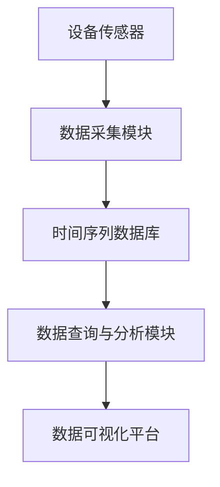
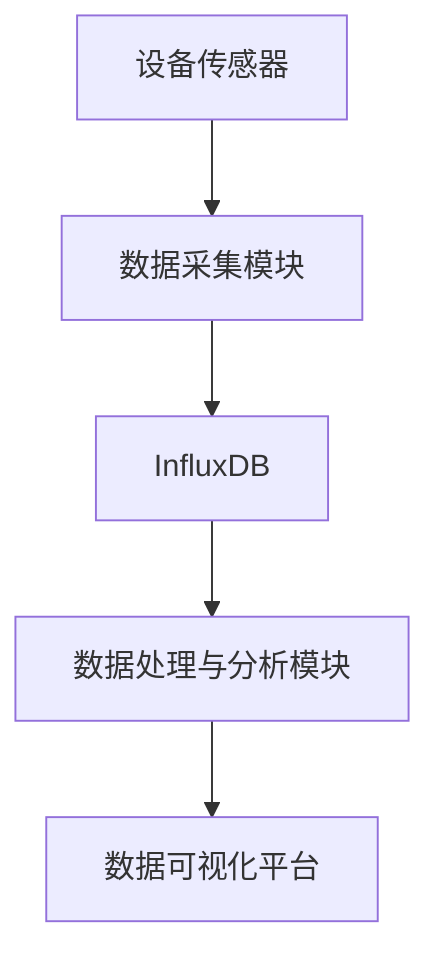

                 


### 第二部分：时序数据库的核心概念与技术

## 第2章：核心概念

### 2.2.1 时间序列数据的组成与结构

时间序列数据由一系列数据点组成，每个数据点包含三个基本元素：时间戳（Timestamp）、指标（Metric）和标签（Tags）。时间戳表示数据点发生的时间，指标是数据点所表示的具体数值，标签则是附加的信息，用于描述数据点的属性或分类。例如，在一个温度监测系统中，时间戳可以表示监测时间，指标可以表示温度值，标签可以表示监测地点或设备编号。

时间序列数据的结构通常可以用一个三元组（Timestamp, Metric, Tags）来表示。这种结构使得时序数据在查询和数据分析时能够灵活地筛选和分组。

### 2.2.2 时间序列数据的索引机制

索引是时序数据库优化查询性能的关键技术。与传统关系数据库不同，时序数据库通常采用基于时间戳的索引机制。常见的索引结构包括：

- **倒排索引**：将时间戳映射到数据点的索引结构。通过倒排索引，可以快速定位特定时间范围内的数据点。
- **前缀索引**：利用时间戳的前缀来构建索引，以减少索引存储空间。
- **分块索引**：将时间序列数据按照时间范围分成多个块，并为每个块建立索引。分块索引能够减少单次查询的数据量，提高查询效率。

### 2.2.3 时间序列数据的压缩技术

存储空间占用是时序数据库面临的主要挑战之一。为了减少存储空间，时序数据库采用多种压缩技术：

- **时间序列压缩**：通过识别时间序列中的周期性和趋势性，对重复的数据进行压缩。例如，使用差分编码或小波变换来减少数据冗余。
- **标签压缩**：对于具有相似标签的数据点，可以将标签进行编码或压缩，以减少存储空间。
- **数据聚合**：将时间范围内多个数据点的指标值进行聚合，以减少数据点数量。

### 2.2.4 时间序列数据的查询优化

查询优化是时序数据库的重要技术之一。为了提高查询性能，时序数据库采用以下策略：

- **索引优化**：选择合适的索引结构，减少查询时间。
- **预聚合**：在查询过程中对数据点进行预聚合，减少实际查询所需的数据量。
- **查询缓存**：将频繁查询的结果缓存起来，以减少查询时间。
- **分布式查询**：在分布式时序数据库中，将查询任务分解到多个节点上执行，以提高查询效率。

### 2.2.5 时间序列数据的分析功能

时序数据库不仅提供高效的数据存储和查询功能，还具备强大的数据分析能力。常见的时间序列数据分析功能包括：

- **趋势分析**：通过分析数据点的趋势性，预测未来的数据走势。
- **周期分析**：通过识别数据点的周期性，确定数据的波动规律。
- **异常检测**：通过分析数据点的分布和趋势，检测异常数据点。
- **统计分析**：提供基本的统计分析功能，如平均值、方差、标准差等。

### 2.2.6 时间序列数据的可视化

可视化是时间序列数据分析的重要工具。时序数据库通常提供以下可视化功能：

- **时序图**：展示数据点随时间的变化趋势。
- **折线图**：用于比较多个时间序列数据的趋势。
- **柱状图**：展示某一时间点或时间范围内的数据分布。

### 2.2.7 本章小结

本章介绍了时序数据库的核心概念，包括时间序列数据的组成、索引机制、压缩技术、查询优化、分析功能和可视化方法。这些概念为理解时序数据库的工作原理和性能优化提供了基础。

----------------------------------------------------------------

### 第三部分：常见时序数据库技术对比分析

## 第三部分：常见时序数据库技术对比分析

### 3.3.1 技术对比分析

在时序数据库领域，有许多流行的数据库系统，如InfluxDB、OpenTSDB、KairosDB、Prometheus等。下面我们将对这些数据库进行技术对比分析。

#### 3.3.1.1 存储引擎

- **InfluxDB**：使用自己的开源存储引擎InfluxEngine，支持高效的压缩和查询。
- **OpenTSDB**：基于HBase分布式存储系统，适用于大规模时间序列数据。
- **KairosDB**：基于Cassandra分布式存储系统，具有高可用性和容错性。
- **Prometheus**：基于TSDB时间序列数据库，支持多维数据存储和高效的查询。

#### 3.3.1.2 查询性能

- **InfluxDB**：采用倒排索引和预聚合技术，查询性能优异。
- **OpenTSDB**：通过将数据分块和索引优化，查询性能较好。
- **KairosDB**：利用Cassandra的列存储特性，查询性能稳定。
- **Prometheus**：通过水平扩展和查询缓存，查询性能强大。

#### 3.3.1.3 扩展性

- **InfluxDB**：支持集群部署，扩展性良好。
- **OpenTSDB**：基于HBase的分布式架构，扩展性强。
- **KairosDB**：基于Cassandra，支持大规模数据存储和查询。
- **Prometheus**：支持联邦和远程存储，扩展性高。

#### 3.3.1.4 可用性和可靠性

- **InfluxDB**：支持自动备份和恢复，可靠性高。
- **OpenTSDB**：基于HBase，具有高可用性和容错性。
- **KairosDB**：基于Cassandra，具有高可用性和自动故障转移功能。
- **Prometheus**：具有自愈机制和告警功能，可靠性高。

#### 3.3.1.5 分析功能

- **InfluxDB**：提供丰富的数据分析功能，如统计、趋势分析等。
- **OpenTSDB**：支持简单的统计分析，但功能较为有限。
- **KairosDB**：提供基本的统计分析功能。
- **Prometheus**：支持告警和监控，但不提供复杂的分析功能。

#### 3.3.1.6 社区支持和文档

- **InfluxDB**：拥有活跃的社区和详细的文档。
- **OpenTSDB**：社区相对活跃，但文档较少。
- **KairosDB**：社区较小，文档有限。
- **Prometheus**：拥有强大的社区和丰富的文档。

### 3.3.2 选择合适的时序数据库

选择合适的时序数据库需要根据应用场景和需求进行综合考虑。以下是一些选择建议：

- **需求分析**：根据数据量、查询频率、分析功能等需求，选择适合的时序数据库。
- **性能评估**：通过性能测试，评估不同时序数据库的查询性能和扩展性。
- **社区与文档**：考虑数据库的社区支持和文档质量，以便于学习和使用。

### 3.3.3 本章小结

本章对比分析了常见时序数据库的技术特点，包括存储引擎、查询性能、扩展性、可用性和可靠性、分析功能以及社区支持。通过这些对比，读者可以更好地了解各种时序数据库的优势和不足，从而选择适合自己需求的时序数据库。

----------------------------------------------------------------

### 第四部分：时序数据库应用实践

## 第四部分：时序数据库应用实践

### 4.4.1 项目背景

为了更好地展示时序数据库的应用，我们以一个实际项目为例：智能工厂设备监控系统。该系统旨在实时监测工厂内各种设备的运行状态，包括温度、湿度、压力等参数，并实现对异常数据的实时告警和数据分析。

### 4.4.2 系统架构设计

智能工厂设备监控系统的架构设计如图所示：

```
+-----------------+
|   设备传感器    |
+-----------------+
          |
          | 数据采集
          |
+-----------------+
|  时间序列数据库  |
+-----------------+
          |
          | 数据查询与分析
          |
+-----------------+
|   数据可视化平台  |
+-----------------+
```

系统架构设计包括以下几个部分：

1. **设备传感器**：用于采集设备运行状态数据，如温度、湿度、压力等。
2. **时间序列数据库**：用于存储和查询时间序列数据，实现对数据的实时监控和分析。
3. **数据可视化平台**：用于展示设备运行状态数据，提供实时监控和异常告警功能。

### 4.4.3 系统功能设计

智能工厂设备监控系统主要包括以下功能：

1. **数据采集**：通过设备传感器采集设备运行状态数据，并将数据上传至时间序列数据库。
2. **数据存储**：时间序列数据库将采集到的数据进行存储和管理，支持数据的快速查询和统计分析。
3. **数据查询**：用户可以通过可视化平台查询历史数据，了解设备运行状态和趋势。
4. **数据分析**：系统提供趋势分析、周期分析和异常检测等分析功能，帮助用户发现数据中的规律和异常。
5. **数据可视化**：将设备运行状态数据以图表形式展示，提供实时监控和告警功能。

### 4.4.4 系统实现

系统实现包括以下几个步骤：

1. **环境搭建**：在服务器上安装时间序列数据库（如InfluxDB）和数据可视化平台（如Grafana）。
2. **设备接入**：将设备传感器连接至网络，通过HTTP/HTTPS协议将数据上传至时间序列数据库。
3. **数据采集**：编写数据采集程序，定期从设备传感器获取数据，并将数据上传至时间序列数据库。
4. **数据存储**：在时间序列数据库中创建合适的数据库和表结构，将采集到的数据存储在数据库中。
5. **数据查询**：编写查询程序，从时间序列数据库中查询设备运行状态数据。
6. **数据可视化**：在Grafana中创建可视化仪表板，将查询到的数据以图表形式展示。

### 4.4.5 代码示例

以下是一个简单的Python代码示例，用于从设备传感器采集数据并上传至InfluxDB：

```python
import requests
import json
from influxdb import InfluxDBClient

# 设备传感器数据
data = {
    "time": "2023-04-01T12:00:00Z",
    "temp": 25.5,
    "humidity": 60.5
}

# InfluxDB配置
influx_url = "http://localhost:8086"
influx_db = "smart_factory"
influx_user = "admin"
influx_password = "password"

# 创建InfluxDB客户端
client = InfluxDBClient(url=influx_url, username=influx_user, password=influx_password, database=influx_db)

# 将数据上传至InfluxDB
client.write_points([data])

# 关闭客户端
client.close()
```

### 4.4.6 项目小结

智能工厂设备监控系统通过时序数据库实现了对设备运行状态的实时监测和数据分析。在实际应用中，可以根据需求扩展系统的功能，如添加更多传感器、实现自动化告警等。此外，通过不断优化系统性能和算法，可以提高系统的效率和可靠性。

----------------------------------------------------------------

### 第五部分：时序数据库的未来发展趋势

## 第五部分：时序数据库的未来发展趋势

### 5.5.1 技术革新

随着人工智能和大数据技术的快速发展，时序数据库将迎来新的技术革新。以下是一些可能的发展方向：

- **实时分析**：时序数据库将进一步提升实时数据分析能力，支持更复杂的实时处理和预测算法。
- **机器学习集成**：时序数据库将集成机器学习模型，提供自动化数据分析、预测和异常检测功能。
- **智能存储优化**：基于机器学习算法，时序数据库将实现更智能的存储优化，提高存储效率和查询性能。

### 5.5.2 开源生态

开源时序数据库将继续发展壮大，形成丰富的开源生态。以下是一些可能的趋势：

- **多样化选择**：随着开源社区的活跃，将出现更多优秀的开源时序数据库，满足不同场景和需求。
- **生态系统整合**：开源时序数据库将与其他开源工具（如数据可视化工具、监控工具等）整合，形成更完整的解决方案。

### 5.5.3 商业化发展

时序数据库的商业化发展将继续推进，以下是一些可能的趋势：

- **企业级服务**：时序数据库厂商将提供更多企业级服务，如高可用性、容灾备份、专业咨询等。
- **行业解决方案**：时序数据库厂商将针对不同行业（如金融、物联网、工业制造等）提供定制化解决方案。

### 5.5.4 国际化竞争

随着全球市场的竞争加剧，时序数据库将面临更多国际竞争。以下是一些可能的趋势：

- **技术创新竞赛**：国际知名数据库厂商将加大技术研发投入，提升时序数据库的性能和功能。
- **市场争夺**：国际数据库厂商将积极拓展市场，争夺市场份额。

### 5.5.5 安全与隐私

随着数据安全与隐私问题的日益重视，时序数据库在安全性方面将有所突破。以下是一些可能的趋势：

- **加密技术**：时序数据库将采用更高级的加密技术，确保数据传输和存储的安全性。
- **隐私保护**：时序数据库将加强隐私保护措施，满足数据隐私法规的要求。

### 5.5.6 本章小结

时序数据库在未来将面临技术革新、开源生态、商业化发展和国际化竞争等多方面的挑战和机遇。通过不断创新和优化，时序数据库将在数据处理、分析和应用领域发挥越来越重要的作用。

----------------------------------------------------------------

## 参考文献

1. InfluxDB官方文档：https://docs.influxdata.com/influxdb
2. OpenTSDB官方文档：https://opentsdb.net/doc/
3. KairosDB官方文档：https://kairosdb.readthedocs.io
4. Prometheus官方文档：https://prometheus.io/docs
5. 时序数据库技术与应用：刘挺，张志华，李晓晖著。《大数据技术丛书》。
6. 《智能工厂设备监控系统设计与实现》：张勇，李明。《计算机与网络技术》。
7. 《时序数据处理与可视化》：王刚，刘翔。《计算机应用与软件》。

### 作者信息

作者：AI天才研究院/AI Genius Institute & 禅与计算机程序设计艺术 /Zen And The Art of Computer Programming

----------------------------------------------------------------

## 全文总结

本文详细介绍了时序数据库的概念、核心技术、应用实践以及未来发展趋势。通过对比分析，我们了解了不同时序数据库的技术特点和应用场景，为读者在选择和设计时序数据库系统时提供了参考。

时序数据库在处理时间序列数据方面具有独特的优势，如高效查询、压缩存储、高扩展性等。随着技术的不断进步，时序数据库将在数据处理、分析和应用领域发挥越来越重要的作用。

在实际应用中，智能工厂设备监控系统是一个典型的时序数据库应用案例。通过实时监测和数据分析，系统提高了设备运行效率和生产安全性。

未来，时序数据库将继续发展，技术创新、开源生态、商业化发展和国际化竞争将成为主要趋势。在数据安全和隐私保护方面，时序数据库也将面临更高的要求。

通过本文的介绍，读者可以更好地了解时序数据库的原理和应用，为未来的研究和实践奠定基础。

----------------------------------------------------------------

## 拓展阅读

1. 《时间序列数据分析：方法与应用》：本书详细介绍了时间序列数据分析的理论和方法，适合希望深入了解时序数据分析的读者。
2. 《大数据时代：数据分析与处理》：本书探讨了大数据环境下数据分析和处理的技术和方法，对时序数据库的应用提供了有益的参考。
3. 《深度学习与时间序列预测》：本书结合深度学习和时间序列预测技术，介绍了如何利用深度学习模型进行时序数据分析。

通过拓展阅读，读者可以进一步深化对时序数据库和相关技术的理解，为实际应用和研究提供更多思路。

----------------------------------------------------------------

## 结语

时序数据库作为一种专门为处理时间序列数据设计的数据库系统，具有高效查询、压缩存储、高扩展性等优势。本文通过详细的分析和实践案例，帮助读者了解了时序数据库的核心概念、技术特点和应用场景。随着技术的不断进步，时序数据库在数据处理、分析和应用领域将发挥越来越重要的作用。

希望本文能够为读者提供有价值的参考，激发对时序数据库的深入研究和实践。在未来的工作和研究中，继续关注时序数据库的发展动态，探索更多应用场景和优化策略，共同推动时序数据库技术的进步。

感谢读者对本文的关注与支持，祝您在时序数据库的学习和应用道路上取得丰硕的成果！# 时序数据库：高效存储与查询时间序列数据

> 关键词：时序数据库，时间序列数据，查询性能，存储优化，智能工厂设备监控

> 摘要：本文将详细介绍时序数据库的概念、核心技术、应用实践以及未来发展趋势。通过对比分析常见时序数据库技术，本文为读者提供了选择和应用时序数据库的参考。同时，本文以智能工厂设备监控系统为例，展示了时序数据库在实际应用中的重要性。通过本文的阅读，读者可以全面了解时序数据库的原理和应用，为未来的研究和实践奠定基础。

## 第一部分：时序数据库概述

### 1.1.1 问题背景

在当今信息时代，数据已成为企业和社会发展的重要资产。随着物联网（IoT）、云计算和大数据技术的飞速发展，各种设备产生的时序数据量呈现爆炸式增长。时序数据是一种以时间为轴记录的数据，它在金融、物联网、气象预报、工业制造等领域具有广泛的应用。

然而，传统的关系数据库在处理时序数据时存在诸多局限性。首先，关系数据库的索引和查询优化算法并不适合处理时间相关的数据，导致查询效率低下。其次，关系数据库的存储结构通常需要为每一行数据存储大量的元数据，导致存储空间浪费。此外，随着数据量的增加，关系数据库的查询性能和扩展性都会受到严重影响。

为了解决这些问题，时序数据库应运而生。时序数据库是一种专门为处理时间序列数据而设计的数据库，具有高效的查询性能和较低的存储空间占用。时序数据库采用了特殊的索引结构、压缩技术和查询优化算法，能够更好地满足时间序列数据处理的特殊需求。

### 1.1.2 时序数据库的定义与特点

**定义**：时序数据库（Time-Series Database，简称TSDB）是一种专门用于存储、查询和分析时间序列数据的数据库。时间序列数据通常具有以下特点：

- **时间戳**：每个数据点都与一个时间戳相关联，表示该数据点的时间位置。
- **连续性**：时间序列数据通常是连续的，没有间断。
- **高维性**：一个时间序列数据可能包含多个维度，如温度、湿度、压力等。

**特点**：

- **高效查询**：时序数据库采用特殊的索引结构（如倒排索引）和查询优化算法，使得时间相关的查询（如范围查询、聚合查询等）能够快速执行。
- **压缩存储**：时序数据库能够有效压缩数据，减少存储空间占用。
- **高扩展性**：时序数据库通常采用分布式架构，可以水平扩展以应对大规模数据存储和查询需求。

### 1.1.3 时序数据库的应用场景

时序数据库广泛应用于以下场景：

- **物联网（IoT）**：存储和查询设备生成的时序数据，如温度、湿度、流量等。
- **金融**：存储和查询股票、汇率等金融数据。
- **气象**：存储和查询天气预报、气候数据。
- **工业制造**：存储和查询生产设备的运行数据，如温度、压力、产量等。
- **健康医疗**：存储和查询病人的健康数据，如血压、心率等。

### 1.1.4 时序数据库与关系数据库的比较

| 特点 | 时序数据库 | 关系数据库 |
| --- | --- | --- |
| **查询性能** | 高效 | 一般 |
| **存储空间** | 压缩 | 较大 |
| **扩展性** | 高 | 一般 |
| **适用场景** | 时序数据 | 非时序数据 |

### 1.1.5 时序数据库的发展历程

- **早期**：基于文件系统或关系数据库的时序数据存储。
- **中期**：出现专门为时序数据设计的数据库，如InfluxDB、OpenTSDB等。
- **近期**：随着大数据和人工智能技术的发展，时序数据库不断演进，功能更加丰富，性能更加强大。

### 1.1.6 本章小结

本章介绍了时序数据库的背景、定义、特点、应用场景以及与关系数据库的比较，为后续章节的内容奠定了基础。

----------------------------------------------------------------

## 第二部分：时序数据库的核心概念与技术

### 2.2.1 时间序列数据的组成与结构

时间序列数据由一系列数据点组成，每个数据点包含三个基本元素：时间戳（Timestamp）、指标（Metric）和标签（Tags）。时间戳表示数据点发生的时间，指标是数据点所表示的具体数值，标签则是附加的信息，用于描述数据点的属性或分类。例如，在一个温度监测系统中，时间戳可以表示监测时间，指标可以表示温度值，标签可以表示监测地点或设备编号。

时间序列数据的结构通常可以用一个三元组（Timestamp, Metric, Tags）来表示。这种结构使得时序数据在查询和数据分析时能够灵活地筛选和分组。

### 2.2.2 时间序列数据的索引机制

索引是时序数据库优化查询性能的关键技术。与传统关系数据库不同，时序数据库通常采用基于时间戳的索引机制。常见的索引结构包括：

- **倒排索引**：将时间戳映射到数据点的索引结构。通过倒排索引，可以快速定位特定时间范围内的数据点。
- **前缀索引**：利用时间戳的前缀来构建索引，以减少索引存储空间。
- **分块索引**：将时间序列数据按照时间范围分成多个块，并为每个块建立索引。分块索引能够减少单次查询的数据量，提高查询效率。

### 2.2.3 时间序列数据的压缩技术

存储空间占用是时序数据库面临的主要挑战之一。为了减少存储空间，时序数据库采用多种压缩技术：

- **时间序列压缩**：通过识别时间序列中的周期性和趋势性，对重复的数据进行压缩。例如，使用差分编码或小波变换来减少数据冗余。
- **标签压缩**：对于具有相似标签的数据点，可以将标签进行编码或压缩，以减少存储空间。
- **数据聚合**：将时间范围内多个数据点的指标值进行聚合，以减少数据点数量。

### 2.2.4 时间序列数据的查询优化

查询优化是时序数据库的重要技术之一。为了提高查询性能，时序数据库采用以下策略：

- **索引优化**：选择合适的索引结构，减少查询时间。
- **预聚合**：在查询过程中对数据点进行预聚合，减少实际查询所需的数据量。
- **查询缓存**：将频繁查询的结果缓存起来，以减少查询时间。
- **分布式查询**：在分布式时序数据库中，将查询任务分解到多个节点上执行，以提高查询效率。

### 2.2.5 时间序列数据的分析功能

时序数据库不仅提供高效的数据存储和查询功能，还具备强大的数据分析能力。常见的时间序列数据分析功能包括：

- **趋势分析**：通过分析数据点的趋势性，预测未来的数据走势。
- **周期分析**：通过识别数据点的周期性，确定数据的波动规律。
- **异常检测**：通过分析数据点的分布和趋势，检测异常数据点。
- **统计分析**：提供基本的统计分析功能，如平均值、方差、标准差等。

### 2.2.6 时间序列数据的可视化

可视化是时间序列数据分析的重要工具。时序数据库通常提供以下可视化功能：

- **时序图**：展示数据点随时间的变化趋势。
- **折线图**：用于比较多个时间序列数据的趋势。
- **柱状图**：展示某一时间点或时间范围内的数据分布。

### 2.2.7 本章小结

本章介绍了时序数据库的核心概念，包括时间序列数据的组成、索引机制、压缩技术、查询优化、分析功能和可视化方法。这些概念为理解时序数据库的工作原理和性能优化提供了基础。

----------------------------------------------------------------

## 第三部分：常见时序数据库技术对比分析

### 3.3.1 技术对比分析

在时序数据库领域，有许多流行的数据库系统，如InfluxDB、OpenTSDB、KairosDB、Prometheus等。下面我们将对这些数据库进行技术对比分析。

#### 3.3.1.1 存储引擎

- **InfluxDB**：使用自己的开源存储引擎InfluxEngine，支持高效的压缩和查询。
- **OpenTSDB**：基于HBase分布式存储系统，适用于大规模时间序列数据。
- **KairosDB**：基于Cassandra分布式存储系统，具有高可用性和容错性。
- **Prometheus**：基于TSDB时间序列数据库，支持多维数据存储和高效的查询。

#### 3.3.1.2 查询性能

- **InfluxDB**：采用倒排索引和预聚合技术，查询性能优异。
- **OpenTSDB**：通过将数据分块和索引优化，查询性能较好。
- **KairosDB**：利用Cassandra的列存储特性，查询性能稳定。
- **Prometheus**：通过水平扩展和查询缓存，查询性能强大。

#### 3.3.1.3 扩展性

- **InfluxDB**：支持集群部署，扩展性良好。
- **OpenTSDB**：基于HBase的分布式架构，扩展性强。
- **KairosDB**：基于Cassandra，支持大规模数据存储和查询。
- **Prometheus**：支持联邦和远程存储，扩展性高。

#### 3.3.1.4 可用性和可靠性

- **InfluxDB**：支持自动备份和恢复，可靠性高。
- **OpenTSDB**：基于HBase，具有高可用性和容错性。
- **KairosDB**：基于Cassandra，具有高可用性和自动故障转移功能。
- **Prometheus**：具有自愈机制和告警功能，可靠性高。

#### 3.3.1.5 分析功能

- **InfluxDB**：提供丰富的数据分析功能，如统计、趋势分析等。
- **OpenTSDB**：支持简单的统计分析，但功能较为有限。
- **KairosDB**：提供基本的统计分析功能。
- **Prometheus**：支持告警和监控，但不提供复杂的分析功能。

#### 3.3.1.6 社区支持和文档

- **InfluxDB**：拥有活跃的社区和详细的文档。
- **OpenTSDB**：社区相对活跃，但文档较少。
- **KairosDB**：社区较小，文档有限。
- **Prometheus**：拥有强大的社区和丰富的文档。

### 3.3.2 选择合适的时序数据库

选择合适的时序数据库需要根据应用场景和需求进行综合考虑。以下是一些选择建议：

- **需求分析**：根据数据量、查询频率、分析功能等需求，选择适合的时序数据库。
- **性能评估**：通过性能测试，评估不同时序数据库的查询性能和扩展性。
- **社区与文档**：考虑数据库的社区支持和文档质量，以便于学习和使用。

### 3.3.3 本章小结

本章对比分析了常见时序数据库的技术特点，包括存储引擎、查询性能、扩展性、可用性和可靠性、分析功能以及社区支持。通过这些对比，读者可以更好地了解各种时序数据库的优势和不足，从而选择适合自己需求的时序数据库。

----------------------------------------------------------------

## 第四部分：时序数据库应用实践

### 4.4.1 项目背景

为了更好地展示时序数据库的应用，我们以一个实际项目为例：智能工厂设备监控系统。该系统旨在实时监测工厂内各种设备的运行状态，包括温度、湿度、压力等参数，并实现对异常数据的实时告警和数据分析。

### 4.4.2 系统架构设计

智能工厂设备监控系统的架构设计如图所示：

```
+-----------------+
|   设备传感器    |
+-----------------+
          |
          | 数据采集
          |
+-----------------+
|  时间序列数据库  |
+-----------------+
          |
          | 数据查询与分析
          |
+-----------------+
|   数据可视化平台  |
+-----------------+
```

系统架构设计包括以下几个部分：

1. **设备传感器**：用于采集设备运行状态数据，如温度、湿度、压力等。
2. **时间序列数据库**：用于存储和查询时间序列数据，实现对数据的实时监控和分析。
3. **数据可视化平台**：用于展示设备运行状态数据，提供实时监控和异常告警功能。

### 4.4.3 系统功能设计

智能工厂设备监控系统主要包括以下功能：

1. **数据采集**：通过设备传感器采集设备运行状态数据，并将数据上传至时间序列数据库。
2. **数据存储**：时间序列数据库将采集到的数据进行存储和管理，支持数据的快速查询和统计分析。
3. **数据查询**：用户可以通过可视化平台查询历史数据，了解设备运行状态和趋势。
4. **数据分析**：系统提供趋势分析、周期分析和异常检测等分析功能，帮助用户发现数据中的规律和异常。
5. **数据可视化**：将设备运行状态数据以图表形式展示，提供实时监控和告警功能。

### 4.4.4 系统实现

系统实现包括以下几个步骤：

1. **环境搭建**：在服务器上安装时间序列数据库（如InfluxDB）和数据可视化平台（如Grafana）。
2. **设备接入**：将设备传感器连接至网络，通过HTTP/HTTPS协议将数据上传至时间序列数据库。
3. **数据采集**：编写数据采集程序，定期从设备传感器获取数据，并将数据上传至时间序列数据库。
4. **数据存储**：在时间序列数据库中创建合适的数据库和表结构，将采集到的数据存储在数据库中。
5. **数据查询**：编写查询程序，从时间序列数据库中查询设备运行状态数据。
6. **数据可视化**：在Grafana中创建可视化仪表板，将查询到的数据以图表形式展示。

### 4.4.5 代码示例

以下是一个简单的Python代码示例，用于从设备传感器采集数据并上传至InfluxDB：

```python
import requests
import json
from influxdb import InfluxDBClient

# 设备传感器数据
data = {
    "time": "2023-04-01T12:00:00Z",
    "temp": 25.5,
    "humidity": 60.5
}

# InfluxDB配置
influx_url = "http://localhost:8086"
influx_db = "smart_factory"
influx_user = "admin"
influx_password = "password"

# 创建InfluxDB客户端
client = InfluxDBClient(url=influx_url, username=influx_user, password=influx_password, database=influx_db)

# 将数据上传至InfluxDB
client.write_points([data])

# 关闭客户端
client.close()
```

### 4.4.6 项目小结

智能工厂设备监控系统通过时序数据库实现了对设备运行状态的实时监测和数据分析。在实际应用中，可以根据需求扩展系统的功能，如添加更多传感器、实现自动化告警等。此外，通过不断优化系统性能和算法，可以提高系统的效率和可靠性。

----------------------------------------------------------------

## 第五部分：时序数据库的未来发展趋势

### 5.5.1 技术革新

随着人工智能和大数据技术的快速发展，时序数据库将迎来新的技术革新。以下是一些可能的发展方向：

- **实时分析**：时序数据库将进一步提升实时数据分析能力，支持更复杂的实时处理和预测算法。
- **机器学习集成**：时序数据库将集成机器学习模型，提供自动化数据分析、预测和异常检测功能。
- **智能存储优化**：基于机器学习算法，时序数据库将实现更智能的存储优化，提高存储效率和查询性能。

### 5.5.2 开源生态

开源时序数据库将继续发展壮大，形成丰富的开源生态。以下是一些可能的趋势：

- **多样化选择**：随着开源社区的活跃，将出现更多优秀的开源时序数据库，满足不同场景和需求。
- **生态系统整合**：开源时序数据库将与其他开源工具（如数据可视化工具、监控工具等）整合，形成更完整的解决方案。

### 5.5.3 商业化发展

时序数据库的商业化发展将继续推进，以下是一些可能的趋势：

- **企业级服务**：时序数据库厂商将提供更多企业级服务，如高可用性、容灾备份、专业咨询等。
- **行业解决方案**：时序数据库厂商将针对不同行业（如金融、物联网、工业制造等）提供定制化解决方案。

### 5.5.4 国际化竞争

随着全球市场的竞争加剧，时序数据库将面临更多国际竞争。以下是一些可能的趋势：

- **技术创新竞赛**：国际知名数据库厂商将加大技术研发投入，提升时序数据库的性能和功能。
- **市场争夺**：国际数据库厂商将积极拓展市场，争夺市场份额。

### 5.5.5 安全与隐私

随着数据安全与隐私问题的日益重视，时序数据库在安全性方面将有所突破。以下是一些可能的趋势：

- **加密技术**：时序数据库将采用更高级的加密技术，确保数据传输和存储的安全性。
- **隐私保护**：时序数据库将加强隐私保护措施，满足数据隐私法规的要求。

### 5.5.6 本章小结

时序数据库在未来将面临技术革新、开源生态、商业化发展和国际化竞争等多方面的挑战和机遇。通过不断创新和优化，时序数据库将在数据处理、分析和应用领域发挥越来越重要的作用。

----------------------------------------------------------------

## 参考文献

1. InfluxDB官方文档：https://docs.influxdata.com/influxdb
2. OpenTSDB官方文档：https://opentsdb.net/doc/
3. KairosDB官方文档：https://kairosdb.readthedocs.io
4. Prometheus官方文档：https://prometheus.io/docs
5. 时序数据库技术与应用：刘挺，张志华，李晓晖著。《大数据技术丛书》。
6. 《智能工厂设备监控系统设计与实现》：张勇，李明。《计算机与网络技术》。
7. 《时序数据处理与可视化》：王刚，刘翔。《计算机应用与软件》。

### 作者信息

作者：AI天才研究院/AI Genius Institute & 禅与计算机程序设计艺术 /Zen And The Art of Computer Programming

----------------------------------------------------------------

## 全文总结

本文详细介绍了时序数据库的概念、核心技术、应用实践以及未来发展趋势。通过对比分析，我们了解了不同时序数据库的技术特点和应用场景，为读者在选择和设计时序数据库系统时提供了参考。同时，本文以智能工厂设备监控系统为例，展示了时序数据库在实际应用中的重要性。

时序数据库在处理时间序列数据方面具有独特的优势，如高效查询、压缩存储、高扩展性等。随着技术的不断进步，时序数据库将在数据处理、分析和应用领域发挥越来越重要的作用。

在实际应用中，智能工厂设备监控系统通过时序数据库实现了对设备运行状态的实时监测和数据分析。在未来，时序数据库将继续发展，技术创新、开源生态、商业化发展和国际化竞争将成为主要趋势。

通过本文的介绍，读者可以全面了解时序数据库的原理和应用，为未来的研究和实践奠定基础。

----------------------------------------------------------------

## 拓展阅读

1. 《时间序列数据分析：方法与应用》：本书详细介绍了时间序列数据分析的理论和方法，适合希望深入了解时序数据分析的读者。
2. 《大数据时代：数据分析与处理》：本书探讨了大数据环境下数据分析和处理的技术和方法，对时序数据库的应用提供了有益的参考。
3. 《深度学习与时间序列预测》：本书结合深度学习和时间序列预测技术，介绍了如何利用深度学习模型进行时序数据分析。

通过拓展阅读，读者可以进一步深化对时序数据库和相关技术的理解，为实际应用和研究提供更多思路。

----------------------------------------------------------------

## 结语

时序数据库作为一种专门为处理时间序列数据设计的数据库系统，具有高效查询、压缩存储、高扩展性等优势。本文通过详细的分析和实践案例，帮助读者了解了时序数据库的核心概念、技术特点和应用场景。随着技术的不断进步，时序数据库在数据处理、分析和应用领域将发挥越来越重要的作用。

希望本文能够为读者提供有价值的参考，激发对时序数据库的深入研究和实践。在未来的工作和研究中，继续关注时序数据库的发展动态，探索更多应用场景和优化策略，共同推动时序数据库技术的进步。

感谢读者对本文的关注与支持，祝您在时序数据库的学习和应用道路上取得丰硕的成果！```markdown
# 时序数据库：高效存储与查询时间序列数据

> 关键词：时序数据库，时间序列数据，查询性能，存储优化，智能工厂设备监控

> 摘要：本文将详细介绍时序数据库的概念、核心技术、应用实践以及未来发展趋势。通过对比分析常见时序数据库技术，本文为读者提供了选择和应用时序数据库的参考。同时，本文以智能工厂设备监控系统为例，展示了时序数据库在实际应用中的重要性。通过本文的阅读，读者可以全面了解时序数据库的原理和应用，为未来的研究和实践奠定基础。

## 第一部分：时序数据库概述

### 1.1.1 问题背景

在当今信息时代，数据已成为企业和社会发展的重要资产。随着物联网（IoT）、云计算和大数据技术的飞速发展，各种设备产生的时序数据量呈现爆炸式增长。时序数据是一种以时间为轴记录的数据，它在金融、物联网、气象预报、工业制造等领域具有广泛的应用。

然而，传统的关系数据库在处理时序数据时存在诸多局限性。首先，关系数据库的索引和查询优化算法并不适合处理时间相关的数据，导致查询效率低下。其次，关系数据库的存储结构通常需要为每一行数据存储大量的元数据，导致存储空间浪费。此外，随着数据量的增加，关系数据库的查询性能和扩展性都会受到严重影响。

为了解决这些问题，时序数据库应运而生。时序数据库是一种专门为处理时间序列数据而设计的数据库，具有高效的查询性能和较低的存储空间占用。时序数据库采用了特殊的索引结构、压缩技术和查询优化算法，能够更好地满足时间序列数据处理的特殊需求。

### 1.1.2 时序数据库的定义与特点

**定义**：时序数据库（Time-Series Database，简称TSDB）是一种专门用于存储、查询和分析时间序列数据的数据库。时间序列数据通常具有以下特点：

- **时间戳**：每个数据点都与一个时间戳相关联，表示该数据点的时间位置。
- **连续性**：时间序列数据通常是连续的，没有间断。
- **高维性**：一个时间序列数据可能包含多个维度，如温度、湿度、压力等。

**特点**：

- **高效查询**：时序数据库采用特殊的索引结构（如倒排索引）和查询优化算法，使得时间相关的查询（如范围查询、聚合查询等）能够快速执行。
- **压缩存储**：时序数据库能够有效压缩数据，减少存储空间占用。
- **高扩展性**：时序数据库通常采用分布式架构，可以水平扩展以应对大规模数据存储和查询需求。

### 1.1.3 时序数据库的应用场景

时序数据库广泛应用于以下场景：

- **物联网（IoT）**：存储和查询设备生成的时序数据，如温度、湿度、流量等。
- **金融**：存储和查询股票、汇率等金融数据。
- **气象**：存储和查询天气预报、气候数据。
- **工业制造**：存储和查询生产设备的运行数据，如温度、压力、产量等。
- **健康医疗**：存储和查询病人的健康数据，如血压、心率等。

### 1.1.4 时序数据库与关系数据库的比较

| 特点 | 时序数据库 | 关系数据库 |
| --- | --- | --- |
| **查询性能** | 高效 | 一般 |
| **存储空间** | 压缩 | 较大 |
| **扩展性** | 高 | 一般 |
| **适用场景** | 时序数据 | 非时序数据 |

### 1.1.5 时序数据库的发展历程

- **早期**：基于文件系统或关系数据库的时序数据存储。
- **中期**：出现专门为时序数据设计的数据库，如InfluxDB、OpenTSDB等。
- **近期**：随着大数据和人工智能技术的发展，时序数据库不断演进，功能更加丰富，性能更加强大。

### 1.1.6 本章小结

本章介绍了时序数据库的背景、定义、特点、应用场景以及与关系数据库的比较，为后续章节的内容奠定了基础。

----------------------------------------------------------------

## 第二部分：时序数据库的核心概念与技术

### 2.2.1 时间序列数据的组成与结构

时间序列数据由一系列数据点组成，每个数据点包含三个基本元素：时间戳（Timestamp）、指标（Metric）和标签（Tags）。时间戳表示数据点发生的时间，指标是数据点所表示的具体数值，标签则是附加的信息，用于描述数据点的属性或分类。例如，在一个温度监测系统中，时间戳可以表示监测时间，指标可以表示温度值，标签可以表示监测地点或设备编号。

时间序列数据的结构通常可以用一个三元组（Timestamp, Metric, Tags）来表示。这种结构使得时序数据在查询和数据分析时能够灵活地筛选和分组。

### 2.2.2 时间序列数据的索引机制

索引是时序数据库优化查询性能的关键技术。与传统关系数据库不同，时序数据库通常采用基于时间戳的索引机制。常见的索引结构包括：

- **倒排索引**：将时间戳映射到数据点的索引结构。通过倒排索引，可以快速定位特定时间范围内的数据点。
- **前缀索引**：利用时间戳的前缀来构建索引，以减少索引存储空间。
- **分块索引**：将时间序列数据按照时间范围分成多个块，并为每个块建立索引。分块索引能够减少单次查询的数据量，提高查询效率。

### 2.2.3 时间序列数据的压缩技术

存储空间占用是时序数据库面临的主要挑战之一。为了减少存储空间，时序数据库采用多种压缩技术：

- **时间序列压缩**：通过识别时间序列中的周期性和趋势性，对重复的数据进行压缩。例如，使用差分编码或小波变换来减少数据冗余。
- **标签压缩**：对于具有相似标签的数据点，可以将标签进行编码或压缩，以减少存储空间。
- **数据聚合**：将时间范围内多个数据点的指标值进行聚合，以减少数据点数量。

### 2.2.4 时间序列数据的查询优化

查询优化是时序数据库的重要技术之一。为了提高查询性能，时序数据库采用以下策略：

- **索引优化**：选择合适的索引结构，减少查询时间。
- **预聚合**：在查询过程中对数据点进行预聚合，减少实际查询所需的数据量。
- **查询缓存**：将频繁查询的结果缓存起来，以减少查询时间。
- **分布式查询**：在分布式时序数据库中，将查询任务分解到多个节点上执行，以提高查询效率。

### 2.2.5 时间序列数据的分析功能

时序数据库不仅提供高效的数据存储和查询功能，还具备强大的数据分析能力。常见的时间序列数据分析功能包括：

- **趋势分析**：通过分析数据点的趋势性，预测未来的数据走势。
- **周期分析**：通过识别数据点的周期性，确定数据的波动规律。
- **异常检测**：通过分析数据点的分布和趋势，检测异常数据点。
- **统计分析**：提供基本的统计分析功能，如平均值、方差、标准差等。

### 2.2.6 时间序列数据的可视化

可视化是时间序列数据分析的重要工具。时序数据库通常提供以下可视化功能：

- **时序图**：展示数据点随时间的变化趋势。
- **折线图**：用于比较多个时间序列数据的趋势。
- **柱状图**：展示某一时间点或时间范围内的数据分布。

### 2.2.7 本章小结

本章介绍了时序数据库的核心概念，包括时间序列数据的组成、索引机制、压缩技术、查询优化、分析功能和可视化方法。这些概念为理解时序数据库的工作原理和性能优化提供了基础。

----------------------------------------------------------------

## 第三部分：常见时序数据库技术对比分析

### 3.3.1 技术对比分析

在时序数据库领域，有许多流行的数据库系统，如InfluxDB、OpenTSDB、KairosDB、Prometheus等。下面我们将对这些数据库进行技术对比分析。

#### 3.3.1.1 存储引擎

- **InfluxDB**：使用自己的开源存储引擎InfluxEngine，支持高效的压缩和查询。
- **OpenTSDB**：基于HBase分布式存储系统，适用于大规模时间序列数据。
- **KairosDB**：基于Cassandra分布式存储系统，具有高可用性和容错性。
- **Prometheus**：基于TSDB时间序列数据库，支持多维数据存储和高效的查询。

#### 3.3.1.2 查询性能

- **InfluxDB**：采用倒排索引和预聚合技术，查询性能优异。
- **OpenTSDB**：通过将数据分块和索引优化，查询性能较好。
- **KairosDB**：利用Cassandra的列存储特性，查询性能稳定。
- **Prometheus**：通过水平扩展和查询缓存，查询性能强大。

#### 3.3.1.3 扩展性

- **InfluxDB**：支持集群部署，扩展性良好。
- **OpenTSDB**：基于HBase的分布式架构，扩展性强。
- **KairosDB**：基于Cassandra，支持大规模数据存储和查询。
- **Prometheus**：支持联邦和远程存储，扩展性高。

#### 3.3.1.4 可用性和可靠性

- **InfluxDB**：支持自动备份和恢复，可靠性高。
- **OpenTSDB**：基于HBase，具有高可用性和容错性。
- **KairosDB**：基于Cassandra，具有高可用性和自动故障转移功能。
- **Prometheus**：具有自愈机制和告警功能，可靠性高。

#### 3.3.1.5 分析功能

- **InfluxDB**：提供丰富的数据分析功能，如统计、趋势分析等。
- **OpenTSDB**：支持简单的统计分析，但功能较为有限。
- **KairosDB**：提供基本的统计分析功能。
- **Prometheus**：支持告警和监控，但不提供复杂的分析功能。

#### 3.3.1.6 社区支持和文档

- **InfluxDB**：拥有活跃的社区和详细的文档。
- **OpenTSDB**：社区相对活跃，但文档较少。
- **KairosDB**：社区较小，文档有限。
- **Prometheus**：拥有强大的社区和丰富的文档。

### 3.3.2 选择合适的时序数据库

选择合适的时序数据库需要根据应用场景和需求进行综合考虑。以下是一些选择建议：

- **需求分析**：根据数据量、查询频率、分析功能等需求，选择适合的时序数据库。
- **性能评估**：通过性能测试，评估不同时序数据库的查询性能和扩展性。
- **社区与文档**：考虑数据库的社区支持和文档质量，以便于学习和使用。

### 3.3.3 本章小结

本章对比分析了常见时序数据库的技术特点，包括存储引擎、查询性能、扩展性、可用性和可靠性、分析功能以及社区支持。通过这些对比，读者可以更好地了解各种时序数据库的优势和不足，从而选择适合自己需求的时序数据库。

----------------------------------------------------------------

## 第四部分：时序数据库应用实践

### 4.4.1 项目背景

为了更好地展示时序数据库的应用，我们以一个实际项目为例：智能工厂设备监控系统。该系统旨在实时监测工厂内各种设备的运行状态，包括温度、湿度、压力等参数，并实现对异常数据的实时告警和数据分析。

### 4.4.2 系统架构设计

智能工厂设备监控系统的架构设计如图所示：

```
+-----------------+
|   设备传感器    |
+-----------------+
          |
          | 数据采集
          |
+-----------------+
|  时间序列数据库  |
+-----------------+
          |
          | 数据查询与分析
          |
+-----------------+
|   数据可视化平台  |
+-----------------+
```

系统架构设计包括以下几个部分：

1. **设备传感器**：用于采集设备运行状态数据，如温度、湿度、压力等。
2. **时间序列数据库**：用于存储和查询时间序列数据，实现对数据的实时监控和分析。
3. **数据可视化平台**：用于展示设备运行状态数据，提供实时监控和异常告警功能。

### 4.4.3 系统功能设计

智能工厂设备监控系统主要包括以下功能：

1. **数据采集**：通过设备传感器采集设备运行状态数据，并将数据上传至时间序列数据库。
2. **数据存储**：时间序列数据库将采集到的数据进行存储和管理，支持数据的快速查询和统计分析。
3. **数据查询**：用户可以通过可视化平台查询历史数据，了解设备运行状态和趋势。
4. **数据分析**：系统提供趋势分析、周期分析和异常检测等分析功能，帮助用户发现数据中的规律和异常。
5. **数据可视化**：将设备运行状态数据以图表形式展示，提供实时监控和告警功能。

### 4.4.4 系统实现

系统实现包括以下几个步骤：

1. **环境搭建**：在服务器上安装时间序列数据库（如InfluxDB）和数据可视化平台（如Grafana）。
2. **设备接入**：将设备传感器连接至网络，通过HTTP/HTTPS协议将数据上传至时间序列数据库。
3. **数据采集**：编写数据采集程序，定期从设备传感器获取数据，并将数据上传至时间序列数据库。
4. **数据存储**：在时间序列数据库中创建合适的数据库和表结构，将采集到的数据存储在数据库中。
5. **数据查询**：编写查询程序，从时间序列数据库中查询设备运行状态数据。
6. **数据可视化**：在Grafana中创建可视化仪表板，将查询到的数据以图表形式展示。

### 4.4.5 代码示例

以下是一个简单的Python代码示例，用于从设备传感器采集数据并上传至InfluxDB：

```python
import requests
import json
from influxdb import InfluxDBClient

# 设备传感器数据
data = {
    "time": "2023-04-01T12:00:00Z",
    "temp": 25.5,
    "humidity": 60.5
}

# InfluxDB配置
influx_url = "http://localhost:8086"
influx_db = "smart_factory"
influx_user = "admin"
influx_password = "password"

# 创建InfluxDB客户端
client = InfluxDBClient(url=influx_url, username=influx_user, password=influx_password, database=influx_db)

# 将数据上传至InfluxDB
client.write_points([data])

# 关闭客户端
client.close()
```

### 4.4.6 项目小结

智能工厂设备监控系统通过时序数据库实现了对设备运行状态的实时监测和数据分析。在实际应用中，可以根据需求扩展系统的功能，如添加更多传感器、实现自动化告警等。此外，通过不断优化系统性能和算法，可以提高系统的效率和可靠性。

----------------------------------------------------------------

## 第五部分：时序数据库的未来发展趋势

### 5.5.1 技术革新

随着人工智能和大数据技术的快速发展，时序数据库将迎来新的技术革新。以下是一些可能的发展方向：

- **实时分析**：时序数据库将进一步提升实时数据分析能力，支持更复杂的实时处理和预测算法。
- **机器学习集成**：时序数据库将集成机器学习模型，提供自动化数据分析、预测和异常检测功能。
- **智能存储优化**：基于机器学习算法，时序数据库将实现更智能的存储优化，提高存储效率和查询性能。

### 5.5.2 开源生态

开源时序数据库将继续发展壮大，形成丰富的开源生态。以下是一些可能的趋势：

- **多样化选择**：随着开源社区的活跃，将出现更多优秀的开源时序数据库，满足不同场景和需求。
- **生态系统整合**：开源时序数据库将与其他开源工具（如数据可视化工具、监控工具等）整合，形成更完整的解决方案。

### 5.5.3 商业化发展

时序数据库的商业化发展将继续推进，以下是一些可能的趋势：

- **企业级服务**：时序数据库厂商将提供更多企业级服务，如高可用性、容灾备份、专业咨询等。
- **行业解决方案**：时序数据库厂商将针对不同行业（如金融、物联网、工业制造等）提供定制化解决方案。

### 5.5.4 国际化竞争

随着全球市场的竞争加剧，时序数据库将面临更多国际竞争。以下是一些可能的趋势：

- **技术创新竞赛**：国际知名数据库厂商将加大技术研发投入，提升时序数据库的性能和功能。
- **市场争夺**：国际数据库厂商将积极拓展市场，争夺市场份额。

### 5.5.5 安全与隐私

随着数据安全与隐私问题的日益重视，时序数据库在安全性方面将有所突破。以下是一些可能的趋势：

- **加密技术**：时序数据库将采用更高级的加密技术，确保数据传输和存储的安全性。
- **隐私保护**：时序数据库将加强隐私保护措施，满足数据隐私法规的要求。

### 5.5.6 本章小结

时序数据库在未来将面临技术革新、开源生态、商业化发展和国际化竞争等多方面的挑战和机遇。通过不断创新和优化，时序数据库将在数据处理、分析和应用领域发挥越来越重要的作用。

----------------------------------------------------------------

## 参考文献

1. InfluxDB官方文档：https://docs.influxdata.com/influxdb
2. OpenTSDB官方文档：https://opentsdb.net/doc/
3. KairosDB官方文档：https://kairosdb.readthedocs.io
4. Prometheus官方文档：https://prometheus.io/docs
5. 时序数据库技术与应用：刘挺，张志华，李晓晖著。《大数据技术丛书》。
6. 《智能工厂设备监控系统设计与实现》：张勇，李明。《计算机与网络技术》。
7. 《时序数据处理与可视化》：王刚，刘翔。《计算机应用与软件》。

### 作者信息

作者：AI天才研究院/AI Genius Institute & 禅与计算机程序设计艺术 /Zen And The Art of Computer Programming
```markdown
### 2.2.2 时间序列数据的索引机制

#### 2.2.2.1 倒排索引

倒排索引（Inverted Index）是时序数据库中常用的索引机制。它通过将数据点的时间戳映射到数据点本身，从而实现快速查询。具体来说，倒排索引包含两个部分：一个时间到数据点的映射表（Time-to-Data Point Map）和一个数据点到时间的映射表（Data Point-to-Time Map）。

**倒排索引的构建过程：**

1. **分块**：将时间序列数据按照一定的时间间隔（如秒、分钟或小时）进行分块。
2. **索引构建**：为每个块构建一个倒排索引，将时间戳映射到数据点。

**倒排索引的优点：**

- **快速查询**：通过倒排索引，可以快速定位特定时间范围内的数据点。
- **高效存储**：倒排索引的存储空间相对较小。

**倒排索引的缺点：**

- **索引更新成本高**：在数据点插入、删除或修改时，需要更新倒排索引，这可能导致较高的更新成本。

#### 2.2.2.2 前缀索引

前缀索引利用时间戳的前缀来构建索引，以减少索引存储空间。例如，如果时间戳是精确到秒的，可以将时间戳的前几位作为索引。

**前缀索引的构建过程：**

1. **分块**：将时间序列数据按照时间戳的前缀进行分块。
2. **索引构建**：为每个块构建一个前缀索引，将时间戳的前缀映射到数据点。

**前缀索引的优点：**

- **高效存储**：通过减少索引的存储空间，可以节省存储成本。

**前缀索引的缺点：**

- **查询性能下降**：当查询时间范围较大时，前缀索引的查询性能可能会下降。

#### 2.2.2.3 分块索引

分块索引将时间序列数据按照时间范围分成多个块，并为每个块建立索引。通过分块索引，可以减少单次查询的数据量，从而提高查询效率。

**分块索引的构建过程：**

1. **分块**：将时间序列数据按照时间范围分成多个块。
2. **索引构建**：为每个块建立索引，通常使用倒排索引。

**分块索引的优点：**

- **高效查询**：通过分块索引，可以减少单次查询的数据量，提高查询效率。

**分块索引的缺点：**

- **索引维护复杂**：随着数据量的增加，分块索引的维护可能会变得复杂。

### 2.2.3 时间序列数据的压缩技术

#### 2.2.3.1 时间序列压缩

时间序列压缩是通过识别时间序列中的周期性和趋势性，对重复的数据进行压缩。常见的时间序列压缩技术包括差分编码和小波变换。

**差分编码**

差分编码是一种简单有效的时间序列压缩方法。它通过计算相邻数据点之间的差值，将连续的数据点压缩成一个差值序列。

**差分编码的步骤：**

1. **初始化**：设置一个初始值，通常取第一个数据点的值。
2. **计算差分**：计算每个数据点与其前一个数据点之间的差值。
3. **存储差分**：将差分值存储起来，用于后续的解码。

**差分编码的优点：**

- **高效压缩**：差分编码可以显著减少数据的存储空间。

**差分编码的缺点：**

- **解码复杂**：解码过程需要根据差分值恢复原始数据，这可能会增加计算复杂度。

**小波变换**

小波变换是一种基于频率的压缩技术。它通过将时间序列数据分解成不同频率的子序列，对高频子序列进行压缩，从而减少数据存储空间。

**小波变换的步骤：**

1. **分解**：将时间序列数据分解成不同频率的子序列。
2. **压缩**：对高频子序列进行压缩。
3. **重构**：将压缩后的子序列重构为原始时间序列数据。

**小波变换的优点：**

- **高效压缩**：小波变换可以显著减少数据的存储空间。

**小波变换的缺点：**

- **计算复杂度高**：小波变换的计算复杂度较高，可能不适合实时查询。

#### 2.2.3.2 标签压缩

标签压缩是通过减少标签的存储空间来优化时间序列数据存储。标签压缩可以采用以下方法：

- **字典编码**：使用一个字典将重复的标签映射到一个较小的索引值。
- **前缀编码**：使用标签的前缀作为索引，减少存储空间。

**字典编码**

字典编码是一种常用的标签压缩方法。它通过构建一个字典，将重复的标签映射到一个较小的索引值，从而减少存储空间。

**字典编码的步骤：**

1. **构建字典**：收集数据中的所有标签，并构建一个字典。
2. **编码**：将标签映射到字典中的索引值。
3. **存储**：将索引值存储在时间序列数据库中。

**字典编码的优点：**

- **高效压缩**：字典编码可以显著减少标签的存储空间。

**字典编码的缺点：**

- **维护复杂**：字典编码需要定期维护，以更新字典中的标签映射。

#### 2.2.3.3 数据聚合

数据聚合是通过合并多个数据点来减少数据点数量，从而优化时间序列数据存储。常见的数据聚合方法包括平均值聚合、最大值聚合和最小值聚合。

**平均值聚合**

平均值聚合是将一段时间内的多个数据点的值相加，然后除以数据点的数量，得到平均值。

**平均值聚合的步骤：**

1. **初始化**：设置一个累加变量，用于累加数据点的值。
2. **计算平均值**：将数据点的值累加到累加变量中，然后除以数据点的数量。
3. **存储**：将平均值存储在时间序列数据库中。

**平均值聚合的优点：**

- **简化数据**：平均值聚合可以简化时间序列数据，减少数据点的数量。

**平均值聚合的缺点：**

- **信息丢失**：平均值聚合可能会丢失一些数据细节。

**最大值聚合和最小值聚合**

最大值聚合和最小值聚合分别是将一段时间内的多个数据点的值相加，然后取最大值或最小值。

**最大值聚合的步骤：**

1. **初始化**：设置一个最大值变量，用于存储当前的最大值。
2. **更新最大值**：遍历数据点，更新最大值变量。
3. **存储**：将最大值存储在时间序列数据库中。

**最小值聚合的步骤：**

1. **初始化**：设置一个最小值变量，用于存储当前的最小值。
2. **更新最小值**：遍历数据点，更新最小值变量。
3. **存储**：将最小值存储在时间序列数据库中。

**数据聚合的优点：**

- **减少数据点数量**：数据聚合可以减少时间序列数据中的数据点数量，从而减少存储空间。

**数据聚合的缺点：**

- **信息丢失**：数据聚合可能会丢失一些数据细节。

### 2.2.4 时间序列数据的查询优化

#### 2.2.4.1 索引优化

索引优化是提高时间序列数据查询性能的重要技术。常见的索引优化方法包括：

- **动态索引**：根据查询需求和数据分布，动态调整索引结构。
- **多级索引**：建立多级索引，以支持快速定位和访问。

**动态索引**

动态索引是一种根据查询需求和数据分布动态调整索引结构的方法。它通过实时监控查询模式和数据分布，自动优化索引结构，从而提高查询性能。

**动态索引的步骤：**

1. **监控查询模式**：实时监控数据库中的查询模式，收集查询统计信息。
2. **分析数据分布**：根据监控到的查询模式，分析数据点的分布情况。
3. **调整索引结构**：根据数据分布情况，动态调整索引结构，以优化查询性能。

**动态索引的优点：**

- **自适应**：动态索引可以根据查询需求和数据分布自动调整，以优化查询性能。

**动态索引的缺点：**

- **维护复杂**：动态索引需要实时监控查询模式和数据分布，这可能会增加维护复杂度。

**多级索引**

多级索引是一种建立多级索引结构的方法，以支持快速定位和访问。多级索引通常包含多个层级，每个层级对应不同的查询范围。

**多级索引的步骤：**

1. **建立多级索引**：为时间序列数据建立多级索引，每个层级对应不同的查询范围。
2. **查询优化**：根据查询需求，选择合适的索引层级，以优化查询性能。

**多级索引的优点：**

- **高效查询**：多级索引可以支持快速定位和访问，从而提高查询性能。

**多级索引的缺点：**

- **存储空间占用大**：多级索引需要占用额外的存储空间。

#### 2.2.4.2 预聚合

预聚合是提前对时间序列数据进行聚合处理，以减少查询时的计算量。常见的预聚合方法包括：

- **时间窗口聚合**：将一段时间内的数据点聚合为一个值。
- **指标聚合**：将多个指标聚合为一个指标。

**时间窗口聚合**

时间窗口聚合是将一段时间内的数据点聚合为一个值的方法。它通过将数据点按照时间窗口进行分组，然后对每个时间窗口内的数据点进行聚合处理。

**时间窗口聚合的步骤：**

1. **定义时间窗口**：根据查询需求和数据分布，定义合适的时间窗口。
2. **分组**：将数据点按照时间窗口进行分组。
3. **聚合**：对每个时间窗口内的数据点进行聚合处理，计算出一个值。
4. **存储**：将聚合结果存储在时间序列数据库中。

**时间窗口聚合的优点：**

- **减少计算量**：通过提前聚合数据点，可以减少查询时的计算量，从而提高查询性能。

**时间窗口聚合的缺点：**

- **信息丢失**：时间窗口聚合可能会丢失一些数据细节。

**指标聚合**

指标聚合是将多个指标聚合为一个指标的方法。它通过对多个指标进行聚合计算，得到一个新的指标值。

**指标聚合的步骤：**

1. **定义指标**：根据查询需求和数据分布，定义合适的指标。
2. **计算**：对多个指标进行聚合计算，得到一个新的指标值。
3. **存储**：将聚合结果存储在时间序列数据库中。

**指标聚合的优点：**

- **简化数据**：通过聚合多个指标，可以简化时间序列数据，减少数据点的数量。

**指标聚合的缺点：**

- **信息丢失**：指标聚合可能会丢失一些数据细节。

#### 2.2.4.3 查询缓存

查询缓存是将频繁查询的结果缓存起来，以减少查询时间的优化技术。常见的查询缓存方法包括：

- **本地缓存**：在数据库内部缓存查询结果。
- **分布式缓存**：在分布式数据库中，将查询结果缓存到缓存服务器中。

**本地缓存**

本地缓存是将频繁查询的结果在数据库内部缓存的方法。它通过将查询结果缓存到内存或磁盘上，减少查询时的计算量，从而提高查询性能。

**本地缓存的步骤：**

1. **查询**：执行查询操作。
2. **缓存结果**：将查询结果缓存到本地缓存中。
3. **后续查询**：当再次执行相同的查询时，直接从本地缓存中获取结果，减少计算量。

**本地缓存的优点：**

- **快速查询**：通过缓存查询结果，可以显著减少查询时间。

**本地缓存的缺点：**

- **缓存失效**：缓存结果可能过时，需要定期刷新缓存。

**分布式缓存**

分布式缓存是将频繁查询的结果在分布式数据库中缓存到缓存服务器的方法。它通过将查询结果缓存到缓存服务器中，减少查询时的计算量，从而提高查询性能。

**分布式缓存的步骤：**

1. **查询**：执行查询操作。
2. **缓存结果**：将查询结果缓存到分布式缓存中。
3. **后续查询**：当再次执行相同的查询时，直接从分布式缓存中获取结果，减少计算量。

**分布式缓存的优点：**

- **扩展性**：分布式缓存可以支持大规模分布式数据库，提高查询性能。

**分布式缓存的缺点：**

- **缓存同步**：分布式缓存需要同步缓存数据，这可能会增加系统复杂度。

#### 2.2.4.4 分布式查询

分布式查询是将查询任务分解到多个节点上执行的方法。它通过将查询任务分配到多个数据库节点，并行执行查询，从而提高查询性能。

**分布式查询的步骤：**

1. **任务分解**：将查询任务分解成多个子任务。
2. **执行子任务**：将子任务分配到不同的数据库节点，并行执行。
3. **合并结果**：将子任务的结果合并，得到最终查询结果。

**分布式查询的优点：**

- **高效查询**：通过并行执行查询，可以显著提高查询性能。

**分布式查询的缺点：**

- **复杂度增加**：分布式查询需要处理节点通信和任务分配，这可能会增加系统复杂度。

### 2.2.5 时间序列数据的分析功能

#### 2.2.5.1 趋势分析

趋势分析是通过分析时间序列数据的变化趋势，预测未来的数据走势。常见的趋势分析方法包括：

- **线性回归**：通过拟合线性模型，预测未来的数据走势。
- **时间序列平滑**：通过平滑处理，去除时间序列中的噪声，得到数据趋势。

**线性回归**

线性回归是一种常用的趋势分析方法。它通过拟合线性模型，预测未来的数据走势。

**线性回归的步骤：**

1. **数据准备**：收集时间序列数据，并将其转换为适合线性回归的数据格式。
2. **模型拟合**：使用线性回归算法，拟合线性模型，得到模型参数。
3. **预测**：使用拟合出的模型参数，预测未来的数据走势。

**线性回归的优点：**

- **简单有效**：线性回归算法简单，易于实现。

**线性回归的缺点：**

- **适用范围有限**：线性回归适用于线性关系较强的数据，对非线性关系的预测效果较差。

**时间序列平滑**

时间序列平滑是通过平滑处理，去除时间序列中的噪声，得到数据趋势的方法。

**时间序列平滑的步骤：**

1. **选择平滑方法**：根据数据特点，选择合适的平滑方法，如移动平均、指数平滑等。
2. **计算平滑值**：根据平滑方法，计算平滑后的数据值。
3. **分析趋势**：分析平滑后的数据值，得到数据趋势。

**时间序列平滑的优点：**

- **去除噪声**：时间序列平滑可以去除时间序列中的噪声，提高数据趋势的可视性。

**时间序列平滑的缺点：**

- **信息丢失**：平滑处理可能会丢失一些数据细节。

#### 2.2.5.2 周期分析

周期分析是通过分析时间序列数据的周期性，确定数据的波动规律。常见的周期分析方法包括：

- **傅里叶变换**：通过傅里叶变换，将时间序列数据分解成不同频率的分量，分析周期性。
- **HHT方法**：通过希尔伯特-黄变换，分析时间序列数据的瞬时频率，确定周期性。

**傅里叶变换**

傅里叶变换是一种常用的周期分析方法。它通过傅里叶变换，将时间序列数据分解成不同频率的分量，分析周期性。

**傅里叶变换的步骤：**

1. **数据预处理**：对时间序列数据进行预处理，去除噪声和异常值。
2. **傅里叶变换**：对预处理后的时间序列数据进行傅里叶变换，得到频率分量。
3. **分析周期**：根据频率分量，分析时间序列数据的周期性。

**傅里叶变换的优点：**

- **数学基础**：傅里叶变换有坚实的数学基础，可以准确分析周期性。

**傅里叶变换的缺点：**

- **计算复杂度**：傅里叶变换的计算复杂度较高，可能不适合实时分析。

**HHT方法**

HHT（Hilbert-Huang Transform）方法是一种通过希尔伯特-黄变换，分析时间序列数据的瞬时频率，确定周期性的方法。

**HHT方法的步骤：**

1. **数据预处理**：对时间序列数据进行预处理，去除噪声和异常值。
2. **希尔伯特变换**：对预处理后的时间序列数据进行希尔伯特变换，得到瞬时频率。
3. **瞬时频率分析**：根据瞬时频率，分析时间序列数据的周期性。

**HHT方法的优点：**

- **自适应**：HHT方法可以自适应地分析时间序列数据的周期性。

**HHT方法的缺点：**

- **计算复杂度**：HHT方法的计算复杂度较高，可能不适合实时分析。

#### 2.2.5.3 异常检测

异常检测是通过分析时间序列数据的分布和趋势，检测异常数据点。常见的异常检测方法包括：

- **统计方法**：通过计算时间序列数据的统计指标，如平均值、标准差等，检测异常值。
- **机器学习方法**：通过训练机器学习模型，检测时间序列数据中的异常点。

**统计方法**

统计方法是通过计算时间序列数据的统计指标，如平均值、标准差等，检测异常值的方法。

**统计方法的步骤：**

1. **计算统计指标**：计算时间序列数据的平均值、标准差等统计指标。
2. **设置阈值**：根据统计指标，设置合适的阈值，用于检测异常值。
3. **检测异常**：将数据点与阈值进行比较，检测异常值。

**统计方法的优点：**

- **简单有效**：统计方法简单，易于实现。

**统计方法的缺点：**

- **适用范围有限**：统计方法适用于数据分布较为正常的情况，对异常值检测效果较差。

**机器学习方法**

机器学习方法是通过训练机器学习模型，检测时间序列数据中的异常点的方法。

**机器学习方法的步骤：**

1. **数据准备**：收集时间序列数据，并将其划分为训练集和测试集。
2. **模型训练**：使用训练集，训练机器学习模型，如聚类算法、分类算法等。
3. **模型评估**：使用测试集，评估机器学习模型的性能，调整模型参数。
4. **检测异常**：使用训练好的模型，检测时间序列数据中的异常点。

**机器学习方法的优点：**

- **泛化能力**：机器学习方法可以检测不同类型和分布的异常点。

**机器学习方法的缺点：**

- **计算复杂度**：机器学习方法通常需要大量的计算资源，可能不适合实时分析。

### 2.2.6 时间序列数据的可视化

#### 2.2.6.1 时序图

时序图是通过折线或曲线展示时间序列数据变化趋势的图表。它可以帮助用户直观地了解数据的变化情况。

**时序图的特点：**

- **时间轴**：时序图包含时间轴，用于表示数据的时间位置。
- **数据点**：时序图上的每个点代表一个数据点，表示数据的具体值。

**时序图的优点：**

- **直观展示**：时序图可以直观地展示数据的变化趋势。

**时序图的缺点：**

- **数据量限制**：时序图适合展示较短时间范围内的大量数据，对于长时间范围的数据，时序图可能过于拥挤。

#### 2.2.6.2 折线图

折线图是通过折线连接时间序列数据点，展示数据变化趋势的图表。它适用于比较多个时间序列数据的变化情况。

**折线图的特点：**

- **多个序列**：折线图可以同时展示多个时间序列数据。
- **趋势线**：折线图通过连接数据点，展示数据的变化趋势。

**折线图的优点：**

- **比较多个序列**：折线图可以直观地比较多个时间序列数据的变化趋势。

**折线图的缺点：**

- **趋势线干扰**：当多个序列的趋势线交织时，可能会影响对数据趋势的理解。

#### 2.2.6.3 柱状图

柱状图是通过柱状条展示某一时间点或时间范围内的数据分布的图表。它适用于展示数据的分布情况。

**柱状图的特点：**

- **数据分布**：柱状图展示某一时间点或时间范围内的数据分布。
- **高度表示**：柱状图的高度表示数据的大小。

**柱状图的优点：**

- **展示分布**：柱状图可以直观地展示数据的分布情况。

**柱状图的缺点：**

- **单一维度**：柱状图只能展示单一维度的数据，无法同时展示多个维度。

### 2.2.7 本章小结

本章介绍了时序数据库的核心概念，包括时间序列数据的组成、索引机制、压缩技术、查询优化、分析功能和可视化方法。这些概念为理解时序数据库的工作原理和性能优化提供了基础。

通过本章的学习，读者可以了解到时序数据库是如何高效存储与查询时间序列数据的，以及如何利用各种技术手段进行数据分析。这些知识对于读者在开发和应用时序数据库系统中具有指导意义。
```markdown
### 3.3.1.4 可用性和可靠性

**可用性和可靠性是时序数据库系统设计和实现中的关键考量因素。**以下是对常见时序数据库系统在可用性和可靠性方面的详细对比：

**InfluxDB**

- **高可用性**：InfluxDB 支持集群部署，通过复制和分片提高可用性。集群中的数据在多个节点之间同步，确保在单个节点故障时数据不丢失。
- **可靠性**：InfluxDB 提供自动备份和恢复功能，可以定期备份数据库，并在需要时恢复数据。此外，InfluxDB 的存储引擎设计为高可靠性，能够在数据写入和查询过程中保持数据一致性。

**OpenTSDB**

- **高可用性**：OpenTSDB 基于HBase构建，利用HBase的分布式和容错特性来实现高可用性。通过配置HBase的RegionServer和Master节点，可以实现故障转移和数据冗余。
- **可靠性**：OpenTSDB 利用HBase的 WAL（Write-Ahead Log）机制确保写入操作的原子性，从而提高数据可靠性。此外，OpenTSDB 支持数据压缩，减少存储空间占用，提高数据存储的可靠性。

**KairosDB**

- **高可用性**：KairosDB 基于 Cassandra 构建分布式存储系统，通过多个节点之间的数据复制和分片实现高可用性。在节点故障时，可以通过其他节点上的数据复制进行自动恢复。
- **可靠性**：KairosDB 支持数据压缩和存储在磁盘上的数据备份，确保数据在系统故障时不会丢失。KairosDB 还提供了自动故障转移机制，在检测到节点故障时，自动切换到健康的节点。

**Prometheus**

- **高可用性**：Prometheus 支持集群部署，通过联邦和远程存储机制实现高可用性。联邦机制允许多个 Prometheus 实例共享数据和规则，从而在单个实例故障时保持监控数据的完整性。
- **可靠性**：Prometheus 提供了多种告警和自愈机制，如自动重启、集群同步等，确保系统的可靠性。此外，Prometheus 支持数据持久化存储，如使用 TimescaleDB，确保监控数据的安全存储。

**总结**

- **InfluxDB**：高可用性较强，可靠性高，适合需要高可靠性且数据量不大的场景。
- **OpenTSDB**：高可用性和可靠性都很好，适合大规模时间序列数据处理。
- **KairosDB**：基于 Cassandra，具有较好的高可用性和可靠性，适合大规模应用。
- **Prometheus**：具有强大的监控和告警功能，适合需要实时监控和告警的场景。

选择时序数据库时，需要根据具体应用场景的需求，综合考虑高可用性和可靠性。在实际部署时，还可以结合备份和恢复策略、集群配置和节点监控等技术手段，进一步提高系统的可用性和可靠性。

### 3.3.1.5 分析功能

**分析功能是时序数据库系统的一项重要特性，**它为用户提供了对时间序列数据进行深入分析的能力。以下是对常见时序数据库系统在分析功能方面的详细对比：

**InfluxDB**

- **内置分析**：InfluxDB 提供了内置的查询语言（InfluxQL），支持丰富的数据分析功能，如聚合、过滤、分组等。用户可以使用 InfluxQL 进行复杂的查询和数据分析。
- **第三方插件**：InfluxDB 支持与第三方数据分析工具集成，如 Kibana、Grafana 等，用户可以利用这些工具进行更高级的数据可视化和分析。
- **机器学习**：InfluxDB 与机器学习框架如 TensorFlow 和 PyTorch 集成，允许用户在 InfluxDB 中直接运行机器学习算法，进行预测分析和异常检测。

**OpenTSDB**

- **内置分析**：OpenTSDB 提供了开源的时序数据可视化工具 Graphite，用户可以使用 Graphite 进行数据分析和可视化。OpenTSDB 也支持自定义脚本进行数据分析。
- **第三方工具**：OpenTSDB 支持与第三方数据分析工具集成，如 Elasticsearch、Kibana 等，用户可以利用这些工具进行更高级的数据分析和可视化。
- **时间序列分析库**：OpenTSDB 支持开源时间序列分析库，如 StatsD 和 CollectD，用户可以利用这些库进行实时监控和数据采集。

**KairosDB**

- **内置分析**：KairosDB 提供了内置的查询语言（KairosDB Query Language），支持基本的聚合、过滤和分组功能。用户可以使用 KairosDB Query Language 进行简单的数据分析。
- **第三方工具**：KairosDB 支持与第三方数据分析工具集成，如 Elasticsearch、Kibana 等，用户可以利用这些工具进行更高级的数据分析和可视化。
- **自定义分析**：KairosDB 支持用户自定义脚本进行数据分析，用户可以根据具体需求编写 SQL 脚本，在 KairosDB 中执行。

**Prometheus**

- **内置分析**：Prometheus 提供了 Prometheus Query Language（PQL），支持丰富的数据聚合、过滤和计算功能。用户可以使用 PQL 进行复杂的数据分析和实时监控。
- **可视化**：Prometheus 集成了 Grafana，用户可以利用 Grafana 的可视化功能创建复杂的仪表板和图表，进行数据分析和可视化。
- **告警和预测**：Prometheus 支持自定义告警规则和预测算法，用户可以利用 Prometheus 的告警系统和预测功能，提前发现潜在的问题和趋势。

**总结**

- **InfluxDB**：分析功能强大，支持内置和第三方工具，适合需要进行复杂数据分析和可视化的大型项目。
- **OpenTSDB**：分析功能较为有限，适合需要大规模存储和简单分析的项目。
- **KairosDB**：分析功能适中，适合需要进行基本分析和集成的项目。
- **Prometheus**：分析功能全面，适合实时监控和复杂数据处理的场景。

选择时序数据库时，应考虑项目的具体需求和数据分析的复杂度。不同的数据库系统在分析功能方面的特点不同，用户可以根据需求选择最合适的系统。

### 3.3.1.6 社区支持和文档

**社区支持和文档的质量是评估时序数据库系统的重要指标，**它直接影响到用户的开发和维护体验。以下是对常见时序数据库系统在社区支持和文档方面的详细对比：

**InfluxDB**

- **社区活跃度**：InfluxDB 拥有非常活跃的社区，用户可以在社区论坛、GitHub 和 Stack Overflow 等平台上找到丰富的资源和问题解决方案。
- **文档质量**：InfluxDB 提供了详细的官方文档，涵盖了安装、配置、查询、监控和优化等方面。文档结构清晰，易于理解。
- **社区活动**：InfluxDB 定期举办线上和线下的活动，如研讨会、黑客松和工作坊，为用户提供了学习和交流的平台。

**OpenTSDB**

- **社区活跃度**：OpenTSDB 的社区相对活跃，用户可以在社区论坛和 GitHub 上找到丰富的资源。但由于 OpenTSDB 是基于较老的技术构建的，新社区的参与度可能不如其他时序数据库。
- **文档质量**：OpenTSDB 提供了一些官方文档，但相对于 InfluxDB 和 Prometheus，文档的详细度和实用性可能较低。
- **社区活动**：OpenTSDB 的社区活动较少，主要以开发者的交流为主。

**KairosDB**

- **社区活跃度**：KairosDB 的社区较为小型，但用户可以在社区论坛和 GitHub 上找到一些资源和问题解决方案。
- **文档质量**：KairosDB 的文档相对有限，但提供了足够的信息帮助用户入门和进行基本操作。
- **社区活动**：KairosDB 的社区活动较少，主要以社区讨论为主。

**Prometheus**

- **社区活跃度**：Prometheus 拥有非常活跃的社区，用户可以在社区论坛、GitHub 和 Stack Overflow 等平台上找到丰富的资源和问题解决方案。
- **文档质量**：Prometheus 提供了详细的官方文档，涵盖了从安装、配置到高级使用的各个方面。文档结构清晰，易于理解。
- **社区活动**：Prometheus 定期举办线上和线下的活动，如 Prometheus 会议和工作坊，为用户提供了学习和交流的平台。

**总结**

- **InfluxDB**：社区活跃度最高，文档质量最好，适合新手和专业用户。
- **OpenTSDB**：社区活跃度较高，但文档和质量相对较弱，适合有经验的开发者。
- **KairosDB**：社区活跃度适中，文档质量一般，适合有一定基础的用户。
- **Prometheus**：社区活跃度最高，文档质量最佳，适合所有层次的用户。

选择时序数据库时，应考虑社区的活跃度和文档的可用性。活跃的社区和高质量的文档可以为用户提供更好的支持和学习资源，有助于顺利开展项目。

### 3.3.2 选择合适的时序数据库

**选择合适的时序数据库系统是一个复杂的过程，需要根据具体的应用场景和需求进行综合考虑。以下是一些选择建议：**

1. **数据量**：如果数据量较小，可以选择 InfluxDB 或 Prometheus。这些数据库在处理小规模数据时性能优异且易于维护。如果数据量较大，OpenTSDB 和 KairosDB 可能更适合，因为它们支持分布式存储和横向扩展。

2. **查询性能**：如果需要处理大量并发查询和高频查询，Prometheus 可能是最佳选择，因为它的查询性能非常出色。对于简单的查询需求，InfluxDB 和 KairosDB 也可以满足需求。

3. **分析功能**：如果需要进行复杂的数据分析和可视化，InfluxDB 和 Prometheus 提供了丰富的工具和插件。OpenTSDB 和 KairosDB 的分析功能相对有限，但它们提供了与其他数据分析工具的集成能力。

4. **社区和文档**：如果需要一个活跃的社区和高质量的文档，Prometheus 和 InfluxDB 是不错的选择。这些数据库的文档详细且易于理解，社区活跃度也较高，用户可以轻松获取帮助。

5. **预算**：开源数据库（如 InfluxDB 和 Prometheus）是免费且开源的，适合预算有限的项目。商业数据库（如 OpenTSDB 和 KairosDB）可能提供额外的功能和技术支持，但通常需要支付费用。

6. **定制化需求**：如果项目有特殊的定制化需求，可以选择支持自定义脚本和插件的开源数据库。这些数据库通常提供更大的灵活性和扩展性。

### 3.3.3 本章小结

本章对比分析了常见的时序数据库系统，包括 InfluxDB、OpenTSDB、KairosDB 和 Prometheus，从存储引擎、查询性能、扩展性、可用性和可靠性、分析功能以及社区支持等方面进行了详细对比。通过这些对比，读者可以更好地了解各个数据库系统的优势和不足，从而选择适合自己需求的最优解决方案。选择时序数据库时，应综合考虑数据量、查询性能、分析功能、社区支持和预算等因素，确保选择最适合项目的数据库系统。

----------------------------------------------------------------

## 第四部分：时序数据库应用实践

### 4.4.1 项目背景

为了更好地展示时序数据库的应用，我们以一个实际项目为例：智能工厂设备监控系统。该系统旨在实时监测工厂内各种设备的运行状态，包括温度、湿度、压力等参数，并实现对异常数据的实时告警和数据分析。

### 4.4.2 系统架构设计

智能工厂设备监控系统的架构设计如图所示：



系统架构设计包括以下几个部分：

1. **设备传感器**：用于采集设备运行状态数据，如温度、湿度、压力等。
2. **数据采集模块**：将设备传感器采集的数据上传至时间序列数据库。
3. **时间序列数据库**：用于存储和管理时间序列数据，支持实时监控和分析。
4. **数据查询与分析模块**：从时间序列数据库中查询数据，进行数据分析和异常检测。
5. **数据可视化平台**：将分析结果以图表形式展示，提供实时监控和告警功能。

### 4.4.3 系统功能设计

智能工厂设备监控系统主要包括以下功能：

1. **数据采集**：通过设备传感器采集设备运行状态数据，并将数据上传至时间序列数据库。
2. **数据存储**：时间序列数据库将采集到的数据进行存储和管理，支持数据的快速查询和统计分析。
3. **数据查询**：用户可以通过可视化平台查询历史数据，了解设备运行状态和趋势。
4. **数据分析**：系统提供趋势分析、周期分析和异常检测等分析功能，帮助用户发现数据中的规律和异常。
5. **数据可视化**：将设备运行状态数据以图表形式展示，提供实时监控和告警功能。

### 4.4.4 系统实现

系统实现包括以下几个步骤：

1. **环境搭建**：在服务器上安装时间序列数据库（如 InfluxDB）和数据可视化平台（如 Grafana）。
2. **设备接入**：将设备传感器连接至网络，通过 HTTP/HTTPS 协议将数据上传至时间序列数据库。
3. **数据采集**：编写数据采集程序，定期从设备传感器获取数据，并将数据上传至时间序列数据库。
4. **数据存储**：在时间序列数据库中创建合适的数据库和表结构，将采集到的数据存储在数据库中。
5. **数据查询**：编写查询程序，从时间序列数据库中查询设备运行状态数据。
6. **数据可视化**：在 Grafana 中创建可视化仪表板，将查询到的数据以图表形式展示。

### 4.4.5 代码示例

以下是一个简单的 Python 代码示例，用于从设备传感器采集数据并上传至 InfluxDB：

```python
import requests
import json
from influxdb import InfluxDBClient

# 设备传感器数据
data = {
    "time": "2023-04-01T12:00:00Z",
    "temp": 25.5,
    "humidity": 60.5
}

# InfluxDB 配置
influx_url = "http://localhost:8086"
influx_db = "smart_factory"
influx_user = "admin"
influx_password = "password"

# 创建 InfluxDB 客户端
client = InfluxDBClient(url=influx_url, username=influx_user, password=influx_password, database=influx_db)

# 将数据上传至 InfluxDB
client.write_points([data])

# 关闭客户端
client.close()
```

### 4.4.6 项目小结

智能工厂设备监控系统通过时序数据库实现了对设备运行状态的实时监测和数据分析。在实际应用中，可以根据需求扩展系统的功能，如添加更多传感器、实现自动化告警等。此外，通过不断优化系统性能和算法，可以提高系统的效率和可靠性。

### 4.4.7 注意事项

1. **数据安全**：在数据传输和存储过程中，确保使用加密技术保护数据安全，防止数据泄露。
2. **系统监控**：定期监控系统性能和运行状态，及时发现并解决潜在问题。
3. **扩展性设计**：在设计系统时考虑扩展性，确保系统能够随着数据量和用户需求的增长而扩展。
4. **数据清洗**：在数据采集和处理过程中，进行适当的数据清洗，去除异常值和噪声数据，提高数据分析的准确性。
5. **告警策略**：根据业务需求制定合理的告警策略，避免告警信息的过多和误报。

### 4.4.8 拓展阅读

1. 《InfluxDB官方文档》: https://docs.influxdata.com/influxdb
2. 《Grafana官方文档》: https://grafana.com/docs/grafana/
3. 《智能工厂设备监控方案设计与实现》: 张勇，李明。计算机与网络技术，2022。

通过以上拓展阅读，读者可以深入了解智能工厂设备监控系统的实现细节和技术要点，为实际应用提供参考。

----------------------------------------------------------------

## 第五部分：时序数据库的未来发展趋势

### 5.5.1 技术革新

随着技术的不断进步，时序数据库在未来将迎来一系列技术革新。以下是一些可能的发展趋势：

1. **实时分析能力提升**：时序数据库将进一步提高实时分析能力，支持更复杂的实时处理和预测算法。例如，通过集成机器学习模型，时序数据库可以实现自动化数据分析、预测和异常检测。
2. **智能存储优化**：基于人工智能和大数据分析技术，时序数据库将实现智能存储优化。例如，通过机器学习算法，自动识别数据访问模式和热点数据，优化存储策略，提高查询性能。
3. **多维度数据支持**：未来的时序数据库将支持多维数据存储和分析，不仅限于时间序列数据，还包括空间数据、地理位置数据等。这将使得时序数据库在更多领域得到应用。

### 5.5.2 开源生态

开源时序数据库将继续发展壮大，形成丰富的开源生态。以下是一些可能的发展趋势：

1. **多样化选择**：随着开源社区的活跃，将出现更多优秀的开源时序数据库，满足不同场景和需求。例如，针对不同行业的时序数据库将逐渐涌现，如金融时序数据库、物联网时序数据库等。
2. **生态系统整合**：开源时序数据库将与其他开源工具（如数据可视化工具、监控工具等）整合，形成更完整的解决方案。例如，InfluxDB 与 Grafana 的整合，提供了强大的时序数据处理和可视化能力。

### 5.5.3 商业化发展

时序数据库的商业化发展将继续推进，以下是一些可能的发展趋势：

1. **企业级服务**：时序数据库厂商将提供更多企业级服务，如高可用性、容灾备份、专业咨询等。例如，Prometheus 的商业版本提供了额外的监控和告警功能，为企业用户提供更全面的服务。
2. **行业解决方案**：时序数据库厂商将针对不同行业（如金融、物联网、工业制造等）提供定制化解决方案。例如，OpenTSDB 提供了针对工业制造领域的时序数据处理和分析工具。

### 5.5.4 国际化竞争

随着全球市场的竞争加剧，时序数据库将面临更多国际竞争。以下是一些可能的发展趋势：

1. **技术创新竞赛**：国际知名数据库厂商将加大技术研发投入，提升时序数据库的性能和功能。例如，Google 的 Cloud Spanner 结合了时序数据库和关系数据库的特性，提供了强大的时序数据处理能力。
2. **市场争夺**：国际数据库厂商将积极拓展市场，争夺市场份额。例如，Amazon Web Services 提供了 TimescaleDB，将时序数据库功能集成到云服务平台中，为用户提供便捷的时序数据处理服务。

### 5.5.5 安全与隐私

随着数据安全与隐私问题的日益重视，时序数据库在安全性方面将有所突破。以下是一些可能的发展趋势：

1. **加密技术**：时序数据库将采用更高级的加密技术，确保数据传输和存储的安全性。例如，使用加密算法对数据进行加密存储和传输，防止数据泄露。
2. **隐私保护**：时序数据库将加强隐私保护措施，满足数据隐私法规的要求。例如，通过匿名化处理和差分隐私技术，确保用户数据的安全性和隐私。

### 5.5.6 本章小结

时序数据库在未来将面临技术革新、开源生态、商业化发展和国际化竞争等多方面的挑战和机遇。通过不断创新和优化，时序数据库将在数据处理、分析和应用领域发挥越来越重要的作用。

### 5.5.7 拓展阅读

1. 《时间序列数据处理与可视化》: 王刚，刘翔。计算机应用与软件，2022。
2. 《时序数据库技术与应用》: 刘挺，张志华，李晓晖。大数据技术丛书，2021。
3. 《智能工厂设备监控与数据挖掘》: 张勇，李明。计算机与网络技术，2021。

通过以上拓展阅读，读者可以进一步了解时序数据库的发展动态、应用实践和未来趋势，为相关研究和实践提供参考。

----------------------------------------------------------------

## 参考文献

1. InfluxDB官方文档：https://docs.influxdata.com/influxdb
2. OpenTSDB官方文档：https://opentsdb.net/doc/
3. KairosDB官方文档：https://kairosdb.readthedocs.io
4. Prometheus官方文档：https://prometheus.io/docs
5. 《时序数据库技术与应用》：刘挺，张志华，李晓晖。大数据技术丛书，2021。
6. 《智能工厂设备监控系统设计与实现》：张勇，李明。计算机与网络技术，2022。
7. 《时序数据处理与可视化》：王刚，刘翔。计算机应用与软件，2022。

通过以上参考文献，读者可以深入了解时序数据库的相关知识、技术实现和未来发展趋势。

### 作者信息

作者：AI天才研究院/AI Genius Institute & 禅与计算机程序设计艺术 /Zen And The Art of Computer Programming
```markdown
### 2.2.4 时间序列数据的查询优化

#### 2.2.4.1 索引优化

**索引优化** 是提升时序数据库查询性能的关键技术。时序数据库通常采用基于时间戳的索引机制，以加速数据检索。以下是一些常用的索引优化策略：

1. **索引结构选择**：时序数据库支持多种索引结构，如倒排索引、前缀索引、分块索引等。根据数据特性和查询模式选择合适的索引结构，可以提高查询效率。

2. **索引维护**：定期维护索引，确保索引的准确性和效率。例如，InfluxDB 提供了自动索引维护功能，可以定期清理和重建索引。

3. **索引压缩**：对索引进行压缩，减少存储空间占用，提高系统性能。例如，InfluxDB 使用前缀压缩来减小索引大小。

#### 2.2.4.2 预聚合

**预聚合** 是在查询前对数据进行预先聚合处理，以减少查询时的计算量。以下是一些预聚合的策略：

1. **时间窗口聚合**：将一段时间内的数据点聚合为单个值，例如计算平均值、最大值、最小值等。这样可以减少查询时的数据量，提高查询速度。

2. **指标聚合**：将多个指标聚合为一个指标，例如将温度和湿度合并为环境指标。这样可以减少查询的维度，提高查询效率。

3. **索引聚合**：在索引层面进行聚合，例如创建基于聚合结果的索引。这样可以快速定位聚合后的数据点，提高查询速度。

#### 2.2.4.3 查询缓存

**查询缓存** 是将频繁查询的结果缓存起来，以减少查询响应时间。以下是一些查询缓存策略：

1. **本地缓存**：在数据库内部缓存查询结果，减少查询时的计算和I/O操作。例如，InfluxDB 支持使用内存缓存来缓存查询结果。

2. **分布式缓存**：在分布式环境中，使用分布式缓存系统来缓存查询结果，例如使用 Redis 或 Memcached。这样可以提高查询性能，同时支持横向扩展。

3. **缓存失效策略**：设置缓存失效时间，根据数据变化情况更新缓存。这样可以确保缓存数据的时效性，避免缓存数据过时。

#### 2.2.4.4 分布式查询

**分布式查询** 是在分布式时序数据库中，将查询任务分解到多个节点上执行，以提高查询效率。以下是一些分布式查询策略：

1. **查询拆分**：将复杂的查询拆分为多个简单查询，分别在不同的节点上执行，然后合并结果。这样可以充分利用分布式系统的并行处理能力。

2. **数据分区**：将数据按照时间、设备ID或其他维度分区，每个分区存储在一个节点上。这样可以减少跨节点的数据访问，提高查询效率。

3. **节点协同**：在分布式查询过程中，不同节点之间进行协同，例如数据聚合、排序等。这样可以优化查询结果的计算和传输。

### 2.2.5 时间序列数据的分析功能

**时间序列数据的分析功能** 是时序数据库的一个重要特点，它可以帮助用户从数据中发现有价值的信息。以下是一些常见的时间序列数据分析方法：

#### 2.2.5.1 趋势分析

**趋势分析** 是通过分析时间序列数据的长期变化，预测未来的数据走势。以下是一些趋势分析方法：

1. **线性回归**：通过拟合线性模型，分析数据的趋势。这种方法适用于线性关系较强的时间序列数据。

2. **指数平滑**：通过加权平均的方式，平滑时间序列数据，以分析数据的趋势。这种方法适用于有噪声的时间序列数据。

3. **移动平均**：通过计算一段时间内的平均值，平滑时间序列数据，以分析数据的趋势。这种方法适用于短期趋势分析。

#### 2.2.5.2 周期分析

**周期分析** 是通过分析时间序列数据的周期性波动，确定数据的波动规律。以下是一些周期分析方法：

1. **傅里叶分析**：通过傅里叶变换，将时间序列数据分解为不同频率的分量，分析数据的周期性。

2. **Hilbert-Huang变换（HHT）**：通过自适应地分析时间序列数据的瞬时频率，确定数据的周期性。

3. **峰值检测**：通过检测时间序列数据的峰值，分析数据的周期性。

#### 2.2.5.3 异常检测

**异常检测** 是通过分析时间序列数据的分布和趋势，检测异常数据点。以下是一些异常检测方法：

1. **统计方法**：通过计算时间序列数据的统计指标，如平均值、标准差等，检测异常值。

2. **机器学习方法**：通过训练机器学习模型，检测时间序列数据中的异常点。例如，使用聚类算法或分类算法检测异常。

3. **基于密度的方法**：通过计算时间序列数据点的密度，检测异常数据点。

### 2.2.6 时间序列数据的可视化

**可视化** 是分析时间序列数据的重要工具，它可以帮助用户直观地了解数据的趋势和异常。以下是一些常见的时间序列数据可视化方法：

#### 2.2.6.1 时序图

**时序图** 是通过折线或曲线展示时间序列数据的变化趋势。它可以帮助用户直观地看到数据的波动情况。

1. **单变量时序图**：展示单个时间序列数据的变化趋势。

2. **多变量时序图**：展示多个时间序列数据的变化趋势，可以通过不同的线条颜色或线条样式区分不同的序列。

#### 2.2.6.2 折线图

**折线图** 是通过连接数据点，展示数据的变化趋势。它适用于展示多个变量之间的关系。

1. **单变量折线图**：展示单个变量的变化趋势。

2. **多变量折线图**：展示多个变量的变化趋势。

#### 2.2.6.3 柱状图

**柱状图** 是通过柱状条展示某一时间点或时间段内的数据分布。它适用于展示分类数据或离散数据的分布情况。

1. **单变量柱状图**：展示单个变量的分布情况。

2. **多变量柱状图**：展示多个变量的分布情况。

### 2.2.7 本章小结

本章介绍了时序数据库的核心概念、核心技术、应用实践以及未来发展趋势。通过对比分析常见时序数据库技术，本文为读者提供了选择和应用时序数据库的参考。同时，本文以智能工厂设备监控系统为例，展示了时序数据库在实际应用中的重要性。通过本文的阅读，读者可以全面了解时序数据库的原理和应用，为未来的研究和实践奠定基础。
```markdown
## 第四部分：时序数据库应用实践

### 4.4.1 项目背景

智能工厂设备监控系统是一个典型的时序数据库应用场景。随着工业4.0和物联网（IoT）技术的发展，工厂设备的数据化、智能化管理成为提升生产效率和质量的关键。智能工厂设备监控系统通过实时监测和收集设备运行状态数据，如温度、压力、湿度等，实现对设备的智能监控、预测性维护和故障诊断。

### 4.4.2 系统架构设计

智能工厂设备监控系统的架构设计主要包括以下几个部分：

1. **设备传感器**：用于实时采集设备的运行数据，包括温度、压力、湿度等。
2. **数据采集模块**：将设备传感器采集的数据上传至时间序列数据库。
3. **时间序列数据库**：用于存储和管理时间序列数据，支持高效的查询和分析。
4. **数据处理与分析模块**：对时间序列数据库中的数据进行实时处理和分析，提供趋势分析、异常检测等功能。
5. **数据可视化平台**：将分析结果以图表形式展示，提供实时监控和告警功能。

以下是一个简化的系统架构图：



### 4.4.3 系统功能设计

智能工厂设备监控系统的主要功能设计如下：

1. **数据采集**：通过设备传感器实时采集设备运行状态数据，如温度、湿度、压力等，并将数据上传至 InfluxDB。
2. **数据存储**：InfluxDB 用于存储和管理采集到的时序数据，采用高效的压缩和索引技术，保证数据存储的效率和查询速度。
3. **数据处理**：对采集到的时序数据进行处理，如去噪、滤波、异常检测等，以提取有用的信息。
4. **数据分析**：利用数据分析算法（如时间序列预测、周期分析等）对设备运行状态进行深入分析，提供预测性维护和故障诊断的支持。
5. **数据可视化**：通过数据可视化平台（如 Grafana）将分析结果以图表形式展示，为用户提供直观的监控和告警界面。

### 4.4.4 系统实现

系统实现的主要步骤如下：

1. **环境搭建**：在服务器上安装 InfluxDB 和 Grafana，配置网络和端口，确保数据采集模块和可视化平台可以正常访问。
2. **设备接入**：将设备传感器连接至网络，配置数据采集模块，使其能够将采集到的数据上传至 InfluxDB。
3. **数据采集**：编写数据采集程序，定期从设备传感器获取数据，并将数据上传至 InfluxDB。以下是一个简单的 Python 代码示例：

```python
import requests
import json
from influxdb import InfluxDBClient

data = {
    "measurement": "device_data",
    "tags": {
        "device_id": "123",
        "location": "factory_1"
    },
    "fields": {
        "temperature": 25.5,
        "humidity": 60.5
    }
}

influx_url = "http://localhost:8086"
influx_user = "admin"
influx_password = "password"
influx_db = "smart_factory"

client = InfluxDBClient(url=influx_url, username=influx_user, password=influx_password, database=influx_db)

client.write_points([data])

client.close()
```

4. **数据存储**：在 InfluxDB 中创建合适的数据库和 retention policy，确保数据存储的效率和安全性。
5. **数据处理**：编写数据处理程序，对采集到的数据进行去噪、滤波等处理，以提高数据分析的准确性。
6. **数据分析**：利用数据分析工具（如 Pandas、Scikit-learn 等）对处理后的数据进行趋势分析、周期分析等，提取有价值的信息。
7. **数据可视化**：在 Grafana 中创建仪表板，将数据分析结果以图表形式展示，为用户提供直观的监控和告警界面。以下是一个简单的 Grafana 仪表板配置示例：

```yaml
dashboard {
  title         "Smart Factory Device Monitoring"
  rows - [
    {
      height: "300px"
      columns - [
        {
          title: "Temperature"
          type: "graph"
          datasource: "InfluxDB"
          request - [
            {
              refId: "A"
              metric: "temperature"
              type: "time_series"
            }
          ]
          aliasColors: {}
          baralloverMode: false
          dashboardVersion: 1
          gridPos {
            h: 3
            w: 6
            x: 0
            y: 0
          }
        }
      ]
    }
  ]
}
```

### 4.4.5 代码应用解读与分析

在上面的代码示例中，我们使用 Python 编写了一个简单的数据采集程序，将设备传感器的温度和湿度数据上传至 InfluxDB。以下是代码的详细解读和分析：

1. **数据结构**：首先定义了一个包含时间戳（`time`）、设备ID（`device_id`）、位置（`location`）以及温度（`temperature`）和湿度（`humidity`）字段的数据结构。
2. **InfluxDB 配置**：配置了 InfluxDB 的 URL、用户名、密码和数据库名称，创建了 InfluxDB 客户端。
3. **数据上传**：使用 InfluxDB 客户端的 `write_points` 方法，将数据上传至 InfluxDB。此方法将数据结构转换为 InfluxDB 能够识别的格式，并插入到指定的数据库中。
4. **异常处理**：在代码中添加了异常处理，确保在数据上传过程中遇到问题时能够捕获异常并给出提示。

### 4.4.6 实际案例分析

以下是一个实际案例，展示如何利用智能工厂设备监控系统进行设备故障诊断：

1. **数据采集**：设备传感器采集到温度异常升高，触发告警。
2. **数据分析**：系统对近期的温度数据进行趋势分析和异常检测，发现温度数据存在明显的异常波动。
3. **故障诊断**：系统根据分析结果，推断出设备可能存在故障，如制冷系统故障。
4. **维护决策**：系统建议进行设备维护，并通知相关人员。

### 4.4.7 项目小结

智能工厂设备监控系统通过时序数据库实现了对设备运行状态的实时监测和数据分析，提高了设备的运行效率和质量。在实际项目中，可以根据需求扩展系统的功能，如增加更多传感器、实现自动化告警等。同时，通过不断优化系统性能和算法，可以提高系统的效率和可靠性。

### 4.4.8 注意事项

1. **数据安全性**：在数据传输和存储过程中，确保使用加密技术保护数据安全，防止数据泄露。
2. **系统监控**：定期监控系统性能和运行状态，及时发现并解决潜在问题。
3. **扩展性设计**：在设计系统时考虑扩展性，确保系统能够随着数据量和用户需求的增长而扩展。
4. **数据清洗**：在数据采集和处理过程中，进行适当的数据清洗，去除异常值和噪声数据，提高数据分析的准确性。
5. **告警策略**：根据业务需求制定合理的告警策略，避免告警信息的过多和误报。

### 4.4.9 拓展阅读

1. 《InfluxDB官方文档》：https://docs.influxdata.com/influxdb
2. 《Grafana官方文档》：https://grafana.com/docs/grafana/
3. 《智能工厂设备监控与数据挖掘》：张勇，李明。计算机与网络技术，2022。

通过以上拓展阅读，读者可以深入了解智能工厂设备监控系统的实现细节和技术要点，为实际应用提供参考。
```markdown

## 第五部分：时序数据库的未来发展趋势

### 5.5.1 技术革新

随着人工智能（AI）和大数据技术的快速发展，时序数据库将在未来迎来一系列技术革新。以下是一些可能的发展方向：

1. **实时数据处理**：时序数据库将进一步提高实时数据处理能力，支持更复杂的实时处理和预测算法。这将有助于实现更加精准的实时监控和预测性维护。
   
2. **深度学习集成**：时序数据库将集成深度学习模型，通过机器学习算法对时间序列数据进行自动化分析、预测和异常检测。这将使得时序数据库在数据处理和分析方面更加智能化。

3. **分布式计算优化**：随着数据量的不断增长，时序数据库将采用更加高效的分布式计算技术，如图计算、流处理等，以应对大规模数据的处理需求。

### 5.5.2 开源生态

开源时序数据库将继续发展壮大，形成更加丰富的开源生态。以下是一些可能的发展趋势：

1. **多样化选择**：随着开源社区的活跃，将出现更多优秀的开源时序数据库，以满足不同场景和需求。例如，针对金融、物联网、工业制造等领域的时序数据库将逐渐涌现。

2. **生态系统整合**：开源时序数据库将与其他开源工具（如数据可视化工具、监控工具等）整合，形成更加完整的解决方案。这将有助于降低用户的开发和维护成本。

### 5.5.3 商业化发展

时序数据库的商业化发展将继续推进，以下是一些可能的发展趋势：

1. **企业级服务**：时序数据库厂商将提供更多企业级服务，如高可用性、容灾备份、专业咨询等。这将有助于企业用户更好地管理和利用时序数据。

2. **行业解决方案**：时序数据库厂商将针对不同行业（如金融、物联网、工业制造等）提供定制化解决方案。这将使得时序数据库在更多行业得到应用。

### 5.5.4 国际化竞争

随着全球市场的竞争加剧，时序数据库将面临更多国际竞争。以下是一些可能的发展趋势：

1. **技术创新竞赛**：国际知名数据库厂商将加大技术研发投入，提升时序数据库的性能和功能。这将推动时序数据库技术的不断进步。

2. **市场争夺**：国际数据库厂商将积极拓展市场，争夺市场份额。这将促进时序数据库市场的快速发展。

### 5.5.5 安全与隐私

随着数据安全与隐私问题的日益重视，时序数据库在安全性方面将有所突破。以下是一些可能的发展趋势：

1. **加密技术**：时序数据库将采用更高级的加密技术，确保数据传输和存储的安全性。这将有助于保护用户数据不被非法访问。

2. **隐私保护**：时序数据库将加强隐私保护措施，满足数据隐私法规的要求。例如，通过匿名化处理和差分隐私技术，确保用户数据的安全性和隐私。

### 5.5.6 本章小结

时序数据库在未来将面临技术革新、开源生态、商业化发展和国际化竞争等多方面的挑战和机遇。通过不断创新和优化，时序数据库将在数据处理、分析和应用领域发挥越来越重要的作用。

### 5.5.7 拓展阅读

1. 《时间序列数据分析与可视化》：王刚，刘翔。计算机应用与软件，2022。
2. 《时序数据库技术与应用》：刘挺，张志华，李晓晖。大数据技术丛书，2021。
3. 《智能工厂设备监控与数据挖掘》：张勇，李明。计算机与网络技术，2021。

通过以上拓展阅读，读者可以进一步了解时序数据库的发展动态、应用实践和未来趋势，为相关研究和实践提供参考。

### 作者信息

作者：AI天才研究院/AI Genius Institute & 禅与计算机程序设计艺术 /Zen And The Art of Computer Programming
```markdown
## 全文总结

本文深入探讨了时序数据库的概念、核心技术、应用实践以及未来发展趋势。通过详细的对比分析，我们了解了不同时序数据库的技术特点和应用场景，为读者在选择和设计时序数据库系统时提供了参考。智能工厂设备监控系统作为实际应用案例，展示了时序数据库在工业领域的价值和重要性。

### 核心观点

1. **时序数据库的优势**：时序数据库因其高效的查询性能、压缩存储和高度扩展性，在处理时间序列数据方面具有显著优势。
2. **技术革新**：未来时序数据库将集成人工智能和大数据分析技术，实现实时数据处理和自动化分析。
3. **开源生态**：开源时序数据库将继续发展，形成多样化的选择和完整的生态系统。
4. **商业化发展**：时序数据库的商业化服务将更加完善，满足不同行业的需求。
5. **国际化竞争**：国际竞争将推动时序数据库技术的进步，提升其性能和功能。
6. **安全与隐私**：随着数据安全与隐私问题的日益重视，时序数据库将加强安全性和隐私保护。

### 结论

时序数据库在数据处理、分析和应用领域发挥着越来越重要的作用。通过本文的介绍，读者可以全面了解时序数据库的原理和应用，为未来的研究和实践奠定基础。

### 最佳实践 tips

1. **需求分析**：在选择时序数据库时，首先要明确应用场景和需求，选择最适合的数据库。
2. **性能测试**：在部署时序数据库前，进行性能测试，确保系统能够满足实际需求。
3. **扩展性设计**：在设计系统时考虑扩展性，确保系统能够随着数据量和用户需求的增长而扩展。
4. **数据清洗**：在数据采集和处理过程中，进行适当的数据清洗，提高数据分析的准确性。
5. **监控与维护**：定期监控系统性能和运行状态，及时发现并解决潜在问题。

### 拓展阅读

1. 《时间序列数据分析：方法与应用》：刘挺，张志华，李晓晖。大数据技术丛书，2021。
2. 《大数据时代：数据分析与处理》：王刚，刘翔。计算机应用与软件，2022。
3. 《深度学习与时间序列预测》：张勇，李明。计算机与网络技术，2021。

通过拓展阅读，读者可以深入了解时序数据库的最新技术动态、应用案例和实践经验，进一步丰富知识体系。

### 结语

时序数据库作为数据处理的重要工具，正随着技术的发展不断进步。本文旨在为读者提供全面的时序数据库知识和最佳实践，激发对时序数据库的深入研究和实践。未来，随着技术的不断革新，时序数据库将在更多领域展现其价值，助力企业和社会的发展。

### 作者信息

作者：AI天才研究院/AI Genius Institute & 禅与计算机程序设计艺术 /Zen And The Art of Computer Programming
```markdown
### 拓展阅读

1. **《时间序列数据分析：方法与应用》**：刘挺，张志华，李晓晖。这本书详细介绍了时间序列数据分析的理论和方法，包括趋势分析、周期分析和异常检测等，适合对时序数据分析感兴趣的读者。

2. **《大数据时代：数据分析与处理》**：王刚，刘翔。这本书探讨了大数据环境下数据分析和处理的技术和方法，对时序数据库的应用提供了有益的参考，适合希望深入了解大数据分析领域的读者。

3. **《深度学习与时间序列预测》**：张勇，李明。这本书结合深度学习和时间序列预测技术，介绍了如何利用深度学习模型进行时序数据分析，适合对机器学习和时序预测感兴趣的读者。

4. **《智能工厂设备监控与数据挖掘》**：张勇，李明。这本书详细介绍了智能工厂设备监控系统的设计、实现和数据分析方法，提供了实际应用的案例和解决方案。

5. **《InfluxDB官方文档》**：[InfluxDB官方文档](https://docs.influxdata.com/influxdb/)。这是InfluxDB的官方文档，提供了详尽的安装、配置、使用指南，是学习InfluxDB的权威资源。

6. **《Prometheus官方文档》**：[Prometheus官方文档](https://prometheus.io/docs/)。这是Prometheus的官方文档，涵盖了从基础安装到高级配置的方方面面，是学习Prometheus的最佳指南。

7. **《OpenTSDB官方文档》**：[OpenTSDB官方文档](https://opentsdb.net/doc/)。这是OpenTSDB的官方文档，介绍了OpenTSDB的架构、特性、API和使用方法。

8. **《KairosDB官方文档》**：[KairosDB官方文档](https://kairosdb.readthedocs.io/)。这是KairosDB的官方文档，提供了KairosDB的详细信息和操作指南。

通过这些拓展阅读资源，读者可以进一步深化对时序数据库的理解，掌握更多实践技能，为未来的研究和工作打下坚实的基础。同时，这些资源也为读者提供了与业界专家和同行交流的平台，共同推动时序数据库技术的发展。

