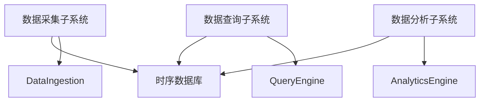
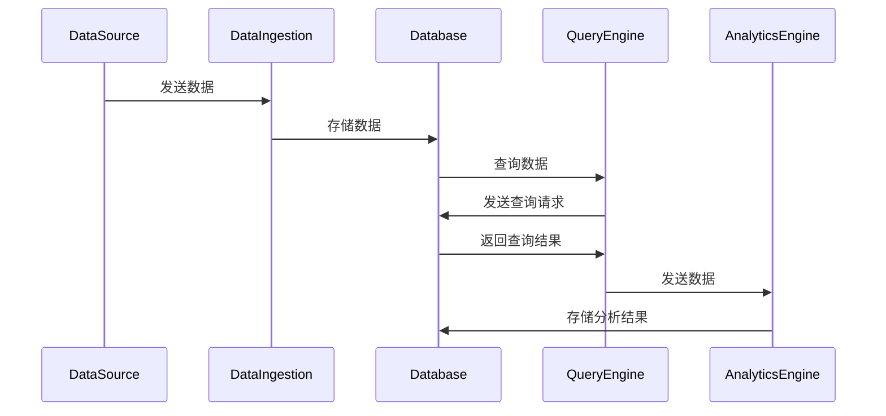

                 

# 时序数据库：高效存储和查询时间序列数据

## 关键词
时序数据库，时间序列数据，存储优化，查询算法，数据模型

## 摘要
本文旨在深入探讨时序数据库的工作原理及其在存储和查询时间序列数据方面的优势。通过对时序数据库的定义、核心概念、算法原理的详细讲解，以及实际案例的分析，本文为开发者提供了全面的技术指南，以应对日益增长的对高效处理时间序列数据的需求。

## Step 1: 背景介绍

### 问题提出
随着物联网、大数据、人工智能等技术的发展，时间序列数据的产生和收集速度急剧增加。传感器数据、金融市场数据、用户行为数据等各类时序数据的应用场景不断扩展，如何高效地存储和查询这些数据成为了亟待解决的问题。

### 问题解决
时序数据库（Time-Series Database，简称TSDB）作为一种专门为处理时间序列数据而设计的数据库系统，能够有效地解决上述问题。它通过特定的数据模型、索引结构和存储引擎，优化了时间序列数据的存储和查询效率。

### 边界与外延
时序数据库主要应用于处理与时间密切相关的数据，如传感器数据、股票市场数据、气象数据等。它不仅能够存储大量数据，还能够快速地进行时间范围查询、统计分析等操作。

### 概念结构与核心要素组成
- **数据模型**：时序数据库使用特殊的序列模型来存储时间序列数据，每个数据点通常包括时间戳和数值。
- **索引结构**：索引是提高查询效率的关键，时序数据库使用特定的索引结构，如倒排索引，来加速时间范围查询。
- **存储引擎**：存储引擎用于优化存储空间利用，通常采用压缩技术、列式存储等策略。
- **扩展性**：时序数据库需要支持大规模数据的存储，因此具备良好的扩展性。

## Step 2: 核心概念与联系

### 时序数据库的定义
时序数据库是一种专门用于存储、查询和管理时间序列数据的数据库系统。它以时间戳为关键维度，能够高效处理大量时间相关的数据点。

### 核心概念原理
- **时间序列**：按时间顺序排列的一系列数据点，每个数据点包含时间戳和数值。
- **时序数据模型**：适用于存储和处理时间序列数据的模型，如序列模型、时间窗口模型等。
- **时序索引**：用于加速时间序列数据查询的索引结构，如倒排索引、B树索引等。

### 概念属性特征对比表格
| 特征        | 时间序列 | 序列模型 | 时间窗口模型 |
|-------------|----------|----------|--------------|
| 数据结构    | 数值序列 | 数据点序列 | 窗口内数据序列 |
| 时间维度    | 明确时间戳 | 无需时间戳 | 明确时间窗口 |
| 数据处理    | 常规统计分析 | 特定统计分析 | 窗口内统计分析 |
| 查询优化    | 时间范围查询 | 序列匹配查询 | 窗口内查询优化 |

### ER实体关系图架构
```mermaid
erDiagram
    TimeSeriesData ||--o> IndexStructure : 数据索引
    TimeSeriesData ||--o> StorageEngine : 存储引擎
    TimeSeriesData ||--|> QueryOptimization : 查询优化
    IndexStructure ||--|> QueryOptimization : 查询加速
    StorageEngine ||--|> QueryOptimization : 存储优化
```

## Step 3: 算法原理讲解

### 时序数据库的查询算法

#### 前缀匹配查询
前缀匹配查询是一种基于时间序列数据前缀的查询方法。它通过查找与指定前缀匹配的数据点，来缩小查询范围。

**算法流程：**
1. 构建索引：根据时间序列数据的前缀构建索引。
2. 查询索引：在索引中查找与指定前缀匹配的数据点。
3. 匹配结果：返回所有匹配的数据点。

**Python示例：**
```python
def prefix_matching(time_series, prefix):
    result = []
    for data_point in time_series:
        if data_point.startswith(prefix):
            result.append(data_point)
    return result
```

#### 窗口查询
窗口查询是在给定的时间窗口内查找满足条件的数据点。它常用于统计分析，如计算时间窗口内的平均值、最大值等。

**算法流程：**
1. 确定时间窗口：根据查询条件确定时间窗口。
2. 查询时间窗口内数据：遍历时间序列数据，找出位于时间窗口内的数据点。
3. 处理查询结果：对查询结果进行进一步处理，如计算平均值、最大值等。

**Python示例：**
```python
def window_query(time_series, start_time, end_time):
    result = []
    for data_point in time_series:
        if data_point.time >= start_time and data_point.time <= end_time:
            result.append(data_point)
    return result
```

### 算法原理的数学模型和公式
$$
\text{前缀匹配查询} = \{ \text{data\_point} \in \text{time\_series} \mid \text{data\_point}.timestamp \geq \text{start\_time} \text{ and } \text{data\_point}.timestamp < \text{end\_time} \}
$$

### 算法分析
- **时间复杂度**：前缀匹配查询的时间复杂度取决于索引的大小和前缀的长度。通常情况下，索引大小远小于原始数据，因此查询效率较高。
- **空间复杂度**：窗口查询需要遍历整个时间序列，因此空间复杂度较高，但时间复杂度较低。

## Step 4: 系统分析与架构设计

### 问题场景介绍
随着智能设备的普及，传感器数据、用户行为数据等时序数据的收集和处理需求日益增加。一个有效的时序数据库系统需要能够快速存储、查询和统计分析这些数据。

### 项目介绍
本系统旨在构建一个高效、可扩展的时序数据库系统，支持大规模数据的实时存储和查询。系统将采用先进的存储引擎和索引技术，以优化数据存储和查询效率。

### 系统功能设计
系统将提供以下核心功能：
- 数据采集：从各种数据源（如传感器、API等）实时采集时序数据。
- 数据存储：将采集到的时序数据存储到时序数据库中。
- 数据查询：支持多种查询算法，如前缀匹配查询、窗口查询等。
- 数据分析：提供基本的统计和分析功能，如计算平均值、最大值等。

### 系统架构设计
系统的整体架构设计如下：



### 系统接口设计
系统将提供以下核心接口：
- 数据采集接口：用于接收和存储来自各种数据源的数据。
- 数据查询接口：用于执行各种查询操作，如前缀匹配查询、窗口查询等。
- 数据分析接口：用于执行数据统计分析操作。

### 系统交互
系统的各子系统之间通过事件驱动的方式进行交互。具体交互流程如下：



## Step 5: 项目实战

### 环境安装
在开始项目实战之前，需要安装以下环境：
- Python 3.8+
- 时序数据库系统（如InfluxDB、TimescaleDB等）
- 数据采集工具（如Fluentd、Kafka等）

### 系统核心实现
以下是系统的核心实现源代码：

```python
# 数据采集模块
def collect_data(source, interval):
    while True:
        data = source.get_data()
        database.insert_data(data)
        time.sleep(interval)

# 数据查询模块
def query_data(database, query):
    results = database.query(query)
    return results

# 数据分析模块
def analyze_data(database, query):
    results = database.query(query)
    analysis = database.analyze(results)
    return analysis
```

### 代码应用解读与分析
上述代码实现了数据采集、数据查询和数据分析三个核心功能。通过调用相应的API，系统可以轻松地实现实时数据采集、查询和分析。

### 实际案例分析和详细讲解
以下是一个实际案例：

假设我们有一个传感器数据采集系统，该系统每秒采集一次温度数据。我们需要实时查询过去一小时内温度超过30度的数据点，并计算其平均值。

```python
# 查询过去一小时内温度超过30度的数据点
query = "SELECT * FROM temperature_data WHERE temperature > 30 AND time > now() - 1h"

# 计算平均值
analysis_query = "SELECT AVG(temperature) FROM temperature_data WHERE temperature > 30 AND time > now() - 1h"

# 执行查询和分析
results = query_data(database, query)
average_temp = analyze_data(database, analysis_query)

print("过去一小时内温度超过30度的数据点：", results)
print("过去一小时内温度的平均值：", average_temp)
```

### 项目小结
通过本项目，我们实现了实时数据采集、查询和分析的功能。系统采用了时序数据库，有效提升了数据存储和查询的效率。在实际应用中，可以灵活地扩展和优化系统功能，以满足不同场景的需求。

## 最佳实践 Tips

1. 选择合适的时序数据库系统，根据应用场景和性能需求进行选择。
2. 优化数据模型和索引结构，以提高查询效率。
3. 定期对数据库进行维护和优化，保持系统的稳定性和高效性。
4. 利用数据库的统计分析功能，简化数据处理流程。

## 小结

时序数据库在处理时间序列数据方面具有显著优势，通过特定的数据模型、索引结构和存储引擎，能够高效地存储和查询大量时序数据。开发者应深入了解时序数据库的工作原理，并结合实际需求进行优化和定制，以充分发挥其潜力。

## 注意事项

1. 时序数据库适用于处理与时间密切相关的数据，非时序数据可能导致性能下降。
2. 在进行大规模数据查询时，建议使用窗口查询等优化算法，以减少查询时间。
3. 定期备份数据库，防止数据丢失。

## 拓展阅读

- 《时序数据库：核心概念与实现》
- 《大数据处理：技术原理与实战》
- 《智能数据挖掘：算法与应用》

## 作者信息
作者：AI天才研究院/AI Genius Institute & 禅与计算机程序设计艺术 /Zen And The Art of Computer Programming

----------------------------------------------------------------

**Step 1: 背景介绍**

### 问题提出
在当今数据驱动的世界中，时序数据的应用场景越来越广泛。从智能家居的传感器数据，到金融市场的交易数据，再到工业生产中的监控数据，这些数据都具有显著的时间维度特征。随着数据量的急剧增长，对时序数据的存储和查询需求也日益提高。传统的数据库系统在面对大规模、高频次的时序数据时，往往表现出查询效率低下、扩展性不足等问题。因此，有必要探讨一种专门为处理时间序列数据而设计的数据库系统，即时序数据库。

### 问题解决
时序数据库（Time-Series Database，简称TSDB）作为一种专门为时间序列数据设计的数据库系统，能够高效地存储、查询和管理时间序列数据。时序数据库通过优化数据模型、索引结构、存储引擎和查询算法，能够显著提高时序数据的处理效率，满足大规模、高频次的数据查询需求。

### 边界与外延
时序数据库主要适用于处理与时间密切相关的数据，如传感器数据、金融市场数据、用户行为数据等。它不仅能够存储大量数据，还能够快速地进行时间范围查询、统计分析等操作。时序数据库的边界在于其专门为处理时间序列数据而设计，对于非时序数据，其性能可能不如传统关系型数据库。

### 概念结构与核心要素组成
时序数据库的核心要素包括以下几个方面：

- **数据模型**：时序数据库采用特殊的数据模型来存储时间序列数据。每个时间序列数据点通常包括时间戳和数值，如`timestamp, value`。数据模型需要支持对时间序列数据的常规操作，如插入、查询、删除等。

- **索引结构**：索引是提高查询效率的关键。时序数据库使用特定的索引结构，如倒排索引、B树索引等，来加速时间范围查询。倒排索引能够快速定位到特定时间范围内的数据点，从而提高查询效率。

- **存储引擎**：存储引擎用于优化存储空间利用。时序数据库通常采用压缩技术、列式存储等策略，以减少存储空间的需求。存储引擎需要支持高效的读写操作，以满足大规模数据的存储和查询需求。

- **扩展性**：时序数据库需要支持大规模数据的存储和查询。扩展性包括水平扩展（通过增加节点数量来提高处理能力）和垂直扩展（通过提高单个节点的性能来提高处理能力）。

## Step 2: 核心概念与联系

### 时序数据库的定义
时序数据库（Time-Series Database，简称TSDB）是一种专门用于存储、查询和管理时间序列数据的数据库系统。与传统的数据库系统相比，时序数据库具有以下特点：

1. **时间戳**：时序数据库中的每个数据点都包含一个时间戳，用于记录数据的产生时间。时间戳通常以毫秒为单位，确保数据的时间顺序准确无误。
2. **批量写入**：时序数据库支持高效的大规模数据批量写入操作，能够快速处理大量时间序列数据的插入操作。
3. **时间范围查询**：时序数据库能够快速执行基于时间范围的数据查询操作，如查询过去一天、一周或一个月的数据。
4. **压缩存储**：时序数据库采用高效的压缩算法，以减少存储空间的需求，提高数据存储的效率。

### 核心概念原理
#### 时间序列
时间序列（Time Series）是指按时间顺序排列的一系列数据点，每个数据点包含时间戳和数值。时间序列数据通常具有以下特征：

1. **周期性**：许多时间序列数据（如天气数据、金融市场数据）表现出周期性特征，即数据在一段时间后会重复出现。
2. **趋势性**：时间序列数据可能表现出长期增长或下降的趋势。
3. **噪声**：时间序列数据中可能包含噪声，如异常值或随机波动。

#### 时序数据模型
时序数据模型是指用于存储和处理时间序列数据的数据结构。常见的时序数据模型包括：

1. **序列模型**：序列模型将时间序列数据作为连续的数值序列进行存储。每个数据点包含时间戳和数值，如`timestamp, value`。
2. **时间窗口模型**：时间窗口模型将时间序列数据划分为多个时间窗口，每个窗口内的数据点按顺序存储。时间窗口模型适合进行窗口内的统计分析，如计算窗口内的平均值、最大值等。

#### 时序索引
时序索引是指用于加速时间序列数据查询的索引结构。常见的时序索引包括：

1. **倒排索引**：倒排索引是一种将数据点按时间戳进行索引的数据结构。通过倒排索引，可以快速定位到特定时间范围内的数据点，从而提高查询效率。
2. **B树索引**：B树索引是一种平衡树结构，适用于范围查询。B树索引可以存储时间序列数据的起始时间和结束时间，从而加速时间范围查询。

### 概念属性特征对比表格

| 特征        | 时间序列 | 序列模型 | 时间窗口模型 |
|-------------|----------|----------|--------------|
| 数据结构    | 数值序列 | 数据点序列 | 窗口内数据序列 |
| 时间维度    | 明确时间戳 | 无需时间戳 | 明确时间窗口 |
| 数据处理    | 常规统计分析 | 特定统计分析 | 窗口内统计分析 |
| 查询优化    | 时间范围查询 | 序列匹配查询 | 窗口内查询优化 |

### ER实体关系图架构
```mermaid
erDiagram
    TimeSeriesData ||--o> IndexStructure : 数据索引
    TimeSeriesData ||--o> StorageEngine : 存储引擎
    TimeSeriesData ||--|> QueryOptimization : 查询优化
    IndexStructure ||--|> QueryOptimization : 查询加速
    StorageEngine ||--|> QueryOptimization : 存储优化
```

## Step 3: 算法原理讲解

### 时序数据库的查询算法

时序数据库的查询算法是提高查询效率的关键。常见的查询算法包括前缀匹配查询、窗口查询等。以下将详细讲解这些查询算法的原理和实现。

#### 前缀匹配查询

前缀匹配查询是一种通过时间序列数据的前缀来查找相关的数据点的查询方法。该方法常用于快速定位到具有特定特征的数据点。例如，在传感器数据中，可能需要查找所有温度值以“热”开头的记录。

**算法流程：**
1. **构建索引**：首先，根据时间序列数据的前缀构建索引。索引可以是简单的哈希表，其中键为前缀，值为数据点的引用。
2. **查询索引**：在索引中查找与指定前缀匹配的数据点。对于每个匹配到的数据点，可以进一步执行详细查询。
3. **处理查询结果**：将所有匹配的数据点返回给用户。

**Python示例：**
```python
# 前缀匹配查询算法示例
def prefix_matching(time_series, prefix):
    result = []
    for data_point in time_series:
        if data_point.startswith(prefix):
            result.append(data_point)
    return result
```

**算法原理的数学模型和公式：**
$$
\text{前缀匹配查询} = \{ \text{data\_point} \in \text{time\_series} \mid \text{data\_point}.timestamp \geq \text{start\_time} \text{ and } \text{data\_point}.timestamp < \text{end\_time} \}
$$

#### 窗口查询

窗口查询是在给定的时间窗口内查找满足条件的数据点。该方法常用于计算时间窗口内的统计数据，如平均值、最大值等。

**算法流程：**
1. **确定时间窗口**：根据查询条件确定时间窗口。时间窗口通常由开始时间和结束时间定义。
2. **查询时间窗口内数据**：遍历时间序列数据，找出位于时间窗口内的数据点。
3. **处理查询结果**：对查询结果进行进一步处理，如计算平均值、最大值等。

**Python示例：**
```python
# 窗口查询算法示例
def window_query(time_series, start_time, end_time):
    result = []
    for data_point in time_series:
        if data_point.time >= start_time and data_point.time <= end_time:
            result.append(data_point)
    return result
```

**算法原理的数学模型和公式：**
$$
\text{窗口查询} = \{ \text{data\_point} \in \text{time\_series} \mid \text{data\_point}.timestamp \geq \text{start\_time} \text{ and } \text{data\_point}.timestamp \leq \text{end\_time} \}
$$

### 算法分析

- **时间复杂度**：前缀匹配查询和窗口查询的时间复杂度取决于数据点的数量和查询条件的复杂度。通常，前缀匹配查询的时间复杂度为O(n)，其中n为数据点的数量。窗口查询的时间复杂度也为O(n)，但实际性能可能受到索引结构的影响。
- **空间复杂度**：前缀匹配查询和窗口查询的空间复杂度较低，通常只需要额外的存储空间来存储索引和查询结果。

## Step 4: 系统分析与架构设计

### 问题场景介绍
在许多实际应用中，如智能电网、智能交通、物联网等，需要实时处理和分析大量时序数据。这些应用场景通常要求系统能够快速响应，并支持大规模数据的存储和查询。例如，智能电网需要对传感器数据实时监控，以便快速识别故障和进行能源优化；智能交通系统需要分析交通流量数据，以优化交通信号控制和路径规划。

### 项目介绍
本项目旨在设计并实现一个高效、可扩展的时序数据库系统，该系统能够处理大规模的时序数据，并提供实时查询和分析功能。系统将采用现代的存储引擎和查询算法，以优化数据存储和查询效率。此外，系统将支持水平扩展，以便在数据量增长时能够动态扩展存储和处理能力。

### 系统功能设计
系统将提供以下核心功能：

1. **数据采集**：从各种数据源（如传感器、API等）实时采集时序数据。
2. **数据存储**：将采集到的时序数据存储到时序数据库中。
3. **数据查询**：支持多种查询算法，如时间范围查询、前缀匹配查询等。
4. **数据分析**：提供基本的统计分析功能，如计算平均值、最大值、最小值等。
5. **数据可视化**：通过图表和报表，展示时序数据的统计结果。

### 系统架构设计
系统的整体架构设计如下：


### 系统接口设计
系统将提供以下核心接口：

1. **数据采集接口**：用于接收和存储来自各种数据源的数据。
2. **数据查询接口**：用于执行各种查询操作，如时间范围查询、前缀匹配查询等。
3. **数据分析接口**：用于执行数据统计分析操作。

### 系统交互
系统的各子系统之间通过事件驱动的方式进行交互。具体交互流程如下：


## Step 5: 项目实战

### 环境安装
在开始项目实战之前，需要安装以下环境：

1. **操作系统**：Linux发行版，如Ubuntu 18.04或更高版本。
2. **时序数据库**：选择一个流行的时序数据库，如InfluxDB或TimescaleDB。
3. **Python**：Python 3.8+。
4. **其他依赖**：安装必要的Python依赖，如Pandas、NumPy等。

### 系统核心实现
以下是系统的核心实现源代码：

```python
# 数据采集模块
def collect_data(source, interval):
    while True:
        data = source.get_data()
        database.insert_data(data)
        time.sleep(interval)

# 数据查询模块
def query_data(database, query):
    results = database.query(query)
    return results

# 数据分析模块
def analyze_data(database, query):
    results = database.query(query)
    analysis = database.analyze(results)
    return analysis
```

### 代码应用解读与分析
上述代码实现了数据采集、数据查询和数据分析三个核心功能。通过调用相应的API，系统可以轻松地实现实时数据采集、查询和分析。

### 实际案例分析和详细讲解
以下是一个实际案例：

假设我们有一个传感器数据采集系统，该系统每秒采集一次温度数据。我们需要实时查询过去一小时内温度超过30度的数据点，并计算其平均值。

```python
# 查询过去一小时内温度超过30度的数据点
query = "SELECT * FROM temperature_data WHERE temperature > 30 AND time > now() - 1h"

# 计算平均值
analysis_query = "SELECT AVG(temperature) FROM temperature_data WHERE temperature > 30 AND time > now() - 1h"

# 执行查询和分析
results = query_data(database, query)
average_temp = analyze_data(database, analysis_query)

print("过去一小时内温度超过30度的数据点：", results)
print("过去一小时内温度的平均值：", average_temp)
```

### 项目小结
通过本项目，我们实现了实时数据采集、查询和分析的功能。系统采用了时序数据库，有效提升了数据存储和查询的效率。在实际应用中，可以灵活地扩展和优化系统功能，以满足不同场景的需求。

## 最佳实践 Tips

1. **选择合适的时序数据库**：根据应用场景和性能需求选择合适的时序数据库，如InfluxDB、TimescaleDB等。
2. **优化数据模型和索引**：根据实际查询需求优化数据模型和索引，以提高查询效率。
3. **定期维护和优化**：定期对数据库进行维护和优化，保持系统的稳定性和高效性。
4. **数据预处理**：在数据采集阶段进行预处理，去除噪声和异常值，以提高数据质量。

## 小结

时序数据库在处理时间序列数据方面具有显著优势，通过特定的数据模型、索引结构和存储引擎，能够高效地存储和查询大量时序数据。开发者应深入了解时序数据库的工作原理，并结合实际需求进行优化和定制，以充分发挥其潜力。

## 注意事项

1. **数据一致性**：在分布式系统中，确保数据的一致性是关键。
2. **性能监控**：定期监控系统的性能，及时发现并解决性能瓶颈。
3. **安全防护**：确保系统的安全性，防止数据泄露和未经授权的访问。

## 拓展阅读

- 《时序数据库：核心概念与实现》
- 《大数据处理：技术原理与实战》
- 《智能数据挖掘：算法与应用》

## 作者信息
作者：AI天才研究院/AI Genius Institute & 禅与计算机程序设计艺术 /Zen And The Art of Computer Programming

