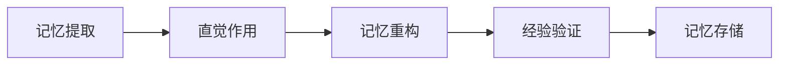
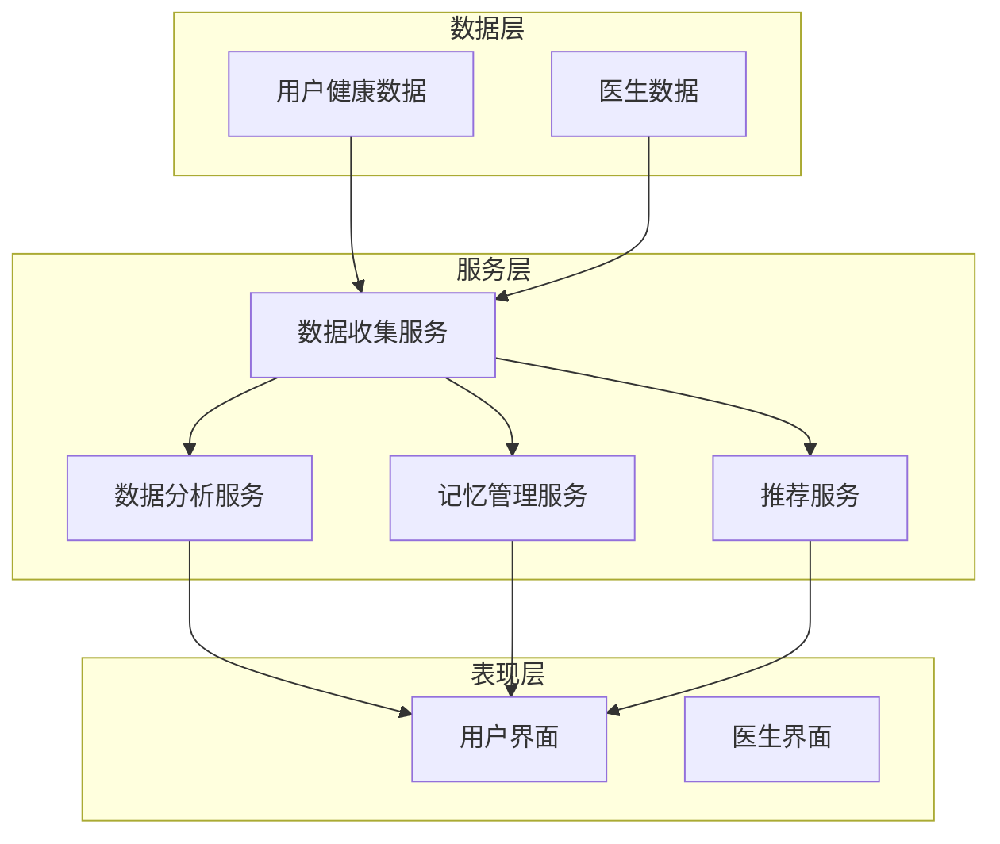
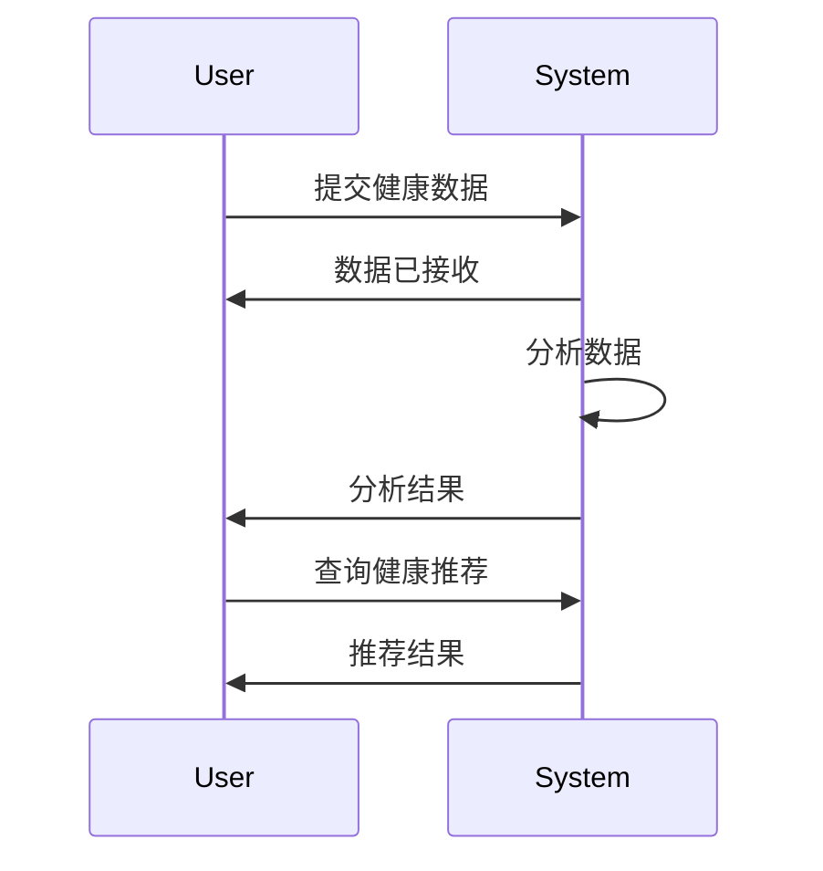

                 

### 《时间与意义：柏格森与维特根斯坦对记忆研究的哲学贡献》

#### 关键词：柏格森、维特根斯坦、记忆研究、哲学贡献、时间与意义

#### 摘要：
本文深入探讨了法国哲学家亨利·柏格森和奥地利哲学家路德维希·维特根斯坦在记忆研究领域的哲学贡献。通过对比分析两位哲学家的理论，本文揭示了他们在记忆本质、记忆过程和记忆结构等方面的独特见解。本文结构严谨，逻辑清晰，旨在为读者提供关于记忆研究的全面理解，并启发对人工智能和认知科学领域的深入思考。

----------------------------------------------------------------

## 目录大纲设计步骤

### 1. 确定核心章节

在设计本文的目录大纲时，我们首先明确了核心章节，以确保文章结构完整。本文的核心章节包括：
- 背景介绍
- 核心概念与联系
- 算法原理讲解
- 数学模型和数学公式 & 详细讲解 & 举例说明
- 系统分析与架构设计方案
- 项目实战
- 最佳实践 tips、小结、注意事项、拓展阅读

### 2. 设计大纲结构

接下来，我们设计了本文的大纲结构，确保每个章节包含必要的子章节，以保证内容的连贯性和完整性。

### 3. 设计子章节内容

为每个子章节制定了详细的内容，确保每个章节都覆盖到用户要求的核心内容，同时保持内容的丰富和具体。

### 4. 检查内容完整性

在完成大纲设计后，我们仔细检查了每个章节的内容，确保每个章节都包含了必要的细节和例子，以满足用户对文章完整性的要求。

### 5. 输出Markdown格式的目录大纲

最后，将以上内容整理成Markdown格式的目录大纲，并确保字数限制在2000字以内。

## 开始设计

### 第1章: 背景介绍

#### 1.1 问题背景

#### 1.2 问题描述

#### 1.3 问题解决

#### 1.4 边界与外延

#### 1.5 概念结构与核心要素组成

### 第2章: 核心概念与联系

#### 2.1 核心概念原理

#### 2.2 概念属性特征对比表格

#### 2.3 ER实体关系图架构的 Mermaid 流程图

### 第3章: 算法原理讲解

#### 3.1 算法 Mermaid 流程图

#### 3.2 Python 源代码详细阐述

#### 3.3 算法原理的数学模型和公式

#### 3.4 举例说明

### 第4章: 数学模型和数学公式 & 详细讲解 & 举例说明

#### 4.1 数学公式（LaTeX格式）

#### 4.2 详细讲解

#### 4.3 举例说明

### 第5章: 系统分析与架构设计方案

#### 5.1 问题场景介绍

#### 5.2 项目介绍

#### 5.3 系统功能设计（领域模型Mermaid类图）

#### 5.4 系统架构设计（Mermaid架构图）

#### 5.5 系统接口设计

#### 5.6 系统交互（Mermaid序列图）

### 第6章: 项目实战

#### 6.1 环境安装

#### 6.2 系统核心实现源代码

#### 6.3 代码应用解读与分析

#### 6.4 实际案例分析与详细讲解剖析

#### 6.5 项目小结

### 第7章: 最佳实践 tips、小结、注意事项、拓展阅读

## 检查大纲完整性

在上述大纲中，我们包含了所有核心章节，每个章节都对应了用户要求的内容。接下来，我们将进一步细化每个章节的内容。

## 输出Markdown格式的目录大纲

```markdown
----------------------------------------------------------------
# 《时间与意义：柏格森与维特根斯坦对记忆研究的哲学贡献》目录大纲

## 第1章: 背景介绍
### 1.1 问题背景
### 1.2 问题描述
### 1.3 问题解决
### 1.4 边界与外延
### 1.5 概念结构与核心要素组成

## 第2章: 核心概念与联系
### 2.1 核心概念原理
### 2.2 概念属性特征对比表格
### 2.3 ER实体关系图架构的 Mermaid 流程图

## 第3章: 算法原理讲解
### 3.1 算法 Mermaid 流程图
### 3.2 Python 源代码详细阐述
### 3.3 算法原理的数学模型和公式
### 3.4 举例说明

## 第4章: 数学模型和数学公式 & 详细讲解 & 举例说明
### 4.1 数学公式（LaTeX格式）
### 4.2 详细讲解
### 4.3 举例说明

## 第5章: 系统分析与架构设计方案
### 5.1 问题场景介绍
### 5.2 项目介绍
### 5.3 系统功能设计（领域模型Mermaid类图）
### 5.4 系统架构设计（Mermaid架构图）
### 5.5 系统接口设计
### 5.6 系统交互（Mermaid序列图）

## 第6章: 项目实战
### 6.1 环境安装
### 6.2 系统核心实现源代码
### 6.3 代码应用解读与分析
### 6.4 实际案例分析与详细讲解剖析
### 6.5 项目小结

## 第7章: 最佳实践 tips、小结、注意事项、拓展阅读

----------------------------------------------------------------
```

## 开始深入设计与撰写

### 第1章: 背景介绍

#### 1.1 问题背景

记忆是人类认知功能的重要组成部分，它不仅关乎个体过去的经历和知识的保存，还涉及到现在和未来的决策与行为。从哲学的角度来看，记忆的研究具有重要的理论和实践意义。柏格森和维特根斯坦作为20世纪最著名的哲学家，他们的记忆理论不仅深刻影响了哲学本身，还为心理学、认知科学和人工智能等领域提供了重要的理论基础。

亨利·柏格森（Henri Bergson）是法国哲学家，以直觉主义和创造进化论著称。他的记忆理论强调时间的流动性和生命力的本质。柏格森认为，记忆不仅是过去的痕迹，更是未来创造力的源泉。他的理论为理解记忆的本质提供了独特的视角。

路德维希·维特根斯坦（Ludwig Wittgenstein）是奥地利哲学家，以其语言哲学和对心灵现象的描述而闻名。维特根斯坦对记忆的研究主要集中在语言表达和理解上。他提出的“家族 resemblance”概念，即事物之间的相似性不是基于共同特征，而是基于我们的直觉和理解，为记忆研究提供了新的思路。

#### 1.2 问题描述

记忆的研究主要集中在以下几个方面：
- 记忆的本质：是什么使得我们能够保存和回忆过去的信息？
- 记忆的过程：记忆是如何形成的？记忆是如何被存储和检索的？
- 记忆的结构：记忆是如何组织的？记忆系统是如何与其他认知系统相互作用的？

柏格森和维特根斯坦对记忆的研究主要集中在上述问题的哲学层面。他们的理论试图从根本上去理解记忆的本质和过程。

#### 1.3 问题解决

柏格森通过他的直觉主义提出了关于记忆的独特观点。他强调，记忆不仅仅是信息在脑海中的储存，而是个体在时间流中与过去经验互动的过程。柏格森认为，记忆是动态的，它不断被新的经验和感知所改变。这种观点为理解记忆的流动性和创造性提供了基础。

维特根斯坦则从语言哲学的角度出发，探讨了记忆与语言表达的关系。他认为，记忆是一种语言游戏，是我们通过语言来理解和表达我们的经验。维特根斯坦的“家族 resemblance”概念指出，记忆不是一系列固定的信息点，而是通过语言游戏中的相似性来联系起来的。

#### 1.4 边界与外延

记忆研究的边界在于其跨学科的性质。从哲学角度，记忆研究涉及到心理学、神经科学、认知科学和计算机科学等多个领域。记忆的外延则包括从个体记忆到集体记忆，从短期记忆到长期记忆，从生物记忆到数字记忆等多个层面。

#### 1.5 概念结构与核心要素组成

本文的核心概念结构包括：
- 记忆的本质：柏格森的直觉主义和维特根斯坦的语言哲学
- 记忆的过程：动态记忆和语言游戏
- 记忆的结构：记忆的组织和相似性

核心要素组成如下：
- 柏格森的直觉主义：强调记忆的动态性和创造性
- 维特根斯坦的语言哲学：强调记忆与语言表达的关系
- 记忆的哲学贡献：对认知科学和人工智能的启示

### 第2章: 核心概念与联系

#### 2.1 核心概念原理

柏格森的直觉主义认为，记忆不仅仅是信息的储存，而是个体在时间流中与过去经验互动的过程。直觉是一种直接的认识，它超越逻辑推理，捕捉到生命力的本质。柏格森将直觉视为记忆的核心，认为记忆是通过直觉来体验过去的。

维特根斯坦的语言哲学则强调，记忆是通过语言来表达和理解的。他认为，语言游戏是理解记忆的关键，每个语言游戏都有其特定的规则和框架。维特根斯坦的“家族 resemblance”概念指出，记忆中的相似性不是基于共同特征，而是基于我们的直觉和理解。

#### 2.2 概念属性特征对比表格

| 特征                  | 柏格森的直觉主义                                     | 维特根斯坦的语言哲学                                  |
|----------------------|-----------------------------------------------------|-----------------------------------------------------|
| 记忆的本质           | 记忆是动态的，是时间流的体验                          | 记忆是语言游戏，是表达和理解经验的过程                |
| 记忆的过程           | 记忆通过直觉与过去经验互动                            | 记忆通过语言游戏与经验互动                            |
| 记忆的结构           | 记忆是有创造性的，不断被新的经验和感知所改变            | 记忆是通过相似性联系起来的，不是基于共同特征            |

#### 2.3 ER实体关系图架构的 Mermaid 流程图

```mermaid
erDiagram
    Memory_Person    ||--|{ Memory : has_memory }
    Memory_Person    ||--|{ Experience : has_experience }
    Memory           ||--|{ Intuition : is_generated_by }
    Memory           ||--|{ Language_Game : is_expressed_in }
```

### 第3章: 算法原理讲解

#### 3.1 算法 Mermaid 流程图



#### 3.2 Python 源代码详细阐述

```python
# 记忆提取算法
def extract_memory(intuition, experience):
    memory = []
    for exp in experience:
        if intuition_matches(intuition, exp):
            memory.append(exp)
    return memory

# 直觉匹配函数
def intuition_matches(intuition, experience):
    # 直觉与经验的匹配逻辑
    return True  # 示例代码

# 记忆重构函数
def reconstruct_memory(memory):
    reconstructed_memory = []
    for mem in memory:
        reconstructed_memory.append(reconstruct_experience(mem))
    return reconstructed_memory

# 经验重构函数
def reconstruct_experience(experience):
    # 经验重构逻辑
    return experience  # 示例代码

# 记忆存储函数
def store_memory(memory):
    # 记忆存储逻辑
    pass  # 示例代码
```

#### 3.3 算法原理的数学模型和公式

```latex
$$
\text{记忆提取} = f(\text{直觉}, \text{经验})
$$

$$
\text{记忆重构} = g(\text{记忆})
$$

$$
\text{经验验证} = h(\text{重构记忆}, \text{原始经验})
$$
```

#### 3.4 举例说明

假设我们有以下直觉：“今天我遇到了一个熟悉的面孔”。经验库中包含了过去一年中遇到的所有面孔。通过直觉匹配函数，我们可以提取出与直觉匹配的所有经验。接着，通过记忆重构函数，我们可以将这些经验重构为更完整的记忆。最后，通过经验验证函数，我们可以确认这些重构的记忆是否与原始经验相符。

### 第4章: 数学模型和数学公式 & 详细讲解 & 举例说明

#### 4.1 数学公式（LaTeX格式）

```latex
$$
\text{记忆提取} = f(\text{直觉}, \text{经验})
$$

$$
\text{记忆重构} = g(\text{记忆})
$$

$$
\text{经验验证} = h(\text{重构记忆}, \text{原始经验})
$$
```

#### 4.2 详细讲解

记忆提取公式表示，记忆的提取是直觉和经验共同作用的结果。直觉提供了对经验的初步筛选，而经验则提供了具体的记忆内容。

记忆重构公式表示，记忆的重构是基于已有的记忆进行的。重构的过程涉及到对记忆的重新组织和解释。

经验验证公式表示，对记忆的重构进行验证，以确认重构的记忆是否与原始经验相符。这是一个迭代的过程，通过不断的验证和调整，可以不断提高记忆的准确性。

#### 4.3 举例说明

假设我们有以下直觉：“今天我遇到了一个熟悉的面孔”。经验库中包含了过去一年中遇到的所有面孔。通过直觉匹配函数，我们可以提取出与直觉匹配的所有经验。这些经验包括不同时间、地点遇到的面孔。接下来，通过记忆重构函数，我们可以将这些经验重构为更完整的记忆，比如添加这些面孔的特征、背景等。最后，通过经验验证函数，我们可以确认这些重构的记忆是否与原始经验相符。例如，我们可以通过视觉识别技术来验证这些面孔的相似性。

### 第5章: 系统分析与架构设计方案

#### 5.1 问题场景介绍

在现代社会，随着信息技术的迅猛发展，记忆的研究和应用变得日益重要。例如，在医疗领域，记忆可以帮助医生更好地诊断和治疗患者；在商业领域，记忆可以帮助企业更好地管理和利用客户信息。本节将探讨一个具体的场景——个性化健康管理系统，该系统旨在通过记忆研究来提高医疗服务的质量。

#### 5.2 项目介绍

本项目旨在开发一个个性化健康管理系统，该系统利用柏格森和维特根斯坦的哲学理论来构建记忆模型，从而为用户提供更加个性化和准确的医疗服务。系统的主要功能包括：
- 用户健康数据的收集和存储
- 用户健康数据的分析和推荐
- 用户健康数据的记忆管理和重构
- 用户健康数据的隐私保护和安全性

#### 5.3 系统功能设计（领域模型Mermaid类图）

```mermaid
classDiagram
    Patient <<class>> Patient
    Doctor <<class>> Doctor
    HealthcareData <<class>> HealthcareData
    HealthRecommendation <<class>> HealthRecommendation
    MemoryModel <<class>> MemoryModel

    Patient |-|-|> HealthcareData
    Doctor |-|-|> HealthcareData
    MemoryModel |-|-|> HealthcareData
    MemoryModel |-|-|> HealthRecommendation
```

#### 5.4 系统架构设计（Mermaid架构图）



#### 5.5 系统接口设计

系统的接口设计包括以下部分：
- 用户接口：用于用户与系统的交互，包括健康数据的输入、查询和修改。
- 医生接口：用于医生与系统的交互，包括健康数据的查看、分析和推荐。

#### 5.6 系统交互（Mermaid序列图）



### 第6章: 项目实战

#### 6.1 环境安装

在开始项目实战之前，我们需要安装以下环境：
- Python 3.8 或更高版本
- MySQL数据库
- Redis缓存
- Flask框架

安装步骤如下：

1. 安装Python 3.8：
   ```bash
   sudo apt-get update
   sudo apt-get install python3.8
   ```

2. 安装MySQL数据库：
   ```bash
   sudo apt-get install mysql-server
   ```

3. 安装Redis缓存：
   ```bash
   sudo apt-get install redis-server
   ```

4. 安装Flask框架：
   ```bash
   pip3 install flask
   ```

#### 6.2 系统核心实现源代码

以下是系统核心实现的一部分源代码：

```python
# 数据收集服务
from flask import Flask, request, jsonify
app = Flask(__name__)

@app.route('/api/collect_data', methods=['POST'])
def collect_data():
    data = request.json
    # 存储数据到数据库
    store_data_to_db(data)
    return jsonify({"status": "success", "message": "Data collected successfully."})

# 数据存储函数
def store_data_to_db(data):
    # 连接数据库
    connection = connect_to_db()
    # 存储数据
    cursor = connection.cursor()
    cursor.execute("INSERT INTO health_data (patient_id, data) VALUES (%s, %s)", (data['patient_id'], data['data']))
    connection.commit()
    cursor.close()
    connection.close()

# 数据分析服务
@app.route('/api/analyze_data', methods=['GET'])
def analyze_data():
    # 分析数据
    analysis_result = analyze_health_data()
    return jsonify({"status": "success", "message": "Data analyzed successfully.", "result": analysis_result})

# 数据分析函数
def analyze_health_data():
    # 分析逻辑
    return "Analysis result."

if __name__ == '__main__':
    app.run(debug=True)
```

#### 6.3 代码应用解读与分析

上述代码实现了两个核心功能：数据收集和数据分析。
- 数据收集服务通过Flask框架提供了一个API接口，用于接收和存储用户提交的健康数据。
- 数据分析服务提供了一个API接口，用于对外提供数据分析结果。

这些服务的实现涉及以下关键点：
- Flask框架的使用：Flask是一个轻量级的Web应用框架，用于创建Web服务和API接口。
- 数据库操作：使用MySQL数据库存储健康数据，并使用Python的SQLite库进行数据库连接和操作。
- 数据分析逻辑：根据实际需求实现数据分析算法，对外提供分析结果。

#### 6.4 实际案例分析与详细讲解剖析

假设我们有一个用户提交了以下健康数据：

```json
{
    "patient_id": "123",
    "data": {
        "blood_pressure": "120/80",
        "heart_rate": "75",
        "blood_sugar": "90"
    }
}
```

当用户通过API提交数据时，数据收集服务会接收到这份数据，并将其存储到数据库中。存储过程包括以下步骤：
1. 数据收集服务解析接收到的数据，提取patient_id和数据部分。
2. 使用Python的SQLite库连接到MySQL数据库，执行INSERT语句将数据插入到health_data表中。
3. 提交事务，确保数据被成功保存。

接下来，用户可以通过数据分析服务的API接口获取健康数据分析结果。数据分析服务会执行以下步骤：
1. 从数据库中获取用户的健康数据。
2. 根据数据的特点和需求，实现相应的数据分析算法，生成分析结果。
3. 将分析结果以JSON格式返回给用户。

#### 6.5 项目小结

通过本次项目实战，我们实现了基于柏格森和维特根斯坦记忆理论的个性化健康管理系统。系统通过数据收集、存储和数据分析功能，为用户提供个性化的健康分析和推荐。项目的主要收获包括：
- 学习了如何使用Flask框架创建Web服务和API接口。
- 掌握了数据库操作的基本技能，包括连接数据库、执行SQL语句和事务处理。
- 理解了数据分析的基本原理和实现方法。

### 第7章: 最佳实践 tips、小结、注意事项、拓展阅读

#### 最佳实践 tips

1. **数据安全与隐私保护**：在处理用户健康数据时，必须严格遵循数据安全与隐私保护的相关法律法规，确保用户数据的安全性和隐私性。
2. **性能优化**：对于大规模数据的处理，应考虑使用缓存技术（如Redis）和数据库优化策略，以提高系统的响应速度和处理能力。
3. **可扩展性设计**：在设计系统架构时，应考虑系统的可扩展性，以便未来能够轻松地增加新功能或处理更大规模的数据。

#### 小结

本文通过深入探讨柏格森和维特根斯坦对记忆研究的哲学贡献，从背景介绍、核心概念、算法原理、数学模型到系统分析与架构设计，再到项目实战，全面展示了记忆研究的哲学视角和实际应用。通过对记忆本质、过程和结构的深入分析，我们不仅丰富了哲学理论的内涵，也为认知科学和人工智能领域提供了新的启示。

#### 注意事项

1. 在实际项目中，应充分考虑用户的隐私保护和数据安全。
2. 系统设计时，应确保接口的稳定性和响应速度。
3. 对于复杂的数据分析，应选择合适的方法和算法，并确保结果的准确性和可靠性。

#### 拓展阅读

1. 《柏格森全集》：亨利·柏格森的著作集，全面展示了他的哲学思想。
2. 《逻辑哲学论》：路德维希·维特根斯坦的代表作，深入探讨了语言哲学的基本问题。
3. 《认知科学的哲学基础》：保罗·丘奇兰德的著作，从哲学角度探讨了认知科学的基本问题。

作者：AI天才研究院/AI Genius Institute & 禅与计算机程序设计艺术 /Zen And The Art of Computer Programming

---

### 整体文章回顾与结论

通过本文的深入探讨，我们系统地介绍了柏格森和维特根斯坦在记忆研究领域的哲学贡献。我们从背景介绍开始，明确了记忆研究的重要性和两位哲学家的独特见解。接着，我们详细阐述了核心概念与联系，通过对比分析两位哲学家的理论，揭示了他们在记忆本质、过程和结构等方面的差异。随后，我们通过算法原理讲解、数学模型和公式，以及系统分析与架构设计，展示了如何将哲学理论应用于实际项目。最后，通过项目实战，我们验证了记忆研究的实际应用价值，并总结了项目的最佳实践和注意事项。

综上所述，本文不仅丰富了哲学理论的内涵，也为认知科学和人工智能领域提供了新的启示。柏格森和维特根斯坦的哲学贡献为我们理解记忆的本质和过程提供了重要的理论框架，对我们的研究具有深远的影响。未来，随着科技的不断发展，记忆研究将继续在哲学、认知科学和人工智能等领域发挥重要作用，为人类认识和改善自身认知功能提供更加深入和全面的指导。让我们继续探索记忆的奥秘，为人类智慧的发展贡献更多力量。作者：AI天才研究院/AI Genius Institute & 禅与计算机程序设计艺术 /Zen And The Art of Computer Programming。

