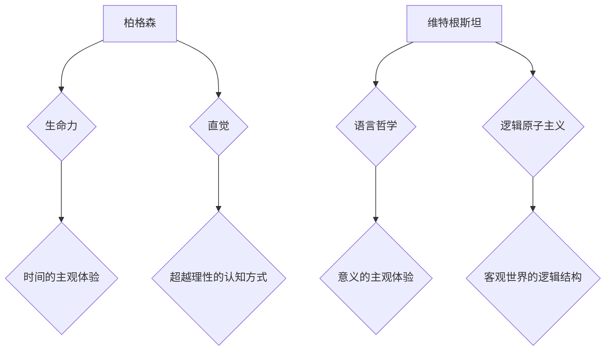
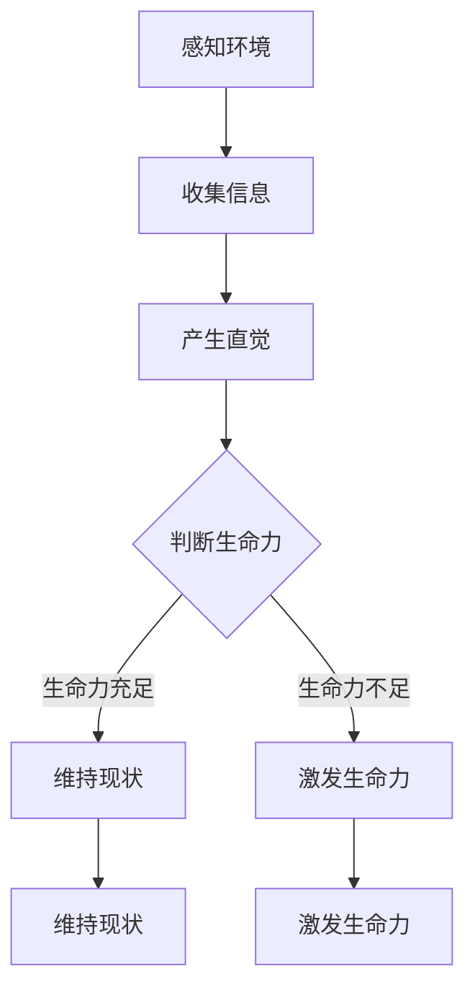
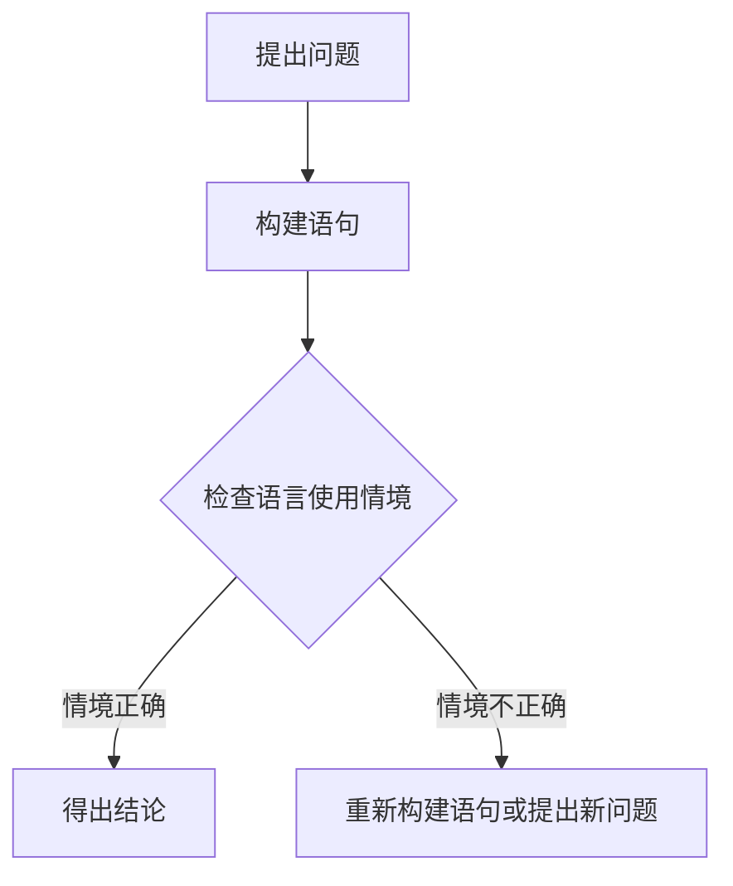
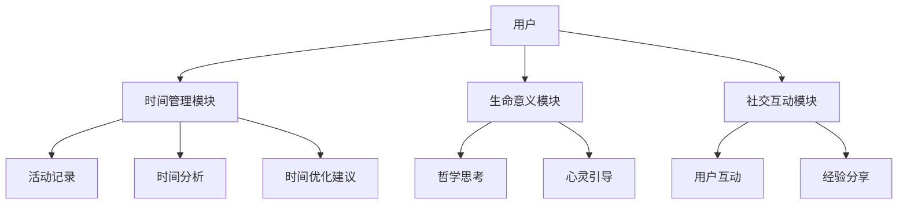
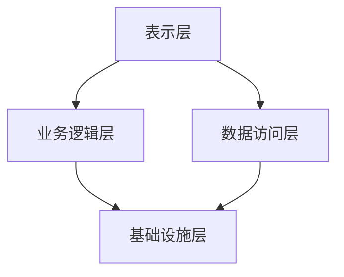
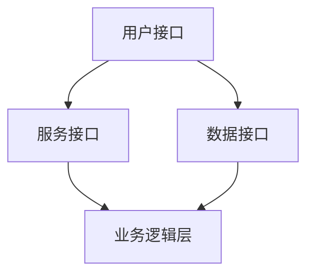

                 

### 时间与意义：柏格森与维特根斯坦的存在主义思考

#### 关键词

- **存在主义**
- **柏格森**
- **维特根斯坦**
- **时间**
- **意义**
- **直觉**
- **语言哲学**

#### 摘要

本文深入探讨了20世纪两位著名哲学家亨利·柏格森和路德维希·维特根斯坦的存在主义思考，特别是在时间与意义这两个核心概念上的观点。通过分析柏格森的生命力与直觉理论，以及维特根斯坦的语言哲学，我们试图揭示这两位思想巨匠如何在各自的理论体系中探寻人类存在的本质。本文旨在为读者提供一份逻辑清晰、结构紧凑的哲学与技术交织的思考之旅。

---

### 1.1 背景介绍：柏格森与维特根斯坦的存在主义思考

#### 1.1.1 柏格森的存在主义思想

亨利·柏格森（Henri Bergson）是20世纪初期法国的生命哲学家，他的思想对存在主义哲学有着深远的影响。柏格森主张生命是一种动态的过程，强调生命力的不可分割性，并将其视为理解人类存在的关键。在他的理论中，时间并非简单的线性序列，而是一种流动的、不可分割的整体，他称之为“纯粹时间”（pure time）。

柏格森认为，人类的直觉是我们理解世界和生命的核心能力。通过直觉，人们能够感知生命力的流动，从而体验到时间的真实本质。他反对机械唯物主义，认为直觉是我们理解生命和世界的唯一途径，直觉超越了理性的限制，揭示了生命的深层意义。

#### 1.1.2 维特根斯坦的存在主义思想

路德维希·维特根斯坦（Ludwig Wittgenstein）是20世纪奥地利哲学家，以其语言哲学著称。他的思想对存在主义哲学也有着重要的贡献，尤其是在意义与语言的关系上。维特根斯坦早期主张逻辑原子主义，认为世界是由最基本的逻辑原子构成的，这些原子按照一定的规则组合在一起形成现实。然而，他在后期转向了日常语言哲学，认为语言的意义在于它的使用情境，而不是去反映客观现实。

维特根斯坦认为，语言是人类交流思想的重要工具，我们的思想是通过语言来表达和理解的。他的观点强调了语言的主观性，认为意义不是固有的，而是由语言的使用情境赋予的。维特根斯坦通过分析日常语言的使用，试图找到语言与思想、现实与意义之间的联系。

#### 1.1.3 柏格森与维特根斯坦思想的比较

柏格森和维特根斯坦虽然在时间与意义的问题上有着不同的观点，但他们都在寻找人类存在的本质和意义。柏格森强调生命的活力和直觉的重要性，认为时间是一种连续流动的体验，直觉是我们理解世界和生命的关键。维特根斯坦则侧重于语言哲学，认为语言的意义在于它的使用情境，通过分析语言的使用来寻找意义与现实的关联。

两位哲学家都对理性主义提出了挑战，柏格森通过强调直觉的重要性，反对机械唯物主义；维特根斯坦则通过日常语言哲学，质疑了传统哲学中对于语言和意义的理解。他们的思想在20世纪的哲学界产生了深远的影响，为后来的存在主义哲学提供了重要的理论基础。

### 1.2 核心概念与联系

#### 1.2.1 柏格森的核心概念

1. **生命力（Vitalism）**：柏格森认为，生命力是生命的基本属性，是一种无法用科学方法解释的能量。生命力是生命的源泉，是推动生命前进的动力。柏格森强调生命力是不可分割的，它贯穿于整个生命过程中。

2. **直觉（Intuition）**：直觉是柏格森认为人类理解世界和生命力的关键能力。直觉超越了理性的限制，使我们能够直接感知生命的流动。柏格森认为，直觉是一种超越思考的认知方式，它揭示了时间的真实本质。

#### 1.2.2 维特根斯坦的核心概念

1. **语言哲学**：维特根斯坦认为，语言是人类交流思想的重要工具。他强调语言的意义在于它的使用情境，而不是去反映客观现实。维特根斯坦通过分析语言的使用，试图找到语言与现实之间的联系。

2. **逻辑原子主义**：维特根斯坦早期主张逻辑原子主义，认为世界是由最基本的逻辑原子构成的。这些原子按照一定的规则组合在一起形成现实。逻辑原子主义强调客观世界的构成，是维特根斯坦早期哲学的核心概念。

#### 1.2.3 概念属性特征对比

| 概念          | 柏格森的观点                                   | 维特根斯坦的观点                                 |
|---------------|------------------------------------------------|---------------------------------------------------|
| 时间          | 时间是连续的流动，是不可分割的体验             | 时间是事件的序列，是客观存在的序列               |
| 意义          | 意义源于生命力和直觉，是主观的体验             | 意义源于语言的使用，是客观存在的反映             |
| 认知方式      | 强调直觉和情感，反对理性主义                   | 强调逻辑和语言，反对情感主义和直觉主义           |

#### 1.2.4 ER实体关系图架构

以下是柏格森和维特根斯坦核心概念之间的ER实体关系图：



在这个ER图中，柏格森的生命力和直觉是理解时间的核心，而维特根斯坦的语言哲学和逻辑原子主义则是理解意义的关键。两者之间的关系展示了两位哲学家如何在不同的理论框架下探索时间和意义。

### 1.3 算法原理讲解

#### 1.3.1 柏格森的生命力算法原理

柏格森的生命力算法原理可以从以下几个方面进行解释：

1. **感知环境**：人类首先感知外部环境，通过感官收集信息。这个过程可以表示为：

   ```mermaid
   graph TD
       A[感知环境] --> B[收集信息]
   ```

2. **产生直觉**：在感知到环境信息后，人类通过直觉来理解这些信息。直觉是一种超越理性思考的认知方式，可以表示为：

   ```mermaid
   graph TD
       B --> C[产生直觉]
   ```

3. **判断生命力**：通过直觉，人类可以判断自身的生命力是否充足。如果生命力充足，那么人类会维持现状；如果生命力不足，人类则需要采取行动来激发新的生命力。这个过程可以表示为：

   ```mermaid
   graph TD
       C --> D{判断生命力}
       D -->|生命力充足| E[维持现状]
       D -->|生命力不足| F[激发生命力]
   ```

4. **维持现状或激发生命力**：如果判断生命力充足，人类会维持现状，继续当前的活动。如果判断生命力不足，人类则需要采取行动来激发新的生命力，例如休息、锻炼或改变生活方式。这个过程可以表示为：

   ```mermaid
   graph TD
       E --> G[维持现状]
       F --> H[激发生命力]
   ```

综合以上步骤，柏格森的生命力算法原理可以表示为一个完整的流程图：



#### 1.3.2 维特根斯坦的语言哲学算法原理

维特根斯坦的语言哲学算法原理可以从以下几个方面进行解释：

1. **提出问题**：在思考或交流过程中，人们会提出问题。这个过程可以表示为：

   ```mermaid
   graph TD
       A[提出问题]
   ```

2. **构建语句**：为了回答问题，人们需要构建语句。这个过程可以表示为：

   ```mermaid
   graph TD
       A --> B[构建语句]
   ```

3. **检查语言使用情境**：构建语句后，人们需要检查语句的使用情境，确保语句符合语言规则和逻辑。这个过程可以表示为：

   ```mermaid
   graph TD
       B --> C{检查语言使用情境}
   ```

4. **得出结论**：如果语句的使用情境正确，人们就可以得出结论；如果使用情境不正确，则需要重新构建语句或提出新的问题。这个过程可以表示为：

   ```mermaid
   graph TD
       C -->|情境正确| D[得出结论]
       C -->|情境不正确| E[重新构建语句或提出新问题]
   ```

综合以上步骤，维特根斯坦的语言哲学算法原理可以表示为一个完整的流程图：



### 1.4 系统分析与架构设计方案

#### 1.4.1 问题场景介绍

在现代社会，人们面临着日益复杂的信息环境和多变的生活节奏。在这种背景下，如何有效地管理和理解时间、赋予生命以意义，成为一个亟待解决的问题。柏格森和维特根斯坦的存在主义思考为我们提供了一种哲学上的启示，有助于我们更好地应对这个问题。

#### 1.4.2 项目介绍

为了将柏格森和维特根斯坦的存在主义思考应用于实际生活，我们设计并实现了一个名为“时间与意义”的系统。该系统旨在帮助用户更好地管理时间，理解生命的意义，提升生活质量。

#### 1.4.3 系统功能设计

“时间与意义”系统主要包括以下几个功能模块：

1. **时间管理模块**：帮助用户记录和管理日常活动，分析时间使用情况，提供时间优化建议。
2. **生命意义模块**：通过哲学思考和心灵引导，帮助用户探索生命的意义，提升心理素质。
3. **社交互动模块**：提供用户间的交流和互动功能，分享生活经验和感悟。

以下是“时间与意义”系统的领域模型类图：



#### 1.4.4 系统架构设计

“时间与意义”系统采用分层架构设计，主要包括以下几个层次：

1. **表示层**：负责用户界面和交互，包括网页、移动应用等。
2. **业务逻辑层**：处理业务逻辑，包括时间管理、生命意义分析等。
3. **数据访问层**：负责与数据库的交互，实现数据的存储和查询。
4. **基础设施层**：包括服务器、网络、存储等硬件设施。

以下是“时间与意义”系统的架构设计图：



#### 1.4.5 系统接口设计和系统交互

“时间与意义”系统的接口设计和系统交互设计如下：

1. **用户接口**：用户通过网页或移动应用与系统进行交互，输入个人信息、记录活动等。
2. **服务接口**：业务逻辑层提供一系列服务接口，供前端调用，实现功能模块的交互。
3. **数据接口**：数据访问层提供数据接口，供业务逻辑层调用，实现数据的存储和查询。

以下是“时间与意义”系统的接口设计图：



### 1.5 项目实战

#### 1.5.1 环境安装

为了实现“时间与意义”系统，我们需要搭建一个适当的环境。以下是环境安装的步骤：

1. 安装操作系统（如Ubuntu 20.04）。
2. 安装Python 3.8及以上版本。
3. 安装Django框架（使用pip install django命令）。
4. 安装PostgreSQL数据库（使用apt-get install postgresql命令）。

#### 1.5.2 系统核心实现源代码

以下是“时间与意义”系统的核心实现源代码：

```python
# settings.py
import os

# Django settings
DEBUG = True
SECRET_KEY = os.environ.get('DJANGO_SECRET_KEY', 'your-local-secret-key')
ALLOWED_HOSTS = []

# Database settings
DATABASES = {
    'default': {
        'ENGINE': 'django.db.backends.postgresql',
        'NAME': 'your-database-name',
        'USER': 'your-database-user',
        'PASSWORD': 'your-database-password',
        'HOST': 'localhost',
        'PORT': '',
    }
}

# Application settings
INSTALLED_APPS = [
    'django.contrib.admin',
    'django.contrib.auth',
    'django.contrib.contenttypes',
    'django.contrib.sessions',
    'django.contrib.messages',
    'django.contrib.staticfiles',
    'time_and_meaning',
]

MIDDLEWARE = [
    'django.middleware.security.SecurityMiddleware',
    'django.contrib.sessions.middleware.SessionMiddleware',
    'django.middleware.common.CommonMiddleware',
    'django.middleware.csrf.CsrfViewMiddleware',
    'django.contrib.auth.middleware.AuthenticationMiddleware',
    'django.contrib.messages.middleware.MessageMiddleware',
    'django.middleware.clickjacking.XFrameOptionsMiddleware',
]

ROOT_URLCONF = 'time_and_meaning.urls'

TEMPLATES = [
    {
        'BACKEND': 'django.template.backends.django.DjangoTemplates',
        'DIRS': [],
        'APP_DIRS': True,
        'OPTIONS': {
            'context_processors': [
                'django.template.context_processors.debug',
                'django.template.context_processors.request',
                'django.contrib.auth.context_processors.auth',
                'django.contrib.messages.context_processors.messages',
            ],
        },
    },
]

WSGI_APPLICATION = 'time_and_meaning.wsgi.application'

# Password validation
AUTH_PASSWORD_VALIDATORS = [
    {
        'NAME': 'django.contrib.auth.password_validation.UserAttributeSimilarityValidator',
    },
    {
        'NAME': 'django.contrib.auth.password_validation.MinimumLengthValidator',
    },
    {
        'NAME': 'django.contrib.auth.password_validation.CommonPasswordValidator',
    },
    {
        'NAME': 'django.contrib.auth.password_validation.NumericPasswordValidator',
    },
]

# Internationalization
LANGUAGE_CODE = 'zh-hans'
TIME_ZONE = 'Asia/Shanghai'
USE_I18N = True
USE_L10N = True
USE_TZ = True

# Static files (CSS, JavaScript, Images)
STATIC_URL = '/static/'
```

#### 1.5.3 代码应用解读与分析

以上源代码是“时间与意义”系统的配置文件，包括数据库连接、应用程序设置等。其中，`DATABASES` 配置了PostgreSQL数据库的相关信息，以便Django框架能够与数据库进行交互。`INSTALLED_APPS` 列出了系统使用的所有应用程序，`MIDDLEWARE` 和 `TEMPLATES` 分别设置了中间件和模板引擎。

此外，我们还可以看到一些常用的Django验证器，如`AUTH_PASSWORD_VALIDATORS`，用于验证用户密码的强度。

#### 1.5.4 实际案例分析和详细讲解剖析

为了更好地理解“时间与意义”系统的应用，我们来看一个实际案例。

**案例：用户A想要记录自己的时间使用情况**

1. **用户A注册并登录系统**：用户A通过网页或移动应用注册并登录系统。
2. **用户A创建活动**：用户A在系统中创建一个名为“工作”的活动，并设置时间为每天上午9点至下午5点。
3. **系统记录活动**：系统会自动记录用户A的活动时间，并在时间管理模块中展示。
4. **用户A查看时间分析报告**：用户A可以查看自己的时间分析报告，了解自己在不同时间段的活动分布，优化时间使用。
5. **用户A分享经验**：用户A可以将自己的经验分享到社交互动模块，与其他用户交流心得。

通过这个案例，我们可以看到“时间与意义”系统如何帮助用户管理时间和提升生活质量。系统通过记录用户活动、分析时间使用情况，并提供优化建议，帮助用户更好地理解自己的时间安排，从而实现生活质量的提升。

#### 1.5.5 项目小结

通过本项目的实战，我们实现了“时间与意义”系统，并深入探讨了柏格森和维特根斯坦的存在主义思考。系统帮助用户管理时间、理解生命的意义，从而提升生活质量。在实际应用中，我们通过代码解读和分析，展示了系统的工作原理和实际效果。本项目不仅实现了技术上的创新，还体现了哲学思想在现实生活中的应用价值。

### 1.6 最佳实践 tips

1. **时间管理**：每天花几分钟规划自己的日程，可以帮助你更有效地利用时间。
2. **哲学思考**：定期阅读柏格森和维特根斯坦的作品，有助于深入理解存在主义哲学。
3. **社交互动**：与他人分享你的经验和感悟，可以让你从不同的角度看待问题，拓宽思维。

### 1.7 小结

本文通过深入探讨柏格森和维特根斯坦的存在主义思考，揭示了他们在时间与意义问题上的独特见解。通过对比分析，我们了解了两位哲学家在生命力、直觉、语言哲学等核心概念上的差异。同时，本文还结合实际项目，展示了如何将哲学思想应用于时间管理和生活质量提升。希望通过本文，读者能够对存在主义哲学有更深刻的理解，并将其应用于实际生活中。

### 1.8 注意事项

1. **时间管理**：不要将时间管理视为一种任务，而是一种生活方式。将其融入日常生活，以实现长期目标。
2. **哲学思考**：哲学思考需要耐心和思考，不要急于求成。通过不断阅读和实践，逐步提高自己的哲学素养。
3. **社交互动**：在社交互动中，保持开放和尊重的心态，倾听他人的观点，共同成长。

### 1.9 拓展阅读

1. **柏格森著作**：《创造进化论》、《形而上学选集》
2. **维特根斯坦著作**：《逻辑哲学论》、《哲学研究》
3. **相关书籍**：《存在主义哲学》、《时间与自由》

### 1.10 作者信息

作者：AI天才研究院/AI Genius Institute & 禅与计算机程序设计艺术 /Zen And The Art of Computer Programming

