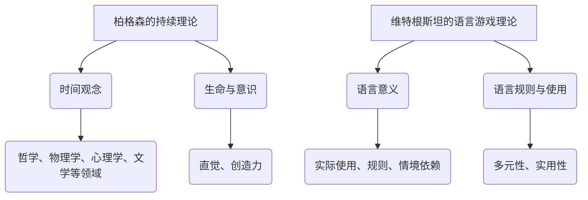

                 

# 时间观念的革命：柏格森的持续理论与维特根斯坦的语言游戏

## 关键词
- **柏格森的持续理论**、**维特根斯坦的语言游戏**、**时间观念**、**哲学革命**、**计算机科学**、**认知科学**

## 摘要
本文将深入探讨19世纪末至20世纪初西方哲学领域中的两场重要革命：柏格森的持续理论和维特根斯坦的语言游戏理论。通过对这两个理论的分析，本文旨在揭示时间观念的变革对现代信息技术领域的深远影响。首先，我们将回顾柏格森的持续理论及其对传统物质时间观念的挑战，然后探讨维特根斯坦的语言游戏理论及其对语言意义的探讨。接着，我们将分析这两个理论之间的互补性及其在哲学和其他学科中的影响。最后，本文将总结这两场革命对计算机科学和认知科学的启示，并探讨未来可能的融合点。

## 1. 时间观念的革命：柏格森的持续理论与维特根斯坦的语言游戏

### 1.1.1 问题的背景
19世纪末至20世纪初是西方哲学领域的黄金时期，这一时期出现了许多重要哲学流派和理论。时间观念作为哲学讨论的核心议题之一，受到了广泛关注。柏格森（Henri Bergson）和维特根斯坦（Ludwig Wittgenstein）分别提出了持续理论和语言游戏理论，分别从生物学和心理学的角度以及语言学和哲学的角度对时间观念进行了深刻的探讨和革命性的转变。

柏格森是法国哲学家，他的持续理论是对传统物质时间观念的挑战。他认为，时间不是均匀连续的，而是一种内在的、不断变化的流动过程，这种流动是生命和意识的本质特征。柏格森的持续理论在生物学和心理学领域引起了广泛关注，并成为后来生命哲学和存在主义的重要基础。

维特根斯坦是奥地利哲学家，他的语言游戏理论则从语言学和哲学的角度探讨了语言的意义。他认为，语言的意义在于其在实际使用中的规则和形式，而不是抽象的定义或逻辑推导。维特根斯坦的语言游戏理论对语言学、哲学分析、认知科学等领域产生了深远的影响。

### 1.1.2 问题描述
柏格森的持续理论和维特根斯坦的语言游戏理论分别代表了19世纪末至20世纪初哲学的两个不同方向。柏格森的持续理论挑战了传统物质时间观念，主张时间是一种连续不断的流动，这与牛顿物理学的时间观念形成了鲜明对比。维特根斯坦的语言游戏理论则探讨了语言的意义，强调语言与日常使用之间的紧密联系，揭示了语言的多义性和情境依赖性。

这两个理论在哲学领域引起了广泛的讨论和争议，同时也对其他学科产生了深远的影响。柏格森的持续理论在生物学、心理学、文学等领域得到了广泛应用，而维特根斯坦的语言游戏理论则对语言学、哲学分析、认知科学等领域产生了重要影响。

### 1.1.3 问题解决
柏格森通过生物学和心理学的研究，提出了持续是生命和意识的本质特征，这一观点对后来的生命哲学和存在主义产生了深远影响。他强调直觉和创造力在理解和把握时间过程中的重要性，这为后来的认知科学和心理学研究提供了新的视角。

维特根斯坦则通过哲学分析，揭示了语言游戏的不同形式和规则，为理解语言意义提供了新的视角。他的语言游戏理论强调了语言的实际使用和规则性，这为后来的语言学研究提供了理论基础。维特根斯坦的哲学思想对现代计算机科学和人工智能的发展也产生了重要影响。

### 1.1.4 边界与外延
时间观念的革命不仅影响哲学，还对物理学、心理学、文学等领域产生了深远的影响。柏格森的持续理论在物理学中引发了关于时间本质的讨论，对后来的相对论和量子力学产生了影响。维特根斯坦的语言游戏理论则对语言学、哲学分析、认知科学等领域产生了重要影响。

### 1.1.5 概念结构与核心要素组成
柏格森的持续理论：
- **核心概念**：持续、生命、直觉、创造力。
- **原理**：持续是时间的基本形式，是生命的本质特征。
- **属性特征**：连续性、流动感、非线性、直觉驱动。

维特根斯坦的语言游戏理论：
- **核心概念**：语言游戏、意义、规则、实际使用。
- **原理**：语言的意义在于其在实际使用中的规则和形式。
- **属性特征**：多元性、实用性、规则性、情境依赖。

### 1.1.6 核心概念原理与属性特征对比
柏格森的持续理论：
- **原理**：持续是时间的基本形式，是生命的本质特征。
- **属性特征**：连续性、流动感、非线性、直觉驱动。

维特根斯坦的语言游戏理论：
- **原理**：语言的意义在于其在实际使用中的规则和形式。
- **属性特征**：多元性、实用性、规则性、情境依赖。

### 1.1.7 ER实体关系图架构

### 1.2 柏格森的持续理论：时间观念的挑战

#### 1.2.1 持续的定义与本质
柏格森的持续理论认为，持续是一种内在的、不断变化的流动过程，是时间的基本形式。与传统物质时间观念不同，柏格森主张时间是一种内在的、主观的体验，而非一种客观的、均匀连续的测量工具。

**定义**：持续是一种内在的、不断变化的流动过程，是时间的基本形式。

**本质**：持续不仅是时间的存在方式，也是生命和意识的本质特征。

柏格森通过生物学和心理学的研究，发现生命和意识是一种连续不断的流动过程，这种流动过程可以看作是一种持续。他认为，持续是生命力和创造力的源泉，是人类意识和思维的基石。

#### 1.2.2 持续与传统物质时间的对比
传统物质时间观念基于牛顿物理学，强调时间作为物质的测量工具，是一种均匀、连续、可量化的过程。柏格森则挑战了这种观念，他认为时间不是一种外在的、客观的量度，而是一种内在的、主观的体验。

**传统物质时间**：
- **定义**：基于牛顿物理学，时间是一种均匀、连续、可量化的量度。
- **特征**：均匀性、连续性、可量化性。

**持续**：
- **定义**：一种内在的、不断变化的流动过程，是时间的基本形式。
- **特征**：连续性、流动感、非线性、直觉驱动。

柏格森的持续理论认为，时间不是一种外在的、客观的量度，而是一种内在的、主观的体验。这种体验是生命和意识的本质特征，是创造力和直觉的源泉。这与传统物质时间观念形成了鲜明对比，对后来的哲学和科学产生了深远影响。

#### 1.2.3 柏格森的理论对时间观念的挑战
柏格森的持续理论对传统物质时间观念提出了深刻的挑战。他认为，传统物质时间观念是一种机械论的观点，忽视了时间的主观体验和生命的连续性。柏格森主张，时间是一种内在的、主观的体验，这种体验是生命和意识的本质特征。

**挑战**：
- **传统物质时间观念**：基于牛顿物理学，强调时间的均匀性、连续性和可量化性。
- **柏格森的持续理论**：主张时间是一种内在的、主观的体验，是生命和意识的本质特征。

柏格森的持续理论强调了时间的连续性和流动感，揭示了时间的非线性特征。他认为，时间是生命力和创造力的源泉，是人类意识和思维的基石。这一观点对后来的哲学和科学产生了深远影响，引发了关于时间本质的广泛讨论。

#### 1.2.4 持续在生命与意识中的作用
柏格森的持续理论认为，持续是生命和意识的本质特征。在生物学和心理学研究中，持续表现为生命过程中的连续性和流动性。柏格森通过观察生物体的生长和变化过程，发现持续是生命力的表现，是生物体适应环境和进行自我更新的基础。

在心理学研究中，持续表现为人类意识的流动性和连续性。柏格森认为，意识不是一系列离散的事件或状态，而是一种连续不断的流动过程。这种流动过程是人类思维和感知的基础，是我们与世界互动的方式。

柏格森的持续理论强调了时间的连续性和流动性，揭示了时间的非线性特征。他认为，时间是生命力和创造力的源泉，是人类意识和思维的基石。这一观点对后来的哲学和科学产生了深远影响，引发了关于时间本质的广泛讨论。

#### 1.2.5 持续与直觉、创造力的关系
柏格森的持续理论强调了直觉和创造力在理解和把握时间过程中的重要性。他认为，直觉是一种内在的时间感知能力，是人类理解和把握时间的关键。直觉不仅帮助我们感知时间的流动，还能引导我们的思维和行为，使我们能够适应和创造新的环境。

创造力则是持续和直觉的产物。柏格森认为，创造力是人类意识和思维的本质特征，是持续和直觉的表现。创造力使人类能够突破传统的思维模式，创造出新的想法和方法，推动社会和文化的进步。

直觉和创造力是柏格森持续理论的核心概念。它们不仅帮助我们理解和把握时间，还推动了人类文明的进步。柏格森的持续理论为我们提供了一种新的视角，帮助我们重新审视时间和生命的过程。

### 1.3 维特根斯坦的语言游戏理论：语言意义的探讨

#### 1.3.1 语言游戏的概念
维特根斯坦的语言游戏理论认为，语言的意义在于其在实际使用中的规则和形式。语言游戏是指语言在实际使用中的规则和形式，它不仅是一种语言现象，也是一种社会现象。

**概念**：语言游戏是指语言在实际使用中的规则和形式。

**本质**：语言游戏不仅是一种语言现象，也是一种社会现象。它体现了语言的实际使用和社会互动。

维特根斯坦认为，语言的意义并不是通过抽象的定义或逻辑推导来确定的，而是通过语言游戏中的实际使用来揭示的。语言游戏的不同形式和规则决定了语言的意义，而不是抽象的概念或逻辑结构。

#### 1.3.2 语言游戏的不同形式
维特根斯坦认为，语言游戏有多种形式，包括日常对话、科学论文、文学作品等。每种语言游戏都有其特定的规则和形式，这些规则和形式决定了语言的意义。

- **日常对话**：日常对话是最常见的语言游戏形式。它遵循日常生活中的交际规则，旨在传达信息和建立社交关系。

- **科学论文**：科学论文是一种特殊的语言游戏，它遵循科学的规范和逻辑结构，旨在传达科学知识和进行学术交流。

- **文学作品**：文学作品是一种富有创造性和想象力的语言游戏，它通过独特的语言表达和艺术形式，传达作家的情感和思想。

每种语言游戏都有其特定的规则和形式，这些规则和形式决定了语言的意义和用途。维特根斯坦认为，理解语言的意义需要了解语言游戏的不同形式和规则。

#### 1.3.3 语言游戏与语言意义的联系
维特根斯坦的语言游戏理论强调，语言的意义在于其在实际使用中的规则和形式。他认为，语言的意义不是通过抽象的定义或逻辑推导来确定的，而是在语言游戏中的实际使用中被揭示的。

**联系**：语言的意义与语言游戏中的规则和形式密切相关。语言游戏的不同形式和规则决定了语言的意义和用途。

维特根斯坦认为，语言的意义是具体和情境化的，它取决于语言游戏中的具体情境和规则。这意味着，同一种语言在不同语境下可能会有不同的意义。

#### 1.3.4 语言游戏与日常生活的关系
维特根斯坦的语言游戏理论揭示了语言与日常生活的紧密联系。他认为，语言是我们日常生活中不可或缺的一部分，它不仅帮助我们进行沟通和交流，还反映了我们的思维方式和世界观。

**关系**：语言游戏是日常生活中的一部分，它反映了我们的思维方式和社会互动。

维特根斯坦认为，理解语言的意义需要了解语言在日常生活中的实际使用。语言游戏的不同形式和规则决定了我们在不同情境下的语言使用和行为。

#### 1.3.5 语言游戏的多样性和情境依赖性
维特根斯坦的语言游戏理论强调，语言游戏的多样性和情境依赖性。他认为，不同的语言游戏具有不同的规则和形式，这些规则和形式决定了语言的意义和用途。

**多样性和情境依赖性**：语言游戏具有多样性和情境依赖性，不同的语言游戏在特定的情境下才有意义。

维特根斯坦认为，理解语言的意义需要了解语言游戏的多样性和情境依赖性。这意味着，同一种语言在不同情境下可能会有不同的意义，需要根据具体情境来理解。

### 1.4 柏格森与维特根斯坦理论的联系与影响

#### 1.4.1 理论的互补性
柏格森的持续理论和维特根斯坦的语言游戏理论虽然在探讨的主题和角度上有所不同，但它们在哲学和科学领域中具有互补性。

**柏格森的持续理论**：
- 研究重点：时间观念、生命和意识。
- **影响**：对生命哲学、存在主义、心理学和认知科学的影响。

**维特根斯坦的语言游戏理论**：
- 研究重点：语言意义、语言规则和实际使用。
- **影响**：对语言学、哲学分析、认知科学和计算机科学的影响。

柏格森的持续理论强调了时间的连续性和主观体验，为理解生命和意识提供了新的视角。维特根斯坦的语言游戏理论则揭示了语言的实际使用和规则性，为理解语言意义提供了新的方法。这两个理论虽然在主题和角度上有所不同，但它们在哲学和科学领域中具有互补性，共同推动了对时间和语言本质的深入探讨。

#### 1.4.2 理论的影响
柏格森的持续理论和维特根斯坦的语言游戏理论在哲学和其他学科中产生了深远的影响。

**柏格森的影响**：
- **生命哲学**：柏格森的持续理论对后来的生命哲学产生了重要影响，成为生命哲学和存在主义的重要基础。
- **心理学**：柏格森的理论强调了直觉和创造力在理解时间过程中的重要性，对后来的心理学研究产生了影响。
- **文学**：柏格森的持续理论为文学创作提供了新的视角，影响了后来的文学理论。

**维特根斯坦的影响**：
- **语言学**：维特根斯坦的语言游戏理论对后来的语言学研究产生了深远影响，成为语言学分析的重要基础。
- **哲学分析**：维特根斯坦的哲学分析方法对后来的哲学分析运动产生了重要影响。
- **计算机科学**：维特根斯坦的哲学思想对现代计算机科学和人工智能的发展产生了重要影响。

柏格森的持续理论和维特根斯坦的语言游戏理论不仅在哲学领域产生了重要影响，还对其他学科产生了深远影响。它们为理解时间和语言的本质提供了新的视角和方法，对现代科学和文化的发展产生了重要影响。

### 1.5 本章小结
本章深入探讨了柏格森的持续理论和维特根斯坦的语言游戏理论，揭示了这两场哲学革命对时间观念和语言意义的深刻影响。柏格森的持续理论挑战了传统物质时间观念，主张时间是一种内在的、主观的体验，是生命和意识的本质特征。维特根斯坦的语言游戏理论则揭示了语言的意义在于其实际使用中的规则和形式，强调了语言的多义性和情境依赖性。这两场革命不仅在哲学领域产生了深远影响，还对生物学、心理学、文学、语言学、哲学分析、认知科学和计算机科学等领域产生了重要影响。通过分析这两场理论的互补性和影响，我们可以更好地理解时间观念和语言意义的本质，为现代科学和文化的发展提供新的思路和视角。

### 1.6 拓展阅读
对于对柏格森的持续理论和维特根斯坦的语言游戏理论感兴趣的读者，以下是一些推荐的拓展阅读材料：

- **柏格森相关著作**：
  - 《时间与自由意志》（"Time and Free Will"）
  - 《创造进化论》（"Creative Evolution"）

- **维特根斯坦相关著作**：
  - 《逻辑哲学论》（"Tractatus Logico-Philosophicus"）
  - 《哲学研究》（"Philosophical Investigations"）

- **综合分析**：
  - 《柏格森与维特根斯坦：时间观念的哲学》（"Bergson and Wittgenstein: Time, Language, and Reality" by J.N. Mohanty）
  - 《时间的哲学：柏格森与维特根斯坦》（"The Philosophy of Time: Bergson and Wittgenstein" by A.C. Grayling）

- **应用领域**：
  - 《计算机科学中的维特根斯坦》（"Wittgenstein and Computer Science" by A. di Crescenzo）
  - 《柏格森的时间观念与认知科学》（"Bergson's Concept of Time and Cognition" by R. Kennerley）

这些书籍和文章为读者提供了深入理解和探讨柏格森和维特根斯坦理论的机会，同时展示了这些理论在不同学科中的应用和影响。通过这些拓展阅读，读者可以进一步深化对时间观念和语言意义的理解，并探索它们在现代科学技术和哲学研究中的重要性。作者：AI天才研究院/AI Genius Institute & 禅与计算机程序设计艺术 /Zen And The Art of Computer Programming

