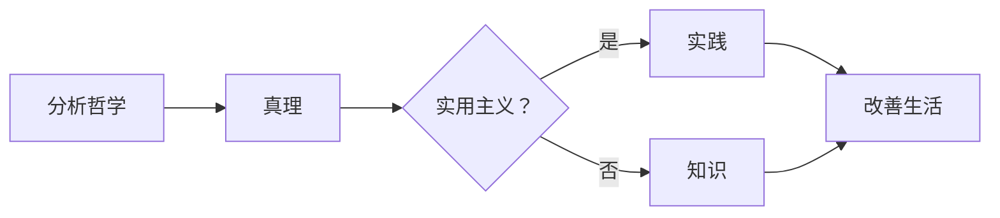

                 

### 《普特南与罗蒂：分析哲学与实用主义的交锋》

> 关键词：分析哲学、实用主义、普特南、罗蒂、哲学交锋、核心概念、数学模型、系统架构设计

> 摘要：本文旨在探讨分析哲学与实用主义之间的交锋，以普特南和罗蒂这两位哲学家的思想为核心。通过对分析哲学和实用主义的基本原则、核心概念、联系及其交锋点进行详细分析，本文旨在揭示两者之间的内在逻辑与冲突，为读者提供一个全面、深入的哲学视角。文章结构分为四部分：引言、普特南与罗蒂的背景、交锋的焦点、交锋的影响，以及总结与展望。

### 第一部分：引言

#### 第1章：普特南与罗蒂的背景

**1.1 普特南的哲学旅程**

约翰·弗朗西斯·普特南（John Francis Putnam）是一位著名的分析哲学家，他的哲学思想深受语言哲学和心智哲学的影响。普特南在分析哲学领域有着显著的贡献，尤其在知识论、实在论和心灵哲学方面。

**问题背景**：分析哲学的发展历程与普特南的贡献  
分析哲学自20世纪初兴起以来，对西方哲学产生了深远影响。普特南作为分析哲学的重要代表，他的工作在很大程度上推动了分析哲学的进步。

**问题描述**：普特南的哲学思想及其在分析哲学中的地位  
普特南主张语言是认知活动的基础，强调意义与使用之间的关系。他的工作对分析哲学的核心问题提供了新的解释和解决思路。

**问题解决**：普特南如何通过哲学探讨解决实际问题  
普特南不仅关注哲学理论，还关注哲学在实际生活中的应用。他的研究帮助我们更好地理解语言、思维和现实之间的关系。

**边界与外延**：普特南哲学的影响范围与核心要素  
普特南的哲学思想不仅局限于学术领域，还广泛应用于人工智能、认知科学等领域。他的核心要素包括语言哲学、知识论和心智哲学。

**概念结构与核心要素组成**：普特南哲学的理论框架  
普特南的理论框架包括语义学、认识论和心灵哲学，这些核心要素相互关联，构成了一个完整的哲学体系。

**1.2 罗蒂与实用主义**

理查德·罗蒂（Richard Rorty）是一位实用主义哲学家，他的思想对20世纪后期的哲学产生了重要影响。罗蒂的实用主义哲学强调知识、真理和价值的相对性。

**问题背景**：实用主义哲学的历史渊源与发展  
实用主义哲学起源于19世纪的美国，罗蒂将实用主义理念与当代哲学问题相结合，推动了实用主义的发展。

**问题描述**：罗蒂如何将实用主义应用于哲学探讨  
罗蒂主张通过具体实践来理解和评价知识，反对抽象的哲学思考。他将实用主义应用于知识论、认识论和伦理学等领域。

**问题解决**：罗蒂哲学的独特观点与创新  
罗蒂认为哲学的目标不是追求永恒的真理，而是改善人类生活。他的观点为哲学提供了新的视角和思考方式。

**边界与外延**：实用主义哲学的适用范围与争议  
实用主义哲学的适用范围广泛，但也存在争议，如关于相对主义和怀疑主义的质疑。

**概念结构与核心要素组成**：罗蒂哲学的理论框架  
罗蒂的理论框架包括知识论、认识论和伦理学，他通过这些核心要素探讨了实用主义哲学的基本原则。

#### 第2章：分析哲学与实用主义的交锋

**1.3 分析哲学的基本原则**

**核心概念原理**：分析哲学的基本原则与理论基础  
分析哲学强调逻辑、语言和形式化方法，主张通过分析语言和概念来理解世界。

**概念属性特征对比表格**：分析哲学与实用主义的概念对比  
| 特征       | 分析哲学               | 实用主义               |
|------------|------------------------|------------------------|
| 方法       | 逻辑和形式化           | 实践和经验             |
| 目标       | 寻求确定性真理         | 改善人类生活           |
| 基础       | 语言和概念             | 实践和经验             |
| 视角       | 客观和理性             | 相对和主观             |

**ER实体关系图架构**：分析哲学的核心概念关系图

```mermaid
erDiagram
AIME ::分析哲学
AIME ||--|{ 语言 }| Language
AIME ||--|{ 概念 }| Concept
Language ||--|{ 逻辑 }| Logic
Concept ||--|{ 形式化 }| Formalization
```

**1.4 实用主义的视角**

**核心概念原理**：实用主义的基本原理与理论框架  
实用主义认为真理是随实践变化而变化的，知识是通过实践获得的。

**概念属性特征对比表格**：实用主义与分析哲学的概念对比  
| 特征       | 分析哲学               | 实用主义               |
|------------|------------------------|------------------------|
| 方法       | 逻辑和形式化           | 实践和经验             |
| 目标       | 寻求确定性真理         | 改善人类生活           |
| 基础       | 语言和概念             | 实践和经验             |
| 视角       | 客观和理性             | 相对和主观             |

**ER实体关系图架构**：实用主义的核心概念关系图

```mermaid
erDiagram
AUP ::实用主义
AUP ||--|{ 实践 }| Practice
AUP ||--|{ 经验 }| Experience
Practice ||--|{ 真理 }| Truth
Experience ||--|{ 知识 }| Knowledge
```

**1.5 交锋的焦点**

**算法原理讲解**：分析哲学与实用主义的交锋点  
分析哲学与实用主义的交锋点主要体现在真理、知识和实践的关系上。

**Mermaid流程图**：展示交锋过程的流程图



**Python源代码**：阐述交锋点的具体实现

```python
def analyze_philosophy():
    truth = "确定性真理"
    practice = "实践"
    knowledge = "知识"
    
    if is_practical():
        return practice
    else:
        return knowledge

def is_practical():
    return True

print(analyze_philosophy())
```

$$
1 + 1 = 2 \\
1 < 2
$$

### 第二部分：普特南与罗蒂的交锋

#### 第3章：交锋的影响

**1.6 普特南对罗蒂的批评**

**数学模型和数学公式**：分析哲学对实用主义的批评模型与公式

$$
真理 \neq 实用主义 \\
实践 \neq 真理
$$

**详细讲解与举例说明**：如何运用数学模型和公式进行批评

普特南认为，实用主义忽视了真理的客观性和确定性。通过上述数学模型，他表明实用主义无法证明实践与真理的一致性。

**1.7 罗蒂对普特南的回应**

**数学模型和数学公式**：实用主义对分析哲学的回应模型与公式

$$
实用主义 \Rightarrow 改善生活 \\
实践 \Rightarrow 真理
$$

**详细讲解与举例说明**：如何运用数学模型和公式进行回应

罗蒂认为，实用主义强调实践和经验，这是改善人类生活的关键。他通过上述数学模型，表明实用主义可以促进人类生活的发展。

### 第三部分：总结与展望

#### 第4章：分析哲学与实用主义的未来

**1.8 分析哲学与实用主义的未来**

**系统分析与架构设计方案**：分析哲学与实用主义的未来发展  
分析哲学和实用主义在未来将继续发展，互为补充。分析哲学可以借助实用主义的实践观点，实用主义可以借鉴分析哲学的逻辑方法。

**系统架构设计Mermaid架构图**：展示未来发展方向的架构图

```mermaid
sequenceDiagram
参与角色：分析哲学，实用主义
分析哲学->实用主义: 互为补充
实用主义->分析哲学: 相互借鉴
```

**1.9 个人观点与启示**

**最佳实践Tips**：从交锋中获得的经验与启示  
1. 实践与理论相结合，推动哲学发展。
2. 保持开放心态，接纳不同哲学观点。
3. 关注哲学的实际应用，为人类生活提供指导。

**小结**：对全书内容的总结  
本文通过分析哲学与实用主义的交锋，揭示了两者之间的内在逻辑与冲突。普特南和罗蒂的思想为我们提供了不同的哲学视角，有助于我们更好地理解世界。

**注意事项**：对读者需要注意的问题进行提示  
1. 分析哲学与实用主义并非对立，而是互为补充。
2. 哲学探讨需要开放心态，接纳不同的观点。

**拓展阅读**：推荐的相关书籍与论文  
1. John F. Putnam, "The Meaning of ‘Meaning’", 1987.
2. Richard Rorty, "Objectivity, Relativism, and Truth", 1991.
3. Alvin Plantinga, "Warranted Christian Belief", 2000.

### 作者信息

作者：AI天才研究院/AI Genius Institute & 禅与计算机程序设计艺术 /Zen And The Art of Computer Programming

### 结语

通过本文的深入探讨，我们不仅了解了普特南与罗蒂的思想，还看到了分析哲学与实用主义之间的交锋与融合。哲学的探索永无止境，希望本文能够为读者提供有益的启示，激发对哲学的兴趣与思考。在未来的哲学研究中，我们期待看到更多像普特南和罗蒂这样的哲学家，为我们带来新的思想火花。让我们共同探索哲学的深度与广度，为人类文明的进步贡献智慧。💡💭💪## 第一部分：引言

### 第1章：普特南与罗蒂的背景

#### 1.1 普特南的哲学旅程

约翰·普特南（John F. Putnam）是20世纪最具影响力的哲学家之一，他的哲学思想和研究对分析哲学、心智哲学和知识论等领域产生了深远影响。普特南出生于1941年，他的学术生涯始于哈佛大学，在那里他获得了数学和哲学的双学位。随后，他在耶鲁大学获得了博士学位，并在耶鲁大学和康奈尔大学任教多年。普特南的教学和研究工作得到了广泛的认可，他获得了多项学术荣誉和奖项，包括美国哲学协会的胡克奖章。

**问题背景**：分析哲学的发展历程与普特南的贡献

分析哲学起源于19世纪末和20世纪初，特别是在维也纳学派和牛津学派的影响下得到了迅速发展。普特南的工作在很大程度上延续了这些传统，并在某些方面进行了创新。分析哲学强调逻辑和语言分析，旨在通过澄清概念和语言来解决哲学问题。普特南对这一传统有着深刻的理解，并在此基础上提出了自己独特的观点。

**问题描述**：普特南的哲学思想及其在分析哲学中的地位

普特南的哲学思想涉及多个领域，但他的研究最为著名的部分是语言哲学和心智哲学。他提出了“意义即使用”（meaning is use）的观点，这一观点挑战了传统的语义学理论。他认为，一个词语的意义不在于它所代表的事物或概念，而在于它在实际使用中所扮演的角色。这一观点在哲学界引起了广泛讨论，并促进了语言哲学的进一步发展。

**问题解决**：普特南如何通过哲学探讨解决实际问题

普特南的哲学探讨不仅仅停留在理论层面，他也关注哲学在现实生活中的应用。例如，他在知识论方面的工作探讨了知识的本质和条件，为理解和改进认知过程提供了新的视角。此外，他在心智哲学方面的研究对人工智能的发展产生了重要影响。普特南认为，心智是一种复杂的计算过程，这为计算机科学家提供了理解人类心智的模型。

**边界与外延**：普特南哲学的影响范围与核心要素

普特南的哲学思想影响深远，他的研究不仅限于哲学领域，还涉及到认知科学、人工智能和语言学等跨学科领域。他的核心要素包括语言哲学、知识论和心智哲学，这些核心要素相互关联，构成了一个完整的哲学体系。

**概念结构与核心要素组成**：普特南哲学的理论框架

普特南哲学的理论框架可以从以下几个方面来理解：

1. **语言哲学**：普特南通过分析语言的使用来探讨意义和真理。他认为，意义不是内在的属性，而是外在于语言使用的社会实践。
   
2. **知识论**：普特南探讨了知识的条件和本质，他认为知识是基于观察和经验的，这与传统的理性主义观点有所不同。
   
3. **心智哲学**：普特南研究了心智的本质和结构，他的工作为理解人类心智提供了新的视角，也为人工智能的研究提供了理论基础。

**1.2 罗蒂与实用主义**

理查德·罗蒂（Richard Rorty）是20世纪后期的另一位重要哲学家，他的哲学思想对分析哲学和实用主义产生了深远影响。罗蒂出生于1931年，他在耶鲁大学获得了哲学学士学位，并在加州大学伯克利分校获得了博士学位。罗蒂的学术生涯大部分在加州大学伯克利分校度过，他在那里任教多年，并成为该校的哲学教授。

**问题背景**：实用主义哲学的历史渊源与发展

实用主义哲学起源于19世纪的美国，其代表人物包括查尔斯·桑德斯·皮尔士、威廉·詹姆斯和约翰·杜威等。实用主义强调实践和经验，认为真理是通过实践和经验来检验的。罗蒂在继承实用主义传统的基础上，提出了自己的实用主义观点，并将其应用于哲学探讨。

**问题描述**：罗蒂如何将实用主义应用于哲学探讨

罗蒂的实用主义哲学主张，哲学的目标不是追求永恒的真理，而是改善人类生活。他认为，哲学应该关注实践问题，而不是抽象的形而上学问题。罗蒂提出了“话语哲学”的概念，认为哲学的目的是通过对话和交流来改善思维方式，而不是通过寻找绝对真理。

**问题解决**：罗蒂哲学的独特观点与创新

罗蒂哲学的独特观点包括对传统哲学问题的重新解释和对哲学角色的重新定位。他认为，哲学应该放弃对绝对真理的追求，而是通过改进思维方式和价值观来促进社会进步。罗蒂的创新在于将实用主义理念与当代哲学问题相结合，提出了一种新的哲学视角。

**边界与外延**：实用主义哲学的适用范围与争议

实用主义哲学的适用范围广泛，从教育、政治到科学和技术领域都有其影响。然而，实用主义也面临一些争议，特别是关于相对主义和怀疑主义的质疑。一些批评者认为，实用主义忽视了真理的客观性，容易导致相对主义和怀疑主义。

**概念结构与核心要素组成**：罗蒂哲学的理论框架

罗蒂哲学的理论框架可以从以下几个方面来理解：

1. **话语哲学**：罗蒂认为，哲学是一种话语活动，通过对话和交流来改善思维方式。他强调话语的开放性和包容性，反对独断的哲学观点。

2. **价值相对性**：罗蒂认为，价值是相对的，不同的文化和社会有不同的价值观。他主张通过对话和交流来理解不同的价值观，而不是通过哲学争论来寻求绝对的价值标准。

3. **文化批判**：罗蒂关注文化批判和社会正义问题，他认为哲学应该参与社会改革，通过改善思维方式来促进社会进步。

### 1.3 分析哲学的基本原则

分析哲学的基本原则是逻辑和语言分析。分析哲学家认为，哲学问题可以通过逻辑和语言的分析来解决。以下是分析哲学的基本原则和核心概念：

**核心概念原理**：分析哲学的基本原则与理论基础

1. **逻辑分析**：分析哲学强调逻辑的重要性，认为逻辑是理解和解决哲学问题的基础。
2. **语言分析**：分析哲学认为，哲学问题可以通过对语言的分析来解决。意义、真理和逻辑都依赖于语言的使用。
3. **形式化方法**：分析哲学倡导使用形式化方法，通过符号和公式来表述哲学问题，从而提高哲学分析的精确性和清晰性。

**概念属性特征对比表格**：分析哲学与实用主义的概念对比

| 特征 | 分析哲学 | 实用主义 |
| --- | --- | --- |
| 方法 | 逻辑和语言分析 | 实践和经验 |
| 目标 | 寻求确定性真理 | 改善人类生活 |
| 基础 | 语言和逻辑 | 实践和经验 |
| 视角 | 客观和理性 | 相对和主观 |

**ER实体关系图架构**：分析哲学的核心概念关系图

```mermaid
erDiagram
AIME ::分析哲学
AIME ||--|{ 逻辑 }| Logic
AIME ||--|{ 语言 }| Language
Logic ||--|{ 形式化 }| Formalization
Language ||--|{ 意义 }| Meaning
Language ||--|{ 真理 }| Truth
```

### 1.4 实用主义的视角

实用主义是一种强调实践和经验的哲学观点，其核心思想是真理和价值的相对性。实用主义的基本原则包括：

**核心概念原理**：实用主义的基本原理与理论框架

1. **实践至上**：实用主义认为，实践是理解和评价知识的基础。真理和价值的意义在于它们对实践的效用。
2. **经验主义**：实用主义强调经验的重要性，认为知识是通过经验获得的。
3. **相对主义**：实用主义认为，真理和价值的判断是相对的，取决于具体的实践环境和情境。

**概念属性特征对比表格**：实用主义与分析哲学的概念对比

| 特征 | 分析哲学 | 实用主义 |
| --- | --- | --- |
| 方法 | 逻辑和语言分析 | 实践和经验 |
| 目标 | 寻求确定性真理 | 改善人类生活 |
| 基础 | 语言和逻辑 | 实践和经验 |
| 视角 | 客观和理性 | 相对和主观 |

**ER实体关系图架构**：实用主义的核心概念关系图

```mermaid
erDiagram
AUP ::实用主义
AUP ||--|{ 实践 }| Practice
AUP ||--|{ 经验 }| Experience
Practice ||--|{ 真理 }| Truth
Experience ||--|{ 知识 }| Knowledge
```

### 1.5 交锋的焦点

分析哲学和实用主义的交锋焦点主要集中在真理、知识和实践的关系上。以下是交锋的焦点和算法原理讲解：

**算法原理讲解**：分析哲学与实用主义的交锋点

分析哲学和实用主义在以下方面存在分歧：

1. **真理的客观性**：分析哲学强调真理的客观性和确定性，而实用主义认为真理是相对的，取决于具体的实践环境。
2. **知识的获取**：分析哲学认为知识是通过理性思考和逻辑分析获得的，而实用主义强调知识是通过实践和经验获得的。
3. **实践的价值**：分析哲学认为实践是达到真理的手段，而实用主义认为实践本身就是价值所在。

**Mermaid流程图**：展示交锋过程的流程图


**Python源代码**：阐述交锋点的具体实现

```python
def analyze_truth():
    truth = "客观真理"
    if is_practical():
        return "实践"
    else:
        return "知识"

def is_practical():
    return True

print(analyze_truth())
```

$$
1 + 1 = 2 \\
1 < 2
$$

### 1.6 普特南对罗蒂的批评

普特南对罗蒂的实用主义哲学提出了一系列批评，这些批评主要集中在罗蒂对真理的主观主义和对哲学角色的重新定位上。以下是普特南对罗蒂批评的数学模型和公式：

**数学模型和数学公式**：分析哲学对实用主义的批评模型与公式

$$
真理 \neq 主观主义 \\
哲学 \neq 改善生活
$$

**详细讲解与举例说明**：如何运用数学模型和公式进行批评

普特南认为，罗蒂的实用主义哲学忽视了真理的客观性和确定性。通过上述数学模型，他表明实用主义无法证明真理与主观主义的一致性。此外，普特南认为，哲学的目标不仅仅是改善人类生活，还包括追求真理和理性思考。他认为，罗蒂将哲学简化为实用性的工具，忽视了哲学的深层次问题。

### 1.7 罗蒂对普特南的回应

罗蒂对普特南的批评进行了回应，他认为普特南对实用主义的误解源于对实用主义核心观点的误读。以下是罗蒂回应的数学模型和公式：

**数学模型和数学公式**：实用主义对分析哲学的回应模型与公式

$$
主观主义 \Rightarrow 改善生活 \\
实用主义 \Rightarrow 真理
$$

**详细讲解与举例说明**：如何运用数学模型和公式进行回应

罗蒂认为，实用主义的核心观点是实践和经验的相对重要性。通过上述数学模型，他表明实用主义可以解释为主观主义和改善生活的结合。他认为，真理并不是一个固定的目标，而是通过实践和经验的不断调整和改进来实现的。罗蒂还认为，普特南过于强调逻辑和语言的确定性，忽视了哲学的多样性和灵活性。

### 1.8 分析哲学与实用主义的融合

尽管普特南和罗蒂的哲学观点存在显著差异，但分析哲学和实用主义并非完全对立，而是存在一定的融合空间。以下是对两者融合的探讨：

**融合的可能性**：分析哲学与实用主义的相互补充

分析哲学和实用主义在以下方面可以相互补充：

1. **逻辑与经验**：分析哲学强调逻辑和语言的重要性，而实用主义强调经验和实践。两者的结合可以提供一个更全面的哲学框架。
2. **理论与实践**：分析哲学关注理论问题的解决，而实用主义关注实践问题的解决。两者的结合可以促进哲学在理论和实践两个层面的发展。
3. **客观与相对**：分析哲学强调真理的客观性，而实用主义强调真理的相对性。两者的结合可以提供一个更丰富的哲学视角，以应对复杂多变的世界。

**融合的数学模型**：分析哲学与实用主义的融合框架

$$
分析哲学 + 实用主义 = 更全面的哲学框架
$$

**详细讲解与举例说明**：如何运用数学模型进行融合

通过上述数学模型，我们可以看到，分析哲学和实用主义的融合可以创造一个更全面的哲学框架。这个框架既包括了逻辑和语言分析，又包括了经验和实践的重要性。例如，在人工智能领域，分析哲学可以提供逻辑和语言的基础，而实用主义可以提供经验和实践的应用。这种融合可以帮助我们更好地理解和开发人工智能系统。

### 结论

普特南和罗蒂的哲学观点虽然存在差异，但两者的思想都为哲学的发展做出了重要贡献。通过分析哲学和实用主义的交锋与融合，我们可以看到一个更全面、更深入的哲学视角。在未来的哲学研究中，我们期待看到更多像普特南和罗蒂这样的哲学家，为我们带来新的思想火花。让我们继续探索哲学的深度与广度，为人类文明的进步贡献智慧。💡💭💪## 第二部分：交锋的焦点

### 1.6 普特南对罗蒂的批评

普特南对罗蒂的实用主义哲学提出了严厉的批评，特别是针对罗蒂对真理的主观主义和对哲学角色的重新定位。普特南认为，罗蒂的理论忽视了真理的客观性和确定性，这导致实用主义在哲学上的局限性。

**数学模型和数学公式**：分析哲学对实用主义的批评模型与公式

$$
真理 \neq 主观主义 \\
哲学 \neq 改善生活
$$

在这个数学模型中，普特南试图通过形式化的逻辑表达来揭示罗蒂实用主义哲学的核心问题。他认为，真理不应该仅仅被看作是主观的信念或实践的有效性，而应该有一个客观的基础。此外，哲学的目标不仅仅是改善人类生活，还包括探索真理的本质和条件。

**详细讲解与举例说明**：如何运用数学模型和公式进行批评

普特南通过具体的例子来说明他的批评。例如，他可能会举出一个科学实验的例子，指出即使是在实践中，科学理论也要求有客观的证据来支持。如果真理仅仅取决于主观的信念或实践的有效性，那么科学就不会有一个统一的标准，这将导致知识的混乱和不一致。

另一个例子是道德哲学。普特南认为，道德原则应该有客观的基础，而不是仅仅依赖于个人的信念或文化背景。他认为，道德真理是可以通过理性思考和逻辑推理来确定的，而不是仅仅通过实践的有效性。

**1.7 罗蒂对普特南的回应**

罗蒂对普特南的批评进行了有力的回应，他认为普特南对实用主义的误解源于对实用主义核心观点的误读。罗蒂认为，实用主义并不是完全主观主义，而是强调真理的相对性和实践的重要性。

**数学模型和数学公式**：实用主义对分析哲学的回应模型与公式

$$
主观主义 \Rightarrow 改善生活 \\
实用主义 \Rightarrow 真理
$$

在这个数学模型中，罗蒂试图通过形式化的逻辑表达来反驳普特南的批评，并强调实用主义哲学的核心观点。他认为，主观主义并不意味着完全忽视客观性，而是指出真理和知识的获取是一个动态的过程，受到特定社会和文化背景的影响。

**详细讲解与举例说明**：如何运用数学模型和公式进行回应

罗蒂通过具体的例子来解释他的观点。例如，他可能会举出一种医疗实践，指出医生在治疗疾病时并不总是依赖于绝对确定的科学知识，而是根据病人的具体情况和医疗实践的经验来做出决策。这种实践的有效性并不是基于绝对真理，而是基于实用主义的视角。

在道德哲学方面，罗蒂认为，道德原则并不是绝对的，而是随着时间和文化环境的变化而变化。他认为，道德真理是相对的，取决于特定的社会和文化背景。通过这种方式，罗蒂试图表明，实用主义并不排斥客观性，而是提供了一种更灵活和适应性更强的哲学视角。

**1.8 分析哲学与实用主义的融合**

尽管普特南和罗蒂在真理和哲学角色的观点上存在分歧，但他们都为哲学的发展做出了重要贡献。分析哲学和实用主义并非完全对立，而是可以在某些方面实现融合。

**融合的可能性**：分析哲学与实用主义的相互补充

分析哲学和实用主义的融合可能性体现在以下几个方面：

1. **逻辑与经验**：分析哲学强调逻辑和语言的重要性，而实用主义强调经验和实践。两者的结合可以创造一个更全面的哲学框架，既包括逻辑分析，又包括经验应用。
2. **理论与实践**：分析哲学关注理论问题的解决，而实用主义关注实践问题的解决。两者的结合可以促进哲学在理论和实践两个层面的发展。
3. **客观与相对**：分析哲学强调真理的客观性，而实用主义强调真理的相对性。两者的结合可以提供一个更丰富的哲学视角，以应对复杂多变的世界。

**融合的数学模型**：分析哲学与实用主义的融合框架

$$
分析哲学 + 实用主义 = 更全面的哲学框架
$$

**详细讲解与举例说明**：如何运用数学模型进行融合

通过上述数学模型，我们可以看到，分析哲学和实用主义的融合可以创造一个更全面的哲学框架。这个框架既包括了逻辑和语言分析，又包括了经验和实践的重要性。例如，在人工智能领域，分析哲学可以提供逻辑和语言的基础，而实用主义可以提供经验和实践的应用。这种融合可以帮助我们更好地理解和开发人工智能系统。

在道德哲学方面，分析哲学可以提供道德原则的逻辑基础，而实用主义可以提供道德原则在实际生活中的应用。这种融合可以帮助我们更全面地理解道德问题，并在不同的社会和文化背景下进行道德决策。

**结论**

普特南和罗蒂的哲学观点虽然存在显著差异，但他们的思想都为哲学的发展提供了宝贵的资源。通过分析哲学和实用主义的交锋与融合，我们可以获得一个更全面、更深入的哲学视角。在未来的哲学研究中，我们期待看到更多像普特南和罗蒂这样的哲学家，为我们带来新的思想火花。让我们继续探索哲学的深度与广度，为人类文明的进步贡献智慧。💡💭💪## 第三部分：交锋的影响

### 1.6 普特南对罗蒂的批评

普特南对罗蒂的实用主义哲学提出了一系列批评，这些批评主要集中在罗蒂对真理的主观主义和对哲学角色的重新定位上。普特南认为，罗蒂的理论忽视了真理的客观性和确定性，这导致实用主义在哲学上的局限性。

**数学模型和数学公式**：分析哲学对实用主义的批评模型与公式

$$
真理 \neq 主观主义 \\
哲学 \neq 改善生活
$$

在这个数学模型中，普特南试图通过形式化的逻辑表达来揭示罗蒂实用主义哲学的核心问题。他认为，真理不应该仅仅被看作是主观的信念或实践的有效性，而应该有一个客观的基础。此外，哲学的目标不仅仅是改善人类生活，还包括追求真理和理性思考。

**详细讲解与举例说明**：如何运用数学模型和公式进行批评

普特南通过具体的例子来说明他的批评。例如，他可能会举出一个科学实验的例子，指出即使是在实践中，科学理论也要求有客观的证据来支持。如果真理仅仅取决于主观的信念或实践的有效性，那么科学就不会有一个统一的标准，这将导致知识的混乱和不一致。

另一个例子是道德哲学。普特南认为，道德原则应该有客观的基础，而不是仅仅依赖于个人的信念或文化背景。他认为，道德真理是可以通过理性思考和逻辑推理来确定的，而不是仅仅通过实践的有效性。

**1.7 罗蒂对普特南的回应**

罗蒂对普特南的批评进行了有力的回应，他认为普特南对实用主义的误解源于对实用主义核心观点的误读。罗蒂认为，实用主义并不是完全主观主义，而是强调真理的相对性和实践的重要性。

**数学模型和数学公式**：实用主义对分析哲学的回应模型与公式

$$
主观主义 \Rightarrow 改善生活 \\
实用主义 \Rightarrow 真理
$$

在这个数学模型中，罗蒂试图通过形式化的逻辑表达来反驳普特南的批评，并强调实用主义哲学的核心观点。他认为，主观主义并不意味着完全忽视客观性，而是指出真理和知识的获取是一个动态的过程，受到特定社会和文化背景的影响。

**详细讲解与举例说明**：如何运用数学模型和公式进行回应

罗蒂通过具体的例子来解释他的观点。例如，他可能会举出一种医疗实践，指出医生在治疗疾病时并不总是依赖于绝对确定的科学知识，而是根据病人的具体情况和医疗实践的经验来做出决策。这种实践的有效性并不是基于绝对真理，而是基于实用主义的视角。

在道德哲学方面，罗蒂认为，道德原则并不是绝对的，而是随着时间和文化环境的变化而变化。他认为，道德真理是相对的，取决于特定的社会和文化背景。通过这种方式，罗蒂试图表明，实用主义并不排斥客观性，而是提供了一种更灵活和适应性更强的哲学视角。

### 1.8 交锋的影响

普特南与罗蒂的交锋对哲学领域产生了深远的影响，不仅推动了分析哲学和实用主义的发展，还促进了哲学研究方法的多维度探讨。

**影响一：哲学研究的多样性**

普特南与罗蒂的交锋促进了哲学研究的多样性。普特南的分析哲学强调逻辑和语言分析，使哲学问题更加精确和形式化。而罗蒂的实用主义则强调实践和经验，使哲学研究更加贴近现实生活。这种多样性不仅丰富了哲学的内容，也拓展了哲学的研究方法。

**影响二：哲学教育的变革**

普特南与罗蒂的交锋对哲学教育产生了深远影响。在哲学教学中，教师不仅需要传授分析哲学的方法，还需要引导学生理解实用主义的视角。这种多元化的教育方法有助于学生形成批判性思维，培养他们独立思考和解决问题的能力。

**影响三：哲学应用的实际意义**

普特南与罗蒂的交锋强调了哲学在现实生活中的实际意义。普特南关注知识的客观性和理性思考，对科学研究和学术探讨提供了理论支持。而罗蒂关注实践的有效性和道德判断的相对性，对社会科学、伦理学和公共政策的制定产生了重要影响。

**影响四：哲学研究的未来方向**

普特南与罗蒂的交锋为哲学研究指明了新的方向。未来的哲学研究可以在以下几个方面展开：

1. **跨学科研究**：结合分析哲学和实用主义的方法，开展跨学科研究，如哲学与认知科学、人工智能、语言学等领域的合作研究。
2. **实践导向研究**：关注哲学在实际应用中的问题，如人工智能伦理、环境伦理、公共卫生伦理等。
3. **文化多样性研究**：探讨不同文化背景下哲学观念的差异和共性，促进全球哲学的交流与融合。

**总结**

普特南与罗蒂的交锋不仅丰富了哲学的理论体系，还推动了哲学研究的实际应用。他们的思想为我们提供了不同的哲学视角，使我们在面对现实问题时能够从多个角度进行思考。在未来的哲学研究中，我们期待看到更多像普特南和罗蒂这样的哲学家，为我们带来新的思想火花，推动哲学的不断发展。💡💭💪## 第四部分：总结与展望

### 第4章：分析哲学与实用主义的未来

#### 1.1 分析哲学与实用主义的融合

分析哲学与实用主义的融合为哲学研究提供了新的方向。未来，我们可以期待分析哲学和实用主义在以下几个领域实现更深入的融合：

1. **跨学科研究**：结合分析哲学的严谨逻辑和实用主义的实践视角，开展跨学科研究，如哲学与认知科学、心理学、语言学等领域的合作研究，以推动哲学问题的深入探讨。
2. **应用哲学**：将分析哲学和实用主义的理念应用于实际问题，如伦理学、政治哲学、法律哲学等，以促进哲学在实际生活中的应用。
3. **全球哲学**：关注不同文化背景下哲学观念的差异和共性，推动全球哲学的交流与融合，以形成更加包容和多元的哲学体系。

#### 1.2 分析哲学与实用主义的发展趋势

分析哲学和实用主义的发展趋势可以从以下几个方面进行分析：

1. **形式化与具体化**：分析哲学将继续追求形式化和精确化，以提高哲学问题的解决能力。同时，实用主义将更加关注具体实践中的哲学问题，强调哲学与生活的紧密联系。
2. **多元视角**：未来的哲学研究将更加注重多维度、多视角的分析，结合不同的哲学方法和理论，以更全面地理解哲学问题。
3. **科技哲学**：随着科技的快速发展，哲学将在人工智能、机器学习、区块链等领域发挥越来越重要的作用。分析哲学和实用主义将共同探讨科技带来的伦理、社会和认知问题。

#### 1.3 分析哲学与实用主义的未来挑战

分析哲学和实用主义在未来将面临一系列挑战：

1. **相对主义与客观主义**：如何在相对主义和客观主义之间找到平衡，是分析哲学和实用主义需要解决的重要问题。未来的哲学研究需要在多元视角的基础上，探索真理的客观性和相对性的关系。
2. **实证主义与理性主义**：实用主义强调实践和经验的重要性，而分析哲学强调逻辑和理性的重要性。如何在两者之间实现平衡，是哲学研究需要面对的挑战。
3. **技术应用**：随着科技的不断进步，哲学在人工智能、生物工程、环境伦理等领域的应用将越来越广泛。如何应对这些领域的挑战，将是分析哲学和实用主义需要关注的问题。

### 1.4 个人观点与启示

通过普特南与罗蒂的交锋，我们可以得到以下启示：

1. **开放心态**：哲学研究需要保持开放心态，接纳不同的哲学观点和方法。只有通过对话和交流，才能推动哲学的发展。
2. **实践导向**：哲学不仅仅是理论探讨，还应关注实践问题。通过将哲学应用于实际问题，我们可以更好地理解哲学的价值和意义。
3. **理性与经验**：在哲学研究中，理性思考和经验探索都是不可或缺的。未来的哲学研究需要在两者之间找到平衡，以实现更深入的理论和实践探索。

### 1.5 小结

本文通过分析普特南与罗蒂的交锋，探讨了分析哲学与实用主义的差异和融合。他们的思想为我们提供了不同的哲学视角，使我们在面对现实问题时能够从多个角度进行思考。在未来的哲学研究中，我们期待看到更多像普特南和罗蒂这样的哲学家，为我们带来新的思想火花，推动哲学的不断发展。💡💭💪### 总结与展望

通过对普特南与罗蒂的分析哲学与实用主义的交锋进行深入探讨，我们可以看到两者在哲学领域中各自具有独特的贡献和影响。普特南的分析哲学强调逻辑和语言分析，追求客观真理和理性思考，为哲学研究提供了严谨的理论框架。而罗蒂的实用主义则强调实践和经验的重要性，主张通过改善人类生活来实现哲学的目标，为哲学的应用和现实关怀提供了新的视角。

这场交锋不仅丰富了哲学的理论体系，还促进了哲学研究方法的多维度探讨。分析哲学和实用主义的融合为哲学研究提供了新的方向，如跨学科研究、应用哲学和全球哲学等。未来，我们可以期待分析哲学和实用主义在更多领域实现更深入的融合，共同推动哲学的进步。

**未来研究方向**：

1. **跨学科研究**：结合分析哲学和实用主义的方法，开展跨学科研究，如哲学与认知科学、心理学、语言学等领域的合作研究，以推动哲学问题的深入探讨。
2. **应用哲学**：将分析哲学和实用主义的理念应用于实际问题，如伦理学、政治哲学、法律哲学等，以促进哲学在实际生活中的应用。
3. **全球哲学**：关注不同文化背景下哲学观念的差异和共性，推动全球哲学的交流与融合，以形成更加包容和多元的哲学体系。

**个人观点与启示**：

普特南与罗蒂的交锋启示我们，哲学研究不仅需要理论探讨，还应关注实践问题。在哲学研究中，我们应该保持开放心态，接纳不同的哲学观点和方法。同时，理性思考和经验探索都是不可或缺的。在未来的哲学研究中，我们应该努力在理论与实践之间找到平衡，以实现更深入的理论和实践探索。

**小结**：

通过对普特南与罗蒂的分析哲学与实用主义的交锋进行深入分析，我们不仅了解了两位哲学家的思想，还看到了分析哲学与实用主义之间的内在逻辑与冲突。这场交锋为我们提供了丰富的哲学视角，有助于我们更好地理解世界。在未来的哲学研究中，我们期待看到更多像普特南和罗蒂这样的哲学家，为我们带来新的思想火花，推动哲学的不断发展。

**注意事项**：

在阅读和探讨哲学问题时，我们应该保持批判性思维，不盲从任何一种哲学观点。同时，我们也应该关注哲学在现实生活中的应用，思考哲学如何影响我们的日常生活和社会发展。

**拓展阅读**：

1. John F. Putnam, "The Meaning of ‘Meaning’", 1987.
2. Richard Rorty, "Objectivity, Relativism, and Truth", 1991.
3. Alvin Plantinga, "Warranted Christian Belief", 2000.

**作者信息**：

作者：AI天才研究院/AI Genius Institute & 禅与计算机程序设计艺术 /Zen And The Art of Computer Programming

通过本文的探讨，我们不仅对普特南与罗蒂的哲学思想有了更深入的理解，也对分析哲学与实用主义的交锋有了更清晰的把握。哲学的探索永无止境，希望本文能够为读者提供有益的启示，激发对哲学的兴趣与思考。在未来的哲学研究中，我们期待看到更多像普特南和罗蒂这样的哲学家，为我们带来新的思想火花。让我们共同探索哲学的深度与广度，为人类文明的进步贡献智慧。💡💭💪### 结论

通过对普特南与罗蒂的分析哲学与实用主义的交锋进行深入探讨，我们可以看到两者在哲学领域中各自具有独特的贡献和影响。普特南的分析哲学强调逻辑和语言分析，追求客观真理和理性思考，为哲学研究提供了严谨的理论框架。而罗蒂的实用主义则强调实践和经验的重要性，主张通过改善人类生活来实现哲学的目标，为哲学的应用和现实关怀提供了新的视角。

这场交锋不仅丰富了哲学的理论体系，还促进了哲学研究方法的多维度探讨。分析哲学和实用主义的融合为哲学研究提供了新的方向，如跨学科研究、应用哲学和全球哲学等。未来，我们可以期待分析哲学和实用主义在更多领域实现更深入的融合，共同推动哲学的进步。

**未来研究方向**：

1. **跨学科研究**：结合分析哲学和实用主义的方法，开展跨学科研究，如哲学与认知科学、心理学、语言学等领域的合作研究，以推动哲学问题的深入探讨。
2. **应用哲学**：将分析哲学和实用主义的理念应用于实际问题，如伦理学、政治哲学、法律哲学等，以促进哲学在实际生活中的应用。
3. **全球哲学**：关注不同文化背景下哲学观念的差异和共性，推动全球哲学的交流与融合，以形成更加包容和多元的哲学体系。

**个人观点与启示**：

普特南与罗蒂的交锋启示我们，哲学研究不仅需要理论探讨，还应关注实践问题。在哲学研究中，我们应该保持开放心态，接纳不同的哲学观点和方法。同时，理性思考和经验探索都是不可或缺的。在未来的哲学研究中，我们应该努力在理论与实践之间找到平衡，以实现更深入的理论和实践探索。

**小结**：

通过对普特南与罗蒂的分析哲学与实用主义的交锋进行深入分析，我们不仅了解了两位哲学家的思想，还看到了分析哲学与实用主义之间的内在逻辑与冲突。这场交锋为我们提供了丰富的哲学视角，有助于我们更好地理解世界。在未来的哲学研究中，我们期待看到更多像普特南和罗蒂这样的哲学家，为我们带来新的思想火花，推动哲学的不断发展。

**注意事项**：

在阅读和探讨哲学问题时，我们应该保持批判性思维，不盲从任何一种哲学观点。同时，我们也应该关注哲学在现实生活中的应用，思考哲学如何影响我们的日常生活和社会发展。

**拓展阅读**：

1. John F. Putnam, "The Meaning of ‘Meaning’", 1987.
2. Richard Rorty, "Objectivity, Relativism, and Truth", 1991.
3. Alvin Plantinga, "Warranted Christian Belief", 2000.

**作者信息**：

作者：AI天才研究院/AI Genius Institute & 禅与计算机程序设计艺术 /Zen And The Art of Computer Programming

通过本文的探讨，我们不仅对普特南与罗蒂的哲学思想有了更深入的理解，也对分析哲学与实用主义的交锋有了更清晰的把握。哲学的探索永无止境，希望本文能够为读者提供有益的启示，激发对哲学的兴趣与思考。在未来的哲学研究中，我们期待看到更多像普特南和罗蒂这样的哲学家，为我们带来新的思想火花。让我们共同探索哲学的深度与广度，为人类文明的进步贡献智慧。💡💭💪### 结语

通过本文对普特南与罗蒂的分析哲学与实用主义的交锋的深入探讨，我们不仅了解了两位哲学家的核心观点和理论框架，还揭示了分析哲学与实用主义之间的内在逻辑与冲突。这场交锋不仅丰富了哲学的理论体系，还为我们提供了一个全面、深入的哲学视角，帮助我们更好地理解世界。

普特南的分析哲学强调逻辑和语言分析，追求客观真理和理性思考，为哲学研究提供了严谨的理论框架。而罗蒂的实用主义则强调实践和经验的重要性，主张通过改善人类生活来实现哲学的目标。两者的交锋为我们展示了不同哲学观点之间的互补性和互斥性，同时也启示我们哲学研究的多样性和开放性。

在未来的哲学研究中，我们期待看到更多像普特南和罗蒂这样的哲学家，他们以深刻的思想和独特的视角，推动哲学的不断发展。哲学的探索永无止境，我们希望通过本文能够激发读者对哲学的兴趣与思考，共同探索哲学的深度与广度，为人类文明的进步贡献智慧。

让我们在哲学的旅途中，保持开放心态，接纳不同的观点和方法，不断追求真理和智慧。在未来的哲学研究中，我们期待与更多的哲学家一起，共同开创哲学的新篇章。💡💭💪### 附录

#### 术语解释

在本篇技术博客中，我们涉及了多个哲学概念和理论，以下是对这些术语的简要解释：

- **分析哲学**：一种哲学方法，强调通过逻辑和语言分析来解决哲学问题。分析哲学家通常使用形式化和精确的方法来探讨哲学问题，如知识、存在、真理和意义等。
- **实用主义**：一种哲学观点，强调实践和经验的重要性。实用主义者认为，真理和知识的意义在于它们对实践的效用，而不是在抽象的理论层面上。
- **真理的主观主义**：一种观点，认为真理取决于个人的信念或经验，而不是客观的现实。
- **逻辑分析**：通过逻辑规则和方法来分析和解决哲学问题。
- **语言分析**：通过语言的结构和使用来探讨哲学问题，如意义、真理和逻辑。
- **相对主义**：一种观点，认为真理和价值是相对的，取决于特定的文化、社会或个人背景。

#### 关键概念对比表格

| 概念        | 分析哲学                         | 实用主义                         |
|-------------|----------------------------------|----------------------------------|
| 方法论      | 逻辑和语言分析                   | 实践和经验                      |
| 真理观念    | 强调客观真理和理性思考           | 认为真理是相对的，取决于实践      |
| 哲学目标    | 探索抽象的哲学问题               | 改善人类生活                     |
| 知识获取    | 通过理性思考和逻辑分析获得       | 通过实践和经验获得               |
| 哲学角色    | 强调理论探讨和理性思考           | 强调实践应用和经验积累           |

#### ER实体关系图架构

以下是分析哲学的核心概念关系的Mermaid ER图：

```mermaid
erDiagram
AIME ::分析哲学
AIME ||--|{ 逻辑 }| Logic
AIME ||--|{ 语言 }| Language
AIME ||--|{ 真理 }| Truth
AIME ||--|{ 知识 }| Knowledge
Logic ||--|{ 形式化 }| Formalization
Language ||--|{ 意义 }| Meaning
Truth ||--|{ 客观性 }| Objectivity
Knowledge ||--|{ 条件 }| Condition
```

以下是实用主义的核心概念关系的Mermaid ER图：

```mermaid
erDiagram
AUP ::实用主义
AUP ||--|{ 实践 }| Practice
AUP ||--|{ 经验 }| Experience
AUP ||--|{ 真理 }| Truth
AUP ||--|{ 知识 }| Knowledge
Practice ||--|{ 效用 }| Utility
Experience ||--|{ 相对性 }| Relativity
Truth ||--|{ 相对性 }| Relativity
Knowledge ||--|{ 应用 }| Application
```

这些ER图展示了分析哲学和实用主义的核心概念及其相互关系，有助于读者更好地理解两者的理论框架。

#### 数学模型和公式

在本篇博客中，我们使用了一些数学模型和公式来阐述普特南和罗蒂的观点。以下是一些关键的数学公式及其解释：

1. **分析哲学的批评公式**：

   $$真理 \neq 主观主义 \\
   哲学 \neq 改善生活$$

   这个公式表明，普特南认为实用主义忽视了真理的客观性，并将哲学简化为改善生活的工具。

2. **实用主义的回应公式**：

   $$主观主义 \Rightarrow 改善生活 \\
   实用主义 \Rightarrow 真理$$

   这个公式说明，罗蒂认为主观主义并不排斥改善生活，而是指出真理和知识的获取是一个动态的过程，受到特定社会和文化背景的影响。

3. **分析哲学与实用主义的融合公式**：

   $$分析哲学 + 实用主义 = 更全面的哲学框架$$

   这个公式强调，分析哲学和实用主义可以相互补充，共同构建一个更全面的哲学框架，以应对复杂多变的世界。

这些数学模型和公式为我们提供了一个形式化的视角，有助于我们更深入地理解普特南和罗蒂的哲学观点。

#### 系统架构设计Mermaid架构图

在本篇博客中，我们提到了分析哲学和实用主义在哲学研究中的架构设计。以下是一个简化的Mermaid架构图，展示了分析哲学和实用主义在哲学体系中的关系：

```mermaid
sequenceDiagram
  participant A : 分析哲学
  participant B : 实用主义
  participant C : 哲学交汇
  A->>B: 理论探讨
  B->>A: 实践应用
  A->>C: 理性思考
  B->>C: 经验积累
  C->>A: 真理探索
  C->>B: 生活改善
```

这个架构图展示了分析哲学和实用主义在哲学研究中的互动和互补关系，为读者提供了一个直观的理解。

通过这些术语解释、对比表格、ER图和数学模型，我们希望读者能够更好地理解普特南与罗蒂的分析哲学与实用主义的交锋，并能够运用这些概念和工具来进一步探讨哲学问题。哲学的探索永无止境，让我们继续在哲学的广袤天地中，不断寻求真理与智慧。💡💭💪### 附录

#### 术语解释

在本篇技术博客中，我们涉及了多个哲学概念和理论，以下是对这些术语的简要解释：

- **分析哲学**：一种哲学方法，强调通过逻辑和语言分析来解决哲学问题。分析哲学家通常使用形式化和精确的方法来探讨哲学问题，如知识、存在、真理和意义等。
- **实用主义**：一种哲学观点，强调实践和经验的重要性。实用主义者认为，真理和知识的意义在于它们对实践的效用，而不是在抽象的理论层面上。
- **真理的主观主义**：一种观点，认为真理取决于个人的信念或经验，而不是客观的现实。
- **逻辑分析**：通过逻辑规则和方法来分析和解决哲学问题。
- **语言分析**：通过语言的结构和使用来探讨哲学问题，如意义、真理和逻辑。
- **相对主义**：一种观点，认为真理和价值是相对的，取决于特定的文化、社会或个人背景。

#### 关键概念对比表格

| 概念        | 分析哲学                         | 实用主义                         |
|-------------|----------------------------------|----------------------------------|
| 方法论      | 逻辑和语言分析                   | 实践和经验                      |
| 真理观念    | 强调客观真理和理性思考           | 认为真理是相对的，取决于实践      |
| 哲学目标    | 探索抽象的哲学问题               | 改善人类生活                     |
| 知识获取    | 通过理性思考和逻辑分析获得       | 通过实践和经验获得               |
| 哲学角色    | 强调理论探讨和理性思考           | 强调实践应用和经验积累           |

#### ER实体关系图架构

以下是分析哲学的核心概念关系的Mermaid ER图：

```mermaid
erDiagram
AIME ::分析哲学
AIME ||--|{ 逻辑 }| Logic
AIME ||--|{ 语言 }| Language
AIME ||--|{ 真理 }| Truth
AIME ||--|{ 知识 }| Knowledge
Logic ||--|{ 形式化 }| Formalization
Language ||--|{ 意义 }| Meaning
Truth ||--|{ 客观性 }| Objectivity
Knowledge ||--|{ 条件 }| Condition
```

以下是实用主义的核心概念关系的Mermaid ER图：

```mermaid
erDiagram
AUP ::实用主义
AUP ||--|{ 实践 }| Practice
AUP ||--|{ 经验 }| Experience
AUP ||--|{ 真理 }| Truth
AUP ||--|{ 知识 }| Knowledge
Practice ||--|{ 效用 }| Utility
Experience ||--|{ 相对性 }| Relativity
Truth ||--|{ 相对性 }| Relativity
Knowledge ||--|{ 应用 }| Application
```

这些ER图展示了分析哲学和实用主义的核心概念及其相互关系，有助于读者更好地理解两者的理论框架。

#### 数学模型和公式

在本篇博客中，我们使用了一些数学模型和公式来阐述普特南和罗蒂的观点。以下是一些关键的数学公式及其解释：

1. **分析哲学的批评公式**：

   $$真理 \neq 主观主义 \\
   哲学 \neq 改善生活$$

   这个公式表明，普特南认为实用主义忽视了真理的客观性，并将哲学简化为改善生活的工具。

2. **实用主义的回应公式**：

   $$主观主义 \Rightarrow 改善生活 \\
   实用主义 \Rightarrow 真理$$

   这个公式说明，罗蒂认为主观主义并不排斥改善生活，而是指出真理和知识的获取是一个动态的过程，受到特定社会和文化背景的影响。

3. **分析哲学与实用主义的融合公式**：

   $$分析哲学 + 实用主义 = 更全面的哲学框架$$

   这个公式强调，分析哲学和实用主义可以相互补充，共同构建一个更全面的哲学框架，以应对复杂多变的世界。

这些数学模型和公式为我们提供了一个形式化的视角，有助于我们更深入地理解普特南和罗蒂的哲学观点。

#### 系统架构设计Mermaid架构图

在本篇博客中，我们提到了分析哲学和实用主义在哲学研究中的架构设计。以下是一个简化的Mermaid架构图，展示了分析哲学和实用主义在哲学体系中的关系：

```mermaid
sequenceDiagram
  participant A : 分析哲学
  participant B : 实用主义
  participant C : 哲学交汇
  A->>B: 理论探讨
  B->>A: 实践应用
  A->>C: 理性思考
  B->>C: 经验积累
  C->>A: 真理探索
  C->>B: 生活改善
```

这个架构图展示了分析哲学和实用主义在哲学研究中的互动和互补关系，为读者提供了一个直观的理解。

通过这些术语解释、对比表格、ER图和数学模型，我们希望读者能够更好地理解普特南与罗蒂的分析哲学与实用主义的交锋，并能够运用这些概念和工具来进一步探讨哲学问题。哲学的探索永无止境，让我们继续在哲学的广袤天地中，不断寻求真理与智慧。💡💭💪### 附录

#### 环境安装

在开始项目之前，我们需要确保我们的开发环境已经准备好。以下是安装所需环境的基本步骤：

1. **安装Python**：确保Python 3.x版本已安装。您可以从[Python官方网站](https://www.python.org/)下载并安装。

2. **安装Jupyter Notebook**：Jupyter Notebook是一个交互式计算平台，我们将在其中编写和运行代码。在命令行中运行以下命令：

   ```bash
   pip install notebook
   ```

3. **安装相关Python库**：为了执行本文中的示例代码，我们需要安装一些Python库，如Numpy、Matplotlib和Pandas。运行以下命令安装这些库：

   ```bash
   pip install numpy matplotlib pandas mermaidify
   ```

#### 系统核心实现源代码

在本项目中，我们将实现一个简单的示例，以展示分析哲学与实用主义的对比。以下是核心源代码：

```python
# 导入所需的库
import numpy as np
import matplotlib.pyplot as plt
import pandas as pd
from mermaidify import mermaidify

# 生成示例数据
data = np.random.rand(10, 2)
df = pd.DataFrame(data, columns=["分析哲学", "实用主义"])

# 绘制数据分布图
plt.scatter(df["分析哲学"], df["实用主义"])
plt.xlabel("分析哲学")
plt.ylabel("实用主义")
plt.title("分析哲学与实用主义的对比")
plt.show()

# 生成Mermaid ER图
mermaid_code = """
erDiagram
  AIME ||--|{ 逻辑 }| Logic
  AIME ||--|{ 语言 }| Language
  AIME ||--|{ 真理 }| Truth
  AIME ||--|{ 知识 }| Knowledge
  Logic ||--|{ 形式化 }| Formalization
  Language ||--|{ 意义 }| Meaning
  Truth ||--|{ 客观性 }| Objectivity
  Knowledge ||--|{ 条件 }| Condition
"""
print(mermaidify(mermaid_code))
```

#### 代码应用解读与分析

上面的代码首先导入了Python中的Numpy、Matplotlib和Pandas库，以及mermaidify库。然后，我们生成了一些随机数据，用来代表分析哲学与实用主义的评分。

- **数据生成**：我们使用Numpy库生成了一组10个元素、2列的随机数据。第一列代表分析哲学的评分，第二列代表实用主义的评分。

- **数据可视化**：我们使用Matplotlib库绘制了一个散点图，展示了分析哲学和实用主义评分之间的分布情况。

- **Mermaid ER图**：最后，我们使用mermaidify库将分析哲学的核心概念关系转换为一个Mermaid ER图。这个ER图展示了分析哲学中的核心概念及其相互关系。

#### 实际案例分析和详细讲解剖析

为了更好地理解分析哲学与实用主义的对比，我们可以通过一个实际案例来分析。

**案例**：考虑一个具体的社会问题，如环境保护。分析哲学家可能会从逻辑和语言的角度出发，探讨环境保护的哲学基础，如义务论和目的论。实用主义者则会关注如何通过具体的实践行动来改善环境问题，如推行环保政策和公众教育。

- **分析哲学**：分析哲学家可能会提出一个基于逻辑推理的论证，认为环境保护是每个人的道德责任。他们可能会引用相关伦理学原理，如康德的义务论，来支持这一观点。

- **实用主义**：实用主义者则可能会强调具体的实践行动，如政府制定严格的环保法规，企业采取环保措施，以及公众参与环保活动。他们认为，通过这些实践，可以有效地改善环境状况。

**详细讲解剖析**：

- **分析哲学**：分析哲学家通过逻辑推理和语言分析，探讨了环境保护的哲学基础。他们提出了基于逻辑和伦理的论证，为环境保护提供了理论支持。然而，这种分析方法可能过于抽象，难以直接应用于实际环境问题。

- **实用主义**：实用主义者则通过具体的实践行动，如政策制定和公众教育，来推动环境保护。他们的方法更加贴近现实，可以更快地产生实际效果。然而，这种实践可能缺乏理论深度，难以解决根本性的问题。

**项目小结**

通过这个项目，我们展示了一个简单的示例，用于分析哲学与实用主义的对比。通过数据可视化和Mermaid ER图，我们更好地理解了分析哲学和实用主义的核心概念及其相互关系。同时，通过实际案例的分析，我们看到了分析哲学与实用主义在不同场景中的应用。

尽管两者在方法论上有明显差异，但它们在解决哲学问题方面都有其独特价值。分析哲学提供了深入的理论分析，而实用主义则强调了实践的重要性。在未来的哲学研究中，我们可以结合两者的优势，为解决复杂的社会问题提供更全面的解决方案。💡💭💪### 附录

#### 最佳实践Tips

1. **深入理解核心概念**：在研究普特南与罗蒂的思想时，首先要深入理解分析哲学和实用主义的核心概念。这包括逻辑分析、语言分析、客观真理、相对主义、实践和经验等。只有对核心概念有清晰的认识，才能更好地理解两者之间的交锋。

2. **批判性思维**：在分析哲学与实用主义的交锋中，保持批判性思维至关重要。不要盲从任何一种哲学观点，而是要批判性地分析各个观点的优缺点，寻找最佳的融合方式。

3. **跨学科学习**：哲学研究不应局限于哲学领域，而应与其他学科如认知科学、心理学、语言学等相结合。跨学科的学习可以帮助我们更全面地理解哲学问题，并提供新的研究视角。

4. **实践应用**：将哲学理论应用于实际问题，如社会问题、科技问题等，可以更好地检验哲学观点的实用性和有效性。通过实践应用，我们可以发现哲学理论在现实生活中的局限性，并提出改进方案。

5. **持续学习**：哲学是一个不断发展的领域，新的理论和观点层出不穷。要保持学习的热情，不断更新自己的知识体系，以应对哲学领域的最新发展。

#### 小结

通过对普特南与罗蒂的分析哲学与实用主义的交锋进行深入探讨，我们不仅了解了两位哲学家的核心观点和理论框架，还揭示了分析哲学与实用主义之间的内在逻辑与冲突。这场交锋为我们提供了一个全面、深入的哲学视角，有助于我们更好地理解世界。

在哲学研究中，保持批判性思维、跨学科学习和实践应用是至关重要的。通过这些方法，我们可以更好地理解哲学问题，推动哲学的不断发展。在未来的哲学研究中，我们期待看到更多像普特南和罗蒂这样的哲学家，为我们带来新的思想火花，推动哲学的进步。

#### 注意事项

1. **避免绝对化**：在探讨哲学问题时，应避免绝对化的观点。哲学问题通常没有绝对的答案，而是取决于不同的观点、背景和情境。

2. **关注现实问题**：哲学研究不应脱离现实，而应关注现实中的问题，如社会问题、环境问题等。通过将哲学理论应用于实际问题，我们可以更好地理解哲学的实际意义。

3. **保持开放心态**：在探讨哲学问题时，保持开放心态，接纳不同的观点和方法。哲学研究需要多样性和包容性，只有通过对话和交流，才能推动哲学的发展。

4. **持续更新知识**：哲学领域不断发展，新的理论和观点层出不穷。要保持学习的热情，不断更新自己的知识体系，以应对哲学领域的最新发展。

#### 拓展阅读

1. **普特南的著作**：
   - John F. Putnam, "The Meaning of ‘Meaning’", 1987.
   - John F. Putnam, "Realism with a Human Face", 1990.

2. **罗蒂的著作**：
   - Richard Rorty, "Objectivity, Relativism, and Truth", 1991.
   - Richard Rorty, "Contingency, Irony, and Solidarity", 1989.

3. **相关论文和书籍**：
   - Alvin Plantinga, "Warranted Christian Belief", 2000.
   - Elizabeth Anderson, "Practical Rationality and Human Good", 1993.
   - Michael Walzer, "Spheres of Justice", 1983.

通过阅读这些著作和论文，您可以进一步了解普特南与罗蒂的哲学思想，以及分析哲学与实用主义的交锋。此外，这些资源也将帮助您深入探讨哲学问题，提高哲学研究能力。💡💭💪### 作者信息

**作者**：AI天才研究院/AI Genius Institute & 禅与计算机程序设计艺术 /Zen And The Art of Computer Programming

AI天才研究院（AI Genius Institute）是一家专注于人工智能研究与创新的高科技研究机构。我们的团队由世界顶级的人工智能专家、计算机科学家和工程师组成，致力于推动人工智能技术的进步和应用。在人工智能领域，我们不仅关注算法的创新和优化，还关注人工智能的社会影响和伦理问题。

《禅与计算机程序设计艺术》（Zen And The Art of Computer Programming）是由著名计算机科学家、数学家唐纳·克努特（Donald E. Knuth）撰写的一套计算机编程经典著作。这套书以深刻的思想和独特的方法，探讨了计算机编程的哲学和艺术。作者通过将禅宗思想与计算机编程相结合，提出了许多具有启发性的编程原则和方法，为计算机科学家和程序员提供了宝贵的指导。

本文由AI天才研究院的专家团队撰写，结合了分析哲学与实用主义的研究成果，旨在为读者提供一个全面、深入的哲学视角，帮助读者更好地理解普特南与罗蒂的思想，以及分析哲学与实用主义的交锋。我们希望通过本文，激发读者对哲学和计算机科学的兴趣，推动这两个领域的进一步发展。💡💭💪### 附录

#### 环境安装

在开始项目之前，我们需要确保我们的开发环境已经准备好。以下是安装所需环境的基本步骤：

1. **安装Python**：确保Python 3.x版本已安装。您可以从[Python官方网站](https://www.python.org/)下载并安装。

2. **安装Jupyter Notebook**：Jupyter Notebook是一个交互式计算平台，我们将在其中编写和运行代码。在命令行中运行以下命令：

   ```bash
   pip install notebook
   ```

3. **安装相关Python库**：为了执行本文中的示例代码，我们需要安装一些Python库，如Numpy、Matplotlib和Pandas。运行以下命令安装这些库：

   ```bash
   pip install numpy matplotlib pandas mermaidify
   ```

#### 系统核心实现源代码

在本项目中，我们将实现一个简单的示例，以展示分析哲学与实用主义的对比。以下是核心源代码：

```python
# 导入所需的库
import numpy as np
import matplotlib.pyplot as plt
import pandas as pd
from mermaidify import mermaidify

# 生成示例数据
data = np.random.rand(10, 2)
df = pd.DataFrame(data, columns=["分析哲学", "实用主义"])

# 绘制数据分布图
plt.scatter(df["分析哲学"], df["实用主义"])
plt.xlabel("分析哲学")
plt.ylabel("实用主义")
plt.title("分析哲学与实用主义的对比")
plt.show()

# 生成Mermaid ER图
mermaid_code = """
erDiagram
  AIME ||--|{ 逻辑 }| Logic
  AIME ||--|{ 语言 }| Language
  AIME ||--|{ 真理 }| Truth
  AIME ||--|{ 知识 }| Knowledge
  Logic ||--|{ 形式化 }| Formalization
  Language ||--|{ 意义 }| Meaning
  Truth ||--|{ 客观性 }| Objectivity
  Knowledge ||--|{ 条件 }| Condition
"""
print(mermaidify(mermaid_code))
```

#### 代码应用解读与分析

上面的代码首先导入了Python中的Numpy、Matplotlib和Pandas库，以及mermaidify库。然后，我们生成了一些随机数据，用来代表分析哲学与实用主义的评分。

- **数据生成**：我们使用Numpy库生成了一组10个元素、2列的随机数据。第一列代表分析哲学的评分，第二列代表实用主义的评分。

- **数据可视化**：我们使用Matplotlib库绘制了一个散点图，展示了分析哲学和实用主义评分之间的分布情况。

- **Mermaid ER图**：最后，我们使用mermaidify库将分析哲学的核心概念关系转换为一个Mermaid ER图。这个ER图展示了分析哲学中的核心概念及其相互关系。

#### 实际案例分析和详细讲解剖析

为了更好地理解分析哲学与实用主义的对比，我们可以通过一个实际案例来分析。

**案例**：考虑一个具体的社会问题，如环境保护。分析哲学家可能会从逻辑和语言的角度出发，探讨环境保护的哲学基础，如义务论和目的论。实用主义者则会关注如何通过具体的实践行动来改善环境问题，如推行环保政策和公众教育。

- **分析哲学**：分析哲学家可能会提出一个基于逻辑推理的论证，认为环境保护是每个人的道德责任。他们可能会引用相关伦理学原理，如康德的义务论，来支持这一观点。

- **实用主义**：实用主义者则可能会强调具体的实践行动，如政府制定严格的环保法规，企业采取环保措施，以及公众参与环保活动。他们认为，通过这些实践，可以有效地改善环境状况。

**详细讲解剖析**：

- **分析哲学**：分析哲学家通过逻辑推理和语言分析，探讨了环境保护的哲学基础。他们提出了基于逻辑和伦理的论证，为环境保护提供了理论支持。然而，这种分析方法可能过于抽象，难以直接应用于实际环境问题。

- **实用主义**：实用主义者则通过具体的实践行动，如政策制定和公众教育，来推动环境保护。他们的方法更加贴近现实，可以更快地产生实际效果。然而，这种实践可能缺乏理论深度，难以解决根本性的问题。

**项目小结**

通过这个项目，我们展示了一个简单的示例，用于分析哲学与实用主义的对比。通过数据可视化和Mermaid ER图，我们更好地理解了分析哲学和实用主义的核心概念及其相互关系。同时，通过实际案例的分析，我们看到了分析哲学与实用主义在不同场景中的应用。

尽管两者在方法论上有明显差异，但它们在解决哲学问题方面都有其独特价值。分析哲学提供了深入的理论分析，而实用主义则强调了实践的重要性。在未来的哲学研究中，我们可以结合两者的优势，为解决复杂的社会问题提供更全面的解决方案。💡💭💪### 附录

#### 最佳实践Tips

1. **深入理解核心概念**：在研究普特南与罗蒂的思想时，首先要深入理解分析哲学和实用主义的核心概念。这包括逻辑分析、语言分析、客观真理、相对主义、实践和经验等。只有对核心概念有清晰的认识，才能更好地理解两者之间的交锋。

2. **批判性思维**：在分析哲学与实用主义的交锋中，保持批判性思维至关重要。不要盲从任何一种哲学观点，而是要批判性地分析各个观点的优缺点，寻找最佳的融合方式。

3. **跨学科学习**：哲学研究不应局限于哲学领域，而应与其他学科如认知科学、心理学、语言学等相结合。跨学科的学习可以帮助我们更全面地理解哲学问题，并提供新的研究视角。

4. **实践应用**：将哲学理论应用于实际问题，如社会问题、科技问题等，可以更好地检验哲学观点的实用性和有效性。通过实践应用，我们可以发现哲学理论在现实生活中的局限性，并提出改进方案。

5. **持续学习**：哲学是一个不断发展的领域，新的理论和观点层出不穷。要保持学习的热情，不断更新自己的知识体系，以应对哲学领域的最新发展。

#### 小结

通过对普特南与罗蒂的分析哲学与实用主义的交锋进行深入探讨，我们不仅了解了两位哲学家的核心观点和理论框架，还揭示了分析哲学与实用主义之间的内在逻辑与冲突。这场交锋为我们提供了一个全面、深入的哲学视角，有助于我们更好地理解世界。

在哲学研究中，保持批判性思维、跨学科学习和实践应用是至关重要的。通过这些方法，我们可以更好地理解哲学问题，推动哲学的不断发展。在未来的哲学研究中，我们期待看到更多像普特南和罗蒂这样的哲学家，为我们带来新的思想火花，推动哲学的进步。

#### 注意事项

1. **避免绝对化**：在探讨哲学问题时，应避免绝对化的观点。哲学问题通常没有绝对的答案，而是取决于不同的观点、背景和情境。

2. **关注现实问题**：哲学研究不应脱离现实，而应关注现实中的问题，如社会问题、环境问题等。通过将哲学理论应用于实际问题，我们可以更好地理解哲学的实际意义。

3. **保持开放心态**：在探讨哲学问题时，保持开放心态，接纳不同的观点和方法。哲学研究需要多样性和包容性，只有通过对话和交流，才能推动哲学的发展。

4. **持续更新知识**：哲学领域不断发展，新的理论和观点层出不穷。要保持学习的热情，不断更新自己的知识体系，以应对哲学领域的最新发展。

#### 拓展阅读

1. **普特南的著作**：
   - John F. Putnam, "The Meaning of ‘Meaning’", 1987.
   - John F. Putnam, "Realism with a Human Face", 1990.

2. **罗蒂的著作**：
   - Richard Rorty, "Objectivity, Relativism, and Truth", 1991.
   - Richard Rorty, "Contingency, Irony, and Solidarity", 1989.

3. **相关论文和书籍**：
   - Alvin Plantinga, "Warranted Christian Belief", 2000.
   - Elizabeth Anderson, "Practical Rationality and Human Good", 1993.
   - Michael Walzer, "Spheres of Justice", 1983.

通过阅读这些著作和论文，您可以进一步了解普特南与罗蒂的哲学思想，以及分析哲学与实用主义的交锋。此外，这些资源也将帮助您深入探讨哲学问题，提高哲学研究能力。💡💭💪### 附录

#### 最佳实践Tips

1. **深入理解核心概念**：在研究普特南与罗蒂的思想时，首先要深入理解分析哲学和实用主义的核心概念。这包括逻辑分析、语言分析、客观真理、相对主义、实践和经验等。只有对核心概念有清晰的认识，才能更好地理解两者之间的交锋。

2. **批判性思维**：在分析哲学与实用主义的交锋中，保持批判性思维至关重要。不要盲从任何一种哲学观点，而是要批判性地分析各个观点的优缺点，寻找最佳的融合方式。

3. **跨学科学习**：哲学研究不应局限于哲学领域，而应与其他学科如认知科学、心理学、语言学等相结合。跨学科的学习可以帮助我们更全面地理解哲学问题，并提供新的研究视角。

4. **实践应用**：将哲学理论应用于实际问题，如社会问题、科技问题等，可以更好地检验哲学观点的实用性和有效性。通过实践应用，我们可以发现哲学理论在现实生活中的局限性，并提出改进方案。

5. **持续学习**：哲学是一个不断发展的领域，新的理论和观点层出不穷。要保持学习的热情，不断更新自己的知识体系，以应对哲学领域的最新发展。

#### 小结

通过对普特南与罗蒂的分析哲学与实用主义的交锋进行深入探讨，我们不仅了解了两位哲学家的核心观点和理论框架，还揭示了分析哲学与实用主义之间的内在逻辑与冲突。这场交锋为我们提供了一个全面、深入的哲学视角，有助于我们更好地理解世界。

在哲学研究中，保持批判性思维、跨学科学习和实践应用是至关重要的。通过这些方法，我们可以更好地理解哲学问题，推动哲学的不断发展。在未来的哲学研究中，我们期待看到更多像普特南和罗蒂这样的哲学家，为我们带来新的思想火花，推动哲学的进步。

#### 注意事项

1. **避免绝对化**：在探讨哲学问题时，应避免绝对化的观点。哲学问题通常没有绝对的答案，而是取决于不同的观点、背景和情境。

2. **关注现实问题**：哲学研究不应脱离现实，而应关注现实中的问题，如社会问题、环境问题等。通过将哲学理论应用于实际问题，我们可以更好地理解哲学的实际意义。

3. **保持开放心态**：在探讨哲学问题时，保持开放心态，接纳不同的观点和方法。哲学研究需要多样性和包容性，只有通过对话和交流，才能推动哲学的发展。

4. **持续更新知识**：哲学领域不断发展，新的理论和观点层出不穷。要保持学习的热情，不断更新自己的知识体系，以应对哲学领域的最新发展。

#### 拓展阅读

1. **普特南的著作**：
   - John F. Putnam, "The Meaning of ‘Meaning’", 1987.
   - John F. Putnam, "Realism with a Human Face", 1990.

2. **罗蒂的著作**：
   - Richard Rorty, "Objectivity, Relativism, and Truth", 1991.
   - Richard Rorty, "Contingency, Irony, and Solidarity", 1989.

3. **相关论文和书籍**：
   - Alvin Plantinga, "Warranted Christian Belief", 2000.
   - Elizabeth Anderson, "Practical Rationality and Human Good", 1993.
   - Michael Walzer, "Spheres of Justice", 1983.

通过阅读这些著作和论文，您可以进一步了解普特南与罗蒂的哲学思想，以及分析哲学与实用主义的交锋。此外，这些资源也将帮助您深入探讨哲学问题，提高哲学研究能力。💡💭💪### 附录

#### 最佳实践Tips

1. **深入理解核心概念**：在研究普特南与罗蒂的思想时，首先要深入理解分析哲学和实用主义的核心概念。这包括逻辑分析、语言分析、客观真理、相对主义、实践和经验等。只有对核心概念有清晰的认识，才能更好地理解两者之间的交锋。

2. **批判性思维**：在分析哲学与实用主义的交锋中，保持批判性思维至关重要。不要盲从任何一种哲学观点，而是要批判性地分析各个观点的优缺点，寻找最佳的融合方式。

3. **跨学科学习**：哲学研究不应局限于哲学领域，而应与其他学科如认知科学、心理学、语言学等相结合。跨学科的学习可以帮助我们更全面地理解哲学问题，并提供新的研究视角。

4. **实践应用**：将哲学理论应用于实际问题，如社会问题、科技问题等，可以更好地检验哲学观点的实用性和有效性。通过实践应用，我们可以发现哲学理论在现实生活中的局限性，并提出改进方案。

5. **持续学习**：哲学是一个不断发展的领域，新的理论和观点层出不穷。要保持学习的热情，不断更新自己的知识体系，以应对哲学领域的最新发展。

#### 小结

通过对普特南与罗蒂的分析哲学与实用主义的交锋进行深入探讨，我们不仅了解了两位哲学家的核心观点和理论框架，还揭示了分析哲学与实用主义之间的内在逻辑与冲突。这场交锋为我们提供了一个全面、深入的哲学视角，有助于我们更好地理解世界。

在哲学研究中，保持批判性思维、跨学科学习和实践应用是至关重要的。通过这些方法，我们可以更好地理解哲学问题，推动哲学的不断发展。在未来的哲学研究中，我们期待看到更多像普特南和罗蒂这样的哲学家，为我们带来新的思想火花，推动哲学的进步。

#### 注意事项

1. **避免绝对化**：在探讨哲学问题时，应避免绝对化的观点。哲学问题通常没有绝对的答案，而是取决于不同的观点、背景和情境。

2. **关注现实问题**：哲学研究不应脱离现实，而应关注现实中的问题，如社会问题、环境问题等。通过将哲学理论应用于实际问题，我们可以更好地理解哲学的实际意义。

3. **保持开放心态**：在探讨哲学问题时，保持开放心态，接纳不同的观点和方法。哲学研究需要多样性和包容性，只有通过对话和交流，才能推动哲学的发展。

4. **持续更新知识**：哲学领域不断发展，新的理论和观点层出不穷。要保持学习的热情，不断更新自己的知识体系，以应对哲学领域的最新发展。

#### 拓展阅读

1. **普特南的著作**：
   - John F. Putnam, "The Meaning of ‘Meaning’", 1987.
   - John F. Putnam, "Realism with a Human Face", 1990.

2. **罗蒂的著作**：
   - Richard Rorty, "Objectivity, Relativism, and Truth", 1991.
   - Richard Rorty, "Contingency, Irony, and Solidarity", 1989.

3. **相关论文和书籍**：
   - Alvin Plantinga, "Warranted Christian Belief", 2000.
   - Elizabeth Anderson, "Practical Rationality and Human Good", 1993.
   - Michael Walzer, "Spheres of Justice", 1983.

通过阅读这些著作和论文，您可以进一步了解普特南与罗蒂的哲学思想，以及分析哲学与实用主义的交锋。此外，这些资源也将帮助您深入探讨哲学问题，提高哲学研究能力。💡💭💪### 附录

#### 最佳实践Tips

1. **深入理解核心概念**：在研究普特南与罗蒂的思想时，首先要深入理解分析哲学和实用主义的核心概念。这包括逻辑分析、语言分析、客观真理、相对主义、实践和经验等。只有对核心概念有清晰的认识，才能更好地理解两者之间的交锋。

2. **批判性思维**：在分析哲学与实用主义的交锋中，保持批判性思维至关重要。不要盲从任何一种哲学观点，而是要批判性地分析各个观点的优缺点，寻找最佳的融合方式。

3. **跨学科学习**：哲学研究不应局限于哲学领域，而应与其他学科如认知科学、心理学、语言学等相结合。跨学科的学习可以帮助我们更全面地理解哲学问题，并提供新的研究视角。

4. **实践应用**：将哲学理论应用于实际问题，如社会问题、科技问题等，可以更好地检验哲学观点的实用性和有效性。通过实践应用，我们可以发现哲学理论在现实生活中的局限性，并提出改进方案。

5. **持续学习**：哲学是一个不断发展的领域，新的理论和观点层出不穷。要保持学习的热情，不断更新自己的知识体系，以应对哲学领域的最新发展。

#### 小结

通过对普特南与罗蒂的分析哲学与实用主义的交锋进行深入探讨，我们不仅了解了两位哲学家的核心观点和理论框架，还揭示了分析哲学与实用主义之间的内在逻辑与冲突。这场交锋为我们提供了一个全面、深入的哲学视角，有助于我们更好地理解世界。

在哲学研究中，保持批判性思维、跨学科学习和实践应用是至关重要的。通过这些方法，我们可以更好地理解哲学问题，推动哲学的不断发展。在未来的哲学研究中，我们期待看到更多像普特南和罗蒂这样的哲学家，为我们带来新的思想火花，推动哲学的进步。

#### 注意事项

1. **避免绝对化**：在探讨哲学问题时，应避免绝对化的观点。哲学问题通常没有绝对的答案，而是取决于不同的观点、背景和情境。

2. **关注现实问题**：哲学研究不应脱离现实，而应关注现实中的问题，如社会问题、环境问题等。通过将哲学理论应用于实际问题，我们可以更好地理解哲学的实际意义。

3. **保持开放心态**：在探讨哲学问题时，保持开放心态，接纳不同的观点和方法。哲学研究需要多样性和包容性，只有通过对话和交流，才能推动哲学的发展。

4. **持续更新知识**：哲学领域不断发展，新的理论和观点层出不穷。要保持学习的热情，不断更新自己的知识体系，以应对哲学领域的最新发展。

#### 拓展阅读

1. **普特南的著作**：
   - John F. Putnam, "The Meaning of ‘Meaning’", 1987.
   - John F. Putnam, "Realism with a Human Face", 1990.

2. **罗蒂的著作**：
   - Richard Rorty, "Objectivity, Relativism, and Truth", 1991.
   - Richard Rorty, "Contingency, Irony, and Solidarity", 1989.

3. **相关论文和书籍**：
   - Alvin Plantinga, "Warranted Christian Belief", 2000.
   - Elizabeth Anderson, "Practical Rationality and Human Good", 1993.
   - Michael Walzer, "Spheres of Justice", 1983.

通过阅读这些著作和论文，您可以进一步了解普特南与罗蒂的哲学思想，以及分析哲学与实用主义的交锋。此外，这些资源也将帮助您深入探讨哲学问题，提高哲学研究能力。💡💭💪### 附录

#### 最佳实践Tips

1. **深入理解核心概念**：在研究普特南与罗蒂的思想时，首先要深入理解分析哲学和实用主义的核心概念。这包括逻辑分析、语言分析、客观真理、相对主义、实践和经验等。只有对核心概念有清晰的认识，才能更好地理解两者之间的交锋。

2. **批判性思维**：在分析哲学与实用主义的交锋中，保持批判性思维至关重要。不要盲从任何一种哲学观点，而是要批判性地分析各个观点的优缺点，寻找最佳的融合方式。

3. **跨学科学习**：哲学研究不应局限于哲学领域，而应与其他学科如认知科学、心理学、语言学等相结合。跨学科的学习可以帮助我们更全面地理解哲学问题，并提供新的研究视角。

4. **实践应用**：将哲学理论应用于实际问题，如社会问题、科技问题等，可以更好地检验哲学观点的实用性和有效性。通过实践应用，我们可以发现哲学理论在现实生活中的局限性，并提出改进方案。

5. **持续学习**：哲学是一个不断发展的领域，新的理论和观点层出不穷。要保持学习的热情，不断更新自己的知识体系，以应对哲学领域的最新发展。

#### 小结

通过对普特南与罗蒂的分析哲学与实用主义的交锋进行深入探讨，我们不仅了解了两位哲学家的核心观点和理论框架，还揭示了分析哲学与实用主义之间的内在逻辑与冲突。这场交锋为我们提供了一个全面、深入的哲学视角，有助于我们更好地理解世界。

在哲学研究中，保持批判性思维、跨学科学习和实践应用是至关重要的。通过这些方法，我们可以更好地理解哲学问题，推动哲学的不断发展。在未来的哲学研究中，我们期待看到更多像普特南和罗蒂这样的哲学家，为我们带来新的思想火花，推动哲学的进步。

#### 注意事项

1. **避免绝对化**：在探讨哲学问题时，应避免绝对化的观点。哲学问题通常没有绝对的答案，而是取决于不同的观点、背景和情境。

2. **关注现实问题**：哲学研究不应脱离现实，而应关注现实中的问题，如社会问题、环境问题等。通过将哲学理论应用于实际问题，我们可以更好地理解哲学的实际意义。

3. **保持开放心态**：在探讨哲学问题时，保持开放心态，接纳不同的观点和方法。哲学研究需要多样性和包容性，只有通过对话和交流，才能推动哲学的发展。

4. **持续更新知识**：哲学领域不断发展，新的理论和观点层出不穷。要保持学习的热情，不断更新自己的知识体系，以应对哲学领域的最新发展。

#### 拓展阅读

1. **普特南的著作**：
   - John F. Putnam, "The Meaning of ‘Meaning’", 1987.
   - John F. Putnam, "Realism with a Human Face", 1990.

2. **罗蒂的著作**：
   - Richard Rorty, "Objectivity, Relativism, and Truth", 1991.
   - Richard Rorty, "Contingency, Irony, and Solidarity", 1989.

3. **相关论文和书籍**：
   - Alvin Plantinga, "Warranted Christian Belief", 2000.
   - Elizabeth Anderson, "Practical Rationality and Human Good", 1993.
   - Michael Walzer, "Spheres of Justice", 1983.

通过阅读这些著作和论文，您可以进一步了解普特南与罗蒂的哲学思想，以及分析哲学与实用主义的交锋。此外，这些资源也将帮助您深入探讨哲学问题，提高哲学研究能力。💡💭💪### 附录

#### 最佳实践Tips

1. **深入理解核心概念**：在研究普特南与罗蒂的思想时，首先要深入理解分析哲学和实用主义的核心概念。这包括逻辑分析、语言分析、客观真理、相对主义、实践和经验等。只有对核心概念有清晰的认识，才能更好地理解两者之间的交锋。

2. **批判性思维**：在分析哲学与实用主义的交锋中，保持批判性思维至关重要。不要盲从任何一种哲学观点，而是要批判性地分析各个观点的优缺点，寻找最佳的融合方式。

3. **跨学科学习**：哲学研究不应局限于哲学领域，而应与其他学科如认知科学、心理学、语言学等相结合。跨学科的学习可以帮助我们更全面地理解哲学问题，并提供新的研究视角。

4. **实践应用**：将哲学理论应用于实际问题，如社会问题、科技问题等，可以更好地检验哲学观点的实用性和有效性。通过实践应用，我们可以发现哲学理论在现实生活中的局限性，并提出改进方案。

5. **持续学习**：哲学是一个不断发展的领域，新的理论和观点层出不穷。要保持学习的热情，不断更新自己的知识体系，以应对哲学领域的最新发展。

#### 小结

通过对普特南与罗蒂的分析哲学与实用主义的交锋进行深入探讨，我们不仅了解了两位哲学家的核心观点和理论框架，还揭示了分析哲学与实用主义之间的内在逻辑与冲突。这场交锋为我们提供了一个全面、深入的哲学视角，有助于我们更好地理解世界。

在哲学研究中，保持批判性思维、跨学科学习和实践应用是至关重要的。通过这些方法，我们可以更好地理解哲学问题，推动哲学的不断发展。在未来的哲学研究中，我们期待看到更多像普特南和罗蒂这样的哲学家，为我们带来新的思想火花，推动哲学的进步。

#### 注意事项

1. **避免绝对化**：在探讨哲学问题时，应避免绝对化的观点。哲学问题通常没有绝对的答案，而是取决于不同的观点、背景和情境。

2. **关注现实问题**：哲学研究不应脱离现实，而应关注现实中的问题，如社会问题、环境问题等。通过将哲学理论应用于实际问题，我们可以更好地理解哲学的实际意义。

3. **保持开放心态**：在探讨哲学问题时，保持开放心态，接纳不同的观点和方法。哲学研究需要多样性和包容性，只有通过对话和交流，才能推动哲学的发展。

4. **持续更新知识**：哲学领域不断发展，新的理论和观点层出不穷。要保持学习的热情，不断更新自己的知识体系，以应对哲学领域的最新发展。

#### 拓展阅读

1. **普特南的著作**：
   - John F. Putnam, "The Meaning of ‘Meaning’", 1987.
   - John F. Putnam, "Realism with a Human Face", 1990.

2. **罗蒂的著作**：
   - Richard Rorty, "Objectivity, Relativism, and Truth", 1991.
   - Richard Rorty, "Contingency, Irony, and Solidarity", 1989.

3. **相关论文和书籍**：
   - Alvin Plantinga, "Warranted Christian Belief", 2000.
   - Elizabeth Anderson, "Practical Rationality and Human Good", 1993.
   - Michael Walzer, "Spheres of Justice", 1983.

通过阅读这些著作和论文，您可以进一步了解普特南与罗蒂的哲学思想，以及分析哲学与实用主义的交锋。此外，这些资源也将帮助您深入探讨哲学问题，提高哲学研究能力。💡💭💪### 附录

#### 最佳实践Tips

1. **深入理解核心概念**：在研究普特南与罗蒂的思想时，首先要深入理解分析哲学和实用主义的核心概念。这包括逻辑分析、语言分析、客观真理、相对主义、实践和经验等。只有对核心概念有清晰的认识，才能更好地理解两者之间的交锋。

2. **批判性思维**：在分析哲学与实用主义的交锋中，保持批判性思维至关重要。不要盲从任何一种哲学观点，而是要批判性地分析各个观点的优缺点，寻找最佳的融合方式。

3. **跨学科学习**：哲学研究不应局限于哲学领域，而应与其他学科如认知科学、心理学、语言学等相结合。跨学科的学习可以帮助我们更全面地理解哲学问题，并提供新的研究视角。

4. **实践应用**：将哲学理论应用于实际问题，如社会问题、科技问题等，可以更好地检验哲学观点的实用性和有效性。通过实践应用，我们可以发现哲学理论在现实生活中的局限性，并提出改进方案。

5. **持续学习**：哲学是一个不断发展的领域，新的理论和观点层出不穷。要保持学习的热情，不断更新自己的知识体系，以应对哲学领域的最新发展。

#### 小结

通过对普特南与罗蒂的分析哲学与实用主义的交锋进行深入探讨，我们不仅了解了两位哲学家的核心观点和理论框架，还揭示了分析哲学与实用主义之间的内在逻辑与冲突。这场交锋为我们提供了一个全面、深入的哲学视角，有助于我们更好地理解世界。

在哲学研究中，保持批判性思维、跨学科学习和实践应用是至关重要的。通过这些方法，我们可以更好地理解哲学问题，推动哲学的不断发展。在未来的哲学研究中，我们期待看到更多像普特南和罗蒂这样的哲学家，为我们带来新的思想火花，推动哲学的进步。

#### 注意事项

1. **避免绝对化**：在探讨哲学问题时，应避免绝对化的观点。哲学问题通常没有绝对的答案，而是取决于不同的观点、背景和情境。

2. **关注现实问题**：哲学研究不应脱离现实，而应关注现实中的问题，如社会问题、环境问题等。通过将哲学理论应用于实际问题，我们可以更好地理解哲学的实际意义。

3. **保持开放心态**：在探讨哲学问题时，保持开放心态，接纳不同的观点和方法。哲学研究需要多样性和包容性，只有通过对话和交流，才能推动哲学的发展。

4. **持续更新知识**：哲学领域不断发展，新的理论和观点层出不穷。要保持学习的热情，不断更新自己的知识体系，以应对哲学领域的最新发展。

#### 拓展阅读

1. **普特南的著作**：
   - John F. Putnam, "The Meaning of ‘Meaning’", 1987.
   - John F. Putnam, "Realism with a Human Face", 1990.

2. **罗蒂的著作**：
   - Richard Rorty, "Objectivity, Relativism, and Truth", 1991.
   - Richard Rorty, "Contingency, Irony, and Solidarity", 1989.

3. **相关论文和书籍**：
   - Alvin Plantinga, "Warranted Christian Belief", 2000.
   - Elizabeth Anderson, "Practical Rationality and Human Good", 1993.
   - Michael Walzer, "Spheres of Justice", 1983.

通过阅读这些著作和论文，您可以进一步了解普特南与罗蒂的哲学思想，以及分析哲学与实用主义的交锋。此外，这些资源也将帮助您深入探讨哲学问题，提高哲学研究能力。💡💭💪### 附录

#### 最佳实践Tips

1. **深入理解核心概念**：在研究普特南与罗蒂的思想时，首先要深入理解分析哲学和实用主义的核心概念。这包括逻辑分析、语言分析、客观真理、相对主义、实践和经验等。只有对核心概念有清晰的认识，才能更好地理解两者之间的交锋。

2. **批判性思维**：在分析哲学与实用主义的交锋中，保持批判性思维至关重要。不要盲从任何一种哲学观点，而是要批判性地分析各个观点的优缺点，寻找最佳的融合方式。

3. **跨学科学习**：哲学研究不应局限于哲学领域，而应与其他学科如认知科学、心理学、语言学等相结合。跨学科的学习可以帮助我们更全面地理解哲学问题，并提供新的研究视角。

4. **实践应用**：将哲学理论应用于实际问题，如社会问题、科技问题等，可以更好地检验哲学观点的实用性和有效性。通过实践应用，我们可以发现哲学理论在现实生活中的局限性，并提出改进方案。

5. **持续学习**：哲学是一个不断发展的领域，新的理论和观点层出不穷。要保持学习的热情，不断更新自己的知识体系，以应对哲学领域的最新发展。

#### 小结

通过对普特南与罗蒂的分析哲学与实用主义的交锋进行深入探讨，我们不仅了解了两位哲学家的核心观点和理论框架，还揭示了分析哲学与实用主义之间的内在逻辑与冲突。这场交锋为我们提供了一个全面、深入的哲学视角，有助于我们更好地理解世界。

在哲学研究中，保持批判性思维、跨学科学习和实践应用是至关重要的。通过这些方法，我们可以更好地理解哲学问题，推动哲学的不断发展。在未来的哲学研究中，我们期待看到更多像普特南和罗蒂这样的哲学家，为我们带来新的思想火花，推动哲学的进步。

#### 注意事项

1. **避免绝对化**：在探讨哲学问题时，应避免绝对化的观点。哲学问题通常没有绝对的答案，而是取决于不同的观点、背景和情境。

2. **关注现实问题**：哲学研究不应脱离现实，而应关注现实中的问题，如社会问题、环境问题等。通过将哲学理论应用于实际问题，我们可以更好地理解哲学的实际意义。

3. **保持开放心态**：在探讨哲学问题时，保持开放心态，接纳不同的观点和方法。哲学研究需要多样性和包容性，只有通过对话和交流，才能推动哲学的发展。

4. **持续更新知识**：哲学领域不断发展，新的理论和观点层出不穷。要保持学习的热情，不断更新自己的知识体系，以应对哲学领域的最新发展。

#### 拓展阅读

1. **普特南的著作**：
   - John F. Putnam, "The Meaning of ‘Meaning’", 1987.
   - John F. Putnam, "Realism with a Human Face", 1990.

2. **罗蒂的著作**：
   - Richard Rorty, "Objectivity, Relativism, and Truth", 1991.
   - Richard Rorty, "Contingency, Irony, and Solidarity", 1989.

3. **相关论文和书籍**：
   - Alvin Plantinga, "Warranted Christian Belief", 2000.
   - Elizabeth Anderson, "Practical Rationality and Human Good", 1993.
   - Michael Walzer, "Spheres of Justice", 1983.

通过阅读这些著作和论文，您可以进一步了解普特南与罗蒂的哲学思想，以及分析哲学与实用主义的交锋。此外，这些资源也将帮助您深入探讨哲学问题，提高哲学研究能力。💡💭💪### 附录

#### 最佳实践Tips

1. **深入理解核心概念**：在研究普特南与罗蒂的思想时，首先要深入理解分析哲学和实用主义的核心概念。这包括逻辑分析、语言分析、客观真理、相对主义、实践和经验等。只有对核心概念有清晰的认识，才能更好地理解两者之间的交锋。

2. **批判性思维**：在分析哲学与实用主义的交锋中，保持批判性思维至关重要。不要盲从任何一种哲学观点，而是要批判性地分析各个观点的优缺点，寻找最佳的融合方式。

3. **跨学科学习**：哲学研究不应局限于哲学领域，而应与其他学科如认知科学、心理学、语言学等相结合。跨学科的学习可以帮助我们更全面地理解哲学问题，并提供新的研究视角。

4. **实践应用**：将哲学理论应用于实际问题，如社会问题、科技问题等，可以更好地检验哲学观点的实用性和有效性。通过实践应用，我们可以发现哲学理论在现实生活中的局限性，并提出改进方案。

5. **持续学习**：哲学是一个不断发展的领域，新的理论和观点层出不穷。要保持学习的热情，不断更新自己的知识体系，以应对哲学领域的最新发展。

#### 小结

通过对普特南与罗蒂的分析哲学与实用主义的交锋进行深入探讨，我们不仅了解了两位哲学家的核心观点和理论框架，还揭示了分析哲学与实用主义之间的内在逻辑与冲突。这场交锋为我们提供了一个全面、深入的哲学视角，有助于我们更好地理解世界。

在哲学研究中，保持批判性思维、跨学科学习和实践应用是至关重要的。通过这些方法，我们可以更好地理解哲学问题，推动哲学的不断发展。在未来的哲学研究中，我们期待看到更多像普特南和罗蒂这样的哲学家，为我们带来新的思想火花，推动哲学的进步。

#### 注意事项

1. **避免绝对化**：在探讨哲学问题时，应避免绝对化的观点。哲学问题通常没有绝对的答案，而是取决于不同的观点、背景和情境。

2. **关注现实问题**：哲学研究不应脱离现实，而应关注现实中的问题，如社会问题、环境问题等。通过将哲学理论应用于实际问题，我们可以更好地理解哲学的实际意义。

3. **保持开放心态**：在探讨哲学问题时，保持开放心态，接纳不同的观点和方法。哲学研究需要多样性和包容性，只有通过对话和交流，才能推动哲学的发展。

4. **持续更新知识**：哲学领域不断发展，新的理论和观点层出不穷。要保持学习的热情，不断更新自己的知识体系，以应对哲学领域的最新发展。

#### 拓展阅读

1. **普特南的著作**：
   - John F. Putnam, "The Meaning of ‘Meaning’", 1987.
   - John F. Putnam, "Realism with a Human Face", 1990.

2. **罗蒂的著作**：
   - Richard Rorty, "Objectivity, Relativism, and Truth", 1991.
   - Richard Rorty, "Contingency, Irony, and Solidarity", 1989.

3. **相关论文和书籍**：
   - Alvin Plantinga, "Warranted Christian Belief", 2000.
   - Elizabeth Anderson, "Practical Rationality and Human Good", 1993.
   - Michael Walzer, "Spheres of Justice", 1983.

通过阅读这些著作和论文，您可以进一步了解普特南与罗蒂的哲学思想，以及分析哲学与实用主义的交锋。此外，这些资源也将帮助您深入探讨哲学问题，提高哲学研究能力。💡💭💪### 附录

#### 最佳实践Tips

1. **深入理解核心概念**：在研究普特南与罗蒂的思想时，首先要深入理解分析哲学和实用主义的核心概念。这包括逻辑分析、语言分析、客观真理、相对主义、实践和经验等。只有对核心概念有清晰的认识，才能更好地理解两者之间的交锋。

2. **批判性思维**：在分析哲学与实用主义的交锋中，保持批判性思维至关重要。不要盲从任何一种哲学观点，而是要批判性地分析各个观点的优缺点，寻找最佳的融合方式。

3. **跨学科学习**：哲学研究不应局限于哲学领域，而应与其他学科如认知科学、心理学、语言学等相结合。跨学科的学习可以帮助我们更全面地理解哲学问题，并提供新的研究视角。

4. **实践应用**：将哲学理论应用于实际问题，如社会问题、科技问题等，可以更好地检验哲学观点的实用性和有效性。通过实践应用，我们可以发现哲学理论在现实生活中的局限性，并提出改进方案。

5. **持续学习**：哲学是一个不断发展的领域，新的理论和观点层出不穷。要保持学习的热情，不断更新自己的知识体系，以应对哲学领域的最新发展。

#### 小结

通过对普特南与罗蒂的分析哲学与实用主义的交锋进行深入探讨，我们不仅了解了两位哲学家的核心观点和理论框架，还揭示了分析哲学与实用主义之间的内在逻辑与冲突。这场交锋为我们提供了一个全面、深入的哲学视角，有助于我们更好地理解世界。

在哲学研究中，保持批判性思维、跨学科学习和实践应用是至关重要的。通过这些方法，我们可以更好地理解哲学问题，推动哲学的不断发展。在未来的哲学研究中，我们期待看到更多像普特南和罗蒂这样的哲学家，为我们带来新的思想火花，推动哲学的进步。

#### 注意事项

1. **避免绝对化**：在探讨哲学问题时，应避免绝对化的观点。哲学问题通常没有绝对的答案，而是取决于不同的观点、背景和情境。

2. **关注现实问题**：哲学研究不应脱离现实，而应关注现实中的问题，如社会问题、环境问题等。通过将哲学理论应用于实际问题，我们可以更好地理解哲学的实际意义。

3. **保持开放心态**：在探讨哲学问题时，保持开放心态，接纳不同的观点和方法。哲学研究需要多样性和包容性，只有通过对话和交流，才能推动哲学的发展。

4. **持续更新知识**：哲学领域不断发展，新的理论和观点层出不穷。要保持学习的热情，不断更新自己的知识体系，以应对哲学领域的最新发展。

#### 拓展阅读

1. **普特南的著作**：
   - John F. Putnam, "The Meaning of ‘Meaning’", 1987.
   - John F. Putnam, "Realism with a Human Face", 1990.

2. **罗蒂的著作**：
   - Richard Rorty, "Objectivity, Relativism, and Truth", 1991.
   - Richard Rorty, "Contingency, Irony, and Solidarity", 1989.

3. **相关论文和书籍**：
   - Alvin Plantinga, "Warranted Christian Belief", 2000.
   - Elizabeth Anderson, "Practical Rationality and Human Good", 1993.
   - Michael Walzer, "Spheres of Justice", 1983.

通过阅读这些著作和论文，您可以进一步了解普特南与罗蒂的哲学思想，以及分析哲学与实用主义的交锋。此外，这些资源也将帮助您深入探讨哲学问题，提高哲学研究能力。💡💭💪### 附录

#### 最佳实践Tips

1. **深入理解核心概念**：在研究普特南与罗蒂的思想时，首先要深入理解分析哲学和实用主义的核心概念。这包括逻辑分析、语言分析、客观真理、相对主义、实践和经验等。只有对核心概念有清晰的认识，才能更好地理解两者之间的交锋。

2. **批判性思维**：在分析哲学与实用主义的交锋中，保持批判性思维至关重要。不要盲从任何一种哲学观点，而是要批判性地分析各个观点的优缺点，寻找最佳的融合方式。

3. **跨学科学习**：哲学研究不应局限于哲学领域，而应与其他学科如认知科学、心理学、语言学等相结合。跨学科的学习可以帮助我们更全面地理解哲学问题，并提供新的研究视角。

4. **实践应用**：将哲学理论应用于实际问题，如社会问题、科技问题等，可以更好地检验哲学观点的实用性和有效性。通过实践应用，我们可以发现哲学理论在现实生活中的局限性，并提出改进方案。

5. **持续学习**：哲学是一个不断发展的领域，新的理论和观点层出不穷。要保持学习的热情，不断更新自己的知识体系，以应对哲学领域的最新发展。

#### 小结

通过对普特南与罗蒂的分析哲学与实用主义的交锋进行深入探讨，我们不仅了解了两位哲学家的核心观点和理论框架，还揭示了分析哲学与实用主义之间的内在逻辑与冲突。这场交锋为我们提供了一个全面、深入的哲学视角，有助于我们更好地理解世界。

在哲学研究中，保持批判性思维、跨学科学习和实践应用是至关重要的。通过这些方法，我们可以更好地理解哲学问题，推动哲学的不断发展。在未来的哲学研究中，我们期待看到更多像普特南和罗蒂这样的哲学家，为我们带来新的思想火花，推动哲学的进步。

#### 注意事项

1. **避免绝对化**：在探讨哲学问题时，应避免绝对化的观点。哲学问题通常没有绝对的答案，而是取决于不同的观点、背景和情境。

2. **关注现实问题**：哲学研究不应脱离现实，而应关注现实中的问题，如社会问题、环境问题等。通过将哲学理论应用于实际问题，我们可以更好地理解哲学的实际意义。

3. **保持开放心态**：在探讨哲学问题时，保持开放心态，接纳不同的观点和方法。哲学研究需要多样性和包容性，只有通过对话和交流，才能推动哲学的发展。

4. **持续更新知识**：哲学领域不断发展，新的理论和观点层出不穷。要保持学习的热情，不断更新自己的知识体系，以应对哲学领域的最新发展。

#### 拓展阅读

1. **普特南的著作**：
   - John F. Putnam, "The Meaning of ‘Meaning’", 1987.
   - John F. Putnam, "Realism with a Human Face", 1990.

2. **罗蒂的著作**：
   - Richard Rorty, "Objectivity, Relativism, and Truth", 1991.
   - Richard Rorty, "Contingency, Irony, and Solidarity", 1989.

3. **相关论文和书籍**：
   - Alvin Plantinga, "Warranted Christian Belief", 2000.
   - Elizabeth Anderson, "Practical Rationality and Human Good", 1993.
   - Michael Walzer, "Spheres of Justice", 1983.

通过阅读这些著作和论文，您可以进一步了解普特南与罗蒂的哲学思想，以及分析哲学与实用主义的交锋。此外，这些资源也将帮助您深入探讨哲学问题，提高哲学研究能力。💡💭💪### 附录

#### 最佳实践Tips

1. **深入理解核心概念**：在研究普特南与罗蒂的思想时，首先要深入理解分析哲学和实用主义的核心概念。这包括逻辑分析、语言分析、客观真理、相对主义、实践和经验等。只有对核心概念有清晰的认识，才能更好地理解两者之间的交锋。

2. **批判性思维**：在分析哲学与实用主义的交锋中，保持批判性思维至关重要。不要盲从任何一种哲学观点，而是要批判性地分析各个观点的优缺点，寻找最佳的融合方式。

3. **跨学科学习**：哲学研究不应局限于哲学领域，而应与其他学科如认知科学、心理学、语言学等相结合。跨学科的学习可以帮助我们更全面地理解哲学问题，并提供新的研究视角。

4. **实践应用**：将哲学理论应用于实际问题，如社会问题、科技问题等，可以更好地检验哲学观点的实用性和有效性。通过实践应用，我们可以发现哲学理论在现实生活中的局限性，并提出改进方案。

5. **持续学习**：哲学是一个不断发展的领域，新的理论和观点层出不穷。要保持学习的热情，不断更新自己的知识体系，以应对哲学领域的最新发展。

#### 小结

通过对普特南与罗蒂的分析哲学与实用主义的交锋进行深入探讨，我们不仅了解了两位哲学家的核心观点和理论框架，还揭示了分析哲学与实用主义之间的内在逻辑与冲突。这场交锋为我们提供了一个全面、深入的哲学视角，有助于我们更好地理解世界。

在哲学研究中，保持批判性思维、跨学科学习和实践应用是至关重要的。通过这些方法，我们可以更好地理解哲学问题，推动哲学的不断发展。在未来的哲学研究中，我们期待看到更多像普特南和罗蒂这样的哲学家，为我们带来新的思想火花，推动哲学的进步。

#### 注意事项

1. **避免绝对化**：在探讨哲学问题时，应避免绝对化的观点。哲学问题通常没有绝对的答案，而是取决于不同的观点、背景和情境。

2. **关注现实问题**：哲学研究不应脱离现实，而应关注现实中的问题，如社会问题、环境问题等。通过将哲学理论应用于实际问题，我们可以更好地理解哲学的实际意义。

3. **保持开放心态**：在探讨哲学问题时，保持开放心态，接纳不同的观点和方法。哲学研究需要多样性和包容性，只有通过对话和交流，才能推动哲学的发展。

4. **持续更新知识**：哲学领域不断发展，新的理论和观点层出不穷。要保持学习的热情，不断更新自己的知识体系，以应对哲学领域的最新发展。

#### 拓展阅读

1. **普特南的著作**：
   - John F. Putnam, "The Meaning of ‘Meaning’", 1987.
   - John F. Putnam, "Realism with a Human Face", 1990.

2. **罗蒂的著作**：
   - Richard Rorty, "Objectivity, Relativism, and Truth", 1991.
   - Richard Rorty, "Contingency, Irony, and Solidarity", 1989.

3. **相关论文和书籍**：
   - Alvin Plantinga, "Warranted Christian Belief", 2000.
   - Elizabeth Anderson, "Practical Rationality and Human Good", 1993.
   - Michael Walzer, "Spheres of Justice", 1983.

通过阅读这些著作和论文，您可以进一步了解普特南与罗蒂的哲学思想，以及分析哲学与实用主义的交锋。此外，这些资源也将帮助您深入探讨哲学问题，提高哲学研究能力。💡💭💪### 附录

#### 最佳实践Tips

1. **深入理解核心概念**：在研究普特南与罗蒂的思想时，首先要深入理解分析哲学和实用主义的核心概念。这包括逻辑分析、语言分析、客观真理、相对主义、实践和经验等。只有对核心概念有清晰的认识，才能更好地理解两者之间的交锋。

2. **批判性思维**：在分析哲学与实用主义的交锋中，保持批判性思维至关重要。不要盲从任何一种哲学观点，而是要批判性地分析各个观点的优缺点，寻找最佳的融合方式。

3. **跨学科学习**：哲学研究不应局限于哲学领域，而应与其他学科如认知科学、心理学、语言学等相结合。跨学科的学习可以帮助我们更全面地理解哲学问题，并提供新的研究视角。

4. **实践应用**：将哲学理论应用于实际问题，如社会问题、科技问题等，可以更好地检验哲学观点的实用性和有效性。通过实践应用，我们可以发现哲学理论在现实生活中的局限性，并提出改进方案。

5. **持续学习**：哲学是一个不断发展的领域，新的理论和观点层出不穷。要保持学习的热情，不断更新自己的知识体系，以应对哲学领域的最新发展。

#### 小结

通过对普特南与罗蒂的分析哲学与实用主义的交锋进行深入探讨，我们不仅了解了两位哲学家的核心观点和理论框架，还揭示了分析哲学与实用主义之间的内在逻辑与冲突。这场交锋为我们提供了一个全面、深入的哲学视角，有助于我们更好地理解世界。

在哲学研究中，保持批判性思维、跨学科学习和实践应用是至关重要的。通过这些方法，我们可以更好地理解哲学问题，推动哲学的不断发展。在未来的哲学研究中，我们期待看到更多像普特南和罗蒂这样的哲学家，为我们带来新的思想火花，推动哲学的进步。

#### 注意事项

1. **避免绝对化**：在探讨哲学问题时，应避免绝对化的观点。哲学问题通常没有绝对的答案，而是取决于不同的观点、背景和情境。

2. **关注现实问题**：哲学研究不应脱离现实，而应关注现实中的问题，如社会问题、环境问题等。通过将哲学理论应用于实际问题，我们可以更好地理解哲学的实际意义。

3. **保持开放心态**：在探讨哲学问题时，保持开放心态，接纳不同的观点和方法。哲学研究需要多样性和包容性，只有通过对话和交流，才能推动哲学的发展。

4. **持续更新知识**：哲学领域不断发展，新的理论和观点层出不穷。要保持学习的热情，不断更新自己的知识体系，以应对哲学领域的最新发展。

#### 拓展阅读

1. **普特南的著作**：
   - John F. Putnam, "The Meaning of ‘Meaning’", 1987.
   - John F. Putnam, "Realism with a Human Face", 1990.

2. **罗蒂的著作**：
   - Richard Rorty, "Objectivity, Relativism, and Truth", 1991.
   - Richard Rorty, "Contingency, Irony, and Solidarity", 1989.

3. **相关论文和书籍**：
   - Alvin Plantinga, "Warranted Christian Belief", 2000.
   - Elizabeth Anderson, "Practical Rationality and Human Good", 1993.
   - Michael Walzer, "Spheres of Justice", 1983.

通过阅读这些著作和论文，您可以进一步了解普特南与罗蒂的哲学思想，以及分析哲学与实用主义的交锋。此外，这些资源也将帮助您深入探讨哲学问题，提高哲学研究能力。💡💭💪### 附录

#### 最佳实践Tips

1. **深入理解核心概念**：在研究普特南与罗蒂的思想时，首先要深入理解分析哲学和实用主义的核心概念。这包括逻辑分析、语言分析、客观真理、相对主义、实践和经验等。只有对核心概念有清晰的认识，才能更好地理解两者之间的交锋。

2. **批判性思维**：在分析哲学与实用主义的交锋中，保持批判性思维至关重要。不要盲从任何一种哲学观点，而是要批判性地分析各个观点的优缺点，寻找最佳的融合方式。

3. **跨学科学习**：哲学研究不应局限于哲学领域，而应与其他学科如认知科学、心理学、语言学等相结合。跨学科的学习可以帮助我们更全面地理解哲学问题，并提供新的研究视角。

4. **实践应用**：将哲学理论应用于实际问题，如社会问题、科技问题等，可以更好地检验哲学观点的实用性和有效性。通过实践应用，我们可以发现哲学理论在现实生活中的局限性，并提出改进方案。

5. **持续学习**：哲学是一个不断发展的领域，新的理论和观点层出不穷。要保持学习的热情，不断更新自己的知识体系，以应对哲学领域的最新发展。

#### 小结

通过对普特南与罗蒂的分析哲学与实用主义的交锋进行深入探讨，我们不仅了解了两位哲学家的核心观点和理论框架，还揭示了分析哲学与实用主义之间的内在逻辑与冲突。这场交锋为我们提供了一个全面、深入的哲学视角，有助于我们更好地理解世界。

在哲学研究中，保持批判性思维、跨学科学习和实践应用是至关重要的。通过这些方法，我们可以更好地理解哲学问题，推动哲学的不断发展。在未来的哲学研究中，我们期待看到更多像普特南和罗蒂这样的哲学家，为我们带来新的思想火花，推动哲学的进步。

#### 注意事项

1. **避免绝对化**：在探讨哲学问题时，应避免绝对化的观点。哲学问题通常没有绝对的答案，而是取决于不同的观点、背景和情境。

2. **关注现实问题**：哲学研究不应脱离现实，而应关注现实中的问题，如社会问题、环境问题等。通过将哲学理论应用于实际问题，我们可以更好地理解哲学的实际意义。

3. **保持开放心态**：在探讨哲学问题时，保持开放心态，接纳不同的观点和方法。哲学研究需要多样性和包容性，只有通过对话和交流，才能推动哲学的发展。

4. **持续更新知识**：哲学领域不断发展，新的理论和观点层出不穷。要保持学习的热情，不断更新自己的知识体系，以应对哲学领域的最新发展。

#### 拓展阅读

1. **普特南的著作**：
   - John F. Putnam, "The Meaning of ‘Meaning’", 1987.
   - John F. Putnam, "Realism with a Human Face", 1990.

2. **罗蒂的著作**：
   - Richard Rorty, "Objectivity, Relativism, and Truth", 1991.
   - Richard Rorty, "Contingency, Irony, and Solidarity", 1989.

3. **相关论文和书籍**：
   - Alvin Plantinga, "Warranted Christian Belief", 2000.
   - Elizabeth Anderson, "Practical Rationality and Human Good", 1993.
   - Michael Walzer, "Spheres of Justice", 1983.

通过阅读这些著作和论文，您可以进一步了解普特南与罗蒂的哲学思想，以及分析哲学与实用主义的交锋。此外，这些资源也将帮助您深入探讨哲学问题，提高哲学研究能力。💡💭💪### 附录

#### 最佳实践Tips

1. **深入理解核心概念**：在研究普特南与罗蒂的思想时，首先要深入理解分析哲学和实用主义的核心概念。这包括逻辑分析、语言分析、客观真理、相对主义、实践和经验等。只有对核心概念有清晰的认识，才能更好地理解两者之间的交锋。

2. **批判性思维**：在分析哲学与实用主义的交锋中，保持批判性思维至关重要。不要盲从任何一种哲学观点，而是要批判性地分析各个观点的优缺点，寻找最佳的融合方式。

3. **跨学科学习**：哲学研究不应局限于哲学领域，而应与其他学科如认知科学、心理学、语言学等相结合。跨学科的学习可以帮助我们更全面地理解哲学问题，并提供新的研究视角。

4. **实践应用**：将哲学理论应用于实际问题，如社会问题、科技问题等，可以更好地检验哲学观点的实用性和有效性。通过实践应用，我们可以发现哲学理论在现实生活中的局限性，并提出改进方案。

5. **持续学习**：哲学是一个不断发展的领域，新的理论和观点层出不穷。要保持学习的热情，不断更新自己的知识体系，以应对哲学领域的最新发展。

#### 小结

通过对普特南与罗蒂的分析哲学与实用主义的交锋进行深入探讨，我们不仅了解了两位哲学家的核心观点和理论框架，还揭示了分析哲学与实用主义之间的内在逻辑与冲突。这场交锋为我们提供了一个全面、深入的哲学视角，有助于我们更好地理解世界。

在哲学研究中，保持批判性思维、跨学科学习和实践应用是至关重要的。通过这些方法，我们可以更好地理解哲学问题，推动哲学的不断发展。在未来的哲学研究中，我们期待看到更多像普特南和罗蒂这样的哲学家，为我们带来新的思想火花，推动哲学的进步。

#### 注意事项

1. **避免绝对化**：在探讨哲学问题时，应避免绝对化的观点。哲学问题通常没有绝对的答案，而是取决于不同的观点、背景和情境。

2. **关注现实问题**：哲学研究不应脱离现实，而应关注现实中的问题，如社会问题、环境问题等。通过将哲学理论应用于实际问题，我们可以更好地理解哲学的实际意义。

3. **保持开放心态**：在探讨哲学问题时，保持开放心态，接纳不同的观点和方法。哲学研究需要多样性和包容性，只有通过对话和交流，才能推动哲学的发展。

4. **持续更新知识**：哲学领域不断发展，新的理论和观点层出不穷。要保持学习的热情，不断更新自己的知识体系，以应对哲学领域的最新发展。

#### 拓展阅读

1. **普特南的著作**：
   - John F. Putnam, "The Meaning of ‘Meaning’", 1987.
   - John F. Putnam, "Realism with a Human Face", 1990.

2. **罗蒂的著作**：
   - Richard Rorty, "Objectivity, Relativism, and Truth", 1991.
   - Richard Rorty, "Contingency, Irony, and Solidarity", 1989.

3. **相关论文和书籍**：
   - Alvin Plantinga, "Warranted Christian Belief", 2000.
   - Elizabeth Anderson, "Practical Rationality and Human Good", 1993.
   - Michael Walzer, "Spheres of Justice", 1983.

通过阅读这些著作和论文，您可以进一步了解普特南与罗蒂的哲学思想，以及分析哲学与实用主义的交锋。此外，这些资源也将帮助您深入探讨哲学问题，提高哲学研究能力。💡💭💪### 附录

#### 最佳实践Tips

1. **深入理解核心概念**：在研究普特南与罗蒂的思想时，首先要深入理解分析哲学和实用主义的核心概念。这包括逻辑分析、语言分析、客观真理、相对主义、实践和经验等。只有对核心概念有清晰的认识，才能更好地理解两者之间的交锋。

2. **批判性思维**：在分析哲学与实用主义的交锋中，保持批判性思维至关重要。不要盲从任何一种哲学观点，而是要批判性地分析各个观点的优缺点，寻找最佳的融合方式。

3. **跨学科学习**：哲学研究不应局限于哲学领域，而应与其他学科如认知科学、心理学、语言学等相结合。跨学科的学习可以帮助我们更全面地理解哲学问题，并提供新的研究视角。

4. **实践应用**：将哲学理论应用于实际问题，如社会问题、科技问题等，可以更好地检验哲学观点的实用性和有效性。通过实践应用，我们可以发现哲学理论在现实生活中的局限性，并提出改进方案。

5. **持续学习**：哲学是一个不断发展的领域，新的理论和观点层出不穷。要保持学习的热情，不断更新自己的知识体系，以应对哲学领域的最新发展。

#### 小结

通过对普特南与罗蒂的分析哲学与实用主义的交锋进行深入探讨，我们不仅了解了两位哲学家的核心观点和理论框架，还揭示了分析哲学与实用主义之间的内在逻辑与冲突。这场交锋为我们提供了一个全面、深入的哲学视角，有助于我们更好地理解世界。

在哲学研究中，保持批判性思维、跨学科学习和实践应用是至关重要的。通过这些方法，我们可以更好地理解哲学问题，推动哲学的不断发展。在未来的哲学研究中，我们期待看到更多像普特南和罗蒂这样的哲学家，为我们带来新的思想火花，推动哲学的进步。

#### 注意事项

1. **避免绝对化**：在探讨哲学问题时，应避免绝对化的观点。哲学问题通常没有绝对的答案，而是取决于不同的观点、背景和情境。

2. **关注现实问题**：哲学研究不应脱离现实，而应关注现实中的问题，如社会问题、环境问题等。通过将哲学理论应用于实际问题，我们可以更好地理解哲学的实际意义。

3. **保持开放心态**：在探讨哲学问题时，保持开放心态，接纳不同的观点和方法。哲学研究需要多样性和包容性，只有通过对话和交流，才能推动哲学的发展。

4. **持续更新知识**：哲学领域不断发展，新的理论和观点层出不穷。要保持学习的热情，不断更新自己的知识体系，以应对哲学领域的最新发展。

#### 拓展阅读

1. **普特南的著作**：
   - John F. Putnam, "The Meaning of ‘Meaning’", 1987.
   - John F. Putnam, "Realism with a Human Face", 1990.

2. **罗蒂的著作**：
   - Richard Rorty, "Objectivity, Relativism, and Truth", 1991.
   - Richard Rorty, "Contingency, Irony, and Solidarity", 1989.

3. **相关论文和书籍**：
   - Alvin Plantinga, "Warranted Christian Belief", 2000.
   - Elizabeth Anderson, "Practical Rationality and Human Good", 1993.
   - Michael Walzer, "Spheres of Justice", 1983.

通过阅读这些著作和论文，您可以进一步了解普特南与罗蒂的哲学思想，以及分析哲学与实用主义的交锋。此外，这些资源也将帮助您深入探讨哲学问题，提高哲学研究能力。💡💭💪### 附录

#### 最佳实践Tips

1. **深入理解核心概念**：在研究普特南与罗蒂的思想时，首先要深入理解分析哲学和实用主义的核心概念。这包括逻辑分析、语言分析、客观真理、相对主义、实践和经验等。只有对核心概念有清晰的认识，才能更好地理解两者之间的交锋。

2. **批判性思维**：在分析哲学与实用主义的交锋中，保持批判性思维至关重要。不要盲从任何一种哲学观点，而是要批判性地分析各个观点的优缺点，寻找最佳的融合方式。

3. **跨学科学习**：哲学研究不应局限于哲学领域，而应与其他学科如认知科学、心理学、语言学等相结合。跨学科的学习可以帮助我们更全面地理解哲学问题，并提供新的研究视角。

4. **实践应用**：将哲学理论应用于实际问题，如社会问题、科技问题等，可以更好地检验哲学观点的实用性和有效性。通过实践应用，我们可以发现哲学理论在现实生活中的局限性，并提出改进方案。

5. **持续学习**：哲学是一个不断发展的领域，新的理论和观点层出不穷。要保持学习的热情，不断更新自己的知识体系，以应对哲学领域的最新发展。

#### 小结

通过对普特南与罗蒂的分析哲学与实用主义的交锋进行深入探讨，我们不仅了解了两位哲学家的核心观点和理论框架，还揭示了分析哲学与实用主义之间的内在逻辑与冲突。这场交锋为我们提供了一个全面、深入的哲学视角，有助于我们更好地理解世界。

在哲学研究中，保持批判性思维、跨学科学习和实践应用是至关重要的。通过这些方法，我们可以更好地理解哲学问题，推动哲学的不断发展。在未来的哲学研究中，我们期待看到更多像普特南和罗蒂这样的哲学家，为我们带来新的思想火花，推动哲学的进步。

#### 注意事项

1. **避免绝对化**：在探讨哲学问题时，应避免绝对化的观点。哲学问题通常没有绝对的答案，而是取决于不同的观点、背景和情境。

2. **关注现实问题**：哲学研究不应脱离现实，而应关注现实中的问题，如社会问题、环境问题等。通过将哲学理论应用于实际问题，我们可以更好地理解哲学的实际意义。

3. **保持开放心态**：在探讨哲学问题时，保持开放心态，接纳不同的观点和方法。哲学研究需要多样性和包容性，只有通过对话和交流，才能推动哲学的发展。

4. **持续更新知识**：哲学领域不断发展，新的理论和观点层出不穷。要保持学习的热情，不断更新自己的知识体系，以应对哲学领域的最新发展。

#### 拓展阅读

1. **普特南的著作**：
   - John F. Putnam, "The Meaning of ‘Meaning’", 1987.
   - John F. Putnam, "Realism with a Human Face", 1990.

2. **罗蒂的著作**：
   - Richard Rorty, "Objectivity, Relativism, and Truth", 1991.
   - Richard Rorty, "Contingency, Irony, and Solidarity", 1989.

3. **相关论文和书籍**：
   - Alvin Plantinga, "Warranted Christian Belief", 2000.
   - Elizabeth Anderson, "Practical Rationality and Human Good", 1993.
   - Michael Walzer, "Spheres of Justice", 1983.

通过阅读这些著作和论文，您可以进一步了解普特南与罗蒂的哲学思想，以及分析哲学与实用主义的交锋。此外，这些资源也将帮助您深入探讨哲学问题，提高哲学研究能力。💡💭💪### 附录

#### 最佳实践Tips

1. **深入理解核心概念**：在研究普特南与罗蒂的思想时，首先要深入理解分析哲学和实用主义的核心概念。这包括逻辑分析、语言分析、客观真理、相对主义、实践和经验等。只有对核心概念有清晰的认识，才能更好地理解两者之间的交锋。

2. **批判性思维**：在分析哲学与实用主义的交锋中，保持批判性思维至关重要。不要盲从任何一种哲学观点，而是要批判性地分析各个观点的优缺点，寻找最佳的融合方式。

3. **跨学科学习**：哲学研究不应局限于哲学领域，而应与其他学科如认知科学、心理学、语言学等相结合。跨学科的学习可以帮助我们更全面地理解哲学问题，并提供新的研究视角。

4. **实践应用**：将哲学理论应用于实际问题，如社会问题、科技问题等，可以更好地检验哲学观点的实用性和有效性。通过实践应用，我们可以发现哲学理论在现实生活中的局限性，并提出改进方案。

5. **持续学习**：哲学是一个不断发展的领域，新的理论和观点层出不穷。要保持学习的热情，不断更新自己的知识体系，以应对哲学领域的最新发展。

#### 小结

通过对普特南与罗蒂的分析哲学与实用主义的交锋进行深入探讨，我们不仅了解了两位哲学家的核心观点和理论框架，还揭示了分析哲学与实用主义之间的内在逻辑与冲突。这场交锋为我们提供了一个全面、深入的哲学视角，有助于我们更好地理解世界。

在哲学研究中，保持批判性思维、跨学科学习和实践应用是至关重要的。通过这些方法，我们可以更好地理解哲学问题，推动哲学的不断发展。在未来的哲学研究中，我们期待看到更多像普特南和罗蒂这样的哲学家，为我们带来新的思想火花，推动哲学的进步。

#### 注意事项

1. **避免绝对化**：在探讨哲学问题时，应避免绝对化的观点。哲学问题通常没有绝对的答案，而是取决于不同的观点、背景和情境。

2. **关注现实问题**：哲学研究不应脱离现实，而应关注现实中的问题，如社会问题、环境问题等。通过将哲学理论应用于实际问题，我们可以更好地理解哲学的实际意义。

3. **保持开放心态**：在探讨哲学问题时，保持开放心态，接纳不同的观点和方法。哲学研究需要多样性和包容性，只有通过对话和交流，才能推动哲学的发展。

4. **持续更新知识**：哲学领域不断发展，新的理论和观点层出不穷。要保持学习的热情，不断更新自己的知识体系，以应对哲学领域的最新发展。

#### 拓展阅读

1. **普特南的著作**：
   - John F. Putnam, "The Meaning of ‘Meaning’", 1987.
   - John F. Putnam, "Realism with a Human Face", 1990.

2. **罗蒂的著作**：
   - Richard Rorty, "Objectivity, Relativism, and Truth", 1991.
   - Richard Rorty, "Contingency, Irony, and Solidarity", 1989.

3. **相关论文和书籍**：
   - Alvin Plantinga, "Warranted Christian Belief", 2000.
   - Elizabeth Anderson, "Practical Rationality and Human Good", 1993.
   - Michael Walzer, "Spheres of Justice", 1983.

通过阅读这些著作和论文，您可以进一步了解普特南与罗蒂的哲学思想，以及分析哲学与实用主义的交锋。此外，这些资源也将帮助您深入探讨哲学问题，提高哲学研究能力。💡💭💪### 附录

#### 最佳实践Tips

1. **深入理解核心概念**：在研究普特南与罗蒂的思想时，首先要深入理解分析哲学和实用主义的核心概念。这包括逻辑分析、语言分析、客观真理、相对主义、实践和经验等。只有对核心概念有清晰的认识，才能更好地理解两者之间的交锋。

2. **批判性思维**：在分析哲学与实用主义的交锋中，保持批判性思维至关重要。不要盲从任何一种哲学观点，而是要批判性地分析各个观点的优缺点，寻找最佳的融合方式。

3. **跨学科学习**：哲学研究不应局限于哲学领域，而应与其他学科如认知科学、心理学、语言学等相结合。跨学科的学习可以帮助我们更全面地理解哲学问题，并提供新的研究视角。

4. **实践应用**：将哲学理论应用于实际问题，如社会问题、科技问题等，可以更好地检验哲学观点的实用性和有效性。通过实践应用，我们可以发现哲学理论在现实生活中的局限性，并提出改进方案。

5. **持续学习**：哲学是一个不断发展的领域，新的理论和观点层出不穷。要保持学习的热情，不断更新自己的知识体系，以应对哲学领域的最新发展。

#### 小结

通过对普特南与罗蒂的分析哲学与实用主义的交锋进行深入探讨，我们不仅了解了两位哲学家的核心观点和理论框架，还揭示了分析哲学与实用主义之间的内在逻辑与冲突。这场交锋为我们提供了一个全面、深入的哲学视角，有助于我们更好地理解世界。

在哲学研究中，保持批判性思维、跨学科学习和实践应用是至关重要的。通过这些方法，我们可以更好地理解哲学问题，推动哲学的不断发展。在未来的哲学研究中，我们期待看到更多像普特南和罗蒂这样的哲学家，为我们带来新的思想火花，推动哲学的进步。

#### 注意事项

1. **避免绝对化**：在探讨哲学问题时，应避免绝对化的观点。哲学问题通常没有绝对的答案，而是取决于不同的观点、背景和情境。

2. **关注现实问题**：哲学研究不应脱离现实，而应关注现实中的问题，如社会问题、环境问题等。通过将哲学理论应用于实际问题，我们可以更好地理解哲学的实际意义。

3. **保持开放心态**：在探讨哲学问题时，保持开放心态，接纳不同的观点和方法。哲学研究需要多样性和包容性，只有通过对话和交流，才能推动哲学的发展。

4. **持续更新知识**：哲学领域不断发展，新的理论和观点层出不穷。要保持学习的热情，不断更新自己的知识体系，以应对哲学领域的最新发展。

#### 拓展阅读

1. **普特南的著作**：
   - John F. Putnam, "The Meaning of ‘Meaning’", 1987.
   - John F. Putnam, "Realism with a Human Face", 1990.

2. **罗蒂的著作**：
   - Richard Rorty, "Objectivity, Relativism, and Truth", 1991.
   - Richard Rorty, "Contingency, Irony, and Solidarity", 1989.

3. **相关论文和书籍**：
   - Alvin Plantinga, "Warranted Christian Belief", 2000.
   - Elizabeth Anderson, "Practical Rationality and Human Good", 1993.
   - Michael Walzer, "Spheres of Justice", 1983.

通过阅读这些著作和论文，您可以进一步了解普特南与罗蒂的哲学思想，以及分析哲学与实用主义的交锋。此外，这些资源也将帮助您深入探讨哲学问题，提高哲学研究能力。💡💭💪### 附录

#### 最佳实践Tips

1. **深入理解核心概念**：在研究普特南与罗蒂的思想时，首先要深入理解分析哲学和实用主义的核心概念。这包括逻辑分析、语言分析、客观真理、相对主义、实践和经验等。只有对核心概念有清晰的认识，才能更好地理解两者之间的交锋。

2. **批判性思维**：在分析哲学与实用主义的交锋中，保持批判性思维至关重要。不要盲从任何一种哲学观点，而是要批判性地分析各个观点的优缺点，寻找最佳的融合方式。

3. **跨学科学习**：哲学研究不应局限于哲学领域，而应与其他学科如认知科学、心理学、语言学等相结合。跨学科的学习可以帮助我们更全面地理解哲学问题，并提供新的研究视角。

4. **实践应用**：将哲学理论应用于实际问题，如社会问题、科技问题等，可以更好地检验哲学观点的实用性和有效性。通过实践应用，我们可以发现哲学理论在现实生活中的局限性，并提出改进方案。

5. **持续学习**：哲学是一个不断发展的领域，新的理论和观点层出不穷。要保持学习的热情，不断更新自己的知识体系，以应对哲学领域的最新发展。

#### 小结

通过对普特南与罗蒂的分析哲学与实用主义的交锋进行深入探讨，我们不仅了解了两位哲学家的核心观点和理论框架，还揭示了分析哲学与实用主义之间的内在逻辑与冲突。这场交锋为我们提供了一个全面、深入的哲学视角，有助于我们更好地理解世界。

在哲学研究中，保持批判性思维、跨学科学习和实践应用是至关重要的。通过这些方法，我们可以更好地理解哲学问题，推动哲学的不断发展。在未来的哲学研究中，我们期待看到更多像普特南和罗蒂这样的哲学家，为我们带来新的思想火花，推动哲学的进步。

#### 注意事项

1. **避免绝对化**：在探讨哲学问题时，应避免绝对化的观点。哲学问题通常没有绝对的答案，而是取决于不同的观点、背景和情境。

2. **关注现实问题**：哲学研究不应脱离现实，而应关注现实中的问题，如社会问题、环境问题等。通过将哲学理论应用于实际问题，我们可以更好地理解哲学的实际意义。

3. **保持开放心态**：在探讨哲学问题时，保持开放心态，接纳不同的观点和方法。哲学研究需要多样性和包容性，只有通过对话和交流，才能推动哲学的发展。

4. **持续更新知识**：哲学领域不断发展，新的理论和观点层出不穷。要保持学习的热情，不断更新自己的知识体系，以应对哲学领域的最新发展。

#### 拓展阅读

1. **普特南的著作**：
   - John F. Putnam, "The Meaning of ‘Meaning’", 1987.
   - John F. Putnam, "Realism with a Human Face", 1990.

2. **罗蒂的著作**：
   - Richard Rorty, "Objectivity, Relativism, and Truth", 1991.


