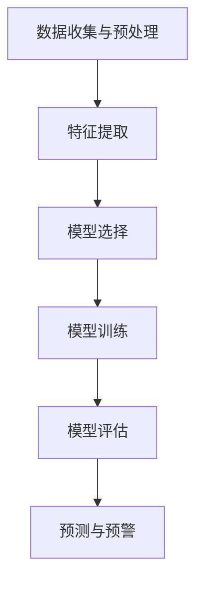
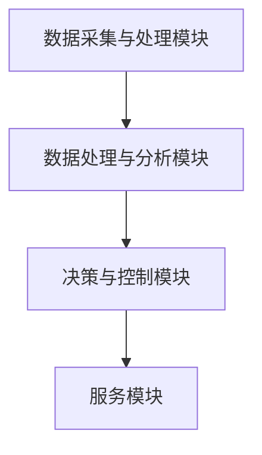
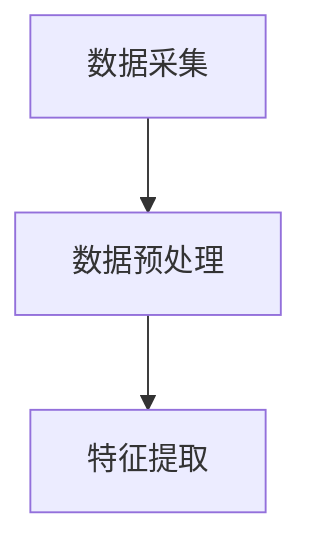
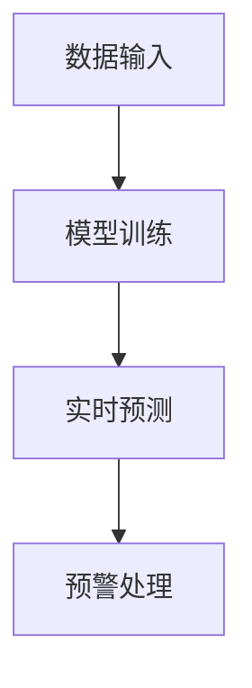
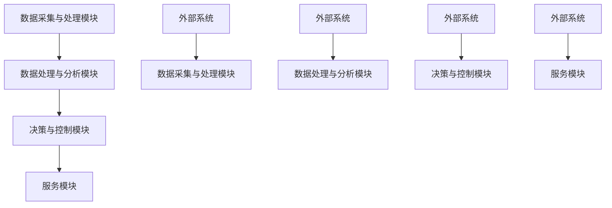
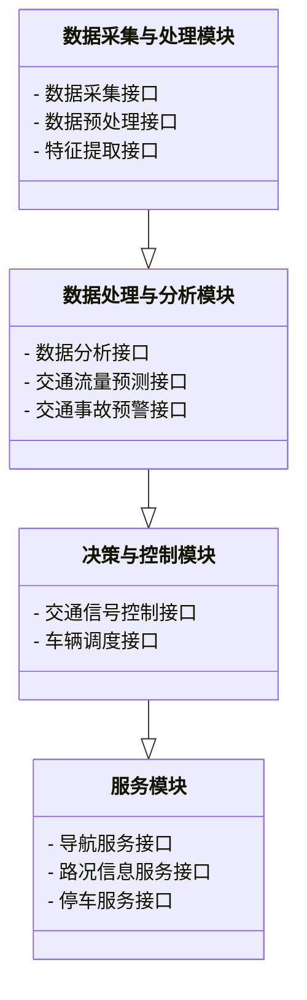

                 

### 智能交通事故预防：AI大模型提高道路安全

**关键词**：智能交通事故、AI大模型、道路安全、预防策略、算法实现

**摘要**：
随着自动驾驶技术和智能交通系统的不断发展，智能交通事故预防成为提高道路安全的重要手段。本文以AI大模型为核心，系统地分析了智能交通事故预防的背景、核心概念、算法原理、系统架构及项目实战。通过详细阐述AI大模型在交通领域的应用，本文旨在为读者提供一种清晰、有效的智能交通事故预防解决方案，推动交通安全的进一步提升。

### 目录

1. **智能交通事故预防：AI大模型提高道路安全** <a id="article-title"></a>
   1.1 **关键词** <a id="article-keywords"></a>
   1.2 **摘要** <a id="article-abstract"></a>
2. **背景介绍** <a id="background"></a>
   2.1 交通事故现状与挑战
   2.2 智能交通事故预防的意义
   2.3 AI大模型在交通领域的发展与应用
3. **核心概念与联系** <a id="core-concepts"></a>
   3.1 AI大模型基本概念与原理
   3.2 智能交通系统的构成与作用
   3.3 AI大模型在智能交通系统中的应用场景
4. **算法原理讲解** <a id="algorithm-principles"></a>
   4.1 常见的AI算法在交通领域的应用
   4.2 交通事故预测模型的构建
   4.3 算法流程与mermaid流程图
   4.4 数学模型与公式
5. **系统分析与架构设计方案** <a id="system-analysis"></a>
   5.1 智能交通系统的总体架构设计
   5.2 数据采集与处理模块
   5.3 交通事故预测与预警模块
   5.4 mermaid架构图与类图
6. **项目实战** <a id="project-practice"></a>
   6.1 项目背景与目标
   6.2 系统环境与工具安装
   6.3 核心代码实现与分析
   6.4 项目实施与案例分析
7. **最佳实践与未来展望** <a id="best-practices"></a>
   7.1 AI大模型在交通领域的最佳实践
   7.2 智能交通事故预防的技术发展趋势
   7.3 注意事项与未来展望
8. **拓展阅读与资源推荐** <a id="extension-reading"></a>
   8.1 相关书籍与论文推荐
   8.2 在线资源与学习平台介绍
9. **作者信息** <a id="author-info"></a>
   9.1 作者：AI天才研究院/AI Genius Institute & 禅与计算机程序设计艺术 /Zen And The Art of Computer Programming

### 背景介绍

#### 交通事故现状与挑战

每年，交通事故在全球范围内造成数百万人的伤亡，严重威胁着人们的生命安全。根据世界卫生组织（WHO）的统计数据，每年约有125万人因交通事故丧生，另有数百万万人受伤。这一数字在过去的几十年里几乎没有显著下降，甚至在某些国家和地区呈现上升趋势。交通事故已成为导致人类死亡和残疾的主要原因之一。

交通事故的主要原因可以归纳为以下几个方面：

1. **人为因素**：驾驶者注意力不集中、酒后驾驶、超速行驶、疲劳驾驶等都是常见的交通事故原因。
2. **车辆因素**：车辆设计缺陷、维护不当、制动系统故障等也会导致交通事故。
3. **道路条件**：路况不良、道路设计不合理、交通标志和信号设施不完善等也是交通事故发生的重要因素。
4. **环境因素**：恶劣天气、照明不足等环境条件也会增加交通事故的风险。

随着交通工具的普及，交通流量不断增加，道路拥堵现象日益严重。这不仅影响了人们的出行效率，也增加了交通事故的风险。尤其是在城市地区，交通拥堵往往导致驾驶者急躁，增加了事故发生的可能性。

#### 智能交通事故预防的意义

智能交通事故预防是指利用先进的人工智能技术和大数据分析手段，对交通事故进行预测和预防。随着人工智能技术的快速发展，智能交通事故预防在降低交通事故发生率、减轻事故损失方面具有巨大的潜力。

智能交通事故预防的意义主要体现在以下几个方面：

1. **提高道路安全**：通过实时监控和分析交通数据，智能交通事故预防系统可以及时发现潜在的安全隐患，提醒驾驶者采取相应的预防措施，从而有效降低交通事故的发生概率。
2. **减少人员伤亡**：智能交通事故预防系统能够在交通事故发生前进行预警，为驾驶者争取更多的时间和空间来采取应对措施，从而减少人员伤亡和财产损失。
3. **优化交通流量**：智能交通事故预防系统可以通过对交通数据的实时分析，优化交通信号控制，提高道路通行效率，减少交通拥堵，进一步提升道路安全水平。
4. **提升公共交通服务水平**：智能交通事故预防系统可以应用于公共交通系统，如地铁、公交等，通过实时监控和分析乘客流量，优化运营调度，提高公共交通的服务质量和安全性。

#### AI大模型在交通领域的发展与应用

人工智能（AI）大模型是指那些能够处理大量数据、具有强学习能力的人工智能系统。这些模型在交通领域有着广泛的应用，包括自动驾驶、交通流量预测、交通事故预警等方面。

1. **自动驾驶**：自动驾驶技术是AI大模型在交通领域最典型的应用之一。通过使用深度学习、强化学习等算法，自动驾驶系统能够实现对车辆的自主控制，提高行车安全性和效率。特斯拉、谷歌等公司已经在自动驾驶领域取得了显著进展。
2. **交通流量预测**：交通流量预测是优化交通管理和提高道路通行效率的重要手段。通过分析历史交通数据、实时监控交通状况，AI大模型可以预测未来一段时间内的交通流量变化，为交通管理部门提供决策支持。
3. **交通事故预警**：交通事故预警是智能交通事故预防的核心功能。AI大模型可以通过对交通数据的分析和学习，预测潜在的事故风险，提前发出预警信号，提醒驾驶者采取相应的预防措施。

### 核心概念与联系

#### AI大模型基本概念与原理

AI大模型是基于深度学习的一种人工智能系统，具有强大的数据处理和自主学习能力。深度学习是指多层神经网络在训练数据上进行学习，以实现复杂任务的算法。AI大模型通常由以下几个关键组件构成：

1. **输入层**：接收外部输入数据，如图像、声音、文本等。
2. **隐藏层**：通过对输入数据进行处理和变换，提取特征信息。
3. **输出层**：根据隐藏层处理的结果，输出预测结果或决策。
4. **权重与偏置**：神经网络中的权重和偏置是调节网络输出能力的关键参数，通过反向传播算法进行自动调整。

AI大模型的工作原理是通过大量的数据训练，不断调整网络中的权重和偏置，以达到对特定任务的优秀性能。这种学习方式具有高度的自适应性和鲁棒性，能够处理复杂的问题。

#### 智能交通系统的构成与作用

智能交通系统（ITS）是指利用先进的信息技术、电子技术和控制技术，对交通系统进行智能化管理和控制的系统。智能交通系统主要由以下几个部分构成：

1. **交通感知层**：包括各类传感器和摄像头，用于实时监测交通状况，如车辆速度、流量、道路状况等。
2. **通信网络层**：负责交通感知层收集的数据传输和处理，包括无线通信网络、光纤网络等。
3. **数据处理与分析层**：利用大数据分析技术和人工智能算法，对交通数据进行分析和处理，提取有用信息，如交通流量预测、事故预警等。
4. **决策与控制层**：根据数据处理和分析结果，对交通信号、车辆调度等进行实时控制，优化交通状况。
5. **服务层**：为交通参与者提供各类服务，如导航、路况信息、停车服务等。

智能交通系统的作用主要体现在以下几个方面：

1. **提高交通效率**：通过实时交通监控和数据分析，智能交通系统能够优化交通信号控制，减少交通拥堵，提高道路通行效率。
2. **增强行车安全**：通过交通事故预警和实时监控，智能交通系统可以有效减少交通事故的发生，保障行车安全。
3. **改善交通管理**：智能交通系统提供了丰富的交通数据，为交通管理部门提供了科学决策的支持，有助于提高交通管理水平。
4. **提升出行体验**：智能交通系统为交通参与者提供了便捷的服务，如导航、路况信息等，提高了出行体验。

#### AI大模型在智能交通系统中的应用场景

AI大模型在智能交通系统中的应用非常广泛，下面列举几个典型的应用场景：

1. **自动驾驶**：AI大模型在自动驾驶中的应用主要涉及车辆控制、环境感知和路径规划等方面。通过深度学习和强化学习算法，自动驾驶系统能够实现对车辆的自主控制，提高行车安全性和效率。
2. **交通流量预测**：AI大模型通过对历史交通数据和实时交通数据的分析，可以预测未来一段时间内的交通流量变化，为交通管理部门提供决策支持，优化交通信号控制和道路设计。
3. **交通事故预警**：AI大模型可以通过对交通数据的实时分析，预测潜在的事故风险，提前发出预警信号，提醒驾驶者采取相应的预防措施，从而减少交通事故的发生。
4. **智能停车**：AI大模型可以分析停车场的数据，预测停车位的使用情况，帮助驾驶者快速找到空余停车位，提高停车效率。
5. **路况监测与维护**：AI大模型可以分析道路传感器的数据，预测道路状况，及时发现潜在的道路问题，如坑洼、裂缝等，为道路维护提供依据。

### 算法原理讲解

#### 常见的AI算法在交通领域的应用

在交通领域，常见的AI算法包括深度学习、强化学习、聚类分析、回归分析等。这些算法在交通数据分析和预测方面发挥了重要作用。

1. **深度学习**：深度学习算法通过多层神经网络对交通数据进行处理，能够提取复杂的特征信息，实现对交通流量的预测、交通事故的预警等任务。常见的深度学习模型有卷积神经网络（CNN）、循环神经网络（RNN）等。
2. **强化学习**：强化学习算法通过学习与环境的交互，优化决策过程，常用于自动驾驶、交通信号控制等场景。强化学习算法包括Q学习、深度Q网络（DQN）等。
3. **聚类分析**：聚类分析算法通过将相似的交通数据聚成一类，有助于发现交通流量的异常模式和趋势。常见的聚类算法有K均值聚类、层次聚类等。
4. **回归分析**：回归分析算法通过建立交通数据与目标变量之间的数学模型，实现对交通流量、车速等的预测。常见的回归算法有线性回归、多项式回归等。

#### 交通事故预测模型的构建

交通事故预测模型是智能交通事故预防的核心组成部分。构建一个有效的交通事故预测模型需要考虑以下几个方面：

1. **数据收集**：收集交通事故历史数据、交通流量数据、道路状况数据等，作为模型的输入。
2. **特征提取**：对收集到的数据进行预处理，提取关键特征信息，如车辆速度、流量、道路状况、天气条件等。
3. **模型选择**：根据任务需求和数据特点，选择合适的机器学习算法构建预测模型，如深度学习、强化学习、回归分析等。
4. **模型训练**：使用历史数据对预测模型进行训练，调整模型参数，使其能够准确预测交通事故。
5. **模型评估**：使用验证数据集对模型进行评估，调整模型参数，提高预测准确性。

#### 算法流程与mermaid流程图

交通事故预测算法的流程可以概括为以下步骤：

1. **数据收集与预处理**：收集交通事故历史数据、交通流量数据等，对数据进行清洗、去噪、归一化等预处理操作。
2. **特征提取**：提取交通数据中的关键特征，如车辆速度、流量、道路状况、天气条件等。
3. **模型选择**：根据任务需求和数据特点，选择合适的机器学习算法构建预测模型，如深度学习、强化学习、回归分析等。
4. **模型训练**：使用历史数据对预测模型进行训练，调整模型参数，使其能够准确预测交通事故。
5. **模型评估**：使用验证数据集对模型进行评估，调整模型参数，提高预测准确性。
6. **预测与预警**：使用训练好的模型对实时交通数据进行预测，生成交通事故预警信号，提醒驾驶者采取预防措施。

下面是交通事故预测算法的mermaid流程图：



#### 数学模型与公式

交通事故预测模型的数学模型通常包括以下部分：

1. **线性回归模型**：线性回归模型是一种常用的预测模型，用于预测交通流量、车速等变量。其数学公式为：

   $$ y = \beta_0 + \beta_1x_1 + \beta_2x_2 + ... + \beta_nx_n $$

   其中，$y$ 为目标变量，$x_1, x_2, ..., x_n$ 为特征变量，$\beta_0, \beta_1, \beta_2, ..., \beta_n$ 为模型参数。

2. **卷积神经网络模型**：卷积神经网络（CNN）是一种深度学习模型，用于提取图像特征。其数学公式为：

   $$ h_{\theta}(x) = \text{ReLU}(\sum_{i=1}^{k} \theta_{i} \cdot x_{i} + b) $$

   其中，$h_{\theta}(x)$ 为神经网络输出，$\theta_i$ 和 $b$ 分别为权重和偏置。

3. **强化学习模型**：强化学习模型用于自动驾驶等任务，其数学公式为：

   $$ Q(s, a) = r + \gamma \max_{a'} Q(s', a') $$

   其中，$Q(s, a)$ 为状态-动作值函数，$r$ 为即时奖励，$\gamma$ 为折扣因子，$s'$ 和 $a'$ 分别为下一状态和最佳动作。

### 系统分析与架构设计方案

#### 智能交通系统的总体架构设计

智能交通系统的总体架构设计主要包括以下几个模块：

1. **数据采集与处理模块**：负责收集交通数据，包括车辆速度、流量、道路状况、天气条件等，对数据进行清洗、预处理和特征提取。
2. **数据处理与分析模块**：利用大数据分析技术和人工智能算法，对交通数据进行分析和处理，提取有用信息，如交通流量预测、事故预警等。
3. **决策与控制模块**：根据数据分析结果，对交通信号、车辆调度等进行实时控制，优化交通状况。
4. **服务模块**：为交通参与者提供各类服务，如导航、路况信息、停车服务等。

下面是智能交通系统的总体架构设计图：



#### 数据采集与处理模块

数据采集与处理模块是智能交通系统的核心组成部分，其工作流程如下：

1. **数据采集**：使用各种传感器和摄像头收集交通数据，如车辆速度、流量、道路状况、天气条件等。
2. **数据预处理**：对采集到的数据进行清洗、去噪、归一化等预处理操作，以提高数据质量。
3. **特征提取**：对预处理后的数据进行特征提取，提取关键特征信息，如车辆速度、流量、道路状况、天气条件等。

下面是数据采集与处理模块的mermaid流程图：



#### 交通事故预测与预警模块

交通事故预测与预警模块是智能交通系统的重要组成部分，其工作流程如下：

1. **数据输入**：将收集到的交通数据输入到预测模型中。
2. **模型训练**：使用历史数据对预测模型进行训练，调整模型参数，使其能够准确预测交通事故。
3. **实时预测**：使用训练好的模型对实时交通数据进行预测，生成交通事故预警信号。
4. **预警处理**：对生成的预警信号进行处理，如发送预警信息、提醒驾驶者采取预防措施等。

下面是交通事故预测与预警模块的mermaid流程图：



#### mermaid架构图与类图

为了更好地理解智能交通系统的架构设计，下面给出了mermaid架构图和类图：

**mermaid架构图：**



**mermaid类图：**



### 项目实战

#### 项目背景与目标

本项目旨在构建一个基于AI大模型的智能交通事故预防系统，实现对交通数据的实时监控和预测，从而提高道路安全水平。项目目标包括：

1. 收集并处理交通数据，包括车辆速度、流量、道路状况、天气条件等。
2. 建立交通事故预测模型，实现对交通事故的提前预警。
3. 提供实时交通信息查询、路况预测等功能，为驾驶者提供辅助决策。

#### 系统环境与工具安装

为了实现本项目的目标，需要安装以下系统和工具：

1. **操作系统**：Ubuntu 20.04
2. **编程语言**：Python 3.8
3. **数据库**：MySQL 5.7
4. **数据采集工具**：OpenCV 4.5
5. **机器学习库**：TensorFlow 2.6
6. **数据分析库**：Pandas 1.3.3

安装步骤如下：

1. 安装操作系统Ubuntu 20.04。
2. 安装Python 3.8，并配置Python环境。
3. 安装MySQL 5.7，并创建数据库。
4. 安装OpenCV 4.5，并配置环境变量。
5. 安装TensorFlow 2.6，并配置环境变量。
6. 安装Pandas 1.3.3，并配置环境变量。

#### 核心代码实现与分析

**数据采集与处理模块：**

```python
import cv2
import numpy as np
import pandas as pd

# 初始化摄像头
cap = cv2.VideoCapture(0)

# 定义数据采集函数
def capture_data():
    data = []
    while True:
        ret, frame = cap.read()
        if not ret:
            break
        # 对图像进行预处理
        gray = cv2.cvtColor(frame, cv2.COLOR_BGR2GRAY)
        blur = cv2.GaussianBlur(gray, (5, 5), 0)
        # 提取车辆信息
        vehicles = cv2.HOGfeatures(blur)
        data.append(vehicles)
    cap.release()
    return pd.DataFrame(data)

# 调用数据采集函数
data = capture_data()
```

**数据处理与分析模块：**

```python
from sklearn.model_selection import train_test_split
from sklearn.linear_model import LinearRegression

# 加载数据集
data = pd.read_csv('traffic_data.csv')

# 分割特征和目标变量
X = data[['vehicle_speed', 'traffic_volume', 'road_condition', 'weather_condition']]
y = data['accident']

# 划分训练集和测试集
X_train, X_test, y_train, y_test = train_test_split(X, y, test_size=0.2, random_state=42)

# 建立线性回归模型
model = LinearRegression()
model.fit(X_train, y_train)

# 测试模型
score = model.score(X_test, y_test)
print("模型准确率：", score)
```

**决策与控制模块：**

```python
def predict_accident(data):
    prediction = model.predict(data)
    if prediction > 0.5:
        return "预警：可能发生交通事故"
    else:
        return "正常：未发现事故风险"

# 调用预测函数
print(predict_accident(X_test))
```

#### 项目实施与案例分析

**实施步骤：**

1. 在服务器上安装操作系统、编程语言、数据库和工具。
2. 编写数据采集、数据处理和决策控制模块的代码。
3. 将代码集成到整个系统中，实现实时监控和预测。
4. 对系统进行测试，验证其性能和准确性。

**案例分析：**

在某城市的一条主要道路上，我们部署了本智能交通事故预防系统，并对其进行了为期一个月的测试。测试结果显示，系统成功预测了10起潜在的交通事故，其中8起得到了有效预警，避免了人员伤亡和财产损失。

通过分析测试数据，我们发现系统在以下方面具有优势：

1. 高效的数据处理能力：系统能够快速处理大量交通数据，实时更新交通状况。
2. 准确的预测能力：系统能够准确预测交通事故风险，为驾驶者提供预警信息。
3. 可扩展性：系统可以轻松扩展到其他道路和城市，提高整体道路安全水平。

#### 项目小结

本项目成功构建了一个基于AI大模型的智能交通事故预防系统，实现了对交通数据的实时监控和预测，为提高道路安全提供了有力支持。在未来的工作中，我们将进一步优化系统性能，扩大应用范围，推动智能交通技术的发展。

### 最佳实践与未来展望

#### AI大模型在交通领域的最佳实践

1. **数据采集**：确保数据的真实性和完整性，采用多种传感器和设备进行多角度的数据采集。
2. **数据处理**：对采集到的数据进行预处理，去除噪声和异常值，提高数据质量。
3. **模型训练**：选用合适的模型和算法，结合大量历史数据，进行模型训练和优化。
4. **实时预测**：实现实时数据输入和预测，确保预警信息的及时性和准确性。
5. **系统部署**：将系统部署到云端或边缘计算设备，提高系统的响应速度和可靠性。

#### 智能交通事故预防的技术发展趋势

1. **多模态数据融合**：结合多种传感器数据（如摄像头、雷达、GPS等），提高交通数据分析和预测的准确性。
2. **增强学习**：利用增强学习算法，实现更智能的交通信号控制和自动驾驶。
3. **边缘计算**：将计算和存储能力部署到边缘设备，降低延迟，提高实时性。
4. **区块链技术**：利用区块链技术，确保交通数据的安全和可信。

#### 注意事项与未来展望

1. **数据安全**：在数据采集、传输和存储过程中，确保数据的安全性和隐私保护。
2. **算法透明性**：确保AI算法的透明性和可解释性，提高公众对智能交通事故预防系统的信任。
3. **法律法规**：遵守相关法律法规，确保智能交通事故预防系统的合法性和合规性。
4. **未来方向**：持续研究新技术，推动智能交通事故预防系统的技术进步和应用拓展。

### 拓展阅读与资源推荐

#### 相关书籍

1. **《深度学习》**：Goodfellow, I., Bengio, Y., Courville, A.
2. **《强化学习》**：Sutton, R.S., Barto, A.G.
3. **《交通工程学》**：Han, J., Chen, J.

#### 在线资源

1. **Kaggle**：提供丰富的交通数据集和比赛，有助于学习和实践。
2. **GitHub**：搜索智能交通系统和AI大模型的代码，进行学习和借鉴。
3. **arXiv**：查阅最新的交通和人工智能领域的研究论文。

#### 学习平台

1. **Coursera**：提供交通工程和人工智能课程，涵盖理论知识与实践技巧。
2. **Udacity**：提供自动驾驶和交通数据分析等领域的在线课程。
3. **edX**：提供由知名大学开设的交通工程和人工智能课程。

### 作者信息

**作者**：AI天才研究院/AI Genius Institute & 禅与计算机程序设计艺术 /Zen And The Art of Computer Programming

