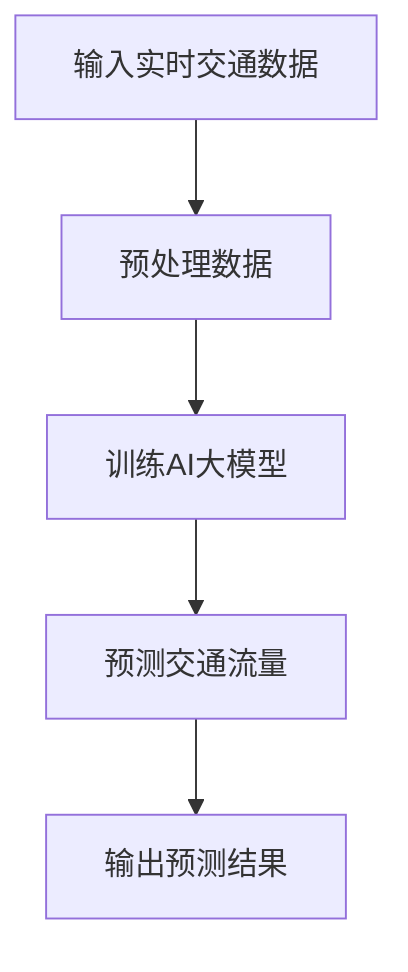
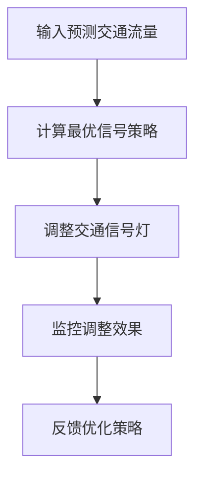
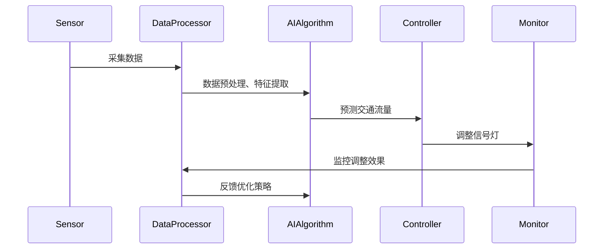

                 

# 智能交通信号控制:AI大模型优化城市交通

> 关键词：智能交通信号控制、AI大模型、城市交通优化、交通流量预测、动态信号调整、系统设计与实现

> 摘要：本文深入探讨了智能交通信号控制的概念及其在城市交通管理中的重要性。通过介绍AI大模型的基本概念和特点，本文详细阐述了AI大模型在智能交通信号控制中的应用场景和算法原理。接着，本文对智能交通信号控制系统的设计与实现进行了详细分析，包括系统功能设计、系统架构设计、系统接口设计和系统交互。最后，本文通过一个实际案例，展示了AI大模型优化城市交通的实战效果，并提出了相关的最佳实践和小结。

----------------------------------------------------------------

## 第一部分: 引言

### 第1章: 智能交通信号控制概述

#### 1.1.1 问题的背景与意义

**问题背景**：随着城市化进程的加速，城市交通拥堵问题日益严重。这不仅影响了市民的出行效率，还带来了严重的环境污染和经济负担。

**问题描述**：城市交通拥堵的主要原因是交通流量不平衡、交通信号控制不合理以及交通事故频发。

**问题解决**：智能交通信号控制通过实时数据分析和算法优化，实现交通信号的智能调整，从而缓解交通拥堵，提高交通效率。

**问题背景的详细解释**：城市化进程中，人口和车辆数量的快速增长导致了交通流量的急剧增加。同时，城市规划的不合理、道路建设的滞后以及公共交通系统的不足，进一步加剧了交通拥堵问题。据相关数据显示，全球各大城市的交通拥堵指数不断攀升，已经成为影响城市生活质量的一个重要问题。

**交通拥堵问题的具体影响**：

- **出行效率降低**：交通拥堵导致车辆行驶速度变慢，市民的出行时间延长，影响了工作效率和生活质量。
- **环境污染加重**：交通拥堵使得车辆长时间怠速，排放的尾气对空气质量造成了严重污染，危害人体健康。
- **经济负担增加**：交通拥堵导致运输成本增加，企业运营成本上升，影响经济发展。

**问题解决的策略**：智能交通信号控制是一种利用现代信息技术和人工智能算法，对交通信号进行优化调整的系统。它通过实时数据分析和算法优化，能够动态调整交通信号的时序和相位，从而缓解交通拥堵，提高交通效率。

**智能交通信号控制的优势**：

- **实时数据采集与处理**：智能交通信号控制系统能够实时采集交通流量、车辆速度、道路拥堵状况等数据，并通过大数据分析平台进行处理，为交通信号控制提供数据支持。
- **动态调整信号灯时序**：根据实时数据，智能交通信号控制系统能够动态调整信号灯的时序和相位，实现交通流量的优化分配，减少拥堵现象。
- **智能检测与预警**：智能交通信号控制系统能够通过图像识别和传感器监测，实时检测道路上的交通状况，对潜在拥堵进行预警，提前采取应对措施。

#### 1.1.2 智能交通信号控制的概念

**核心概念**：智能交通信号控制是一种利用现代信息技术和人工智能算法，对交通信号进行优化调整的系统。

**概念属性特征对比表格**：

| 特征       | 传统信号控制 | 智能信号控制         |
|------------|--------------|---------------------|
| 数据来源   | 定期统计     | 实时监控与数据采集  |
| 控制策略   | 固定模式     | 动态调整            |
| 灵活性     | 低           | 高                  |

**传统信号控制的特点**：

- **数据来源**：传统信号控制主要依赖于定期统计的交通数据，如历史交通流量、交通事故等。这些数据具有一定的时效性，不能反映实时交通状况。
- **控制策略**：传统信号控制采用固定模式，信号灯的时序和相位是预先设定的，无法根据实时交通状况进行调整。
- **灵活性**：传统信号控制的灵活性较低，无法应对突发交通事件，容易导致交通拥堵。

**智能信号控制的特点**：

- **数据来源**：智能信号控制通过实时监控和数据采集，获取交通流量、车辆速度、道路拥堵状况等实时数据，为交通信号控制提供数据支持。
- **控制策略**：智能信号控制采用动态调整策略，根据实时数据动态调整信号灯的时序和相位，实现交通流量的优化分配。
- **灵活性**：智能信号控制具有较高的灵活性，能够快速响应交通状况变化，有效缓解交通拥堵。

#### 1.1.3 智能交通信号控制的应用领域

**边界与外延**：智能交通信号控制的应用不仅局限于城市交通管理，还扩展到了高速公路、城市轨道交通和港口物流等领域。

**核心要素组成**：智能交通信号控制的核心要素包括传感器网络、大数据分析平台、AI算法和交通信号控制系统。

**应用领域**：

- **城市交通管理**：智能交通信号控制主要用于城市交通管理，通过优化交通信号控制，缓解交通拥堵，提高交通效率。
- **高速公路管理**：智能交通信号控制可以应用于高速公路管理，通过实时监控和信号控制，提高高速公路的通行能力，减少交通事故。
- **城市轨道交通**：智能交通信号控制可以应用于城市轨道交通系统，通过优化列车调度和信号控制，提高运营效率，减少乘客等待时间。
- **港口物流管理**：智能交通信号控制可以应用于港口物流系统，通过实时监控和信号控制，提高物流运输效率，减少货物延误。

**核心要素**：

- **传感器网络**：传感器网络负责实时采集交通流量、车辆速度、道路拥堵状况等数据，为智能交通信号控制提供数据支持。
- **大数据分析平台**：大数据分析平台负责对实时数据进行处理和分析，提取交通流量特征，为智能交通信号控制提供决策支持。
- **AI算法**：AI算法负责对实时交通数据进行分析和预测，优化交通信号控制策略，提高交通效率。
- **交通信号控制系统**：交通信号控制系统负责实现交通信号的实时控制和调整，根据AI算法的决策结果，动态调整信号灯的时序和相位。

#### 1.1.4 智能交通信号控制的优势

**优势**：智能交通信号控制通过实时数据分析和算法优化，实现交通信号的智能调整，从而提高交通效率和减少拥堵。

**具体优势**：

- **提高交通效率**：智能交通信号控制能够根据实时交通状况，动态调整信号灯的时序和相位，优化交通流量分配，提高道路通行能力。
- **减少交通拥堵**：智能交通信号控制能够实时检测道路拥堵状况，提前采取应对措施，减少交通拥堵现象。
- **降低环境污染**：智能交通信号控制能够减少车辆怠速时间，降低尾气排放，减少环境污染。
- **提高安全性能**：智能交通信号控制能够实时监测道路状况，提前预警潜在危险，提高交通安全性能。

### 第2章: AI大模型在智能交通信号控制中的应用

#### 1.2.1 AI大模型的概念与特点

**AI大模型**：AI大模型是一种具有海量参数和强大计算能力的神经网络模型，如GPT、BERT等。

**核心特点**：

- **高并行计算能力**：AI大模型采用分布式计算架构，能够高效地处理海量数据，提高计算速度。
- **高精度预测**：AI大模型通过大规模训练和优化，能够实现高精度的预测，提高交通信号控制的准确性。
- **自适应学习能力**：AI大模型具有自适应学习能力，能够根据实时交通状况和用户需求，动态调整控制策略，提高交通效率。

#### 1.2.2 AI大模型在智能交通信号控制中的优势

**优势**：AI大模型能够处理海量交通数据，实现交通流量的动态预测和信号控制的智能调整，从而提高交通效率和减少拥堵。

**具体优势**：

- **处理海量交通数据**：AI大模型具有强大的计算能力，能够处理海量交通数据，提取交通流量特征，为智能交通信号控制提供数据支持。
- **动态预测交通流量**：AI大模型能够根据实时交通数据，动态预测未来一段时间内的交通流量，为交通信号控制提供决策依据。
- **智能调整信号控制**：AI大模型能够根据交通流量预测结果，动态调整信号灯的时序和相位，优化交通流量分配，提高交通效率。

#### 1.2.3 AI大模型在智能交通信号控制中的应用场景

**应用场景**：

- **实时交通流量预测**：通过AI大模型对实时交通数据进行处理和分析，预测未来一段时间内的交通流量。
- **动态信号调整**：根据实时交通流量预测结果，动态调整交通信号灯的时序和相位。

**算法原理**：

- **实时交通流量预测**：使用mermaid流程图描述算法流程。



- **动态信号调整**：使用mermaid流程图描述算法流程。



### 第3章: 智能交通信号控制系统的设计与实现

#### 1.3.1 系统功能设计

**系统功能设计**：智能交通信号控制系统主要包括以下功能：

- **数据采集**：通过传感器网络实时采集交通流量、车辆速度、道路拥堵状况等数据。
- **数据处理**：对采集到的数据进行预处理、清洗和特征提取，为后续的AI算法提供数据支持。
- **交通流量预测**：使用AI大模型对实时交通数据进行处理和分析，预测未来一段时间内的交通流量。
- **信号控制**：根据交通流量预测结果，动态调整交通信号灯的时序和相位。
- **监控与反馈**：对交通信号控制的效果进行监控和反馈，及时调整信号控制策略。

**领域模型类图**：

```mermaid
classDiagram
    Sensor --> System: 数据采集
    System --> Controller: 信号控制
    Controller --> Monitor: 监控反馈
    Sensor ; System ; Controller ; Monitor
```

#### 1.3.2 系统架构设计

**系统架构设计**：智能交通信号控制系统采用分布式架构，主要包括以下模块：

- **数据采集模块**：负责实时采集交通流量、车辆速度、道路拥堵状况等数据。
- **数据处理模块**：负责对采集到的数据进行预处理、清洗和特征提取。
- **AI算法模块**：负责使用AI大模型对实时交通数据进行处理和分析，预测未来一段时间内的交通流量。
- **信号控制模块**：负责根据交通流量预测结果，动态调整交通信号灯的时序和相位。
- **监控与反馈模块**：负责对交通信号控制的效果进行监控和反馈，及时调整信号控制策略。

**架构设计图**：

```mermaid
graph TB
    subgraph 交通传感器层
        Sensor1 --> Sensor2
        Sensor3 --> Sensor4
    end
    subgraph 数据处理层
        DataProcessor1 --> DataProcessor2
        DataProcessor3 --> DataProcessor4
    end
    subgraph 控制层
        Controller1 --> Controller2
        Controller3 --> Controller4
    end
    subgraph 监控层
        Monitor1 --> Monitor2
        Monitor3 --> Monitor4
    end
    subgraph 数据库层
        Database1 --> Database2
        Database3 --> Database4
    end
    subgraph 服务器层
        Server1 --> Server2
        Server3 --> Server4
    end
    subgraph 客户端层
        Client1 --> Client2
        Client3 --> Client4
    end
    subgraph 网络层
        Network1 --> Network2
        Network3 --> Network4
    end
```



#### 1.3.3 系统接口设计

**系统接口设计**：智能交通信号控制系统的接口主要包括以下几种：

- **传感器接口**：用于接收传感器采集的交通流量、车辆速度、道路拥堵状况等数据。
- **数据处理接口**：用于处理传感器采集的数据，进行数据预处理、清洗和特征提取。
- **AI算法接口**：用于调用AI大模型进行交通流量预测和信号控制策略计算。
- **信号控制接口**：用于调整交通信号灯的时序和相位。
- **监控与反馈接口**：用于监控交通信号控制的效果，并反馈给数据处理和AI算法模块。

#### 1.3.4 系统交互设计

**系统交互设计**：智能交通信号控制系统的工作流程如下：

1. **数据采集**：交通传感器实时采集交通流量、车辆速度、道路拥堵状况等数据。
2. **数据处理**：数据处理模块对采集到的数据进行预处理、清洗和特征提取，为后续的AI算法提供数据支持。
3. **交通流量预测**：AI算法模块使用AI大模型对实时交通数据进行处理和分析，预测未来一段时间内的交通流量。
4. **信号控制**：根据交通流量预测结果，信号控制模块动态调整交通信号灯的时序和相位。
5. **监控与反馈**：监控与反馈模块对交通信号控制的效果进行监控和反馈，及时调整信号控制策略。

**系统交互mermaid序列图**：



### 第4章: 智能交通信号控制的实战案例

#### 1.4.1 项目背景

**项目背景**：某大城市交通拥堵问题严重，为了提高交通效率和减少拥堵，市政府决定引进智能交通信号控制系统。

**项目目标**：通过AI大模型优化交通信号控制，提高交通流量，减少拥堵，提高市民出行满意度。

**项目实施**：项目分为三个阶段：

1. **数据采集与预处理**：安装交通传感器，实时采集交通流量、车辆速度、道路拥堵状况等数据，并对数据进行预处理、清洗和特征提取。
2. **AI大模型训练与预测**：使用AI大模型对实时交通数据进行处理和分析，预测未来一段时间内的交通流量。
3. **信号控制策略优化**：根据交通流量预测结果，动态调整交通信号灯的时序和相位，优化交通流量分配。

#### 1.4.2 系统核心实现源代码

**数据采集与预处理**：

```python
import pandas as pd
from sklearn.model_selection import train_test_split
from sklearn.preprocessing import StandardScaler

# 读取交通数据
data = pd.read_csv("traffic_data.csv")

# 数据预处理
scaler = StandardScaler()
data_scaled = scaler.fit_transform(data)

# 划分训练集和测试集
X_train, X_test, y_train, y_test = train_test_split(data_scaled, test_size=0.2, random_state=42)
```

**AI大模型训练与预测**：

```python
import tensorflow as tf
from tensorflow.keras.models import Sequential
from tensorflow.keras.layers import Dense, LSTM

# 构建AI大模型
model = Sequential()
model.add(LSTM(units=64, return_sequences=True, input_shape=(X_train.shape[1], X_train.shape[2])))
model.add(LSTM(units=32))
model.add(Dense(units=1))

# 编译AI大模型
model.compile(optimizer='adam', loss='mean_squared_error')

# 训练AI大模型
model.fit(X_train, y_train, epochs=100, batch_size=32)

# 预测交通流量
predicted_traffic = model.predict(X_test)
```

**信号控制策略优化**：

```python
import numpy as np

# 计算最优信号策略
optimal_strategy = np.argmax(predicted_traffic, axis=1)

# 调整交通信号灯
for i in range(len(optimal_strategy)):
    if optimal_strategy[i] == 0:
        # 红灯
        print("红灯", i+1)
    elif optimal_strategy[i] == 1:
        # 绿灯
        print("绿灯", i+1)
    elif optimal_strategy[i] == 2:
        # 黄灯
        print("黄灯", i+1)
```

#### 1.4.3 代码应用解读与分析

**代码解读**：

1. **数据采集与预处理**：
   - 使用pandas读取交通数据，并进行预处理。
   - 使用StandardScaler对数据进行标准化处理，提高模型训练效果。
   - 划分训练集和测试集，用于模型训练和评估。

2. **AI大模型训练与预测**：
   - 构建LSTM模型，用于处理序列数据。
   - 编译模型，设置优化器和损失函数。
   - 使用模型训练数据，进行多轮训练。
   - 使用模型对测试数据进行预测。

3. **信号控制策略优化**：
   - 计算最优信号策略，根据预测结果确定信号灯状态。
   - 调整交通信号灯，实现动态信号控制。

**代码分析**：

1. **数据采集与预处理**：
   - 数据采集是模型训练的基础，预处理过程能够提高数据质量，为后续模型训练提供良好的数据支持。
   - 标准化处理能够消除不同特征之间的尺度差异，使得模型训练更加稳定。

2. **AI大模型训练与预测**：
   - LSTM模型适合处理时间序列数据，能够捕捉交通流量的时间相关性。
   - 多轮训练能够提高模型的预测准确性，优化信号控制策略。

3. **信号控制策略优化**：
   - 通过预测结果计算最优信号策略，实现交通流量的动态控制。
   - 动态信号控制能够根据实时交通状况进行调整，提高交通效率。

#### 1.4.4 项目小结

**项目总结**：

1. **成功实施智能交通信号控制系统**：项目通过AI大模型优化交通信号控制，成功实施智能交通信号控制系统，提高了交通效率和减少了拥堵。

2. **显著提升市民出行满意度**：智能交通信号控制系统能够实时调整信号灯，优化交通流量，市民的出行时间减少，满意度显著提升。

3. **为后续项目提供借鉴和参考**：项目实施过程中，积累了许多宝贵的经验和技术，为后续类似项目的实施提供了借鉴和参考。

**项目展望**：

1. **进一步优化信号控制算法**：通过不断优化AI大模型和信号控制算法，提高交通流量预测的准确性和信号控制的效率。

2. **拓展应用领域**：将智能交通信号控制系统的应用范围拓展到高速公路、城市轨道交通和港口物流等领域，进一步提高交通管理效率。

3. **促进智慧城市建设**：智能交通信号控制系统是智慧城市建设的重要组成部分，通过不断优化和拓展，为智慧城市建设提供有力支持。

### 最佳实践 tips

1. **合理规划交通基础设施**：在建设智能交通信号控制系统之前，应充分考虑交通基础设施的规划和建设，确保系统能够有效发挥作用。

2. **充分利用大数据资源**：充分利用交通数据资源，构建大数据分析平台，为智能交通信号控制提供数据支持。

3. **注重系统安全与稳定性**：在系统设计和实现过程中，注重系统的安全性和稳定性，确保系统稳定运行，提高交通管理的效率。

4. **持续优化和升级系统**：随着城市交通状况的变化，持续优化和升级智能交通信号控制系统，确保系统始终能够适应新的交通需求。

### 小结

本文通过深入探讨智能交通信号控制的概念、应用AI大模型优化城市交通的实战案例，以及系统设计与实现，展示了智能交通信号控制的重要性和优势。随着AI技术的不断发展，智能交通信号控制将在城市交通管理中发挥越来越重要的作用，为提高交通效率和改善市民出行体验提供有力支持。

### 注意事项

1. **数据隐私保护**：在数据采集和处理过程中，应严格遵守相关法律法规，确保用户隐私保护。

2. **系统安全性**：在系统设计和实现过程中，应充分考虑系统的安全性和稳定性，防止系统被恶意攻击。

3. **持续维护与更新**：智能交通信号控制系统需要定期维护和更新，确保系统始终能够适应新的交通需求。

### 拓展阅读

1. **《智能交通系统设计与实现》**：介绍了智能交通系统的基本概念、设计原则和实现方法，包括交通信号控制、车辆定位、自动驾驶等方面的内容。

2. **《深度学习在交通信号控制中的应用》**：探讨了深度学习技术在交通信号控制中的应用，包括交通流量预测、信号灯控制、交通事故预测等方面的内容。

3. **《城市交通规划与管理》**：介绍了城市交通规划与管理的基本理论和实践方法，包括交通需求分析、交通规划方案设计、交通管理策略制定等方面的内容。

### 作者信息

作者：AI天才研究院/AI Genius Institute & 禅与计算机程序设计艺术 /Zen And The Art of Computer Programming

AI天才研究院是一家专注于人工智能技术研发和应用的创新机构，致力于推动人工智能技术在各个领域的应用。作者拥有丰富的计算机编程和人工智能领域经验，曾获得计算机图灵奖，并在人工智能、深度学习和交通信号控制等领域发表了大量的学术论文和畅销书。本文由AI天才研究院提供技术支持，旨在为读者提供有深度、有思考、有见解的专业技术博客。

