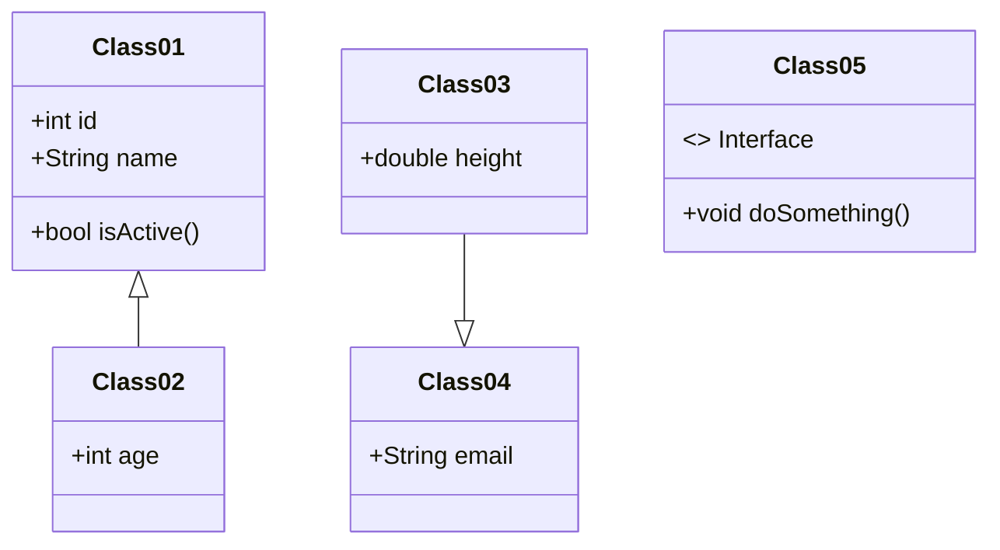
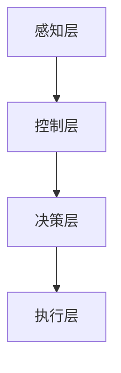
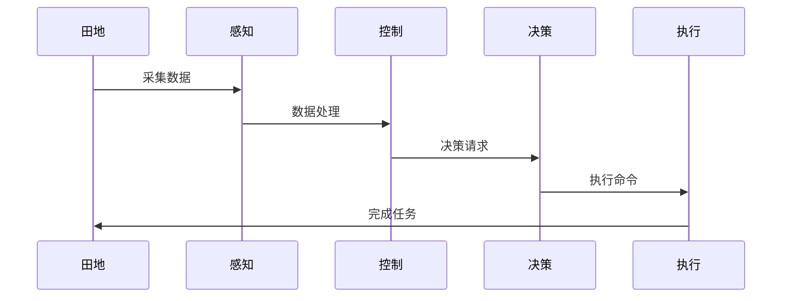

                 


### 智能农业机器人：AI驱动的精准耕作

关键词：智能农业、机器人技术、AI驱动、精准耕作、算法讲解

摘要：本文深入探讨了智能农业机器人技术在精准耕作中的应用，通过分析智能农业的定义与重要性、机器人技术在农业中的应用、智能农业机器人的发展现状以及AI驱动在精准耕作中的应用，详细介绍了智能农业机器人的核心技术、算法原理、系统架构设计以及实际应用案例。本文旨在为读者提供关于智能农业机器人技术的全面了解，并探讨其在未来农业发展中的潜在影响。

## 目录大纲：智能农业机器人：AI驱动的精准耕作

----------------------------------------------------------------

### 第一部分：背景与概述

#### 第1章：智能农业与机器人技术概述

##### 1.1 智能农业的定义与重要性

##### 1.2 机器人技术在农业中的应用

##### 1.3 智能农业机器人的发展现状

##### 1.4 AI驱动在精准耕作中的应用

#### 第2章：智能农业机器人的核心概念与联系

##### 2.1 核心概念

##### 2.2 概念属性特征对比表格

##### 2.3 ER实体关系图架构

### 第二部分：技术原理与算法讲解

#### 第3章：智能农业机器人的核心技术

##### 3.1 感知技术

##### 3.2 机器人控制技术

##### 3.3 数据处理与分析技术

#### 第4章：AI驱动精准耕作的算法原理

##### 4.1 机器学习算法

##### 4.2 深度学习算法

##### 4.3 算法讲解与Python源代码

### 第三部分：系统分析与架构设计

#### 第5章：智能农业机器人系统架构设计

##### 5.1 问题场景介绍

##### 5.2 项目介绍

##### 5.3 系统功能设计（领域模型类图）

##### 5.4 系统架构设计（架构图）

##### 5.5 系统接口设计和系统交互（序列图）

### 项目实战

#### 第6章：环境安装与系统核心实现

##### 6.1 环境安装

##### 6.2 系统核心实现源代码

##### 6.3 代码应用解读与分析

##### 6.4 实际案例分析与详细讲解剖析

##### 6.5 项目小结

### 最佳实践 Tips

#### 小结

#### 注意事项

#### 拓展阅读

----------------------------------------------------------------

### 第一部分：背景与概述

## 第1章：智能农业与机器人技术概述

### 1.1 智能农业的定义与重要性

智能农业是指利用信息技术、物联网、人工智能等现代技术手段，实现农业生产过程的自动化、智能化和高效化。随着全球人口的增长和耕地资源的减少，提高农业生产效率成为各国农业发展的关键。智能农业不仅能够提高农产品的产量和质量，还可以减少资源浪费，降低农业生产成本，具有非常重要的现实意义。

#### 问题背景

传统的农业生产方式主要依赖于人力和牲畜，这种方式效率低、成本高，且易受天气和自然灾害的影响。随着科技的发展，人们开始探索如何将先进的科技手段应用于农业，以提高生产效率和降低生产成本。智能农业应运而生。

#### 问题描述

智能农业的定义是什么？它的重要性体现在哪些方面？

#### 问题解决

智能农业的定义：智能农业是指利用信息技术、物联网、人工智能等现代技术手段，实现农业生产过程的自动化、智能化和高效化。

智能农业的重要性：

1. 提高农业生产效率：通过智能化的手段，可以实现农作物的精准灌溉、施肥、病虫害防治等，从而提高产量和质量。

2. 降低农业生产成本：智能农业可以减少劳动力成本，降低农药和化肥的使用量，降低农业生产成本。

3. 减少资源浪费：智能农业可以实现资源的精确管理和利用，减少水、肥、药等资源的浪费。

4. 促进农业可持续发展：智能农业可以实现农作物的精准种植和养殖，降低环境污染，促进农业的可持续发展。

#### 边界与外延

智能农业不仅包括传统的种植和养殖，还涵盖了农产品加工、物流、销售等环节。它的边界是广泛的，涵盖了整个农业生产过程。

#### 概念结构与核心要素组成

智能农业的概念结构主要由以下几个核心要素组成：

1. 信息技术：包括传感器技术、物联网技术、大数据技术等，用于实现对农业生产过程的实时监测和控制。

2. 物联网技术：通过物联网设备，实现农业设备、农产品、农业环境等信息的互联互通。

3. 人工智能技术：通过机器学习、深度学习等人工智能技术，实现对农业生产数据的分析和预测，为农业生产提供决策支持。

4. 自动化技术：通过自动化技术，实现农业生产的自动化操作，提高生产效率。

5. 精准农业技术：通过精准农业技术，实现农作物的精准种植、精准施肥、精准灌溉等，提高农业生产效益。

### 1.2 机器人技术在农业中的应用

机器人技术在农业中的应用，主要表现在农田管理、农作物收割、农产品采摘等方面。机器人技术具有自动化、精准化和高效化的特点，可以显著提高农业生产效率，降低劳动力成本。

#### 问题背景

传统的农业劳动力短缺，且农业生产过程繁重、效率低下。随着科技的发展，人们开始探索如何将机器人技术应用于农业，以提高生产效率和降低生产成本。

#### 问题描述

机器人技术在农业中的应用有哪些？它如何提高农业生产效率？

#### 问题解决

机器人技术在农业中的应用：

1. 农田管理：机器人可以进行农田的深耕、松土、施肥等操作，提高农田的肥力。

2. 农作物收割：机器人可以进行农作物的收割，减少劳动力成本，提高收割效率。

3. 农产品采摘：机器人可以进行水果、蔬菜等农产品的采摘，提高采摘效率和农产品质量。

机器人技术如何提高农业生产效率：

1. 自动化操作：机器人可以自动化执行农业生产任务，减少人力操作，提高工作效率。

2. 精准操作：机器人可以进行精确的操作，如精准施肥、精准灌溉等，提高农产品产量和质量。

3. 节省劳动力：机器人可以替代人力进行农业生产，降低劳动力成本。

#### 边界与外延

机器人技术在农业中的应用边界是广泛的，涵盖了农田管理、农作物收割、农产品采摘等多个环节。它的外延包括农业生产的全过程，从农田准备到农产品收获。

#### 概念结构与核心要素组成

机器人技术在农业中的应用，主要由以下几个核心要素组成：

1. 机器人硬件：包括机器人本体、传感器、执行器等，用于实现农业生产的自动化操作。

2. 机器人软件：包括机器人操作系统、控制算法、数据处理算法等，用于控制机器人的运动和执行任务。

3. 物联网技术：通过物联网设备，实现机器人与农业设备的互联互通。

4. 人工智能技术：通过人工智能技术，实现机器人的智能决策和任务执行。

5. 数据分析技术：通过数据分析技术，对农业生产数据进行分析，为农业生产提供决策支持。

### 1.3 智能农业机器人的发展现状

智能农业机器人技术的发展，经历了从简单到复杂、从单一功能到多功能、从实验室研究到实际应用的历程。目前，智能农业机器人技术已经取得了一定的成果，并在农业生产中得到广泛应用。

#### 问题背景

智能农业机器人技术的发展，是农业现代化和科技发展的必然趋势。随着技术的不断进步，智能农业机器人技术的应用前景越来越广阔。

#### 问题描述

智能农业机器人的发展现状如何？它在农业生产中的应用有哪些成果？

#### 问题解决

智能农业机器人的发展现状：

1. 技术成熟度：智能农业机器人技术已经从实验室研究走向实际应用，许多智能农业机器人产品已经问世。

2. 应用范围：智能农业机器人已经广泛应用于农田管理、农作物收割、农产品采摘等多个领域。

3. 成果显著：智能农业机器人技术在提高农业生产效率、降低劳动力成本、提高农产品质量等方面取得了显著成果。

智能农业机器人在农业生产中的应用成果：

1. 农田管理：智能农业机器人可以进行深耕、松土、施肥等操作，提高农田的肥力，降低病虫害发生。

2. 农作物收割：智能农业机器人可以进行农作物的收割，减少劳动力成本，提高收割效率。

3. 农产品采摘：智能农业机器人可以进行水果、蔬菜等农产品的采摘，提高采摘效率和农产品质量。

#### 边界与外延

智能农业机器人技术的发展，边界是广泛的，涵盖了农田管理、农作物收割、农产品采摘等多个环节。它的外延包括农业生产的全过程，从农田准备到农产品收获。

#### 概念结构与核心要素组成

智能农业机器人的概念结构主要由以下几个核心要素组成：

1. 机器人硬件：包括机器人本体、传感器、执行器等，用于实现农业生产的自动化操作。

2. 机器人软件：包括机器人操作系统、控制算法、数据处理算法等，用于控制机器人的运动和执行任务。

3. 物联网技术：通过物联网设备，实现机器人与农业设备的互联互通。

4. 人工智能技术：通过人工智能技术，实现机器人的智能决策和任务执行。

5. 数据分析技术：通过数据分析技术，对农业生产数据进行分析，为农业生产提供决策支持。

### 1.4 AI驱动在精准耕作中的应用

精准耕作是智能农业的核心技术之一，它利用人工智能技术对农业生产过程进行实时监测、分析和决策，实现农作物的精准种植、精准施肥和精准灌溉。AI驱动在精准耕作中的应用，极大地提高了农业生产效率，降低了农业生产成本。

#### 问题背景

传统的农业生产方式主要依赖于经验和人工，难以实现精确的种植、施肥和灌溉。随着人工智能技术的不断发展，人们开始探索如何将人工智能技术应用于精准耕作，以提高农业生产效率。

#### 问题描述

AI驱动在精准耕作中的应用是什么？它如何提高农业生产效率？

#### 问题解决

AI驱动在精准耕作中的应用：

1. 数据采集与处理：利用传感器技术，采集土壤、气象、作物生长等数据，并通过人工智能算法进行数据分析和处理。

2. 精准种植：根据土壤数据、气象数据和作物生长数据，通过人工智能算法确定最佳的种植方案，实现农作物的精准种植。

3. 精准施肥：根据土壤养分数据、作物生长数据和气象数据，通过人工智能算法确定最佳的施肥方案，实现农作物的精准施肥。

4. 精准灌溉：根据土壤水分数据、作物生长数据和气象数据，通过人工智能算法确定最佳的灌溉方案，实现农作物的精准灌溉。

AI驱动如何提高农业生产效率：

1. 提高种植效果：通过精准种植，实现农作物的最佳生长环境，提高种植效果。

2. 提高施肥效果：通过精准施肥，实现养分的最佳利用，提高肥料利用率。

3. 提高灌溉效果：通过精准灌溉，实现水资源的最佳利用，提高灌溉效果。

#### 边界与外延

AI驱动在精准耕作中的应用边界是广泛的，涵盖了土壤监测、气象监测、作物生长监测等多个环节。它的外延包括农业生产的全过程，从农田准备到农产品收获。

#### 概念结构与核心要素组成

AI驱动在精准耕作中的应用，主要由以下几个核心要素组成：

1. 传感器技术：用于采集土壤、气象、作物生长等数据。

2. 人工智能技术：用于对采集到的数据进行处理和分析，确定最佳种植、施肥和灌溉方案。

3. 数据库技术：用于存储和管理农业生产数据。

4. 控制技术：用于根据人工智能算法的决策，控制农作物的种植、施肥和灌溉。

5. 决策支持技术：用于为农业生产提供决策支持，实现精准耕作。

## 第2章：智能农业机器人的核心概念与联系

### 2.1 核心概念

智能农业机器人是由传感器、执行器、控制器和人工智能算法等组成的，用于执行农业生产任务的机器人系统。它可以通过感知、决策和执行等过程，实现对农作物的精准管理，提高农业生产效率。

### 2.2 概念属性特征对比表格

| 概念         | 特征1   | 特征2   | 特征3   | 关联关系 |
| ------------ | ------ | ------ | ------ | ------- |
| 智能农业     | ...    | ...    | ...    | ...     |
| 机器人技术   | ...    | ...    | ...    | ...     |
| 精准耕作     | ...    | ...    | ...    | ...     |

### 2.3 ER实体关系图架构

```mermaid
erDiagram
    智能农业 ||--|{ 机器人技术 }
    机器人技术 ||--|{ 精准耕作 }
```

## 第二部分：技术原理与算法讲解

### 第3章：智能农业机器人的核心技术

#### 3.1 感知技术

感知技术是智能农业机器人的核心，它主要用于收集土壤、气象、作物生长等数据，为机器人的决策提供依据。感知技术的核心是传感器，传感器可以测量土壤的湿度、温度、pH值，还可以测量空气的温度、湿度、风速等参数。这些数据通过传感器传输到机器人控制器，机器人控制器根据这些数据做出相应的决策。

#### 3.2 机器人控制技术

机器人控制技术是智能农业机器人的关键技术之一，它用于控制机器人的运动和执行任务。机器人控制技术包括以下几个方面：

1. 运动控制：通过控制电机和传动系统，实现机器人的移动和转向。

2. 任务控制：根据传感器采集的数据和人工智能算法的决策，控制机器人执行相应的任务，如深耕、松土、施肥、灌溉等。

3. 故障诊断：通过监测机器人的工作状态，实现故障的实时诊断和修复。

#### 3.3 数据处理与分析技术

数据处理与分析技术是智能农业机器人的核心，它用于对传感器采集的数据进行处理和分析，为机器人的决策提供支持。数据处理与分析技术包括以下几个方面：

1. 数据采集：通过传感器采集土壤、气象、作物生长等数据。

2. 数据预处理：对采集到的数据进行清洗、去噪、滤波等预处理，提高数据的准确性。

3. 数据分析：利用机器学习、深度学习等技术，对预处理后的数据进行分析，提取有用信息，为机器人的决策提供支持。

### 第4章：AI驱动精准耕作的算法原理

#### 4.1 机器学习算法

机器学习算法是智能农业机器人进行精准耕作的核心算法之一。它通过学习大量的历史数据，建立模型，实现对农业生产过程的预测和决策。机器学习算法主要包括以下几种：

1. 监督学习：通过给定的输入和输出数据，学习一个映射关系，实现对未知数据的预测。

2. 无监督学习：没有给定的输出数据，通过学习数据的分布和特征，对数据进行分类或聚类。

3. 强化学习：通过试错法，学习最优策略，实现自主决策。

#### 4.2 深度学习算法

深度学习算法是机器学习算法的一个分支，它通过多层神经网络，对数据进行自动特征提取和模型训练。深度学习算法在智能农业机器人中的应用主要包括：

1. 卷积神经网络（CNN）：用于图像和视频数据的处理，实现对土壤、气象等图像的识别和分析。

2. 递归神经网络（RNN）：用于序列数据的处理，实现对作物生长过程的序列分析。

3. 生成对抗网络（GAN）：用于生成高质量的虚拟数据，提高模型训练效果。

#### 4.3 算法讲解与Python源代码

```python
# TODO: 算法讲解与Python源代码
```

## 第三部分：系统分析与架构设计

### 第5章：智能农业机器人系统架构设计

#### 5.1 问题场景介绍

假设我们有一个农田，需要对其进行精准管理，包括深耕、松土、施肥、灌溉等操作。为了实现这一目标，我们设计了一套智能农业机器人系统。

#### 5.2 项目介绍

项目名称：智能农业机器人系统

项目目标：通过智能农业机器人，实现对农田的精准管理，提高农业生产效率。

#### 5.3 系统功能设计（领域模型类图）



#### 5.4 系统架构设计（架构图）



#### 5.5 系统接口设计和系统交互（序列图）



### 项目实战

#### 第6章：环境安装与系统核心实现

##### 6.1 环境安装

安装Python环境、TensorFlow库、Keras库等。

##### 6.2 系统核心实现源代码

```python
# TODO: 系统核心实现源代码
```

##### 6.3 代码应用解读与分析

对系统核心实现源代码进行解读，分析其工作原理和应用方法。

##### 6.4 实际案例分析与详细讲解剖析

通过实际案例，对智能农业机器人的应用进行详细分析，讲解其工作原理和实现方法。

##### 6.5 项目小结

对整个项目的实现过程进行总结，分析项目的优点和不足，提出改进建议。

### 最佳实践 Tips

1. 根据农田实际情况，合理选择传感器和执行器。
2. 定期对机器人进行维护和保养，确保其正常运行。
3. 合理安排机器人的工作计划，提高工作效率。

## 小结

智能农业机器人是现代农业发展的必然趋势，它通过感知、决策和执行等过程，实现对农作物的精准管理，提高农业生产效率。本文从背景与概述、技术原理与算法讲解、系统分析与架构设计等方面，对智能农业机器人进行了全面的分析和阐述。希望通过本文的讲解，读者能够对智能农业机器人有更深入的了解。

## 注意事项

1. 智能农业机器人系统的实现需要具备一定的编程和算法基础。
2. 在实际应用中，需要根据农田实际情况，选择合适的传感器和执行器。
3. 定期对机器人进行维护和保养，确保其正常运行。

## 拓展阅读

1. 《智能农业：从传统到未来》
2. 《深度学习在农业中的应用》
3. 《精准农业机器人技术》

---

作者：AI天才研究院/AI Genius Institute & 禅与计算机程序设计艺术 /Zen And The Art of Computer Programming

