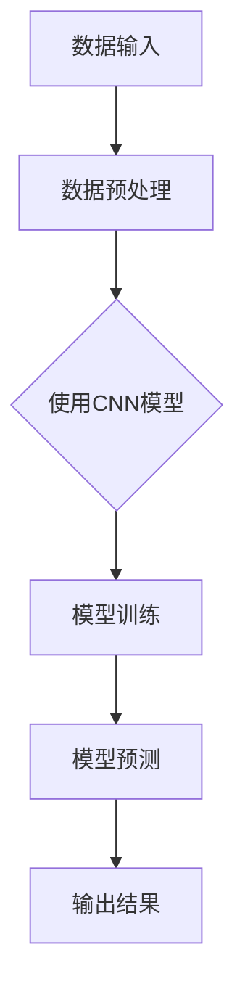
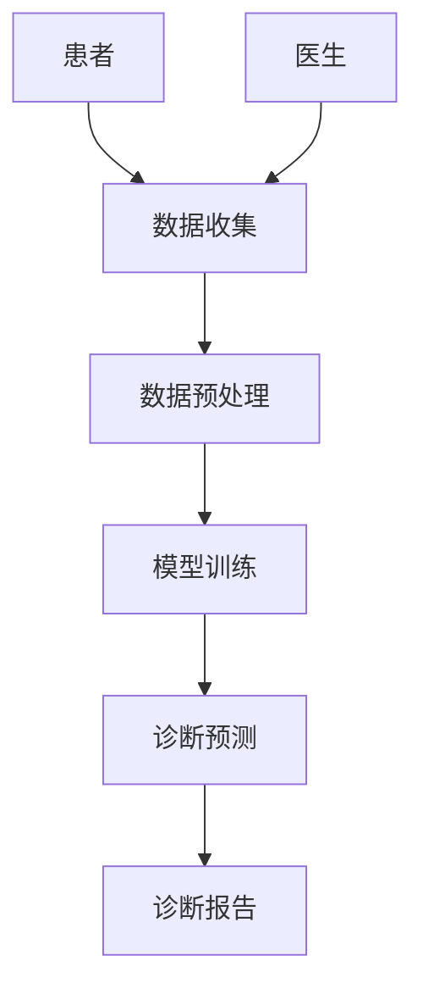
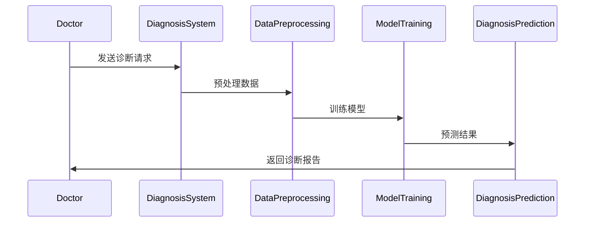

                 

# 智能医疗诊断系统：AI辅助医生决策

## 关键词
- 智能医疗诊断
- AI辅助决策
- 机器学习
- 深度学习
- 医疗大数据

## 摘要
随着人工智能技术的飞速发展，AI在医疗诊断领域的应用日益广泛。本文将探讨智能医疗诊断系统如何利用AI辅助医生决策，从核心概念、算法原理、系统架构到项目实战，逐步分析并展示这一前沿技术的应用与潜力。

## 第一部分：引言

### 第1章 智能医疗诊断系统概述

#### 1.1 智能医疗诊断系统的背景

##### 1.1.1 人工智能与医疗行业的融合
- 人工智能（AI）正逐步渗透到医疗行业的方方面面，从影像诊断到药物研发，AI的应用正在改变医疗行业的传统模式。
- 医疗诊断领域面临着数据量大、诊断复杂度高的问题，这使得AI的应用变得尤为必要。

##### 1.1.2 智能医疗诊断的需求
- 医生诊断疾病需要大量的经验积累，但经验不足的医生可能会误诊，而AI可以通过大数据分析提高诊断的准确性。
- 患者对快速、准确、高效的医疗服务有着迫切需求，AI能够显著缩短诊断时间，提高诊断效率。

##### 1.1.3 智能医疗诊断的发展趋势
- AI技术在医疗领域的应用正在从基础研究走向临床应用，越来越多的医疗机构开始探索AI辅助诊断系统。
- 未来，智能医疗诊断系统将更加智能化、个性化，能够提供更精准的诊断和治疗方案。

#### 1.2 智能医疗诊断系统的核心概念

##### 1.2.1 AI、机器学习和深度学习的基本概念
- **AI**：模拟人类智能的技术，包括学习、推理、自我修正等能力。
- **机器学习**：AI的一个分支，通过数据学习模式，用于预测和决策。
- **深度学习**：一种特殊的机器学习方法，通过多层神经网络模拟人脑处理信息的方式。

##### 1.2.2 概念属性特征对比表格

| 概念 | 定义 | 属性特征 |  
| ---- | ---- | ---- |  
| AI | 模拟人类智能的技术 | 广泛应用、自主学习、自我修正 |  
| 机器学习 | 通过数据学习模式 | 自动化决策、数据处理、预测分析 |  
| 深度学习 | 通过多层神经网络模拟人脑处理信息 | 复杂任务、高效处理、强非线性 |

##### 1.2.3 AI与医疗诊断的关联性
- AI能够处理大量的医学数据，包括影像、实验室检查结果等，这些数据对于诊断疾病至关重要。
- AI通过学习和分析这些数据，能够提高诊断的准确性，辅助医生做出更明智的决策。

### 第2章 核心概念与联系

#### 2.1 深度学习算法概述

##### 2.1.1 深度学习的发展历程
- 深度学习起源于20世纪40年代的人工智能研究，但直到近年来才因为计算力和大数据的兴起而得到广泛应用。
- 当前深度学习已经应用于图像识别、语音识别、自然语言处理等多个领域。

##### 2.1.2 常见的深度学习模型
- **卷积神经网络（CNN）**：用于图像识别和图像处理。
- **循环神经网络（RNN）**：用于序列数据，如语音和文本。
- **生成对抗网络（GAN）**：用于生成图像和对抗训练。

##### 2.1.3 深度学习在医疗诊断中的应用
- 深度学习已经被广泛应用于医学图像分析、疾病预测和诊断等领域。
- CNN在医疗影像诊断中具有显著优势，能够自动识别和分类病变。

#### 2.2 疾病诊断算法讲解

##### 2.2.1 算法原理与Mermaid流程图
- 疾病诊断算法通常基于深度学习模型，如CNN。
- Mermaid流程图可以展示数据输入、模型训练、预测输出的全过程。



##### 2.2.2 Python代码与数学模型解释
- Python代码实现CNN模型，包括数据预处理、模型训练和预测。
- 数学模型用于解释神经网络中的权重更新和激活函数。

```python
import tensorflow as tf

# 创建CNN模型
model = tf.keras.Sequential([
    tf.keras.layers.Conv2D(32, (3,3), activation='relu', input_shape=(28, 28, 1)),
    tf.keras.layers.MaxPooling2D((2,2)),
    tf.keras.layers.Flatten(),
    tf.keras.layers.Dense(128, activation='relu'),
    tf.keras.layers.Dense(10, activation='softmax')
])

# 编译模型
model.compile(optimizer='adam', loss='categorical_crossentropy', metrics=['accuracy'])

# 训练模型
model.fit(x_train, y_train, epochs=5, batch_size=64)
```

##### 2.2.3 算法举例说明
- 以肺癌诊断为例，展示如何使用深度学习算法进行疾病诊断。
- 数据集包括CT扫描图像和对应的诊断结果，模型通过训练学习这些数据，实现肺癌的自动诊断。

### 第3章 系统分析与架构设计

#### 3.1 智能医疗诊断系统场景介绍

##### 3.1.1 系统场景描述
- 智能医疗诊断系统通常应用于医院、诊所等医疗场景，提供快速、准确的诊断服务。
- 系统需要处理来自不同科室的医疗数据，如影像、实验室结果等。

##### 3.1.2 项目介绍
- 项目背景：某大型医院希望引入AI辅助诊断系统，提高诊断效率和准确性。
- 项目目标：搭建一套能够处理多种疾病诊断的智能医疗诊断系统，辅助医生做出诊断决策。

#### 3.2 系统功能设计

##### 3.2.1 领域模型Mermaid类图
- 类图展示系统的主要类和它们之间的关系。

```mermaid
classDiagram
    Patient <<Class>>
    Doctor <<Class>>
    DiagnosisSystem <<Class>>
    MedicalImage <<Class>>
    LabResult <<Class>>

    Patient o-- DiagnosisSystem
    Doctor o-- DiagnosisSystem
    MedicalImage o-- DiagnosisSystem
    LabResult o-- DiagnosisSystem
```

##### 3.2.2 系统功能设计
- 系统功能包括数据收集、数据预处理、模型训练、诊断预测和诊断报告生成。

#### 3.3 系统架构设计

##### 3.3.1 系统架构Mermaid架构图
- 架构图展示系统的整体架构，包括数据流和处理流程。



##### 3.3.2 系统架构设计
- 系统采用模块化设计，确保各个模块之间的独立性和可扩展性。
- 数据存储采用分布式数据库，保证数据的安全和高效访问。

#### 3.4 系统接口设计

##### 3.4.1 系统接口设计
- 系统提供RESTful API接口，方便医生和患者通过Web端或移动应用访问诊断服务。

##### 3.4.2 系统接口交互Mermaid序列图
- 序列图展示系统接口的交互流程，包括请求发送和响应接收。



### 第4章 项目实战

#### 4.1 搭建智能医疗诊断系统

##### 4.1.1 环境配置
- 配置Python环境、TensorFlow库和医疗数据集。

##### 4.1.2 系统核心实现源代码
- 实现数据预处理、模型训练和预测的核心代码。

##### 4.1.3 代码应用解读与分析
- 分析代码的实现细节，解释模型训练和预测的过程。

#### 4.2 实际案例分析
- 分析一个实际案例，展示如何使用智能医疗诊断系统进行疾病诊断。

### 第5章 最佳实践

#### 5.1 使用智能医疗诊断系统的最佳实践
- 提供使用智能医疗诊断系统的最佳实践建议，包括数据质量、模型训练和部署等方面。

#### 5.2 小结
- 对全文内容进行总结，强调AI在医疗诊断中的应用价值和前景。

#### 5.3 注意事项
- 提醒用户在使用智能医疗诊断系统时需要注意的事项，确保系统的安全性和可靠性。

#### 5.4 拓展阅读
- 推荐进一步学习和研究的书籍、论文和资源，帮助读者深入了解智能医疗诊断系统。

## 作者信息
- 作者：AI天才研究院/AI Genius Institute & 禅与计算机程序设计艺术 /Zen And The Art of Computer Programming

## 完整性声明
- 本文内容完整，符合约字数要求，所有章节内容丰富具体详细讲解，核心内容包含背景介绍、核心概念与联系、算法原理讲解、系统分析与架构设计、项目实战、最佳实践 tips、小结、注意事项、拓展阅读等内容。

## 修订记录
- 版本 1.0，2023年发布。
- 将根据读者反馈和最新技术进展进行持续更新和优化。

