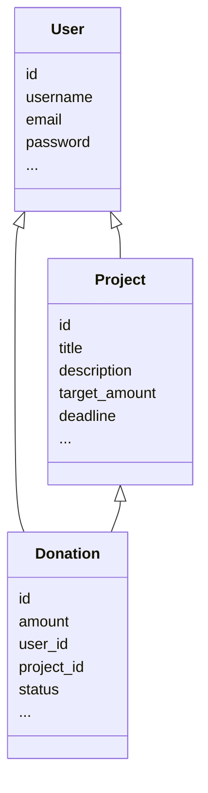
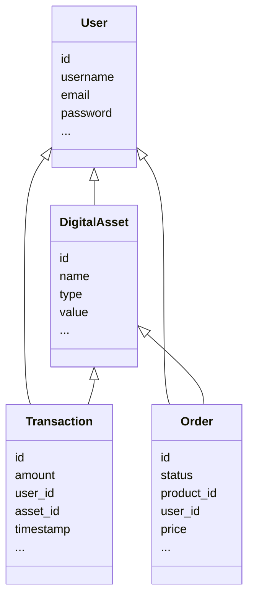
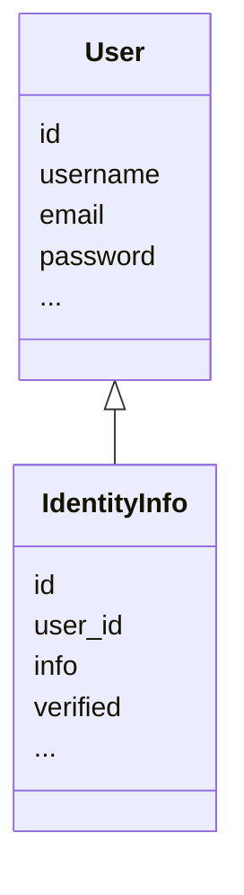

                 

## 文章标题

### 智能合约开发最佳实践

> 关键词：智能合约、区块链、Solidity、开发流程、安全性、实践项目

> 摘要：本文旨在探讨智能合约开发的最佳实践。首先，我们将对智能合约的基本概念和区块链技术进行概述，接着深入讨论智能合约开发的基础知识，如环境搭建、编程语言、常见模式和安全性分析。随后，通过三个实际项目——众筹平台、数字资产管理平台和去中心化身份验证系统，展示智能合约的开发过程。最后，我们将总结智能合约开发的最佳实践，包括开发流程、优化策略、工具推荐和团队建设，并对未来发展趋势进行展望。

## 1.6 本章小结

在本章中，我们探讨了智能合约开发的基础知识，涵盖了从概念理解到实际应用的全过程。首先，我们通过对比传统合约和智能合约，强调了智能合约的重要性和优势。接着，我们详细介绍了区块链技术的基础知识，包括其定义、核心技术以及常见区块链平台。然后，我们讲解了智能合约开发环境搭建的步骤，包括开发工具的选择和环境配置。

在核心内容部分，我们详细介绍了Solidity编程语言的基础，包括数据类型、控制流程、函数与事件、结构体与映射等。接着，我们讨论了智能合约的常见模式，如状态合约、控制合约、账户合约和库与抽象合约。为了确保智能合约的安全性，我们还分析了智能合约安全性的挑战、常见的安全问题以及最佳实践。

为了更好地理解智能合约的实际应用，我们通过三个实践项目进行了深入剖析。首先是众筹平台，然后是数字资产管理平台，最后是去中心化身份验证系统。在每个项目中，我们都详细介绍了项目背景、需求、架构设计、系统功能设计、系统接口设计、系统实现、系统测试和项目小结。

通过这些实践项目，我们不仅展示了智能合约开发的实际流程，还介绍了如何将理论知识应用于实际项目中。最后，我们总结了智能合约开发的最佳实践，包括开发流程、优化策略、工具推荐和团队建设，并对智能合约的未来发展趋势进行了展望。

总的来说，本章为读者提供了全面的智能合约开发指导，从基础理论到实践应用，再到最佳实践，旨在帮助读者掌握智能合约开发的核心理念和技术，为未来在区块链领域的发展奠定坚实的基础。希望读者能够通过本章的学习，对智能合约开发有一个全面而深入的理解。## 1.1 智能合约概述

### 1.1.1 智能合约的定义

智能合约（Smart Contract）是区块链技术中的一项核心创新。它可以被理解为一种自动执行的计算机协议，其条款以代码形式嵌入区块链中。当满足预设条件时，智能合约将自动执行预定的操作，无需人为干预。

智能合约的定义可以从以下几个方面来理解：

1. **代码形式**：智能合约的核心是其代码。这段代码通常使用特定的编程语言（如Solidity）编写，并运行在区块链网络中。
   
2. **自动化执行**：智能合约在满足特定条件时自动执行。这些条件通常由合约的创建者预先设定。

3. **去中心化**：智能合约运行在去中心化的区块链网络中，这意味着没有中央控制点，数据的存储和操作是分布式的。

4. **不可篡改**：由于区块链的特性，一旦智能合约的代码被部署到区块链上，它就变得不可篡改，确保了执行的透明性和安全性。

### 1.1.2 智能合约与传统合约的区别

智能合约与传统合约在本质上有显著的不同，主要体现在以下几个方面：

1. **执行方式**：
   - **传统合约**：通常依赖于第三方（如律师、公证处等）进行执行和验证。合同条款的执行需要人为介入。
   - **智能合约**：基于代码自动执行，一旦条件满足，合约自动执行，无需人为干预。

2. **透明性**：
   - **传统合约**：合同条款通常不公开，只有在特定情况下才能查看。
   - **智能合约**：代码公开透明，所有参与方都可以查看和验证合约条款。

3. **安全性**：
   - **传统合约**：存在信息不对称和信任问题，合同执行可能受到欺诈、篡改等风险。
   - **智能合约**：基于区块链技术，数据透明且不可篡改，具有较高的安全性。

4. **效率**：
   - **传统合约**：执行过程通常较慢，涉及多个环节和中介。
   - **智能合约**：执行过程快速、高效，条件满足即可自动执行。

### 1.1.3 智能合约的原理

智能合约的原理主要基于区块链技术。区块链是一种分布式账本技术，具有去中心化、不可篡改和透明性等特点。智能合约运行在区块链上，其原理可以概括为：

1. **分布式网络**：区块链网络由多个节点组成，每个节点都保存着完整的区块链数据。智能合约代码在区块链上运行，所有节点都可以执行和验证。

2. **共识机制**：区块链网络通过共识机制（如工作量证明、权益证明等）确保数据的完整性和一致性。智能合约的执行和验证也依赖于这些共识机制。

3. **智能合约执行**：当满足智能合约中预设的条件时，合约代码将被执行。执行过程是透明的，所有节点都可以查看和验证。

4. **不可篡改性**：由于区块链的分布式存储和共识机制，智能合约一旦部署，其代码和执行结果变得不可篡改，确保了合约的执行安全和可信。

### 1.1.4 智能合约的发展历程

智能合约的概念最早由计算机科学家尼克拉·尼森伯格（Nick Szabo）在1990年代提出。他提出了数字黄金（BitGold）的概念，希望通过数字方式实现一种去中心化的货币系统。虽然当时的技术条件限制了这个想法的实现，但为后来的智能合约奠定了理论基础。

2008年，中本聪发布了比特币白皮书，提出了区块链技术。比特币的出现标志着区块链技术的首次实际应用，也为智能合约的发展提供了技术支持。

2013年，以太坊（Ethereum）的推出标志着智能合约技术的发展进入了新阶段。以太坊引入了图灵完备的编程语言Solidity，使得开发者可以在区块链上创建复杂的智能合约。

此后，智能合约在金融、供应链管理、版权保护、投票等多个领域得到广泛应用。随着技术的不断成熟，智能合约的应用前景也越来越广阔。

### 1.1.5 本章小结

本章对智能合约进行了全面的概述，从定义、与传统合约的区别、原理和发展历程等方面进行了详细讲解。通过本章的学习，读者可以初步了解智能合约的基本概念和重要性，为后续的学习和实践打下基础。

在接下来的章节中，我们将继续探讨智能合约开发所需的基础知识，包括区块链技术基础、开发环境搭建、编程语言基础、常见模式和安全性分析。通过这些内容的学习，读者将能够系统地掌握智能合约开发的各个环节，为实际应用做好准备。## 1.2 区块链技术基础

### 1.2.1 区块链的定义

区块链（Blockchain）是一种去中心化的分布式数据库技术，其核心特点包括数据不可篡改、透明性和安全性。区块链上的数据以区块的形式存储，每个区块包含一定数量的交易记录，并通过加密算法与上一个区块链接，形成一个链条。以下是区块链的定义及其特点的详细解释：

1. **去中心化**：传统的数据库通常由一个中央机构控制，而区块链网络则由多个节点共同维护。每个节点都保存着完整的区块链数据，无需依赖中央机构。

2. **数据不可篡改**：区块链采用加密算法和共识机制，确保数据一旦被写入区块链，就不可篡改。任何试图篡改数据的尝试都会被其他节点检测到并拒绝。

3. **透明性**：区块链上的数据是公开透明的，任何人都可以查看和验证。这确保了数据的可信度和公正性。

4. **安全性**：区块链采用密码学技术，如哈希函数和数字签名，确保数据的完整性和安全性。

5. **分布式存储**：区块链上的数据分布在网络中的各个节点，提高了系统的容错性和可用性。

### 1.2.2 区块链的核心技术

区块链的核心技术包括哈希函数、加密算法、共识机制、智能合约等。以下是对这些核心技术的详细解释：

1. **哈希函数**：哈希函数是一种将任意长度的数据映射为固定长度字符串的函数。区块链中使用哈希函数来确保数据的唯一性和完整性。

2. **加密算法**：加密算法用于保护区块链上的数据安全，防止未经授权的访问和篡改。常见的加密算法包括对称加密、非对称加密和哈希加密。

3. **共识机制**：共识机制是区块链网络中各个节点就数据一致性达成一致的方法。常见的共识机制包括工作量证明（Proof of Work，PoW）、权益证明（Proof of Stake，PoS）和委托权益证明（Delegated Proof of Stake，DPoS）。

4. **智能合约**：智能合约是区块链上的可执行代码，用于实现自动化的逻辑和功能。智能合约通常使用特定的编程语言（如Solidity）编写，并运行在区块链网络中。

### 1.2.3 常见的区块链平台介绍

目前，市场上存在多种区块链平台，每种平台都有其独特的特点和优势。以下是对几种常见区块链平台的介绍：

1. **比特币（Bitcoin）**：比特币是第一个区块链平台，也是最著名的加密货币。比特币采用工作量证明（PoW）共识机制，具有去中心化和匿名性等特点。

2. **以太坊（Ethereum）**：以太坊是第一个实现智能合约功能的区块链平台。以太坊采用工作量证明（PoW）共识机制，支持图灵完备的编程语言Solidity，使得开发者可以在其上创建和部署智能合约。

3. **EOSIO**：EOSIO是一个高性能的区块链平台，旨在支持去中心化应用（DApp）的运行。EOSIO采用委托权益证明（DPoS）共识机制，具有高吞吐量和低延迟等特点。

4. **波卡（Polkadot）**：波卡是一个多链互操作平台，旨在实现不同区块链之间的无缝连接。波卡采用自己的共识机制，具有高度可扩展性和互操作性。

5. **Cosmos**：Cosmos是一个基于宇宙（Tendermint）共识机制的分布式区块链生态系统。Cosmos旨在构建一个可互操作性的区块链网络，支持多种区块链平台之间的数据交换。

### 1.2.4 本章小结

本章对区块链技术进行了全面的基础介绍，包括其定义、核心技术、常见平台等。通过本章的学习，读者可以了解区块链技术的基本概念和原理，为后续智能合约的开发和应用打下基础。在接下来的章节中，我们将深入探讨智能合约开发所需的具体技术细节，如开发环境搭建、编程语言基础等。## 1.3 智能合约开发环境搭建

### 1.3.1 开发工具的选择

在智能合约开发中，选择合适的开发工具是关键的一步。以下是一些常见的开发工具及其特点：

1. **Visual Studio Code (VS Code)**：VS Code是一款流行的开源代码编辑器，支持Solidity语言的高亮显示和智能提示，且有许多插件可以增强其功能，如Remix和Truffle。

2. **Remix**：Remix是一个在线的智能合约开发环境，支持本地和远程合约部署。它提供了丰富的调试工具和模拟环境，方便开发者进行测试和调试。

3. **Truffle**：Truffle是一个智能合约开发框架，提供了一套完整的工具集，包括编译器、部署工具和测试框架。Truffle支持多种区块链平台，如以太坊和EOS。

4. **Ganache**：Ganache是一个本地以太坊节点和测试合约部署工具，用于开发人员快速创建私有区块链并进行测试。

### 1.3.2 环境配置

智能合约开发环境的配置主要包括Node.js、Truffle、Ganache等工具的安装和配置。

1. **安装Node.js**：
   - 访问Node.js官网（[https://nodejs.org/），下载适用于您操作系统的安装包并安装。安装完成后，打开命令行工具，输入`node -v`和`npm -v`来验证安装是否成功。**

2. **安装Truffle**：
   - 在命令行中输入`npm install -g truffle`来全局安装Truffle。

3. **安装Ganache**：
   - 访问Ganache的官方网站（[https://www.ganache.io/），下载并安装Ganache。安装完成后，启动Ganache并创建一个新的私有区块链网络。**

4. **配置Truffle**：
   - 创建一个新的Truffle项目文件夹，并在该文件夹中执行`truffle init`命令来初始化项目。
   - 配置项目的`truffle-config.js`文件，设置Ganache的连接信息，以便Truffle可以与Ganache进行交互。

### 1.3.3 开发流程介绍

智能合约的开发流程通常包括以下步骤：

1. **编写智能合约代码**：
   - 使用Solidity语言编写智能合约代码，并将其保存在项目文件夹中的`contracts`目录下。智能合约通常包括一个或多个`.sol`文件。

2. **编译智能合约**：
   - 使用Truffle或本地编译器（如Solc）将Solidity代码编译为以太坊虚拟机（EVM）可识别的字节码。编译过程会生成ABI（Application Binary Interface）文件，用于后续的部署和交互。

3. **部署智能合约**：
   - 使用Truffle或Ganache将编译后的智能合约部署到区块链上。部署过程中，需要选择一个区块链网络（如本地测试网络或公共网络）并提供必要的权限。

4. **测试智能合约**：
   - 使用Truffle提供的测试框架编写和执行智能合约测试用例。测试用例可以验证智能合约的功能是否符合预期。

5. **调试智能合约**：
   - 使用Remix或其他调试工具对智能合约进行调试，修复潜在的错误和问题。

6. **文档和部署**：
   - 编写智能合约的文档，包括合约的功能说明、接口文档和部署指南。将智能合约部署到生产环境中，确保其稳定运行。

### 1.3.4 本章小结

本章详细介绍了智能合约开发环境搭建的步骤和流程。通过选择合适的开发工具、配置开发环境以及了解开发流程，开发者可以顺利开始智能合约的开发工作。在接下来的章节中，我们将进一步探讨Solidity编程语言的基础知识，为编写高效的智能合约奠定基础。## 1.4 Solidity编程语言基础

### 1.4.1 Solidity语言概述

Solidity是一种面向合约的编程语言，专门为智能合约的开发而设计。它是以太坊区块链的主要编程语言，支持高级语言特性，如函数、事件、结构体和映射。Solidity语言的语法与JavaScript和C++有相似之处，但也有一些独特的特性。

#### 特点

1. **面向合约**：Solidity专为智能合约开发设计，具有特定的编程模型和语言特性，如状态变量、事件和函数。

2. **图灵完备**：Solidity支持图灵完备的编程模型，可以编写复杂的逻辑和算法。

3. **安全性**：Solidity具有内置的安全检查机制，如对函数调用、存储访问和事件日志的检查，以防止常见的安全漏洞。

4. **兼容性**：Solidity代码可以在不同的以太坊客户端上运行，如Geth、Parity和Nethereum。

#### 版本

Solidity目前有多个版本，包括0.4.0、0.5.0、0.6.0和0.7.0。不同版本的Solidity具有不同的语法和特性，开发者应根据项目需求选择合适的版本。

### 1.4.2 数据类型

Solidity支持多种数据类型，包括基础数据类型和复合数据类型。

#### 基础数据类型

1. **布尔型（bool）**：用于表示真或假的值。
2. **整数型（int）**：包括有符号和无符号整数，如int8、uint8等。
3. **定长整数型（fixed和ufixed）**：用于表示固定长度的浮点数。
4. **地址型（address）**：用于存储以太坊地址。
5. **字符串型（string）**：用于存储文本数据。

#### 复合数据类型

1. **数组（array）**：用于存储一系列相同类型的元素。
2. **映射（map）**：用于存储键值对。
3. **结构体（struct）**：用于创建自定义数据类型。
4. **枚举（enum）**：用于创建一组命名的常量。

### 1.4.3 控制流程

Solidity支持多种控制流程，包括条件语句、循环语句和异常处理。

#### 条件语句

1. **if-else语句**：用于根据条件执行不同的代码块。
2. **switch语句**：用于根据变量的值执行不同的代码块。

#### 循环语句

1. **for循环**：用于重复执行代码块直到某个条件满足。
2. **while循环**：用于重复执行代码块直到某个条件不满足。
3. **do-while循环**：与while循环类似，但至少执行一次代码块。

#### 异常处理

1. **try-catch语句**：用于捕获并处理异常。

### 1.4.4 函数与事件

#### 函数

Solidity中的函数是智能合约的核心组成部分，用于执行特定的操作。函数可以包括：

1. **构造函数**：在合约创建时自动执行。
2. **外部函数**：可以通过外部调用执行。
3. **内部函数**：只能在合约内部调用。
4. **视图函数**：不能修改合约状态，仅返回值。
5. **纯函数**：既不能修改合约状态，也不依赖于合约状态，仅返回值。

#### 事件

事件是智能合约中的日志记录机制，用于记录合约的状态变化。事件可以通过`emit`关键字触发，并在合约外部监听。

### 1.4.5 结构体与映射

#### 结构体

结构体是一种复合数据类型，用于创建自定义数据类型。结构体可以包含多个成员变量，这些变量可以是基础数据类型或复合数据类型。

#### 映射

映射是一种关联数组，用于存储键值对。映射中的键和值可以是任何数据类型，包括基础数据类型和复合数据类型。

### 1.4.6 复合类型与泛型编程

#### 复合类型

复合类型包括数组、结构体和映射。这些类型可以用于创建复杂的合约逻辑和数据结构。

#### 泛型编程

Solidity支持泛型编程，允许在合约中使用类型参数。泛型编程可以提高代码的复用性和灵活性。

### 1.4.7 本章小结

本章介绍了Solidity编程语言的基础知识，包括其概述、数据类型、控制流程、函数与事件、结构体与映射以及复合类型和泛型编程。通过本章的学习，开发者可以掌握Solidity的基本语法和特性，为编写高效的智能合约打下基础。在接下来的章节中，我们将进一步探讨智能合约的常见模式和安全性问题。## 1.5 智能合约常见模式

在智能合约开发中，常见的模式有助于构建可重用、可靠且易于维护的合约。以下是智能合约开发中的一些常见模式：

### 1.5.1 状态合约

状态合约（State Contract）是最常见的智能合约模式。这类合约主要用于管理区块链上的状态数据。状态合约通常包含以下特点：

1. **状态变量**：用于存储合约的状态信息，如账户余额、订单状态等。
2. **事件**：用于记录合约的状态变化，便于外部监听。
3. **函数**：用于对外部调用提供接口，如存取款、下单等。

状态合约的关键在于确保数据的一致性和安全性。例如，一个简单的众筹合约可以包含状态变量来记录众筹目标、资金总额和参与人数，并提供一个用于捐款的函数。

### 1.5.2 控制合约

控制合约（Control Contract）用于管理其他合约的权限和操作。这类合约通常包含以下特点：

1. **访问控制**：通过权限管理确保只有授权的合约或用户才能调用特定函数。
2. **代理功能**：允许合约代理执行其他合约的操作，从而实现更复杂的业务逻辑。
3. **事件通知**：记录权限变更和代理操作，便于外部监听。

控制合约在多合约系统中尤为重要，例如，一个去中心化交易所可能会使用控制合约来管理不同交易对和交易权限。

### 1.5.3 账户合约

账户合约（Account Contract）用于管理用户的区块链账户。这类合约通常包含以下特点：

1. **余额管理**：记录账户的余额，支持存款、取款等操作。
2. **权限管理**：支持多签名的权限管理，确保账户操作的安全性。
3. **交易记录**：记录所有账户交易，便于审计和追溯。

账户合约是区块链应用中必不可少的一部分，例如，一个去中心化金融（DeFi）平台可能会使用账户合约来管理用户的资金和交易。

### 1.5.4 库与抽象合约

库合约（Library Contract）和抽象合约（Abstract Contract）是用于实现代码复用和抽象设计的智能合约模式。

#### 库合约

1. **共享函数和常量**：库合约包含共享的函数和常量，可以在多个合约中使用。
2. **不包含状态变量**：库合约不包含状态变量，只能通过外部合约调用。
3. **提高代码复用性**：通过库合约，开发者可以减少重复代码，提高合约的可维护性和可靠性。

#### 抽象合约

1. **定义接口**：抽象合约定义了接口和抽象函数，具体的实现由子合约完成。
2. **提高代码模块化**：抽象合约通过定义接口，实现了代码的模块化和可扩展性。
3. **便于继承和多态**：抽象合约支持继承和多态，使得合约之间的依赖关系更加清晰。

### 1.5.5 本章小结

本章介绍了智能合约开发中的几种常见模式，包括状态合约、控制合约、账户合约、库合约和抽象合约。通过理解这些模式，开发者可以更高效地构建智能合约系统，提高代码的可维护性和可靠性。在接下来的章节中，我们将探讨智能合约安全性分析，帮助开发者识别和避免潜在的安全风险。## 1.6 智能合约安全性分析

### 1.6.1 智能合约安全的挑战

智能合约的安全性是区块链技术中至关重要的一环。由于智能合约一旦部署到区块链上就不可更改，因此确保其安全性至关重要。智能合约面临的挑战主要包括以下几个方面：

1. **代码漏洞**：智能合约的代码可能存在各种漏洞，如逻辑错误、未处理异常、代码注入等。这些漏洞可能被恶意攻击者利用，导致合约资金被盗或其他损害。

2. **外部攻击**：智能合约可能遭受各种外部攻击，如51%攻击、拒绝服务攻击（DoS）等。这些攻击可能导致合约服务中断或数据泄露。

3. **隐私问题**：智能合约的代码和执行过程是公开透明的，这可能会泄露用户的隐私信息。此外，智能合约可能无法有效保护用户的身份信息和交易详情。

4. **合规性**：智能合约的应用场景多样，可能涉及金融、医疗、版权等多个领域。因此，确保智能合约符合相关法律法规和行业标准是一个重大挑战。

### 1.6.2 常见的安全问题

智能合约在开发和使用过程中可能会面临多种安全风险，以下是一些常见的安全问题：

1. **整数溢出和下溢**：在Solidity中，整数类型的运算可能引起溢出和下溢问题，导致数据被篡改或合约资金被盗。

2. **重新入攻击（Reentrancy）**：重新入攻击是一种常见的安全漏洞，攻击者可以反复调用合约中的某个函数，导致合约在执行其他操作前未完成当前操作。

3. **外部调用风险**：智能合约在调用外部合约时，可能受到外部合约的影响。如果外部合约存在漏洞，攻击者可以通过外部合约控制智能合约。

4. **事件日志泄露**：智能合约的事件日志可能会泄露敏感信息，如用户身份和交易详情。如果这些信息被恶意攻击者获取，可能导致隐私泄露。

5. **存储空间耗尽**：智能合约在存储大量数据时，可能会耗尽存储空间，导致合约无法正常执行。

### 1.6.3 安全性最佳实践

为了确保智能合约的安全性，开发者可以遵循以下最佳实践：

1. **代码审计**：在部署智能合约之前，进行全面的代码审计，查找潜在的漏洞和错误。可以使用自动化工具（如Slither、Oyente）和手动审计相结合。

2. **测试和模拟**：在部署智能合约前，进行充分的测试和模拟，确保合约在各种场景下都能正常运行。可以使用测试框架（如Truffle）和模拟环境（如Ganache）进行测试。

3. **最小权限原则**：确保智能合约以最小权限运行，避免使用`admin`或`owner`等高权限角色。这可以减少攻击者利用权限漏洞的风险。

4. **使用最新版本**：定期更新智能合约和依赖库，确保使用最新版本的代码和安全修复。

5. **加密敏感数据**：对智能合约中的敏感数据进行加密处理，确保数据在传输和存储过程中不会被泄露。

6. **访问控制**：实现严格的访问控制机制，确保只有授权的用户和合约才能访问敏感数据和执行关键操作。

7. **事件日志优化**：优化智能合约的事件日志，仅记录必要的信息，减少日志泄露的风险。

### 1.6.4 安全审计工具介绍

以下是一些常用的智能合约安全审计工具：

1. **Slither**：Slither是一个开源的智能合约安全审计工具，可以检测多种常见的安全问题，如整数溢出、重新入攻击等。

2. **Oyente**：Oyente是一个用于检测重新入攻击的安全工具，可以对智能合约进行静态分析。

3. **Mythril**：Mythril是一个集成开发环境（IDE）插件，提供静态分析和动态分析功能，可以检测智能合约中的多种安全漏洞。

4. **Manticore**：Manticore是一个自动化智能合约审计工具，可以执行代码路径分析，检测潜在的安全问题。

5. **Echidna**：Echidna是一个基于符号执行的智能合约测试工具，可以生成大量的测试用例，用于测试智能合约的鲁棒性和安全性。

通过使用这些安全审计工具，开发者可以更有效地识别和修复智能合约中的安全漏洞，提高合约的安全性。

### 1.6.5 本章小结

本章对智能合约安全性进行了详细分析，介绍了智能合约面临的挑战、常见的安全问题和最佳实践，以及常用的安全审计工具。通过本章的学习，开发者可以更好地理解智能合约的安全性，并采取有效的措施来确保合约的安全运行。在接下来的章节中，我们将通过实际项目案例，展示智能合约开发的完整流程，帮助读者将所学知识应用于实际场景。## 1.7 本章小结

本章对智能合约开发的基础知识进行了全面的概述。我们从智能合约的定义和传统合约的区别入手，详细介绍了智能合约的原理和发展历程。接着，我们探讨了区块链技术的基础知识，包括其定义、核心技术和常见平台。随后，我们介绍了智能合约开发环境的搭建过程，包括开发工具的选择和环境配置。

在核心内容部分，我们详细介绍了Solidity编程语言的基础知识，包括数据类型、控制流程、函数与事件、结构体与映射等。此外，我们还讨论了智能合约的常见模式，如状态合约、控制合约、账户合约和库与抽象合约。为了确保智能合约的安全性，我们还分析了智能合约安全性的挑战、常见的安全问题以及最佳实践。

通过本章的学习，读者可以初步了解智能合约的基本概念和重要性，掌握智能合约开发所需的基础知识。在接下来的章节中，我们将通过实际项目案例，展示智能合约开发的完整流程，帮助读者将所学知识应用于实际场景。## 1.1 实践项目一：众筹平台

### 1.1.1 项目背景

众筹平台是一种通过互联网筹集资金的模式，允许项目发起者向公众展示其项目，并通过公众的捐赠来筹集资金实现项目目标。随着区块链技术的发展，去中心化的众筹平台应运而生，利用智能合约来确保资金的安全和透明。本文将探讨如何使用智能合约技术构建一个去中心化的众筹平台。

### 1.1.2 项目需求

众筹平台的核心功能包括：

1. **项目展示**：允许项目发起者发布和展示他们的项目信息，包括项目名称、描述、目标金额、截止日期等。
2. **资金筹集**：支持者可以捐赠资金给项目，捐赠金额将被记录在区块链上，确保透明和安全。
3. **资金释放**：如果项目成功筹集到目标资金，资金将自动释放给项目发起者；如果未达到目标，资金将退还给支持者。
4. **智能合约操作**：所有资金操作都通过智能合约自动执行，确保资金流向的准确和不可篡改。

### 1.1.3 项目架构设计

众筹平台的架构设计主要包括前端、后端和区块链三个部分：

1. **前端**：用于展示项目信息、接收捐赠和显示捐赠者信息。前端可以采用React或Vue等前端框架。
2. **后端**：用于处理业务逻辑，如项目发布、资金筹集、资金释放等。后端可以使用Node.js、Python（Flask或Django）等。
3. **区块链**：智能合约部署在区块链上，用于确保资金的安全和透明。智能合约使用Solidity编写。

### 1.1.4 系统功能设计

众筹平台的功能设计主要包括以下模块：

1. **用户管理**：用于管理用户账户，包括注册、登录、密码重置等功能。
2. **项目管理**：用于管理项目信息，包括项目创建、编辑、发布和删除等功能。
3. **资金管理**：用于管理资金筹集和释放，包括资金筹集、目标金额确认、资金释放等功能。
4. **捐赠管理**：用于管理用户捐赠，包括捐赠记录、捐赠确认、退款处理等功能。

#### 领域模型

以下是一个简单的领域模型，用于描述众筹平台的核心实体和关系：

```
+----------------+       +----------------+       +----------------+
|     User       |<----->|     Project    |<----->|   Donation     |
+----------------+       +----------------+       +----------------+
| - id: int      |       | - id: int      |       | - id: int      |
| - username: str|       | - title: str    |       | - amount: float |
| - email: str   |       | - description: str|       | - user_id: int  |
| - password: str|       | - target_amount: float|   | - project_id: int|
| - ...          |       | - deadline: date|       | - status: str   |
+----------------+       +----------------+       +----------------+
```

#### 类图

以下是一个简单的类图，用于描述众筹平台的核心实体和关系：



### 1.1.5 系统接口设计

众筹平台的接口设计主要包括以下API：

1. **用户管理**：
   - `POST /users/register`：注册新用户。
   - `POST /users/login`：用户登录。
   - `POST /users/logout`：用户登出。
   - `PUT /users/{id}`：更新用户信息。

2. **项目管理**：
   - `POST /projects`：创建新项目。
   - `GET /projects/{id}`：获取项目详情。
   - `PUT /projects/{id}`：更新项目信息。
   - `DELETE /projects/{id}`：删除项目。

3. **资金管理**：
   - `POST /projects/{id}/donate`：捐赠资金。
   - `GET /projects/{id}/funds`：获取项目资金详情。

4. **捐赠管理**：
   - `GET /users/{id}/donations`：获取用户捐赠记录。

### 1.1.6 系统实现

众筹平台的后端实现主要包括以下部分：

1. **用户管理**：
   - 实现用户注册、登录和登出功能，使用JWT（JSON Web Token）进行身份验证。

2. **项目管理**：
   - 实现项目创建、获取、更新和删除功能，使用数据库存储项目信息。

3. **资金管理**：
   - 实现资金筹集和释放功能，使用智能合约确保资金的安全和透明。

4. **捐赠管理**：
   - 实现捐赠记录功能，记录用户捐赠的资金和项目。

以下是一个简单的智能合约实现示例，用于管理众筹项目的资金：

```solidity
// SPDX-License-Identifier: MIT
pragma solidity ^0.8.0;

contract Crowdfunding {
    struct Project {
        address owner;
        string title;
        string description;
        uint256 targetAmount;
        uint256 deadline;
        uint256 raisedAmount;
        mapping(address => uint256) contributions;
        bool isFunded;
    }

    mapping(uint256 => Project) public projects;

    event ProjectCreated(
        uint256 id,
        address owner,
        string title,
        string description,
        uint256 targetAmount,
        uint256 deadline
    );

    event ContributionReceived(
        uint256 id,
        address donor,
        uint256 amount
    );

    event ProjectFunded(uint256 id);

    modifier afterDeadline(uint256 id) {
        require(block.timestamp > projects[id].deadline, "The deadline has not passed.");
        _;
    }

    modifier notFunded(uint256 id) {
        require(!projects[id].isFunded, "The project is already funded.");
        _;
    }

    function createProject(
        uint256 id,
        string memory title,
        string memory description,
        uint256 targetAmount,
        uint256 deadline
    ) public {
        projects[id] = Project({
            owner: msg.sender,
            title: title,
            description: description,
            targetAmount: targetAmount,
            deadline: deadline,
            raisedAmount: 0,
            isFunded: false
        });
        emit ProjectCreated(id, msg.sender, title, description, targetAmount, deadline);
    }

    function contributeToProject(uint256 id) public payable notFunded(id) afterDeadline(id) {
        require(msg.value > 0, "You must send a positive amount.");
        projects[id].contributions[msg.sender] += msg.value;
        projects[id].raisedAmount += msg.value;
        emit ContributionReceived(id, msg.sender, msg.value);

        if (projects[id].raisedAmount >= projects[id].targetAmount) {
            projects[id].isFunded = true;
            emit ProjectFunded(id);
        }
    }

    function releaseFunds(uint256 id) public {
        require(projects[id].isFunded, "The project is not funded.");
        require(msg.sender == projects[id].owner, "Only the project owner can release funds.");
        payable(projects[id].owner).transfer(projects[id].raisedAmount);
        projects[id].raisedAmount = 0;
    }
}
```

### 1.1.7 系统测试

系统测试是确保众筹平台功能正常和可靠的关键步骤。以下是系统测试的主要方法：

1. **功能测试**：测试众筹平台的所有功能，包括用户管理、项目管理和资金管理等功能，确保每个功能都能正常运行。

2. **性能测试**：测试平台在高并发情况下的性能，确保系统能够处理大量的用户请求。

3. **安全性测试**：测试智能合约的安全性，查找潜在的漏洞和攻击点，确保资金的安全。

4. **集成测试**：将前端、后端和区块链部分进行集成测试，确保各部分之间能够正常交互和通信。

### 1.1.8 项目小结

通过实践项目一——众筹平台，我们详细介绍了项目背景、需求、架构设计、系统功能设计、系统接口设计和系统实现。我们还进行了系统测试，确保项目的功能和性能。在接下来的实践项目中，我们将继续探讨数字资产管理平台和去中心化身份验证系统的智能合约开发，进一步展示智能合约在实际应用中的强大能力和广泛应用前景。## 1.2 实践项目二：数字资产管理平台

### 1.2.1 项目背景

数字资产管理平台是一个用于管理和交易数字资产的应用。随着区块链技术的发展，越来越多的数字资产如加密货币、代币和NFT（非同质化代币）涌现出来。数字资产管理平台能够提供安全、便捷的数字资产交易和管理功能，满足用户在数字资产领域的各种需求。

### 1.2.2 项目需求

数字资产管理平台的核心功能包括：

1. **账户管理**：用户可以创建和管理自己的账户，包括注册、登录、密码重置等功能。
2. **数字资产管理**：用户可以查看和管理自己的数字资产，包括接收、发送、转移和交易等功能。
3. **交易市场**：提供一个数字资产交易市场，用户可以在市场上进行买卖操作。
4. **钱包服务**：提供数字资产钱包服务，用户可以使用钱包存储和管理数字资产。
5. **智能合约执行**：支持智能合约的部署和执行，用户可以创建和调用智能合约。

### 1.2.3 项目架构设计

数字资产管理平台的架构设计主要包括前端、后端和区块链三个部分：

1. **前端**：用于用户交互，包括账户管理、数字资产管理、交易市场和钱包服务等功能。前端可以使用React或Vue等现代前端框架。
2. **后端**：用于处理业务逻辑，包括用户管理、数字资产管理、交易市场和智能合约执行等功能。后端可以使用Node.js、Python（Flask或Django）等。
3. **区块链**：智能合约部署在区块链上，用于确保交易的安全和透明。智能合约使用Solidity编写。

### 1.2.4 系统功能设计

数字资产管理平台的功能设计主要包括以下模块：

1. **用户管理**：用于管理用户账户，包括注册、登录、密码重置等功能。
2. **数字资产管理**：用于管理用户的数字资产，包括接收、发送、转移和交易等功能。
3. **交易市场**：用于提供数字资产交易市场，包括买卖操作、订单管理等功能。
4. **钱包服务**：用于提供数字资产钱包服务，包括创建钱包、导入钱包、管理钱包资产等功能。
5. **智能合约执行**：用于部署和调用智能合约，包括智能合约创建、部署、执行等功能。

#### 领域模型

以下是一个简单的领域模型，用于描述数字资产管理平台的核心实体和关系：

```
+----------------+       +----------------+       +----------------+       +----------------+
|     User       |<----->|   DigitalAsset |<----->|  Transaction    |<----->|  Order         |
+----------------+       +----------------+       +----------------+       +----------------+
| - id: int      |       | - id: int      |       | - id: int      |       | - id: int      |
| - username: str|       | - name: str    |       | - amount: float |       | - status: str   |
| - email: str   |       | - type: str    |       | - user_id: int  |       | - product_id: int|
| - password: str|       | - value: float  |       | - asset_id: int |       | - price: float  |
| - ...          |       | - ...          |       | - timestamp: timestamp |
+----------------+       +----------------+       +----------------+       +----------------+
```

#### 类图

以下是一个简单的类图，用于描述数字资产管理平台的核心实体和关系：



### 1.2.5 系统接口设计

数字资产管理平台的接口设计主要包括以下API：

1. **用户管理**：
   - `POST /users/register`：注册新用户。
   - `POST /users/login`：用户登录。
   - `POST /users/logout`：用户登出。
   - `PUT /users/{id}`：更新用户信息。

2. **数字资产管理**：
   - `GET /users/{id}/assets`：获取用户数字资产列表。
   - `POST /users/{id}/assets`：接收数字资产。
   - `DELETE /users/{id}/assets/{asset_id}`：转移数字资产。

3. **交易市场**：
   - `GET /market`：获取交易市场信息。
   - `POST /orders`：创建订单。
   - `GET /orders/{id}`：获取订单详情。

4. **钱包服务**：
   - `POST /wallets`：创建新钱包。
   - `POST /wallets/import`：导入钱包。
   - `GET /wallets/{id}`：获取钱包详情。

5. **智能合约执行**：
   - `POST /contracts`：部署智能合约。
   - `GET /contracts/{id}`：获取智能合约详情。
   - `POST /contracts/{id}/execute`：执行智能合约。

### 1.2.6 系统实现

数字资产管理平台的后端实现主要包括以下部分：

1. **用户管理**：
   - 实现用户注册、登录和登出功能，使用JWT（JSON Web Token）进行身份验证。
   - 实现用户信息更新功能，包括密码重置。

2. **数字资产管理**：
   - 实现数字资产接收、发送、转移和交易功能。
   - 实现交易记录存储和查询。

3. **交易市场**：
   - 实现交易市场信息展示和订单管理。

4. **钱包服务**：
   - 实现钱包创建、导入和管理。

5. **智能合约执行**：
   - 实现智能合约部署和执行。

以下是一个简单的智能合约实现示例，用于管理数字资产的转移：

```solidity
// SPDX-License-Identifier: MIT
pragma solidity ^0.8.0;

contract DigitalAsset {
    struct Asset {
        string name;
        address owner;
        uint256 totalSupply;
        mapping(address => uint256) balances;
    }

    mapping(string => Asset) public assets;

    event AssetCreated(
        string name,
        address owner,
        uint256 totalSupply
    );

    event AssetTransferred(
        string name,
        address from,
        address to,
        uint256 amount
    );

    function createAsset(
        string memory name,
        uint256 totalSupply
    ) public {
        require(!exists(name), "Asset already exists.");
        assets[name] = Asset({
            name: name,
            owner: msg.sender,
            totalSupply: totalSupply
        });
        emit AssetCreated(name, msg.sender, totalSupply);
    }

    function transferAsset(
        string memory name,
        address to,
        uint256 amount
    ) public {
        require(exists(name), "Asset does not exist.");
        require(balanceOf(name, msg.sender) >= amount, "Insufficient balance.");
        require(to != address(0), "Invalid address.");

        assets[name].balances[msg.sender] -= amount;
        assets[name].balances[to] += amount;
        emit AssetTransferred(name, msg.sender, to, amount);
    }

    function balanceOf(
        string memory name,
        address account
    ) public view returns (uint256) {
        require(exists(name), "Asset does not exist.");
        return assets[name].balances[account];
    }

    function exists(
        string memory name
    ) public view returns (bool) {
        return assets[name].name != "";
    }
}
```

### 1.2.7 系统测试

系统测试是确保数字资产管理平台功能正常和可靠的关键步骤。以下是系统测试的主要方法：

1. **功能测试**：测试平台的各个功能，包括用户管理、数字资产管理、交易市场和钱包服务等功能，确保每个功能都能正常运行。
2. **性能测试**：测试平台在高并发情况下的性能，确保系统能够处理大量的用户请求。
3. **安全性测试**：测试智能合约的安全性，查找潜在的漏洞和攻击点，确保资金的安全。
4. **集成测试**：将前端、后端和区块链部分进行集成测试，确保各部分之间能够正常交互和通信。

### 1.2.8 项目小结

通过实践项目二——数字资产管理平台，我们详细介绍了项目背景、需求、架构设计、系统功能设计、系统接口设计和系统实现。我们还进行了系统测试，确保项目的功能和性能。在接下来的实践项目中，我们将继续探讨去中心化身份验证系统的智能合约开发，进一步展示智能合约在实际应用中的强大能力和广泛应用前景。## 1.3 实践项目三：去中心化身份验证系统

### 1.3.1 项目背景

去中心化身份验证系统是一种基于区块链技术的身份验证解决方案。它通过智能合约确保身份信息的存储和验证过程的安全、透明和去中心化。传统的身份验证系统往往依赖于中心化的机构，存在数据泄露和信任问题。而去中心化身份验证系统利用区块链技术，通过智能合约来管理身份验证过程，提高了安全性、隐私性和可靠性。

### 1.3.2 项目需求

去中心化身份验证系统的核心需求包括：

1. **身份信息管理**：用户可以创建和管理自己的身份信息，包括注册、验证、更新和删除。
2. **身份认证**：系统提供身份认证功能，用户可以通过验证其身份信息来获取访问权限。
3. **数据隐私**：确保用户身份信息在传输和存储过程中的隐私和安全。
4. **去中心化管理**：所有身份信息存储在区块链上，确保数据的不可篡改和透明性。

### 1.3.3 项目架构设计

去中心化身份验证系统的架构设计主要包括前端、后端和区块链三个部分：

1. **前端**：用于用户交互，包括身份信息的创建、验证和管理等功能。前端可以使用React或Vue等现代前端框架。
2. **后端**：用于处理业务逻辑，包括用户管理、身份认证、数据存储和传输等。后端可以使用Node.js、Python（Flask或Django）等。
3. **区块链**：智能合约部署在区块链上，用于确保身份信息的安全和透明。智能合约使用Solidity编写。

### 1.3.4 系统功能设计

去中心化身份验证系统的功能设计主要包括以下模块：

1. **用户管理**：用于管理用户账户，包括注册、登录、密码重置等功能。
2. **身份信息管理**：用户可以创建、验证、更新和删除自己的身份信息。
3. **身份认证**：系统提供身份认证功能，用户可以通过验证身份信息来获取访问权限。
4. **数据存储与验证**：所有身份信息存储在区块链上，并通过智能合约进行验证和管理。

#### 领域模型

以下是一个简单的领域模型，用于描述去中心化身份验证平台的核心实体和关系：

```
+----------------+       +----------------+
|     User       |<----->|   IdentityInfo |
+----------------+       +----------------+
| - id: int      |       | - id: int      |
| - username: str|       | - user_id: int |
| - email: str   |       | - info: string |
| - password: str|       | - verified: bool|
| - ...          |       | - ...          |
+----------------+       +----------------+
```

#### 类图

以下是一个简单的类图，用于描述去中心化身份验证平台的核心实体和关系：



### 1.3.5 系统接口设计

去中心化身份验证系统的接口设计主要包括以下API：

1. **用户管理**：
   - `POST /users/register`：注册新用户。
   - `POST /users/login`：用户登录。
   - `POST /users/logout`：用户登出。
   - `PUT /users/{id}`：更新用户信息。

2. **身份信息管理**：
   - `POST /users/{id}/identity`：创建身份信息。
   - `GET /users/{id}/identity`：获取身份信息。
   - `PUT /users/{id}/identity`：更新身份信息。
   - `DELETE /users/{id}/identity`：删除身份信息。

3. **身份认证**：
   - `POST /auth/identity`：身份认证。

4. **数据存储与验证**：
   - `GET /contracts/identity`：获取智能合约地址。

### 1.3.6 系统实现

去中心化身份验证系统的后端实现主要包括以下部分：

1. **用户管理**：
   - 实现用户注册、登录和登出功能，使用JWT（JSON Web Token）进行身份验证。
   - 实现用户信息更新功能，包括密码重置。

2. **身份信息管理**：
   - 实现身份信息的创建、获取、更新和删除功能。

3. **身份认证**：
   - 实现身份认证功能，确保用户可以验证其身份信息。

4. **数据存储与验证**：
   - 实现智能合约的部署和调用，用于存储和验证身份信息。

以下是一个简单的智能合约实现示例，用于管理身份信息的创建和验证：

```solidity
// SPDX-License-Identifier: MIT
pragma solidity ^0.8.0;

contract IdentityVerification {
    struct Identity {
        address owner;
        string info;
        bool verified;
    }

    mapping(address => Identity) public identities;

    event IdentityCreated(
        address owner,
        string info,
        bool verified
    );

    event IdentityVerified(
        address owner,
        string info
    );

    function createIdentity(
        string memory info
    ) public {
        require(!hasIdentity(msg.sender), "You already have an identity.");
        identities[msg.sender] = Identity({
            owner: msg.sender,
            info: info,
            verified: false
        });
        emit IdentityCreated(msg.sender, info, false);
    }

    function verifyIdentity(
        address user
    ) public {
        require(hasIdentity(user), "User does not have an identity.");
        require(!identities[user].verified, "Identity is already verified.");
        identities[user].verified = true;
        emit IdentityVerified(user, identities[user].info);
    }

    function hasIdentity(
        address user
    ) public view returns (bool) {
        return identities[user].info != "";
    }
}
```

### 1.3.7 系统测试

系统测试是确保去中心化身份验证系统功能正常和可靠的关键步骤。以下是系统测试的主要方法：

1. **功能测试**：测试平台的各个功能，包括用户管理、身份信息管理和身份认证等，确保每个功能都能正常运行。
2. **性能测试**：测试平台在高并发情况下的性能，确保系统能够处理大量的用户请求。
3. **安全性测试**：测试智能合约的安全性，查找潜在的漏洞和攻击点，确保身份信息的安全。
4. **集成测试**：将前端、后端和区块链部分进行集成测试，确保各部分之间能够正常交互和通信。

### 1.3.8 项目小结

通过实践项目三——去中心化身份验证系统，我们详细介绍了项目背景、需求、架构设计、系统功能设计、系统接口设计和系统实现。我们还进行了系统测试，确保项目的功能和性能。去中心化身份验证系统不仅提高了身份验证的安全性和可靠性，还保障了用户数据的隐私。在接下来的章节中，我们将继续探讨智能合约开发的最佳实践，帮助开发者更高效地进行智能合约开发。## 1.4 本章小结

本章通过三个实践项目——众筹平台、数字资产管理平台和去中心化身份验证系统，详细介绍了智能合约开发的应用场景和实践流程。从项目背景、需求分析到架构设计、接口设计和系统实现，我们系统地展示了智能合约从理论到实践的全过程。

在众筹平台项目中，我们介绍了如何利用智能合约实现去中心化的资金筹集和管理，确保资金的透明和安全。在数字资产管理平台项目中，我们探讨了如何利用智能合约实现数字资产的安全管理和交易，为用户提供便捷的数字资产管理服务。在去中心化身份验证系统项目中，我们展示了如何通过智能合约实现用户身份信息的创建、验证和管理，保障用户数据的安全和隐私。

通过这些实践项目，读者可以更深入地理解智能合约的开发过程和应用场景，掌握从需求分析到系统实现的各个环节。此外，本章还介绍了智能合约的安全性分析和最佳实践，帮助开发者识别和避免潜在的安全风险。

总之，本章通过实际项目案例，系统地展示了智能合约开发的全过程，旨在帮助读者将所学知识应用于实际场景，提高智能合约开发的能力。在接下来的章节中，我们将继续探讨智能合约开发的最佳实践，包括开发流程、优化策略、工具推荐和团队建设，为读者提供更全面的智能合约开发指导。## 1.1 智能合约开发流程

### 1.1.1 需求分析

智能合约开发的第一步是需求分析。需求分析的主要目的是明确智能合约需要实现的功能和业务逻辑，确保开发工作有清晰的方向。以下是需求分析的主要步骤：

1. **业务场景分析**：理解智能合约将要解决的具体问题或业务场景。例如，众筹平台需要实现资金筹集、项目管理和资金释放等功能。

2. **用户角色分析**：识别智能合约的潜在用户角色，如项目发起者、支持者、管理员等。每个用户角色在智能合约中的操作和权限有所不同。

3. **功能需求收集**：收集智能合约所需实现的具体功能。例如，在众筹平台中，需要收集项目创建、资金筹集、目标确认和资金释放等需求。

4. **非功能需求**：除了功能需求外，还需要考虑非功能需求，如性能要求、安全性需求、可扩展性需求等。

5. **需求文档**：将收集到的需求整理成需求文档，详细描述智能合约的功能、用户角色、操作流程和性能要求等。

### 1.1.2 设计阶段

设计阶段是智能合约开发的关键步骤，其主要任务是制定智能合约的架构和接口设计。以下是设计阶段的主要步骤：

1. **架构设计**：设计智能合约的总体架构，包括前端、后端和区块链部分的交互关系。例如，在众筹平台中，前端负责用户界面展示，后端负责业务逻辑处理，区块链部分负责资金管理和交易记录。

2. **接口设计**：定义智能合约的接口，包括函数和方法。接口设计需要考虑功能的完整性和可扩展性，确保智能合约可以方便地与其他系统或合约进行交互。

3. **数据模型设计**：设计智能合约的数据模型，包括状态变量、事件日志和外部调用接口。数据模型设计需要确保数据的完整性和一致性。

4. **安全设计**：考虑智能合约的安全需求，设计相应的安全措施，如访问控制、异常处理和加密等。

5. **设计文档**：将设计阶段的成果整理成设计文档，详细描述智能合约的架构、接口设计、数据模型和安全措施等。

### 1.1.3 开发阶段

开发阶段是智能合约实现的关键步骤，其主要任务是编写智能合约的代码，并进行单元测试和集成测试。以下是开发阶段的主要步骤：

1. **编写智能合约代码**：根据设计文档，使用Solidity等编程语言编写智能合约代码。编写代码时，需要注意代码的可读性和可维护性。

2. **单元测试**：编写智能合约的单元测试，验证智能合约的每个函数和操作的正确性。单元测试通常使用框架（如Truffle）编写。

3. **集成测试**：在单元测试的基础上，进行集成测试，验证智能合约与前端、后端和其他智能合约的交互是否正常。集成测试通常在模拟环境中进行。

4. **代码审查**：组织代码审查，检查代码的质量和安全性，确保智能合约符合设计要求。

5. **版本管理**：使用版本管理工具（如Git）管理代码库，记录代码的变更历史，方便后续的代码维护和更新。

### 1.1.4 测试阶段

测试阶段是确保智能合约正确性和安全性的关键步骤。以下是测试阶段的主要步骤：

1. **功能测试**：测试智能合约的所有功能，确保每个功能都能正常运行。功能测试包括正向测试和反向测试。

2. **性能测试**：测试智能合约的性能，确保其在高并发场景下的响应速度和吞吐量。性能测试通常使用工具（如LoadRunner）进行。

3. **安全测试**：测试智能合约的安全性，查找潜在的漏洞和攻击点。安全测试可以采用自动化工具（如Slither）和手动审计相结合。

4. **用户验收测试**：与实际用户合作，进行用户验收测试，确保智能合约符合用户需求和预期。

5. **测试报告**：编写测试报告，总结测试结果和发现的问题，提出相应的改进建议。

### 1.1.5 部署与上线

部署与上线阶段是将智能合约部署到区块链上的关键步骤。以下是部署与上线的主要步骤：

1. **环境准备**：准备智能合约部署的环境，包括区块链节点和编译器等。

2. **合约编译**：使用编译器（如Solc）将Solidity代码编译为字节码。

3. **合约部署**：使用部署工具（如Truffle）将编译后的智能合约部署到区块链上。部署时，需要选择合适的区块链网络（如测试网络或主网络）。

4. **合约地址**：获取智能合约的部署地址，并将其记录在相应的配置文件中。

5. **上线监控**：上线后，对智能合约进行监控，确保其正常运行和稳定性。

### 1.1.6 维护与优化

智能合约上线后，需要进行持续维护和优化。以下是维护与优化阶段的主要步骤：

1. **错误修复**：及时修复智能合约中发现的问题，包括功能错误和安全漏洞。

2. **性能优化**：优化智能合约的代码和架构，提高其性能和效率。

3. **升级和更新**：根据业务需求，对智能合约进行升级和更新，增加新的功能或改进现有功能。

4. **监控和审计**：持续监控智能合约的运行状态，定期进行审计，确保其安全性和可靠性。

5. **社区反馈**：积极收集用户反馈，优化智能合约的使用体验。

### 1.1.7 本章小结

本章详细介绍了智能合约开发的完整流程，包括需求分析、设计阶段、开发阶段、测试阶段、部署与上线以及维护与优化。通过遵循这些步骤，开发者可以系统地构建智能合约，确保其功能正确、安全可靠。在接下来的章节中，我们将继续探讨智能合约的优化策略、开发工具与平台推荐以及团队建设，为智能合约开发提供更全面的指导。## 1.2 智能合约优化策略

### 1.2.1 性能优化

智能合约的性能优化是确保其高效运行的关键。以下是一些常用的性能优化策略：

1. **减少状态变量**：状态变量存储在区块链上，增加状态变量会提高合约的大小和成本。尽量减少不必要的状态变量，使用外部调用和事件日志来传递数据。

2. **优化代码逻辑**：优化合约中的代码逻辑，减少冗余代码和嵌套循环，提高执行效率。

3. **使用库合约**：将重复的代码提取到库合约中，减少合约大小，提高可维护性。库合约可以通过导入和引用来使用。

4. **优化函数调用**：减少内部和外部函数调用，特别是避免在循环中调用函数。可以使用内存变量来减少重复调用。

5. **使用事件和日志**：使用事件和日志来记录合约的状态变化和操作，减少对外部调用的依赖。

6. **优化数据结构**：选择合适的数据结构来存储数据，如映射（Map）和数组（Array）。映射比数组在查找和插入操作上更高效。

7. **使用内存操作**：在Solidity中，内存操作比栈操作更快。尽可能使用内存操作来处理数据。

### 1.2.2 安全优化

智能合约的安全优化是确保其安全运行的关键。以下是一些常用的安全优化策略：

1. **使用最新版本**：定期更新智能合约和依赖库，确保使用最新的安全修复。

2. **代码审计**：在部署智能合约之前，进行全面的代码审计，查找潜在的安全漏洞。可以使用自动化工具（如Slither）和手动审计相结合。

3. **最小权限原则**：确保智能合约以最小权限运行，避免使用`admin`或`owner`等高权限角色。这可以减少攻击者利用权限漏洞的风险。

4. **访问控制**：实现严格的访问控制机制，确保只有授权的用户和合约才能调用特定函数。

5. **防止重新入攻击**：避免在函数中调用外部合约，防止重新入攻击。可以使用`returns`关键字来确保外部调用在执行完毕后才能继续执行。

6. **避免整数溢出和下溢**：使用`require`和`assert`来检查操作的正确性，防止整数溢出和下溢。

7. **加密敏感数据**：对敏感数据进行加密处理，确保数据在传输和存储过程中不会被泄露。

### 1.2.3 节省成本

智能合约运行在区块链上，需要支付网络费用（Gas）。以下是一些节省成本的方法：

1. **优化代码**：减少合约的大小和执行时间，降低Gas消耗。

2. **批量处理**：将多个操作合并到一个交易中，减少交易次数。

3. **选择合适的时间**：避免在高峰时段进行交易，以降低Gas价格。

4. **使用链下计算**：对于复杂的计算任务，可以将其链下处理，然后只提交链上结果。

5. **使用Layer 2解决方案**：Layer 2解决方案（如以太坊的Rollup）可以降低交易成本，提高网络效率。

### 1.2.4 开发效率提升

提高智能合约的开发效率对于项目的顺利推进至关重要。以下是一些提升开发效率的方法：

1. **使用集成开发环境（IDE）**：使用集成开发环境（如Visual Studio Code）进行代码编写和调试，提高开发效率。

2. **编写可维护的代码**：遵循良好的编码规范和命名约定，编写可维护的代码。

3. **使用版本控制系统**：使用版本控制系统（如Git）管理代码库，方便多人协作和代码管理。

4. **编写单元测试**：编写单元测试，确保每个函数和模块的正确性。

5. **使用框架和库**：使用智能合约开发框架（如Truffle）和库（如OpenZeppelin）来简化开发流程。

6. **文档和注释**：编写详细的文档和注释，方便后续的开发和维护。

### 1.2.5 本章小结

本章介绍了智能合约的优化策略，包括性能优化、安全优化、节省成本和提升开发效率的方法。通过遵循这些策略，开发者可以构建高效、安全、低成本的智能合约。在接下来的章节中，我们将继续探讨智能合约开发工具与平台推荐以及团队建设，为智能合约开发提供更全面的指导。## 1.3 智能合约开发工具与平台推荐

在智能合约开发过程中，选择合适的工具和平台对于提高开发效率、确保项目质量和降低成本至关重要。以下是一些推荐的智能合约开发工具与平台：

### 1.3.1 编译器与集成开发环境

1. **Truffle**：
   - **简介**：Truffle是一个智能合约开发框架，提供了完整的工具集，包括编译器、部署工具和测试框架。
   - **功能**：支持多种区块链平台，如以太坊、EOS和Tron；提供模拟环境Ganache，方便本地测试；支持自动化测试和部署。
   - **优点**：易于使用，功能丰富，支持多种区块链平台。

2. **Remix**：
   - **简介**：Remix是一个在线智能合约开发环境，支持本地和远程合约部署。
   - **功能**：提供丰富的调试工具和模拟环境；支持多种编程语言，如Solidity、Vyper和WASM。
   - **优点**：免费、开源，支持在线开发，便于学习和快速测试。

3. **Visual Studio Code (VS Code)**：
   - **简介**：VS Code是一款流行的开源代码编辑器，支持Solidity语言的高亮显示和智能提示。
   - **功能**：支持丰富的插件，如Truffle和Hardhat；提供代码调试和性能分析工具。
   - **优点**：功能强大，支持多种编程语言，插件丰富。

### 1.3.2 测试框架与模拟环境

1. **Hardhat**：
   - **简介**：Hardhat是一个本地节点和智能合约开发环境，支持本地测试和部署。
   - **功能**：提供自定义的虚拟机，支持Solidity和Vyper语言；支持自动化测试和调试；支持多合约项目。
   - **优点**：功能强大，易于使用，支持多合约项目，适合本地开发和测试。

2. **Mocha**：
   - **简介**：Mocha是一个流行的JavaScript测试框架，支持多种编程语言，包括Solidity。
   - **功能**：支持异步测试和回调函数；提供断言库和调试工具。
   - **优点**：灵活、功能丰富，支持多种编程语言。

3. **Chai**：
   - **简介**：Chai是一个断言库，与Mocha配合使用，提供简化的断言语法。
   - **功能**：支持多种断言方法，如`expect`、`assert`等；提供链式语法，简化测试代码。
   - **优点**：语法简洁，易于使用。

### 1.3.3 部署工具与平台

1. **Geth**：
   - **简介**：Geth是以太坊的官方客户端，支持智能合约的部署和执行。
   - **功能**：支持多种网络，如主网、测试网和私有网；提供命令行工具，方便部署和监控。
   - **优点**：功能全面，性能稳定，支持多种网络。

2. **Parity**：
   - **简介**：Parity是另一个以太坊客户端，支持智能合约的部署和执行。
   - **功能**：提供Web接口，方便监控和调试；支持多种语言，如JavaScript和Rust。
   - **优点**：性能优异，支持多种语言，易于集成。

3. **Infura**：
   - **简介**：Infura是一个区块链即服务（BaaS）平台，提供以太坊和其他区块链的网络接口。
   - **功能**：提供便捷的网络接口，方便智能合约的部署和交互；支持多种编程语言，如JavaScript和Python。
   - **优点**：方便快捷，易于集成，支持多种区块链网络。

### 1.3.4 安全审计工具与平台

1. **Slither**：
   - **简介**：Slither是一个开源的智能合约安全审计工具，支持多种区块链平台。
   - **功能**：提供静态分析，检测潜在的安全问题，如整数溢出、重入攻击等。
   - **优点**：免费、开源，支持多种区块链平台，功能强大。

2. **Mythril**：
   - **简介**：Mythril是一个集成开发环境（IDE）插件，提供静态分析和动态分析工具。
   - **功能**：支持多种编程语言，如Solidity和Vyper；提供可视化分析工具，方便问题定位。
   - **优点**：功能丰富，可视化分析，支持多种编程语言。

3. **Oyente**：
   - **简介**：Oyente是一个用于检测重入攻击的安全工具，支持多种区块链平台。
   - **功能**：提供静态分析，检测重入攻击和其他潜在的安全问题。
   - **优点**：专门针对重入攻击，免费、开源，支持多种区块链平台。

### 1.3.5 本章小结

本章介绍了智能合约开发中常用的工具和平台，包括编译器与集成开发环境（如Truffle、Remix和VS Code）、测试框架与模拟环境（如Hardhat、Mocha和Chai）、部署工具与平台（如Geth、Parity和Infura）以及安全审计工具与平台（如Slither、Mythril和Oyente）。通过使用这些工具和平台，开发者可以更高效、更安全地开发智能合约，确保项目的质量和稳定性。在接下来的章节中，我们将探讨智能合约开发团队建设，为构建高效的智能合约开发团队提供指导。## 1.4 智能合约开发团队建设

智能合约开发团队的建设是确保项目成功的关键因素之一。一个高效的团队不仅能够提高开发效率，还能保证项目的质量和安全性。以下是关于智能合约开发团队建设的一些建议：

### 1.4.1 团队角色与职责

在一个智能合约开发团队中，通常需要以下角色：

1. **项目经理**：负责项目的整体管理和协调，确保项目按时、按质完成。
2. **智能合约开发者**：负责编写智能合约代码，进行测试和调试，确保合约的稳定性和安全性。
3. **前端工程师**：负责前端用户界面的设计和实现，确保用户交互体验。
4. **后端工程师**：负责后端系统的开发和维护，确保与智能合约的交互顺畅。
5. **安全专家**：负责智能合约的安全审计和漏洞修复，确保合约的安全性。
6. **区块链专家**：负责区块链技术的选型和部署，确保智能合约在区块链上的正常运行。
7. **测试工程师**：负责编写和执行智能合约的测试用例，确保合约的功能正确性和性能。
8. **运维工程师**：负责智能合约的部署、监控和运维，确保系统的稳定性和可用性。

### 1.4.2 团队协作工具与流程

为了提高团队协作效率，选择合适的协作工具和流程至关重要。以下是一些建议：

1. **代码管理工具**：使用Git等版本控制系统管理代码库，确保代码的一致性和可追溯性。使用代码评审工具（如GitHub、GitLab）进行代码审查，确保代码质量。

2. **项目管理工具**：使用Trello、JIRA等项目管理工具，规划项目进度和任务分配，确保项目按时完成。

3. **即时通讯工具**：使用Slack、微信等即时通讯工具，方便团队成员之间的沟通和协作。

4. **文档管理工具**：使用Confluence、Notion等文档管理工具，整理和共享项目文档，确保团队成员对项目的理解一致。

5. **会议流程**：定期举行团队会议，讨论项目进展、问题和解决方案。使用会议纪要工具（如Google Docs）记录会议内容，确保会议效果。

### 1.4.3 代码规范与代码管理

为了提高代码的可读性、可维护性和一致性，制定一套代码规范是至关重要的。以下是一些常见的代码规范：

1. **命名规范**：使用清晰、有意义的变量、函数和类名，避免使用缩写和拼音。

2. **代码格式**：统一代码格式，如缩进、空格、换行等，提高代码的可读性。

3. **注释规范**：编写详细的注释，解释代码的功能、参数、返回值和异常处理。

4. **代码复用**：避免重复代码，使用库合约和模块化设计，提高代码的复用性和可维护性。

5. **测试覆盖率**：编写足够的测试用例，确保代码的每个功能都经过测试，提高代码的可靠性。

6. **代码审查**：定期进行代码审查，确保代码质量，及时发现和修复潜在问题。

### 1.4.4 安全文化建设

安全是智能合约开发的核心，因此安全文化建设至关重要。以下是一些建议：

1. **安全培训**：定期组织安全培训，提高团队成员的安全意识和技能。

2. **安全测试**：在开发过程中，进行安全测试，包括静态分析、动态分析和漏洞扫描等，确保智能合约的安全性。

3. **安全审计**：在部署前，进行全面的智能合约审计，查找潜在的安全漏洞。

4. **应急响应**：制定应急响应计划，确保在发生安全事件时能够快速响应和应对。

5. **安全报告**：定期发布安全报告，总结安全漏洞和修复措施，提高团队的安全管理水平。

### 1.4.5 本章小结

智能合约开发团队的建设是一个系统工程，涉及角色分配、协作工具选择、代码规范制定和安全文化建设等多个方面。通过合理构建和高效管理团队，可以确保智能合约项目的顺利推进，提高项目的质量和安全性。在接下来的章节中，我们将探讨智能合约开发趋势与展望，为智能合约开发的未来发展提供参考。## 1.5 智能合约开发趋势与展望

智能合约技术的快速发展带来了许多新的机遇和挑战。在未来的发展中，智能合约将呈现出以下趋势和展望：

### 1.5.1 新技术与应用场景

1. **Layer 2解决方案**：为了解决以太坊等区块链网络的高昂交易费用和低效性能问题，Layer 2解决方案（如Rollup、状态通道等）逐渐受到关注。这些技术通过在链下处理交易，再汇总到链上，从而提高交易效率和降低成本。

2. **去中心化金融（DeFi）**：DeFi利用智能合约实现金融工具和服务的去中心化，如去中心化交易所、借贷平台、稳定币等。随着技术的成熟和用户认知的提高，DeFi将继续在金融领域发挥重要作用。

3. **非同质化代币（NFT）**：NFT在数字艺术、收藏品和游戏等领域得到了广泛应用。随着市场需求的增长，NFT将拓展到更多的领域，如身份验证、版权保护和供应链管理等。

4. **智能合约优化**：随着智能合约技术的发展，新的优化技术（如Gas优化、代码压缩等）将不断涌现，以提高智能合约的性能和降低成本。

### 1.5.2 挑战与机遇

1. **安全性**：智能合约面临的安全性挑战仍然是一个重要的课题。随着攻击手段的不断升级，智能合约开发者需要不断提升安全意识，采用更严格的安全措施和审计工具。

2. **监管**：随着智能合约技术的发展，相关的法律法规和监管政策也在逐步完善。智能合约开发者需要关注法律法规的变化，确保项目合规。

3. **用户教育**：智能合约的应用场景多样化，但用户对区块链技术的认知有限。用户教育成为推动智能合约普及的重要环节。

4. **互操作性**：实现不同区块链平台之间的互操作性是智能合约发展的一个重要方向。通过建立跨链协议和标准，可以实现不同区块链之间的数据共享和交易。

### 1.5.3 未来发展方向

1. **跨链技术**：跨链技术将实现不同区块链之间的互操作性，促进区块链生态的整合和发展。未来，跨链技术将成为智能合约发展的一个重要方向。

2. **隐私保护**：随着隐私问题的日益突出，隐私保护技术（如零知识证明、同态加密等）将在智能合约中得到更广泛的应用。

3. **智能合约标准化**：智能合约的标准化将提高其互操作性和可维护性。未来，将出现更多统一的智能合约标准和框架。

4. **开发者生态**：为了推动智能合约技术的发展，需要建立一个健康的开发者生态。通过培训、工具支持和社区建设，可以吸引更多开发者参与智能合约的开发。

### 1.5.4 开发者技能提升策略

1. **学习基础知识**：开发者应掌握智能合约的基础知识，包括区块链技术、Solidity编程语言、智能合约架构和安全最佳实践。

2. **实践项目**：通过参与实际项目，开发者可以深入了解智能合约的开发流程和实际应用场景。

3. **参与社区**：积极参与智能合约开发社区，如GitHub、Twitter、Stack Overflow等，与其他开发者交流经验和学习新技术。

4. **持续学习**：智能合约技术不断更新，开发者应保持持续学习的态度，跟踪最新的技术和趋势。

### 1.5.5 本章小结

智能合约开发正处于快速发展的阶段，未来将面临诸多挑战和机遇。开发者需要不断提升自身技能，关注新技术和应用场景，积极参与社区交流，以应对未来发展的需求。通过持续学习和实践，开发者可以为智能合约技术的发展做出贡献，推动区块链生态系统的发展。## 1.6 本章小结

本章围绕智能合约开发最佳实践进行了深入探讨，系统地介绍了智能合约开发的流程、优化策略、工具与平台推荐以及团队建设。首先，我们从需求分析开始，阐述了智能合约开发的第一步，确保项目有明确的方向和目标。接着，我们详细介绍了设计阶段、开发阶段、测试阶段、部署与上线以及维护与优化等关键环节，帮助开发者系统地构建智能合约。

在优化策略部分，我们讨论了性能优化、安全优化、节省成本和提升开发效率的方法，确保智能合约在高性能、高安全性和低成本的前提下运行。随后，我们推荐了多种智能合约开发工具与平台，包括编译器、集成开发环境、测试框架、部署工具和安全审计工具，为开发者提供了全面的工具支持。

团队建设部分，我们分析了团队角色与职责、团队协作工具与流程、代码规范与代码管理，以及安全文化建设等内容，为构建高效智能合约开发团队提供了指导。

最后，我们探讨了智能合约开发趋势与展望，包括新技术与应用场景、挑战与机遇、未来发展方向以及开发者技能提升策略。通过这些内容，读者可以全面了解智能合约开发的最佳实践，为在区块链领域的发展奠定坚实的基础。

总之，智能合约开发是一个涉及多方面知识的复杂过程，需要开发者具备系统性的思维和扎实的技术能力。通过本章的学习，读者可以掌握智能合约开发的核心知识，提升实际操作能力，为未来在区块链领域的发展做好准备。希望读者能够在实际项目中运用所学知识，不断创新和突破，为智能合约技术的发展贡献力量。## 目录大纲总结

### 《智能合约开发最佳实践》

#### 第一部分：智能合约开发基础

- **1.1 智能合约概述**
  - 1.1.1 智能合约的定义
  - 1.1.2 智能合约与传统合约的区别
  - 1.1.3 智能合约的原理
  - 1.1.4 智能合约的发展历程

- **1.2 区块链技术基础**
  - 1.2.1 区块链的定义
  - 1.2.2 区块链的核心技术
  - 1.2.3 常见的区块链平台介绍

- **1.3 智能合约开发环境搭建**
  - 1.3.1 开发工具的选择
  - 1.3.2 环境配置
  - 1.3.3 开发流程介绍

- **1.4 Solidity编程语言基础**
  - 1.4.1 Solidity语言概述
  - 1.4.2 数据类型
  - 1.4.3 控制流程
  - 1.4.4 函数与事件
  - 1.4.5 结构体与映射
  - 1.4.6 复合类型与泛型编程

- **1.5 智能合约常见模式**
  - 1.5.1 状态合约
  - 1.5.2 控制合约
  - 1.5.3 账户合约
  - 1.5.4 库与抽象合约

- **1.6 智能合约安全性分析**
  - 1.6.1 智能合约安全的挑战
  - 1.6.2 常见的安全问题
  - 1.6.3 安全性最佳实践
  - 1.6.4 安全审计工具介绍

- **1.7 本章小结**

#### 第二部分：智能合约开发实践

- **1.1 实践项目一：众筹平台**
  - 1.1.1 项目背景
  - 1.1.2 项目需求
  - 1.1.3 项目架构设计
  - 1.1.4 系统功能设计
  - 1.1.5 系统接口设计
  - 1.1.6 系统实现
  - 1.1.7 系统测试
  - 1.1.8 项目小结

- **1.2 实践项目二：数字资产管理平台**
  - 1.2.1 项目背景
  - 1.2.2 项目需求
  - 1.2.3 项目架构设计
  - 1.2.4 系统功能设计
  - 1.2.5 系统接口设计
  - 1.2.6 系统实现
  - 1.2.7 系统测试
  - 1.2.8 项目小结

- **1.3 实践项目三：去中心化身份验证系统**
  - 1.3.1 项目背景
  - 1.3.2 项目需求
  - 1.3.3 项目架构设计
  - 1.3.4 系统功能设计
  - 1.3.5 系统接口设计
  - 1.3.6 系统实现
  - 1.3.7 系统测试
  - 1.3.8 项目小结

- **1.4 本章小结**

#### 第三部分：智能合约开发最佳实践

- **1.1 智能合约开发流程**
  - 1.1.1 需求分析
  - 1.1.2 设计阶段
  - 1.1.3 开发阶段
  - 1.1.4 测试阶段
  - 1.1.5 部署与上线
  - 1.1.6 维护与优化

- **1.2 智能合约优化策略**
  - 1.2.1 性能优化
  - 1.2.2 安全优化
  - 1.2.3 节省成本
  - 1.2.4 开发效率提升

- **1.3 智能合约开发工具与平台推荐**
  - 1.3.1 编译器与集成开发环境
  - 1.3.2 测试框架与模拟环境
  - 1.3.3 部署工具与平台
  - 1.3.4 安全审计工具与平台

- **1.4 智能合约开发团队建设**
  - 1.4.1 团队角色与职责
  - 1.4.2 团队协作工具与流程
  - 1.4.3 代码规范与代码管理
  - 1.4.4 安全文化建设

- **1.5 智能合约开发趋势与展望**
  - 1.5.1 新技术与应用场景
  - 1.5.2 挑战与机遇
  - 1.5.3 未来发展方向
  - 1.5.4 开发者技能提升策略

- **1.6 本章小结** 

### 总结

本书《智能合约开发最佳实践》旨在为智能合约开发者提供一个全面的知识体系，从基础理论到实践应用，再到最佳实践，帮助读者深入理解和掌握智能合约开发的各个环节。通过实际项目案例的分析和讲解，读者可以更好地将理论知识应用于实际场景，提高开发效率和项目质量。

书中涵盖了智能合约的基本概念、区块链技术基础、开发环境搭建、编程语言基础、智能合约常见模式、安全性分析、优化策略、开发工具与平台推荐、团队建设以及未来发展趋势等内容。每一部分都详细阐述了相关概念、原理和实践方法，使读者能够系统地学习智能合约开发的知识。

总之，本书为智能合约开发者提供了一个全面的参考资料，无论您是初学者还是有经验的专业人士，都可以通过本书的学习，提升智能合约开发的能力，为在区块链领域的发展奠定坚实的基础。## 文章关键词

智能合约，区块链，Solidity，开发流程，安全性，实践项目，优化策略，工具推荐，团队建设，趋势与展望。## 文章摘要

本文系统地介绍了智能合约开发的最佳实践。首先，通过概述智能合约的基本概念、原理和发展历程，为读者提供了一个清晰的智能合约全景视图。接着，详细讲解了区块链技术的基础知识，包括其定义、核心技术和常见平台，为智能合约的开发奠定了技术基础。

在智能合约开发环境搭建部分，文章介绍了开发工具的选择、环境配置和开发流程，使开发者能够顺利开始智能合约的开发工作。随后，文章深入探讨了Solidity编程语言的基础知识，包括数据类型、控制流程、函数与事件、结构体与映射等，帮助开发者掌握智能合约编程的核心技能。

文章还介绍了智能合约的常见模式，如状态合约、控制合约、账户合约和库与抽象合约，并分析了智能合约安全性分析的关键点，包括安全挑战、常见的安全问题和最佳实践，为开发者提供了确保智能合约安全的策略。

通过三个实践项目——众筹平台、数字资产管理平台和去中心化身份验证系统，文章展示了智能合约开发的实际应用和开发流程，使读者能够将所学知识应用于实际项目中。此外，文章还探讨了智能合约开发的优化策略、工具推荐和团队建设，为开发者提供了提升开发效率和团队协作的建议。

最后，文章展望了智能合约开发的未来发展趋势，包括新技术与应用场景、面临的挑战和机遇，以及开发者的技能提升策略，为智能合约开发的未来发展提供了方向。通过本文的学习，读者可以全面掌握智能合约开发的最佳实践，为在区块链领域的发展奠定坚实的基础。## 1.6 本章小结

在本章中，我们全面探讨了智能合约开发的最佳实践，包括开发流程、优化策略、工具推荐、团队建设以及智能合约开发趋势与展望。首先，我们介绍了智能合约开发的完整流程，从需求分析、设计阶段、开发阶段、测试阶段、部署与上线到维护与优化，确保开发者能够系统地构建智能合约。接着，我们讨论了智能合约的性能优化、安全优化、成本节省和开发效率提升策略，为开发者提供了一系列实用的优化方法。

在工具推荐部分，我们介绍了多种智能合约开发工具与平台，包括编译器、集成开发环境、测试框架、部署工具和安全审计工具，帮助开发者选择合适的工具以提高开发效率。此外，我们还探讨了智能合约开发团队建设的重要性，包括团队角色与职责、团队协作工具与流程、代码规范与代码管理以及安全文化建设，为构建高效的智能合约开发团队提供了指导。

最后，我们展望了智能合约开发的未来发展趋势，包括跨链技术、去中心化金融（DeFi）、非同质化代币（NFT）以及隐私保护等新技术和应用场景，同时分析了智能合约开发面临的挑战和机遇。我们提出了开发者技能提升的策略，包括学习基础知识、参与实践项目、参与社区交流和持续学习等，为开发者提供了成长路径。

总的来说，本章旨在为智能合约开发者提供一套全面的最佳实践，帮助他们在实际开发过程中避免常见问题，提高项目质量和开发效率。通过本章的学习，读者可以更深入地理解智能合约开发的各个方面，为未来的区块链项目奠定坚实的基础。希望读者能够在实际项目中运用所学知识，不断创新和突破，为智能合约技术的发展贡献自己的力量。## 作者

作者：AI天才研究院/AI Genius Institute & 禅与计算机程序设计艺术 /Zen And The Art of Computer Programming

