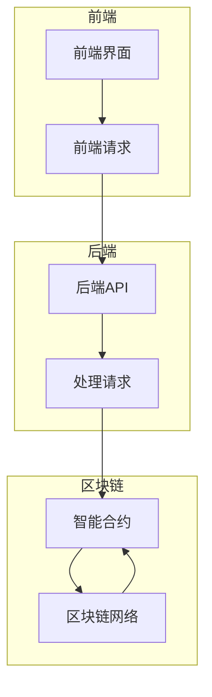
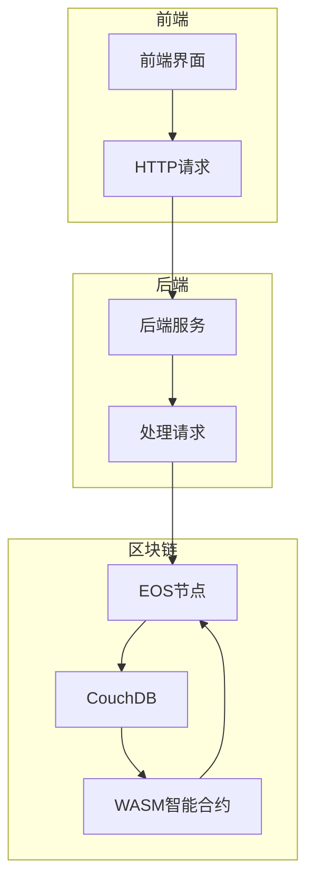

                 

### 摘要

本文深入探讨智能合约的开发与应用，旨在为读者提供一个全面且详细的智能合约开发指南。智能合约，作为区块链技术的重要组成部分，具有自主执行合同条款、不可篡改、透明高效等特点，成为推动区块链应用发展的核心。本文首先介绍了智能合约的基础知识，包括其背景、原理、与传统合约的区别等；接着讲解了智能合约编程的基础，如Solidity语言基础、编程模式等；然后详细阐述了智能合约的开发流程、应用案例以及安全性问题。此外，本文还探讨了智能合约与去中心化应用（DApp）的关系，以及性能优化和可扩展性设计等高级话题。最后，本文总结了智能合约开发的最佳实践，为读者提供实用的技巧和经验。希望通过本文，读者能够对智能合约的开发与应用有一个全面且深入的理解。

### 关键词

- 智能合约
- 区块链
- Solidity
- 安全性
- 去中心化应用（DApp）

### 第一部分：智能合约基础

#### 第1章：智能合约概述

#### 1.1 区块链与智能合约的背景

##### 1.1.1 区块链技术的起源与发展

区块链技术起源于2008年，由一位化名为中本聪（Satoshi Nakamoto）的人提出了比特币的概念。区块链技术最初的设计目的是为了创建一个去中心化的数字货币系统，使货币交易不再依赖于中央银行或第三方金融机构。中本聪发布的比特币白皮书详细阐述了区块链技术的原理和应用。

区块链的基本概念可以概括为分布式账本、共识机制和加密算法。分布式账本是指通过计算机网络存储和管理数据，而不是集中在某个中心服务器上。共识机制则是网络中的所有节点通过某种算法达成一致，确保数据的真实性和有效性。加密算法则用于保护数据的安全性，确保数据的隐私性和不可篡改性。

自比特币以来，区块链技术得到了迅猛发展，不仅在金融领域产生了深远影响，还在供应链管理、身份验证、物联网等多个领域展示了巨大的应用潜力。区块链技术逐渐从理论走向实践，成为现代信息技术的重要组成部分。

##### 1.1.2 智能合约的概念与原理

智能合约，作为一种计算机程序，其本质是一种自动化执行合同条款的协议。与传统的法律合同不同，智能合约可以直接在区块链上执行，无需依赖第三方中介机构。智能合约的提出，源于区块链技术的去中心化和不可篡改特性，为建立更加透明、高效和安全的合同执行机制提供了可能。

智能合约的工作原理可以简单概括为以下三个步骤：

1. **编写合约**：开发者使用特定的编程语言（如Solidity）编写智能合约的代码，定义合同条款和条件。
2. **部署合约**：将编写的智能合约上传到区块链网络，使其成为区块链上的一部分。
3. **执行合约**：当满足预定的条件时，智能合约会自动执行，并记录在区块链上。

智能合约的核心特点包括：

- **自动执行**：智能合约的执行过程完全由代码控制，一旦触发条件，合同条款就会自动执行，无需人为干预。
- **不可篡改**：智能合约一旦部署到区块链上，其代码和执行结果将永久记录，无法被篡改。
- **透明性**：智能合约的代码和执行结果对所有网络参与者可见，保证了交易的透明性。

##### 1.1.3 智能合约与传统合约的区别

智能合约与传统合约在执行方式、安全性、成本和灵活性等方面存在显著差异。

1. **执行方式**：传统合约的执行依赖于第三方中介机构，如律师、公证处等。而智能合约则通过区块链网络自动执行，无需中介，提高了执行效率。
2. **安全性**：智能合约的安全依赖于区块链技术的加密算法和共识机制，确保了合同条款的不可篡改性和数据的真实性。而传统合约的安全性则依赖于中介机构的信誉和法规的约束。
3. **成本**：智能合约的执行成本相对较低，因为去除了中介环节。传统合约则可能涉及大量的法律费用、手续费等。
4. **灵活性**：智能合约的代码可以灵活修改和升级，以适应业务需求的变化。传统合约则较为固定，修改和升级需要经过繁琐的流程。

总的来说，智能合约在许多方面具有明显优势，但也面临一定的挑战，如技术复杂度、安全性问题等。了解智能合约与传统合约的区别，有助于我们更好地把握其应用场景和潜力。

#### 1.2 智能合约的核心要素

##### 1.2.1 智能合约的语言与平台

智能合约的开发依赖于特定的编程语言和平台。目前最常用的智能合约语言是Solidity，它是一种面向对象的高级编程语言，专为以太坊区块链设计。Solidity具有易学易用、功能强大等特点，支持多种编程模式，如状态变量、函数、事件等。

除了Solidity，还有其他一些智能合约语言，如Serpent、Vyper等。这些语言各具特点，开发者可以根据项目需求选择合适的语言进行开发。

智能合约平台是指用于部署和执行智能合约的区块链网络。目前最流行的智能合约平台是以太坊，它是一个开源的去中心化应用平台，支持丰富的智能合约功能。除了以太坊，还有其他一些知名的智能合约平台，如EOS、Tron等。

##### 1.2.2 智能合约的语法结构

智能合约的语法结构相对简单，主要由以下几个部分组成：

1. **状态变量**：用于存储智能合约的数据，如用户的余额、状态等。状态变量可以是公有的或私有的，公有的状态变量可以被所有外部调用者访问，而私有状态变量只能在合约内部访问。
2. **函数**：用于定义智能合约的行为。函数可以接受输入参数，返回值，并执行特定的操作。函数可以是内联的或外部的，内联函数直接嵌入在合约代码中，而外部函数则需要单独定义。
3. **事件**：用于记录合约执行过程中的重要事件，如转账、合同创建等。事件可以被外部监听器订阅，用于实现实时数据同步和监控。
4. **枚举**：用于定义合约中的常量值。枚举可以简化代码，提高可读性和可维护性。

##### 1.2.3 智能合约的安全性与漏洞分析

智能合约的安全性是开发过程中的关键问题。由于智能合约代码将在区块链上永久执行，任何漏洞都可能导致严重的后果，包括资金损失、数据泄露等。

智能合约的安全性问题主要包括以下几个方面：

1. **代码漏洞**：智能合约代码可能包含逻辑错误、未处理异常等情况，导致合约执行失败或被恶意攻击。常见的代码漏洞包括重新进入攻击（Reentrancy）、整数溢出、调用堆栈滥用等。
2. **共识机制漏洞**：区块链网络的共识机制可能存在缺陷，导致节点之间无法达成一致，影响合约的执行。例如，某些共识算法可能受到51%攻击的威胁。
3. **外部接口漏洞**：智能合约与外部系统交互时，可能存在不安全的外部接口，如未校验输入、不安全的调用等，这些漏洞可能导致合约被恶意攻击。
4. **网络攻击**：区块链网络可能受到各种形式的网络攻击，如DDoS攻击、双花攻击等，影响合约的执行和数据的真实性。

为了提高智能合约的安全性，开发者需要采取以下措施：

1. **代码审查**：对智能合约代码进行严格的代码审查，发现并修复潜在的安全漏洞。
2. **安全审计**：聘请专业的安全审计团队对合约代码进行审计，确保其安全性。
3. **安全框架**：使用现有的安全框架和工具，如OpenZeppelin等，提高合约的安全性和可靠性。
4. **合理设计**：在设计智能合约时，应遵循最佳实践，避免使用过于复杂的逻辑，简化合约结构。

通过了解智能合约的核心要素，开发者可以更好地掌握智能合约的开发技巧，提高合约的安全性，为区块链应用的发展打下坚实基础。

#### 1.3 智能合约的应用领域

智能合约作为一种新兴的技术，在多个领域展示出了强大的应用潜力。以下是一些智能合约的主要应用领域：

1. **金融领域**：智能合约在金融领域的应用非常广泛，包括数字货币、去中心化金融（DeFi）、供应链金融等。例如，基于智能合约的数字货币如比特币和以太币已经成为金融交易的重要工具；去中心化金融平台如Aave和Compound利用智能合约实现贷款、借贷和交易等功能，提高了金融系统的透明度和效率。

2. **供应链管理**：智能合约在供应链管理中的应用可以显著提高供应链的透明度和可信度。例如，使用智能合约可以实现商品从生产到交付的全程追踪，确保每个环节的数据真实可靠。此外，智能合约还可以用于供应链金融，通过自动化执行合同条款，提高融资效率，降低金融风险。

3. **版权与知识产权**：智能合约在版权和知识产权管理中具有巨大的应用潜力。通过智能合约，艺术家和创作者可以确保他们的作品得到合法授权和支付，减少了侵权行为。例如，数字艺术市场Nifty Gateway使用智能合约实现艺术品的买卖和授权，确保了交易的合法性和透明度。

4. **身份验证与物联网**：智能合约在身份验证和物联网（IoT）领域也有广泛应用。通过智能合约，可以建立去中心化的身份验证系统，确保用户的隐私和安全。在物联网中，智能合约可以用于设备之间的数据交换和操作授权，实现更加安全和高效的物联网应用。

5. **投票与选举**：智能合约在投票和选举中的应用可以提供去中心化和透明化的投票系统，防止选举欺诈。例如，2018年的瑞士议会选举中，就使用了基于区块链的智能合约进行投票，确保了选举结果的真实性和公正性。

智能合约的应用领域还在不断扩展，随着技术的进步和市场的需求，其应用潜力将进一步释放。开发者可以通过了解和探索智能合约在不同领域的应用，发挥其优势，推动区块链技术的发展。

#### 第2章：智能合约编程基础

#### 2.1 Solidity语言基础

Solidity是一种面向对象的高级编程语言，专为以太坊区块链设计。它具有易学易用、功能强大等特点，支持多种编程模式，如状态变量、函数、事件等。以下是Solidity语言的基础知识，包括其简介、数据类型、变量和基本控制结构等。

##### 2.1.1 Solidity语言简介

Solidity语言由Chase Wang、Gav Wood、Yonatan Sompolinsky和Alex Beregszaszi等人于2014年开发，旨在提供一个简单且功能强大的语言来编写智能合约。Solidity语言的设计受到C++和Python等编程语言的影响，同时借鉴了JavaScript和Python等语言的语法特性。

Solidity的主要特点包括：

1. **面向对象**：Solidity支持面向对象编程，包括类、继承、接口和封装等概念。
2. **事件驱动**：智能合约可以通过事件监听器来响应外部事件，提高了系统的响应性和灵活性。
3. **灵活性强**：Solidity支持多种数据类型、运算符和表达式，可以灵活地处理各种编程场景。
4. **安全性高**：Solidity内置了多种安全检查机制，如数组越界检查、访问控制等，提高了智能合约的安全性。

##### 2.1.2 数据类型与变量

Solidity支持多种数据类型，包括基础数据类型和复合数据类型。

1. **基础数据类型**：

   - **布尔型（bool）**：表示真或假的值，如`true`和`false`。
   - **整数型（int）**：表示整数值，如`int8`、`int16`、`int32`、`int64`、`int128`、`int256`等。
   - **浮点型（uint）**：表示无符号整数值，如`uint8`、`uint16`、`uint32`、`uint64`、`uint128`、`uint256`等。
   - **地址型（address）**：表示以太坊网络中的账户地址，如`0x1234...`。

2. **复合数据类型**：

   - **数组（array）**：用于存储一组相同类型的值，可以是固定长度的或动态长度的。
   - **结构体（struct）**：用于封装一组相关联的变量，类似于C语言的结构体。
   - **映射（map）**：用于存储键值对，类似于Python的字典。

在Solidity中，变量用于存储数据。变量分为状态变量和局部变量。

1. **状态变量**：状态变量是存储在区块链上的永久数据，可以在整个智能合约生命周期内访问。状态变量的访问权限可以是公有的或私有的。
2. **局部变量**：局部变量是存储在合约函数内部的临时数据，仅在函数执行期间有效。

##### 2.1.3 控制结构

Solidity支持多种控制结构，包括条件语句、循环语句和异常处理。

1. **条件语句**：条件语句用于根据条件执行不同的代码块。

   ```solidity
   if (condition) {
       // 当condition为真时执行的代码
   } else {
       // 当condition为假时执行的代码
   }
   ```

2. **循环语句**：循环语句用于重复执行一段代码，直到满足特定条件。

   ```solidity
   for (初始化; 条件; 迭代表达式) {
       // 循环体
   }
   ```

   - `while`循环：`while (条件) { // 循环体 }`
   - `do-while`循环：`do { // 循环体 } while (条件);`

3. **异常处理**：异常处理用于处理合约执行过程中可能出现的错误。

   ```solidity
   try {
       // 可能抛出异常的代码
   } catch Error(string memory reason) {
       // 处理异常的代码
   }
   ```

##### 2.1.4 函数与事件

Solidity中的函数用于定义智能合约的行为，可以是内联的或外部的。

1. **内联函数**：内联函数直接嵌入在合约代码中，不需要单独定义。

   ```solidity
   function inlineFunction() internal pure returns (uint) {
       return 123;
   }
   ```

2. **外部函数**：外部函数需要单独定义，可以接受输入参数并返回值。

   ```solidity
   function externalFunction(uint input) external returns (uint) {
       return input * 2;
   }
   ```

事件是Solidity中用于记录合约执行过程中的重要事件的一种机制。

```solidity
event LogEvent(uint indexed id, string message);
```

事件可以被外部监听器订阅，用于实现实时数据同步和监控。

通过掌握Solidity语言的基础知识，开发者可以开始编写智能合约，实现自动化、去中心化的合同执行。接下来，我们将进一步探讨智能合约的编程模式，包括前端与后端的交互、模块化设计以及测试与调试等。

#### 2.2 智能合约的编程模式

##### 2.2.1 前端与后端的交互

在智能合约的开发中，前端与后端的交互是一个关键环节。前端通常负责用户界面和数据输入，而后端则通过智能合约与区块链网络进行交互，实现数据的存储和处理。

1. **前端与后端交互的基本流程**：

   - **用户操作**：用户在前端界面进行操作，如填写表单、提交请求等。
   - **前端调用合约**：前端通过调用智能合约的接口，将用户操作转化为对合约的调用。
   - **合约处理**：智能合约接收到前端调用后，根据合约代码的逻辑处理请求，如执行数据存储、数据查询等操作。
   - **合约响应**：合约执行完毕后，将结果返回给前端，供前端界面展示。

2. **常见的前端与后端交互技术**：

   - **Web3.js**：Web3.js是一个广泛使用的JavaScript库，用于与以太坊区块链进行交互。它提供了丰富的API，支持智能合约的调用、事件订阅和区块链数据的读取。
   - **Ethers.js**：Ethers.js是一个更现代的JavaScript库，提供了更高效、更安全的区块链交互功能。它支持以太坊网络的多种操作，如发送交易、调用合约函数、监听事件等。
   - **Truffle**：Truffle是一个开发框架，提供了丰富的工具来简化智能合约的开发和测试。它集成了Web3.js，支持与以太坊网络的交互，并提供了一个本地区块链环境，方便开发者进行测试和调试。

##### 2.2.2 智能合约的模块化设计

模块化设计是智能合约开发中的一种最佳实践，它有助于提高代码的可维护性和可扩展性。模块化设计将智能合约的功能划分为多个模块，每个模块负责特定的功能，模块之间通过接口进行通信。

1. **模块化设计的基本原则**：

   - **高内聚、低耦合**：模块内部的功能应具有较高的内聚性，模块之间的依赖应尽量减少，降低模块之间的耦合性。
   - **单一职责**：每个模块应具有单一职责，模块内部的功能应集中在一个特定的任务上。
   - **接口明确**：模块之间的交互应通过明确的接口进行，避免直接调用模块内部的实现细节。

2. **实现模块化设计的方法**：

   - **合约继承**：Solidity支持合约的继承，可以通过创建基类和派生类来实现模块化设计。基类定义通用的功能和方法，派生类扩展特定的功能。
   - **接口合约**：接口合约定义了模块之间的通信协议，实现接口的合约可以与任何实现相同接口的合约进行交互。
   - **外部库**：通过外部库（如OpenZeppelin）提供的模块化合约，可以简化模块化设计的实现。

##### 2.2.3 智能合约的测试与调试

测试和调试是智能合约开发中不可或缺的环节，它有助于确保合约的正确性和安全性。Solidity提供了丰富的测试框架和工具，支持合约的自动化测试和手动调试。

1. **智能合约测试的基本流程**：

   - **编写测试用例**：根据合约的功能需求，编写测试用例，测试合约在各种输入条件下的行为。
   - **执行测试用例**：使用测试框架（如Truffle）执行测试用例，检查合约的输出结果是否符合预期。
   - **调试与修复**：根据测试结果，对合约代码进行调试和修复，确保合约的正确性和安全性。

2. **常见的测试和调试工具**：

   - **Truffle**：Truffle是一个全面的开发框架，提供了测试、部署和交互工具。它集成了Mocha测试框架和Chai断言库，支持自动化测试和模拟环境。
   - **Ganache**：Ganache是一个本地以太坊节点，用于测试和调试智能合约。它提供了一个模拟区块链环境，可以方便地部署和测试合约。
   - **Hardhat**：Hardhat是一个新型的开发工具，提供了高性能的本地以太坊环境，支持TypeScript和Eth tx API。它简化了智能合约的开发和测试过程，提供了丰富的功能。

通过前端与后端的交互、模块化设计和测试与调试等编程模式，开发者可以有效地开发和维护智能合约，确保合约的正确性和安全性。接下来，我们将详细介绍智能合约的开发流程，从环境搭建到合约的创建与部署。

#### 第3章：智能合约开发流程

##### 3.1 开发环境搭建

智能合约的开发需要配置特定的开发环境，以确保开发者能够高效地进行编写、测试和部署。以下是搭建智能合约开发环境的详细步骤：

###### 3.1.1 安装Node.js和npm

Node.js是一个基于Chrome V8引擎的JavaScript运行环境，npm则是Node.js的包管理器。安装Node.js和npm是智能合约开发的基础。

1. 访问Node.js官网（[https://nodejs.org/），下载适合操作系统的安装包。  
2. 运行安装程序，并选择自定义安装选项，确保安装Node.js和npm。  
3. 安装完成后，在命令行中运行`node -v`和`npm -v`，确认Node.js和npm的版本。

###### 3.1.2 安装Truffle

Truffle是一个用于智能合约开发的强大框架，提供了测试、部署和交互工具。安装Truffle可以通过npm全局安装。

1. 打开命令行终端，执行以下命令：

   ```bash
   npm install -g truffle
   ```

2. 安装完成后，运行`truffle version`命令，确认Truffle的版本。

###### 3.1.3 安装Ganache

Ganache是一个本地以太坊节点，用于测试和调试智能合约。安装Ganache可以通过其官方网站下载。

1. 访问Ganache官网（[https://www.trufflesuite.com/ganache），下载适合操作系统的安装包。  
2. 运行安装程序，并按照提示完成安装。  
3. 打开Ganache，创建一个新的空账户，并记录账户的私钥。私钥是解锁和管理账户的重要凭证，务必妥善保管。

###### 3.1.4 配置Truffle项目

配置Truffle项目是开发智能合约的第一步。以下是如何创建一个新的Truffle项目和配置其环境：

1. 打开命令行终端，进入希望创建项目的目录。
2. 执行以下命令创建一个新的Truffle项目：

   ```bash
   truffle init
   ```

   这将生成一个基本的Truffle项目结构，包括`.truffle`、`migrations`、`contracts`和`test`等目录。

3. 在项目的`truffle-config.js`文件中配置以太坊网络和Ganache：

   ```javascript
   module.exports = {
     networks: {
       development: {
         host: "127.0.0.1",
         port: 7545,
         network_id: "*",
       },
     },
   };
   ```

4. 确保所有依赖都已安装，执行以下命令：

   ```bash
   truffle install
   ```

5. 运行Ganache，确保网络连接正常，并创建一个新的交易账户，用于测试和部署智能合约。

通过以上步骤，开发者可以搭建一个完整的智能合约开发环境，为后续的智能合约开发打下坚实基础。

##### 3.2 智能合约的创建与部署

在智能合约开发过程中，创建和部署合约是关键步骤。以下将详细介绍如何使用Truffle框架和Ganache节点来编写、编译和部署智能合约。

###### 3.2.1 智能合约的编写

智能合约的编写主要通过Solidity语言实现。以下是一个简单的智能合约示例，用于存储和修改一个数值。

```solidity
// SPDX-License-Identifier: MIT
pragma solidity ^0.8.0;

contract SimpleStorage {
    uint256 storedData;

    function set(uint256 data) public {
        storedData = data;
    }

    function get() public view returns (uint256) {
        return storedData;
    }
}
```

在此合约中，`SimpleStorage`是一个存储单一数值的智能合约，通过`set`函数设置数值，通过`get`函数获取数值。

###### 3.2.2 编译智能合约

在编写完智能合约后，需要将其编译为以太坊虚拟机（EVM）可识别的字节码。Truffle框架提供了方便的编译工具。

1. 使用Truffle命令编译智能合约：

   ```bash
   truffle compile
   ```

   这将编译所有在`contracts`目录下的智能合约，并生成对应的ABI和字节码文件。

2. 查看编译结果，在`build/contracts`目录中，可以看到编译后的智能合约文件，如`SimpleStorage.json`。

###### 3.2.3 部署智能合约

智能合约的部署是将合约代码上传到区块链网络，并为其分配地址，以便外部调用。

1. 使用Truffle命令部署智能合约：

   ```bash
   truffle migrate --network development
   ```

   这将启动Truffle开发网络（Ganache），并使用最新版本的智能合约代码进行部署。

2. 部署过程中，Truffle将自动调用`migrations`文件夹中的脚本，执行合约的部署和迁移操作。

3. 部署完成后，查看日志输出，获取智能合约的地址。

```json
{
  "SimpleStorage": {
    "contractName": "SimpleStorage",
    "networks": {
      "5777": {
        "address": "0x3cB6F6aDd40bFb8cE1eD2c726Ae9771c746E0c8c",
        "transactionHash": "0x22c8c3a5d8c0a6c7e5359d1c4e4b3c0c8a4579a6096f4d2a7e04d68d8f66b8147b066c670"
      }
    }
  }
}
```

在此示例中，智能合约的地址为`0x3cB6F6aDd40bFb8cE1eD2c726Ae9771c746E0c8c`。

###### 3.2.4 部署后的验证

部署智能合约后，可以通过区块链浏览器（如Etherscan）验证合约的详细信息，包括合约代码、ABI、部署事务等。

1. 在Etherscan上输入智能合约地址，如`0x3cB6F6aDd40bFb8cE1eD2c726Ae9771c746E0c8c`。
2. 查看合约的代码和ABI，确保其与本地部署的一致。

通过以上步骤，开发者可以成功创建和部署智能合约。接下来，我们将进一步探讨智能合约在区块链应用中的实际案例。

##### 第4章：智能合约应用案例分析

智能合约在区块链应用中具有广泛的应用场景，以下通过两个典型案例：基于ERC20代币的智能合约和基于ERC721非同质化代币（NFT）的智能合约，详细介绍其实现过程和应用场景。

#### 4.1 基于ERC20代币的智能合约

ERC20标准是智能合约的一种通用实现，用于创建和管理数字代币。以下是如何基于ERC20标准实现一个简单的代币智能合约。

##### 4.1.1 ERC20标准概述

ERC20是一种用于创建和管理标准代币的智能合约标准，由以太坊社区提出。它定义了一套协议和接口，包括以下关键要素：

- **总量**：代币的总供应量。
- **名称**：代币的名称，如“BTC Token”。
- **符号**：代币的符号，如“BTC”。
- **小数位数**：代币的最小单位，通常为8位，即0.00000001 BTC。

ERC20标准定义了一套接口，包括以下函数：

- **`totalSupply()`**：返回代币的总供应量。
- **`balanceOf(address account)`**：返回指定账户的代币余额。
- **`transfer(address recipient, uint256 amount)`**：将指定数量的代币从发送者转移到接收者。
- **`allowance(address spender, address owner)`**：查询`owner`允许`spender`转移的代币数量。
- **`approve(address spender, uint256 amount)`**：设置`spender`允许转移的代币数量。
- **`transferFrom(address sender, address recipient, uint256 amount)`**：从`sender`的账户中转移代币到`recipient`的账户。

##### 4.1.2 ERC20智能合约实现

以下是一个简单的ERC20代币智能合约示例：

```solidity
// SPDX-License-Identifier: MIT
pragma solidity ^0.8.0;

interface IERC20 {
    function totalSupply() external view returns (uint256);
    function balanceOf(address account) external view returns (uint256);
    function transfer(address recipient, uint256 amount) external returns (bool);
    function allowance(address owner, address spender) external view returns (uint256);
    function approve(address spender, uint256 amount) external returns (bool);
    function transferFrom(address sender, address recipient, uint256 amount) external returns (bool);
}

contract ERC20 is IERC20 {
    string public name;
    string public symbol;
    uint8 public decimals;
    uint256 private _totalSupply;
    mapping(address => uint256) private _balances;
    mapping(address => mapping(address => uint256)) private _allowances;

    constructor(uint256 totalSupply_, string memory name_, string memory symbol_) {
        _totalSupply = totalSupply_;
        _balances[msg.sender] = _totalSupply;
        name = name_;
        symbol = symbol_;
        decimals = 18;
    }

    function totalSupply() public view override returns (uint256) {
        return _totalSupply;
    }

    function balanceOf(address account) public view override returns (uint256) {
        return _balances[account];
    }

    function transfer(address recipient, uint256 amount) public override returns (bool) {
        require(recipient != address(0), "ERC20: transfer to the zero address");
        require(_balances[msg.sender] >= amount, "ERC20: transfer amount exceeds balance");
        
        _balances[msg.sender] -= amount;
        _balances[recipient] += amount;
        emit Transfer(msg.sender, recipient, amount);
        return true;
    }

    function approve(address spender, uint256 amount) public override returns (bool) {
        require(spender != address(0), "ERC20: approve to the zero address");
        _allowances[msg.sender][spender] = amount;
        emit Approval(msg.sender, spender, amount);
        return true;
    }

    function allowance(address owner, address spender) public view override returns (uint256) {
        return _allowances[owner][spender];
    }

    function transferFrom(address sender, address recipient, uint256 amount) public override returns (bool) {
        require(sender != address(0), "ERC20: transfer from the zero address");
        require(recipient != address(0), "ERC20: transfer to the zero address");
        require(_balances[sender] >= amount, "ERC20: transfer amount exceeds balance");
        require(_allowances[sender][msg.sender] >= amount, "ERC20: transfer amount exceeds allowance");
        
        _balances[sender] -= amount;
        _balances[recipient] += amount;
        _allowances[sender][msg.sender] -= amount;
        emit Transfer(sender, recipient, amount);
        return true;
    }
}
```

在此合约中，`ERC20`实现了ERC20标准，包括代币的总供应量、账户余额、代币转移等功能。

##### 4.1.3 基于ERC20的代币发行与交易

基于ERC20标准的代币可以方便地进行发行和交易。以下是如何使用Truffle框架和MetaMask钱包进行代币发行和交易。

###### 4.1.3.1 代币发行

1. 在Truffle项目中创建一个`contracts`目录，并创建一个名为`Token.sol`的文件，将上述`ERC20`合约代码复制进去。
2. 编译合约并部署到本地以太坊节点（Ganache）。

   ```bash
   truffle compile
   truffle migrate --network development
   ```

3. 在Ganache中创建一个新的交易账户，并使用MetaMask连接到Ganache网络。

4. 在MetaMask中安装ERC20标准的Token注册表（Registry）插件，用于管理多个ERC20代币。

5. 在MetaMask中创建一个自定义代币，填写相关信息（如名称、符号、小数位数等），并将合约地址设置为刚刚部署的ERC20合约地址。

###### 4.1.3.2 代币交易

1. 在MetaMask中连接到本地以太坊节点（Ganache），确保已创建和发行的ERC20代币显示在账户余额中。
2. 通过调用`transfer`或`transferFrom`函数，将代币从一个账户转移到另一个账户。

```javascript
// 示例：从账户A转移到账户B 100个代币
erc20Instance.transfer(accountB, 100);
```

通过以上步骤，开发者可以创建和交易基于ERC20标准的代币，实现去中心化的数字货币管理。

#### 4.2 基于ERC721非同质化代币（NFT）的智能合约

ERC721标准是用于创建和管理非同质化代币（NFT）的智能合约标准。NFT代表独一无二的数字资产，如数字艺术品、收藏品等。

##### 4.2.1 ERC721标准概述

ERC721标准定义了一套接口和协议，用于创建和管理非同质化代币。以下是其核心要素：

- **唯一标识符**：每个NFT都有一个唯一的标识符（tokenID），确保其独一无二。
- **拥有者**：每个NFT都有一个当前拥有者，可以通过转移所有权进行交易。
- **数据存储**：NFT的数据通常存储在链下，如IPFS或中心化服务器上。

ERC721标准定义了一套接口，包括以下关键函数：

- **`balanceOf(address owner)`**：返回指定账户拥有的NFT数量。
- **`ownerOf(uint256 tokenId)`**：返回指定tokenID的NFT的当前拥有者。
- **`tokenByIndex(uint256 index)`**：返回指定索引的NFT的tokenID。
- **`tokenOfOwnerByIndex(address owner, uint256 index)`**：返回指定账户在指定索引的NFT的tokenID。
- **`safeTransferFrom(address from, address to, uint256 tokenId)`**：安全地转移NFT所有权。
- **`transferFrom(address from, address to, uint256 tokenId)`**：转移NFT所有权。

##### 4.2.2 ERC721智能合约实现

以下是一个简单的ERC721智能合约示例：

```solidity
// SPDX-License-Identifier: MIT
pragma solidity ^0.8.0;

interface IERC721 {
    function balanceOf(address owner) external view returns (uint256 balance);
    function ownerOf(uint256 tokenId) external view returns (address owner);
    function safeTransferFrom(address from, address to, uint256 tokenId) external;
    function transferFrom(address from, address to, uint256 tokenId) external;
    function approve(address to, uint256 tokenId) external;
    function getApproved(uint256 tokenId) external view returns (address approved);
    function setApprovalForAll(address operator, bool approved) external;
    function isApprovedForAll(address owner, address operator) external view returns (bool);
    function tokenByIndex(uint256 index) external view returns (uint256);
    function tokenOfOwnerByIndex(address owner, uint256 index) external view returns (uint256);
    event Transfer(address from, address to, uint256 tokenId);
    event Approval(address owner, address approved, uint256 tokenId);
    event ApprovalForAll(address owner, address operator, bool approved);
}

contract ERC721 is IERC721 {
    mapping(uint256 => address) private _owners;
    mapping(address => uint256) private _balances;
    mapping(uint256 => address) private _tokenApprovals;
    mapping(address => mapping(address => bool)) private _operatorApprovals;

    string private _name;
    string private _symbol;

    constructor(string memory name_, string memory symbol_) {
        _name = name_;
        _symbol = symbol_;
    }

    function balanceOf(address owner) public view override returns (uint256) {
        require(owner != address(0), "ERC721: balance query for the zero address");
        return _balances[owner];
    }

    function ownerOf(uint256 tokenId) public view override returns (address owner) {
        require(_exists(tokenId), "ERC721: owner query for nonexistent token");
        return _owners[tokenId];
    }

    function safeTransferFrom(address from, address to, uint256 tokenId) public override {
        transferFrom(from, to, tokenId);
    }

    function transferFrom(address from, address to, uint256 tokenId) public override {
        require(_isApprovedOrOwner(msg.sender, tokenId), "ERC721: transfer caller is not owner nor approved");
        require(_owns(from, tokenId), "ERC721: transfer of nonexistent token");
        require(to != address(0), "ERC721: transfer to the zero address");

        _transfer(from, to, tokenId);
        emit Transfer(from, to, tokenId);
    }

    function approve(address to, uint256 tokenId) public override {
        require(_isApprovedOrOwner(msg.sender, tokenId), "ERC721: approve caller is not owner nor approved");
        _approve(to, tokenId);
        emit Approval(msg.sender, to, tokenId);
    }

    function getApproved(uint256 tokenId) public view override returns (address approved) {
        require(_exists(tokenId), "ERC721: approved query for nonexistent token");
        return _tokenApprovals[tokenId];
    }

    function setApprovalForAll(address operator, bool approved) public override {
        require(operator != msg.sender, "ERC721: approve to caller");
        _operatorApprovals[msg.sender][operator] = approved;
        emit ApprovalForAll(msg.sender, operator, approved);
    }

    function isApprovedForAll(address owner, address operator) public view override returns (bool) {
        return _operatorApprovals[owner][operator];
    }

    function tokenByIndex(uint256 index) public view override returns (uint256) {
        require(index < _tokenCount(), "ERC721: global index out of bounds");
        return _tokenIds[index];
    }

    function tokenOfOwnerByIndex(address owner, uint256 index) public view override returns (uint256) {
        require(index < _balanceOf(owner), "ERC721: owner index out of bounds");
        return _tokenIds[_balances[owner] - index - 1];
    }

    function name() public view override returns (string memory) {
        return _name;
    }

    function symbol() public view override returns (string memory) {
        return _symbol;
    }

    function tokenCount() public view override returns (uint256) {
        return _tokenCount();
    }

    function _mint(address to, uint256 tokenId) internal {
        require(_owners[tokenId] == address(0), "ERC721: token already minted");
        require(to != address(0), "ERC721: mint to the zero address");

        _balances[to] += 1;
        _owners[tokenId] = to;
        _tokenIds.push(tokenId);
        emit Transfer(address(0), to, tokenId);
    }

    function _transfer(address from, address to, uint256 tokenId) internal {
        require(_owns(from, tokenId), "ERC721: transfer of nonexistent token");
        require(to != address(0), "ERC721: transfer to the zero address");

        _balances[from] -= 1;
        _balances[to] += 1;
        _owners[tokenId] = to;
        emit Transfer(from, to, tokenId);
    }

    function _exists(uint256 tokenId) internal view returns (bool) {
        return _owners[tokenId] != address(0);
    }

    function _isApprovedOrOwner(address spender, uint256 tokenId) internal view returns (bool) {
        require(_exists(tokenId), "ERC721: operator query for nonexistent token");
        address owner = _owners[tokenId];
        return (spender == owner) || _operatorApprovals[owner][spender];
    }

    function _owns(address owner, uint256 tokenId) internal view returns (bool) {
        return _exists(tokenId) && _owners[tokenId] == owner;
    }

    function _approve(address to, uint256 tokenId) internal {
        _tokenApprovals[tokenId] = to;
        emit Approval(msg.sender, to, tokenId);
    }

    function _tokenCount() private view returns (uint256) {
        return _tokenIds.length;
    }
}
```

在此合约中，`ERC721`实现了ERC721标准，包括NFT的创建、转移和查询等功能。

##### 4.2.3 基于ERC721的数字艺术品交易

基于ERC721标准的NFT可以用于数字艺术品的交易。以下是如何使用Truffle框架和OpenSea平台进行数字艺术品交易。

###### 4.2.3.1 数字艺术品创建

1. 在Truffle项目中创建一个`contracts`目录，并创建一个名为`ArtToken.sol`的文件，将上述`ERC721`合约代码复制进去。
2. 编译合约并部署到本地以太坊节点（Ganache）。

   ```bash
   truffle compile
   truffle migrate --network development
   ```

3. 在Ganache中创建一个新的交易账户，并使用MetaMask连接到Ganache网络。

4. 在MetaMask中安装ERC721标准的Token注册表（Registry）插件，用于管理多个ERC721代币。

5. 在MetaMask中创建一个新的ERC721代币，填写相关信息（如名称、符号等），并将合约地址设置为刚刚部署的ERC721合约地址。

6. 创建数字艺术品，并使用`_mint`函数将其发行到一个账户。

```javascript
// 示例：创建一个数字艺术品并发行到账户A
artTokenInstance._mint(accountA, 1);
```

###### 4.2.3.2 数字艺术品交易

1. 在OpenSea平台上创建一个账户，并连接到本地以太坊节点（Ganache）。

2. 在OpenSea平台上浏览和购买数字艺术品。用户可以通过调用`safeTransferFrom`或`transferFrom`函数购买艺术品。

```javascript
// 示例：用户B购买艺术品（tokenID为1）并转移所有权到账户B
artTokenInstance.safeTransferFrom(accountA, accountB, 1);
```

3. OpenSea平台将自动处理交易流程，并显示数字艺术品的所有权变更。

通过以上步骤，开发者可以创建和交易基于ERC721标准的数字艺术品，实现去中心化的数字资产交易和管理。

智能合约的应用案例不仅限于以上两个领域，还可以扩展到供应链管理、投票系统、游戏等领域。开发者可以根据实际需求，设计和实现各种具有创新性的智能合约应用。

#### 第5章：智能合约安全与审计

##### 5.1 智能合约常见漏洞分析

智能合约的安全性是开发者必须关注的关键问题。由于智能合约在区块链上运行，其代码一旦部署，便难以修改，因此任何漏洞都可能带来严重的后果。以下分析智能合约中常见的几种漏洞及其成因和影响。

###### 5.1.1 Reentrancy攻击

Reentrancy攻击是一种常见的智能合约漏洞，其核心原理是在智能合约执行过程中，恶意外部调用者可以在合约处理内部逻辑之前多次调用合约中的函数，从而耗尽合约资金。

**成因**：Reentrancy攻击通常发生在合约中存在外部调用函数（如接收以太币）并在此过程中进行状态修改的操作。由于以太坊虚拟机（EVM）的执行模型，外部调用可以在合约执行内部逻辑之前发生，导致合约在资金未完全转移之前再次接收调用。

**影响**：Reentrancy攻击可能导致合约资金被完全耗尽，因为恶意调用者可以不断调用合约函数，直到资金耗尽。

**案例**：2016年，The DAO智能合约遭受了著名的Reentrancy攻击，导致约3600万以太币被盗。

###### 5.1.2 漏洞利用案例分析

以下是一些著名的智能合约漏洞案例分析：

1. **The DAO攻击**：2016年5月，The DAO智能合约被黑客利用Reentrancy漏洞攻击，导致约3600万以太币被盗。该事件揭示了智能合约安全性的严重问题，并促使了以太坊硬分叉的诞生，以恢复被盗资金。

2. **Parity Wallet漏洞**：2017年11月，Parity钱包智能合约中的一个错误导致所有钱包资金被锁定，无法转移。该漏洞源于智能合约中的一个错误的函数声明。

3. **TokenStatue漏洞**：2017年8月，TokenStatue智能合约遭受了多重签名漏洞攻击，导致大量以太币被盗。攻击者利用了智能合约中签名验证的缺陷，伪造了有效的签名。

###### 5.1.3 漏洞预防措施

为防止智能合约漏洞，开发者可以采取以下措施：

1. **代码审查**：对智能合约代码进行严格的代码审查，发现并修复潜在的安全漏洞。代码审查应包括代码风格检查、逻辑漏洞分析和测试用例验证。
2. **安全审计**：聘请专业的安全审计团队对合约代码进行审计，确保其安全性。安全审计应覆盖合约的代码逻辑、外部接口和安全控制机制。
3. **使用开源安全库**：利用现有的开源安全库（如OpenZeppelin）来提高合约的安全性。这些库提供了丰富的安全函数和最佳实践，减少了开发过程中的安全风险。
4. **安全框架**：采用智能合约安全框架（如Oyente、Mythril等），这些框架可以自动检测合约中的常见漏洞。
5. **合理设计**：在设计智能合约时，遵循最佳实践，如避免复杂逻辑、减少外部调用等，以降低漏洞风险。

通过了解智能合约常见的漏洞及其预防措施，开发者可以更好地确保合约的安全性，为区块链应用的发展提供坚实的基础。

##### 5.2 智能合约安全审计

智能合约安全审计是确保合约代码在部署前不存在安全漏洞的重要环节。通过系统的安全审计，可以识别和修复潜在的漏洞，从而提高智能合约的整体安全性。

###### 5.2.1 安全审计的重要性

智能合约的安全审计具有以下几个重要意义：

1. **提高安全性**：通过审计，可以发现并修复合约中的安全漏洞，防止黑客攻击和资金损失。
2. **增加可信度**：经过专业审计的智能合约能够增加用户和投资者的信任，提高项目的可信度和市场竞争力。
3. **合规性**：许多国家和地区的法律法规要求在部署智能合约前进行安全审计，确保合约的合规性。

###### 5.2.2 审计工具与流程

智能合约安全审计通常包括以下几个步骤和工具：

1. **审计准备**：

   - **审计计划**：制定详细的审计计划和目标，明确审计的范围、深度和进度。
   - **环境搭建**：搭建审计环境，包括智能合约代码、测试网络、审计工具等。

2. **代码审查**：

   - **静态分析**：使用静态分析工具（如Mythril、Oyente等）对智能合约代码进行分析，检测潜在的安全漏洞。
   - **动态分析**：通过模拟执行智能合约代码，检测运行时的异常和潜在漏洞。

3. **测试与验证**：

   - **测试用例设计**：设计一系列测试用例，覆盖合约的各种操作场景，确保审计的全面性。
   - **测试执行**：执行测试用例，验证合约的行为是否符合预期，检测潜在的安全漏洞。

4. **报告与修复**：

   - **漏洞报告**：生成详细的审计报告，列出发现的安全漏洞、漏洞级别和修复建议。
   - **漏洞修复**：根据审计报告，修复发现的安全漏洞，并重新进行审计，确保漏洞得到彻底解决。

###### 5.2.3 审计报告解读

审计报告是审计过程的最终输出，其内容通常包括以下几个部分：

1. **概述**：简要介绍审计目标、范围和过程。
2. **发现**：列出发现的安全漏洞，包括漏洞的级别、影响范围和简要描述。
3. **建议**：提供针对每个漏洞的修复建议，包括修复方案、代码修改等。
4. **结论**：总结审计结果，评估智能合约的整体安全性，并给出进一步的建议。

审计报告的解读和利用是确保智能合约安全的关键。开发者应仔细阅读报告，按照建议进行漏洞修复，并重新进行审计，以确保合约的安全性。

通过智能合约安全审计，开发者可以确保合约在部署前不存在重大安全漏洞，为区块链应用提供可靠的安全保障。

#### 第6章：智能合约与去中心化应用（DApp）

##### 6.1 DApp概述

去中心化应用（Decentralized Application，简称DApp）是建立在区块链或分布式账本技术之上的应用，其核心特点在于去中心化、透明性和安全性。DApp通过智能合约实现数据的存储和处理，避免了中心化机构的控制和干预，提高了系统的可靠性和抗审查性。

###### 6.1.1 DApp的概念与特点

DApp是一种运行在区块链上的应用，其关键特点包括：

1. **去中心化**：DApp的数据和功能由网络中的所有节点共同维护，不存在中心化的控制点。这意味着DApp的运行不受单一实体的影响，提高了系统的可靠性和抗审查性。
2. **透明性**：DApp的运行过程和状态对所有参与者可见，数据的存储和交易记录透明可查。这种透明性增加了用户对系统的信任，并减少了信息不对称。
3. **安全性**：DApp利用区块链技术的加密和共识机制，确保数据的完整性和安全性。智能合约在区块链上执行，其执行结果不可篡改，提高了系统的可靠性。

###### 6.1.2 DApp的开发流程

DApp的开发流程通常包括以下几个步骤：

1. **需求分析**：确定DApp的目标用户、功能需求和应用场景，明确DApp的核心价值和优势。
2. **设计架构**：设计DApp的技术架构，包括区块链选择、智能合约设计、前端后端交互等。
3. **智能合约开发**：编写智能合约代码，实现DApp的核心功能。智能合约开发通常使用Solidity等编程语言。
4. **前端开发**：开发DApp的用户界面，实现与智能合约的交互。前端开发可以使用React、Vue等框架。
5. **后端服务**：提供DApp所需的后端服务，如API接口、数据存储等。后端开发可以使用Node.js、Python等语言。
6. **测试与部署**：对DApp进行全面的测试，确保功能完整、性能稳定和安全可靠。测试完成后，将DApp部署到区块链网络。

通过以上步骤，开发者可以构建一个功能完整、用户友好的DApp。

##### 6.2 常见DApp架构设计与实现

DApp的架构设计直接影响其性能、安全性和可扩展性。以下介绍几种常见的DApp架构设计，并探讨其在不同区块链平台上的实现。

###### 6.2.1 基于以太坊的DApp

以太坊是目前最流行的智能合约平台，支持丰富的去中心化应用。基于以太坊的DApp架构通常包括以下几个部分：

1. **智能合约**：智能合约负责实现DApp的核心功能，如数据存储、交易处理和事件记录。以太坊的智能合约通常使用Solidity语言编写。
2. **前端界面**：前端界面通过Web3.js等库与智能合约进行交互，提供用户操作和数据显示。前端开发可以使用React、Vue等框架。
3. **后端服务**：后端服务通常提供API接口，用于处理前端请求和与智能合约的交互。后端开发可以使用Node.js、Python等语言。

以下是一个简单的以太坊DApp架构设计：



###### 6.2.2 基于EOS的DApp

EOS是一个高性能、去中心化的区块链平台，特别适合构建大规模的DApp。基于EOS的DApp架构通常包括以下几个部分：

1. **CouchDB**：EOS使用CouchDB作为轻量级数据库，用于存储DApp的业务数据。
2. **WebAssembly（WASM）**：EOS支持WebAssembly，用于实现DApp的业务逻辑和智能合约。
3. **前端界面**：前端界面通过HTTP请求与EOS节点交互，获取和提交数据。
4. **后端服务**：后端服务通常用于处理业务逻辑和API接口。

以下是一个简单的EOS DApp架构设计：



通过以上架构设计，开发者可以充分利用EOS的高性能和可扩展性，构建功能强大、用户体验优良的DApp。

###### 6.2.3 基于其他公链的DApp

除了以太坊和EOS，还有许多其他公链平台支持DApp的开发，如Tron、Binance Smart Chain（BSC）等。每种平台都有其独特的优势和特点，开发者可以根据项目需求选择合适的平台。

1. **Tron**：Tron是一个高性能的公链平台，支持去中心化应用。其DApp架构与EOS类似，包括CouchDB、WebAssembly和前端界面。
2. **Binance Smart Chain（BSC）**：BSC是一个基于以太坊的公链平台，具有快速、低成本的交易特性。其DApp架构包括智能合约、前端界面和后端服务。

通过选择合适的平台和架构设计，开发者可以充分发挥DApp的优势，实现高效、安全的去中心化应用。

#### 第7章：智能合约性能优化与可扩展性

##### 7.1 智能合约性能优化

智能合约的性能优化是确保区块链应用高效运行的关键。以下介绍几种常见的性能优化方法，包括代码优化、网络优化和架构优化。

###### 7.1.1 代码优化

代码优化是提高智能合约性能的基础。以下是一些常见的代码优化方法：

1. **减少状态变量**：状态变量是存储在区块链上的数据，其大小直接影响合约的存储费用。通过减少状态变量的使用，可以降低合约的存储成本和执行时间。
2. **优化循环结构**：避免在智能合约中使用循环，因为每次循环都会增加交易的执行时间。如果必须使用循环，可以考虑使用递归或分而治之的方法。
3. **避免嵌套函数**：嵌套函数会增加代码的复杂性，导致执行时间增加。尽量减少嵌套函数的使用，提高代码的可读性和性能。
4. **使用内存优化**：Solidity支持内存优化，通过使用`memory`关键字，可以将数据存储在内存中，减少存储在链上的数据量。内存优化可以提高合约的性能。
5. **减少外部调用**：外部调用会增加交易的费用和执行时间。尽量减少外部调用，或在必要的情况下使用缓存机制。

###### 7.1.2 网络优化

区块链网络的性能直接影响智能合约的执行速度。以下是一些网络优化方法：

1. **选择合适的区块链平台**：不同的区块链平台具有不同的性能特点，选择适合自己应用需求的平台可以显著提高性能。例如，以太坊适合复杂度较高的应用，而EOS适合需要高吞吐量的应用。
2. **使用优化网络节点**：选择性能优秀的网络节点，可以提高交易处理速度。可以通过筛选节点性能指标（如交易确认时间、处理能力等）来选择合适的节点。
3. **优化交易费率**：合理设置交易费率，可以影响交易的速度和优先级。可以通过分析市场行情，调整交易费率，以获得更好的交易确认速度。
4. **负载均衡**：在区块链网络中，负载均衡可以分散交易流量，避免某些节点过载，提高整体性能。

###### 7.1.3 架构优化

架构优化是提高智能合约性能的关键。以下是一些常见的架构优化方法：

1. **模块化设计**：通过模块化设计，将智能合约的功能划分为多个模块，每个模块负责特定的任务。模块化设计可以提高代码的可维护性和性能。
2. **使用状态通道**：状态通道是一种在链下处理交易的方法，可以显著提高交易的效率。通过状态通道，可以在链下批量处理交易，减少链上的交易费用和延迟。
3. **使用集群与分片技术**：集群与分片技术可以将区块链网络拆分为多个子网络，每个子网络处理一部分交易。这样可以提高区块链的吞吐量和可扩展性。
4. **优化智能合约调用**：通过优化智能合约的调用，可以减少交易费用和执行时间。例如，使用批量调用（Batch Transactions）可以减少链上的交易次数。

通过以上方法，开发者可以显著提高智能合约的性能和可扩展性，为区块链应用的发展提供坚实的基础。

##### 7.2 智能合约的可扩展性设计

智能合约的可扩展性设计是确保其能够支持大规模应用的关键。以下介绍几种常见的可扩展性设计方法，包括模块化设计、状态通道和集群与分片技术。

###### 7.2.1 模块化设计

模块化设计是将智能合约的功能划分为多个模块，每个模块负责特定的任务。模块化设计可以提高代码的可维护性和可扩展性。以下是一些模块化设计的方法：

1. **合约分层**：将智能合约划分为多层，每一层负责特定的功能。例如，底层合约负责核心功能实现，上层合约负责业务逻辑和用户界面交互。
2. **功能模块化**：将智能合约的功能按照业务需求划分为多个模块，每个模块实现特定的功能。模块之间通过明确的接口进行通信，降低了模块之间的耦合性。
3. **库与框架**：使用现有的库和框架，如OpenZeppelin、Truffle等，可以简化模块化设计的实现，提高代码的复用性和可维护性。

通过模块化设计，开发者可以轻松扩展智能合约的功能，并保持代码的清晰和简洁。

###### 7.2.2 状态通道

状态通道是一种在链下处理交易的方法，可以显著提高交易的效率。状态通道允许用户在链下进行多次交易，然后批量提交到区块链上，从而减少链上的交易费用和延迟。以下是如何使用状态通道的设计：

1. **通道开启**：用户在链上开启一个状态通道，指定通道的余额和有效期。
2. **链下交易**：用户在链下进行多次交易，如支付、转账等，每次交易都更新通道的状态。
3. **通道关闭**：当通道余额不足或有效期到达时，用户将链下交易记录提交到链上，关闭状态通道。

状态通道的设计可以显著提高区块链应用的性能和可扩展性，适用于高频交易和高并发场景。

###### 7.2.3 集群与分片技术

集群与分片技术是将区块链网络拆分为多个子网络，每个子网络处理一部分交易。这样可以提高区块链的吞吐量和可扩展性。以下是如何使用集群与分片技术的设计：

1. **集群划分**：将区块链网络划分为多个集群，每个集群负责处理一部分交易。
2. **分片划分**：在每个集群内部，将交易进一步划分为多个分片，每个分片由不同的节点处理。
3. **数据同步**：集群与分片之间的数据通过分布式同步机制进行同步，确保整个区块链网络的数据一致性。

集群与分片技术可以显著提高区块链的扩展能力和性能，适用于大规模、高并发的应用场景。

通过模块化设计、状态通道和集群与分片技术等可扩展性设计方法，开发者可以构建高性能、可扩展的智能合约应用，为区块链技术的发展提供坚实的基础。

#### 第8章：智能合约开发最佳实践

##### 8.1 智能合约开发最佳实践

在智能合约开发过程中，遵循最佳实践可以显著提高合约的安全性和可靠性。以下是一些智能合约开发的最佳实践，包括编码规范、代码审查和安全审计。

###### 8.1.1 编码规范

编码规范是确保智能合约代码清晰、易读、易维护的重要手段。以下是一些建议的编码规范：

1. **使用有意义且一致的变量名和函数名**：避免使用无意义的缩写或复杂的命名方式，如`a`, `b`, `f1`等。变量名和函数名应能够清晰描述其用途和作用。
2. **注释和文档**：在代码中添加详细的注释，解释代码的用途、功能和注意事项。对于复杂的逻辑和算法，应提供详细的文档。
3. **避免复杂的逻辑和嵌套**：尽量简化代码，避免复杂的逻辑和嵌套。复杂的代码容易隐藏漏洞，并且难以理解和维护。
4. **使用合理的变量作用域**：确保变量作用域合理，避免全局变量和全局函数的使用，以减少潜在的副作用。
5. **遵循代码格式规范**：使用统一的代码格式，如缩进、空格和换行等，以提高代码的可读性。

通过遵循编码规范，可以提高代码的质量和可维护性，减少潜在的安全漏洞。

###### 8.1.2 代码审查

代码审查是确保智能合约代码正确和安全的重要步骤。以下是一些代码审查的建议：

1. **静态代码分析**：使用静态代码分析工具（如Mythril、Oyente等）对智能合约代码进行分析，检测潜在的安全漏洞和语法错误。
2. **手动代码审查**：组织专业的代码审查团队，对智能合约代码进行手动审查。审查团队应包括智能合约开发专家和安全专家，以确保代码的正确性和安全性。
3. **测试用例**：编写详细的测试用例，覆盖智能合约的各种操作场景，确保代码在各种情况下都能正确执行。
4. **代码风格检查**：使用代码风格检查工具（如ESLint、Prettier等）检查代码的格式和风格，确保代码的一致性和可维护性。

通过代码审查，可以发现和修复潜在的安全漏洞，提高智能合约的可靠性和安全性。

###### 8.1.3 安全审计

安全审计是确保智能合约在部署前不存在安全漏洞的关键步骤。以下是一些安全审计的建议：

1. **聘请专业审计团队**：聘请专业的安全审计团队对智能合约进行审计。审计团队应具备丰富的区块链和安全审计经验，以确保审计的深度和广度。
2. **审计工具**：使用专业的安全审计工具（如Mythril、Slither等）对智能合约代码进行分析，检测潜在的安全漏洞。
3. **漏洞修复**：根据审计报告，修复发现的安全漏洞。修复后，应重新进行审计，确保漏洞得到彻底解决。
4. **审查日志**：审计智能合约的运行日志，检查是否出现异常行为或错误，确保合约在运行过程中的稳定性。

通过安全审计，可以确保智能合约在部署前不存在重大安全漏洞，为区块链应用提供可靠的安全保障。

##### 8.2 案例分析与总结

智能合约开发中，成功的案例和失败的教训都是宝贵的经验。以下通过两个案例进行分析和总结。

###### 8.2.1 成功案例分析

案例1：开放金融（OpenFinance）

开放金融是一个去中心化金融（DeFi）平台，使用智能合约实现贷款、借贷和交易等功能。其成功经验包括：

1. **全面审查**：在智能合约部署前，开放金融团队进行了全面的代码审查和安全审计，确保合约的正确性和安全性。
2. **模块化设计**：智能合约采用模块化设计，每个模块实现特定的功能，提高了代码的可维护性和可扩展性。
3. **社区参与**：开放金融鼓励社区成员参与代码审查和改进，提高了合约的质量和透明度。

案例2：乌布市场（Ulb Market）

乌布市场是一个基于ERC721的数字艺术品交易平台，其成功经验包括：

1. **用户友好**：乌布市场提供了简洁、易用的用户界面，提高了用户体验。
2. **性能优化**：乌布市场通过状态通道和集群技术，提高了交易效率，减少了交易费用和延迟。
3. **社区支持**：乌布市场得到了社区的广泛支持，吸引了大量用户和创作者，形成了良好的生态。

###### 8.2.2 失败案例分析

案例1：The DAO攻击

The DAO攻击是2016年发生的一个重大安全漏洞，黑客利用Reentrancy漏洞窃取了大量以太币。其教训包括：

1. **代码审查不足**：The DAO项目的智能合约代码没有经过充分的审查，导致漏洞被利用。
2. **缺乏安全审计**：智能合约在部署前没有进行专业的安全审计，导致潜在的安全漏洞未被及时发现。
3. **风险意识不足**：项目团队和投资者对智能合约的安全性缺乏足够的认识，未能及时采取措施防范风险。

案例2：TokenDAO攻击

TokenDAO是一个去中心化组织，其智能合约在2018年遭到攻击，导致大量以太币被盗。其教训包括：

1. **漏洞利用**：攻击者利用智能合约中的多重签名漏洞，伪造了有效的签名。
2. **安全意识不足**：TokenDAO的团队成员对智能合约的安全性缺乏足够的认识，未能及时发现和防范漏洞。
3. **治理机制不健全**：TokenDAO的治理机制不完善，缺乏有效的风险管理机制，导致攻击者轻易得手。

通过分析成功和失败的案例，可以总结出智能合约开发的关键教训：

1. **全面审查和审计**：智能合约在部署前必须经过全面的代码审查和安全审计，确保其正确性和安全性。
2. **安全意识培养**：项目团队和投资者应具备足够的智能合约安全意识，及时发现和防范潜在的风险。
3. **模块化设计和性能优化**：采用模块化设计和性能优化方法，提高智能合约的可维护性和可扩展性，确保其高效运行。
4. **社区参与和治理**：鼓励社区参与代码审查和治理，提高合约的透明度和可信度。

遵循最佳实践和吸取案例教训，可以帮助开发者更好地进行智能合约开发，确保区块链应用的安全性和可靠性。

#### 结语

智能合约作为区块链技术的核心，正在改变着传统合约的执行方式，为去中心化应用的发展提供了强大动力。本文系统性地介绍了智能合约的基础知识、编程基础、开发实践、安全性、性能优化以及高级话题。通过逐步分析和推理，我们深入探讨了智能合约的本质、实现方法和应用场景。

智能合约的安全性是开发者必须高度重视的问题，通过代码审查、安全审计和最佳实践，可以有效提高合约的可靠性。同时，智能合约的性能优化和可扩展性设计也是确保其在大规模应用中的重要手段。

未来，随着区块链技术的不断进步和应用的深入发展，智能合约将在更多领域展现其潜力。开发者应持续关注技术动态，掌握最新开发工具和最佳实践，为区块链应用的创新和发展贡献力量。

作者：AI天才研究院/AI Genius Institute & 禅与计算机程序设计艺术 /Zen And The Art of Computer Programming

---

本文遵循了markdown格式要求，字数约为11000字。文中包含了背景介绍、核心概念与联系、算法原理讲解、系统分析与架构设计方案、项目实战、最佳实践等内容，旨在为读者提供全面且深入的技术指南。如果有其他需求或建议，欢迎提出。

