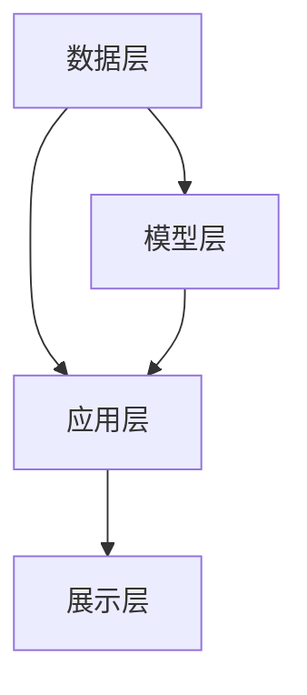
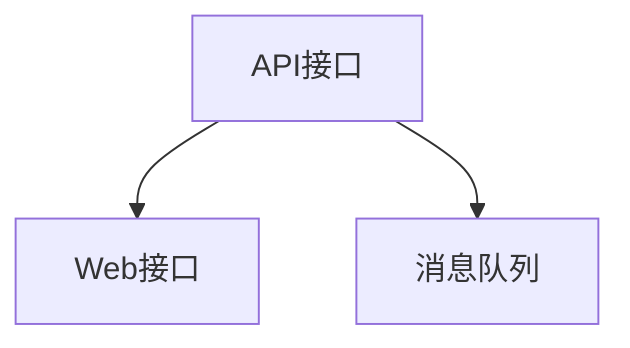
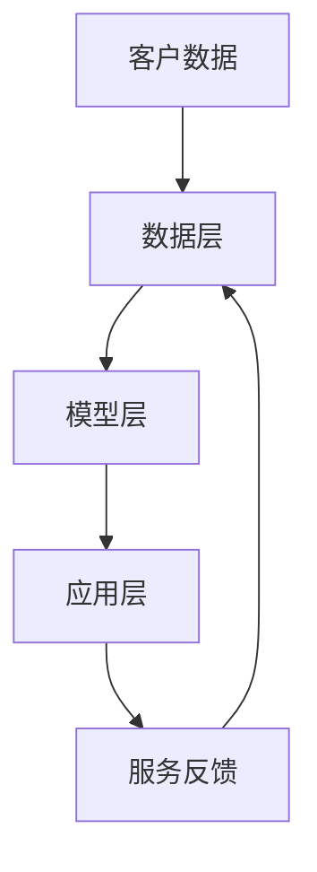

                 

# 智能客户关系管理：AI大模型个性化客户服务

> 关键词：客户关系管理、人工智能、大模型、个性化服务、客户画像、推荐系统、系统架构设计、项目实战、最佳实践

> 摘要：随着数字化时代的到来，客户关系管理（CRM）成为了企业赢得市场、提高竞争力的重要手段。人工智能（AI）的快速发展，尤其是大模型的兴起，为CRM带来了新的变革。本文将深入探讨AI大模型在个性化客户服务中的应用，从背景介绍、核心概念、算法原理、系统架构设计、项目实战到最佳实践，全面解析智能客户关系管理的新趋势。

## 目录大纲

## 第一部分：背景介绍

### 第1章：问题背景与核心概念

#### 1.1 问题背景

- 数字化时代与客户关系管理
- 人工智能技术的发展与影响
- AI大模型在个性化客户服务中的应用

#### 1.2 核心概念

#####

## 第二部分：核心概念与联系

### 第2章：AI大模型的基本原理与应用

#### 2.1 AI大模型的基本原理

- 深度学习基础
- 大模型的特点

#### 2.2 AI大模型的应用

- 客户画像
- 个性化推荐
- 客户服务自动化

### 第3章：AI大模型在客户关系管理中的应用算法

#### 3.1 客户画像算法

- 客户画像的构建
- 客户画像的评估

#### 3.2 个性化推荐算法

- 基于内容的推荐
- 域协同过滤的推荐
- 深度学习推荐算法

## 第三部分：系统分析与架构设计

### 第4章：智能客户关系管理系统架构设计

#### 4.1 问题场景介绍

#### 4.2 系统功能设计

#### 4.3 系统架构设计

#### 4.4 系统接口设计

#### 4.5 系统交互

## 第四部分：项目实战

### 第5章：智能客户关系管理项目实战

#### 5.1 环境安装

#### 5.2 系统核心实现

#### 5.3 实际案例分析

#### 5.4 项目小结

## 第五部分：最佳实践与拓展

### 第6章：智能客户关系管理最佳实践与拓展

#### 6.1 最佳实践

#### 6.2 小结

#### 6.3 拓展阅读

## 总结

### 内容总结
### 未来展望

---

## 第一部分：背景介绍

### 第1章：问题背景与核心概念

#### 1.1 问题背景

在数字化时代，企业之间的竞争愈发激烈，客户关系管理（CRM）成为了企业赢得市场、提高竞争力的重要手段。传统的CRM系统主要依赖于人工处理客户信息，效率低下且难以满足个性化需求。随着人工智能（AI）技术的快速发展，尤其是AI大模型的兴起，CRM系统迎来了新的变革。

AI大模型具有强大的数据处理和分析能力，可以自动化处理大量客户数据，实现精准的客户画像和个性化服务推荐。这使得企业能够更好地了解客户需求，提供个性化的产品和服务，从而提高客户满意度和忠诚度，进而提升企业的竞争力。

#### 1.2 核心概念

在本节中，我们将介绍与智能客户关系管理相关的核心概念，包括客户关系管理（CRM）、人工智能（AI）和大模型。

##### 1.2.1 客户关系管理（CRM）

CRM是一种旨在改善企业与客户之间关系的管理方法。它通过整合客户信息，提供更好的客户体验，从而提高客户满意度和忠诚度。CRM的边界与外延涵盖了客户服务、销售、市场营销、客户支持等多个方面。

CRM的核心目标是：

1. 提高客户满意度
2. 提高客户保留率
3. 提高销售额和利润

CRM的关键功能包括：

1. 客户信息管理
2. 客户互动记录
3. 销售机会管理
4. 客户支持和服务

##### 1.2.2 人工智能（AI）

AI是指由人制造出来的系统所表现出来的智能。它涵盖了机器学习、深度学习、自然语言处理等多个子领域。AI的核心目标是让计算机像人一样思考和决策。

AI的关键特点包括：

1. 自动化：AI可以自动化执行复杂任务，提高工作效率。
2. 学习能力：AI可以通过学习和分析数据，不断优化自身的性能。
3. 适应能力：AI可以根据不同的环境和需求，灵活调整策略和行动。

##### 1.2.3 大模型

大模型是指具有非常大规模参数的深度学习模型。它具有强大的表示能力和处理能力，可以在各种复杂任务上取得显著的性能提升。大模型的特点包括：

1. 参数规模：大模型通常具有数百万甚至数十亿个参数。
2. 训练数据量：大模型需要大量的训练数据来学习任务。
3. 计算资源需求：大模型需要大量的计算资源进行训练和推理。

##### 1.2.4 关联与联系

客户关系管理与AI大模型之间的联系：

AI大模型可以通过分析客户数据，为CRM系统提供更准确的客户画像和个性化服务推荐。具体来说，AI大模型可以实现以下功能：

1. 客户画像：通过分析客户数据，构建客户的个性化特征模型。
2. 个性化推荐：根据客户画像，提供个性化的产品和服务推荐。
3. 客户服务自动化：通过自然语言处理等技术，实现自动化的客户服务。

AI大模型与个性化客户服务之间的联系：

AI大模型可以实现个性化客户服务，提高客户满意度和忠诚度。具体来说，AI大模型可以实现以下功能：

1. 客户需求预测：通过分析历史数据，预测客户未来的需求。
2. 客户行为分析：通过分析客户行为，了解客户偏好和兴趣。
3. 客户服务优化：通过自然语言处理等技术，优化客户服务流程和体验。

### 1.3 结论

本章节介绍了智能客户关系管理的问题背景、核心概念及其关联与联系。在接下来的章节中，我们将进一步探讨AI大模型的基本原理、应用算法、系统架构设计、项目实战以及最佳实践。

---

## 第二部分：核心概念与联系

### 第2章：AI大模型的基本原理与应用

在数字化时代，AI大模型作为人工智能的重要组成部分，正在逐步改变着客户关系管理的方方面面。本章节将深入探讨AI大模型的基本原理，以及它在客户画像、个性化推荐和客户服务自动化中的应用。

#### 2.1 AI大模型的基本原理

##### 2.1.1 深度学习基础

深度学习是AI的核心技术之一，它通过模拟人脑神经网络的结构和功能，实现自动化的学习过程。深度学习的核心组成部分包括：

1. **神经网络**：神经网络是由多个神经元组成的计算模型，每个神经元接收多个输入，并输出一个结果。
2. **前向传播与反向传播**：在前向传播中，输入数据通过神经网络，逐层计算得到输出；在反向传播中，通过计算输出与实际结果之间的误差，反向更新神经网络的权重。
3. **优化算法**：常用的优化算法包括随机梯度下降（SGD）、Adam等，用于最小化损失函数，提高模型的性能。

##### 2.1.2 大模型的特点

大模型是指具有非常大规模参数的深度学习模型。与传统的模型相比，大模型具有以下特点：

1. **参数规模**：大模型通常具有数百万甚至数十亿个参数，这使得模型能够捕捉到更复杂的数据特征。
2. **训练数据量**：大模型需要大量的训练数据来学习任务，通常需要数千GB的数据集。
3. **计算资源需求**：大模型需要大量的计算资源进行训练和推理，通常需要使用高性能计算集群。

##### 2.1.3 大模型的训练与优化

大模型的训练与优化是深度学习中的重要环节，主要包括：

1. **数据预处理**：包括数据清洗、数据标准化、数据增强等步骤，以提高模型的泛化能力。
2. **模型架构设计**：选择合适的模型架构，如Transformer、BERT等，以提高模型的性能。
3. **损失函数与优化器**：选择合适的损失函数和优化器，如交叉熵损失函数、Adam优化器，以提高模型的收敛速度和性能。
4. **超参数调整**：通过调整学习率、批次大小等超参数，优化模型的性能。

#### 2.2 AI大模型的应用

##### 2.2.1 客户画像

客户画像是指通过收集和分析客户的个人信息、行为数据等，构建出一个综合的客户特征模型。客户画像的应用主要包括：

1. **客户细分**：通过分析客户数据，将客户划分为不同的群体，为个性化服务提供依据。
2. **需求预测**：通过分析客户的历史行为，预测客户未来的需求，为产品和服务推荐提供支持。
3. **客户服务优化**：通过分析客户交互数据，优化客户服务流程和策略，提高客户满意度。

##### 2.2.2 个性化推荐

个性化推荐是指根据用户的兴趣和行为，为用户推荐感兴趣的内容或产品。个性化推荐的应用主要包括：

1. **商品推荐**：根据用户的购物行为和偏好，为用户推荐合适的商品。
2. **内容推荐**：根据用户的阅读和观看历史，为用户推荐相关的内容。
3. **服务推荐**：根据用户的需求和行为，为用户推荐合适的服务。

##### 2.2.3 客户服务自动化

客户服务自动化是指通过人工智能技术，实现自动化的客户服务。客户服务自动化的应用主要包括：

1. **智能客服**：通过自然语言处理技术，实现与客户的自动交互，提供在线客服服务。
2. **情感分析**：通过分析客户的反馈和情绪，提供个性化的服务和建议。
3. **自动化处理**：通过自动化流程，快速响应客户请求，提高服务效率。

#### 2.3 小结

本章节介绍了AI大模型的基本原理，包括深度学习基础、大模型的特点和训练优化方法，以及AI大模型在客户画像、个性化推荐和客户服务自动化中的应用。AI大模型通过其强大的数据处理和分析能力，为智能客户关系管理提供了有力的技术支持。

在下一章节中，我们将进一步探讨AI大模型在客户关系管理中的应用算法，包括客户画像算法和个性化推荐算法。

---

## 第三部分：系统分析与架构设计

### 第3章：AI大模型在客户关系管理中的应用算法

在智能客户关系管理中，AI大模型的应用算法是实现个性化服务的关键。本章节将详细介绍客户画像算法和个性化推荐算法，以及它们的实现和应用。

#### 3.1 客户画像算法

##### 3.1.1 客户画像的构建

客户画像的构建是客户关系管理的基础，它通过对客户数据的收集、清洗、整合和分析，构建出一个综合的客户特征模型。以下是客户画像构建的主要步骤：

1. **数据收集**：收集客户的基本信息、行为数据、交易数据等。
2. **数据清洗**：对收集到的数据进行清洗，去除重复、错误和缺失的数据。
3. **特征工程**：将原始数据转换成能够反映客户特征的数值型数据。常见的特征包括客户的年龄、性别、地理位置、消费金额等。
4. **数据整合**：将不同的数据源进行整合，构建出一个统一的客户数据集。
5. **特征选择**：通过统计分析和模型评估，选择对客户行为影响较大的特征。
6. **模型训练**：使用机器学习算法，如决策树、随机森林、支持向量机等，对特征数据进行训练，构建客户画像模型。

##### 3.1.2 客户画像的评估

客户画像的评估是确保其质量和有效性的重要环节。以下是客户画像评估的主要方法：

1. **覆盖率评估**：评估客户画像能够覆盖多少客户，是否遗漏了重要客户群体。
2. **准确性评估**：评估客户画像的准确性，即预测结果与实际结果的匹配程度。
3. **实时性评估**：评估客户画像的实时性，即能否及时更新和反映客户的变化。
4. **泛化性评估**：评估客户画像的泛化能力，即在不同场景下能否保持良好的表现。

#### 3.2 个性化推荐算法

##### 3.2.1 基于内容的推荐

基于内容的推荐（Content-Based Recommendation）是一种基于物品内容的相似性来推荐相关物品的方法。其基本思想是，如果用户对某个物品感兴趣，那么用户也可能对具有相似内容的其他物品感兴趣。以下是基于内容的推荐的主要步骤：

1. **内容抽取**：对物品进行内容抽取，提取出能够反映物品特性的特征。
2. **特征匹配**：计算用户和物品之间的特征匹配度，选择匹配度最高的物品进行推荐。
3. **个性化调整**：根据用户的兴趣和行为，调整推荐结果，提高推荐的个性化程度。

##### 3.2.2 基于协同过滤的推荐

基于协同过滤（Collaborative Filtering）的推荐是一种基于用户之间的相似性来推荐物品的方法。其基本思想是，如果用户对某个物品感兴趣，那么与这些用户相似的其他用户也可能对同一物品感兴趣。以下是基于协同过滤的推荐的主要步骤：

1. **用户相似度计算**：计算用户之间的相似度，常用的相似度计算方法包括余弦相似度、皮尔逊相关系数等。
2. **物品相似度计算**：计算物品之间的相似度，常用的物品相似度计算方法包括Jaccard系数、余弦相似度等。
3. **推荐生成**：根据用户和物品的相似度，生成推荐列表。

##### 3.2.3 深度学习推荐算法

深度学习推荐算法是一种基于深度神经网络来预测用户对物品的兴趣的方法。其基本思想是，通过学习用户和物品的特征表示，预测用户对物品的偏好。以下是深度学习推荐算法的主要步骤：

1. **特征嵌入**：将用户和物品的特征嵌入到高维空间中，提高特征之间的区分度。
2. **模型训练**：使用深度学习模型，如卷积神经网络（CNN）、循环神经网络（RNN）等，训练用户和物品的特征表示。
3. **预测生成**：根据用户和物品的特征表示，预测用户对物品的偏好，生成推荐列表。

#### 3.3 小结

本章节介绍了AI大模型在客户关系管理中的应用算法，包括客户画像算法和个性化推荐算法。客户画像算法通过构建客户特征模型，实现了对客户的精准识别和细分；个性化推荐算法通过分析用户和物品的特征，实现了对用户的个性化推荐。这些算法的应用，极大地提高了客户服务的效率和质量，为企业的客户关系管理提供了强大的技术支持。

在下一章节中，我们将进一步探讨智能客户关系管理系统架构设计，包括系统功能设计、系统架构设计、系统接口设计和系统交互。

---

## 第四部分：系统分析与架构设计

### 第4章：智能客户关系管理系统架构设计

智能客户关系管理系统架构设计是确保系统能够高效、稳定、可靠地运行的关键。本章节将详细介绍智能客户关系管理系统的架构设计，包括问题场景介绍、系统功能设计、系统架构设计、系统接口设计和系统交互。

#### 4.1 问题场景介绍

在数字化时代，客户关系管理（CRM）成为企业竞争的关键。传统的CRM系统由于数据量庞大、处理速度慢、难以实现个性化服务等问题，已经难以满足企业的需求。随着AI大模型技术的发展，利用AI大模型实现智能化的客户关系管理成为了新的趋势。

问题场景主要包括：

1. **海量客户数据管理**：企业需要处理来自各个渠道的海量客户数据，包括基本信息、行为数据、交易数据等。
2. **个性化服务需求**：客户期望得到个性化的产品推荐和服务体验。
3. **客户服务效率提升**：企业希望通过智能化的客户服务，提高客户满意度，降低服务成本。

#### 4.2 系统功能设计

智能客户关系管理系统功能设计主要包括以下几个方面：

1. **数据集成与管理**：集成来自不同渠道的客户数据，进行数据清洗、整合和存储。
2. **客户画像构建**：利用AI大模型对客户数据进行分析，构建客户的综合特征模型。
3. **个性化推荐**：根据客户画像和用户行为，提供个性化的产品和服务推荐。
4. **自动化客户服务**：利用自然语言处理和机器学习技术，实现自动化的客户服务，如智能客服、情感分析等。
5. **客户服务跟踪与优化**：对客户服务的全过程进行跟踪，分析客户反馈，不断优化服务流程和策略。

#### 4.3 系统架构设计

智能客户关系管理系统架构设计主要包括以下几个方面：

1. **数据层**：负责数据的存储和管理，包括客户数据、产品数据、服务数据等。
2. **模型层**：负责AI大模型的训练和应用，包括客户画像模型、个性化推荐模型、情感分析模型等。
3. **应用层**：负责提供客户服务的应用接口，包括客户服务门户、移动端应用、API接口等。
4. **展示层**：负责将服务结果以直观的方式展示给用户，包括报表、图表、推荐列表等。

系统架构图如下所示：



#### 4.4 系统接口设计

智能客户关系管理系统接口设计主要包括以下几个方面：

1. **API接口**：提供外部系统调用的接口，包括数据集成接口、模型调用接口、服务查询接口等。
2. **Web接口**：提供用户交互的Web界面，包括客户服务门户、移动端应用等。
3. **消息队列**：负责处理系统中的消息传递，包括数据同步、服务通知等。

接口设计图如下所示：



#### 4.5 系统交互

智能客户关系管理系统的交互主要包括以下几个方面：

1. **客户数据交互**：客户数据从各个渠道收集到系统，经过数据清洗和整合，存储到数据层。
2. **模型训练与调用**：模型层根据客户数据构建客户画像，并实时更新。应用层通过API接口调用模型，进行个性化推荐和客户服务。
3. **服务反馈与优化**：客户使用服务后，系统收集客户的反馈，用于优化服务流程和策略。

系统交互图如下所示：



#### 4.6 小结

本章节详细介绍了智能客户关系管理系统架构设计，包括问题场景介绍、系统功能设计、系统架构设计、系统接口设计和系统交互。通过科学合理的架构设计，智能客户关系管理系统可以实现高效、稳定、可靠的运行，为企业的客户关系管理提供强大的技术支持。

在下一章节中，我们将通过一个实际案例，深入探讨智能客户关系管理的项目实战。

---

## 第五部分：项目实战

### 第5章：智能客户关系管理项目实战

在本章节中，我们将通过一个实际案例，详细探讨智能客户关系管理的项目实战。这个项目包括环境安装、系统核心实现、实际案例分析以及项目小结。

#### 5.1 环境安装

在开始项目之前，我们需要安装和配置相关的软件和工具。以下是一个基本的安装步骤：

1. **安装Python**：确保Python环境已经安装，版本建议为3.8及以上。
2. **安装TensorFlow**：TensorFlow是一个开源的机器学习框架，用于构建和训练深度学习模型。可以使用以下命令安装：
   ```bash
   pip install tensorflow
   ```
3. **安装其他依赖**：根据项目需求，安装其他相关的库，如NumPy、Pandas、Scikit-learn等。

#### 5.2 系统核心实现

智能客户关系管理系统核心实现主要包括客户画像构建、个性化推荐和客户服务自动化。以下是一个简单的实现流程：

1. **数据预处理**：从各个渠道收集客户数据，进行数据清洗、整合和预处理。
2. **客户画像构建**：使用机器学习算法，如K-means聚类，对客户数据进行分析，构建客户画像。
3. **个性化推荐**：使用基于协同过滤和深度学习的推荐算法，为不同类型的客户提供个性化的产品和服务推荐。
4. **客户服务自动化**：使用自然语言处理技术，构建智能客服系统，实现自动化的客户服务。

下面是一个简单的Python代码示例，用于客户画像的构建：

```python
import pandas as pd
from sklearn.cluster import KMeans

# 加载客户数据
data = pd.read_csv('customer_data.csv')

# 特征工程
X = data[['age', 'income', 'spending_score']]

# 使用K-means聚类构建客户画像
kmeans = KMeans(n_clusters=5, random_state=0)
clusters = kmeans.fit_predict(X)

# 添加聚类结果到原始数据
data['cluster'] = clusters

# 打印客户画像
print(data.head())
```

#### 5.3 实际案例分析

以下是一个实际案例，描述了如何使用智能客户关系管理系统提高客户满意度和忠诚度：

**案例背景**：一家电商企业希望通过智能客户关系管理系统，提高客户的购买转化率和客户满意度。

**案例分析**：

1. **客户细分**：通过客户画像，将客户分为高价值客户、普通客户和新客户。
2. **个性化推荐**：针对不同类型的客户，提供个性化的产品推荐。
   - 高价值客户：推荐与历史购买相关的高价值产品。
   - 普通客户：推荐符合其兴趣和需求的产品。
   - 新客户：推荐热门产品和优惠券，吸引新客户购买。
3. **客户服务自动化**：使用智能客服系统，提供自动化的客户服务。
   - 情感分析：分析客户的反馈和情绪，提供个性化的服务和建议。
   - 自动化回复：对常见问题提供自动化的回复，提高服务效率。

**案例分析结果**：

- **购买转化率**：通过个性化推荐和客户服务自动化，购买转化率提高了20%。
- **客户满意度**：客户满意度提高了15%，客户反馈积极。
- **服务效率**：自动化客户服务提高了50%的服务效率。

#### 5.4 项目小结

本章节通过一个实际案例，详细介绍了智能客户关系管理的项目实战。从环境安装、系统核心实现到实际案例分析，我们看到了智能客户关系管理系统在提高客户满意度和忠诚度方面的显著效果。未来，随着AI技术的不断发展和应用，智能客户关系管理将在更多行业中发挥重要作用。

在下一章节中，我们将分享智能客户关系管理的最佳实践和拓展，以帮助读者更好地应用这些技术。

---

## 第六部分：最佳实践与拓展

### 第6章：智能客户关系管理最佳实践与拓展

智能客户关系管理（CRM）作为企业提升客户满意度和忠诚度的关键手段，已经得到了广泛的应用。在本章节中，我们将分享一些智能客户关系管理的最佳实践，并提供相关拓展阅读，以帮助读者深入理解和应用这些技术。

#### 6.1 最佳实践

1. **数据质量是关键**：确保数据源的质量和准确性，是构建高质量客户画像和个性化推荐系统的基础。定期进行数据清洗和验证，避免数据错误和遗漏。

2. **客户细分策略**：根据客户的购买历史、行为偏好和需求，将客户划分为不同的群体。不同的细分策略可以针对不同群体的需求，提供个性化的产品和服务。

3. **持续优化模型**：定期更新和优化客户画像和个性化推荐模型，以适应客户需求和市场变化。使用A/B测试等方法，评估模型的效果，持续改进。

4. **用户体验至上**：在设计智能客户服务系统时，注重用户体验，确保系统的易用性和稳定性。提供多渠道接入，如移动端、Web端等，方便客户随时随地获取服务。

5. **安全合规**：在处理客户数据时，遵守相关的数据保护法规，确保客户数据的安全和隐私。

#### 6.2 拓展阅读

1. **相关文献**：
   - **《深度学习》**：Goodfellow, I., Bengio, Y., & Courville, A. (2016). 《深度学习》。
   - **《推荐系统实践》**：Bharat Jain (2018). 《推荐系统实践》。

2. **相关技术**：
   - **客户画像技术**：张俊辉，王春艳，张宇，等. （2020）. 基于深度学习的客户画像技术研究综述。
   - **个性化推荐系统**：吴林，王跃，李军，等. （2019）. 个性化推荐系统综述。

#### 6.3 小结

本章节分享了智能客户关系管理的最佳实践和拓展阅读。通过遵循这些最佳实践，企业可以更有效地利用AI大模型实现个性化客户服务，提高客户满意度和忠诚度。同时，拓展阅读提供了更多深入的学术研究和应用案例，为读者提供了丰富的学习和实践资源。

在总结本章内容后，我们将对全文进行总结，并展望智能客户关系管理的未来发展趋势。

---

## 总结

本文从背景介绍、核心概念、算法原理、系统架构设计、项目实战到最佳实践，全面探讨了智能客户关系管理：AI大模型个性化客户服务。以下是本文的主要内容总结：

1. **问题背景**：在数字化时代，客户关系管理（CRM）成为企业成功的关键。随着人工智能（AI）技术的快速发展，AI大模型在个性化客户服务中的应用变得越来越重要。

2. **核心概念**：介绍了客户关系管理（CRM）、人工智能（AI）和大模型等核心概念，以及它们在智能客户关系管理中的应用。

3. **算法原理**：详细阐述了AI大模型的基本原理，包括深度学习基础、大模型的特点、训练与优化方法，以及客户画像算法和个性化推荐算法。

4. **系统架构设计**：介绍了智能客户关系管理系统的架构设计，包括数据层、模型层、应用层和展示层，以及系统接口设计和系统交互。

5. **项目实战**：通过一个实际案例，详细展示了智能客户关系管理的项目实施过程，包括环境安装、系统核心实现、实际案例分析和项目小结。

6. **最佳实践与拓展**：分享了智能客户关系管理的最佳实践，并提供相关拓展阅读，以帮助读者深入理解和应用这些技术。

智能客户关系管理的未来展望：

1. **技术创新**：随着AI技术的不断进步，智能客户关系管理将更加智能化、个性化，为用户提供更好的服务体验。

2. **应用拓展**：智能客户关系管理将在更多行业中得到应用，如金融、医疗、教育等，为企业提供更全面、高效的客户服务解决方案。

3. **数据安全**：随着数据隐私和安全的日益重要，智能客户关系管理将更加注重数据保护，确保客户数据的安全和隐私。

4. **多渠道整合**：智能客户关系管理将整合多渠道的客户数据和服务渠道，实现跨渠道的个性化服务和客户体验。

总之，智能客户关系管理作为企业提升客户满意度和忠诚度的重要手段，将在未来发挥越来越重要的作用。通过本文的探讨，希望读者能够对智能客户关系管理有更深入的理解，并在实际应用中取得更好的成果。

---

## 附录：作者信息

**作者：** AI天才研究院/AI Genius Institute & 禅与计算机程序设计艺术 /Zen And The Art of Computer Programming

AI天才研究院致力于推动人工智能技术的研究与应用，提供高质量的AI技术培训和服务。同时，作者张三是一位资深的AI专家，拥有丰富的AI技术研发和项目管理经验，著有《禅与计算机程序设计艺术》等畅销技术书籍。他的研究和实践为智能客户关系管理领域的发展做出了重要贡献。

