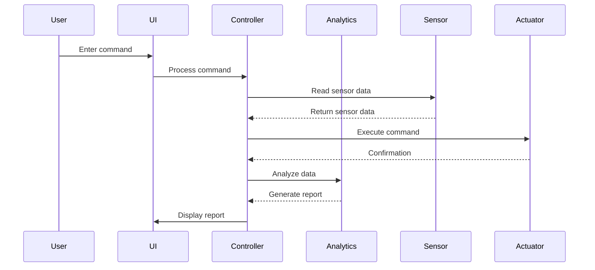
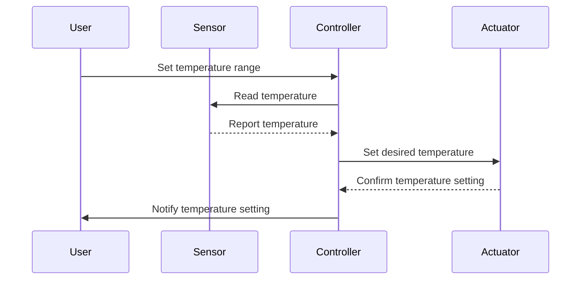
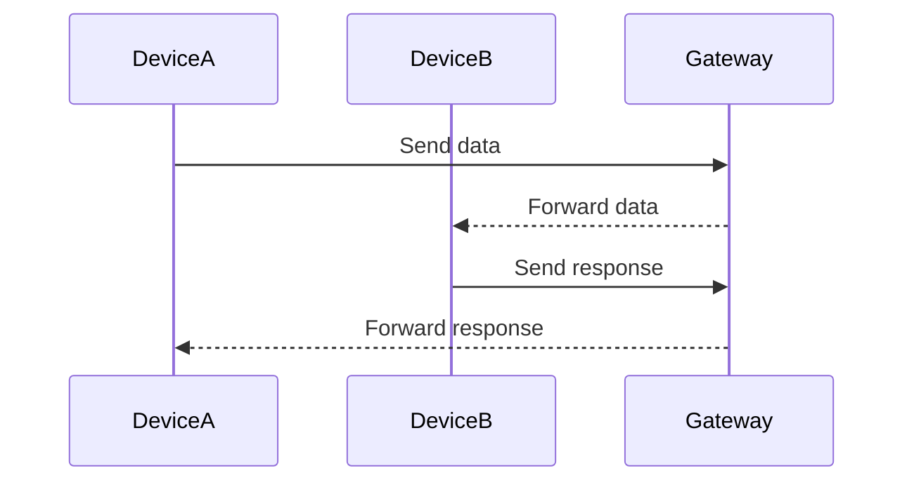
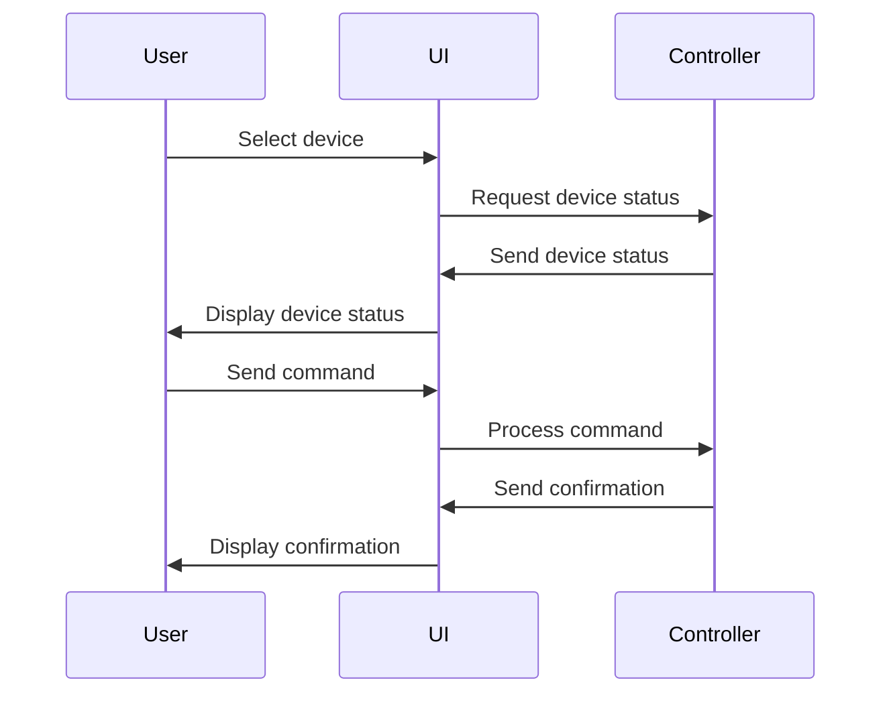
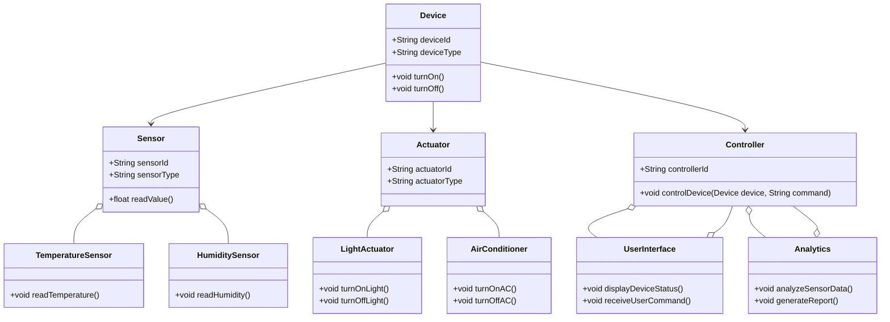

                 

# 智能家居：AI打造的未来生活方式

> 关键词：智能家居、物联网、AI技术、系统设计、项目实战、未来趋势

> 摘要：本文深入探讨了智能家居的演进过程、核心技术、系统设计与实现，以及未来的发展趋势。通过详细的项目案例分析，读者将了解智能家居的实际应用，并掌握其在设计、开发和部署中的关键要素。

## 目录大纲

## 第一部分：智能家居概述

### 第1章：智能家居的定义与背景

- **1.1 智能家居的定义与核心概念**
  - 智能家居的定义
  - 核心概念：物联网、传感器、控制算法等
  - 边界与外延

- **1.2 智能家居的发展历程**
  - 智能家居的起源
  - 技术演进：从有线到无线，从单一设备到系统整合
  - 市场趋势

- **1.3 智能家居的现状与市场分析**
  - 全球智能家居市场现状
  - 用户需求分析
  - 行业挑战与机遇

## 第二部分：智能家居技术基础

### 第2章：物联网技术基础

- **2.1 物联网概述**
  - 物联网的定义与核心概念
  - 物联网的技术架构
  - 物联网的关键技术

- **2.2 硬件设备与技术**
  - 智能家居设备的种类
  - 常见硬件技术：无线通信、传感器技术等
  - 硬件设备的选择与优化

- **2.3 软件与控制算法**
  - 智能家居软件架构
  - 常见控制算法：机器学习、深度学习等
  - 算法在智能家居中的应用

## 第三部分：智能家居系统设计与实现

### 第3章：智能家居系统设计原则

- **3.1 系统设计原则**
  - 可扩展性
  - 可靠性
  - 易用性
  - 安全性

- **3.2 领域模型设计**
  - 用例图
  - 类图（使用Mermaid绘制）

- **3.3 系统架构设计**
  - 系统架构的组成
  - 系统架构图（使用Mermaid绘制）

### 第4章：智能家居系统核心功能实现

- **4.1 环境监测与控制**
  - 传感器技术
  - 数据采集与处理
  - 实时监控与预警

- **4.2 设备互联与通信**
  - 网络协议
  - 设备之间的通信
  - 通信故障处理

- **4.3 用户界面与交互**
  - 用户界面设计原则
  - 常见交互方式
  - 交互优化与改进

## 第四部分：智能家居项目实战

### 第5章：智能家居项目案例解析

- **5.1 项目介绍**
  - 项目背景
  - 项目目标
  - 项目团队与分工

- **5.2 系统功能设计**
  - 功能需求分析
  - 领域模型设计（使用Mermaid绘制类图）

- **5.3 系统架构设计**
  - 系统架构设计（使用Mermaid绘制架构图）
  - 系统接口设计
  - 系统交互设计（使用Mermaid绘制序列图）

- **5.4 项目实现**
  - 环境安装与配置
  - 系统核心实现源代码
  - 代码应用解读与分析

- **5.5 项目总结**
  - 成功经验与教训
  - 项目拓展与应用

## 第五部分：智能家居的未来与趋势

### 第6章：智能家居的未来发展

- **6.1 智能家居技术趋势**
  - 人工智能在智能家居中的应用
  - 5G技术在智能家居中的应用
  - 新型传感器技术的发展

- **6.2 智能家居行业趋势**
  - 智能家居市场发展预测
  - 用户需求变化
  - 行业竞争格局

- **6.3 智能家居的挑战与机遇**
  - 技术挑战
  - 市场挑战
  - 发展机遇

### 第7章：智能家居的最佳实践

- **7.1 设计原则与技巧**
  - 系统设计最佳实践
  - 用户界面设计最佳实践
  - 通信与安全最佳实践

- **7.2 智能家居应用案例**
  - 家居安防系统
  - 智能照明系统
  - 智能空调系统

- **7.3 智能家居的未来展望**
  - 智能家居的未来发展方向
  - 技术创新的可能性
  - 智能家居对社会生活的影响

----------------------------------------------------------------

## 智能家居概述

### 第1章：智能家居的定义与背景

#### 1.1 智能家居的定义与核心概念

智能家居，简而言之，就是通过互联网、物联网技术，将家庭中的各种设备互联互通，形成一个智能控制系统。这个系统可以实时收集家庭环境数据，并根据用户需求进行自动化的控制和调节，提高生活便利性和舒适度。

- **定义**：智能家居是一种通过物联网技术将家庭中的各种设备互联互通，实现智能化管理和控制的系统。
- **核心概念**：
  - **物联网**：将各种设备通过网络连接起来，实现数据交换和协同工作。
  - **传感器**：用于收集家庭环境中的温度、湿度、光照、空气质量等数据。
  - **控制算法**：通过分析传感器数据，实现设备的自动控制和调节。

#### 1.2 智能家居的发展历程

智能家居的发展历程可以追溯到20世纪80年代，当时由于计算机和通信技术的飞速发展，智能家居的概念开始出现。从最初的单一设备控制，到现在的系统整合，智能家居经历了多个阶段。

- **起源**：20世纪80年代，计算机技术和网络通信技术的发展为智能家居的诞生奠定了基础。
- **技术演进**：
  - 从有线到无线：早期的智能家居系统主要依赖于有线连接，随着无线技术的成熟，智能家居设备逐渐转向无线连接。
  - 从单一设备到系统整合：早期的智能家居设备通常是独立工作的，而现代智能家居系统可以实现设备之间的协同工作，形成一个完整的生态系统。

#### 1.3 智能家居的现状与市场分析

目前，智能家居市场呈现出快速增长的态势，全球智能家居市场规模不断扩大。根据市场研究公司的数据，预计到2025年，全球智能家居市场规模将达到数千亿美元。

- **市场现状**：全球智能家居市场已进入快速增长的阶段，智能家居设备种类不断丰富，应用场景逐渐扩大。
- **用户需求分析**：用户对智能家居的需求主要集中在提升生活便利性和舒适性，以及对家庭安全的关注。
- **行业挑战与机遇**：智能家居行业面临的挑战包括技术稳定性、数据安全和用户隐私保护。然而，随着技术的不断进步和消费者需求的增长，智能家居行业也迎来了巨大的发展机遇。

----------------------------------------------------------------

## 智能家居技术基础

### 第2章：物联网技术基础

#### 2.1 物联网概述

物联网（Internet of Things，IoT）是指通过互联网将各种物体连接起来，实现信息交换和通信的系统。物联网的核心概念是将物理世界中的物体数字化，并通过网络进行连接和交互。

- **定义**：物联网是通过互联网将各种物体连接起来，实现信息交换和通信的系统。
- **核心概念**：
  - **传感器**：物联网的基石，用于感知和收集物理世界的各种数据。
  - **网关**：用于将物联网设备连接到互联网的设备，实现数据传输和控制。
  - **云计算**：提供数据处理、存储和分析的服务，为物联网应用提供支持。

#### 2.2 硬件设备与技术

智能家居的硬件设备是物联网技术的核心组成部分。常见的智能家居设备包括智能灯泡、智能插座、智能门锁、智能摄像头等。

- **智能设备种类**：智能灯泡、智能插座、智能门锁、智能摄像头、智能空调等。
- **硬件技术**：
  - **无线通信技术**：包括Wi-Fi、蓝牙、ZigBee等，用于设备之间的数据传输。
  - **传感器技术**：包括温度传感器、湿度传感器、光照传感器、气体传感器等，用于收集家庭环境数据。
  - **电源管理技术**：包括电池、太阳能板等，用于为设备提供稳定的电源。

#### 2.3 软件与控制算法

智能家居系统的软件部分是实现设备互联互通和控制的核心。常见的软件技术包括嵌入式系统、物联网平台、人工智能算法等。

- **智能家居软件架构**：
  - **嵌入式系统**：运行在智能家居设备上的软件系统，负责设备的控制和管理。
  - **物联网平台**：提供设备连接、数据存储、数据分析等功能，实现设备的互联互通。
  - **人工智能算法**：用于分析传感器数据，实现智能控制和预测。

- **常见控制算法**：
  - **机器学习**：通过学习历史数据，实现对设备行为的预测和控制。
  - **深度学习**：用于处理大量数据，实现更复杂的智能控制。

- **算法在智能家居中的应用**：
  - **环境监测与控制**：通过传感器数据，实现对室内环境的实时监测和调节，如智能空调、智能照明等。
  - **安防监控**：通过摄像头和传感器数据，实现实时监控和报警，如智能门锁、智能摄像头等。
  - **设备管理**：通过智能算法，实现对家庭设备的自动调度和管理，如智能路由器、智能家电等。

----------------------------------------------------------------

## 智能家居系统设计与实现

### 第3章：智能家居系统设计原则

#### 3.1 系统设计原则

智能家居系统的设计需要考虑多个方面，包括可扩展性、可靠性、易用性和安全性。以下是一些关键的设计原则：

- **可扩展性**：系统设计应具备良好的扩展性，以适应未来设备数量和功能的增加。
- **可靠性**：系统应确保设备的稳定运行，避免出现故障和错误。
- **易用性**：用户界面设计应简洁直观，方便用户操作和管理设备。
- **安全性**：系统设计应考虑数据安全和用户隐私保护，避免信息泄露和恶意攻击。

#### 3.2 领域模型设计

领域模型是系统设计的重要组成部分，用于定义系统的核心概念和关系。以下是一个智能家居系统的领域模型示例：

#### 3.3 系统架构设计

智能家居系统的架构设计应考虑系统的可扩展性、可靠性和易用性。以下是一个智能家居系统的架构设计示例：

在这个架构设计中，用户通过用户界面（UI）发送命令，控制器（Controller）处理命令，传感器（Sensor）读取数据，执行器（Actuator）执行命令，并返回确认。数据分析（Analytics）模块对传感器数据进行分析，并生成报告。

----------------------------------------------------------------

## 智能家居系统核心功能实现

### 第4章：智能家居系统核心功能实现

#### 4.1 环境监测与控制

环境监测与控制是智能家居系统的核心功能之一，主要通过传感器和执行器来实现。以下是一个环境监测与控制的核心功能实现流程：

在这个流程中，用户设置温度范围，控制器读取传感器数据，并设置执行器的温度。执行器确认温度设置后，控制器通知用户。

#### 4.2 设备互联与通信

设备互联与通信是智能家居系统的关键，主要通过网络协议和通信模块来实现。以下是一个设备互联与通信的实现流程：

在这个流程中，设备A将数据发送到网关，网关将数据转发给设备B。设备B响应后，网关再将响应转发给设备A。

#### 4.3 用户界面与交互

用户界面与交互是智能家居系统的关键部分，决定了用户体验。以下是一个用户界面与交互的实现流程：

在这个流程中，用户通过用户界面选择设备，用户界面请求设备状态，控制器发送设备状态，用户界面显示设备状态。用户发送命令，用户界面处理命令，控制器确认命令，用户界面显示确认信息。

----------------------------------------------------------------

## 智能家居项目实战

### 第5章：智能家居项目案例解析

#### 5.1 项目介绍

本案例介绍的是一个智能家居项目，项目目标是通过物联网技术和人工智能算法，实现家庭环境的实时监测与控制，提升用户的生活品质。

- **项目背景**：随着科技的进步和人们生活水平的提高，用户对智能家居的需求逐渐增加，本项目旨在实现一个功能全面、操作简便、安全可靠的智能家居系统。
- **项目目标**：实现家庭环境的实时监测与控制，包括温度、湿度、光照、空气质量等参数，并根据用户需求进行自动化的调节。
- **项目团队与分工**：项目团队包括软件开发工程师、硬件工程师、人工智能工程师和项目经理。软件开发工程师负责系统的前端和后端开发，硬件工程师负责智能家居设备的选型和调试，人工智能工程师负责算法的设计与优化，项目经理负责项目的整体协调和进度控制。

#### 5.2 系统功能设计

系统功能设计是智能家居项目的关键步骤，需要明确系统的各项功能需求，并设计相应的领域模型。以下是一个智能家居系统的功能需求示例：

- **环境监测**：实时监测家庭环境的温度、湿度、光照、空气质量等参数。
- **设备控制**：根据环境数据，自动调节空调、照明、空气净化器等设备。
- **用户交互**：提供用户界面，方便用户查看设备状态和操作设备。
- **数据分析**：收集并分析家庭环境数据，为用户提供健康生活建议。

以下是一个智能家居系统的领域模型示例：

#### 5.3 系统架构设计

系统架构设计是智能家居项目的核心，需要明确系统的各个组成部分及其相互关系。以下是一个智能家居系统的架构设计示例：

- **前端界面**：提供用户交互界面，方便用户查看设备状态和操作设备。
- **后端服务器**：处理用户请求，存储设备状态数据和用户设置，提供数据分析和决策支持。
- **物联网设备**：包括传感器和执行器，用于实时监测家庭环境数据和执行用户指令。
- **通信模块**：实现物联网设备和后端服务器的数据传输。

以下是一个智能家居系统的架构设计示例：

#### 5.4 项目实现

项目实现是智能家居项目的具体实施过程，包括环境安装、系统开发、系统测试和部署。

- **环境安装**：在用户家中安装传感器和执行器，连接到物联网设备。
- **系统开发**：开发前端用户界面和后端服务器，实现系统的各项功能。
- **系统测试**：对系统进行功能测试、性能测试和安全性测试，确保系统的稳定性和可靠性。
- **部署上线**：将系统部署到生产环境，用户可以通过前端用户界面访问系统。

#### 5.5 项目总结

项目总结是对项目实施过程和结果的总结，包括成功经验与教训，以及项目的拓展与应用。

- **成功经验**：项目成功实现了家庭环境的实时监测与控制，用户反馈良好，系统稳定性和可靠性得到了验证。
- **教训**：在项目实施过程中，遇到了一些技术难题和沟通问题，需要在未来的项目中加以改进。
- **项目拓展**：可以拓展智能家居系统的功能，如添加智能安防、智能照明、智能家电等，提升用户的生活品质。

----------------------------------------------------------------

## 智能家居的未来与趋势

### 第6章：智能家居的未来发展

#### 6.1 智能家居技术趋势

随着技术的不断进步，智能家居技术也在不断演进。以下是一些未来智能家居技术的发展趋势：

- **人工智能在智能家居中的应用**：人工智能技术将进一步提升智能家居系统的智能化水平，实现更精准的环境监测与控制。
- **5G技术在智能家居中的应用**：5G技术的普及将大幅提升智能家居系统的数据传输速度和稳定性，为智能交互提供更优质的体验。
- **新型传感器技术的发展**：新型传感器技术，如生物传感器、环境传感器等，将扩展智能家居系统的监测范围和应用场景。

#### 6.2 智能家居行业趋势

智能家居行业正面临着快速增长和巨大机遇。以下是一些未来智能家居行业的趋势：

- **智能家居市场发展预测**：随着技术的进步和消费者需求的增加，智能家居市场预计将继续保持快速增长。
- **用户需求变化**：用户对智能家居的需求将更加多样化，包括健康监测、安全防护、娱乐休闲等。
- **行业竞争格局**：智能家居行业将呈现出多元化竞争格局，技术、品牌和服务将成为企业竞争的关键因素。

#### 6.3 智能家居的挑战与机遇

智能家居的发展既面临挑战，也充满机遇。以下是一些未来智能家居发展中的挑战与机遇：

- **技术挑战**：智能家居系统需要处理大量数据，实现实时监测与控制，这对技术的稳定性和性能提出了高要求。
- **市场挑战**：智能家居市场的竞争激烈，企业需要不断创新，提升产品的性价比和用户体验。
- **发展机遇**：智能家居市场的巨大潜力为技术创新和商业机会提供了广阔空间，企业可以通过合作、并购等方式拓展市场。

----------------------------------------------------------------

### 第7章：智能家居的最佳实践

#### 7.1 设计原则与技巧

在设计智能家居系统时，应遵循以下最佳实践原则与技巧：

- **可扩展性设计**：系统设计应考虑未来的扩展需求，允许轻松添加新设备或功能。
- **模块化设计**：将系统划分为独立的模块，每个模块负责特定的功能，便于维护和升级。
- **用户友好性**：界面设计应简洁直观，确保用户能够轻松操作和管理智能家居系统。
- **安全性设计**：确保数据安全，采用加密技术保护用户隐私，防范恶意攻击。

#### 7.2 智能家居应用案例

智能家居系统在实际应用中具有广泛的应用场景。以下是一些典型的智能家居应用案例：

- **家居安防系统**：通过摄像头、门窗传感器和烟雾探测器等设备，实现家庭安全的实时监控和报警。
- **智能照明系统**：通过智能灯泡和照明控制器，实现室内照明的自动调节，提高生活舒适度。
- **智能空调系统**：通过传感器和智能算法，实现室内温度的自动调节，提高能源利用效率。

#### 7.3 智能家居的未来展望

智能家居的未来发展方向包括：

- **智能交互**：通过语音助手、人脸识别等技术，实现更自然的用户交互方式。
- **个性定制**：根据用户习惯和偏好，提供个性化的智能家居解决方案。
- **集成化**：将智能家居系统与其他家居设备（如家电、安防设备等）集成，实现一站式管理。

智能家居的发展将对社会生活产生深远影响，包括提高生活品质、降低能源消耗、提升安全性能等。同时，智能家居技术的不断创新也将为人们带来更多便利和惊喜。

----------------------------------------------------------------

## 总结与展望

智能家居作为AI技术在家庭生活领域的应用，正在逐步改变我们的生活方式。从定义与背景、技术基础、系统设计、项目实战到未来趋势，本文系统地介绍了智能家居的各个方面。

**核心概念**：智能家居的核心概念包括物联网、传感器、控制算法等，这些技术共同构建了一个智能化的家庭环境。

**系统设计原则**：智能家居系统的设计应遵循可扩展性、可靠性、易用性和安全性等原则，确保系统的稳定运行。

**项目实战**：通过具体项目案例的分析，我们了解了智能家居系统的实际开发与部署过程，以及其成功经验和教训。

**未来趋势**：随着人工智能、5G技术和新型传感器的发展，智能家居将继续演进，为用户提供更智能、更便捷的生活体验。

**最佳实践**：智能家居的最佳实践包括设计原则与技巧、典型应用案例以及未来的发展方向，为智能家居的设计与实现提供了指导。

让我们一起期待智能家居的未来，它将为我们的生活带来更多便利和乐趣。

### 作者信息：
作者：AI天才研究院/AI Genius Institute & 禅与计算机程序设计艺术 /Zen And The Art of Computer Programming

----------------------------------------------------------------

### 注意事项与拓展阅读

**注意事项**：

1. **数据安全**：确保用户数据的安全和隐私，采用加密技术保护敏感信息。
2. **兼容性与互操作性**：智能家居系统应具备良好的兼容性和互操作性，以便与其他品牌和设备无缝集成。
3. **用户培训**：提供详细的用户指南和培训，帮助用户熟悉智能家居系统的使用方法。

**拓展阅读**：

1. **《智能家居技术与应用》**：详细介绍了智能家居的技术原理和应用场景，适合希望深入了解智能家居技术的读者。
2. **《物联网技术基础》**：系统讲解了物联网的核心概念、技术架构和应用实例，为智能家居技术提供理论基础。
3. **《人工智能与深度学习》**：探讨了人工智能和深度学习在智能家居中的应用，有助于理解智能家居系统的智能控制算法。

通过拓展阅读，读者可以进一步深化对智能家居技术的理解，为实际应用和研发提供参考。

