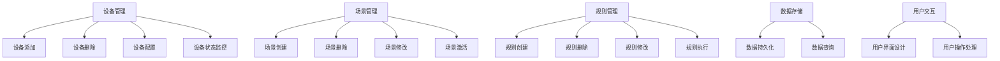
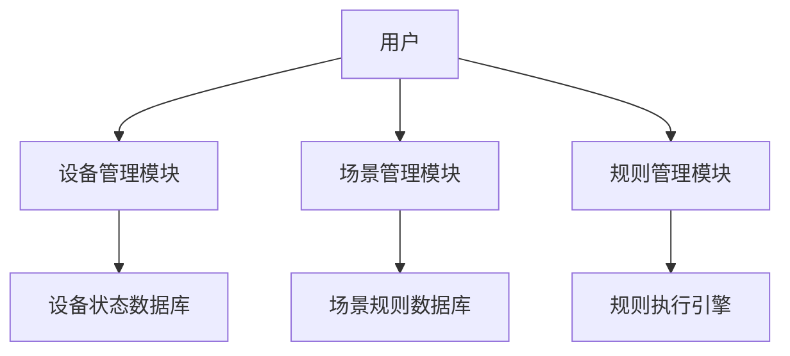
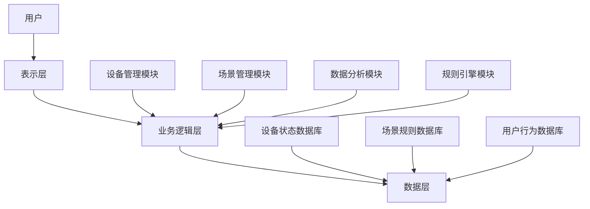
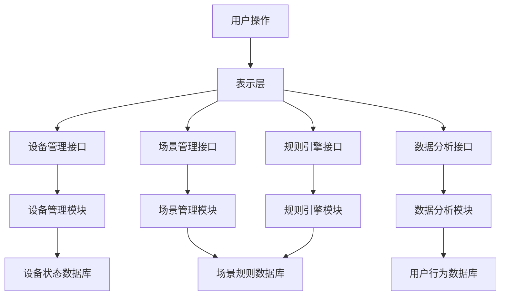
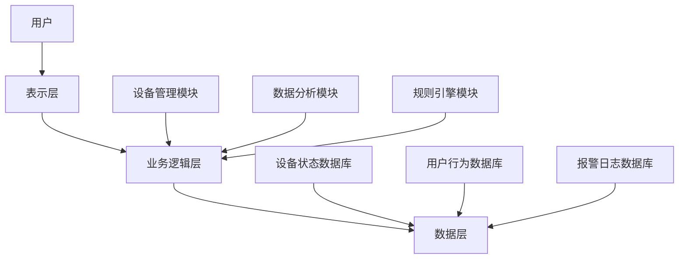
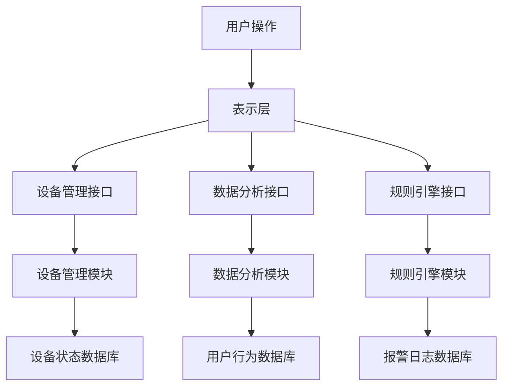

                 

### 第1章: 智能家居概述

#### 1.1 智能家居的发展历程

##### 1.1.1 智能家居的起源

智能家居（Smart Home）的概念起源于20世纪70年代的能源危机。当时，为了节约能源，一些先进的家庭自动化设备开始出现，如远程控制家电和温控系统。这些设备是智能家居的雏形，为后来的发展奠定了基础。

##### 1.1.2 智能家居的演进阶段

智能家居的发展可以分为以下几个阶段：

1. **简单自动化阶段**：20世纪80年代，随着微处理器技术的发展，家庭自动化设备逐渐普及。这一阶段的主要特点是独立设备的自动化，如自动灯泡、自动窗帘等。

2. **联网阶段**：20世纪90年代，随着互联网的普及，家庭设备开始通过网络进行通信。这一阶段标志着智能家居开始走向集成化。

3. **智能化阶段**：21世纪初，随着人工智能和物联网技术的进步，智能家居设备开始具备学习能力，能够根据用户的行为进行自主调整。这一阶段的特点是设备之间的协作和交互。

4. **生态化阶段**：近年来，智能家居逐渐形成一个生态系统，不同品牌和厂商的设备可以无缝连接和协作，为用户提供更加个性化的服务。

##### 1.1.3 智能家居的现状与趋势

目前，智能家居市场正处于快速发展阶段，各类智能设备层出不穷。根据市场研究公司的数据，全球智能家居市场规模预计将在未来几年内持续增长。以下是智能家居的一些现状与趋势：

1. **设备种类丰富**：从传统的照明、空调、家电到现代的安防、健康监测、能源管理等，智能家居设备种类越来越丰富。

2. **互联互通**：不同品牌和厂商的设备逐渐实现互联互通，用户可以轻松地通过一个平台或应用来控制和管理所有设备。

3. **人工智能赋能**：智能家居设备越来越具备人工智能能力，如语音控制、人脸识别、智能推荐等，为用户带来更加智能化的体验。

4. **隐私与安全**：随着智能家居设备的普及，用户隐私和安全问题也日益受到关注。如何保障用户隐私和数据安全成为智能家居发展的重要挑战。

#### 1.2 智能家居的核心概念与组成

##### 1.2.1 核心概念

智能家居（Smart Home）是指利用物联网（IoT）、云计算、大数据、人工智能等技术，实现家庭设备互联互通，为用户提供智能化、个性化、便捷化的家居生活体验的系统。

##### 1.2.2 组成要素

智能家居系统由以下几个核心组成要素：

1. **传感器**：用于感知家庭环境，如温度、湿度、光照、烟雾等。
2. **控制中心**：通常是一台电脑或智能手机，用于接收传感器数据、下发控制指令。
3. **执行器**：如灯光、窗帘、空调等，用于根据控制中心的指令执行相应的动作。
4. **通信网络**：用于传感器、控制中心和执行器之间的数据传输。
5. **用户界面**：用于用户与智能家居系统进行交互，如手机应用、语音助手等。

##### 1.2.3 关系与交互

智能家居系统中的各个要素通过以下方式相互作用：

1. **数据采集**：传感器收集家庭环境数据，如温度、湿度等。
2. **数据处理**：控制中心接收传感器数据，进行处理和分析。
3. **指令下发**：控制中心根据分析结果，向执行器下发控制指令。
4. **执行动作**：执行器根据控制中心的指令执行相应的动作。
5. **反馈与优化**：系统通过反馈机制不断优化，提高智能化水平。

#### 1.3 智能家居的技术体系

##### 1.3.1 硬件技术

智能家居的硬件技术主要包括以下几个方面：

1. **传感器技术**：用于感知家庭环境，如温度传感器、湿度传感器、光敏传感器等。
2. **执行器技术**：用于执行控制指令，如电机、继电器、红外发射器等。
3. **通信技术**：用于传感器、控制中心和执行器之间的数据传输，如WiFi、蓝牙、Zigbee等。

##### 1.3.2 软件技术

智能家居的软件技术主要包括以下几个方面：

1. **操作系统**：用于控制中心设备，如Android、iOS、Linux等。
2. **应用软件**：用于用户与智能家居系统进行交互，如手机应用、网页应用等。
3. **算法技术**：用于数据处理和智能分析，如机器学习、深度学习等。

##### 1.3.3 网络技术

智能家居的网络技术主要包括以下几个方面：

1. **局域网**：用于家庭内部设备之间的通信，如WiFi、以太网等。
2. **广域网**：用于家庭与云平台之间的通信，如互联网、蜂窝网络等。
3. **通信协议**：用于设备之间的数据传输，如HTTP、MQTT等。

#### 1.4 智能家居的应用场景

##### 1.4.1 家庭自动化

家庭自动化是智能家居的核心应用场景之一，主要包括以下几个方面：

1. **智能照明**：用户可以通过手机应用或语音助手远程控制家中的灯光。
2. **智能空调**：用户可以根据室内外温度自动调节空调温度，提高舒适度。
3. **智能安防**：用户可以通过摄像头监控家庭安全，实时收到报警信息。

##### 1.4.2 家庭安防

家庭安防是智能家居的重要应用领域，主要包括以下几个方面：

1. **入侵报警**：用户可以设置门窗传感器、摄像头等设备，一旦有入侵行为，系统会立即报警。
2. **火灾报警**：用户可以设置烟雾传感器，一旦检测到烟雾，系统会立即报警。
3. **紧急求助**：用户可以通过手机应用或紧急按钮向家人或警方求助。

##### 1.4.3 健康监测

健康监测是智能家居的一个重要应用方向，主要包括以下几个方面：

1. **体温监测**：用户可以通过智能体温计监测体温，及时发现异常。
2. **心率监测**：用户可以通过智能手环、智能手表等设备监测心率，了解心脏健康状况。
3. **睡眠监测**：用户可以通过智能床垫、智能枕头等设备监测睡眠质量，提供健康建议。

##### 1.4.4 智能家居生态

智能家居生态是指由多个智能家居设备和平台组成的完整生态系统。这个生态系统能够实现设备之间的互联互通，为用户提供更加智能化的家居生活体验。智能家居生态主要包括以下几个方面：

1. **设备协同**：不同品牌和型号的智能家居设备能够无缝连接和协作，实现自动化控制和优化。
2. **场景设定**：用户可以根据需要设定不同的场景，如“离家模式”、“睡眠模式”等，系统会自动调整设备状态。
3. **个性化服务**：系统可以根据用户的行为和习惯，提供个性化的服务，如自动调节灯光亮度、温度等。

#### 1.5 智能家居的挑战与机遇

##### 1.5.1 技术挑战

智能家居的发展面临着一系列技术挑战，主要包括以下几个方面：

1. **兼容性问题**：不同品牌和厂商的智能家居设备可能使用不同的通信协议和标准，导致兼容性问题。
2. **数据安全**：智能家居设备连接到互联网，可能会面临数据泄露和黑客攻击的风险。
3. **用户体验**：智能家居系统需要提供简单易用的用户界面和交互方式，提高用户的体验。

##### 1.5.2 市场机遇

智能家居市场前景广阔，面临着巨大的市场机遇，主要包括以下几个方面：

1. **需求增长**：随着生活水平的提高，用户对智能家居的需求不断增加。
2. **技术创新**：随着物联网、人工智能、大数据等技术的不断发展，智能家居系统将变得更加智能化、便捷化。
3. **政策支持**：政府出台了一系列政策，鼓励智能家居产业的发展。

##### 1.5.3 未来展望

未来，智能家居将朝着更加智能化、便捷化、个性化的方向发展，具体趋势包括：

1. **全屋智能**：智能家居系统将覆盖整个家庭，实现设备之间的无缝连接和自动化控制。
2. **人工智能**：智能家居设备将具备更高级的人工智能能力，能够更好地理解和满足用户需求。
3. **生态融合**：智能家居将与其他行业（如医疗、教育等）进行深度融合，为用户提供更加丰富的服务。

#### 1.6 本章小结

智能家居作为物联网和人工智能技术在家庭领域的应用，已经成为现代家庭生活的重要组成部分。通过对智能家居的发展历程、核心概念、技术体系、应用场景以及挑战与机遇的介绍，我们可以看到智能家居的发展前景广阔，同时也面临一系列挑战。未来，随着技术的不断进步和市场的逐渐成熟，智能家居将为用户提供更加智能化、便捷化的家居生活体验。### 第2章: 系统架构设计基础

#### 2.1 系统架构设计原则

系统架构设计是智能家居系统开发的重要环节，它决定了系统的可扩展性、可维护性和性能。在架构设计过程中，我们需要遵循一些基本原则，以确保系统的高效和可靠性。

##### 2.1.1 分层架构

分层架构是一种常见的系统设计方法，它将系统划分为多个层次，每个层次负责不同的功能。典型的分层架构包括表示层、业务逻辑层和数据层。这种设计方法能够提高系统的可维护性和扩展性，因为每个层次都可以独立开发、测试和部署。

1. **表示层**：负责与用户交互，包括用户界面和前端逻辑。
2. **业务逻辑层**：负责处理业务逻辑，包括业务规则、决策和数据处理。
3. **数据层**：负责数据存储和管理，包括数据库和持久化逻辑。

##### 2.1.2 模块化设计

模块化设计是将系统分解为若干独立的模块，每个模块负责特定的功能。模块之间通过清晰的接口进行通信，模块内部实现细节对外部隐藏。这种设计方法能够提高系统的可复用性和可维护性，因为每个模块都可以独立开发、测试和部署。

1. **模块独立性**：每个模块应该具有单一职责，避免模块之间的紧密耦合。
2. **接口定义**：模块之间的通信应该通过明确的接口进行，减少模块间的直接依赖。
3. **模块可测试性**：每个模块都应该具备独立的测试环境，以便在集成测试阶段进行有效的测试。

##### 2.1.3 扩展性与可维护性

扩展性与可维护性是系统架构设计的重要目标。一个良好的系统架构应该能够轻松地适应未来需求的变化，并且易于维护和更新。

1. **扩展性**：系统应该具备良好的扩展性，能够支持新功能的添加和旧功能的升级。
2. **可维护性**：系统应该具有良好的可维护性，降低维护成本和提高维护效率。

为了实现这些目标，我们可以采用以下策略：

1. **设计模式**：使用设计模式（如工厂模式、单例模式等）来提高系统的可扩展性和可维护性。
2. **代码规范**：遵循统一的代码规范，提高代码的可读性和可维护性。
3. **自动化测试**：建立自动化测试体系，提高测试覆盖率，确保系统稳定性和可靠性。

#### 2.2 系统架构模型

系统架构模型是对系统结构的一种抽象描述，它帮助我们理解系统的组成和各部分之间的关系。在智能家居系统中，常用的系统架构模型包括概念模型、实体关系模型和功能模型。

##### 2.2.1 概念模型

概念模型是系统架构设计的第一步，它帮助我们明确系统的核心概念和基本要素。在智能家居系统中，概念模型通常包括以下几个核心概念：

1. **用户**：系统的使用者，可以是一个家庭用户或多个家庭成员。
2. **设备**：家庭中的各种智能设备，如灯光、空调、摄像头等。
3. **场景**：一组设备的组合，用于实现特定的功能，如“离家模式”、“睡眠模式”等。
4. **规则**：定义设备之间如何交互和协作，如“当门锁关闭时，关闭灯光”。

##### 2.2.2 实体关系模型

实体关系模型（Entity-Relationship Model）是用于描述系统中实体及其之间关系的图形表示方法。在智能家居系统中，实体关系模型可以帮助我们清晰地定义系统中的各种实体及其之间的关系。

以下是一个简单的实体关系模型示例：

```mermaid
erDiagram
    User ||--|{ Device : owns }
    User ||--|{ Scene : defines }
    Scene ||--|{ Rule : defines }
    Device ||--|{ Rule : follows }
```

在这个模型中：

- **User** 表示系统的用户。
- **Device** 表示家庭中的智能设备。
- **Scene** 表示一组设备的组合，用于实现特定的功能。
- **Rule** 表示定义设备之间如何交互和协作的规则。

实体关系模型能够帮助我们理解系统的基本结构和关系，为后续的系统架构设计提供指导。

##### 2.2.3 功能模型

功能模型描述了系统的功能和功能之间的交互。在智能家居系统中，功能模型通常包括以下几个核心功能：

1. **设备管理**：包括设备的添加、删除、配置和状态监控。
2. **场景管理**：包括场景的创建、修改、删除和激活。
3. **规则管理**：包括规则的创建、修改、删除和执行。
4. **数据存储**：包括数据的持久化存储和查询。
5. **用户交互**：包括用户界面的设计和用户操作的处理。

一个简单的功能模型如下：



在这个模型中，各个功能模块通过清晰的接口进行交互，共同构成智能家居系统的功能体系。

#### 2.3 系统架构设计方法

系统架构设计是一个复杂的过程，需要综合考虑系统的需求、技术可行性、业务模式等多方面因素。以下是常见的系统架构设计方法：

##### 2.3.1 需求分析

需求分析是系统架构设计的起点，它帮助我们明确系统的功能需求和非功能需求。在智能家居系统中，需求分析主要包括以下几个方面：

1. **用户需求**：了解用户对智能家居系统的期望和需求，如设备控制、场景设定、远程监控等。
2. **业务需求**：分析智能家居系统的业务逻辑和流程，如设备管理、数据存储、用户交互等。
3. **技术需求**：评估实现系统所需的技术方案和技术栈，如硬件设备、网络通信、数据处理等。

##### 2.3.2 架构设计

架构设计是将需求转化为具体的系统架构的过程。在架构设计过程中，我们需要考虑以下几个方面：

1. **架构风格**：选择合适的架构风格，如分层架构、微服务架构等。
2. **架构组件**：定义系统的各个组件及其功能，如设备管理模块、场景管理模块等。
3. **数据流**：描述系统中的数据流和交互关系，如用户操作、设备状态、数据存储等。

一个典型的智能家居系统架构设计可能如下：



在这个架构中，用户通过用户界面与系统进行交互，设备管理模块负责设备的状态监控和配置，场景管理模块负责场景的创建和激活，规则管理模块负责规则的创建和执行。

##### 2.3.3 架构评估与优化

架构评估与优化是确保系统架构设计符合需求和业务目标的过程。在架构评估过程中，我们需要考虑以下几个方面：

1. **性能评估**：评估系统在不同负载下的性能表现，如响应时间、吞吐量等。
2. **可靠性评估**：评估系统在异常情况下的可靠性，如数据丢失、设备故障等。
3. **可维护性评估**：评估系统的可维护性和可扩展性，如代码可读性、模块独立性等。

在架构优化过程中，我们可以通过以下方法提高系统性能和可靠性：

1. **性能优化**：通过优化数据库查询、缓存策略、网络传输等提高系统性能。
2. **可靠性优化**：通过增加冗余组件、数据备份、故障转移等提高系统可靠性。
3. **可维护性优化**：通过代码重构、自动化测试、文档管理等提高系统的可维护性。

#### 2.4 智能家居系统的关键技术

智能家居系统的发展离不开关键技术的支持，以下是智能家居系统的一些关键技术：

##### 2.4.1 硬件技术

1. **传感器技术**：传感器是智能家居系统的核心组件，用于感知家庭环境。常见的传感器包括温度传感器、湿度传感器、光照传感器、烟雾传感器等。
2. **执行器技术**：执行器是智能家居系统的执行组件，用于根据控制指令执行相应的动作。常见的执行器包括电机、继电器、红外发射器等。
3. **通信技术**：智能家居系统需要使用多种通信技术实现设备之间的数据传输。常见的通信技术包括WiFi、蓝牙、Zigbee、NB-IoT等。

##### 2.4.2 软件技术

1. **操作系统**：智能家居系统通常需要运行在嵌入式操作系统上，如Linux、Android等。操作系统负责硬件资源的管理和任务调度。
2. **应用软件**：智能家居系统需要提供各种应用软件，如用户界面、设备管理工具、数据分析工具等。这些软件用于实现系统的功能，提高用户体验。
3. **算法技术**：智能家居系统需要使用各种算法技术实现数据分析和智能决策。常见的算法技术包括机器学习、深度学习、数据分析等。

##### 2.4.3 网络技术

1. **局域网**：智能家居系统需要在家庭内部建立局域网，用于连接各种设备和控制中心。常见的局域网技术包括WiFi、以太网等。
2. **广域网**：智能家居系统需要通过广域网与云平台进行通信，实现数据传输和远程控制。常见的广域网技术包括互联网、蜂窝网络等。
3. **通信协议**：智能家居系统需要使用各种通信协议实现设备之间的数据传输。常见的通信协议包括HTTP、MQTT、CoAP等。

#### 2.5 智能家居系统的安全设计

智能家居系统的安全设计是确保用户隐私和数据安全的关键。以下是智能家居系统的安全设计要点：

##### 2.5.1 安全性问题

1. **数据泄露**：智能家居系统中的数据可能包括用户个人信息、设备状态、行为记录等，如果不当处理，可能导致数据泄露。
2. **设备入侵**：黑客可能通过攻击智能家居系统中的设备，如摄像头、门锁等，实现对用户的非法侵入。
3. **恶意软件**：智能家居系统可能受到恶意软件的攻击，导致系统崩溃或数据丢失。

##### 2.5.2 安全防护措施

1. **数据加密**：对系统中的数据进行加密存储和传输，确保数据在传输过程中不被窃取或篡改。
2. **访问控制**：对系统中的设备进行严格的访问控制，确保只有授权用户才能访问和操作设备。
3. **安全协议**：使用安全的通信协议，如TLS/SSL等，确保数据在传输过程中的安全性。
4. **设备更新**：定期更新系统中的设备固件和软件，修复已知的安全漏洞。

##### 2.5.3 安全标准与法规

1. **安全标准**：遵循国际和国内的安全标准，如ISO/IEC 27001、GDPR等，确保系统的安全性和合规性。
2. **法规遵从**：遵守相关的法律法规，如数据保护法、网络安全法等，确保系统的合法运营。

#### 2.6 本章小结

系统架构设计是智能家居系统开发的核心环节，它决定了系统的性能、可靠性和可维护性。在本章中，我们介绍了系统架构设计的基础原则、常用模型和方法，以及智能家居系统的关键技术和安全设计要点。通过本章的学习，读者可以掌握系统架构设计的基本方法，为后续的智能家居系统开发奠定基础。### 第3章: 设备接入与通信协议

#### 3.1 设备接入概述

设备接入是智能家居系统建设的第一步，也是关键的一步。设备接入主要涉及以下几个方面：

1. **设备接入方式**：设备可以通过有线（如以太网、电源线）或无线（如WiFi、蓝牙、Zigbee）方式接入网络。
2. **设备接入流程**：设备接入过程包括设备初始化、连接网络、注册认证、设备管理等多个步骤。
3. **设备接入协议**：设备接入需要遵循一定的通信协议，如HTTP、MQTT、CoAP等。

##### 3.1.1 设备接入方式

智能家居设备的接入方式主要分为有线接入和无线接入：

1. **有线接入**：有线接入方式主要包括以太网接入和电源线接入。以太网接入是一种高速、稳定的接入方式，适用于设备分布较为集中、网络环境较好的场景。电源线接入利用现有的电源线路传输数据，无需额外布线，但传输速度和稳定性相对较低。

2. **无线接入**：无线接入方式主要包括WiFi、蓝牙和Zigbee等。WiFi接入是一种广泛使用的无线接入方式，具有高速、稳定的优点，但可能受到无线信号干扰和距离限制。蓝牙接入适用于短距离、低功耗的设备，如智能手环、智能手表等。Zigbee是一种低功耗、低速率的无线通信技术，适用于小型、分散的设备接入。

##### 3.1.2 设备接入流程

设备接入流程通常包括以下步骤：

1. **设备初始化**：设备上电启动后，进行系统初始化，加载固件和配置信息。
2. **连接网络**：设备通过所选接入方式（有线或无线）连接到家庭局域网。
3. **注册认证**：设备向智能家居系统服务器发送注册请求，服务器进行认证，分配设备ID和访问权限。
4. **设备管理**：智能家居系统对设备进行管理，包括设备状态监控、设备升级、设备状态报告等。

#### 3.2 通信协议

通信协议是设备之间、设备与服务器之间进行数据传输和交互的规范。在智能家居系统中，常用的通信协议包括HTTP、MQTT、CoAP等。

##### 3.2.1 常见通信协议

1. **HTTP（超文本传输协议）**：HTTP是一种基于请求-响应模型的通信协议，广泛应用于互联网通信。在智能家居系统中，HTTP可以用于设备与服务器之间的数据传输，如设备状态报告、控制指令下发等。

2. **MQTT（消息队列遥测传输协议）**：MQTT是一种轻量级的消息队列协议，适用于低带宽、高延迟的网络环境。MQTT协议基于发布-订阅模型，设备可以订阅特定的主题，接收来自服务器的消息。在智能家居系统中，MQTT可以用于设备之间的数据传输和远程控制。

3. **CoAP（超文本传输协议基于CoAP）**：CoAP是一种基于资源模型的通信协议，类似于HTTP。CoAP适用于物联网设备，具有简单、轻量、低功耗的特点。在智能家居系统中，CoAP可以用于设备之间的数据传输和控制。

##### 3.2.2 通信协议选择与优化

在选择通信协议时，需要考虑以下几个因素：

1. **网络环境**：根据家庭局域网的带宽、延迟等网络环境，选择适合的通信协议。对于高速、稳定的网络环境，可以选择HTTP；对于低带宽、高延迟的网络环境，可以选择MQTT或CoAP。

2. **设备性能**：考虑设备的处理器性能、内存和功耗等，选择适合的通信协议。对于高性能的设备，可以选择HTTP或MQTT；对于低功耗的设备，可以选择CoAP。

3. **通信需求**：根据智能家居系统的通信需求，选择合适的通信协议。例如，对于实时性要求较高的应用，可以选择MQTT；对于数据传输量大、传输速度要求较高的应用，可以选择HTTP。

##### 3.2.3 通信协议安全性

在智能家居系统中，通信协议的安全性至关重要。以下是几种常见通信协议的安全性特点：

1. **HTTP**：HTTP协议本身不具备安全性，但可以通过使用HTTPS（HTTP over TLS）来增强安全性。HTTPS使用TLS（传输层安全协议）对数据传输进行加密，确保数据在传输过程中不被窃取或篡改。

2. **MQTT**：MQTT协议支持使用TLS进行加密传输，确保数据传输过程中的安全性。此外，MQTT协议还支持访问控制和身份验证，确保只有授权设备才能访问服务器。

3. **CoAP**：CoAP协议本身不支持加密传输，但可以通过使用DTLS（数据包安全层）进行加密，确保数据传输的安全性。与MQTT类似，CoAP也支持访问控制和身份验证。

#### 3.3 设备管理

设备管理是智能家居系统的重要组成部分，涉及设备信息管理、设备生命周期管理和设备状态监控等方面。

##### 3.3.1 设备信息管理

设备信息管理包括设备的添加、删除、查询和更新。设备信息通常包括设备ID、设备类型、设备状态、设备配置参数等。

1. **设备添加**：设备通过注册认证后，系统将设备信息存储在设备信息数据库中，并为设备分配唯一的设备ID。
2. **设备删除**：当设备不再使用时，系统可以从设备信息数据库中删除该设备的记录。
3. **设备查询**：系统可以根据设备ID、设备类型等条件查询设备信息，以便进行设备状态监控和设备配置。
4. **设备更新**：系统可以实时更新设备信息，如设备状态、设备配置参数等。

##### 3.3.2 设备生命周期管理

设备生命周期管理包括设备的初始化、运行、维护和退役等阶段。

1. **设备初始化**：设备上电启动后，进行系统初始化，加载固件和配置信息，连接网络并注册认证。
2. **设备运行**：设备在运行过程中，接收来自服务器的控制指令，执行相应的操作，并将设备状态报告给服务器。
3. **设备维护**：系统可以根据设备状态和历史数据，对设备进行维护和保养，确保设备正常运行。
4. **设备退役**：当设备无法正常工作时，系统可以将设备从设备信息数据库中删除，并进行退役处理。

##### 3.3.3 设备状态监控与报警

设备状态监控与报警是智能家居系统的关键功能之一，用于实时监测设备状态，及时发现和处理异常情况。

1. **设备状态监控**：系统通过定时轮询或事件驱动方式，获取设备状态信息，如温度、湿度、电压等。
2. **异常报警**：当设备状态异常（如温度过高、电压过低等）时，系统可以触发报警，通知用户或自动执行相应的处理措施。
3. **报警通知**：系统可以通过短信、邮件、APP推送等方式，通知用户设备异常情况。

#### 3.4 数据处理与存储

数据处理与存储是智能家居系统的核心功能之一，涉及数据的采集、处理、存储和保护等方面。

##### 3.4.1 数据处理流程

数据处理流程包括以下步骤：

1. **数据采集**：系统通过传感器采集家庭环境数据，如温度、湿度、光照等。
2. **数据预处理**：对采集到的数据进行预处理，如去噪、滤波、归一化等，提高数据质量。
3. **数据存储**：将预处理后的数据存储到数据库中，以便后续分析和查询。
4. **数据分析**：对存储的数据进行分析和处理，如统计、预测、聚类等，为智能家居系统提供决策支持。

##### 3.4.2 数据存储方案

数据存储方案包括以下方面：

1. **数据库选择**：根据数据规模、数据结构、查询性能等需求，选择合适的数据库系统，如关系型数据库（如MySQL、PostgreSQL）或NoSQL数据库（如MongoDB、Cassandra）。
2. **数据表设计**：设计合理的数据表结构，包括数据表字段、数据类型、索引等，提高数据查询性能。
3. **数据存储策略**：根据数据的重要性和访问频率，制定合适的数据存储策略，如数据压缩、数据分片、数据备份等。

##### 3.4.3 数据安全与隐私保护

数据安全与隐私保护是智能家居系统的关键问题之一，涉及以下方面：

1. **数据加密**：对存储和传输的数据进行加密，确保数据在传输过程中不被窃取或篡改。
2. **访问控制**：对数据访问进行严格的访问控制，确保只有授权用户才能访问和操作数据。
3. **隐私保护**：对用户隐私数据进行脱敏处理，确保用户隐私不被泄露。
4. **日志记录**：记录数据访问和操作的日志，便于后续审计和排查问题。

#### 3.5 设备远程控制与交互

设备远程控制与交互是智能家居系统的核心功能之一，用户可以通过远程设备（如手机、平板电脑等）对家庭设备进行控制，实现远程监控和操作。

##### 3.5.1 远程控制方式

远程控制方式主要包括以下几种：

1. **移动应用**：用户可以通过智能手机或平板电脑上的移动应用，对家庭设备进行远程控制。移动应用可以提供直观的用户界面，方便用户操作。
2. **语音助手**：用户可以通过语音助手（如Siri、Alexa、Google Assistant等）对家庭设备进行语音控制。语音助手可以提供自然语言交互，提高用户体验。
3. **Web应用**：用户可以通过Web浏览器访问智能家居系统的Web应用，对家庭设备进行远程控制。Web应用可以跨平台使用，方便用户在不同设备上进行操作。

##### 3.5.2 交互界面设计

交互界面设计是智能家居系统的重要组成部分，需要考虑以下方面：

1. **用户界面**：设计直观、易用的用户界面，方便用户进行设备控制和操作。
2. **响应速度**：确保用户界面的响应速度较快，提高用户体验。
3. **交互方式**：提供多种交互方式，如触摸、语音、手势等，满足不同用户的需求。

##### 3.5.3 交互体验优化

交互体验优化是提高智能家居系统用户体验的关键，需要考虑以下方面：

1. **个性化设置**：根据用户习惯和需求，提供个性化的设置和功能，提高用户体验。
2. **快捷操作**：提供快捷操作和手势操作，方便用户快速进行设备控制和操作。
3. **反馈机制**：及时响应用户操作，提供明确的反馈信息，提高用户体验。

#### 3.6 本章小结

设备接入与通信协议是智能家居系统建设的基础，涉及设备接入方式、接入流程、通信协议、设备管理、数据处理与存储、设备远程控制与交互等方面。通过本章的学习，读者可以了解智能家居系统中设备接入与通信协议的基本概念和方法，为后续的智能家居系统开发奠定基础。### 第4章: 系统集成方案设计

#### 4.1 系统集成概述

系统集成是指将不同系统、设备和组件整合在一起，使其能够协同工作，提供统一的服务和体验。在智能家居系统中，系统集成方案的设计至关重要，它直接影响到系统的稳定性、可靠性和用户体验。以下是系统集成方案设计的重要性、方法和关键步骤。

##### 4.1.1 系统集成的重要性

系统集成的重要性体现在以下几个方面：

1. **提高系统稳定性**：通过整合不同设备和系统，可以实现资源优化和负载均衡，提高系统的稳定性和可靠性。
2. **优化用户体验**：集成系统可以提供统一的用户界面和操作体验，使用户能够方便地管理和控制家庭设备。
3. **降低维护成本**：系统集成后，系统管理和维护变得更加简单和高效，可以降低维护成本。
4. **提高开发效率**：系统集成可以减少重复开发工作，提高开发效率，缩短项目周期。

##### 4.1.2 系统集成的方法与流程

系统集成的方法和流程主要包括以下步骤：

1. **需求分析**：明确系统集成的目标、需求和功能要求，包括系统间的数据交换、控制逻辑和交互界面等。
2. **架构设计**：根据需求分析，设计系统的整体架构，确定系统间的接口和通信协议。
3. **组件集成**：将各个组件（如设备、模块、子系统等）进行集成，测试和优化组件间的交互。
4. **系统集成**：将各个组件集成在一起，形成完整的系统，进行系统测试和调试。
5. **性能优化**：对集成后的系统进行性能优化，包括网络传输优化、负载均衡、故障处理等。
6. **部署上线**：将集成后的系统部署到生产环境，进行上线运行。

#### 4.2 系统接口设计

系统接口设计是系统集成方案设计的关键环节，它决定了不同系统、设备和组件之间的数据交换和交互方式。以下是系统接口设计的关键要素和注意事项。

##### 4.2.1 系统接口概述

系统接口主要包括以下几种类型：

1. **API接口**：应用程序编程接口，用于系统间的数据交换和功能调用。API接口通常使用HTTP、RESTful风格进行设计。
2. **数据库接口**：用于系统与数据库之间的数据存储和查询。常见的数据库接口包括SQL查询接口、NoSQL接口等。
3. **消息队列接口**：用于系统间的异步通信，实现数据的传输和事件处理。常见的消息队列接口包括Kafka、RabbitMQ等。
4. **设备接口**：用于系统与智能设备的通信，包括设备控制接口、状态报告接口等。

##### 4.2.2 接口设计与实现

接口设计需要遵循以下原则：

1. **高内聚、低耦合**：确保接口模块内部高度内聚，模块间低耦合，便于维护和扩展。
2. **单一职责**：每个接口应具有单一职责，避免接口过于复杂，提高可维护性。
3. **简洁性**：接口设计应简洁明了，易于理解和使用。

接口实现需要考虑以下方面：

1. **安全性**：接口需要实现身份验证和权限控制，确保数据的安全传输。
2. **兼容性**：接口应考虑不同操作系统、设备和协议的兼容性，确保系统能够在多种环境中正常运行。
3. **可扩展性**：接口设计应具有可扩展性，以便在系统扩展时能够无缝集成新的功能。

##### 4.2.3 接口测试与优化

接口测试是确保接口设计质量和系统稳定性的重要环节。接口测试主要包括以下方面：

1. **功能测试**：测试接口的功能是否符合设计要求，包括输入输出、异常处理等。
2. **性能测试**：测试接口的响应时间、吞吐量和并发能力，确保接口在高速网络和高并发环境下正常运行。
3. **安全性测试**：测试接口的安全性，包括身份验证、权限控制、数据加密等。

接口优化主要包括以下方面：

1. **优化接口性能**：通过优化代码、缓存策略、数据库查询等提高接口性能。
2. **优化接口安全性**：通过使用安全协议、加密算法等提高接口的安全性。
3. **优化接口兼容性**：通过兼容性测试和调整，确保接口在不同操作系统、设备和协议下的兼容性。

#### 4.3 系统测试

系统测试是确保智能家居系统质量和稳定性的关键环节。系统测试主要包括以下类型：

1. **功能测试**：测试系统的功能是否符合设计要求，包括设备接入、设备管理、场景设置、数据存储等。
2. **性能测试**：测试系统的性能，包括响应时间、吞吐量、并发能力等。
3. **安全性测试**：测试系统的安全性，包括身份验证、权限控制、数据加密等。
4. **兼容性测试**：测试系统在不同操作系统、设备和协议下的兼容性。

##### 4.3.1 系统测试概述

系统测试的主要目标是确保系统的功能完整性、性能稳定性和安全性。系统测试的流程通常包括以下步骤：

1. **测试计划**：制定系统测试计划，包括测试目标、测试范围、测试方法等。
2. **测试用例设计**：设计测试用例，包括功能测试用例、性能测试用例、安全性测试用例等。
3. **测试执行**：执行测试用例，记录测试结果，分析测试数据。
4. **缺陷管理**：记录和跟踪缺陷，对缺陷进行分析和修复。
5. **测试报告**：编写系统测试报告，总结测试结果和发现的问题，提出改进建议。

##### 4.3.2 功能测试

功能测试是系统测试的基础，主要测试系统的各项功能是否按照设计要求正常运行。功能测试包括以下几个方面：

1. **设备接入测试**：测试设备是否能够正常接入系统，包括设备注册、认证、状态报告等。
2. **设备管理测试**：测试设备管理功能，包括设备添加、删除、修改、状态监控等。
3. **场景设置测试**：测试场景设置功能，包括场景创建、删除、修改、激活等。
4. **数据存储测试**：测试数据存储功能，包括数据持久化、查询、更新等。

##### 4.3.3 性能测试

性能测试主要测试系统在不同负载下的性能表现，包括响应时间、吞吐量、并发能力等。性能测试包括以下几个方面：

1. **负载测试**：模拟不同负载（如用户数量、设备数量等）下系统的性能表现，测试系统的响应时间和吞吐量。
2. **压力测试**：测试系统在高负载、高并发环境下的性能表现，查找系统的性能瓶颈。
3. **稳定性测试**：测试系统在长时间运行下的稳定性，确保系统在长时间运行后仍能稳定工作。

##### 4.3.4 安全测试

安全测试主要测试系统的安全性，包括身份验证、权限控制、数据加密等。安全测试包括以下几个方面：

1. **身份验证测试**：测试系统的身份验证机制，确保只有授权用户才能访问系统。
2. **权限控制测试**：测试系统的权限控制机制，确保用户只能访问和操作授权的资源。
3. **数据加密测试**：测试系统的数据加密机制，确保数据在传输和存储过程中的安全性。
4. **安全漏洞测试**：测试系统是否存在安全漏洞，如SQL注入、XSS攻击等，及时修复安全漏洞。

#### 4.4 系统部署与运维

系统部署与运维是确保智能家居系统正常运行和持续优化的重要环节。以下是系统部署与运维的关键步骤和注意事项。

##### 4.4.1 系统部署方案

系统部署方案主要包括以下方面：

1. **硬件部署**：根据系统需求和性能要求，选择合适的硬件设备进行部署，包括服务器、存储设备、网络设备等。
2. **软件部署**：安装和配置系统软件，包括操作系统、数据库、中间件、应用程序等。
3. **网络部署**：配置网络设备，确保系统之间的通信和数据传输。

##### 4.4.2 系统运维策略

系统运维策略主要包括以下方面：

1. **监控与报警**：监控系统的运行状态，及时发现和处理异常情况，通过报警机制通知运维人员。
2. **备份与恢复**：定期进行数据备份，确保数据的安全性和完整性，在发生数据丢失或系统故障时能够快速恢复。
3. **性能优化**：定期对系统进行性能优化，包括数据库优化、网络优化、负载均衡等，提高系统的性能和稳定性。
4. **安全管理**：定期进行安全检查，确保系统的安全性，包括安全漏洞修复、访问控制、数据加密等。

##### 4.4.3 系统维护与升级

系统维护与升级主要包括以下方面：

1. **系统维护**：定期对系统进行维护，包括硬件维护、软件更新、系统优化等，确保系统的正常运行。
2. **系统升级**：根据业务需求和技术发展，对系统进行升级，包括新增功能、修复漏洞、提高性能等。
3. **版本控制**：使用版本控制系统（如Git）管理系统代码和配置文件，确保升级过程的可追溯性和可恢复性。

#### 4.5 本章小结

系统集成方案设计是智能家居系统开发的关键环节，涉及到系统接口设计、系统测试、系统部署与运维等方面。通过本章的学习，读者可以了解系统集成方案设计的基本概念和方法，为后续的智能家居系统开发提供指导和参考。### 第5章: 智能家居系统应用案例分析

#### 5.1 案例一：智能家居系统在家庭自动化中的应用

##### 5.1.1 案例背景

随着人们生活水平的提高，对于家居环境的要求也越来越高。家庭自动化作为智能家居的重要应用领域，旨在通过智能设备和技术手段，实现家庭环境的自动化控制和智能化管理，为用户提供更加舒适、便捷的生活体验。本案例以一个典型的现代化住宅为背景，介绍如何通过智能家居系统实现家庭自动化的目标。

##### 5.1.2 系统架构

该智能家居系统采用了分层架构设计，包括表示层、业务逻辑层和数据层。以下是系统架构的详细描述：

1. **表示层**：负责与用户交互，提供用户界面和应用服务。包括移动应用、网页应用和语音助手等。
2. **业务逻辑层**：负责处理业务逻辑，包括设备控制、场景管理、数据分析和规则执行等。该层包含了设备管理模块、场景管理模块、数据分析模块和规则引擎模块。
3. **数据层**：负责数据存储和管理，包括设备状态数据库、场景规则数据库和用户行为数据库等。

##### 5.1.3 系统功能设计

该智能家居系统的主要功能包括：

1. **设备管理**：用户可以通过表示层界面添加、删除、配置和管理家庭中的智能设备，如灯光、空调、门锁等。
2. **场景管理**：用户可以创建、修改、删除和激活不同的场景，如“离家模式”、“睡眠模式”、“迎宾模式”等。每个场景可以定义一组设备的组合和相应的控制规则。
3. **数据分析**：系统通过收集和分析设备状态数据、用户行为数据等，提供智能化的数据分析和决策支持，如能耗分析、健康监测等。
4. **规则执行**：根据用户定义的规则和系统自动生成的规则，控制设备执行相应的操作，实现自动化的家庭环境管理。

##### 5.1.4 系统架构设计

系统架构设计如下：



在这个架构中，用户通过表示层与系统进行交互，设备管理模块、场景管理模块、数据分析模块和规则引擎模块负责实现具体的业务功能，数据层负责数据的存储和管理。

##### 5.1.5 系统接口设计和系统交互

系统接口设计和系统交互设计如下：



在这个交互设计中，用户操作通过表示层传递给相应的接口，接口再调用业务逻辑层的模块进行数据处理和业务处理，最终将结果返回给用户。同时，系统内部模块之间也通过接口进行数据交互。

##### 5.1.6 系统核心实现

以下是系统核心实现的详细描述：

1. **设备管理**：使用HTTP协议实现设备管理接口，支持设备的添加、删除、修改和查询等功能。以下是一个简单的Python代码示例：

```python
# 设备管理接口示例
from flask import Flask, request, jsonify

app = Flask(__name__)

# 假设设备存储在内存中
devices = {}

@app.route('/device', methods=['POST'])
def add_device():
    device_id = request.json.get('id')
    device_info = request.json.get('info')
    devices[device_id] = device_info
    return jsonify({'status': 'success', 'message': '设备添加成功'})

@app.route('/device', methods=['DELETE'])
def delete_device():
    device_id = request.json.get('id')
    if device_id in devices:
        del devices[device_id]
        return jsonify({'status': 'success', 'message': '设备删除成功'})
    else:
        return jsonify({'status': 'error', 'message': '设备不存在'})

# 其他设备管理接口类似实现

if __name__ == '__main__':
    app.run()
```

2. **场景管理**：使用HTTP协议实现场景管理接口，支持场景的创建、修改、删除和激活等功能。以下是一个简单的Python代码示例：

```python
# 场景管理接口示例
from flask import Flask, request, jsonify

app = Flask(__name__)

# 假设场景存储在内存中
scenes = {}

@app.route('/scene', methods=['POST'])
def create_scene():
    scene_id = request.json.get('id')
    scene_info = request.json.get('info')
    scenes[scene_id] = scene_info
    return jsonify({'status': 'success', 'message': '场景创建成功'})

@app.route('/scene', methods=['PUT'])
def update_scene():
    scene_id = request.json.get('id')
    scene_info = request.json.get('info')
    if scene_id in scenes:
        scenes[scene_id] = scene_info
        return jsonify({'status': 'success', 'message': '场景更新成功'})
    else:
        return jsonify({'status': 'error', 'message': '场景不存在'})

@app.route('/scene', methods=['DELETE'])
def delete_scene():
    scene_id = request.json.get('id')
    if scene_id in scenes:
        del scenes[scene_id]
        return jsonify({'status': 'success', 'message': '场景删除成功'})
    else:
        return jsonify({'status': 'error', 'message': '场景不存在'})

@app.route('/scene/activate', methods=['POST'])
def activate_scene():
    scene_id = request.json.get('id')
    if scene_id in scenes:
        scene_info = scenes[scene_id]
        # 激活场景，执行相应设备的控制操作
        activate_devices(scene_info['devices'])
        return jsonify({'status': 'success', 'message': '场景激活成功'})
    else:
        return jsonify({'status': 'error', 'message': '场景不存在'})

# 其他场景管理接口类似实现

def activate_devices(device_ids):
    # 根据设备ID执行相应的控制操作
    pass

if __name__ == '__main__':
    app.run()
```

3. **数据分析**：使用Python中的Pandas库进行数据分析和处理。以下是一个简单的数据清洗和数据分析示例：

```python
import pandas as pd

# 读取数据
data = pd.read_csv('data.csv')

# 数据清洗
data = data.dropna()  # 删除缺失值
data = data[(data['temperature'] > 0) & (data['temperature'] < 100)]  # 过滤异常值

# 数据分析
mean_temp = data['temperature'].mean()
max_temp = data['temperature'].max()
min_temp = data['temperature'].min()

print(f"平均温度：{mean_temp}")
print(f"最高温度：{max_temp}")
print(f"最低温度：{min_temp}")
```

4. **规则执行**：根据用户定义的规则和系统自动生成的规则，控制设备执行相应的操作。以下是一个简单的规则引擎示例：

```python
# 规则引擎示例
rules = [
    {'condition': 'time > 22 and temperature > 30', 'action': 'turn_on_ac'},
    {'condition': 'time < 7 and temperature < 20', 'action': 'turn_on_heater'},
]

current_time = 23
current_temp = 35

for rule in rules:
    condition = rule['condition']
    action = rule['action']
    if eval(condition):
        print(f"触发规则：{rule['condition']}")
        if action == 'turn_on_ac':
            print("开启空调")
        elif action == 'turn_on_heater':
            print("开启加热器")
```

##### 5.1.7 实际案例分析和详细讲解

以下是一个实际案例的详细分析：

**场景**：用户在家中使用智能家居系统，设置了“离家模式”和“迎宾模式”。在“离家模式”下，所有灯光关闭，空调关闭，门锁锁定。在“迎宾模式”下，灯光逐渐亮起，空调开启，门锁解锁。

**分析**：

1. **设备接入**：首先，用户将智能灯泡、智能空调和智能门锁接入智能家居系统。系统通过HTTP协议与设备进行通信，获取设备状态。

2. **场景设置**：用户通过移动应用或语音助手设置了“离家模式”和“迎宾模式”。系统将用户定义的规则存储在数据库中。

3. **规则执行**：当用户离开家时，系统根据“离家模式”的规则，关闭所有灯光、空调，锁定门锁。当用户回家时，系统根据“迎宾模式”的规则，逐渐亮起灯光、开启空调，解锁门锁。

4. **数据监控**：系统持续监控设备的运行状态，如灯光是否亮起、空调温度是否合适、门锁是否锁定等。如果设备状态异常，系统会触发报警，通知用户。

5. **数据分析和优化**：系统收集用户行为数据，如使用频率、使用时长等，进行分析和优化。例如，如果用户经常在晚上10点后使用“离家模式”，系统可以自动将这个时间调整为晚上11点。

**详细讲解**：

1. **设备接入与通信协议**：

   ```mermaid
   graph TD
       A[用户] --> B[智能家居系统]
       B --> C[智能灯泡]
       B --> D[智能空调]
       B --> E[智能门锁]
       C --> F[HTTP通信]
       D --> F
       E --> F
   ```

   用户通过HTTP协议与智能家居系统进行通信，系统再将控制指令发送给智能灯泡、智能空调和智能门锁。

2. **场景设置与规则执行**：

   ```mermaid
   graph TD
       A[用户] --> B[设置场景]
       B --> C[离家模式]
       C --> D[关闭灯光]
       C --> E[关闭空调]
       C --> F[锁定门锁]
       A --> G[设置场景]
       G --> H[迎宾模式]
       H --> I[逐渐亮起灯光]
       H --> J[开启空调]
       H --> K[解锁门锁]
   ```

   用户通过移动应用或语音助手设置场景和规则，系统根据规则执行相应的操作。

3. **数据监控与报警**：

   ```mermaid
   graph TD
       A[设备状态] --> B[智能家居系统]
       B --> C[监控状态]
       C --> D[异常报警]
       D --> E[通知用户]
   ```

   系统持续监控设备状态，如果设备状态异常，系统会触发报警，通知用户。

4. **数据分析和优化**：

   ```mermaid
   graph TD
       A[用户行为数据] --> B[数据分析]
       B --> C[使用频率]
       B --> D[使用时长]
       B --> E[优化规则]
   ```

   系统收集用户行为数据，进行分析和优化，以提供更好的用户体验。

##### 5.1.8 项目小结

本案例通过一个实际案例，详细介绍了智能家居系统在家庭自动化中的应用。通过设备接入与通信协议、场景设置与规则执行、数据监控与报警以及数据分析和优化等方面的实现，展示了智能家居系统如何为用户提供智能化、便捷化的家居生活体验。项目的成功实施，不仅提高了用户的居住舒适度，还降低了家庭能耗，具有良好的经济效益和社会效益。

##### 5.1.9 最佳实践 Tips

1. **设备兼容性**：在设备接入时，确保设备支持多种通信协议和标准，以提高系统的兼容性和扩展性。
2. **用户界面**：设计简洁、直观的用户界面，提高用户的使用体验。
3. **数据安全**：加强数据安全和隐私保护，使用加密技术和访问控制策略，确保用户数据的安全。
4. **性能优化**：定期对系统进行性能优化，包括数据库查询优化、网络传输优化等，提高系统的响应速度和稳定性。
5. **持续迭代**：根据用户反馈和市场需求，持续迭代和优化系统，提高系统的功能和用户体验。

#### 5.2 案例二：智能家居系统在家庭安防中的应用

##### 5.2.1 案例背景

家庭安防是智能家居系统的重要应用领域之一，旨在通过智能设备和技术手段，实现家庭的安全监控和防范。本案例以一个典型的现代化住宅为背景，介绍如何通过智能家居系统实现家庭安防的目标。

##### 5.2.2 系统架构

该智能家居安防系统采用了分层架构设计，包括表示层、业务逻辑层和数据层。以下是系统架构的详细描述：

1. **表示层**：负责与用户交互，提供用户界面和应用服务。包括移动应用、网页应用和语音助手等。
2. **业务逻辑层**：负责处理业务逻辑，包括设备管理、数据分析和规则执行等。该层包含了设备管理模块、数据分析模块和规则引擎模块。
3. **数据层**：负责数据存储和管理，包括设备状态数据库、用户行为数据库和报警日志数据库等。

##### 5.2.3 系统功能设计

该智能家居安防系统的主要功能包括：

1. **设备管理**：用户可以通过表示层界面添加、删除、配置和管理家庭中的智能设备，如摄像头、烟雾传感器、门锁等。
2. **数据分析**：系统通过收集和分析摄像头视频、传感器数据等，提供智能化的数据分析和决策支持，如异常行为检测、入侵报警等。
3. **规则执行**：根据用户定义的规则和系统自动生成的规则，控制设备执行相应的操作，实现自动化的家庭安全监控。

##### 5.2.4 系统架构设计

系统架构设计如下：



在这个架构中，用户通过表示层与系统进行交互，设备管理模块、数据分析模块和规则引擎模块负责实现具体的业务功能，数据层负责数据的存储和管理。

##### 5.2.5 系统接口设计和系统交互

系统接口设计和系统交互设计如下：



在这个交互设计中，用户操作通过表示层传递给相应的接口，接口再调用业务逻辑层的模块进行数据处理和业务处理，最终将结果返回给用户。同时，系统内部模块之间也通过接口进行数据交互。

##### 5.2.6 系统核心实现

以下是系统核心实现的详细描述：

1. **设备管理**：使用HTTP协议实现设备管理接口，支持设备的添加、删除、修改和查询等功能。以下是一个简单的Python代码示例：

```python
# 设备管理接口示例
from flask import Flask, request, jsonify

app = Flask(__name__)

# 假设设备存储在内存中
devices = {}

@app.route('/device', methods=['POST'])
def add_device():
    device_id = request.json.get('id')
    device_info = request.json.get('info')
    devices[device_id] = device_info
    return jsonify({'status': 'success', 'message': '设备添加成功'})

@app.route('/device', methods=['DELETE'])
def delete_device():
    device_id = request.json.get('id')
    if device_id in devices:
        del devices[device_id]
        return jsonify({'status': 'success', 'message': '设备删除成功'})
    else:
        return jsonify({'status': 'error', 'message': '设备不存在'})

# 其他设备管理接口类似实现

if __name__ == '__main__':
    app.run()
```

2. **数据分析**：使用Python中的OpenCV库进行视频数据的分析和处理。以下是一个简单的视频异常行为检测示例：

```python
import cv2

# 读取视频文件
video_path = 'video.mp4'
video = cv2.VideoCapture(video_path)

# 创建检测器
face_cascade = cv2.CascadeClassifier('haarcascade_frontalface_default.xml')

# 循环读取视频帧
while video.isOpened():
    ret, frame = video.read()
    if not ret:
        break
    
    # 转为灰度图
    gray = cv2.cvtColor(frame, cv2.COLOR_BGR2GRAY)
    
    # 检测人脸
    faces = face_cascade.detectMultiScale(gray, scaleFactor=1.1, minNeighbors=5)
    
    for (x, y, w, h) in faces:
        # 绘制人脸框
        cv2.rectangle(frame, (x, y), (x+w, y+h), (0, 0, 255), 2)
    
    # 显示视频帧
    cv2.imshow('Video', frame)
    
    # 按下ESC键退出
    if cv2.waitKey(1) & 0xFF == 27:
        break

# 释放资源
video.release()
cv2.destroyAllWindows()
```

3. **规则执行**：根据用户定义的规则和系统自动生成的规则，控制设备执行相应的操作。以下是一个简单的规则引擎示例：

```python
# 规则引擎示例
rules = [
    {'condition': 'time > 22 and number_of_faces > 1', 'action': 'trigger_alarm'},
]

current_time = 23
number_of_faces = 2

for rule in rules:
    condition = rule['condition']
    action = rule['action']
    if eval(condition):
        print(f"触发规则：{rule['condition']}")
        if action == 'trigger_alarm':
            print("触发报警")
```

##### 5.2.7 实际案例分析和详细讲解

以下是一个实际案例的详细分析：

**场景**：用户在家中设置了“夜间监控”模式，当晚上10点后，系统自动开启摄像头和烟雾传感器，进行家庭监控。如果检测到异常，如有人进入家中或烟雾浓度过高，系统会立即触发报警，通知用户。

**分析**：

1. **设备接入**：首先，用户将智能摄像头、烟雾传感器接入智能家居系统。系统通过HTTP协议与设备进行通信，获取设备状态。

2. **场景设置**：用户通过移动应用或语音助手设置了“夜间监控”模式，系统将用户定义的规则存储在数据库中。

3. **规则执行**：当晚上10点后，系统根据“夜间监控”的规则，自动开启摄像头和烟雾传感器，进行家庭监控。如果系统检测到异常，如有人进入家中或烟雾浓度过高，系统会立即触发报警，通知用户。

4. **数据监控**：系统持续监控摄像头的视频流和烟雾传感器的数据，如果检测到异常，系统会触发报警，通知用户。

5. **数据分析和优化**：系统收集用户行为数据，如使用频率、使用时长等，进行分析和优化。例如，如果用户经常在晚上10点后使用“夜间监控”模式，系统可以自动将这个时间调整为晚上11点。

**详细讲解**：

1. **设备接入与通信协议**：

   ```mermaid
   graph TD
       A[用户] --> B[智能家居系统]
       B --> C[智能摄像头]
       B --> D[烟雾传感器]
       C --> E[HTTP通信]
       D --> E
   ```

   用户通过HTTP协议与智能家居系统进行通信，系统再将控制指令发送给智能摄像头和烟雾传感器。

2. **场景设置与规则执行**：

   ```mermaid
   graph TD
       A[用户] --> B[设置场景]
       B --> C[夜间监控模式]
       C --> D[开启摄像头]
       C --> E[开启烟雾传感器]
       C --> F[检测异常]
       C --> G[触发报警]
   ```

   用户通过移动应用或语音助手设置场景和规则，系统根据规则执行相应的操作。

3. **数据监控与报警**：

   ```mermaid
   graph TD
       A[设备状态] --> B[智能家居系统]
       B --> C[监控摄像头视频流]
       B --> D[监控烟雾传感器数据]
       B --> E[异常报警]
       E --> F[通知用户]
   ```

   系统持续监控摄像头视频流和烟雾传感器的数据，如果检测到异常，系统会触发报警，通知用户。

4. **数据分析和优化**：

   ```mermaid
   graph TD
       A[用户行为数据] --> B[数据分析]
       B --> C[使用频率]
       B --> D[使用时长]
       B --> E[优化规则]
   ```

   系统收集用户行为数据，进行分析和优化，以提供更好的用户体验。

##### 5.2.8 项目小结

本案例通过一个实际案例，详细介绍了智能家居系统在家庭安防中的应用。通过设备接入与通信协议、场景设置与规则执行、数据监控与报警以及数据分析和优化等方面的实现，展示了智能家居系统如何为用户提供安全、智能化的家居生活体验。项目的成功实施，不仅提高了家庭的安全性，还降低了家庭风险，具有良好的经济效益和社会效益。

##### 5.2.9 最佳实践 Tips

1. **设备兼容性**：在设备接入时，确保设备支持多种通信协议和标准，以提高系统的兼容性和扩展性。
2. **用户界面**：设计简洁、直观的用户界面，提高用户的使用体验。
3. **数据安全**：加强数据安全和隐私保护，使用加密技术和访问控制策略，确保用户数据的安全。
4. **性能优化**：定期对系统进行性能优化，包括数据库查询优化、网络传输优化等，提高系统的响应速度和稳定性。
5. **持续迭代**：根据用户反馈和市场需求，持续迭代和优化系统，提高系统的功能和用户体验。### 第6章: 智能家居系统的安全设计

#### 6.1 安全性问题

在智能家居系统中，安全性问题是一个至关重要的话题。随着智能家居设备的普及，用户隐私和数据安全风险也日益增加。以下是智能家居系统可能面临的一些主要安全性问题：

1. **数据泄露**：智能家居系统中的数据可能包括用户个人信息、设备状态、行为记录等。如果系统安全措施不足，可能导致数据泄露，给用户带来隐私泄露的风险。
2. **设备入侵**：黑客可能通过攻击智能家居系统中的设备（如摄像头、门锁等）来实现对用户的非法侵入，甚至控制设备，造成财产损失和人身安全威胁。
3. **恶意软件**：智能家居系统可能受到恶意软件的攻击，导致系统崩溃或数据丢失。恶意软件可以通过网络攻击、漏洞利用等多种途径侵入系统。
4. **中间人攻击**：黑客可能通过中间人攻击截获智能家居系统与用户之间的通信，窃取敏感信息。
5. **拒绝服务攻击（DDoS）**：黑客可能通过拒绝服务攻击瘫痪智能家居系统的服务器，导致系统无法正常提供服务。

#### 6.2 安全防护措施

为了确保智能家居系统的安全，需要采取一系列安全防护措施。以下是一些常见的安全防护措施：

1. **数据加密**：对系统中的数据进行加密存储和传输，确保数据在传输过程中不被窃取或篡改。常用的加密算法包括AES、RSA等。
2. **身份验证与授权**：使用强密码、双因素认证等手段确保用户身份的合法性，并对用户操作进行权限控制，确保用户只能访问和操作授权的资源。
3. **安全通信协议**：使用安全的通信协议（如HTTPS、TLS、SSL等）进行数据传输，确保数据在传输过程中的安全性。
4. **设备认证**：对智能家居设备进行严格的认证，确保只有经过认证的设备才能接入系统，防止未授权设备接入。
5. **安全审计与监控**：对系统的访问和操作进行日志记录，实时监控系统的运行状态，及时发现和处理异常情况。
6. **漏洞修复与更新**：定期对系统进行安全漏洞修复和软件更新，确保系统安全防护措施始终有效。

#### 6.3 安全标准与法规

为了保障智能家居系统的安全性，国际上和国内已经制定了一系列安全标准和法规。以下是一些重要的安全标准与法规：

1. **国际标准**：
   - **ISO/IEC 27001**：信息安全管理体系（ISMS）国际标准，用于指导企业建立和维护信息安全管理体系。
   - **GDPR**：欧盟通用数据保护条例，规定了数据处理者的责任和义务，确保个人数据的保护。
   - **CC**：计算机系统安全评估标准，包括多个等级（如EAL1到EAL7），用于评估计算机系统的安全性能。

2. **国内法规**：
   - **《网络安全法》**：规定了网络运营者的安全保护责任，明确了网络安全的基本要求。
   - **《信息安全技术个人信息保护规范》**：规定了个人信息保护的规范，用于指导企业和组织在处理个人信息时的行为。

#### 6.4 安全设计要点

在智能家居系统的设计过程中，需要充分考虑安全因素，确保系统的安全性。以下是一些安全设计要点：

1. **数据保护**：在设计系统时，要确保用户数据在存储、传输和处理过程中得到有效保护，防止数据泄露和篡改。
2. **身份认证与访问控制**：系统应采用强密码、双因素认证等手段确保用户身份的合法性，并对用户操作进行权限控制。
3. **通信安全**：使用安全的通信协议和加密算法，确保数据在传输过程中的安全性。
4. **设备管理**：对设备进行严格的认证和管理，确保设备的安全性，防止未授权设备接入。
5. **安全审计与监控**：对系统的访问和操作进行日志记录，实时监控系统的运行状态，及时发现和处理异常情况。
6. **漏洞修复与更新**：定期对系统进行安全漏洞修复和软件更新，确保系统安全防护措施始终有效。

#### 6.5 实例分析

以下是一个智能家居系统安全设计的实际案例：

**场景**：一个智能家居系统包括智能门锁、智能摄像头、智能空调等设备。用户可以通过手机应用远程控制这些设备，并实时查看摄像头视频。

**安全设计要点**：

1. **数据保护**：用户个人信息（如用户名、密码、地址等）和设备状态数据（如设备ID、设备状态、摄像头视频等）都进行加密存储和传输。

2. **身份认证与访问控制**：用户登录时，系统使用HTTPS协议和强密码策略进行身份验证。用户操作设备时，系统根据用户权限进行访问控制，确保用户只能访问和操作授权的设备。

3. **通信安全**：系统使用TLS协议进行数据传输，确保数据在传输过程中的安全性。摄像头视频在传输过程中进行加密处理，防止视频泄露。

4. **设备管理**：系统对设备进行严格认证，确保只有经过认证的设备才能接入系统。设备每次上线时，系统都会进行安全检查，确保设备未受到恶意攻击。

5. **安全审计与监控**：系统记录用户的登录和操作日志，实时监控设备的运行状态，及时发现和处理异常情况。

6. **漏洞修复与更新**：系统定期进行安全漏洞扫描和修复，确保系统的安全防护措施始终有效。

**实例分析**：

- **数据保护**：用户信息存储在数据库中，使用AES算法进行加密。用户在手机应用中输入的密码使用SHA-256算法进行哈希处理。
- **身份认证与访问控制**：用户登录时，系统首先验证用户名和密码，然后根据用户的角色和权限，确定用户可以访问的设备和功能。
- **通信安全**：手机应用与服务器之间的通信使用TLS协议，确保数据传输的安全性。摄像头视频在传输前使用AES算法进行加密。
- **设备管理**：设备每次上线时，系统会检查设备的固件版本，确保设备未受到恶意攻击。如果设备固件版本较低，系统会提示用户进行固件更新。
- **安全审计与监控**：系统记录用户的登录和操作日志，包括登录时间、登录IP、操作类型等信息。系统管理员可以随时查看和查询这些日志，以便发现和处理异常情况。
- **漏洞修复与更新**：系统定期进行安全漏洞扫描，及时发现和修复安全漏洞。系统还会推送固件更新，确保设备的固件版本始终保持最新。

通过这个案例，我们可以看到，在智能家居系统的安全设计中，需要综合考虑多个方面，采取多种安全措施，确保系统的安全性。只有通过全面的安全设计，才能保障用户隐私和数据安全，提高智能家居系统的可信度和用户满意度。

#### 6.6 本章小结

智能家居系统的安全设计是确保用户隐私和数据安全的关键环节。在本章中，我们介绍了智能家居系统可能面临的安全性问题，包括数据泄露、设备入侵、恶意软件等。同时，我们探讨了安全防护措施，如数据加密、身份认证与授权、安全通信协议等，以及安全标准和法规，如ISO/IEC 27001、GDPR等。通过实例分析，我们展示了如何在实际项目中实施安全设计，提高智能家居系统的安全性。通过本章的学习，读者可以掌握智能家居系统的安全设计要点，为后续的智能家居系统开发提供指导。### 总结与展望

#### 6.7 本章小结

智能家居系统作为现代家庭生活的重要组成部分，通过物联网、人工智能、大数据等技术的应用，为用户提供了智能化、便捷化的家居生活体验。本章从背景介绍、系统架构设计基础、功能实现、系统集成与测试以及应用案例分析等多个角度，详细阐述了智能家居系统的设计、实现和应用。

首先，我们介绍了智能家居的发展历程、核心概念与组成、技术体系、应用场景以及挑战与机遇，为读者提供了全面的认识。接着，我们探讨了智能家居系统的系统架构设计基础，包括分层架构、模块化设计、扩展性与可维护性等原则，以及系统架构模型、设计方法和技术关键。随后，我们详细介绍了设备接入与通信协议、数据处理与存储、设备远程控制与交互等方面的实现方法。在系统集成与测试部分，我们讲解了系统集成方案设计、系统接口设计、系统测试、系统部署与运维等关键环节。最后，我们通过两个实际案例，展示了智能家居系统在家庭自动化和安防领域的应用。

通过本章的学习，读者可以全面了解智能家居系统的设计、实现和应用，掌握智能家居系统的核心技术和实践方法，为实际项目开发提供有力支持。

#### 6.8 展望与建议

展望未来，智能家居系统的发展将更加智能化、个性化、生态化。以下是一些未来智能家居系统的发展趋势和潜在建议：

1. **全屋智能**：未来的智能家居系统将实现全屋覆盖，设备之间的互联互通更加紧密，用户可以通过一个统一的平台进行管理和控制，实现真正的“全屋智能”。

2. **人工智能赋能**：人工智能技术将进一步赋能智能家居系统，通过机器学习、深度学习等技术，实现更加智能化的数据分析、决策和用户行为预测。

3. **生态融合**：智能家居系统将与家居、健康、医疗、教育等多个领域进行深度融合，为用户提供更加丰富和个性化的服务。

4. **隐私与安全**：随着智能家居系统的普及，用户隐私和数据安全将面临更大的挑战。未来的智能家居系统需要更加注重隐私保护和数据安全，采取更加严格的安全措施。

5. **标准化与规范化**：智能家居系统的标准化和规范化将是未来发展的重要方向。通过制定统一的技术标准和规范，可以提高系统的兼容性、可靠性和用户体验。

6. **可持续性与环保**：智能家居系统的发展应更加注重可持续性和环保。通过采用节能技术、绿色材料等，降低能耗和环境污染。

7. **用户参与**：智能家居系统的设计和发展应更多地考虑用户的参与和反馈。通过用户调研、用户反馈等方式，了解用户的需求和期望，不断优化和改进系统。

总之，智能家居系统的发展前景广阔，未来将带来更加智能、便捷、个性化的家居生活体验。通过持续的技术创新、标准化和用户参与，智能家居系统将为用户创造更大的价值。希望读者在未来的实践中，能够结合本章的内容，不断探索和创新，为智能家居系统的发展贡献力量。

#### 作者信息

作者：AI天才研究院/AI Genius Institute & 禅与计算机程序设计艺术 /Zen And The Art of Computer Programming

感谢读者对本书的阅读和支持，希望本书能够为您的学习和实践提供帮助。如有任何问题或建议，欢迎随时与我们联系。再次感谢！### 附录与拓展阅读

#### 附录

在本章中，我们介绍了一些核心概念、技术原理和算法实现。以下是一些相关的附录内容，供读者参考。

##### 附录A：核心概念术语说明

1. **物联网（IoT）**：物联网是指通过互联网将各种物理设备连接起来，实现设备之间的信息交换和通信。
2. **智能家居**：智能家居是指利用物联网、云计算、大数据、人工智能等技术，实现家庭设备互联互通，为用户提供智能化、个性化、便捷化的家居生活体验的系统。
3. **传感器**：传感器是能够感知和测量特定物理量的装置，如温度传感器、湿度传感器等。
4. **执行器**：执行器是根据控制信号执行特定动作的装置，如电机、继电器等。
5. **通信协议**：通信协议是设备之间进行数据交换的规范，如HTTP、MQTT、CoAP等。
6. **分层架构**：分层架构是将系统划分为多个层次，每个层次负责不同的功能，以提高系统的可维护性和扩展性。
7. **模块化设计**：模块化设计是将系统分解为若干独立的模块，每个模块负责特定的功能，以提高系统的可复用性和可维护性。

##### 附录B：技术原理与数学模型

1. **加密算法**：加密算法是将数据转换为密文的过程，常见的加密算法有AES、RSA等。以下是AES加密算法的数学模型：
   
   $$C = E_K(P)$$
   
   其中，C表示密文，P表示明文，K表示密钥，E_K表示加密函数。

2. **机器学习**：机器学习是一种通过算法让计算机自动从数据中学习，进行预测和决策的方法。常见的机器学习算法有线性回归、决策树、神经网络等。以下是线性回归的数学模型：

   $$y = \beta_0 + \beta_1x + \epsilon$$
   
   其中，y表示因变量，x表示自变量，$\beta_0$和$\beta_1$表示模型参数，$\epsilon$表示误差项。

##### 附录C：算法实现与Python代码示例

以下是一些智能家居系统中的常见算法实现的Python代码示例。

1. **AES加密算法**：

   ```python
   from Crypto.Cipher import AES
   from Crypto.Random import get_random_bytes

   # 生成密钥
   key = get_random_bytes(16)

   # 创建AES加密对象
   cipher = AES.new(key, AES.MODE_EAX)

   # 加密数据
   ciphertext, tag = cipher.encrypt_and_digest(b"hello, world!")

   # 解密数据
   cipher = AES.new(key, AES.MODE_EAX, nonce=cipher.nonce)
   plaintext = cipher.decrypt_and_verify(ciphertext, tag)
   print(plaintext)
   ```

2. **线性回归**：

   ```python
   import numpy as np

   # 输入数据
   X = np.array([[1, 2], [2, 3], [3, 4]])
   y = np.array([2, 3, 4])

   # 求解模型参数
   X_transpose = X.T
   XTX = X_transpose.dot(X)
   XTY = X_transpose.dot(y)
   theta = np.linalg.inv(XTX).dot(XTY)

   # 预测新数据
   X_new = np.array([[4, 5]])
   y_new = X_new.dot(theta)
   print(y_new)
   ```

#### 拓展阅读

1. **《物联网技术基础》**：张俊丽 著，清华大学出版社，2016年。
2. **《智能家居系统设计与实现》**：陈锐 著，机械工业出版社，2018年。
3. **《人工智能：一种现代的方法》**：斯图尔特·罗素、彼得·诺维格 著，机械工业出版社，2017年。
4. **《机器学习实战》**：Peter Harrington 著，电子工业出版社，2013年。
5. **《网络安全基础》**：刘挺 著，清华大学出版社，2018年。

通过这些拓展阅读资料，读者可以进一步深入了解物联网、智能家居系统、人工智能和网络安全等相关领域的知识，为实际项目开发提供更丰富的理论支持和实践经验。

