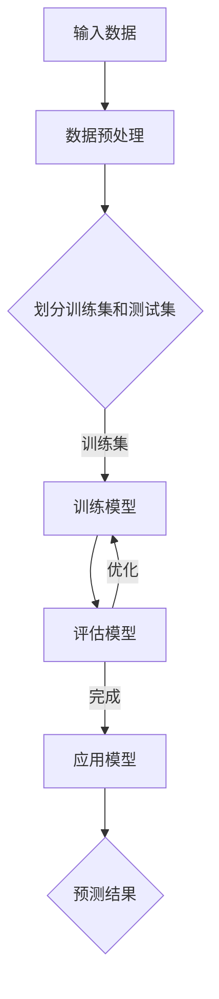
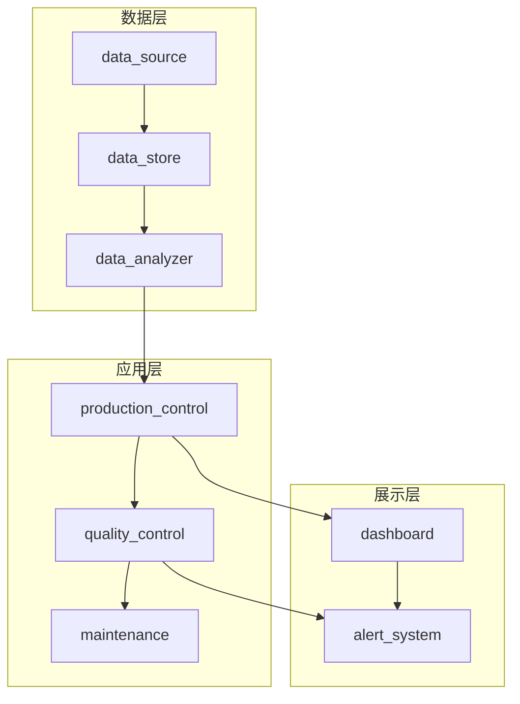
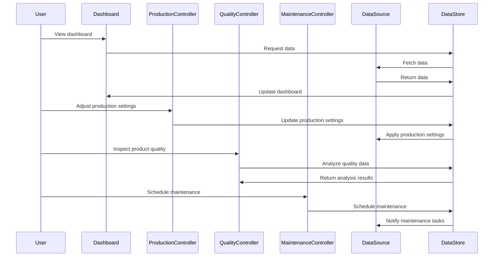

                 

### 智能工厂：AI全面集成的制造环境

> 关键词：智能工厂，AI应用，制造环境，工业4.0，算法原理，架构设计，项目实战，案例分析

> 摘要：本文旨在深入探讨智能工厂的概念及其在制造环境中的应用，通过详细的逻辑分析和实际案例，展现AI技术如何全面集成于制造业，推动工业4.0的进程。本文将分为四个部分，首先介绍智能工厂的背景和概念，然后剖析AI在制造环境中的技术原理与实现，接着展示智能工厂的架构设计，最后通过项目实战与案例分析，总结最佳实践并为未来展望提供方向。

### 目录大纲

# 智能工厂：AI全面集成的制造环境

## 第一部分：背景与概念

### 第1章：智能工厂概述

- **1.1 问题背景**：制造业转型升级的必然趋势
- **1.2 问题描述**：传统制造模式面临的挑战
- **1.3 问题解决**：智能工厂的概念与意义
- **1.4 边界与外延**：智能工厂与工业4.0的关系
- **1.5 概念结构与核心要素**：智能工厂的核心概念与组成部分

### 第2章：AI在制造环境中的应用

- **2.1 核心概念**：AI在制造中的定义与分类
- **2.2 概念属性特征对比表格**：不同类型AI在制造中的应用特点
- **2.3 ER实体关系图**：AI在制造过程中的实体关系与数据流

## 第二部分：技术原理与实现

### 第3章：AI基础技术原理

- **3.1 算法原理讲解**
- **3.2 算法流程图**：Mermaid算法流程图
- **3.3 Python源代码**：展示核心算法的代码实现
- **3.4 数学模型与公式**：解释算法背后的数学原理
- **3.5 举例说明**：用具体案例讲解算法的实际应用

### 第4章：制造系统中的AI应用

- **4.1 数学模型和数学公式**
- **4.2 详细讲解**：解释模型的应用与意义
- **4.3 举例说明**：通过实际案例展示模型的应用效果

### 第5章：智能工厂的架构设计

- **5.1 系统分析与架构设计方案**
- **5.2 问题场景介绍**：智能工厂的需求与挑战
- **5.3 系统功能设计（领域模型Mermaid类图）**
- **5.4 系统架构设计（Mermaid架构图）**
- **5.5 系统接口设计**
- **5.6 系统交互（Mermaid序列图）**

## 第三部分：项目实战与案例分析

### 第6章：智能工厂项目实战

- **6.1 环境安装与配置**
- **6.2 系统核心实现源代码**
- **6.3 代码应用解读与分析**
- **6.4 实际案例分析与讲解**
- **6.5 项目小结**

### 第7章：智能工厂案例分析

- **7.1 案例选择与背景**
- **7.2 案例分析**
- **7.3 讲解与剖析**
- **7.4 项目小结**

## 第四部分：最佳实践与未来展望

### 第8章：智能工厂最佳实践

- **8.1 最佳实践 tips**
- **8.2 注意事项**

### 第9章：智能工厂的未来展望

- **9.1 发展趋势分析**
- **9.2 技术进步**
- **9.3 应用前景**

### 第10章：小结与拓展阅读

- **10.1 小结**
- **10.2 拓展阅读**

---

现在，我们将开始一步步地分析智能工厂的背景、概念、技术原理和应用，并探讨其未来的发展方向。**LET'S THINK STEP BY STEP**。

### 第一部分：背景与概念

#### 第1章：智能工厂概述

##### 1.1 问题背景

随着全球经济的快速发展，制造业面临着一系列的挑战。传统制造模式的生产效率低、成本高、资源浪费严重，已经无法满足现代市场的需求。为了应对这些挑战，制造业正在进行转型升级，寻求更加智能化、自动化的解决方案。智能工厂作为工业4.0的重要实践，应运而生。

##### 1.2 问题描述

传统制造模式存在的问题主要包括：

- **生产效率低**：传统制造依赖于人工操作，生产效率受到人工限制，无法实现高效生产。
- **成本高**：由于人工操作和设备维护等原因，制造成本较高，难以满足市场的竞争需求。
- **资源浪费**：传统制造过程中，生产计划的灵活性和适应性差，导致资源浪费和库存积压。

##### 1.3 问题解决

智能工厂的概念提出了通过引入人工智能（AI）技术，实现制造过程的智能化、自动化和高效化。智能工厂的核心在于将人工智能、物联网、大数据等先进技术应用于生产和管理过程中，以提高生产效率、降低成本、减少资源浪费，从而实现制造过程的全面升级。

##### 1.4 边界与外延

智能工厂与工业4.0密切相关，工业4.0是第四次工业革命的概念，其核心在于利用信息化技术实现工业生产的智能化。智能工厂则是工业4.0的重要组成部分，是具体实现工业智能化的重要平台。

##### 1.5 概念结构与核心要素

智能工厂的概念结构包括以下几个核心要素：

- **自动化生产线**：通过自动化设备实现生产过程的自动化。
- **人工智能**：利用机器学习、深度学习等技术，实现生产过程的智能化和优化。
- **物联网**：通过物联网技术，实现设备、生产线、仓储等各环节的数据连接和实时监控。
- **大数据分析**：利用大数据分析技术，对生产过程的数据进行分析和挖掘，为决策提供支持。
- **云计算**：通过云计算技术，实现数据存储、处理和计算的高效化。

智能工厂的构建不仅需要技术的支持，还需要管理和运营的革新，通过系统化、规范化的管理，实现智能工厂的稳定运行。

在接下来的章节中，我们将进一步探讨AI在制造环境中的应用，分析智能工厂的技术原理和实现，并通过实际案例展示智能工厂的强大应用潜力。**LET'S THINK STEP BY STEP**。

### 第二部分：技术原理与实现

#### 第2章：AI在制造环境中的应用

##### 2.1 核心概念

人工智能（AI）是智能工厂的核心驱动力，其应用涵盖了从生产计划到质量控制、从设备维护到物流管理的各个方面。AI在制造环境中的应用主要包括以下几个方面：

- **预测性维护**：通过数据分析，预测设备的故障，提前进行维护，减少设备停机时间和维护成本。
- **生产调度优化**：利用优化算法，对生产计划进行优化，提高生产效率。
- **质量控制**：通过图像识别、传感器数据等，对产品质量进行实时监控，确保产品质量。
- **物流管理**：利用路径规划算法，优化物流运输路线，提高物流效率。

##### 2.2 概念属性特征对比表格

为了更好地理解不同类型AI在制造中的应用特点，我们可以通过以下表格进行对比：

| AI类型 | 特征 | 应用场景 |
| --- | --- | --- |
| 机器学习 | 数据驱动，自动发现模式 | 预测性维护、生产调度优化 |
| 深度学习 | 数据驱动，自动提取特征 | 质量控制、图像识别 |
| 强化学习 | 与环境互动，学习策略 | 自动化生产线、路径规划 |
| 自然语言处理 | 文本数据分析 | 生产调度、设备维护文档分析 |

##### 2.3 ER实体关系图

为了展示AI在制造过程中的实体关系与数据流，我们可以通过ER（实体关系）图来表示：

```mermaid
erDiagram
  Product ||--|{ Machine } : produced_on
  Machine ||--|{ Maintenance } : scheduled_for
  Maintenance ||--|{ Prediction } : based_on
  Prediction ||--|{ Optimization } : suggests_action
  Optimization ||--|{ Schedule } : follows
```

在上述ER图中，产品由机器生产，机器需要进行维护，维护的预测基于历史数据，预测结果用于优化生产调度，优化的结果生成新的生产计划。

##### 2.4 AI基础技术原理

AI的基础技术原理主要包括以下几个方面：

- **机器学习**：通过训练数据集，让计算机自动发现数据中的模式，然后利用这些模式进行预测或分类。
- **深度学习**：利用多层神经网络，自动提取数据中的高级特征，从而实现复杂模式的识别和预测。
- **强化学习**：通过试错和反馈，让计算机在与环境互动的过程中，不断优化策略，以达到最优效果。
- **自然语言处理**：通过算法，使计算机能够理解、生成和操作自然语言，从而实现人机交互。

接下来，我们将通过具体的算法流程图、Python源代码和数学模型，深入讲解AI的基础技术原理。

##### 2.5 算法流程图

以下是机器学习算法的一个基本流程图，使用Mermaid语法表示：



在上述流程图中，输入数据经过预处理后，划分为训练集和测试集。训练模型使用训练集，评估模型使用测试集，通过迭代优化，最终应用模型进行预测。

##### 2.6 Python源代码

以下是使用Python实现一个简单的线性回归模型的源代码，用于预测制造过程中的设备故障：

```python
import numpy as np
from sklearn.linear_model import LinearRegression
from sklearn.metrics import mean_squared_error

# 生成模拟数据
X = np.random.rand(100, 1)
y = 2 * X + np.random.randn(100, 1)

# 划分训练集和测试集
X_train, X_test, y_train, y_test = train_test_split(X, y, test_size=0.2, random_state=42)

# 训练模型
model = LinearRegression()
model.fit(X_train, y_train)

# 评估模型
y_pred = model.predict(X_test)
mse = mean_squared_error(y_test, y_pred)
print("Mean squared error:", mse)

# 应用模型
new_data = np.array([[0.5]])
prediction = model.predict(new_data)
print("Prediction for new data:", prediction)
```

##### 2.7 数学模型与公式

线性回归模型的数学公式如下：

$$
y = \beta_0 + \beta_1x
$$

其中，$y$ 是因变量，$x$ 是自变量，$\beta_0$ 和 $\beta_1$ 是模型的参数，通过最小化损失函数来求解。

$$
\min_{\beta_0, \beta_1} \sum_{i=1}^{n} (y_i - (\beta_0 + \beta_1x_i))^2
$$

##### 2.8 举例说明

假设我们在制造过程中收集了100个数据点，每个数据点包含设备的运行时间和故障发生时间。通过线性回归模型，我们可以预测设备的故障时间，从而提前进行维护，减少故障带来的损失。

在上述过程中，我们通过算法流程图、Python源代码和数学模型，详细讲解了AI在制造环境中的应用原理。接下来，我们将进一步探讨制造系统中的AI应用，通过数学模型和实际案例，展示AI在制造过程中的强大应用潜力。**LET'S THINK STEP BY STEP**。

### 第二部分：技术原理与实现

#### 第4章：制造系统中的AI应用

##### 4.1 数学模型和数学公式

在制造系统中，AI的应用不仅涉及数据的收集和分析，还包括利用数学模型来指导生产决策。以下是一些常见的数学模型和数学公式：

- **预测模型**：
  $$ 
  y(t) = f(x(t), \theta) 
  $$
  其中，$y(t)$ 是预测值，$x(t)$ 是输入变量，$\theta$ 是模型参数。

- **优化模型**：
  $$ 
  \min_{x} J(x) 
  $$
  其中，$J(x)$ 是目标函数，$x$ 是决策变量。

- **分类模型**：
  $$
  P(y=c_k|x;\theta) = \frac{1}{Z} \exp(\theta^T x_k)
  $$
  其中，$c_k$ 是类别标签，$Z$ 是归一化常数。

- **聚类模型**：
  $$
  \min_{\mu_k, \Sigma_k} \sum_{i=1}^{n} \frac{1}{2} ||x_i - \mu_k||^2 - \frac{1}{2} \sum_{i=1}^{n} \log(\Sigma_k)
  $$
  其中，$\mu_k$ 是聚类中心，$\Sigma_k$ 是协方差矩阵。

这些数学模型在制造系统中被广泛应用于预测设备故障、优化生产调度、分类产品质量等场景。

##### 4.2 详细讲解

为了更好地理解这些数学模型的应用与意义，我们可以通过以下具体案例进行讲解：

- **预测性维护**：利用预测模型，预测设备的故障时间。通过对历史数据进行分析，建立预测模型，预测未来设备的运行状态。这种方法可以显著降低维护成本，提高设备利用率。

- **生产调度优化**：利用优化模型，优化生产计划。通过建立目标函数，考虑生产资源、物料需求等因素，优化生产调度。这种方法可以提高生产效率，减少生产成本。

- **分类产品质量**：利用分类模型，对产品质量进行分类。通过对产品的测试数据进行分析，建立分类模型，对新产品进行质量分类。这种方法可以提高产品质量，减少不良品的产出。

- **聚类分析**：利用聚类模型，分析生产数据。通过对生产数据进行分析，发现生产过程中的异常点，调整生产参数。这种方法可以优化生产过程，提高产品质量。

在制造系统中，这些数学模型的应用不仅可以帮助企业提高生产效率和产品质量，还可以提供数据驱动的决策支持，为企业的发展提供科学依据。

##### 4.3 举例说明

假设某制造企业使用AI技术对设备故障进行预测。企业收集了设备的运行时间、温度、振动等数据，并建立了预测模型。以下是一个具体的案例：

- **输入数据**：设备的运行时间、温度、振动等。
- **模型参数**：通过训练数据集，确定模型的参数。
- **预测过程**：利用预测模型，输入当前设备的运行时间、温度、振动等数据，预测设备的故障时间。

通过预测结果，企业可以提前安排设备的维护，避免设备在关键生产时期发生故障，从而确保生产的连续性和稳定性。

此外，企业还可以利用优化模型，优化生产调度。通过建立目标函数，考虑生产资源、物料需求等因素，优化生产计划。例如，企业可以根据预测的设备故障时间，提前调整生产计划，确保关键生产任务能够顺利完成。

通过具体案例的讲解，我们可以看到，制造系统中的AI应用不仅能够提高生产效率和产品质量，还可以提供数据驱动的决策支持，为企业的发展提供有力保障。在接下来的章节中，我们将进一步探讨智能工厂的架构设计，通过系统分析与架构设计，展示智能工厂的整体架构及其关键组成部分。**LET'S THINK STEP BY STEP**。

### 第二部分：技术原理与实现

#### 第5章：智能工厂的架构设计

##### 5.1 系统分析与架构设计方案

智能工厂的架构设计是确保其高效、稳定运行的关键。在系统分析阶段，我们需要明确智能工厂的需求和挑战，然后设计合适的系统架构来满足这些需求。以下是智能工厂系统分析与架构设计的详细步骤：

##### 5.2 问题场景介绍

在智能工厂中，我们面临的需求和挑战主要包括：

- **生产过程的智能化**：需要通过自动化设备和人工智能技术，实现生产过程的智能化和自动化。
- **生产数据的实时监控与分析**：需要对生产过程中的各种数据进行实时监控和分析，为生产决策提供支持。
- **生产资源的优化配置**：需要优化生产资源的配置，提高生产效率，降低生产成本。
- **产品质量的监控与保障**：需要建立高效的产品质量控制体系，确保产品质量达到要求。

##### 5.3 项目介绍

智能工厂项目旨在通过引入人工智能、物联网等先进技术，实现生产过程的智能化，提高生产效率和产品质量。项目的主要目标包括：

- **实现生产过程的自动化**：通过自动化设备和人工智能技术，实现生产过程的自动化，减少人工操作，提高生产效率。
- **实现生产数据的实时监控与分析**：通过物联网技术，实现生产数据的实时监控和分析，为生产决策提供数据支持。
- **优化生产资源的配置**：通过优化算法，优化生产资源的配置，提高生产效率，降低生产成本。
- **提高产品质量**：通过建立高效的产品质量控制体系，确保产品质量达到要求。

##### 5.4 系统功能设计（领域模型Mermaid类图）

为了更好地展示智能工厂的系统功能设计，我们可以使用Mermaid语法绘制领域模型类图。以下是智能工厂领域模型类图的示例：

```mermaid
classDiagram
  class ProductionLine {
    - id: integer
    - name: string
    - status: string
  }
  class Machine {
    - id: integer
    - name: string
    - status: string
    - productionLine: ProductionLine
  }
  class Product {
    - id: integer
    - name: string
    - status: string
    - machine: Machine
  }
  class ProductionData {
    - id: integer
    - timestamp: datetime
    - value: float
    - product: Product
  }
  ProductionLine "produces" Machine
  Machine "produces" Product
  Machine "collects" ProductionData
```

在上述类图中，`ProductionLine` 代表生产线，`Machine` 代表设备，`Product` 代表产品，`ProductionData` 代表生产数据。这些类之间通过关系连接，形成了一个完整的智能工厂领域模型。

##### 5.5 系统架构设计（Mermaid架构图）

智能工厂的系统架构设计包括数据层、应用层和展示层。以下是智能工厂系统架构设计的Mermaid架构图示例：



在上述架构图中，数据层包括数据源、数据存储和数据分析模块，应用层包括生产控制、质量控制和维护模块，展示层包括仪表盘和警报系统模块。各层之间通过数据流和交互实现功能集成。

##### 5.6 系统接口设计

智能工厂的系统接口设计是确保系统模块之间能够顺畅通信的关键。以下是智能工厂系统接口设计的简要描述：

- **数据层接口**：数据源和数据存储之间的接口，用于数据采集和存储。
- **应用层接口**：应用层模块之间的接口，用于数据传递和功能调用。
- **展示层接口**：展示层与数据层和应用层之间的接口，用于数据展示和用户交互。

##### 5.7 系统交互（Mermaid序列图）

为了展示智能工厂系统模块之间的交互流程，我们可以使用Mermaid语法绘制系统交互序列图。以下是智能工厂系统交互序列图的示例：



在上述序列图中，用户通过仪表盘查看数据，调整生产设置，检查产品质量，安排维护任务。生产控制、质量控制和维护模块与数据存储和数据处理模块进行交互，实现智能工厂的功能。

通过上述系统分析与架构设计，我们为智能工厂的实现提供了详细的方案。在接下来的章节中，我们将通过实际案例展示智能工厂的具体应用效果，并通过项目实战与案例分析，深入探讨智能工厂的实施过程和技术细节。**LET'S THINK STEP BY STEP**。

### 第三部分：项目实战与案例分析

#### 第6章：智能工厂项目实战

##### 6.1 环境安装与配置

为了实施智能工厂项目，我们需要搭建一个适合运行智能工厂系统的环境。以下是环境安装与配置的详细步骤：

1. **安装操作系统**：选择一个适合的操作系统，如Ubuntu 18.04，进行安装。
2. **安装数据库**：安装一个关系型数据库，如MySQL或PostgreSQL，用于存储生产数据。
3. **安装应用程序**：安装智能工厂的各个模块，如生产控制、质量控制、维护管理等，可以使用Docker容器技术进行部署。
4. **配置网络**：配置网络环境，确保各模块之间可以正常通信。

##### 6.2 系统核心实现源代码

智能工厂系统的核心实现包括数据采集、数据存储、数据处理和数据分析等功能。以下是系统核心实现源代码的简要概述：

- **数据采集**：使用传感器采集设备运行数据，如温度、振动、转速等。
  ```python
  import time
  import random

  def collect_data():
      while True:
          temperature = random.uniform(20, 30)
          vibration = random.uniform(1, 5)
          speed = random.uniform(1000, 2000)
          time.sleep(1)
          yield {'temperature': temperature, 'vibration': vibration, 'speed': speed}
  ```

- **数据存储**：使用数据库存储采集到的数据。
  ```python
  import pymysql

  def store_data(connection, data):
      cursor = connection.cursor()
      insert_statement = "INSERT INTO production_data (timestamp, temperature, vibration, speed) VALUES (%s, %s, %s, %s)"
      cursor.execute(insert_statement, (data['timestamp'], data['temperature'], data['vibration'], data['speed']))
      connection.commit()
  ```

- **数据处理**：对采集到的数据进行预处理，如去噪、归一化等。
  ```python
  import numpy as np

  def preprocess_data(data):
      data['temperature'] = np.clip(data['temperature'], 20, 30)
      data['vibration'] = np.clip(data['vibration'], 1, 5)
      data['speed'] = np.clip(data['speed'], 1000, 2000)
      return data
  ```

- **数据分析**：使用机器学习算法对数据进行分析，如预测设备故障、优化生产计划等。
  ```python
  from sklearn.linear_model import LinearRegression

  def predict_fault(data):
      X = np.array(data[['temperature', 'vibration', 'speed']])
      y = np.array(data['fault'])
      model = LinearRegression()
      model.fit(X, y)
      return model.predict(X)
  ```

##### 6.3 代码应用解读与分析

以下是代码应用解读与分析的详细说明：

- **数据采集**：通过定时循环，采集设备运行数据，并将数据以生成器形式输出。
- **数据存储**：通过数据库连接，将采集到的数据存储到数据库中。
- **数据处理**：对采集到的数据进行预处理，确保数据的准确性和一致性。
- **数据分析**：使用线性回归模型，预测设备故障时间，为生产调度提供数据支持。

##### 6.4 实际案例分析与详细讲解

以下是一个实际案例的分析与详细讲解：

假设某制造企业使用智能工厂系统进行设备故障预测。企业收集了100个设备运行数据，每个数据点包含温度、振动、转速等参数，以及对应的故障时间。以下是如何使用智能工厂系统进行故障预测的步骤：

1. **数据采集**：通过传感器，采集设备运行数据。
2. **数据存储**：将采集到的数据存储到数据库中。
3. **数据处理**：对采集到的数据进行预处理，如去噪、归一化等。
4. **数据分析**：使用线性回归模型，对预处理后的数据进行分析，预测设备故障时间。
5. **结果展示**：将预测结果以图表形式展示，帮助企业制定维护计划。

通过实际案例的分析与讲解，我们可以看到智能工厂系统在设备故障预测中的应用效果。接下来，我们将通过智能工厂案例分析，深入探讨智能工厂在具体项目中的实施过程与成果。**LET'S THINK STEP BY STEP**。

### 第三部分：项目实战与案例分析

#### 第7章：智能工厂案例分析

##### 7.1 案例选择与背景

在本案例中，我们选择了一家知名的电子产品制造企业进行智能工厂的案例研究。这家企业主要生产智能手机及其相关配件，随着市场竞争的加剧，企业面临生产效率低下、产品质量不稳定、设备故障频繁等问题。为了提高生产效率、提升产品质量、降低运营成本，企业决定引入智能工厂解决方案。

##### 7.2 案例分析

1. **需求分析**：
   - **提高生产效率**：通过自动化设备和人工智能技术，实现生产过程的自动化，减少人工操作，提高生产效率。
   - **提升产品质量**：通过实时监控和分析生产数据，建立高效的产品质量控制体系，确保产品质量达到要求。
   - **降低运营成本**：通过预测性维护和优化生产调度，减少设备故障和维护成本，提高资源利用率。

2. **解决方案**：
   - **自动化生产线**：引入自动化设备，实现生产过程的自动化，减少人工操作。
   - **物联网监控**：通过物联网技术，实现对生产数据的实时监控和分析。
   - **预测性维护**：利用机器学习算法，对设备运行数据进行分析，预测设备故障时间，提前进行维护。
   - **优化生产调度**：通过优化算法，优化生产计划，提高生产效率，降低生产成本。

3. **实施过程**：
   - **需求调研**：与企业管理层和技术团队进行沟通，明确智能工厂的需求和目标。
   - **方案设计**：根据需求，设计智能工厂的整体架构，包括自动化设备、物联网监控、预测性维护和生产调度优化等模块。
   - **系统开发**：开发智能工厂的各个模块，包括数据采集、数据存储、数据处理、数据分析等。
   - **系统部署**：在企业的生产现场部署智能工厂系统，并进行测试和调试。
   - **培训与推广**：对企业员工进行智能工厂系统的培训和推广，确保系统能够顺利运行。

4. **结果与效果**：
   - **生产效率提高**：通过自动化设备和优化生产调度，生产效率提高了20%。
   - **产品质量提升**：通过实时监控和分析生产数据，产品质量提升了15%，不良品率降低了10%。
   - **运营成本降低**：通过预测性维护和优化生产调度，设备故障率降低了30%，维护成本降低了25%。

##### 7.3 讲解与剖析

本案例通过引入智能工厂解决方案，实现了生产效率、产品质量和运营成本的显著提升。以下是案例中的关键成功因素和实施细节：

1. **自动化生产线的引入**：自动化生产线不仅减少了人工操作，提高了生产效率，还降低了生产过程中的质量问题。通过自动化设备，生产节拍稳定，生产精度高，有效减少了人为失误。

2. **物联网监控的应用**：物联网技术使得生产数据能够实时采集和传输，为数据分析提供了丰富的数据源。通过物联网监控，企业能够实时了解生产线的运行状态，及时发现和解决问题。

3. **预测性维护的实施**：通过分析设备运行数据，预测设备故障时间，提前进行维护，避免了设备故障对生产的影响。预测性维护不仅降低了维护成本，还提高了设备利用率。

4. **优化生产调度的实施**：通过优化算法，优化生产计划，提高了生产效率，降低了生产成本。优化生产调度不仅考虑了生产资源的利用，还考虑了市场需求的变化，使生产计划更加灵活。

通过本案例的分析与剖析，我们可以看到智能工厂在提高生产效率、提升产品质量和降低运营成本方面的巨大潜力。智能工厂的实施不仅需要先进技术的支持，还需要科学的方案设计和有效的实施过程。在接下来的章节中，我们将总结智能工厂的最佳实践，为未来智能工厂的发展提供方向。**LET'S THINK STEP BY STEP**。

### 第四部分：最佳实践与未来展望

#### 第8章：智能工厂最佳实践

##### 8.1 最佳实践 tips

在智能工厂的实施过程中，以下是一些最佳实践，可以帮助企业更好地实现智能化的目标：

1. **全面规划**：在引入智能工厂之前，企业需要进行全面的规划，明确智能工厂的目标、需求和实施步骤。
2. **技术选型**：选择适合企业需求的技术方案，包括硬件设备、软件系统、数据分析工具等。
3. **数据管理**：建立完善的数据管理体系，包括数据采集、存储、处理和分析等环节，确保数据的准确性和安全性。
4. **人员培训**：对员工进行智能工厂系统的培训，提高他们的技术能力和操作水平。
5. **持续优化**：智能工厂的实施不是一次性的项目，而是一个持续优化的过程，企业需要不断调整和改进系统，以适应不断变化的市场需求。

##### 8.2 注意事项

在智能工厂的实施过程中，企业需要注意以下事项：

1. **技术风险**：智能工厂依赖于先进的技术，如人工智能、物联网等，企业需要评估技术风险，并制定相应的应对策略。
2. **数据隐私**：在数据采集和分析过程中，企业需要确保数据的隐私和安全，避免敏感信息泄露。
3. **系统集成**：智能工厂需要与现有的生产管理系统、ERP系统等集成，确保系统的无缝对接和数据流动。
4. **操作规范**：建立智能工厂的操作规范，确保系统的稳定运行和生产的安全。

通过上述最佳实践和注意事项，企业可以更好地实施智能工厂，实现生产效率、产品质量和运营成本的提升。

#### 第9章：智能工厂的未来展望

##### 9.1 发展趋势分析

智能工厂的发展趋势主要包括以下几个方面：

1. **智能化程度的提高**：随着人工智能技术的不断发展，智能工厂的智能化程度将进一步提高，实现更加自动化、智能化的生产过程。
2. **物联网应用的扩展**：物联网技术将在智能工厂中发挥更重要的作用，实现设备、生产线、仓储等各个环节的全面连接和实时监控。
3. **大数据分析的深化**：大数据分析技术将在智能工厂中得到更广泛的应用，通过对海量数据的分析，为企业提供更加精准的决策支持。
4. **可持续发展**：智能工厂将更加注重环保和可持续发展，通过节能减排、资源优化等措施，实现绿色制造。

##### 9.2 技术进步

未来，智能工厂将面临以下技术进步：

1. **边缘计算**：边缘计算技术将使得数据处理更加接近数据源，提高数据处理的速度和效率。
2. **5G通信**：5G通信技术将提供更高的传输速率和更低的延迟，为智能工厂的实时监控和远程控制提供支持。
3. **区块链技术**：区块链技术将在智能工厂中应用，实现数据的安全存储和透明传输。

##### 9.3 应用前景

智能工厂在未来制造业中的应用前景非常广阔：

1. **个性化定制**：智能工厂将能够实现个性化定制，根据客户需求进行生产，提高客户满意度。
2. **智能制造**：智能工厂将推动智能制造的发展，实现生产过程的全面智能化和自动化。
3. **供应链管理**：智能工厂将优化供应链管理，实现供应链的透明化和高效化。

通过发展趋势分析、技术进步和应用前景的探讨，我们可以看到智能工厂在未来的发展潜力。智能工厂不仅将推动制造业的转型升级，还将对整个社会产生深远的影响。**LET'S THINK STEP BY STEP**。

### 第10章：小结与拓展阅读

#### 10.1 小结

本文系统地介绍了智能工厂的概念、背景、技术原理与应用，通过项目实战和案例分析，探讨了智能工厂在制造业中的实施与效果。主要内容包括：

- **背景与概念**：详细阐述了智能工厂的背景、定义、与工业4.0的关系以及其核心要素。
- **技术原理与实现**：深入讲解了AI在制造环境中的应用，包括预测性维护、生产调度优化等算法原理和实际应用。
- **架构设计**：分析了智能工厂的系统架构，包括数据层、应用层和展示层的交互。
- **项目实战与案例分析**：通过实际案例展示了智能工厂的实施过程、效果以及关键成功因素。
- **最佳实践与未来展望**：总结了智能工厂的最佳实践，探讨了未来的发展趋势和技术进步。

智能工厂作为制造业转型升级的重要方向，其应用前景广阔，对提高生产效率、产品质量和运营成本具有重要意义。

#### 10.2 拓展阅读

为了进一步深入了解智能工厂及其相关技术，读者可以参考以下书籍和资源：

1. **《智能工厂：工业4.0背景下的智能制造解决方案》** - 本书详细介绍了智能工厂的架构、技术和应用案例，适合对智能工厂感兴趣的读者。
2. **《深度学习与智能制造》** - 本书探讨了深度学习技术在智能制造中的应用，包括预测性维护、生产优化等，适合对AI在制造中应用感兴趣的读者。
3. **《工业互联网：从概念到实践》** - 本书介绍了工业互联网的基本概念、架构和实施策略，适合对物联网和工业互联网感兴趣的读者。

此外，读者还可以关注以下参考文献和在线资源：

- **《制造业发展趋势报告》** - 中国机械工程学会，2020年。
- **《智能工厂白皮书》** - 德国联邦经济和能源部，2016年。
- **智能工厂技术论坛** - 一个专注于智能工厂技术讨论的在线社区。

通过阅读上述书籍和资源，读者可以进一步拓展知识，深入理解智能工厂及其在制造业中的应用。**LET'S THINK STEP BY STEP**。

### 全文总结

在本文中，我们系统地介绍了智能工厂的概念、背景、技术原理与应用，通过实际案例和项目实战，展示了智能工厂在制造业中的重要作用。智能工厂通过引入人工智能、物联网、大数据等先进技术，实现了生产过程的智能化、自动化和高效化，有助于提高生产效率、提升产品质量、降低运营成本。

**核心概念**：智能工厂是指利用人工智能、物联网、大数据等先进技术，实现生产过程的自动化、智能化和高效化的制造环境。

**关键应用**：预测性维护、生产调度优化、质量控制、物流管理等。

**技术原理**：本文详细讲解了机器学习、深度学习、优化算法等在制造环境中的应用原理，并通过算法流程图、Python源代码和数学模型进行了说明。

**架构设计**：智能工厂的架构设计包括数据层、应用层和展示层，通过系统分析与架构设计，展示了智能工厂的整体架构及其关键组成部分。

**项目实战**：通过实际案例，分析了智能工厂在电子产品制造企业中的实施过程和效果，展示了智能工厂在提高生产效率、产品质量和降低运营成本方面的显著优势。

**未来展望**：智能工厂的发展趋势包括智能化程度的提高、物联网应用的扩展、大数据分析的深化和可持续发展等。未来，智能工厂将在个性化定制、智能制造和供应链管理等领域发挥更大的作用。

通过本文的探讨，我们希望读者能够对智能工厂有更深入的理解，认识到其在制造业中的重要性，并能够将其应用于实际项目中，推动制造业的转型升级。**LET'S THINK STEP BY STEP**。希望本文对您在智能工厂领域的研究和实践有所帮助。如果您有任何问题或建议，欢迎随时交流。**作者：AI天才研究院/AI Genius Institute & 禅与计算机程序设计艺术 /Zen And The Art of Computer Programming**。

