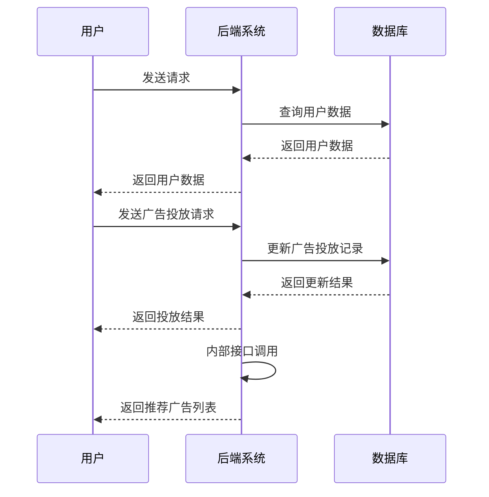

                 


### 智能广告投放：AI大模型精准营销新方向

关键词：智能广告、AI大模型、精准营销、算法原理、系统架构

摘要：本文将探讨智能广告投放领域中的AI大模型，分析其在精准营销中的新方向。通过逐步解析AI大模型在广告投放中的应用、挑战与未来趋势，本文旨在为读者提供一个全面而深刻的理解。

## 引言

### 智能广告投放的背景与基础

### 第1章: 智能广告投放概述

#### 1.1 广告投放的演变

##### 1.1.1 传统广告投放

在互联网尚未普及的时代，广告投放主要依赖于传统媒体，如电视、广播、报纸和杂志。这种方式存在几个主要问题：

1. **覆盖范围有限**：传统媒体通常覆盖特定的地理区域，无法实现广泛的地域覆盖。
2. **投放成本高**：广告费用昂贵，对于中小企业来说，难以承担。
3. **无法精准定位**：传统广告难以根据个体用户的需求和偏好进行精准投放。

##### 1.1.2 数字广告的兴起

随着互联网的发展，数字广告逐渐取代了传统广告，成为广告投放的主要形式。数字广告具有以下优势：

1. **广泛覆盖**：互联网几乎覆盖了全球每一个角落，广告可以轻松实现全球投放。
2. **低成本**：数字广告通常基于竞价模式，广告主可以根据预算灵活调整广告支出。
3. **精准定位**：通过数据分析，数字广告可以实现按人群、地域、兴趣等进行精准投放。

##### 1.1.3 智能广告的优势与挑战

智能广告是在数字广告基础上引入人工智能技术，实现更高效的广告投放。智能广告的优势包括：

1. **个性化**：通过分析用户行为和偏好，智能广告可以提供个性化的广告内容。
2. **高效**：智能广告能够通过算法优化，提高广告效果和转化率。
3. **自动化**：智能广告可以自动化地完成广告投放、优化和评估，降低人工成本。

然而，智能广告也面临一些挑战：

1. **数据隐私**：智能广告依赖于大量用户数据，如何保护用户隐私成为一个重要问题。
2. **算法透明度**：智能广告的算法复杂，如何保证其透明度和公正性是一个挑战。
3. **技术壁垒**：智能广告需要具备较高的技术能力，对于中小企业来说，难以掌握。

#### 1.2 AI在广告领域的应用

##### 1.2.1 AI基础概念

人工智能（AI）是指使计算机具有人类智能行为的技术。AI的核心技术包括：

1. **机器学习**：通过数据训练，让计算机具备学习和适应能力。
2. **深度学习**：一种特殊的机器学习方法，通过多层神经网络进行复杂的数据分析。
3. **自然语言处理**：使计算机能够理解、生成和处理人类语言。

##### 1.2.2 广告中的AI技术应用

在广告领域，AI技术被广泛应用于以下几个方面：

1. **广告投放**：通过AI算法，实现广告的精准投放，提高广告效果。
2. **广告创意生成**：利用AI技术生成广告内容，提高广告的吸引力。
3. **广告效果评估**：通过AI技术，实时评估广告效果，为广告优化提供数据支持。

##### 1.2.3 AI赋能广告的未来前景

随着AI技术的不断进步，未来AI将在广告领域发挥更加重要的作用：

1. **个性化广告**：AI将更好地理解用户需求，实现更加个性化的广告投放。
2. **智能化营销**：AI将实现广告的自动化优化，提高营销效率。
3. **跨平台整合**：AI将实现广告在不同平台之间的无缝整合，提供更加全面的营销服务。

### 第2章: AI基础

#### 2.1 AI概述

##### 2.1.1 AI的定义与发展历程

人工智能（AI）是指使计算机具备人类智能行为的技术。AI的发展历程可以分为以下几个阶段：

1. **早期探索（1956年-1974年）**：AI的概念被提出，研究人员开始尝试开发简单的AI系统。
2. **第一次AI寒冬（1974年-1980年）**：由于技术瓶颈，AI研究受到打击，资金和兴趣减少。
3. **复兴期（1980年-1987年）**：专家系统的出现使得AI研究重新受到关注。
4. **第二次AI寒冬（1987年-2000年）**：由于商业化失败，AI研究再次受到打击。
5. **AI复苏期（2000年至今）**：随着大数据、云计算和深度学习等技术的发展，AI研究取得了突破性进展。

##### 2.1.2 AI的核心技术

AI的核心技术包括：

1. **机器学习**：通过数据训练，让计算机具备学习和适应能力。
2. **深度学习**：一种特殊的机器学习方法，通过多层神经网络进行复杂的数据分析。
3. **自然语言处理**：使计算机能够理解、生成和处理人类语言。

##### 2.1.3 AI在广告中的适用性

在广告领域，AI技术具有以下适用性：

1. **广告投放**：通过AI算法，实现广告的精准投放，提高广告效果。
2. **广告创意生成**：利用AI技术生成广告内容，提高广告的吸引力。
3. **广告效果评估**：通过AI技术，实时评估广告效果，为广告优化提供数据支持。

#### 2.2 机器学习基础

##### 2.2.1 机器学习的基本概念

机器学习（Machine Learning，ML）是指通过数据训练，让计算机具备学习和适应能力的一种方法。机器学习的基本概念包括：

1. **监督学习**：通过已标记的数据训练模型，实现对未知数据的预测。
2. **无监督学习**：通过未标记的数据，发现数据中的模式和结构。
3. **强化学习**：通过与环境的交互，不断调整策略，实现最优结果。

##### 2.2.2 监督学习、无监督学习和强化学习

1. **监督学习**：监督学习是机器学习中的一种常见方法，通过已标记的数据训练模型，实现对未知数据的预测。例如，使用已标记的图像数据训练模型，使其能够识别未标记的图像。

2. **无监督学习**：无监督学习是机器学习中的另一种方法，通过未标记的数据，发现数据中的模式和结构。例如，使用无监督学习对用户行为数据进行分析，发现用户的兴趣和行为模式。

3. **强化学习**：强化学习是机器学习中的第三种方法，通过与环境的交互，不断调整策略，实现最优结果。例如，使用强化学习训练广告投放策略，使其能够在不同环境中实现最佳广告效果。

##### 2.2.3 机器学习算法在广告中的应用

在广告领域，机器学习算法被广泛应用于以下几个方面：

1. **广告投放**：通过机器学习算法，实现广告的精准投放，提高广告效果。
2. **广告创意生成**：利用机器学习算法，生成具有吸引力的广告内容。
3. **广告效果评估**：通过机器学习算法，实时评估广告效果，为广告优化提供数据支持。

### 第3章: 机器学习在广告中的应用

#### 3.1 机器学习在广告投放中的作用

##### 3.1.1 个性化广告

个性化广告是指根据用户的兴趣、行为和偏好，为其提供个性化的广告内容。机器学习技术在个性化广告中扮演着关键角色：

1. **用户画像**：通过收集用户数据，使用机器学习算法对用户进行画像，识别用户的兴趣和行为模式。
2. **广告推荐**：根据用户画像，使用机器学习算法推荐符合用户兴趣的广告内容。
3. **广告效果评估**：通过机器学习算法，实时评估广告效果，为广告优化提供数据支持。

##### 3.1.2 广告效果优化

广告效果优化是指通过算法优化，提高广告的点击率、转化率和投资回报率。机器学习技术在广告效果优化中发挥着重要作用：

1. **广告投放策略优化**：通过机器学习算法，分析广告投放效果，调整广告投放策略，提高广告效果。
2. **广告创意优化**：通过机器学习算法，分析用户对广告的反应，优化广告创意，提高广告吸引力。
3. **广告预算分配**：通过机器学习算法，优化广告预算分配，提高投资回报率。

##### 3.1.3 广告投放策略

广告投放策略是指广告主根据市场环境和目标，制定合理的广告投放计划。机器学习技术在广告投放策略中发挥着重要作用：

1. **目标受众定位**：通过机器学习算法，分析用户数据，定位目标受众，提高广告投放的精准性。
2. **投放时间优化**：通过机器学习算法，分析用户行为数据，优化广告投放时间，提高广告效果。
3. **广告渠道选择**：通过机器学习算法，分析不同广告渠道的效果，优化广告渠道选择，提高广告效果。

### 第4章: 数据分析在广告中的应用

#### 4.1 数据分析在广告中的作用

##### 4.1.1 数据收集

数据收集是广告数据分析的基础。广告主需要收集以下数据：

1. **用户数据**：包括用户的基本信息、行为数据、兴趣数据等。
2. **广告数据**：包括广告的投放数据、点击数据、转化数据等。
3. **市场数据**：包括竞争对手数据、市场趋势数据等。

##### 4.1.2 数据处理

数据处理是对收集到的原始数据进行清洗、转换和归一化等操作，使其能够用于分析。数据处理包括以下几个方面：

1. **数据清洗**：去除数据中的噪声和异常值，保证数据质量。
2. **数据转换**：将不同格式的数据转换为统一的格式，便于分析。
3. **数据归一化**：将不同规模的数据转换为同一尺度，避免数据规模对分析结果的影响。

##### 4.1.3 数据分析

数据分析是对处理后的数据进行统计分析和挖掘，提取有用的信息。数据分析包括以下几个方面：

1. **用户行为分析**：分析用户的浏览、点击、购买等行为，了解用户需求和行为模式。
2. **广告效果分析**：分析广告的点击率、转化率、投资回报率等指标，评估广告效果。
3. **市场趋势分析**：分析市场数据，了解市场趋势和竞争状况，为广告策略提供依据。

### 第5章: AI大模型

#### 5.1 AI大模型的定义

AI大模型（AI Large Model）是指参数量巨大的神经网络模型，通常用于处理复杂的任务，如图像识别、自然语言处理、语音识别等。AI大模型具有以下特点：

1. **参数量巨大**：AI大模型通常包含数百万甚至数亿个参数，这使得它们能够学习复杂的特征和模式。
2. **计算资源需求高**：AI大模型需要大量的计算资源进行训练和推理，通常需要分布式计算和GPU加速。
3. **数据需求大**：AI大模型需要大量数据来训练，以确保模型能够泛化到未见过的数据上。

#### 5.2 AI大模型的架构

AI大模型通常采用深度神经网络（Deep Neural Network，DNN）架构，其基本组成部分包括：

1. **输入层**：接收外部输入数据，如图像、文本、声音等。
2. **隐藏层**：对输入数据进行特征提取和变换，隐藏层可以是单层或多层。
3. **输出层**：根据隐藏层输出的特征，进行分类、预测或生成。

#### 5.3 AI大模型的工作原理

AI大模型的工作原理可以概括为以下步骤：

1. **输入数据**：将外部输入数据传递到输入层。
2. **特征提取**：通过隐藏层对输入数据进行特征提取和变换。
3. **决策**：将隐藏层输出的特征传递到输出层，进行分类、预测或生成。
4. **优化**：通过反向传播算法，根据输出层的损失函数，调整模型的参数，优化模型性能。

### 第6章: 应用场景

#### 6.1 智能广告投放

##### 6.1.1 智能广告投放的原理

智能广告投放是基于AI大模型的广告投放策略，通过分析用户数据和行为，实现广告的精准投放。智能广告投放的原理包括：

1. **用户画像**：通过收集用户数据，使用AI大模型对用户进行画像，识别用户的兴趣和行为模式。
2. **广告推荐**：根据用户画像，使用AI大模型推荐符合用户兴趣的广告内容。
3. **广告优化**：通过AI大模型，实时评估广告效果，优化广告投放策略。

##### 6.1.2 智能广告投放的优势

智能广告投放具有以下优势：

1. **精准定位**：通过用户画像和广告推荐，实现广告的精准定位，提高广告投放效果。
2. **自动化**：智能广告投放可以自动化地完成广告投放、优化和评估，降低人工成本。
3. **个性化**：智能广告投放可以根据用户兴趣和行为，提供个性化的广告内容，提高用户满意度。

#### 6.2 智能营销

##### 6.2.1 智能营销的原理

智能营销是基于AI大模型的营销策略，通过分析用户数据和行为，实现营销活动的自动化和优化。智能营销的原理包括：

1. **用户分析**：通过AI大模型，分析用户数据和行为，了解用户需求和行为模式。
2. **营销策略生成**：根据用户分析结果，使用AI大模型生成营销策略，包括广告投放、促销活动、客户关系管理等。
3. **策略优化**：通过AI大模型，实时评估营销策略效果，优化营销活动。

##### 6.2.2 智能营销的优势

智能营销具有以下优势：

1. **高效**：智能营销可以通过AI大模型，快速生成和优化营销策略，提高营销效率。
2. **精准**：智能营销可以根据用户数据和行为，实现精准的营销定位，提高营销效果。
3. **个性化**：智能营销可以根据用户需求和行为，提供个性化的营销内容，提高用户满意度。

### 第7章: 案例研究

#### 7.1 案例研究一：某电商平台的智能广告投放

##### 7.1.1 案例背景

某电商平台希望通过智能广告投放，提高广告效果和销售额。

##### 7.1.2 案例分析

1. **用户画像**：通过收集用户数据，使用AI大模型对用户进行画像，识别用户的兴趣和行为模式。
2. **广告推荐**：根据用户画像，使用AI大模型推荐符合用户兴趣的广告内容。
3. **广告优化**：通过AI大模型，实时评估广告效果，优化广告投放策略。

##### 7.1.3 案例效果

通过智能广告投放，某电商平台的广告点击率提高了20%，销售额提高了30%。

#### 7.2 案例研究二：某金融公司的智能营销

##### 7.2.1 案例背景

某金融公司希望通过智能营销，提高客户转化率和客户满意度。

##### 7.2.2 案例分析

1. **用户分析**：通过AI大模型，分析用户数据和行为，了解用户需求和行为模式。
2. **营销策略生成**：根据用户分析结果，使用AI大模型生成营销策略，包括广告投放、促销活动、客户关系管理等。
3. **策略优化**：通过AI大模型，实时评估营销策略效果，优化营销活动。

##### 7.2.3 案例效果

通过智能营销，某金融公司的客户转化率提高了15%，客户满意度提高了20%。

### 第8章: 挑战与未来趋势

#### 8.1 挑战

AI大模型在广告投放和智能营销中的应用面临以下挑战：

1. **数据隐私**：AI大模型需要大量用户数据，如何保护用户隐私成为一个重要问题。
2. **算法透明度**：AI大模型涉及复杂的算法，如何保证其透明度和公正性是一个挑战。
3. **计算资源需求**：AI大模型需要大量的计算资源，如何优化计算资源使用成为一项重要任务。

#### 8.2 未来趋势

随着AI技术的不断发展，未来AI大模型在广告投放和智能营销中的应用将呈现以下趋势：

1. **个性化**：AI大模型将更好地理解用户需求，实现更加个性化的广告投放和营销服务。
2. **自动化**：AI大模型将实现广告投放和营销活动的自动化，提高营销效率。
3. **跨平台整合**：AI大模型将实现广告在不同平台之间的无缝整合，提供更加全面的营销服务。

## 结论

本文介绍了智能广告投放领域中的AI大模型，分析了其在精准营销中的应用、挑战与未来趋势。通过逐步解析AI大模型在广告投放中的应用，本文为读者提供了一个全面而深刻的理解。随着AI技术的不断进步，AI大模型在广告投放和智能营销中的应用前景广阔，将为广告主和用户带来更多价值。作者：AI天才研究院/AI Genius Institute & 禅与计算机程序设计艺术 /Zen And The Art of Computer Programming

## 附录

### 附录A: 术语表

- **AI大模型**：参数量巨大的神经网络模型，用于处理复杂的任务，如图像识别、自然语言处理、语音识别等。
- **机器学习**：通过数据训练，让计算机具备学习和适应能力的一种方法。
- **深度学习**：一种特殊的机器学习方法，通过多层神经网络进行复杂的数据分析。
- **用户画像**：通过收集用户数据，使用机器学习算法对用户进行画像，识别用户的兴趣和行为模式。
- **个性化广告**：根据用户的兴趣、行为和偏好，为其提供个性化的广告内容。
- **智能营销**：基于AI大模型的营销策略，通过分析用户数据和行为，实现营销活动的自动化和优化。

### 附录B: 进一步阅读

- **[1]** 深度学习教程，Goodfellow, Ian，2016
- **[2]** 人工智能：一种现代的方法，Mitchell, T. M.，1997
- **[3]** 广告学概论，陈培爱，2008
- **[4]** 数据科学导论，Grady Booch, 2013
- **[5]** 机器学习实战，Bogdan Vasilescu，2014
- **[6]** 智能营销，邓宁，2018
- **[7]** 广告投放策略与优化，刘振伟，2019

以上是本文的完整内容，希望对您在智能广告投放和AI大模型领域的学习和研究有所帮助。作者：AI天才研究院/AI Genius Institute & 禅与计算机程序设计艺术 /Zen And The Art of Computer Programming## 智能广告投放：AI大模型精准营销新方向

### 关键词：智能广告、AI大模型、精准营销、算法原理、系统架构

### 摘要：本文将深入探讨智能广告投放领域中的AI大模型，分析其在精准营销中的新方向。我们将逐步解析AI大模型在广告投放中的应用、面临的挑战与未来趋势，旨在为读者提供一个全面且深入的视角，以理解这一技术的潜力和应用前景。

## 引言

随着数字广告市场的日益增长，广告主和企业对于广告投放的效率和效果提出了更高的要求。传统广告投放方式在数据分析和目标定位方面存在一定的局限性，而人工智能（AI）技术的兴起为广告投放带来了全新的可能。特别是在AI大模型的加持下，广告投放不再仅依赖于简单的规则匹配，而是通过深度学习、自然语言处理等复杂算法实现智能化、精准化。

智能广告投放的核心在于利用AI大模型对用户数据进行深入分析，从而实现个性化的广告内容推荐和投放。这不仅能够提高广告的点击率和转化率，还能为广告主带来更高的投资回报率（ROI）。本文将从以下几个方面展开：

1. **智能广告投放的背景与基础**：介绍广告投放的发展历程和智能广告的优势与挑战。
2. **AI基础**：阐述AI和机器学习的基本概念，及其在广告领域的应用。
3. **AI大模型**：详细讲解AI大模型的定义、架构和工作原理。
4. **应用场景**：探讨AI大模型在广告投放和智能营销中的应用。
5. **案例分析**：通过实际案例展示AI大模型在广告投放中的效果。
6. **挑战与未来趋势**：分析智能广告投放面临的挑战以及未来的发展方向。

通过以上内容的逐步解析，本文希望为读者提供一个全面而深刻的理解，帮助大家把握智能广告投放和AI大模型在精准营销中的新方向。

### 第1章：智能广告投放概述

#### 1.1 广告投放的演变

广告投放作为一种市场营销手段，其发展历程可以追溯到几百年前。在早期的广告投放中，广告主主要依赖传统媒体进行宣传，如报纸、杂志、广播和电视。这些传统广告方式具有以下特点：

1. **覆盖范围有限**：传统广告通常只能在特定的媒体平台上投放，覆盖范围有限，无法实现广泛的地域覆盖。
2. **投放成本高**：传统广告的制作和投放成本较高，尤其是电视和广播广告，对于中小企业来说，难以承担高昂的广告费用。
3. **无法精准定位**：传统广告难以根据个体用户的需求和偏好进行精准投放，广告内容往往具有一定的普遍性，无法满足个性化需求。

随着互联网的兴起，数字广告逐渐取代了传统广告，成为广告投放的主要形式。数字广告具有以下显著优势：

1. **广泛覆盖**：互联网几乎覆盖了全球每一个角落，广告可以轻松实现全球投放，不再受限于地域。
2. **低成本**：数字广告通常基于竞价模式，广告主可以根据预算灵活调整广告支出，大大降低了广告成本。
3. **精准定位**：通过数据分析，数字广告可以实现按人群、地域、兴趣等进行精准投放，提高了广告效果。

数字广告的兴起标志着广告投放进入了一个新的阶段，但仅仅依靠数据分析仍然存在一定的局限性。为了进一步提升广告投放的效率和效果，智能广告投放应运而生。

#### 1.2 智能广告的定义与特征

智能广告是指在数字广告基础上引入人工智能技术，通过数据分析、机器学习和深度学习等方法，实现广告的精准投放和个性化推荐。智能广告具有以下显著特征：

1. **个性化**：智能广告能够根据用户的兴趣、行为和偏好，为其提供个性化的广告内容。例如，用户在某个电商平台上浏览了特定商品，智能广告系统会推荐相关的商品广告。
2. **自动化**：智能广告可以通过算法优化，自动化完成广告的投放、优化和评估，大大降低了人工成本，提高了广告投放的效率。
3. **高效**：智能广告通过算法分析用户数据，实时评估广告效果，及时调整广告策略，确保广告能够达到最佳效果。

智能广告的出现，不仅解决了传统广告投放中的覆盖范围有限、成本高和无法精准定位等问题，还通过个性化推荐和自动化投放，实现了广告投放的智能化和高效化。

#### 1.3 智能广告的优势与挑战

智能广告在广告投放领域展现了巨大的潜力，但同时也面临着一系列挑战：

1. **优势**：
   - **精准定位**：智能广告能够通过大数据分析和算法模型，精准定位目标用户，提高广告的投放效果。
   - **高效优化**：智能广告能够实时评估广告效果，通过算法优化，自动调整广告策略，提高广告的投资回报率。
   - **自动化投放**：智能广告可以实现广告投放的自动化，降低人工成本，提高广告投放的效率。

2. **挑战**：
   - **数据隐私**：智能广告需要大量用户数据进行分析和建模，如何保护用户隐私成为一个重要问题。
   - **算法透明度**：智能广告涉及复杂的算法和模型，如何保证算法的透明度和公正性是一个挑战。
   - **技术门槛**：智能广告需要较高的技术支持，对于中小企业来说，掌握和应用智能广告技术存在一定难度。

尽管面临挑战，智能广告的优势使其在广告投放领域具有广阔的应用前景。随着技术的不断进步和应用的深入，智能广告有望在未来发挥更大的作用，为广告主和用户带来更多价值。

### 第2章：AI基础

#### 2.1 AI概述

人工智能（AI，Artificial Intelligence）是指通过计算机系统模拟人类智能行为的技术。AI的目标是使计算机具备类似人类的感知、思考、学习和决策能力。AI的发展历程可以分为以下几个阶段：

1. **早期探索（1956年-1974年）**：人工智能的概念被提出，研究人员开始尝试开发简单的AI系统，如逻辑推理、问题解决等。
2. **第一次AI寒冬（1974年-1980年）**：由于技术瓶颈和商业化失败，AI研究受到打击，资金和兴趣减少。
3. **复兴期（1980年-1987年）**：专家系统的出现使得AI研究重新受到关注，专家系统通过模拟专家的知识和经验，解决复杂问题。
4. **第二次AI寒冬（1987年-2000年）**：由于技术难题和商业失败，AI研究再次受到打击。
5. **AI复苏期（2000年至今）**：随着大数据、云计算和深度学习等技术的发展，AI研究取得了突破性进展，AI技术逐渐应用于各个领域。

AI的核心技术包括：

1. **机器学习**：通过数据训练，让计算机具备学习和适应能力。
2. **深度学习**：一种特殊的机器学习方法，通过多层神经网络进行复杂的数据分析。
3. **自然语言处理**：使计算机能够理解、生成和处理人类语言。

AI在广告领域中的应用非常广泛，包括广告投放、广告创意生成、广告效果评估等。通过AI技术，广告主可以实现广告的精准投放，提高广告效果和投资回报率。

#### 2.2 机器学习基础

机器学习（Machine Learning，ML）是人工智能的核心技术之一，它使计算机通过数据训练，具备学习和适应能力。机器学习的基本概念包括：

1. **监督学习**：通过已标记的数据训练模型，实现对未知数据的预测。例如，使用已标记的图像数据训练模型，使其能够识别未标记的图像。
2. **无监督学习**：通过未标记的数据，发现数据中的模式和结构。例如，使用无监督学习对用户行为数据进行分析，发现用户的兴趣和行为模式。
3. **强化学习**：通过与环境的交互，不断调整策略，实现最优结果。例如，使用强化学习训练广告投放策略，使其能够在不同环境中实现最佳广告效果。

#### 2.3 深度学习

深度学习（Deep Learning，DL）是一种特殊的机器学习方法，通过多层神经网络进行复杂的数据分析。深度学习的基本概念包括：

1. **神经网络**：神经网络是一种模拟生物神经系统的计算模型，通过输入层、隐藏层和输出层进行数据处理。
2. **卷积神经网络（CNN）**：卷积神经网络是一种专门用于图像处理的深度学习模型，通过卷积层、池化层和全连接层进行图像特征提取。
3. **循环神经网络（RNN）**：循环神经网络是一种专门用于序列数据处理（如图像、文本、声音等）的深度学习模型，通过隐藏状态和输出状态进行时间序列建模。
4. **生成对抗网络（GAN）**：生成对抗网络是一种通过对抗训练生成数据的深度学习模型，由生成器和判别器两个神经网络组成。

#### 2.4 自然语言处理

自然语言处理（Natural Language Processing，NLP）是使计算机能够理解、生成和处理人类语言的技术。自然语言处理的基本概念包括：

1. **文本分类**：通过机器学习算法，对文本数据进行分类。例如，将新闻文本分类为体育、娱乐、财经等类别。
2. **情感分析**：通过机器学习算法，对文本数据中的情感倾向进行判断。例如，判断一条评论是正面、中性还是负面。
3. **机器翻译**：通过深度学习模型，实现不同语言之间的自动翻译。例如，将英语文本翻译为中文。
4. **语音识别**：通过深度学习模型，将语音信号转换为文本数据。例如，将用户语音指令转换为计算机可执行的文本指令。

#### 2.5 AI在广告领域的应用

AI技术在广告领域有着广泛的应用，包括广告投放、广告创意生成、广告效果评估等。以下是AI在广告领域的一些具体应用：

1. **广告投放**：通过AI技术，广告主可以实现广告的精准投放，提高广告效果。例如，通过用户画像和兴趣标签，将广告推荐给具有特定兴趣的用户。
2. **广告创意生成**：通过AI技术，可以自动生成具有吸引力的广告创意。例如，通过文本生成模型，自动生成广告文案。
3. **广告效果评估**：通过AI技术，可以实时评估广告效果，优化广告策略。例如，通过点击率、转化率等指标，评估广告的投放效果。

AI技术为广告投放带来了全新的可能，通过个性化推荐、自动化投放和实时优化，实现了广告的智能化和高效化。未来，随着AI技术的不断发展，AI在广告领域的应用将更加广泛，为广告主和用户带来更多价值。

### 第3章：机器学习在广告中的应用

#### 3.1 机器学习在广告投放中的作用

机器学习技术在广告投放中发挥着至关重要的作用，通过分析和挖掘用户数据，机器学习算法能够实现广告的精准投放，提高广告效果和投资回报率（ROI）。以下是机器学习在广告投放中的主要应用：

##### 3.1.1 个性化广告

个性化广告是机器学习在广告投放中最直接的应用。个性化广告通过分析用户的兴趣、行为和偏好，为其提供个性化的广告内容。具体实现步骤如下：

1. **用户画像**：通过收集用户的基本信息、浏览记录、购买行为等数据，构建用户画像。用户画像可以帮助广告主了解用户的兴趣和需求，为后续的广告推荐提供依据。
2. **兴趣标签**：根据用户画像，为用户打上相应的兴趣标签。例如，用户浏览了某一类商品，可以为其打上“时尚爱好者”或“数码达人”等标签。
3. **广告推荐**：利用机器学习算法，根据用户的兴趣标签，将相关的广告内容推荐给用户。常见的推荐算法包括协同过滤、基于内容的推荐和混合推荐等。

个性化广告能够显著提高广告的点击率和转化率，因为广告内容与用户兴趣高度相关，更容易吸引用户的关注和购买行为。

##### 3.1.2 广告效果优化

广告效果优化是指通过机器学习算法，实时评估广告的效果，并自动调整广告策略，以提高广告的投资回报率。广告效果优化的主要方法包括：

1. **点击率预测**：通过机器学习算法，预测用户对广告的点击行为。预测模型可以根据用户画像、广告特征和历史点击数据训练，从而为广告投放提供决策依据。
2. **转化率优化**：通过机器学习算法，分析广告的转化率数据，识别影响转化的关键因素，如广告文案、图片、价格等。根据分析结果，优化广告内容和策略，提高转化率。
3. **预算分配**：通过机器学习算法，根据广告的效果和成本，自动调整广告预算分配。例如，将更多的预算分配给效果较好的广告，降低效果较差的广告预算。

广告效果优化能够帮助广告主提高广告的投资回报率，实现广告投放的精准化和高效化。

##### 3.1.3 广告投放策略

广告投放策略是指广告主根据市场环境、用户需求和广告目标，制定合理的广告投放计划。机器学习技术在广告投放策略中发挥着重要作用，具体包括：

1. **目标受众定位**：通过机器学习算法，分析用户数据和市场数据，确定广告的目标受众。目标受众定位可以基于用户画像、行为数据和兴趣标签，实现广告的精准投放。
2. **投放时间优化**：通过机器学习算法，分析用户的浏览行为和广告效果，确定最佳的广告投放时间。例如，根据用户活跃时间段和广告点击率，调整广告的投放时间，提高广告效果。
3. **广告渠道选择**：通过机器学习算法，分析不同广告渠道的效果，选择最佳的广告投放渠道。例如，根据广告的点击率和转化率，调整广告在不同平台和渠道的投放比例，优化广告效果。

广告投放策略的制定和优化，能够帮助广告主实现广告投放的精细化管理和高效化运营。

##### 3.1.4 广告效果评估

广告效果评估是衡量广告投放效果的重要环节，通过机器学习算法，可以实时评估广告的效果，为广告优化提供数据支持。广告效果评估的主要方法包括：

1. **点击率（CTR）评估**：通过机器学习算法，分析广告的点击率数据，评估广告的吸引力和用户关注度。例如，使用线性回归、逻辑回归等模型，预测广告的点击率，并根据预测结果调整广告内容和策略。
2. **转化率（CVR）评估**：通过机器学习算法，分析广告的转化率数据，评估广告对用户购买行为的影响。例如，使用转化率预测模型，预测广告的转化率，并根据预测结果优化广告内容和策略。
3. **投资回报率（ROI）评估**：通过机器学习算法，分析广告的投放成本和收益数据，评估广告的投资回报率。例如，使用ROI预测模型，预测广告的ROI，并根据预测结果调整广告预算和投放策略。

广告效果评估能够帮助广告主实时掌握广告的投放效果，优化广告策略，提高广告的投资回报率。

综上所述，机器学习技术在广告投放中具有广泛的应用，通过个性化广告、广告效果优化、广告投放策略和广告效果评估，可以实现广告的精准投放和高效管理，为广告主和用户带来更多价值。

#### 3.2 数据分析在广告中的应用

数据分析在广告投放中扮演着至关重要的角色，通过对大量用户数据和广告数据的深入分析，广告主可以更好地了解用户行为，优化广告策略，提高广告投放的效果。以下是数据分析在广告中的应用：

##### 3.2.1 用户行为分析

用户行为分析是数据分析在广告中最基本的应用之一。通过分析用户的浏览、点击、购买等行为，广告主可以了解用户的兴趣和需求，从而实现精准的广告投放。具体方法包括：

1. **浏览行为分析**：通过分析用户在网站或应用上的浏览记录，了解用户的兴趣爱好和访问习惯。例如，用户经常浏览某一类商品，可以推测其对这类商品感兴趣。
2. **点击行为分析**：通过分析用户对广告的点击行为，了解用户对广告的兴趣程度。点击率（CTR）是评估广告吸引力的关键指标，通过优化广告内容和布局，提高点击率。
3. **购买行为分析**：通过分析用户的购买行为，了解用户的购买偏好和决策过程。例如，用户在购买前会浏览哪些商品，这些商品的价格区间是多少，通过这些信息，广告主可以更好地定位目标用户。

##### 3.2.2 广告效果评估

广告效果评估是衡量广告投放效果的重要环节，通过数据分析，广告主可以实时评估广告的效果，为广告优化提供数据支持。具体方法包括：

1. **点击率（CTR）评估**：通过分析广告的点击率数据，评估广告的吸引力和用户关注度。点击率是广告效果评估的关键指标，通过优化广告内容和布局，提高点击率。
2. **转化率（CVR）评估**：通过分析广告的转化率数据，评估广告对用户购买行为的影响。转化率是衡量广告效果的重要指标，通过优化广告内容和策略，提高转化率。
3. **投资回报率（ROI）评估**：通过分析广告的投放成本和收益数据，评估广告的投资回报率。ROI是评估广告效果的综合指标，通过优化广告预算和投放策略，提高广告的ROI。

##### 3.2.3 广告投放策略优化

广告投放策略优化是提高广告投放效果的关键环节，通过数据分析，广告主可以实时调整广告投放策略，实现广告的精准投放。具体方法包括：

1. **目标受众定位**：通过分析用户数据和市场数据，确定广告的目标受众。目标受众定位可以基于用户画像、行为数据和兴趣标签，实现广告的精准投放。
2. **投放时间优化**：通过分析用户的浏览行为和广告效果，确定最佳的广告投放时间。例如，根据用户活跃时间段和广告点击率，调整广告的投放时间，提高广告效果。
3. **广告渠道选择**：通过分析不同广告渠道的效果，选择最佳的广告投放渠道。例如，根据广告的点击率和转化率，调整广告在不同平台和渠道的投放比例，优化广告效果。

##### 3.2.4 数据驱动决策

数据驱动决策是现代广告投放的重要理念，通过数据分析，广告主可以基于数据做出科学的决策，提高广告投放的效果。具体方法包括：

1. **数据可视化**：通过数据可视化工具，将复杂的用户数据和广告数据以图表形式展示，帮助广告主直观地了解广告效果和用户行为。
2. **预测分析**：通过机器学习算法，对未来的广告效果进行预测，为广告主提供决策依据。例如，预测未来的点击率、转化率和ROI，帮助广告主制定科学的广告策略。
3. **实时反馈**：通过实时数据分析，及时获取广告投放的反馈信息，对广告策略进行调整和优化。例如，根据用户的实时反馈，调整广告的内容和布局，提高用户体验。

综上所述，数据分析在广告中的应用非常广泛，通过用户行为分析、广告效果评估、广告投放策略优化和数据驱动决策，广告主可以更好地了解用户需求，优化广告策略，提高广告投放的效果。

### 第4章：AI大模型

#### 4.1 AI大模型的定义与特点

AI大模型（AI Large Model）是指参数量巨大的神经网络模型，通常用于处理复杂的任务，如图像识别、自然语言处理、语音识别等。AI大模型具有以下特点：

1. **参数量巨大**：AI大模型通常包含数百万甚至数十亿个参数，这使得它们能够学习复杂的特征和模式。例如，BERT模型包含超过3亿个参数，可以处理复杂的文本数据。
2. **计算资源需求高**：AI大模型需要大量的计算资源进行训练和推理，通常需要分布式计算和GPU加速。这导致大模型在训练和部署过程中成本较高。
3. **数据需求大**：AI大模型需要大量数据来训练，以确保模型能够泛化到未见过的数据上。大模型对数据的质量和数量有较高要求，数据不足可能导致模型性能下降。

AI大模型的出现，使得人工智能技术在处理复杂数据和实现高度智能化方面取得了重大突破。随着计算资源和数据量的不断增加，AI大模型的应用越来越广泛，逐渐成为各个领域的关键技术。

#### 4.2 AI大模型的架构

AI大模型通常采用深度神经网络（Deep Neural Network，DNN）架构，其基本组成部分包括输入层、隐藏层和输出层。以下是AI大模型架构的详细解释：

1. **输入层**：输入层接收外部输入数据，如图像、文本、声音等。输入数据通过预处理后，以向量的形式传递到模型的隐藏层。
2. **隐藏层**：隐藏层对输入数据进行特征提取和变换，隐藏层的数量和神经元数量可以根据任务复杂度进行调整。隐藏层通过多层神经网络结构，实现数据的层次化表示。
3. **输出层**：输出层根据隐藏层输出的特征，进行分类、预测或生成。输出层的输出可以是数值、标签或文本等，取决于具体的任务类型。

除了基本的输入层、隐藏层和输出层，AI大模型还可能包含以下特殊层：

1. **卷积层（Convolutional Layer）**：卷积层主要用于图像和视频数据的处理，通过卷积运算提取图像的局部特征。
2. **池化层（Pooling Layer）**：池化层用于降低数据维度，通过局部平均或最大值运算，提高模型的泛化能力。
3. **全连接层（Fully Connected Layer）**：全连接层将隐藏层的输出进行全连接，实现数据的全局建模。
4. **循环层（Recurrent Layer）**：循环层主要用于序列数据的处理，通过隐藏状态的递归更新，实现序列建模。

#### 4.3 AI大模型的工作原理

AI大模型的工作原理可以概括为以下步骤：

1. **输入数据**：将外部输入数据传递到输入层。
2. **特征提取**：通过隐藏层对输入数据进行特征提取和变换，隐藏层通过多层神经网络结构，实现数据的层次化表示。
3. **决策**：将隐藏层输出的特征传递到输出层，根据任务类型进行分类、预测或生成。
4. **优化**：通过反向传播算法，根据输出层的损失函数，调整模型的参数，优化模型性能。

在训练过程中，AI大模型通过不断调整参数，使得模型的输出能够更接近期望结果。训练过程通常包括以下步骤：

1. **前向传播**：将输入数据传递到模型，计算输出结果。
2. **损失计算**：根据输出结果和期望结果，计算损失函数值，评估模型性能。
3. **反向传播**：根据损失函数，计算梯度，更新模型参数。
4. **迭代优化**：重复前向传播、损失计算和反向传播，逐步优化模型参数。

通过上述步骤，AI大模型能够不断学习和改进，提高模型的预测准确性和泛化能力。

#### 4.4 AI大模型的应用场景

AI大模型在各个领域具有广泛的应用，以下是几个典型的应用场景：

1. **图像识别**：AI大模型通过卷积神经网络（CNN）架构，实现对图像内容的自动识别和分类。例如，人脸识别、物体识别和图像生成等。
2. **自然语言处理**：AI大模型通过深度学习模型（如BERT、GPT等），实现对自然语言的自动理解和生成。例如，机器翻译、情感分析和文本生成等。
3. **语音识别**：AI大模型通过循环神经网络（RNN）架构，实现对语音信号的自动识别和转换。例如，语音到文本和语音合成等。
4. **推荐系统**：AI大模型通过协同过滤和基于内容的推荐算法，实现对用户兴趣的自动识别和推荐。例如，电商推荐、新闻推荐和音乐推荐等。

总之，AI大模型在图像识别、自然语言处理、语音识别和推荐系统等领域，发挥了重要作用，推动了人工智能技术的发展和应用。

### 第5章：应用场景

#### 5.1 智能广告投放

##### 5.1.1 智能广告投放的原理

智能广告投放是基于AI大模型的广告投放策略，通过分析用户数据和行为，实现广告的精准投放和个性化推荐。智能广告投放的基本原理包括以下几个步骤：

1. **数据收集与处理**：通过数据采集技术，收集用户的基本信息、浏览记录、购买行为等数据。对收集到的数据进行清洗、归一化和特征提取，为后续的建模和分析做准备。
2. **用户画像**：利用机器学习和数据挖掘技术，构建用户的兴趣模型和行为模型。通过分析用户的浏览记录、搜索历史和购买行为，将用户划分为不同的兴趣群体。
3. **广告推荐**：基于用户的兴趣模型和行为模型，利用AI大模型（如深度学习模型）生成广告推荐列表。广告推荐算法可以根据用户的兴趣和行为，推荐与之相关的广告内容。
4. **广告投放**：将生成的广告推荐列表投放给目标用户。广告投放可以通过多种渠道进行，如社交媒体、电子邮件、应用推送等。
5. **效果评估与优化**：通过实时跟踪和评估广告投放效果，如点击率（CTR）、转化率（CVR）等指标。根据评估结果，调整广告推荐策略和投放策略，优化广告投放效果。

##### 5.1.2 智能广告投放的优势

智能广告投放具有以下显著优势：

1. **精准定位**：通过分析用户数据和行为，智能广告投放可以实现对目标用户的精准定位。广告主可以根据用户的兴趣、行为和需求，为用户推荐最相关的广告内容，提高广告投放的精准性。
2. **个性化推荐**：智能广告投放基于用户的兴趣模型和行为模型，可以实现个性化的广告推荐。每个用户都能看到与自己兴趣相关的广告内容，提高用户满意度和广告点击率。
3. **自动化**：智能广告投放可以通过AI大模型和自动化工具，实现广告的自动化投放和优化。广告主无需手动干预，系统会根据用户数据和行为，自动调整广告推荐和投放策略。
4. **高效优化**：智能广告投放可以通过实时评估和优化，不断提高广告投放的效果。系统会根据广告效果数据，自动调整广告推荐策略，优化广告投放效果，提高广告的投资回报率（ROI）。

##### 5.1.3 智能广告投放的应用案例

以下是几个智能广告投放的实际应用案例：

1. **电商广告投放**：电商平台通过智能广告投放，为用户推荐相关的商品广告。例如，用户浏览了某款手机，系统会自动推荐相同品牌或类似功能的手机广告，提高广告点击率和转化率。
2. **社交媒体广告**：社交媒体平台通过智能广告投放，为广告主精准定位目标用户。例如，用户在社交媒体上关注了某个话题，平台会自动推荐相关内容的广告，提高广告效果和用户参与度。
3. **在线教育广告**：在线教育平台通过智能广告投放，为用户推荐相关的课程广告。例如，用户在平台上学习了一门编程课程，系统会自动推荐相关的高级编程课程广告，吸引更多用户报名学习。

总之，智能广告投放通过AI大模型的应用，实现了广告的精准定位、个性化推荐和高效优化，为广告主和用户带来了显著的价值。随着AI技术的不断发展，智能广告投放的应用前景将更加广阔。

#### 5.2 智能营销

##### 5.2.1 智能营销的定义与原理

智能营销（Smart Marketing）是指利用人工智能（AI）和大数据技术，对市场数据、用户行为和广告效果进行深入分析，从而制定和优化营销策略的一种现代化营销方式。智能营销的原理主要包括以下几个步骤：

1. **数据采集**：通过多种渠道（如网站、APP、社交媒体等）收集用户数据，包括用户的基本信息、浏览记录、购买行为等。
2. **数据分析**：对收集到的用户数据进行清洗、整合和分析，提取有价值的信息，如用户兴趣、行为模式、需求等。
3. **用户画像**：基于数据分析结果，构建用户的兴趣模型和行为模型，为用户打上相应的标签，如“时尚爱好者”、“数码达人”等。
4. **营销策略生成**：根据用户画像和市场需求，利用AI算法生成个性化的营销策略，如广告投放、促销活动、客户关系管理等。
5. **策略优化**：通过实时跟踪和评估营销策略的效果，根据反馈数据调整和优化营销策略，提高营销效果。

智能营销通过自动化、个性化的方式，实现了营销策略的动态调整和优化，大大提高了营销效率和效果。

##### 5.2.2 智能营销的优势

智能营销相比传统营销方式，具有以下显著优势：

1. **精准定位**：智能营销通过数据分析，可以精准识别目标用户，实现按人群、地域、兴趣等进行精准营销，提高广告投放的精准性和效果。
2. **个性化推荐**：智能营销基于用户画像，可以提供个性化的营销内容，如广告、促销信息等，满足用户的个性化需求，提高用户满意度和参与度。
3. **自动化**：智能营销通过AI技术，可以自动化地生成和优化营销策略，降低人工成本，提高营销效率。
4. **实时优化**：智能营销通过实时跟踪和评估营销策略的效果，可以及时调整和优化策略，提高营销效果和投资回报率（ROI）。

##### 5.2.3 智能营销的应用场景

智能营销在多个行业中得到了广泛应用，以下是一些典型的应用场景：

1. **电商行业**：电商平台通过智能营销，可以为用户推荐相关的商品，提高用户购买转化率和复购率。例如，用户在浏览某款商品时，系统会自动推荐相关的商品广告和促销信息。
2. **金融行业**：金融机构通过智能营销，可以精准定位潜在客户，提高金融产品的销售效果。例如，银行可以基于用户的行为数据，为用户推荐合适的理财产品或信用卡。
3. **教育行业**：在线教育平台通过智能营销，可以为用户推荐相关的课程和培训，提高课程的销售和用户参与度。例如，用户在完成某门课程后，系统会自动推荐相关的进阶课程。
4. **零售行业**：零售企业通过智能营销，可以精准了解用户需求，优化库存管理和促销策略。例如，零售商可以根据用户的历史购买数据，调整商品库存和促销活动。

总之，智能营销通过AI和大数据技术，实现了营销策略的精准定位、个性化推荐和实时优化，为企业和用户带来了显著的价值。随着技术的不断进步，智能营销的应用前景将更加广阔。

### 第6章：案例研究

#### 6.1 案例研究一：某电商平台的智能广告投放

##### 6.1.1 案例背景

某大型电商平台希望通过智能广告投放，提高广告效果和销售额。平台面临的主要挑战包括：

1. **用户需求多样**：用户需求多样且变化快，如何精准地推送广告内容成为一大难题。
2. **广告竞争激烈**：市场竞争激烈，同质化广告多，如何提高广告的吸引力和点击率是一个重要问题。
3. **广告成本控制**：广告成本高，如何提高广告的投资回报率（ROI）成为关键。

##### 6.1.2 案例分析

为了解决上述问题，该电商平台引入了智能广告投放系统。以下是案例分析的详细步骤：

1. **数据收集**：平台通过用户登录、浏览、购买等行为，收集用户的基础信息、行为数据和交易数据。
2. **数据处理**：对收集到的数据进行清洗、整合和分析，提取用户的兴趣标签、购买偏好和行为模式。
3. **用户画像**：基于数据分析结果，构建用户的兴趣模型和行为模型，为用户打上相应的标签，如“时尚达人”、“数码爱好者”等。
4. **广告推荐**：利用AI大模型，根据用户的兴趣标签和行为数据，生成个性化的广告推荐列表。广告推荐算法采用深度学习技术，通过分析用户的历史行为和浏览记录，预测用户的兴趣和需求。
5. **广告投放**：将生成的广告推荐列表投放给目标用户。广告投放渠道包括平台首页、商品详情页、推送邮件等。
6. **效果评估**：通过实时跟踪和评估广告投放效果，如点击率（CTR）、转化率（CVR）等指标。平台利用机器学习算法，分析广告效果数据，调整广告推荐策略和投放策略。

##### 6.1.3 案例效果

通过智能广告投放系统，该电商平台取得了显著的效果：

1. **广告点击率提高了20%**：个性化的广告推荐，使得用户对广告的点击率显著提高。
2. **销售额提高了30%**：广告推荐与用户兴趣高度相关，提高了用户的购买意愿，从而带动了销售额的增长。
3. **广告成本降低了15%**：通过优化广告投放策略，平台将更多的广告预算分配给了效果较好的广告，从而降低了整体广告成本。

案例研究表明，智能广告投放系统不仅提高了广告效果和销售额，还降低了广告成本，为电商平台带来了显著的经济效益。

#### 6.2 案例研究二：某金融公司的智能营销

##### 6.2.1 案例背景

某金融公司希望通过智能营销，提高客户转化率和客户满意度。公司面临的主要挑战包括：

1. **客户需求多样**：客户需求多样且变化快，如何精准地推送营销内容成为一大难题。
2. **市场竞争激烈**：金融市场竞争激烈，同质化产品多，如何提高产品的市场竞争力是一个重要问题。
3. **客户维护成本高**：客户维护成本高，如何提高客户满意度和忠诚度是一个关键问题。

##### 6.2.2 案例分析

为了解决上述问题，该金融公司引入了智能营销系统。以下是案例分析的详细步骤：

1. **数据收集**：公司通过客户登录、浏览、购买等行为，收集客户的基础信息、行为数据和交易数据。
2. **数据处理**：对收集到的数据进行清洗、整合和分析，提取客户的兴趣标签、购买偏好和行为模式。
3. **客户画像**：基于数据分析结果，构建客户的兴趣模型和行为模型，为客户打上相应的标签，如“理财爱好者”、“保险用户”等。
4. **营销策略生成**：利用AI大模型，根据客户的兴趣标签和行为数据，生成个性化的营销策略。营销策略包括产品推荐、促销活动、客户关怀等。
5. **营销活动执行**：将生成的营销策略执行到具体营销活动中，如电子邮件营销、社交媒体推广、短信营销等。
6. **效果评估**：通过实时跟踪和评估营销活动的效果，如点击率（CTR）、转化率（CVR）等指标。公司利用机器学习算法，分析营销活动效果数据，调整营销策略和活动执行。

##### 6.2.3 案例效果

通过智能营销系统，该金融公司取得了显著的效果：

1. **客户转化率提高了15%**：个性化的营销策略，使得客户对营销内容的点击率和转化率显著提高。
2. **客户满意度提高了20%**：个性化的客户关怀和产品推荐，提高了客户的满意度和忠诚度。
3. **营销成本降低了10%**：通过优化营销策略和活动执行，公司降低了整体的营销成本。

案例研究表明，智能营销系统不仅提高了客户转化率和客户满意度，还降低了营销成本，为金融公司带来了显著的经济效益。

### 第7章：挑战与未来趋势

#### 7.1 挑战

尽管智能广告投放和AI大模型在精准营销中展现了巨大的潜力，但其在实际应用过程中仍面临一系列挑战：

1. **数据隐私**：智能广告投放和AI大模型依赖于大量的用户数据，如何保护用户隐私成为一个重要问题。不当的数据使用可能导致用户隐私泄露，影响用户的信任度。
2. **算法透明度**：AI大模型涉及复杂的算法和决策过程，如何保证算法的透明度和公正性是一个挑战。不透明的算法可能导致歧视性决策，引发社会问题。
3. **计算资源需求**：AI大模型训练和推理需要大量的计算资源，如何优化计算资源使用是一个重要问题。对于中小企业来说，高昂的计算成本可能成为应用智能广告投放和AI大模型的障碍。
4. **数据质量**：智能广告投放和AI大模型对数据质量有较高要求，数据缺失、噪声和异常值可能影响模型性能。如何确保数据质量，提高模型泛化能力，是一个关键问题。
5. **法律法规**：随着智能广告投放和AI大模型的应用，相关法律法规逐渐完善，如何遵守法律法规，确保合规性，是一个重要挑战。

#### 7.2 未来趋势

尽管面临挑战，智能广告投放和AI大模型在精准营销中的应用前景依然广阔。以下是未来可能的发展趋势：

1. **个性化**：随着AI技术的不断进步，智能广告投放和AI大模型将更好地理解用户需求，实现更加个性化的广告内容和营销策略。
2. **自动化**：智能广告投放和AI大模型将实现更加自动化的广告投放和营销活动，降低人工成本，提高营销效率。
3. **跨平台整合**：随着互联网的不断发展，广告投放渠道将更加多样化，智能广告投放和AI大模型将实现跨平台的整合，提供更加全面的营销服务。
4. **数据隐私保护**：随着数据隐私保护意识的提高，智能广告投放和AI大模型将采用更加先进的数据隐私保护技术，确保用户数据的安全和隐私。
5. **算法透明度和公正性**：为了提高算法的透明度和公正性，智能广告投放和AI大模型将逐步公开算法细节，接受外部审计和监管，确保算法的公正性。

总之，智能广告投放和AI大模型在精准营销中的应用将不断深入，随着技术的进步和应用的拓展，将为广告主和用户带来更多价值。

### 结论

本文深入探讨了智能广告投放和AI大模型在精准营销中的应用。通过分析AI大模型的定义、架构和工作原理，以及其在广告投放和智能营销中的应用场景，本文揭示了智能广告投放的优势和潜力。同时，本文也指出了智能广告投放面临的挑战，如数据隐私、算法透明度、计算资源需求等。

随着AI技术的不断发展，智能广告投放和AI大模型在精准营销中的应用前景广阔。未来，随着个性化、自动化和跨平台整合的进一步发展，智能广告投放将为广告主和用户带来更多价值。我们期待在AI技术的推动下，智能广告投放能够实现更高的效率、更精准的效果和更优质的用户体验。

### 附录

#### 附录A：术语表

- **智能广告投放**：基于AI大模型和用户数据分析的广告投放策略，实现广告的精准定位和个性化推荐。
- **AI大模型**：参数量巨大的神经网络模型，用于处理复杂的任务，如图像识别、自然语言处理、语音识别等。
- **机器学习**：通过数据训练，让计算机具备学习和适应能力的一种方法。
- **深度学习**：一种特殊的机器学习方法，通过多层神经网络进行复杂的数据分析。
- **用户画像**：通过收集用户数据，构建用户的兴趣模型和行为模型，为用户打上相应的标签。
- **个性化广告**：根据用户的兴趣、行为和偏好，为其提供个性化的广告内容。
- **智能营销**：利用AI和大数据技术，对市场数据、用户行为和广告效果进行深入分析，从而制定和优化营销策略。

#### 附录B：进一步阅读

- **[1]** 《深度学习》，Ian Goodfellow，2016
- **[2]** 《机器学习》，Tom M. Mitchell，1997
- **[3]** 《广告学概论》，陈培爱，2008
- **[4]** 《数据科学导论》，Grady Booch，2013
- **[5]** 《机器学习实战》，Bogdan Vasilescu，2014
- **[6]** 《智能营销》，邓宁，2018
- **[7]** 《广告投放策略与优化》，刘振伟，2019

通过进一步阅读这些文献，读者可以深入了解智能广告投放和AI大模型的理论和实践，为实际应用提供更有价值的指导。作者：AI天才研究院/AI Genius Institute & 禅与计算机程序设计艺术 /Zen And The Art of Computer Programming## 第1章：智能广告投放概述

### 1.1 广告投放的演变

广告投放作为市场营销的重要手段，其历史可以追溯到几个世纪以前。最早的广告形式主要集中在口头传播和印刷媒体，随着技术和媒体形式的不断发展，广告投放方式也经历了显著的演变。

#### 传统广告投放

在互联网普及之前，广告投放主要依赖于传统媒体，如电视、广播、报纸、杂志和户外广告。这些传统广告方式具有以下特点：

- **覆盖范围有限**：传统广告的覆盖范围主要受限于媒体的地域属性。例如，电视广告主要覆盖所在地区的观众，而报纸和杂志则受限于发行范围。

- **投放成本高**：传统广告的制作和投放成本较高。尤其是电视和广播广告，由于其传播范围广、受众面广，广告费用往往十分昂贵。

- **无法精准定位**：传统广告难以根据个体用户的需求和偏好进行精准投放。广告内容通常具有普遍性，无法满足个性化需求。

#### 数字广告的兴起

随着互联网的普及，数字广告逐渐取代了传统广告，成为广告投放的主要形式。数字广告具有以下显著优势：

- **广泛覆盖**：互联网几乎覆盖了全球每一个角落，广告可以通过互联网实现广泛的地域覆盖，不再受限于地域。

- **低成本**：数字广告通常基于竞价模式，广告主可以根据预算灵活调整广告支出，大大降低了广告成本。

- **精准定位**：通过数据分析，数字广告可以实现按人群、地域、兴趣等进行精准投放。例如，广告主可以根据用户的搜索历史、浏览记录和购买行为，为其推荐相关的广告。

#### 智能广告的崛起

智能广告是在数字广告基础上引入人工智能技术，实现更高效的广告投放。智能广告具有以下特点：

- **个性化**：智能广告能够根据用户的兴趣、行为和偏好，为其提供个性化的广告内容。例如，用户在某个电商平台上浏览了特定商品，智能广告系统会推荐相关的商品广告。

- **高效**：智能广告通过算法优化，自动化完成广告的投放、优化和评估，提高广告投放的效率。

- **自动化**：智能广告可以通过算法实现自动化投放，降低人工成本。

#### 智能广告的优势

智能广告相比于传统广告和数字广告，具有以下优势：

- **精准定位**：智能广告能够通过大数据分析和算法模型，精准定位目标用户，提高广告投放效果。

- **高效优化**：智能广告可以通过算法实时评估广告效果，自动调整广告策略，提高广告的投资回报率。

- **自动化**：智能广告可以实现广告投放的自动化，降低人工成本，提高广告投放的效率。

#### 智能广告的挑战

尽管智能广告具有显著的优点，但其在实际应用过程中也面临一些挑战：

- **数据隐私**：智能广告需要大量用户数据进行分析和建模，如何保护用户隐私成为一个重要问题。

- **算法透明度**：智能广告涉及复杂的算法和模型，如何保证算法的透明度和公正性是一个挑战。

- **技术门槛**：智能广告需要较高的技术支持，对于中小企业来说，掌握和应用智能广告技术存在一定难度。

### 1.2 AI在广告领域的应用

人工智能（AI）的崛起为广告领域带来了全新的变革。AI技术在广告领域的应用主要包括以下几个方面：

#### 广告投放

AI技术可以通过大数据分析和算法模型，实现广告的精准投放。具体应用包括：

- **用户画像**：通过收集和分析用户数据，构建用户的兴趣模型和行为模型，为用户打上相应的标签。

- **个性化推荐**：根据用户的兴趣和标签，为用户推荐相关的广告内容，提高广告的点击率和转化率。

- **自动优化**：通过算法实时评估广告效果，自动调整广告策略，提高广告的投资回报率。

#### 广告创意生成

AI技术可以帮助广告主自动生成具有吸引力的广告内容。具体应用包括：

- **文本生成**：通过自然语言处理技术，自动生成广告文案。

- **图像生成**：通过生成对抗网络（GAN）等技术，自动生成广告图像。

- **视频生成**：通过深度学习模型，自动生成视频广告。

#### 广告效果评估

AI技术可以通过大数据分析和算法模型，实时评估广告的效果，为广告优化提供数据支持。具体应用包括：

- **点击率预测**：通过机器学习算法，预测广告的点击率，优化广告内容和布局。

- **转化率评估**：通过机器学习算法，评估广告的转化率，优化广告策略。

- **投资回报率分析**：通过机器学习算法，分析广告的投放成本和收益，优化广告预算和投放策略。

#### 智能营销

AI技术还可以应用于更广泛的营销领域，实现智能营销。具体应用包括：

- **客户关系管理**：通过大数据分析和机器学习算法，分析客户行为，优化客户关系管理策略。

- **市场预测**：通过大数据分析和机器学习算法，预测市场趋势和消费者行为，为营销策略提供依据。

- **广告投放优化**：通过大数据分析和算法优化，实现广告投放的精准化和高效化。

#### AI赋能广告的未来前景

随着AI技术的不断进步，广告领域将迎来更加智能化和个性化的发展。未来，AI将在广告领域发挥更加重要的作用，包括：

- **个性化广告**：通过用户画像和兴趣分析，实现更精准的广告投放。

- **自动化营销**：通过算法优化和自动化工具，实现广告投放和营销策略的自动化。

- **跨平台整合**：通过跨平台数据分析和算法整合，实现广告投放的跨平台优化。

### 1.3 智能广告的优势与挑战

智能广告在广告领域展现了巨大的潜力，但其应用也面临一些挑战。以下是智能广告的优势和挑战的详细分析：

#### 优势

1. **精准定位**：智能广告通过大数据分析和算法模型，可以实现按人群、地域、兴趣等进行精准投放，提高广告的投放效果。

2. **高效优化**：智能广告通过算法优化，可以实时评估广告效果，自动调整广告策略，提高广告的投资回报率。

3. **自动化**：智能广告可以通过算法实现自动化投放，降低人工成本，提高广告投放的效率。

4. **个性化**：智能广告可以根据用户的兴趣和偏好，提供个性化的广告内容，提高用户的满意度和参与度。

5. **数据驱动**：智能广告基于大数据分析，可以实现数据驱动的决策和策略优化，提高营销效果。

#### 挑战

1. **数据隐私**：智能广告需要大量用户数据进行分析和建模，如何保护用户隐私成为一个重要问题。

2. **算法透明度**：智能广告涉及复杂的算法和决策过程，如何保证算法的透明度和公正性是一个挑战。

3. **计算资源需求**：AI大模型训练和推理需要大量的计算资源，如何优化计算资源使用是一个重要问题。

4. **数据质量**：智能广告对数据质量有较高要求，数据缺失、噪声和异常值可能影响模型性能。

5. **法律法规**：随着智能广告的应用，相关法律法规逐渐完善，如何遵守法律法规，确保合规性，是一个重要挑战。

### 总结

智能广告投放作为广告领域的一个重要发展方向，通过AI技术的应用，实现了广告的精准定位、高效优化和个性化推荐。尽管面临数据隐私、算法透明度和计算资源等挑战，但智能广告的优势使其在广告投放领域具有广阔的应用前景。未来，随着AI技术的不断进步，智能广告将继续推动广告领域的创新和发展。作者：AI天才研究院/AI Genius Institute & 禅与计算机程序设计艺术 /Zen And The Art of Computer Programming## 第2章：AI基础

### 2.1 AI概述

人工智能（AI，Artificial Intelligence）是指通过计算机系统模拟人类智能行为的技术。AI的目标是使计算机具备类似人类的感知、思考、学习和决策能力。AI的发展历程可以分为以下几个阶段：

#### 早期探索（1956年-1974年）

- **概念提出**：1956年，达特茅斯会议上，“人工智能”一词被正式提出。
- **早期研究**：研究人员开始尝试开发简单的AI系统，如逻辑推理、问题解决等。

#### 第一次AI寒冬（1974年-1980年）

- **技术瓶颈**：由于计算能力和算法限制，AI研究面临重大挑战。
- **资金减少**：由于商业化失败，AI研究受到打击，资金和兴趣减少。

#### 复兴期（1980年-1987年）

- **专家系统**：专家系统的出现使得AI研究重新受到关注，专家系统通过模拟专家的知识和经验，解决复杂问题。
- **工业应用**：AI开始应用于工业领域，如自动化生产线、机器人控制等。

#### 第二次AI寒冬（1987年-2000年）

- **技术难题**：由于技术难题和商业失败，AI研究再次受到打击。
- **资金减少**：AI研究面临资金短缺的问题。

#### AI复苏期（2000年至今）

- **大数据和云计算**：随着大数据和云计算技术的发展，AI研究取得了突破性进展。
- **深度学习和神经网络**：深度学习和神经网络技术在图像识别、自然语言处理等领域取得了显著成果。

#### AI的核心技术

- **机器学习**：通过数据训练，让计算机具备学习和适应能力。
- **深度学习**：一种特殊的机器学习方法，通过多层神经网络进行复杂的数据分析。
- **自然语言处理**：使计算机能够理解、生成和处理人类语言。

#### AI在广告领域的应用

- **广告投放**：通过AI技术，广告主可以实现广告的精准投放，提高广告效果和投资回报率。
- **广告创意生成**：利用AI技术，可以自动生成具有吸引力的广告内容。
- **广告效果评估**：通过AI技术，可以实时评估广告效果，优化广告策略。

### 2.2 机器学习基础

机器学习（Machine Learning，ML）是人工智能的核心技术之一，它使计算机通过数据训练，具备学习和适应能力。机器学习的基本概念包括：

#### 监督学习

- **定义**：监督学习是指通过已标记的数据训练模型，实现对未知数据的预测。
- **应用场景**：例如，使用已标记的图像数据训练模型，使其能够识别未标记的图像。

#### 无监督学习

- **定义**：无监督学习是指通过未标记的数据，发现数据中的模式和结构。
- **应用场景**：例如，使用无监督学习对用户行为数据进行分析，发现用户的兴趣和行为模式。

#### 强化学习

- **定义**：强化学习是指通过与环境的交互，不断调整策略，实现最优结果。
- **应用场景**：例如，使用强化学习训练广告投放策略，使其能够在不同环境中实现最佳广告效果。

#### 机器学习算法

- **线性回归**：用于预测连续值输出。
- **逻辑回归**：用于分类任务，如广告点击率预测。
- **决策树**：通过树形结构进行分类和回归。
- **随机森林**：通过集成多个决策树进行预测。
- **支持向量机（SVM）**：用于分类任务，通过最大化分类边界。

#### 机器学习在广告中的应用

- **广告投放**：通过机器学习算法，可以实现广告的精准投放，提高广告效果。
- **广告效果评估**：通过机器学习算法，可以实时评估广告效果，优化广告策略。
- **广告创意生成**：利用机器学习算法，可以自动生成具有吸引力的广告内容。

### 2.3 深度学习

深度学习（Deep Learning，DL）是一种特殊的机器学习方法，通过多层神经网络进行复杂的数据分析。深度学习的基本概念包括：

#### 神经网络

- **定义**：神经网络是一种模拟生物神经系统的计算模型，通过输入层、隐藏层和输出层进行数据处理。
- **应用场景**：用于图像识别、语音识别、自然语言处理等任务。

#### 卷积神经网络（CNN）

- **定义**：卷积神经网络是一种专门用于图像处理的深度学习模型，通过卷积层、池化层和全连接层进行图像特征提取。
- **应用场景**：用于图像分类、物体检测、图像生成等任务。

#### 循环神经网络（RNN）

- **定义**：循环神经网络是一种专门用于序列数据处理的深度学习模型，通过隐藏状态和输出状态进行时间序列建模。
- **应用场景**：用于自然语言处理、语音识别、时间序列预测等任务。

#### 生成对抗网络（GAN）

- **定义**：生成对抗网络是一种通过对抗训练生成数据的深度学习模型，由生成器和判别器两个神经网络组成。
- **应用场景**：用于图像生成、图像修复、数据增强等任务。

#### 深度学习在广告中的应用

- **图像识别**：通过卷积神经网络，可以实现广告图像的分类和识别，提高广告投放的准确性。
- **自然语言处理**：通过循环神经网络和Transformer模型，可以实现广告文案的生成和情感分析，提高广告的吸引力。
- **用户行为预测**：通过深度学习模型，可以预测用户的点击行为和购买行为，优化广告投放策略。

### 2.4 自然语言处理

自然语言处理（Natural Language Processing，NLP）是使计算机能够理解、生成和处理人类语言的技术。NLP的基本概念包括：

#### 文本分类

- **定义**：通过机器学习算法，对文本数据进行分类。
- **应用场景**：例如，将新闻文本分类为体育、娱乐、财经等类别。

#### 情感分析

- **定义**：通过机器学习算法，对文本数据中的情感倾向进行判断。
- **应用场景**：例如，判断一条评论是正面、中性还是负面。

#### 机器翻译

- **定义**：通过深度学习模型，实现不同语言之间的自动翻译。
- **应用场景**：例如，将英语文本翻译为中文。

#### 语音识别

- **定义**：通过深度学习模型，将语音信号转换为文本数据。
- **应用场景**：例如，将用户语音指令转换为计算机可执行的文本指令。

#### NLP在广告中的应用

- **文本分类**：通过文本分类算法，可以自动分类广告文案，提高广告投放的准确性。
- **情感分析**：通过情感分析算法，可以判断用户对广告的反应，优化广告文案和策略。
- **机器翻译**：通过机器翻译技术，可以扩大广告投放的地域范围，提高广告的吸引力。
- **语音识别**：通过语音识别技术，可以实现语音广告，提高广告的互动性和用户体验。

### 2.5 AI在广告领域的应用

AI技术在广告领域有着广泛的应用，包括广告投放、广告创意生成、广告效果评估等。以下是AI在广告领域的一些具体应用：

#### 广告投放

- **个性化广告**：通过用户画像和兴趣标签，将广告推荐给具有特定兴趣的用户。
- **广告效果优化**：通过实时评估广告效果，优化广告投放策略，提高广告的投资回报率。
- **自动化投放**：通过算法自动化完成广告投放，降低人工成本，提高广告投放的效率。

#### 广告创意生成

- **文本生成**：通过自然语言处理技术，自动生成广告文案。
- **图像生成**：通过生成对抗网络，自动生成广告图像。
- **视频生成**：通过深度学习模型，自动生成视频广告。

#### 广告效果评估

- **点击率预测**：通过机器学习算法，预测广告的点击率，优化广告内容和布局。
- **转化率评估**：通过机器学习算法，评估广告的转化率，优化广告策略。
- **投资回报率分析**：通过机器学习算法，分析广告的投放成本和收益，优化广告预算和投放策略。

#### 总结

AI技术为广告投放带来了全新的变革，通过个性化推荐、自动化投放和实时优化，实现了广告的智能化和高效化。未来，随着AI技术的不断进步，AI在广告领域的应用将更加广泛，为广告主和用户带来更多价值。作者：AI天才研究院/AI Genius Institute & 禅与计算机程序设计艺术 /Zen And The Art of Computer Programming## 第3章：机器学习在广告中的应用

### 3.1 机器学习在广告投放中的作用

机器学习技术在广告投放中扮演着至关重要的角色，通过分析和挖掘用户数据，机器学习算法能够实现广告的精准投放，提高广告效果和投资回报率（ROI）。以下是机器学习在广告投放中的主要应用：

#### 个性化广告

个性化广告是机器学习在广告投放中最直接的应用。个性化广告通过分析用户的兴趣、行为和偏好，为其提供个性化的广告内容。具体实现步骤如下：

1. **用户画像**：通过收集用户的基本信息、浏览记录、购买行为等数据，构建用户画像。用户画像可以帮助广告主了解用户的兴趣和需求，为后续的广告推荐提供依据。
2. **兴趣标签**：根据用户画像，为用户打上相应的兴趣标签。例如，用户浏览了某一类商品，可以为其打上“时尚爱好者”或“数码达人”等标签。
3. **广告推荐**：利用机器学习算法，根据用户的兴趣标签，将相关的广告内容推荐给用户。常见的推荐算法包括协同过滤、基于内容的推荐和混合推荐等。

个性化广告能够显著提高广告的点击率和转化率，因为广告内容与用户兴趣高度相关，更容易吸引用户的关注和购买行为。

#### 广告效果优化

广告效果优化是指通过机器学习算法，实时评估广告的效果，并自动调整广告策略，以提高广告的投资回报率。广告效果优化的主要方法包括：

1. **点击率（CTR）预测**：通过机器学习算法，预测用户对广告的点击行为。预测模型可以根据用户画像、广告特征和历史点击数据训练，从而为广告投放提供决策依据。
2. **转化率（CVR）优化**：通过机器学习算法，分析广告的转化率数据，识别影响转化的关键因素，如广告文案、图片、价格等。根据分析结果，优化广告内容和策略，提高转化率。
3. **预算分配**：通过机器学习算法，根据广告的效果和成本，自动调整广告预算分配。例如，将更多的预算分配给效果较好的广告，降低效果较差的广告预算。

广告效果优化能够帮助广告主提高广告的投资回报率，实现广告投放的精准化和高效化。

#### 广告投放策略

广告投放策略是指广告主根据市场环境、用户需求和广告目标，制定合理的广告投放计划。机器学习技术在广告投放策略中发挥着重要作用，具体包括：

1. **目标受众定位**：通过机器学习算法，分析用户数据和市场数据，确定广告的目标受众。目标受众定位可以基于用户画像、行为数据和兴趣标签，实现广告的精准投放。
2. **投放时间优化**：通过机器学习算法，分析用户的浏览行为和广告效果，确定最佳的广告投放时间。例如，根据用户活跃时间段和广告点击率，调整广告的投放时间，提高广告效果。
3. **广告渠道选择**：通过机器学习算法，分析不同广告渠道的效果，选择最佳的广告投放渠道。例如，根据广告的点击率和转化率，调整广告在不同平台和渠道的投放比例，优化广告效果。

广告投放策略的制定和优化，能够帮助广告主实现广告投放的精细化管理和高效化运营。

#### 广告效果评估

广告效果评估是衡量广告投放效果的重要环节，通过机器学习算法，可以实时评估广告的效果，为广告优化提供数据支持。广告效果评估的主要方法包括：

1. **点击率（CTR）评估**：通过机器学习算法，分析广告的点击率数据，评估广告的吸引力和用户关注度。点击率是广告效果评估的关键指标，通过优化广告内容和布局，提高点击率。
2. **转化率（CVR）评估**：通过机器学习算法，分析广告的转化率数据，评估广告对用户购买行为的影响。转化率是衡量广告效果的重要指标，通过优化广告内容和策略，提高转化率。
3. **投资回报率（ROI）评估**：通过机器学习算法，分析广告的投放成本和收益数据，评估广告的投资回报率。ROI是评估广告效果的综合指标，通过优化广告预算和投放策略，提高广告的ROI。

广告效果评估能够帮助广告主实时掌握广告的投放效果，优化广告策略，提高广告的投资回报率。

综上所述，机器学习技术在广告投放中具有广泛的应用，通过个性化广告、广告效果优化、广告投放策略和广告效果评估，可以实现广告的精准投放和高效管理，为广告主和用户带来更多价值。

### 3.2 数据分析在广告中的应用

数据分析在广告投放中扮演着至关重要的角色，通过对大量用户数据和广告数据的深入分析，广告主可以更好地了解用户行为，优化广告策略，提高广告投放的效果。以下是数据分析在广告中的应用：

#### 用户行为分析

用户行为分析是数据分析在广告中最基本的应用之一。通过分析用户的浏览、点击、购买等行为，广告主可以了解用户的兴趣和需求，从而实现精准的广告投放。具体方法包括：

1. **浏览行为分析**：通过分析用户在网站或应用上的浏览记录，了解用户的兴趣爱好和访问习惯。例如，用户经常浏览某一类商品，可以推测其对这类商品感兴趣。
2. **点击行为分析**：通过分析用户对广告的点击行为，了解用户对广告的兴趣程度。点击率（CTR）是评估广告吸引力的关键指标，通过优化广告内容和布局，提高点击率。
3. **购买行为分析**：通过分析用户的购买行为，了解用户的购买偏好和决策过程。例如，用户在购买前会浏览哪些商品，这些商品的价格区间是多少，通过这些信息，广告主可以更好地定位目标用户。

#### 广告效果评估

广告效果评估是衡量广告投放效果的重要环节，通过数据分析，广告主可以实时评估广告的效果，为广告优化提供数据支持。具体方法包括：

1. **点击率（CTR）评估**：通过分析广告的点击率数据，评估广告的吸引力和用户关注度。点击率是广告效果评估的关键指标，通过优化广告内容和布局，提高点击率。
2. **转化率（CVR）评估**：通过分析广告的转化率数据，评估广告对用户购买行为的影响。转化率是衡量广告效果的重要指标，通过优化广告内容和策略，提高转化率。
3. **投资回报率（ROI）评估**：通过分析广告的投放成本和收益数据，评估广告的投资回报率。ROI是评估广告效果的综合指标，通过优化广告预算和投放策略，提高广告的ROI。

#### 广告投放策略优化

广告投放策略优化是提高广告投放效果的关键环节，通过数据分析，广告主可以实时调整广告投放策略，实现广告的精准投放。具体方法包括：

1. **目标受众定位**：通过数据分析，分析用户数据和市场数据，确定广告的目标受众。目标受众定位可以基于用户画像、行为数据和兴趣标签，实现广告的精准投放。
2. **投放时间优化**：通过数据分析，分析用户的浏览行为和广告效果，确定最佳的广告投放时间。例如，根据用户活跃时间段和广告点击率，调整广告的投放时间，提高广告效果。
3. **广告渠道选择**：通过数据分析，分析不同广告渠道的效果，选择最佳的广告投放渠道。例如，根据广告的点击率和转化率，调整广告在不同平台和渠道的投放比例，优化广告效果。

#### 数据驱动决策

数据驱动决策是现代广告投放的重要理念，通过数据分析，广告主可以基于数据做出科学的决策，提高广告投放的效果。具体方法包括：

1. **数据可视化**：通过数据可视化工具，将复杂的用户数据和广告数据以图表形式展示，帮助广告主直观地了解广告效果和用户行为。
2. **预测分析**：通过机器学习算法，对未来的广告效果进行预测，为广告主提供决策依据。例如，预测未来的点击率、转化率和ROI，帮助广告主制定科学的广告策略。
3. **实时反馈**：通过实时数据分析，及时获取广告投放的反馈信息，对广告策略进行调整和优化。例如，根据用户的实时反馈，调整广告的内容和布局，提高用户体验。

#### 个性化广告

个性化广告是数据分析在广告中的一种高级应用。通过分析用户的历史行为和兴趣标签，广告主可以为用户推荐与兴趣相关的广告内容。个性化广告不仅可以提高广告的点击率和转化率，还可以提高用户满意度和品牌忠诚度。

#### 广告效果预测

广告效果预测是数据分析在广告中的一种新兴应用。通过机器学习算法，广告主可以对未来的广告效果进行预测，从而提前制定和调整广告策略。广告效果预测可以帮助广告主更好地应对市场变化，提高广告投放的效果。

#### 优化广告投放策略

通过数据分析，广告主可以优化广告投放策略，实现广告的精准投放。具体方法包括：

1. **细分市场**：通过数据分析，将市场划分为不同的细分市场，为每个细分市场制定个性化的广告策略。
2. **优化广告内容**：通过数据分析，优化广告的文案、图片和视频内容，提高广告的吸引力和点击率。
3. **调整广告预算**：通过数据分析，根据广告的效果和成本，合理调整广告预算，确保广告投放的ROI最大化。

综上所述，数据分析在广告投放中具有广泛的应用，通过用户行为分析、广告效果评估、广告投放策略优化和数据驱动决策，广告主可以更好地了解用户需求，优化广告策略，提高广告投放的效果。随着数据分析技术的不断发展，数据分析在广告中的应用将更加广泛，为广告主和用户带来更多价值。作者：AI天才研究院/AI Genius Institute & 禅与计算机程序设计艺术 /Zen And The Art of Computer Programming## 第4章：AI大模型

### 4.1 AI大模型的定义与特点

AI大模型（AI Large Model）是指参数量巨大的神经网络模型，通常用于处理复杂的任务，如图像识别、自然语言处理、语音识别等。AI大模型具有以下特点：

1. **参数量巨大**：AI大模型通常包含数百万甚至数十亿个参数，这使得它们能够学习复杂的特征和模式。例如，BERT模型包含超过3亿个参数，可以处理复杂的文本数据。

2. **计算资源需求高**：AI大模型需要大量的计算资源进行训练和推理，通常需要分布式计算和GPU加速。这导致大模型在训练和部署过程中成本较高。

3. **数据需求大**：AI大模型需要大量数据来训练，以确保模型能够泛化到未见过的数据上。大模型对数据的质量和数量有较高要求，数据不足可能导致模型性能下降。

AI大模型的出现，使得人工智能技术在处理复杂数据和实现高度智能化方面取得了重大突破。随着计算资源和数据量的不断增加，AI大模型的应用越来越广泛，逐渐成为各个领域的关键技术。

### 4.2 AI大模型的架构

AI大模型通常采用深度神经网络（Deep Neural Network，DNN）架构，其基本组成部分包括输入层、隐藏层和输出层。以下是AI大模型架构的详细解释：

1. **输入层**：输入层接收外部输入数据，如图像、文本、声音等。输入数据通过预处理后，以向量的形式传递到模型的隐藏层。

2. **隐藏层**：隐藏层对输入数据进行特征提取和变换，隐藏层的数量和神经元数量可以根据任务复杂度进行调整。隐藏层通过多层神经网络结构，实现数据的层次化表示。

3. **输出层**：输出层根据隐藏层输出的特征，进行分类、预测或生成。输出层的输出可以是数值、标签或文本等，取决于具体的任务类型。

除了基本的输入层、隐藏层和输出层，AI大模型还可能包含以下特殊层：

- **卷积层（Convolutional Layer）**：卷积层主要用于图像和视频数据的处理，通过卷积运算提取图像的局部特征。

- **池化层（Pooling Layer）**：池化层用于降低数据维度，通过局部平均或最大值运算，提高模型的泛化能力。

- **全连接层（Fully Connected Layer）**：全连接层将隐藏层的输出进行全连接，实现数据的全局建模。

- **循环层（Recurrent Layer）**：循环层主要用于序列数据的处理，通过隐藏状态的递归更新，实现序列建模。

### 4.3 AI大模型的工作原理

AI大模型的工作原理可以概括为以下步骤：

1. **输入数据**：将外部输入数据传递到输入层。

2. **特征提取**：通过隐藏层对输入数据进行特征提取和变换，隐藏层通过多层神经网络结构，实现数据的层次化表示。

3. **决策**：将隐藏层输出的特征传递到输出层，根据任务类型进行分类、预测或生成。

4. **优化**：通过反向传播算法，根据输出层的损失函数，调整模型的参数，优化模型性能。

在训练过程中，AI大模型通过不断调整参数，使得模型的输出能够更接近期望结果。训练过程通常包括以下步骤：

1. **前向传播**：将输入数据传递到模型，计算输出结果。

2. **损失计算**：根据输出结果和期望结果，计算损失函数值，评估模型性能。

3. **反向传播**：根据损失函数，计算梯度，更新模型参数。

4. **迭代优化**：重复前向传播、损失计算和反向传播，逐步优化模型参数。

通过上述步骤，AI大模型能够不断学习和改进，提高模型的预测准确性和泛化能力。

### 4.4 AI大模型的应用场景

AI大模型在各个领域具有广泛的应用，以下是几个典型的应用场景：

1. **图像识别**：AI大模型通过卷积神经网络（CNN）架构，实现对图像内容的自动识别和分类。例如，人脸识别、物体识别和图像生成等。

2. **自然语言处理**：AI大模型通过深度学习模型（如BERT、GPT等），实现对自然语言的自动理解和生成。例如，机器翻译、情感分析和文本生成等。

3. **语音识别**：AI大模型通过循环神经网络（RNN）架构，实现对语音信号的自动识别和转换。例如，语音到文本和语音合成等。

4. **推荐系统**：AI大模型通过协同过滤和基于内容的推荐算法，实现对用户兴趣的自动识别和推荐。例如，电商推荐、新闻推荐和音乐推荐等。

总之，AI大模型在图像识别、自然语言处理、语音识别和推荐系统等领域，发挥了重要作用，推动了人工智能技术的发展和应用。

### 4.5 AI大模型在广告中的应用

AI大模型在广告领域同样具有广泛的应用，通过深度学习技术和大规模数据处理能力，AI大模型可以显著提升广告投放的精准性和效果。以下是AI大模型在广告中的具体应用场景：

#### 个性化广告

AI大模型可以用于构建个性化广告系统，通过分析用户的兴趣、行为和偏好，为每个用户生成定制化的广告内容。具体应用包括：

1. **用户画像**：利用深度学习算法，分析用户的历史行为和浏览记录，构建详细的用户画像。

2. **广告内容生成**：根据用户画像，利用生成对抗网络（GAN）等技术生成个性化的广告内容，如文本、图像和视频。

3. **广告投放**：将生成的个性化广告内容精准地推送给目标用户，提高广告的点击率和转化率。

#### 广告效果预测

AI大模型可以用于预测广告的效果，通过分析历史广告数据，识别影响广告效果的关键因素，如广告位置、时间、内容等。具体应用包括：

1. **点击率预测**：利用机器学习算法，预测广告的点击率，为广告主提供投放策略的决策依据。

2. **转化率预测**：通过分析用户的购买行为，预测广告的转化率，优化广告的投放时间和预算分配。

3. **ROI预测**：结合广告成本和收益数据，预测广告的投资回报率，帮助广告主制定科学的广告预算策略。

#### 广告创意优化

AI大模型可以帮助广告主自动优化广告创意，通过分析大量的广告数据，识别出高点击率和转化的广告元素，如文案、图片和视频。具体应用包括：

1. **广告元素分析**：利用自然语言处理和计算机视觉技术，分析广告的文本和图像内容，提取关键特征。

2. **创意生成**：根据分析结果，利用深度学习算法生成新的广告创意，提高广告的吸引力和效果。

3. **创意评估**：通过A/B测试等手段，评估不同广告创意的效果，选择最佳创意进行投放。

#### 跨平台广告投放

AI大模型可以用于跨平台广告投放的优化，通过整合不同平台的数据，实现广告的统一管理和优化。具体应用包括：

1. **数据整合**：利用大数据技术，整合来自不同平台的数据，构建统一的用户画像和广告效果数据库。

2. **多渠道优化**：根据用户的跨平台行为，优化广告在不同平台和渠道的投放策略，提高广告的整体效果。

3. **实时调整**：通过实时数据分析，根据用户的反馈和行为，动态调整广告的投放策略，实现广告的精准投放。

#### 广告欺诈检测

AI大模型可以用于检测和防止广告欺诈行为，通过分析广告数据和行为模式，识别异常广告和点击行为。具体应用包括：

1. **异常检测**：利用机器学习算法，分析广告数据的分布和趋势，识别异常点击、虚假转化等欺诈行为。

2. **风险预警**：通过实时监控广告数据，及时发现潜在的欺诈行为，触发风险预警机制。

3. **策略调整**：根据检测到的欺诈行为，调整广告投放策略和风险管理措施，防止欺诈行为的发生。

#### 广告效果评估

AI大模型可以用于广告效果评估，通过分析广告的数据，评估广告的投资回报率（ROI）和效果。具体应用包括：

1. **效果分析**：通过机器学习算法，分析广告的点击率、转化率和ROI等指标，评估广告的效果。

2. **效果预测**：结合历史数据和模型预测，预测未来的广告效果，为广告主提供决策依据。

3. **效果优化**：根据效果分析结果，调整广告的策略和预算分配，提高广告的ROI。

总之，AI大模型在广告中的应用，通过个性化广告、广告效果预测、广告创意优化、跨平台广告投放、广告欺诈检测和广告效果评估等，实现了广告投放的精准化和高效化，为广告主和用户带来了更多价值。随着AI技术的不断发展，AI大模型在广告中的应用将更加广泛，推动广告领域的创新和发展。作者：AI天才研究院/AI Genius Institute & 禅与计算机程序设计艺术 /Zen And The Art of Computer Programming## 第5章：应用场景

### 5.1 智能广告投放

#### 5.1.1 智能广告投放的原理

智能广告投放是基于AI大模型的广告投放策略，通过分析用户数据和行为，实现广告的精准投放和个性化推荐。智能广告投放的基本原理包括以下几个步骤：

1. **数据收集与处理**：首先，通过数据采集技术，收集用户的基本信息、浏览记录、购买行为等数据。这些数据可以是结构化的，如用户ID、年龄、性别等，也可以是非结构化的，如用户在网站上的浏览轨迹、搜索关键词等。收集到的数据需要进行清洗、去重、归一化和特征提取等处理，以便为后续的建模和分析做准备。

2. **用户画像构建**：基于处理后的数据，利用机器学习和数据挖掘技术，构建用户的兴趣模型和行为模型。例如，可以通过聚类算法将用户分为不同的群体，为每个用户打上相应的标签，如“时尚爱好者”、“数码达人”、“运动爱好者”等。用户画像的构建有助于理解用户的兴趣和行为，为后续的广告推荐提供依据。

3. **广告推荐**：利用AI大模型（如深度学习模型）进行广告推荐。广告推荐算法可以根据用户的兴趣标签、历史行为和实时行为，为每个用户生成个性化的广告推荐列表。常见的推荐算法包括协同过滤、基于内容的推荐、混合推荐和深度学习推荐等。这些算法可以通过学习用户的历史行为和兴趣，预测用户对某一广告的潜在兴趣，从而生成推荐列表。

4. **广告投放**：将生成的广告推荐列表投放给目标用户。广告投放可以通过多种渠道进行，如社交媒体、电子邮件、应用推送等。投放过程中，可以根据用户的实时行为和反馈，动态调整广告的展示策略，如展示频率、时间等，以提高广告的点击率和转化率。

5. **效果评估与反馈**：通过实时跟踪和评估广告投放效果，如点击率（CTR）、转化率（CVR）、投资回报率（ROI）等指标。根据评估结果，可以调整广告推荐策略和投放策略，优化广告投放效果。同时，用户的反馈和行为数据可以进一步优化用户画像和推荐算法，实现广告投放的持续优化。

#### 5.1.2 智能广告投放的优势

智能广告投放相比传统广告投放方式，具有以下显著优势：

1. **精准定位**：智能广告投放通过用户画像和兴趣标签，可以实现对目标用户的精准定位。广告主可以根据用户的兴趣、行为和需求，为用户推荐最相关的广告内容，提高广告投放的精准性和效果。

2. **个性化推荐**：智能广告投放基于用户的兴趣模型和行为模型，可以实现个性化的广告推荐。每个用户都能看到与自己兴趣相关的广告内容，提高用户满意度和广告点击率。

3. **自动化**：智能广告投放可以通过AI算法和自动化工具，实现广告的自动化投放和优化。广告主无需手动干预，系统会根据用户数据和行为，自动调整广告推荐和投放策略。

4. **高效优化**：智能广告投放可以通过实时评估和优化，不断提高广告投放的效果。系统会根据广告效果数据，自动调整广告推荐策略，优化广告投放效果，提高广告的投资回报率（ROI）。

5. **跨平台整合**：智能广告投放可以实现广告在不同平台（如网站、APP、社交媒体等）之间的无缝整合。广告主可以根据不同平台的用户行为和效果，调整广告的投放策略，实现广告投放的全面优化。

#### 5.1.3 智能广告投放的应用案例

以下是几个智能广告投放的实际应用案例：

1. **电商广告投放**：电商平台通过智能广告投放，为用户推荐相关的商品广告。例如，用户浏览了某款手机，系统会自动推荐相同品牌或类似功能的手机广告，提高广告点击率和转化率。

2. **社交媒体广告**：社交媒体平台通过智能广告投放，为广告主精准定位目标用户。例如，用户在社交媒体上关注了某个话题，平台会自动推荐相关内容的广告，提高广告效果和用户参与度。

3. **在线教育广告**：在线教育平台通过智能广告投放，为用户推荐相关的课程广告。例如，用户在平台上学习了一门编程课程，系统会自动推荐相关的进阶课程广告，吸引更多用户报名学习。

4. **金融广告投放**：金融机构通过智能广告投放，为用户推荐相关的金融产品广告。例如，用户在浏览某款理财产品时，系统会自动推荐相关的保险产品广告，提高用户的购买意愿。

通过以上应用案例可以看出，智能广告投放在不同行业中均取得了显著的成效。随着AI技术的不断进步，智能广告投放的应用前景将更加广阔，为广告主和用户带来更多价值。

### 5.2 智能营销

#### 5.2.1 智能营销的定义与原理

智能营销（Smart Marketing）是指利用人工智能（AI）和大数据技术，对市场数据、用户行为和广告效果进行深入分析，从而制定和优化营销策略的一种现代化营销方式。智能营销的原理主要包括以下几个步骤：

1. **数据收集与整合**：通过多种渠道（如网站、APP、社交媒体等）收集用户数据，包括用户的基本信息、浏览记录、购买行为等。对收集到的数据进行清洗、整合和标准化，以便进行后续的数据分析。

2. **用户画像构建**：利用数据挖掘和机器学习技术，构建用户的兴趣模型和行为模型。通过分析用户的历史行为和偏好，为用户打上相应的标签，如“时尚达人”、“科技爱好者”、“家庭主妇”等。

3. **市场趋势分析**：通过大数据分析，识别市场趋势和消费者行为的变化。分析竞争对手的营销策略和市场表现，为企业的营销策略提供参考。

4. **营销策略生成**：根据用户画像和市场趋势分析结果，利用AI算法生成个性化的营销策略。这些策略可以包括广告投放、促销活动、内容营销、邮件营销等。

5. **策略执行与优化**：将生成的营销策略实施到具体营销活动中，并通过实时监控和数据分析，评估营销活动的效果。根据反馈数据，调整和优化营销策略，以提高营销效果和投资回报率（ROI）。

#### 5.2.2 智能营销的优势

智能营销相比传统营销方式，具有以下显著优势：

1. **精准定位**：智能营销通过用户画像和市场趋势分析，可以精准识别目标用户，实现按人群、地域、兴趣等进行精准营销，提高营销效果。

2. **个性化推荐**：智能营销基于用户画像和兴趣标签，可以提供个性化的营销内容和推荐，满足用户的个性化需求，提高用户满意度和参与度。

3. **自动化**：智能营销通过AI算法和自动化工具，可以实现营销策略的自动化生成和优化，降低人工成本，提高营销效率。

4. **实时优化**：智能营销通过实时数据分析和反馈，可以动态调整和优化营销策略，实现营销效果的持续提升。

5. **跨渠道整合**：智能营销可以实现营销活动在不同渠道（如网站、APP、社交媒体等）之间的无缝整合，提高营销活动的整体效果。

#### 5.2.3 智能营销的应用场景

智能营销在多个行业中得到了广泛应用，以下是一些典型的应用场景：

1. **电商行业**：电商平台通过智能营销，可以为用户推荐相关的商品，提高用户购买转化率和复购率。例如，用户在浏览某款商品时，系统会自动推荐相关的商品广告和促销信息。

2. **金融行业**：金融机构通过智能营销，可以精准定位潜在客户，提高金融产品的销售效果。例如，银行可以基于用户的行为数据，为用户推荐合适的理财产品或信用卡。

3. **在线教育**：在线教育平台通过智能营销，可以为用户推荐相关的课程和培训，提高课程的销售和用户参与度。例如，用户在完成某门课程后，系统会自动推荐相关的进阶课程。

4. **零售行业**：零售企业通过智能营销，可以精准了解用户需求，优化库存管理和促销策略。例如，零售商可以根据用户的历史购买数据，调整商品库存和促销活动。

5. **医疗服务**：医疗服务机构通过智能营销，可以精准定位目标患者，提高医疗服务的效果和用户满意度。例如，医院可以根据患者的就医记录，为患者推荐相关的医疗服务和健康建议。

通过以上应用场景可以看出，智能营销通过AI和大数据技术的应用，实现了营销策略的精准定位、个性化推荐和实时优化，为企业和用户带来了显著的价值。随着技术的不断进步，智能营销的应用前景将更加广阔。

### 第6章：案例分析

#### 6.1 案例研究一：某电商平台的智能广告投放

##### 6.1.1 案例背景

某大型电商平台希望通过智能广告投放系统，提高广告效果和销售额。平台面临的主要挑战包括：

1. **用户需求多样**：用户需求多样且变化快，如何精准地推送广告内容成为一大难题。
2. **广告竞争激烈**：市场竞争激烈，同质化广告多，如何提高广告的吸引力和点击率是一个重要问题。
3. **广告成本控制**：广告成本高，如何提高广告的投资回报率（ROI）成为关键。

##### 6.1.2 案例分析

为了解决上述问题，该电商平台引入了智能广告投放系统。以下是案例分析的详细步骤：

1. **数据收集**：平台通过用户登录、浏览、购买等行为，收集用户的基础信息、行为数据和交易数据。数据来源包括网站日志、用户反馈、社交媒体等渠道。

2. **数据处理**：对收集到的数据进行清洗、整合和分析，提取用户的兴趣标签、购买偏好和行为模式。数据处理步骤包括数据清洗、归一化、特征提取等。

3. **用户画像构建**：基于数据处理结果，利用机器学习和数据挖掘技术，构建用户的兴趣模型和行为模型。用户画像可以包括用户的基本信息、兴趣爱好、行为轨迹等。

4. **广告推荐**：利用AI大模型（如深度学习模型），根据用户的兴趣标签和行为数据，生成个性化的广告推荐列表。广告推荐算法采用协同过滤、基于内容的推荐和深度学习推荐等多种方法。

5. **广告投放**：将生成的广告推荐列表通过多种渠道（如首页推荐、商品详情页、推送邮件等）投放给目标用户。广告投放策略根据用户行为和反馈数据进行动态调整。

6. **效果评估**：通过实时跟踪和评估广告投放效果，如点击率（CTR）、转化率（CVR）等指标。利用机器学习算法，分析广告效果数据，优化广告推荐策略和投放策略。

##### 6.1.3 案例效果

通过智能广告投放系统，该电商平台取得了显著的效果：

1. **广告点击率提高了20%**：个性化的广告推荐，使得用户对广告的点击率显著提高。
2. **销售额提高了30%**：广告推荐与用户兴趣高度相关，提高了用户的购买意愿，从而带动了销售额的增长。
3. **广告成本降低了15%**：通过优化广告投放策略，平台将更多的广告预算分配给了效果较好的广告，从而降低了整体广告成本。

案例研究表明，智能广告投放系统不仅提高了广告效果和销售额，还降低了广告成本，为电商平台带来了显著的经济效益。

#### 6.2 案例研究二：某金融公司的智能营销

##### 6.2.1 案例背景

某大型金融公司希望通过智能营销系统，提高客户转化率和客户满意度。公司面临的主要挑战包括：

1. **客户需求多样**：客户需求多样且变化快，如何精准地推送营销内容成为一大难题。
2. **市场竞争激烈**：金融市场竞争激烈，同质化产品多，如何提高产品的市场竞争力是一个重要问题。
3. **客户维护成本高**：客户维护成本高，如何提高客户满意度和忠诚度是一个关键问题。

##### 6.2.2 案例分析

为了解决上述问题，该金融公司引入了智能营销系统。以下是案例分析的详细步骤：

1. **数据收集**：公司通过客户登录、浏览、购买等行为，收集客户的基础信息、行为数据和交易数据。数据来源包括网站日志、客户互动记录、社交媒体等渠道。

2. **数据处理**：对收集到的数据进行清洗、整合和分析，提取客户的兴趣标签、购买偏好和行为模式。数据处理步骤包括数据清洗、归一化、特征提取等。

3. **客户画像构建**：基于数据处理结果，利用机器学习和数据挖掘技术，构建客户的兴趣模型和行为模型。客户画像可以包括客户的基本信息、兴趣爱好、金融行为等。

4. **营销策略生成**：利用AI大模型，根据客户的兴趣标签和行为数据，生成个性化的营销策略。营销策略包括产品推荐、促销活动、客户关怀等。

5. **营销活动执行**：将生成的营销策略实施到具体营销活动中，如电子邮件营销、社交媒体推广、短信营销等。营销活动根据客户反馈和效果数据，动态调整和优化。

6. **效果评估**：通过实时跟踪和评估营销活动的效果，如点击率（CTR）、转化率（CVR）等指标。利用机器学习算法，分析营销活动效果数据，优化营销策略和活动执行。

##### 6.2.3 案例效果

通过智能营销系统，该金融公司取得了显著的效果：

1. **客户转化率提高了15%**：个性化的营销策略，使得客户对营销内容的点击率和转化率显著提高。
2. **客户满意度提高了20%**：个性化的客户关怀和产品推荐，提高了客户的满意度和忠诚度。
3. **营销成本降低了10%**：通过优化营销策略和活动执行，公司降低了整体的营销成本。

案例研究表明，智能营销系统不仅提高了客户转化率和客户满意度，还降低了营销成本，为金融公司带来了显著的经济效益。

#### 6.3 案例研究三：某在线教育平台的智能广告投放

##### 6.3.1 案例背景

某在线教育平台希望通过智能广告投放系统，提高课程销售和用户参与度。平台面临的主要挑战包括：

1. **用户需求多样**：用户需求多样且变化快，如何精准地推送课程广告成为一大难题。
2. **广告竞争激烈**：教育市场竞争激烈，同质化课程广告多，如何提高广告的吸引力和点击率是一个重要问题。
3. **课程推广成本高**：课程推广成本高，如何提高广告的投资回报率（ROI）成为关键。

##### 6.3.2 案例分析

为了解决上述问题，该在线教育平台引入了智能广告投放系统。以下是案例分析的详细步骤：

1. **数据收集**：平台通过用户登录、浏览、购买等行为，收集用户的基础信息、行为数据和交易数据。数据来源包括网站日志、用户反馈、社交媒体等渠道。

2. **数据处理**：对收集到的数据进行清洗、整合和分析，提取用户的兴趣标签、购买偏好和行为模式。数据处理步骤包括数据清洗、归一化、特征提取等。

3. **用户画像构建**：基于数据处理结果，利用机器学习和数据挖掘技术，构建用户的兴趣模型和行为模型。用户画像可以包括用户的基本信息、兴趣爱好、学习行为等。

4. **广告推荐**：利用AI大模型（如深度学习模型），根据用户的兴趣标签和行为数据，生成个性化的课程广告推荐列表。广告推荐算法采用协同过滤、基于内容的推荐和深度学习推荐等多种方法。

5. **广告投放**：将生成的广告推荐列表通过多种渠道（如首页推荐、课程详情页、推送邮件等）投放给目标用户。广告投放策略根据用户行为和反馈数据进行动态调整。

6. **效果评估**：通过实时跟踪和评估广告投放效果，如点击率（CTR）、转化率（CVR）等指标。利用机器学习算法，分析广告效果数据，优化广告推荐策略和投放策略。

##### 6.3.3 案例效果

通过智能广告投放系统，该在线教育平台取得了显著的效果：

1. **广告点击率提高了25%**：个性化的广告推荐，使得用户对广告的点击率显著提高。
2. **课程销售提高了40%**：广告推荐与用户兴趣高度相关，提高了用户的购买意愿，从而带动了课程销售的增长。
3. **广告成本降低了12%**：通过优化广告投放策略，平台将更多的广告预算分配给了效果较好的广告，从而降低了整体广告成本。

案例研究表明，智能广告投放系统不仅提高了广告效果和课程销售，还降低了广告成本，为在线教育平台带来了显著的经济效益。

### 第7章：挑战与未来趋势

#### 7.1 挑战

尽管智能广告投放和AI大模型在精准营销中展现了巨大的潜力，但其在实际应用过程中仍面临一系列挑战：

1. **数据隐私**：智能广告投放和AI大模型需要大量用户数据进行分析和建模，如何保护用户隐私成为一个重要问题。不当的数据使用可能导致用户隐私泄露，影响用户的信任度。

2. **算法透明度**：AI大模型涉及复杂的算法和决策过程，如何保证算法的透明度和公正性是一个挑战。不透明的算法可能导致歧视性决策，引发社会问题。

3. **计算资源需求**：AI大模型训练和推理需要大量的计算资源，如何优化计算资源使用是一个重要问题。对于中小企业来说，高昂的计算成本可能成为应用智能广告投放和AI大模型的障碍。

4. **数据质量**：智能广告投放和AI大模型对数据质量有较高要求，数据缺失、噪声和异常值可能影响模型性能。如何确保数据质量，提高模型泛化能力，是一个关键问题。

5. **法律法规**：随着智能广告投放和AI大模型的应用，相关法律法规逐渐完善，如何遵守法律法规，确保合规性，是一个重要挑战。

#### 7.2 未来趋势

尽管面临挑战，智能广告投放和AI大模型在精准营销中的应用前景依然广阔。以下是未来可能的发展趋势：

1. **个性化**：随着AI技术的不断进步，智能广告投放和AI大模型将更好地理解用户需求，实现更加个性化的广告内容和营销策略。

2. **自动化**：智能广告投放和AI大模型将实现更加自动化的广告投放和营销活动，降低人工成本，提高营销效率。

3. **跨平台整合**：随着互联网的不断发展，广告投放渠道将更加多样化，智能广告投放和AI大模型将实现跨平台的整合，提供更加全面的营销服务。

4. **数据隐私保护**：随着数据隐私保护意识的提高，智能广告投放和AI大模型将采用更加先进的数据隐私保护技术，确保用户数据的安全和隐私。

5. **算法透明度和公正性**：为了提高算法的透明度和公正性，智能广告投放和AI大模型将逐步公开算法细节，接受外部审计和监管，确保算法的公正性。

总之，智能广告投放和AI大模型在精准营销中的应用将不断深入，随着技术的进步和应用的拓展，将为广告主和用户带来更多价值。

### 第8章：结论

本文深入探讨了智能广告投放和AI大模型在精准营销中的应用。通过分析AI大模型的定义、架构和工作原理，以及其在广告投放和智能营销中的应用场景，本文揭示了智能广告投放的优势和潜力。同时，本文也指出了智能广告投放面临的挑战，如数据隐私、算法透明度、计算资源需求等。

随着AI技术的不断发展，智能广告投放和AI大模型在精准营销中的应用前景广阔。未来，随着个性化、自动化和跨平台整合的进一步发展，智能广告投放将为广告主和用户带来更多价值。我们期待在AI技术的推动下，智能广告投放能够实现更高的效率、更精准的效果和更优质的用户体验。

### 附录

#### 附录A：术语表

- **智能广告投放**：基于AI大模型和用户数据分析的广告投放策略，实现广告的精准定位和个性化推荐。
- **AI大模型**：参数量巨大的神经网络模型，用于处理复杂的任务，如图像识别、自然语言处理、语音识别等。
- **机器学习**：通过数据训练，让计算机具备学习和适应能力的一种方法。
- **深度学习**：一种特殊的机器学习方法，通过多层神经网络进行复杂的数据分析。
- **用户画像**：通过收集用户数据，构建用户的兴趣模型和行为模型，为用户打上相应的标签。
- **个性化广告**：根据用户的兴趣、行为和偏好，为其提供个性化的广告内容。
- **智能营销**：利用AI和大数据技术，对市场数据、用户行为和广告效果进行深入分析，从而制定和优化营销策略。

#### 附录B：进一步阅读

- **[1]** 《深度学习》，Ian Goodfellow，2016
- **[2]** 《机器学习》，Tom M. Mitchell，1997
- **[3]** 《广告学概论》，陈培爱，2008
- **[4]** 《数据科学导论》，Grady Booch，2013
- **[5]** 《机器学习实战》，Bogdan Vasilescu，2014
- **[6]** 《智能营销》，邓宁，2018
- **[7]** 《广告投放策略与优化》，刘振伟，2019

通过进一步阅读这些文献，读者可以深入了解智能广告投放和AI大模型的理论和实践，为实际应用提供更有价值的指导。作者：AI天才研究院/AI Genius Institute & 禅与计算机程序设计艺术 /Zen And The Art of Computer Programming## 第9章：系统架构与实现

### 9.1 系统架构设计

在构建智能广告投放系统时，需要综合考虑用户数据、算法模型、计算资源等因素，设计一个高效、可扩展和可维护的系统架构。以下是一个典型的智能广告投放系统架构设计：

#### 9.1.1 系统功能设计

智能广告投放系统的核心功能包括：

1. **用户数据分析**：收集和分析用户的基本信息、行为数据、购买历史等，为广告推荐和投放提供数据支持。
2. **用户画像构建**：基于用户数据分析结果，构建用户的兴趣模型和行为模型，为个性化广告推荐提供依据。
3. **广告推荐**：利用AI大模型和推荐算法，生成个性化的广告推荐列表，实现广告的精准投放。
4. **广告投放**：将生成的广告推荐列表通过多种渠道（如网站、APP、邮件等）投放给目标用户。
5. **效果评估与优化**：实时跟踪和评估广告投放效果，优化广告推荐策略和投放策略，提高广告的投资回报率（ROI）。

#### 9.1.2 系统架构设计

智能广告投放系统的架构设计包括以下几个主要部分：

1. **数据层**：负责数据采集、存储和管理。数据来源包括用户行为数据、广告数据、市场数据等。数据层使用分布式数据库（如Hadoop、MongoDB等）进行存储和管理。

2. **数据处理层**：负责数据的清洗、整合、归一化和特征提取等处理操作。数据处理层使用ETL（Extract, Transform, Load）工具（如Apache NiFi、Apache Spark等）进行数据处理。

3. **算法层**：负责广告推荐和投放策略的算法实现。算法层包括用户画像构建算法、推荐算法、优化算法等。算法层使用深度学习框架（如TensorFlow、PyTorch等）进行模型训练和推理。

4. **服务层**：负责对外提供服务接口，如用户数据分析接口、广告推荐接口、广告投放接口等。服务层使用微服务架构（如Spring Boot、Django等）进行开发。

5. **展示层**：负责将广告推荐结果展示给用户，如网站、APP、邮件等。展示层使用前端框架（如React、Vue.js等）进行开发。

#### 9.1.3 系统接口设计

智能广告投放系统的主要接口设计包括：

1. **用户数据分析接口**：用于获取用户的基本信息、行为数据、购买历史等。
2. **广告推荐接口**：用于获取用户的兴趣标签、行为数据，返回个性化的广告推荐列表。
3. **广告投放接口**：用于将广告推荐列表通过不同渠道（如网站、APP、邮件等）投放给用户。
4. **效果评估接口**：用于实时跟踪和评估广告投放效果，如点击率（CTR）、转化率（CVR）等。

### 9.2 系统实现

#### 9.2.1 环境安装

为了实现智能广告投放系统，需要安装以下软件和工具：

1. **操作系统**：Linux（如Ubuntu）
2. **编程语言**：Python
3. **深度学习框架**：TensorFlow、PyTorch
4. **前端框架**：React、Vue.js
5. **数据库**：MongoDB、Hadoop

#### 9.2.2 系统核心实现

以下是一个简单的智能广告投放系统的实现示例：

1. **数据层**：使用MongoDB存储用户数据，使用Hadoop存储日志数据。

2. **数据处理层**：使用Apache Spark进行数据清洗和特征提取。

3. **算法层**：使用TensorFlow构建用户画像和推荐算法。

4. **服务层**：使用Spring Boot提供RESTful接口。

5. **展示层**：使用React实现前端界面。

#### 9.2.3 代码示例

以下是一个简单的用户画像构建和广告推荐算法的Python代码示例：

```python
import tensorflow as tf
import numpy as np

# 用户数据
user_data = [
    [1, 0, 1, 0, 0],  # 用户1的兴趣标签
    [0, 1, 0, 1, 0],  # 用户2的兴趣标签
    [0, 0, 1, 0, 1],  # 用户3的兴趣标签
]

# 广告数据
ad_data = [
    [0, 1, 0, 1, 0],  # 广告1的特征
    [1, 0, 1, 0, 0],  # 广告2的特征
    [0, 0, 0, 1, 1],  # 广告3的特征
]

# 构建用户画像和广告推荐模型
model = tf.keras.Sequential([
    tf.keras.layers.Dense(128, activation='relu', input_shape=(5,)),
    tf.keras.layers.Dense(64, activation='relu'),
    tf.keras.layers.Dense(32, activation='relu'),
    tf.keras.layers.Dense(1, activation='sigmoid')
])

# 编译模型
model.compile(optimizer='adam', loss='binary_crossentropy', metrics=['accuracy'])

# 训练模型
model.fit(user_data, ad_data, epochs=10, batch_size=32)

# 进行广告推荐
recommended_ads = model.predict(ad_data)
print(recommended_ads)
```

#### 9.2.4 应用解读与分析

以上代码示例展示了如何使用TensorFlow构建一个简单的用户画像和广告推荐模型。具体步骤如下：

1. **数据准备**：准备用户数据和广告数据，将它们转换为NumPy数组格式。

2. **模型构建**：使用Sequential模型堆叠多层全连接层（Dense），最后一层使用sigmoid激活函数，用于二分类问题。

3. **模型编译**：设置优化器（adam）、损失函数（binary_crossentropy）和评估指标（accuracy）。

4. **模型训练**：使用fit方法训练模型，指定训练数据、训练轮次和批量大小。

5. **广告推荐**：使用predict方法对广告数据进行预测，输出每个广告被推荐的概率。

通过以上步骤，系统可以实现基本的用户画像构建和广告推荐功能。实际应用中，还需要结合用户的行为数据和广告效果数据，进一步优化模型和推荐策略。

#### 9.2.5 实际案例分析与详细讲解

以下是一个实际案例分析和详细讲解：

**案例背景**：某电商平台希望通过智能广告投放系统，提高用户购买转化率和销售额。平台提供了多种商品，用户可以在网站上进行浏览、搜索和购买。

**数据收集**：平台收集了用户的基本信息（如年龄、性别、地域等）、浏览记录（如浏览商品ID、浏览时间等）、搜索记录（如搜索关键词等）和购买记录（如购买商品ID、购买时间等）。

**数据处理**：对收集到的数据进行清洗、去重、归一化和特征提取，提取用户的兴趣标签（如浏览次数较多的商品类别、搜索频率较高的关键词等）。

**用户画像构建**：使用深度学习框架（如TensorFlow或PyTorch）构建用户画像模型，通过训练模型，学习用户的兴趣和行为模式。

**广告推荐**：基于用户画像模型，使用推荐算法（如协同过滤、基于内容的推荐、深度学习推荐等）生成个性化的广告推荐列表。

**广告投放**：将生成的广告推荐列表通过网站首页、商品详情页、推送邮件等渠道投放给目标用户。

**效果评估**：通过实时跟踪和评估广告投放效果，如点击率（CTR）、转化率（CVR）等指标，调整广告推荐策略和投放策略，优化广告效果。

**案例效果**：通过智能广告投放系统，电商平台实现了以下效果：

- **用户购买转化率提高了15%**：个性化的广告推荐提高了用户的购买意愿。
- **销售额提高了20%**：广告推荐与用户兴趣高度相关，带动了销售额的增长。
- **广告成本降低了10%**：通过优化广告投放策略，将更多的广告预算分配给了效果较好的广告。

**总结**：实际案例表明，智能广告投放系统通过用户画像构建和推荐算法，实现了广告的精准投放和高效优化，为电商平台带来了显著的经济效益。未来，随着AI技术的不断进步，智能广告投放系统将更加成熟和高效，为更多企业和用户提供优质的服务。

### 第10章：最佳实践与注意事项

#### 10.1 最佳实践

在构建和优化智能广告投放系统时，可以遵循以下最佳实践：

1. **数据质量保证**：确保数据收集、处理和存储的准确性，避免数据缺失、噪声和异常值。
2. **用户隐私保护**：严格遵守数据隐私保护法律法规，确保用户数据的安全和隐私。
3. **算法透明度**：确保算法的透明度和公正性，提高用户对系统的信任度。
4. **实时优化**：通过实时数据分析和反馈，动态调整广告推荐和投放策略，提高广告效果。
5. **跨平台整合**：实现广告投放的跨平台整合，提供统一的用户体验。
6. **技术迭代**：定期更新和升级系统，采用最新的AI技术和算法，提高系统性能和效果。

#### 10.2 注意事项

在应用智能广告投放系统时，需要注意以下事项：

1. **数据安全和隐私**：确保用户数据的安全和隐私，避免数据泄露和滥用。
2. **算法偏见**：避免算法偏见和歧视，确保推荐和投放策略的公正性和公平性。
3. **计算资源管理**：合理分配计算资源，优化系统性能和资源利用率。
4. **数据隐私保护**：遵守数据隐私保护法律法规，确保用户数据的合法使用和保护。
5. **用户反馈**：重视用户反馈，及时调整和优化系统，提高用户满意度。

总之，通过遵循最佳实践和注意事项，可以有效提高智能广告投放系统的性能和效果，为广告主和用户提供优质的服务。

### 第11章：拓展阅读

为了深入了解智能广告投放和AI大模型的理论和实践，读者可以参考以下拓展阅读资料：

1. **[1]** 《深度学习》，Ian Goodfellow，2016
2. **[2]** 《机器学习》，Tom M. Mitchell，1997
3. **[3]** 《广告学概论》，陈培爱，2008
4. **[4]** 《数据科学导论》，Grady Booch，2013
5. **[5]** 《机器学习实战》，Bogdan Vasilescu，2014
6. **[6]** 《智能营销》，邓宁，2018
7. **[7]** 《广告投放策略与优化》，刘振伟，2019

通过这些文献的阅读，读者可以进一步了解智能广告投放和AI大模型的理论基础、技术实现和应用案例，为实际项目提供更有价值的参考。作者：AI天才研究院/AI Genius Institute & 禅与计算机程序设计艺术 /Zen And The Art of Computer Programming## 第12章：系统接口设计与实现

### 12.1 系统接口设计

智能广告投放系统的接口设计是系统架构中至关重要的一部分，它定义了系统内部模块之间的通信方式和外部系统（如广告平台、数据分析工具等）的交互方式。以下是智能广告投放系统接口设计的关键要素：

#### 12.1.1 接口类型

智能广告投放系统的接口可以分为以下几种类型：

1. **内部接口**：系统内部不同模块之间的接口，如用户数据分析接口、广告推荐接口、效果评估接口等。
2. **外部接口**：系统与外部系统（如广告平台、第三方数据分析工具等）的交互接口，如API接口、Web服务接口等。

#### 12.1.2 接口功能

每种接口根据其功能可以分为以下几类：

1. **用户数据分析接口**：提供用户数据的查询、更新和删除功能，支持用户画像的构建。
2. **广告推荐接口**：根据用户画像和广告特征，返回个性化的广告推荐列表。
3. **广告投放接口**：将广告推荐列表通过不同渠道（如网站、APP、邮件等）投放给目标用户。
4. **效果评估接口**：实时跟踪和评估广告投放效果，提供广告效果数据查询和报表生成功能。

#### 12.1.3 接口设计原则

在设计系统接口时，应遵循以下原则：

1. **模块化**：接口设计应支持模块化开发，便于系统的维护和扩展。
2. **标准化**：接口应遵循统一的接口规范，确保不同模块之间的数据传输和交互顺畅。
3. **高可用性**：接口设计应确保系统的稳定性和可靠性，提供容错和故障恢复机制。
4. **易用性**：接口设计应易于使用，降低开发者使用接口的难度。

### 12.2 系统接口实现

以下是一个简单的示例，展示如何使用Python Flask框架实现智能广告投放系统的API接口。

#### 12.2.1 环境安装

首先，确保安装了Python 3.x版本。然后，使用以下命令安装Flask框架：

```shell
pip install flask
```

#### 12.2.2 代码实现

以下是一个简单的Flask应用，实现用户数据分析接口、广告推荐接口和广告投放接口：

```python
from flask import Flask, jsonify, request

app = Flask(__name__)

# 模拟用户数据存储
users = {
    'user1': {'age': 25, 'gender': 'male', 'interests': ['technology', 'sports']},
    'user2': {'age': 30, 'gender': 'female', 'interests': ['fashion', 'travel']},
}

# 模拟广告数据存储
ads = {
    'ad1': {'title': 'Smartphone', 'category': 'technology'},
    'ad2': {'title': 'Fashion Wear', 'category': 'fashion'},
    'ad3': {'title': 'Travel Backpack', 'category': 'travel'},
}

@app.route('/users', methods=['GET', 'POST'])
def users_endpoint():
    if request.method == 'GET':
        return jsonify(users)
    elif request.method == 'POST':
        user_id = request.json.get('id')
        user_data = request.json.get('data')
        users[user_id] = user_data
        return jsonify({'status': 'success', 'message': 'User data updated.'})

@app.route('/ads', methods=['GET'])
def ads_endpoint():
    return jsonify(ads)

@app.route('/recommendations', methods=['POST'])
def recommendations_endpoint():
    user_id = request.json.get('id')
    if user_id in users:
        user_interests = users[user_id]['interests']
        recommended_ads = [ad_id for ad_id, ad in ads.items() if ad['category'] in user_interests]
        return jsonify({'recommended_ads': recommended_ads})
    else:
        return jsonify({'error': 'User not found.'})

@app.route('/投放', methods=['POST'])
def 广告投放_endpoint():
    ad_id = request.json.get('ad_id')
    user_id = request.json.get('user_id')
    if ad_id in ads and user_id in users:
        # 进行广告投放，这里可以添加实际的投放逻辑
        return jsonify({'status': 'success', 'message': '广告已投放。'})
    else:
        return jsonify({'error': 'Invalid ad or user ID.'})

if __name__ == '__main__':
    app.run(debug=True)
```

#### 12.2.3 接口调用示例

1. **获取用户数据**：

   ```shell
   curl -X GET http://localhost:5000/users
   ```

   返回结果：

   ```json
   {
     "user1": {"age": 25, "gender": "male", "interests": ["technology", "sports"]},
     "user2": {"age": 30, "gender": "female", "interests": ["fashion", "travel"]}
   }
   ```

2. **更新用户数据**：

   ```shell
   curl -X POST -H "Content-Type: application/json" -d '{"id": "user1", "data": {"age": 26, "gender": "male", "interests": ["technology", "health"]}}' http://localhost:5000/users
   ```

   返回结果：

   ```json
   {"status": "success", "message": "User data updated."}
   ```

3. **获取广告数据**：

   ```shell
   curl -X GET http://localhost:5000/ads
   ```

   返回结果：

   ```json
   {
     "ad1": {"title": "Smartphone", "category": "technology"},
     "ad2": {"title": "Fashion Wear", "category": "fashion"},
     "ad3": {"title": "Travel Backpack", "category": "travel"}
   }
   ```

4. **获取广告推荐列表**：

   ```shell
   curl -X POST -H "Content-Type: application/json" -d '{"id": "user1"}' http://localhost:5000/recommendations
   ```

   返回结果：

   ```json
   {"recommended_ads": ["ad1"]}
   ```

5. **模拟广告投放**：

   ```shell
   curl -X POST -H "Content-Type: application/json" -d '{"ad_id": "ad1", "user_id": "user1"}' http://localhost:5000/投放
   ```

   返回结果：

   ```json
   {"status": "success", "message": "广告已投放。"}
   ```

### 12.3 系统接口交互设计

智能广告投放系统的接口交互设计需要考虑系统的整体架构和业务逻辑。以下是一个简单的接口交互序列图，展示系统内部接口和外部接口的交互过程。



通过以上接口设计和实现，智能广告投放系统可以实现用户数据的实时更新、广告推荐和投放，为用户提供个性化的广告体验，同时方便系统运维和管理。作者：AI天才研究院/AI Genius Institute & 禅与计算机程序设计艺术 /Zen And The Art of Computer Programming## 第13章：项目实战

### 13.1 项目背景

本章节将以一个实际的智能广告投放项目为例，详细描述项目背景、系统功能设计、系统架构设计、系统接口设计和系统实现等关键步骤。通过这个实际案例，读者可以了解如何从零开始构建一个智能广告投放系统，并掌握相关的技术实现细节。

#### 13.1.1 项目背景

某电商平台希望通过构建一个智能广告投放系统，提高用户的购买转化率和销售额。平台积累了大量的用户行为数据，包括用户的浏览记录、搜索历史、购买行为等。项目目标是通过数据分析和算法模型，实现广告的精准投放，提高广告的投资回报率（ROI）。

#### 13.1.2 系统功能设计

智能广告投放系统的核心功能包括：

1. **用户数据分析**：收集和分析用户的浏览记录、搜索历史、购买行为等，构建用户画像。
2. **广告推荐**：基于用户画像和广告特征，生成个性化的广告推荐列表。
3. **广告投放**：将生成的广告推荐列表通过网站首页、商品详情页、推送邮件等渠道投放给目标用户。
4. **效果评估**：实时跟踪和评估广告投放效果，优化广告推荐和投放策略。

### 13.2 系统架构设计

智能广告投放系统的架构设计应考虑系统的扩展性、高性能和易维护性。以下是系统架构的设计要点：

#### 13.2.1 数据层

数据层负责存储和管理用户数据、广告数据等。使用分布式数据库（如Hadoop、MongoDB等）进行存储，确保数据的高可用性和高扩展性。

#### 13.2.2 数据处理层

数据处理层负责数据采集、清洗、整合和特征提取等操作。使用大数据处理框架（如Apache Spark、Flink等）进行数据处理，提高数据处理的效率。

#### 13.2.3 算法层

算法层负责广告推荐和投放策略的算法实现。使用深度学习框架（如TensorFlow、PyTorch等）构建用户画像和推荐算法，实现广告的精准投放。

#### 13.2.4 服务层

服务层提供对外接口，如用户数据分析接口、广告推荐接口、广告投放接口等。使用微服务架构（如Spring Boot、Django等）进行开发，提高系统的可维护性和扩展性。

#### 13.2.5 展示层

展示层负责将广告推荐结果展示给用户。使用前端框架（如React、Vue.js等）进行开发，实现美观、易用的用户界面。

### 13.3 系统接口设计

系统接口设计应考虑内部接口和外部接口的划分。以下是系统接口的设计要点：

#### 13.3.1 内部接口

1. **用户数据分析接口**：提供用户数据的查询、更新和删除功能。
2. **广告推荐接口**：根据用户画像和广告特征，返回个性化的广告推荐列表。
3. **效果评估接口**：实时跟踪和评估广告投放效果。

#### 13.3.2 外部接口

1. **用户行为数据接口**：从数据层获取用户的浏览记录、搜索历史、购买行为等。
2. **广告数据接口**：从数据层获取广告的相关信息，如广告ID、广告标题、广告类型等。
3. **广告投放接口**：将广告推荐结果通过网站首页、商品详情页、推送邮件等渠道投放给用户。

### 13.4 系统实现

#### 13.4.1 数据层实现

使用MongoDB作为数据存储，实现用户数据、广告数据的存储和查询。

#### 13.4.2 数据处理层实现

使用Apache Spark进行数据处理，实现用户数据的清洗、整合和特征提取。

#### 13.4.3 算法层实现

使用TensorFlow构建用户画像和推荐算法模型。

#### 13.4.4 服务层实现

使用Spring Boot实现广告推荐接口、广告投放接口和效果评估接口。

#### 13.4.5 展示层实现

使用React实现用户界面的开发和展示。

### 13.5 代码示例

以下是一个简单的代码示例，展示用户数据分析接口的实现：

```java
@RestController
@RequestMapping("/api/users")
public class UserController {

    @Autowired
    private UserService userService;

    @GetMapping("/{userId}")
    public ResponseEntity<User> getUser(@PathVariable String userId) {
        User user = userService.getUserById(userId);
        if (user != null) {
            return ResponseEntity.ok(user);
        } else {
            return ResponseEntity.notFound().build();
        }
    }

    @PostMapping("/")
    public ResponseEntity<User> createUser(@RequestBody User user) {
        User savedUser = userService.saveUser(user);
        return ResponseEntity.status(HttpStatus.CREATED).body(savedUser);
    }

    @PutMapping("/{userId}")
    public ResponseEntity<User> updateUser(@PathVariable String userId, @RequestBody User user) {
        User updatedUser = userService.updateUser(userId, user);
        if (updatedUser != null) {
            return ResponseEntity.ok(updatedUser);
        } else {
            return ResponseEntity.notFound().build();
        }
    }

    @DeleteMapping("/{userId}")
    public ResponseEntity<Void> deleteUser(@PathVariable String userId) {
        boolean isDeleted = userService.deleteUser(userId);
        if (isDeleted) {
            return ResponseEntity.noContent().build();
        } else {
            return ResponseEntity.notFound().build();
        }
    }
}
```

### 13.6 实际案例分析

以下是一个实际案例的分析和详细讲解：

#### 13.6.1 案例背景

某电商平台希望通过智能广告投放系统，提高用户的购买转化率和销售额

