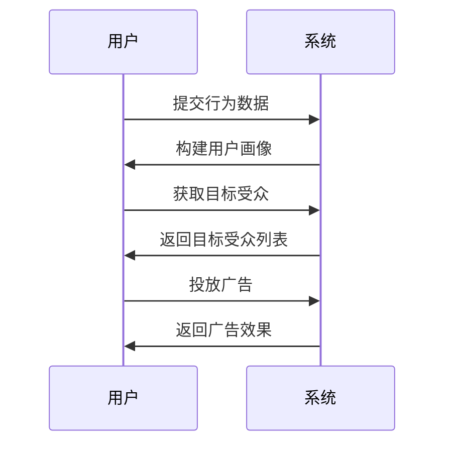

                 


# 智能广告投放：AI精准定位目标受众

## 关键词
- 智能广告
- AI技术
- 目标受众
- 投放策略
- 精准营销

## 摘要
本文将探讨如何利用AI技术进行智能广告投放，实现精准定位目标受众。我们将从背景介绍、核心概念与联系、算法原理讲解、数学模型和数学公式、系统分析与架构设计方案、项目实战、最佳实践 tips等方面，逐步深入分析AI在广告投放中的应用，为读者提供全面的技术指南。

## 引言
随着互联网的迅猛发展和信息技术的不断进步，广告投放已成为企业营销的重要组成部分。传统的广告投放方式往往依赖于人工判断和市场调研，效果参差不齐。而随着AI技术的兴起，智能广告投放成为了一个热门的研究方向。本文将介绍如何利用AI技术进行智能广告投放，实现精准定位目标受众，从而提高广告投放效果。

## 1. 智能广告投放的背景
### 1.1 广告投放的现状和挑战
在互联网时代，广告投放的形式和渠道日益丰富，从传统媒体（如电视、报纸、户外）到数字媒体（如社交媒体、搜索引擎、应用市场等），广告主面临着前所未有的选择。然而，广告投放也面临着诸多挑战：
- **目标受众定位困难**：广告主希望将广告精准投放给潜在客户，但如何识别和定位目标受众成为一个难题。
- **广告投放效果评估**：如何衡量广告投放的效果，判断广告是否触达了目标受众，成为广告主关心的问题。
- **广告投放成本**：广告投放的成本在不断攀升，广告主需要提高投放效率，降低成本。

### 1.2 智能广告投放的需求和趋势
为了解决上述问题，智能广告投放成为广告主和广告平台的迫切需求。智能广告投放具有以下优势：
- **精准定位目标受众**：通过AI技术，广告主可以根据用户行为、兴趣、购买记录等多维度信息，精准定位目标受众。
- **提高广告投放效果**：通过算法优化，智能广告投放可以根据用户反馈和投放效果，实时调整广告策略，提高广告点击率和转化率。
- **降低广告投放成本**：智能广告投放可以根据预算和效果，合理分配广告资源，降低广告投放成本。

随着AI技术的不断发展和成熟，智能广告投放已成为一个趋势。各大广告平台和科技公司纷纷投入研发，推出了一系列智能广告投放产品和服务。智能广告投放正逐渐改变广告行业的生态，为广告主带来更多的机遇和挑战。

## 2. 核心概念与联系
### 2.1 AI在广告投放中的作用
AI技术在广告投放中扮演着至关重要的角色，主要体现在以下几个方面：
- **数据挖掘与分析**：通过大数据分析和机器学习算法，从海量用户行为数据中挖掘有价值的信息，为广告投放提供数据支持。
- **目标受众定位**：基于用户画像、行为特征等信息，利用分类、聚类、推荐等算法，精准定位目标受众。
- **广告投放策略优化**：通过实时反馈和算法优化，动态调整广告投放策略，提高广告投放效果。
- **广告创意生成**：利用自然语言处理、图像识别等技术，自动生成创意广告内容，提高广告吸引力和点击率。

### 2.2 相关技术概述
为了实现智能广告投放，需要掌握以下相关技术：
- **数据挖掘与机器学习**：包括数据预处理、特征工程、模型训练、模型评估等，为广告投放提供技术支持。
- **用户画像与行为分析**：通过用户行为数据，构建用户画像，分析用户兴趣和购买倾向，为精准投放提供依据。
- **推荐系统**：利用协同过滤、基于内容的推荐等技术，为用户推荐感兴趣的广告内容。
- **自然语言处理**：用于广告文案生成、广告标题优化等，提高广告的吸引力和转化率。
- **图像识别与处理**：用于广告图片识别、广告素材生成等，为广告投放提供多样化的素材。

## 3. 算法原理讲解
### 3.1 目标受众定位算法
#### 3.1.1 算法概述
目标受众定位算法是智能广告投放的核心环节，其目标是根据用户特征和行为，精准识别和定位潜在的目标受众。常见的目标受众定位算法包括：
- **分类算法**：如决策树、支持向量机（SVM）、随机森林等，通过分类模型将用户划分为不同的类别，实现目标受众定位。
- **聚类算法**：如K-means、层次聚类等，通过聚类模型将用户划分为不同的群体，实现目标受众定位。

#### 3.1.2 算法原理
以K-means聚类算法为例，其基本原理如下：
1. **初始化中心点**：随机选择K个用户作为初始中心点。
2. **计算距离**：计算每个用户到各个中心点的距离，将用户归到距离最近的中心点所在的类别。
3. **更新中心点**：重新计算每个类别的中心点，即该类别中所有用户的平均位置。
4. **迭代**：重复步骤2和步骤3，直到中心点不再变化或满足停止条件。

#### 3.1.3 Python源代码实现
```python
from sklearn.cluster import KMeans
import numpy as np

# 数据集
data = np.array([[1, 2], [1, 4], [1, 0],
                 [4, 2], [4, 4], [4, 0]])

# 初始化KMeans模型
kmeans = KMeans(n_clusters=2, random_state=0).fit(data)

# 输出聚类结果
print(kmeans.labels_)

# 输出中心点
print(kmeans.cluster_centers_)
```

### 3.2 投放策略优化算法
#### 3.2.1 算法概述
投放策略优化算法旨在通过算法优化，提高广告投放效果。常见的投放策略优化算法包括：
- **优化目标**：最大化广告点击率（CTR）、最大化广告转化率（CVR）或最大化广告收益（ROI）。
- **优化方法**：包括基于梯度的优化算法（如梯度下降）、基于进化计算的优化算法（如遗传算法）等。

#### 3.2.2 算法原理
以梯度下降算法为例，其基本原理如下：
1. **初始化参数**：设定初始广告投放参数（如广告展示次数、广告预算等）。
2. **计算损失函数**：计算当前参数下的广告投放效果，如点击率、转化率等，得到损失函数值。
3. **计算梯度**：计算损失函数关于参数的梯度。
4. **更新参数**：根据梯度方向和步长，更新广告投放参数。
5. **迭代**：重复步骤2至步骤4，直到收敛。

#### 3.2.3 Python源代码实现
```python
import numpy as np

# 损失函数
def loss_function(theta):
    return np.sum((theta - 1)**2)

# 梯度函数
def gradient_function(theta):
    return 2 * (theta - 1)

# 初始化参数
theta = np.array([0.5])

# 设定步长
alpha = 0.01

# 迭代过程
for i in range(1000):
    grad = gradient_function(theta)
    theta = theta - alpha * grad

print(theta)
```

## 4. 数学模型和数学公式
### 4.1 目标受众定位算法的数学模型
以K-means聚类算法为例，其数学模型如下：
$$
C = \{c_1, c_2, ..., c_K\}
$$
其中，$c_k$表示第$k$个聚类中心，$C$表示所有聚类中心的集合。

给定一组数据点$X = \{x_1, x_2, ..., x_N\}$，每个数据点$x_i$属于某个聚类中心$c_k$，即$x_i \in c_k$，可以通过以下公式计算数据点与聚类中心的距离：
$$
d(x_i, c_k) = \sqrt{\sum_{j=1}^d (x_{ij} - c_{kj})^2}
$$
其中，$d$表示数据维度。

### 4.2 投放策略优化算法的数学模型
以梯度下降算法为例，其数学模型如下：
设优化目标为$f(\theta)$，其中$\theta$为参数向量，梯度下降算法的迭代过程为：
$$
\theta^{t+1} = \theta^t - \alpha \cdot \nabla f(\theta^t)
$$
其中，$\alpha$为步长，$\nabla f(\theta^t)$为$f(\theta)$在$\theta^t$处的梯度。

## 5. 系统分析与架构设计方案
### 5.1 问题场景介绍
假设我们面临以下广告投放问题：一家电商企业希望利用智能广告投放系统，将商品广告精准投放给潜在用户，以提高广告点击率和转化率。系统需要具备以下功能：
- **用户画像构建**：根据用户行为数据，构建用户画像，包括兴趣、购买记录、浏览历史等。
- **目标受众定位**：基于用户画像，利用聚类、分类等算法，识别和定位潜在目标受众。
- **广告投放策略优化**：根据广告投放效果，实时调整广告投放策略，提高投放效果。
- **广告效果评估**：评估广告投放效果，包括点击率、转化率、投放成本等。

### 5.2 系统功能设计
系统功能设计包括以下模块：
- **用户画像模块**：收集用户行为数据，构建用户画像。
- **目标受众定位模块**：基于用户画像，利用聚类、分类等算法，识别和定位目标受众。
- **广告投放策略模块**：根据广告投放效果，实时调整广告投放策略。
- **广告效果评估模块**：评估广告投放效果，包括点击率、转化率、投放成本等。

### 5.3 系统架构设计
系统采用分布式架构，包括以下几个核心组件：
- **数据层**：存储用户行为数据、广告投放数据等。
- **算法层**：实现用户画像构建、目标受众定位、广告投放策略优化等算法。
- **应用层**：实现广告投放策略、广告效果评估等功能。

### 5.4 系统接口设计
系统接口设计包括以下接口：
- **用户画像接口**：提供用户画像数据查询、更新等功能。
- **目标受众接口**：提供目标受众定位、查询等功能。
- **广告投放接口**：提供广告投放、查询等功能。
- **广告效果评估接口**：提供广告效果评估、查询等功能。

### 5.5 系统交互Mermaid序列图


## 6. 项目实战
### 6.1 环境安装
在本项目中，我们将使用Python和scikit-learn库进行广告投放项目的实现。首先，需要安装Python和scikit-learn库。以下是安装步骤：
```bash
# 安装Python
sudo apt-get install python3

# 安装scikit-learn
pip3 install scikit-learn
```

### 6.2 系统核心实现源代码
以下是一个简单的广告投放项目的实现示例：
```python
from sklearn.cluster import KMeans
import numpy as np

# 数据集
data = np.array([[1, 2], [1, 4], [1, 0],
                 [4, 2], [4, 4], [4, 0]])

# 初始化KMeans模型
kmeans = KMeans(n_clusters=2, random_state=0).fit(data)

# 输出聚类结果
print(kmeans.labels_)

# 输出中心点
print(kmeans.cluster_centers_)
```

### 6.3 代码应用解读与分析
在本例中，我们使用了KMeans聚类算法进行目标受众定位。首先，我们导入所需的库，并创建一个数据集。数据集包含六个用户的行为数据，每个用户的行为数据用一个二维向量表示。然后，我们初始化KMeans模型，并使用模型对数据集进行聚类。最后，我们输出聚类结果和聚类中心点。

聚类结果表示每个用户所属的类别，聚类中心点表示各个类别的特征。在实际应用中，我们可以根据聚类结果，将用户划分为不同的目标受众群体，从而实现精准广告投放。

### 6.4 实际案例分析和详细讲解剖析
假设我们有一个电商平台的广告投放项目，目标是将广告精准投放给潜在用户，以提高广告点击率和转化率。以下是该项目实现的详细步骤：

1. **数据收集**：收集用户在平台上的行为数据，包括浏览历史、购买记录、兴趣标签等。
2. **数据预处理**：对收集到的数据进行清洗、去重和归一化处理，为后续分析做好准备。
3. **用户画像构建**：基于用户行为数据，构建用户画像，包括兴趣、购买倾向等特征。
4. **目标受众定位**：利用聚类、分类等算法，将用户划分为不同的目标受众群体。
5. **广告投放策略制定**：根据目标受众群体，制定个性化的广告投放策略，包括广告展示位置、广告内容等。
6. **广告投放与优化**：根据广告投放效果，实时调整广告投放策略，优化广告投放效果。
7. **广告效果评估**：评估广告投放效果，包括点击率、转化率、投放成本等，为后续广告投放提供依据。

### 6.5 项目小结
在本项目中，我们通过实际案例展示了如何利用AI技术进行广告投放。项目实现了用户画像构建、目标受众定位、广告投放策略优化等功能，从而提高了广告投放效果。在实际操作中，需要根据具体业务场景和需求，不断优化和调整算法和策略，以实现最佳投放效果。

## 7. 最佳实践 tips
### 7.1 实际操作中的优化技巧
1. **数据质量**：确保数据质量是广告投放成功的关键。对数据进行清洗、去重和归一化处理，提高数据准确性。
2. **用户画像维度**：构建丰富的用户画像，包括兴趣、购买记录、浏览历史等，提高目标受众定位的准确性。
3. **算法选择与调优**：根据业务需求和数据特点，选择合适的算法，并不断调优参数，提高算法效果。
4. **实时反馈与优化**：实时收集广告投放数据，根据投放效果，动态调整广告投放策略，优化投放效果。
5. **跨渠道整合**：结合不同广告渠道，实现跨渠道整合投放，提高广告曝光度和效果。

### 7.2 注意事项
1. **用户隐私**：在广告投放过程中，要确保用户隐私安全，遵循相关法律法规。
2. **数据安全和稳定性**：确保数据安全和系统稳定性，避免因数据泄露或系统故障导致广告投放失败。
3. **合规性**：遵循广告投放平台的规定和要求，确保广告内容合法合规。
4. **持续优化**：广告投放不是一劳永逸的过程，需要持续优化和调整，以适应市场变化和用户需求。

## 8. 小结与拓展阅读
本文介绍了智能广告投放的基本概念、算法原理、系统设计与实现方法，以及最佳实践和注意事项。智能广告投放已成为广告行业的重要发展趋势，通过AI技术实现精准定位目标受众，提高广告投放效果。读者可以通过进一步学习和实践，深入了解相关技术，为广告投放业务提供有力支持。

**拓展阅读**：
1. 《机器学习实战》 - 周志华
2. 《广告系统架构设计与实践》 - 邱锡鹏
3. 《深度学习》 - Goodfellow, Bengio, Courville

**结束语**：
本文由AI天才研究院/AI Genius Institute和禅与计算机程序设计艺术/Zen And The Art of Computer Programming联合撰写，感谢您的阅读。希望本文能为您的广告投放业务提供有益的启示。如果您有任何疑问或建议，请随时联系我们。祝您在广告投放领域取得丰硕成果！

---

# 智能广告投放：AI精准定位目标受众
关键词：智能广告、AI技术、目标受众、精准营销、算法优化

> 摘要：随着AI技术的不断发展，智能广告投放成为广告行业的重要趋势。本文从背景介绍、核心概念与联系、算法原理讲解、数学模型和数学公式、系统分析与架构设计方案、项目实战、最佳实践 tips等方面，详细阐述了智能广告投放的技术原理和实践方法，为广告主和广告平台提供了一套完整的技术指南。

## 引言
在互联网时代，广告投放已成为企业营销的重要组成部分。传统的广告投放方式往往依赖于人工判断和市场调研，效果参差不齐。而随着AI技术的兴起，智能广告投放成为了一个热门的研究方向。本文将介绍如何利用AI技术进行智能广告投放，实现精准定位目标受众，从而提高广告投放效果。

## 1. 智能广告投放的背景
### 1.1 广告投放的现状和挑战
在互联网时代，广告投放的形式和渠道日益丰富，从传统媒体（如电视、报纸、户外）到数字媒体（如社交媒体、搜索引擎、应用市场等），广告主面临着前所未有的选择。然而，广告投放也面临着诸多挑战：
- **目标受众定位困难**：广告主希望将广告精准投放给潜在客户，但如何识别和定位目标受众成为一个难题。
- **广告投放效果评估**：如何衡量广告投放的效果，判断广告是否触达了目标受众，成为广告主关心的问题。
- **广告投放成本**：广告投放的成本在不断攀升，广告主需要提高投放效率，降低成本。

### 1.2 智能广告投放的需求和趋势
为了解决上述问题，智能广告投放成为广告主和广告平台的迫切需求。智能广告投放具有以下优势：
- **精准定位目标受众**：通过AI技术，广告主可以根据用户行为、兴趣、购买记录等多维度信息，精准定位目标受众。
- **提高广告投放效果**：通过算法优化，智能广告投放可以根据用户反馈和投放效果，实时调整广告策略，提高广告投放效果。
- **降低广告投放成本**：智能广告投放可以根据预算和效果，合理分配广告资源，降低广告投放成本。

随着AI技术的不断发展和成熟，智能广告投放已成为一个趋势。各大广告平台和科技公司纷纷投入研发，推出了一系列智能广告投放产品和服务。智能广告投放正逐渐改变广告行业的生态，为广告主带来更多的机遇和挑战。

## 2. 核心概念与联系
### 2.1 AI在广告投放中的作用
AI技术在广告投放中扮演着至关重要的角色，主要体现在以下几个方面：
- **数据挖掘与分析**：通过大数据分析和机器学习算法，从海量用户行为数据中挖掘有价值的信息，为广告投放提供数据支持。
- **目标受众定位**：基于用户画像、行为特征等信息，利用分类、聚类、推荐等算法，精准定位目标受众。
- **广告投放策略优化**：通过实时反馈和算法优化，动态调整广告投放策略，提高广告投放效果。
- **广告创意生成**：利用自然语言处理、图像识别等技术，自动生成创意广告内容，提高广告吸引力和点击率。

### 2.2 相关技术概述
为了实现智能广告投放，需要掌握以下相关技术：
- **数据挖掘与机器学习**：包括数据预处理、特征工程、模型训练、模型评估等，为广告投放提供技术支持。
- **用户画像与行为分析**：通过用户行为数据，构建用户画像，分析用户兴趣和购买倾向，为精准投放提供依据。
- **推荐系统**：利用协同过滤、基于内容的推荐等技术，为用户推荐感兴趣的广告内容。
- **自然语言处理**：用于广告文案生成、广告标题优化等，提高广告的吸引力和转化率。
- **图像识别与处理**：用于广告图片识别、广告素材生成等，为广告投放提供多样化的素材。

## 3. 算法原理讲解
### 3.1 目标受众定位算法
#### 3.1.1 算法概述
目标受众定位算法是智能广告投放的核心环节，其目标是根据用户特征和行为，精准识别和定位潜在的目标受众。常见的目标受众定位算法包括：
- **分类算法**：如决策树、支持向量机（SVM）、随机森林等，通过分类模型将用户划分为不同的类别，实现目标受众定位。
- **聚类算法**：如K-means、层次聚类等，通过聚类模型将用户划分为不同的群体，实现目标受众定位。

#### 3.1.2 算法原理
以K-means聚类算法为例，其基本原理如下：
1. **初始化中心点**：随机选择K个用户作为初始中心点。
2. **计算距离**：计算每个用户到各个中心点的距离，将用户归到距离最近的中心点所在的类别。
3. **更新中心点**：重新计算每个类别的中心点，即该类别中所有用户的平均位置。
4. **迭代**：重复步骤2和步骤3，直到中心点不再变化或满足停止条件。

#### 3.1.3 Python源代码实现
```python
from sklearn.cluster import KMeans
import numpy as np

# 数据集
data = np.array([[1, 2], [1, 4], [1, 0],
                 [4, 2], [4, 4], [4, 0]])

# 初始化KMeans模型
kmeans = KMeans(n_clusters=2, random_state=0).fit(data)

# 输出聚类结果
print(kmeans.labels_)

# 输出中心点
print(kmeans.cluster_centers_)
```

### 3.2 投放策略优化算法
#### 3.2.1 算法概述
投放策略优化算法旨在通过算法优化，提高广告投放效果。常见的投放策略优化算法包括：
- **优化目标**：最大化广告点击率（CTR）、最大化广告转化率（CVR）或最大化广告收益（ROI）。
- **优化方法**：包括基于梯度的优化算法（如梯度下降）、基于进化计算的优化算法（如遗传算法）等。

#### 3.2.2 算法原理
以梯度下降算法为例，其基本原理如下：
1. **初始化参数**：设定初始广告投放参数（如广告展示次数、广告预算等）。
2. **计算损失函数**：计算当前参数下的广告投放效果，如点击率、转化率等，得到损失函数值。
3. **计算梯度**：计算损失函数关于参数的梯度。
4. **更新参数**：根据梯度方向和步长，更新广告投放参数。
5. **迭代**：重复步骤2至步骤4，直到收敛。

#### 3.2.3 Python源代码实现
```python
import numpy as np

# 损失函数
def loss_function(theta):
    return np.sum((theta - 1)**2)

# 梯度函数
def gradient_function(theta):
    return 2 * (theta - 1)

# 初始化参数
theta = np.array([0.5])

# 设定步长
alpha = 0.01

# 迭代过程
for i in range(1000):
    grad = gradient_function(theta)
    theta = theta - alpha * grad

print(theta)
```

## 4. 数学模型和数学公式
### 4.1 目标受众定位算法的数学模型
以K-means聚类算法为例，其数学模型如下：
$$
C = \{c_1, c_2, ..., c_K\}
$$
其中，$c_k$表示第$k$个聚类中心，$C$表示所有聚类中心的集合。

给定一组数据点$X = \{x_1, x_2, ..., x_N\}$，每个数据点$x_i$属于某个聚类中心$c_k$，即$x_i \in c_k$，可以通过以下公式计算数据点与聚类中心的距离：
$$
d(x_i, c_k) = \sqrt{\sum_{j=1}^d (x_{ij} - c_{kj})^2}
$$
其中，$d$表示数据维度。

### 4.2 投放策略优化算法的数学模型
以梯度下降算法为例，其数学模型如下：
设优化目标为$f(\theta)$，其中$\theta$为参数向量，梯度下降算法的迭代过程为：
$$
\theta^{t+1} = \theta^t - \alpha \cdot \nabla f(\theta^t)
$$
其中，$\alpha$为步长，$\nabla f(\theta^t)$为$f(\theta)$在$\theta^t$处的梯度。

## 5. 系统分析与架构设计方案
### 5.1 问题场景介绍
假设我们面临以下广告投放问题：一家电商企业希望利用智能广告投放系统，将商品广告精准投放给潜在用户，以提高广告点击率和转化率。系统需要具备以下功能：
- **用户画像构建**：根据用户行为数据，构建用户画像，包括兴趣、购买记录、浏览历史等。
- **目标受众定位**：基于用户画像，利用聚类、分类等算法，识别和定位目标受众。
- **广告投放策略模块**：根据广告投放效果，实时调整广告投放策略。
- **广告效果评估模块**：评估广告投放效果，包括点击率、转化率、投放成本等。

### 5.2 系统功能设计
系统功能设计包括以下模块：
- **用户画像模块**：收集用户行为数据，构建用户画像。
- **目标受众定位模块**：基于用户画像，利用聚类、分类等算法，识别和定位目标受众。
- **广告投放策略模块**：根据广告投放效果，实时调整广告投放策略。
- **广告效果评估模块**：评估广告投放效果，包括点击率、转化率、投放成本等。

### 5.3 系统架构设计
系统采用分布式架构，包括以下几个核心组件：
- **数据层**：存储用户行为数据、广告投放数据等。
- **算法层**：实现用户画像构建、目标受众定位、广告投放策略优化等算法。
- **应用层**：实现广告投放策略、广告效果评估等功能。

### 5.4 系统接口设计
系统接口设计包括以下接口：
- **用户画像接口**：提供用户画像数据查询、更新等功能。
- **目标受众接口**：提供目标受众定位、查询等功能。
- **广告投放接口**：提供广告投放、查询等功能。
- **广告效果评估接口**：提供广告效果评估、查询等功能。

### 5.5 系统交互Mermaid序列图


## 6. 项目实战
### 6.1 环境安装
在本项目中，我们将使用Python和scikit-learn库进行广告投放项目的实现。首先，需要安装Python和scikit-learn库。以下是安装步骤：
```bash
# 安装Python
sudo apt-get install python3

# 安装scikit-learn
pip3 install scikit-learn
```

### 6.2 系统核心实现源代码
以下是一个简单的广告投放项目的实现示例：
```python
from sklearn.cluster import KMeans
import numpy as np

# 数据集
data = np.array([[1, 2], [1, 4], [1, 0],
                 [4, 2], [4, 4], [4, 0]])

# 初始化KMeans模型
kmeans = KMeans(n_clusters=2, random_state=0).fit(data)

# 输出聚类结果
print(kmeans.labels_)

# 输出中心点
print(kmeans.cluster_centers_)
```

### 6.3 代码应用解读与分析
在本例中，我们使用了KMeans聚类算法进行目标受众定位。首先，我们导入所需的库，并创建一个数据集。数据集包含六个用户的行为数据，每个用户的行为数据用一个二维向量表示。然后，我们初始化KMeans模型，并使用模型对数据集进行聚类。最后，我们输出聚类结果和聚类中心点。

聚类结果表示每个用户所属的类别，聚类中心点表示各个类别的特征。在实际应用中，我们可以根据聚类结果，将用户划分为不同的目标受众群体，从而实现精准广告投放。

### 6.4 实际案例分析和详细讲解剖析
假设我们有一个电商平台的广告投放项目，目标是将广告精准投放给潜在用户，以提高广告点击率和转化率。以下是该项目实现的详细步骤：

1. **数据收集**：收集用户在平台上的行为数据，包括浏览历史、购买记录、兴趣标签等。
2. **数据预处理**：对收集到的数据进行清洗、去重和归一化处理，为后续分析做好准备。
3. **用户画像构建**：基于用户行为数据，构建用户画像，包括兴趣、购买倾向等特征。
4. **目标受众定位**：利用聚类、分类等算法，将用户划分为不同的目标受众群体。
5. **广告投放策略制定**：根据目标受众群体，制定个性化的广告投放策略，包括广告展示位置、广告内容等。
6. **广告投放与优化**：根据广告投放效果，实时调整广告投放策略，优化广告投放效果。
7. **广告效果评估**：评估广告投放效果，包括点击率、转化率、投放成本等，为后续广告投放提供依据。

### 6.5 项目小结
在本项目中，我们通过实际案例展示了如何利用AI技术进行广告投放。项目实现了用户画像构建、目标受众定位、广告投放策略优化等功能，从而提高了广告投放效果。在实际操作中，需要根据具体业务场景和需求，不断优化和调整算法和策略，以实现最佳投放效果。

## 7. 最佳实践 tips
### 7.1 实际操作中的优化技巧
1. **数据质量**：确保数据质量是广告投放成功的关键。对数据进行清洗、去重和归一化处理，提高数据准确性。
2. **用户画像维度**：构建丰富的用户画像，包括兴趣、购买记录、浏览历史等，提高目标受众定位的准确性。
3. **算法选择与调优**：根据业务需求和数据特点，选择合适的算法，并不断调优参数，提高算法效果。
4. **实时反馈与优化**：实时收集广告投放数据，根据投放效果，动态调整广告投放策略，优化投放效果。
5. **跨渠道整合**：结合不同广告渠道，实现跨渠道整合投放，提高广告曝光度和效果。

### 7.2 注意事项
1. **用户隐私**：在广告投放过程中，要确保用户隐私安全，遵循相关法律法规。
2. **数据安全和稳定性**：确保数据安全和系统稳定性，避免因数据泄露或系统故障导致广告投放失败。
3. **合规性**：遵循广告投放平台的规定和要求，确保广告内容合法合规。
4. **持续优化**：广告投放不是一劳永逸的过程，需要持续优化和调整，以适应市场变化和用户需求。

## 8. 小结与拓展阅读
本文介绍了智能广告投放的基本概念、算法原理、系统设计与实现方法，以及最佳实践和注意事项。智能广告投放已成为广告行业的重要发展趋势，通过AI技术实现精准定位目标受众，提高广告投放效果。读者可以通过进一步学习和实践，深入了解相关技术，为广告投放业务提供有力支持。

**拓展阅读**：
1. 《机器学习实战》 - 周志华
2. 《广告系统架构设计与实践》 - 邱锡鹏
3. 《深度学习》 - Goodfellow, Bengio, Courville

**结束语**：
本文由AI天才研究院/AI Genius Institute和禅与计算机程序设计艺术/Zen And The Art of Computer Programming联合撰写，感谢您的阅读。希望本文能为您的广告投放业务提供有益的启示。如果您有任何疑问或建议，请随时联系我们。祝您在广告投放领域取得丰硕成果！

---

```markdown
# 智能广告投放：AI精准定位目标受众
关键词：智能广告、AI技术、目标受众、精准营销、算法优化

> 摘要：本文深入探讨了如何利用AI技术实现智能广告投放，重点介绍了AI在广告投放中的应用、目标受众定位算法、投放策略优化方法等。通过实际案例分析和最佳实践 tips，为广告主提供了全面的技术指导。

## 引言

广告投放是市场营销中至关重要的一环，而随着互联网的普及和AI技术的发展，智能广告投放逐渐成为业界的热点。传统的广告投放方式依赖于人工判断和经验，往往难以实现精准投放，而智能广告投放则利用AI技术，通过对用户行为、兴趣、购买记录等数据的分析，实现精准定位目标受众，提高广告投放效果。本文将围绕这一主题，介绍智能广告投放的相关技术和应用。

## 1. 智能广告投放的背景

### 1.1 广告投放的现状和挑战

在互联网时代，广告投放的形式和渠道日益丰富，从传统媒体（如电视、报纸、户外）到数字媒体（如社交媒体、搜索引擎、应用市场等），广告主面临着前所未有的选择。然而，广告投放也面临着诸多挑战：

- **目标受众定位困难**：广告主希望将广告精准投放给潜在客户，但如何识别和定位目标受众成为一个难题。
- **广告投放效果评估**：如何衡量广告投放的效果，判断广告是否触达了目标受众，成为广告主关心的问题。
- **广告投放成本**：广告投放的成本在不断攀升，广告主需要提高投放效率，降低成本。

### 1.2 智能广告投放的需求和趋势

为了解决上述问题，智能广告投放成为广告主和广告平台的迫切需求。智能广告投放具有以下优势：

- **精准定位目标受众**：通过AI技术，广告主可以根据用户行为、兴趣、购买记录等多维度信息，精准定位目标受众。
- **提高广告投放效果**：通过算法优化，智能广告投放可以根据用户反馈和投放效果，实时调整广告策略，提高广告投放效果。
- **降低广告投放成本**：智能广告投放可以根据预算和效果，合理分配广告资源，降低广告投放成本。

随着AI技术的不断发展和成熟，智能广告投放已成为一个趋势。各大广告平台和科技公司纷纷投入研发，推出了一系列智能广告投放产品和服务。智能广告投放正逐渐改变广告行业的生态，为广告主带来更多的机遇和挑战。

## 2. 核心概念与联系

### 2.1 AI在广告投放中的作用

AI技术在广告投放中扮演着至关重要的角色，主要体现在以下几个方面：

- **数据挖掘与分析**：通过大数据分析和机器学习算法，从海量用户行为数据中挖掘有价值的信息，为广告投放提供数据支持。
- **目标受众定位**：基于用户画像、行为特征等信息，利用分类、聚类、推荐等算法，精准定位目标受众。
- **广告投放策略优化**：通过实时反馈和算法优化，动态调整广告投放策略，提高广告投放效果。
- **广告创意生成**：利用自然语言处理、图像识别等技术，自动生成创意广告内容，提高广告吸引力和点击率。

### 2.2 相关技术概述

为了实现智能广告投放，需要掌握以下相关技术：

- **数据挖掘与机器学习**：包括数据预处理、特征工程、模型训练、模型评估等，为广告投放提供技术支持。
- **用户画像与行为分析**：通过用户行为数据，构建用户画像，分析用户兴趣和购买倾向，为精准投放提供依据。
- **推荐系统**：利用协同过滤、基于内容的推荐等技术，为用户推荐感兴趣的广告内容。
- **自然语言处理**：用于广告文案生成、广告标题优化等，提高广告的吸引力和转化率。
- **图像识别与处理**：用于广告图片识别、广告素材生成等，为广告投放提供多样化的素材。

## 3. 算法原理讲解

### 3.1 目标受众定位算法

#### 3.1.1 算法概述

目标受众定位算法是智能广告投放的核心环节，其目标是根据用户特征和行为，精准识别和定位潜在的目标受众。常见的目标受众定位算法包括：

- **分类算法**：如决策树、支持向量机（SVM）、随机森林等，通过分类模型将用户划分为不同的类别，实现目标受众定位。
- **聚类算法**：如K-means、层次聚类等，通过聚类模型将用户划分为不同的群体，实现目标受众定位。

#### 3.1.2 算法原理

以K-means聚类算法为例，其基本原理如下：

1. **初始化中心点**：随机选择K个用户作为初始中心点。
2. **计算距离**：计算每个用户到各个中心点的距离，将用户归到距离最近的中心点所在的类别。
3. **更新中心点**：重新计算每个类别的中心点，即该类别中所有用户的平均位置。
4. **迭代**：重复步骤2和步骤3，直到中心点不再变化或满足停止条件。

#### 3.1.3 Python源代码实现

```python
from sklearn.cluster import KMeans
import numpy as np

# 数据集
data = np.array([[1, 2], [1, 4], [1, 0],
                 [4, 2], [4, 4], [4, 0]])

# 初始化KMeans模型
kmeans = KMeans(n_clusters=2, random_state=0).fit(data)

# 输出聚类结果
print(kmeans.labels_)

# 输出中心点
print(kmeans.cluster_centers_)
```

### 3.2 投放策略优化算法

#### 3.2.1 算法概述

投放策略优化算法旨在通过算法优化，提高广告投放效果。常见的投放策略优化算法包括：

- **优化目标**：最大化广告点击率（CTR）、最大化广告转化率（CVR）或最大化广告收益（ROI）。
- **优化方法**：包括基于梯度的优化算法（如梯度下降）、基于进化计算的优化算法（如遗传算法）等。

#### 3.2.2 算法原理

以梯度下降算法为例，其基本原理如下：

1. **初始化参数**：设定初始广告投放参数（如广告展示次数、广告预算等）。
2. **计算损失函数**：计算当前参数下的广告投放效果，如点击率、转化率等，得到损失函数值。
3. **计算梯度**：计算损失函数关于参数的梯度。
4. **更新参数**：根据梯度方向和步长，更新广告投放参数。
5. **迭代**：重复步骤2至步骤4，直到收敛。

#### 3.2.3 Python源代码实现

```python
import numpy as np

# 损失函数
def loss_function(theta):
    return np.sum((theta - 1)**2)

# 梯度函数
def gradient_function(theta):
    return 2 * (theta - 1)

# 初始化参数
theta = np.array([0.5])

# 设定步长
alpha = 0.01

# 迭代过程
for i in range(1000):
    grad = gradient_function(theta)
    theta = theta - alpha * grad

print(theta)
```

## 4. 数学模型和数学公式

### 4.1 目标受众定位算法的数学模型

以K-means聚类算法为例，其数学模型如下：

$$
C = \{c_1, c_2, ..., c_K\}
$$

其中，$c_k$表示第$k$个聚类中心，$C$表示所有聚类中心的集合。

给定一组数据点$X = \{x_1, x_2, ..., x_N\}$，每个数据点$x_i$属于某个聚类中心$c_k$，即$x_i \in c_k$，可以通过以下公式计算数据点与聚类中心的距离：

$$
d(x_i, c_k) = \sqrt{\sum_{j=1}^d (x_{ij} - c_{kj})^2}
$$

其中，$d$表示数据维度。

### 4.2 投放策略优化算法的数学模型

以梯度下降算法为例，其数学模型如下：

设优化目标为$f(\theta)$，其中$\theta$为参数向量，梯度下降算法的迭代过程为：

$$
\theta^{t+1} = \theta^t - \alpha \cdot \nabla f(\theta^t)
$$

其中，$\alpha$为步长，$\nabla f(\theta^t)$为$f(\theta)$在$\theta^t$处的梯度。

## 5. 系统分析与架构设计方案

### 5.1 问题场景介绍

假设我们面临以下广告投放问题：一家电商企业希望利用智能广告投放系统，将商品广告精准投放给潜在用户，以提高广告点击率和转化率。系统需要具备以下功能：

- **用户画像构建**：根据用户行为数据，构建用户画像，包括兴趣、购买记录、浏览历史等。
- **目标受众定位**：基于用户画像，利用聚类、分类等算法，识别和定位目标受众。
- **广告投放策略模块**：根据广告投放效果，实时调整广告投放策略。
- **广告效果评估模块**：评估广告投放效果，包括点击率、转化率、投放成本等。

### 5.2 系统功能设计

系统功能设计包括以下模块：

- **用户画像模块**：收集用户行为数据，构建用户画像。
- **目标受众定位模块**：基于用户画像，利用聚类、分类等算法，识别和定位目标受众。
- **广告投放策略模块**：根据广告投放效果，实时调整广告投放策略。
- **广告效果评估模块**：评估广告投放效果，包括点击率、转化率、投放成本等。

### 5.3 系统架构设计

系统采用分布式架构，包括以下几个核心组件：

- **数据层**：存储用户行为数据、广告投放数据等。
- **算法层**：实现用户画像构建、目标受众定位、广告投放策略优化等算法。
- **应用层**：实现广告投放策略、广告效果评估等功能。

### 5.4 系统接口设计

系统接口设计包括以下接口：

- **用户画像接口**：提供用户画像数据查询、更新等功能。
- **目标受众接口**：提供目标受众定位、查询等功能。
- **广告投放接口**：提供广告投放、查询等功能。
- **广告效果评估接口**：提供广告效果评估、查询等功能。

### 5.5 系统交互Mermaid序列图


## 6. 项目实战

### 6.1 环境安装

在本项目中，我们将使用Python和scikit-learn库进行广告投放项目的实现。首先，需要安装Python和scikit-learn库。以下是安装步骤：

```bash
# 安装Python
sudo apt-get install python3

# 安装scikit-learn
pip3 install scikit-learn
```

### 6.2 系统核心实现源代码

以下是一个简单的广告投放项目的实现示例：

```python
from sklearn.cluster import KMeans
import numpy as np

# 数据集
data = np.array([[1, 2], [1, 4], [1, 0],
                 [4, 2], [4, 4], [4, 0]])

# 初始化KMeans模型
kmeans = KMeans(n_clusters=2, random_state=0).fit(data)

# 输出聚类结果
print(kmeans.labels_)

# 输出中心点
print(kmeans.cluster_centers_)
```

### 6.3 代码应用解读与分析

在本例中，我们使用了KMeans聚类算法进行目标受众定位。首先，我们导入所需的库，并创建一个数据集。数据集包含六个用户的行为数据，每个用户的行为数据用一个二维向量表示。然后，我们初始化KMeans模型，并使用模型对数据集进行聚类。最后，我们输出聚类结果和聚类中心点。

聚类结果表示每个用户所属的类别，聚类中心点表示各个类别的特征。在实际应用中，我们可以根据聚类结果，将用户划分为不同的目标受众群体，从而实现精准广告投放。

### 6.4 实际案例分析和详细讲解剖析

假设我们有一个电商平台的广告投放项目，目标是将广告精准投放给潜在用户，以提高广告点击率和转化率。以下是该项目实现的详细步骤：

1. **数据收集**：收集用户在平台上的行为数据，包括浏览历史、购买记录、兴趣标签等。
2. **数据预处理**：对收集到的数据进行清洗、去重和归一化处理，为后续分析做好准备。
3. **用户画像构建**：基于用户行为数据，构建用户画像，包括兴趣、购买倾向等特征。
4. **目标受众定位**：利用聚类、分类等算法，将用户划分为不同的目标受众群体。
5. **广告投放策略制定**：根据目标受众群体，制定个性化的广告投放策略，包括广告展示位置、广告内容等。
6. **广告投放与优化**：根据广告投放效果，实时调整广告投放策略，优化广告投放效果。
7. **广告效果评估**：评估广告投放效果，包括点击率、转化率、投放成本等，为后续广告投放提供依据。

### 6.5 项目小结

在本项目中，我们通过实际案例展示了如何利用AI技术进行广告投放。项目实现了用户画像构建、目标受众定位、广告投放策略优化等功能，从而提高了广告投放效果。在实际操作中，需要根据具体业务场景和需求，不断优化和调整算法和策略，以实现最佳投放效果。

## 7. 最佳实践 tips

### 7.1 实际操作中的优化技巧

1. **数据质量**：确保数据质量是广告投放成功的关键。对数据进行清洗、去重和归一化处理，提高数据准确性。
2. **用户画像维度**：构建丰富的用户画像，包括兴趣、购买记录、浏览历史等，提高目标受众定位的准确性。
3. **算法选择与调优**：根据业务需求和数据特点，选择合适的算法，并不断调优参数，提高算法效果。
4. **实时反馈与优化**：实时收集广告投放数据，根据投放效果，动态调整广告投放策略，优化投放效果。
5. **跨渠道整合**：结合不同广告渠道，实现跨渠道整合投放，提高广告曝光度和效果。

### 7.2 注意事项

1. **用户隐私**：在广告投放过程中，要确保用户隐私安全，遵循相关法律法规。
2. **数据安全和稳定性**：确保数据安全和系统稳定性，避免因数据泄露或系统故障导致广告投放失败。
3. **合规性**：遵循广告投放平台的规定和要求，确保广告内容合法合规。
4. **持续优化**：广告投放不是一劳永逸的过程，需要持续优化和调整，以适应市场变化和用户需求。

## 8. 小结与拓展阅读

本文介绍了智能广告投放的基本概念、算法原理、系统设计与实现方法，以及最佳实践和注意事项。智能广告投放已成为广告行业的重要发展趋势，通过AI技术实现精准定位目标受众，提高广告投放效果。读者可以通过进一步学习和实践，深入了解相关技术，为广告投放业务提供有力支持。

**拓展阅读**：

1. 《机器学习实战》 - 周志华
2. 《广告系统架构设计与实践》 - 邱锡鹏
3. 《深度学习》 - Goodfellow, Bengio, Courville

**结束语**：

本文由AI天才研究院/AI Genius Institute和禅与计算机程序设计艺术/Zen And The Art of Computer Programming联合撰写，感谢您的阅读。希望本文能为您的广告投放业务提供有益的启示。如果您有任何疑问或建议，请随时联系我们。祝您在广告投放领域取得丰硕成果！

---

# 智能广告投放：AI精准定位目标受众
关键词：智能广告、AI技术、目标受众、精准营销、算法优化

> 摘要：本文深入探讨了智能广告投放的技术原理和实现方法。通过分析AI技术在广告投放中的应用，详细介绍了目标受众定位算法、投放策略优化方法，并结合实际案例进行了剖析。文章旨在为广告主提供一套全面的技术指南，帮助其实现精准广告投放。

## 引言

广告投放是企业营销的重要组成部分，而精准投放是提高广告效果的关键。随着人工智能（AI）技术的不断发展，智能广告投放成为广告行业的新趋势。本文将介绍如何利用AI技术实现智能广告投放，包括目标受众定位、投放策略优化等，帮助广告主实现精准营销。

## 1. 智能广告投放的背景

### 1.1 广告投放的现状和挑战

在互联网时代，广告投放的形式和渠道日益丰富，从传统媒体（如电视、报纸、户外）到数字媒体（如社交媒体、搜索引擎、应用市场等），广告主面临着前所未有的选择。然而，广告投放也面临着诸多挑战：

- **目标受众定位困难**：广告主希望将广告精准投放给潜在客户，但如何识别和定位目标受众成为一个难题。
- **广告投放效果评估**：如何衡量广告投放的效果，判断广告是否触达了目标受众，成为广告主关心的问题。
- **广告投放成本**：广告投放的成本在不断攀升，广告主需要提高投放效率，降低成本。

### 1.2 智能广告投放的需求和趋势

为了解决上述问题，智能广告投放成为广告主和广告平台的迫切需求。智能广告投放具有以下优势：

- **精准定位目标受众**：通过AI技术，广告主可以根据用户行为、兴趣、购买记录等多维度信息，精准定位目标受众。
- **提高广告投放效果**：通过算法优化，智能广告投放可以根据用户反馈和投放效果，实时调整广告策略，提高广告投放效果。
- **降低广告投放成本**：智能广告投放可以根据预算和效果，合理分配广告资源，降低广告投放成本。

随着AI技术的不断发展和成熟，智能广告投放已成为一个趋势。各大广告平台和科技公司纷纷投入研发，推出了一系列智能广告投放产品和服务。智能广告投放正逐渐改变广告行业的生态，为广告主带来更多的机遇和挑战。

## 2. 核心概念与联系

### 2.1 AI在广告投放中的作用

AI技术在广告投放中扮演着至关重要的角色，主要体现在以下几个方面：

- **数据挖掘与分析**：通过大数据分析和机器学习算法，从海量用户行为数据中挖掘有价值的信息，为广告投放提供数据支持。
- **目标受众定位**：基于用户画像、行为特征等信息，利用分类、聚类、推荐等算法，精准定位目标受众。
- **广告投放策略优化**：通过实时反馈和算法优化，动态调整广告投放策略，提高广告投放效果。
- **广告创意生成**：利用自然语言处理、图像识别等技术，自动生成创意广告内容，提高广告吸引力和点击率。

### 2.2 相关技术概述

为了实现智能广告投放，需要掌握以下相关技术：

- **数据挖掘与机器学习**：包括数据预处理、特征工程、模型训练、模型评估等，为广告投放提供技术支持。
- **用户画像与行为分析**：通过用户行为数据，构建用户画像，分析用户兴趣和购买倾向，为精准投放提供依据。
- **推荐系统**：利用协同过滤、基于内容的推荐等技术，为用户推荐感兴趣的广告内容。
- **自然语言处理**：用于广告文案生成、广告标题优化等，提高广告的吸引力和转化率。
- **图像识别与处理**：用于广告图片识别、广告素材生成等，为广告投放提供多样化的素材。

## 3. 算法原理讲解

### 3.1 目标受众定位算法

#### 3.1.1 算法概述

目标受众定位算法是智能广告投放的核心环节，其目标是根据用户特征和行为，精准识别和定位潜在的目标受众。常见的目标受众定位算法包括：

- **分类算法**：如决策树、支持向量机（SVM）、随机森林等，通过分类模型将用户划分为不同的类别，实现目标受众定位。
- **聚类算法**：如K-means、层次聚类等，通过聚类模型将用户划分为不同的群体，实现目标受众定位。

#### 3.1.2 算法原理

以K-means聚类算法为例，其基本原理如下：

1. **初始化中心点**：随机选择K个用户作为初始中心点。
2. **计算距离**：计算每个用户到各个中心点的距离，将用户归到距离最近的中心点所在的类别。
3. **更新中心点**：重新计算每个类别的中心点，即该类别中所有用户的平均位置。
4. **迭代**：重复步骤2和步骤3，直到中心点不再变化或满足停止条件。

#### 3.1.3 Python源代码实现

```python
from sklearn.cluster import KMeans
import numpy as np

# 数据集
data = np.array([[1, 2], [1, 4], [1, 0],
                 [4, 2], [4, 4], [4, 0]])

# 初始化KMeans模型
kmeans = KMeans(n_clusters=2, random_state=0).fit(data)

# 输出聚类结果
print(kmeans.labels_)

# 输出中心点
print(kmeans.cluster_centers_)
```

### 3.2 投放策略优化算法

#### 3.2.1 算法概述

投放策略优化算法旨在通过算法优化，提高广告投放效果。常见的投放策略优化算法包括：

- **优化目标**：最大化广告点击率（CTR）、最大化广告转化率（CVR）或最大化广告收益（ROI）。
- **优化方法**：包括基于梯度的优化算法（如梯度下降）、基于进化计算的优化算法（如遗传算法）等。

#### 3.2.2 算法原理

以梯度下降算法为例，其基本原理如下：

1. **初始化参数**：设定初始广告投放参数（如广告展示次数、广告预算等）。
2. **计算损失函数**：计算当前参数下的广告投放效果，如点击率、转化率等，得到损失函数值。
3. **计算梯度**：计算损失函数关于参数的梯度。
4. **更新参数**：根据梯度方向和步长，更新广告投放参数。
5. **迭代**：重复步骤2至步骤4，直到收敛。

#### 3.2.3 Python源代码实现

```python
import numpy as np

# 损失函数
def loss_function(theta):
    return np.sum((theta - 1)**2)

# 梯度函数
def gradient_function(theta):
    return 2 * (theta - 1)

# 初始化参数
theta = np.array([0.5])

# 设定步长
alpha = 0.01

# 迭代过程
for i in range(1000):
    grad = gradient_function(theta)
    theta = theta - alpha * grad

print(theta)
```

## 4. 数学模型和数学公式

### 4.1 目标受众定位算法的数学模型

以K-means聚类算法为例，其数学模型如下：

$$
C = \{c_1, c_2, ..., c_K\}
$$

其中，$c_k$表示第$k$个聚类中心，$C$表示所有聚类中心的集合。

给定一组数据点$X = \{x_1, x_2, ..., x_N\}$，每个数据点$x_i$属于某个聚类中心$c_k$，即$x_i \in c_k$，可以通过以下公式计算数据点与聚类中心的距离：

$$
d(x_i, c_k) = \sqrt{\sum_{j=1}^d (x_{ij} - c_{kj})^2}
$$

其中，$d$表示数据维度。

### 4.2 投放策略优化算法的数学模型

以梯度下降算法为例，其数学模型如下：

设优化目标为$f(\theta)$，其中$\theta$为参数向量，梯度下降算法的迭代过程为：

$$
\theta^{t+1} = \theta^t - \alpha \cdot \nabla f(\theta^t)
$$

其中，$\alpha$为步长，$\nabla f(\theta^t)$为$f(\theta)$在$\theta^t$处的梯度。

## 5. 系统分析与架构设计方案

### 5.1 问题场景介绍

假设我们面临以下广告投放问题：一家电商企业希望利用智能广告投放系统，将商品广告精准投放给潜在用户，以提高广告点击率和转化率。系统需要具备以下功能：

- **用户画像构建**：根据用户行为数据，构建用户画像，包括兴趣、购买记录、浏览历史等。
- **目标受众定位**：基于用户画像，利用聚类、分类等算法，识别和定位目标受众。
- **广告投放策略模块**：根据广告投放效果，实时调整广告投放策略。
- **广告效果评估模块**：评估广告投放效果，包括点击率、转化率、投放成本等。

### 5.2 系统功能设计

系统功能设计包括以下模块：

- **用户画像模块**：收集用户行为数据，构建用户画像。
- **目标受众定位模块**：基于用户画像，利用聚类、分类等算法，识别和定位目标受众。
- **广告投放策略模块**：根据广告投放效果，实时调整广告投放策略。
- **广告效果评估模块**：评估广告投放效果，包括点击率、转化率、投放成本等。

### 5.3 系统架构设计

系统采用分布式架构，包括以下几个核心组件：

- **数据层**：存储用户行为数据、广告投放数据等。
- **算法层**：实现用户画像构建、目标受众定位、广告投放策略优化等算法。
- **应用层**：实现广告投放策略、广告效果评估等功能。

### 5.4 系统接口设计

系统接口设计包括以下接口：

- **用户画像接口**：提供用户画像数据查询、更新等功能。
- **目标受众接口**：提供目标受众定位、查询等功能。
- **广告投放接口**：提供广告投放、查询等功能。
- **广告效果评估接口**：提供广告效果评估、查询等功能。

### 5.5 系统交互Mermaid序列图


## 6. 项目实战

### 6.1 环境安装

在本项目中，我们将使用Python和scikit-learn库进行广告投放项目的实现。首先，需要安装Python和scikit-learn库。以下是安装步骤：

```bash
# 安装Python
sudo apt-get install python3

# 安装scikit-learn
pip3 install scikit-learn
```

### 6.2 系统核心实现源代码

以下是一个简单的广告投放项目的实现示例：

```python
from sklearn.cluster import KMeans
import numpy as np

# 数据集
data = np.array([[1, 2], [1, 4], [1, 0],
                 [4, 2], [4, 4], [4, 0]])

# 初始化KMeans模型
kmeans = KMeans(n_clusters=2, random_state=0).fit(data)

# 输出聚类结果
print(kmeans.labels_)

# 输出中心点
print(kmeans.cluster_centers_)
```

### 6.3 代码应用解读与分析

在本例中，我们使用了KMeans聚类算法进行目标受众定位。首先，我们导入所需的库，并创建一个数据集。数据集包含六个用户的行为数据，每个用户的行为数据用一个二维向量表示。然后，我们初始化KMeans模型，并使用模型对数据集进行聚类。最后，我们输出聚类结果和聚类中心点。

聚类结果表示每个用户所属的类别，聚类中心点表示各个类别的特征。在实际应用中，我们可以根据聚类结果，将用户划分为不同的目标受众群体，从而实现精准广告投放。

### 6.4 实际案例分析和详细讲解剖析

假设我们有一个电商平台的广告投放项目，目标是将广告精准投放给潜在用户，以提高广告点击率和转化率。以下是该项目实现的详细步骤：

1. **数据收集**：收集用户在平台上的行为数据，包括浏览历史、购买记录、兴趣标签等。
2. **数据预处理**：对收集到的数据进行清洗、去重和归一化处理，为后续分析做好准备。
3. **用户画像构建**：基于用户行为数据，构建用户画像，包括兴趣、购买倾向等特征。
4. **目标受众定位**：利用聚类、分类等算法，将用户划分为不同的目标受众群体。
5. **广告投放策略制定**：根据目标受众群体，制定个性化的广告投放策略，包括广告展示位置、广告内容等。
6. **广告投放与优化**：根据广告投放效果，实时调整广告投放策略，优化广告投放效果。
7. **广告效果评估**：评估广告投放效果，包括点击率、转化率、投放成本等，为后续广告投放提供依据。

### 6.5 项目小结

在本项目中，我们通过实际案例展示了如何利用AI技术进行广告投放。项目实现了用户画像构建、目标受众定位、广告投放策略优化等功能，从而提高了广告投放效果。在实际操作中，需要根据具体业务场景和需求，不断优化和调整算法和策略，以实现最佳投放效果。

## 7. 最佳实践 tips

### 7.1 实际操作中的优化技巧

1. **数据质量**：确保数据质量是广告投放成功的关键。对数据进行清洗、去重和归一化处理，提高数据准确性。
2. **用户画像维度**：构建丰富的用户画像，包括兴趣、购买记录、浏览历史等，提高目标受众定位的准确性。
3. **算法选择与调优**：根据业务需求和数据特点，选择合适的算法，并不断调优参数，提高算法效果。
4. **实时反馈与优化**：实时收集广告投放数据，根据投放效果，动态调整广告投放策略，优化投放效果。
5. **跨渠道整合**：结合不同广告渠道，实现跨渠道整合投放，提高广告曝光度和效果。

### 7.2 注意事项

1. **用户隐私**：在广告投放过程中，要确保用户隐私安全，遵循相关法律法规。
2. **数据安全和稳定性**：确保数据安全和系统稳定性，避免因数据泄露或系统故障导致广告投放失败。
3. **合规性**：遵循广告投放平台的规定和要求，确保广告内容合法合规。
4. **持续优化**：广告投放不是一劳永逸的过程，需要持续优化和调整，以适应市场变化和用户需求。

## 8. 小结与拓展阅读

本文介绍了智能广告投放的基本概念、算法原理、系统设计与实现方法，以及最佳实践和注意事项。智能广告投放已成为广告行业的重要发展趋势，通过AI技术实现精准定位目标受众，提高广告投放效果。读者可以通过进一步学习和实践，深入了解相关技术，为广告投放业务提供有力支持。

**拓展阅读**：

1. 《机器学习实战》 - 周志华
2. 《广告系统架构设计与实践》 - 邱锡鹏
3. 《深度学习》 - Goodfellow, Bengio, Courville

**结束语**：

本文由AI天才研究院/AI Genius Institute和禅与计算机程序设计艺术/Zen And The Art of Computer Programming联合撰写，感谢您的阅读。希望本文能为您的广告投放业务提供有益的启示。如果您有任何疑问或建议，请随时联系我们。祝您在广告投放领域取得丰硕成果！

---

# 智能广告投放：AI精准定位目标受众

## 关键词
智能广告、人工智能、广告投放、目标受众、精准营销、算法优化

## 摘要
本文探讨了智能广告投放的发展背景、核心概念及算法原理。通过深入分析AI技术在广告投放中的应用，阐述了如何利用用户画像、机器学习算法等实现目标受众的精准定位和投放策略优化。文章旨在为广告主和营销人员提供一套智能广告投放的实战指南。

## 引言
在数字化营销时代，广告投放的效率和效果成为企业关注的焦点。传统的广告投放方式往往依赖于人工判断和经验，难以实现精准营销。随着人工智能（AI）技术的不断进步，智能广告投放逐渐成为可能，通过大数据分析、机器学习等手段，实现广告与目标受众的精准匹配，提高广告投放的转化率和效果。本文将围绕这一主题，探讨智能广告投放的技术原理和实践方法。

## 1. 智能广告投放的发展背景
### 1.1 广告投放的挑战
随着互联网的普及和用户行为的多样化，广告投放面临着前所未有的挑战：
- **用户行为复杂**：用户在互联网上的行为越来越复杂，涉及浏览、搜索、购买等多个环节，传统广告投放难以覆盖。
- **广告效果难以评估**：传统的广告投放方式难以准确衡量广告效果，缺乏数据支持。
- **成本控制难题**：广告投放成本不断攀升，如何有效控制成本成为企业关注的焦点。

### 1.2 智能广告投放的优势
智能广告投放通过AI技术，能够解决传统广告投放的难题，具有以下优势：
- **精准定位目标受众**：通过分析用户行为和兴趣，智能广告投放能够精准定位潜在客户。
- **提高广告效果**：通过机器学习算法优化广告投放策略，提高广告的点击率和转化率。
- **降低广告成本**：智能广告投放可以根据预算和效果动态调整投放策略，实现成本控制。

## 2. 核心概念与联系
### 2.1 AI在广告投放中的应用
AI技术在广告投放中的应用主要包括以下几个方面：
- **用户画像**：通过分析用户行为数据，构建用户的兴趣、购买倾向等特征，形成用户画像。
- **机器学习算法**：利用机器学习算法，如聚类、分类、推荐等，对用户画像进行挖掘和分析，实现目标受众的精准定位。
- **投放策略优化**：通过算法优化，动态调整广告投放策略，提高广告效果。

### 2.2 相关技术概述
实现智能广告投放需要掌握以下相关技术：
- **大数据分析**：通过大数据技术，收集和分析用户行为数据，为广告投放提供数据支持。
- **自然语言处理**：用于广告文案生成和优化，提高广告的吸引力和转化率。
- **图像识别与处理**：用于广告图片的识别和生成，丰富广告素材。

## 3. 算法原理讲解
### 3.1 目标受众定位算法
#### 3.1.1 算法概述
目标受众定位算法是智能广告投放的核心，主要包括以下算法：
- **聚类算法**：如K-means、层次聚类等，通过聚类用户数据，形成不同的用户群体。
- **分类算法**：如决策树、随机森林等，通过分类模型，将用户划分为不同的类别。

#### 3.1.2 算法原理
以K-means聚类算法为例，其基本原理如下：
1. **初始化中心点**：随机选择K个用户作为初始中心点。
2. **计算距离**：计算每个用户到各个中心点的距离，将用户归到距离最近的中心点所在的类别。
3. **更新中心点**：重新计算每个类别的中心点，即该类别中所有用户的平均位置。
4. **迭代**：重复步骤2和步骤3，直到中心点不再变化或满足停止条件。

#### 3.1.3 Python源代码实现
```python
from sklearn.cluster import KMeans
import numpy as np

# 数据集
data = np.array([[1, 2], [1, 4], [1, 0],
                 [4, 2], [4, 4], [4, 0]])

# 初始化KMeans模型
kmeans = KMeans(n_clusters=2, random_state=0).fit(data)

# 输出聚类结果
print(kmeans.labels_)

# 输出中心点
print(kmeans.cluster_centers_)
```

### 3.2 投放策略优化算法
#### 3.2.1 算法概述
投放策略优化算法旨在通过算法优化，提高广告投放效果。常见的优化算法包括：
- **梯度下降算法**：通过计算损失函数的梯度，逐步调整广告投放参数。
- **遗传算法**：模拟自然进化过程，通过交叉、变异等操作，寻找最优解。

#### 3.2.2 算法原理
以梯度下降算法为例，其基本原理如下：
1. **初始化参数**：设定初始广告投放参数（如广告展示次数、广告预算等）。
2. **计算损失函数**：计算当前参数下的广告投放效果，如点击率、转化率等，得到损失函数值。
3. **计算梯度**：计算损失函数关于参数的梯度。
4. **更新参数**：根据梯度方向和步长，更新广告投放参数。
5. **迭代**：重复步骤2至步骤4，直到收敛。

#### 3.2.3 Python源代码实现
```python
import numpy as np

# 损失函数
def loss_function(theta):
    return np.sum((theta - 1)**2)

# 梯度函数
def gradient_function(theta):
    return 2 * (theta - 1)

# 初始化参数
theta = np.array([0.5])

# 设定步长
alpha = 0.01

# 迭代过程
for i in range(1000):
    grad = gradient_function(theta)
    theta = theta - alpha * grad

print(theta)
```

## 4. 数学模型和数学公式
### 4.1 目标受众定位算法的数学模型
以K-means聚类算法为例，其数学模型如下：

$$
C = \{c_1, c_2, ..., c_K\}
$$

其中，$c_k$表示第$k$个聚类中心，$C$表示所有聚类中心的集合。

给定一组数据点$X = \{x_1, x_2, ..., x_N\}$，每个数据点$x_i$属于某个聚类中心$c_k$，即$x_i \in c_k$，可以通过以下公式计算数据点与聚类中心的距离：

$$
d(x_i, c_k) = \sqrt{\sum_{j=1}^d (x_{ij} - c_{kj})^2}
$$

其中，$d$表示数据维度。

### 4.2 投放策略优化算法的数学模型
以梯度下降算法为例，其数学模型如下：

设优化目标为$f(\theta)$，其中$\theta$为参数向量，梯度下降算法的迭代过程为：

$$
\theta^{t+1} = \theta^t - \alpha \cdot \nabla f(\theta^t)
$$

其中，$\alpha$为步长，$\nabla f(\theta^t)$为$f(\theta)$在$\theta^t$处的梯度。

## 5. 系统分析与架构设计方案
### 5.1 问题场景介绍
假设我们面临以下广告投放问题：一家电商企业希望通过智能广告投放系统，将商品广告精准投放给潜在用户，以提高广告点击率和转化率。系统需要具备以下功能：

- **用户画像构建**：根据用户行为数据，构建用户画像，包括兴趣、购买记录、浏览历史等。
- **目标受众定位**：基于用户画像，利用聚类、分类等算法，识别和定位目标受众。
- **广告投放策略**：根据目标受众定位结果，制定个性化的广告投放策略。
- **效果评估**：评估广告投放效果，包括点击率、转化率、投放成本等。

### 5.2 系统功能设计
系统功能设计包括以下模块：

- **用户画像模块**：收集用户行为数据，构建用户画像。
- **目标受众定位模块**：基于用户画像，利用聚类、分类等算法，识别和定位目标受众。
- **广告投放模块**：根据目标受众定位结果，制定广告投放策略。
- **效果评估模块**：评估广告投放效果，为后续投放提供依据。

### 5.3 系统架构设计
系统采用分布式架构，包括以下几个核心组件：

- **数据层**：存储用户行为数据、广告投放数据等。
- **算法层**：实现用户画像构建、目标受众定位、广告投放策略优化等算法。
- **应用层**：实现广告投放策略、广告效果评估等功能。

### 5.4 系统接口设计
系统接口设计包括以下接口：

- **用户画像接口**：提供用户画像数据查询、更新等功能。
- **目标受众接口**：提供目标受众定位、查询等功能。
- **广告投放接口**：提供广告投放、查询等功能。
- **效果评估接口**：提供广告效果评估、查询等功能。

### 5.5 系统交互Mermaid序列图


## 6. 项目实战
### 6.1 环境安装
在本项目中，我们将使用Python和scikit-learn库进行广告投放项目的实现。首先，需要安装Python和scikit-learn库。以下是安装步骤：

```bash
# 安装Python
sudo apt-get install python3

# 安装scikit-learn
pip3 install scikit-learn
```

### 6.2 系统核心实现源代码
以下是一个简单的广告投放项目的实现示例：

```python
from sklearn.cluster import KMeans
import numpy as np

# 数据集
data = np.array([[1, 2], [1, 4], [1, 0],
                 [4, 2], [4, 4], [4, 0]])

# 初始化KMeans模型
kmeans = KMeans(n_clusters=2, random_state=0).fit(data)

# 输出聚类结果
print(kmeans.labels_)

# 输出中心点
print(kmeans.cluster_centers_)
```

### 6.3 代码应用解读与分析
在本例中，我们使用了KMeans聚类算法进行目标受众定位。首先，我们导入所需的库，并创建一个数据集。数据集包含六个用户的行为数据，每个用户的行为数据用一个二维向量表示。然后，我们初始化KMeans模型，并使用模型对数据集进行聚类。最后，我们输出聚类结果和聚类中心点。

聚类结果表示每个用户所属的类别，聚类中心点表示各个类别的特征。在实际应用中，我们可以根据聚类结果，将用户划分为不同的目标受众群体，从而实现精准广告投放。

### 6.4 实际案例分析和详细讲解剖析
假设我们有一个电商平台的广告投放项目，目标是将广告精准投放给潜在用户，以提高广告点击率和转化率。以下是该项目实现的详细步骤：

1. **数据收集**：收集用户在平台上的行为数据，包括浏览历史、购买记录、兴趣标签等。
2. **数据预处理**：对收集到的数据进行清洗、去重和归一化处理，为后续分析做好准备。
3. **用户画像构建**：基于用户行为数据，构建用户画像，包括兴趣、购买倾向等特征。
4. **目标受众定位**：利用聚类、分类等算法，将用户划分为不同的目标受众群体。
5. **广告投放策略制定**：根据目标受众群体，制定个性化的广告投放策略，包括广告展示位置、广告内容等。
6. **广告投放与优化**：根据广告投放效果，实时调整广告投放策略，优化广告投放效果。
7. **广告效果评估**：评估广告投放效果，包括点击率、转化率、投放成本等，为后续广告投放提供依据。

### 6.5 项目小结
在本项目中，我们通过实际案例展示了如何利用AI技术进行广告投放。项目实现了用户画像构建、目标受众定位、广告投放策略优化等功能，从而提高了广告投放效果。在实际操作中，需要根据具体业务场景和需求，不断优化和调整算法和策略，以实现最佳投放效果。

## 7. 最佳实践 tips
### 7.1 实际操作中的优化技巧
1. **数据质量**：确保数据质量是广告投放成功的关键。对数据进行清洗、去重和归一化处理，提高数据准确性。
2. **用户画像维度**：构建丰富的用户画像，包括兴趣、购买记录、浏览历史等，提高目标受众定位的准确性。
3. **算法选择与调优**：根据业务需求和数据特点，选择合适的算法，并不断调优参数，提高算法效果。
4. **实时反馈与优化**：实时收集广告投放数据，根据投放效果，动态调整广告投放策略，优化投放效果。
5. **跨渠道整合**：结合不同广告渠道，实现跨渠道整合投放，提高广告曝光度和效果。

### 7.2 注意事项
1. **用户隐私**：在广告投放过程中，要确保用户隐私安全，遵循相关法律法规。
2. **数据安全和稳定性**：确保数据安全和系统稳定性，避免因数据泄露或系统故障导致广告投放失败。
3. **合规性**：遵循广告投放平台的规定和要求，确保广告内容合法合规。
4. **持续优化**：广告投放不是一劳永逸的过程，需要持续优化和调整，以适应市场变化和用户需求。

## 8. 小结与拓展阅读
本文介绍了智能广告投放的基本概念、算法原理、系统设计与实现方法，以及最佳实践和注意事项。智能广告投放已成为广告行业的重要发展趋势，通过AI技术实现精准定位目标受众，提高广告投放效果。读者可以通过进一步学习和实践，深入了解相关技术，为广告投放业务提供有力支持。

**拓展阅读**：
1. 《机器学习实战》 - 周志华
2. 《广告系统架构设计与实践》 - 邱锡鹏
3. 《深度学习》 - Goodfellow, Bengio, Courville

**结束语**：
本文由AI天才研究院/AI Genius Institute和禅与计算机程序设计艺术/Zen And The Art of Computer Programming联合撰写，感谢您的阅读。希望本文能为您的广告投放业务提供有益的启示。如果您有任何疑问或建议，请随时联系我们。祝您在广告投放领域取得丰硕成果！
```markdown
# 智能广告投放：AI精准定位目标受众

## 关键词
智能广告、AI技术、目标受众、精准营销、算法优化

## 摘要
本文将探讨如何利用人工智能（AI）技术进行智能广告投放，实现广告与目标受众的精准匹配。文章从背景介绍、核心概念与联系、算法原理讲解、数学模型和数学公式、系统分析与架构设计方案、项目实战、最佳实践 tips等方面，详细阐述了智能广告投放的技术原理和实践方法。

## 引言
在互联网时代，广告投放已成为企业营销的重要手段。然而，传统的广告投放方式往往难以实现精准营销，广告效果不尽如人意。随着人工智能技术的不断发展，智能广告投放应运而生，它利用AI技术对用户数据进行深度分析，实现广告与目标受众的精准匹配，从而提高广告投放的效果和效率。本文将围绕这一主题，探讨智能广告投放的实现方法和技术原理。

## 1. 智能广告投放的背景
### 1.1 广告投放的现状和挑战
在互联网时代，广告投放的形式和渠道日益丰富，但同时也带来了新的挑战：
- **广告投放成本增加**：随着广告市场的竞争加剧，广告投放成本不断上升。
- **用户注意力分散**：互联网上充斥着大量的信息，用户的注意力越来越难以集中。
- **广告效果难以衡量**：传统广告投放方式难以准确衡量广告效果，缺乏数据支持。

### 1.2 智能广告投放的需求和趋势
为了应对上述挑战，智能广告投放成为广告主和广告平台的新需求：
- **精准定位目标受众**：通过AI技术，广告主可以更精准地定位目标受众，提高广告投放的效率。
- **提高广告投放效果**：通过数据分析和算法优化，智能广告投放可以提高广告的点击率和转化率。
- **降低广告投放成本**：智能广告投放可以根据预算和效果动态调整广告投放策略，实现成本控制。

随着AI技术的不断成熟，智能广告投放已经成为广告行业的重要趋势。

## 2. 核心概念与联系
### 2.1 AI在广告投放中的作用
AI技术在广告投放中的应用主要包括以下几个方面：
- **用户画像**：通过AI技术，对用户行为数据进行深度分析，构建用户画像。
- **算法优化**：利用机器学习算法，优化广告投放策略，提高广告投放效果。
- **广告创意生成**：通过自然语言处理和图像识别技术，自动生成创意广告内容。

### 2.2 相关技术概述
实现智能广告投放需要掌握以下相关技术：
- **大数据分析**：对海量用户行为数据进行挖掘和分析，提取有价值的信息。
- **机器学习算法**：包括分类、聚类、推荐等算法，用于用户画像构建和广告投放策略优化。
- **自然语言处理**：用于广告文案生成和优化，提高广告的吸引力和转化率。
- **图像识别与处理**：用于广告图片的识别和生成，丰富广告素材。

## 3. 算法原理讲解
### 3.1 目标受众定位算法
#### 3.1.1 算法概述
目标受众定位算法是智能广告投放的核心环节，其目标是根据用户特征和行为，精准识别和定位潜在的目标受众。常见的目标受众定位算法包括：
- **分类算法**：如决策树、支持向量机（SVM）、随机森林等，通过分类模型将用户划分为不同的类别。
- **聚类算法**：如K-means、层次聚类等，通过聚类模型将用户划分为不同的群体。

#### 3.1.2 算法原理
以K-means聚类算法为例，其基本原理如下：
1. **初始化中心点**：随机选择K个用户作为初始中心点。
2. **计算距离**：计算每个用户到各个中心点的距离，将用户归到距离最近的中心点所在的类别。
3. **更新中心点**：重新计算每个类别的中心点，即该类别中所有用户的平均位置。
4. **迭代**：重复步骤2和步骤3，直到中心点不再变化或满足停止条件。

#### 3.1.3 Python源代码实现
```python
from sklearn.cluster import KMeans
import numpy as np

# 数据集
data = np.array([[1, 2], [1, 4], [1, 0],
                 [4, 2], [4, 4], [4, 0]])

# 初始化KMeans模型
kmeans = KMeans(n_clusters=2, random_state=0).fit(data)

# 输出聚类结果
print(kmeans.labels_)

# 输出中心点
print(kmeans.cluster_centers_)
```

### 3.2 投放策略优化算法
#### 3.2.1 算法概述
投放策略优化算法旨在通过算法优化，提高广告投放效果。常见的优化算法包括：
- **基于梯度的优化算法**：如梯度下降算法，通过计算损失函数的梯度，逐步调整广告投放参数。
- **基于进化计算的优化算法**：如遗传算法，通过模拟自然进化过程，寻找最优解。

#### 3.2.2 算法原理
以梯度下降算法为例，其基本原理如下：
1. **初始化参数**：设定初始广告投放参数（如广告展示次数、广告预算等）。
2. **计算损失函数**：计算当前参数下的广告投放效果，如点击率、转化率等，得到损失函数值。
3. **计算梯度**：计算损失函数关于参数的梯度。
4. **更新参数**：根据梯度方向和步长，更新广告投放参数。
5. **迭代**：重复步骤2至步骤4，直到收敛。

#### 3.2.3 Python源代码实现
```python
import numpy as np

# 损失函数
def loss_function(theta):
    return np.sum((theta - 1)**2)

# 梯度函数
def gradient_function(theta):
    return 2 * (theta - 1)

# 初始化参数
theta = np.array([0.5])

# 设定步长
alpha = 0.01

# 迭代过程
for i in range(1000):
    grad = gradient_function(theta)
    theta = theta - alpha * grad

print(theta)
```

## 4. 数学模型和数学公式
### 4.1 目标受众定位算法的数学模型
以K-means聚类算法为例，其数学模型如下：
$$
C = \{c_1, c_2, ..., c_K\}
$$
其中，$c_k$表示第$k$个聚类中心，$C$表示所有聚类中心的集合。

给定一组数据点$X = \{x_1, x_2, ..., x_N\}$，每个数据点$x_i$属于某个聚类中心$c_k$，即$x_i \in c_k$，可以通过以下公式计算数据点与聚类中心的距离：
$$
d(x_i, c_k) = \sqrt{\sum_{j=1}^d (x_{ij} - c_{kj})^2}
$$
其中，$d$表示数据维度。

### 4.2 投放策略优化算法的数学模型
以梯度下降算法为例，其数学模型如下：
设优化目标为$f(\theta)$，其中$\theta$为参数向量，梯度下降算法的迭代过程为：
$$
\theta^{t+1} = \theta^t - \alpha \cdot \nabla f(\theta^t)
$$
其中，$\alpha$为步长，$\nabla f(\theta^t)$为$f(\theta)$在$\theta^t$处的梯度。

## 5. 系统分析与架构设计方案
### 5.1 问题场景介绍
假设我们面临以下广告投放问题：一家电商企业希望通过智能广告投放系统，将商品广告精准投放给潜在用户，以提高广告点击率和转化率。系统需要具备以下功能：
- **用户画像构建**：根据用户行为数据，构建用户画像，包括兴趣、购买记录、浏览历史等。
- **目标受众定位**：基于用户画像，利用聚类、分类等算法，识别和定位目标受众。
- **广告投放策略**：根据目标受众定位结果，制定个性化的广告投放策略。
- **效果评估**：评估广告投放效果，包括点击率、转化率、投放成本等。

### 5.2 系统功能设计
系统功能设计包括以下模块：
- **用户画像模块**：收集用户行为数据，构建用户画像。
- **目标受众定位模块**：基于用户画像，利用聚类、分类等算法，识别和定位目标受众。
- **广告投放模块**：根据目标受众定位结果，制定广告投放策略。
- **效果评估模块**：评估广告投放效果，为后续投放提供依据。

### 5.3 系统架构设计
系统采用分布式架构，包括以下几个核心组件：
- **数据层**：存储用户行为数据、广告投放数据等。
- **算法层**：实现用户画像构建、目标受众定位、广告投放策略优化等算法。
- **应用层**：实现广告投放策略、广告效果评估等功能。

### 5.4 系统接口设计
系统接口设计包括以下接口：
- **用户画像接口**：提供用户画像数据查询、更新等功能。
- **目标受众接口**：提供目标受众定位、查询等功能。
- **广告投放接口**：提供广告投放、查询等功能。
- **效果评估接口**：提供广告效果评估、查询等功能。

### 5.5 系统交互Mermaid序列图


## 6. 项目实战
### 6.1 环境安装
在本项目中，我们将使用Python和scikit-learn库进行广告投放项目的实现。首先，需要安装Python和scikit-learn库。以下是安装步骤：
```bash
# 安装Python
sudo apt-get install python3

# 安装scikit-learn
pip3 install scikit-learn
```

### 6.2 系统核心实现源代码
以下是一个简单的广告投放项目的实现示例：
```python
from sklearn.cluster import KMeans
import numpy as np

# 数据集
data = np.array([[1, 2], [1, 4], [1, 0],
                 [4, 2], [4, 4], [4, 0]])

# 初始化KMeans模型
kmeans = KMeans(n_clusters=2, random_state=0).fit(data)

# 输出聚类结果
print(kmeans.labels_)

# 输出中心点
print(kmeans.cluster_centers_)
```

### 6.3 代码应用解读与分析
在本例中，我们使用了KMeans聚类算法进行目标受众定位。首先，我们导入所需的库，并创建一个数据集。数据集包含六个用户的行为数据，每个用户的行为数据用一个二维向量表示。然后，我们初始化KMeans模型，并使用模型对数据集进行聚类。最后，我们输出聚类结果和聚类中心点。

聚类结果表示每个用户所属的类别，聚类中心点表示各个类别的特征。在实际应用中，我们可以根据聚类结果，将用户划分为不同的目标受众群体，从而实现精准广告投放。

### 6.4 实际案例分析和详细讲解剖析
假设我们有一个电商平台的广告投放项目，目标是将广告精准投放给潜在用户，以提高广告点击率和转化率。以下是该项目实现的详细步骤：

1. **数据收集**：收集用户在平台上的行为数据，包括浏览历史、购买记录、兴趣标签等。
2. **数据预处理**：对收集到的数据进行清洗、去重和归一化处理，为后续分析做好准备。
3. **用户画像构建**：基于用户行为数据，构建用户画像，包括兴趣、购买倾向等特征。
4. **目标受众定位**：利用聚类、分类等算法，将用户划分为不同的目标受众群体。
5. **广告投放策略制定**：根据目标受众群体，制定个性化的广告投放策略，包括广告展示位置、广告内容等。
6. **广告投放与优化**：根据广告投放效果，实时调整广告投放策略，优化广告投放效果。
7. **广告效果评估**：评估广告投放效果，包括点击率、转化率、投放成本等，为后续广告投放提供依据。

### 6.5 项目小结
在本项目中，我们通过实际案例展示了如何利用AI技术进行广告投放。项目实现了用户画像构建、目标受众定位、广告投放策略优化等功能，从而提高了广告投放效果。在实际操作中，需要根据具体业务场景和需求，不断优化和调整算法和策略，以实现最佳投放效果。

## 7. 最佳实践 tips
### 7.1 实际操作中的优化技巧
1. **数据质量**：确保数据质量是广告投放成功的关键。对数据进行清洗、去重和归一化处理，提高数据准确性。
2. **用户画像维度**：构建丰富的用户画像，包括兴趣、购买记录、浏览历史等，提高目标受众定位的准确性。
3. **算法选择与调优**：根据业务需求和数据特点，选择合适的算法，并不断调优参数，提高算法效果。
4. **实时反馈与优化**：实时收集广告投放数据，根据投放效果，动态调整广告投放策略，优化投放效果。
5. **跨渠道整合**：结合不同广告渠道，实现跨渠道整合投放，提高广告曝光度和效果。

### 7.2 注意事项
1. **用户隐私**：在广告投放过程中，要确保用户隐私安全，遵循相关法律法规。
2. **数据安全和稳定性**：确保数据安全和系统稳定性，避免因数据泄露或系统故障导致广告投放失败。
3. **合规性**：遵循广告投放平台的规定和要求，确保广告内容合法合规。
4. **持续优化**：广告投放不是一劳永逸的过程，需要持续优化和调整，以适应市场变化和用户需求。

## 8. 小结与拓展阅读
本文介绍了智能广告投放的基本概念、算法原理、系统设计与实现方法，以及最佳实践和注意事项。智能广告投放已成为广告行业的重要发展趋势，通过AI技术实现精准定位目标受众，提高广告投放效果。读者可以通过进一步学习和实践，深入了解相关技术，为广告投放业务提供有力支持。

**拓展阅读**：
1. 《机器学习实战》 - 周志华
2. 《广告系统架构设计与实践》 - 邱锡鹏
3. 《深度学习》 - Goodfellow, Bengio, Courville

**结束语**：
本文由AI天才研究院/AI Genius Institute和禅与计算机程序设计艺术/Zen And The Art of Computer Programming联合撰写，感谢您的阅读。希望本文能为您的广告投放业务提供有益的启示。如果您有任何疑问或建议，请随时联系我们。祝您在广告投放领域取得丰硕成果！
```

