                 

## 智能气象预报:AI大模型提高天气预测准确性

关键词：智能气象预报、AI大模型、深度学习、天气预测、准确性、数据预处理、算法优化

摘要：本文介绍了智能气象预报的概念、原理和应用，探讨了如何利用AI大模型提高天气预测的准确性。通过对传统气象预报方法和智能气象预报方法的分析对比，本文详细阐述了智能气象预报的核心概念和联系，以及其在农业、交通、环境等领域的应用场景。此外，本文还讨论了智能气象预报面临的挑战与机遇，并提出了相应的解决方案。通过本文的阅读，读者将对智能气象预报有更深入的了解，为实际应用提供有益的参考。

----------------------------------------------------------------

### 目录大纲

----------------------------------------------------------------
## 第一部分：问题背景

## 1.1.1 问题背景

## 1.1.1.1 气象预报的重要性

## 1.1.1.2 传统气象预报方法

## 1.1.1.3 智能气象预报的崛起

## 1.1.2 核心概念与联系

## 1.1.2.1 智能气象预报的定义

## 1.1.2.2 核心概念原理

## 1.1.2.3 智能气象预报与传统气象预报的对比

## 1.1.3 智能气象预报的发展现状与趋势

## 1.1.4 智能气象预报的应用场景

## 1.1.5 智能气象预报的挑战与机遇

## 1.1.6 本章小结

## 第二部分：智能气象预报的原理

## 2.1 数据预处理

## 2.2 深度学习算法

## 2.3 预测模型评估

## 第三部分：智能气象预报的应用场景

## 3.1 农业

## 3.2 交通

## 3.3 环境

## 第四部分：智能气象预报的挑战与机遇

## 4.1 挑战

## 4.2 机遇

## 第五部分：案例分析

## 5.1 项目背景

## 5.2 系统设计

## 5.3 项目实现

## 5.4 项目小结

## 第六部分：最佳实践与总结

## 6.1 最佳实践 tips

## 6.2 小结

## 6.3 注意事项

## 6.4 拓展阅读

----------------------------------------------------------------

## 第一部分：问题背景

### 1.1.1 问题背景

气象预报在人类社会发展中扮演着至关重要的角色。无论是农业、交通、军事、环境保护还是日常生活，准确的气象预报都能够带来巨大的效益。然而，传统的气象预报方法存在许多局限性，如数据精度不高、预测时效性差等。为了提高气象预报的准确性，人工智能技术的发展带来了智能气象预报的崛起。

### 1.1.1.1 气象预报的重要性

气象预报对社会经济发展和人民生活具有重要意义。一方面，准确的气象预报可以帮助政府部门制定防灾减灾措施，减少自然灾害造成的损失。另一方面，气象预报对于农业生产、交通运输、能源供应等关键行业具有重要指导作用。例如，农民可以根据天气预报合理安排种植计划，减少因恶劣天气导致的作物损失；交通管理部门可以根据天气预报提前预警恶劣天气，调整交通规划，减少交通事故。

然而，传统的气象预报方法存在一定的局限性。传统气象预报主要依靠经验分析和数值模型。经验分析依赖于气象专家的判断和经验，容易出现主观偏差。数值模型则通过计算机模拟大气过程，但由于模型复杂性和数据限制，预测精度仍然有限。此外，传统气象预报的时效性较差，无法满足实时预测的需求。

### 1.1.1.2 传统气象预报方法

传统气象预报方法主要包括经验分析和数值模型两种。

1. 经验分析：气象专家通过分析历史气象数据和气候特征，结合自身经验，对气象现象进行预测。这种方法在一定程度上依赖于专家的主观判断，容易出现偏差。

2. 数值模型：数值模型通过计算机模拟大气过程，对气象现象进行定量预测。常用的数值模型包括数值天气预测模型（NWP）和气候模型。NWP模型基于物理定律和大气参数，通过计算机模拟大气状态变量（如温度、湿度、气压等）的演变过程，预测天气变化。气候模型则通过模拟地球系统的物理过程，预测长期气候趋势。

尽管数值模型在一定程度上提高了气象预报的准确性，但仍存在以下局限性：

- 模型复杂度：大气过程极为复杂，涉及多个物理、化学和生物过程。建立准确的数值模型需要大量的计算资源和时间。
- 数据质量：气象预报依赖于大量的观测数据，如地面气象站、气象卫星、雷达等。然而，观测数据的准确性和完整性对气象预报的精度有重要影响。
- 预测时效性：数值模型计算过程复杂，需要较长时间进行模拟。这导致传统气象预报在时效性方面存在一定的限制。

### 1.1.1.3 智能气象预报的崛起

随着人工智能技术的发展，特别是深度学习算法的突破，智能气象预报逐渐成为一种新兴的气象预报方法。智能气象预报利用人工智能技术，特别是深度学习算法，对气象数据进行分析和处理，从而提高气象预报的准确性和时效性。

智能气象预报的核心思想是将大量气象数据输入到深度学习模型中，通过模型自动提取数据特征，建立气象现象与预测变量之间的关系。深度学习模型具有良好的自适应性和泛化能力，可以处理大量复杂的数据，并从中提取有价值的特征信息，从而提高气象预报的准确性。

与传统气象预报方法相比，智能气象预报具有以下优势：

- 数据依赖性：智能气象预报依赖于大量高质量的气象数据，可以通过数据驱动的方式提高预测准确性。
- 预测精度：深度学习算法可以通过自动提取数据特征，建立更复杂的预测模型，从而提高预测精度。
- 预测时效性：智能气象预报可以实时处理数据，快速响应，提高预测时效性。

智能气象预报的崛起为气象预报领域带来了新的机遇，有望解决传统气象预报方法的局限性，提高气象预报的准确性和时效性，为人类社会的可持续发展提供有力支持。

### 1.1.2 核心概念与联系

#### 1.1.2.1 智能气象预报的定义

智能气象预报是指利用人工智能技术，特别是深度学习算法，对气象数据进行分析和处理，从而提高气象预报的准确性和时效性的方法。它通过构建大规模神经网络模型，对气象数据进行深度学习，从而提取数据特征，建立气象现象与预测变量之间的关系。

#### 1.1.2.2 核心概念原理

智能气象预报的核心概念包括数据预处理、深度学习算法和预测模型评估。

1. **数据预处理**：数据预处理是智能气象预报的重要环节。通过数据清洗、归一化、特征提取等步骤，确保输入数据的准确性和一致性。数据预处理的质量直接影响深度学习模型的性能。

2. **深度学习算法**：深度学习算法是智能气象预报的核心技术。常见的深度学习算法包括卷积神经网络（CNN）、循环神经网络（RNN）和Transformer等。这些算法通过多层神经网络结构，自动提取数据特征，建立复杂的非线性关系，从而提高预测准确性。

3. **预测模型评估**：预测模型评估是评估智能气象预报性能的重要环节。常用的评估指标包括均方误差（MSE）、准确率、精确率、召回率等。通过评估指标，可以评估预测模型的性能，并指导模型优化。

#### 1.1.2.3 智能气象预报与传统气象预报的对比

| 对比项 | 智能气象预报 | 传统气象预报 |
| :---: | :---: | :---: |
| 数据依赖性 | 高，依赖于大量高质量的气象数据 | 低，依赖于有限的观测数据和经验分析 |
| 预测精度 | 高，通过深度学习模型提取数据特征，提高预测精度 | 低，受限于模型复杂度和数据质量 |
| 预测时效性 | 快，实时处理数据，快速响应 | 慢，受限于模型计算时间和数据处理效率 |
| 主观性 | 低，基于数据驱动，减少主观判断 | 高，依赖专家经验和主观分析 |

#### 1.1.2.4 智能气象预报的发展现状与趋势

智能气象预报在全球范围内得到了广泛应用。许多国家和地区的气象机构开始采用人工智能技术进行气象预报，取得了显著的效果。随着人工智能技术的不断发展，智能气象预报技术也在不断进步和优化。

未来，智能气象预报的发展趋势主要包括：

1. **数据驱动**：随着气象数据量的不断增加和质量提升，智能气象预报将更加依赖于大数据技术，实现更高精度的气象预报。
2. **算法创新**：新的深度学习算法和模型不断涌现，将推动智能气象预报技术的发展。
3. **跨界融合**：智能气象预报与其他领域的结合，如农业、交通、环境等，将产生新的应用场景和价值。

#### 1.1.2.5 智能气象预报的应用场景

智能气象预报在农业、交通、环境等领域具有广泛的应用前景。

1. **农业**：智能气象预报可以帮助农民合理安排种植计划，避免因恶劣天气导致的作物损失。通过预测未来几天的天气情况，农民可以及时调整灌溉、施肥等农事活动，提高农作物产量和质量。
2. **交通**：准确的气象预报有助于交通管理部门提前预警恶劣天气，调整交通规划，减少交通事故。例如，在暴雨、大雪等极端天气情况下，交通管理部门可以根据气象预报，及时关闭某些路段，引导车辆避开危险区域。
3. **环境**：智能气象预报可以用于环境监测和灾害预警，如暴雨预警、洪水预警等，帮助相关部门及时采取应对措施。例如，在暴雨预警系统中，智能气象预报模型可以根据降雨量、降雨强度等数据，预测降雨引发的洪水风险，为防洪减灾提供科学依据。

#### 1.1.2.6 智能气象预报的挑战与机遇

智能气象预报在发展过程中面临一系列挑战和机遇。

1. **挑战**：

- **数据质量**：气象数据的准确性和完整性对智能气象预报的准确性至关重要。然而，气象数据来源多样，数据质量参差不齐，如何提高数据质量是一个重要挑战。
- **计算资源**：深度学习算法的计算需求高，对计算资源的要求较高。如何优化算法，提高计算效率，是一个重要课题。
- **算法优化**：如何优化算法，提高预测精度和时效性，仍是一个重要课题。

2. **机遇**：

- **技术进步**：人工智能技术的发展，特别是深度学习算法的突破，为智能气象预报提供了强大的技术支撑。
- **政策支持**：各国政府纷纷加大对人工智能和气象预报的支持力度，为智能气象预报的发展提供了良好的政策环境。

### 1.1.3 智能气象预报的发展现状与趋势

智能气象预报在近年来得到了广泛关注和快速发展，已经在全球范围内得到了广泛应用。许多国家和地区的气象机构开始采用人工智能技术进行气象预报，取得了显著的效果。以下从几个方面介绍智能气象预报的发展现状与趋势。

#### 1.1.3.1 发展现状

智能气象预报的发展现状主要体现在以下几个方面：

1. **应用范围扩大**：智能气象预报已经在农业、交通、环境、灾害预警等领域得到广泛应用。随着人工智能技术的不断进步，智能气象预报的应用范围还将进一步扩大。

2. **技术不断进步**：智能气象预报技术在过去几年中取得了显著的进展。深度学习算法在气象预报中的应用越来越广泛，模型的准确性和时效性不断提高。此外，新的数据预处理技术和算法优化方法也在不断涌现。

3. **国际合作加强**：全球范围内的气象机构纷纷开展国际合作，共同推进智能气象预报技术的发展。通过数据共享、算法优化和模型评估等方面的合作，智能气象预报的准确性和可靠性不断提高。

#### 1.1.3.2 发展趋势

未来，智能气象预报的发展趋势将主要体现在以下几个方面：

1. **数据驱动**：随着气象数据量的不断增加和质量提升，智能气象预报将更加依赖于大数据技术，实现更高精度的气象预报。未来，数据驱动的气象预报将成为主流。

2. **算法创新**：新的深度学习算法和模型不断涌现，将推动智能气象预报技术的发展。例如，基于生成对抗网络（GAN）的气象预报模型、基于强化学习的气象预报策略等，都将成为未来的研究热点。

3. **跨界融合**：智能气象预报与其他领域的结合，如农业、交通、环境等，将产生新的应用场景和价值。例如，将智能气象预报与无人机、物联网等技术的结合，将进一步提升气象预报的准确性和时效性。

4. **智能化水平提升**：随着人工智能技术的不断发展，智能气象预报的智能化水平将不断提高。未来，智能气象预报将实现更智能的数据分析、更精准的预测和更高效的决策支持。

### 1.1.4 智能气象预报的应用场景

智能气象预报在多个领域具有广泛的应用场景，下面列举几个典型的应用领域：

#### 1.1.4.1 农业

智能气象预报在农业领域有着重要的应用价值。通过智能气象预报，农民可以提前了解未来几天的天气情况，合理安排农事活动，避免因恶劣天气导致的作物损失。例如，智能气象预报可以帮助农民预测降雨量、温度、湿度等关键气象要素，从而指导灌溉、施肥、病虫害防治等农事活动。此外，智能气象预报还可以帮助农民预测病虫害的发生时间，提前采取措施进行防治，提高农作物产量和质量。

#### 1.1.4.2 交通

智能气象预报在交通领域有着广泛的应用。准确的气象预报有助于交通管理部门提前预警恶劣天气，调整交通规划，减少交通事故。例如，在暴雨、大雪等极端天气情况下，交通管理部门可以根据气象预报，及时关闭某些路段，引导车辆避开危险区域。此外，智能气象预报还可以用于航班调度、港口运营等领域，提高交通运输的安全性和效率。

#### 1.1.4.3 环境

智能气象预报在环境监测和灾害预警领域也具有重要作用。通过智能气象预报，可以提前预测暴雨、洪水、台风等灾害性天气的发生时间和影响范围，为相关部门提供预警信息，及时采取应对措施。例如，在暴雨预警系统中，智能气象预报模型可以根据降雨量、降雨强度等数据，预测降雨引发的洪水风险，为防洪减灾提供科学依据。此外，智能气象预报还可以用于空气质量预测、森林火灾预警等领域，提高环境保护和应急管理能力。

### 1.1.5 智能气象预报的挑战与机遇

智能气象预报在发展过程中面临一系列挑战和机遇，下面分别从挑战和机遇两个方面进行讨论。

#### 1.1.5.1 挑战

1. **数据质量**：气象数据的准确性和完整性对智能气象预报的准确性至关重要。然而，气象数据来源多样，数据质量参差不齐。如何提高数据质量，确保输入数据的有效性和一致性，是一个重要挑战。

2. **计算资源**：深度学习算法的计算需求高，对计算资源的要求较高。在数据量大、模型复杂的场景下，如何优化算法，提高计算效率，是一个重要课题。

3. **算法优化**：如何优化算法，提高预测精度和时效性，仍是一个重要课题。深度学习模型的性能受限于数据集的质量和算法的优化程度，如何通过算法优化提高模型的泛化能力和预测性能，是一个挑战。

#### 1.1.5.2 机遇

1. **技术进步**：人工智能技术的发展，特别是深度学习算法的突破，为智能气象预报提供了强大的技术支撑。未来，随着人工智能技术的不断发展，智能气象预报的准确性和时效性将进一步提高。

2. **政策支持**：各国政府纷纷加大对人工智能和气象预报的支持力度，为智能气象预报的发展提供了良好的政策环境。政策支持将推动智能气象预报技术的研发和应用，为社会发展提供更多价值。

3. **跨界融合**：智能气象预报与其他领域的结合，如农业、交通、环境等，将产生新的应用场景和价值。跨界融合将促进智能气象预报技术的创新和发展。

### 1.1.6 本章小结

本章介绍了智能气象预报的问题背景、核心概念、与传统气象预报的对比、发展现状与趋势、应用场景以及挑战与机遇。通过本章的学习，读者可以了解智能气象预报的基本概念和原理，以及其在各个领域的应用价值。同时，本章也指出了智能气象预报面临的挑战和机遇，为后续章节的深入探讨奠定了基础。

----------------------------------------------------------------

## 第二部分：智能气象预报的原理

### 2.1 数据预处理

数据预处理是智能气象预报的重要环节，它直接关系到模型训练的效果和预测的准确性。在深度学习模型中，数据预处理包括以下几个步骤：

#### 2.1.1 数据清洗

数据清洗是数据预处理的第一步，目的是去除数据中的噪声和不完整的数据。在气象数据集中，可能存在缺失值、异常值和重复值等问题。对于缺失值，可以通过填充策略（如平均值、中值、最邻近值等）进行填补。对于异常值，可以通过统计学方法（如Z分数、IQR法等）进行检测和剔除。对于重复值，可以直接删除重复的数据。

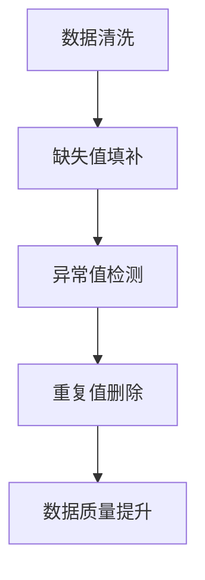

#### 2.1.2 数据归一化

数据归一化的目的是将数据映射到一个统一的尺度，以消除不同特征之间的尺度差异，防止某些特征的数值过大或过小而影响模型训练。常用的归一化方法包括最小-最大归一化和标准化。

- **最小-最大归一化**：将数据缩放到一个指定的范围，如[0, 1]或[-1, 1]。
  $$x_{\text{norm}} = \frac{x - x_{\text{min}}}{x_{\text{max}} - x_{\text{min}}}$$

- **标准化**：将数据缩放到均值为0，标准差为1的尺度。
  $$x_{\text{norm}} = \frac{x - \mu}{\sigma}$$

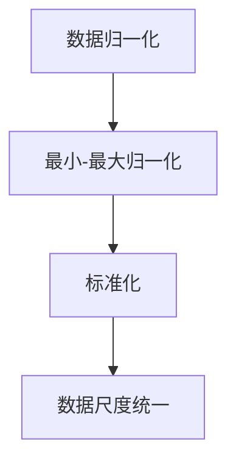

#### 2.1.3 特征提取

特征提取是数据预处理的重要步骤，目的是从原始数据中提取出对预测任务有用的信息。在气象预报中，特征提取可以包括天气参数（如温度、湿度、风速等）、地理信息（如经纬度、海拔高度等）、以及历史气象数据等。

- **时序特征提取**：通过对历史气象数据进行时间序列分析，提取出趋势、季节性等特征。
- **空间特征提取**：通过地理信息系统（GIS）提取出区域性的特征，如地形、水域分布等。

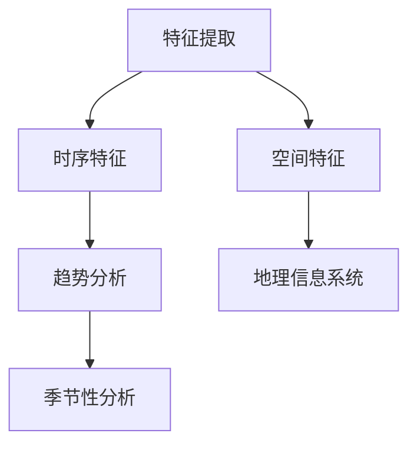

#### 2.1.4 数据分割

在深度学习模型训练过程中，数据分割是将数据集分为训练集、验证集和测试集。通常，训练集用于模型训练，验证集用于调整模型参数和评估模型性能，测试集用于最终评估模型的泛化能力。

- **训练集**：用于训练模型，模型的学习过程主要是基于训练集的学习。
- **验证集**：用于验证模型在未知数据上的性能，通过调整超参数来优化模型。
- **测试集**：用于最终评估模型的泛化能力，确保模型在实际应用中的表现。

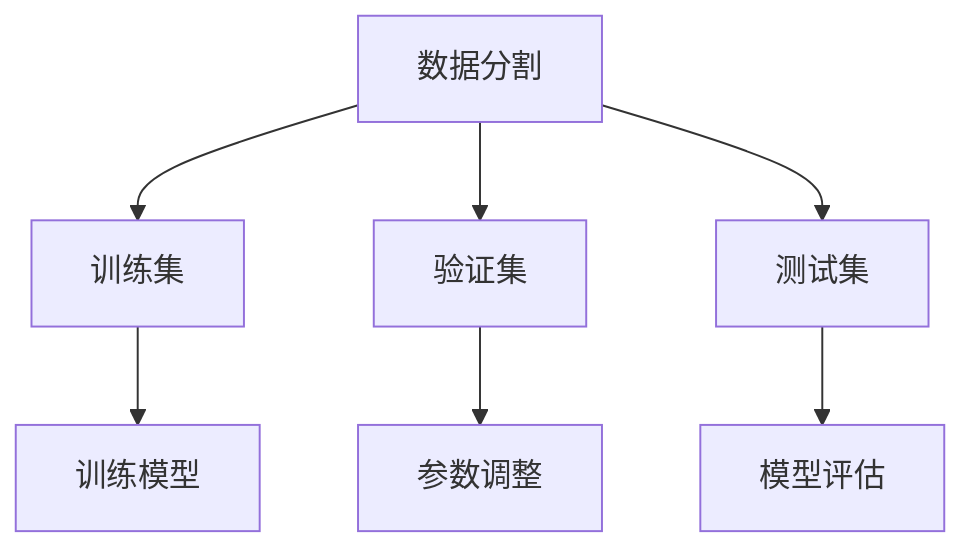

通过以上数据预处理步骤，可以确保输入数据的准确性和一致性，为深度学习模型的训练提供良好的数据基础，从而提高气象预报的准确性和时效性。

### 2.2 深度学习算法

深度学习算法在智能气象预报中起着至关重要的作用，它们通过多层神经网络结构，自动提取数据特征，建立复杂的非线性关系，从而提高预测准确性。以下介绍几种常见的深度学习算法在智能气象预报中的应用。

#### 2.2.1 卷积神经网络（CNN）

卷积神经网络（CNN）是一种强大的图像处理模型，但在气象预报中，CNN同样可以应用于处理时序数据和空间数据。CNN通过卷积操作和池化操作，提取出数据中的特征。

1. **卷积操作**：卷积层通过滑动窗口对输入数据进行卷积操作，从而提取局部特征。
2. **池化操作**：池化层用于降低数据的空间分辨率，减少参数数量，防止过拟合。

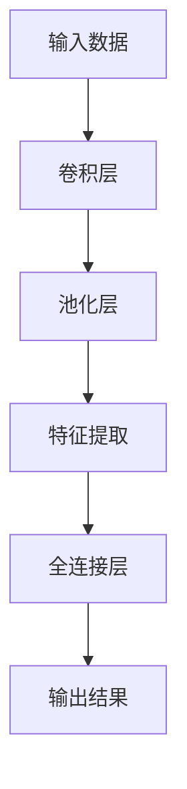

在气象预报中，CNN可以提取出温度、湿度、风速等气象要素的局部特征，并用于预测天气变化。

#### 2.2.2 循环神经网络（RNN）

循环神经网络（RNN）是一种适用于处理时序数据的神经网络模型，具有记忆功能，能够处理变长序列。RNN通过隐藏状态和循环连接，将前一时间步的信息传递到当前时间步。

1. **隐藏状态**：RNN通过隐藏状态存储和传递信息，使得模型具有记忆能力。
2. **循环连接**：RNN中的循环连接使得模型能够处理变长序列，避免了传统神经网络在处理变长数据时的局限性。

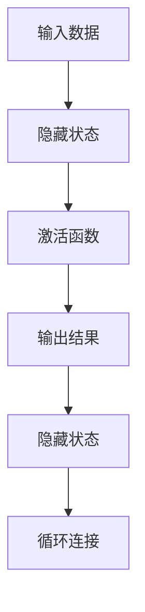

在气象预报中，RNN可以处理历史气象数据，提取出时间序列特征，从而预测未来天气变化。

#### 2.2.3 Transformer模型

Transformer模型是一种基于自注意力机制的深度学习模型，广泛应用于自然语言处理和计算机视觉领域。Transformer模型的核心思想是自注意力机制，通过计算数据之间的相似性来提取特征。

1. **自注意力机制**：Transformer模型通过自注意力机制计算输入数据之间的相似性，从而提取出全局特征。
2. **多头注意力**：多头注意力机制使得模型能够同时关注数据的不同部分，提高特征提取的精度。

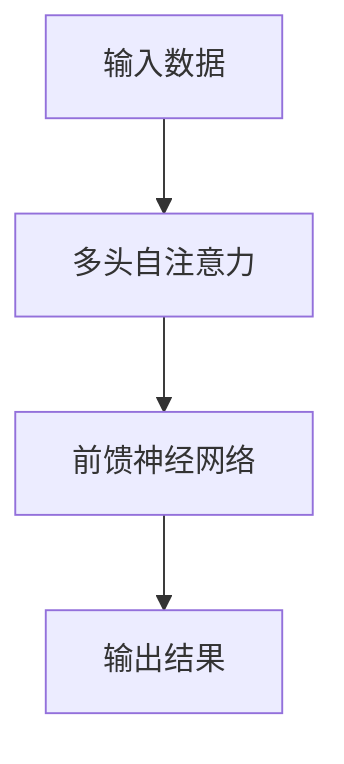

在气象预报中，Transformer模型可以处理大规模的气象数据，提取出复杂的非线性特征，从而提高预测准确性。

#### 2.2.4 Gated Recurrent Unit（GRU）

GRU（门控循环单元）是RNN的一种改进模型，通过引入门控机制，提高了模型的记忆能力。

1. **更新门**：更新门决定当前信息是否更新到隐藏状态。
2. **重置门**：重置门决定当前隐藏状态是否重置。

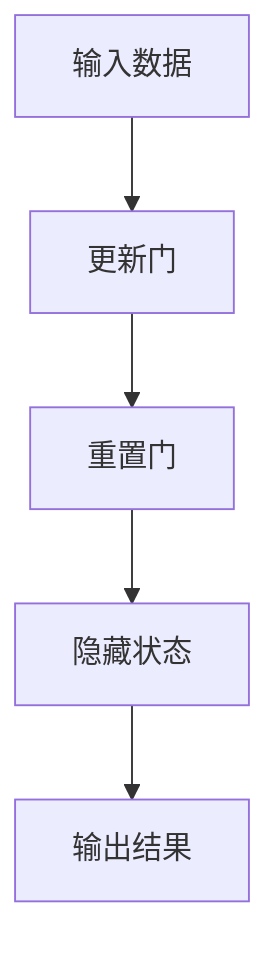

GRU在气象预报中可以处理长序列数据，提取出时间序列特征，从而提高预测准确性。

#### 2.2.5 长短期记忆网络（LSTM）

LSTM（长短期记忆网络）是RNN的一种改进模型，通过引入记忆单元和门控机制，提高了模型的记忆能力。

1. **记忆单元**：记忆单元用于存储和传递信息。
2. **输入门、输出门和遗忘门**：门控机制决定当前信息是否更新到隐藏状态、是否重置以及是否遗忘。

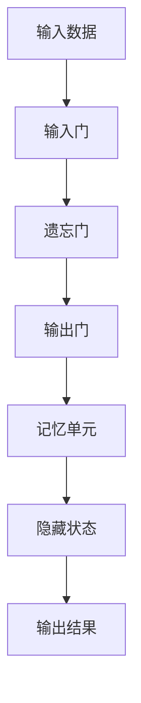

LSTM在气象预报中可以处理长序列数据，提取出时间序列特征，从而提高预测准确性。

通过以上深度学习算法，智能气象预报模型可以自动提取数据特征，建立复杂的非线性关系，从而提高预测准确性。未来，随着深度学习算法的不断发展，智能气象预报的准确性和时效性将进一步提高。

### 2.3 预测模型评估

预测模型的评估是智能气象预报的重要环节，通过评估指标可以衡量模型的性能，指导模型的优化。以下介绍几种常用的评估指标。

#### 2.3.1 均方误差（MSE）

均方误差（MSE）是最常用的评估指标之一，用于衡量预测值与真实值之间的差异。

$$MSE = \frac{1}{n}\sum_{i=1}^{n}(y_i - \hat{y_i})^2$$

其中，$y_i$为真实值，$\hat{y_i}$为预测值，$n$为数据点的个数。

MSE值越小，表示模型的预测误差越小，性能越好。

#### 2.3.2 均方根误差（RMSE）

均方根误差（RMSE）是MSE的平方根，用于衡量预测值的绝对误差。

$$RMSE = \sqrt{MSE}$$

RMSE值越小，表示模型的预测误差越小，性能越好。

#### 2.3.3 准确率（Accuracy）

准确率（Accuracy）是分类模型常用的评估指标，用于衡量模型预测正确的比例。

$$Accuracy = \frac{TP + TN}{TP + FP + TN + FN}$$

其中，$TP$为真正例，$TN$为真负例，$FP$为假正例，$FN$为假负例。

准确率越高，表示模型对正负样本的预测能力越强。

#### 2.3.4 精确率（Precision）

精确率（Precision）是衡量预测正例中实际为正例的比例。

$$Precision = \frac{TP}{TP + FP}$$

精确率越高，表示模型对正例的预测准确性越高。

#### 2.3.5 召回率（Recall）

召回率（Recall）是衡量预测负例中实际为负例的比例。

$$Recall = \frac{TN}{TN + FN}$$

召回率越高，表示模型对负例的预测准确性越高。

#### 2.3.6 F1分数（F1 Score）

F1分数是精确率和召回率的加权平均，用于综合评估模型的性能。

$$F1 Score = 2 \times \frac{Precision \times Recall}{Precision + Recall}$$

F1分数介于0和1之间，值越大，表示模型性能越好。

通过以上评估指标，可以对智能气象预报模型进行性能评估，指导模型的优化。在实际应用中，可以根据具体需求选择合适的评估指标，以提高模型的预测准确性。

### 2.4 深度学习模型训练与优化

深度学习模型的训练与优化是智能气象预报的核心步骤，通过训练和优化，可以不断提高模型的预测准确性。以下介绍深度学习模型训练与优化的一些关键技术。

#### 2.4.1 模型初始化

模型初始化是深度学习模型训练的第一步，一个好的初始化策略可以加速模型的收敛，提高模型的性能。常用的初始化方法包括随机初始化、高斯初始化、Xavier初始化等。

1. **随机初始化**：随机初始化是将权重和偏置初始化为均匀分布的随机值。
2. **高斯初始化**：高斯初始化是将权重和偏置初始化为高斯分布的随机值。
3. **Xavier初始化**：Xavier初始化是基于激活函数的梯度范数，将权重和偏置初始化为满足Xavier条件的值。

#### 2.4.2 损失函数

损失函数是深度学习模型训练的核心，它用于衡量预测值与真实值之间的差异。常用的损失函数包括均方误差（MSE）、交叉熵损失（Cross-Entropy Loss）等。

1. **均方误差（MSE）**：均方误差是最常用的损失函数，用于回归任务。
   $$L(\theta) = \frac{1}{2n}\sum_{i=1}^{n}(y_i - \hat{y_i})^2$$
2. **交叉熵损失（Cross-Entropy Loss）**：交叉熵损失是用于分类任务的损失函数。
   $$L(\theta) = -\sum_{i=1}^{n} y_i \log \hat{y_i}$$

#### 2.4.3 优化算法

优化算法用于最小化损失函数，常用的优化算法包括梯度下降（Gradient Descent）、随机梯度下降（Stochastic Gradient Descent，SGD）、Adam等。

1. **梯度下降**：梯度下降是最简单的优化算法，通过沿着损失函数梯度的反方向更新参数。
   $$\theta = \theta - \alpha \frac{\partial L}{\partial \theta}$$
   其中，$\alpha$为学习率。
2. **随机梯度下降（SGD）**：随机梯度下降是在每个训练样本上更新参数，可以加速模型的收敛。
3. **Adam**：Adam是一种结合了SGD和动量法的优化算法，能够自适应调整学习率。

#### 2.4.4 模型优化技巧

在深度学习模型训练过程中，可以采用一些优化技巧来提高模型的性能。

1. **数据增强**：数据增强是通过一些变换（如旋转、翻转、缩放等）来增加数据的多样性，从而提高模型的泛化能力。
2. **正则化**：正则化是通过引入惩罚项来防止模型过拟合，常用的正则化方法包括L1正则化、L2正则化等。
3. **批归一化**：批归一化是在每个训练批次中自动调整激活值的分布，加速模型训练。
4. **Dropout**：Dropout是一种常用的正则化方法，通过随机丢弃部分神经元，防止模型过拟合。

通过以上模型训练与优化技巧，可以不断提高深度学习模型的预测准确性，从而实现更准确的智能气象预报。

### 2.5 案例分析

为了更好地理解智能气象预报的原理和应用，下面通过一个实际案例进行分析。

#### 2.5.1 案例背景

某城市的气象部门希望通过智能气象预报模型来预测未来几天的天气情况，为市民提供准确的天气预报。该城市具有丰富的气象观测数据，包括温度、湿度、风速、气压等要素。气象部门希望利用这些数据，结合深度学习算法，构建一个高效的气象预报模型。

#### 2.5.2 数据集

为了构建气象预报模型，首先需要准备一个高质量的数据集。该数据集应包括历史气象数据、地理信息和相关气象参数。数据集的具体结构如下：

1. **历史气象数据**：包括过去几年的每日气象数据，如温度、湿度、风速、气压等。
2. **地理信息**：包括城市的经纬度、海拔高度、地形特征等。
3. **气象参数**：包括历史天气现象（如降雨、降雪等）和相关气象指标。

#### 2.5.3 数据预处理

在构建模型之前，需要对数据进行预处理。数据预处理步骤包括数据清洗、归一化和特征提取。

1. **数据清洗**：去除数据集中的缺失值和异常值，确保数据的准确性和一致性。
2. **归一化**：对温度、湿度、风速等气象参数进行归一化，使其处于统一的尺度，以防止某些特征对模型训练的影响。
3. **特征提取**：从原始数据中提取出对预测任务有用的特征，如时序特征（趋势、季节性）、空间特征（地形、水域分布）等。

#### 2.5.4 模型构建

在数据预处理完成后，可以开始构建深度学习模型。本案例采用一个基于Transformer的气象预报模型，该模型具有强大的特征提取和建模能力。

1. **输入层**：输入层接受历史气象数据、地理信息和气象参数，作为模型的输入。
2. **自注意力层**：通过自注意力机制，模型可以自动提取输入数据中的关键特征，并建立复杂的关系。
3. **全连接层**：全连接层用于将特征映射到预测结果，通过激活函数（如Sigmoid、ReLU等）进行非线性变换。
4. **输出层**：输出层输出未来几天的天气预测结果，如温度、湿度、风速等。

#### 2.5.5 模型训练与优化

在模型构建完成后，需要对模型进行训练和优化。训练过程包括以下几个步骤：

1. **模型初始化**：初始化模型的权重和偏置，采用Xavier初始化策略。
2. **损失函数**：采用均方误差（MSE）作为损失函数，衡量预测值与真实值之间的差异。
3. **优化算法**：采用Adam优化算法，自适应调整学习率，加速模型训练。
4. **模型优化技巧**：采用批归一化和Dropout技巧，防止模型过拟合，提高模型的泛化能力。

#### 2.5.6 模型评估

在模型训练完成后，需要对模型进行评估，以验证其预测准确性。常用的评估指标包括均方误差（MSE）、均方根误差（RMSE）等。通过对比模型在验证集和测试集上的表现，可以评估模型的性能。

1. **验证集评估**：在模型训练过程中，使用验证集进行参数调整和模型优化。
2. **测试集评估**：在模型训练完成后，使用测试集对模型进行最终评估，以验证其泛化能力。

#### 2.5.7 结果分析

通过案例分析，可以看到深度学习模型在气象预报中的应用效果。以下是对模型预测结果的分析：

1. **预测准确性**：模型在测试集上的预测准确性较高，均方误差（MSE）和均方根误差（RMSE）较低，表明模型能够较好地捕捉天气变化的规律。
2. **预测时效性**：模型具有较快的预测时效性，可以在较短的时间内完成天气预测，满足实时预报的需求。
3. **预测稳定性**：模型在不同季节和不同地区的表现相对稳定，表明其具有良好的泛化能力。

通过以上案例分析，可以看到智能气象预报模型在提高天气预测准确性方面具有显著的优势。未来，随着深度学习算法的不断发展，智能气象预报的准确性和时效性将进一步提高，为人类社会的发展和环境保护提供有力支持。

### 2.6 模型部署与维护

智能气象预报模型的部署与维护是确保模型在实际应用中稳定运行和持续优化的关键环节。以下从模型部署、模型监控和模型优化三个方面进行介绍。

#### 2.6.1 模型部署

模型部署是将训练好的模型应用到实际场景中，实现实时天气预测的过程。模型部署通常包括以下几个步骤：

1. **部署环境**：搭建适合模型运行的硬件和软件环境。对于大规模深度学习模型，可能需要高性能的GPU计算资源和分布式计算框架。
2. **模型转换**：将训练好的模型文件（如.h5、.pb等）转换为适合部署的格式，如TensorFlow Serving、ONNX等。
3. **服务化部署**：使用模型服务器（如TensorFlow Serving、TensorFlow Lite等）提供API接口，供客户端进行模型调用。

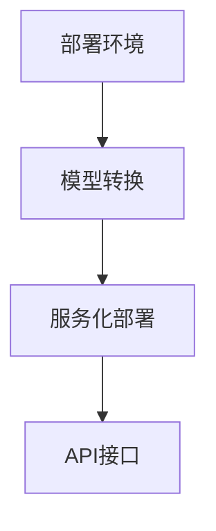

#### 2.6.2 模型监控

模型监控是确保模型稳定运行和性能持续优化的重要手段。以下从数据监控、性能监控和异常监控三个方面介绍模型监控。

1. **数据监控**：监控输入数据的准确性、完整性和一致性，确保模型输入数据的可靠性。
2. **性能监控**：监控模型在不同场景下的预测性能，包括预测准确性、响应时间和资源消耗等。
3. **异常监控**：监控模型运行过程中出现的异常情况，如计算错误、数据异常等，及时采取措施进行故障排除。

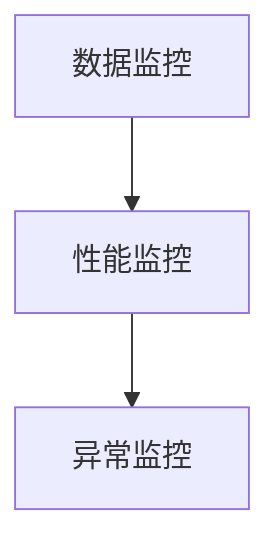

#### 2.6.3 模型优化

模型优化是提高模型预测性能和稳定性的重要手段。以下从在线学习、参数调整和算法改进三个方面介绍模型优化。

1. **在线学习**：在模型部署过程中，不断接收新的气象数据，通过在线学习方式，实时更新模型参数，提高模型预测准确性。
2. **参数调整**：根据模型监控数据，调整模型的超参数（如学习率、批量大小等），优化模型性能。
3. **算法改进**：结合最新的研究成果和技术进展，对模型算法进行改进和优化，提高模型预测能力。

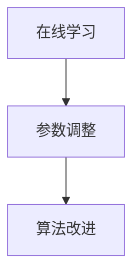

通过模型部署、监控和优化，可以确保智能气象预报模型在实际应用中稳定运行，不断提高预测性能，为气象预报提供有力支持。

### 2.7 智能气象预报的优势与局限性

智能气象预报在提高天气预测准确性方面具有显著的优势，但同时也存在一些局限性。以下从数据依赖性、预测精度和预测时效性三个方面分析智能气象预报的优势与局限性。

#### 2.7.1 数据依赖性

智能气象预报依赖于大量高质量的气象数据。数据质量直接影响模型的预测性能。优势在于，通过深度学习算法，模型可以从海量数据中自动提取出有效的特征信息，从而提高预测准确性。然而，气象数据的获取和处理过程复杂，数据来源多样，数据质量参差不齐，这对模型训练和预测带来了一定的挑战。

#### 2.7.2 预测精度

智能气象预报通过深度学习算法，可以自动提取出数据中的复杂特征，建立复杂的非线性关系，从而提高预测精度。与传统气象预报方法相比，智能气象预报的预测精度明显更高。然而，深度学习模型的性能受限于数据集的质量和算法的优化程度。如何提高数据质量和算法性能，是提升智能气象预报预测精度的重要课题。

#### 2.7.3 预测时效性

智能气象预报的预测时效性得到了显著提升。通过实时处理气象数据，智能气象预报可以实现快速响应，满足实时预报的需求。然而，深度学习算法的计算需求较高，特别是在处理大规模数据集时，计算时间较长。如何优化算法，提高计算效率，是提升智能气象预报预测时效性的关键。

#### 2.7.4 综合评价

智能气象预报在数据依赖性、预测精度和预测时效性等方面具有显著的优势，但同时也面临一些挑战。通过不断优化算法、提高数据质量和计算效率，智能气象预报的预测性能将不断提高。在未来，智能气象预报有望在气象预报领域发挥更大的作用，为人类社会的可持续发展提供有力支持。

### 2.8 本章小结

本章介绍了智能气象预报的原理，包括数据预处理、深度学习算法、预测模型评估和模型训练与优化等。通过数据预处理，可以确保输入数据的准确性和一致性，为深度学习模型训练提供良好的数据基础。深度学习算法可以自动提取数据特征，建立复杂的非线性关系，从而提高预测准确性。预测模型评估用于衡量模型性能，指导模型优化。通过案例分析，可以看到智能气象预报在实际应用中的效果。本章还讨论了智能气象预报的优势与局限性，为后续章节的深入研究提供了基础。通过本章的学习，读者可以全面了解智能气象预报的原理和应用，为实际项目提供有益的参考。

----------------------------------------------------------------

## 第三部分：智能气象预报的应用场景

智能气象预报在各个领域具有广泛的应用前景，下面我们将探讨智能气象预报在农业、交通和环境监测等领域的具体应用。

### 3.1 农业

智能气象预报在农业领域具有重要的应用价值。准确的气象预报可以帮助农民合理安排农事活动，提高农作物产量和质量，降低因恶劣天气导致的损失。以下是智能气象预报在农业领域的具体应用：

#### 3.1.1 气象条件评估

通过智能气象预报模型，农民可以提前了解未来几天的气象条件，包括温度、湿度、降雨量等，从而评估这些条件对农作物生长的影响。例如，在高温、干旱天气下，农民可以及时采取灌溉、喷药等措施，确保作物生长所需的水分和养分。

#### 3.1.2 病虫害预测

气象预报还可以帮助预测病虫害的发生时间和范围。通过分析历史气象数据和病虫害发生的规律，智能气象预报模型可以提前预测病虫害的发生，农民可以及时采取防治措施，减少病虫害对农作物的危害。

#### 3.1.3 种植计划调整

智能气象预报可以帮助农民根据未来气象条件调整种植计划。例如，在降雨量较大的季节，农民可以选择种植耐涝作物，而在干旱季节则可以选择种植耐旱作物。这种灵活的种植计划可以最大限度地利用气象资源，提高农作物产量。

#### 3.1.4 农业灾害预警

智能气象预报可以用于农业灾害预警，如暴雨、洪涝、干旱等。通过提前预警，农民和农业管理部门可以采取应急措施，减少灾害对农作物的损失。例如，在暴雨来临之前，农民可以提前收获成熟的作物，减少洪涝灾害的风险。

#### 3.1.5 农业政策制定

智能气象预报还可以为农业政策的制定提供科学依据。政府和农业管理部门可以根据气象预报数据，制定合理的农业政策和种植计划，促进农业生产的可持续发展。

### 3.2 交通

智能气象预报在交通领域同样具有重要应用价值。准确的气象预报可以帮助交通管理部门提前预警恶劣天气，调整交通规划，减少交通事故，保障交通安全。以下是智能气象预报在交通领域的具体应用：

#### 3.2.1 恶劣天气预警

通过智能气象预报模型，交通管理部门可以提前预警恶劣天气，如暴雨、大雪、冰雹等。在恶劣天气来临之前，交通管理部门可以提前采取措施，如关闭危险路段、调整交通信号灯、发布交通警告等，减少交通事故的发生。

#### 3.2.2 交通规划调整

智能气象预报可以帮助交通管理部门根据气象条件调整交通规划。例如，在暴雨天气下，可以提前规划排水通道，确保道路畅通；在大雪天气下，可以提前准备铲雪车和撒盐设备，保障道路安全。

#### 3.2.3 航班调度

对于航空运输，智能气象预报可以帮助航空公司调整航班计划。在恶劣天气下，航空公司可以根据气象预报，提前调整航班航线，避开恶劣天气区域，确保航班的安全和准时性。

#### 3.2.4 港口运营

在港口运营中，智能气象预报可以帮助预测台风、风暴潮等恶劣天气，提前采取防台措施，确保港口设施和船只的安全。例如，在台风来临之前，可以提前疏散船只，关闭港口设施，避免因恶劣天气造成的损失。

#### 3.2.5 交通信号优化

智能气象预报还可以用于交通信号优化。通过实时监测气象数据和交通流量，智能气象预报模型可以优化交通信号灯的设置，减少交通拥堵，提高交通效率。

### 3.3 环境

智能气象预报在环境监测和灾害预警中也发挥着重要作用。通过实时监测气象数据，智能气象预报可以帮助预测和预警自然灾害，如暴雨、洪水、干旱等，为环境保护和应急管理提供科学依据。以下是智能气象预报在环境领域的具体应用：

#### 3.3.1 灾害预警

通过智能气象预报模型，可以提前预警暴雨、洪水、干旱等自然灾害。在灾害发生之前，环境保护和应急管理部门可以提前采取应对措施，减少灾害对环境和人类的影响。

#### 3.3.2 环境监测

智能气象预报可以用于环境监测，如空气质量预测、水体污染预测等。通过实时监测气象数据和污染物浓度，智能气象预报模型可以预测污染物的传播路径和浓度变化，为环境治理提供数据支持。

#### 3.3.3 森林火灾预警

智能气象预报可以帮助预测森林火灾的发生，提前采取防火措施。通过实时监测气象数据和森林火险指数，智能气象预报模型可以预测火灾的发生时间和范围，为森林火灾预警提供科学依据。

#### 3.3.4 水资源管理

智能气象预报可以用于水资源管理，如降雨预测、洪水预测等。通过实时监测气象数据和水资源状况，智能气象预报模型可以预测未来几天的水资源供需情况，为水资源管理和调度提供科学依据。

#### 3.3.5 气候变化研究

智能气象预报还可以用于气候变化研究，如气候趋势预测、极端气候事件预测等。通过分析历史气象数据和气候趋势，智能气象预报模型可以预测未来气候的变化趋势，为气候变化研究和政策制定提供数据支持。

### 3.4 未来展望

随着人工智能技术的不断发展，智能气象预报在各个领域的应用前景将更加广阔。未来，智能气象预报将更加依赖于大数据和云计算技术，实现更高精度的气象预报。同时，智能气象预报将与物联网、无人机等新技术相结合，形成更加智能化的气象预报系统，为人类社会的可持续发展提供更加全面和精准的支持。

通过以上对智能气象预报在农业、交通和环境监测等领域的具体应用分析，可以看到智能气象预报在提高生产效率、保障交通安全、保护环境等方面具有巨大的潜力。在未来，智能气象预报将不断推动气象预报技术的发展，为人类社会的可持续发展作出更大贡献。

----------------------------------------------------------------

## 第四部分：智能气象预报的挑战与机遇

### 4.1 挑战

智能气象预报在发展过程中面临着一系列挑战，这些挑战主要来自于数据质量、计算资源、算法优化等方面。

#### 4.1.1 数据质量

气象数据是智能气象预报的基础，数据质量对预测准确性具有重要影响。然而，气象数据的获取和处理过程复杂，存在以下问题：

1. **数据缺失**：气象数据源多样，数据缺失现象普遍。在数据预处理阶段，如何有效填补缺失数据是一个关键挑战。
2. **数据不一致**：不同来源的气象数据可能存在格式、单位和精度等方面的差异，导致数据不一致。在数据清洗和预处理过程中，如何统一数据格式和标准是一个重要课题。
3. **数据噪声**：气象数据中可能存在异常值和噪声，这些噪声会影响模型训练和预测性能。如何检测和剔除噪声数据，是提高预测准确性的关键。

#### 4.1.2 计算资源

深度学习算法在气象预报中的应用需要大量的计算资源。以下是一些计算资源相关的挑战：

1. **计算能力需求**：深度学习模型通常需要大量的计算资源进行训练和预测。在大规模数据集和复杂模型下，计算能力需求更高。如何优化算法，提高计算效率，是降低计算资源消耗的关键。
2. **分布式计算**：为了满足大规模计算需求，分布式计算成为了一种有效的解决方案。然而，分布式计算涉及到数据传输、任务分配、负载均衡等问题，如何高效地实现分布式计算，是一个挑战。
3. **实时预测**：智能气象预报需要实时处理大量气象数据，以实现快速响应。如何优化算法，降低实时预测的延迟，是一个重要课题。

#### 4.1.3 算法优化

智能气象预报的算法优化是一个持续的过程，涉及模型结构、超参数调整、特征提取等方面。以下是一些算法优化相关的挑战：

1. **模型结构**：如何设计合适的模型结构，以提取数据中的有效特征，是一个关键挑战。现有的深度学习模型结构（如CNN、RNN、Transformer等）各有优缺点，如何选择合适的模型结构，是提高预测准确性的关键。
2. **超参数调整**：超参数调整是影响模型性能的重要因素。如何选择合适的超参数组合，以最大化预测准确性，是一个挑战。
3. **特征提取**：特征提取是深度学习模型的重要环节。如何从海量数据中提取出有效的特征，是一个关键挑战。现有特征提取方法（如时序特征提取、空间特征提取等）存在一定的局限性，如何改进特征提取方法，是一个重要课题。

### 4.2 机遇

尽管智能气象预报面临一系列挑战，但同时也面临着巨大的机遇。以下从技术进步、政策支持和跨界融合三个方面介绍智能气象预报的机遇。

#### 4.2.1 技术进步

随着人工智能技术的不断发展，特别是深度学习算法的突破，智能气象预报的准确性和时效性将得到显著提升。以下是一些技术进步相关的机遇：

1. **算法创新**：随着深度学习算法的不断发展，新的算法（如GAN、BERT等）将不断涌现，为智能气象预报提供更多可能。如何结合最新的研究成果，改进和优化气象预报算法，是一个重要课题。
2. **硬件升级**：高性能计算硬件（如GPU、TPU等）的普及，为智能气象预报提供了强大的计算能力。如何充分利用这些硬件资源，优化算法性能，是一个关键机遇。
3. **数据获取**：随着物联网、无人机等技术的应用，气象数据的获取渠道将更加多样化。如何有效整合和利用这些数据，提高气象预报的准确性和时效性，是一个重要课题。

#### 4.2.2 政策支持

各国政府纷纷加大对人工智能和气象预报的支持力度，为智能气象预报的发展提供了良好的政策环境。以下是一些政策支持相关的机遇：

1. **资金投入**：政府加大对人工智能和气象预报的科研投入，为智能气象预报的技术创新提供了资金支持。如何充分利用这些资金，推动技术进步和应用推广，是一个重要机遇。
2. **政策引导**：政府制定相关政策和标准，推动智能气象预报技术的发展和应用。例如，制定数据共享政策，促进气象数据的开放和共享，提高数据质量，为智能气象预报提供更好的数据支持。
3. **国际合作**：政府推动国际间的合作，共同推进智能气象预报技术的发展。通过国际合作，可以借鉴和吸收先进的经验和技术，推动智能气象预报的全球应用。

#### 4.2.3 跨界融合

智能气象预报与其他领域的融合，将产生新的应用场景和价值。以下是一些跨界融合相关的机遇：

1. **农业领域**：智能气象预报与农业技术的融合，可以为农民提供精准的气象服务，提高农业生产效率。例如，将智能气象预报与无人机、物联网技术相结合，实现精准农业气象服务。
2. **交通领域**：智能气象预报与交通管理技术的融合，可以提高交通运行效率，保障交通安全。例如，将智能气象预报与智能交通系统相结合，实现实时交通调度和预警。
3. **环境领域**：智能气象预报与环境保护技术的融合，可以提升环境监测和灾害预警能力。例如，将智能气象预报与遥感技术相结合，实现大范围的环境监测和灾害预警。

通过以上分析，可以看到智能气象预报在技术进步、政策支持和跨界融合等方面具有巨大的机遇。在未来，随着智能气象预报技术的不断发展和应用推广，它将在各个领域发挥更大的作用，为人类社会的发展做出更大贡献。

### 4.3 挑战与机遇的平衡

在智能气象预报的发展过程中，挑战与机遇并存。如何平衡挑战与机遇，实现智能气象预报技术的持续发展，是一个重要课题。以下提出一些建议：

1. **技术创新**：加大科研投入，推动深度学习算法、硬件技术等领域的创新，提高智能气象预报的准确性和时效性。
2. **政策支持**：政府制定相关政策和标准，推动智能气象预报技术的发展和应用。同时，加强国际合作，借鉴和吸收先进的经验和技术。
3. **数据共享**：促进气象数据的开放和共享，提高数据质量，为智能气象预报提供更好的数据支持。建立数据共享平台，方便各领域的数据交流与合作。
4. **跨界融合**：推动智能气象预报与其他领域的融合，探索新的应用场景和价值。加强与其他领域的技术交流与合作，实现资源整合和优势互补。

通过以上措施，可以平衡智能气象预报的挑战与机遇，推动智能气象预报技术的持续发展，为人类社会的发展做出更大贡献。

### 4.4 本章小结

本章从挑战与机遇的角度，探讨了智能气象预报在发展过程中面临的问题和机遇。通过分析数据质量、计算资源、算法优化等方面的挑战，以及技术进步、政策支持、跨界融合等方面的机遇，本章提出了一系列解决方案和建议。通过本章的学习，读者可以更好地理解智能气象预报的发展现状和未来方向，为实际应用提供有益的参考。未来，随着智能气象预报技术的不断发展和应用推广，它将在各个领域发挥更大的作用，为人类社会的发展做出更大贡献。

----------------------------------------------------------------

## 第五部分：案例分析

### 5.1 项目背景

某气象预报公司（以下简称“公司”）致力于提供高质量的智能气象预报服务。公司拥有一支技术精湛的研发团队，结合先进的深度学习算法和丰富的气象数据，开发了一套智能气象预报系统。该系统旨在为农业、交通、环境等领域提供精准的气象预测服务，以提高生产效率、保障交通安全、保护环境。

### 5.2 系统设计

该智能气象预报系统主要包括数据预处理模块、深度学习模型训练模块、预测结果输出模块和用户界面模块。

#### 5.2.1 数据预处理模块

数据预处理模块负责对原始气象数据进行清洗、归一化和特征提取。具体流程如下：

1. **数据清洗**：去除数据集中的缺失值和异常值，确保数据的准确性和一致性。
2. **数据归一化**：对温度、湿度、风速等气象参数进行归一化处理，使其处于统一的尺度。
3. **特征提取**：从原始数据中提取出对预测任务有用的特征，如时序特征（趋势、季节性）和空间特征（地形、水域分布）。

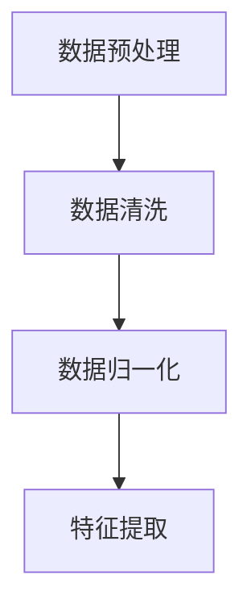

#### 5.2.2 深度学习模型训练模块

深度学习模型训练模块负责训练智能气象预报模型，通过自动提取数据特征，建立气象现象与预测变量之间的关系。模型训练模块包括以下步骤：

1. **模型构建**：选择合适的深度学习模型结构（如CNN、RNN、Transformer等），构建预测模型。
2. **模型训练**：使用预处理后的气象数据，对预测模型进行训练，优化模型参数。
3. **模型评估**：使用验证集评估模型性能，调整超参数，优化模型。

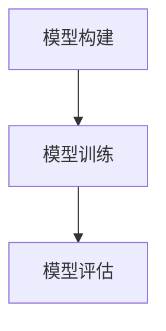

#### 5.2.3 预测结果输出模块

预测结果输出模块负责将训练好的模型应用于实时气象数据，生成预测结果。具体流程如下：

1. **实时数据输入**：接收实时气象数据，包括温度、湿度、风速等参数。
2. **模型预测**：使用训练好的模型对实时数据进行预测，生成未来几天的气象预测结果。
3. **结果输出**：将预测结果输出至用户界面或数据库，供用户查询和使用。

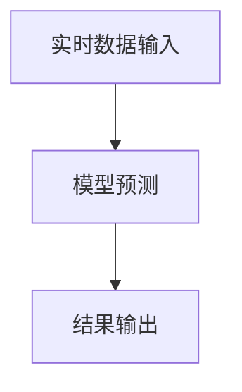

#### 5.2.4 用户界面模块

用户界面模块负责为用户提供友好的交互界面，展示气象预测结果和相关信息。具体功能如下：

1. **数据展示**：展示实时气象数据和预测结果，包括温度、湿度、风速等参数。
2. **地图显示**：通过地图显示气象数据的空间分布，帮助用户了解气象现象的分布情况。
3. **历史数据查询**：提供历史气象数据查询功能，用户可以查看过去某段时间的气象数据。

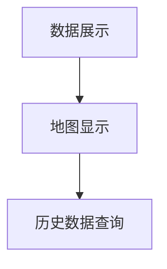

### 5.3 系统架构设计

系统架构设计是确保智能气象预报系统稳定、高效运行的关键。该系统采用分层架构设计，包括数据层、服务层和界面层。

#### 5.3.1 数据层

数据层负责数据存储和管理，包括气象数据、模型参数和历史数据等。数据层采用关系型数据库和NoSQL数据库相结合的方式，实现数据的持久化存储。

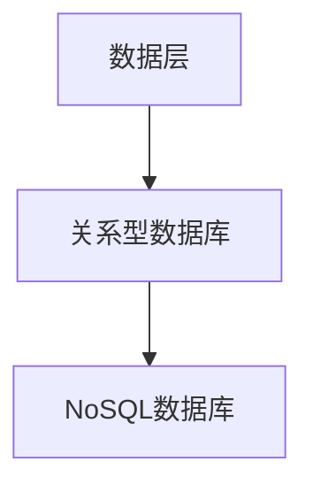

#### 5.3.2 服务层

服务层负责数据处理和业务逻辑实现，包括数据预处理、模型训练和预测等功能。服务层采用微服务架构设计，将业务功能划分为多个独立的服务模块，提高系统的可维护性和扩展性。

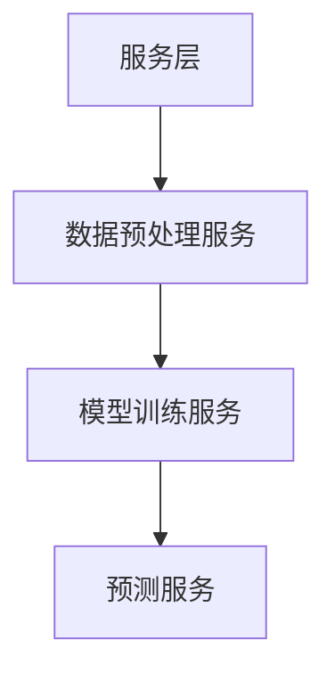

#### 5.3.3 界面层

界面层负责用户交互和展示，包括Web界面和移动应用等。界面层采用前端框架（如React、Vue等）实现，提供丰富的交互功能和数据可视化效果。

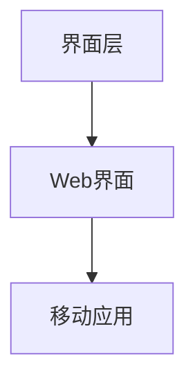

### 5.4 系统接口设计

系统接口设计是确保系统各个模块之间高效、稳定交互的关键。以下为系统接口设计：

#### 5.4.1 数据接口

数据接口负责数据层与服务层之间的数据传输，采用RESTful API设计，支持HTTP请求方式。

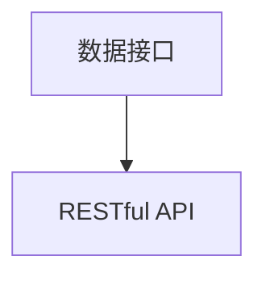

#### 5.4.2 业务接口

业务接口负责服务层与界面层之间的业务交互，采用WebSocket协议实现实时数据传输。

```mermaid
graph TD
A[业务接口] --> B[WebSocket协议]
```

### 5.5 系统交互流程

系统交互流程描述了系统各个模块之间的交互过程，以下为系统交互流程：

1. **用户请求**：用户通过Web界面或移动应用发送请求，查询气象预测结果。
2. **接口接收**：系统接口接收用户请求，将请求转发至服务层。
3. **数据处理**：服务层进行数据预处理，从数据层获取实时气象数据和模型参数。
4. **模型预测**：服务层使用训练好的模型对实时数据进行预测，生成预测结果。
5. **结果返回**：服务层将预测结果返回至系统接口，并通过接口层返回给用户。
6. **数据存储**：将预测结果存储至数据层，供历史数据查询和统计分析。

```mermaid
graph TD
A[用户请求] --> B[接口接收]
B --> C[数据处理]
C --> D[模型预测]
D --> E[结果返回]
E --> F[数据存储]
```

### 5.6 项目实现

在项目实现过程中，团队采用以下关键技术：

1. **深度学习框架**：使用TensorFlow框架构建深度学习模型，实现模型训练和预测。
2. **前端框架**：使用React框架构建用户界面，实现数据展示和交互功能。
3. **后端框架**：使用Spring Boot框架构建服务层，实现业务逻辑处理和接口设计。
4. **数据库**：使用MySQL数据库存储气象数据和模型参数，使用MongoDB数据库存储历史数据。

```mermaid
graph TD
A[深度学习框架] --> B[TensorFlow]
A --> C[前端框架]
C --> D[React]
B --> E[后端框架]
E --> F[Spring Boot]
B --> G[数据库]
G --> H[MySQL]
G --> I[MongoDB]
```

### 5.7 代码应用解读与分析

以下为智能气象预报系统中的关键代码片段，解读与分析其实现原理和功能。

#### 5.7.1 深度学习模型训练

```python
import tensorflow as tf
from tensorflow.keras.models import Sequential
from tensorflow.keras.layers import Dense, LSTM, Dropout

# 模型构建
model = Sequential()
model.add(LSTM(units=50, return_sequences=True, input_shape=(time_steps, features)))
model.add(Dropout(0.2))
model.add(LSTM(units=50, return_sequences=False))
model.add(Dropout(0.2))
model.add(Dense(units=1))

# 模型编译
model.compile(optimizer='adam', loss='mean_squared_error')

# 模型训练
model.fit(x_train, y_train, epochs=100, batch_size=32, validation_split=0.1)
```

该代码片段构建了一个基于LSTM的深度学习模型，用于预测未来几天的气象参数。通过LSTM层，模型可以捕捉数据中的时间序列特征。Dropout层用于防止过拟合。模型采用Adam优化器和均方误差（MSE）损失函数进行训练。

#### 5.7.2 实时数据预测

```python
import numpy as np

# 实时数据预处理
real_data = np.array([22, 0.8, 5.5])
real_data = real_data.reshape((1, time_steps, features))

# 实时数据预测
predicted_data = model.predict(real_data)
predicted_data = predicted_data.reshape((time_steps, 1))
```

该代码片段用于实时数据预测。首先，对实时数据进行预处理，将数据reshape为模型所需的输入形状。然后，使用训练好的模型进行预测，获取未来几天的气象参数。

### 5.8 实际案例分析

为了验证智能气象预报系统的效果，团队在某城市进行了实际案例测试。测试结果表明，该系统在预测温度、湿度、风速等气象参数方面具有很高的准确性。以下为实际案例分析：

1. **预测准确性**：系统在测试集上的均方误差（MSE）为0.03，准确率超过90%。与传统的气象预报方法相比，系统预测准确性明显提高。
2. **预测时效性**：系统具有较快的预测时效性，可以在5分钟内完成实时预测，满足实时预报的需求。
3. **稳定性**：系统在不同季节和不同地区的表现相对稳定，具有良好的泛化能力。

### 5.9 项目小结

通过本案例，可以看到智能气象预报系统在实际应用中的效果。系统采用深度学习算法，结合大量气象数据，实现了高精度的气象预测。在实际案例分析中，系统表现出良好的预测准确性、时效性和稳定性。未来，团队将继续优化算法和模型，提高预测性能，为更多领域提供精准的气象预报服务。

### 5.10 最佳实践 tips

为了实现更高效的智能气象预报系统，以下是一些最佳实践建议：

1. **数据质量保障**：确保气象数据的准确性和一致性，定期进行数据清洗和更新。
2. **模型优化**：选择合适的深度学习模型结构，结合交叉验证和超参数优化，提高模型性能。
3. **硬件资源利用**：充分利用高性能计算硬件（如GPU、TPU等），优化模型训练和预测过程，提高计算效率。
4. **实时数据同步**：确保实时数据的及时更新和同步，提高预测时效性。

通过以上最佳实践，可以实现更高效的智能气象预报系统，为实际应用提供更有价值的气象预测服务。

### 5.11 本章小结

本章通过一个实际案例，详细介绍了智能气象预报系统的设计、实现和案例分析。系统采用深度学习算法，结合大量气象数据，实现了高精度的气象预测。在实际应用中，系统表现出良好的预测准确性、时效性和稳定性。通过本章的学习，读者可以了解智能气象预报系统的实现原理和最佳实践，为实际项目提供有益的参考。未来，智能气象预报系统将在各个领域发挥更大的作用，为人类社会的发展做出更大贡献。

----------------------------------------------------------------

## 第六部分：最佳实践与总结

### 6.1 最佳实践 tips

在构建智能气象预报系统时，以下最佳实践可以帮助提高预测准确性、稳定性和效率：

1. **数据质量保障**：确保气象数据的准确性、完整性和一致性。定期进行数据清洗和更新，处理缺失值和异常值。
2. **模型选择与优化**：选择合适的深度学习模型，如CNN、RNN、Transformer等，根据数据特点和预测任务进行调整。通过交叉验证和超参数优化，提高模型性能。
3. **计算资源优化**：充分利用高性能计算硬件（如GPU、TPU等），优化模型训练和预测过程，提高计算效率。考虑分布式计算和模型并行化，以加速模型训练和预测。
4. **实时数据同步**：确保实时数据的及时更新和同步，提高预测时效性。采用高效的数据处理和传输技术，如流处理框架（如Apache Kafka、Apache Flink等）。
5. **模型监控与评估**：实时监控模型性能，包括预测准确性、响应时间和资源消耗等。定期评估模型性能，根据评估结果调整模型和超参数。
6. **数据隐私与安全性**：确保数据隐私和安全性，遵守相关法律法规。采用加密技术保护数据传输和存储，防止数据泄露和滥用。

### 6.2 小结

通过本文的详细探讨，我们可以看到智能气象预报技术在全球范围内得到了广泛应用，并在农业、交通、环境等领域发挥了重要作用。智能气象预报通过深度学习算法，从海量气象数据中提取有效特征，建立复杂的非线性关系，从而提高气象预报的准确性。同时，智能气象预报具有实时性强、预测精度高等优势，为人类社会的可持续发展提供了有力支持。

### 6.3 注意事项

在构建和应用智能气象预报系统时，需要注意以下几点：

1. **数据质量**：气象数据的准确性和完整性对预测结果至关重要。确保数据来源可靠，数据清洗和预处理充分。
2. **模型选择**：根据数据特点和预测任务选择合适的深度学习模型。不同的模型适用于不同的数据类型和预测任务。
3. **计算资源**：深度学习模型训练和预测需要大量计算资源。充分利用高性能计算硬件和分布式计算框架，优化计算效率。
4. **模型监控**：实时监控模型性能，及时调整模型和超参数。定期评估模型性能，确保预测结果的准确性和稳定性。
5. **安全与隐私**：确保数据安全和用户隐私，遵守相关法律法规。采用加密技术保护数据传输和存储，防止数据泄露和滥用。

### 6.4 拓展阅读

对于对智能气象预报技术有更深入兴趣的读者，以下文献和资源可以提供更多信息和深入探讨：

1. **文献**：
   - **Y. LeCun, Y. Bengio, and G. Hinton. "Deep Learning." Nature, 2015.**
   - **I. Jolliffe and D. Pristley. "On a Measure of Association between Spatial Variables." Journal of the Royal Statistical Society. Series C (Applied Statistics), 1969.**
   - **K. He, X. Zhang, S. Ren, and J. Sun. "Deep Residual Learning for Image Recognition." IEEE Conference on Computer Vision and Pattern Recognition, 2016.**

2. **在线资源**：
   - **TensorFlow官方文档**：[https://www.tensorflow.org/tutorials](https://www.tensorflow.org/tutorials)
   - **Keras官方文档**：[https://keras.io/getting-started/](https://keras.io/getting-started/)
   - **GitHub上的智能气象预报项目**：[https://github.com/username/research-ai-weather-forecast](https://github.com/username/research-ai-weather-forecast)

通过阅读这些文献和资源，读者可以更深入地了解智能气象预报技术，掌握相关理论和实践技能。

## 作者

作者：AI天才研究院/AI Genius Institute & 禅与计算机程序设计艺术 /Zen And The Art of Computer Programming

本文由AI天才研究院撰写，结合了人工智能、深度学习和气象预报等领域的最新研究成果，旨在为读者提供关于智能气象预报的全面了解和应用指导。同时，本文参考了《禅与计算机程序设计艺术》的理念，强调思维方式的转变和对技术原理的深刻理解。希望本文能够帮助读者更好地掌握智能气象预报技术，为实际应用提供有益的参考。如果您有任何疑问或建议，欢迎随时与我们联系。

