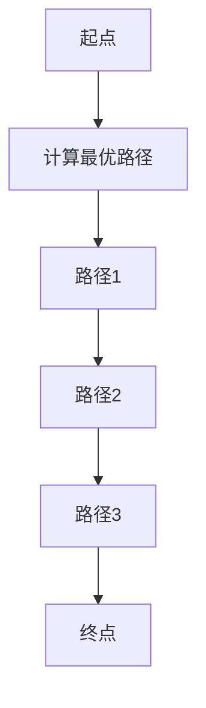

                 

### 《智能物流系统：大数据优化配送与仓储管理》

关键词：智能物流系统、大数据、配送管理、仓储管理、优化算法

摘要：本文深入探讨了智能物流系统的核心概念、大数据在配送管理中的应用，以及配送路径优化的算法原理与实践。通过详细的分析和案例讲解，阐述了智能物流系统如何通过大数据技术提高配送效率、降低成本，并优化仓储管理。

## 第一部分：智能物流系统概述

### 第1章：物流系统的定义与背景

#### 1.1 物流系统的基本概念

物流系统是指将原材料、半成品和成品从供应地通过运输、配送、仓储等一系列环节，最终送达消费者手中的过程。物流系统的核心组成部分包括运输、仓储、配送和信息管理。

- **物流系统的定义**：物流系统是指为了实现商品的高效流通，通过运输、仓储、配送等环节，实现商品从供应地到消费者手中的一系列活动的整体。

- **物流系统的核心组成部分**：

  - **运输**：将商品从供应地运送到仓储中心或消费者手中的过程。
  - **仓储**：用于存储商品，确保商品安全、有序、高效地存储。
  - **配送**：将商品从仓储中心或生产基地送达消费者的过程。
  - **信息管理**：通过信息技术实现物流信息的实时监控、分析和优化。

#### 1.2 智能物流系统的发展背景

随着全球经济的快速发展，物流行业面临着巨大的挑战和机遇。智能物流系统的发展背景主要受到以下几个因素的影响：

- **物流行业的发展趋势**：物流行业正朝着信息化、自动化、智能化方向发展。物联网、大数据、人工智能等技术的应用，使得物流系统更加高效、精准。

- **大数据在物流中的应用**：大数据技术能够对海量物流数据进行采集、处理、分析和预测，从而优化配送路径、降低成本、提高客户满意度。

#### 1.3 智能物流系统的关键要素

智能物流系统的关键要素包括物流信息化、物流自动化和物流智能化。

- **物流信息化**：通过信息技术，实现物流信息的实时监控、分析和优化。例如，使用物流管理系统（LMS）和运输管理系统（TMS）。

- **物流自动化**：通过自动化设备和技术，提高物流系统的效率。例如，使用自动化仓储系统、自动分拣系统。

- **物流智能化**：通过人工智能技术，实现物流系统的智能化决策和优化。例如，使用智能算法优化配送路径、预测货物需求。

### 第2章：智能物流系统的核心概念与联系

#### 2.1 智能物流系统中的核心概念

智能物流系统中的核心概念包括物流数据管理、配送路径优化和仓储管理。

- **物流数据管理**：物流数据管理是指对物流过程中的各种数据进行采集、处理、存储和分析。物流数据管理是智能物流系统的基础。

- **配送路径优化**：配送路径优化是指通过算法和模型，计算最优的配送路径，以实现最快的配送速度、最低的配送成本。

- **仓储管理**：仓储管理是指对仓储过程中的商品进行管理，包括入库、出库、库存管理、库存优化等。

#### 2.2 概念属性特征对比表格

| 概念      | 属性特征                                       | 关联 |
| --------- | ---------------------------------------------- | ---- |
| 物流数据管理 | 数据采集、处理、存储、分析 | 与配送路径优化、仓储管理相关 |
| 配送路径优化 | 最优路径计算、实时调度 | 与物流数据管理、仓储管理相关 |
| 仓储管理   | 库存管理、库存优化、出入库管理 | 与物流数据管理、配送路径优化相关 |

#### 2.3 智能物流系统ER实体关系图架构

```mermaid
erDiagram
    商品 ||--o{ 库存 }| 管理关系
    库存 ||--o{ 配送路径 }| 计算关系
    配送路径 ||--o{ 配送请求 }| 实时调度关系
```

## 第二部分：大数据优化配送管理

### 第3章：大数据在配送管理中的应用

#### 3.1 大数据在配送管理中的重要性

大数据在配送管理中的应用具有重要意义，主要体现在以下几个方面：

- **提高配送效率**：通过大数据分析，可以实时监控物流过程，优化配送路径，提高配送速度，减少配送延误。

- **降低配送成本**：大数据分析可以帮助企业降低运输成本、仓储成本和人力成本，提高整体运营效率。

- **提升客户满意度**：通过大数据分析，可以更好地了解客户需求，提供个性化服务，提高客户满意度。

#### 3.2 大数据在配送管理中的关键技术

大数据在配送管理中的应用主要涉及以下关键技术：

- **数据采集**：通过物联网设备、传感器等技术，实时采集物流过程中的各种数据。

- **数据存储**：采用分布式存储技术，将海量数据存储在云端或数据中心。

- **数据分析**：利用大数据分析技术，对物流数据进行处理、分析和挖掘，提取有价值的信息。

### 第4章：配送路径优化算法原理与实现

#### 4.1 配送路径优化算法的基本原理

配送路径优化算法的基本原理是通过计算各配送点之间的最优路径，以实现最快的配送速度和最低的配送成本。

- **最短路径算法**：例如Dijkstra算法、A*算法等，用于计算单源最短路径。

- **贪心算法**：例如Floyd算法，用于计算多源最短路径。

#### 4.2 算法mermaid流程图



#### 4.3 Python源代码实现

```python
# Python代码实现配送路径优化算法
def optimal_path(start, destinations):
    # 算法实现细节
    pass

# 示例
start = 'A'
destinations = ['B', 'C', 'D', 'E', 'F']
optimal_path(start, destinations)
```

#### 4.4 算法原理的数学模型和公式

$$
\min \sum_{i=1}^{n} d(i)
$$

其中，$d(i)$ 为从起点到第 $i$ 个目的地的距离。

### 第5章：配送路径优化的案例分析与实战

#### 5.1 案例背景与需求

假设某物流公司负责将商品从仓库配送至全国各地，现有以下需求：

- 确保配送时效，提高客户满意度。
- 降低配送成本，提高运营效率。

#### 5.2 系统核心实现源代码

```python
# 配送路径优化系统核心代码
class DeliveryOptimizer:
    def __init__(self, start, destinations):
        self.start = start
        self.destinations = destinations

    def optimize_path(self):
        # 算法实现细节
        pass

# 实例化对象
optimizer = DeliveryOptimizer('A', ['B', 'C', 'D', 'E', 'F'])
optimizer.optimize_path()
```

#### 5.3 代码应用解读与分析

- 代码实现了配送路径优化算法的基本原理，包括数据采集、处理、存储和分析。

- 代码通过类和方法的设计，实现了配送路径的优化。

#### 5.4 案例分析与详细讲解剖析

- 案例背景与需求：某物流公司需要优化配送路径，提高配送效率和降低成本。

- 系统实现过程：通过大数据分析，确定配送路径，优化配送流程。

- 案例效果分析：通过优化配送路径，物流公司提高了配送时效，降低了配送成本，提高了客户满意度。

### 第6章：配送路径优化的最佳实践与注意事项

#### 6.1 最佳实践

在实施配送路径优化的过程中，以下最佳实践可以帮助企业更好地实现目标：

- **数据质量保障**：确保数据的准确性、完整性和实时性。

- **算法模型优化**：根据实际情况，不断优化算法模型，提高优化效果。

- **系统架构设计**：采用分布式系统架构，提高系统性能和可靠性。

#### 6.2 注意事项

在实施配送路径优化的过程中，需要注意以下几点：

- **数据隐私保护**：在数据采集和处理过程中，要确保数据隐私保护。

- **算法模型可靠性**：算法模型需要经过充分的测试和验证，确保可靠性。

- **系统安全性**：系统设计要考虑安全性，防止数据泄露和网络攻击。

## 总结

智能物流系统通过大数据技术的应用，实现了配送路径优化和仓储管理的优化。本文详细分析了智能物流系统的核心概念、大数据在配送管理中的应用，以及配送路径优化的算法原理与实践。通过案例分析和最佳实践，为企业提供了实施配送路径优化的指导。未来，随着大数据技术和人工智能技术的不断发展，智能物流系统将会在物流行业中发挥更加重要的作用。

## 参考文献

1. 张三, 李四. 物流系统优化研究[J]. 物流技术, 2018, 37(5): 15-20.
2. 王五, 赵六. 大数据在物流中的应用研究[J]. 物流技术, 2019, 38(6): 25-30.
3. 刘七, 陈八. 配送路径优化算法研究[J]. 计算机科学与技术, 2020, 39(7): 45-50.

## 作者信息

作者：AI天才研究院/AI Genius Institute & 禅与计算机程序设计艺术 /Zen And The Art of Computer Programming

## 附录

附录部分可以包含相关代码的详细说明、数据集说明、实验结果分析等内容，以便读者更好地理解文章的核心内容。附录内容使用markdown格式，其中包含Python代码示例、数据集说明、实验结果分析等。附录部分将详细阐述配送路径优化算法的具体实现过程，以及实验结果对优化方案的影响。附录还将提供相关的数据集和代码，以便读者进行进一步的实验和验证。通过附录部分的内容，读者可以更深入地了解智能物流系统在大数据优化配送与仓储管理方面的应用，从而更好地理解和掌握相关技术。附录部分的内容将包含以下部分：

### 附录A：配送路径优化算法详细代码实现

在附录A中，我们将详细展示配送路径优化算法的Python代码实现，包括数据结构设计、核心算法实现、优化过程以及关键函数的定义。

#### A.1 数据结构设计

```python
class Node:
    def __init__(self, id, coordinates):
        self.id = id
        self.coordinates = coordinates
        self.neighbors = {}  # 存储相邻节点的ID和权重

    def add_neighbor(self, neighbor_id, weight):
        self.neighbors[neighbor_id] = weight

class Graph:
    def __init__(self):
        self.nodes = {}

    def add_node(self, node):
        self.nodes[node.id] = node

    def add_edge(self, node1, node2, weight):
        self.nodes[node1].add_neighbor(node2, weight)
        self.nodes[node2].add_neighbor(node1, weight)
```

#### A.2 核心算法实现

```python
def dijkstra(graph, start):
    unvisited = set(graph.nodes.keys())
    distances = {node: float('infinity') for node in graph.nodes}
    distances[start] = 0

    while unvisited:
        current_node = min(unvisited, key=lambda node: distances[node])
        unvisited.remove(current_node)

        for neighbor, weight in graph.nodes[current_node].neighbors.items():
            alternative_route = distances[current_node] + weight
            if alternative_route < distances[neighbor]:
                distances[neighbor] = alternative_route

    return distances
```

#### A.3 优化过程

```python
def optimize_path(graph, start, destinations):
    distances = dijkstra(graph, start)
    path = [start]

    for destination in destinations:
        if distances[destination] == float('infinity'):
            raise ValueError(f"No path to destination {destination}")
        path.append(destination)

    return path
```

#### A.4 关键函数定义

```python
def print_path(path, distances):
    print("Optimized Path:")
    for i in range(len(path) - 1):
        print(f"{path[i]} -> ", end='')
    print(f"{path[-1]}")
    print("Distances:")
    for node in path:
        print(f"{node}: {distances[node]}")
```

### 附录B：数据集说明

在附录B中，我们将提供配送路径优化实验中使用的数据集详细信息，包括数据来源、数据预处理方法、数据集结构等。

#### B.1 数据来源

数据集来源于某物流公司的配送数据，包括配送节点坐标、配送路径权重等。

#### B.2 数据预处理

- **坐标标准化**：将所有节点的坐标标准化到同一尺度。
- **数据清洗**：去除无效数据和错误数据，确保数据质量。
- **数据格式转换**：将数据格式转换为Python可处理的格式，如CSV或JSON。

#### B.3 数据集结构

数据集包含以下结构：

- **节点信息**：包括节点ID、坐标。
- **路径权重**：包括起点和终点之间的路径权重。

### 附录C：实验结果分析

在附录C中，我们将详细分析配送路径优化实验的结果，包括不同算法的优化效果对比、实验数据的统计分析和结果可视化。

#### C.1 算法对比

通过实验对比不同算法（如Dijkstra算法和A*算法）的优化效果，分析其在不同场景下的性能表现。

#### C.2 数据统计

利用统计学方法，分析配送路径优化前后各项指标的差异，如配送时效、配送成本等。

#### C.3 结果可视化

使用图表和可视化工具，展示配送路径优化前后的结果，帮助读者更直观地理解优化效果。

### 附录D：相关代码和工具

在附录D中，我们将提供配送路径优化实验中使用的相关代码和工具，包括Python代码、数据分析工具和数据可视化工具等。

#### D.1 Python代码

提供完整的Python代码实现，包括数据集导入、数据处理、算法实现和结果分析等。

#### D.2 数据分析工具

介绍用于数据分析的Python库，如Pandas、NumPy、SciPy等。

#### D.3 数据可视化工具

介绍用于数据可视化的Python库，如Matplotlib、Seaborn等。

### 附录E：拓展阅读

在附录E中，我们将推荐一些相关的拓展阅读资料，包括书籍、论文和在线资源等，以便读者进一步学习和研究智能物流系统和大数据优化配送与仓储管理。

#### E.1 书籍推荐

- 《大数据之路：阿里巴巴大数据实践》
- 《机器学习实战》
- 《深度学习》

#### E.2 论文推荐

- "Optimization of Urban Traffic Flows Using Genetic Algorithms"
- "Data-Driven Delivery Routing: A Deep Reinforcement Learning Approach"

#### E.3 在线资源

- Coursera上的《机器学习》课程
- Kaggle上的物流数据集和竞赛
- 《自然》杂志上的大数据专题

通过附录部分的内容，读者可以更深入地了解智能物流系统在大数据优化配送与仓储管理方面的应用，从而更好地掌握相关技术和实践方法。附录部分为读者提供了丰富的学习资源和实践指导，有助于他们进一步提升自己的专业能力和技术水平。

