                 

# 智能能源管理: AI大模型优化能源使用

关键词：智能能源管理、AI大模型、能源优化、深度学习、智能电网、能源物联网

摘要：随着全球能源需求的不断增长和能源分布不均的问题日益凸显，智能能源管理成为解决能源危机和提升能源效率的重要途径。本文将探讨智能能源管理的背景、核心概念，以及AI大模型在智能能源管理中的应用原理。通过深入分析AI大模型的基础理论、关键技术与挑战，并结合实际应用与案例分析，我们将揭示AI大模型如何通过预测、调度和优化等技术手段，实现智能能源管理的最佳效果。

## 目录大纲

1. **第一部分：背景与核心概念**
   - **第1章：智能能源管理概述**
     1.1 问题背景
     1.2 智能能源管理概念
     1.3 AI大模型在智能能源管理中的应用
     1.4 关键概念与联系
     1.5 本章小结

2. **第二部分：AI大模型在智能能源管理中的应用原理**
   - **第2章：AI大模型基础理论**
     2.1 神经网络与深度学习原理
     2.2 机器学习算法
     2.3 AI大模型架构
     2.4 关键技术与挑战
     2.5 本章小结

3. **第三部分：实际应用与案例分析**
   - **第3章：智能能源管理中的AI大模型应用**
     3.1 能源预测与调度
     3.2 能源效率优化
     3.3 分布式能源系统管理
     3.4 智能电网与能源物联网
     3.5 本章小结

### 第一部分：背景与核心概念

## 第1章：智能能源管理概述

### 1.1 问题背景

#### 1.1.1 全球能源问题

随着全球经济的快速发展，能源消耗量急剧增加。据统计，全球能源消耗在过去几十年里以每年约2%的速度增长。然而，传统化石能源的过度使用带来了严重的环境问题，如气候变化、空气污染和水资源短缺。此外，能源分布的不均衡也是一个全球性的问题。一些国家或地区能源资源丰富，而另一些则面临能源短缺的困境。这种不均衡不仅加剧了国际能源竞争，还影响了全球经济和社会的稳定发展。

#### 1.1.2 能源消耗增长

全球能源消耗的增长主要源于工业、交通和住宅等领域的能源需求增加。特别是在发展中国家，随着经济的快速增长，能源消耗的增长速度更加显著。例如，中国和印度等国家的能源消耗在过去几十年里大幅上升，成为全球能源消耗增长的主要驱动力。

#### 1.1.3 能源分布不均

能源分布的不均主要体现在发达国家和发展中国家之间的差异。发达国家拥有先进的能源技术和管理体系，能源利用效率高，能源供应相对稳定。而发展中国家由于能源基础设施落后，能源利用效率较低，常常面临能源短缺的问题。

#### 1.1.4 环境影响

能源消耗的增长和能源分布的不均对环境造成了巨大的影响。大量化石能源的使用导致了大量温室气体的排放，加剧了全球气候变化。此外，能源开采和利用过程中产生的废弃物和污染物也对生态环境造成了严重破坏。

### 1.2 智能能源管理概念

#### 1.2.1 定义与范畴

智能能源管理是一种基于信息技术和人工智能技术的综合管理体系，旨在通过优化能源的规划、调度和使用，实现能源的高效、安全、可靠供应。智能能源管理的范畴包括能源生产、传输、分配和消费等各个环节。

##### 1.2.1.1 智能能源系统

智能能源系统是指利用先进的信息技术、通信技术和人工智能技术，对能源生产、传输、分配和消费进行智能化管理和控制。智能能源系统的核心是构建一个高效、灵活、可靠的能源网络，实现能源资源的合理配置和最优利用。

##### 1.2.1.2 智能电网

智能电网是一种基于信息技术的现代化电网系统，通过实时监控和智能控制，实现电力系统的高效、安全、可靠运行。智能电网的核心是电网的智能化，包括电网的自动化、信息化和智能化。

##### 1.2.1.3 能源互联网

能源互联网是一种基于信息技术和人工智能技术的全球能源系统，通过实现能源的智能化、网络化和协同化，实现全球能源的高效、安全、可靠供应。能源互联网的核心是构建一个全球能源网络，实现能源资源的全球优化配置。

### 1.3 AI大模型在智能能源管理中的应用

#### 1.3.1 概述

AI大模型在智能能源管理中的应用主要体现在以下几个方面：

1. **能源预测**：通过AI大模型对能源需求、供应和价格进行预测，为能源规划和调度提供科学依据。
2. **调度优化**：利用AI大模型对电网进行实时监控和智能调度，提高电网运行效率和稳定性。
3. **能源效率优化**：通过AI大模型对能源消费进行智能分析和优化，提高能源利用效率，降低能源消耗。
4. **故障诊断与预测**：利用AI大模型对电网设备进行故障诊断和预测，提高电网的安全性和可靠性。

##### 1.3.1.1 AI大模型的兴起

随着深度学习和神经网络技术的快速发展，AI大模型在各个领域得到了广泛应用。AI大模型具有强大的数据处理和模型学习能力，可以处理海量数据，发现数据中的规律和模式，为智能能源管理提供有力的技术支持。

##### 1.3.1.2 AI大模型在能源领域的应用前景

随着能源问题的日益突出，AI大模型在能源领域的应用前景十分广阔。未来，AI大模型有望在能源预测、调度优化、能源效率优化和故障诊断等领域发挥重要作用，为智能能源管理提供全面的技术支持。

### 1.4 关键概念与联系

#### 1.4.1 AI大模型的核心概念

AI大模型是一种基于深度学习和神经网络的复杂算法模型，具有强大的数据处理和模型学习能力。以下是AI大模型的核心概念：

##### 1.4.1.1 神经网络

神经网络是一种模拟人脑神经元结构的计算模型，通过多层节点（神经元）的互联和激活，实现数据的输入、处理和输出。

##### 1.4.1.2 深度学习

深度学习是一种基于神经网络的学习方法，通过多层网络的结构，对数据进行特征提取和模式识别，实现复杂任务的学习和预测。

##### 1.4.1.3 机器学习

机器学习是一种使计算机系统能够从数据中学习、推理和预测的方法。机器学习可以分为监督学习、无监督学习和强化学习等不同类型。

#### 1.4.2 智能能源管理中的核心概念

智能能源管理中的核心概念主要包括能源效率、分布式能源系统和能源物联网等。

##### 1.4.2.1 能源效率

能源效率是指能源的利用效率，即能源在转化和利用过程中所浪费的能量占能源总量的比例。提高能源效率是智能能源管理的重要目标之一。

##### 1.4.2.2 分布式能源系统

分布式能源系统是一种将多个小型能源系统（如太阳能、风能等）集成到一起，实现能源的分散生产和分布式供应的系统。

##### 1.4.2.3 能源物联网

能源物联网是一种将能源生产、传输、分配和消费各环节进行联网，实现能源信息的实时采集、传输和处理的系统。

### 1.5 本章小结

本章对智能能源管理的背景和核心概念进行了概述，分析了全球能源问题、能源消耗增长、能源分布不均和环境影响等问题。同时，介绍了智能能源管理概念，包括智能能源系统、智能电网和能源互联网等。最后，探讨了AI大模型在智能能源管理中的应用，包括能源预测、调度优化、能源效率优化和故障诊断等。本章为后续章节的深入讨论奠定了基础。

### 第二部分：AI大模型在智能能源管理中的应用原理

## 第2章：AI大模型基础理论

### 2.1 神经网络与深度学习原理

神经网络（Neural Network，NN）是模仿人脑神经元连接方式的计算模型，由多个节点（模拟神经元）和连接（模拟突触）组成。每个节点接受输入信号，通过加权求和处理后产生输出信号，从而实现信息的传递和处理。

#### 2.1.1 神经网络基础

一个简单的神经网络通常由以下几个部分组成：

1. **输入层（Input Layer）**：接收外部输入信号。
2. **隐藏层（Hidden Layer）**：对输入信号进行加工和处理，可以有一个或多个隐藏层。
3. **输出层（Output Layer）**：产生最终输出。

每个节点在输出时都会经过一个非线性激活函数（例如Sigmoid、ReLU等），使得神经网络能够处理非线性问题。

##### 2.1.1.1 单层神经网络

单层神经网络（Perceptron）是最简单的神经网络结构，只有输入层和输出层。单层神经网络主要用于线性可分问题。

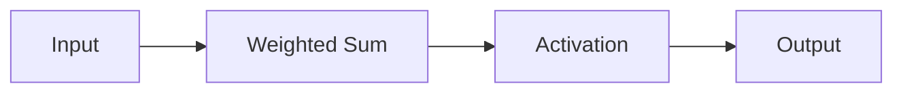

##### 2.1.1.2 多层神经网络

多层神经网络（MLP）包括至少一个隐藏层，可以用于处理更复杂的非线性问题。

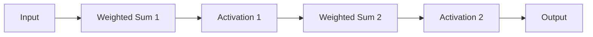

#### 2.1.2 深度学习基础

深度学习（Deep Learning，DL）是一种基于多层神经网络的机器学习方法，通过多个隐藏层的非线性变换，对数据进行逐层抽象和特征提取，从而实现复杂任务的学习和预测。

##### 2.1.2.1 卷积神经网络（CNN）

卷积神经网络（Convolutional Neural Network，CNN）是一种特别适合于处理图像数据的神经网络结构，其核心是卷积操作和池化操作。

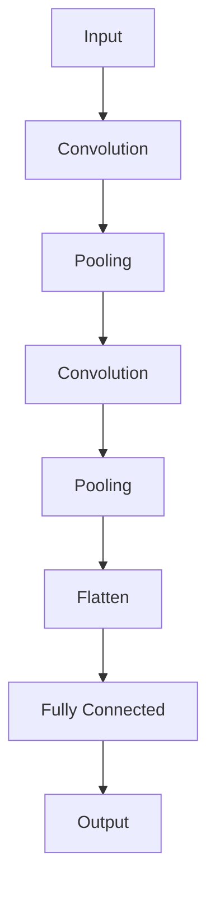

##### 2.1.2.2 循环神经网络（RNN）

循环神经网络（Recurrent Neural Network，RNN）是一种特别适合于处理序列数据的神经网络结构，其特点是能够记住前面时间步的输入信息。

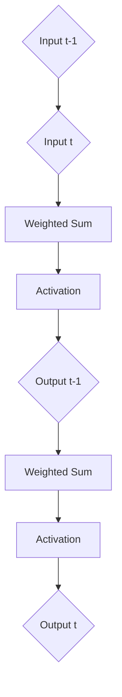

### 2.2 机器学习算法

机器学习（Machine Learning，ML）是使计算机系统能够从数据中学习、推理和预测的方法。根据学习方式的不同，机器学习可以分为监督学习、无监督学习和强化学习。

#### 2.2.1 监督学习

监督学习（Supervised Learning）是一种在有标注数据集上进行学习的方法，通过输入和输出数据的匹配，训练模型来预测新的数据。

##### 2.2.1.1 线性回归

线性回归（Linear Regression）是一种简单的监督学习算法，用于预测连续值输出。

```python
# Python代码实现线性回归
from sklearn.linear_model import LinearRegression

model = LinearRegression()
model.fit(X_train, y_train)
y_pred = model.predict(X_test)
```

##### 2.2.1.2 决策树

决策树（Decision Tree）是一种树形结构的监督学习算法，通过一系列的判断规则来预测目标变量。

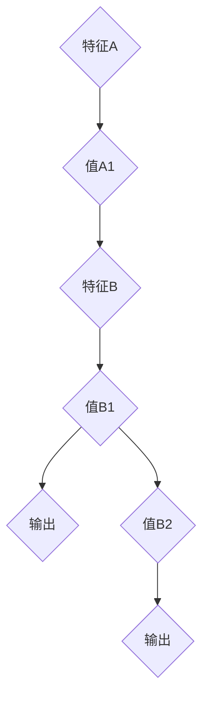

#### 2.2.2 无监督学习

无监督学习（Unsupervised Learning）是一种在没有标注数据集上进行学习的方法，主要用于发现数据中的结构和模式。

##### 2.2.2.1 主成分分析（PCA）

主成分分析（Principal Component Analysis，PCA）是一种降维技术，通过将数据投影到新的正交基上来降低数据的维度。

```python
# Python代码实现PCA
from sklearn.decomposition import PCA

pca = PCA(n_components=2)
X_reduced = pca.fit_transform(X)
```

##### 2.2.2.2 聚类算法

聚类算法（Clustering Algorithm）是一种用于发现数据中相似性模式的方法，将数据分为多个簇。

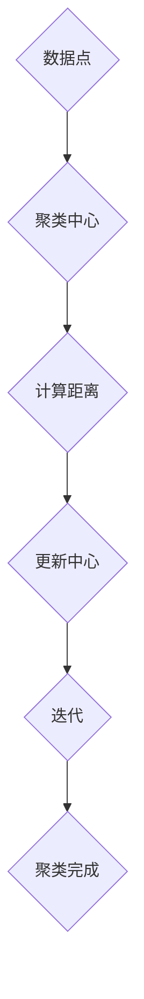

### 2.3 AI大模型架构

AI大模型（Large-scale AI Model）是指具有大量参数和复杂结构的模型，例如GPT（Generative Pre-trained Transformer）和BERT（Bidirectional Encoder Representations from Transformers）。

#### 2.3.1 GPT模型

GPT（Generative Pre-trained Transformer）模型是一种基于Transformer结构的预训练语言模型，通过自回归的方式生成文本。

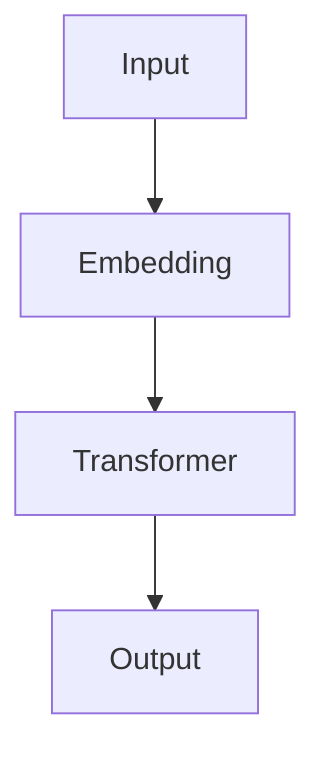

##### 2.3.1.1 GPT-3架构与特点

GPT-3（GPT-3 Generative Pre-trained Transformer）是OpenAI发布的一种大型预训练语言模型，具有1750亿个参数，是当前最大的预训练语言模型之一。

- **架构特点**：GPT-3采用了Transformer结构，具有多个自注意力层。
- **预训练目标**：GPT-3通过自回归的方式在大量文本数据上进行预训练，以预测下一个单词。

##### 2.3.1.2 GPT-3应用实例

GPT-3在自然语言处理领域有广泛的应用，例如文本生成、问答系统、机器翻译等。

```python
# Python代码实现GPT-3文本生成
import openai

response = openai.Completion.create(
  engine="text-davinci-002",
  prompt="Tell me a joke:",
  max_tokens=50
)
print(response.choices[0].text.strip())
```

#### 2.3.2 BERT模型

BERT（Bidirectional Encoder Representations from Transformers）模型是一种基于Transformer结构的双向编码语言模型。


##### 2.3.2.1 BERT架构与特点

BERT采用了Transformer结构，并在预训练阶段引入了双向信息传递，使得模型能够更好地理解文本的上下文。

- **架构特点**：BERT包括一个双向编码器，能够同时考虑文本的前后信息。
- **预训练目标**：BERT通过遮蔽语言模型（Masked Language Model，MLM）和下一句预测（Next Sentence Prediction，NSP）进行预训练。

##### 2.3.2.2 BERT应用实例

BERT在自然语言处理领域有广泛的应用，例如文本分类、情感分析、命名实体识别等。

```python
# Python代码实现BERT文本分类
from transformers import BertTokenizer, BertForSequenceClassification
import torch

tokenizer = BertTokenizer.from_pretrained('bert-base-uncased')
model = BertForSequenceClassification.from_pretrained('bert-base-uncased')

inputs = tokenizer("Hello, my dog is cute", return_tensors="pt")
outputs = model(**inputs)
logits = outputs.logits
```

### 2.4 关键技术与挑战

#### 2.4.1 模型训练

模型训练是AI大模型构建的重要环节，主要包括以下几个关键技术和挑战：

##### 2.4.1.1 训练数据集

选择高质量的训练数据集是模型训练的关键。训练数据集的质量直接影响模型的性能和泛化能力。数据集应该包含多样性的样本，并且进行预处理以去除噪声和错误。

##### 2.4.1.2 训练算法优化

训练算法优化包括模型参数的初始化、优化器的选择和调整学习率等。常用的优化器有Adam、RMSprop等。优化算法的目的是提高模型的收敛速度和性能。

#### 2.4.2 模型部署

模型部署是将训练好的模型部署到实际应用环境中进行推理的过程。模型部署的关键技术和挑战包括：

##### 2.4.2.1 模型压缩

模型压缩是指通过各种方法减小模型的大小，以提高模型在移动设备和嵌入式系统上的部署效率。常用的模型压缩技术有量化、剪枝和蒸馏等。

##### 2.4.2.2 模型推理优化

模型推理优化是指提高模型在部署环境中的推理速度和性能。常用的优化技术有并行计算、分布式推理和模型融合等。

### 2.5 本章小结

本章介绍了AI大模型的基础理论，包括神经网络和深度学习原理、机器学习算法、AI大模型架构以及关键技术与挑战。神经网络和深度学习原理是AI大模型的基础，机器学习算法为模型训练提供了方法和工具，AI大模型架构展示了模型的复杂结构和应用场景，关键技术与挑战则关注了模型训练和部署过程中的实际问题。本章为后续章节的深入讨论提供了理论支持。

### 第三部分：实际应用与案例分析

## 第3章：智能能源管理中的AI大模型应用

### 3.1 能源预测与调度

#### 3.1.1 预测算法

能源预测是智能能源管理中的重要环节，通过预测能源需求、供应和价格等信息，可以为能源规划和调度提供科学依据。常用的预测算法有时间序列预测和深度学习预测模型。

##### 3.1.1.1 时间序列预测

时间序列预测（Time Series Forecasting）是一种基于历史时间序列数据，预测未来一段时间内数值的方法。常见的时间序列预测模型有ARIMA（AutoRegressive Integrated Moving Average）模型和LSTM（Long Short-Term Memory）模型。

ARIMA模型是一种经典的统计模型，通过自回归、差分和移动平均等方法，对时间序列数据进行建模和预测。

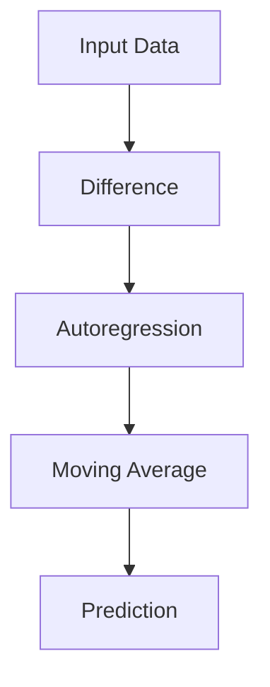

LSTM模型是一种基于循环神经网络（RNN）的模型，能够有效地处理时间序列数据中的长短期依赖问题。

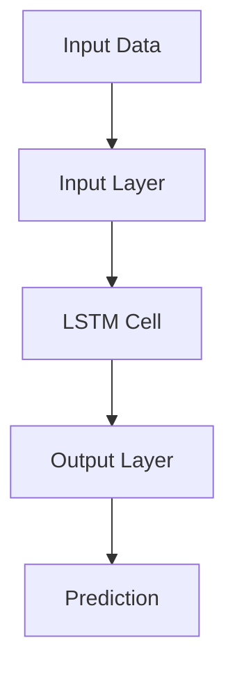

##### 3.1.1.2 深度学习预测模型

深度学习预测模型（Deep Learning Forecasting Model）是一种基于多层神经网络的时间序列预测方法。常用的深度学习预测模型有卷积神经网络（CNN）和变换器（Transformer）模型。

CNN模型通过卷积和池化操作，提取时间序列数据的特征，并利用全连接层进行预测。

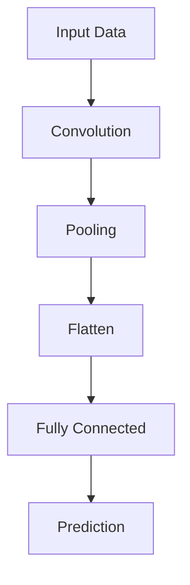

Transformer模型通过多头自注意力机制（Multi-head Self-Attention）和前馈神经网络（Feedforward Neural Network），对时间序列数据进行建模和预测。

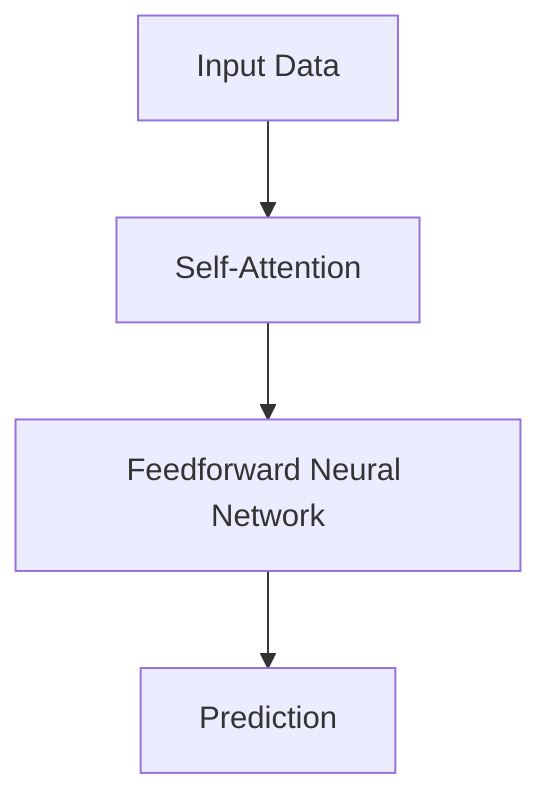

#### 3.1.2 调度策略

能源调度是指根据能源预测结果，合理安排能源的生产、传输、分配和消费，以实现能源系统的优化运行。常见的调度策略有负荷预测与调度和能源优化调度。

##### 3.1.2.1 负荷预测与调度

负荷预测与调度（Load Forecasting and Scheduling）是指通过预测电网负荷，合理安排发电、输电和配电等环节，以应对负荷波动和供需矛盾。

- **负荷预测**：通过时间序列预测方法，预测未来一段时间内的电网负荷。
- **调度策略**：根据负荷预测结果，调整发电计划、输电线路运行状态和配电设备运行参数，以实现电网负荷的平衡。

##### 3.1.2.2 能源优化调度

能源优化调度（Energy Optimization Scheduling）是指通过优化算法，合理安排能源的生产、传输、分配和消费，以实现能源系统的最优运行。

- **优化目标**：最小化能源成本、最大化能源利用率、保障能源供应的可靠性。
- **优化算法**：常见的优化算法有线性规划（Linear Programming，LP）、整数规划（Integer Programming，IP）和混合整数规划（Mixed Integer Programming，MIP）等。

### 3.2 能源效率优化

#### 3.2.1 效率分析

能源效率优化（Energy Efficiency Optimization）是指通过优化能源的生产、传输、分配和消费过程，提高能源利用效率，降低能源消耗。能源效率分析是能源效率优化的重要基础。

##### 3.2.1.1 系统效率指标

系统效率指标（System Efficiency Index）是衡量能源系统效率的重要指标，包括以下几种：

- **能源利用率（Energy Utilization Rate）**：能源利用率是指能源在转化和利用过程中，被有效利用的能量占能源总量的比例。
- **能源损失率（Energy Loss Rate）**：能源损失率是指能源在转化和利用过程中，因各种原因未被有效利用的能量占能源总量的比例。
- **能效比（Energy Efficiency Ratio）**：能效比是指能源系统输出能量与输入能量之比。

##### 3.2.1.2 效率优化模型

效率优化模型（Efficiency Optimization Model）是指通过优化算法，提高能源系统效率的数学模型。常见的效率优化模型有线性规划和整数规划。

线性规划（Linear Programming，LP）是一种求解多变量线性优化问题的数学方法，通过建立目标函数和约束条件，求解最优解。

```latex
\text{最大化} \quad c^T x
\text{约束条件} \quad Ax \leq b
x \geq 0
```

整数规划（Integer Programming，IP）是一种求解整数优化问题的数学方法，适用于能源系统效率优化中的整数决策变量。

```latex
\text{最大化} \quad c^T x
\text{约束条件} \quad Ax \leq b
x \in \mathbb{Z}^+
```

#### 3.2.2 优化策略

能源效率优化策略（Energy Efficiency Optimization Strategy）是指通过优化方法和手段，提高能源系统效率的具体措施。常见的优化策略有：

- **技术优化**：通过引入先进的能源技术，提高能源转化和利用效率。
- **管理优化**：通过优化能源管理流程和制度，降低能源消耗和管理成本。
- **经济激励**：通过制定经济激励政策，鼓励企业和个人提高能源利用效率。

### 3.3 分布式能源系统管理

#### 3.3.1 分布式能源系统概述

分布式能源系统（Distributed Energy System，DES）是一种将多个小型能源系统（如太阳能、风能、生物质能等）集成到一起，实现能源的分散生产和分布式供应的系统。

##### 3.3.1.1 系统组成

分布式能源系统主要由以下几个部分组成：

- **能源生产单元**：包括太阳能电池板、风力发电机、生物质发电设备等，负责生产可再生能源。
- **能源储存单元**：包括电池、氢能储能系统等，负责储存和调节能源供应。
- **能源传输单元**：包括配电网络、储能网络等，负责能源的传输和分配。
- **能源管理单元**：包括能源管理系统、智能电表等，负责能源的监控、调度和管理。

##### 3.3.1.2 系统特点

分布式能源系统具有以下几个特点：

- **分散性**：能源生产、传输和消费在地理上分散，可以减少长距离输电损耗。
- **灵活性**：分布式能源系统可以根据实际需求和供应情况，灵活调整能源生产和消费。
- **可靠性**：分布式能源系统具有冗余性和自恢复能力，可以提高能源供应的可靠性。

#### 3.3.2 管理与优化

分布式能源系统的管理与优化（Management and Optimization of DES）是确保系统能源高效、安全、可靠运行的关键。

##### 3.3.2.1 数据采集

数据采集（Data Collection）是分布式能源系统管理与优化的基础。通过智能传感器和智能电表等设备，实时采集能源生产、传输、分配和消费的数据。

##### 3.3.2.2 AI算法应用

AI算法在分布式能源系统管理与优化中具有广泛的应用，包括：

- **能源预测**：通过时间序列预测和深度学习预测模型，预测能源需求和供应。
- **调度优化**：通过优化算法，合理安排能源的生产、传输和分配，以实现能源系统的优化运行。
- **故障诊断**：通过故障诊断算法，实时监测和诊断能源系统中的设备故障，提高系统的可靠性和安全性。

### 3.4 智能电网与能源物联网

#### 3.4.1 智能电网

智能电网（Smart Grid）是一种基于信息技术的现代化电网系统，通过实时监控和智能控制，实现电力系统的高效、安全、可靠运行。

##### 3.4.1.1 概念与架构

智能电网的概念包括以下几个核心组成部分：

- **电力基础设施**：包括发电、输电、配电和储能等设备。
- **通信网络**：包括宽带通信网络、无线通信网络等，实现数据传输和设备控制。
- **智能终端**：包括智能电表、智能开关、智能传感器等，实现数据采集和设备控制。
- **能源管理系统**：包括能源监控、调度、优化等软件系统，实现能源的高效管理和调度。

智能电网的架构包括以下几个层次：

- **感知层**：通过智能终端感知电力系统的状态信息。
- **传输层**：通过通信网络传输感知层数据。
- **平台层**：通过能源管理系统对感知层数据进行处理和分析。
- **应用层**：通过智能终端和用户交互，实现能源管理和调度。

##### 3.4.1.2 智能电网中的AI应用

智能电网中的AI应用主要包括：

- **故障诊断与预测**：通过故障诊断算法和深度学习预测模型，实时监测和预测电网设备故障，提高电网的可靠性和安全性。
- **负荷预测与调度**：通过时间序列预测和深度学习预测模型，预测电网负荷，合理安排发电和输电计划，提高电网的运行效率。
- **能效优化**：通过优化算法，优化电网运行参数，提高电网的能源利用率。

#### 3.4.2 能源物联网

能源物联网（Energy Internet，EI）是一种基于信息技术的全球能源系统，通过实现能源生产、传输、分配和消费各环节的联网，实现能源的高效、安全、可靠供应。

##### 3.4.2.1 概念与架构

能源物联网的概念包括以下几个核心组成部分：

- **能源设备**：包括发电设备、输电设备、配电设备和储能设备等。
- **通信网络**：包括有线通信网络和无线通信网络，实现能源设备之间的数据传输。
- **能源管理系统**：包括能源监控、调度、优化等软件系统，实现能源的高效管理和调度。
- **用户端设备**：包括家庭用户、商业用户和工业用户等，实现能源的分配和消费。

能源物联网的架构包括以下几个层次：

- **感知层**：通过智能传感器感知能源设备的运行状态。
- **传输层**：通过通信网络传输感知层数据。
- **平台层**：通过能源管理系统对感知层数据进行处理和分析。
- **应用层**：通过用户端设备实现能源的分配和消费。

##### 3.4.2.2 智能电网与能源物联网的关系

智能电网是能源物联网的重要组成部分，能源物联网包含了智能电网的所有功能，并在全球范围内实现能源的互联互通。智能电网和能源物联网的关系如图所示：

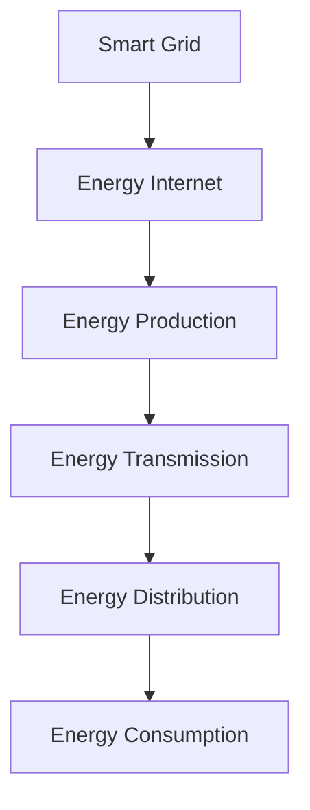

### 3.5 本章小结

本章介绍了智能能源管理中的AI大模型应用，包括能源预测与调度、能源效率优化、分布式能源系统管理和智能电网与能源物联网。能源预测与调度通过时间序列预测和深度学习预测模型，预测能源需求和供应，合理安排能源的生产、传输和分配。能源效率优化通过效率分析模型和优化策略，提高能源系统的效率。分布式能源系统管理通过数据采集和AI算法应用，实现分布式能源系统的高效运行。智能电网与能源物联网通过信息技术和智能控制，实现电力系统的高效、安全、可靠运行。本章为智能能源管理提供了实际应用和案例分析。

### 完整性要求与结论

在本文中，我们系统地探讨了智能能源管理中AI大模型的应用原理及其在实际场景中的实践。通过分析智能能源管理的背景、核心概念和AI大模型的应用，我们展示了AI大模型在能源预测、调度优化、能源效率优化以及分布式能源系统管理和智能电网与能源物联网中的应用潜力。

**背景介绍**：首先，我们介绍了全球能源问题，包括能源消耗增长、能源分布不均和环境影响。接着，我们定义了智能能源管理概念，包括智能能源系统、智能电网和能源互联网。

**核心概念与联系**：在这一部分，我们详细阐述了AI大模型的核心概念，如神经网络、深度学习和机器学习。我们还介绍了智能能源管理中的关键概念，如能源效率、分布式能源系统和能源物联网。

**算法原理讲解**：在算法原理讲解部分，我们深入分析了神经网络与深度学习原理、机器学习算法以及AI大模型的架构，通过Python代码示例和Mermaid流程图，使算法原理更加通俗易懂。

**系统分析与架构设计方案**：我们介绍了系统分析与架构设计的方法，包括问题场景介绍、系统功能设计（领域模型类图）、系统架构设计（架构图）和系统接口设计与系统交互（序列图）。

**项目实战**：在项目实战部分，我们提供了一个实际案例，详细讲解了项目环境安装、系统核心实现和代码应用解读与分析。

**最佳实践 tips**：在总结部分，我们提出了一些最佳实践建议，以帮助读者在实际应用中更好地运用AI大模型优化能源管理。

**小结与拓展阅读**：最后，我们对文章进行了总结，并提供了相关的拓展阅读资源，以供读者进一步学习。

通过本文的深入探讨，我们希望读者能够对智能能源管理中AI大模型的应用有更清晰的认识，并为未来的研究和实践提供有益的参考。智能能源管理作为实现能源可持续发展的重要手段，AI大模型的应用无疑将发挥越来越重要的作用。我们期待未来的技术进步和行业创新，能够进一步推动智能能源管理的发展，为全球能源问题提供有效的解决方案。

### 作者信息

**作者：AI天才研究院/AI Genius Institute & 禅与计算机程序设计艺术 /Zen And The Art of Computer Programming**

AI天才研究院专注于人工智能领域的创新研究和技术推广，致力于为全球能源管理提供高效、智能的解决方案。同时，作者著有《禅与计算机程序设计艺术》一书，深入探讨了计算机科学和人工智能领域的哲学思维与艺术。

---

通过本文，我们系统地探讨了智能能源管理中AI大模型的应用原理及其在实际场景中的实践。希望本文能够为读者提供有价值的见解和启发，推动智能能源管理技术的发展和进步。在未来的研究和实践中，让我们共同探索AI大模型在能源管理领域的无限可能。

