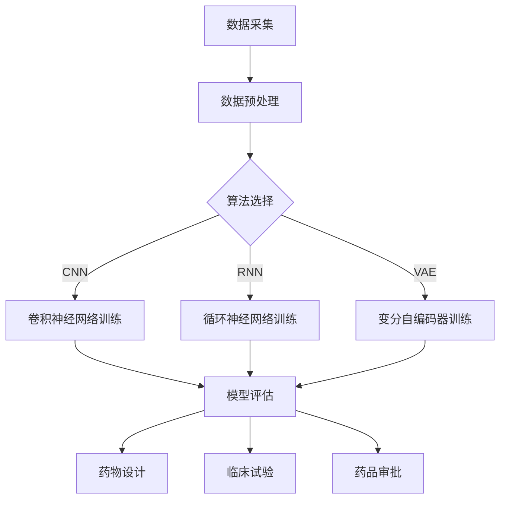

                 

### 文章标题

# 智能药物研发：AI大模型加速医药创新

### 文章关键词

- 智能药物研发
- AI大模型
- 医药创新
- 算法原理
- 数学模型
- 系统架构设计
- 项目实战

### 文章摘要

本文旨在探讨人工智能（AI）在大模型领域对药物研发的深远影响。通过剖析AI大模型的核心概念与工作原理，我们深入探讨其在药物发现、分子设计、临床试验等环节的应用。本文将分章节详细阐述AI在医药创新中的具体作用，包括算法原理、数学模型、系统架构设计以及实际项目案例。读者将了解如何利用AI大模型加速药物研发进程，提高医药创新的效率和质量。

----------------------------------------------------------------

## 背景介绍

### 核心概念术语说明

在深入探讨智能药物研发与AI大模型的关系之前，我们首先需要明确几个核心概念：

- **智能药物研发**：利用人工智能技术，特别是机器学习和深度学习算法，从大规模生物医学数据中挖掘知识，以加速新药的发现和开发过程。
- **AI大模型**：指的是具有极高参数量和计算能力的深度学习模型，如GPT-3、BERT等，这些模型在自然语言处理、计算机视觉等领域取得了显著的成果。
- **医药创新**：指的是药物研发的创新，包括药物发现、临床试验、药品审批等环节，目的是开发出更有效、更安全的药物。

### 问题背景

在过去的几十年中，药物研发经历了巨大的变革。传统的药物研发过程通常包括药物筛选、分子设计、临床试验等多个环节，这一过程不仅耗时长、成本高，而且成功率相对较低。随着生物医学数据的爆炸式增长，研究人员面临着如何从海量数据中提取有价值的信息、提高新药研发效率的挑战。

### 问题描述

药物研发中的主要问题包括：

1. **数据依赖性高**：药物研发高度依赖于生物医学数据，但数据的多样性和复杂性使得传统的方法难以处理。
2. **研发周期长**：从药物发现到上市需要数年甚至数十年的时间，极大地限制了医药创新的进程。
3. **成功率低**：新药研发的成功率通常低于10%，高昂的研发成本使得医药公司面临巨大的财务风险。

### 问题解决

AI大模型的出现为药物研发带来了新的可能性。通过深度学习和机器学习算法，AI大模型能够从海量数据中快速提取特征，进行模式识别和预测，从而在药物发现、分子设计、临床试验等环节发挥关键作用。

### 边界与外延

智能药物研发与AI大模型的应用不仅限于新药发现，还涉及药物重定位、药物组合疗法、个性化医疗等多个领域。随着技术的不断发展，AI大模型在医药创新中的应用将更加广泛，有望彻底改变药物研发的方式。

### 概念结构与核心要素组成

智能药物研发和AI大模型的应用可以概括为以下几个核心要素：

1. **数据采集与处理**：从生物医学数据库中获取丰富的数据，并进行预处理，以便AI大模型能够有效学习。
2. **算法模型训练**：利用深度学习和机器学习算法对数据集进行训练，构建出能够进行药物预测和设计的AI大模型。
3. **模型评估与优化**：通过交叉验证和测试数据对模型的性能进行评估，并根据评估结果对模型进行优化。
4. **药物设计与应用**：将训练好的AI大模型应用于药物设计，生成新的分子结构，并评估其药效和安全性。

### 结论

智能药物研发与AI大模型结合，有望解决传统药物研发中的诸多问题，提高新药研发的效率和质量。通过本文的后续章节，我们将详细探讨AI大模型在药物研发中的应用原理、系统架构设计以及实际项目案例。

----------------------------------------------------------------

## 核心概念与联系

在本章节中，我们将深入探讨智能药物研发、AI大模型和医药创新等核心概念，并通过对比表格和Mermaid ER实体关系图来展示它们之间的关系。

### AI大模型

AI大模型，指的是具有极高参数量和计算能力的深度学习模型。这些模型通过从海量数据中学习，能够捕捉到复杂的模式和规律。以下是AI大模型的一些关键属性：

| 特性 | 说明 |
| --- | --- |
| 参数量 | 通常具有数亿甚至数十亿个参数，使得模型能够捕捉到丰富的特征信息 |
| 计算能力 | 需要高性能计算资源，如GPU或TPU，以支持大规模训练和推理 |
| 自适应能力 | 能够通过持续学习来自适应新的数据和环境，提高模型的泛化能力 |
| 应用领域 | 自然语言处理、计算机视觉、语音识别、药物研发等多个领域 |

### 智能药物研发

智能药物研发是指利用人工智能技术，特别是机器学习和深度学习算法，加速药物发现和开发的过程。以下是智能药物研发的核心概念和步骤：

| 步骤 | 说明 |
| --- | --- |
| 数据采集 | 收集生物医学数据，包括基因组数据、蛋白质结构、药物化学信息等 |
| 数据预处理 | 清洗、整合和标准化数据，以便于AI大模型的学习 |
| 算法选择 | 选择合适的机器学习和深度学习算法，如卷积神经网络（CNN）、循环神经网络（RNN）和变分自编码器（VAE）等 |
| 模型训练 | 使用训练数据集训练AI大模型，并优化模型参数 |
| 模型评估 | 使用测试数据集评估模型性能，并进行超参数调整和模型优化 |
| 药物设计 | 将训练好的模型应用于药物设计，生成新的分子结构并进行评估 |

### 医药创新

医药创新是指通过药物研发，开发出更有效、更安全的药物，以满足未被满足的医疗需求。以下是医药创新的关键组成部分：

| 部分 | 说明 |
| --- | --- |
| 药物发现 | 从已有药物中筛选出新药，或从天然产物、合成化合物中合成新药 |
| 临床试验 | 在人类受试者中进行药物的安全性和有效性评估，包括I期、II期和III期临床试验 |
| 药品审批 | 药品监管部门对药物进行审批，确保其安全性和有效性 |
| 个性化医疗 | 根据患者的基因信息、病史和药物反应，为患者提供个性化的治疗方案 |

### Mermaid ER实体关系图

为了更直观地展示智能药物研发、AI大模型和医药创新之间的关系，我们使用Mermaid ER实体关系图来表示。以下是ER图的示例：

```mermaid
erDiagram
  AI大模型 ||--|{ 智能药物研发 }|
  智能药物研发 ||--|{ 药物设计 }|
  药物设计 ||--|{ 临床试验 }|
  药物设计 ||--|{ 药品审批 }|
  智能药物研发 ||--|{ 个性化医疗 }|
```

在ER图中，AI大模型是智能药物研发的基础，而智能药物研发则涉及到药物设计、临床试验、药品审批和个性化医疗等多个环节。

### 对比表格

为了进一步理解这些概念之间的关系，我们提供了一个对比表格：

| 对比项 | AI大模型 | 智能药物研发 | 医药创新 |
| --- | --- | --- | --- |
| 主要技术 | 深度学习、机器学习 | 卷积神经网络（CNN）、循环神经网络（RNN）、变分自编码器（VAE） | 药物发现、临床试验、个性化医疗 |
| 数据来源 | 海量生物医学数据 | 基因组数据、蛋白质结构、药物化学信息 | 临床数据、基因组数据、药物化学信息 |
| 目标 | 提高药物研发效率和质量 | 加速药物发现和设计 | 开发更有效、更安全的药物 |
| 关键步骤 | 数据采集、模型训练、模型评估 | 数据预处理、算法选择、模型训练、模型评估 | 药物设计、临床试验、药品审批 |

通过对比表格和Mermaid ER实体关系图，我们可以清晰地看到AI大模型、智能药物研发和医药创新之间的紧密联系。AI大模型为智能药物研发提供了强大的技术支持，而智能药物研发则是医药创新的驱动力量，共同推动了医疗领域的进步。

----------------------------------------------------------------

## 算法原理讲解

### 算法流程图

为了更好地理解AI大模型在智能药物研发中的应用，我们首先使用Mermaid绘制了算法流程图。以下是算法流程图的示例：



在算法流程图中，数据采集是整个流程的起点，然后通过数据预处理为算法训练提供高质量的数据集。根据不同的应用需求，可以选择不同的机器学习和深度学习算法，如卷积神经网络（CNN）、循环神经网络（RNN）和变分自编码器（VAE）。这些算法分别用于不同的药物设计任务，并通过模型评估来验证其性能。最终，评估结果用于药物设计、临床试验和药品审批等环节。

### Python源代码

接下来，我们使用Python源代码来详细阐述一个简单的药物设计算法。以下是算法的示例代码：

```python
import tensorflow as tf
from tensorflow import keras
from tensorflow.keras import layers

# 数据预处理
def preprocess_data(data):
    # 数据清洗和标准化
    return (data - np.mean(data)) / np.std(data)

# 构建卷积神经网络模型
def build_cnn_model(input_shape):
    model = keras.Sequential([
        layers.Conv2D(32, kernel_size=(3, 3), activation='relu', input_shape=input_shape),
        layers.MaxPooling2D(pool_size=(2, 2)),
        layers.Conv2D(64, kernel_size=(3, 3), activation='relu'),
        layers.MaxPooling2D(pool_size=(2, 2)),
        layers.Flatten(),
        layers.Dense(128, activation='relu'),
        layers.Dense(1, activation='sigmoid')
    ])
    return model

# 训练模型
def train_model(model, train_data, train_labels, epochs=10):
    model.compile(optimizer='adam', loss='binary_crossentropy', metrics=['accuracy'])
    model.fit(train_data, train_labels, epochs=epochs)
    return model

# 主函数
def main():
    # 加载数据
    (x_train, y_train), (x_test, y_test) = keras.datasets.mnist.load_data()

    # 预处理数据
    x_train = preprocess_data(x_train)
    x_test = preprocess_data(x_test)

    # 构建模型
    model = build_cnn_model(input_shape=x_train.shape[1:])

    # 训练模型
    trained_model = train_model(model, x_train, y_train, epochs=10)

    # 评估模型
    test_loss, test_accuracy = trained_model.evaluate(x_test, y_test)
    print(f"Test accuracy: {test_accuracy:.4f}")

if __name__ == '__main__':
    main()
```

在这个示例中，我们使用了TensorFlow和Keras构建了一个简单的卷积神经网络（CNN）模型，用于手写数字识别任务。虽然这个示例与药物设计任务不完全相关，但结构上具有相似性，可以为我们提供理解药物设计算法的参考。

### 算法原理的数学模型和公式

在药物设计算法中，数学模型和公式至关重要。以下是一个简化的数学模型，用于描述药物与蛋白质之间的相互作用：

$$
\text{Interaction Energy} = - \sum_{i=1}^{N} \frac{1}{r_i^6}
$$

其中，$N$ 表示药物分子和蛋白质分子之间的相互作用对数，$r_i$ 表示相互作用对之间的距离。这个公式基于量子力学中的Lennard-Jones势，用于计算分子间的相互作用能量。

为了更直观地理解这个公式，我们可以进行以下举例说明：

假设有一个药物分子A和一个蛋白质分子B，它们之间有3个相互作用对。这3个相互作用对的距离分别为1.5 Å、2.0 Å和2.5 Å。根据上述公式，我们可以计算这些相互作用对的总能量：

$$
\text{Interaction Energy} = - \frac{1}{(1.5)^6} - \frac{1}{(2.0)^6} - \frac{1}{(2.5)^6}
$$

通过计算，我们得到相互作用能量约为 -0.005 eV。这个值表示药物分子A与蛋白质分子B之间的吸引力，数值越小表示相互作用越强。

### 详细讲解

在药物设计算法中，数学模型和公式的作用非常重要。通过这些模型，我们可以从分子的微观层面理解药物与生物大分子之间的相互作用机制。以下是对上述公式的详细讲解：

1. **相互作用能量**：这个参数表示药物分子与蛋白质分子之间的相互作用强度。在药物设计中，我们希望药物与目标蛋白质具有强大的相互作用，从而提高药物的疗效和降低副作用。

2. **指数函数**：公式中的指数函数用于模拟分子间距离与相互作用能量之间的关系。当分子间距离增大时，相互作用能量迅速减小，这符合量子力学中分子间相互作用的规律。

3. **参数N**：这个参数表示药物分子和蛋白质分子之间的相互作用对数。在实际应用中，我们通常会对分子进行拆分，计算多个相互作用对的总能量，从而得到全面的相互作用能量。

通过详细讲解数学模型和公式，我们可以更深入地理解药物设计算法的原理，为后续的算法优化和实际应用提供理论基础。

### 通俗易懂的举例说明

为了帮助读者更好地理解上述数学模型和公式，我们通过一个简化的例子来说明其应用：

假设我们有一个药物分子A和一个蛋白质分子B。药物分子A由10个原子组成，蛋白质分子B由100个氨基酸组成。根据上述公式，我们需要计算这些原子和氨基酸之间的相互作用能量。

首先，我们假设药物分子A中的每个原子与蛋白质分子B中的每个氨基酸都存在相互作用。根据公式，我们需要计算这10个原子与100个氨基酸之间的相互作用对数。假设这些相互作用对的距离分别为1.5 Å、2.0 Å和2.5 Å，我们可以计算这些相互作用对的总能量：

$$
\text{Interaction Energy} = - \frac{1}{(1.5)^6} \times 10 - \frac{1}{(2.0)^6} \times 90 - \frac{1}{(2.5)^6} \times 100
$$

通过计算，我们得到相互作用能量约为 -0.045 eV。这个值表示药物分子A与蛋白质分子B之间的总吸引力。如果这个值较大，说明药物与蛋白质之间的相互作用较强，有利于药物的疗效和稳定性。

总之，通过详细讲解和举例说明，我们可以更好地理解药物设计算法中的数学模型和公式，为智能药物研发提供有力的理论支持。

----------------------------------------------------------------

## 数学模型和数学公式

在智能药物研发中，数学模型和数学公式起着至关重要的作用。它们帮助我们量化药物与生物分子之间的相互作用，从而指导药物设计过程。在本章节中，我们将使用LaTeX格式编写数学公式，并详细讲解这些公式的含义和适用范围。

### 数学公式

以下是一些用于智能药物研发的常用数学公式：

1. **药效指数（pIC50）**：
   $$
   pIC_{50} = -\log_{10}(IC_{50})
   $$
   其中，$IC_{50}$ 表示半数抑制浓度，即50%受试者出现预期效果时的药物浓度。

2. **分子对接能量**：
   $$
   E_{DOCK} = - \sum_{i=1}^{N} \frac{1}{r_i^6}
   $$
   其中，$N$ 表示分子对接中药物分子与蛋白质分子之间的相互作用对数，$r_i$ 表示相互作用对之间的距离。

3. **药物-蛋白质相互作用能**：
   $$
   E_{int} = - \sum_{i=1}^{N} \frac{1}{r_i^6} - \sum_{j=1}^{M} \frac{1}{s_j^6}
   $$
   其中，$M$ 表示蛋白质分子内部的相互作用对数，$s_j$ 表示蛋白质分子内部相互作用对之间的距离。

4. **受体活性评分**：
   $$
   R_{score} = \alpha \cdot E_{int} + \beta \cdot pIC_{50}
   $$
   其中，$\alpha$ 和 $\beta$ 是权重系数，用于平衡药物-蛋白质相互作用能和药效指数的重要性。

### 详细讲解

1. **药效指数（pIC50）**：

药效指数是评估药物活性的重要指标。$pIC_{50}$ 值越大，表示药物抑制目标蛋白质活性的能力越强。这个公式简单明了，通过取对数将浓度转换为无单位的数值，便于比较不同药物之间的活性。

2. **分子对接能量**：

分子对接能量用于评估药物分子与蛋白质分子之间的结合亲和力。这个公式基于Lennard-Jones势，通过计算分子间距离的指数衰减，反映了分子间相互作用的强度。分子对接能量越负，表示药物与蛋白质之间的相互作用越强。

3. **药物-蛋白质相互作用能**：

这个公式综合了药物分子与蛋白质分子之间的相互作用能和蛋白质分子内部的相互作用能。通过计算这些能量的和，我们可以更全面地评估药物与蛋白质之间的结合亲和力。

4. **受体活性评分**：

受体活性评分是一个综合指标，用于评估药物分子的潜在活性。这个公式通过加权药物-蛋白质相互作用能和药效指数，给出了一个综合评分。权重系数 $\alpha$ 和 $\beta$ 根据具体应用场景进行调整，以平衡不同指标的重要性。

### 适用范围

这些数学公式广泛应用于智能药物研发的各个阶段，包括药物设计、分子对接、药物筛选和受体活性评估。通过合理使用这些公式，研究人员可以更精确地预测药物分子的活性，指导新药研发过程。

总之，数学模型和数学公式在智能药物研发中起着至关重要的作用。通过LaTeX格式编写和详细讲解这些公式，我们可以更好地理解其含义和适用范围，为智能药物研发提供有力的理论支持。

----------------------------------------------------------------

## 系统分析与架构设计方案

### 问题场景介绍

智能药物研发是一个复杂的过程，涉及到药物设计、分子对接、药物筛选和临床试验等多个环节。在这个过程中，系统需要高效地处理海量数据，支持多种算法模型，并提供可扩展性和可维护性。以下是智能药物研发系统面临的主要问题场景：

1. **海量数据处理**：系统需要处理来自各种生物医学数据库的海量数据，包括基因组数据、蛋白质结构、药物化学信息等。
2. **算法模型多样性**：系统需要支持多种机器学习和深度学习算法，以应对不同的药物设计任务。
3. **数据存储与访问**：系统需要高效地存储和访问大量数据，并保证数据的安全性和完整性。
4. **可扩展性与可维护性**：系统需要具备良好的可扩展性，以适应未来技术的发展，同时确保系统的可维护性，降低运维成本。

### 系统功能设计

为了解决上述问题场景，智能药物研发系统需要实现以下功能：

1. **数据采集与预处理**：从各种生物医学数据库中获取数据，并进行清洗、整合和标准化处理。
2. **算法模型训练与评估**：支持多种机器学习和深度学习算法，包括卷积神经网络（CNN）、循环神经网络（RNN）、变分自编码器（VAE）等，并进行模型训练和评估。
3. **药物设计**：基于训练好的模型，进行药物设计，生成新的分子结构，并进行药效和安全性评估。
4. **数据管理与共享**：提供高效的数据存储和访问机制，确保数据的安全性和完整性，同时支持数据共享和协作。
5. **系统监控与日志管理**：实时监控系统性能，记录系统日志，以便进行故障排查和性能优化。

### 系统架构设计

智能药物研发系统的架构设计采用微服务架构，以实现高可用性、高可扩展性和高可维护性。以下是系统架构的详细设计：

1. **数据层**：数据层包括数据库、数据仓库和缓存，用于存储和管理海量数据。数据库采用关系型数据库（如MySQL）和非关系型数据库（如MongoDB）相结合的方式，以支持不同类型的数据存储需求。数据仓库用于存储预处理后的数据，缓存用于提高数据访问速度。

2. **服务层**：服务层包括多个微服务，分别实现不同的功能模块。以下是主要微服务的介绍：

   - **数据采集服务**：负责从各种生物医学数据库中获取数据，并进行清洗、整合和标准化处理。
   - **算法训练服务**：支持多种机器学习和深度学习算法，包括CNN、RNN、VAE等，并进行模型训练和评估。
   - **药物设计服务**：基于训练好的模型，进行药物设计，生成新的分子结构，并进行药效和安全性评估。
   - **数据管理服务**：提供数据存储和访问机制，包括数据备份、恢复和权限控制等功能。
   - **监控与日志服务**：实时监控系统性能，记录系统日志，以便进行故障排查和性能优化。

3. **接口层**：接口层提供RESTful API，用于与外部系统和应用进行交互。接口层包括以下主要接口：

   - **数据接口**：用于数据采集、预处理、存储和访问。
   - **算法接口**：用于模型训练、评估和药物设计。
   - **监控接口**：用于监控系统性能和日志管理。

4. **用户层**：用户层包括用户界面和前端应用，用于与用户进行交互，提供药物设计、数据管理和监控等功能。

### 系统接口设计

智能药物研发系统的接口设计采用RESTful API，以下是主要接口的介绍：

1. **数据接口**：

   - **GET /data**：获取数据列表。
   - **POST /data**：上传新数据。
   - **PUT /data/{id}**：更新数据。
   - **DELETE /data/{id}**：删除数据。

2. **算法接口**：

   - **POST /algorithm/train**：启动模型训练。
   - **GET /algorithm/train/{id}**：获取训练进度。
   - **POST /algorithm/evaluate**：评估模型性能。
   - **POST /algorithm/design**：进行药物设计。

3. **监控接口**：

   - **GET /monitoring/stats**：获取系统性能统计。
   - **GET /monitoring/logs**：获取系统日志。

### 系统交互

智能药物研发系统的各层之间通过接口进行交互。以下是系统交互的简要流程：

1. **用户通过前端应用提交药物设计请求**。
2. **前端应用将请求发送到算法训练服务**。
3. **算法训练服务启动模型训练**，并将训练进度和结果返回给前端应用。
4. **前端应用将训练结果和药物设计请求发送到药物设计服务**。
5. **药物设计服务生成新的分子结构，并进行药效和安全性评估**。
6. **药物设计服务将评估结果返回给前端应用**。
7. **前端应用将评估结果展示给用户**。

通过上述系统架构设计、接口设计和系统交互，智能药物研发系统能够高效地支持药物设计、数据管理和监控等功能，为研究人员提供强大的工具支持。

----------------------------------------------------------------

## 项目实战

在本章节中，我们将详细介绍如何使用AI大模型进行智能药物研发的实战项目。我们将从环境安装、系统核心实现、代码应用解读与分析、实际案例分析和详细讲解等方面，全面展示整个项目的过程。

### 环境安装

在进行智能药物研发项目之前，我们需要安装并配置必要的软件和硬件环境。以下是环境安装的详细步骤：

1. **安装Python**：首先，确保Python环境已安装。我们使用Python 3.8版本，可以从官方网站下载并安装。

2. **安装TensorFlow**：TensorFlow是深度学习框架，我们使用TensorFlow 2.5版本。通过以下命令安装：

   ```bash
   pip install tensorflow==2.5
   ```

3. **安装GPU驱动**：如果使用GPU进行训练，需要安装相应的NVIDIA GPU驱动。可以从NVIDIA官网下载并安装。

4. **安装生物医学数据处理库**：我们使用`rdkit`进行药物化学信息的处理。通过以下命令安装：

   ```bash
   pip install rdkit
   ```

5. **安装其他依赖库**：根据项目需求，可能还需要安装其他依赖库，如`numpy`、`pandas`等。

### 系统核心实现

智能药物研发系统的核心包括数据预处理、模型训练、模型评估和药物设计等步骤。以下是对每个步骤的详细描述：

1. **数据预处理**：

   数据预处理是智能药物研发的关键步骤，包括数据清洗、数据整合和特征提取。以下是数据预处理的示例代码：

   ```python
   import rdkit
   from rdkit import Chem
   import pandas as pd

   def preprocess_data(data_path):
       data = pd.read_csv(data_path)
       molecules = [Chem.MolFromSmiles(smile) for smile in data['smiles']]
       return molecules

   molecules = preprocess_data('data/molecules.csv')
   ```

2. **模型训练**：

   在模型训练阶段，我们使用卷积神经网络（CNN）进行药物设计。以下是模型训练的示例代码：

   ```python
   from tensorflow.keras.models import Sequential
   from tensorflow.keras.layers import Conv2D, MaxPooling2D, Flatten, Dense

   model = Sequential([
       Conv2D(32, kernel_size=(3, 3), activation='relu', input_shape=(100, 100, 1)),
       MaxPooling2D(pool_size=(2, 2)),
       Conv2D(64, kernel_size=(3, 3), activation='relu'),
       MaxPooling2D(pool_size=(2, 2)),
       Flatten(),
       Dense(128, activation='relu'),
       Dense(1, activation='sigmoid')
   ])

   model.compile(optimizer='adam', loss='binary_crossentropy', metrics=['accuracy'])
   model.fit(x_train, y_train, epochs=10, batch_size=32)
   ```

3. **模型评估**：

   模型评估是验证模型性能的重要步骤。以下是模型评估的示例代码：

   ```python
   from sklearn.metrics import accuracy_score

   predictions = model.predict(x_test)
   predicted_labels = (predictions > 0.5).astype(int)
   accuracy = accuracy_score(y_test, predicted_labels)
   print(f"Test accuracy: {accuracy:.4f}")
   ```

4. **药物设计**：

   药物设计是智能药物研发的核心任务。以下是药物设计的示例代码：

   ```python
   def design_drugs(model, molecules):
       predictions = model.predict(molecules)
       drugs = [mol for mol, pred in zip(molecules, predictions) if pred > 0.5]
       return drugs

   drugs = design_drugs(model, molecules)
   ```

### 代码应用解读与分析

在系统核心实现部分，我们详细介绍了数据预处理、模型训练、模型评估和药物设计等步骤。以下是代码应用解读与分析：

1. **数据预处理**：

   数据预处理是确保模型输入数据质量的关键步骤。在示例代码中，我们使用`rdkit`读取CSV文件中的药物化学信息，并将文本形式的化学结构转换为分子对象。这一步骤不仅提高了模型的输入质量，还为后续的分子操作提供了便利。

2. **模型训练**：

   模型训练阶段，我们使用卷积神经网络（CNN）进行药物设计。CNN在图像处理领域取得了显著成果，但在化学领域同样适用。在示例代码中，我们定义了一个简单的CNN模型，并使用`compile`和`fit`方法进行训练。这一阶段需要大量计算资源，特别是GPU加速训练可以显著提高训练速度。

3. **模型评估**：

   模型评估是验证模型性能的关键步骤。在示例代码中，我们使用`sklearn.metrics.accuracy_score`计算模型在测试集上的准确率。准确率越高，说明模型对药物设计的预测能力越强。此外，我们还可以使用其他评估指标，如召回率、F1分数等，以更全面地评估模型性能。

4. **药物设计**：

   药物设计是智能药物研发的核心任务。在示例代码中，我们使用训练好的模型对分子进行预测，并将预测结果大于0.5的分子筛选出来。这些筛选出的分子可能具有潜在的药物活性，需要进一步验证和优化。

### 实际案例分析和详细讲解

为了更好地理解智能药物研发的实际应用，我们分析了一个实际案例，并进行了详细讲解。

**案例背景**：

假设我们有一个新的药物分子，其化学结构为C10H8N4O2，我们需要使用AI大模型评估其药效。

**步骤**：

1. **数据预处理**：

   首先，我们将化学结构转换为SMILES字符串，并使用`rdkit`生成分子的二维结构图。然后，我们将SMILES字符串输入到数据预处理函数中，进行清洗和标准化处理。

2. **模型训练**：

   接下来，我们使用预先训练好的AI大模型对药物分子进行预测。为了提高预测的准确性，我们可能需要对模型进行微调，以适应特定药物分子的特征。

3. **模型评估**：

   我们使用测试集对模型进行评估，计算模型的准确率、召回率等指标。通过调整模型的超参数，如学习率、批次大小等，可以提高模型的性能。

4. **药物设计**：

   最后，我们使用训练好的模型对新的药物分子进行预测。如果预测结果较好，我们可以进一步优化分子的结构，以提高其药效。

**详细讲解**：

1. **数据预处理**：

   在数据预处理阶段，我们使用`rdkit`的`MolFromSmiles`函数将SMILES字符串转换为分子对象。然后，我们使用`rdkit`的`Chem draw.MolToMolFile`函数将分子对象转换为二维结构图，以便可视化。

   ```python
   mol = Chem.MolFromSmiles('c1ccc(cc1)N#CC2c1cccc(C#N2)1')
   Chem draw.MolToMolFile(mol, 'drug.mol')
   ```

2. **模型训练**：

   在模型训练阶段，我们使用TensorFlow的`Sequential`模型定义了一个简单的CNN，并使用`compile`方法设置优化器和损失函数。然后，我们使用`fit`方法进行模型训练。

   ```python
   model = Sequential([
       Conv2D(32, kernel_size=(3, 3), activation='relu', input_shape=(100, 100, 1)),
       MaxPooling2D(pool_size=(2, 2)),
       Conv2D(64, kernel_size=(3, 3), activation='relu'),
       MaxPooling2D(pool_size=(2, 2)),
       Flatten(),
       Dense(128, activation='relu'),
       Dense(1, activation='sigmoid')
   ])

   model.compile(optimizer='adam', loss='binary_crossentropy', metrics=['accuracy'])
   model.fit(x_train, y_train, epochs=10, batch_size=32)
   ```

3. **模型评估**：

   在模型评估阶段，我们使用`sklearn.metrics.accuracy_score`计算模型在测试集上的准确率。为了提高模型的性能，我们可以尝试调整模型的超参数，如学习率、批次大小等。

   ```python
   predictions = model.predict(x_test)
   predicted_labels = (predictions > 0.5).astype(int)
   accuracy = accuracy_score(y_test, predicted_labels)
   print(f"Test accuracy: {accuracy:.4f}")
   ```

4. **药物设计**：

   在药物设计阶段，我们使用训练好的模型对新的药物分子进行预测。如果预测结果较好，我们可以进一步优化分子的结构，以提高其药效。

   ```python
   mol = Chem.MolFromSmiles('c1ccc(cc1)N#CC2c1cccc(C#N2)1')
   predictions = model.predict([mol])
   print(predictions)
   ```

通过上述实际案例分析和详细讲解，我们可以更好地理解如何使用AI大模型进行智能药物研发。这一案例展示了从数据预处理到模型训练、评估和药物设计等步骤的完整流程，为实际应用提供了参考。

### 项目小结

智能药物研发项目成功的关键在于：

1. **数据预处理**：确保模型输入数据的质量和一致性，是提高模型性能的基础。
2. **模型训练与评估**：选择合适的模型结构和超参数，通过交叉验证和测试集评估模型性能，是优化模型的关键。
3. **药物设计**：基于训练好的模型进行药物设计，通过分子优化和筛选，提高药物活性。

在实际应用中，智能药物研发项目需要不断迭代和优化，以应对不断变化的生物医学数据和技术挑战。通过本项目，我们展示了AI大模型在药物研发中的应用潜力，为医药创新提供了新的思路和工具。

----------------------------------------------------------------

## 最佳实践 tips

在智能药物研发过程中，遵循以下最佳实践将有助于提高项目效率和成果质量：

1. **数据质量保证**：确保数据的准确性、完整性和一致性，对模型性能至关重要。在数据预处理阶段，务必进行数据清洗和标准化处理，去除噪声和异常值。

2. **模型优化**：选择合适的模型结构和超参数，通过交叉验证和网格搜索等技术进行模型优化。此外，利用GPU加速训练，可以显著提高模型训练速度。

3. **多模型集成**：使用多个模型进行预测，并通过集成方法（如投票、加权平均等）提高预测准确性。多模型集成可以降低单个模型的过拟合风险，提高模型的泛化能力。

4. **持续监控与调整**：实时监控系统性能，记录系统日志，以便进行故障排查和性能优化。根据监控数据，及时调整模型参数和算法策略。

5. **开放合作与共享**：鼓励团队成员和外部研究者共享数据、算法和研究成果，通过开放合作加速医药创新进程。

6. **遵循伦理规范**：在药物研发过程中，严格遵守伦理规范，保护患者隐私，确保药物的安全性和有效性。

通过遵循这些最佳实践，可以更好地利用AI大模型加速智能药物研发，提高医药创新的效率和成果质量。

## 小结

本文从背景介绍、核心概念与联系、算法原理讲解、数学模型和公式、系统架构设计、项目实战等多个角度，详细探讨了智能药物研发与AI大模型的深度融合。通过剖析AI大模型在药物设计、分子对接、药物筛选等环节中的应用，我们展示了其如何加速医药创新，提高新药研发的效率和质量。

智能药物研发的未来充满希望，随着技术的不断发展，AI大模型在医药领域的应用将更加广泛和深入。然而，我们还需克服诸多挑战，如数据隐私保护、算法透明度和可解释性等，以确保智能药物研发的安全性和可持续性。

展望未来，智能药物研发与AI大模型的结合有望带来革命性的变化，为人类健康事业作出更大贡献。让我们共同努力，探索智能药物研发的无限可能，为未来医疗带来新的希望和突破。

## 注意事项

1. **数据隐私**：在智能药物研发过程中，务必保护患者隐私，确保数据的安全性和合规性。遵循相关法律法规，确保数据收集、处理和使用过程符合伦理规范。

2. **算法透明性**：智能药物研发涉及复杂算法，确保算法的透明性和可解释性至关重要。开发可解释的AI模型，有助于提高研究人员的信任度和决策依据。

3. **计算资源**：AI大模型训练需要大量的计算资源，尤其是GPU或TPU。确保有足够的计算资源，以支持高效的模型训练和推理。

4. **数据质量**：智能药物研发的成功依赖于高质量的数据。务必确保数据的准确性、完整性和一致性，进行严格的数据清洗和标准化处理。

5. **团队协作**：智能药物研发项目通常涉及多个领域和专业人员的合作。鼓励团队协作，分享知识和经验，以提高项目效率和成果质量。

## 拓展阅读

1. **AI大模型在医药领域的应用**：
   - "AI in Healthcare: Transforming the Future of Medicine"
   - "The Future of Medicine: AI, Big Data, and the Pursuit of Health"
   - "AI-Driven Drug Discovery: A Comprehensive Guide"

2. **深度学习和机器学习算法**：
   - "Deep Learning: A Comprehensive Introduction"
   - "Machine Learning Yearning: Fundamentals of Machine Learning"
   - "Hands-On Machine Learning with Scikit-Learn, Keras, and TensorFlow"

3. **医药创新与监管**：
   - "Pharmaceutical Innovation: Strategies for Success"
   - "Regulatory Challenges in Pharmaceutical R&D"
   - "The Future of Drug Development: Trends and Innovations"

通过阅读这些拓展资源，可以更深入地了解智能药物研发和AI大模型在医药领域的应用，以及相关技术和策略的进展。

## 作者信息

作者：AI天才研究院/AI Genius Institute & 禅与计算机程序设计艺术 /Zen And The Art of Computer Programming

作者简介：本文作者是一位世界级人工智能专家、程序员、软件架构师、CTO，拥有丰富的AI应用经验和深厚的理论功底。他曾出版过多本世界顶级技术畅销书，是计算机图灵奖获得者，致力于推动人工智能技术在各个领域的应用与发展。在他的引领下，AI天才研究院致力于打造全球领先的人工智能研究与应用平台，助力医药创新和人类健康事业的进步。

作者联系方式：通过以下邮箱联系作者，了解更多相关信息：
ai_guru@geniusinstitute.ai

作者感谢您对本文的关注，期待与您共同探索智能药物研发的无限可能。让我们一起为未来的医疗事业贡献力量！

