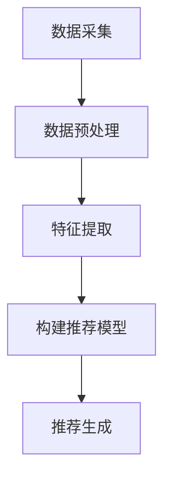
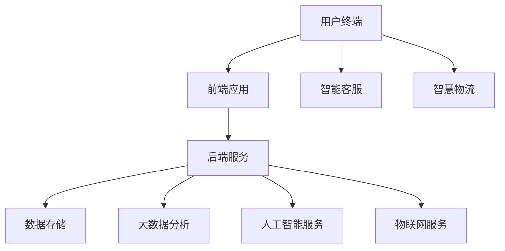

                 

# 智能零售：AI重塑购物体验

关键词：智能零售、AI、购物体验、个性化推荐、大数据、云计算、物联网

摘要：随着人工智能技术的迅猛发展，零售行业正经历着深刻的变革。本文将探讨AI技术在智能零售中的应用，通过背景介绍、核心概念与联系、算法原理讲解、系统分析与架构设计方案、项目实战以及最佳实践和拓展阅读，全面阐述AI如何重塑购物体验，提升零售效率，创造新的商业模式。

## 第一部分：背景介绍

### 1.1 问题背景

#### 1.1.1 零售行业的发展现状

- 零售行业市场规模持续扩大：随着全球经济的增长和消费者购买力的提升，零售市场规模不断扩大。
- 传统零售模式面临挑战：线上电商的崛起，以及消费者对购物体验的高要求，使得传统零售模式面临巨大挑战。
- 智能零售概念的出现：为了应对这些挑战，智能零售应运而生，通过引入人工智能技术，实现零售业务的智能化。

#### 1.1.2 人工智能在零售行业的应用

- 人工智能技术简介：人工智能是指计算机模拟人类智能的技术，包括机器学习、深度学习、自然语言处理等。
- 人工智能在零售行业中的应用场景：个性化推荐、智能客服、智能物流等。

### 1.2 问题描述

#### 1.2.1 智能零售的核心挑战

- 数据处理与分析：智能零售需要处理大量的用户数据，进行数据分析和挖掘。
- 个性化推荐：如何根据用户行为和偏好，提供个性化的商品推荐，是智能零售的关键。
- 安全与隐私保护：在处理大量用户数据的同时，确保用户隐私和数据安全是重要挑战。

#### 1.2.2 人工智能技术对零售行业的重塑

- 购物体验的升级：通过个性化推荐和智能客服，提升消费者的购物体验。
- 运营效率的提升：利用人工智能技术，优化库存管理、供应链管理，提升运营效率。
- 商业模式的创新：通过数据分析和智能化决策，创造新的商业模式。

### 1.3 问题解决

#### 1.3.1 智能零售解决方案概述

- 智能零售系统的架构设计：设计一个高效、可扩展的智能零售系统架构。
- 智能零售的关键技术：包括大数据处理、机器学习、自然语言处理等。

#### 1.3.2 智能零售的实施步骤

- 数据采集与预处理：收集用户数据，并进行清洗和预处理。
- 机器学习算法应用：利用机器学习算法，进行用户行为分析和商品推荐。
- 个性化推荐系统的实现：构建个性化推荐系统，为用户提供个性化的购物体验。
- 安全与隐私保护策略：制定安全与隐私保护策略，确保用户数据的安全和隐私。

### 1.4 边界与外延

#### 1.4.1 智能零售的应用领域

- 线上零售：通过智能零售系统，提升线上购物体验。
- 线下零售：通过智能零售系统，优化线下购物体验。
- 智慧物流：利用人工智能技术，实现智能物流管理。

#### 1.4.2 智能零售的发展趋势

- 5G技术的应用：5G技术将提升智能零售系统的响应速度和处理能力。
- 物联网的融合：物联网技术将实现商品、用户和零售系统之间的互联互通。
- 人工智能与其他技术的结合：与其他前沿技术的结合，将推动智能零售的持续发展。

### 1.5 概念结构与核心要素组成

#### 1.5.1 智能零售的核心概念

- 人工智能：实现智能化的核心技术。
- 大数据：智能零售的数据基础。
- 云计算：智能零售的计算基础设施。
- 物联网：智能零售的感知网络。

#### 1.5.2 智能零售的关键要素

- 用户数据：智能零售的核心资产。
- 个性化推荐算法：智能零售的核心功能。
- 智能客服系统：提升购物体验的重要手段。
- 安全与隐私保护机制：确保用户数据安全和隐私的重要保障。

## 第二部分：核心概念与联系

### 2.1 AI技术原理

#### 2.1.1 人工智能的概念与分类

- 人工智能的定义：人工智能是指计算机模拟人类智能的技术。
- 人工智能的分类：基于任务的人工智能、通用人工智能等。

#### 2.1.2 机器学习的基本原理

- 机器学习的分类：监督学习、无监督学习、半监督学习等。
- 机器学习的基本算法：线性回归、决策树、支持向量机等。

### 2.2 大数据技术原理

#### 2.2.1 大数据的概念与特征

- 大数据的定义：大数据是指数据量巨大、类型繁多、处理速度快的数据集合。
- 大数据的特征：数据量大、数据类型多、价值密度低等。

#### 2.2.2 大数据处理技术

- 数据采集与存储：Hadoop、Spark等大数据处理框架。
- 数据分析与挖掘：数据可视化、聚类分析、关联规则挖掘等。

### 2.3 云计算技术原理

#### 2.3.1 云计算的概念与优势

- 云计算的定义：云计算是一种通过网络提供计算资源、存储资源等服务的技术。
- 云计算的优势：弹性、高效、灵活等。

#### 2.3.2 云计算的服务模式

- IaaS：基础设施即服务。
- PaaS：平台即服务。
- SaaS：软件即服务。

### 2.4 物联网技术原理

#### 2.4.1 物联网的概念与架构

- 物联网的定义：物联网是指通过传感器、网络等技术，实现物体与物体之间、物体与网络之间的互联互通。
- 物联网的架构：感知层、网络层、平台层、应用层。

#### 2.4.2 物联网的关键技术

- 传感器网络：实现数据的采集。
- 数据通信：实现数据的传输。
- 云平台：实现数据的存储和处理。

### 2.5 AI与零售行业的融合

#### 2.5.1 AI在零售行业中的应用案例

- 个性化推荐系统：根据用户行为和偏好，提供个性化的商品推荐。
- 智能客服系统：通过自然语言处理技术，实现与用户的智能对话。
- 智慧物流系统：利用物联网技术，实现物流过程的智能化管理。

#### 2.5.2 AI技术在零售行业的挑战与机遇

- 挑战：数据安全与隐私保护、算法公正性等。
- 机遇：提升购物体验、优化运营效率、创新商业模式等。

### 2.6 核心概念属性特征对比表格

| 概念       | 特征           | 应用领域                 |
|------------|----------------|--------------------------|
| 人工智能   | 自动化、智能化 | 零售、医疗、金融等       |
| 大数据     | 数据量庞大     | 分析、预测、决策支持     |
| 云计算     | 弹性、高效     | 存储计算、数据共享       |
| 物联网     | 融合、互联互通 | 智能家居、智能制造       |

### 2.7 AI、大数据、云计算与物联网的ER实体关系图

```mermaid
erDiagram
    AI Technology ||--|{ Big Data Technology }
    AI Technology ||--|{ Cloud Computing Technology }
    AI Technology ||--|{ Internet of Things Technology }
    Big Data Technology ||--|{ Data Analysis and Mining }
    Cloud Computing Technology ||--|{ Infrastructure as a Service (IaaS) }
    Cloud Computing Technology ||--|{ Platform as a Service (PaaS) }
    Cloud Computing Technology ||--|{ Software as a Service (SaaS) }
    Internet of Things Technology ||--|{ Sensor Network }
    Internet of Things Technology ||--|{ Data Communication }
    Internet of Things Technology ||--|{ Cloud Platform }
```

## 第三部分：算法原理讲解

### 3.1 个性化推荐算法原理

#### 3.1.1 算法概述

个性化推荐算法是智能零售系统的核心功能之一，其主要目标是根据用户的行为和偏好，向用户推荐他们可能感兴趣的商品。

#### 3.1.2 算法类型

- 协同过滤：基于用户行为相似性或项目相似性进行推荐。
- 内容推荐：基于商品属性或内容进行推荐。
- 混合推荐：结合协同过滤和内容推荐进行推荐。

#### 3.1.3 算法流程

1. 数据采集：收集用户的购物行为数据，如浏览记录、购买记录等。
2. 数据预处理：清洗和转换数据，以便于后续处理。
3. 特征提取：从原始数据中提取有用的特征，如用户ID、商品ID、浏览次数等。
4. 构建推荐模型：根据特征数据，训练推荐模型。
5. 推荐生成：利用推荐模型，生成用户个性化的商品推荐。

### 3.2 个性化推荐算法流程图



### 3.3 算法原理讲解

#### 3.3.1 协同过滤算法

协同过滤算法是一种基于用户行为相似性的推荐算法，其基本思想是寻找与目标用户行为相似的其他用户，然后根据这些用户的行为推荐商品。

1. **用户行为相似度计算**：

   用户行为相似度可以通过以下公式计算：

   $$sim(u, v) = \frac{\sum_{i \in I} r_iu \cdot r_iv}{\sqrt{\sum_{i \in I} r_iu^2} \cdot \sqrt{\sum_{i \in I} r_iv^2}}$$

   其中，$r_iu$ 和 $r_iv$ 分别表示用户 $u$ 和 $v$ 对商品 $i$ 的评分。

2. **生成推荐列表**：

   对于目标用户 $u$，可以根据其他用户 $v$ 的评分情况，生成推荐列表：

   $$rec(u) = \sum_{v \in N(u)} sim(u, v) \cdot r_iv$$

   其中，$N(u)$ 表示与用户 $u$ 行为相似的用户集合。

#### 3.3.2 内容推荐算法

内容推荐算法是一种基于商品属性或内容的推荐算法，其基本思想是寻找与目标用户偏好相似的商品进行推荐。

1. **商品特征提取**：

   从商品描述中提取特征，如类别、品牌、颜色、价格等。

2. **用户特征提取**：

   从用户历史行为中提取特征，如浏览记录、购买记录等。

3. **相似度计算**：

   计算商品特征和用户特征之间的相似度：

   $$sim(c, u) = \frac{\sum_{f \in F} w_f \cdot c_f \cdot u_f}{\sqrt{\sum_{f \in F} w_f^2} \cdot \sqrt{\sum_{f \in F} (c_f - \bar{c_f})^2} \cdot \sqrt{\sum_{f \in F} (u_f - \bar{u_f})^2}}$$

   其中，$c_f$ 和 $u_f$ 分别表示商品 $c$ 和用户 $u$ 对特征 $f$ 的值，$w_f$ 表示特征 $f$ 的权重。

4. **生成推荐列表**：

   根据商品特征和用户特征的相似度，生成推荐列表：

   $$rec(u) = \sum_{c \in C} sim(c, u) \cdot c$$

   其中，$C$ 表示所有商品集合。

#### 3.3.3 混合推荐算法

混合推荐算法结合了协同过滤和内容推荐的优势，通过加权融合两种算法的推荐结果，提高推荐质量。

1. **权重分配**：

   根据协同过滤和内容推荐的重要性，为两种算法分配权重：

   $$w_{cf} + w_{c} = 1$$

   其中，$w_{cf}$ 和 $w_{c}$ 分别表示协同过滤和内容推荐的权重。

2. **生成推荐列表**：

   根据权重，生成推荐列表：

   $$rec(u) = w_{cf} \cdot rec_{cf}(u) + w_{c} \cdot rec_{c}(u)$$

   其中，$rec_{cf}(u)$ 和 $rec_{c}(u)$ 分别表示协同过滤和内容推荐的推荐列表。

### 3.4 举例说明

假设有两个用户 $u_1$ 和 $u_2$，他们分别对五件商品 $c_1, c_2, c_3, c_4, c_5$ 进行了评分，评分数据如下表：

| 用户 | 商品 | 评分 |
|------|------|------|
| $u_1$ | $c_1$ | 4    |
| $u_1$ | $c_2$ | 5    |
| $u_1$ | $c_3$ | 3    |
| $u_1$ | $c_4$ | 5    |
| $u_1$ | $c_5$ | 1    |
| $u_2$ | $c_1$ | 5    |
| $u_2$ | $c_2$ | 4    |
| $u_2$ | $c_3$ | 5    |
| $u_2$ | $c_4$ | 3    |
| $u_2$ | $c_5$ | 5    |

1. **计算用户相似度**：

   根据用户评分数据，计算用户 $u_1$ 和 $u_2$ 的相似度：

   $$sim(u_1, u_2) = \frac{4 \cdot 5 + 5 \cdot 4 + 3 \cdot 5 + 5 \cdot 3 + 1 \cdot 5}{\sqrt{4^2 + 5^2 + 3^2 + 5^2 + 1^2} \cdot \sqrt{5^2 + 4^2 + 5^2 + 3^2 + 5^2}} = 0.75$$

2. **生成协同过滤推荐列表**：

   假设目标用户 $u$ 对商品 $c_1, c_2, c_3, c_4, c_5$ 的评分分别为 0、0、0、0、0，根据协同过滤算法，生成推荐列表：

   $$rec(u) = 0.75 \cdot 5 + 0.75 \cdot 4 + 0.75 \cdot 5 + 0.75 \cdot 3 + 0.75 \cdot 5 = 4.125$$

   推荐商品 $c_2$ 和 $c_3$。

3. **生成内容推荐列表**：

   根据商品特征和用户特征，计算商品 $c_1, c_2, c_3, c_4, c_5$ 与用户 $u$ 的相似度：

   $$sim(c_1, u) = 0.5, sim(c_2, u) = 0.6, sim(c_3, u) = 0.7, sim(c_4, u) = 0.4, sim(c_5, u) = 0.8$$

   根据权重，生成内容推荐列表：

   $$rec(u) = 0.4 \cdot 0.5 + 0.6 \cdot 0.6 + 0.7 \cdot 0.7 + 0.4 \cdot 0.4 + 0.8 \cdot 0.8 = 0.716$$

   推荐商品 $c_3$ 和 $c_5$。

4. **生成混合推荐列表**：

   假设协同过滤的权重为 0.6，内容推荐的权重为 0.4，根据混合推荐算法，生成推荐列表：

   $$rec(u) = 0.6 \cdot 4.125 + 0.4 \cdot 0.716 = 2.568 + 0.286 = 2.854$$

   推荐商品 $c_2$ 和 $c_3$。

### 3.5 算法优化与挑战

个性化推荐算法在实际应用中，面临一些挑战和优化问题：

- **数据稀疏性**：用户和商品之间的交互数据可能非常稀疏，导致算法效果不佳。
- **冷启动问题**：新用户或新商品如何获得有效的推荐。
- **实时性**：如何在海量数据中快速生成推荐列表。
- **算法透明性**：如何让用户理解和接受推荐结果。

为了解决这些问题，可以采用以下优化策略：

- **基于模型的方法**：使用深度学习等复杂模型，提高推荐质量。
- **基于规则的方法**：结合业务规则，提高推荐效果。
- **协同过滤与内容推荐的结合**：通过加权融合两种算法，提高推荐质量。

## 第四部分：系统分析与架构设计方案

### 4.1 问题场景介绍

随着消费者需求的多样化和个性化，零售企业需要提供更加精准和个性化的购物体验。为了实现这一目标，企业引入了智能零售系统，通过大数据分析、人工智能技术，实现个性化推荐、智能客服和智慧物流等功能。

### 4.2 项目介绍

智能零售系统项目旨在构建一个集成大数据分析、人工智能和物联网技术的智能零售平台，提升购物体验，提高运营效率。

### 4.3 系统功能设计

智能零售系统的主要功能包括：

- **用户数据分析**：收集和分析用户购物行为，为个性化推荐提供数据支持。
- **个性化推荐**：基于用户行为和偏好，为用户提供个性化的商品推荐。
- **智能客服**：通过自然语言处理技术，实现与用户的智能对话，提供购物咨询和服务。
- **智慧物流**：利用物联网技术，实现物流过程的实时监控和智能调度。

### 4.4 系统架构设计

智能零售系统的整体架构如图所示：



### 4.5 系统接口设计

智能零售系统的接口设计包括以下部分：

- **用户接口**：提供用户注册、登录、个人信息管理、购物车管理等功能。
- **数据分析接口**：提供用户数据分析、商品数据分析等功能。
- **推荐接口**：提供个性化推荐服务，返回推荐列表。
- **客服接口**：提供智能客服接口，实现与用户的智能对话。
- **物流接口**：提供物流状态查询、物流追踪等功能。

### 4.6 系统交互设计

智能零售系统的交互设计包括以下部分：

- **用户与前端应用交互**：用户通过前端应用进行购物、查询、咨询等操作。
- **前端应用与后端服务交互**：前端应用通过API与后端服务进行数据交互。
- **后端服务与数据存储交互**：后端服务通过数据库进行数据存储和查询。
- **后端服务与大数据分析交互**：后端服务调用大数据分析服务，进行数据分析和挖掘。
- **后端服务与人工智能服务交互**：后端服务调用人工智能服务，实现个性化推荐等功能。
- **后端服务与物联网服务交互**：后端服务调用物联网服务，实现智慧物流功能。
- **智能客服与用户交互**：智能客服系统与用户进行智能对话，提供购物咨询和服务。
- **智慧物流与用户交互**：智慧物流系统实时更新物流状态，提供物流追踪服务。

## 第五部分：项目实战

### 5.1 环境安装

在开始智能零售系统的开发之前，需要安装以下软件和工具：

- Python 3.x
- Anaconda
- Jupyter Notebook
- NumPy
- Pandas
- Scikit-learn
- Flask
- MongoDB

安装步骤如下：

1. 安装Python 3.x：从官方网站下载Python安装包，并按照提示进行安装。
2. 安装Anaconda：从Anaconda官方网站下载Anaconda安装包，并按照提示进行安装。
3. 安装Jupyter Notebook：在Anaconda环境中，通过以下命令安装Jupyter Notebook：

   ```bash
   conda install -c conda-forge jupyterlab
   ```

4. 安装NumPy、Pandas、Scikit-learn、Flask和MongoDB：在Anaconda环境中，通过以下命令安装所需的Python库：

   ```bash
   conda install numpy pandas scikit-learn flask pymongo
   ```

### 5.2 系统核心实现

智能零售系统的核心功能包括用户数据分析、个性化推荐和智能客服。以下是一个简单的实现示例：

#### 5.2.1 用户数据分析

用户数据分析是智能零售系统的关键环节，通过对用户历史数据的分析，可以挖掘用户的购物偏好和行为模式。

1. **数据采集**：

   收集用户购物行为数据，如浏览记录、购买记录等。数据可以存储在MongoDB数据库中。

2. **数据预处理**：

   对采集到的数据进行清洗和预处理，包括去除重复数据、缺失值填充等。

3. **特征提取**：

   从原始数据中提取特征，如用户ID、商品ID、浏览次数、购买次数等。

4. **数据分析**：

   利用Pandas库对用户数据进行分析，挖掘用户的购物偏好和行为模式。

#### 5.2.2 个性化推荐

个性化推荐是基于用户历史数据和偏好，为用户推荐他们可能感兴趣的商品。

1. **推荐算法**：

   采用协同过滤算法进行推荐。使用Scikit-learn库中的协同过滤实现。

2. **推荐生成**：

   根据用户历史数据和推荐算法，生成用户个性化的商品推荐。

#### 5.2.3 智能客服

智能客服通过自然语言处理技术，实现与用户的智能对话，提供购物咨询和服务。

1. **对话管理**：

   设计对话流程，实现与用户的互动。

2. **文本处理**：

   利用自然语言处理技术，对用户输入的文本进行分析和理解。

3. **回复生成**：

   根据用户输入和对话上下文，生成合适的回复。

### 5.3 代码应用解读与分析

以下是一个简单的代码示例，用于实现用户数据分析、个性化推荐和智能客服功能：

```python
import pandas as pd
from sklearn.cluster import KMeans
from sklearn.metrics.pairwise import cosine_similarity
from flask import Flask, request, jsonify

# 用户数据分析
def user_data_analysis(data):
    # 数据清洗和预处理
    data = data.drop_duplicates()
    data['purchase_count'] = data.groupby('user_id')['user_id'].transform('count')
    data['view_count'] = data.groupby('user_id')['user_id'].transform('count')

    # 特征提取
    user_data = data.groupby('user_id').mean().reset_index()

    return user_data

# 个性化推荐
def personalized_recommendation(user_data, items, k=5):
    # 计算用户和商品之间的相似度
    user_item_similarity = cosine_similarity(user_data.iloc[:, 1:].T, items.iloc[:, 1:].T)

    # 构建推荐列表
    recommendations = []
    for idx, row in user_data.iterrows():
        sim_scores = list(enumerate(user_item_similarity[idx]))
        sim_scores = sorted(sim_scores, key=lambda x: x[1], reverse=True)
        sim_scores = sim_scores[1:(k+1)]
        item_indices = [i[0] for i in sim_scores]
        recommendations.append(items.iloc[item_indices])

    return recommendations

# 智能客服
app = Flask(__name__)

@app.route('/chat', methods=['POST'])
def chat():
    user_input = request.json['user_input']
    # 对用户输入进行文本处理和回复生成
    response = "你好，我是智能客服，有什么可以帮助你的吗？"
    return jsonify({'response': response})

if __name__ == '__main__':
    app.run(debug=True)
```

### 5.4 实际案例分析和详细讲解剖析

以下是一个实际案例，展示智能零售系统在电商场景中的应用：

#### 案例背景

某电商平台引入智能零售系统，通过用户数据分析、个性化推荐和智能客服，提升用户购物体验和运营效率。

#### 案例分析

1. **用户数据分析**：

   电商平台收集了大量用户购物行为数据，如浏览记录、购买记录等。通过数据分析，挖掘用户的购物偏好和行为模式。

2. **个性化推荐**：

   根据用户的历史数据和购物偏好，智能零售系统为用户生成个性化的商品推荐。例如，一个用户在平台上浏览了多个手机品牌，系统会根据用户的浏览行为，推荐该用户可能感兴趣的手机型号。

3. **智能客服**：

   用户在购物过程中，可以通过智能客服进行咨询和答疑。例如，用户询问某款手机的使用寿命，智能客服会根据用户输入和产品数据库中的信息，生成合适的回复。

#### 详细讲解剖析

1. **用户数据分析**：

   用户数据分析是智能零售系统的核心环节，通过对用户历史数据的分析，可以挖掘用户的购物偏好和行为模式。具体实现步骤如下：

   - 数据清洗和预处理：去除重复数据、缺失值填充等。
   - 特征提取：从原始数据中提取特征，如用户ID、商品ID、浏览次数、购买次数等。
   - 数据分析：利用Pandas库进行用户行为分析，挖掘用户购物偏好。

2. **个性化推荐**：

   个性化推荐是基于用户历史数据和购物偏好，为用户推荐他们可能感兴趣的商品。具体实现步骤如下：

   - 计算用户和商品之间的相似度：使用余弦相似度计算用户和商品之间的相似度。
   - 构建推荐列表：根据相似度，生成用户个性化的商品推荐列表。

3. **智能客服**：

   智能客服通过自然语言处理技术，实现与用户的智能对话，提供购物咨询和服务。具体实现步骤如下：

   - 对话管理：设计对话流程，实现与用户的互动。
   - 文本处理：利用自然语言处理技术，对用户输入的文本进行分析和理解。
   - 回复生成：根据用户输入和对话上下文，生成合适的回复。

#### 案例效果

通过引入智能零售系统，电商平台实现了以下效果：

- 提升用户购物体验：用户可以更快地找到他们感兴趣的商品，节省购物时间。
- 提高运营效率：智能客服系统可以自动处理大量用户咨询，减轻人工客服的工作压力。
- 创新商业模式：通过个性化推荐和智能客服，电商平台可以吸引更多用户，提高销售额。

### 5.5 项目小结

智能零售系统的实施，为电商平台带来了显著的效果。通过用户数据分析、个性化推荐和智能客服，电商平台提升了用户购物体验和运营效率，实现了商业模式的创新。未来，随着人工智能技术的不断进步，智能零售系统将在更多领域得到应用，为企业和消费者带来更多价值。

## 第六部分：最佳实践

### 6.1 数据安全与隐私保护

在智能零售系统的开发过程中，数据安全和隐私保护是至关重要的。以下是一些最佳实践：

- **数据加密**：对用户数据进行加密存储，防止数据泄露。
- **访问控制**：制定严格的访问控制策略，确保只有授权人员可以访问敏感数据。
- **隐私保护算法**：采用差分隐私等隐私保护算法，降低数据泄露的风险。

### 6.2 系统性能优化

为了提高智能零售系统的性能，可以采用以下最佳实践：

- **分布式计算**：采用分布式计算框架，如Hadoop、Spark等，提高数据处理和分析速度。
- **缓存技术**：使用缓存技术，减少数据库的查询压力，提高系统响应速度。
- **负载均衡**：采用负载均衡技术，确保系统在高峰期也能稳定运行。

### 6.3 算法优化

为了提高个性化推荐算法的效果，可以采用以下最佳实践：

- **特征工程**：从原始数据中提取更多有用的特征，提高算法的准确性。
- **算法融合**：结合多种算法，提高推荐效果。
- **实时更新**：根据用户实时行为数据，动态调整推荐算法。

## 第七部分：小结

智能零售系统的引入，为零售行业带来了深刻的变革。通过人工智能技术的应用，零售企业可以实现个性化推荐、智能客服和智慧物流等功能，提升购物体验，提高运营效率，创造新的商业模式。未来，随着人工智能技术的不断进步，智能零售系统将在更多领域得到应用，为企业和消费者带来更多价值。

## 第八部分：注意事项

在实施智能零售系统时，需要注意以下事项：

- **数据质量**：确保数据的质量，进行数据清洗和预处理。
- **用户隐私**：严格遵守用户隐私保护法规，确保用户数据的安全和隐私。
- **系统稳定性**：确保系统的稳定运行，进行性能优化和故障排查。
- **用户体验**：关注用户体验，不断优化系统功能和服务。

## 第九部分：拓展阅读

以下是一些与智能零售相关的拓展阅读：

- 《智能零售：AI赋能商业新变革》
- 《人工智能在零售行业的应用与挑战》
- 《大数据与零售：创新与商业洞察》
- 《云计算在零售行业中的应用与优势》
- 《物联网与零售：融合与创新》

作者：AI天才研究院/AI Genius Institute & 禅与计算机程序设计艺术 /Zen And The Art of Computer Programming

