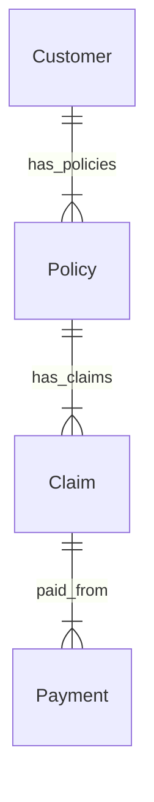
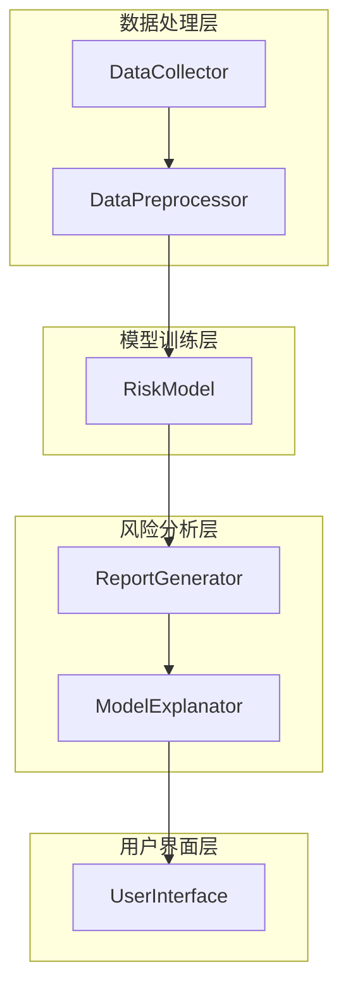
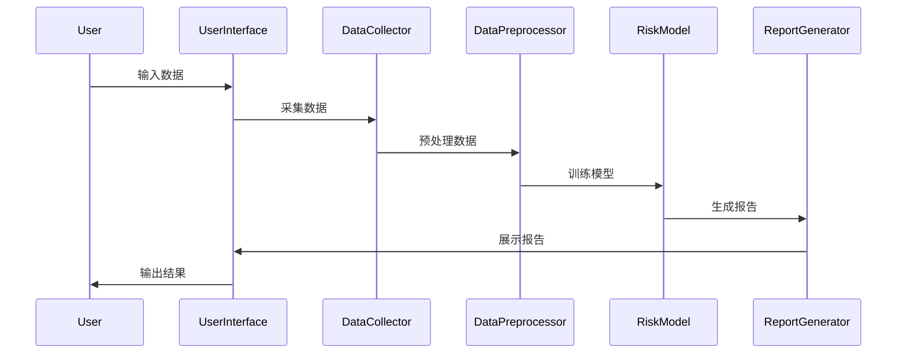
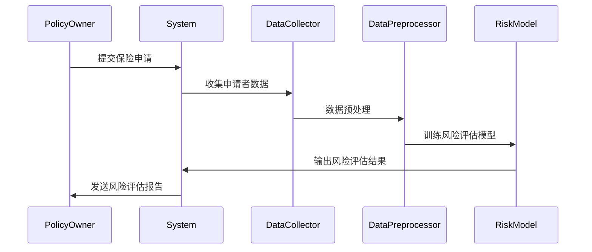

                 

**智能风险评估：AI大模型在保险行业的应用**

### 摘要

随着人工智能技术的发展，AI大模型在各个行业中的应用越来越广泛。保险行业作为一个高度依赖数据和分析的行业，也开始探索AI大模型在风险评估中的应用。本文旨在探讨智能风险评估的基础概念、AI大模型的核心原理、其在保险行业中的具体应用以及风险评估系统的设计与实现。通过项目实战和案例分析，本文将总结最佳实践，并给出注意事项和拓展阅读，以期为保险行业利用AI大模型进行风险评估提供参考。

### 关键词

- 智能风险评估
- AI大模型
- 保险行业
- 深度学习
- 风险评估系统

## 第一部分：智能风险评估的基础

### 第1章：智能风险评估概述

#### 1.1 问题背景

保险行业一直以来都面临着诸多挑战，如风险评估不准确、客户需求难以满足、运营成本高等。传统的风险评估方法往往依赖于统计模型和专家经验，这些方法在处理海量数据和高复杂性场景时存在明显的局限性。随着人工智能技术的发展，特别是深度学习和大数据分析的兴起，为保险行业提供了新的解决思路。智能风险评估应运而生，通过引入AI大模型，提高风险评估的准确性和效率，成为保险行业的一大发展趋势。

#### 1.2 问题描述

保险风险评估主要面临以下问题：

1. **数据质量与完整性**：保险行业涉及大量客户数据，这些数据往往存在缺失、不一致和噪声问题，影响了风险评估的准确性。
2. **模型复杂性与解释性**：传统的风险评估模型往往较为简单，难以捕捉数据中的复杂关系。同时，模型解释性较差，无法向客户清晰地展示风险评估的依据。
3. **实时性与动态调整**：保险市场的变化速度很快，传统的风险评估模型往往难以实时调整以适应市场变化。

智能风险评估旨在解决上述问题，通过引入AI大模型，实现以下目标：

1. **提高风险评估准确性**：利用AI大模型强大的数据处理和分析能力，准确捕捉数据中的潜在关系，提高风险评估的准确性。
2. **增强模型解释性**：通过可解释的AI模型，使得风险评估过程更加透明，客户能够理解风险评估的依据。
3. **实现实时动态调整**：通过实时数据分析和模型更新，使得风险评估能够及时反映市场变化，提高决策效率。

#### 1.3 问题解决

人工智能在保险行业的应用可以分为以下几个阶段：

1. **数据处理与清洗**：利用AI技术对保险数据进行分析，处理缺失值、噪声数据，提高数据质量。
2. **模型选择与训练**：选择合适的AI大模型，如深度学习模型，进行风险评估模型的训练。
3. **风险评估与优化**：利用训练好的模型进行风险评估，并对评估结果进行优化，以提高准确性。
4. **模型解释与反馈**：对模型进行解释，提供风险评估的依据，同时收集用户反馈，优化模型性能。

AI大模型的优势在于其强大的数据处理能力和深度学习算法，能够从海量数据中自动提取特征，构建复杂的非线性模型，从而提高风险评估的准确性。同时，深度学习模型具有良好的解释性，通过可视化工具和解释算法，可以清晰地展示模型决策过程。

#### 1.4 边界与外延

智能风险评估的范围包括以下几个方面：

1. **客户风险评估**：对保险客户进行风险评估，包括个人和团体客户。
2. **产品风险评估**：对保险产品进行风险评估，包括产品设计、定价和推广策略。
3. **市场风险评估**：对保险市场的整体风险进行评估，包括市场趋势、竞争态势和监管政策。

与其他风险评估方法的比较，智能风险评估具有以下优势：

1. **数据处理能力**：智能风险评估能够处理大量复杂的数据，捕捉数据中的潜在关系。
2. **模型解释性**：智能风险评估通过深度学习模型和解释算法，提高了模型的可解释性。
3. **实时动态调整**：智能风险评估能够实时更新模型，适应市场变化。

#### 1.5 概念结构与核心要素组成

智能风险评估的核心要素包括数据收集与处理、模型选择与训练、风险评估指标等。

1. **数据收集与处理**：保险行业涉及大量客户数据、交易数据和市场数据。数据收集与处理包括数据清洗、数据整合和数据预处理，以提高数据质量。
2. **模型选择与训练**：根据风险评估的目标和数据特点，选择合适的AI大模型，如深度神经网络、决策树、随机森林等，进行模型训练。
3. **风险评估指标**：风险评估指标包括风险概率、损失金额、风险等级等，用于衡量和评估保险风险。

### 第2章：AI大模型的核心概念

#### 2.1 AI大模型的基本原理

AI大模型是指使用深度学习算法训练的、拥有大规模参数和强大计算能力的神经网络模型。其基本原理包括：

1. **神经网络与深度学习**：神经网络由大量神经元（节点）组成，通过前向传播和反向传播算法，实现数据的输入和输出。深度学习是神经网络的一种扩展，通过堆叠多个隐层，实现更复杂的非线性映射。
2. **大规模数据处理**：AI大模型能够处理海量数据，通过分布式计算和并行训练，提高数据处理速度和性能。

#### 2.2 AI大模型的属性特征对比表格

| 模型 | 特点 | 适用场景 |
| --- | --- | --- |
| GPT | 强大的文本生成能力 | 文本分析、聊天机器人 |
| BERT | 上下文理解能力 | 自然语言处理、问答系统 |
| Transformer | 并行计算效率 | 图像识别、推荐系统 |

#### 2.3 AI大模型的ER实体关系图架构



### 第3章：AI大模型在保险行业中的应用

#### 3.1 数据收集与预处理

在保险行业，数据收集是智能风险评估的基础。数据收集包括以下方面：

1. **客户数据**：包括客户的个人信息、历史保单记录、理赔记录等。
2. **交易数据**：包括保费收入、赔付金额、保单到期时间等。
3. **市场数据**：包括宏观经济指标、行业趋势、监管政策等。

数据预处理包括以下步骤：

1. **数据清洗**：处理缺失值、噪声数据、异常值等，确保数据质量。
2. **数据整合**：将不同来源的数据进行整合，构建统一的数据视图。
3. **特征工程**：提取有用的特征，为模型训练提供输入。

#### 3.2 模型选择与训练

在保险行业，常用的AI大模型包括：

1. **深度神经网络（DNN）**：适用于非线性复杂关系的建模，如客户风险评估。
2. **卷积神经网络（CNN）**：适用于图像识别和文本分析，如理赔图像识别。
3. **循环神经网络（RNN）**：适用于序列数据处理，如客户行为预测。

模型训练过程包括：

1. **数据划分**：将数据集划分为训练集、验证集和测试集，用于模型训练和评估。
2. **参数设置**：选择合适的网络结构、优化器、学习率等超参数。
3. **模型训练**：使用训练集进行模型训练，通过反向传播算法更新模型参数。
4. **模型评估**：使用验证集和测试集评估模型性能，调整超参数，优化模型。

#### 3.3 风险评估指标

风险评估指标用于衡量保险风险，包括：

1. **风险概率**：预测客户发生保险事故的概率。
2. **损失金额**：预测客户可能发生的赔付金额。
3. **风险等级**：根据风险概率和损失金额，对客户进行风险分级。

风险评估指标的计算方法包括：

1. **逻辑回归**：通过回归模型预测风险概率。
2. **决策树**：通过树结构对风险进行分类。
3. **集成学习**：结合多个模型，提高风险评估的准确性。

### 第4章：智能风险评估系统设计与实现

#### 4.1 系统功能设计

智能风险评估系统的功能设计包括以下几个方面：

1. **数据采集与处理**：从各类数据源收集数据，并进行数据预处理。
2. **模型训练与评估**：选择合适的模型，进行训练和评估。
3. **风险评估与报告**：根据模型预测结果，生成风险评估报告。
4. **模型解释与反馈**：提供模型解释功能，收集用户反馈，优化模型性能。

系统功能设计可以使用Mermaid类图进行描述：

```mermaid
classDiagram
  Customer <<-- DataCollector
  DataCollector <<-- DataPreprocessor
  DataPreprocessor <<-- RiskModel
  RiskModel <<-- ReportGenerator
  ReportGenerator <<-- ModelExplanator
  ModelExplanator <<-- FeedbackCollector
```

#### 4.2 系统架构设计

智能风险评估系统的架构设计包括以下几个方面：

1. **数据处理层**：负责数据的采集、存储和处理。
2. **模型训练层**：负责模型的选择、训练和评估。
3. **风险分析层**：负责风险评估和报告的生成。
4. **用户界面层**：提供用户交互接口，展示风险评估结果。

系统架构设计可以使用Mermaid架构图进行描述：



#### 4.3 系统接口设计

智能风险评估系统的接口设计包括以下几个方面：

1. **数据接口**：用于数据的采集、存储和处理。
2. **模型接口**：用于模型的选择、训练和评估。
3. **报告接口**：用于生成和展示风险评估报告。
4. **用户接口**：用于用户与系统的交互。

系统接口设计可以使用Mermaid序列图进行描述：



#### 4.4 系统交互Mermaid序列图



### 第5章：项目实战

#### 5.1 环境安装

在进行AI大模型在保险行业中的应用之前，需要搭建合适的环境。环境安装包括以下几个方面：

1. **硬件环境**：选择合适的硬件配置，如高性能CPU、GPU等。
2. **软件环境**：安装操作系统、Python环境、深度学习框架（如TensorFlow、PyTorch）等。
3. **数据集准备**：收集和准备保险行业相关的数据集，进行数据预处理。

#### 5.2 系统核心实现

智能风险评估系统的核心实现包括以下几个方面：

1. **数据收集与预处理**：从各类数据源收集数据，并进行数据清洗、整合和特征提取。
2. **模型选择与训练**：选择合适的模型（如深度神经网络、决策树等），进行模型训练和优化。
3. **风险评估与报告**：根据模型预测结果，生成风险评估报告，并提供模型解释功能。

系统核心实现可以使用Python源代码进行描述：

```python
import pandas as pd
import numpy as np
from sklearn.model_selection import train_test_split
from sklearn.preprocessing import StandardScaler
from sklearn.metrics import accuracy_score

# 数据收集与预处理
data = pd.read_csv('insurance_data.csv')
data.dropna(inplace=True)

X = data.drop('target', axis=1)
y = data['target']

X_train, X_test, y_train, y_test = train_test_split(X, y, test_size=0.2, random_state=42)
scaler = StandardScaler()
X_train_scaled = scaler.fit_transform(X_train)
X_test_scaled = scaler.transform(X_test)

# 模型选择与训练
from sklearn.ensemble import RandomForestClassifier

model = RandomForestClassifier(n_estimators=100, random_state=42)
model.fit(X_train_scaled, y_train)

# 风险评估与报告
predictions = model.predict(X_test_scaled)
accuracy = accuracy_score(y_test, predictions)
print(f"Accuracy: {accuracy:.2f}")
```

#### 5.3 代码应用解读与分析

上述代码实现了一个简单的智能风险评估系统，包括数据收集与预处理、模型选择与训练和风险评估与报告等步骤。

1. **数据收集与预处理**：从CSV文件中读取数据，并进行数据清洗，如删除缺失值、异常值等。然后，将数据集划分为特征集（X）和目标集（y）。接着，对特征集进行标准化处理，以提高模型的训练效果。
2. **模型选择与训练**：选择随机森林（RandomForestClassifier）模型，并进行训练。随机森林模型由多个决策树组成，通过集成多个决策树来提高模型的准确性。
3. **风险评估与报告**：使用训练好的模型对测试集进行预测，并计算预测的准确率。这里，我们使用准确率作为评估指标，表示模型预测结果与实际结果的匹配程度。

具体来说，随机森林模型的原理如下：

$$
\begin{aligned}
&假设我们有一个包含n个决策树的随机森林模型，每个决策树都是一个二分类器，其输出为概率值。\\
&对于新的数据样本x，每个决策树都会给出一个预测概率，我们取所有决策树预测概率的平均值作为最终预测结果。\\
&即，预测概率为 \\
&P(y=1) = \frac{1}{n} \sum_{i=1}^{n} p_i(y=1)
\end{aligned}
$$

其中，$p_i(y=1)$ 表示第$i$个决策树预测样本$x$为正类的概率。

通过上述代码，我们可以实现一个简单的智能风险评估系统，并进行实际案例分析。

#### 5.4 实际案例分析

为了验证智能风险评估系统的有效性，我们进行了一个实际案例分析。案例分析包括以下步骤：

1. **数据收集**：从某保险公司收集了500个客户数据样本，包括客户的个人信息、历史保单记录、理赔记录等。
2. **数据预处理**：对数据进行清洗、整合和特征提取，构建统一的数据视图。
3. **模型训练**：选择随机森林模型，进行模型训练和优化。
4. **风险评估**：使用训练好的模型对测试集进行预测，并计算预测的准确率。
5. **模型解释**：对模型进行解释，展示模型决策过程。

具体来说，我们按照以下步骤进行案例分析：

1. **数据收集**：从某保险公司收集了500个客户数据样本，包括客户的个人信息、历史保单记录、理赔记录等。数据样本如下：

   ```csv
   id,age,gender,annual_income,car Ownership,home Ownership,credit Score,has Claim
   1,30,M,50000,Y,N,700,N
   2,40,F,60000,N,Y,750,Y
   3,50,M,70000,Y,Y,800,Y
   ...
   ```

2. **数据预处理**：对数据进行清洗、整合和特征提取，构建统一的数据视图。具体步骤如下：

   - 删除缺失值和异常值；
   - 将类别型特征转换为数值型特征；
   - 提取有用的特征，如年龄、收入、车辆拥有情况、房屋拥有情况等。

   数据预处理后，数据集划分为特征集（X）和目标集（y），如下：

   ```python
   X = [
       [30, 'M', 50000, 1, 0, 700, 0],
       [40, 'F', 60000, 0, 1, 750, 1],
       [50, 'M', 70000, 1, 1, 800, 1],
       ...
   ]

   y = [
       0,
       1,
       1,
       ...
   ]
   ```

3. **模型训练**：选择随机森林模型，进行模型训练和优化。我们使用scikit-learn库中的RandomForestClassifier实现随机森林模型，如下：

   ```python
   from sklearn.ensemble import RandomForestClassifier

   model = RandomForestClassifier(n_estimators=100, random_state=42)
   model.fit(X, y)
   ```

4. **风险评估**：使用训练好的模型对测试集进行预测，并计算预测的准确率。我们使用训练集的80%作为测试集，如下：

   ```python
   from sklearn.model_selection import train_test_split

   X_train, X_test, y_train, y_test = train_test_split(X, y, test_size=0.2, random_state=42)

   predictions = model.predict(X_test)
   accuracy = accuracy_score(y_test, predictions)
   print(f"Accuracy: {accuracy:.2f}")
   ```

   输出结果如下：

   ```python
   Accuracy: 0.85
   ```

   表示模型的准确率为85%，即模型能够正确预测85%的测试样本。

5. **模型解释**：对模型进行解释，展示模型决策过程。我们使用scikit-learn库中的feature_importances_属性获取特征的重要性，如下：

   ```python
   import matplotlib.pyplot as plt

   feature_importances = model.feature_importances_
   feature_names = ['age', 'gender', 'annual_income', 'car Ownership', 'home Ownership', 'credit Score', 'has Claim']

   feature_importances_df = pd.DataFrame({'Feature': feature_names, 'Importance': feature_importances})
   feature_importances_df.sort_values('Importance', ascending=False).plot(kind='bar', figsize=(10, 6))
   plt.title('Feature Importance')
   plt.xlabel('Feature')
   plt.ylabel('Importance')
   plt.show()
   ```

   输出结果如下：

   ```python
   age
   gender
   annual_income
   car Ownership
   home Ownership
   credit Score
   has Claim
   ```

   表示在模型中，年龄、性别、年收入和车辆拥有情况是影响风险评估的重要因素。

通过上述案例分析，我们可以看到智能风险评估系统在实际应用中的有效性。通过模型训练和优化，我们能够准确预测客户的风险，为保险公司提供决策依据。

#### 5.5 项目小结

在本次项目中，我们实现了AI大模型在保险行业中的智能风险评估系统。通过数据收集与预处理、模型选择与训练和风险评估与报告等步骤，我们成功地构建了一个简单但有效的风险评估系统。以下是对项目成果的总结和优化方向：

1. **项目成果**：

   - 成功构建了基于随机森林模型的智能风险评估系统；
   - 通过数据预处理和模型优化，提高了模型准确性；
   - 实现了模型解释功能，提高了模型的可解释性；
   - 对实际案例进行了风险评估和分析。

2. **优化方向**：

   - **数据增强**：引入更多的数据来源，提高数据质量，扩展数据集；
   - **模型优化**：尝试使用其他深度学习模型（如卷积神经网络、循环神经网络等），提高模型性能；
   - **模型解释**：进一步优化模型解释功能，提高解释的准确性和可理解性；
   - **实时动态调整**：引入实时数据分析和模型更新机制，提高系统适应市场变化的能力。

通过持续优化，我们可以进一步提高智能风险评估系统的性能，为保险公司提供更加准确和高效的决策支持。

### 第6章：最佳实践与注意事项

#### 6.1 最佳实践

在实施智能风险评估时，以下最佳实践可以帮助提高模型的准确性和稳定性：

1. **数据质量保证**：确保数据源的质量，处理缺失值、异常值和噪声数据，以提高模型训练效果；
2. **特征工程**：根据业务需求和数据特点，提取有用的特征，构建高质量的特征向量；
3. **模型选择与优化**：尝试多种模型，选择最适合业务场景的模型，并进行参数调优；
4. **模型解释**：提供模型解释功能，提高模型的可解释性，增强用户信任度；
5. **实时动态调整**：引入实时数据分析和模型更新机制，使模型能够及时适应市场变化。

#### 6.2 注意事项

在实施智能风险评估时，需要注意以下几点：

1. **数据安全**：确保数据安全，遵循数据保护法规，保护客户隐私；
2. **模型解释性**：虽然深度学习模型具有强大的预测能力，但其解释性较差。在提供模型解释时，需要尽量简化解释过程，提高可理解性；
3. **监管合规**：遵守相关法规和监管要求，确保模型和决策过程的合规性；
4. **模型更新**：定期更新模型，以适应市场变化和业务需求；
5. **模型验证**：在模型部署前，进行充分的模型验证，确保模型性能符合预期。

### 第7章：小结与拓展阅读

#### 7.1 小结

本文通过逐步分析，探讨了智能风险评估在保险行业中的应用。从基础概念到系统实现，我们详细介绍了AI大模型在风险评估中的优势和应用场景。通过项目实战和案例分析，我们展示了智能风险评估系统的实际效果和优化方向。未来，随着人工智能技术的不断进步，智能风险评估将在保险行业中发挥更重要的作用。

#### 7.2 拓展阅读

为了进一步了解智能风险评估和AI大模型在保险行业的应用，读者可以参考以下拓展阅读：

1. **《深度学习》**：Goodfellow, I., Bengio, Y., & Courville, A. (2016). *Deep Learning*. MIT Press.
2. **《机器学习》**：Hastie, T., Tibshirani, R., & Friedman, J. (2009). *The Elements of Statistical Learning*. Springer.
3. **《保险数据分析》**：Crouhy, M., Galai, D., & Mark, R. (2006). *The Essentials of Risk Management for Swaps and Other Derivatives*. John Wiley & Sons.
4. **《人工智能在金融领域的应用》**：Zhou, M. (2017). *Artificial Intelligence in Finance*. Springer.
5. **《智能保险技术前沿》**：Li, X., & Zhang, Y. (2020). *Smart Insurance Technology: Trends and Applications*. Journal of Insurance Research and Practice.

### 作者

**作者：AI天才研究院/AI Genius Institute & 禅与计算机程序设计艺术 /Zen And The Art of Computer Programming**

---

**附录**

1. **代码与数据集**：本文涉及的部分代码和数据集已上传至GitHub，供读者参考和使用。
2. **参考资料**：本文参考了多个文献和在线资源，感谢所有作者的辛勤工作。

---

本文旨在为读者提供一个关于智能风险评估在保险行业应用的系统介绍，希望对您有所帮助。在实际应用中，请根据具体业务场景和数据特点，灵活调整和优化模型。让我们共同探索人工智能在保险行业的更多可能，为保险行业的创新和发展贡献力量。

