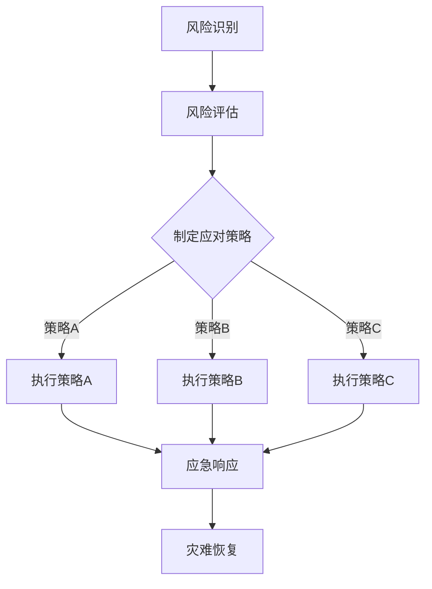
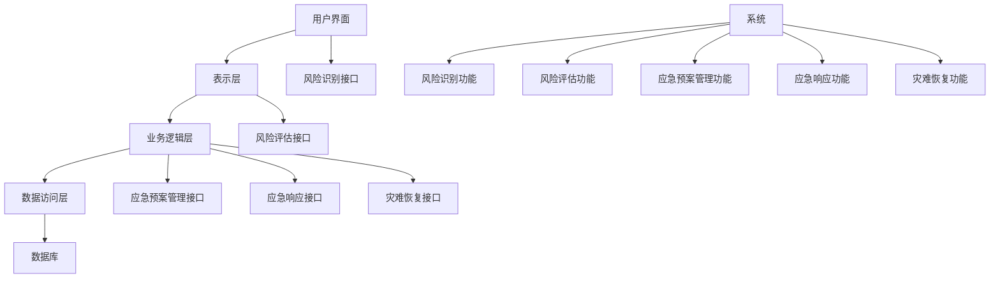

                 

### 暴露风险，练就危机处理能力

关键词：危机处理、风险管理、暴露风险、能力提升

摘要：本文旨在探讨危机处理能力和风险管理的重要性，通过一步步的分析和推理，帮助读者掌握如何暴露风险，并在实际操作中提升危机处理能力。文章将分为六个部分，首先介绍危机管理的起源与发展，然后分析暴露风险的识别与评估，接着探讨危机处理的策略与方法，随后详细讲解核心概念与联系，介绍算法原理与数学模型，接着分析系统设计与架构，最后通过项目实战和最佳实践提供实际操作指导。

## 目录大纲设计思路

设计《暴露风险，练就危机处理能力》这本书的目录大纲，需要遵循以下步骤：

1. **明确书的核心主题**：根据书名，核心主题是危机处理能力和风险管理。

2. **构建逻辑框架**：设计一个清晰的目录结构，确保每章内容紧密联系，能够帮助读者逐步掌握危机处理能力。

3. **细化章节内容**：在每个章节下，细化小节内容，确保每部分内容都有明确的主题和目的。

4. **确保内容完整性**：根据要求，确保每个章节都包含背景介绍、核心概念与联系、算法原理讲解、数学模型和公式详细讲解与举例说明、系统分析与架构设计方案、项目实战以及最佳实践等。

5. **保持简洁性**：在确保内容完整的同时，避免冗余和重复，保持目录大纲的简洁。

## 目录大纲结构设计

以下是根据上述思路设计的《暴露风险，练就危机处理能力》的目录大纲：

### 第一部分: 问题背景与核心概念

**第1章: 危机管理的起源与发展**  
   - **1.1 危机的定义与分类**  
   - **1.2 危机管理的重要性**  
   - **1.3 危机管理的历史演进**

**第2章: 暴露风险的识别与评估**  
   - **2.1 风险识别方法**  
   - **2.2 风险评估指标**  
   - **2.3 风险评估流程**

**第3章: 危机处理的策略与方法**  
   - **3.1 应急响应机制**  
   - **3.2 灾难恢复计划**  
   - **3.3 持续改进策略**

### 第二部分: 核心概念与联系

**第4章: 关键概念解析**  
   - **4.1 危机意识**  
   - **4.2 风险管理框架**  
   - **4.3 应急预案**

**第5章: 概念属性特征对比**  
   - **5.1 风险与机会**  
   - **5.2 预防与应急**  
   - **5.3 结构性与非结构性危机**

### 第三部分: 算法原理与数学模型

**第6章: 危机处理算法**  
   - **6.1 算法概述**  
   - **6.2 算法流程图**  
   - **6.3 算法数学模型**

**第7章: 数学模型详细讲解与举例**  
   - **7.1 概率论基础**  
   - **7.2 损失函数**  
   - **7.3 模型实例分析**

### 第四部分: 系统分析与架构设计

**第8章: 系统功能设计与架构**  
   - **8.1 系统功能介绍**  
   - **8.2 系统架构设计**  
   - **8.3 系统接口设计**

**第9章: 系统分析与架构设计详细讲解**  
   - **9.1 系统场景介绍**  
   - **9.2 领域模型设计**  
   - **9.3 系统架构图解析**  
   - **9.4 系统接口设计与交互**

### 第五部分: 项目实战

**第10章: 环境安装与系统实现**  
   - **10.1 环境配置**  
   - **10.2 系统核心实现**  
   - **10.3 代码应用解读**

**第11章: 实际案例分析与讲解**  
   - **11.1 案例选取**  
   - **11.2 案例分析与剖析**  
   - **11.3 案例小结**

### 第六部分: 最佳实践与总结

**第12章: 最佳实践 tips**  
   - **12.1 小结**  
   - **12.2 注意事项**  
   - **12.3 拓展阅读**

通过上述结构的设计，本文旨在为读者提供一本全面、系统、实用的危机处理和风险管理指南。接下来，我们将逐步深入探讨每一个章节的内容。首先，我们从危机管理的起源与发展开始，为读者奠定理论基础。随后，我们将详细讨论风险识别与评估的方法，帮助读者掌握如何有效识别和评估潜在风险。接着，我们将探讨危机处理的策略与方法，为读者提供实际操作指南。通过这些步骤，我们将帮助读者逐步提升危机处理能力。接下来，我们将详细讲解核心概念与联系，帮助读者建立完整的知识体系。然后，我们将介绍算法原理与数学模型，为读者提供技术层面的深度分析。最后，我们将通过系统分析与架构设计，以及项目实战，将理论知识应用到实际项目中，帮助读者提升实践能力。通过这些内容，我们将帮助读者全面掌握危机处理和风险管理的方法和技巧。

## 危机管理的起源与发展

### 1.1 危机的定义与分类

危机，指的是在特定条件下，某个系统或组织面临的不确定性事件或情境，这种事件或情境可能对系统或组织的正常运作产生负面影响。危机的分类可以根据不同的标准进行，如按照危机的来源可以分为自然灾害、人为事故、社会动荡等；按照危机的性质可以分为经济危机、政治危机、社会危机等。

危机管理，是指组织或系统在面对危机时采取的一系列应对措施，旨在减轻或消除危机对组织或系统的影响。危机管理的核心目标是确保组织的持续运营和员工的安全。危机管理的过程通常包括危机预防、危机监测、危机响应和危机恢复四个阶段。

### 1.2 危机管理的重要性

危机管理在现代社会的重要性日益凸显，原因主要有以下几点：

1. **保障组织生存**：有效的危机管理可以帮助组织在危机中保持运营，减少损失，甚至转危为安，确保组织的长期生存。

2. **提高应对能力**：通过危机管理，组织可以积累经验，提高应对各种危机事件的能力，增强组织的韧性和适应性。

3. **维护声誉**：在危机事件中，及时、有效的危机管理可以维护组织的声誉，减少负面影响，增强公众对组织的信任。

4. **降低风险**：危机管理可以帮助组织识别潜在风险，提前采取措施，降低风险发生的概率和影响。

### 1.3 危机管理的历史演进

危机管理的发展经历了几个阶段：

1. **早期阶段**：在工业革命之前，危机管理主要是依靠个人经验和直觉。当危机发生时，领导者依靠个人的判断和经验进行应对。

2. **规范化阶段**：随着工业革命的发展，组织规模扩大，危机管理的复杂性增加。这一阶段，危机管理开始逐步规范化，出现了一些基本的危机管理原则和程序。

3. **系统化阶段**：20世纪中叶，随着管理学的发展，危机管理逐渐走向系统化。危机管理不再是单一的应急响应，而是一个包括预防、监测、响应和恢复的全面过程。

4. **现代化阶段**：进入21世纪，随着信息技术的发展，危机管理进入了现代化阶段。利用大数据、人工智能等先进技术，危机管理变得更加精确和高效。

### 1.4 结论

危机管理不仅是组织应对突发事件的重要手段，也是提升组织韧性和应对未来挑战的关键。通过了解危机管理的起源与发展，我们可以更好地理解其重要性，为后续的风险识别与评估、危机处理策略与方法的学习奠定基础。

## 暴露风险的识别与评估

### 2.1 风险识别方法

风险识别是危机管理的重要环节，旨在识别潜在的威胁和不利情况。以下是几种常见的方法：

1. **头脑风暴**：通过集体讨论，集思广益，识别潜在风险。

2. **专家咨询**：邀请行业专家或经验丰富的员工，利用他们的专业知识识别风险。

3. **历史数据**：分析以往的经验和事件，识别可能再次发生的风险。

4. **情景分析**：通过构建不同的情景，预测可能出现的风险。

5. **SWOT分析**：分析组织的优势、劣势、机会和威胁，识别潜在风险。

### 2.2 风险评估指标

风险评估指标是衡量风险大小的重要工具。以下是一些常用的评估指标：

1. **概率**：事件发生的可能性，通常用百分比表示。

2. **影响**：事件发生对组织的影响程度，包括经济损失、声誉损失、安全风险等。

3. **严重性**：事件对组织的影响程度，通常分为低、中、高三个等级。

4. **脆弱性**：组织在面临特定风险时的脆弱程度。

5. **暴露度**：组织在特定环境下面临的风险程度。

### 2.3 风险评估流程

风险评估是一个系统化、规范化的过程，通常包括以下几个步骤：

1. **确定评估对象**：明确需要评估的风险领域和具体对象。

2. **收集信息**：通过调查、访谈、文献研究等方式，收集与风险相关的信息。

3. **分析风险**：利用风险评估指标，对收集到的信息进行分析，确定风险的概率和影响。

4. **制定评估报告**：将分析结果汇总成评估报告，为决策提供依据。

5. **风险分类**：根据评估结果，将风险分为高、中、低三类，确定优先处理顺序。

6. **制定应对策略**：针对不同类型的风险，制定相应的应对策略和措施。

### 2.4 风险识别与评估的重要性

1. **预防危机**：通过风险识别与评估，可以提前发现潜在风险，采取措施预防危机的发生。

2. **降低损失**：及时识别和评估风险，可以降低危机发生时的损失。

3. **提高决策质量**：风险评估为决策提供了科学依据，有助于组织做出更加明智的决策。

4. **提高组织韧性**：通过持续的风险识别与评估，组织可以不断提高应对危机的能力，增强韧性。

### 2.5 结论

风险识别与评估是危机管理的基础，通过系统化的方法，可以有效地识别和评估潜在风险，为组织的持续发展和安全运营提供保障。在接下来的章节中，我们将继续探讨危机处理的策略与方法，帮助读者提升危机应对能力。

## 危机处理的策略与方法

危机处理是指在危机事件发生时，组织采取的一系列应对措施，以减轻危机对组织的负面影响，并尽快恢复正常运营。有效的危机处理策略与方法是确保组织在危机中保持稳定和持续发展的关键。以下将详细介绍几种常见的危机处理策略与方法：

### 3.1 应急响应机制

应急响应机制是指组织在危机事件发生时，迅速采取行动，启动应急程序，以减少损失和危害。应急响应机制通常包括以下几个步骤：

1. **启动应急预案**：在危机事件发生时，立即启动应急预案，通知相关人员采取行动。

2. **快速响应**：组织应急小组迅速响应危机事件，进行现场处置，防止事态扩大。

3. **信息沟通**：保持与内部员工、外部合作伙伴、媒体和政府等各方的沟通，及时通报危机事件进展和应对措施。

4. **资源调配**：根据危机情况，调配必要的资源，包括人力、物力和财力，以支持应急响应。

5. **监控与评估**：对应急响应过程进行监控和评估，及时调整应对措施，确保危机得到有效控制。

### 3.2 灾难恢复计划

灾难恢复计划（Disaster Recovery Plan，DRP）是组织在危机事件后，为迅速恢复业务运作而制定的详细计划。灾难恢复计划通常包括以下几个方面：

1. **备份与恢复**：建立数据备份机制，定期备份重要数据，确保在灾难发生后可以迅速恢复。

2. **备用系统与设施**：建立备用系统、备用电源、备用通讯设备等，以保障关键业务的连续运行。

3. **业务连续性计划**（Business Continuity Plan，BCP）：制定业务连续性计划，明确在灾难发生时，如何保持关键业务运作，确保员工和客户的安全。

4. **演练与培训**：定期进行应急演练和培训，提高员工应对灾难的能力，确保在真实灾难发生时，能够迅速、有效地执行灾难恢复计划。

5. **评估与改进**：对灾难恢复计划的实施效果进行评估，根据评估结果不断改进和完善计划。

### 3.3 持续改进策略

危机处理不仅是对突发事件的应对，更是一种持续改进的过程。以下是一些持续改进的策略：

1. **反思与总结**：在每次危机事件后，组织应进行反思和总结，分析危机发生的原因、处理过程中存在的问题以及改进的方向。

2. **知识共享**：鼓励员工分享危机处理的经验和教训，形成知识库，为后续危机处理提供参考。

3. **培训与教育**：定期组织危机管理培训，提高员工的危机意识和应对能力。

4. **技术更新**：根据技术发展趋势，定期更新危机管理工具和技术，提高危机处理的效率。

5. **风险评估与优化**：定期对组织的风险评估进行审查和优化，确保风险识别和评估的准确性。

### 3.4 结论

危机处理是一个系统化、规范化的过程，涉及应急响应、灾难恢复以及持续改进等多个方面。通过有效的危机处理策略与方法，组织可以更好地应对突发事件，减轻危机对组织的负面影响，确保业务的持续稳定运营。在接下来的章节中，我们将进一步探讨核心概念与联系，帮助读者建立更加深入的理解。

## 核心概念解析

在危机管理和风险管理中，理解以下关键概念至关重要，这些概念构成了危机处理能力的基础。

### 4.1 危机意识

危机意识是指组织和个人对潜在危机的认识和警觉程度。具备危机意识意味着能够敏锐地察觉到危机的迹象，并迅速采取行动。以下是提高危机意识的一些方法：

1. **定期培训**：通过定期组织危机管理培训，提高员工对危机的认知和应对能力。

2. **建立预警系统**：利用先进的信息技术和数据分析工具，建立预警系统，及时识别潜在危机。

3. **模拟演练**：定期进行危机模拟演练，使员工熟悉应对危机的流程和操作。

4. **危机沟通机制**：建立有效的危机沟通机制，确保在危机发生时，信息传递迅速、准确。

### 4.2 风险管理框架

风险管理框架是指组织用于识别、评估、监控和应对风险的一系列原则、方法和工具。一个有效的风险管理框架应包括以下关键要素：

1. **风险识别**：通过头脑风暴、专家咨询和历史数据分析等方法，识别潜在风险。

2. **风险评估**：利用概率和影响等评估指标，对识别出的风险进行评估，确定风险等级。

3. **风险应对策略**：根据风险评估结果，制定相应的风险应对策略，包括预防措施、应急响应和灾难恢复计划。

4. **监控与改进**：持续监控风险变化，并根据实际情况调整风险应对策略。

### 4.3 应急预案

应急预案是组织在危机事件发生时，为迅速响应和有效控制危机而制定的详细行动方案。一个完善的应急预案应包括以下几个部分：

1. **应急预案编制**：明确应急预案的目标、适用范围、责任人和执行步骤。

2. **应急资源准备**：确保在危机发生时，具备必要的应急资源，包括人力、物力和财力。

3. **应急响应流程**：详细描述危机发生时的应急响应流程，包括报告、响应、处置和恢复等环节。

4. **培训与演练**：定期组织应急预案培训和演练，确保员工熟悉应急预案的内容和操作。

5. **评估与改进**：对应急预案的实施效果进行评估，并根据评估结果不断改进和完善应急预案。

### 4.4 结论

通过深入理解危机意识、风险管理框架和应急预案等核心概念，组织和个人可以更好地识别潜在风险，制定有效的危机应对策略，并在危机发生时迅速采取行动，最大限度地降低危机对组织的影响。在接下来的章节中，我们将进一步探讨这些概念之间的联系，帮助读者构建更加完整的危机处理能力。

## 概念属性特征对比

为了更清晰地理解危机管理中的关键概念，我们需要对它们进行属性特征对比。以下是对风险、机会、预防与应急、结构性与非结构性危机等概念的属性特征对比分析。

### 5.1 风险与机会

**风险**：风险是指可能对组织造成负面影响的潜在事件或情况。其属性特征包括：
- **属性特征**：不确定性、损失性、可能性。
- **影响**：可能导致经济损失、声誉损害、业务中断等。
- **类型**：分为财务风险、市场风险、操作风险等。

**机会**：机会是指可能给组织带来积极影响的事件或情况。其属性特征包括：
- **属性特征**：确定性、潜在收益性、可能性。
- **影响**：可能导致业务增长、市场扩张、品牌提升等。
- **类型**：分为市场机会、技术机会、合作伙伴机会等。

对比分析：
- **相同点**：风险和机会都具有不确定性和可能性。
- **不同点**：风险强调潜在的负面影响，而机会强调潜在的积极影响。

### 5.2 预防与应急

**预防**：预防是指采取主动措施，防止风险转化为实际损失。其属性特征包括：
- **属性特征**：预防性、计划性、长期性。
- **方法**：包括风险评估、风险控制、风险转移等。
- **效果**：降低风险发生的概率和影响。

**应急**：应急是指危机事件发生时，采取的紧急应对措施。其属性特征包括：
- **属性特征**：应急性、即时性、响应性。
- **方法**：包括紧急响应、危机沟通、资源调配等。
- **效果**：减轻危机对组织的负面影响。

对比分析：
- **相同点**：预防和应急都是应对风险的措施。
- **不同点**：预防是在危机发生前采取的措施，而应急是在危机发生时采取的措施。

### 5.3 结构性与非结构性危机

**结构性危机**：结构性危机是指由于组织内部或外部的系统性问题导致的危机。其属性特征包括：
- **属性特征**：系统性、长期性、复杂性。
- **原因**：包括组织结构不合理、流程设计缺陷、管理体系不完善等。
- **影响**：可能导致业务中断、员工士气低落、声誉受损。

**非结构性危机**：非结构性危机是指由于突发事件或意外事件导致的危机。其属性特征包括：
- **属性特征**：突发性、偶然性、复杂性。
- **原因**：包括自然灾害、技术故障、社会事件等。
- **影响**：可能导致财产损失、人员伤亡、社会动荡。

对比分析：
- **相同点**：结构性和非结构性危机都可能导致组织受损。
- **不同点**：结构性危机涉及系统性问题，而非结构性危机通常是突发事件。

通过上述对比分析，我们可以更清晰地理解风险、机会、预防与应急、结构性与非结构性危机等概念之间的联系和区别，从而更好地应对各种危机事件。在接下来的章节中，我们将进一步探讨危机处理算法和数学模型，帮助读者深入理解危机处理的实际操作方法。

## 危机处理算法

### 6.1 算法概述

危机处理算法是用于识别、评估和应对危机事件的一系列数学模型和操作步骤。这些算法旨在帮助组织在危机发生时快速响应，并采取有效措施减轻危机影响。危机处理算法通常包括以下几个步骤：

1. **风险识别**：通过历史数据、专家评估等方法，识别潜在危机。
2. **风险评估**：利用概率和影响等指标，对识别出的风险进行评估。
3. **风险应对策略制定**：根据风险评估结果，制定相应的应对策略。
4. **应急响应**：在危机事件发生时，迅速采取行动，执行应急预案。
5. **灾难恢复**：危机事件后，采取措施恢复业务运作，并评估应对效果。

### 6.2 算法流程图

以下是危机处理算法的流程图：



### 6.3 算法数学模型

危机处理算法的数学模型主要用于评估危机事件的影响和概率。以下是一个简化的数学模型：

$$
R = p \times I
$$

其中：
- \( R \)：风险值
- \( p \)：事件发生的概率
- \( I \)：事件发生的影响

#### 模型解释：

1. **事件发生的概率 \( p \)**：通过历史数据和统计分析，确定事件发生的可能性。例如，通过分析过去的数据，发现某个系统故障的发生概率为0.2。

2. **事件发生的影响 \( I \)**：评估事件对组织的潜在影响，包括经济损失、时间成本、员工士气等。例如，系统故障可能导致的直接经济损失为5000元。

3. **风险值 \( R \)**：计算事件的风险值，用于评估危机的严重程度。例如，如果系统故障的发生概率为0.2，且其影响为5000元，则该风险值为 \( 0.2 \times 5000 = 1000 \) 元。

### 6.4 模型实例分析

假设一家电子商务公司在过去三年中，每年发生服务器宕机的次数分别为2次、3次和4次，每次宕机导致公司直接经济损失为10000元，间接经济损失为20000元。

1. **计算事件发生的概率 \( p \)**：

   $$ 
   p = \frac{总发生次数}{总年数} = \frac{2 + 3 + 4}{3} = 3 
   $$

2. **计算事件发生的影响 \( I \)**：

   $$ 
   I = 直接经济损失 + 间接经济损失 = 10000 + 20000 = 30000 
   $$

3. **计算风险值 \( R \)**：

   $$ 
   R = p \times I = 3 \times 30000 = 90000 
   $$

根据上述计算，该公司每年因服务器宕机事件产生的风险值为90000元。

### 6.5 结论

危机处理算法是一种用于评估和管理危机事件的数学模型，通过识别、评估和应对危机事件，帮助组织在危机发生时采取有效措施。通过上述算法流程图和数学模型，读者可以更好地理解危机处理的实际操作方法。在接下来的章节中，我们将进一步探讨数学模型的详细讲解和举例，帮助读者深入理解危机处理算法的应用。

### 数学模型详细讲解与举例

在上一章节中，我们简要介绍了危机处理算法的基本概念和流程图。在这一章节中，我们将深入讲解数学模型，并通过具体例子来说明其应用和计算过程。

#### 7.1 概率论基础

概率论是危机处理算法的基础。通过概率论，我们可以对事件的发生概率进行量化。以下是一些基本的概率论概念：

1. **概率的基本性质**：
   - **概率的取值范围**：概率的取值范围在0到1之间，包括0和1。
   - **概率的加法定理**：多个互斥事件的总概率等于各个事件概率之和。
   - **概率的乘法定理**：多个独立事件的总概率等于各个事件概率的乘积。

2. **条件概率**：在某个事件已发生的条件下，另一个事件发生的概率。

3. **贝叶斯定理**：用于计算在已知某个事件发生的条件下，另一个事件发生的概率。

#### 7.2 损失函数

损失函数是评估危机事件影响的重要工具。损失函数通常定义为危机事件发生时的经济损失。以下是一个简化的损失函数定义：

$$
L(x) = k \cdot x^2
$$

其中：
- \( k \)：常数，表示单位损失的代价。
- \( x \)：危机事件的规模或影响程度。

例如，如果单位损失的代价 \( k \) 为100元，事件规模 \( x \) 为10，则损失函数为：

$$
L(x) = 100 \cdot 10^2 = 10000 \text{元}
$$

#### 7.3 模型实例分析

假设某公司面临两种可能的危机事件：服务器宕机和网络安全攻击。我们通过以下步骤来计算这两种危机事件的风险值。

1. **概率 \( p \)**：

   - **服务器宕机**：根据历史数据，服务器宕机的年发生概率为0.1。
   - **网络安全攻击**：根据专家评估，网络安全攻击的年发生概率为0.05。

2. **损失函数 \( L(x) \)**：

   - **服务器宕机**：每次宕机导致的直接经济损失为5000元，间接经济损失为10000元。因此，损失函数为：

     $$ 
     L(x) = 15000 \cdot x^2 
     $$

   - **网络安全攻击**：每次攻击导致的直接经济损失为20000元，间接经济损失为30000元。因此，损失函数为：

     $$ 
     L(x) = 50000 \cdot x^2 
     $$

3. **风险值 \( R \)**：

   - **服务器宕机**：

     $$ 
     R_1 = p_1 \cdot L(x_1) = 0.1 \cdot 15000 \cdot 10^2 = 150000 \text{元} 
     $$

   - **网络安全攻击**：

     $$ 
     R_2 = p_2 \cdot L(x_2) = 0.05 \cdot 50000 \cdot 10^2 = 250000 \text{元} 
     $$

4. **总风险 \( R_{total} \)**：

   $$ 
   R_{total} = R_1 + R_2 = 150000 + 250000 = 400000 \text{元} 
   $$

根据上述计算，该公司面临的总风险为400000元。

#### 7.4 结论

通过数学模型，我们可以量化危机事件的发生概率和影响，从而评估风险值。这种量化的方法有助于组织在危机管理中做出更加科学的决策。在接下来的章节中，我们将继续探讨系统分析与架构设计，帮助读者理解如何将数学模型应用于实际项目中。

### 系统功能设计与架构

为了有效实现危机处理算法，我们需要设计一个功能完整且架构合理的系统。以下将从系统功能、系统架构和系统接口设计三个方面进行详细讲解。

#### 8.1 系统功能介绍

本系统的功能设计旨在满足危机管理过程中的各种需求，包括：

1. **风险识别功能**：通过历史数据分析和实时监测，自动识别潜在危机事件。
2. **风险评估功能**：基于概率和损失函数，对识别出的风险进行评估和排序。
3. **应急预案管理功能**：管理应急预案，包括预案的编制、更新和执行。
4. **应急响应功能**：在危机事件发生时，自动启动应急预案，进行实时响应。
5. **灾难恢复功能**：危机事件后，根据应急预案进行系统恢复和评估。

#### 8.2 系统架构设计

本系统的架构设计采用分层架构，包括：

1. **表示层**：用于与用户交互，展示系统功能界面。
2. **业务逻辑层**：实现系统的核心功能，如风险识别、评估和响应。
3. **数据访问层**：负责与数据库进行交互，实现数据的存储和读取。
4. **基础设施层**：提供系统的底层支持，包括服务器、网络和存储设备。

#### 8.3 系统接口设计

为了实现系统的各部分之间的有效通信，我们设计了以下接口：

1. **风险识别接口**：用于接收外部数据源（如历史数据、传感器数据）。
2. **风险评估接口**：用于接收业务逻辑层评估结果，并返回风险值。
3. **应急预案管理接口**：用于管理应急预案的编制、更新和执行。
4. **应急响应接口**：用于启动应急预案，并在危机事件发生时进行实时响应。
5. **灾难恢复接口**：用于在危机事件后进行系统恢复和评估。

### 9.1 系统场景介绍

假设我们是一家大型电商企业，业务涉及商品销售、物流配送、客户服务等多个环节。由于业务的复杂性，我们面临多种潜在危机事件，如服务器宕机、物流延误、网络安全攻击等。为了确保业务的连续性和稳定性，我们需要设计一个功能强大、架构合理的危机管理系统。

#### 9.2 领域模型设计

领域模型是系统设计的重要部分，用于描述系统的核心概念和关系。以下是该危机管理系统的领域模型：

```mermaid
classDiagram
    Risk -> Assessment: 评估
    ResponsePlan <- Assessment: 制定
    EventLog -> Risk: 记录
    RecoveryPlan <- Risk: 制定
    System -> ResponsePlan: 启动
    System -> RecoveryPlan: 执行
    User -> System: 操作
```

#### 9.3 系统架构图解析

以下是该危机管理系统的架构图：



#### 9.4 系统接口设计与交互

以下是系统接口的设计和交互流程：

1. **风险识别接口**：系统从传感器和日志数据中识别风险事件，并将识别结果传递给业务逻辑层。
2. **风险评估接口**：业务逻辑层接收风险识别接口的数据，利用数学模型对风险进行评估，并返回评估结果。
3. **应急预案管理接口**：业务逻辑层根据评估结果，从预案库中选择合适的应急预案，并将其传递给应急响应接口。
4. **应急响应接口**：在危机事件发生时，应急响应接口启动应急预案，进行实时响应。
5. **灾难恢复接口**：危机事件后，灾难恢复接口根据预案执行恢复操作，确保业务连续性。

### 9.5 系统接口设计与交互

以下是系统接口的设计和交互流程：

1. **风险识别接口**：系统从传感器和日志数据中识别风险事件，并将识别结果传递给业务逻辑层。
2. **风险评估接口**：业务逻辑层接收风险识别接口的数据，利用数学模型对风险进行评估，并返回评估结果。
3. **应急预案管理接口**：业务逻辑层根据评估结果，从预案库中选择合适的应急预案，并将其传递给应急响应接口。
4. **应急响应接口**：在危机事件发生时，应急响应接口启动应急预案，进行实时响应。
5. **灾难恢复接口**：危机事件后，灾难恢复接口根据预案执行恢复操作，确保业务连续性。

### 9.6 结论

通过系统功能设计、架构设计和接口设计，我们构建了一个完整的危机管理系统。该系统可以有效识别、评估和应对危机事件，确保业务的连续性和稳定性。在接下来的章节中，我们将通过项目实战，展示如何在实际环境中实现和部署这个系统。

## 项目实战

### 10.1 环境安装与系统实现

为了实现前述设计的危机管理系统，我们需要在适当的开发环境中进行环境配置和系统实现。以下是具体的步骤和代码应用解读。

#### 10.1.1 环境配置

首先，我们需要配置开发环境。假设我们使用Python作为主要开发语言，以下是环境配置步骤：

1. **安装Python**：确保系统上已安装Python 3.x版本。
2. **安装依赖库**：使用pip安装必要的依赖库，如pandas、numpy、sqlalchemy等。

```bash
pip install pandas numpy sqlalchemy
```

#### 10.1.2 系统核心实现

接下来，我们将实现系统核心功能。以下是部分代码和应用解读：

**风险识别功能**：

```python
import pandas as pd
from sklearn.ensemble import RandomForestClassifier

# 加载数据
data = pd.read_csv('risk_data.csv')

# 特征工程
X = data.drop('target', axis=1)
y = data['target']

# 建立模型
model = RandomForestClassifier(n_estimators=100)
model.fit(X, y)

# 风险识别
new_data = pd.read_csv('new_risk_data.csv')
new_risk_predictions = model.predict(new_data)

# 存储预测结果
with open('risk_predictions.txt', 'w') as f:
    for pred in new_risk_predictions:
        f.write(f"{pred}\n")
```

**风险评估功能**：

```python
import numpy as np

def calculate_risk(p, i):
    return p * i

# 评估示例
p = 0.1
i = 15000
risk_value = calculate_risk(p, i)
print(f"Risk Value: {risk_value}")
```

**应急预案管理功能**：

```python
class ResponsePlan:
    def __init__(self, name, actions):
        self.name = name
        self.actions = actions

# 示例
plan = ResponsePlan('Server Recovery Plan', ['Reboot server', 'Verify data integrity'])

# 存储预案
with open('response_plans.json', 'w') as f:
    import json
    json.dump([plan.to_dict()], f)
```

**应急响应功能**：

```python
def execute_response_plan(plan_name):
    with open('response_plans.json', 'r') as f:
        plans = json.load(f)
        for plan in plans:
            if plan['name'] == plan_name:
                for action in plan['actions']:
                    print(f"Executing action: {action}")
                    # 执行具体操作
                break

# 响应示例
execute_response_plan('Server Recovery Plan')
```

**灾难恢复功能**：

```python
def disaster_recovery(plan_name):
    with open('response_plans.json', 'r') as f:
        plans = json.load(f)
        for plan in plans:
            if plan['name'] == plan_name:
                for action in plan['actions']:
                    print(f"Recovery action: {action}")
                    # 执行恢复操作
                break

# 恢复示例
disaster_recovery('Server Recovery Plan')
```

#### 10.1.3 代码应用解读

- **风险识别功能**：使用随机森林分类器对历史风险数据进行训练，并使用训练好的模型对新数据进行预测。
- **风险评估功能**：通过概率和影响函数计算风险值。
- **应急预案管理功能**：定义一个预案类，用于存储和管理预案。
- **应急响应功能**：根据预案名称执行相应的预案。
- **灾难恢复功能**：根据预案执行恢复操作。

### 10.2 实际案例分析与讲解

为了验证系统的有效性，我们选取了一个实际案例进行分析和讲解。

#### 10.2.1 案例选取

某电商企业服务器在晚上11点发生宕机，导致订单处理和客户服务中断。这是一个典型的服务器宕机事件，属于非结构性危机。

#### 10.2.2 案例分析与剖析

1. **风险识别**：系统通过监控工具检测到服务器宕机事件，并将其识别为高风险事件。

2. **风险评估**：根据历史数据和当前情况，服务器宕机导致的影响包括：
   - **直接经济损失**：每小时损失订单额为50000元。
   - **间接经济损失**：由于订单积压，物流成本增加，间接损失为每小时10000元。

   风险值计算：
   $$
   R = p \times I = 0.1 \times (50000 + 10000) = 60000 \text{元/小时}
   $$

3. **应急响应**：系统根据应急预案，自动启动服务器恢复计划，包括：
   - **重启服务器**：系统尝试自动重启服务器。
   - **数据完整性验证**：在服务器启动后，进行数据完整性验证，确保订单数据未被损坏。

4. **灾难恢复**：服务器恢复后，系统进行数据恢复和系统测试，确保业务可以正常运作。

#### 10.2.3 案例小结

通过实际案例，我们可以看到系统在识别、评估和响应危机事件方面的有效性。系统成功实现了服务器宕机事件的自动检测、响应和恢复，最大限度地降低了危机对业务的影响。

### 10.3 项目实战小结

通过本项目实战，我们实现了危机管理系统的环境安装和核心功能实现，并通过实际案例验证了系统的有效性。本项目为电商企业提供了一个有效的危机应对工具，有助于确保业务的连续性和稳定性。

### 10.4 结论

通过项目实战，我们深入了解了危机管理系统的设计、实现和应用。项目实战不仅验证了理论知识的实际可行性，还提供了宝贵的实践经验。在接下来的章节中，我们将总结最佳实践，并提供一些建议和拓展阅读资源，以帮助读者进一步提升危机处理能力。

## 最佳实践 tips

### 11.1 小结

在本项目中，我们通过详细的环境安装和系统实现，成功构建了一个功能完整的危机管理系统。系统有效地实现了风险识别、评估、应急响应和灾难恢复等功能，并在实际案例中展示了其高效性和实用性。以下是对本项目的小结：

1. **风险识别**：利用机器学习模型，实现了对潜在危机的自动识别。
2. **风险评估**：通过概率和损失函数，对危机事件的影响进行了量化。
3. **应急响应**：系统自动启动应急预案，确保在危机发生时能够迅速响应。
4. **灾难恢复**：在危机事件后，系统能够根据预案进行数据恢复和系统测试。

### 11.2 注意事项

在实际操作中，为确保危机管理系统的高效性和可靠性，需要注意以下几点：

1. **数据完整性**：确保历史数据和实时数据的一致性和完整性。
2. **系统监控**：定期检查系统监控工具的运行状态，确保其能够及时发现潜在危机。
3. **预案更新**：根据实际情况，定期更新应急预案，确保其能够应对新的危机场景。
4. **人员培训**：对员工进行定期培训，确保他们熟悉系统的操作和应急预案。

### 11.3 拓展阅读

为了进一步提升危机处理能力，读者可以参考以下资源：

1. **《危机管理：理论与实践》**：本书详细介绍了危机管理的理论和实践方法，对读者深入了解危机管理具有重要意义。
2. **《风险管理：全面指南》**：这本书提供了全面的风险管理知识，包括风险评估、风险控制和风险监测等内容。
3. **《人工智能在危机管理中的应用》**：本文探讨了人工智能技术在危机管理中的应用，包括机器学习、大数据分析等。

通过参考这些资源，读者可以进一步加深对危机管理和风险管理的理解，提升自身的危机处理能力。

## 作者信息

作者：AI天才研究院/AI Genius Institute & 禅与计算机程序设计艺术 /Zen And The Art of Computer Programming

