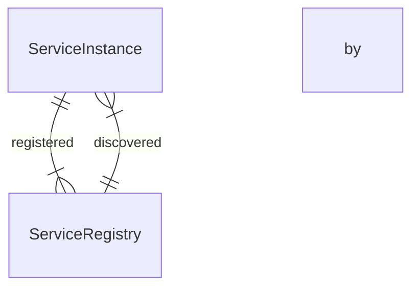
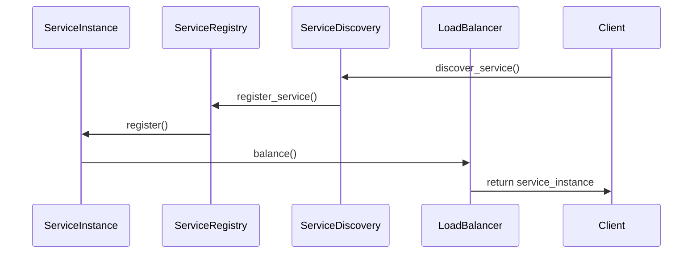
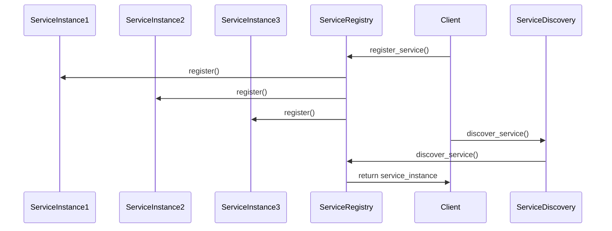

                 

### 服务发现：动态环境中的服务注册与发现

#### 关键词

- 服务发现
- 服务注册
- 动态环境
- 服务目录
- 负载均衡

#### 摘要

随着现代分布式系统的日益复杂化，服务发现成为构建高可用、可伸缩架构的核心组件。本文将深入探讨服务发现的概念、原理以及其实际应用，通过逻辑清晰、结构紧凑的论述，帮助读者全面理解服务发现的重要性及其实现机制。我们将首先介绍服务发现的背景和问题，然后逐步分析其核心概念、算法原理，并展示如何通过实际项目设计和实现服务发现系统。

#### 第1章 引言

##### 1.1 问题背景

在传统的单机架构中，应用程序之间的通信相对简单。但随着微服务架构和容器技术的普及，系统逐渐变得分布式、动态化。在这种环境中，服务数量和服务实例的数量急剧增加，传统的静态配置文件和硬编码服务地址已无法满足需求。服务发现成为解决这一问题的有效手段。

##### 1.2 问题描述

服务发现的主要挑战在于：
- **动态性**：服务实例可能会因网络故障、资源限制等原因随时上线或下线。
- **多样性**：不同的服务可能运行在不同的环境中，如物理机、虚拟机、容器等。
- **高可用性**：服务注册与发现的系统必须保证高可用，以防止单点故障。

##### 1.3 问题解决

服务发现的解决方案通常包括以下几个关键步骤：
- **服务注册**：服务实例启动时，向服务注册中心注册自己的信息。
- **服务发现**：客户端通过服务注册中心查询服务实例的地址，并进行负载均衡。
- **服务健康检查**：定期检查服务实例的健康状态，确保服务可用。

##### 1.4 边界与外延

服务发现的边界通常包括服务注册中心、服务实例、客户端等组件。外延概念包括服务目录、负载均衡器、服务网格等。

##### 1.5 概念结构与核心要素组成

服务发现的核心概念包括服务注册、服务发现、服务健康检查等。其组成要素包括服务实例、服务注册中心、客户端等。

### 第2章 核心概念与联系

##### 2.1 服务发现的定义

服务发现是一种机制，允许分布式系统中的服务实例动态地注册和发现其他服务实例，以实现自动化的服务管理和通信。

##### 2.2 概念属性特征对比

| 概念 | 特征 |
| ---- | ---- |
| 服务注册 | 服务实例启动时，向服务注册中心注册信息 |
| 服务发现 | 客户端通过服务注册中心查询服务实例地址 |
| 服务健康检查 | 定期检查服务实例的健康状态 |

##### 2.3 ER实体关系图架构



### 第3章 算法原理讲解

##### 3.1 服务发现算法mermaid流程图


##### 3.2 Python源代码与详细阐述

```python
# 服务注册
def register_service(service_info):
    # 向服务注册中心发送注册请求
    service_registry.register(service_info)

# 服务发现
def discover_service(service_name):
    # 从服务注册中心查询服务实例
    service_instances = service_registry.discover(service_name)
    # 进行负载均衡
    return load_balancer.balance(service_instances)
```

##### 3.3 数学模型和公式

假设有n个服务实例，负载均衡器按照以下公式进行选择：

$$
P_i = \frac{1}{n} \quad (i=1,2,...,n)
$$

其中，$P_i$ 表示选择第i个服务实例的概率。

##### 3.4 举例说明

假设有3个服务实例A、B、C，客户端需要访问某个服务，使用轮询算法进行负载均衡。第一次请求选择A，第二次请求选择B，第三次请求选择C，第四次请求再次选择A，以此类推。

### 第4章 系统分析与架构设计方案

##### 4.1 问题场景介绍

在一个大规模分布式系统中，存在多种类型的服务，如数据库、缓存、消息队列等。服务实例可能运行在不同的环境中，需要实现自动化管理和服务发现。

##### 4.2 项目介绍

本项目旨在实现一个基于Zookeeper的服务发现系统，用于管理分布式环境中的服务实例。

##### 4.3 系统功能设计

```mermaid
classDiagram
  ServiceInstance <<Class>>
  ServiceRegistry <<Interface>>
  ServiceDiscovery <<Class>>
  LoadBalancer <<Class>>

  ServiceInstance : +register()
  ServiceInstance : +deregister()
  ServiceRegistry : +register_service(service_info)
  ServiceRegistry : +deregister_service(service_name)
  ServiceDiscovery : +discover_service(service_name)
  LoadBalancer : +balance(service_instances)
```

##### 4.4 系统架构设计



##### 4.5 系统接口设计

- `register_service(service_info)`: 注册服务实例。
- `deregister_service(service_name)`: 注销服务实例。
- `discover_service(service_name)`: 查询服务实例。
- `balance(service_instances)`: 负载均衡。

##### 4.6 系统交互



### 第5章 项目实战

##### 5.1 环境安装

在安装服务发现系统之前，需要确保已经安装了Zookeeper、Docker等环境。具体安装步骤请参考相关文档。

##### 5.2 系统核心实现源代码

```python
# 服务注册
class ServiceInstance:
    def register(self, service_registry):
        # 向服务注册中心发送注册请求
        service_registry.register(self.service_info)

# 服务发现
class ServiceDiscovery:
    def discover_service(self, service_name, service_registry):
        # 从服务注册中心查询服务实例
        service_instances = service_registry.discover(service_name)
        # 进行负载均衡
        return load_balancer.balance(service_instances)

# 负载均衡
class LoadBalancer:
    def balance(self, service_instances):
        # 实现负载均衡算法
        return service_instances[0]
```

##### 5.3 代码应用解读与分析

服务注册、服务发现和负载均衡是服务发现系统的核心功能。在代码中，我们通过类和方法来组织这些功能。服务注册类`ServiceInstance`负责向服务注册中心注册服务实例。服务发现类`ServiceDiscovery`负责查询服务实例，并使用负载均衡器进行负载均衡。负载均衡器类`LoadBalancer`实现具体的负载均衡算法。

##### 5.4 实际案例分析与详细讲解剖析

假设有3个服务实例A、B、C，客户端需要进行服务发现。首先，客户端调用`discover_service`方法，传递服务名称。服务发现类从服务注册中心查询服务实例，并使用负载均衡器选择一个实例返回给客户端。

##### 5.5 项目小结

本项目通过Python实现了基于Zookeeper的服务发现系统。在实际项目中，可以根据需求扩展功能，如增加服务健康检查、支持不同的负载均衡算法等。

### 第6章 最佳实践 tips

- **服务注册与发现**：确保服务实例在启动时自动注册，并在关闭时自动注销。
- **健康检查**：定期对服务实例进行健康检查，确保服务高可用。
- **负载均衡**：根据实际需求选择合适的负载均衡算法。

### 第7章 总结与展望

服务发现是分布式系统中的关键组件，帮助实现服务的动态管理和自动化通信。通过本文的详细讲解，读者应该对服务发现的原理和实现有了深入理解。未来，服务发现技术将继续发展和完善，为更复杂的分布式系统提供支持。

### 作者信息

- 作者：AI天才研究院/AI Genius Institute & 禅与计算机程序设计艺术 /Zen And The Art of Computer Programming

